# 红帽RHCE8红帽认证RH124认证课程【全】 - P9：03-1-文件系统介绍2-导航路径--cd---pwd--ls--touch - 北京东方瑞通 - BV1KM4y1M71q

同学们好，欢迎来到我音职场HC18课堂，我是马老师。上一讲呢我们给大家讲了一下呃，文件系统的层次结构。那么这节课呢我们再来给大家看一看。那么这个文件系统呢，我们到底怎么去访问呢？啊，这里边有几个细节。

我们先说一下啊。首先呢那么文件系统里面结构我们要知道文件名怎么表示，对不对啊，这里面就涉及到两个路径，叫绝对路径和相对路径，好吧。那么还会用到几个命令，我们来看一下第一个。

CD命令PW命和LS这其实这个不能说这个一个命令啊，应该说这三个命令它都是联合起来用，他们经常会一起用。

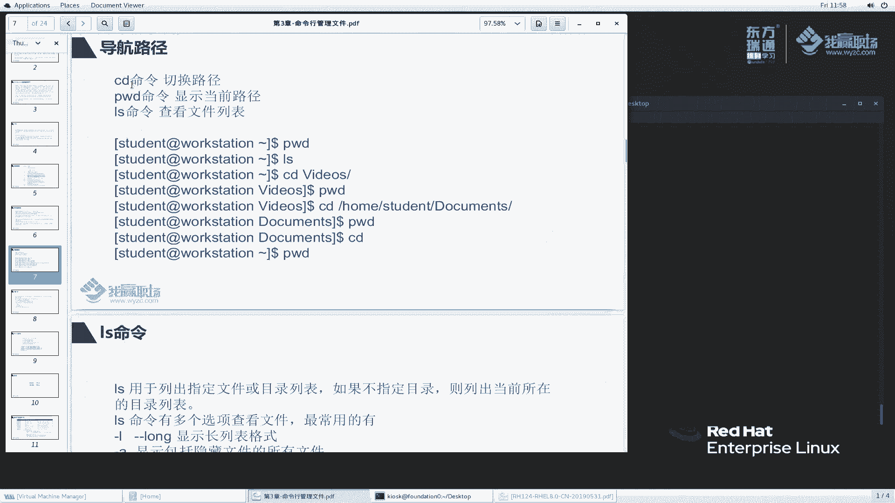

那看一看啊，那么我们还是。根据我们这个事例里面来，student at worktation。登录上来之后呢。大家我们首先敲一个命令叫什么呢？PWD。PWD是用于显示当前路径的。

之前呢我也给大家演示过啊，LS呢是显示当前列表的那CD是干什么的呢？CAD是用于切换路径的啊。那么CD刚刚还要我看一下。往上翻。翻到什么呢？翻到这个位置，说是更改shall的工作目录啊。

我们当前敲个PWD显示我当前。那我CD呢是当PW显示的当前的工作目录啊，工 work director是吧？work director pass work director啊，CD呢是用于更改这个路径。

你想想啊，我现在LS是看到这么一些东西。那么。我如果说我想我想怎么办呢？我想看一下我桌面上有什么东西，那我可以这样执行LSdestop去执行。那当然下面没有什么东西是吧？嗯，我们再看一下有没有什么东西。

LS document里面东西吧。doment也没有，对不对？那么。好像都没有是吧，LSEC吧。😊，好，ATC下面东西很多。那我能不能说CDETC里面去，然后再来敲LS呢？哎，好像也是是吧。

大家来看一下，我刚刚执行了一个。CD啊CD执行过之后，敲了L大家此时来看一下我的路径，当前的工作路径就变成了ETC了。啊，ATTC了啊。那么这个CD我们敲的时候非常有意思。啊。

例如说我现在我只大家看一下，我当前的路径是ETC。如果说我只调CD什么都不加的话，那么看一下是什么效果。他好像路径也发生了变化。变成了这个波浪线，我们敲1个PWD。

其实大家发现我这个CD执行完的时候没有加任何路径，他给我们切换到哪里去了，切换到这个用户的加目录了。非常有意思啊非常有意思啊，那这默认行为。那么。我们CD还可以加一个符号啊，就是我直接加波浪线。啊。

换了这样我加先加个中横杠，中横杠是代表什么意思呢？大家看到我当前是这个位置，我加个中横杠，再敲PWD。其实他也已经给我们显示了，是不是啊切换到ETC目录。

那这个中横杠是代表我们切换到上一次所在位置的目录。上一次在哪里呀？在ETC吧啊，当前在说在这个位置，我CD中洪刚是不是跑到这里面去了？😊，非常好用啊非常好用啊。那么我们再来给大家讲。

刚刚说这个符号呢是代表用户的加目录。那么我再给大家讲一下，我首先切到root账户上面来。那么哎我们再来CD个，或者说CD1个波浪线，这个里边有一个sdent账户，我们看一下是什么效果，PWD1下。好。

此时我们发现啊。波浪线加上这么一个字符串，说明什么？说明我们要进入的是这个用户的加目录。啊，这个用户加目录也非常的方便啊，我回来CD回来变成我root用户的加目录了吗？是这样子。

我L波浪线student。😊，那是不是代表student的加目录呢？确实是这样。OK啊，这是我们给大家讲的这么1个CD啊PWD和LS。

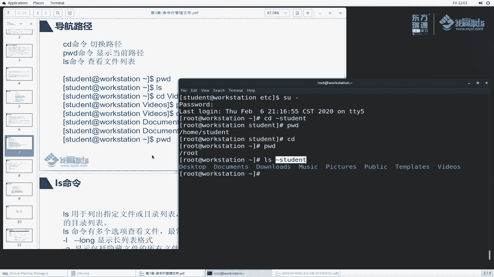

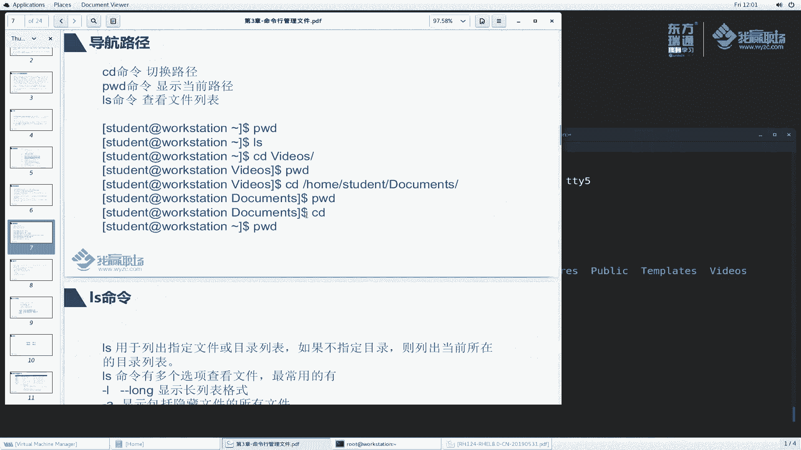

经常用啊经常用，你说我要去管理文件。这个文件在哪里呢？我不知道我大概知道他好像在打个比方啊，他大概好像在我们这个下面去，好像是是吧，或者说好像在USR里边，大概在这个目录下面去。

但是在这个目录下面哪一个子目录呢，我不知道。那我这样做啊，CDCDES加点到这个目录里边来L看一下。好，其实我想找的是什么？我想找的是这个IDL啊，还IDL。那么我CD到IDL啊PWD敲一下。

看看我这个位置啊，然后在CDIDL好，再来看一下好，没有任何东西。那么此时我就是通过这种方式来看一下PW看一下我当前的位置是不是对的。第二呢看一下我这个目录里面有什么东西。第三呢，我CD不停的切换。

所以说这个三者啊。用的非常的多，我们呢也要去灵活的去使用这么一个东西。

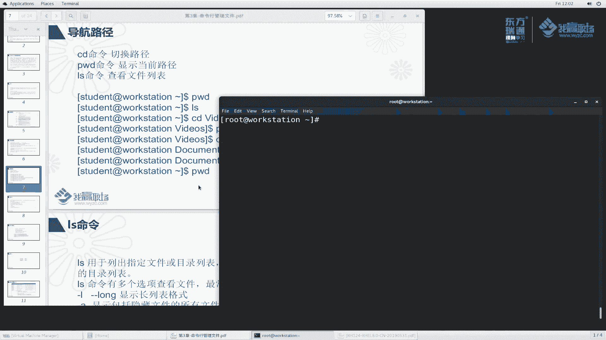

OK啊。那刚刚给大家讲了一个这个CDPWL。那么这个LS呢其实它有很多一些选项啊，在这个地方呢，我们给大家再详细的讲讲一下LS里到底有哪些选项，好吧。呃，讲L命令之前呢，我们再给大家啊讲一个知识点啊。

就是叫绝对路径和相对路径。那么回到上面来。

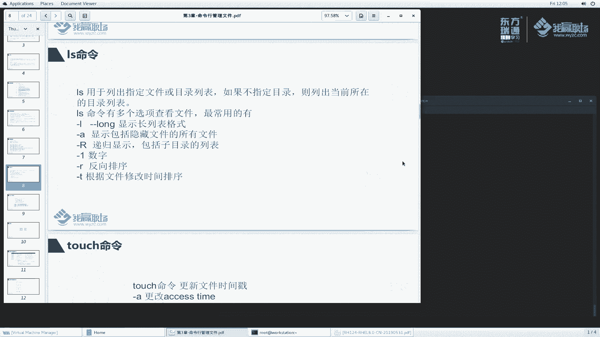

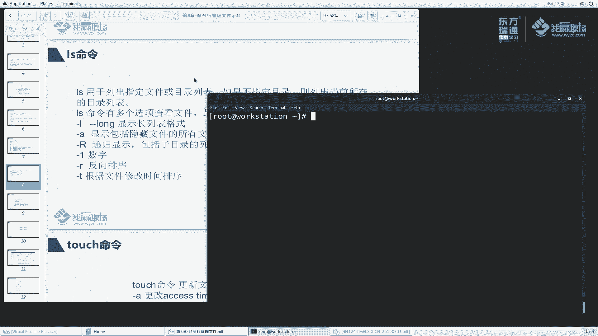

之前我们去访问文件的时候，大家应该发一个问题啊，什么问题呢？就是说我表示路径的时候，一会儿是哎，比如说啊，我们L的时候啊。

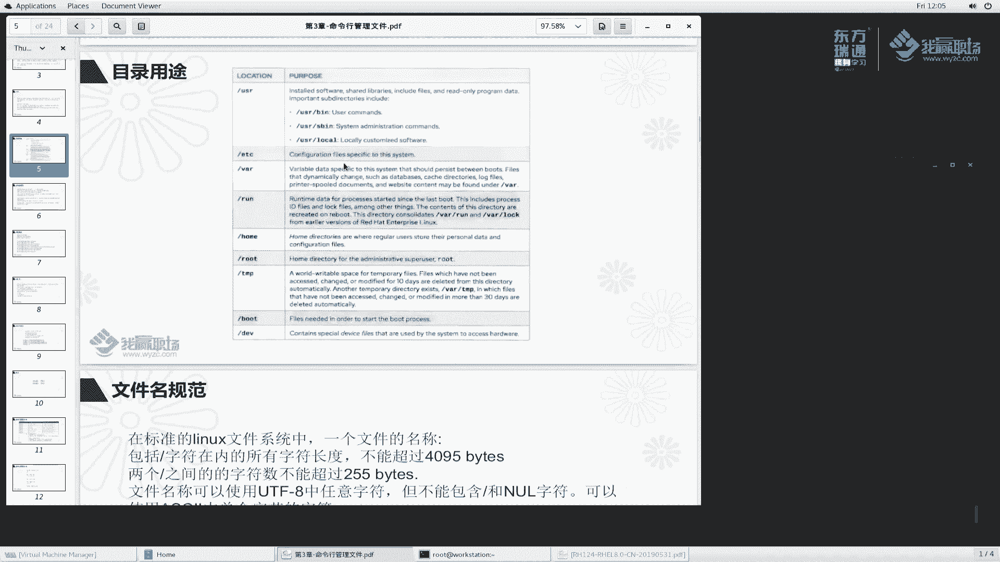

嗯。这样吧啊L这个里边好像东西比较少哈，那么这样啊我们切换到推出来。我现在呢是stdent的用户啊，我L的时候，例如说US are晒。这个目录。那他他这个目录表达的方式是怎么表示啊。

是从最顶层这个根开始的。啊，那么我们都知道啊，你一个文件从最顶层往下数。就说dict words。那么你每一个文件的路径都是唯一的这个路径。那以这个符号开头的这个路径呢？我们称之为绝对路径。

每个文件呢只有一个可以非常明确的去表达这个文件的路径。啊，这叫绝对路径啊。记住了这个词啊，叫绝对路径。那么与绝对路径。对应的另外一个路径叫相对路径啊，那么只要不是以斜杠开头的这个路径。

我们都称之为相对路径啊，例如说我LS。LS这样我们现在在这个ETC目录啊，里面东西比较多啊，我们回退来回退一下到这个里边来L它其实看到的是当前目录相等于LS点。看的是我当前的目录啊，回车也是这个吧。

那么L点点再来回车看一下。哎，那么这个student的到底是哪一个目录呢？对吧我给大家再看一下ho来看一下。那似乎是跟这个目录是一样的，对不对？我当前是在哪个目录啊？当前是在这个目录下面。

那么点点是代表上一级目录，上一级目录是不是这个目录啊？所以说L的时候，点点的时候和L home它是一模一样的。那么大家要记住了哈，我们现在又讲了一个特殊符号，叫点和点点点呢是代表当前目录。

点点呢是代表上一级目录。那现在我给大家表示一下，例如说我现在当庭在这个目录home student。那么我们现在给大家来先增加一个用户吧。user ADD我们加一个用户老马用户。

来看一下home下面是不是有两有两个了啊，那么我们退出来，我当前是在这个目录，那我如何使用绝对路径表示老马目录呢？叫老马目录。回车。诶。他发现一个问题是吧，说我没有权限访问对吧？那么这样吧啊。

我们还是使用root用户。L杠。L杠home老马这个目录。老马好t键补全。所以说我们可以使可以找到这个目录。那么例如说我现在在home student这个目录。

我现在使用相对路径去表示这个目录怎么表示呢？来看一下PWD我要LS这个目录应该怎么办呢？点点对吧？点点此时此时它到了这个home目录，那home目录下面我们再使用老马这个目录去表示。

那么此时达到的是同样的效果，是不是啊？绝对路径啊，以根开头的相对路径呢是以不是以这个符号开头的路径称为相对路径。那是代表上一级目录。我当前是在home student这个目录。

那么它的上一级目录是哪是home目录，那么home老马这个目录我们怎么表达的？所以说点点斜杠，此时代表的是这个位置，然后再加个老马，那么是不是相当于home老马这么一个路径了吧。好。

我们给大家讲了这么一个目录啊。就是说我现在再给大家表示一个目录啊，那我如何去表示这个目录呢？ETC下面这一个。嗯。ETC confi这个目录啊。怎么表的表示。来想一想。😊，L首先首先我去点点一下。

点点发现我所在的目录是后目目录。那么这个目录跟我们这个home这个目录，他们俩之间是都属于在哪个位置下面的？它们俩的共同部分是什么呀？是最顶层这个根吧。

刚刚我们说home student和home law马都是共同在home目录下面的。那么这个ETC confi和我们的home student这两个目录在哪个下面啊，给大家写一下。

Home student。这两个目录的共同特点是都在这个位跟目录下面。啊，所以说我们要在我当前目录下面去使用相对逻径去表示的时候，可以这样啊点点啊点点斜杠是代表到了这个目录了。

那么我还要点点再上一级到了这个目录好，此时我们再去找ETC。然后你看我去补全的时候有没有有吧，在s在补全的时候，补全了吗？有没有是不是也找到了呀。所以说啊这个叫相对路径啊相对路径。那为什么有了绝对路径。

还要相对路径，或者说我为什么不能直接使用相绝对路径呢啊，这两者为什么都要存在呢？

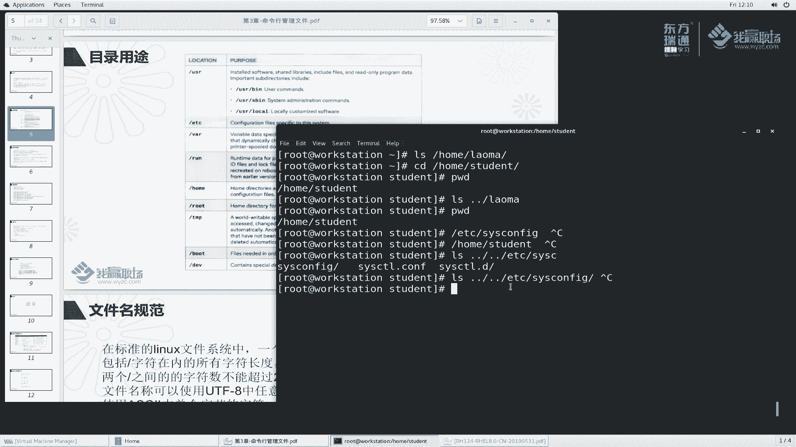

其实还是非常好理解的啊。

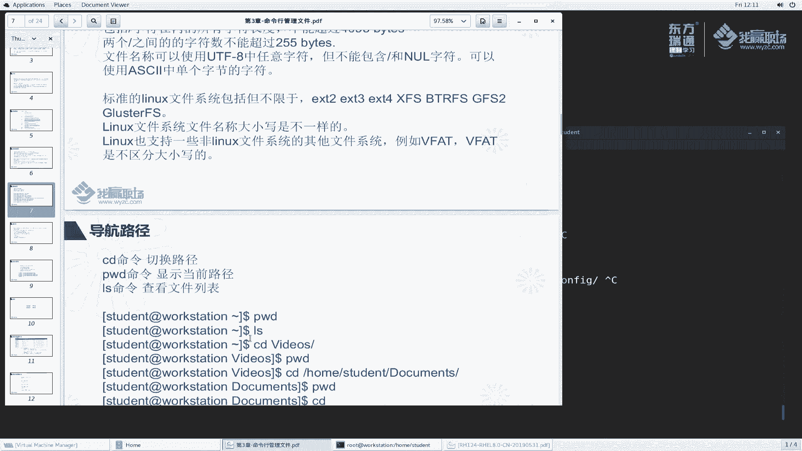

例如说我给大家举个例子啊。打个比方，我现在到这个目录CDUSR晒到s里边一个啊，打个比方啊，我们看一下CD levels录录啊。那么我当前是在这个目录，此时如果说我要访问访问这个目录下面，打个比方。

我想访问这个目录下面的哪一个呢？这个目录下面有us，然后dict啊dctionctionw。那么我要访问这个单词，我怎么访问啊，使用绝定路径是不是我要打这么多啊？答这么多啊，这样啊，我再加一个啊嗯。

在这个DOC目录上面啊，DOC目录下面有很多啊。那么很多例如说我们找一个lab里边还有一个A。那 a。A。哦好，此时我们这样啊，我现在是在哪个目录啊，在这个目录下面。如果说我想访问这个目录。

想想访问这个目录，那么如果你使用绝对路径的话，你去表达是不是要写这么一大成寸啊。那如果说我使用相对路径访问的时候，是不是点点一下lib。AO就可以了吧。啊，所以说绝对路径和相对路径呢都有它的各自的优点。

也有各自的缺点。那么大家灵活去使用这个相对路径和绝对路径。

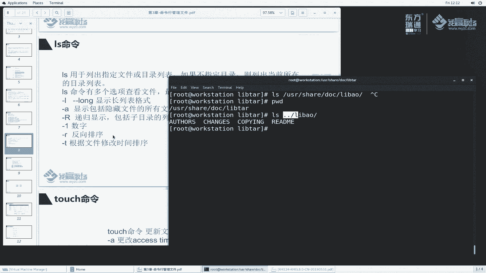

OK啊，这个大家好好记一下记一下啊。😊。

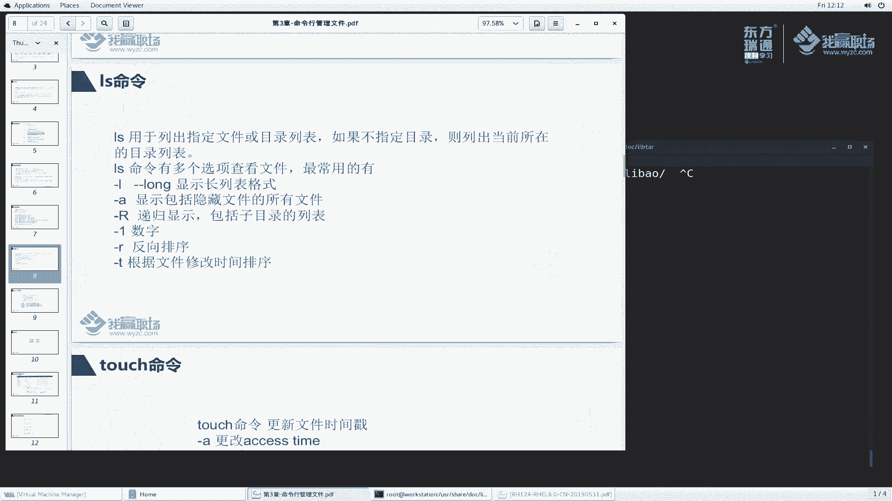

啊，一般来说啊，在你去写sll脚本的时候啊，或者说你的生产环境下去用的时候，其实大部分啊大部分大家用的是绝对路径比较多啊，相对路径呢可能比较少。因为相对路径如果说你当前路径发生了变化。

那么你这个相对路径这个文件呢表达的这个。表达的这个方式就变掉了啊，所以说你你绝对路径是唯一的吧，但是相对路径就不一样了。

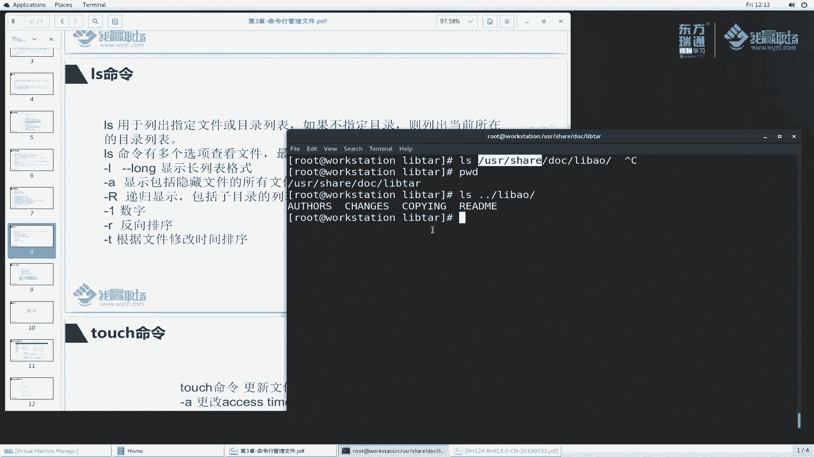

OK啊相对资径和绝对途径，大家一定要啊好好记一下。那么我们再来看一下L这个命令啊文件的方式我们会表达了。那么L命令我们去看文件的时候，到底怎么去看呢？

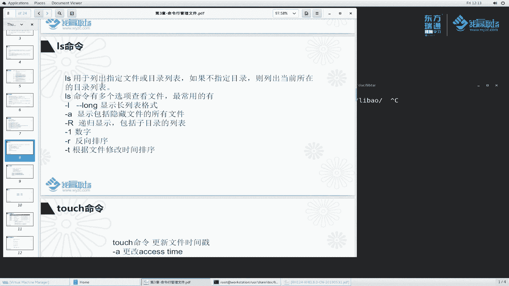

啊，LS回车是以这么一种方式。LS杠A啊，或者说LS杠杠ALL我们都说过。啊，显示一个文件列表，显示这个目录下面的所有的这么一个文件，包括已点开头的，点开头的叫隐藏文件。啊，隐藏文件啊。

那么隐藏文件你加杠A就表示啊，所有的都给我们显示了。对吧LS杠杠啊杠杠这里边有一么一个L的。杠杠L啊liter啊，那么大家看到我这个地方好像写错了是吧，显示长列表格式，那么大家就不用记了。

反正你杠L显示一个长列表格式就行了。杠L。

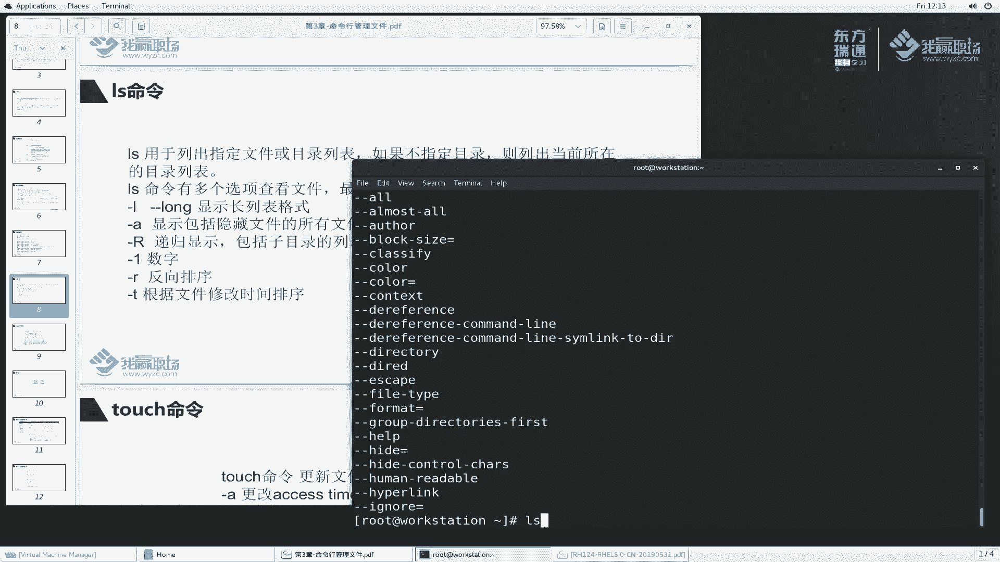

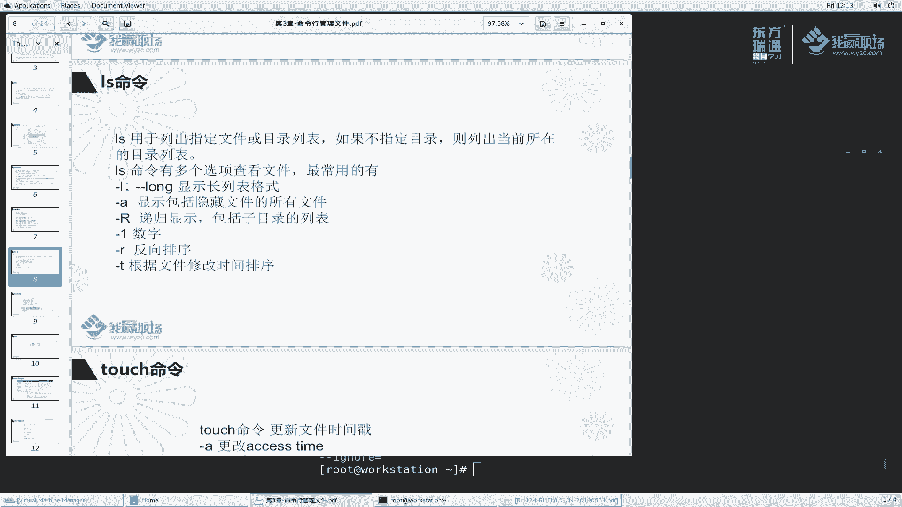

啊，有这么两个显示了一些额外的属性。那这些属性呢，在我们后续的讲解过程当中，这样吧啊，我还是给大家解释一下吧。这个位置是代表文件的类型，中横杠是代表普通文件。那么这个呢是代表。具有的权限。

什么叫具有的权限啊？我这个这个是代表root用户，这个文件呢是属于root用户拥有root用户也属于哪个组呢？属于root组，这是用户，这是组。

那么这个是代表我们讲的入用户和组以及其他人对这个文件的权限啊，后面我们还会给大家展开来说啊，反正大家暂且记得这么多就行了。文件的大小以及文件的修改的时间啊修改的时间。以常列表看它的详细信息。

那么简单的讲一下，就像windows里边给我们看到一个文件列表一样的，比如说我们就看这个。

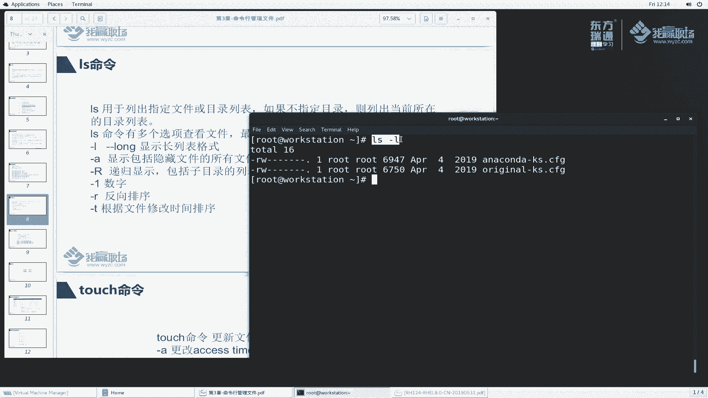

那这个显示的时候有一个查看查看的时候，我们看一下看什么呢？看小图标呢，平铺呢，还说中图标呢是吧，中图标呢，还是说详细信息呢啊，主要是这么一个意思。

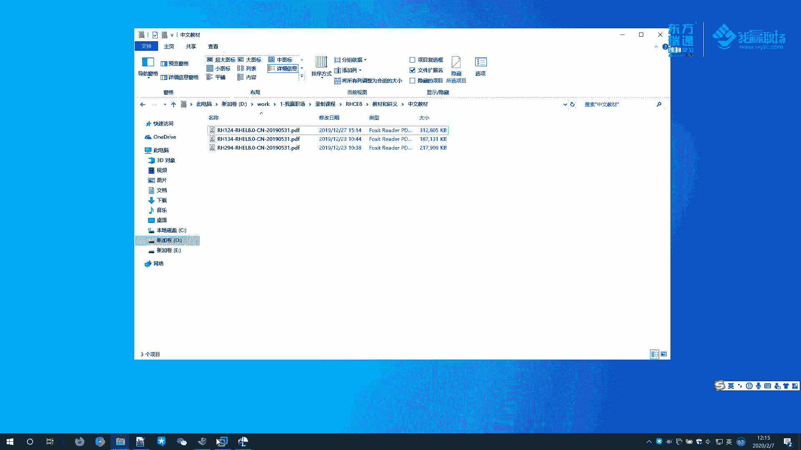

L呢就相当于看它的一个详细信息啊，灵活吧。

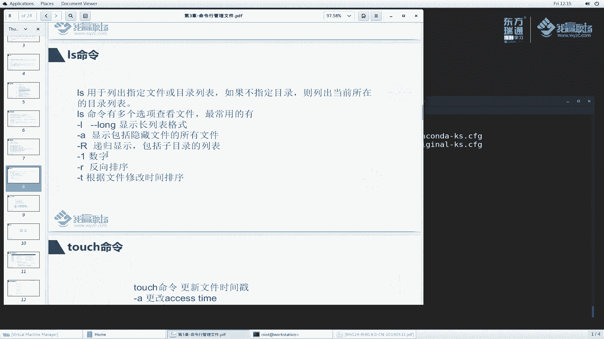

那么还有递规显示啊，这个递归显示呢，我们给大家换一个路径啊，L student。students给我们看的是这个目录。那么如果加一个杠R，大家来对比一下。此时我们达到的是以什么效果啊？

你这个不加R的时候，它只显示我这个目录的目录里面子目录的本身。那如果加杠大啊，他给我们递归显示。好，把这个我当前目录一下desktop，我显示destop下面的。如果说desstop下面有。

我还会继续去显示dessktop下面子目录，一直递归下去。啊，这样呢我们看的东西就比较彻底一点。好，彻底一点啊。那在这个位置呢，我给大家还要讲另外一个命令呃，叫t命令啊，t命令。

那么看一下我们这里面有没有。😊，哦，吹有了是吧？好，我们一样t命令加上我们讲的一个student呢来看一下。此时，他给我们显示的一个目录结构。好后这是我当前的目录，对吧？代表我这个目录。

那么这个是我student下面一个子目录啊，子文件啊这个显示的好像有点短。这样啊，我们给大家看这么一个home目录。这样能看清楚了吧，home目录下面有老马啊。

有student studentdent的目录下面有他有他啊。当然如果他下面有文件还会继续给我们显示，而且他下面给我们统计出来的是吧？t这个命令啊用的非常多的。那同样呢，t里边还有一个什么，我显示级别。

你这个不是显示的数的级别吗？我杠一个后吗？我显示级别一啊，还是按呢？级别一，大家对比一下。级别一只看的下面一层，对吧？那么级别二呢，我看两层，那么级别3，级别4，根据你的需要去加train命令啊。

我们用的真的是比较多啊比较多。继续回到我们刚刚讲的这个LS命令里面来看。L杠1，这个呢是代表数字一啊，数字一来看一下效果。直接敲，此时这是横排是吧，这是竖排。根据你的需要。

我们有时候希望的他这个数字给我们看啊给我们看。那么例如说我们这样看L看 studentdent。那这样看呢感觉可能不太爽是吧？我加一个杠1，我喜欢这种方式来看。啊，这样对吧，根据你的个人习惯。啊。

那么还有1个LS杠R。那么同样对这个来说，我们杠R。R是代表反向排序。你看desktop document，那么这个位置。desktop放在最后了吧，叫反向排序啊，排序。你要我给这文件展示的时候。

我们是不是可以按照我们特定的方式去去排序啊？同样呢，我们在这个地方，哎，我们这个地方按文件名排序是吧？默认就是按文件名排序，那么加了杠啊，就相当于点了这么一个操作，文件名反向排序，是不是这个道理啊。

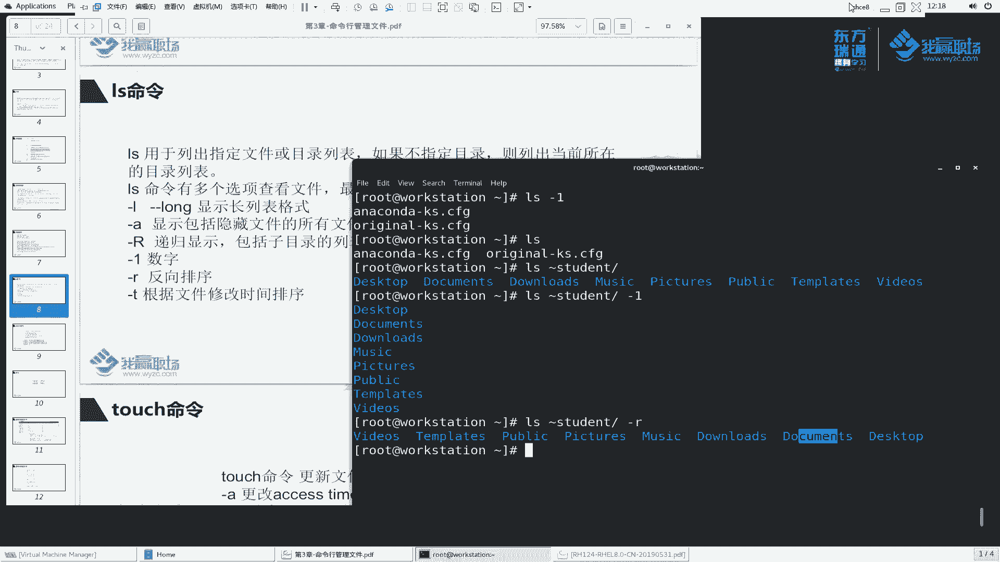

啊，我们还可以按这个修改的时间进行排序。那同样呢到这里边来LOS啊还是杠R杠R那里边有个T。

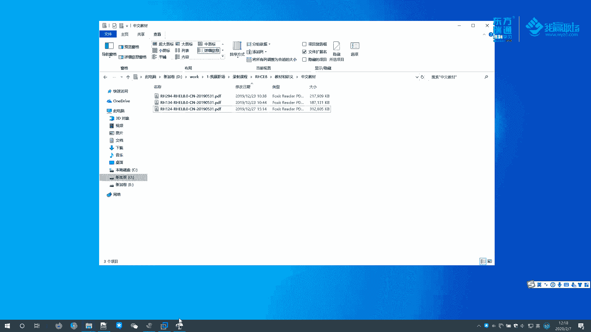

根据时间进行一个排序。好吧，根据时间进行排序。当然了，我们可以啊杠L再加一起加。来看一下他们的时间，不过似乎哈似乎好像没什么变化是吧？因为这个时间好像都一样的，他一当初一起创建来。那么这个RT非常有用。

在什么方式下用呢？例如说我在系统维护的。我想看一下当前目录下面最近有哪些文件发生了变化，并且给它排个序。好，哪些文件变化，我们按时间排序最发发生变化了。那么最早的他给我们显示在最上面。

那就给我们列出来了，是不是啊啊，有这么一个效果啊，你可以按文件名排序，也可以按修改时间进行排序，并且呢反向排序RT这两个用的比较多。

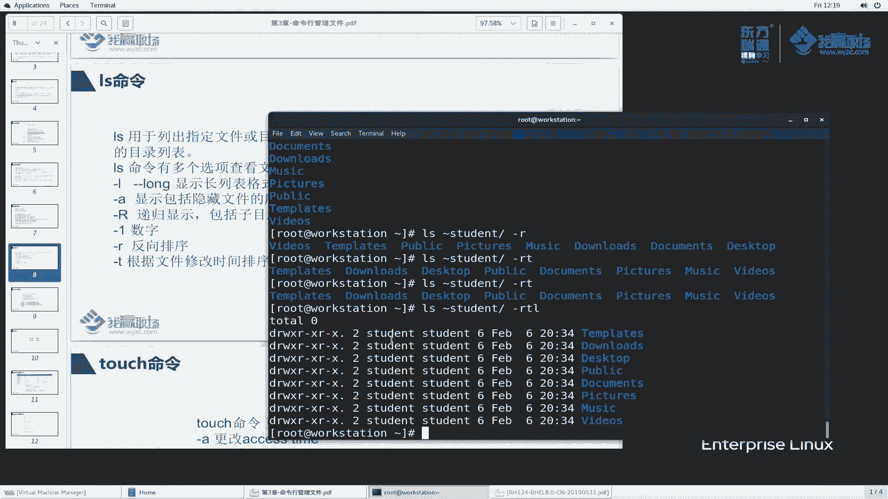

那比较多啊。一定要常记啊常记啊。okK我们再来看一下这个touch的命令。

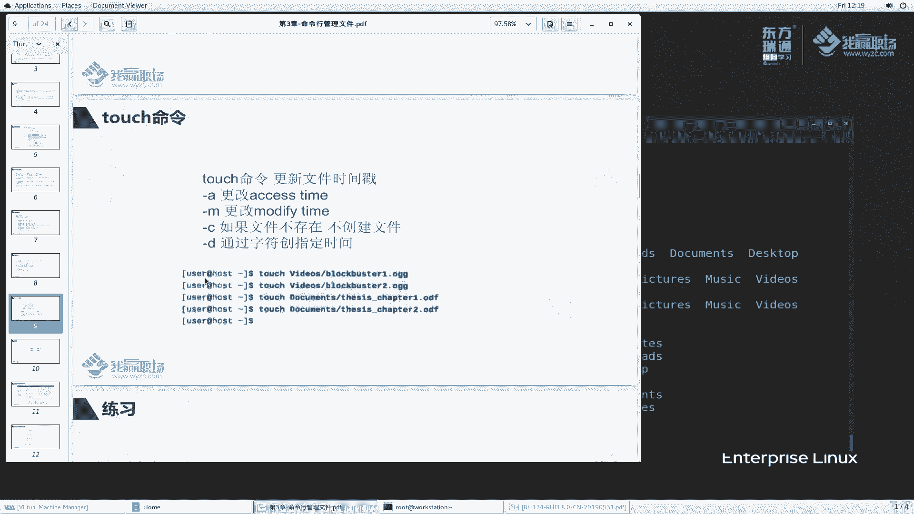

他是干什么用的呢？那么我们还是退到刚刚那个目录啊，student的目录。例如说我们做一个touch。tauch回车。他说啊我们这个缺少这个文件是吧，touch它的作用来touch刚刚help。往上翻。

参数比较多啊，我没有，现在呢只给大家讲关键的几个啊。他说这个用于更新这个访问时间，修改时间。更新每一个文件是吧，把它时间呢更成为当前的时间。什么意思呢？这个文件创建完成之后。

那么这个文件呢就会有相应的时间啊。那么我想去更新它的时间，并且呢更新为当前的时间。啊，我我们这个地方看看，我还可以更更更新为指定的时间。啊，这我按照那么你想如果你不加时间，你就是更新到当前时间。

如果你加时间，按照你特定的时间来改。那么一般来说啊一般来说，我们只是把它更新到当前时间就可以了。啊，但是呢如果说我们想 touch一个当前目录上不存在的一个文件，例如说我 touch一个文件叫老马。

来看一下这个老马这个文件的时间。LS杠L老马。大家发现他的时间是12点20啊，看一下date时间。好像确实是12点120是吧，我们再等一下。12点20的57分，我们等到21的时候再来看一下。

现在是12点21。那么我来touch一下啊， touch一下老马。再来RS杠L。老马看一下。其实大家发现他的时间有没有变化，变成21了吧，是不是把这个他的时间啊修改的时间变成了我的当前的时间？啊。

是这么一个作用啊。那么大家还发现一个事情，你当前目录下面好像没有这个老马文件吗？怎么你踏一下就给我生成了？确实是这样子啊。他气的作用本身是用于。更新这个文件的时间错了，但是这个文件不存在。

那我就给你创建一个文件。那么能不能说这个文件不存在的时候，我不想创建呢，也可以啊啊，可以啊。那么这里边就要另外一个啊另外一个啊，那么我给大家写一下，说杠C如果问件不存不存在，就不创建啊。

我们再 touchuch一下。

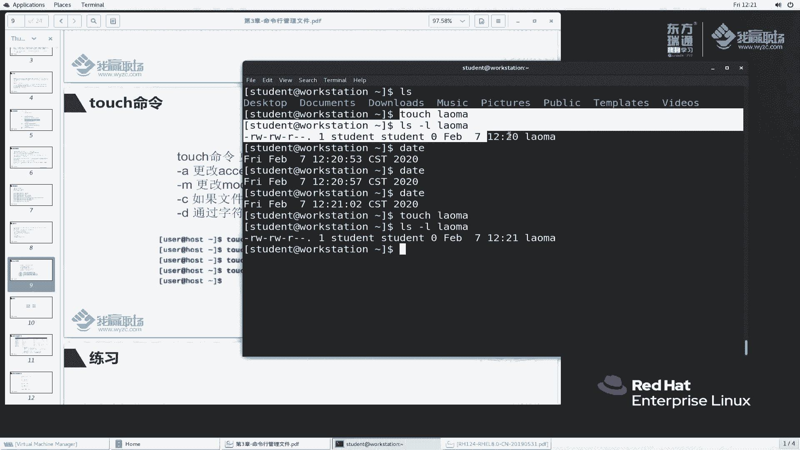

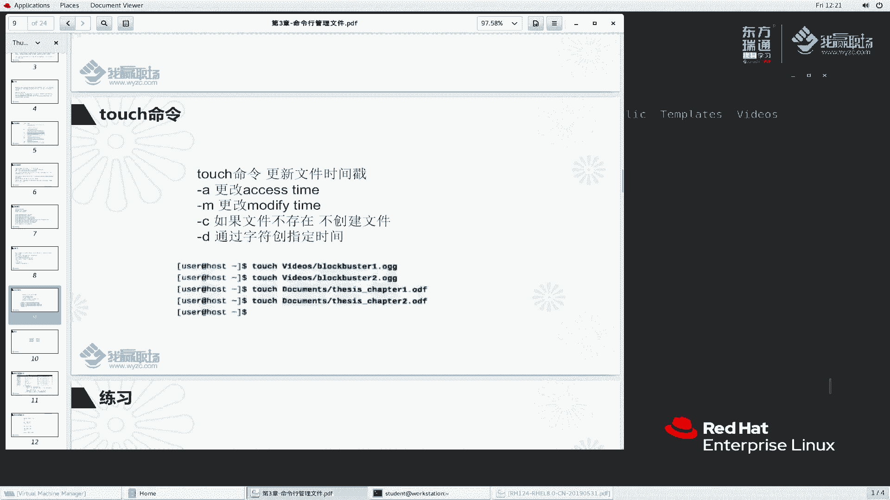

再来L看一下啊。他一个老马2这个文件啊，我们加一个杠C。来看一下。老马是创建的，但是这个老马二没有创建嘛，文件不存在的情况，就不创建。

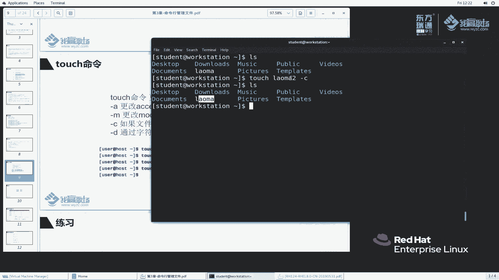

啊，是这么一个作用啊。一个文件呢，它是有3个时间。你一个文件一旦产生了，就会有三个时间啊，访问时间呃修改时间。那么还有一个迁及time。

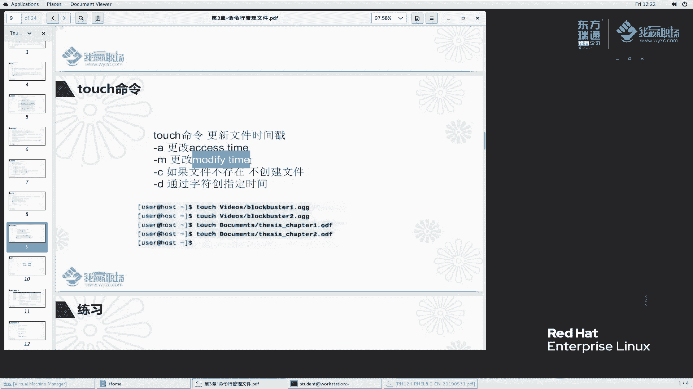

迁记代码是更改时间啊更改时间。那这个更改时间呢，这样我再给大家教一个命令啊，一起看state。state老马。stateate可以看到这个文件的时间有几个，找一下asses time。

modify time和 change time。我们读这个文件的内容就代表是访问。修改文件的内容啊，就是代表modifyche你是代表修改这个文件的属性。但是呢文件的内容没有发生变化。

比如说这个文件本来是属于老马用用的，现在我做了一个事情，让这个文件呢是属于啊老张又用了。此时，那么这个属性就发生了变化。啊，发生了变化好吗？但是呢这个欠级的属性发生变化，我这个mod地化也会跟着更改。

它有这么一个作用。OK啊呃，关于这个时间怎么改呢？我们可以通过touch更改。那么我们也可以怎么办呢？我们可以通过其他一些命令啊去校验，对这个文文件呢去做一些修改，然后来验证它的一些变化。

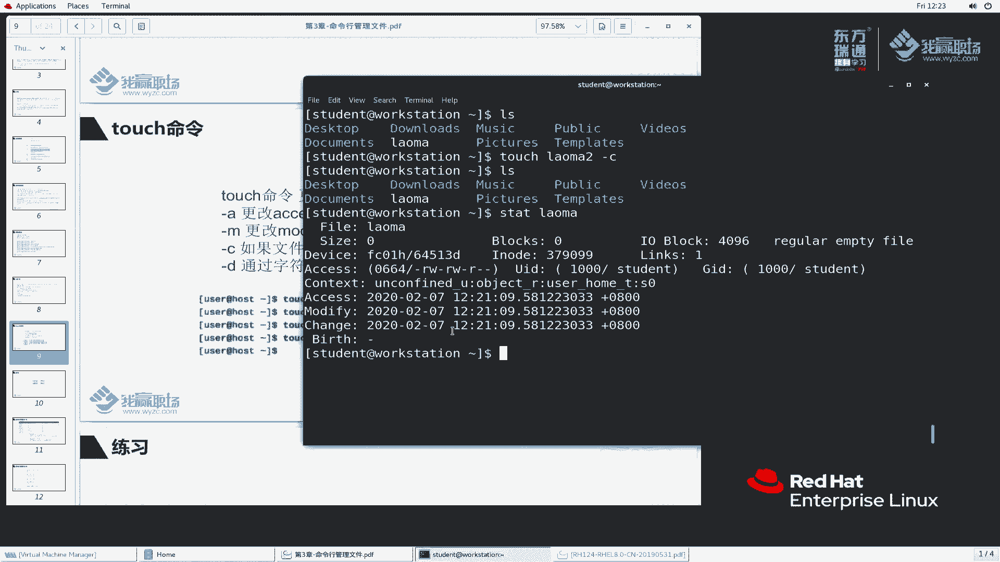

好吧，touch命令呢，我们就暂时给大家讲到这里，还补充一下吧啊，这里面提到了我更改他的一个A time。例如说我touch一个杠杠什么呢？杠M，我只更改他的一个M时间，再来看一下老马。

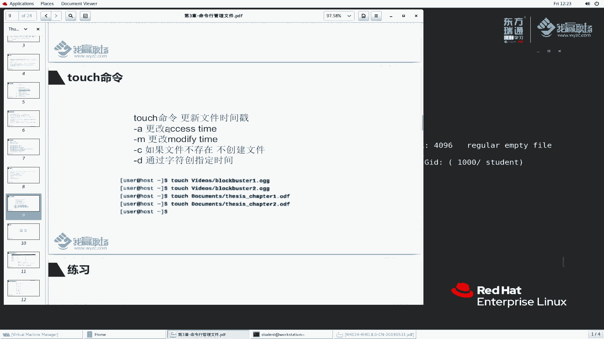

那么state来看一下。老马的时间有没有变化啊，这两者都变化了，是不是？虽然我修改了M，但是这两个两者的时间都变化了。好，那么这个attime有没有变化嘛？没有吧，还没有吧。

那么我再来做一个事tauch杠杠A好吧，老马再来看一下时间有没有变化。此时我们可以看到这个A time发生变化，哎，C time也发生变化了，这个modify没变。

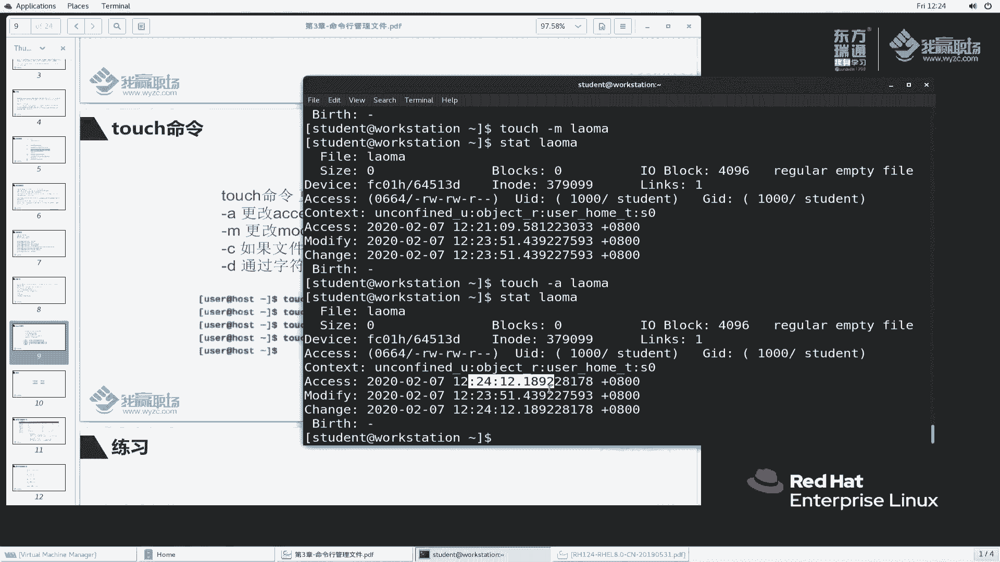

啊，所以说比较有意思是吧？有意思，只要你更改了，无论是A time还是M time，我们这个C time都变了。

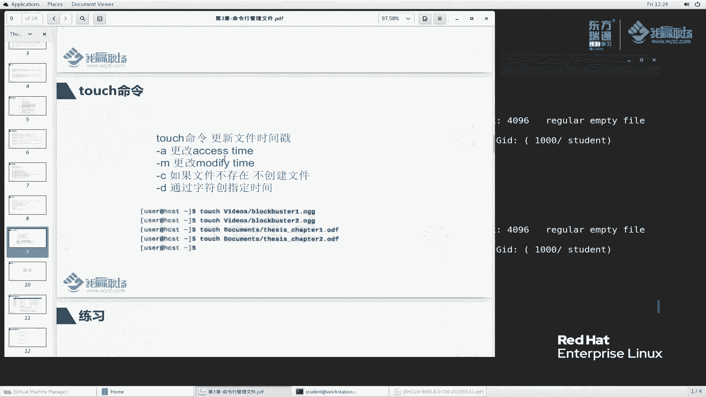

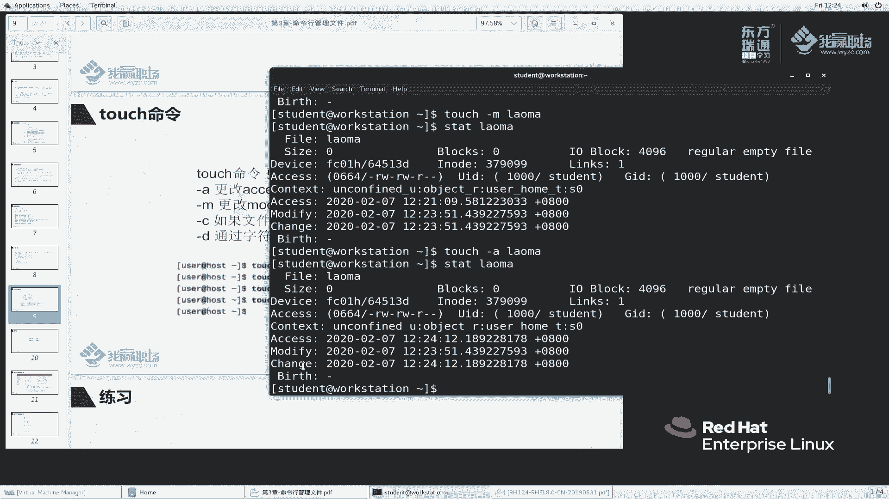

啊，这个比较特殊啊，后面我们有机会再给大家展开来讲，大家暂且记得这个文件的时间呢，有时候对于操作系统来说非常的关键。那么我们可以根据需要呢去把它更改一下。

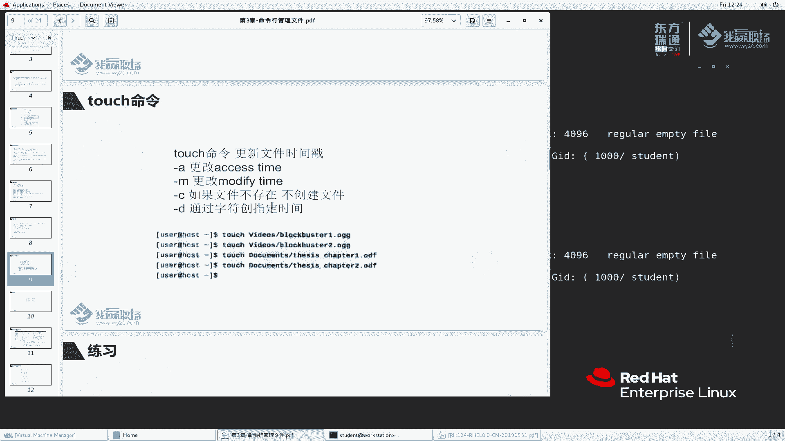

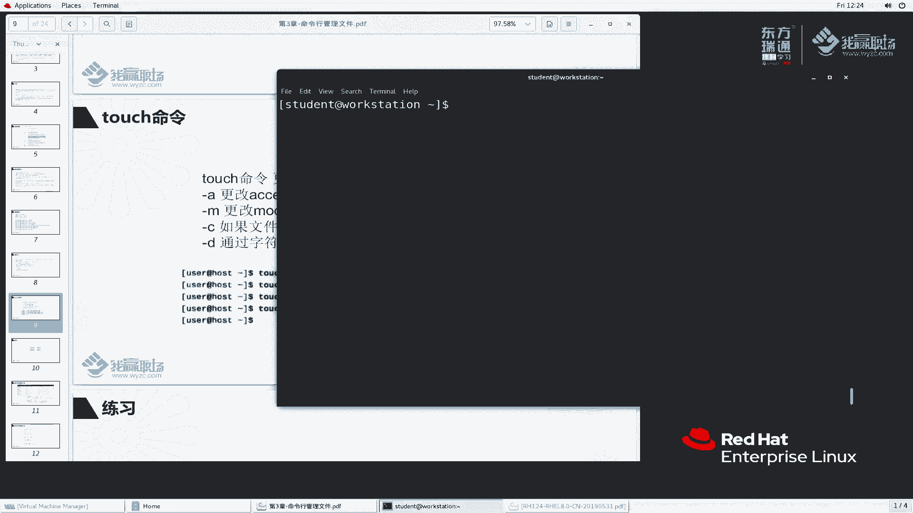

好了，这节课我们给大家讲了以下这么一些东西。第一个我们如何去更改这个路径啊，导航路径CD查看路径啊，L命令详细的给大家展开来讲。还给大家补充了一个叫相对路径和绝对路径。那么最后一个touch命令，好吧。

 touchuch命令啊。OK那这节课呢我们就给大家讲到这儿。下节课呢我们给大家讲一下命令行里边呢去如何管理文件。

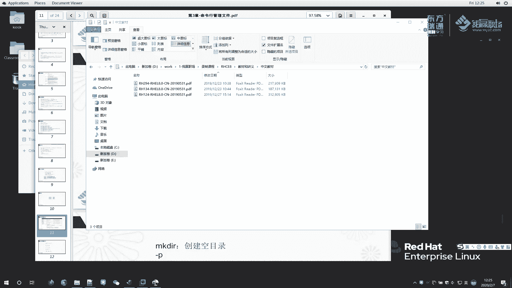