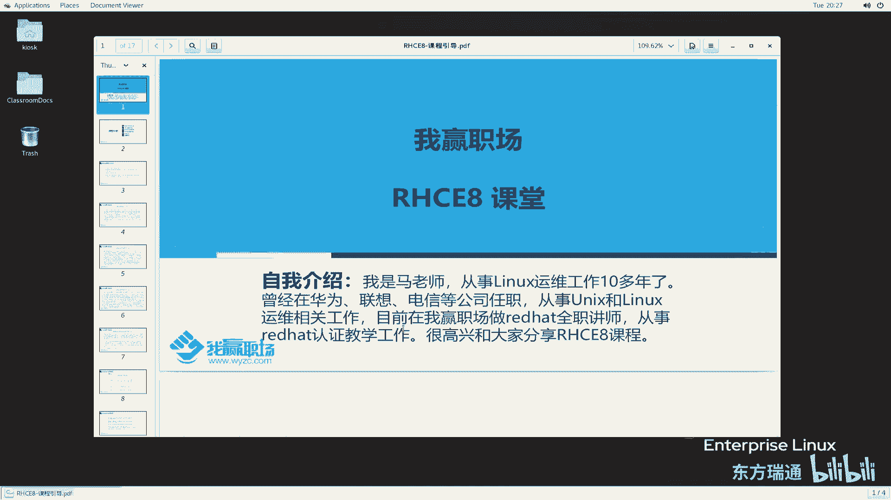
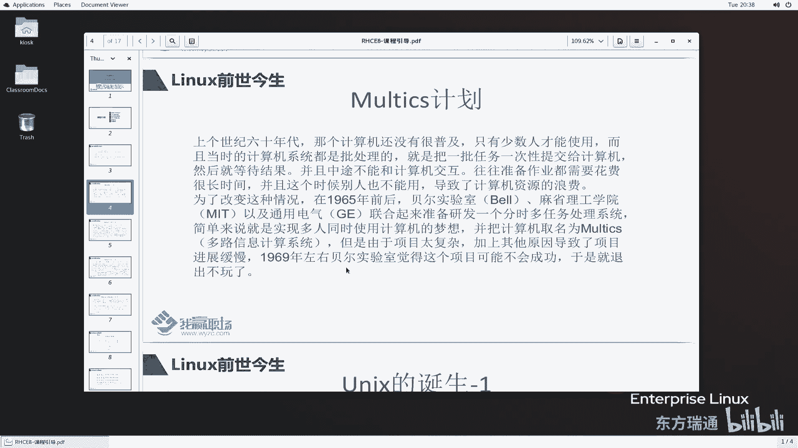
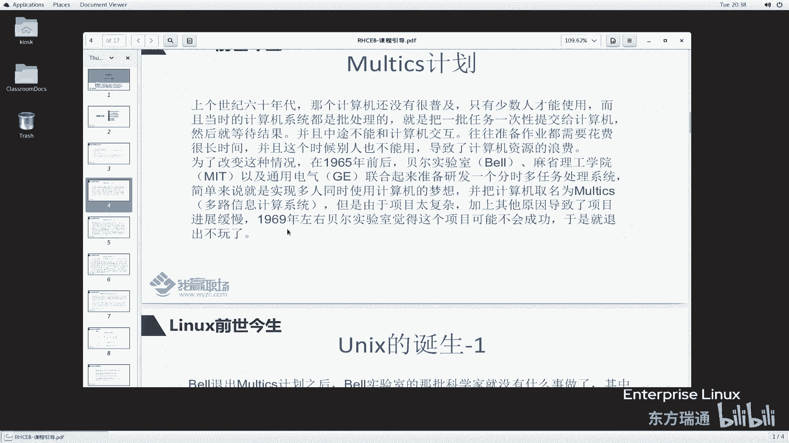
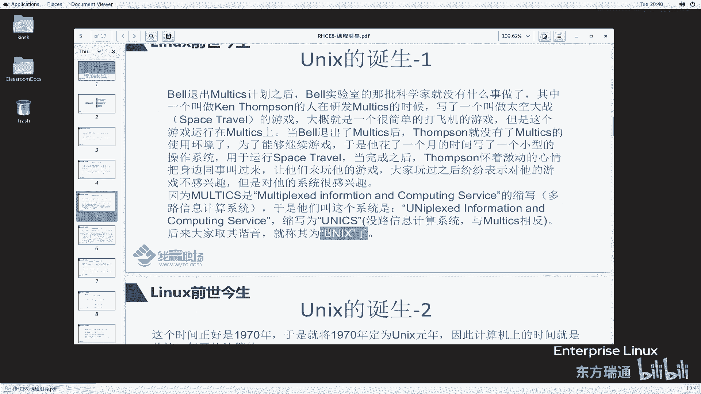
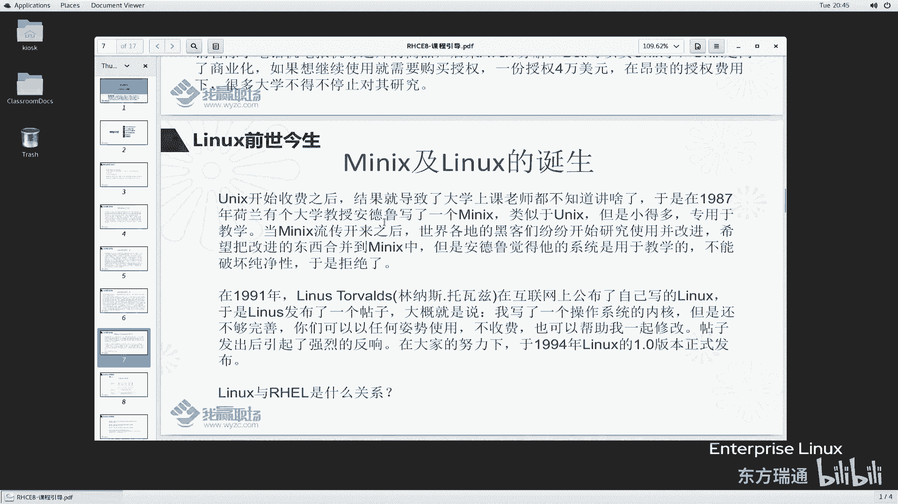
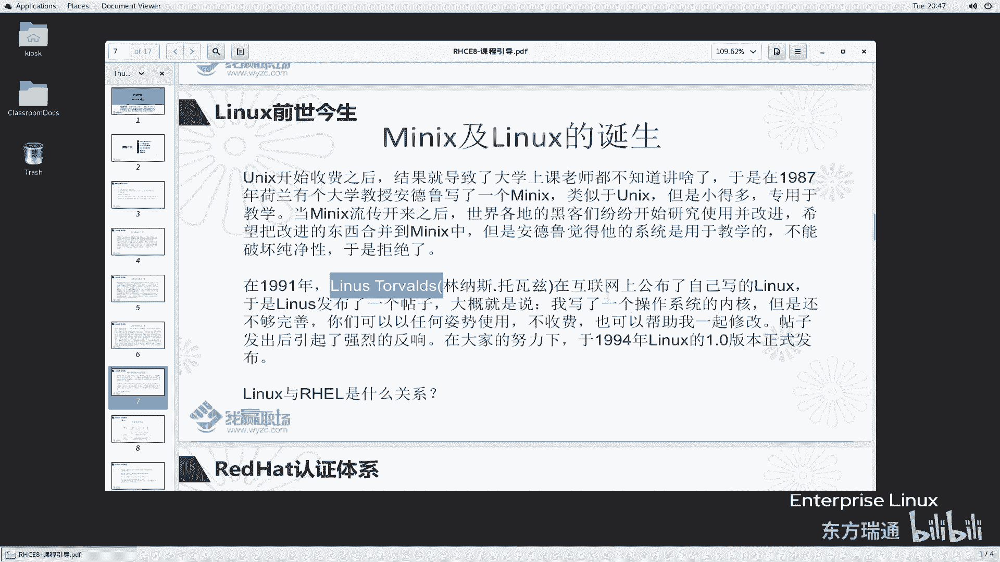
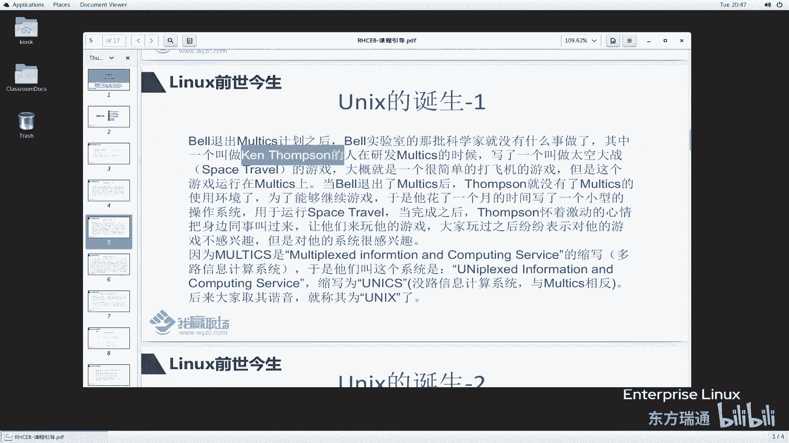
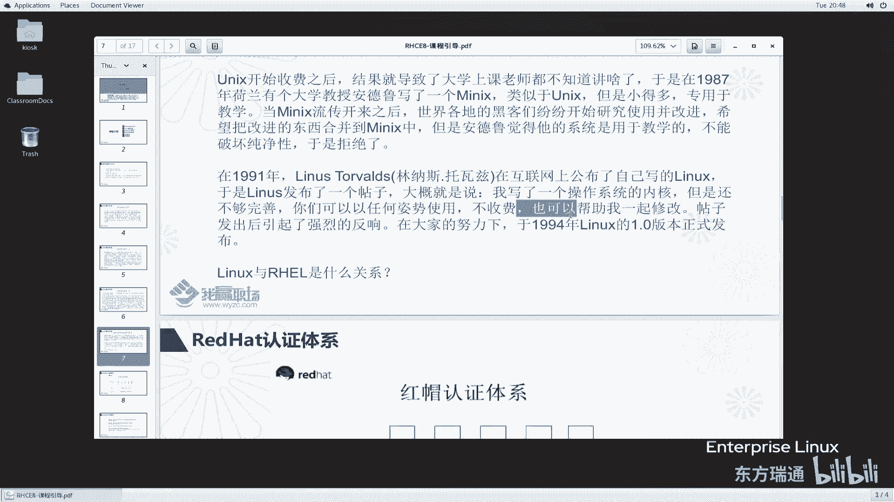
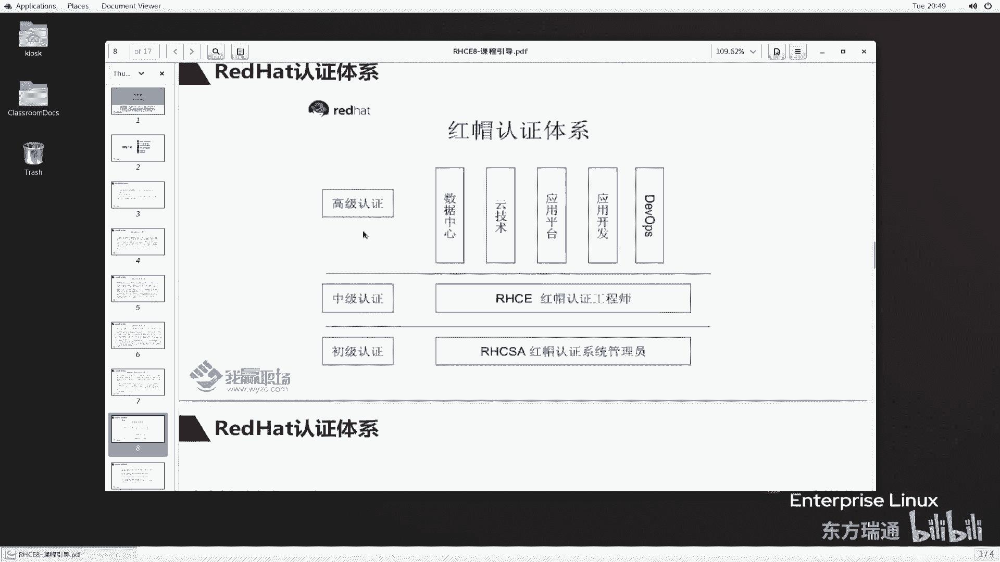

# 红帽RHCE认证培训（8.0版本）：P1：RHCE8课程介绍1-为什么学习Linux与Linux前世今生 🐧



在本节课中，我们将要学习为什么需要学习Linux操作系统，并了解Linux从何而来、如何发展至今。这对于理解后续的RHCE课程内容至关重要。

## 为什么学习Linux

每位同学报名学习RHCE课程都有自己的目的，例如为了升职加薪或满足公司项目需求。我们可以从以下几个角度来理解学习Linux的必要性。

**以下是学习Linux的几个关键原因：**

1.  **终端设备与服务器**：当今市面上许多终端设备和服务器都运行着基于Linux内核的操作系统。无论是维护这些设备，还是支撑像“双十一”这样的大型电商平台，都需要了解Linux。
2.  **前沿技术领域**：云计算、大数据、物联网、人工智能等热门技术，其底层服务器大多运行Linux操作系统。掌握Linux是进入这些领域的基础。
3.  **职业发展路径**：Linux相关的岗位非常广泛，主要分为开发和运维两个方向。
    *   **开发方向**：例如LAMP（Linux, Apache, MySQL, PHP/Python/Perl）栈的Web开发、内核模块或驱动开发、嵌入式开发等。
    *   **运维方向**：包括Linux系统运维工程师、开发运维工程师（DevOps）、虚拟化工程师、云计算运维工程师/架构师、数据库管理员（DBA）、存储工程师等。掌握Linux能让你在这些岗位上更加得心应手。

简单来说，学习Linux不仅能帮助你理解现代IT基础设施的核心，也是获得高薪职位的重要技能之一。

## Linux的前世今生

上一节我们介绍了学习Linux的必要性，本节中我们来看看Linux的起源与发展。要理解Linux，需要先了解它的前身——UNIX系统。

### UNIX的诞生

计算机早期采用“批处理”系统，用户一次性提交任务后需等待全部完成，期间无法交互，导致计算资源浪费。





**以下是UNIX诞生的关键事件：**

1.  **MULTICS项目**：1965年，贝尔实验室、麻省理工学院和通用电气联合开发“分时多任务处理系统”MULTICS，旨在让多人同时使用计算机。但因项目过于复杂，最终失败。
2.  **Ken Thompson的游戏**：贝尔实验室的科学家Ken Thompson曾为MULTICS编写了一个名为“太空旅行”的游戏。MULTICS项目终止后，为了能继续运行这个游戏，他用一个月时间编写了一个小型操作系统。
3.  **UNIX的命名**：这个新系统被同事们广泛使用。Thompson将其命名为“UNICS”（单路信息计算系统），与“MULTICS”相对，后取其谐音成为“UNIX”。
4.  **UNIX元年**：UNIX诞生于1970年，因此1970年1月1日被定义为计算机的“纪元时间”（Epoch）。在Linux中，`date`命令可以计算从这个时间点开始的秒数。例如，`date -d @0`会显示纪元起点。
    ```bash
    date -d @0
    # 输出：Thu Jan  1 08:00:00 CST 1970
    ```



### UNIX的发展与闭源

UNIX在贝尔实验室内部流传并优化，1974年发布第五版（System V）供教育使用。1978年，伯克利大学基于UNIX第六版推出了BSD（Berkeley Software Distribution），开创了UNIX的另一重要分支，后来的IBM AIX、HP-UX等商用UNIX都源于此。

后来，由于AT&T（贝尔实验室的母公司）的商业化决策，UNIX成为闭源产品，授权费用高达4万美元，导致许多大学无法继续用于教学和研究。

### Minix与Linux的诞生



**以下是Linux诞生的关键转折：**

1.  **Minix的出现**：1987年，荷兰教授Andrew S. Tanenbaum为了教学，编写了与UNIX兼容但更精简的Minix系统。它同样仅用于教学，不允许用户随意修改，这限制了其发展。
2.  **Linus Torvalds的帖子**：1991年，芬兰大学生Linus Torvalds为了在个人计算机上使用类似Minix的系统，自己编写了一个操作系统内核。他在互联网上发布了一则著名帖子，公开了源代码，并邀请大家共同改进。
    > “我正在做一个（免费的）操作系统（只是个爱好，不会像gnu那样庞大和专业）……”
3.  **Linux社区的兴起**：全球的程序员（黑客）被这种开放的模式吸引，纷纷参与进来，共同修改和完善这个系统。由此，以Linux内核为核心的开源社区生态逐渐形成。



需要注意的是，Linux本身只是一个操作系统内核。我们常说的“Linux操作系统”（如Red Hat, Ubuntu）实际上是包含Linux内核及众多开源软件的整体发行版。关于Linux的“今生”——其版本与发行版，我们将在后续章节详细讲解。





## 总结



本节课中我们一起学习了选择学习Linux操作系统的现实意义与职业前景，并追溯了Linux的历史渊源，从UNIX的诞生、商业化，到Minix的过渡，最终见证了Linux内核如何通过开源社区的力量诞生并蓬勃发展。理解这段历史，有助于我们更好地把握Linux的开源精神与技术脉络。