# 红帽RHCE认证培训（8.0版本）：P2：RHCE8课程介绍2-RedHat认证体系与学习方法 📚

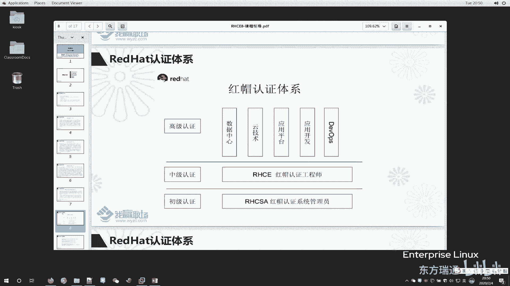

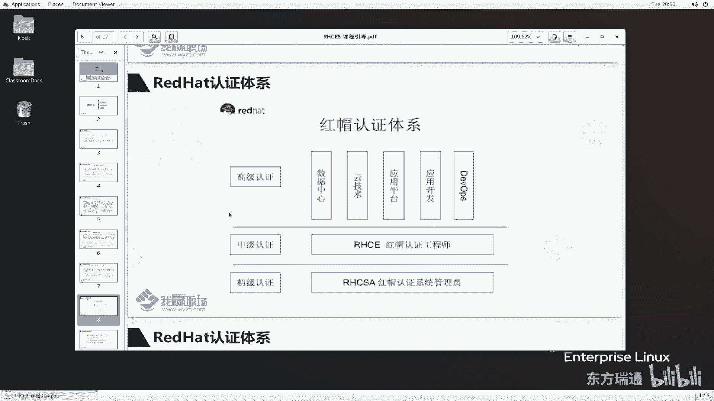

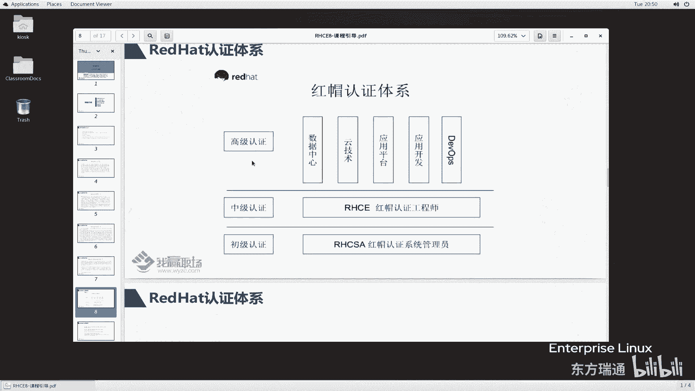

在本节课中，我们将要学习红帽认证体系的完整结构，了解RHCSA、RHCE和RHCA各级别认证的区别与联系，并掌握RHCE 8.0课程的核心内容与高效的学习方法。

## 红帽认证体系概述 🏆

上一节我们介绍了课程的基本情况，本节中我们来看看红帽官方的认证体系。红帽认证与其他IT认证类似，也分为初级、中级和高级三个级别。

以下是各级别认证的详细介绍：

*   **RHCSA（红帽认证系统管理员）**：这是初级认证。`RH`代表Red Hat，`C`代表Certified（认证），`S`代表System（系统），`A`代表Administrator（管理员）。
*   **RHCE（红帽认证工程师）**：这是中级认证。`E`代表Engineer（工程师）。
*   **RHCA（红帽认证架构师）**：这是高级认证，包含多个专业方向。红帽高级认证科目约有三十多门，获得其中任意五门认证即可取得RHCA资格。

## 各级认证课程详解 📖

了解了认证体系框架后，我们来具体看看每个级别对应的课程和内容。

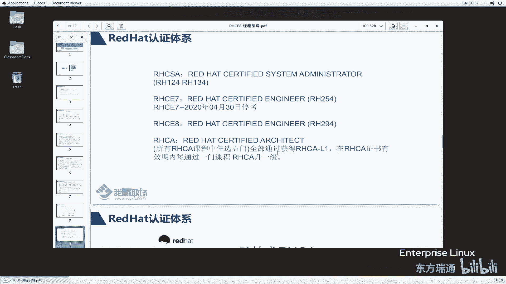

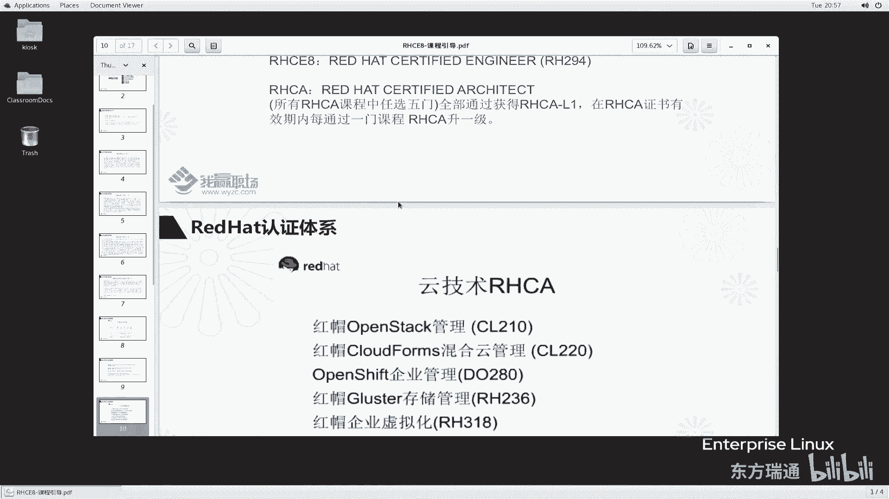

### RHCSA认证课程

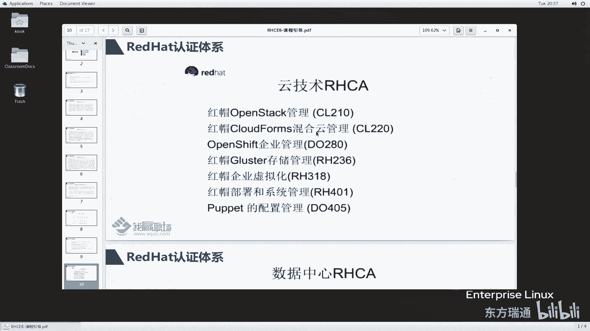

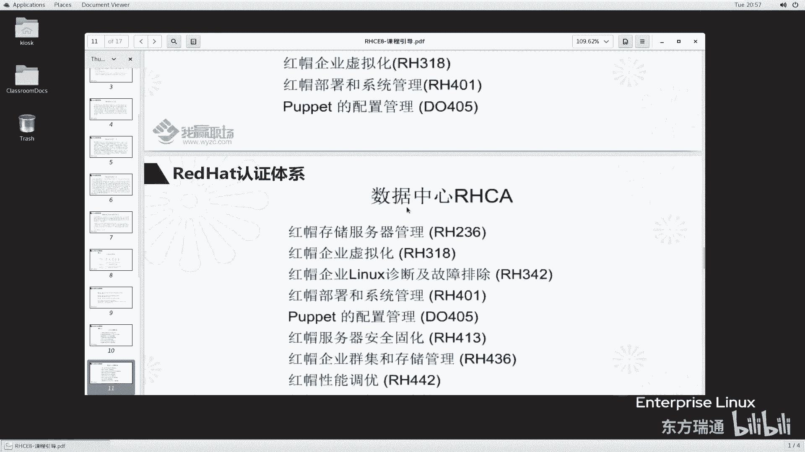

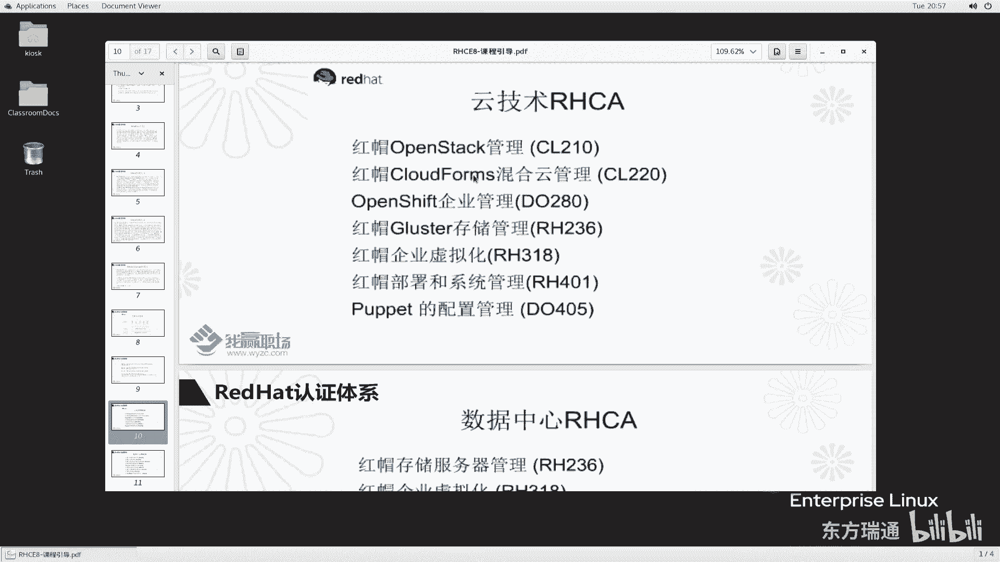

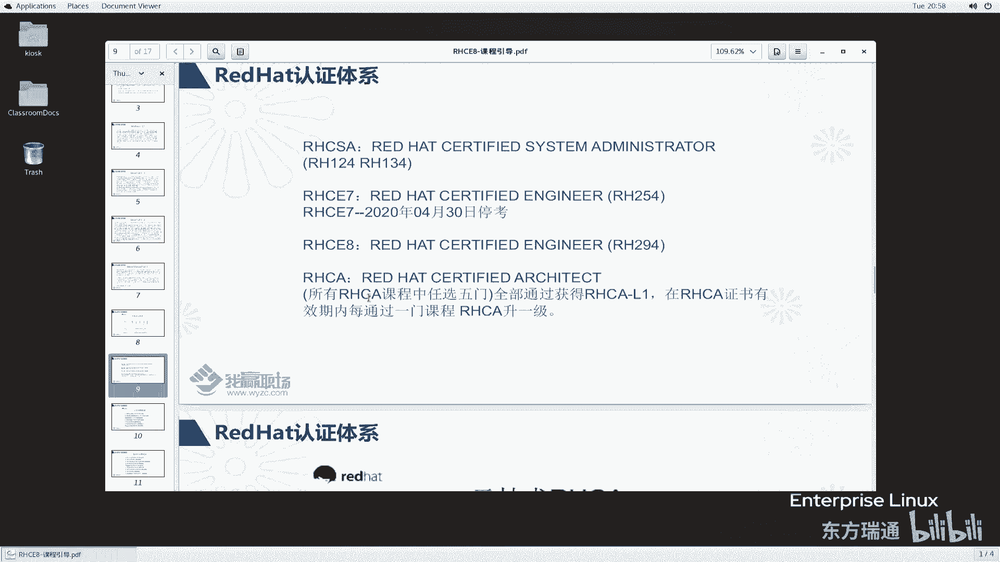

RHCSA认证包含两门基础课程，是学习红帽认证的必经之路。

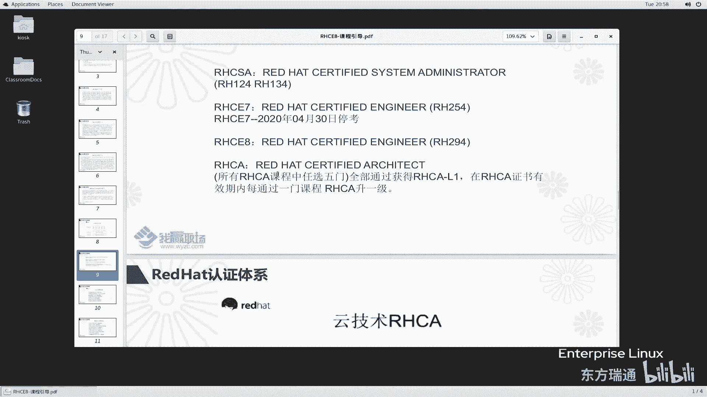

*   **RH124**：系统管理员一。
*   **RH134**：系统管理员二。

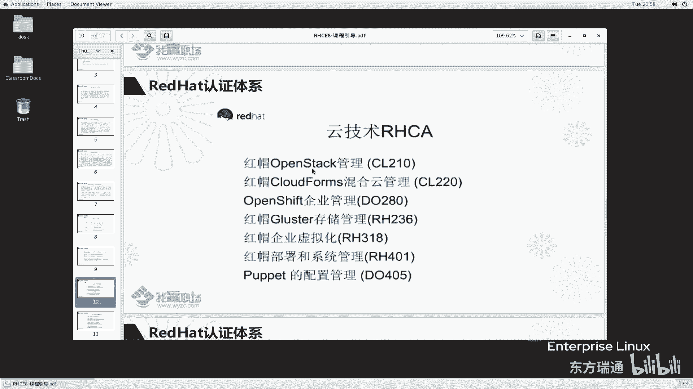

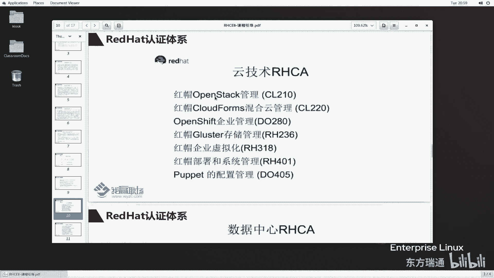

### RHCE认证课程

RHCE认证分版本，目前主要学习RHCE 8。RHCE 7认证已于2020年4月30日在中国区停止考试。

*   **RHCE 7 (RH254)**：主要内容是在RHEL 7系统上构建基础服务，如邮件服务器（Sendmail/Postfix）、数据库（MariaDB）、Web服务器（Apache）、存储服务器（iSCSI）以及NFS、Samba、DNS、DHCP等。
*   **RHCE 8 (RH294)**：核心内容是**Ansible自动化**。Ansible是一个用于自动化配置管理和应用部署的工具。

### RHCA认证课程

RHCA认证方向众多，主要分为云技术和数据中心两大方向。它与操作系统版本的关联性较弱，更侧重于在红帽系统之上构建和维护特定产品或解决方案。

以下是云技术方向的部分核心课程介绍：

1.  **CL210 (OpenStack)**：云管理平台，提供基础设施即服务（IaaS）。
2.  **CL220 (CloudForms)**：混合云管理平台，用于统一管理多个云环境。
3.  **DO180 (OpenShift)**：平台即服务（PaaS），用于容器化应用的管理和编排。
4.  **RH236 (Gluster 存储)**：分布式文件系统存储。
5.  **RH318 (企业虚拟化)**：基于KVM的企业级虚拟化产品。
6.  **RH401 (卫星服务器)**：用于大规模系统管理的平台。
7.  **RH405 (Puppet配置管理)**：自动化配置管理工具（目前红帽主推Ansible）。

此外，常用的课程还包括`DO407`（高级Ansible）和`CEPH125`（Ceph存储）等。

以下是数据中心方向的部分核心课程介绍：

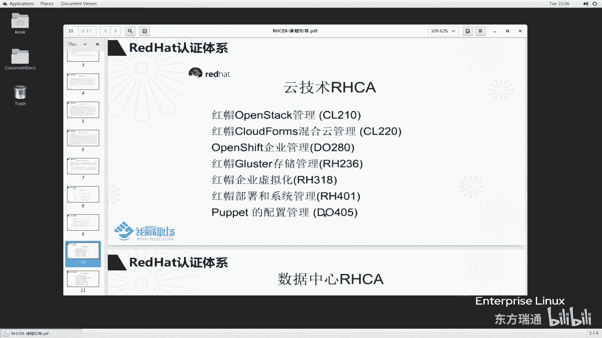

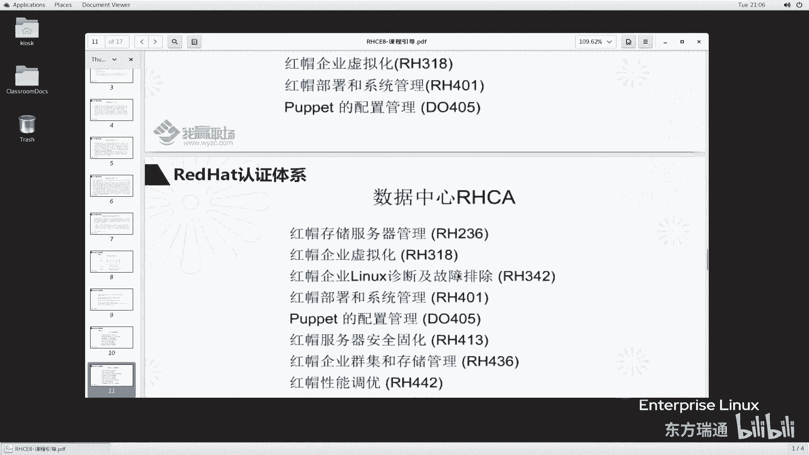

1.  **RH342 (系统诊断与排错)**：学习Linux系统故障的诊断与处理方法。
2.  **RH413 (系统安全加固)**：从安全角度对服务器进行加固和管理。
3.  **RH436 (高可用与存储管理)**：构建高可用集群及集群文件系统（如GFS2）。
4.  **RH442 (性能调优)**：深入讲解系统性能监控与优化，涉及CPU、内存、磁盘I/O和网络。

## RHCE 8.0 课程内容与结构 🎯

介绍完认证体系，我们聚焦到本系列课程的核心——RHCE 8.0。RHCE 8.0认证包含三门课程：RH124、RH134和RH294。

*   **RH124 - 红帽系统管理一**：针对无Linux经验的IT专业人员。涵盖Linux核心管理任务和生存技能，为成为全职Linux管理员打下基础。
*   **RH134 - 红帽系统管理二**：在RH124基础上，深入讲解系统核心技能，包括存储配置、系统安全、计划任务和系统部署等。
*   **RH294 - Ansible自动化**：专为需要实现配置、部署和编排自动化的系统员及开发人员设计。学习内容包括安装配置Ansible、编写**Playbook**剧本，并运行Playbook来自动化部署和管理服务器。

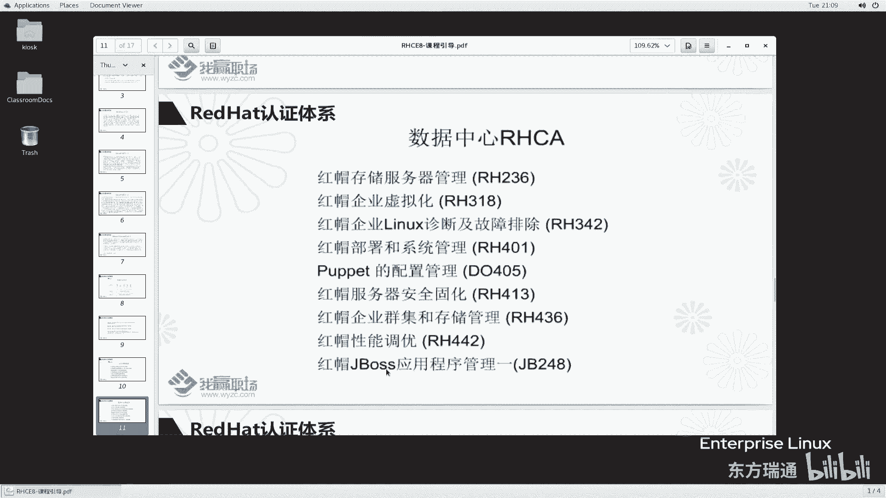

## 学习方法与建议 💡

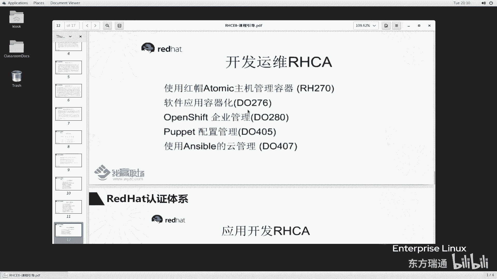

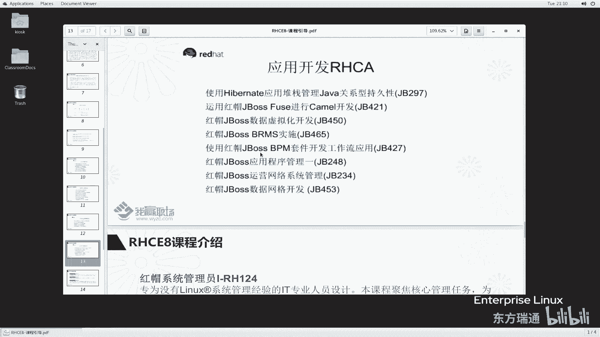

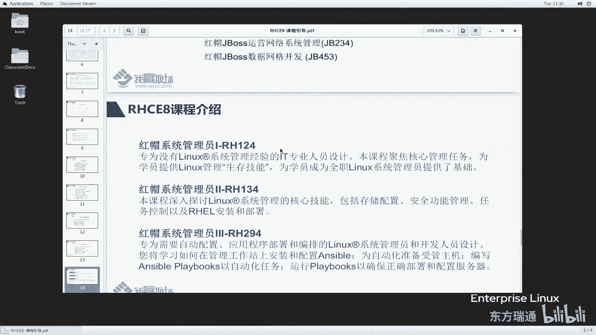

掌握了课程内容，我们来看看如何高效学习。对于线上学习，建议采用以下方法：

1.  **跟随练习**：观看视频演示时，可随时暂停或回放。在老师演示后，自己动手重复练习，这是掌握技能的关键。
2.  **多练习、多思考、多总结**：
    *   **练习**是为了熟练操作。
    *   **思考**是为了理解原理，探索是否有更优解决方案。
    *   **总结**是为了提炼经验，比较不同方法的优劣，做到举一反三。

## 学习环境准备 ⚙️

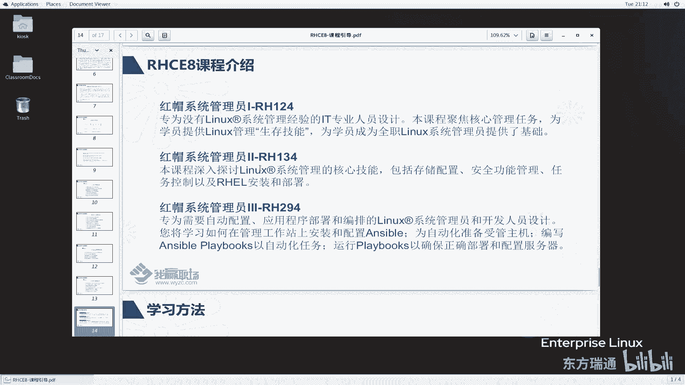

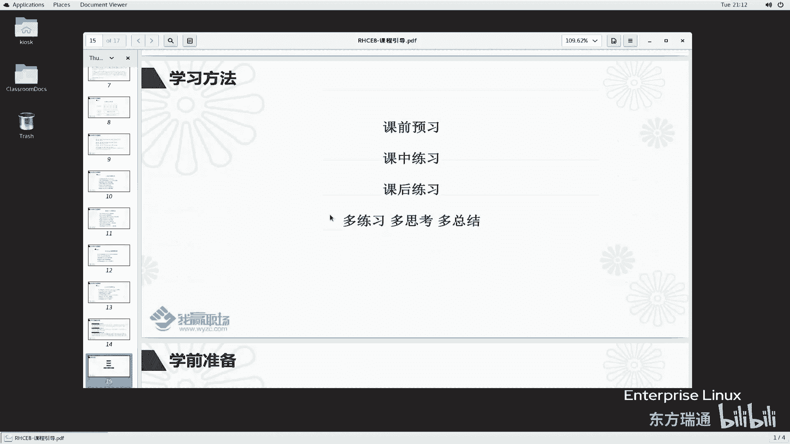

在开始正式学习前，需要准备好实验环境。以下是必需的软件：

*   **VMware Workstation Pro**：用于创建和运行虚拟机。
*   **X Manager**：用于远程连接和管理Linux系统。

---

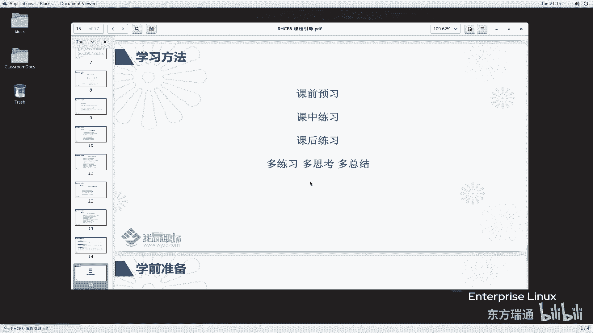

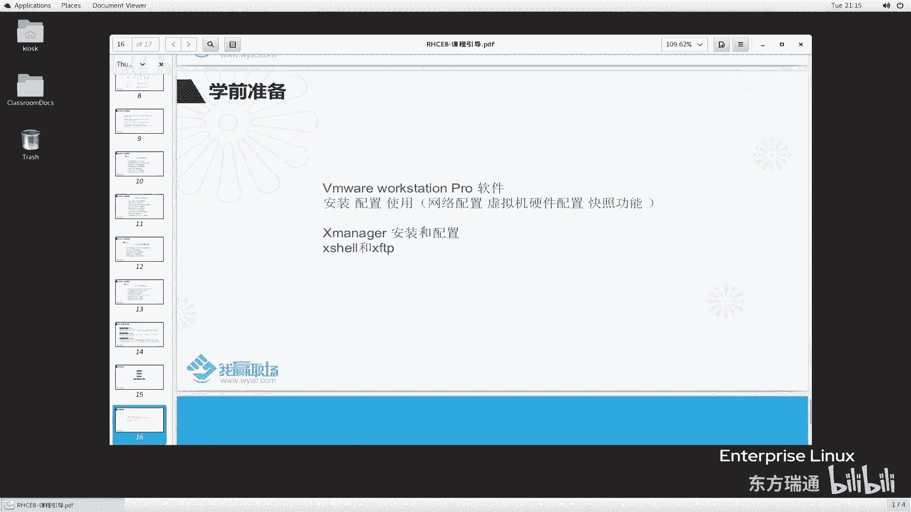

本节课中我们一起学习了红帽认证的完整体系，明确了RHCSA、RHCE、RHCA各级别的目标和课程内容，重点了解了RHCE 8.0的三门核心课程（RH124， RH134， RH294）及其以Ansible自动化为中心的特点。同时，我们也掌握了“多练习、多思考、多总结”这一核心学习方法，并准备好了所需的学习环境。接下来，我们就可以正式开始红帽Linux世界的神奇之旅了。