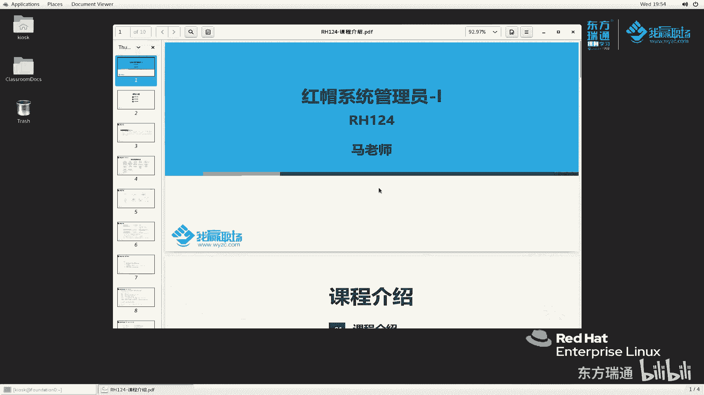
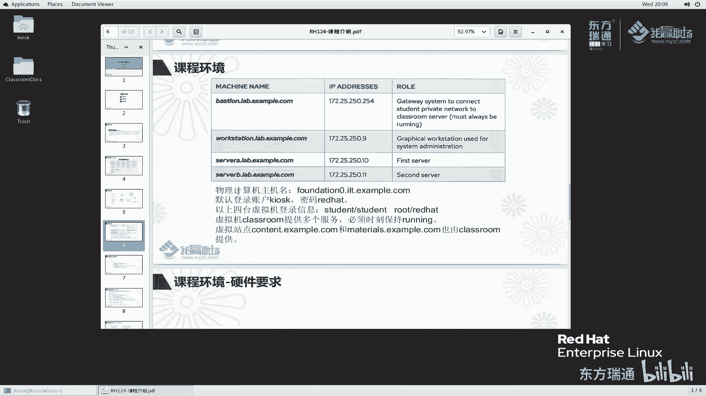
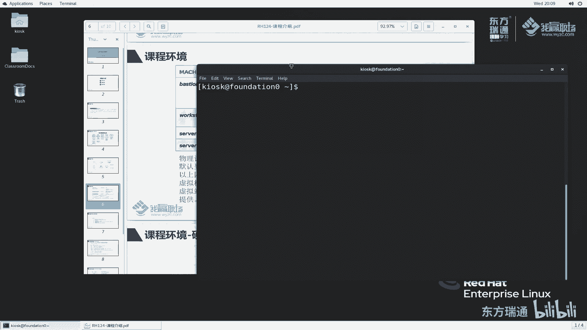
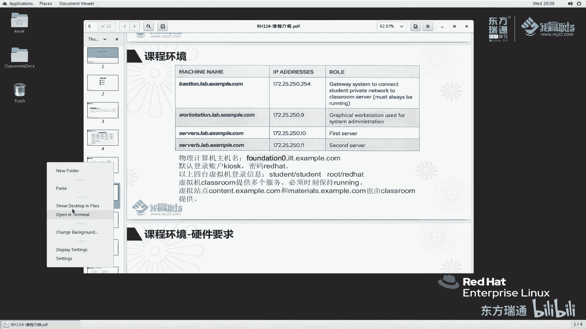
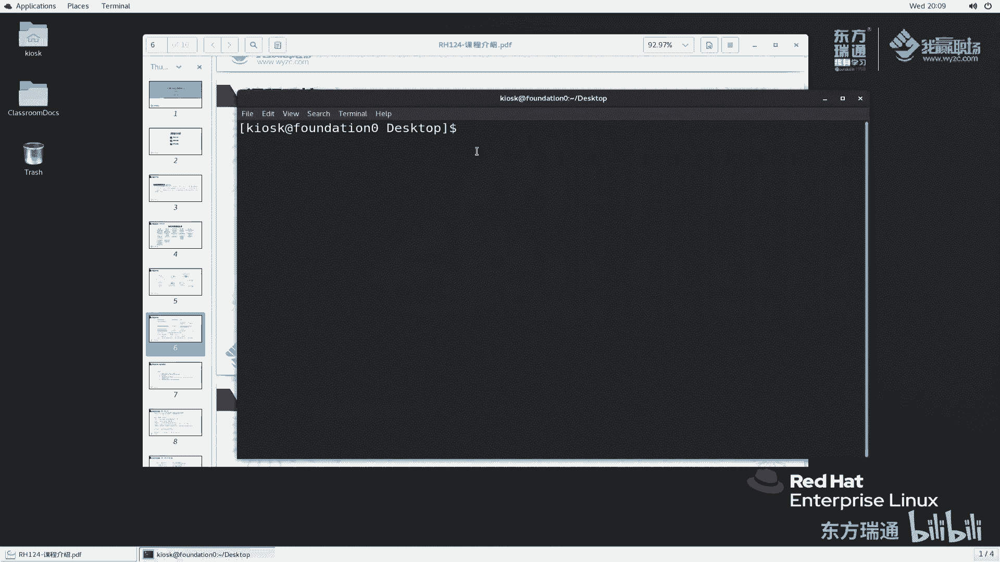
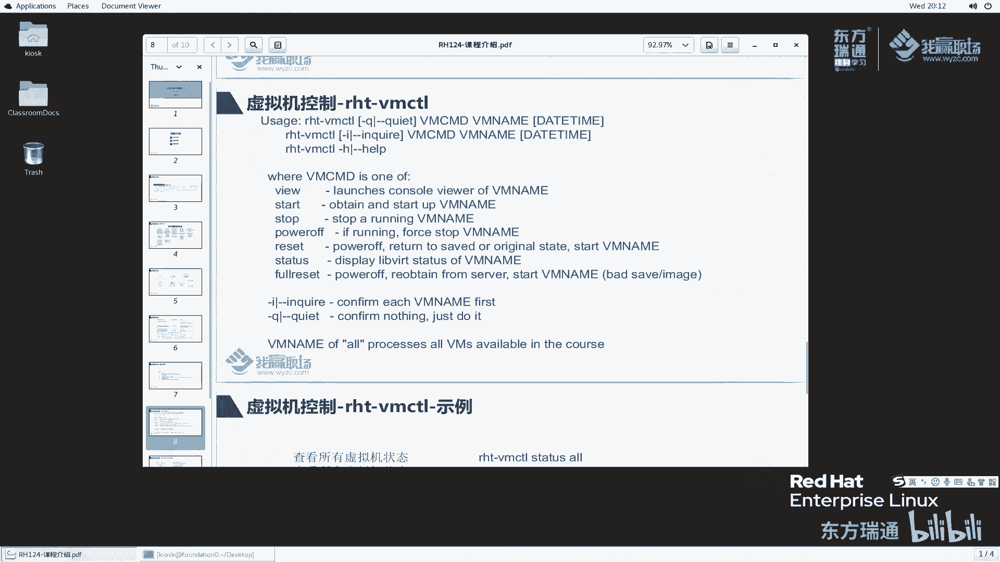

# 红帽RHCE认证培训（8.0版本）：P4：RH124课程介绍

在本节课中，我们将要学习红帽系统管理员一（RH124）课程的全面介绍。我们将了解这门课程的目标、详细的大纲结构，以及学习过程中需要用到的实验环境配置。

## 课程概述

红帽系统管理员一（RH124）是专门为没有任何Linux系统维护经验的IT专业人员设计的课程。这门课程主要聚焦于Linux的核心管理任务，为学员提供Linux管理的生存技能。课程通过引入关键的命令行概念和企业级工具，为学员成为全职Linux系统管理员打下基础。简单来说，RH124课程旨在为学员提供Linux核心和基础的管理任务知识。

## 课程大纲详解

RH124课程内容非常丰富且基础，共分为五天，大约包含15个章节。

### 第一天内容

第一天主要介绍Linux和红帽的基础概念，以及命令行的初步使用。

**第一章：Red Hat Enterprise Linux入门**
本章将介绍什么是Red Hat Enterprise Linux，了解红帽公司及其与Linux的关系，以及Linux发行版本等基础概念。

**第二章：访问命令行**
在操作系统维护过程中，我们主要使用命令行。本章将介绍命令行的基本使用方法。

**第三章：在命令行中管理文件**
上一章介绍了命令行的基本概念，本章我们将学习如何在命令行中管理文件。

**第四章：在RHEL系统中获取帮助**
在生产环境或日常学习中遇到问题时，我们通常会寻求帮助。虽然互联网信息复杂，但系统本身提供了许多官方文档。本章将详细讲解如何从系统中获取有效的帮助信息。

**第五章：管理文本文件**
服务器运行过程中的配置文件大多以文本文件形式保存。因此，更改服务器配置时，我们需要查看和编辑这些文件。本章将主要讲解这些操作。

### 第二天内容

第二天将继续深入学习系统管理的基础操作。

**延续第五章：管理文本文件**
我们将继续学习文本文件的管理。

**第六章：管理本地用户和组**
学习操作系统必须掌握用户管理。与个人Windows电脑不同，服务器（如Web服务器、数据库服务器）需要创建许多用户来保障服务正常运行。本章将详细讲解用户和组的管理。

**第七章：管理文件权限**
服务器上有许多文件和用户。本章将讲解如何控制用户对文件的权限，包括读、写、执行等操作。

**第八章：监控和管理Linux进程**
我们需要了解操作系统中运行了哪些进程，以及它们占用的CPU、内存和网络端口等资源。本章将讲解如何监控和管理这些进程。

### 第三天内容

第三天将学习系统服务和远程管理。

**第九章：控制服务和守护进程**
这部分内容可以类比Windows中的服务管理。本章将讲解如何管理Linux中的各种服务和与之关联的守护进程（daemons）。

**第十章：配置SSH服务器**
维护服务器通常通过网络进行。本章将讲解如何使用和配置SSH服务进行远程管理，以及如何加固SSH服务器安全。

**第十一章：分析和存储日志**
为了了解服务器的运行状况，我们需要记录和分析日志。本章将讲解日志的保存、记录和分析方法，这在运维管理中非常重要。

### 第四天内容

第四天将聚焦于网络管理和文件传输。

**第十二章：网络管理**
系统安装后必须配置网络才能进行远程管理。网络配置不仅包括IP地址，还涉及虚拟网桥、路由、DNS解析等。本章将包含网卡配置、网络聚合及网络故障排除等核心知识点。

**第十三章：归档和传输文件**
服务器运行会产生重要文件，需要定期归档并传输到远端服务器进行备份。本章将讲解系统提供的归档和文件传输工具。

**第十四章：软件包维护**
Linux系统由各个模块组装而成。本章将讲解如何使用RPM和YUM工具安装、更新软件包，配置YUM仓库，并介绍红帽8版本中引入的AppStream等重要概念。

### 第五天内容

第五天将学习文件系统和故障排除。

**第十五章：管理文件系统**
操作系统中的文件保存在文件系统中。本章将讲解文件系统的创建、挂载和访问，类似于Windows中的分区和格式化（如NTFS）。

**第十六章：分析服务器和获取帮助**
本章将讲解如何分析服务器的运行状态，以及出现问题后如何从红帽操作系统内部和红帽官方门户网站获取帮助信息。

RH124课程内容非常多。对于之前只接触过Windows的学员，初期学习可能会遇到一些挑战。但讲师会分享自身经验，帮助大家更轻松地过渡和学习。

## 实验环境介绍

下面我们来看一下在学习过程中会用到的实验环境。

### 网络拓扑与机器角色

实验环境共涉及多台虚拟机。右边四台机器（workstation, servera, serverb, bastion）位于`172.25.250.0/24`网络中。bastion机器还有另一块网卡（`172.25.252.0/24`），用于与classroom机器通信。

classroom机器充当资源服务器的角色，它提供实验所需的ISO文件、实验脚本（lab文件）和其他材料（materials文件）。bastion机器为serverb、workstation等提供DHCP服务，并作为网关，使它们能够与classroom通信。

物理主机（foundation）通过仅主机模式与这些虚拟机通信，实验环境通常不需要连接外部互联网。

以下是实验主要操作的四台机器信息（classroom机器无需操作）：
*   **bastion**: IP地址为 `172.25.250.254`
*   **workstation**: IP地址为 `172.25.250.9`
*   **servera**: IP地址为 `172.25.250.10`
*   **serverb**: IP地址为 `172.25.250.11`

其中，workstation是具有图形界面的管理机；servera和serverb是只有字符界面的服务器。

### 登录凭据与硬件要求

以下是各机器的登录信息：
*   **物理主机 (foundation)**: 默认使用 `kiosk` 用户登录，密码为 `redhat`。超级管理员为 `root`。
*   **实验虚拟机 (servera, serverb, workstation, bastion)**: 均有一个 `student` 用户，密码为 `student`。超级管理员为 `root`，密码为 `redhat`。

对于运行这些虚拟机的物理主机，RH124的最低硬件要求如下：
*   **CPU**: 支持虚拟化的 i3 或同级AMD处理器。
*   **内存**: 至少 8 GB。
*   **硬盘**: 至少 100 GB 可用空间。
*   **其他**: 分辨率 1280x720，千兆网卡。

为了获得更好的学习体验（尤其是运行多台虚拟机时），建议配置为：
*   **CPU**: i5 或更高。
*   **内存**: 12 GB 或 16 GB 最佳。
*   **硬盘**: 256 GB 或更大的固态硬盘（SSD）。

## 课程总结

本节课中，我们一起学习了RH124课程的完整介绍。我们了解了这门课程面向Linux新手、旨在传授核心管理技能的定位。我们详细梳理了为期五天、涵盖从命令行基础、用户权限、进程管理到网络配置、软件包管理和故障排除的丰富课程大纲。最后，我们介绍了实验环境的网络拓扑、各虚拟机角色、登录信息以及对学习设备的硬件要求，为后续动手实践做好准备。下节课，我们将讲解如何搭建和控制这个虚拟机环境。