# 红帽RHCE认证培训（8.0版本）：P6：01-RHEL入门1-什么让Linux变得伟大-开源软件介绍-Linux发行版本 📚

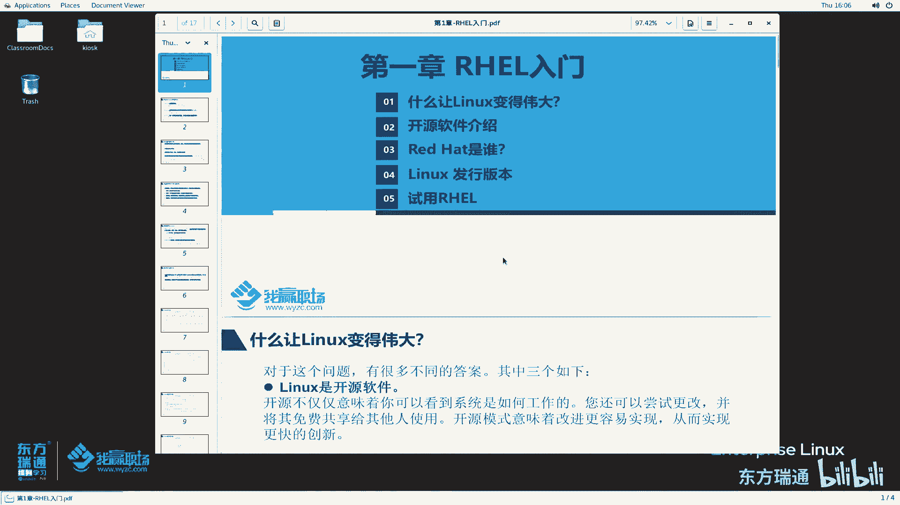

在本节课中，我们将要学习RHEL系统管理入门的第一部分。我们将探讨Linux操作系统的核心优势、开源软件的基本概念以及Linux世界中的主要发行版本。通过本节课，您将对Linux的生态有一个初步而清晰的认识。

## 是什么让Linux变得伟大？🚀

Linux之所以能在当今技术领域占据重要地位，主要源于其三个核心特性。

### 1. 开源软件
Linux自诞生之初就是一个开源软件。开源意味着其**源代码**是公开可用的。
```bash
# 开源的核心：源代码开放
任何人都可以获取、研究、修改和重新分发源代码。
```
这不仅允许用户查看系统如何工作，还促进了多人协作，共同维护和改进软件，从而实现了更快的创新。

### 2. 服务器导向的设计
Linux从创建之初就围绕**命令行界面（CLI）** 来构建。只要获得一个终端，管理员就能实现服务器的全面管理。
```bash
# 通过命令行实现自动化，例如使用Shell脚本
#!/bin/bash
echo “自动化部署脚本示例”
```
这简化了本地和远程系统的管理。命令行能完成的功能通常比图形界面更全面、更强大，后续课程中的大部分操作也将在命令行中完成。

### 3. 模块化操作系统
Linux本质上是一个**内核（Kernel）**。用户可以根据需要，像组装模块一样，在内核之上添加或移除图形界面、工具软件等各种功能。
```公式
完整的Linux系统 = Linux内核 + 用户空间软件（可选的图形界面、工具等）
```
这种模块化设计使用户能够对系统进行高度个性化的定制。

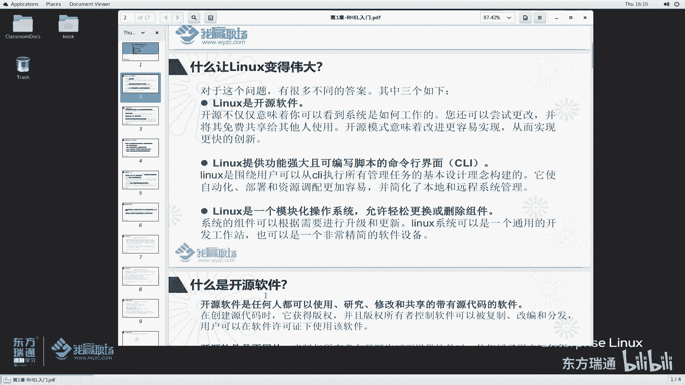

上一节我们介绍了Linux成功的三大支柱，接下来我们深入了解一下其中的核心：开源软件。

## 什么是开源软件？🔓

开源软件是指**任何人都可以自由使用、研究、修改和共享的软件，并且必须附带其源代码**。

开源软件的作者拥有版权，但通常在特定的开源许可证下，授予用户复制、修改和分发的权利。这促进了协作、共享、透明和快速创新。

需要明确的是，**开源不等于免费商用**。许多组织将开源代码用于商业产品，但必须遵守其对应的许可证条款。红帽公司就是通过支持、扩展基于开源产品的解决方案，并参与社区建设来获得商业成功的典型。

了解了开源软件的定义后，我们来看看它对用户的具体好处。

## 开源软件对用户的好处 👍

以下是开源软件为用户带来的四个主要优势：

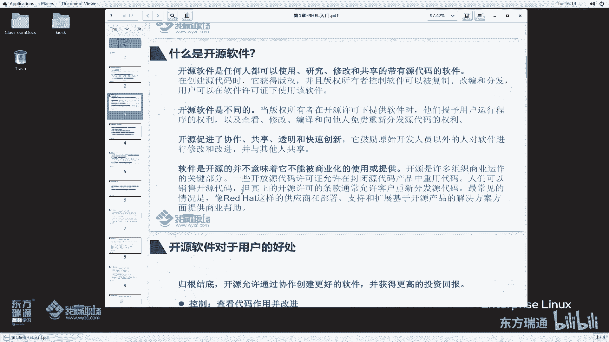

*   **控制**：用户可以查看代码如何运作，完全掌控软件。
*   **培训**：优秀的源代码可以作为学习材料，帮助开发人员提升技能。
*   **安全**：源代码公开便于审查，社区可以共同发现和修复安全漏洞。
*   **可持续性**：即使原始开发人员停止维护，社区其他成员也可以继续支持和发展该软件。

既然开源软件有这么多好处，并且受到许可证的保护，那么这些许可证有哪些种类呢？

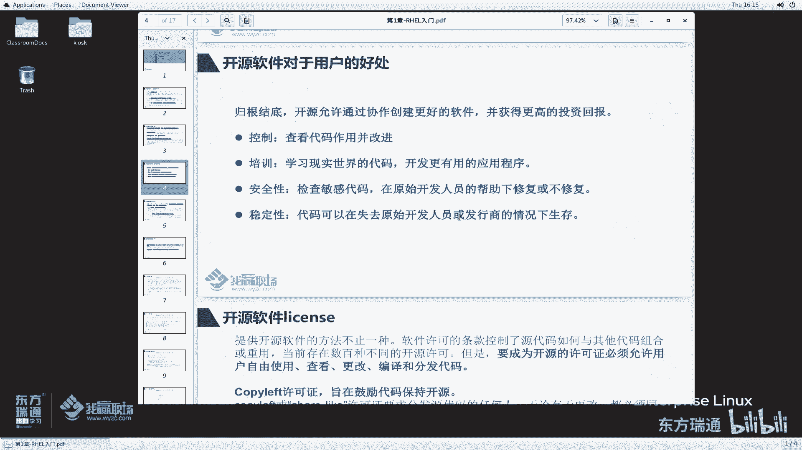

## 开源软件的许可证 📜

存在数百种不同的开源许可证，但它们都有一个共同点：允许用户自由使用、查看、更改和分发代码。

开源许可证主要分为两大类：

1.  **Copyleft许可证**
    *   **目的**：鼓励代码保持开源。
    *   **特点**：基于此类许可证的软件在修改后，其衍生版本也必须以相同条款开源。
    *   **典型代表**：GPL（GNU通用公共许可证）、LGPL。

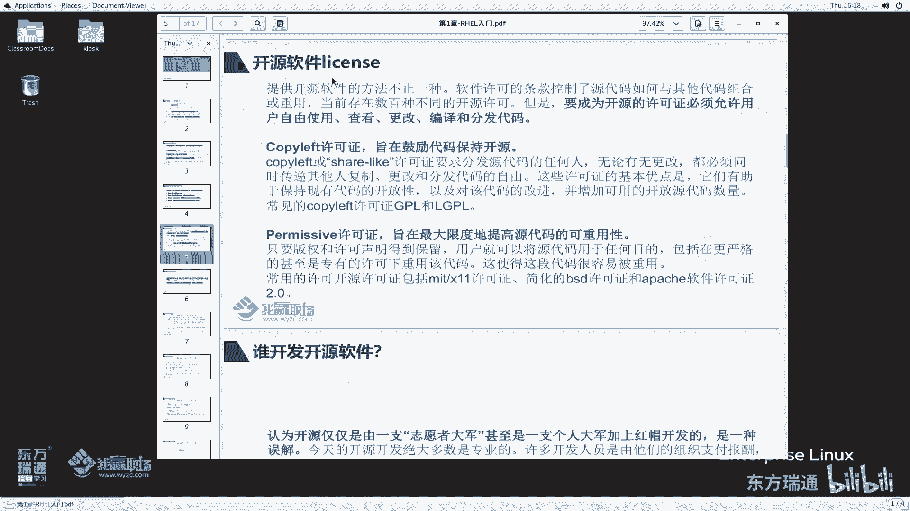

2.  **宽容许可证**
    *   **目的**：最大限度地提高源代码的可重用性。
    *   **特点**：只要保留版权和许可声明，用户可以将代码用于任何目的，包括在专有（闭源）软件中重用。
    *   **典型代表**：MIT许可证、BSD许可证、Apache许可证。

那么，是谁在开发和维护这些庞大的开源项目呢？

## 谁开发了开源软件？👥

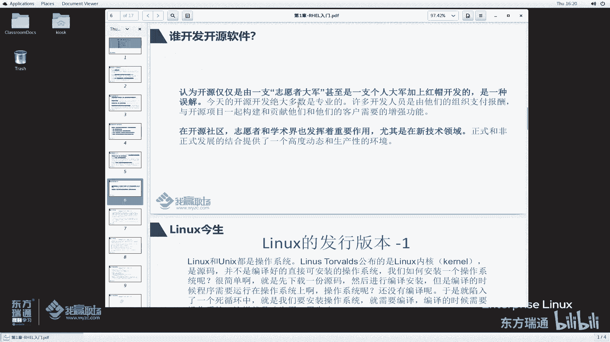

开源软件的开发主要来自三股力量：

1.  **组织资助的专业人士**：如英特尔、AMD、红帽等公司会支付报酬，让员工在开源社区中贡献代码。
2.  **社区志愿者**：全球各地的技术爱好者无偿贡献自己的力量。
3.  **学术界**：尤其在新兴技术领域，高校和研究机构发挥着重要作用。

这种正式与非正式开发的结合，创造了一个高度动态且高效的生态环境。

开源社区孕育了Linux，但一个纯粹的内核并不能直接使用。那么，我们日常使用的Linux系统是如何产生的呢？

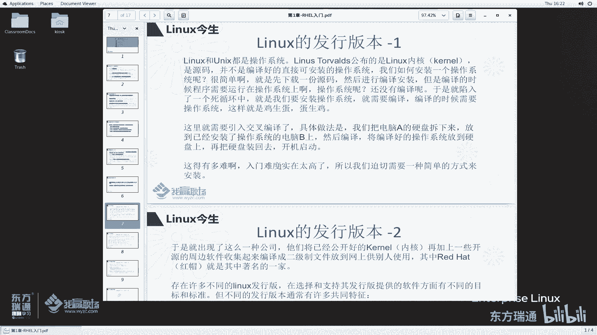

## Linux的发行版本 📦

Linux内核本身只是一个开源项目，用户需要自行编译才能得到一个可运行的操作系统。这对普通用户来说门槛很高。

因此，出现了**Linux发行商**。它们将Linux内核与一系列精选的软件包（如工具、库、桌面环境）整合起来，编译成易于安装和使用的二进制操作系统。Red Hat（红帽）就是其中最著名的公司之一。

一个完整的Linux发行版通常具有以下特征：
*   由**Linux内核**和**用户空间软件**集合组成。
*   提供安装和更新系统组件的方法。
*   发行商为该软件提供支持，并最好能直接参与上游社区开发。

当我们谈论“Linux版本”时，通常指的是**发行版版本**（如Red Hat Enterprise Linux 8），而非内核版本。

Linux发行版数量众多，我们可以根据维护主体将其分为两大类。

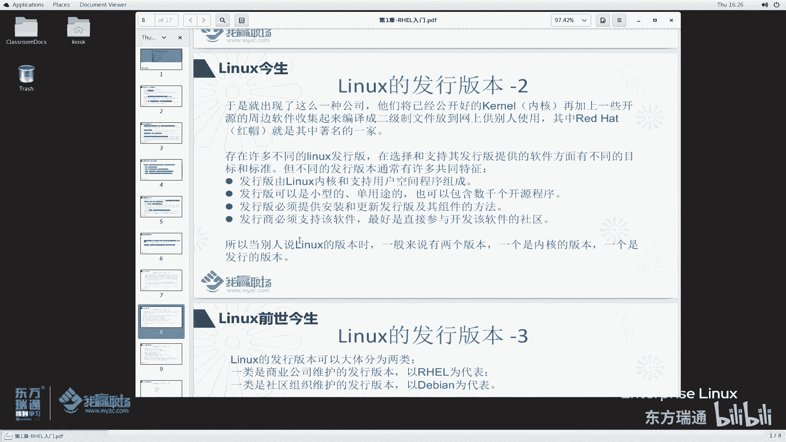

## 主要的Linux发行版家族 🌍

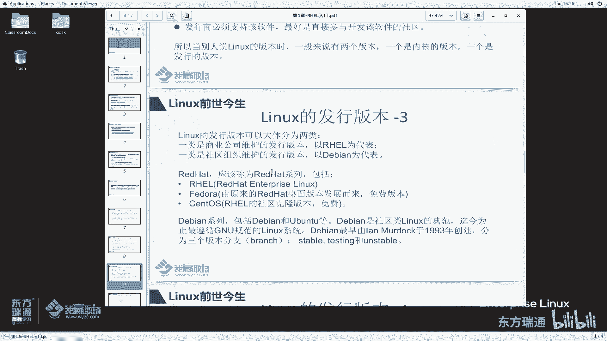

### 1. 商业公司维护的发行版
以**红帽（Red Hat）** 为代表。
*   **Red Hat Enterprise Linux (RHEL)**：红帽企业级Linux，需购买订阅以获得商业支持。
*   **Fedora**：红帽赞助的社区项目，是RHEL的前沿测试版。

### 2. 社区组织维护的发行版
以**Debian**为代表。
*   **Debian**：以其对GNU精神的严格遵循和稳定性著称，完全由社区维护。
*   **Ubuntu**：基于Debian，更注重桌面用户友好性，由Canonical公司提供商业支持。

此外，还有一些重要的衍生版本：
*   **CentOS**：曾是RHEL的**社区克隆版**，免费提供与RHEL高度兼容的稳定系统。请注意，CentOS项目战略已发生变更。
*   **openSUSE**：SUSE Linux Enterprise (SLE) 的上游社区版本。

关于Linux发行版本，我们暂且介绍到这里。下节课我们将聚焦于本节课多次提到的红帽公司。

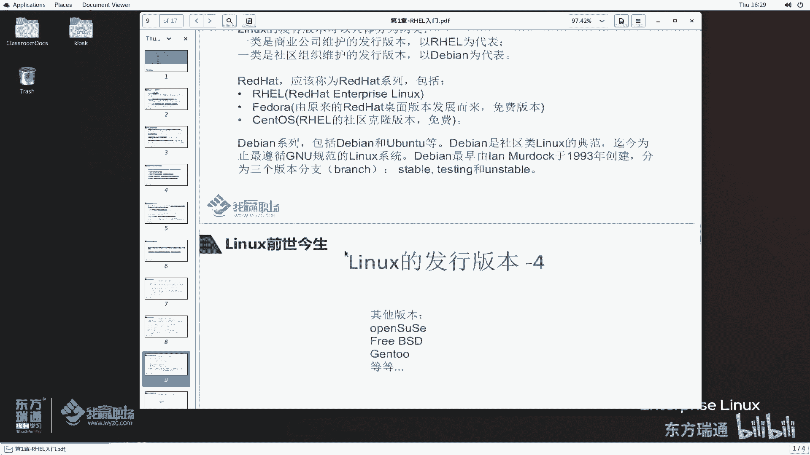

---

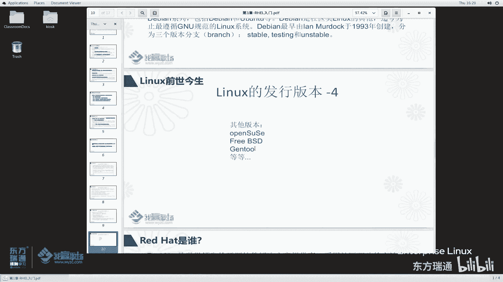

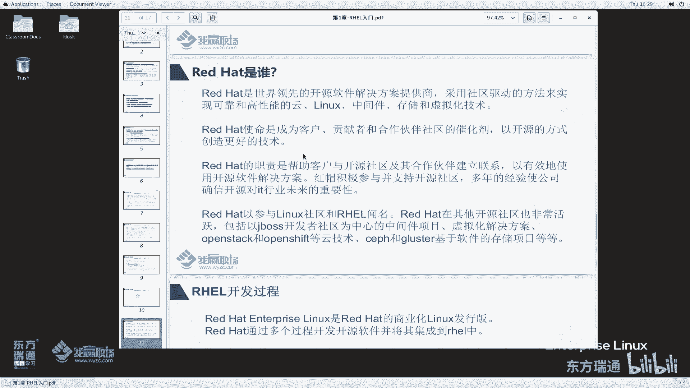

**本节课总结**：本节课我们一起学习了Linux系统的核心优势，包括其开源本质、服务器导向的设计和模块化架构。我们深入探讨了开源软件的定义、好处及主要许可证类型。最后，我们梳理了Linux发行版的概念和主要家族，为理解红帽在其中的定位打下了基础。