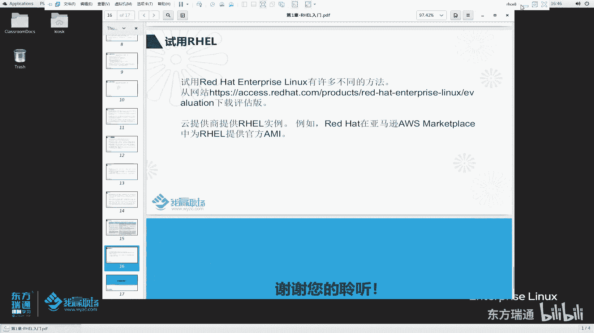
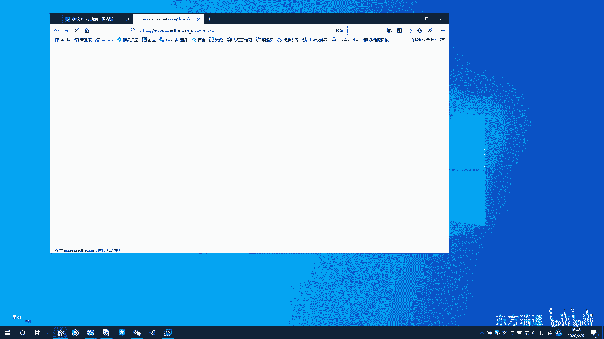
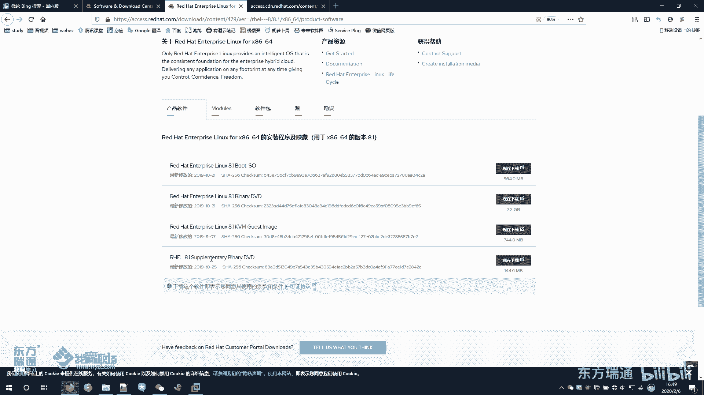
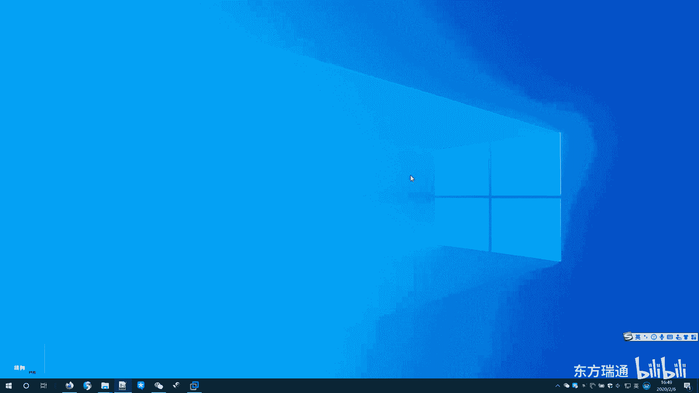
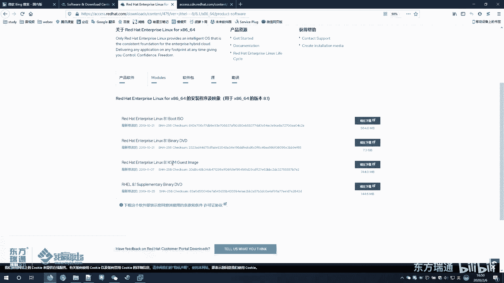
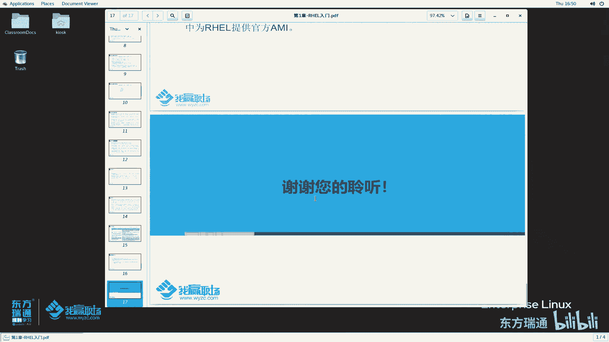

# 红帽RHCE认证培训（8.0版本）：P7：01-RHEL入门2-RedHat是谁-试用RHEL

## 概述
在本节课中，我们将学习红帽公司的背景、其核心商业模式，以及红帽企业Linux与其他相关Linux发行版（如Fedora和CentOS）之间的关系。我们还将了解如何获取和试用RHEL系统。

---

## 红帽公司简介
红帽是世界领先的开源软件解决方案提供商。它采用**社区驱动的方法**来提供可靠、高性能的云、Linux、中间件、存储和虚拟化技术。

上一节我们介绍了开源软件的基本概念，本节中我们来看看红帽是如何运作的。

### 社区驱动方法
开源软件通常由来自不同组织的专业工程师共同开发。红帽积极参与这些开源社区，投入资金和开发资源。当社区中的某个软件项目成熟并具备商业价值时，红帽可能会将其整合或“收编”到自己的产品线中。

红帽的使命是成为客户、贡献者、合作伙伴和社区的催化剂，以开源的方式创造更好的技术。红帽本质上是一家**销售服务**而非单纯产品的公司。其许多产品本身是开源的，但企业用户需要购买订阅来获得技术支持、更新和补丁。

红帽的职责是帮助客户与开源社区及合作伙伴建立联系，从而更有效地使用开源软件解决方案。红帽的许多产品都是基于社区软件进行二次开发或封装而成的。

---

## RHEL的开发过程
红帽企业Linux的开发过程与其参与的社区紧密相关。要理解RHEL，需要了解以红帽为代表的Linux发行版家族。

红帽公司会参与开源社区，贡献代码和开发者的时间，并提供技术支持。它与其他Linux发行版的工作者协作，共同提高软件的整体质量。

红帽会将成熟的开源软件集成到一个社区驱动的Linux发行版——**Fedora**中。新软件会优先在Fedora中进行测试和磨合。经过一段时间的稳定运行后，这些软件才会被集成到**RHEL**系统中，最终提供给企业用户使用。

因此，Fedora可以被视为RHEL的“前身”或“测试场”。

---

## 相关发行版比较
以下是Fedora、RHEL和CentOS这三个关键发行版的介绍与比较。

### Fedora
Fedora是一个社区项目，它发布一个完整、免费、基于Linux的桌面操作系统。其桌面环境美观且功能丰富。

Fedora项目完全由自由和开源软件贡献组成，任何人都可以参与。它注重创新，但更新节奏快（每6个月一次重大更新），每个版本的支持周期较短（约一年），且变化较大，因此**不适合用于企业生产环境**。

简单来说，Fedora是RHEL系统的一个“过渡期”或实验平台。

### Red Hat Enterprise Linux
RHEL是一个企业级、拥有商业支持的Linux发行版本。它同样开放源代码，并拥有一个由合作伙伴、硬件/软件认证、咨询、培训和多年支持组成的大型生态系统。

RHEL的许多软件包基于Fedora，但经过了进一步的增强和测试，以满足企业客户的需求。红帽采用**基于订阅的分发模式**。用户购买订阅后，可以获得技术支持、维护更新和补丁。红帽还提供门户网站，订阅用户可以在其中获取文档、工具和支持。

### CentOS
CentOS是一个社区驱动的Linux发行版，其绝大部分源代码来自红帽公开的源代码。它是一个免费的操作系统，由活跃的志愿者和社区人员提供支持，并独立于红帽运营。

接下来，我们具体比较一下RHEL和CentOS的核心区别。

以下是RHEL与CentOS在支持与服务方面的主要差异：

1.  **技术支持级别**
    *   **RHEL**：提供多级别商业支持，包括标准工作时间支持或7x24小时关键问题支持，具体取决于订阅级别。
    *   **CentOS**：依赖社区和自助，没有官方的商业技术支持。

2.  **问题响应与修复**
    *   **RHEL**：红帽内部开发团队可快速响应问题，并在官方更新发布前为订阅用户提供修复。
    *   **CentOS**：需等待红帽发布源码后，由社区志愿者编译并发布更新，周期较长。

3.  **更新与维护周期**
    *   **RHEL**：为旧版本提供扩展更新支持，维护周期长（通常数年）。
    *   **CentOS**：社区版本的更新周期较短，旧版本可能很快停止维护。

4.  **软硬件认证**
    *   **RHEL**：获得数百家ISV和成千上万程序的官方认证，兼容性与稳定性有保障。
    *   **CentOS**：通常未经大型商业软件的官方认证，兼容性需自行测试。

5.  **附加工具与服务**
    *   **RHEL**：订阅用户可访问红帽门户，获得大量文档、知识库及性能分析工具。
    *   **CentOS**：依赖社区文档和开源工具。

对于不缺钱的企业，生产环境首选RHEL。若考虑成本，可能会选择CentOS并自行维护。许多学习RHCE认证的学员，未来维护的也可能是CentOS系统。

---

## 获取与试用RHEL
红帽为其产品提供了试用途径。用户可以访问红帽官方门户网站下载产品进行评估。

并非所有红帽产品都提供免费试用，但RHEL通常可以下载评估版。访问 `access.redhat.com/downloads` 页面（无需登录），可以找到红帽的基础设施、云计算、存储等多种产品。

以RHEL 8为例，点击进入后可能需要登录（需注册红帽账户）。在下载页面，通常会提供多个镜像：
*   **Boot ISO**：用于启动和修复系统的镜像。
*   **Binary DVD**：完整的操作系统安装镜像（体积较大，约7-8GB）。
*   **KVM Guest Image**：预配置的虚拟机镜像，可直接在KVM虚拟化环境中使用。
*   **Supplementary**：额外的软件包集合。

此外，主流云服务供应商也会提供RHEL镜像，用户可以在云平台上直接创建RHEL实例进行体验。

---

## 总结
本节课我们一起学习了红帽公司的背景及其“社区驱动，服务盈利”的商业模式。我们梳理了Fedora、RHEL和CentOS之间的关系：Fedora是前沿的测试平台，RHEL是稳定的企业级产品，而CentOS是基于RHEL源码的社区免费版本。最后，我们介绍了如何从红帽官网获取并试用RHEL系统。理解这些内容，是深入学习红帽技术体系的基础。