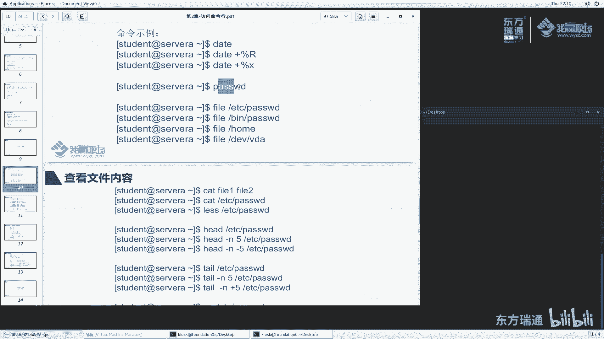
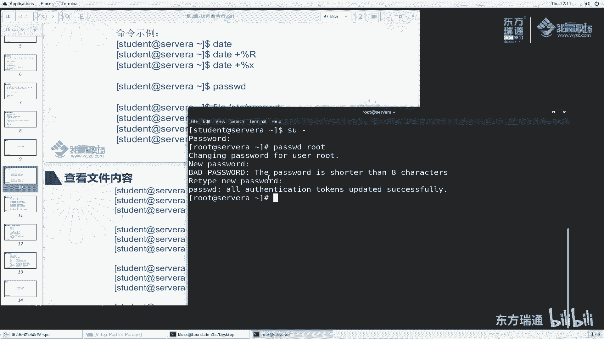
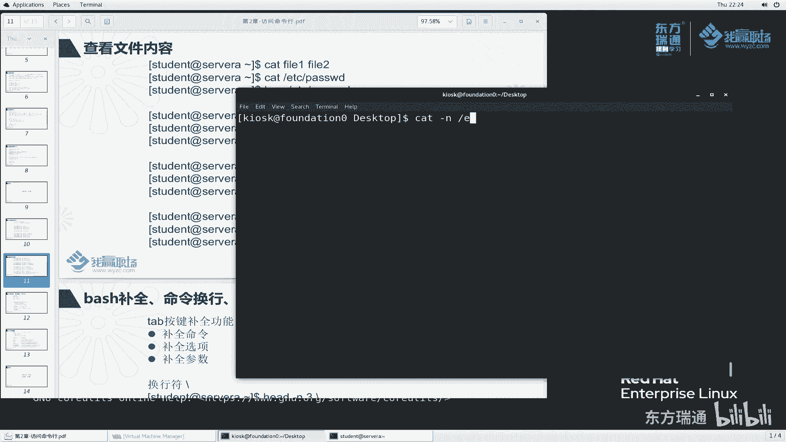

# 红帽RHCE认证培训（8.0版本）-备考红帽认证必修课，快来一起学习起来吧 - P10：02-3-bash执行命令1-date--passwd--file--cat--less--head--tail--wc - 东方瑞通 - BV1P44y137Fg

同学们好，欢迎来到我赢职场hc 18课堂，我是马老师，那么上一小节呢我们给大家讲了一下这个shell程序vs命令行。

那么这一小节呢我们来给大家演示一下这个拜师命令行里面，这些常见的命令怎么用，那么在后续的课程当中呢，我们会用到很多些命令，那这一小节呢我们先给大家挑一部分经常用的命令给大家讲解一下，在第二小节里面。

我们刚刚说过，执行命令的时候是敲一个字符串之后按一个回车，那么如果说我们要执行多个命令，那我怎么执行呢，好例如说我们执行一个p w d命令，那我想把这两个命令连在一块执行，怎么执行呢，中间呢使用封号啊。

l l s封号p w d，这样大家来看一下效果，l s呢给我们显示了这个样子，p w d呢给我们显示了这么一个结果，所以说这两者命令呢放在这里面，那么它会按这个命令的先后顺序去给我们执行。

这两者两个命令是没有什么优先级的啊，那么封号前面呢它先执行封号，后面的是后执行，当然我们还有可能来三个六，说我再加一个命令，host name，host name呢是用于显示主机名的，给我们显示的。

那么我们这样执行host name封号p wd封号i s，大家来看一下，似乎这个地方确实是啊，第一个命令呢显示它的一个结果，然后第二个封号后面第一个封号后面呢这个然后第三个以此类推，好，大家要知道啊。

我们这个多个命令呢用封号来代替好多个命令之间用分号来代替，用于隔离，那么它会按照封号的这个先后顺序去执行我们的命令。

这是命令执行的方法，那么再来看一下，这里面给我们提供了一些命令的事例。

好在第二小节里面我们给大家讲过了，那么看命令的时候有一个看命令的方法，比如说date刚刚help去获取命令的帮助信息，那么现在我想使用date命令怎么用呢，回车好。

这个给我们显示了date这么一个命令，有点长是吧，我们往上翻翻翻翻，一直翻到这儿，他给我们显示了这么一个命令帮助信息。

好在这里面呢，我们再去开一个窗口，那么我们使用这个窗口呢去执行，而这个窗口呢作为我们这个查看方便，我们看这个命令怎么用的，这个命令的使用方法呢，首先是date。

然后加上选项和加上后面这个format格式，那么我们来解释一次date，然后加上选项，我加哪些选项呢，例如说我加一个杠d，这个d是什么意思呢，他说这个地方这个地方有一些参数啊。

是long option啊，这个是有些是必选的，有些是有些是可选的，是不是啊，那么我们看d d是刚刚对的，它是用于显示这个时间这个描述的，根据这个字符串描述的时间来显示，那么如果说我们不加它。

默认显示的是当前的时间，那么六时候给大家写下杠d杠d，然后呢加上一个单引号，这里面加一个字符串啊，例如说嗯加一个三天days好，我们这个命令执行之前呢，我先按一个ctrl c好吧，date回车。

它给我们显示的是这么一个效果，当前的时间是呃星期四，然后呢2月6号22：06，那么date杠d我们把这个复制过来，看一下它给我们显示的是什么效果，此时达到的效果是什么呀，是2月6号了吧。

是不是三天后的这么一个时间呢，诶确实是啊，确实那么三天后，例如说我们多写几天，我们看看能不能加三个月后呢，mn看一下诶，它不是别的什么month m n t h s，这识别的是吧，三个月后是5月6号。

当前是2月6号诶，确实非常有意思是吧，根据你描述的时间给我们显示，因为我能不能说去加一个加一个三分钟呢，三分钟之后呢好22：09，那么当然我们能不能说去减一个呢，看一下建一个是零四了吧。

现在date一下是不是零七呢，确实是这样啊，由于我们想看一下与当前时间对比，说几天前那个时间他是什么样子，去查一下我们自己大脑去算的话，可能算的不是那么准确是吧，没有这个计算机算的准确一点啊。

啊这是date给我们显示这么一个实践啊，这是d选项啊，那么当然还有很多一些选项，我就先给大家讲了这么一个d，那么我们再来看第二个其他选项，根据自己需要去设置啊。

那么再来看这个fmate fate是按照什么格式来显示的，往后看说控制着这个输出，那么与这个是可以呢，可以与下面进行一个集成，按顺序进行一个集成，哎我们来敲一个敲一个啊。

首先我们把当前的时间给我们显示一下，date一下，那么date这个格式什么，for it，大家看好了，format前面是有一个加号的，所以说我们加号一定要写来写个加号。

然后呢这个位置说是加他加的是加加fmate吧，fate那fate是以下其中一个可以替换，那例如说我来替换一下加百分号小a来看一下，小a显示的是简短的周的名称，例如说上好，我们加一个回车，诶。

这个地方是什么，这个地方我刚刚写的是小a是吧，这个大a了啊，大a是一个完整的名称，那么小a呢是星期几呢，看一下是星期四thursday啊，一个是名称啊，有时候我们就想看今天星期几是吧，还可以这么看啊。

那么我们还想有时候想显示什么，显示这个月当中的第几天来小d一下，看一下今天是2月6号对吧，那么当然还有很多，例如说我想看小时是吧，小时24小时之内，还说12小时制的，那么以及以什么以及我们这个地方啊。

这个003呢还有什么什么这这这个方式的啊等等等都可以啊，都可以啊，那么还有各种方式啊，例如说我们看这个他说按照这种格式来显示，来百分号x来看一下，2020年2月6号，他以这种格式来显示的。

那能不能说我只想显示这个零二呢月份呢也可以啊，能不显示年份呢也可以呀，那大家可以看到这里面似乎都能给我们展示的吧，粘的这个是短的。

这是按照特定格式给我们显示好。

date meaning哈，用于显示时间的，大家记住了啊，那么刚刚还给大家讲了一个叫host啊，额外补充一个host，当我们执行这个字符串，我们理解为叫执行这个命令。

回车显示的是主机名啊，这局面password给大家讲过了。

是用于设置密码的，其实password除了修改自己的密码呢，还可以做很多的设置，那关于这个设置呢，我给大家先演示一个，我们想演修改什么呢。

哦当然大家看到我这里面例子啊，老师你这个地方是student server a给我举的例子。

那么现在怎么变成这个样子呢，没有关系啊，没有关系，其实是一样的效果，那么这样啊，为了跟我这个视力一样的，我给大家演示一个采取这个命令啊，s h student at一下我们的server a。

这个我们刚刚讲过了啊，叫远程登录到一个服务器上去操作回车，此时大家看到我们这里面是student sa了吧，好我们按一下clear回来，然后再来看这个password p a s s w d修改密码。

我们说过了这个地方我就不给大家演示了啊，那么换一个su杠，我切成我们的管理员用户，大家暂且记住，切成管理员用户就可以了，密码right hand回车，此时它的符号变成了这个样子，我想使用p s w d。

我设置设置什么，设置一个用户的密码，就是设置root密码，他说你这个root密码是什么新的密码，我们输red head回撤，red head回撤，他说你这个密码太短了是吧，但是太短了，我们重复输。

重新输入一次之后，他还是更新成功了，root账户就是这么牛，它可以带设置其他用户的密码对吧，也可以不受密码策略的限制，即使短于八位，我们也能够设置成功是吧，那么问题来了，老师这个密码策略怎么设置啊。

问题非常好，我们后续再给大家讲啊，暂时先放在这，这个呢是属于rhc的内容，我们有机会再跟大家聊好吧，那么我们再来看一看这几个命令，file和cat之类的好。

还是一样的，ex t退出，然后呢执行file file这个命令呢是字面意思就是文件，那它是用于判定文件的类型的，刚刚help，此时我们往上面翻，那这个说是确定文件的类型，那怎么确定的呢。

说后面跟上我们对应的文件啊，加上对应的选项，这个基本我们不用啊，我们直接加file，加上文件就可以了，那么我们来看一下啊，还是一样的，敲个空格啊，敲个空格让我们回到最底下，或者可列一下啊。

其实这个地方啊大家看了，我直接按一个ctrl加l，老师你怎么记住这么多快捷键是吧，没关系，你们经常用，你们也会记住啊，ctrl加l我们随便敲，你看随便敲敲敲，我这按ctrl cl。

那么你们看我的屏幕是不是很清晰啊，眼光就能够聚焦到这个位置对吧，发you我们看一个呢password，那这个什么意思呢，他会告诉我们说你这个文件好，我们暂且这个文件这个目录下面的这个文件。

老师你这个文件怎么表示成这个方式呢，啊后续我们给大家讲啊，这文件为什么这么表示，反正大家记住了，这是代表一个文件的一个路径，那么他说了哈，这个文件的类型是什么呀，阿斯克码text文件，文本文件。

文本文件内容基本上我们是可以读取的是吧，我们之前讲过一个cat命令，看一下，他说的回撤好，确实能够读取啊，阿斯克码的文件，那么我们再来看一下，除了这个阿斯玛的文件。

大家还记得我们之前好像说了一个命令叫password是吧，我们执行password这个命令的时候，那这个文件是什么类型的文件呢，啊首先我要知道这个文件在哪个路径下面的好，我知道他在bbs下面去是吧对吧。

老师你怎么记住呢，你是不是看这个地方的啊，不是我经常用啊，经常用来看一下，他说这个文件类型啊，是什么设set uid这么一个等等等lsb的这么一个文件类型啊，这么一大长串好，大家记住了。

这是一个可执行的一个i进制程序文件就行了，它是一个i进制程序好吧，一个程序，那这种刚刚我们看到这种文本文件二进制程序，那么还有什么呢，还有说六说病他他什么，他说他是一个什么什么软链接是吧。

符号链接连到连到这个这个里边去了啊，不管了，反正你是一个链接对吧，那么再来看一个嗯发爻里边一个什么呢，例如说我们刚刚有一个home目录，他说它是什么，它是一个目录啊，目录那文件有很多种类型的文件对吧。

那linux里边它设计的时候就说哎很多东西都用文件来表示，那么我们对文件操作的时候，其实就是对我们系统做一些操作啊，那还有一个dv里边一个vda，它给我们显示这个地方是block special。

block是快，special是特殊的意思是吧，然后大家看到老师你你你学这个红帽的时候，发现这里面英文单词太多了，确实是这样啊，确实是这样子，因为这个老外的东西啊，很多都是英文的材料啊。

所以说我们对英语呢要有一点基础，没有基础呢，初步我们同学去初步去学的时候可能会比较累，比较辛苦一点，那么你的系统上面可以装个单词啊，装词典啊，遇到不懂的话，查一下，经常见呢就熟悉了啊，就清楚了好吗。

快设备这个块设备呢我们就暂且就理解为硬盘设备啊，block设备是硬盘，是存储设备，那用来存储数据的好吧，是用于存储设备。

那么还有当然还有很多啊，这个地方呢我们暂且给大家演示到这里，反正file是代表查看文件类型的对吧，那么我们再来看一个cat啊，还有还有很多啊，我们再来看这个cat。

cat是用于查看文件的内容的，那cat刚刚help，那么我怎么去查看这个文件内容呢，选项文件。

那么我们来挑一个啊，那么换一个啊，我们这两者交换一下好，cat是什么呢，cat一个例如说我们这里面给我们提到的什么文件一文件二是吧，那么我们cat一下发一，他说什么呀，当我执行的时候。

他给我出这么一个信息，说cat冒号file一冒号，no such file or direction啊，这个地方给我们提示的是一个报错信息，清楚了啊，是一个报错信息，他说我们执行这个命令的时。

执行这个命令的时候，cat告诉我们啊，cat这个工具告诉我们说，你这个发小一发于这个文件不存在啊。

所以说我给你们举个例子的时候并不是完全正确的啊。

那么我们去查看文件内容，肯定要查看一个文件存在的这么一个内容，我才能查看呢，来看一下当前目录下面有一个classroom，我在ls s classroom里边看看有什么呢。

有很多文件来我cat一下什么呢，我cat一下classroom里面有一个文件叫history这么一个文件好出来了吧。

好回车好，有很多好很多，那么这个文件内容我们就查看出来了，那cat除了这种查看点，我能不能看的时候，能不能把这个文件的行号也显示出来，可以啊可以啊，来看一下我们换一个password文件。

这个文件的内容少一点啊，这个少看另外一个ho这个文件的内容比较少，我们cat加上一个什么往上翻，翻过来之后呢，我们加一个杠n杠n看一下什么意思。

有没有说number number of output flies，说我们要把这个所有的输出啊，全部加一个什么，加一个字符带一个给它标记一个啊，来回车看一下有没有标出来诶，第一行是一，第二行，第三行。

第四行是空行，空行我也给你标出来了，56789啊，全部标出来了，是不是啊，诶我们还有一个叫杠b说也是标行，但是呢空行我不会加数字来再来一次啊，我们把这个n换成b，a似乎第一行，第二行。

第三行400 567，诶，你刚刚不是九行吗，怎么现在变成七行呢，诶这个这个地方第四行是空行，第九行是空行，没有显示吧，它没显示了，但是没标吧，唉这就是我们讲的选项用于控制输出的行为。

其中杠b跟杠n很明显，这两者啊控制不同的输出，当然了，还有很多就是说我输出文件的时候，我看一下这个文件的tab谱给它打印出来，那么还可以干什么呢，可以把文件的这个末尾符啊看一下，嗯。

这里面有一个刚大一刚大一显示这个文件的末尾行，那么这个文件的末尾呢用dollar符号来代替来试一下，那么我们就加一个杠，b和杠一连在一块看一下，好发现每个文件的末尾，每个行末尾都有这个dollar符号。

表示文件末尾换行了是吧，那么当然还有很多种方式啊，这是我们讲给大家讲的这么一个cat命令，cat当然也可以显示很多了，例如说cat password啊。

这是第一个文件a cat etc hosts词啊，hosts文件好显示这么多，这是我们的hosts文件，这是我们的password文件，根据你的需要去查看，那么大家看到cat文件有一个问题啊。

比如说cat etc password，你这个password文件显示的是刷，把所有的文件的内容啊，都给我打印出来了，这个函数太多了，是不是啊，那么多行，其实我就想看前面几行，那你这个地方给我怎么办。

没辙了吧，一下给我翻到最后，那其实我就想看前面几行，那么有没有办法呢，有我们这样看啊，大家看这个行给我们显示的就是第一行，第二行，第三行，那么它似乎给我们一页一页的显示，我们按个空格诶。

他就给我们显示下一页，三个空格又显示下一页一直显示到最后，那么当然我们在这个方向键里面上下方向键啊，我们按上一行一行的翻译，一行一行的翻译啊，好可以一行一行翻到我们最最上面的第一页了是吧，也就这样看。

那么按下一行一行的翻，当然按空格进行一页一页的翻也可以啊，也可以啊，老师那这个地方怎么退出啊对吧，按什么回车啊，这个按q英文字母quit啊，英文英文单词quit的第一个字母q啊，退出好退出了。

老师你这个太多了太复杂了，赖斯里面怎么又又干q什么乱七八糟的好，大家没有关系啊，你们以后经常见啊，经常就熟悉了啊，熟悉之后你再去操作起来就方便了，less是一个那么more也是一个好。

more呢也是翻译啊，贸易是翻译跟他类似，但是冒我按空格的时候，大家看最后的退出来了吧啊它是一页一页看的啊，他们都有优点和缺点，那么由于大家是刚学的，我们这个查看呢我暂时不给大家讲那么多了。

每个命令呢都有它的一些小技巧，那后续呢我们有机会碰到的时候，我再给大家去讲这些东西好了，这是查看文件的内容。

诶，我刚刚提到一个问题啊，说我只想查看这个文件的前几行对吧，那么怎么看呢，有没有这个命令呢，有叫h head呢。

是专门用于看文件的，前几行呢，来试一下hard etc password回车，那他此时给我们显示的文件是前几行啊，12345678 90诶，这个operate operate是第几行啊。

来看一下杠n不就行了吗。

杠n我们找一找，有一个我们显示的operate，operator是第十行，那么这条命令害的加上我们这个文件的内容，它默认给我们达到是什么效果，默认是看这个文件的前十行啊。

现场方便了吧，ok我不想看这个文件缺少，其实我就想看前面一两行，两三行对吧，好我们来had杠n，比如说二adc怕错了，回车是不是给我们显示了只有前两行，第一行是rose，第二行是b对吧啊，非常方便啊。

非常方便啊，想看前几行，就前几行，例如说我给大家再演示一下，我们经常去嗯监控服务器看跑了哪些进展，我们经常会敲一个命令，p杠e f，其实我只想看前面几个六，我说had gn打个比方。

我敲回车好形式的行数特别多，其实呢我们只想看什么呢，我们只想看前两行，打个比方had，而是ps杠ef去grab啊，去had杠n n2 好吧，那么此时我们就看到前两行，老师你这个前面是什么意思啊。

怎么是这样子的啊，大家暂时不用担心啊，不用管这一块，反正我害的杠ni确实看到这个前面输出的信息的两行了，来，那前两行，我能不能说我从第一行开始看看倒数第二行或者倒数第几行呢，可以啊，可以啊。

再来cat一下杠n把etc password给它显示出来好。

他现在有48行，我们要看一个东西害的杠n啊，杠n然后再加一个杠杠呢，杠三大家来看一下杠三的是什么样的效果，回车kiosk是倒数第几行的，来找一下kiosk是倒数第几行，倒数第四行是吧，这是到最后一行。

这是倒数第二行，第三行第四行，所以说你是杠三的时候，他看到的是倒数第四行，从第一行开始一直到最后一行，是不是这样子是吧，好这个杠三非常有意思啊，非常这个负号非常有意思啊，大家可以根据自己需要去看。

那么你除了看行手。

能不能说呃看末尾的呀，有啊好我们来看一下，就是说我只想看这个文件的末尾几行还是开着干啊，我只想看这个文件的末尾几行，那末尾几行呢，有个tale命令，tale是尾巴对吧，etc pass的看到的是几行啊。

来找一找rpc user开始，一直到最后一行，找一下rpc user是39行，48行，39~48，大家数一数应该是十行吧，也就是说啊他跟head的一样，默认都是看十行。

那么hi的杠n能不能说我只看末尾的两行，对不对，给大家来看一下呃，name d和dh cpd，你找一下确实是啊，那能不能说我从倒数最后一行看到前面的正数第二行呢，可以来看一下，再来往上翻。

那么这个是杠二是吧。

我干正i来看一下什么效果，这是最后一行内地，那么在卡往上翻，你说要看前面第几行呢，并那并是第几行呢，来找一下，并是前面第二行还是第几行，是不是正数第二行bdm。

那是不是来找一找我们的这个杠n正i bdm好，从正数第二行一直看到最后一行till这个head两者是对应一个探头，一个看为，那么在大家现在可能觉得这个命令没什么意思，其实啊以后大家就会经常用啊，经常用。

因为linux操作系统它设计的思想就是什么，给我一个命令行，然后呢，这些命令行里面我会使用一些很多一些小工具来完成一个复杂的任务，那么像had tale这些看文件的情景下，都是非常小的工具啊。

为了满足我们某些工作场景下面一些需求啊需求，那么后面我们随着我们学习的时候呢，大家就会觉得啊这些命令确实非常有用啊，要综合起来用，要灵活的去用好嘛，那么再来看一个命令叫wc，这个wc是吧。

这听起来好像名称怪怪的啊。

我们来看一下wc到底什么意思嗯，have wc杠杠help，来往前翻诶，老是往前翻啊，翻翻翻翻，他说这个打印new line word和这个什么字节的数量为每一行去打印对吧。

而且呢有一个总的什么a total line函数，如果说more than文件，如果说有多个文件的话，那么会统计这个文件夹等等等说明的。

那么具体我们来看一看到底怎么个用好，我们换一个这个放到左边，这个呢放到右边来，ctrl，那么我们来看一看，敲一个敲一个什么呢，wc etc password，那么这个地方给我们显示的是什么呢。

这边有30 66 1563诶，我刚刚有一个cat杠n是吧，来来对比一下，诶好像确实是30行对吧，所以说大家看到这个地方是代表什么，30是代表文件的，这里面文件有多少行啊，多少行，那这个66是什么意思呢。

回到这边来说，六是六是六是六是代表统计它的一个单词的数量。

我这里面有多少个单词啊，那它是怎么统计的，你们不要说哈这个单词的数量，那这个是一个单词，这个是一个单词，这个单词那算一算好像不止66嘛，啊不是这么说的啊，那么冒号在这里面它算一个完整的单词。

那么空格隔开的那前面这叫一个单词啊，它是按照这么一个方式统计的，反正给你统计出来，这里有那么多个word，也就是多少个word 66，那么这里边有多少个字节数字结束啊，大小15631563。

所以说啊所以说这里面是不是有1563个单词呢，大家仔细数啊，这一个啊一个字母就代表一个字节数一数是不是这些啊，当然大家有空自己数一数啊，正常情况肯定不会错了啊。

不是错的啊，那么我们再来看一看能不能说去统计，我只想看这个文件啊，wc杠a杠什么呢。

我只想看这个文件里面的一个单词的数量，我只想看文件里面字节的数量，我只想看文件里面那个character的数量，是不是都可以啊，看行数杠l，是不是30啊对吧，当然比如说我想我想统计多个文件，是不是好。

这是这个文件呢，这是这个文件的，然后他还加了一个tal。

一共44啊，非常好用非常好用啊，那么这个小节呢我们给大家讲了很多一些命令啊，以后这些命令呢经常用经常用啊，那么这一小节我们暂且讲到这里面。

