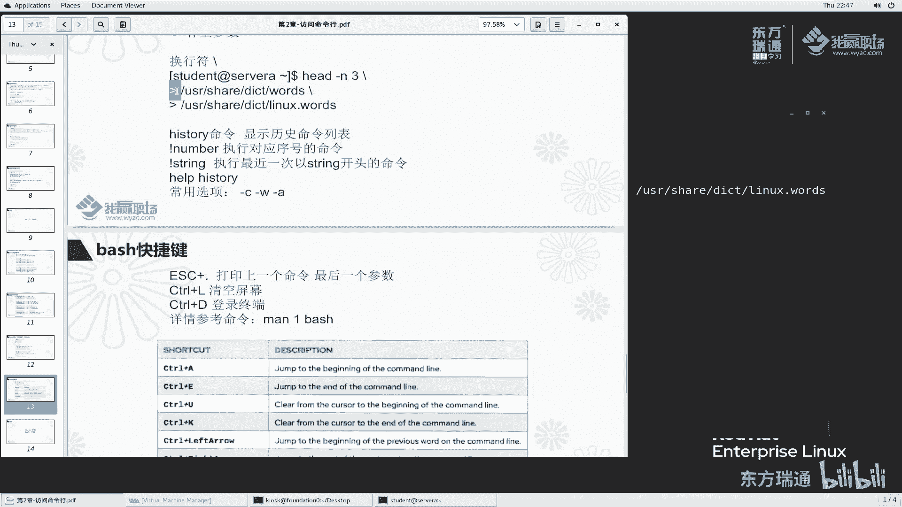

# 红帽RHCE认证培训（8.0版本）-备考红帽认证必修课，快来一起学习起来吧 - P11：02-3-bash执行命令2-bash补全--命令换行--history--bash快捷键 - 东方瑞通 - BV1P44y137Fg

同学们好，欢迎来到我赢职场hc 8课堂，我是马老师啊，刚刚呢我们给大家讲了很多一些啊，在命令行里面执行了一些很多一些典型的常见的这些命令，那么接下来呢我们再给大家讲一下boss的一些补全命令。

换行和history这么一些功能，首先来讲第一个tab按键的一个补全功能，之前我们说过啊，在命令行里边一个字符串它有包括三个部分命令行，然后选项和参数。

那么这个tab键补全功能呢是可以帮我们实现这三者的补全，非常非常的方便，例如说我给大家敲一个啊，例如说我们经常敲一个pa开头的对吧，我敲个pa之后，我按一个tab键啊，大家看一下，按一次没反应。

再按一次好发现了，当我们按了p敲完pa之后，按了两次tab键，他给我们补充出来了什么呀，补充出来好像都是pa开头的吗，然后这里面呢我们理解为是命令行里面能够找到的这么一些命令，以pa开头的。

那你说单词比较长对吧，那我就记开头几个呗，开头几个记住了之后，我按tab键补全是不是很方便啊啊确实是，所以说这也是我们讲的by buntshell给我们提供了这么一个补全功能。

一些好多一些shell程序不好，多一些shell啊，它是不具备这个功能的，所以说我们linux里面选的这个非常棒啊，我们大家用的时候非常爽啊，那么再来看一次，你给我补出这么多，能不能我再敲一个是吧。

再按一下还没反应是吧，按两次哎，此时大家发现了p a s s开头，其实我想找的是password对吧，我懒得打，懒得打印那么多，那么他给我们补全出来了，p a s p s开头有这么多。

我再敲一个好tab键出来了，方便啊，非常方便，其实这里面有好多名的时候，我们再敲一个啊，好of config啊，我想敲的是这个，那么我其实其实我敲到这就可以了吧，后面都不用我敲了，对不对，好。

这是讲命令的补全啊，命令的补全，那命令补全之外选项能不能补全呢，敲一个p a s s w d空格，按中横杠来补全选项，按tab键，此时大家给我们提示的是到底支持哪些选项呢，出来了吧。

比如说我们再加一个杠啊，tab键两个周宏刚的选项出来了，那么再来一次f啊，false强制的意思呢，那只有他是以这个开头的，都给我们补出来了，选项也可以补全，那在这里面我们强调一点。

就是说如果说你按tab键按一次没有反应，那么你再按一次两次，说明它匹配的不止一个，如果说你按一个啊，他就给我们补全出来，说明以他开头的只有一个，那么就给你补出来了，好吧，这是补全选项。

那能不能补全参数呢，好ok我们来看一下p a s s w d，我想设置student密码好，tab键看一下诶，这个也能补贴吗，非常给力啊，非常方便，那么我们执行命令的时候知道了哈。

这个命令行这个命令行选项参数都能补全，六时候给大家再来再来一次啊，我想看一个etc，有一个password文件，tab键好，s再来一次password好，大家看到了哈。

我们这个选项是不是给我一次性补全了，好按两次好很多，再来一次，那么这个参数也补全了，总结一下对于这个bh补全的功能，反正大家就按tab键，我按一个没反应，我就按两次，按两次，那么这个命令我可以补全选项。

补全我们参数都可以补全，大家再去执行命令的时候，一定要记得多按tab键啊，多按tab键啊，灵活的用，像我我我就不喜欢记太多单词，我经常去按tab键，而且你敲多了tab键，你经常看到这些单词。

你自然就记住了啊，刚对于大家初始来说，没有必要把这些单词全记住了。

好吗好，我们再来看一下bh里面的第二个功能啊，第二个功能叫什么叫换行符，啥叫换行符呢。

好我首先给大家演示一下啊，我们来做这么一个东西，就以这个命令来说啊，我首先cat一下啊，哦还是had为例吧，had杠n3 ，我想看这个usr shy里边的，你看我都用补全的吧，非常快。

我想看这个文件前三行的内容好显示了，我还想看另外一个文件前三行的内容，按上啊，在usr shi里边的一个dict link words回车啊，这是我们第一个文件前三，这是第二个文件前三哈。

你这个命令敲的似乎有点长对吧，能不能说我们后分两行去显示呢，对吧，可以可以这样看的有点不爽，对不对，我们这样给大家显示啊，这样啊，had杠n3 好吧，按一个这个符号，按一个空格哈，再按这个符号。

然后回车，大家此时可以看到啊，我这个命令并没有立刻去执行吧，以前我们说回车立刻执行，但是现在加了这个符号，它并没有理解立刻执行，而且给我们显示的是这个样子。

所以说大家以后看到我们我给你提供这些事例的时候啊。

诶你去敲的时候啊，敲完这个之后，那么你又去敲这个，又去敲这个就不对了，其实这个是这个是我输入的啊，那么这两这个这一段一个空格跟大于符号。

是我们系统自动给我们生成了，你看这个位置是不是好，我们再来敲usr share里面的一个dict words，好，再来一个有空格哈，空格之后我们再来这个符号，这个符号反斜杠后面是没有空格，再来回车。

我们再加一个usr share里面dicate links words，那么它也可以达到一个效果，此时大家来对比一下这个命令和这个命令，唉，似乎这个命令显得冗余，放在一行啊也可以。

但是呢这个命令换成两行，我had gan杠n3 n去看的时候，我看的这个文件和这个文件，每个文件会放在一行，那么这个条例相对来说比较清晰一些，看着呢比较舒服一些，这个是换行符有特殊意义。

诶之前我们讲说这个封号有特殊意义是吧，那这个换行符有特殊意义，那单引号有特殊意义，那dollar符号有特殊意义，老师你你讲那么多，我又懵了是吧，没有关系啊，你现在遇到什么符号，你就记什么符号。

那关羽后面有这么多符号呢，我们后面呢会找个机会给大家去总结一下啊，其实大家也没有必要说花时间单独去总结一下，反正你用的哪一个你就记用到哪一个，你经常用就熟悉了，时间长了你碰到了多了，那么你就会了好吗。

接下来呢我们再给大家讲另外一个非常重要的一个命令，也是非常好用的一个命令，好history显示历史命令列表来看一下嗯。

history杠h好，他说这个我们这个h选项啊，是不是一个有效的一个选项，那么它的使用方法是这样子，杠c杠d杠n或者是吧杠an rw等等等，加上这么一些东西或者黑嘴杠p啊等等等这么多，那么虽然有很多呢。

但是这个地方有一些常用的选项，我只给大家讲这么几个常用的啊，首先我们来看第一个history，什么都不加，按tab键回车一下，它给我们显示的是什么呀，诶似乎似乎我登录到这个soa上面。

我干的第一件事情好像确实是登录workstation是吧，当了五个随神，我退出之后呢，是退出了吧，然后进行一个clear exist，然后等等等执行了这么一系列的命令，诶刚刚说我们一个杠h的看三行的。

这是分行看的对不对，然后呢这是放在一行里面去执行的，然后还有等等的说明什么呀，说明我之前执行的命令啊，都保存在我们这个内存里面呢，确实给我们列出来了，方便吧啊非常方便，例如说嗯我们公司打个比方啊。

我们我们公司这个系统出问题了是吧，那个我们我是刚入职的，搞不定这个问题，那么我请一个大佬来打个比方啊，我请一个马老师来是吧，马老师过来帮我处理问题，三下5÷2刷刷刷把公司的问题解决了。

那公司问题解决之后，但是马老师这个书这个书这个命令解决问题的时候，这个思路我也没看明白，那么我能不能看到这个命令历史记录呢，可以呀，history杠h啊，history直接执行。

那么这个终端里面的历史命令啊就全部显示出来了，是不是很好玩好玩吧，ok啊，history诶，既然有这么一个history，那么那么我去执行命令的时候，例如说有那么多命令。

我想重复执行之前的某一个命令能不能执行呢，也可以啊，也可以啊，例如说我们看这个第14个命令，有时候我们这个命令执行起来比较长，我手动想敲的话比较麻烦，那么我们加一个感叹符号啊。

感叹符号再加一个数字22来看一下，看看是不是调用的这么一个历史命令啊，感叹符号加22回车诶，它给我们显示了我们调用的是这个命令，好用吗，好用啊，去用于重复执行历史命令加感叹符号，然后再加上我们这个数字。

给大家又讲了一个特殊符号，感叹符号，感叹符号与history配合起来用呢，目前加数字是代表调用历史历史命令里边的第22条命令。

重新执行了，好吧，当然我们这里面还有感叹符号。

再加上string啊，来吧看一看感叹符号加string，例如说我们感叹符号加上一个cat，看一下感叹符号加个cat，那么它给我执行什么命令，回车往上翻好。

他执行的是k的杠n e t c password，那么我们从这里找找找哎，从下往上找，似乎是执行第18条命令对吧，那么再往下找找找找找啊，应该是吧，这是第一个匹配到cat啊，电视这是还有一个开的。

那么它优先显示这个啊，大家记住了，cat这个感叹符号加字符串匹配的时候是从下往上去匹配啊，最后一次执行的，并且找到这个之后，然后我们去执行好吧，这是history啊。

当然history还有很多选项，这个呢我给大家再来看一看啊，history gw是什么意思啊，首先我们给大家说一下ios杠a杠a里边有一个叫bash history啊。

我们来看一下这个文件里面有什么内容，回车这个文件里面有1233啊，我再给大家执行一个history history杠w回车，大家此时再来cat看看这个文件的内容，cat一下按上，来找一找诶。

我们刚刚看的是什么呀，诶这个是原先保存的内容。

后来我执行了history杠w之后，发现可莉等等等，这里面多了好多言外之意什么呀。

言外之意，你这个黑水敲的命令，它默认情况是保存在内存当中的，如果你加了w的话，那么他就会把我们这个命令写到这个文件里边来，默认情况写在这个bash history里面去啊，写到这里面去，这个文件在哪儿。

在用户当前用户的家目录里面去，好吧，我当前的用户登录来在他的一个加目录下面去，诶，我能不能说加一个单独的文件，temp里面叫history呢，回车来cat一下，cat一下tap的一个好。

给大家演示一下这个快捷键诶，好像也写进来了嘛，是不是啊，我这个文件内容也有了吧，好你可以写定指定到某个位置都可以啊，都可以啊，再来history gc回车啊，再来敲个history诶。

大家发现我命令都没有了啊。

马老师这人呢比较猥琐是吧啊，我一阵操作猛如虎，我还没有看明白，把命名都给都给他解决掉了，然后呢临走之前敲一个history杠c，结果什么什么也没看到，是不是什么没看着是吧啊，这个命令是干这么一个事情的。

那么有些黑客也会这么干，但登录到你系统之后呢，会做一些破坏，或者说做一些做一些事情对吧，那么这个事情他不想让你看，那么执行完成之后，history gc把这个历史命令把它清掉了啊。

清掉的啊，再来看这个杠a杠a是什么呢。

啊history杠a我们再敲一个啊，打个比方，我敲一个l s啊，那么history ga看一下，再来a cat。br c bh bh history，看这个里面内容，大家发现啊。

我history杠a好像给我们追加进来的吧，啊表示追加的意思，就是说你历史命名呢往自己往某个文件里面去追加啊。

是这么一个意思好了，history命令呢我们就给大家介绍到这里面常见的这几个足够大家去用了啊，这也是我用了十几年的link给大家总结出来的这么一个经验，大家还发现一个问题啊。

稍微细心一点的同学应该知道啊，我操作的时候好像很快，对不对啊，好像有很多快捷键用的特别的顺利，那么你们其实也是可以一样的啊，只要你们经常用啊，经常用啊，那么这里边有一些常见的快捷键呢。

我给大家简单的总结一下啊。

当然这个地方表里面也给大家写了啊，那么我一个一个给大家看。

首先看第一个，那么就是我做这么一个事情，l s e t c passwor，我现在呢我想cat这个文件的内容啊，cat这个文件的内容，那么这个命令如果手去敲非常的慢啊，能不能说有一个非常快的快捷键呢。

可以ec敲一下，再加上这个大于符号那个键盘上面那个点号诶，回车加点，就把这个命令上一个命令的最后一个最后一个参数给我们打印出来了，是不是呢啊确实是这样啊，例如说l s啊，嗯加个点哈。

我们再来一个tc hosts，好换一个嗯，再来我们再来看一下e点是不是最后一个，确实是啊。

确实是啊，这是第一个ctrl加l是表示清空屏幕好。

我随便敲一个，随便敲一个，那么我们可以使用clear去清空我们的屏幕，干净的吧，或者说呢我们是我会使用快捷键使用ctrl加l去清屏，这样呢你们的这个目光容易跟着我这个光标去走，方便你去查看。

查看退出登录ex i t啊，当然了，ctrl d一下，这个我给大家讲过了对吧，我们在同一登录进来，按个方向键上进来，此时呢我们又登录进来，ctrl是不是很顺溜好是很顺利啊。

那么当然还有很多一些快捷键，那么我们可以执行这个命令去查看，那这个命令是什么意思呢，那么在我们的后续章节里面再给大家讲啊，大家也可以直接去把执行来看一下这个效果好吧，那么当然还有其他那么多啊。

再来看一看。

来我们敲一个啊，刚刚说有一个很长的命令是什么命令呢，60这个命令在这个命令我们可以看到我们敲一个ctrl a，看一下光明线的是在最后ctrl a光标跑到哪了，跑到这里边。

相当于我们快捷键上面有一个home按钮，好，我们现在把它放到最后好，按按方向键右啊，然后按一个home按钮，home好到最早开始了是吧。

按个按按钮，最后啊最后也就是对应我们这里面的ctrl a跳到行首。

ctrl e抗跳到行为，那打个比方，我现在我一本敲这个命令，敲成什么，敲成sl，其实我想敲的是ls，那么此时我按一个上，然后跳到ctrl a来更改一下，很快啊，s就改完成了啊，那同样改完成之后。

有些同学不习惯，老师你改完成之后，我光标是不是要跳到最后才行呢，其实不需要的啊，例如说你看我光标是在这个位置，我直接回车了吧，是不是也可以啊，那有些同学不习惯，那非要说我光标呢一定要移移到最后。

那其实你按一下按按钮，或者说按一个ctrl e按钮就回到最后了，好吧，也非常的方便啊。

非常的方便，还有ctrl u ctrl k再来讲解一下。

那么我们光标打个比方，现在在这个位置我按一个ctrl u，大家来看一下效果啊，光标在d这个位置按一下ctrl，此时d前面的是不是被我全删掉了呀，是吧啊，例如说我之前敲了很多东西，前面是敲错了是吧。

敲错了啊，我按ctrl把它删掉对吧，可以吧，那么后面敲错了，我按一下ctrl加k啊，ctrl加k后面就删掉了吧，好再来试一下，按一下ctrl加k前面保留了吧啊非常灵活啊。

非常灵活啊，那么当然我们还可以ctrl加上箭头，左箭头和右箭头，它是怎么跳的，他说啊，我们会根据单词的进行一个跳转来吧。

试一下好，这个位置呢我们光标在这个位置，我按下ctrl键，再加上左箭头，诶，是不是一个单词，一个单词的跳啊，是不是非常方便，右箭头呢啊也是这样诶，我再来按一个ctrl加w w不是单词的意思吗。

敲大家来看一下光标现在在最后按个w，咦他是什么效果啊，去删了吧啊，根据空格作为分隔符去把前面那个给它删掉，也是非常的方便，那有以前我们经常删的时候，例如说我我删单词啊，我可能喜欢这样删，对不对。

删的有点慢，不太给力是吧，etc后四我直接ctrl w不就完事了吗是吧，这样扇啊，这样扇显得非常专业很厉害的样子。

是不是ok啊，这个ctrl w我没有写在里面，大家自己呢经常用哈，ctrl r ctrl r呢是用于查找历史命令的。

来看一下，我敲一个history啊，我们cd啊，比如说我们system啊，随便敲几个命令哈，我们cat一下etc password，cat一下，cat一下，后四次啊，我敲了这么多history来看一下。

那么此时我们要执行一个命令，ctrl加r。

ctrl加r，它会反向的查找，对不对，反向查找什么呢，我反向查找后四次好，从这么多个历史命令里面，他反向查找第一个单词匹配它的，他就给我匹配出来了，这个是我敲的字符，这个是匹配到的内容啊。

他匹配到这个内容，我来试啊，大家看我这个山头变少了吧，六说我想匹配p a s s w d好，匹配到了这个命令，是不是那么不要这个，我再来匹配匹配我们bh那他找到网，从下往上找找找找，找到这个位置了吧。

也非常方便啊，因为你在执行历史命令的过程当中啊，你这个好找到之后，我们左右键一按一下，它就给我们切到这个命令里面来了啊，如果说你这个命运历史命令跟我现在当前隔得比较远啊，可能我都执行几百个命令了。

我当前也找不到，然后呢，我就按ctrl啊去搜索，这样就方便的多了，因为有有效命令，我们去执行的时候，可能可能写了满满一行，你再去重新敲一次的时候特别的麻烦啊。

而且呢这个命令太长了，就容易出错呀，怎么办呢，办事快捷键用起来嘛啊非常方便啊，ok那么这一小节呢我就给大家讲了一下办事里边的几个功能，第一tab键补全，第二命令行换行换行符，大家要知道这个认识啊。

history命令以及呢它的一个快捷键啊。

这个小节呢我们就给大家讲到这里面，好谢谢大家的一个收听。

