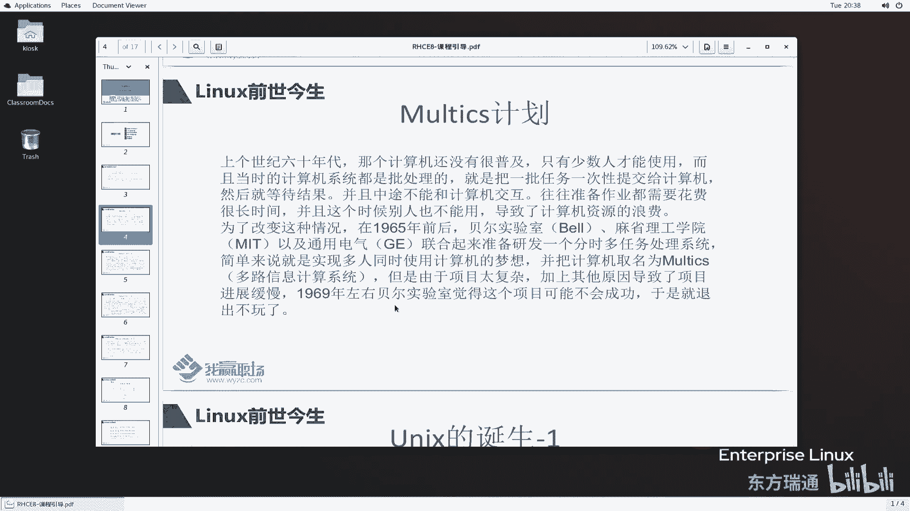

# 红帽RHCE认证培训（8.0版本）-备考红帽认证必修课，快来一起学习起来吧 - P1：RHCE8课程介绍1-为什么学习Linux--Linux前世今生 - 东方瑞通 - BV1P44y137Fg

同学们好，欢迎大家来到我赢职场H4E8的课堂，首先呢请允许我自我介绍一下，我是马老师，从事LINUX运维工作十多年了，曾经在华为，联想电信等公司任职，从事UNIX和LINUX运维相关的工作。

目前我在我音职场做red h全职讲师，主要是做RHCE和HCA认证教学的相关工作，那很高兴在接下来的一段时间内呢，我和大家一起来学习一下HCE8的课程。

那RHCE8的课程在讲之前呢，我们给大家需要讲解一些很多些，相关的一些基础知识和一些概念，那第一好，我们为什么要学习LINUX呢，每个人都肯定有自己的一些学习想法，相信大家来报名学RHC1课程。

肯定有自己的一些目的，那么第2LINUX是他的前世今生，其实哲学上有三个问题我们都知道啊，我来自哪里，我要到哪里去，以及我是什么，那么我们在讲LINUX之前，在讲right hand之前。

我们要把这个相关的东西呢要给他理清楚，第三个red head它的认证体系，然后给大家介绍一下RGC18这门课程，在介绍RGC8课程的时候，当然我们要给大家讲解一下，如何来学习这门课好。

那么学习这门课之前呢，我们要需要做哪些准备呢啊，以及需要哪些基础知识啊，做一些铺垫啊，其实LINUX这门课或者说RHCE这门课，它不是一个初级的课程，那很多一些嗯，做了很长时间的一个RT运维的同同学。

学员在去学习RHCE的时候都觉得很吃力啊，因为他以前是做的windows相关的运维，windows运维和LINUX相关的运维工作呢，还是有很大的差别，那思想上面要做一个很大的转换好，首先我们来看第一点。

为什么学习LINUX啊，刚刚我们提到，那很多同学来报名学习HC的课程，肯定有自己的一些想法，例如说我是为了升职加薪，那么例如说是我们公司要投标，招投标要用啊，那等等等这些目的。

其实呢我们可以从以下几个角度来给大家，简单讲一下，当今的社市面上面啊，很多一些设备啊，很多一些终端设备，它里边跑的一个系统啊，不管说你是嵌入式系统还是说什么一个小系统，那么这些系统它的核心啊。

它的内核基本上都是LINUX操作系统，所以说你想一想啊，那么我们要对这些终端设备进行维护，是不是有必要去了解一下，操作里面的一个内核系统怎么运行的呢，非常有必要，OK啊，那除了这些终端设备。

还有一些服务器好，我们双11双12是吧，去啊去买入去购物，那么购物的这些平台，这些网站上面他跑的很多系统也是LINUX操作系统，那么当然比如说最大家最近也听到了很多，一些呃比较火热的词，例如说云计算啊。

云计算平台，大数据，物联网，人工智能，AI啊等等等这些这些一些应用，那么这些应用，它最终是落实到我们的服务器上面的，那么这些应用所在的服务器，大部分还是LINUX操作系统，所以说你想想啊。

我们当然有必要去学习这些LINUX的系统了啊，非常有必要，那么我们还可以从另外角两个角度来看一下，为什么学习LINUX啊，首先呢LINUX里边它能够承担的岗位，我们从两个方面来说。

第一个你是作为一个系统，作为一个软件，那么我们可以从开发的角度来看，那当然你这个系统或者说这个软件啊，这个产品，那开发好之后呢，我们要做一些运维的工作啊，从运维的角度来看。

那么如果说从开发的角度我们可以看到啊，那么LINUX系统的内核，可能需要我们的开发人员develop，那么同样的同样的很多一些站点是跑在哪上面，跑在我们的叫LEX上面。

那么LEX上面我们要去开发在这个历史上面，我们去开发我们的应用的产品，好我们说有这么一个产产，有这么一个程序员叫LAMP，那么LP是什么意思啊，啊这个A这个L呢是代表links，A呢是代表阿帕奇是吧。

阿帕奇M呢M是代表MYSQLP呢是代表菲律宾，也就是说部署一个web站点里边，用到的一些四要素四要素，那么我们的程序人员啊，作为这个站点的开发者，你也可以承担啊，那么你的开发人员。

在这个现有的LINUX上面去做一些开发，那你当然有必要去了解一下LINUX啊，当然还有一些list，其他的应用程序的开发，类似驱动程序，在内核的基础之上，我们要开发一些啊这个硬件的一些驱动程序。

你硬件要要接到我们的LEX系统上面来，如何让它更好的工作，我们需要一些驱动程序或者说一些模块啊，当然还有一些嵌入式的一些开发哦，这是一些相关的开发岗位，那么除了开发岗位的，当然也有运维岗位了。

比如比如说历史运维工程师，这个是非常泛泛的啊，你可以是叫系统运维的工程师，也可以说是应用的工程，反正你是LINUX相关的运维工程师啊，那么当然LINUX里面还有叫开发运维工程师，DVOPS好。

D b o p s，其实嗯如果说从单纯的角度来讲，这个类似运维工程师呢，它是不怎么值钱的，开发运营才值钱啊，值钱开发运营呢，会跟能够达到什么样一个程度呢，就是说你公司里边你的产品啊。

呃在运行过程当中发现发发现会有很多问题，你呢可以根据现有的条件里边可以嗯，例如使用shell程序啊，使用Python啊，或者使用其他的poor等等等，去为了更好地去运营我们这个产品，也可以给我们的运维。

我们的开发人员提供一些建议啊，提出一些建议，这是LINUX运维工程师，当然我刚刚讲的是叫DVOPS这么一个角色，那么LINUX它是一个操作系统，在操作系统之上呢，我们可以部署很多应用。

例如说我虚拟化是跑在我们的LINX，操作系统上面的，你可以作为一个虚拟化的工程师，那同样，那云计算它里边一个非常重要的一个技术，叫虚拟化，那么你懂了虚拟化，懂了LINUX操作系统。

那么我们还可以去做什么，还可以作为云计算的一个运维的相关的工程师，还可以乘以为题，我们更高级一点叫云计算架构师，架构师啊，那当然涉及到云计算架构时呢，你懂的知识就比较多了，涉及到一个产品。

一个产品里面有很多一些东西啊，不仅仅是我们一个操作系统啊，那么很多数据库啊，例如说MYSQL，oracle啊等等等，这些数据库呢也是跑在什么，跑在LINUX系统上面的，诶我们作为运维写数据库管理员。

那么你说你仅仅仅仅仅是操作数据库，你你不懂得这个LINUX，那你如何在LINUX上面去操作我们的数据库呢，也有必要啊，有必要，当然也并不是必须的啊，如果说你了解的LINUX系统。

那么你在这个系统上面去做这些维护的工作呢，相对来说是更加的更加的得心应手，好印象，存储工程师，那么在我们临时作为我们的存储系统，局部署的时候，例如说cf存储，比如说glass存储等等的这种分布式存储呢。

会部署在我们LINUX系统上面去，那你如果说你LINUX操作的很顺畅，那么你去承担这这些岗位的时候，那么就是非常的好，非常的什么得心应手啊，游刃有余了是吧，好，我从以下这个几点呢给大家讲一下。

我们为什么学习LINUX，其实啊说的简单一点啊，说的直白一点，大家学习linen不就是为了为了拿一个高薪对吧，其实在我们这个LINUX相做运维的工作里边啊，比如说我们做网络运维，或者说数据库运维。

或者说LINUX运维，其实这个LINUX运维呢，呃或者说系统工程师，这种运维的待遇还是不错的啊，相对来说还是不错的啊，当然比数据库那个要相对来说，相对来说要要差一点啊，差一点相同等级的情况下。

但是数据库呢对于我们这个运维来说啊，这个他对于我对于搞数据这一块啊，对于搞算法的这一块他就比较复杂，要求比较高一点，当然并不是说这个做运维工程师，他这个呃入门的门槛就比较低，也不是这个道理啊。

其实要看你达到的什么样一个高度，当然每一行你都做得深的话，那么你的待遇肯定也会会达到一个很高的，一个程度是吧，OK这是给大家讲的，我们为什么学习LINUX，那么再来看一下LINUX的一个前世今生好。

那令是怎么来的呢，那么讲LINUX之前，我们要讲LINUX之前的一个产品UNIX，那么讲UNIX之前，我们要首先讲计算机是怎么产生的啊，话说呢在上个世纪60年代啊，那个时候呢计算机还没有普及。

只有少数人才能够用，而且还有一个非常重要的一个特点，就是说当时的那些计算机系统啊，都是批处理的，何谓批处理呢，就是说把一批任务啊，一次性的去提交给我们的计算机处理，那等计算机处理完成之后。

我们才能与计算机进行交互，也就是说啊，在计算机执行这些批处理任务的过程当中呢，我们人为的是不能够与计算机进一个交互的，那由于计算机在处理这些批处理任务的，过程当中，往往是需要很长的时间，很长时间。

那么这个很长的时间，就导致计算机不能够做其他用途了，那就有一个计算资源的浪费，有这么一个缺点在里边，那既然有这么一个问题，那么我们有没有一些比较厉害的一些大牛啊，大佬出来之后去改变这个情况的，有啊啊。

在1965年呢，然后贝尔实验室啊，麻省理工学院以及通用电器，他们三个联合起来，去，准备开发一个分时多任务处理的，这么一个系统好，那么这个都分时多任务处理的系统，是解决什么问题呢。

简单来说就是多个人同时使用计算机，你刚刚不是说把一批任务交给计算机处理之后，那么其他人就不能够去使用了吗，必须等待它结束才能用吗，哎现在可以的，能够达到什么效果啊，你去执行你的任务，我去执行我的任务好。

你把任务交给计算机处理之后呢，当然第三者就是说其他人，你还可以登录到这个计算机上来，处理自己的任务，好多个人可以同时使用，互不干扰，互不干扰，这就是一个多人同时使用的一个分时，多任务处理的一个系统。

那么此时这个计算机的名称呢，我们给它取名叫什么MTX啊，多路信息计算系统好，Matic muli，Muli，多了是吧，information啊，computer system啊。

这么一个多路信息计算机统，但是呢由于当时的技术所限啊，包括其他的种种原因，这个项目太复杂了，就导致了这个项目就夭折了啊，进度也比较慢，那进度比较慢，那么在1969年的时候啊。

被实验室觉得这个项目不可能成功，于是就退出不完了对吧，你这个项目太复杂了，感觉投入了很多精力做修，就像做无用功一样的。

那不玩了不玩了啊，这就是我们讲的计算机的当时的一个前身前身。

那么在这个贝尔实验室里面，退出了multi什么计划之后呢，那么贝尔实验室里边有一批科学家，就觉得没什么事做啊，其中有这么一个人啊，在MULTICS开发的过程当中啊，它的名称叫什么。

King thomas thomas，他在开发MULTICS的时候，他在这个系统之上，写了这么一个太空大战的游戏，诶他比较有意思是吧，写这个游戏，但是呢由于你退出了，就导致这个系统我不能够用了啊。

你不能够用，那么我这个游戏我想玩就没法玩了啊，没画完了没画完，那怎么办呢，没法完，我比较厉害厉害我比较牛逼，那我自己写一个系统不就完了吗，他这个人就是这么干的，说到做到，他说为了能够继续打这个游戏呢。

他又花了一个月的时间，写了这么一个小型的一个操作系统啊，用于运行它这个游戏，太空大战是吧，太空旅行太空旅行的一个游戏是吧，那么完成之后他觉得很兴奋啊，很兴奋，那么把这个游戏呢啊拿给身边的同事。

让他们一起来玩，唉此时此时大家觉得啊，说明了周边的一些同事，觉得这个这个游戏没什么意思嘛，没什么好玩的诶，但是你这个操作系统似乎还不错啊，那么把你的操作系统共享出来，大家一起玩呗。

好反而玩完了玩起了他的操作系统啊，啊就是这么一个来的啊，有这么一个小故事在里面，由于这个MOTICS啊，它这个翻译过来是什么呀，哈多路的信息计算系统，那么我们这这个大牛是吧。

大牛他把这个系统啊取名跟他相反，叫uni li啊，叫每路信息计算系统，正好与他相反，那么这个缩写起来叫UNIX啊，UNICS好，又取其谐音叫UNIX，那此时此时这个操作系统就诞生了，叫UNIX系统啊。

原联系统啊。

那么这个系统诞生的时间呢，是正好在1970年，于是呢1970年就定为了UNIX的元年，这个UNIX元年我们一般来说也称之为好，它是计算机上的时间，也就是从这一年开始的。

所以说我们去计算机去讨论计算机原点时间，的时候，我们讲的这个时间啊，都是1970年1月1号这个时间啊，后面我们会给大家讲一个LINUX里面一个命令叫，date命令，date这个命令去对十的时候。

他说我想看指定时间加上一个数字，这个数字就是指的是1970年1月1号过去，到现到那个指定数字的过去了，这么多秒之后给我们显示的时间啊，所以说大家要记住这一点啊，在我们计算机里面那个最早的这个计算机时间。

就是1970年1月1号这么一个时间，好计算机原理啊，那后来UNIX操作系统呢，就在贝尔实验室呢内部流传开来了，并且呢经过不断的改良优化啊，最终在1974年啊，发展到了第五个版本，也就是system5啊。

那贝尔实验室公开了这个UNIX，那么引起了学术界的一个广泛的兴趣，并且呢学术界呢对它进行一个索取它的代码，那你为什么呢，输出代码之后呢，我可以对你这个代码里面再次进行开发啊，开发出自己的系统是吧。

那那么unit第五个版本啊是仅用于教育目的的啊，提供给各个大学教学之用，那成为当时操作系统课程里边的一个教材教材，那各个大学就开始通过LINUX的源代码，对UNIX进行了各种各样的改进和扩展，好扩展啊。

到了1978年，学术界的老婆老大伯克利大学呢，他推出了一份以第六版本为基础的啊，之前我们讲的第五版本是吧，以第六版版为主，加上了一些改进和新，共同成了新的一个unit。

那这个用词呢命名为什么命名为BSD啊，BS所有的BSD，什么叫伯克利软件的一个发行版本，并且开创了UNIX的另一个分支叫BSD系列，大家要看清楚了啊，前面system5这个版本是仅用于教育目的的。

而后面这个BSD是作为他的第六个版本，第六个版本呢它形成了一个新的系列，这个新的系列是后续是可以作为商用啊，商用的啊，其实大家现在在市面上可能会经常会有的人，可能是作为什么做小型机运维的。

小型机运维里面，大家应该知道有很多一个UNIX系统，那么比如说IBMUNIX系统，我们称之为什么称之为ARX，那惠普的惠普他的手机上面有叫惠普UNIX，那么当然还有sun公司的里面有。

sorry啊等等的这种UNIX系统，这三个unit系统呢我们都是由BSD发展而来的，好大家暂且了解一下就可以了，那当时因为贝尔呢是属于ATT，那TT呢又受到了美国这个，谢一曼反托拉斯法的一个影响啊。

不能销售除了电话机电报之外的一个产品，嗯那后来呢也就是说你这个你这个BSD啊，这个BSD这系列的这个这个uni啊，你不能够卖好，不能干，那后来呢TT分解了，分解之后呢，这个贝尔呢就可以卖UNIX了吧。

好UNIX这个操作系统了，那UNIX就走向了商业化，那么但是但是这个UNIX操作系统呢，它的授权呢非常的贵，你要用这一份操作系统，你就要花4万美金，你想一想啊，这个4万美金在1970年啊。

或者说1980年那一段时间内啊，他的这个是非常贵的啊，非常4万美金呢，是非常非常一个一个天文大的一个数字了啊，那么在这么一个昂贵的授权的费用下面，那很多大学之前，我们讲说仅用于教育目的去去上课。

那对不起，你就不能够上课了啊，你不能够对其研究了，因为这个地方你你你要想用，对不起，你花钱花钱对不起，但是这个费用太贵了，就出现了这么一个问题，那也就是说我们这个产品呢，现在是变成了闭源了。

源代码不给用了好不给用了，那么既然不给用呢。

那能不能说有一个大佬之后，再给我们编写一个新的操作系统出来呢，可以呀啊说从UNIX开始收费之后呢，结果呢就会导致了大学上上课的老师啊，都不知道讲啥啊，其实大家想想也是。

那就像我给大家讲RHC的课程一样的，我给你们讲的天花乱坠的讲各种各种讲，讲的再怎么详细，但是如果说不给你们操作系统去操作，去练习的话，你怎么知道我讲的是这样的一个效果呢，计算机是一门科学是吧。

我们一定要实践来证明这么一个科学，OK啊，就讲到这，于是在1987年的时候呢，荷兰有个大学教授啊，安德鲁他写了这么一个叫LINUX系统，好之前我们讲的是UNIX系统的诞生啊。

现在又产生了一个LINUX系统，因为UNIX系统是商业化的，那么LINUX系统比UNIX要小啊，你跟他很类似，但是问题在于，LINUX呢也专门用于教学，好证明，用于教育，那么LINUX仪式于是流传开来。

但是它流传的时候只是在什么，在我们的各个大学里面去流传下来，他为什么呢，因为说我们刚刚讲了，因为你由于是仅用于教学，所以说世界各地的这些黑客们哈，我们讲这个黑客并不是说专门搞破坏的，这些黑客啊。

我们可以理解为就是很多一些程序员啊，程序员呢纷纷开始研究并使用，但是呢你为了保证系统的这个纯净性干净性啊，安德鲁教授呢，他不允许你去对于我这个现有的进行更改，麻烦好麻烦了，又不能跟啊，仅用于教学。

那有什么意义呢，啊仅用于教程，最终这些产品是用于商业化的，才能够让我们的产品走向更好，好走向更好，于是在1991年的时候啊，有他的一个其实就是安德鲁的一个学生啊，就叫LINUX托瓦兹啊。

他在互联网上公布了自己写的LINUX。

诶之前我们说UNIX是谁写的啊，UNIX是是有一个叫ken thomas，就是他写的这么一个UNIX系统。

那么后来之后呢他走向商业化之后，就导致我们这个minx安德鲁教程，又写了这么一个MINUX，其实啊我们这个LINUX就是参照着LINUX写的，所以说这个LINUX的它的前身更准，它的一个父子关系。

更准确的讲，它的前身是MIUX，好好LINUX啊，他发了一个帖子说什么呢，说我我写了这么一个操作系统啊，你呢大家呢我给你发源代码共享出来了啊，那已经传传传到帖子上面去了，你大家呢可以随便用啊。

存一存不收费啊。

帮我一起修改好吧，就是这么一个意思，于是呢黑客们就觉得哎非常爽了是吧，非常爽了，那么把你这个操作系统拿到之后，大家进行更改更改啊，那么就就就LINUX就发展起来了，其实LINUX或者他也是无心之举。

他那时候他是个大学生啊，就写了这么一个东西，那无形之一，但是大家想一想，LINUX在当今的这个环境下面，其实影响是非常大的，它形已经形成了一个形成了一个临时的社区，的一个生态生态啊。

那么LINUX其实是属于一个内核，一个kl操作系统，那么这个操作系统仅仅是一个操作系统内核啊，那么这个与red head又是什么关系呢，与WB图等等等这些操作系统又是什么关系呢，好关于这一点呢。

我们在后续的课程里面再给大家讲解好，LINUX的前世呢，我们先讲到这里，他的今生呢我们放到后续的章节来讲解，OK我们先讲到这啊。

