# 红帽RHCE认证培训（8.0版本）-备考红帽认证必修课，快来一起学习起来吧 - P2：RHCE8课程介绍2-RedHat认证体系--RHCE8课程介绍--学习方法 - 东方瑞通 - BV1P44y137Fg

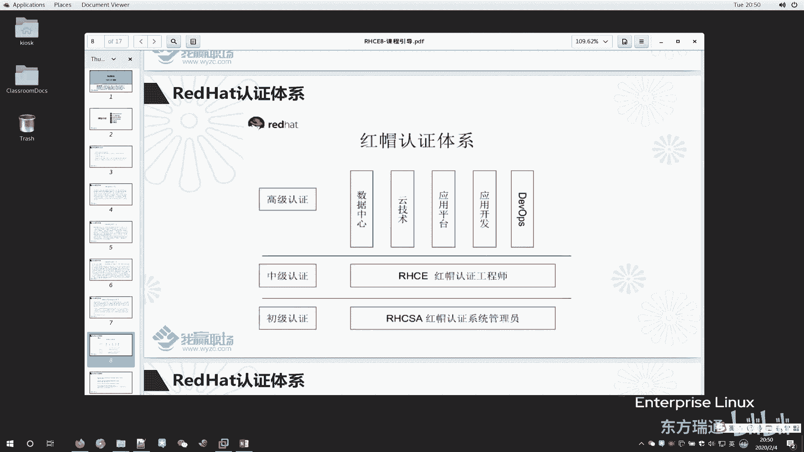

各位同学大家好，欢迎来到我赢职场hc 18的课程，我是马老师啊。

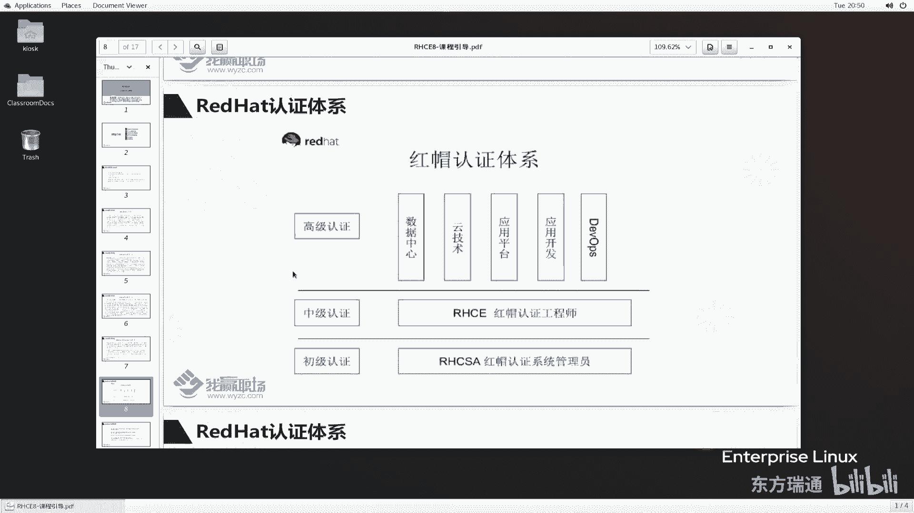

接着上一讲，我们接着看红帽的认证体系，那红帽这门认证呢与其他的认证课程啊差不多。

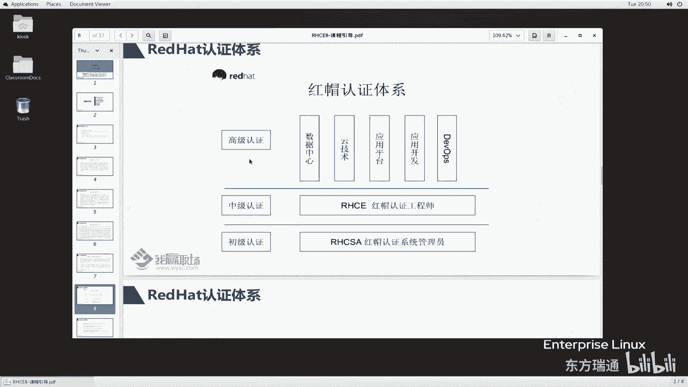

他也是分初级中级和高级，初级的课程呢我们称之为叫rhcsa啊，所谓的rh就是red hat，c呢是代表认证啊，认证的s代表系统，system a代表管理员，所以说翻译过来就是红帽认证的系统管理员。

中级叫h c e啊，同样的这个e呢是代表什么工程师engineer啊，高级认证让h c a hca呢，它分的方向就比较多了，有这么好几个方向，当然这个地方我罗列了五个，其实hca的认证方向远不止这五个。

红帽的高级认证，他的科目啊大概有30几门课啊，只要你获得了其中五门就可以获得了hca高级认证。

高级认证啊，那么具体我们来看一看rg csa这个认证里面呢，它包含两门课，叫rh 124和rh 134，我们称之为rg 24呢是系统管理员一啊，rg 134呢是系统管理员二啊，这是最基础的两门课。

你学红帽认证，必须将这两门首先要学学完啊，并且获得相关的认证才行，那么到了rhc中级这个认证的时候呢，它这个地方就分版本了啊，说有hc 7和r h c e8 这两门。

那么rg如果说大家考的是rg c e7 ，那么你要学习的课程叫rh 254好r gf 4是我们讲的课程代码啊，这都是课程代码，那么rgl 54翻译成中文是什么呀，就是红帽的系统管理员三啊，这门课程。

但是呢我们都知道哈，hc 17它这个到2020年4月30号就不能够考试了，在国内就不能够考试了，那么你如果说你去学习这个东西，那不能够考，那么你就无法拿到这个认证，如果说你是从认证角度考虑的话。

要想去拿到认证的话，因为现在已经2月份了是吧，2020年2月份了，那么大家去学习的话，那当然建议你们去学习hc 8了啊，如果说从认真的角度啊，如果说你是从学习的角度也可以啊。

rh c e7 里边它包含的内容包括哪些呢，这个地方呢我给大家简单的介绍一下，rg c e7 里面主要是包括一些基础服务器，在红帽的rh e l7 的系统上面去构建一些基础设施服务器。

又说我想搭建一个邮件服务器啊，send mail post fix，就是说我想搭建一个maridb，也就是数据库服务器，aparty服务器，web服务器，那么再比如我构建一个其他的。

例如说我们i gari这么一个存储啊，映射的服务器，当然还有很多nfs服务器，三把服务器啊，dns服务器啊，d h c b服务器，其实大家都可以从i g c7 里面学到。

当然标准的课程里面r h c7 里面可能没有那么多啊，但是呢大部分都有，但是我们老师一般讲课的时候，会把一些基础物件都会把它融合融合在一起，给大家讲解好吧，那么再来看一下hc 18。

r hc 18主要给大家讲的是什么呢，它的课程代码叫r hi 94，主要给大家讲的是安保，什么是安伯呢，as是一个自动化配置和管理的这么一个工具啊，工具在我们的后续课程我再给大家展开来说好吧。

好rg ca架构师，刚刚我给大家提到hca在红帽的这个当前这个迄今为止啊，应该说已经大概有30几门课程了，那么之前我们说cs你要考两门c呢，你要考一门，无论是i5 还是i94 ，那么ca你要考五门。

红帽的认证的证书啊，啊正常情况下跟其他的应该是其他的一个培训机嗯，其他的一个相关政策应该差不多，因为技术更新的都比较快，它的证书有效期啊是3年啊，3年啊，那么在rhc好，r gc啊，我们去考试的时候。

正常情况我们我们经常称呼着hc认证，一般是考两门，那大家去报名的时候肯定是包括上午和下午的，那么上午认证通过之后呢，我们获取的叫hcsa证书，下午考试通过，我们获取的是hc证书。

那正常情况rh cs跟rhc是在同一天考，那么在rhc的有效期内，我们必须获得五门的证书啊，一般来说我们rh c一考完之后，可能在3年之内，3年之内我们把hc一的证书啊，把它考完，我们都考证通过了。

此时我们就获取了hca证书，那么在考第五门认证考完成之后，你除了获取第五门这个证书之外啊，说明一点哈，r7 ca你每考一门就会获得一个证书啊，当获得第五名证书的时候，同时呢他还会给你发第六封邮件。

第六封邮件就是说明你获得了rhca的这么一个认证，r h4 a认证，你首次获取的时候呢，它的证书的级别啊，对应于level 1，一般来说啊，如果说你只考r g c一嗯，他一般来说不给你标成level。

就是r h c a，如果说在rhca的有效期之内，我们再去考了第六门，那么此时你会获取的第二个证书啊，对啊除了第六门证书之外，你还要获取h c a level two这个证书啊，第二个级别以此类推啊。

但是前提条件必须是在确保r h c a在有效期内你才去升级，那么你的证书等级才会增加，例如说我在3年之内是吧，我考了八个证书，那么八个证书对应几啊，五门是对一。

那八个证书应该是对应level 4 level 4，以此类推，例如说我这个考第九门的时候啊，最早的第一门过期了啊，过去的，所以说你第九门通过之后，那么第门过去。

那么你的证书等级呢还是h c a等于是没有变化的，我没有升级啊，是这么一个概念啊。

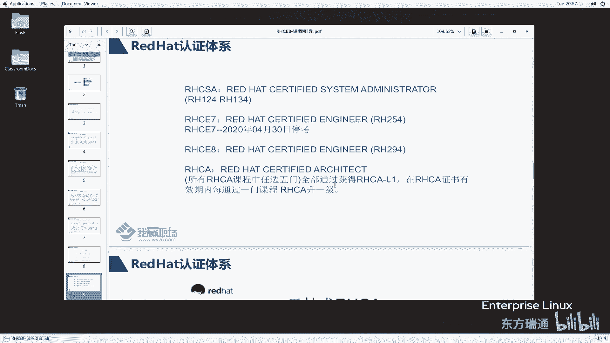

这个概念啊，好我们简单的给大家讲一下它的这个h c s c h c e啊。

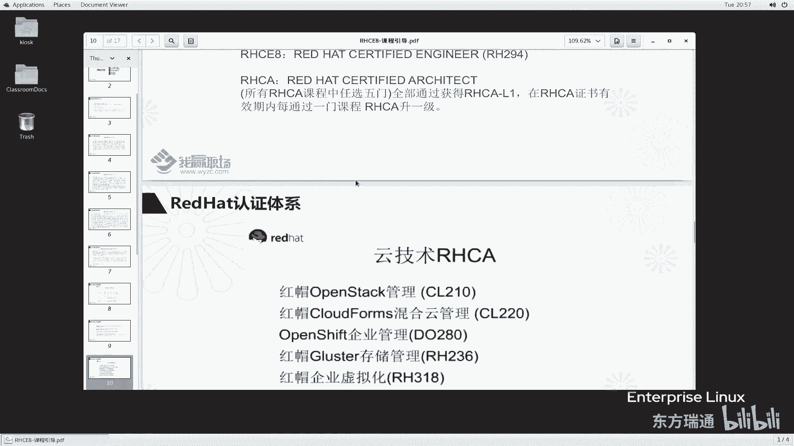

那么再来看一下h c a它的方向，简单给大家介绍一下啊，其实hca的这个方向呢一般来说大家去考这个认证的时候，大部分考两个方向。

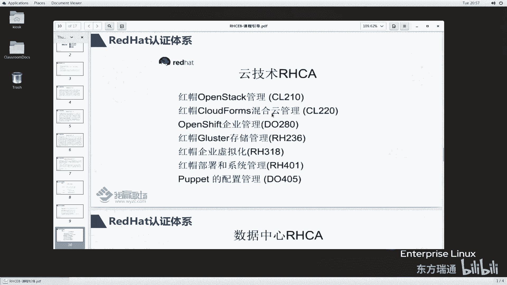

一个是云技术，一个是数据中心，那么这里面涉及到的课程呢。

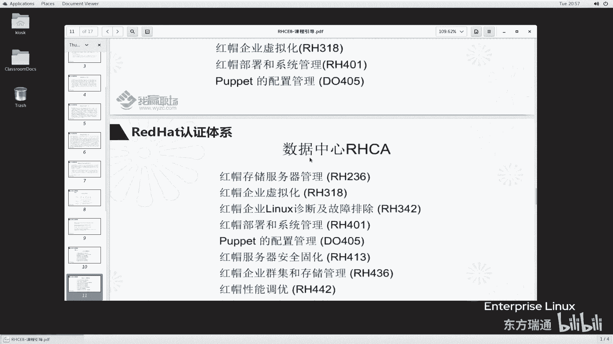

我给大家简单的介绍一下，那感兴趣的同学在学习完r h c e之后呢，是当你考虑一下，再去学习一下r h c a。

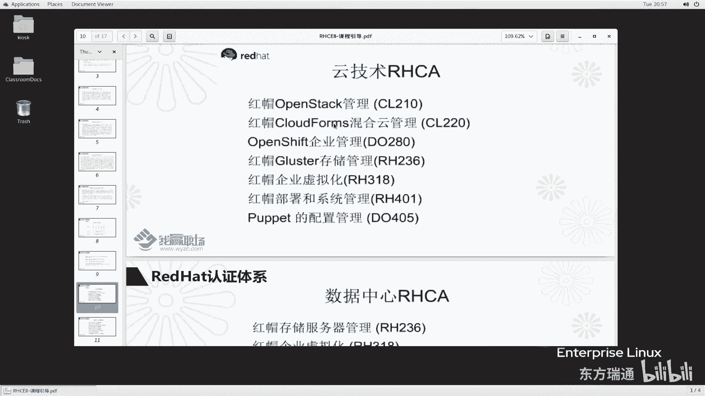

r7 c是非常依赖于我们的操作系统，主要是学习操作系统相关的，那么到了hca之后呢。

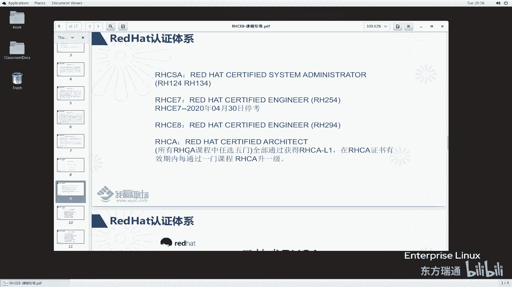

它主要是偏向于我们的应用啊。

应用啊，也就是说在红帽的操作系统之上啊，我们去构建我们的一个产品，以及在这个产在这个红包的系统上呢，我们如何去维护，那么hca它就与操作系统没有太多的关联了，那hc 7你是红帽七的系统。

hc 18你是红帽八的系统，那么hca呢他就不是说你必须在hc一把这个r h e l8 ，什么系统上面去去跑，我们这个软件，不是的啊，不是取决于你的产品六。

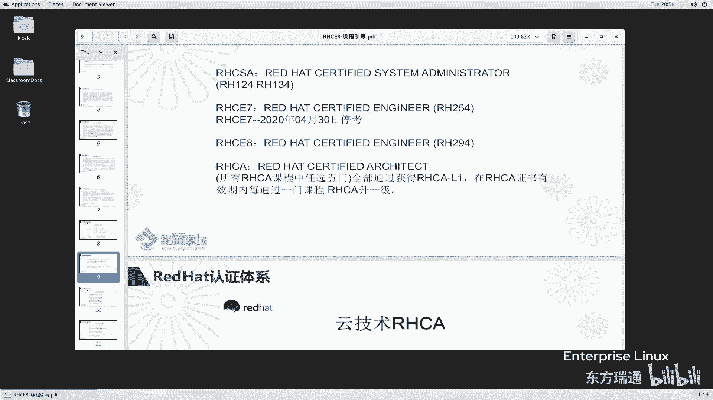

说r h c里面我们有一门课程叫什么叫cl i l0 open stack这门课。

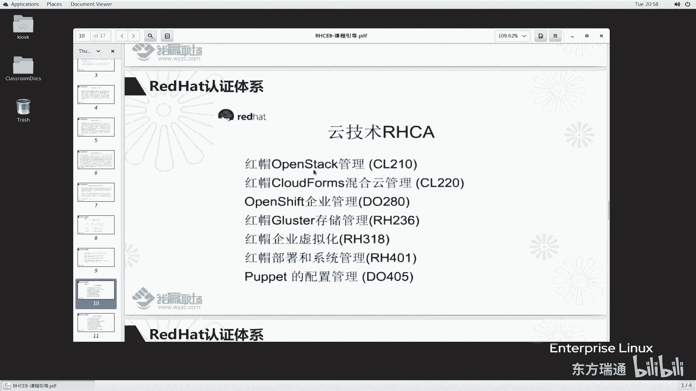

那么这个open stack课程呢它是分版本的，例如说我考的c l l l0 杠v 10，那v 10是跑在什么，跑在红帽七的系统上面啊，当然v 13也是跑到红毛七的系统上面啊。

啊所以说跟我们这个系统呢它的一个版本要求就是关系不大啊。

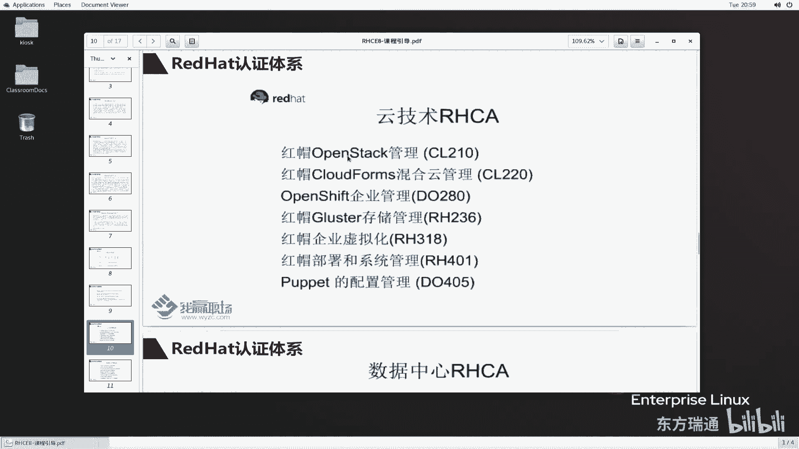

这是给大家讲的这个呃认证的相关一些知识啊。

那么到了rhca这个方向，语音技术的方向呢，它包含的科目其实是比较多的，例如说在这里面1234567其实远不止这七门啊，根据红红帽，它经常会发生一些变化，例如说这个地方可能呃。

我们现在一般来说它还会包含doo 407这么一门课程，好简单，先介绍一下第一门open stack，云管理平台，那在这里面它能够实现iaas is，它是一个iaas s的通用的一个后端，好。

我们讲云计算一般都会提到三个方向，叫r a a s p a s，还有s a a s，那么open stack就作为iaas基础设施及服务，那么对于paas，还有as那么这两个云计算的系数呢。

那往往是构建在open stack这个平台之上的好，这是讲的open stack这门课程，其实现在很多企业里面都在用open stack，所以说大家呢还是有必要来学习一下。

如果说你个人去学openstack比较累的话，那么可以跟我们的红包老师啊一起来学习一下，那么cl 21220这门课，它主要是给大家讲的，什么叫混合云，什么叫混合云啊，我们简单讲你这里面有a云计算啊。

有云有云平台a那么有云平台b还有云平台c啊，各种云平台，那么每一个云平台呢都需要相应的云技术人员去做支撑，那么红帽这个cloud fs它就可以将这个不同的云平台啊。

同时去接管接入到我们cloud fm里面来，也就是说通过这个语音平台去接管这些平台啊，非常的好，但是呢这门课程现在红帽不怎么主推的啊，在企业里面用的多，那对于一些培训机构来说呃。

这个认证的课程就不是那么用的太多了，好吧，再来看一下doi 80，大家可以如果仔细一点的同学应该会看到这个，为什么这个课程代码叫cl开头呢是吧，那么这个叫d开头呢，那还有rh开头。

他rh开头我们可以理解与操作系统关联比较大的啊，主要是与操作系统相关的，cl开头的是什么，叫cloud云计算相关的，do开头叫docker容器相关的相关的，那么我们再回头来接着看这块啊。

open sheet，刚刚我们提到云计算里面有三个方向叫p a r a s，还有saas，那么open shift就属于paas as这么一个平台啊，叫叫什么叫平台即服务啊。

那么它主要是用于做容器相关的管理，它也可以理解为叫轻量级的一个虚拟化啊，虚拟化啊，其实嗯open stack相对来说啊。

open stack这个i渐渐的是弱化了很多一些open stack里面跑的一些应用，渐渐的已经迁移到open shift这个容器里面来跑了容器，它的资源使用效率非常高，而且格力的效果非常好。

呃也是越来越火的这么一个道理啊，当然嗯很多人说open stg现在已经是西洋化了是吧，但是open shift是属于蒸蒸日上了是吧。

当然企业很多企业里面也会在all you open stack也在用open shift，那么open set现在是确实是处于一个上升趋势啊，大家可以适当的去来学习一下open safe。

在我们的语音平台里面，我们肯定会有很多大量的数据，那这些数据存储在必须要有一个后面，有一个性能超好的，稳定性，超强的啊这么一个存储来做支撑，那其中红帽里边的叫glass存储，它是一个分布式的。

基于文件系统的这么一个存储诶，他给我们可以提供这么一个好的存储去存储我们的数据，那除了这个格拉斯之外，红帽呢还有一名认证叫safe，125是叫cf存储c，其实cf存储来说。

它比这个class要用的相对较多了啊，那我们讲云技术这个方向的时候啊，我们正常情况现在很多一些很多一些培训机构啊，他会选择什么选择safe存储啊，safe存储，这也是cf慢慢的会取代。

可能会取代glass的，至少从目前趋势来说，大家去选学习云计算的时候，那么选存储的时候可能会优先选择cf存储，但这个glass也有很多企业在用啊，在用rh 318，主要是给大家讲这个企业虚拟化。

企业虚拟化里边最核心的是k v m，那基于km呢，我们会构建一个什么呢，构建一个虚拟化的产品，这个虚拟化的产品呢在我们这里我们是知道什么是社区里边的，叫what安静好安静。

那么这个地方大家简单了解一下啊，其实我我我我觉得啊，我个人觉得大家要去学习这个云计算的时候呢，首先我们要去学习一个kvm啊，km这个虚拟化的技术它是最底层的，km学完之后呢。

我们可以学习一个虚拟化的一个产品，这里面讲的是虚拟化的一个企业级的虚拟化的产品啊，当然这里面也是基于社区的安全区构建的啊，红帽对它进行一个s开发，组成我们这么一个企业级的产品，rh 401401是。

当然当然现在我们这个代码已经变了哈，已经升级为403了，那403是比较老的一个版本，在这里面主要是给大家讲了啊，叫红帽的一个卫星服务器啊，我们企业里面如果说管理操作系统的话。

你一个人可能管理十台20台啊，那么这个系统升级的时候，我们可以手动一步步操作，或者说写一些shell脚本啊等等去帮助我们去处理，那么如果说一个人你想管你上百台呢，或者说几百台。

那么再凭我们手动去管理的话，就非常的麻烦，我们就需要借用一些借用一些企业级的一个系统管理的这么一个平台，产品去管理，那红帽的微信服务器就能够非常好地去解决这么一个问题啊，403啊，升级到403了。

那么puppy的配置和管理，pub跟安柏类似啊，都是一个自动化的管理的工具，但是呢现在啊红帽是主推主推安柏这么一个产品了，现在这个puppy的应该说呃用的相对来说比较少了啊，比较少了啊。

啊这是云技术的方向的这么一个，刚刚我们除了这里面七个，我还给大家补充了几个，还补充了一个cf 125和我们的doo 407啊。

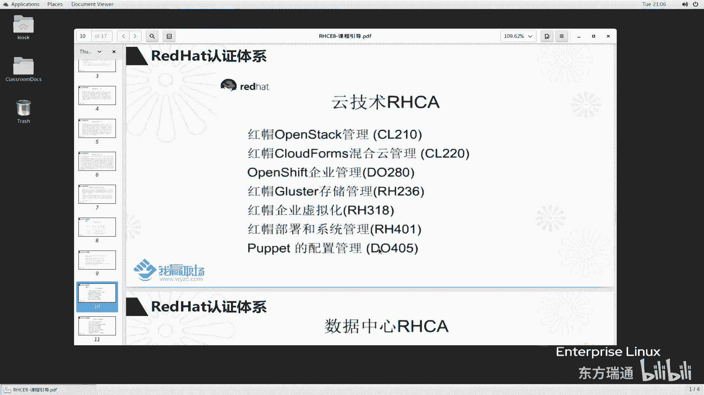

这两个，那么还有数据中心的方向。

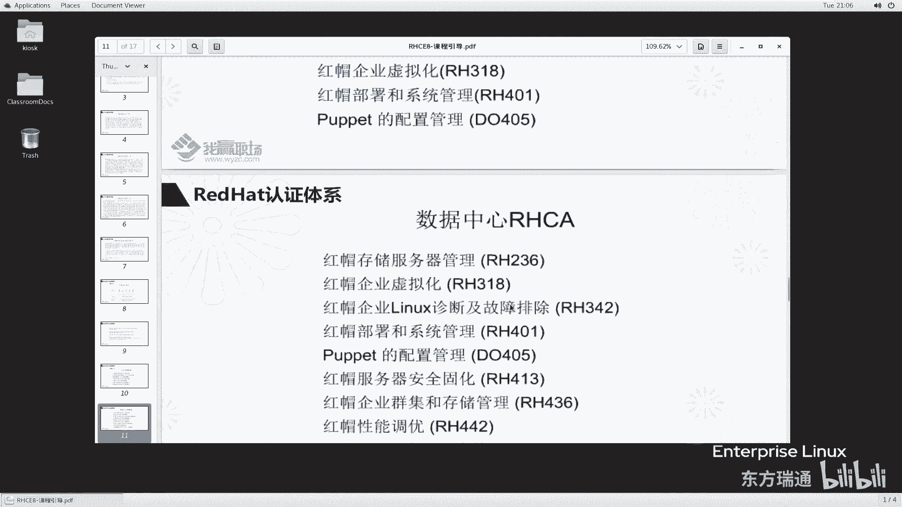

数据中心方向呢其实大家可以看到啊，那么rh 236318好，刚刚我们一样嘛，401405是吧啊，然后这里面增加了几个，我把增加了几个给大家介绍一下啊，rh 342。

rh 342是给大家讲红帽的企业级的linux的诊断和故障的排除，这个给大家讲什么呢，啊主要是讲一下啊，操作系统，你在使用过程当中可能会遇到各种问题，那么这些问题我们如何去处理呢。

就是这门课程对我们要讲的啊，以及即使系统没有出现问题，那么我如何去诊断这个系统当前的运行状况呢，唉他也可以帮助我们很好的去了解rg l操作系统是怎么运行的啊，这门课程非常好非常好。

如果说啊当然数据中心这几个内容啊，是偏向于传统的一个数据中心方向的啊，去学习啊学习，那马老师我自己呢就是从数据中心这个hc方向去考的啊，考完之后呢，我又考了一个云计算方向的课程。

那到现在呢已经考了十几门了啊，十几名了啊，后续的有机会呢我跟大家去学习，一起学习一下hc的课程好吧，那么再来看一下413系统加固，那红帽的操作系统，我们正常使用过程当中啊，肯定啊肯定会有一些问题。

这个问题指的是一些安全问题，那么如何根据你的需要，在我们的现有的产品值上，例如说唉我们这个s s h服务器的架构，例如说我这个用户密码的加固，比如说我们用户账户的集中管理啊。

我们的日志的集中管理啊等等等，从安全的角度对于我们服务器进一步进行一些管理，rh 436这门课程给大家讲解的是什么呀，叫企业里边的啊群集和存储管理，我们给大家举个例子。

我现在企业里面我要搭建一个web服务器，那么为了实现我们web服务器的高可用，那么我就要需要这么一个产品，你想想我们对外提供的服务，我不可能只搭一个，例如说我a服务器挂掉之后。

我b服务器可以提起来继续结果a的一些任务啊，继续对外提供服务，需要一个高可能这么一个集群集群啊，当然除了高可用集群那里面它后端还会涉及到一个存储，也就是集群文件系统，格拉斯，你叫gfs啊。

不是glass，是gfs啊，当然oc fs也可以作为它的一个集群的文件系统啊，还有还会讲到多路径啊，还会讲到集群的lvm等等等这些东西啊，嗯其实即使啊即使我个人觉得啊，即使你你你不用这个东西啊。

我觉得学习它还是对于我们去了解这个，了解这个系统的运维是非常有好处的啊，好那最后一个给大家介绍的是什么呀，红帽性能优化承包这个性能优化这门课程也是我最爱，我最想给大家推荐的这门课啊，为什么呢。

你想想你操作系统是如何运行的，cpu怎么工作的，内存怎么工作，磁盘io怎么工作的，这些网络又是怎么工作的，以及如何将这个四大块调整去匹配我们上层的应用好，主要在这门课程里面，大家可以自己自行去学习下啊。

当然有机会一样呢，跟马老师一起来探讨一下，这里面给我们数据中心又加了一门课程，叫解boss啊，应用程序开发这个课程呢关于解boss的相关的课程啊。

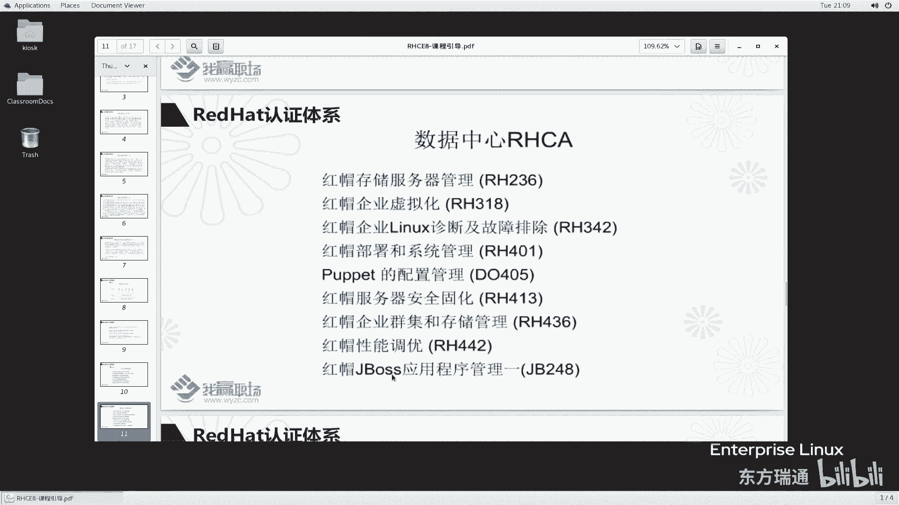

我们中间件我们就不介绍了啊，这个地方呢大家了解一下就行了，那么开发运营呢与我们之前讲的差不多啊，这里面多了一些东西，软件容器化啊，还有说atomic也是与容器相关的。

当然很多一些可能现在已经没有了没有了啊。

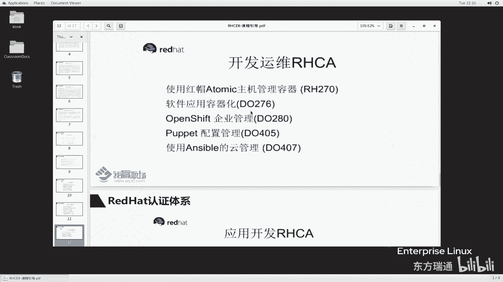

那么我们就不给大家说了啊，这是给大家介绍了一下他的一个红包c认证课程的几个方向。

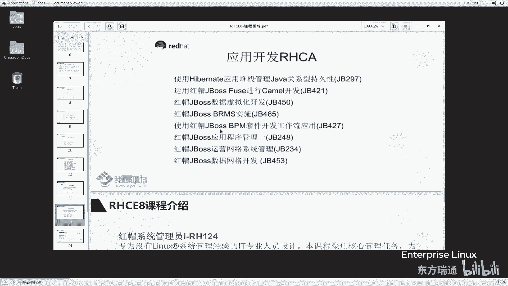

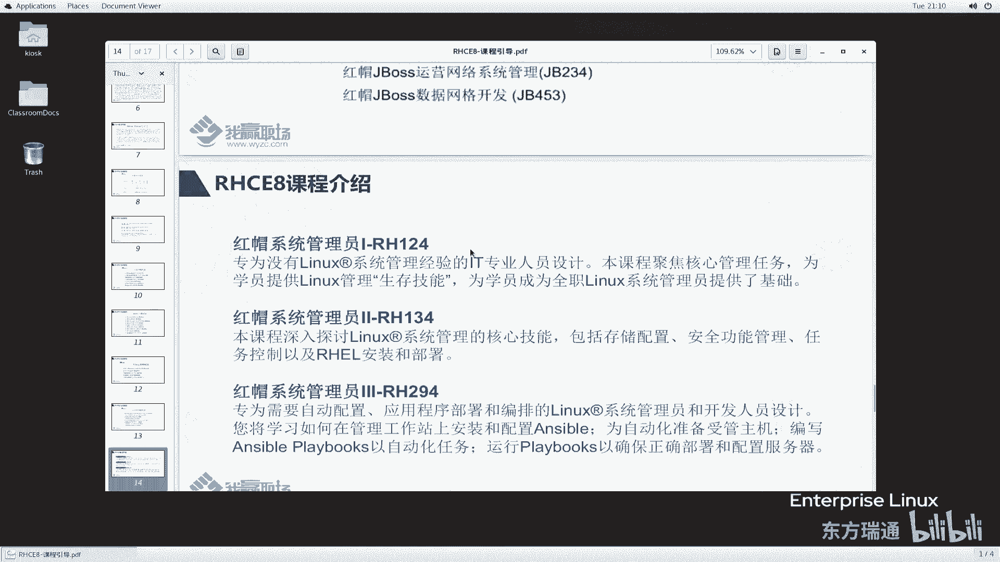

ok我们再给大家简单的来讲解一下rhc 8的一个课程的介绍，r h418 呢我们刚刚给大家简单的题过了哈，它是包含三门认证课程，h124134 和294，那么1241是对应系统管理员。

一一百34呢是系统管理员，2294呢是系统管理员三，那当然一般来说我们已经不这么称呼叫系统管理员三了，我们称之为自动化的管理啊，其实这个名称不管你怎么称呼不重要。

最主要的我们看一下这个课程里面包含什么内容，rh 124呢是针对那些没有任何linux系统维护经验的，一些art专业人员设计的，那么这门课程里面主要包括什么呢，一些linux的一个管理的一个生存技能。

一些linux的核心的管理任务，为我们的学员啊成为全职的linux系统管理员提供了一个基础啊，也就是说我们这里面基本课程啊，主要是给给大家讲一些最基础的啊，也是系统最核心的这么一些相关管理任务。

那么rh 124呢在r区124基础之上啊，r区134给大家讲什么叫系统的核心技能，好，对之前的一些东西做一些扩展，包括存储的配置啊，系统安全的配置啊，任务管理，红帽的系统的安装部署啊等等。

当然还有很多一些我们这里面呢就给大家罗简单罗列了一些，在我们后续课程讲解的时候再给大家讲啊，第三门课程讲安保自动化的配置，说专为那些需要自动配置应用程序部署的啊。

和编排的这么一个系统人员以及开发人员设计啊，那么学习什么呢，在工作站上面去安装和配置我们的安为自动化，准备受管理管事什么准备受关主机，并且编写相应的playbook。

并且呢运营playbook去部署我们这些服务器啊，说白了就是告诉我们如何去使用这个s这么一个工具，去帮助我们企业实现自动化管理的，ok啊，hc 18的课程呢主要包括这么三块。

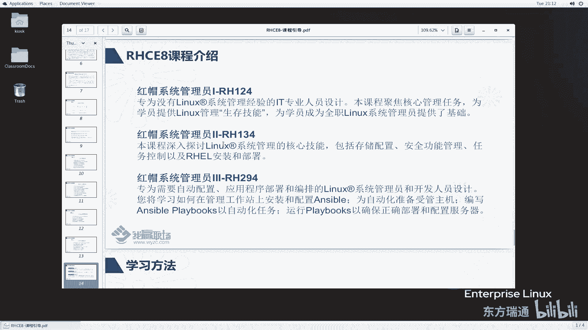

给大家做一个简单的介绍，那么hc 18这三门课程我们怎么去学习呢，啊以前我教线下课程的时候。

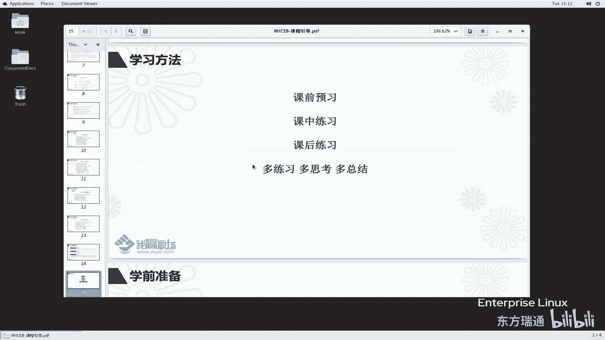

我一般来说我会跟我们的学员强调啊，那么我们首先要课前预习，因为我们线下上课的时候，一般来说上两个周末，那么一个一天周末，上一个周末的话，一正常情况我们一天要上3~4个章啊，3~4个章节。

如果说你不预习的话，直接来听课，那么你一天上下课来啊，这个脑袋都炸了哈，非常的崩溃好非常好，老师讲的东西太多了，而且这个练习的时间有限，所以说建议大家提前去预习，那么在我们讲课的过程当中啊，心中有数。

但是对于我们线上的同学来说，稍微有点变化，为什么呢，因为大家看视频是吧，一边看视频，如果不懂的话，可以暂停，可以回放，好在结合着我们的教材，再结合着我们这个视频的练习去多做做就行了啊，这个呢可以忽略啊。

课中练习啊，这个课程练习呢啊也暂且可以忽略吧，其实是这样的啊，那么在我给大家讲解的过程当中会演示，那我一边演示的时候，大家可以看着我把我演示完成之后，然后你们再去做练习好吧，课中练习跟课后练习。

大家可以暂且理解为一个，也就是说我给大家讲解完成了，做完练习之后呢，你照着我这个思路啊去练习，当然我演示这个练习的速度可能说比较熟练，速度比较快，那么大家呢可以再把视频暂停下来，然后跟着我一起去练。

当你熟练了之后呢，然后呢你再抛开我这个视频，照着书本上练习啊，去快速的去做一下啊，做一下好，这里面是给大家讲到的，其中练习占用了非常大的比例，你要想把hc把lx学好，那么你必须要花大量的时间去做练习。

ok所以说给大家总结一下，多练习，多思考，多总结练习是为了我们熟练的掌握，那掌握之后呢，我如何去使用呢，我们要思考为什么这么做，为什么这么设计。

那是不是说我还有其他的方法去更让让我们更快快更快速的去实现，我们最终想要的结果呢，好要多思考啊，举一反三，最后呢我们可以多写一些总结啊，同一个任务我们通过不同的方法，哪一个方法更好呢，多总结啊。

这是给大家要讲的这个学习的方法。

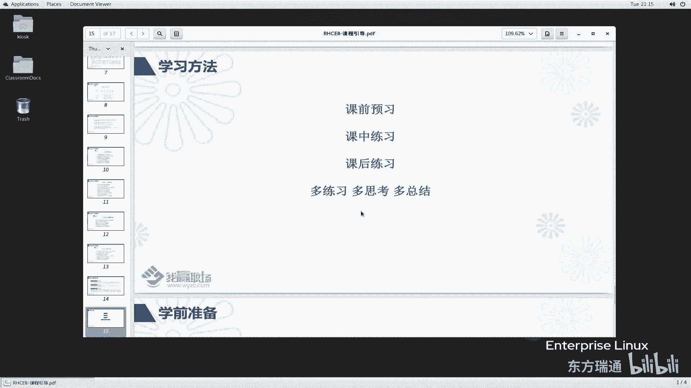

下面呢我再给大家讲一下，在学习之前呢，我们需要配置一下我们的h418 的这么一个环境，需要准备vy workstation prom一个软件，以及需要准备一个x manager的一个软件。

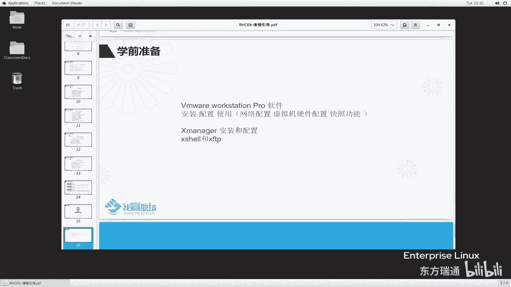