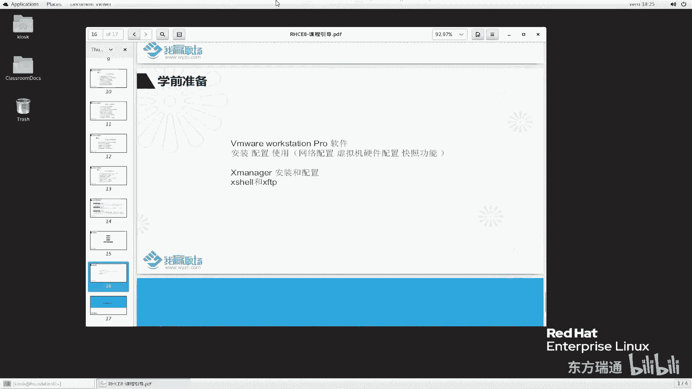
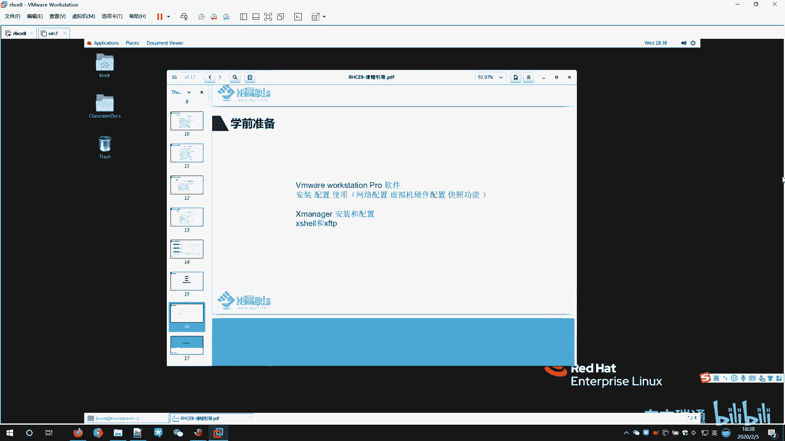

# 红帽RHCE认证培训（8.0版本）-备考红帽认证必修课，快来一起学习起来吧 - P3：RHCE8课程介绍3-学前准备 - 东方瑞通 - BV1P44y137Fg

各位同学大家好，欢迎来到我赢职场HCE8的课堂，我是马老师。嗯，这节课呢我们接着给大家讲一讲。这个学习HHC18课程之前呢，我们这个环境需要做哪些准备呢？那在这里面呢，我主要给大家讲两个。

第1个VMY works station pro这个软件安装和使用。第二个呢，X manager的安装和配置。那么为了不破坏我这个笔记本的物理机它的环境呢，那么这个两个软件的安装和使用呢。

我在虚拟机里边这两个软件的安装啊，我在虚拟机里边给大家模拟好吗？

那关于这个软件的安装呢，我们可以在我的电脑里边，对于什么呢？对于我们的。就是说我现在我的物理机是采用的是什么？是win10的系统，那么有16G内存、64位的等等的哈。其实嗯对于大家来说哈。

我们使用winIN7系统，win10系统都可以，这个没有太多的要求。那么在我这里面呢，我采取的是什么呀？

采取的是winIN7的系统，给大家去模拟一下啊。那么首先我现在采用的这个VM软件呢，大版本是15啊，1502。那么你们用其他的版本也行，建议大家大版本用15好吗？我们来安装一下。

首先看到这个地方有个盾牌，表示以管理员身份去运行。啊，因为你要安装软件是吧，肯定要经过管理员的一些同意授权。那么这个地方呢，我也给大家准备好了他需要的一些SN号。那首次启动的时候啊。

这个VMI软件呢需要一些时间，我们要稍等片刻。那么在大家。嗯，去练习这个HHC18这个练习的时候呢，我会给大家一个虚拟机。那这个虚拟机呢？他对于我们整个RGC18学习的过程当中来说啊。

他对这个硬件呢会有一些要求。呃，建议大家这个物理机啊给他配，至少要配8G内存。啊，那建议呢配12G到16G内存，这样呢才能保证我们这个呃虚拟机练习环境正常的运行，好吗？那么对于CPU来说呢。

大部分的CPU都能满足我们的需求了。你普通的I5就可以了。好吗？那么硬盘呢，为了达到我们这个虚拟机运行的流畅，我们建议大家也是给它配一个固态硬盘，128G就够我们这个环境用了啊。但是从扩展的角度来说啊。

以后大家可能还要加容量的话，建议大家一次性买256或者512G的这么一个固态硬盘去用。啊，网卡没有什么太多的要求，基本上千兆网卡都可以哈。那么这个软件打开来之后呢，出现了一个安装向导。

我们默认选下一步windows的软件安装啊，大部分下一步下一步就可以了啊。这个位置首先选择我接受许可协议中的条款，选择下一步。然后安装的位置呢，我们不用动啊，默认安装就可以了。

对于这个增强型键盘驱动程序可以打勾，也可以不打勾。那建议大家打勾好吗？下一步，启动时检查产品更新吗？我们这个产品已经够用了，建议大家这个呢不要打勾啊。然后加入他的体提升计划吗？嗯。

你可以去加入这个提升计划，也可以不加入啊，建议这两个都取消，选择下一步。桌面和开始菜单给我们安装完成之后，给我们创建快捷方式啊，默认的选择下一步。然后开始安装就可以了。那么还是一样的。

取决于大家物理机的配置。那这个时间呢可能比较慢也那我的配置正常情况按这个软件需要3分钟的左右时间。好，我们稍等一会儿，等它安装完成，我们再回来。哦，经过一段时间的等待呢，那么我们这个软件就安装完成了。

它提示我们要么输入许可证，要么选择完成。那在这个地方呢，我们建议大家输入许可证，否则呢，这个软件用了30天之后呢，就没法继续去使用了啊，它只是一个试用的软件。那么输入序列号进行一个解锁。

那么由于这个软件刚刚我们选择了增强型这个键盘呢，所以说它需要重启。那么这个地方呢，我们选择否。下一次我们重启的时候，让它自动生效好吗？呃，这关于这个软件的使用呢。

我们待会在外面给大家在物理机的环境给大家演示。我们再来讲一下这个X many版本5这个软件的安装一样的，以管理员身份运行。选择是。好，这个软件的安装呢也要稍微等一会儿啊。

虽然说这个右下角显示的是未响应啊，大家不用担心啊，只要你的机器配置够，不会有什么问题哈。好，在弹出的安装这个向导界面呢，我们选择下一步。也是接受许可证条款。下一步。用户名根据自己需要去写上自己的用户名。

公司的名称任意啊，产品密钥要写一下。下一步。然后安装的路径不需要动。这个地方要注意了，我们安装的类型选择哪一个呢？那么典型它是正满足大多数用户的需求了，压缩呢只安装极少部关键的一些核心程序。

定制呢根据自己需要去安装，我们这里面选择定制。下一步，在这个地方，我们。把所有的都给他勾选一下。下一步，因为我们后面用X manager的软件呢，主要用X shell和XFTP这两个功能。好。

这个地方打勾啊，其实不打勾也没有关系，好吗？然后选下一步。语言选择中文简体啊，大部分都选择中文简体啊。当然你觉得你英语水平比较好，你也可以选择这个english。那这个软件安装来说安装呢相对来说比较快。

好，这个软件就安装完成了。刚刚提示说我们这个需要重启，对吧？那么我们这样啊，我们把这个虚拟机给它关一下机。关机吧。好，关机生效，对吧？那我们给他关个机啊。啊，我们继续切到我们这个PPT里面来。

这个两个软件已经安装完成了。那么这两个软件怎么用呢啊？其实呢我一直在给大家使用呢，我们给大家演示的时候，就是在虚拟机里面用的，我也一直在用这么一个虚拟化的软件。

大家可以看到我们现在用的是不是VMYwork station这么一个软件啊，确实是是吧？那在这这里呢，我给大家简单的介绍一下这个VMI软件的操作啊，否则对于第一次接触的。VMI软件的同学来说呢。

可能会有点有点什么有点比较生疏啊。我们首先从哪一看呢？从这个查看里边来看。查看里边全屏相当于让我们这个虚拟机全屏。这样呢大家看到的是完整的一个虚拟机界面。哎，老师，那个虚拟一界面之后，我如何退回来呢？

我们鼠标往上面滑，看鼠标往上面移动啊，移动就可以看到这个。给我们弹出来了，我们再选择这个按钮就退出全屏，那非常的方便啊。第二个优题优利题啊，我们这个这个当前不支持哈不支持。说虚拟机无法进入模式是吧。

不支持。哎，那么我看一下啊。这个比较长是吧，确定一下。那么再来看一下其他的功能。

控制台视图，我们点一下控制台。此时可以看到左侧是我们这个虚拟机的硬件配置信息，右侧是我们这个虚拟机它的一个显示界面啊，我们点一下右侧，它又回到了它的一个控制台了，好吗？

那么同样呢还可以给他再点回来啊，其实我们点不点都无所谓啊。

那么还有这里边说立即适应客服机是吧，还有调整大小都可以啊，都可以自动调整大小都灰色的就不能调了是吧？那我们就不用不用理会了，说明他已经生效了啊。

那么这个自定义是用于控制我们这个菜单栏是否需要显示相关的功能。例如说啊例如说啊我们先给他点进来。

那么我要想显示左边的侧边栏，这叫库侧边栏库啊。好，我们可以把它取消。又不显示了对吧？那么这一样的啊，当然我们也可以按什么按F9这个快捷键帮我们显示，好吧，F91下。显示了吧。那么也一样的。

还有其他的缩略图，F8哎，缩略图是什么呀？下面给我们多了一个缩略图，是不是再按一下F8。

又没有了是吧啊，其实刚刚讲的这个显示库啊，在这个位置也有快捷键，显示这个梭猎头呢都有快捷键。操作起来还是非常的方便，包括这个全全屏是吧，还有说控制台啊。那在这里面哇，我们还有一个按钮叫。叫什么？

叫这个叫自由拉伸，这个很重要啊，这个你调整不好呢，我们这个虚拟机显示起来就非常不舒服啊。我们可以选择纵横比例去拉伸。

大家看到我们这个纵横比例拉伸之后，它这个分辨率啊，根据你这个屏幕的分辨率，它会保持特定的比例啊。那我们来看一下我当前的分辨率是多少呢？1920是16比10的，那么他就保持16比10去拉伸。

那左侧两边他们显示的时候就是黑色的方框。那么我们就去拉伸的时候，大家来看一下。

他还是按照我们这个比例去拉伸的是吧？当然你你可以说按照这个比例拉伸也可以。好吧，可以啊。但是呢我一般来说我喜欢全屏，你看全屏之后，你这种拉伸就看的不舒服了是吧？那怎么办呢？我们一般来说选择什么。

选择这个自由拉伸。

这样看着就比较舒服一些好，舒服一些。这是关于这个界面相关的操作。那么关于这个虚拟机，它的电源操作呢？

主要有这么这个地方，大家可以看到啊，虚拟机启动虚拟机。那我们它没有加电，我们可以给它加电去启动它。

那么虚拟机就可以加电了，开机对吧？那么不想让他开机呢，我们就给它关闭啊，关闭一下。

虚拟机就关机了。当然那么它开机之后呢，我们也可以给它挂起。

这个挂起呢相当于什么呀？相当于我们系统里面睡眠这个功能一样的，随时可以唤醒。对吧随时可以唤醒啊。那还有一个就是这个里边啊这个里边那么我刚刚还讲漏了一个，在查看里边，还有一个还有一个啊。嗯。

说有一个工具栏，我们点一下，你看这个位置好像没有了吧。刚刚我们讲的工具栏好，再点一下，把它调出来。因为我们经常操作是到工具栏里面操作是方非常的方便啊。

那么还有一个是选项卡。大家看我们这个有1个HC18，有个winN7。那么如果说我们把这个选项卡取消掉了之后，那么大家再来看一下。

那么这个位置就没有了。建议大家呢给它调出来，这样我们去虚拟机之间切换的时候就非常的方便。啊方面啊。那么下面还有一个叫状态栏，状态栏是对什么用呢？状态栏是我们的虚拟机右下角是这么一个东西啊。

这边现在没有啊，我们把它打开来看一下，对比一下大家就知道了。那么此时大家就可以看到我们右下角就会有相关的这个虚拟机的一些硬件，硬盘是吧？硬盘、光驱网卡啊等等等这些东西。啊，那么关于里边呢，我们点取消哈。

不用理会它好吗？不用修复OK啊。这是查看相关的一些操作。那么除了查看呢，我们还有一个操作是非常常见的啊。刚刚说我们这个电源管理里边有什么呃，开机关机，还有一个挂机，挂机相当于睡眠，睡眠呢之后呢。

我们可以把它唤醒，还有重启啊电源操作啊。那么这个地方还有一个给他发送一个。发送什么发送该虚拟机，哎，我们点一下。给虚拟机发送这个信号啊，当然此时他现在没反应了是吧，我们。这样啊我们给他关机好吗？

这个在开机的状态下才有意义啊。我们windows里面继续，当你按ctrl alt加delete的时候，它会给我们弹出一个界面是吧？这样我们正常启动。

不需要修复啊。那么在它启动过程当中呢，我们尝试着给他发一个信号，看一下能不能起作用。啊，在这里面似乎没什么起没起什么作用，是吧？我们稍等一下，等他系统加载好好吗？

在这个里边，我们再给他发个信试一下。哎，他有了吧？好有闪了一下是吧，这样我们先登录进来。登录进来之后呢，我们再给他发一个信号试一下。好它就出现这个界面了啊这个界面了。

如果说我们手动去按ctrl alt加deele的话，那么这个信号默认是发给我们这个物理机的。当然我们正常情况下，我想发信号，你想发给物理机，你就按这个按钮。如果想发给虚拟机，你通过这个方式给他发。

否则就麻烦了啊。你直接按物理机，直接按的时候是按物理机，其实你想信号发给他，那么通过这个按钮来实现。OK啊，还有这个是快照拍摄此虚拟机的快照。这个快照呢跟其他很多一些呃软件里面的快照功能应该很类似啊。

也就是说当前你看啊，我给大家举个例子，当前我们这个。已经有了这么一个文件啊，我们做这么一个事情啊，我做什么事情呢？我把这个虚拟机关机。关机之后呢，我把这个文件删掉，删掉之后呢。我再来通过快照去把它还原。

好吧。那么关掉之后呢，我现在给他拍个快照，例说就叫快照4啊。快照拍完之后去新创建一个快照，拍完之后呢，我到这机器里边来。

然后呢，我将这个机器里面的相关的文件啊做个破坏。那这种情况一般是做什么用呢？啊，大概是这样子啊，例如说我们在虚拟化平台里面，或者说在云平台上面我们去管理我们的服务器。

那我这个服务器我现在要对服务器进行升级。那这个服务器升级的过程当中啊，可能会导致我们的应用有问题。好，那么为了防止这个升级，会对我们系统产生这个问题呢，我们可以在升级之前呢，对这个服务器做一个快照。啊。

万一有问题之后呢，我们就通过快照来恢复啊。那对于我们这个事例呢，我想把这几个文件给它删掉。删掉好吧，删掉之后呢，我通过这个恢复功能哈，将此讯以及快照恢复到快照4，通过这个来给它恢复，好吗？

问我们是否要恢复我们显示。此时呢我们再给他开机，看一下能不能恢复到之前的那个状态呢。等启动完成之后，看一看那相关的四个文件是否又给我们回复回来了。

好，登录进来看一下。那么四个文件原原本本的回来回到我们之前的一个状态。那么再看这个按钮叫管理虚拟机的快照。我之前可能创建了好多快照。那有些快照我们都知道，你要创建快照。

肯定会对硬盘产生一些占用一些存储容量。那我不想要了这些快照，不想想他让想让这个虚拟机瘦身减肥，对不对？那怎么办呢？我可以把这些快照给它删掉嘛。然后例如说我把快照4，我给它删掉，不要了，删掉。当然了。

你这里面还可以干嘛呢？还还可以对这些快照做什么克隆。利用现有的快照去克隆出新的虚拟机也可以好吧，也可以啊。这个快照的使用呢简单就给大家讲这么多，其他的快照的功能呢，大家自己再自我去研究一下啊，那么。

这里面的功能啊，我刚刚给大家讲，已经够我们课堂用了，好吗？那么再来看一下虚拟机的硬件配置。打开的稍微有点慢哈。那么此时大家可以看到我们虚拟机的内存有4个G内存可以去增加虚拟机在开机的状态下。

可以对于现有的这个硬件设备进行增加。例如说我想对内存进行增加，想对CPU增加，也可以。那么我还想给大增加硬盘也可以在底下进行增加。好吧，那么对网卡也可以增加光驱呢都可以增加啊，但是这个硬盘增加。

你是增加一个独立的硬盘，你不要说我去增加这个硬盘的容量啊，这个硬盘的容量不能够增加好吧，不能够这么方这种方式去增加啊，我们去更改这个虚拟机的一个硬件的时候，建议大家做什么事啊。把虚拟机关机再去改啊。

关机再去改，不要在开机状态去改啊。不建议大家这么做好吗？当然这个地方还有一些其他设置啊，自己去研究一下好吗？自己自己研究一下啊。😊，OK这个虚拟机呢功能啊基本功能我就给大家介绍这么多。还有一个就是。

老师，你刚刚这个都是现成的虚拟机去讲嘛，那对于我来说，我能不能自己去新建一个虚拟机呢？当然也可以了。那么新建虚拟机怎么创建呢？例如说我想装一个。HEL8操作系统这么一个虚拟可以呀，文件新建。

然后根据这个向脑哈，下一步一步一步去安装一个虚拟机就可以了。关于这个安装呢，我就给大家提这么多，好吗？那当然我们操作系统里面已经有可能啊，我们操作系统里面也有也有现成的虚拟，那我怎么去打开呢？

这个win继虚拟器我们先给它关机。因为它占用我们太多的内存了，我们给它释放一下啊。

来看一下我们操作系统里边，我之前已经准备了好多虚拟机，例如说我准备了1个H17。6这么一个虚拟机。那么你们去报名之后，学学了我们这门课程之后呢，肯定啊我们老师都肯定会给给大家1个HC18L这么一个。

目录啊这目录里面有我们相应的虚拟机。这个虚拟机呢，由于我当前在这个位置已经打开了，所以说它会产生一些锁文件啊锁文件。那么对于这种虚这个这这种虚拟机它是没有被打开的情况下。

那么它只有这么一个点VMX结尾的，我们选择打开。大家就可以看看到啊，我们这里面虚拟机就可以加入到VMI软件里面，我们就可以打开使用了。同样开机啊，编辑它的硬件都可以。

那么我给你们的H4E8，你也是按照同样的方法把它打开好吗？把它打开。啊，这是我们讲的这个VMI这个软件的使用。OK。那么。VM2软件呢是这个地方有时候我们啊我们要去连这个服务器的时候，我不想全屏。

那很多同学说老师我有这个呃linux基础呢，我不想在这个linux界面里面操作，太麻烦了。我想在外界用什么呢？我想在外界用远程工具来连接。好的。

下面我们给大家演示一下这个Xman到底怎么配置去连接我们这个工具，好吗。OK那么我们再回到这边来啊。首先我们要看一个东西，就是我这个机器，我这个虚拟机跟外界它网络是怎么连的？那在我们这里面。

我们只用到一种模式，网络模式叫什么网络模式啊？好，给大家看一下，我给你们这个虚拟机里面它的网络模式是什么？找到我们这个网卡，这个网卡它的模式叫紧主机模式。啊，这个警主模出警主机模式到底是什么意思呢？

那么我给大家简单的画一幅图啊，大家理解一下啊。在我们真实的环境下面，我们正常情况是这样子的啊。啊，我先取消一下啊。

在我们的真实环境下面，应该是这样啊，我们呢有一个。交换机啊，我们的交换机。那么。我们电脑之间怎么连呢？啊，打个比方，这是我的第一个电脑，这是我的第二个电脑。他们连到是连到我们交换机上面进行一个通信。啊。

那么在我们这个虚拟化里边，它是怎么通信呢？它其实跟这里面也是一样。好吧，也是一样的啊。那么我给大家说一下，在虚拟化环境里面，我们会生成一个在我的windows里面啊，会生成一个虚拟的交换机。

这是一个虚拟的交换机，它的名称叫VM。VM什么VMnet1。虚拟交换机它的模式叫仅主机模式啊，仅主机的模式。那么在紧主机模式里面，我刚刚有1个RHCE8好，打个比方，我们取名字叫RHCE8。

我就简单写R8。

这个主机呢会连到这个网卡上面。刚刚我们看到HHC18这个主机，它的网卡模式是谁么？选择了仅主机模式，那么它就会自动连到这个交换机上面来，虚拟交换机上上面来。那么我的物理主机这个地方我写啊。

这是我的物理主机，我的物理主机也连到这个也连到这个虚拟交换机上面来。如果说这两个机器之间。物理主机和HC8这个虚拟机两者使用的是同一个网络的，同一个网段的IP。同一个网段的IP呢。

他们之间就可以进行互相通信了。那么我们来配置一下，好吧。好，这个虚拟机的它的一个网络模式，我们已经说过了，叫警主机。啊，大家看到啊紧主机。此时我们再来看一下我们这个虚拟化软件。

他给我们提供的虚拟交换机是什么？虚拟交换机里边它也有一个警主机。好吗，进主机，我们点的更改。这个更改里边给我们提到了有1个VMnet1。好，我们虚拟机刚刚就连着这个VMnet一这个虚拟交换机上面来。

他使用的网段是17225。0。0。那么你们安装好之后啊，这个网段呢地址啊应该不是这个17225。0。0的。那么我们到下面来这个紧主机不要动啊。然后选个勾。

这个勾一定要打表示将我们物理主机上面会生成一个虚拟网卡。也就是这个意思。在我们的这个虚拟组。物理主机上面会生成一个虚拟网卡。虚拟网卡大家可以看到，它的一个网盾地址是17225。0。1。

也就是与我们刚刚提到的这个网络里边的IP地址是。在这个网段里面呢。好吧，1725。0。0言码是24位的。如果不是大家切记一定要把它设置为这个网段。然后这个地方要打勾，打勾之后。

我们就会生成了这么一个网卡。如果你不打勾，就没有这个IP地址。打完勾之后，这个DHCP不要开启啊，因为我们这个服务器里面啊，我们这个服务器里边它已经有1个IP地址是1725。0。250。

它也已经开启了DHCP这两个就冲突了，好吗？这个这个外面啊就按照啊，如果大家搞不清楚的话，就按照我这个界面去配置仅主机打勾，不打勾，子网页码配成这样子，然后点确定就可以了。啊，其实我没有做任何更改啊。

你们那个地方会会跟我这个稍微不一样。所以说你们呢要适当的修改一下。这样呢我们这个机器呢跟这个服务器之间呢就通信起来了。那么我这个服务器它的IP地址是多少呢？来看一下。

IPAADDR受受什么B20关于这个命令呢，我们后期再给大家讲，反正你通过这种方式呢，能看到我们的地址，好吧。或者或者或者叫IPA也可以啊。IPA呢命令太简短了哈。那么这个上太这个比较长一点的命令呢。

能够看到我们需要看到的信息。这个网卡它配了17225。0。250。哎，我们物理主机是1725。0。1啊，他们是连在同一个虚拟交换机上面直接去的，他们之间可以互相通信。

此时呢我们打开我们的这个X many这个工具去连一下。

那我先给他重新关掉啊。那么这个Xman的工具呢，它默认是这个样子啊这个样子。我们首先测试一下我物理主机啊。

物理主机跟我们那个虚拟机之间是否能够通信？

去拼一下。172。25。0。250，看看能不能通信。能够并通，说明网络通是没有问题的。

那么我想通过SSH工具去连到我们这个服务器上面呢，也可以呀。SSH例如说我连的是KIOSK这个账户去连到我们这个172。25。0。250这台服务器上面来。他提示。你要以这个用户登录到服务器上面来。

可以呀，我们输入一下我们的密码readhead去登录一下。那么此时呢，我们就登录到这个服务器上面来了，非常的方便。好吗？那登录成功之后，老师，我看你这个上面好像有很多这种类似快捷键标签的方式嘛。

那这个快捷能干什么用呢？我给大家简单的点一下啊，我先退出，比如说我点这个。

大家可以看到我就非常的方便啊，以KIOSOSK用户登录到我们172。0。250这台服务器上面来了。那么这个怎么做呢？其实我们可以方式比较多啊，例如说我们刚刚刚刚刚刚刚开始怎么做的，我们这样做的是吧。

然后我们去连连上来，连上来之后，我们输入个密码readhead。

此时呢我们可以加这个符号给它添加到链接栏。那么就多了这么一个东西好，添加到链接栏。但然这个链接栏，你说这个显示的属性我不满意，你可以去更改它的属性。有时候我就叫XX随你改好吗？主机端口号，然后呢。

他登录的身份用户也可以改密码呢，我们也可以输一下，都可以输。redhead你包括这里面它的外观，刚刚大家看到的我那个什么颜色，我那是浅绿色是吧？就是说我现在不要这个颜色啊，颜色方案呢。

我给它改成什么改成这个什么白色白白字在黑背景的，是不是啊，我字体呢给它调大一点都可以。好，来看一下是不是这个样子。是不是这样是吧，达到我们想要的效果啊，你不想要，你就给他删掉。OK啊。

这是我们讲的这个excel远程工具的一个使用。那么当然你还可以去新建一个哈，还可以在这个地方打开现有的，然后对这个现有的进行一个复制粘贴，然后也可以把这个东西呢拖到我们链接里边去。

你看我刚刚把test拖进拖到link里面，它就多了一个啊，我再拖一个看一下。他说有重复的是不是啊，那重复就不管了。啊，就留在这就可以了。好吧。excel工具的使用。还有一个工具是SFTP。

那我们想往服务器上传一些文件，我们可以使用现有的这个SFTP工具传啊，点开来新建传输。

此时大家应该可以看到哈，左侧是我的电脑，那右侧呢是我们的这个服务器上面的一些一些路径。我可以把我本地的，例如说我们把这个文件传上去。IP10的。有没有传上去传过来了是吧？

当然我们也可以把这个文件呢传到我本地。那么传过来了吗？大家看一下我这个history。有没有传过来，也传过来了是吧？好，不要了，我就给他删掉吧。同样这个IP10我也给它删掉。

啊，这是一个文件的传递啊。当然了，在我们本地下面，我们其实我们的本地这个目录里边也有啊。大家可以看一下我这个地方有一个快捷键，或者说你你在这里面去找啊。啊，应该是win10里面是右键是吧。

右键里面找一下他的这个。应用和功能是吧？哎，我们在这里面左键还是左键去找一下啊。比较长，或者你在这里面找一下吧啊。叫XFTP。FTP啊找到这么一个工具。

在这个工具里面，你可以自己想要连到哪个机上面就去连哪个哪个机器也是非常的方便的。

好吧。

那这节课呢，我们就给大家主要讲了两个内容啊，一个就是。IVMY work station project软件的使用，还有一个就是X manager的软件使用啊。那到这里面呢。

我们HC18的这个课程引导部分呢就给大家介绍完了。好吗？我们下一次课再见。

