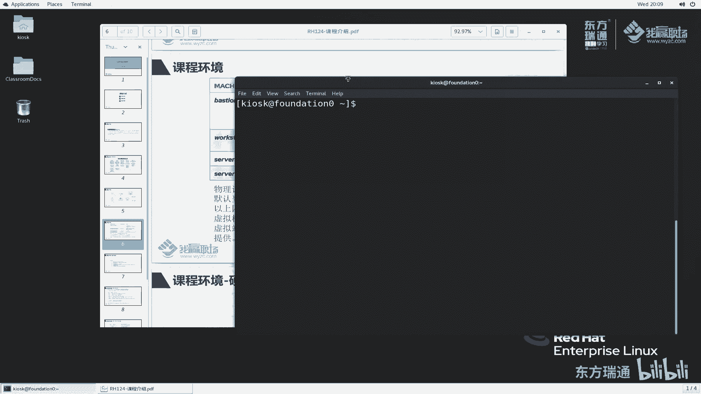

# 红帽RHCE认证培训（8.0版本）-备考红帽认证必修课，快来一起学习起来吧 - P4：00-1-RH124课程介绍 - 东方瑞通 - BV1P44y137Fg

同学们好，欢迎来到我们职场hc 18课堂，我是马老师，今天呢我们来给大家讲一下红帽系统管理员一rh 124，这门课的课程介绍。

那么这门课的课程介绍呢主要包括三个部分，首先呢是这门124课程的课程介绍，然后呢再给大家讲一下这门课程的课程大纲，课程安排，第三个部分，我们这个课程在学习过程当中，这个练习环境我们去怎么用啊。

以及它的练习环境是什么一个样子来看第一部分，那么红帽系统管理员17124，它是专门为没有任何linux系统维护经验的it专业人员设计的，那这门课呢主要聚焦聚焦在什么linux的一些核心管理任务。

为我们的学员提供linux管理的生存生存技能啊，那么还为学员呢通过引入一些关键命令行的这些概念，和企业级的一些工具来规划，成为全职linux系统管理员提供了这么一个基础，就简单一点讲。

就是说我们124这门课程，主要给我们的学员提供一些linux的一些核心和一些基础的管理任务，来看一下他的一个课程安排，他的课程大纲，其实rh 1 s这本书呢内容非常的多，也是非常的基础，一共分五天啊。

大概15个章节左右啊，那么第一天呢第一章首先给大家讲一下，了解一下什么叫red red hat enterprise linux的一个入门，了解一下红帽啊，以及linux与红帽的关系。

linx发行版本等等等这些知识啊，都一些基础的概念，第二章呢去访问命令行，在操作系统维护过程当中呢，我们主要是使用命令行来回复系统的，那么这个命令行到底怎么使用呢，第二章会给大家介绍。

第三章呢是在命令行里边去管理文件啊，第二章我们只是讲的叫命令行里面的一个基本的一些介绍，第三章呢是给大家讲在命令行里面去管理文件啊，第五章呢是说一下rh e l这个系统当中，我们如何去获取帮助。

那么我们都知道在生产环境下面，或者说我们平时啊遇到问题的时候，我们正常都会在互联网上去寻求一些帮助，但是呢互联网的信息比较复杂，那其实在我们系统里面，它本身已经提供了很多一些有用的正式的啊。

官方给我们提供了一些文档来帮你，其实我们从这里面就可以获得非常好的帮助，那么我们如何去获取这些帮助呢，对吧好，这章会给我们详细的讲解，第五章呢去管理文本文件，那在整个服务器运行过程当中啊。

他服务器里边呢它的一些配置文件基本上都是以文本文件来保存的，所以说呢我们要更改服务器配置的时候，基本上都会做这么一个事情，那你至少会查看吧，那如果说不符合我们的要求。

我们至少会编辑吧啊主要是做这么一件事情好吧，那么第二天呢会给大家讲一下啊，就是接着第一天啊，第一天的内容比较多啊，所以说呢我们接着第一天会继续管理我们这个文本文件好，以及呢管理我们的本地用户和组。

你想想我们学习一个操作系统，你肯定要学习什么用户的管理是吧，操作系统上面有很多用户，这不像我们windows啊，不像我windows的这个普通的个人电脑，那么我们使用windows个人电脑的时候。

基本上这个操作系统里面我就这么一个两个用户啊，基本上我个人使用一个账户，还有一个管理员账户，那有的同学甚至直接使用管理员账户来登录的，那对于服务器来说就不一样了。

我们的服务器呢可能是使用什么作为web服务器，那有可能是属于数据库服务器，还有可能作为等等的其他一些服务器，那么我这个地方就会创建很多一些用户，帮助我们服务器去正常的运行啊，以及一些组。

那用户怎么管理呢，啊这章会给我们详细的讲解，然后再给大家讲解一下文件，那么服务器上面有很多文件，也有很多用户，那我用户对于这个文件的权限是什么样子呢，如何去控制呢，是否能够读文件，以编辑文件。

以及这个文件是否能够执行呢，好这一章给大家讲解，然后接下来是给大家讲一下监控和管理linux的进程，我们学习一个操作系统，肯定会学习什么，你说那个操作系统里面跑了哪些进程。

这些进程它的占用的cpu和内存，以及呢是否是占用了一些网络端口等等等，那么我们要知道这么一个东西，监控监控我们的进程，第三天啊给大家讲解什么呢，我们的控制服务和首付进程，这个控制服务和首付竞争啊。

其实我们这里面的东西啊，我们都可以把它与windows的对比，包括你这一块命令行，那这个命令行就可以理解为类比windows里面的一个cmd命令行，那么这个这个地方的进程也可以理解为windows里面。

任务管理器里边也有一些进程，那么这个地方服务和守护进程也可以类比windows里面的service，管理好，windows里面去管理很多一些服务是吧，那服务每个服务里边它与服务关联的有很多一些首富进程。

那叫demons，那么接下来是讲什么ssh服务器，我们去维护服务器的时候，通常都是通过网络，然后通过一些客户端的工具，加上我们的网络通信去管理服务器啊。

这里边我们用到的一个非常重要的一个服务叫s h服务，那么既然这个服务经常要我如何去配置这些服务器，如何去加固这个服务器呢，好那么我们这一章会讲这么一些服务器在运行过程当中。

那么我如何看服务器的运行状况呢，那么我们正常情况下会做对他做一些日志的记录，好日度日志怎么去保存，怎么去记录，记录完成之后，我怎么去分析这个日志啊，都是非常重要的，在我们的运维管理过程当中啊。

第四天网络管理服务器系统装好之后，那么我们必须配置网络，配置了网络之后，我们才能通过网络去管理这个服务器，那么当然网络里面不仅仅指的就是ip地址的，那么还有我们讲虚拟化环境会涉到涉及到什么虚拟网桥。

路由啊啊等等等很多方面的一些支持，在这里面呢，例如说dns解析，域名解析主机名称的解析啊，这个地方啊非常多啊，我们的ip地址配置，网络的配置，包括我们讲的网络聚合哈，很多一些网络知识，那在这个地方呢。

它会包含一些核心的我们的网卡配置啊，以及网络故障的排除，这么一些知识点，归档和传送文件，服务器在运行过程当中，它总是一些重要的文件，那对于这些重要的文件，我们不可能只把它保存在本地。

我们要定期的对它进行归档，那也不可能只归档在本地，我们要把它传递到其他服务器上面去，传递到远端服务器啊，那么怎么去传递呢，怎么去归档呢，服务器里面都会给我们提供相应的工具，让我们去维护它好。

紧接着看一下我们操作系统里面的软件包的一些维护，那软件包我们去安装去更新是吧，那么系统里面需要linux里边是一个我们讲可以理解为是它是一个什么，叫它是一个各个模块组装出来的。

成组装成的一个发行版本的系统，红帽就是这么一个系统，那么它这里面如果没有功能，我们就需要安装，如果说功能比较旧了，需要升级，那我们就升级啊，其实除了除了这两者之外，还有很多软件包相关的知识。

例如说我们这个亚目仓库亚美元的配置，rpm的工具的使用还有很多啊，但红帽八版本里面又引用了一些叫app stream的概念啊，非常非常重要啊，非常重要，那系统里边你说软件安装都不会。

那你还怎么玩操作系统呢是吧，第五天给大家讲解一下文件系统，那操作系统运行过程当中会有很多文件，这个文件我是怎么保存在文件系统里面呢，怎么保存在这操作系统里面呢，是文件啊。

那么以大家使用windows的都知道是吧，windows里面用的是c盘，d盘e盘，那么文件好像直接往里存了，其实不是那么简单的啊，因为你装系统的时候，我们会把硬盘分区分成几个区。

那么每一个分区磁盘呢我们分区完成之后，我们对它进行一个格式化，那windows里面常见的格式化文件系统是什么呀，ntfs啊，大家可能都不怎么不怎么在意的啊，那很多同学插u盘，就知道我u盘插进去之后。

他可能会提示你去格式化，说不识别它格式化的操作就是就是干嘛呢，就是给你创建一个文件系统，好在这个地方呢，我会给大家讲一下文件系统它的创建以及挂载啊，包括他的一个访问啊等等等。

那最后一章给大家讲解服务器分析服务器，那么我们的服务器运行过程当中，它的一个运行的状态啊，他分析以及服务器出了问题之后，我们从从哪从红帽去获取帮助，这个地方指的是在我们的红帽的操作系统里边去自助去服务。

那么还有这种是从红帽官方的门户网站上面去获取帮助信息，ok啊那么rh rh 124呢，就是这么一些内容，内容还是非常的多啊，大家在前期学习这门课程的时候，可能会遇到很多一些问题。

因为如果说你之前是只搞过windows的话，那么突然之间让你转到这个linux概念里面来学的话，会有点啊，会有一点这个比较大的一个准则啊，那么拿马老师来说，我个人去学linux，是的。

我刚开始也是做一个windows的一个基础支持，那后来去学linux就感觉好的很多东西就学的比较累哈，比较累，但是呢我希望啊我认为哈大家以后跟我学的话，那么学这门课程应该会比较轻松。

我会把我的嗯之前遇到的一些问题啊，我的一些思想的转变的过程啊，我都会跟大家一起来聊一聊，好吧好，这是我们讲的rh 1 s课程的一个课程大纲，下面呢我们再来看一下在我们这个课程学习的过程当中。

会用到哪些服务器，好简单的看一下，这里面一共用到了五台服务器啊，其实不止五台啊，应该算上我们物理器可能要六台，先看右边的workstation。

sera server b以及basession这四台机器，那么这四台机器所在的网络是172。25。250点，斜杠24位，在这么一个网络里面去通信了，basic呢它还有另外一个网卡叫172。25。

252点，在这个网络里面还有一块网卡，他这个网络用于与class room去通信，那么classroom是作为什么角色呢，他提供我们整个练习环境当中用到的相关的，例如说用到的iso文件。

用到的lab文件，就是说我们会做一些实验过程当中会有一些脚本文件，那么还有一些材料，materials文件啊等等等，这个classroom码提供一个web服务器，web服务器。

那么在这个basession它是提供什么，提供一个dh cp服务，它针对我们搜搜b workstation，它提供的dh cp服务，他们地址可以从他这里面获取，同时basession还作为我们的网关。

这三台机器通过basic啊，通过它这个网关与外界的classroom进行通信，然后classroom呢你有可能与internet连同学，有可能没有，那在我们的环境里面。

我们这个物理主机是采用仅主机模式与我们这个foundation去通信的，所以说呢它与外界是不通信的，也不需要通信，只要我们这个涉及到的实验与classroom能classroom能够通信就可以了。

好关于这块地方他网络通讯，如果说没有学过网络的同学，那这次首次听的话，可能会觉得有点有点懵，那没有关系啊，没有关系，这个地方不是我们的重点啊，大家只要只要知道，那么我这三台机器直接互相通信就行。

那么这几台机器能够互相通信，好刚刚给大家提到了一共五台机器啊，五台机器里边除了classroom之外，classroom这个机器永远都是不需要我们动的，他这个服务器里边我们做实验的过程当中。

保持它不需要动啊，不需要动，所以说在这个列表里面给我们的四台机器啊，我们也不需要关心classroom，它正常就是运行起来的，那这四台机器是才是我们需要实验去去去与我们实验相关的。

那么他们的ip地址大家可以看到被c神作为网关网关的地址，一般来说我们都是给他设置比较大的一个app，4255是我们的正常是子网掩码是吧，二五啊，广播地址对吧，广播地址九是workstation。

server a是十啊，server b是11，那么在这里面sa是我们第一个服务器，server b是第二个服务器，workstation是具有图形界面给我们管理员用的啊。

后续我们可能很多实验都是在workstation上面去完成的，那么sa和sb是两个只有字符界面的，注意sa和sb是没有图形化界面啊，没有图形化界面，那么这四台机器他们的用户名和密码又是什么呢。

我们怎么去操作这些机器呢，是不是啊，那么对于刚刚我们提到这里面有五台机器，那这五台机器对于我们的物理机的环境又有什么要求呢，这样我们先看第一个问题啊，就是说这几台机器的一个用户名的登录信息。

那这个物理主机也就是说我们的foundation，这个foundation也就是我们这个机器啊。

这样我给它关掉啊，在右键桌面打开，打开我们的终端。

那大家在这个位置看到的名称就是我们的物理主机。

那这个物物理主机我登录的时候，我是默认使用这个kiosk这个账户登录的，他的密码是red h，大家暂且记住就行了，后续在我们第二章节的时候，我会给大家演示和验证好吗，那么这是物理主机。

物理主机有一个超级账户，这个超级账户呢是root root对应的密码呢大家暂且不需要知道，除了foundation之外呢，classroom大家不用关心，那么这几台机器上面。

这四台机器上面都有一个账户叫student账户密码，那是student，同样这次在机器上面还有一个超级管理员账户，root，对应的密码是red head，好这里面我们看到red hat已经出现了两次了。

其实这个地方啊，嗯red hat后续，反正对于大家来说，我们这个账户只要你是不知道的，只要这个账户密码你不知道，你就使用red hat去登录就可以了啊，去测试好吧，这里面用到的东西。

其实我我给大家提供的一些资源啊，如果说涉及到密码的话，那么密码也会设置成red h去用就可以了，在整个我们区114或者说hc里面的三门课，那这三门课涉及到的机器还是比较多的，那对于rh 124来说。

我们这个机器里面它的硬件配置信息有哪些呢，有这么一个啊，那么我们这个地方它的cpu要求是i3 就够了，其实i3 要求并不高，我们现我们的同学啊，现在大部分笔记本或者台式机。

这个它cpu正常都是i5 或者i7 的i5 居多是吧，当然i3 有一些比较老的cpu也可以啊，要支持虚拟化，i3 g i3 是肯定是支持虚拟化的，那么如果你是amd的cpu。

那么至少是什么这个系列的支持也是要支持虚拟化，都都能满足啊，内存呢至少八个g8 g硬盘，100g硬盘啊，然后100g普通硬盘就可以了，单块不需要两块，也它的容量是100g。

你想想这个100g其实容量都非常低的啊，那几年前大家的硬盘的容量，如果是机械硬盘都能上t1 t或至少512了是吧，对于我们的显示分辨率128010s要求也不高啊，不高千兆的网卡。

usb to这么一个接口，那么有dvd有没有都无所谓，对于我们整个环境来说哦，我们hc的三门课程来说啊，那么我建议大家的配置是什么呢，i5 处理器啊，大家应该基本上电脑都能够满足内存八个g有点小啊。

建议大家内存配12个g，那16g最好，最好硬盘呢配256g固态，因为我们虚拟机太多了啊，对于磁盘io比较大，配固态效果是非常好的，对于这个显示效果和我们的网卡没有太多的要求，主要是cpu内存和硬盘。

其他基本上我们都能够满足好吧，那这么多的虚拟机，它这个虚拟跑在哪里呢，我怎么控制呢，是不是啊，好我们下节课再给大家讲好吧，这节课先到这。

