# 红帽RHCE认证培训（8.0版本）-备考红帽认证必修课，快来一起学习起来吧 - P5：00-2-RH124课程环境虚拟机控制 - 东方瑞通 - BV1P44y137Fg

好我们接着说这个虚拟机是如何，它是怎么分布在我们这个教学环境里边的，那么要从我们这个虚拟机的配置文件，它的给大家的这么一个虚拟机实验环境说起啊，例如说我给大家的这个虚拟机的文件呢，大家把它存放在什么。

存放在我这个位置，例如说放在e盘，e盘找到我们这个虚拟机啊，red hat认证，hc 18 lab，201908这个位置，我们点这个打开，这个位置有一个密码，密码呢是red hat，我们刚刚提过了好吧。

提过了，那此时呢大家给他开机就可以了，开机完成之后，那么这里边会用到会使用一个叫kiosk的这个账户登录。

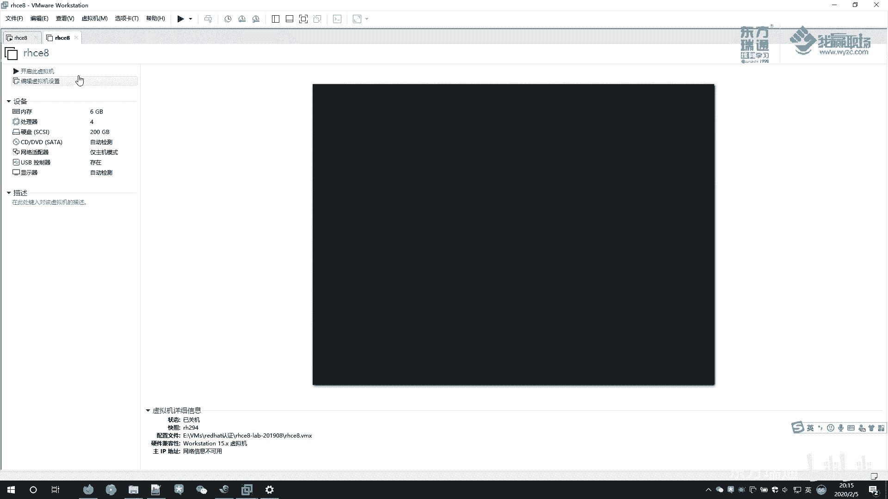

那么这样啊，我为了真实的给大家去演示这个效果呢，我先把我当前的这个虚拟机给它关掉啊。

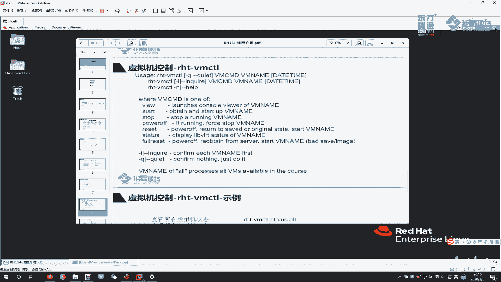

一定要配固态啊。

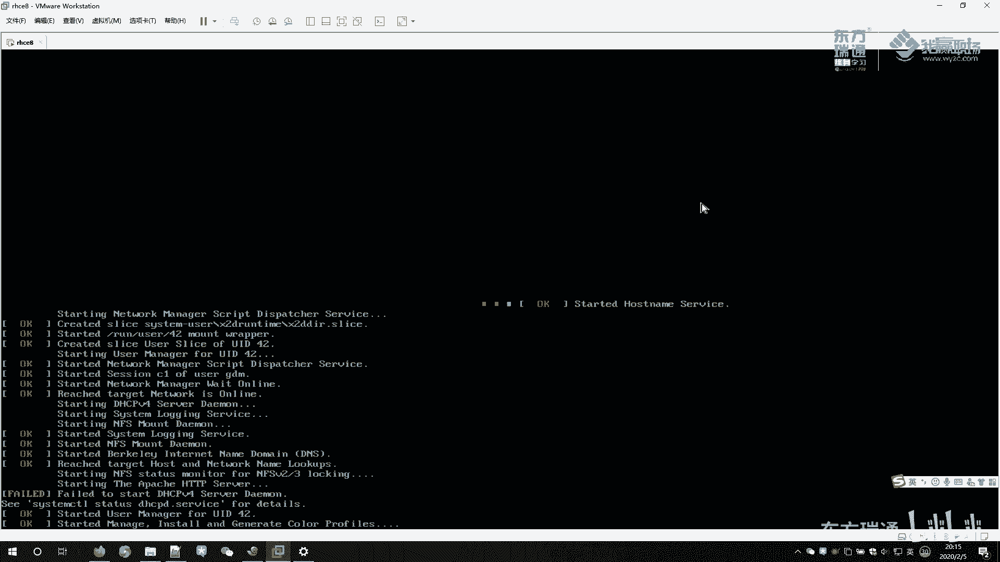

否则你这个虚拟打开是非常的慢的，那我给它关掉，这样我们再来打开一次啊，或者我直接在这吧，我们刚刚已经打开过了啊，这个是e盘，e盘是我的普通硬盘啊，它打开的比较慢，那么我还是使用这个固态的硬盘。

固态硬h c e8 在c盘，c盘是固态硬盘的，他开的比较快啊，read输入一下。

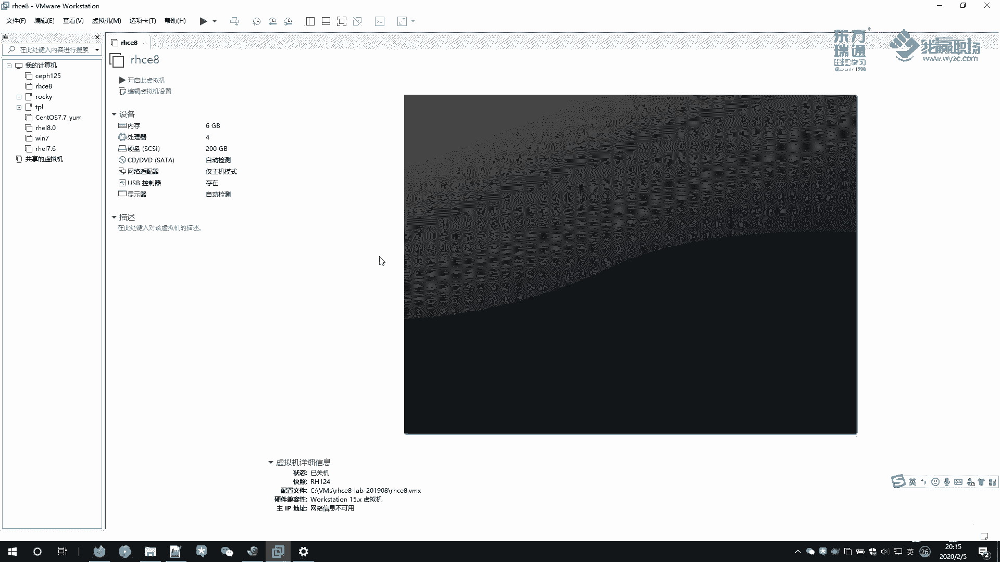

在这个里边我们点开机。

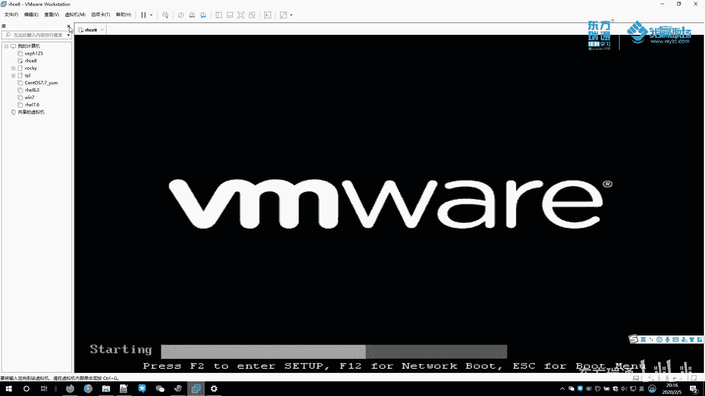

啊然后我们给它放成全屏效果，首次开机呢要稍微等一会儿啊。

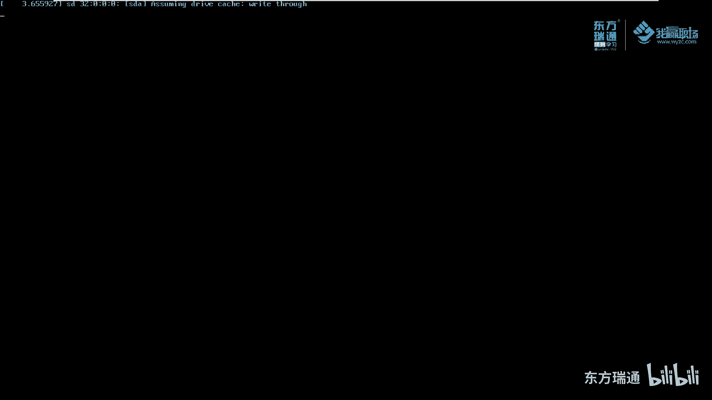

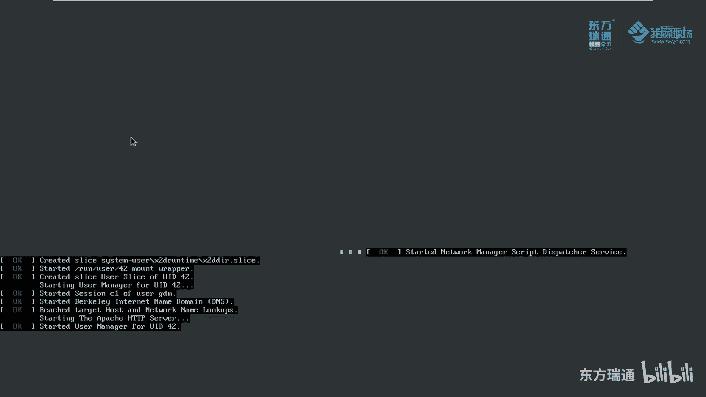

在这个界面里面有一个kiosk，这样我们单击一下，选中它，输入密码，red hat，我们刚刚说过的是吧，然后在这个位置小齿轮这个地方我们选择哪一个呢。

默认情况下这个位置选择的是第一个标准的这个微量显示方式，那这个方式大家操作起来不太习惯啊，我操作起来也不太习惯，那么建议大家选择这个经典的微软模式好吗，经典的微软模式好，我们选择它看一下是不是的。

然后选择登录，登录进来之后，大家看这个好像这个分辨率显示有点不舒服，我们简单的对它进行一个调整。

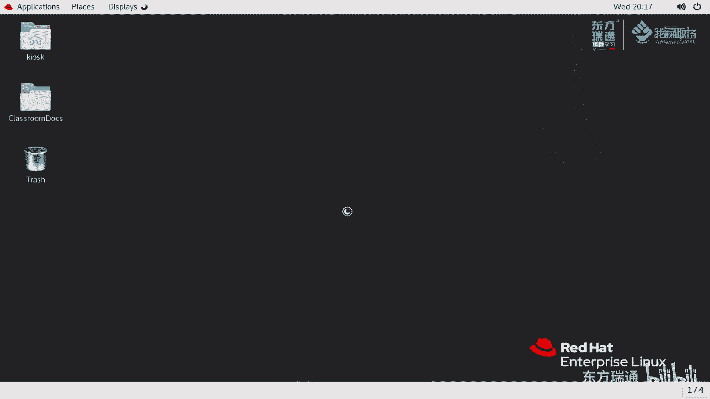

调整出适合你自己的这么一个分辨率。

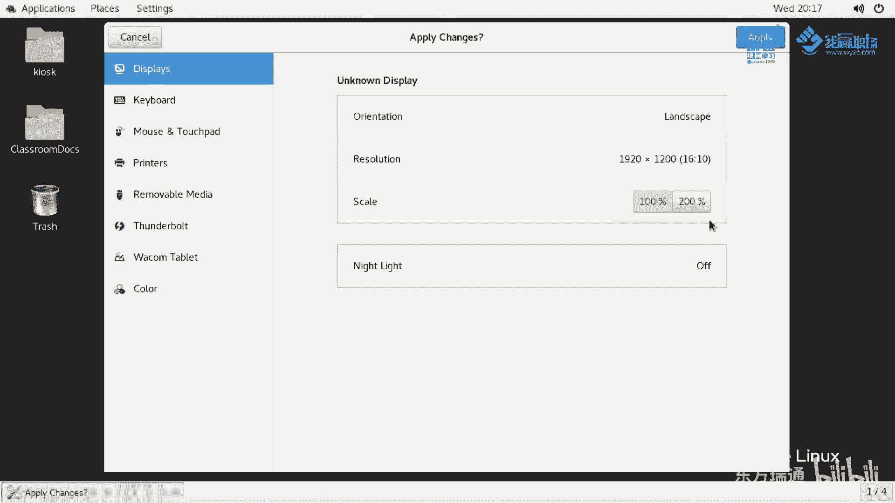

好，我这个分辨率调成调调成这个1920x1020，相对来说比较清晰一些啊。

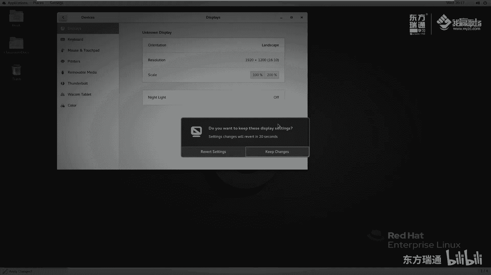

这样效果比较好一些啊，如果说调整到这个位置，那么大家应该记得这个位置有一个叫自由拉伸啊，选择自由拉伸，不要选择保持纵横比例，那么这个界面我们就调整好了好吧，虚拟机就登录进来了。

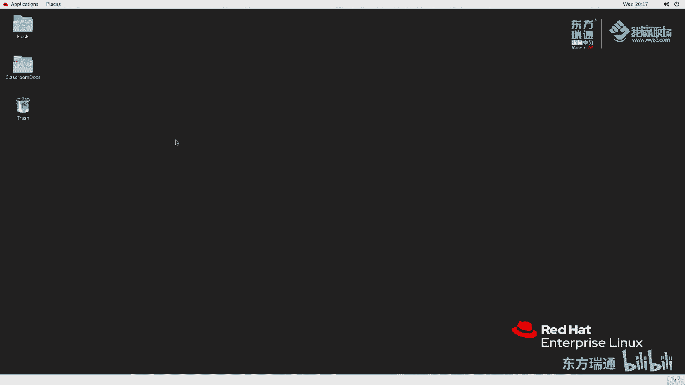

那么我们继续打开我刚刚那个胶片，这是我们讲的一个实验环境，那这个实验环境里边我刚刚提到了，有这么多个虚拟机，这个虚拟机怎么控制呢，那他这里面的虚拟机啊，是也是相当于嵌套的虚拟机方式去存在我们这里边的。

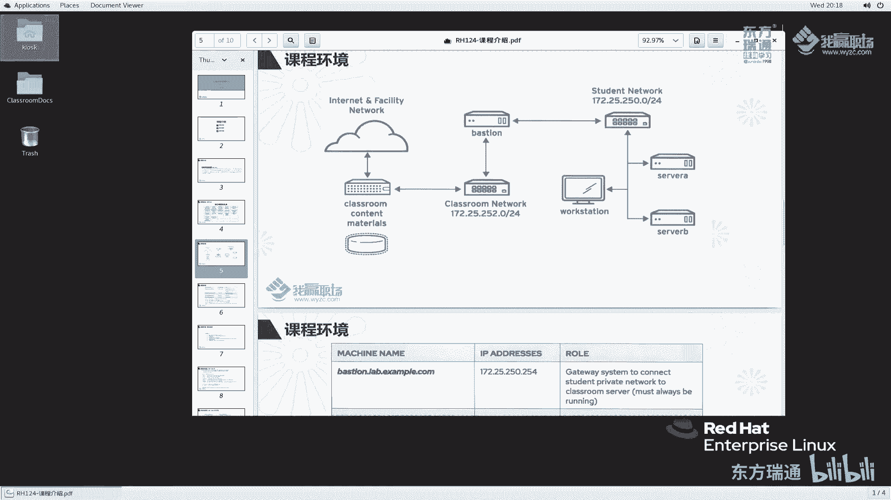

那么我给大家简单的画一幅图好吧，大概是这么一个样子，首先这个地方是我们的f0 ，也就或者说是我们的这样啊，或者说我们的rh c e8 ，我就简单写叫r8 。

rgc 18是我们的vm v里边给我们模拟的一个软件好，那么在r8 里边，它这里边又存在了几个虚拟机，12345，也就是说他嵌到又签到了五个虚拟机，classroom对吧。

然后是我们叫basession workstation，然后serve a什么serve a，还有一个什么server b啊，这几个虚拟机以这种方式来存在的，那在我们这个里边，我怎么去控制这个虚拟机呢。

好首先呢我们来打开命令行。

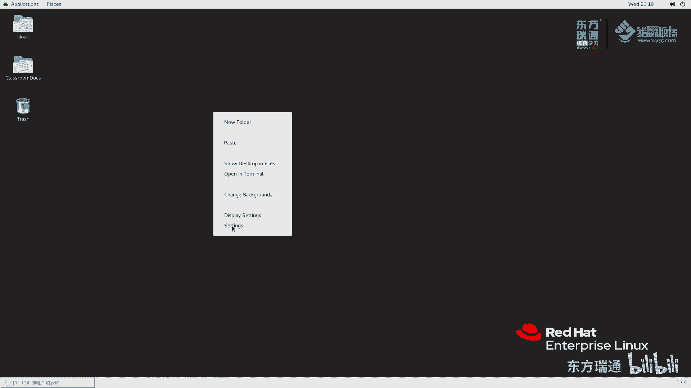

打开好之后呢，我们使用这个工具来控制叫rht杠vmc t l好吧。

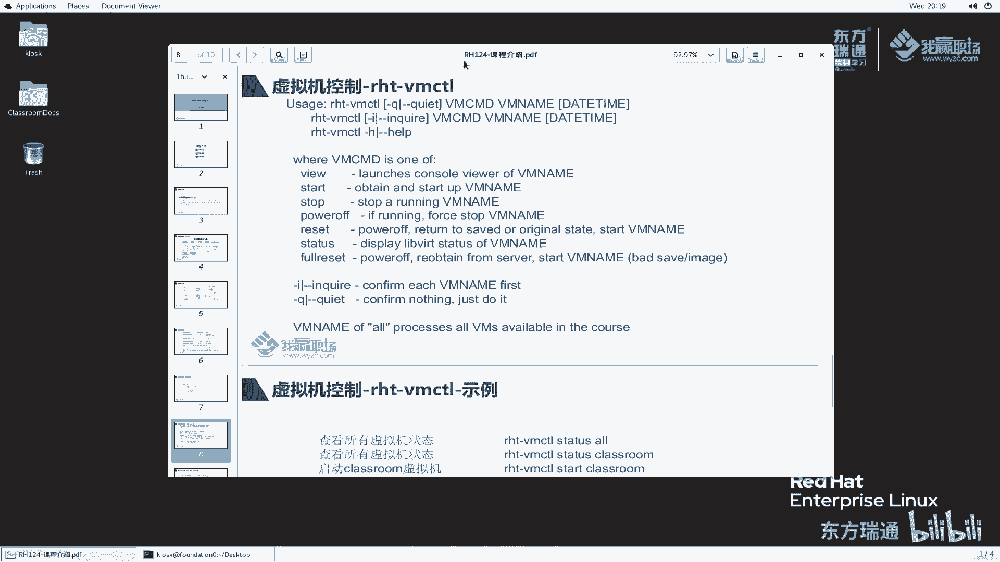

那么我们这样做啊，首先给它放大一下啊，这个地方有放大的按钮啊，选择这个zoom in啊去放大，也可以选择这个zom out去缩小，然后我们执行一个命令叫rht杠vmtl回车。

这个命令大家来看它的字面意思啊，rh代表红帽，red h t是代表train红帽的培训，red head training vmc t l是代表虚拟机，ctrl是代表控制，也就是说我们这个工具啊。

这个命令啊是专门用于去管理什么呀，管理我们红包环境给我们提供的这么一个虚拟机的好，大家知道这么一点就够了哈，那么我们再往下看，那这个工具我们或者说这个命令我们怎么去使用呢，这里面给我们提到一点使用方法。

这是第一个使用方法，那么这是第二个使用方法，那么这是第三个，第三个是用于我们查看帮助的，这两个是用于叫免交互式去，这个是免交互式的，这个是强制交互式去一个一个提问的，后续我给大家去演示啊。

我们首先看这个啊，中括号里边呢是代表选项，所谓的选项就是可加可不加的，那么我给大家拿过来，所以可加可不加的，我们可以把它换成这个样子，我们再开一个终端啊，这个终端呢我们放到它的右边，好给它粘贴过来。

也就是说这个命令我们用的时候按照这种方式来使用，前面是命令啊，前面是我们将这个工具vm cmd中间有空格哈，至少一个空格，这也是一个空格，vmc md是代表虚拟机的这个控制命令。

这里面提示我们说这个vm cm d啊是以下其中一个啊，其中一个，那么到底是哪一个呢，你可以使用它，也可以使用它，也可以使用它等等等，这么多，有这么多个命令，用使用相关的其中某一个命令来替换。

那么我首先使用status来替换，status是代表什么，代表显示我们这个虚拟机的状态，那我们来使用status来看一看r h7 杠vm c t l，我们敲一个status，然后后面vmc md是什么。

这个命令完整，你要想使用完整，必须有这三个啊，必有，那我们包含两个了，后面还有一个vm内，所谓的vm name就是我们之前给大家提到的这个虚拟五个虚拟机的名称，12345啊。

那么例如说我们敲一个server a，大家可以看到我们这个so it的状态是叫define，好define，你们首次拿到虚拟状态，可能应该看到叫missing，叫丢失的状态，所谓的丢失状就是不存在啊。

其实即使是你们看到丢失状态也没有关系啊，也没有关系啊，那么这样吧啊我为了保证与你们的一样，我对我这个环境啊，我做一个回滚好吧，我做一个回滚，回滚到这个状态里边，来回滚到rh 124这个状态。

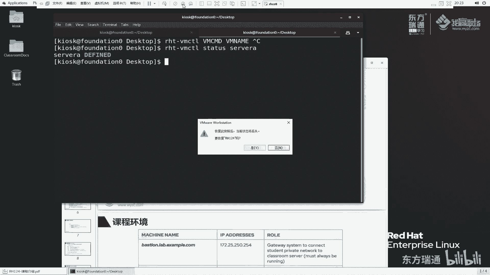

然后呢，我重新开机登录一次，好正好到这个地方。

我刚刚做回滚操作，是操作的时候大家也看到了哈，我们这个地方我给大家提供了几个快照，1234，那么当我们用要rh 124这门课的时候，我们就选yh 14点准到，如果说我使用rh 134的时候。

那么点这个再点转到到相应的快照里边去学习相应的内容，我当前是在rh 1 s这门课这个快照这个地方，那么我就去使用它来做我们r724 的这么一个环境一样的，还是选择我们red hat这个密码输入一下。

那么这个输入的时候，我们刚刚说默认式是标准的是吧，我们选择这个微软啊，微软这个经典模式登录，同样它的这个显示设置我们要调整一下。

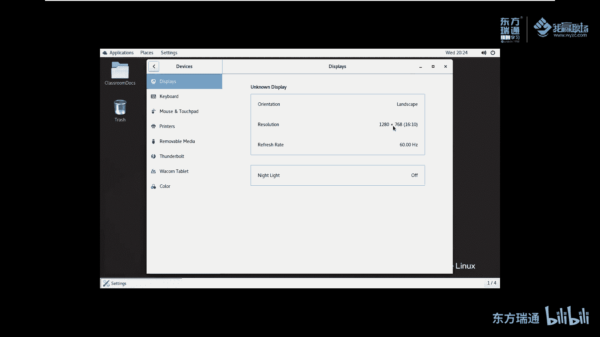

这样这个分辨率看着就比较舒服啊，那么我再把我们刚刚那个胶片啊传过来啊，大家稍等一下，我把胶片传一下，大家还记得了我们之前怎么传胶片的呀，我之前给大家讲过x manage里边的cel的使用是吧啊。

那么这样啊嗯要想把胶片传进来呢，我们首先去选择这个工具，新建文件传输，然后找到我们刚刚讲的那个课件好吧，好看看有没有传过来，传到这个位置了，那么这个位置呢我们给它放到哪里去呢。

我们这样啊给它放到默认放到是它的用户的家目录，用户的家目录在哪儿呢啊，就是在我们这个目录下面去，就找到了这么一个文件，打开来，这样又回到了我们刚刚那个初始的那个那个界面了，好吧。

此时呢我们这个虚拟机就可以正常的去用了，那接着说我们刚刚讲这个这个字符乱码啊，我们暂且不用理会好吧，这个是不重要不重要啊，如何避免这个乱码呢，嗯我们后续再给大家讲解好吧，还是打开一个终端。

那么一样的rh提纲vmc tl这个命令，同样的我们再去开一个终端，跟它开在一块儿，那么这个地方称之为叫标签啊，标签我们此时再来，刚刚回到刚刚那个命令status。

加上一个又说server a这个是初始环境，大家看到的应该是missing好吗，那么除了server a我能不能说server b呀，能不能是workstation呢，都可以啊。

那么当然我们还有一个叫or 2，是代表所有诶，老师你这个二里面好像只有四台机器吗，是不是少了一个，确实是少了一个，少了一个classroom，克拉斯任务比较特殊，从头到尾啊。

从头到尾我们在练习过程当中啊，都不需要去动它，只有在初始化的时候，我们把classroom给它开机一下就行了，后期我们永远不要动，所以说红帽在做了一些特殊设计，这个二里面是不包括classroom的啊。

这是我们讲这个几个机器的一个状态的查看啊，注意二，其他每个机器都可以使用加status，加上它的一个basession去看，那么二是一次性看四个classroom，是单独看自己的，看虚拟机的状态。

当前这有几台机，说明这几个机器还没有开机，那么我们给他开个机，注意这里边我给大家强调一点啊，开机的时候一定要先启动classroom，好一定要先启动classroom，然后再启动其他机器。

唉大家似乎看到一个东西什么东西啊，我们启动其他机器的时候，启动classroom的时候，好像说没有这个下载的过程嘛，然后启动其他机器的时候，好像有一个下载的过程，这个是什么意思呢，为什么这样做呢。

给大家简单解释一下啊，如果说大家不理解也没有关系啊，虚拟这里面的虚拟机是以通过kv m虚拟化技术来实现的，那么这每个虚拟机都是有一个硬盘文件，就像我们我给你们的这个h4181 样的。

我给你的时候也是一个目录，这个目录里边也有硬盘文件，那么对于kvm实现的这个虚拟化也有硬盘文件，每个虚拟机机的硬盘文件呢都比较大，都是上季的好几个g，那如果说我此时我去启动的时候。

它首次启动的时候会从服务器上面去下载，从哪从classroom这个服务器去下载，下载完成之后，它就不需要下次去启动的时候，就不需要重新启动了，当我们把这个地方下载完成之后，就会导致我们这个h418 啊。

整个这个虚拟机就会变得超级大啊，超级大，那么我为了这个文件呢比较小啊，整个目录比较小，我给大家拷拷贝的时候，或者说我们这个这个虚拟机我们去转移的时候非常的方便，所以说我们我给你的时候。

这个虚拟机相对来说比较精简，没有做这个操作好，所以说我这个地方我告诉大家怎么去做一个初始化的操作，那么此时我们再来看一下status，看一下我们的classroom，classroom。

此时虚拟的状态是running，那么all的状态是什么呢，都是装零的吧，虚拟机都在启动了吧，那么看一下机器有没有启动起来的呢，我们去ping测试，ping classroom，能够聘通说明什么。

说明我们机器就启动起来了，好我刚刚按了一个ctrl c好，大家再来看一下，我按按钮是按了一个上，然后命令行就给我返回了，那么他会一直去做ping测试，然后按ctrl c去终止，能够拼通。

说明我们机器启动完成了，我们再来拼一下其他的机器，比如说so a so a ping好像不通是吧，不通说明机器没有启动的骑起来，那么我们再来拼一下，拼另外一个机器basic，它能够拼通的好。

我们再来回头来被psa，还没有拼通，那你这个sa什么时候能拼通呢，我能不能看到这个sa的启动界面呢，也可以呀，好我们有执行一个命令叫rh t杠v m c t l，有个view叫server a。

他说我们执行这个命令的时候啊，说这个命令呢已经使用新工具替换它了，那我们还是使用这个新的工具吧，hd杠v mv啊，然后再来个view server a。

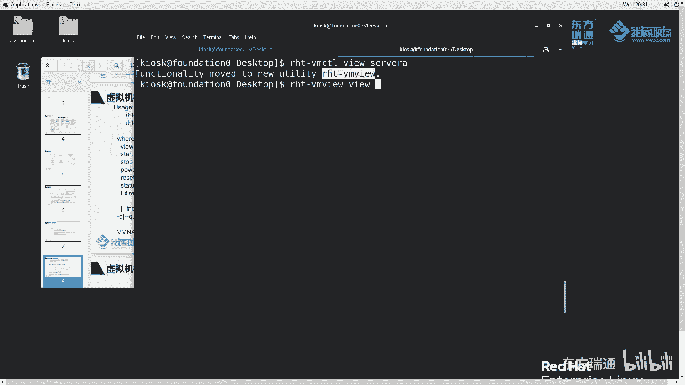

此时看一下sa是负启动完成了吗。

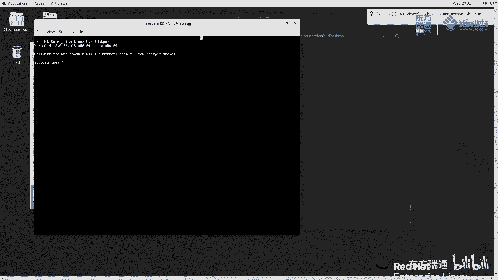

启动完成，我们再回头来看一下这个sa有没有通好，通了啊，是我们刚刚太着急了是吧，那么他需要一点时间来启动。

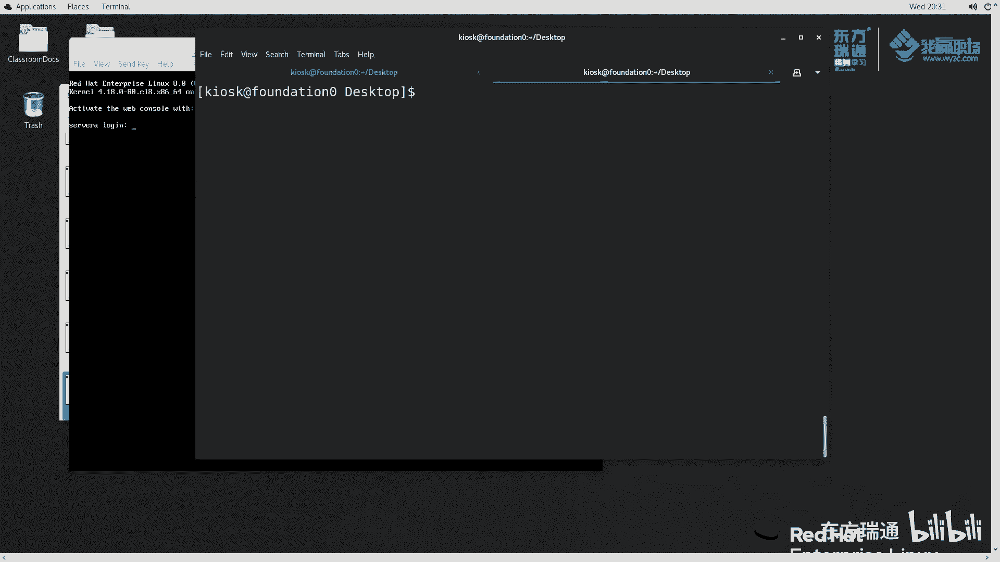

启动完成之后，我们再做pin测试就可以了，那我们什么时候情况下用这个，你想想，如果说服务器我们现在都没有网络的情况下，我通过外界都没法去访问它，那么我只能使用这个虚拟化工具在他的本地去看了。

这个地方它是不需要我看这个界面，它是不需要网络的，好吧，不需要网络的啊，好这个效果非常好啊，我们点叉的时候注意啊，我右上角点叉的时候，然后点ok，此时我仅仅是关闭了这个虚拟机的一个窗口。

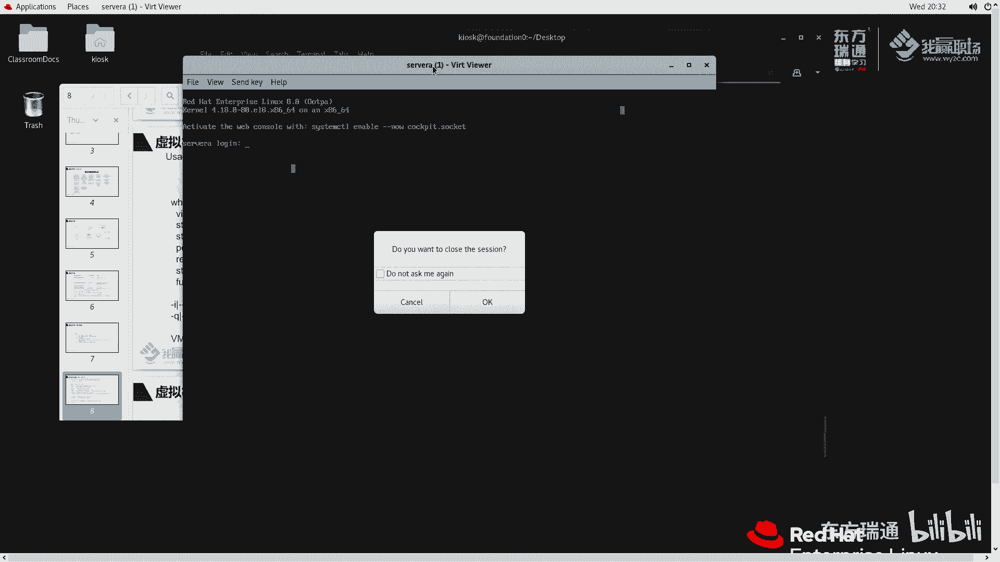

那么这个虚拟机呢其实呢并没有关机，我按一个上再来看一下啊。

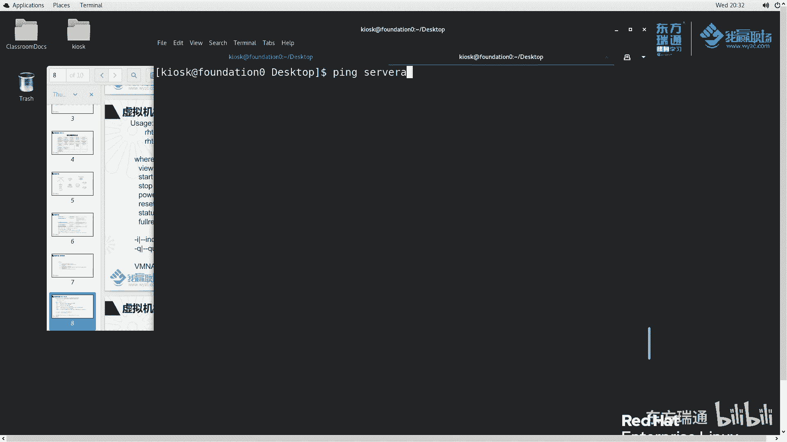

再来view一下，大家看到我这个虚拟还是在这个地方吧。

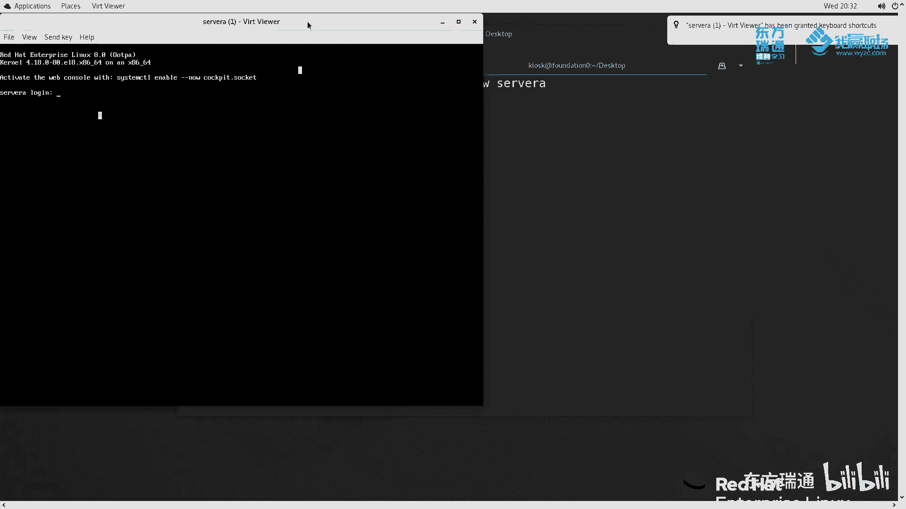

好还是在这个地方，我们为了下次不提示。

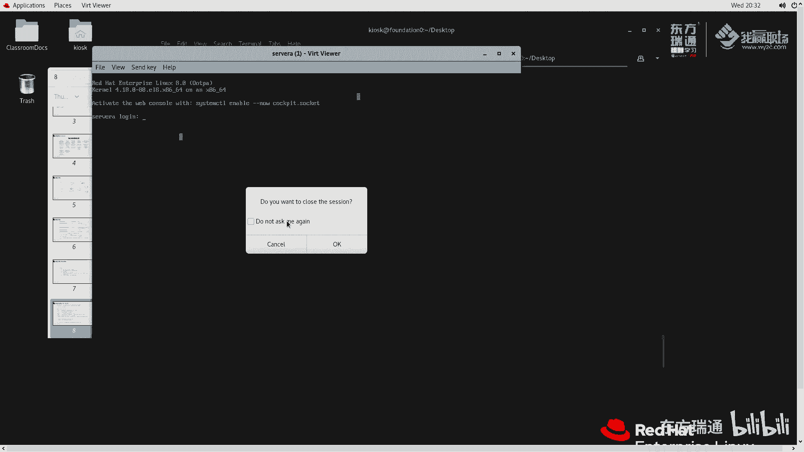

把这个打勾，不提示好吗，这样我们刚刚给大家讲了好几个啊，一个是什么呀，看状态的status，然后呢把机器提起来，启动完成之后，我们去view看这个虚拟机的一个consol一个界面啊，界面啊。

那么除了刚刚讲的这三个，那其实还有很多命令啊，我们再挑几个重要的给大家讲啊，好你虚拟机rht跟vmc t i o status去看一下二，那么这些机器我不想让它开机了，我想对这些机器关机怎么做呢。

start是开机对吧，那我stop是不是关机呢，serve a来看一下，那么是否关机了吗，好像确实是在停止对吧，那看一下我们能不能real了，他说什么，他说我们无法去查看这个45a了吧。

因为这个机器啊现在当前没有运行，那么我们再来看一下它的状态，so a现在状态就变成了define a，原先是变missing，没有关系没有关系，反正你是无论你只要你是我。

我主要看到如果你不是running，我就给你start，如果说你不想让它开机的话，我就给你stop就行了，stop相当于对我们操作系统下一个关键指令，除了stop之外，那么我们还有一个指令啊。

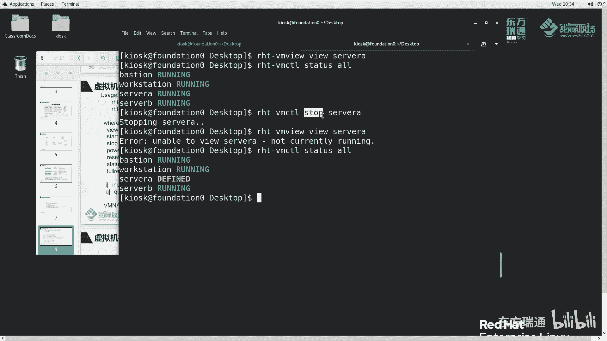

我们再把这个打开来，view sb，那么我们来看一下sb这个地方。

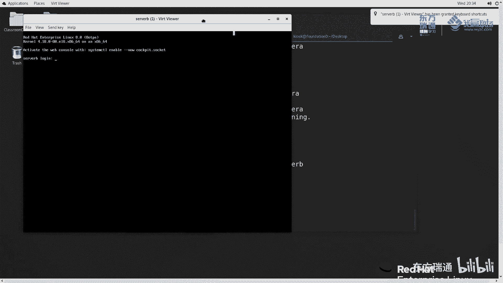

我对sb进行一个关机，stop serb，看看他的操作啊，前面写错了是吧，cl大家来看一下stop server b回车cb是否是否是在关服务啊。

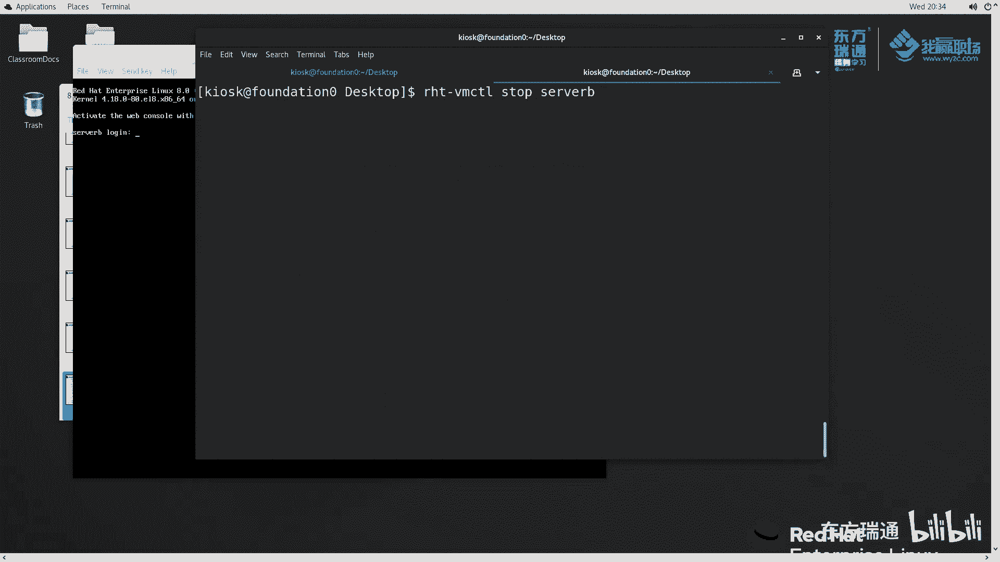

做一些关闭的操作，好我们把ca跟cb给它启动起来啊，start server b，start server a给它启动起来，按箭头上啊，上翻历史命令，启动完成之后，我们再来去view一下。

你搜搜b吧哈此时我想对这个sb做什么操作呢，我想这个强制断电，强制断电是用什么呀，叫power of，power of强制断电，他地方比就比较暴力了，所以说断电的时候他问你啊。

我们这个你是否是确定确实是想把这个a关机吗，好我们敲个y就是确实是这样，那如果说我这个地方我加一个杠q呢，它就不会提示这个没有这个交互式提示了啊，我加个q他就立刻给我关机了，是不是啊。

当然我们还可以怎么办呢，rht杠vml还可以做power of，我关所有的机器杠i再来一次，他提示说你想关闭bc什么，例如说我想不关闭啊，不关闭它，那么想关闭我们的workstation吗，哦想关闭。

敲个y so a想过名是sob吗，no那么这个i给我们达到一个效果，就是一个交互式的，当我们敲了一个字符，就是说它会提示你问你这个哪一个机器要不要关，要关就关，不要关就不关好这个杠i作文给大家讲。

还要杠q也给大家讲了，其实我们回到这边来看一下，这个杠q就跟我们这个杠y是同一个意思啊，杠y杠q是同一个意思好吗，我们再来试一下啊，那么之前有一个杠q我们加杠y试一下。

是不是同样的效果就不用你再提示你了，非常的方便啊，那么我们再来把所有的机器都给它提起来吧，开机你看这个地方提示错误，但是说这个error是吧，说那个basic没有启动，它已经在运行了啊，没有关系。

反正你能够确保我这几台机器它是开机就可以了，那么再回头来看一下这个机器的状态。

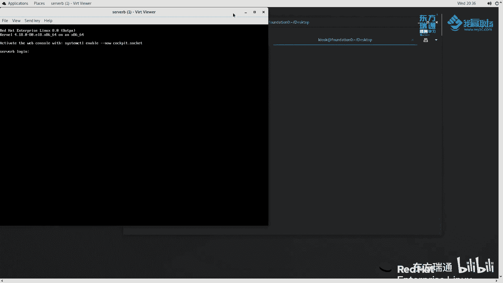

status all好，全部提起来，再来看一下我们的classroom，classroom不要动它，保持它运行就可以了，好吗好，这里面大部分的功能我们都给大家讲了，还有两个非常重要的一个命令啊。

rh提高vmc条，有一个叫reset命令，reset 6说45a这个命令是做什么用的呢，当我们的server a这个服务器出了问题，或者说我想把so a还原到某一时刻。

其实reset我们就可以理解为我这个地方我们hc 181样的，hc 18里边我不是给你提供了相关的快照吗，好那在这里面我们对ca也提供了一个快照，可以理解为对它提供了一个快照，那例如说我搜a里边。

我之前对系统做了一些更改，我想把它还原到一个初始的状态，我们敲个回车，再敲个y，那么他会对sa进行关机，并且让它回复到初始的状态，因为在我们后续做实验的过程当中啊，非得sera serb做很多一些更改。

那么此时我们要把保证实验的干净性呢，会对sa和sb呢一个重置，回归到最初始的状态，不影响我们下一次实验，所以说我们会用到这个reset这么一个操作好吧，那么当然这里面还有一个操作叫full reset。

如果说当我们执行reset so a不生效的情况下，我们执行for reset，去设置好，加一个杠，y，此时大家发现它有一个下载的动作，如果说我们之前去启动soa的过程当中，因为网络中断。

导致它文件下载一半，那么下次我去启动的时候，这个sa的硬盘文件肯定是不完整的，那启动肯定是失败，那死活你再怎么reset，它还会使用那个有问题的硬盘去启动我们的sway，他总是启动不起来的，那怎么办呢。

我们从服务器上面去下载一个从图下载一个干净性的，完整性的这么一个sa的相关的文件，下载下来之后，我们重新去启动搜索a就可以了，好吧，在迫不得已的情况下，最后的情况实在没有办法的时候。

我们再去复reset，其他基本情况下我们都用不着啊，这是我们讲的这个虚拟机的控制啊，基本上呢这个htvmc t l就够我们用了，老师你给我讲了那么多，讲了命令行这个c m d是吧。

又是我们这个虚拟机的名称，太累了哈，记不住啊，记不住，那这个地方呢我教大家一个小小的一个什么小的一个技巧，ht我敲前三行，然后杠vm敲tab键，tab键tab这个按钮按两次啊，c t l再按两次是吧。

或者是我直接回车去看他的帮助，或者说我们敲一个60start tab键是吧，去启动的啊，start那启动哪个机器呢，例如说我在tab键按两次，它会给我们提示啊，是all或者说basic。

它都会帮助我们去补全，关于这个tab键呢，我们后续再给大家去讲解哦，这是虚拟机控制的这么一个例子啊，总结一下对于我们实验环境来说啊，我们去启动机器的时候，它的启动顺序首先要启动classroom。

然后再start all，这两步必须做，我给你们的这个环境里面，这两步必须先做，否则我们的实验环境做的时候会有问题好吧，那么这里边其实还有一个图形化界面的工具，那么我们再给大家看一下。

有一个叫what manager，其实大家可以看到我这个界面里边提供的也是12345，五个虚拟机啊，这五个虚拟机我们一样的可以对它进行一个重启断电啊，强制强制的进行一个reset啊，关机啊。

什么bsl保存状态是吧，那么在这里面也可以做，包括这个地方我可以利用这个虚拟化，我还我还可以创建一个虚拟机呢对吧，新建一个虚拟机，此时这个界面与我们讲外面的这个vy works这个软件。

很多功能都是类似的啊，只不过这里面是用于管理k vm虚拟化的这么一个平台，而我们外面呢是使用vm实现了这么一个虚拟化啊，关于这个kvm里边这个如何实现虚拟化呢，我们后续有机会再给大家详细的去讲解好。

那么关于这个虚拟机的控制，我建议大家使用rh t杠vmc tl这个命令，不建议大家使用同化界面好吧，因为我们管理员基本上都是使用命令行去操作的，ok啊。

这节课呢我主要给大家讲了一个是rh t杠b m c t l命令，那么额外的又给大家提了一点，就是what man这么一个工具去管理我们虚拟机的好吧，今天我们就讲到这里好。

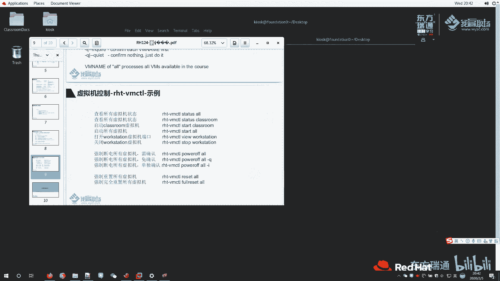