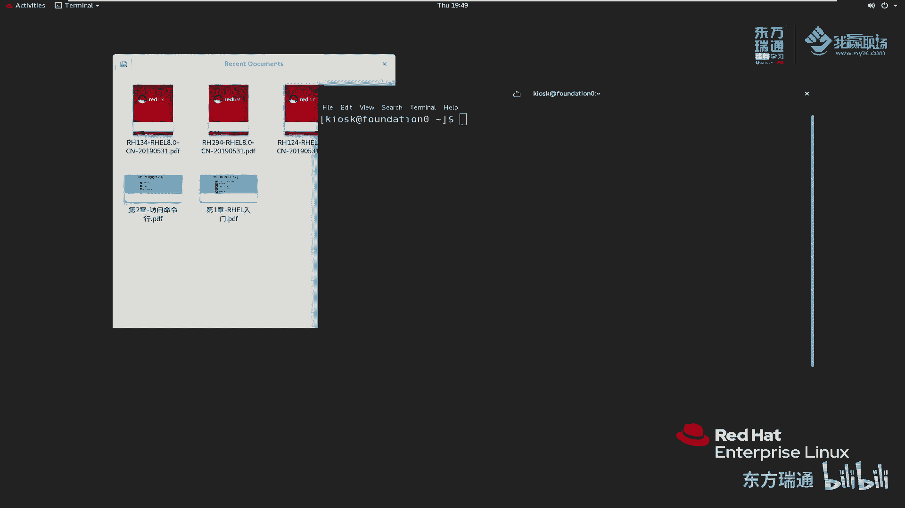

# 红帽RHCE认证培训（8.0版本）-备考红帽认证必修课，快来一起学习起来吧 - P8：02-1-桌面环境介绍 - 东方瑞通 - BV1P44y137Fg

同学们好，欢迎来到我赢职场HC18课堂，我是马老师。今天呢我们来给大家讲一下第二章访问命令行。第二章呢分三个部分。首先呢给大家介绍一下桌面环境。第二部分呢是给大家介绍一下命令行访问接口。

第三部分在我们的bes里边去执行一些命令。首先来看第一部分，几纳我们桌面环境。

那么其实我现在给大家展示的这个环境啊，就是g那木的桌面。好，简他不来。其实在。

linux里边我们一直也给大家强调过一个问题啊，就是说linux它是一个模块化的一个操作系统。

我给大家简单的画一幅图啊，比如说是这样子。那么这是我们linux操作系统的一个可能内核啊，可能内核。其实我们刚之前给大家讲这个发行版本的时候也说过啊，我们再强强调一下。

那这个外面的部分才是用户空间里边的一些应用程序。那么我们这个桌面啊桌面gome就是一这么一个桌面，它是一个组件。例如说它是gome。那么这个组件我可以不要，也可以要。那我为了更好的操作我们的系统。

为了更好的展示呢，我们就给大家看了这么一个桌面。

其实桌面管理的时候有很多桌面啊，g其实就是一个。当然还有什么，我们之前讲究有g桌面，还有KDM然后KDE桌面啊等等等。那么红帽这里面采用的是g桌面，当前使用的版本是3啊。

那这个桌面里面呢集成了很多一些啊开发平台在我们这里面。大家可以看到啊，我们在这个位置好像有很多一些小工具在里面。帮助我们，特别是对一些初学者来说去访问我们的操作系统，这样就相对来说比较方便了。好吗？

那在我们这个g桌面里边，它有这么几个主题啊，两个主要是两，一个是标准版本的，还有一个是经典版本的那红帽八里面采用的是标准的版本的。红帽七里面使用的是经典的版本。

那我现在当前给大家看到的这个版本呢是经典的版本。注意啊，我当前。登录的HEL8系统里边采选择的是标，选择的是经典的这么一个主题。

那这个主题在哪里呢？好，我给大家简单的演示一下啊。在这个位置，我们首先做一个事情给他干什么，给他这个系统先给他注销。注销一下。在虚拟机，我给你们拿到的这个虚拟机啊，大家看一下啊HCE8虚拟机。

你开机之后，默认它登录的是这个位置叫KIOSK。他默认这个位置选择的是第一个啊，记住了，默认的是这个vline。此时我们可以看到这里面好像有两个，一个是vline的这个display server。

还有一个是什么呀？X11的display server。在我们的虚拟化环境里面，我要给大家强调一点。虚拟化环境里边这个如果大家选择了这个X11，无论它是标准版本还是classical。

那么这个图形化界面都会非常卡，会出问题。哦，兼容性会存在一些问题。那么这个虚拟化环境里面，我们就选择这个标准的微line或者classical微line。这两者大家任意选择一个啊，一定要是这么做，好吧。

那么在这个地方呢，我首先给大家查看这个标准的版本。然后呢，我再给大家稍后介绍一个这个经典的版本啊。那么标准的版本选择之后呢，我们一样输入密码，密码是readdhead。之前我们给大家讲过，登录一下。

登录进来之后，这个分辨率不是那么友好。我们首先要把这个分辨率调整一下。

根据大家自己的需要哈去调整我的屏幕分辨率是1920乘1080的。那么现在呢我给它调成调到这个，相对来说更接近我们这个分辨率。那么看的大家此时看应该显示的清晰的多了，对吧？

然后还有一个，你看我给你们看的时候啊，这个地方好像下面好像没有什么东西，对吧？那么此时这个位置也要注意哈，是自由拉伸还是纵横比例拉伸。如果我选择纵横比例，大家看到这个位置右边多了一个黑框啊。

我们建议大家选择是自由拉伸。好，自由来伸。那么我们就进入到这个界面了。那这个界面呢，我给大家简单的介绍一下，好吧。首先在这个界面里面呢，左上角有一个active。

active是什么？我们可以理解active就像windows里面那个超级按钮super按钮。我们按了一下super按钮，它就给我们弹出这个界面。

OK我给大家退出来看一下啊，例如说我们最优化在win10这个系统里面，我们按一下超级按钮，大家看到了，超级按钮好像弹出这个位置是吧？啊，确实是这样啊。

大同小异差不多。

好，我们点开来。在这个界面的左侧，它有一个快捷键啊，此时大家可以看到。有火狐浏览器啊、文件管理器是吧，文件，然后还有软件包的管理啊，帮助啊终端啊等等等。那么我们可以点开来。

这个可以显示额外的多显示一些是吧？啊，这是相当于应用程序的一些快捷方式，那给它取消掉。在这个位置呢，还有一个这个位置给我们搜索我们的应用程序。例如说我想搜索一个叫。TER啊，我们少打一点啊，打打T。

他给我们显示什么呀？说能匹配到了这么多是吧，min edit openen什么什么video什么doment。例如说我们选择这个，那么他就给我们打开了这么一个。

什么。这么一个doment view啊这么一个程序。OK我给它放在这儿，回头来我们再看一下。

那么他就以这个程序就显示在这个窗口里边的是吧，我们可以拖动它啊通动它。所以说我们如果说进行任务切换的时候，我们可以通过这个点进来啊，通过这个按钮点进来。点进来之后呢，然后呢我们可以找到打开的多个程序。

例如说我再开一个程序。

此时大家可以看到我们这里面有两个应用程序。那么这两个应用程序之间，我们可以按alt加t进切换啊，也可以到这里面来通过这个方式去选。

比如说我们这个地方被我一表被我点全屏了是吧？那我这个切换的al type也可以啊，都可以。

啊，根据大家自己随便方式，但然。

我喜欢使用什么alt加t，因为windows里面好像也是使用这个用于切换的，非常的方便啊。

OK我们把这个关掉啊。

那么再到这个地方，我们接着看这个界面，在它的右面。右面有两个窗口，哎，我们每点一个窗口，大家可以看到啊，我任务程序好像切换了。这个应用程序在我们的第一个这个虚拟桌面里边，这是在我们第二个虚拟桌面。

比如说我拖一个拖动，大家可以看到我这个可以把我们应用程序啊拖到第二个界面里面去。当我拖到第二个界面的时候，他好像给我们增加了第三个虚拟桌面。那这个虚拟桌面是能做什么用呢？想想啊想想。

例如说我我们做这么一个事情啊。

例如说我现在在这个桌面里面专门用来打开的所有的终端，专门用来维护服务器A啊，例如说维护serverA。

那么同样的，我还有可能我在这个位置呢，我再打开一个中断啊，在这个界面我再打开一个中端，专门用来维护什么呢？维护。

1我B。

好，我们又开了一个，对吧？此时我们来看一下。哦，大家看一下卡住了是傅是吧？好，这边再连到这里面来。哎，好像现在只有一个是吧，只有一个，那么我们多开几个试一下。😊。

那再多开几个啊，从这里面去多开几个中断，新建一个窗口。啊，再来一次啊，我们再来再多新建几个。新建一个窗口。那么我们再来看一下，给它拖动一下，现在有三个了，对吧？哎，我们拖到这个里边来。

大家看又给我们产生了一个。也就是说这个虚拟桌面呢，你根据自己的需要进行去增加和减少。

啊，他提供了我们这么一个工具，你看现在有4个是吧，哎，自动变成了3个。

那我们再回到这这个里面来，我把这两个呢都放到我们第一个页面里面去。因为呢我们当前的环境啊，我只需要一个就行了啊，那多余的我都不需要了。好，这是我们讲的这个超级按钮啊。那当我们点开了一个应用程序之后。

在这个位置，它会给我们显示这个显示什么呀？显示关于这个简单的操作是吧，什么快捷方式新窗口。

给我们显示的是这个东西。然后大家再来看一下这个界面里面，在右上角右上角呢它给我们显示了什么，显示了一个小电源按钮。这个右上角界面啊给我们显有部分啊显示的不完整啊。

大家看到就是这个小喇叭呢是用于控制它的声音的。然后小喇叭下面有一个图标，这个图标呢没有显示出来，其实它是用于控制网络的。例如说啊网络的设置啊，叫有线的对吧？那这个网络的连接，以及把它网络的关闭啊。

这个我们用的不是太多。那看这个位置。这个位置呢是用于用户的操作啊，用户的常规的登出啊注销啊，还有一个呢是用于我们的这个账户的设置。我们来点开来看一下。关于用户用户名啊，他的密码啊，他的登录啊。

上一次登录这个状态啊，相当于啊相当于我们控制面码里边的一个用户设置，好吧。然后我们再来看一下这个扳手，他。这里面没有了哈，再看这个扳手，这个扳手里边给我们显示的可以理解为什么呀？好。

大家看到这个地话还是给我们显示这个用户的地方啊，那么我们还是关掉，再重新来一次。😊，显示的还是这么一些啊，其实我们就可以把它理解为一个什么呢？理解为一个控制面板。好，我们刚刚是点了一个左括号啊。

回头来相当于这个啊，我们点一下setting。就是打开了这么一个控制面板啊，那可以控制的网络啊，无线蓝牙、什么背景啊通知哈。那在这个地方呢，我给大家讲一个东西，我们刚刚之前说有一个显示器的设置，对吧？

显示器在哪儿，看这个位置，看这个位置有一个电源powerpower里边啊，power里边我们找到找到里边有一个啊是吗啊找到设备啊，设备里边有一个显示，这个显示呢用于控制我们的屏幕分辨率的。好。

当然还有其他一些啊，自己可以摸索一下，还有移动设备啊，移动设备。那么回再回到这边来，我们还有一个是power， power是用于控制我们的这个叫什么呀屏保啊，截屏截屏啊。

那么我这个位置大家默认看到默认看到这个地方应该是5分钟。那么由于之前呢，我为了。为了我们这个方面演示啊，我给它选成n。也就是说5分钟这一次啊，你屏幕就不要蓝屏了啊，不要锁屏这么一个操作。

这个自动这个挂起吗，我们也不要自动挂起好，那么简单说一下，就是这么一个控制编码。当然大家自己根据自己需要去点一些其他的设置都可以。好吧，那么我们把它关掉了。在这个位置是用于将我们的账户锁定，我们点一下。

看看能不能锁定。

好，账户就被锁定了。我们刚刚有一看到箭头，我们随便敲一个空格键吧。

好，输入一下我们的这个登录一下。

登录进来之后，我们再来看一下右侧右侧这个是电源关闭的按钮，说有一个账户在远程登录，对吧？说我们这个是否说这个系统呢将会被在60秒之后自动关闭，取消是不关机关不关闭restar呢是表示重启。

那power off呢是关机啊，关机。那么这个操作呢，我们这样我们这个不操作，好吧，我们点取消就可以了。

哦，关于这个同一化界面呢，我就给大家简简单介绍一下啊。那在这个地方呢，我们要给大家额外的介绍一个东西，我们打开这个啊。我之前在我这个系统里面，我传了几个文件，有这么一个文件。嗯，在我们去讲这本课的时候。

其其实啊我们HCE8有三本书，对吧？三本书里面都配套的一个中文教材。那么中文教材呢，我这边也已经给大家扫描好成那个电子版啊，大家可以也会分享给大家，大家以后打开就非常方便。

啊，这个教材呢我稍微给大家介绍一下啊。第一本的教材呃，这个教材里边左侧啊，我已经给大家做好了这个书签，方便大家去查阅啊。那么我们看一下第二章，第二章里面我们看第一个小节啊，使用桌面访问命令行。

那这里边有很多一些操作。这个第二章里面桌面访问呢，他给我们讲的是这个标准的啊Vline这么一个显示界面啊。那么在每一个每一个章节后面会有一个指导练习。当然有的章节是指导练习。那有的章节是这种小测试。

相当于这种问答式的测试。那么这种问答式测试呢，我后面我就不会不给大家去讲啊，有些指导练习呢我会单独的给大家拿出来讲。因为这个指导练习啊，对于大家来说，首次去用的话，可能有些地方不会操作啊。

那我给大家讲一下这个指导练习。在这个指导练习里面，我们看一下，这是我们指导练习的一个成果。说最后呢你应该能够啊能够使用这个g3的桌面环境去登录我们linux系统，并在终端当中啊。

从shall提示服去运行命令啊，那么试一下啊，那么在你开始之前呢，我们要确保work stationation虚拟机正在运行，在worktation执行一下任务。

那如何确保worktation这个虚拟机正常运行呢？在我们这本书的第一节课，我已经给大家讲过了，对吧？来看一下HT杠VMCTL status。首先我们看classroom是不是启动的。好。

classroom没有问题。VMCTL如果classroom状态是missing或者说dine，那么你给它start一下。然后我们再把其他的机器给他提起来。其他的机器当前的状态都是define。

那么同样的我们把其他机器呢也启动一下。那启动呢是需要一些时间的。当然了，他提目要求是我们。确保work stationation虚拟机正在运行。那么这两个虚拟机so A和servB你可以不启动。

那这样HT杠VMCT啊tus哦。看一下他有没有加电成功。家电成功之后，我们做一个测试，拼拼什么呢？这里边说让我们要确保serv aworktation运行，或者我们这样哈我们RHT杠VMvi去看一下。

再来view一下vi我们的work station，看看它有没有启动完成。哦，他还没有启动完成是吧，当然喽，我们也可以顺便交个聘去辅助测试一下。启动的还是。有点慢哈，因为我们。

四台虚拟机同时去去启动的话，确实啊我们的磁盘的IO压力比较大啊。大家此时看到这个界面好像没有了，我怎么切换呢？我们按al tap来切切一下啊。😊，好，找到这个work stationation。

那么work stationation要想拼通，必须要确保什么？确保我们的北ation网络是通的。往C北 station如果都不通的话，你work station肯定也不会能够平通的。

我们这样先给它测一下ba。好，现在北C省是网络已经通了，因为北C省是作为我们的网关啊。那么再来看一下这里边的一个work stationation。work station呢。

因为它会提供DHCP那work stationation这个地方一定要网络给它搭起来才可以通信。看看他这个地方有没有说网络启动相关的。这样啊，我们直接来聘嘛，不看了。

Pin works stationation。work现在也可以拼通了，对吧？好了，我们现在呢把这个窗口给它自由化就可以了。不用关关不用不用看关心了啊。那么同样的，我们现在这样做啊，一边看题目。

一边来看一下我们怎么做这个题目。第一个要求。以 student的身份。并使用student作为密码登录。也就是说我们要点选中这个sdent啊，然后这个对应的密码呢是student去登录一下点s in。

然后第二题说，将student的密码从student更改为这个密码。那么怎么更改呢？他说啊这个重要呢是给我们做一个提醒，说，当我们这个finish脚本啊。

可以将student的用户的密码重置为student练习结束时，必须执行该脚本。那当我们做完练习的时候，我们再去执行这个finish脚本。我们暂时不管。2。1。最简单的方式打开tit窗口。

然后呢在sell中提示使用passport min呢。那么我们按什么按su键。好，在我们这个界面上，我们去按su键去打开这么一个。这么一个界面，然后呢，在我们这个位置啊进入活动概览。

输入我们tmineno。打开我们的终端。那在打开的终端界面上面，就我们做一个什么事情呢？给它放大一下啊。啊，放大一下。嗯。选这个啊给它放大一下。在这个界面里面呢，他说我们呢去输入pas啊PAASSWD。

然后呢，根据提示我们去更改密码。他说呢，你要更改这个student的密码，我们首先要输入当前的密码，当前的密码是什么呢？STUDENT我们之前都给大家说过。那更改成新的密码，新的密码是。55TUN。

QRN，然后K3Y区分大小写。55TURNK3Y回车。那么此时它提示我们什么呀？提示这个密码就是认证的token更新成功了。哎，我输入这个当前密码的时候，student好像没有显示嘛。

那么这个news password也没有显示啊，大家不用担心啊，你输你输的时候，虽然说你这个键盘上没有显示，但是它实际肯定是输入成功了。当我们按回车的时候就。确保你这个输入结束。好。

每次我们输入密码之后，输完按回车，输入完按回车，包括这个PASW输入完成之后，我们也是按回车的。一直到这里面提示我密码更新成功。那么我们再来接下来看下一步，他说呢说我们要注销注销。

然后再使用这个密码去登录。好，单击右上角的系统菜单，在我们这个位置，系统菜单。然后呢，选择这个student的用户，对吧？然后再选择log out，找到这个位置，然后选择log out。

在log out里面，我们选择这个它注销掉啊，再在逗芽框里面选择log out。

然后呢，我们再使用新的密码去登录一下啊，单击student的这么一个账户密码呢。55TURN。K3Y回车。看一下能不能登录进来呢。好，已经登录进来了，这个界面是蓝色的对吧？

那么说明我们这个点操作都是正的，说明我们已经登录上来了啊啊，稍微给大家讲一点啊，就是在这个位置，虚拟机里面右上角这个。

网络它给我们显示出来的是什么hy wire connect。但是我们这个虚拟化界里面显示的好像不太清楚，对吧？没有关系，好吧，没有关系啊。这是因为我们虚拟机这个有一点效果不太好。

那么如果说物理机上面应该不会存在这么一个问题了。那么我们再看第四个锁定屏幕，然后怎么锁定呢？右上角的这个菜单呢，然后去锁定我们的屏幕。

锁定屏幕这个小锁。锁定了吗？确实锁定了。那么我们来输一下密码啊，按个空格键或者随便点一下。

还是新密码55大TURNK3Y回撤。

那么我们再次登录进来啊，确保用户登录成功了。那么判断如何从入重新界面，将work stationation关机。怎么办呢？他说呃，但是我们看守不关机啊，他说从右上角这个系统菜单呢单击底部的电源按钮哦。

找到它，单击电源按钮。

然后呢，在显示的对话当中去点cancel，点cancel是代表取消是不是？那么点power off是关机。那么这样做啊，我们点一个power off试一下。

看看这个机器是不是关机了。那关机了吗？我们在这里面看一下。Status2。State at the workstation。好像确实是关机了吧。好，我们再给他启动一下。

start station开机一下。那么同样呢，我们开机的时候，那我为了这样看方便一点啊，我们可以使用这个工具来看。看我们的work stationation。啊，到这边来。啊。

这次启动呢相对来说应该会快一点哈。因为其他虚拟机都启动好了，不会跟他抢占资源了。这个界面里面有关于虚拟机的操作啊，它提供了更多的一些操作啊，操作比较多。好，已经进入到这个登录界面啊。

大家来看一下这个好像它有虚线框，你看有下拉条是吧，我们给它稍微拖动一下。拖动一下，这样显示的就完整一些。我们再次登录一下。还是新密码55TURNK3Y登录。啊，那么这个实验呢，我们最终就完成了。

最后呢说你完成了之后呢，然后我们需要完即使上面的实验完成之后，我们还要做这么一个事情。在work station上面运行这个脚本来完成最后的练习。好，首先呢我们打开终端。终端里边我们输入一个命令。

给他放大一点啊。说什么命令呢？lab键。CLI杠DEdeskTOP这个地方空格一定要加啊，再来一个空格finish。那这个执行的脚本的作用是什么呢？他说去清理这个lab。

我们在之前在work上做了一些实验，把这个实验呢给他清理一下。然后呢，他去重置我们student的密码，重置成功了吗？success表示是成功了。最后呢我们这个实验就完成了，到此结束。

而且刚刚上面给我们提示说说什么呀，你重要。那么完成我们这个脚本的时候呢，必须要将这个脚本执行，然后会将student的密码啊重置为student，对吧？我们刚刚目tu密码被我们改了，是不是？

那么现在我们执行这个脚本把它重新改回来。啊，到这里呢，我们这个实验就完成了，好吧。那第一第二章的这个小节呢，我们基本上就是给大家讲完了啊，我们再给大家额外的补充一点啊，大家来这样看啊。嗯。

我就直接在这个位置给大家看了啊。

好，我们刚刚使用的主题是哪一个主题啊，我们先帮它注销，大家来看一下。我刚刚使用的主题是使用的这个。标准的微land这么主题。那么其实在前几节课我给大家讲的时候，我使用的是什么呀？是经典的这个微烂主题。

经典的这个微land主题呢相对来说啊更好用一些readhead。操作起来更方便一些啊。那么来看一看是不是这样子呢，来对比一下刚刚那个标准的主题。同样在这个界面我们还是一样。

首先呢把这个display的一个分辨率给它改一下。

这样大家看呢更清晰一些。

啊，清晰多了是吧，然后还是一样的。如果说这个位置有问题的话，一定要自己选择这个自由拉伸。此时大家可以看到，在我们这个界面的右上角是吧，右上角它有一个应用程序。

应用程序里面就像windows里面的开始菜单一样，或者说程序菜单给我们提供了这么一些。非常的方便啊。例如说我想开个终端，那你在这个地方也可以打开。

或者说place place是相当于我们我们的文件管理器，例如说点个home键。那么他就打开了这么一个文件夹资源管理器，方便我们去寻找我们的文件。刚刚在那个标准的个界面上，好像这些东西都没有吧啊。

必须首先点到左上角act，然后在act里面找到文件才能打开。啊，其实这个各有优点和缺点。像之前那个active那个标准的那个界面呢，它主要是它的目的是什么？洪茂说了。

说你要把注意力主要关注在当前的项目里面去。所以说呢你大部分的东西通过通过命令里面去找到这个任务之后呢，那么这个桌面上只有你这个任务了啊，它是这么一个设计的一个初衷。但在这个界面里面。

例如说我们想找什么呢？好，他这里面给我们提供了相关的一些常见的这么一些操作哎，好像似乎我们这个文件啊，oxox好像似乎就是就是什么呀？

就是我们刚刚讲的active里面所在的里面active所用的一个呃程序列表了吧。啊收藏夹一样的是吧？收藏夹还有一些附件，然后呢，education education里面有一个管理虚拟机的。好。

我们给大家打开来看一下。之前我跟大家讲这个虚拟机管理的时候，好像讲一个HTV mTL还有一个what manager。其实呢红帽在这里面也给我们提供了这么一个同一化界面。

给我们点的这么工具state是吧，点个OK那么你要看哪些主机的一个状态呢？我随便看一个or是针对所有的对吧？classroom是针对单台机器。那么点个or。他也能给我们显示吧，但是我觉得哈。

这几天经过大家经过我的洗礼，应该是习惯命令行了。那命令行习惯了。那么其实操作起来就感觉哎这种方式好像没有命令行用的爽，是不是啊啊，因为太慢了啊，太慢了。那还有一个这个虚拟机的终端啊，我们点开来看一下。

例如说 organization stationation。给我们打开的是什么呀？打开的是虚拟机的这么一个一个图形化登录窗口登录界面啊，刚刚好少讲了一个这个时间啊，时间日历对吧？一点就就就明了了啊。

当然这个左上角还有一个什么呀，还有一个这个网这个位置啊，小喇叭旁边有一个网络。那么我们这个地方它的显示界面有点区别是吧，时间在这里面。小喇叭在这里面网络呢在这个地方，但是它显示的不完整，对吧？

也是我们这个虚拟化界面导致的啊。这个都没有关系。你根据你的需要在我们菜单里面去找。例如说虚拟机管理器终端啊等等等啊等等等，大概有这么一些，这里面会提供一些常见的工具。当然有些没有没有的，我们怎么打开呢？

当然就是通过这个命令行方式去打开了，对吧？我们放大一下，你想要打开什么工具呢？你就在这里面敲相应的命令，把它打开就行了。好吧。那这节课呢，我们主要给大家讲了2块。

啊，一个是gnoob的一个桌面，是标准的这个主题。那么还给大家讲了这个经典的主题classical这么一个微量显示的。那么还最后呢还给大家讲了一下这个练习啊，希望大家呢这一课的讲解啊，能给大家呃以后啊。

大家去对于我们这个图形界面呢，能够做一个非常好的一个了解。至少呢对摸到一个操作系统不那么陌生了。好，这节课呢我们就暂时给大家讲到这里。

