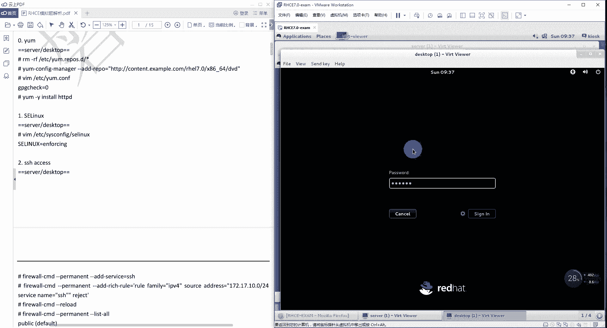
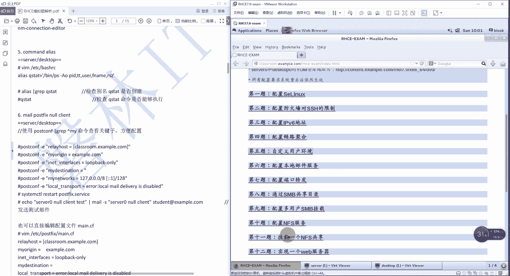

# 红帽RHCE认证考试视频 - P10：RHCE集训-1 - 我是冷空气 - BV1th4y1X7cC

咱们从头来啊，主要是这个人第一个这个虚拟机咋用啊，这个虚拟机咋用，这个虚拟机用的时候直接点击这个就可以了啊，把它还原到这个i h c e o k，然后转到就行，这是第一个这个虚拟机打开。

第二个就是这个虚拟机打开了之后，它这个桌面上主要有两个，我们用的一个就是这个叫view r c excel，这个你把它打开了之后。

它就是我们r c一的考题，这个考题跟我们考试题特别类似，所以说未来这还有多长时间，还有半个月吧，今天多少号，17号啊，还有大概半个月，这半个月时间，咱们大伙儿只要把这道题这套题啊，把它练熟了啊。

基本上就没啥了，主要有这张纸。

然后还有一个就是这个叫做manager v m s啊，这个是一个虚拟机管理器啊，他这都是kv m虚拟机，然后这里边咱们干啥呢，首先千万不要重置啊，不要reset，千万不要重置，直接查一下他们的状态。

可以用这个status查状态的时候，你可以看看这三台虚拟机的状态，这个classroom这个虚拟机它默认是开启的，就是你打开这个hc x m这个虚拟机，然后它里边有三台。

分别是dex hope server跟classroom，classroom是自动开启的，但是这个server和desktop他不是开启的啊，写的dex top mic。

然后我们看这个server server也是missing也是，所以说这两台虚拟机就把它开起来，千万别reset啊，就记住这个就行，千万别reset，因为他已经帮你设置好了，直接把它start就行了。

can start server，然后再start dex头嗯，这就完事了，完事了之后，你就可以连接到这两台虚拟机了，连接到虚拟机用的是view啊，用的是这个view，连接到咱们先连到server上。

然后再连到。

这个要在自己电脑上做的话。

得看你的那个硬盘读写速度咋样，我那个电脑特别慢，但是咱们学校还行，学校这个全是ssd啊，所以比较快，然后暂短的骑起来，骑起来之后，咱们就开始做题，然后可以先看看这个考试题目，考试题目考试时间三个半小时。

但是这个题特别多，你做的特别熟的话，估计也得需要两个小时到两个半小时，两个小时到两个半小时，所以做完了之后有时间一定好好检查检查，然后他要求说这两台，这个r n c一考试要用到两台虚拟机。

然后大家伙在真正考试的时候，实际上也就是两台，就是一个server，还有一个单凑合，就这两台，然后server 0作为服务器，dex top 0作为客户端，但大伙考试的时候。

你们得看你们的那个机器的编号啊，那可能是server 0，也有可能是你server加上机器编号，然后ip地址有dcp配置，就是说ip你不用配了啊，它默认应该都是通的，默认应该是通通的。

所以说考试之前第一步先干嘛，你先看看你这个环境有没有，如果你发现环境有问题，及时跟老师说，一般情况下这个监考老师他会咋处理的，要不然就让你重新考，要不然就是你在后期发现机器有问题的时候。

他会给你延长时间，然后考这个24sa的时候，一定得注意，24s里边不有那个字分区的那种题吗，这种题一定得先看看分区的大小，规划一下再分别，到时候出现最后不扣分了这种情况嗯。

然后他说考试机都位于example com这个域中啊，ip地址是172。二五点点024，所以你可以先登上虚拟机看一下ip，看这两台虚拟机ip是不是这个，如果不是这个人数进行环境有问题。

然后另外有一个什么非信任局啊，17。17。20点，然后所有考试题目都是在server 0和单词，top 0上完成对吧，虚拟机可千万别做错了啊，清哪台是哪台的，相对的错，上次考试的时候有个哥们儿。

他那个20cd就没分，我也不知道，我们也不知道他到底是哪边出问题了，是没提交上去啊，还是做反了，没有分啊，然后练的还挺好的，哥们估计还得及时补考，然后450和带个超五零，两个系统的密码都告诉你。

这个最重要啊，叫server联合带top 0的亚目仓库地址是多少，这个我们上来第一件事，就是要在两台机器上把亚美元给他配好啊，这个是最重要的，这个你要是配合好的话，后面基本上装软件装不上。

到最后所有的配置都要求系统重启后依然有效，这个其实就要求两点，第一点安然了，就是你所有的服务我一定要把它给引a包，第二个就是在firewall防火墙开启这个服务，或者对应的端口的时候，一定要永久开启。

我感觉这个应该开好了，开好了，开好了之后，咱们就正式开始了，然后这个文档是我那天最后一天，最后一天发的那个qq群里的文档啊，你们应该都能找到，咱们就按照这个文档做一下就行了。

然后这个重要提示就是我刚才说的那个，不要reset这里边的那个虚拟机，然后开启虚拟机之后，只要把server和top开启就可以了，然后首先先来配杨美元啊，美元咱们这俩都登一下。

因为root账户他的密码已经告诉咱们了，所以直接登，不要。

然后先来到这个server 0上450上，先配这个亚美元啊，先配亚这个配亚美元之前可简单看看，cd到e t c写的y u m l i p a和，a t c写的y u m l i p s t。

这里边啥文件都没有啊，上面那怎么创建这个亚美元，就用这个命令就行了，叫亚魔config杠manager啊，然后杠杠i的gr e p o，等于后边他给你的那个仓库的地址，http冒号手机杠叫做co。

hint。x3 母后点com下边有一个r h e l7 ，注意啊，那是r h e l啊，可千万别写成i h e一啊，下边有一个h1 l七点，这边有一个x86 杠64，然后下边有一个dvd嗯。

这样的话它就自动帮你生成一个，就是这个名字有点长，这个名字就是你在这写的这个h g d p方号，声音，刚后面的啊后面，然后里面的内容就是他给你生成的水源的名字，然后圆的name。

然后你的base url，特别是base u r l这块没错的话，基本上就没什么问题了，然后因a包等于一，但是它这个有一个问题，它自动帮你生成这个文件，没有写jpg check等于零。

没写gpg check等于零，在安装软件的时候就得进行密钥认证，数字签名认证，还得再去指定你的那个数字签名的位置，所以这块一定给它加上a口一个jpg，check等于零。

给他追加到咱们刚才生成的这个文件里面就行，然后一定要测试啊，测试的时候y u m clear all先清空之前的缓存，其实之前也没缓存啊，然后在y u m没哎看到这个。

这就说明没问题了，然后server上配置完了之后，再来配置这个单词top，两个都是一样的，这，机器感觉没有以前快乐。

还是直接yum杠config杠manager，然后杠杠i的杠r e p o啊，等于a的ttp，冒号手机杠content，点x再抛点com，下面有个i h e l，七点下边有一个x86 下划线64。

这边有一个，之后添加jpg，等于零到etc，一切的y u m。二，e p u s t下新生成的这个文件啊，然后y u m可怜哦，玩一玩吗，哎这就可以了啊，这就准备工作就做完了，然后接下来就开始做题了。

然后我们可以对照一下这个题目啊，第一题要求配置linux，点进去就能看到说在server和dex好评上要求是linux，状态是inforce，这一定得注意server 0和desktop 0上都要配啊。

都要配，别配完server 0就忘了dex top了，那我们配一下啊，这个比较简单啊，首先我们cat一下etc一下的300set config啊，然后现在他的状态是这个promissive是吧。

所以咱们直接改一下就行了，s e d杠i改第七行，然后s把这个permissive改成还有inforce是吧，inforce那就是infing，然后btc一加到400c的confi，这样改就行。

这个boss你要是忘了记不起来怎么办，你看他这个配种烟里面都写好了，照着打就行了，然后一定得看啊，一定得先看一下啊，因为咱们之前学的时候，让大家关开防火墙或者关方向，就直接进行替换了啊。

它默认应该是比这个你得看看这是啥，然后再把它替换成相应的内容，替换完了之后别着急，先看了一下，赶紧改的，对不对啊，这改的应该没问题，然后重启就行了，除了重启以外，你要是想节约考试时间的话，还有一种方式。

就直接用这个setting force一之后你再改成boss啊，现在就是一boss啊，这就不用重启了，但是这有个风险，风险就是万一那个写错了，重启了之后，那就不是了，你如果要是你编辑完配件直接重启的话。

它按照配置文件来，重启完之后还是说明文件编辑的一定没有，然后这样的话就是能保证现在它是一boss状态，但是重启之后就没法保证，所以说这个一定得注意，只要别打错了的话，别打错了的话，就推荐大家伙这么改。

这么改的话，他节约时间，要不然你重启有火力不，或者你直接编辑配置文件也行，你要感觉这个用刚才那个set命令，我们一起打错了，怎么整，那你就直接点击退，中间直接改也行，改成info a password。

info，wq保存退出，然后现在的状态就是这个promise you，然后set，然后再改成boss，这就可以了，这个boss一起就完事了啊。

这题千万别丢分啊，这就是送分了，第二个配置防火墙啊，他这个题目这写错了，这个位置防火墙上写了个设置，400就无所谓了，他说按照下面要求设定系统，在server 0和dex top 0上。

还是在这两台机器上设置防火墙，要求对s s h实现访问控制，他说允许x3 炮域中的客户，可以通过ssh连接到solik带套，但是买133t这个com的客户就不能通过s h。

下边告诉你这个买133t这个域中的呃，ip地址是多少，这个网速是一七二点17。十点杠二四，这个东西怎么设置，是这样的，他分三步，第一步就是你要在你的这个firewall上开启s s。

也是这个服务是第一步，第二步就是给你添加一个负规则，不规则里面禁止这个172。1，7。十点杠二四这个网络端，它通过s h去连接这两个，第三个就是你这些个都要永久生效。

所以一定要这个刚刚reload重这个，重新让它加载这个配置就可以了，这就是第二题。

我们来试一下，先来到server上，首先一定要加这个s这个服务，那就vivoc m b杠杠i的杠service等于s h，这样就不对了，不对，就是因为我刚才忘打了个永久添加对吧，这样才对了。

刚刚i的杠service等于s s h，这是第一个加上这个s s h，这个符在刚刚永久添加，然后杠杠i d增加一个副规则，叫rich入，这个副规则写法它其实有两种，一种就是这样，然后后边直接写不规则。

但是这种有些时候你格式写的不对，就容易错，所以就记这个就行了，等于啊等于，然后后边跟上单引号里边写，你这个不规则的内容，首先你的这个规则叫做ral family啊，等于ip为四，也就是你是对ipv 4。

地址进行了一个数字的设置，然后source address，位原地址是一七二点17。十点，这个就是什么买133t那个网络段，然后对哪个服务呢，service name等于s s h啊。

然后对这些个数据包还是jk诶，这就完事了，你看他这个里边写的有点复杂啊，他就是每一个等号后边都用双引号，把它括起来了，这个如果你能记住的话，你就把它记住，如果你记不住的话，你就别记它就行了。

不打双引号他也能生成，我记得这个，好像这个双引号是不是还有点问题啊，这个好像没问题是吧，但是这个双引号的时候，你在敲的时候就说前面写了，你后边忘了写，可能就会导致你这个加不上啊。

然后最后在firework gcmd刚刚，这个是服务器端就完事了啊，别忘了这个desktop客户端，那还是firewall gucmd，杠杠永久添加杠杠，a杠service等于s h，先把s值服务加上。

然后再fw杠c m d刚刚零九添加杠杠，add on reich，rule等于单引号括起来，首先rule family等于i p v4 ，然后source address等于172。1，点一零点杠24。

service name等于s s h，然后reject这个复规则的难写，难写在哪儿，这里边好多东西table不出来，所以只能把它记住啊，只能把它记住，刚刚，然后这里边有个技巧。

我们现在不是已经做完两题了吗，完两集之后，你看这个文档，这个文档最后还有一个要执行如下语句，来进行评分，这个就跟咱们这个上课的时候讲的那个，执行那个验证脚本效果是一模一样的。

他可以对所有题里面的所有的小题，都会进行一个验证，然后哪有错了之后，他会给你标出来，所以你可以通过这个来拍来排错啊，假如说你有错的话，那咱们试一下，比如说lab叫做a跟zr h c e g他会一道题。

一道题目，你查一道题，但是这个有点坑的地方在于哪呢，考试的时候说没有这角度帮你，所以考试的时候你能手动查打错了，你看我这个插完了之后，咱看看咱们这个第一题，第二题配的有没有问题，来看第一题啊。

设置linux没问题，第二题设置防火墙，第三页都没，如果你在练习的时候，他遇到哪写的是fail啊，就像这个一样，它就代表你只会有问题去改，这边也可以运行，这边咱就不运行了，那边没问题。

这边应该也错不了啊。

这是第二题，然后第三题配置ipv 6地址，这就没啥可说的了，他让你配置server 0和在top上都要配p6 地址，并且给哪个接口配给e t h0 ，配b他说这个地址必须重启后依然有效。

并且得保持当前的ipv 4机制能够通信，这块主要是什么呢，主要要改三个地方，首先第一个你用的命令是nm cli，这是被扣了，就a m c l y，然后这三个注意的地方是哪。

首先第一个需要给这个e t h0 ，这个接口配置ipv 6地址，配置ip 6地址的时候，这个地址有点长，千万别写错了，这是第一个，第二个就是你光比ipv 6地址还不行。

你还得修改它的这个ipv 6地址的获取方式，改成手动，第二个，第三个就是这个他说重启后依然有效，所以这个e t h01 定要设置成开机自动激活。

自动激活，反正就是那个呃n m c l y这三个参数啊，那咱们也可以，那就是n m c l y啊，connection哎，这块注意啊，别直接打e t h0 ，the multify，然后table一下。

你看你看这个它不叫1t也是零，它叫system m e t啊，这个也比较坑，你考试的时候也是注意这个技巧，这不是修改一个连接吗，这个链接名你先别着急打啊，你table一下，看看是哪一个。

你看他这个连接名叫做this term e t h0 ，然后你再改改的什么呢，i p v6 地址的就是ip v6 点address，这个nm c y这个命令虽然长，但是都可以退保啊。

所以把它推出来的叫f d d b冒号f12 a，冒号a b1 e，这肯定是一啊，不可能是l啊，因为16进制是压根没有l，所以千万别打错了啊，你这个打错了，那就可惜了，c0 a8 冒号一杠64。

然后刚才咱们说的这三个，你可以在一个命令里边都把它改好啊，因为咱们练习的时候可能是用三次这个命令，但实际上一次就可以了，然后直接改就行了，这第一个我们把ipv 6地址设置好了。

第二个就是ipv 6地址的获取方式，i p p6 点maza改成menu手动，第三个就是自动连接叫connect auto connect，yes，这样一下就设置好了，设置好了之后，别忘了把它给记起来。

那就是connection up，cpm e t h，这就完事了啊，这第一个就完事了，然后再来配这个death to一样的啊，还是table一下，它也叫sister，c t m e t h0 。

然后他还是ipv 6点address，叫做还是多少，f d d b冒号f1 r a冒号a b e e冒号，冒号c0 a8 冒号二啊，64啊，刚才那个是冒号，一直是冒号。

然后i p v6 的获取方式就是ip v6 点，maz改成mu手动啊，然后还是connection。auto connect改，这就完事了，然后别忘了把它提起来，connection up。

e t h你在考试的时候，因为咱没有那个脚本，所以咋办呢，你就只能用这个命令去测试啊，有那个脚本，其实我们直接运行这个脚本就能测试，f e r a冒号a b e e冒号，冒号c0 a8 冒号一。

这是在desktop 0上拼sery，也可以看到，那能听懂说明可能就没啥问题，咱们先脚本试一下lab x3 m i x c1 core啊，这个是dex dex top上就行了。

他检查的项目要在server上比在server上检查的少，你看他第三题ip地址配置正确，ip u网络可以达到这，这都这都不是这个该丢分的点，就细点心都没有。

然后第四题配置链路聚合，他说在server 0和top 0之间按照压下要求来配置，首先磁链路使用的接口叫做，e t h一和e t h2 ，这两个接口，它在实验环境里面应该已经给你配好了啊。

那你给你配好了，所以你在配置之前，你先看看有没有这样接口，那没有截图的话，说不定就环境又有问题了，及时打报告老师，我这个问题压根不用这样，就然后此电路在一个接口失效时仍然工作，这就是主主谓模式呗。

active by cup模式，然后server 0上是这个ip地址，然后在top 0上是这个ip地址，要求在重启之后依然保持正常状态，就说明他也得开机自动启动，可以呃。

所以说它这个设置就跟咱们设置那个team设备，是一样的，先创建tm设备，然后再把这两个接口给他连上，之后再给tm设备设置ip地址，ip v4 地址获取方式以及开机旧设计图像。

咱们来配置一下啊，首先来到这个server，那还是我们先看一下ip，看他已经准备好了，一题是一题12，我们直接来创建，首先应该先创建一个新的链接，这个链接是一个team设备。

然后connection name它的名字他没说明白，所以咱们就叫题目名吧，if name也叫题目零type，它是一个题目设备啊，config后边指定的工作模式，注意单引号合起来，然后里面是个大括号。

然后里面每个值都要用双引号引起来，这个就是他的这个那叫做runner，就在这里，它的格式，再来个打括号，name冒号，因为是主c，所以是active，就完事了，这就添加了，添加出来了之后。

n m c l y给它增加两个子设备，那就是connection i的啊，connection i的connection的这个name我们把它叫做team，理论上面的part一或者team钢炮一。

这都无所谓了，咱们这叫team 0 pot 1，因为他对这个应该是没有要求啊，然后if name，你用的是哪一个呢，是e t h e这个接口，type它的类型它是一个，team设备的slive接口。

所以是team杠slive master，他这个team设备是谁，是这个team，这就完事了，然后运行，然后你在设置第二个的时候，你就不用再把它再敲一遍了，太长直接按上改一下就行了。

team 0上面的第二个接口，然后用的是1t h2 ，其他的都一样啊，这就完事了，之后再给我们刚才创建的这个题目，设备设置ip地址就看了一个是multif，然后我们的设备是pm 0。

给他设置的是i pv 4地址，所以是i p v4 点advice，按照他的要求设就行了，192。168。2，0。101杠，然后ipv 4点mino改成mu手动，然后connection。

auto connect e，这就是一套啊，这就是一套，之后别忘了把它启动起来，那就是connection up听力，其实这道题的难点在哪，大家伙配对了没没啥问题，就怕你配错了，配错了怎么办。

一定得知道供电啊，就用这个nm c l i delete这个命令，去把你的这个team设备，还有team上的接口设备删除掉，删除了之后重新再配置就可以了，因为有同学可能想省事，想去改个配置文件。

改配置文件，有些时候你在重启网络服务的时候，会出现好多乱七八糟的问题，建议假如说你可以做了，先delete这两个接口设备，然后再把你的这个tm 0设备也给他剪了，然后再重新再来一遍卷。

就不会出那些乱七八糟的错了，好吧，这个server上配置好了，再来个dex top一样，然后cl connection i d connection的名字叫做题目名，然后type它是一个team设备。

beef name也叫team 0，然后config指定他的这个工作模式，打到外面去软件，name，叫艾克礼物，这就完事了，然后增加两个子接口。

a m c l i connection i的connection的名字，比如说叫tm 0上面的pot 1，然后它的类型type它是一个team的sleep设备啊，听的live设备。

然后if name用的是name，那是e t a g e，然后master这题目标再添加第二个接口，第二个接口直接改，这就是e t h r，然后你的这个连接的名字就是t0 ，钢炮塔就可以了。

再给你提供设备设置，ipv 4地址，connection mode，ipv 4点address，然后把它改成，这个没指定哪个是这里指明tm 0啊，然后i p v4 点address是192。168点。

0。102241022，然后ipv 4的话获取方式改成手动，然后connection。auto connect，这就完事了，然后别忘了把它提起来，之后你在考试的时候，因为没有脚本。

直接通过拼音来测试就行了，咱们这块咱就上事了，直接通过脚本来测试，它会自动帮你拼，然后对错就直接告诉了，咱们现在做的是这个第四题，第四题，他检查的是你这个题目设备存在不存在啊。

然后他的这个port是不是指定的t h e t t h2 ，它的运行方式对，这就没问题，也可以在这上面运行，这个就是长一点，lab example r h c1 ，好像也没问题啊，一闪而过的。

给他拉上看一下，应该是这是。

啊第四题啊，没问题啊，然后第五题第五题送分题，这个千万别错，说自定义用户环境，在server 0和dex top上创建自定义的命令叫做q state，这个命令执行的时候，实际上执行的是根下的。

并且的p s杠大a小o p i d逗号tt逗号，user逗号f em逗号i s c逗号，他要求此命令对系统中所有用户有效，嗯这个咋做啊，其实很简单，首先第一个它要自定义命令。

自定义命令实际上就是起个命令别名叫q state，当你输入这个命令别名的时候，执行的就是下边这条命令，然后他的要求是对系统中所有用户营销，这就说明你得改这个系统环境变量配置文件，而不是个人环境变量配置。

就这两条，然后改一下就行了。

就简单了，还是注意在server上和death top上都要改啊，那系统环境内中文件就是1t c下来，因为你要改命令别名吗，一般都是在把杀c里，然后来到文件末尾追加就行了，叫做alice啊。

追加一个别名叫cust，等于注意这必须得用单引号括起来，这是需要注意的地方，必须得用单引号括起来，然后执行的命令并以下的p s杠大a小o，然后后面跟的参数pad p t，这就完事了啊。

然后需要注意的就是，他这个题目里面要求这是啥，你这就要打呀，千万别打错了，错了就完蛋了，wq保存退出，然后再让它生效，让它生效的话直接扫就行了，以及c下载20r c，这就是重新读取那个文件。

让系统这就生效了，你可以敲一下qc的啊，这个命令就出来了，或者lab exam rh c e grade啊，看看第五题对不对，一闪而过，好像是对了，然后客户端也是哎。

那就是v i m或者懒的vm就直接可以eq，但是apple这块有问题，因为你里边还有这个分号是吧，你这个有这个不是分号单引号，然后你echo的时候用的也是单引号，单引号和单引号放在一起很容易有问题啊。

所以这个还这就尽量别用echo，还是直接编辑就行，文件末尾，然后编辑一个命令，别名allies啊，叫q state单引号，然后这个命令运行的时候，执行的是bin下的p s下的更大a小。

o p i d t t user f name和rs就完事了，w q保存退出e t c下的八大c，lab 3 r h c e，第六题吧，第五题第五题，第五题查询命令别名pass就代表没问题。

这边也没问题，这边是第五题，第六题也是第五题。

第五题就完事了，这个前面的题都比较简单，就千万别丢分就行，然后从第六题开始，往后就涉及到这个实验配置，刚看第六题啊，配置本地邮件啊，配置本地邮件服务器，这个就是咱们这个课程里面说的，那个邮件客户端。

首先他需要在哪配置，注意还是在sl 0和在操作上，所以说同一个配置还要配两点，这个本身它就比较耽误时间啊，他说这些系统不接受外部发送来的邮件，就是外部发来的邮件，他给的这个发送一个错误信息啊。

说不接受外部发的邮件，或者叫本地邮件图片已经关闭，这些系统上发送的任何邮件，都会自动被路由到classroom。excel。com，就本地发送的邮件都直接发到这台服务器。

第三个就是从这些系统上发送的邮件，都显示来自example。count，并且他说你可以通过发送邮件到本地客户，student来测试你的配置，而且这个classroom。example com。

它作为一台邮件服务器已经配置好了啊，已经配置好，他会把此用户的邮件转到下边的ul，这个其实在这里边没啥用啊，所以说这道题就是配置邮件，空客户端里边有一些要求，比如说不接收外部邮件。

自动路由到指定的邮件服务器，还有这个这些邮件，他们的这个会显示来自某一个指定的域啊。

好了，那咱们推一下这个，其实理论上应该先干嘛呀，你应该先安装邮件服务器，就是post fix和y应该先这样，但是你看我们这个提示是不是已经装好了，但是在考试的时候，咱也不知道他装好没装好吧，不一定。

所以怎么办呢，你可以先装一下试试，装好了就更好了，如果没有装好的话，还能帮你把这个装上好了，然后去改就行了，改的话要不然直接v i m e t c下载post fix，下载慢点，cf有这个主c中间去改。

或者你直接这样改，这样改的话这个效率更高，就直接用这个命令改就行了，叫做post config，杠e后边双引号括起来，里边是你需要改的内容，注意这个改的内容，实际上跟我们刚才说的那个v i m。

你的post fix的主配置件其实是一样的啊，其实但是这个风险在哪呢，就是千万别改错了啊，改错了之后，因为他这个命令你改完了之后，不管对错，他都接收到这个，所以说他不会报错，千万别改错就行了。

首先host，这个是将我的邮件全部转发到哪一台，邮件服务器，这个题目里面说了，转发到class room，点x3 p。com，右键注意这个要用中括号把它括起来，就这然后第二个boss抗非杠杠一。

他说所有的邮件要显示来自except for com，所以这个叫做my o r i g i n啊，这个就是邮件，它的来源都来自于x3 跑x就完事了，第三个他说了，这个只接收本地，也就是本地写好的邮件。

可以帮你自动投递到classroom点，a sum不会接收外部邮件，服务器发过来的邮件，或者外部的客户端发过邮件，所以这里边你得设置这几项，首先叫做i ne inter basic。

注意这有个s等于叫做loop杠only，也就是仅仅听本地的端口post config杠一，然后my de，啊这个比较长，千万别打错了啊，my destination啊，我好像没打错，等于后面什么都不打。

然后post configure杠一，我监听的这个网络，my network 42等于仅监听本地，所以是127点点零点杠八，还有ipv 6的本地，就是中括号冒号冒号一杠128。

然后这两个ipv 4和ipv 6，地址之间用空格隔开，最后post config，然加一个叫做local，transport等于e r r o r，这个其实就是增加了一条报错信息。

叫做本地邮件头顶已经关闭，哎这就配置完了，配置完了之后重启服务，restart叫做post，如果你是编错的话，重启服务它是记不起来的啊，记不起来的时候，直接就v m去改这个配轴间就行了啊，这注意啊。

要是真的起不起来了，直接用v i m改配轴间，就不要再用这个命令了啊，不用再用，然后我们再来验证一下啊，我们echo啊，后边是邮件的内容，叫做server 0客户端test，这是邮件的内容。

然后mile杠s mail杠s是发送邮件，杠s是指定邮件的标题，叫做server 0通客户端发给谁，发给他，说的那个测试用户叫做student at a temple。com。

然后我们的这个实验环境实际上比较怪，这个实验环境在运行脚本的时候，假如说你没经过这个测试，它就显示你错了啊，对所以做实验的时候必须得测啊，但是在考试的时候，我觉得这个应该是可测可不测啊，应该是可测好了。

这个服务器端我们就完事了，完事了之后，还是运行一下脚本来检测一下你运行的编辑的，对不对就行了，一边运行的咱们再去编辑客户端，因为它要求客户端也是啊要改后段，他这个方式是直接改的，改的咱们就不改。

咱们还是还有这种方式啊，首先他已经装好了，所以post config杠一啊，叫做relay，等于class room，点x3 炮加co，boss的config杠一。

我这个邮件服务器o r i g i n方没错，全部显示来自x3 炮线，好post config监听的端口，winter fac 4，等于经监听本地回环接口访new b，拷贝的再杠一我的邮件目的地址。

my destination，因为是邮件空客户端，所以这是空的，这个my networks，4=127点点零点杠有冒号，冒号一杠幺二，康复的再杠一叫做local，transport a e r r。

图二啊错误，本地邮件，投币已经停止了，变完事了，然后c什么cpr restart，然后也可以运行脚本检测一下啊，lab exam i hc，这应该是第六题了啊。

第六题你看他检查邮件这个post face配置是否正确，哎正确检查你这个邮件的邮箱是否正确，但是你这个邮箱他说邮箱是有的，但是邮件没有邮件的这个subject，就是它的标题是不对的。

这是因为咱们没发送测试邮件，咱们看看这个发送测试邮件上面这个对比，也是在这个地进行，第六题，你看检查这个配置正确，检查你的email是否看这个就对，所以这边你你如果要是想让这块也变成pass的话。

你还得发个邮件，不发也无所谓了，因为这个咱们肯定配的已经没问题了，server 0，都不断，因为他这个比较恶心的，就是他会检查你这个邮件，他的这个这个subject啊，就是邮件的标题。

就这个标题你还得按照他这个打，要不是这个标题也写错了，这个server 0优先的空客户端，按照bug student at x3 点之后再运行，应该是没什么问题，你看这就对了啊。

好了，这就是邮件供客户端，这是肯定会考的，然后第八第七题配置端口转发，这就是基本上属于是送分题，说在server 0上配置的公认法，注意这个题变了啊，之前全是在server 0和带top 0了。

这下只在server 0，所以一定得读题啊，一定得读题，配置端口转发，说在172。2，五点点零杠二四网络中的系统，访问server 0的本地原端口，5423将被转发到端口八零，并且这个设置永久有效。

这个咋实现啊，咱们思路还是通过负规则实现，不规则里面规则怎么写，其实很简单，就是原本只是172。二五点点零杠24，然后访问啊，对对对，这些个数据包啊，就是这个原地址来的数据包进行端口转发。

把他这个5423结束的端口，问5423端口接收的数据包全都占到8年，就这么一句话就行，然后写防火墙规则的时候还是要永久有效嘛，所以你要加上那个永久的参数。

并且得刚刚reload啊，写完之后好了，因为这题只在server里啊，所以来到server里啊，这是第七，然后转发啊，那就简单了，firework杠三md杠杠permit r，然后杠杠i的杠resue。

咱们还是采用这个什么形式不规则的方向，然后还是入family等于ip with source address，就是他指的这个地址段了，等于172。二五点点零杠24啊，这就完事了，然后对它进行转口转发。

端口转发叫做forward g，然后你转的是哪一个端口呢，是接收的是哪一个端口，是5423端口，千万别打错了，然后这个5323端口是哪一个端口，然后pro出口它是tcp的端口，转到哪个端口上去。

two port等于八零就完事了，之后firewall cmd刚刚回到，咱们建议使用数规则，为啥建议使用不规则这个登录转发这个firewall，学的明白的同学都知道，他除了用复语则以外，他不用负语则。

是不是也行啊，就增加一个正数值法，bewa杠杠permit，然后杠杠艾宝沃的炮弹，是不是用这个参数也行啊，但是这个不一定啊，不一定你用这个不规则，他绝对没问题，你用那种方式，有些时候他就过不去啊。

所以说为了稳妥起见，还是尽量用这个复位之后，你还是可以运行这个脚本来检测一下，你看第七题吧，就怕死就完事了，看一下对不对啊，1234567啊，检查端口转发啊，没问题。

然后我看下一题，下一题该第八题了啊，通过桑巴共享目录，这就是配置summer，他说在server 0上配置sa服务器，首先这个sb服务器必须是staff，工作组的一个成员。

这个其实就是改sumer的配置文件的时候啊，这直接做一下，没事啊，这个到时候可以看回放，然后这个要求就是summer，服务器必须得是staff工作组的一个成员，这就是啥。

就是改summer配置文件的时候里面有一个work group，工作组一定要等于staff就行了，然后共享的目录是更加的common啊，没有的话创建一个，然后共享名也叫common，共享名也叫。

如果他说只有example，com域中的客户端可以访问这个common，所以你可以指定一下哪些客户可以访问啊，common必须是可以浏览的，这个就是在配置文件里面加一个这个什么。

这个什么browser就可以了，有一个参数，然后有两个用户，一个叫做rob，一个叫做什么bread，他们的密码都是real high啊，他们访问这个共享目录的权限不一样，一个是只读，一个是私信。

这个其实就是在配置文件里面写一个这个right，at least，然后等于brain就ok了啊，我们来看一下啊，这个怎么做，注意这个是配置sa服务器端，是在sol上配置sa服务器的。

再来配置下一步安装软件y u m e store啊，叫做桑巴桑巴，还有cfs杠u t l杠y，哎这装完了好，装完了之后看一下你的那两个用户他在不在啊，id用id命令看就行了，如果在的话。

会显示这个用户id相关信息不在的话，它直接显示no such user，no such fu，那没有这个用户，我们创建就行了啊，user i的杠s根下的s并下的no老兵，这个咱简单说一下啊。

就是嗯在咱们这个实验里边啊，还有考试的时候，他这个虽然没有指定啊，但是从这个答案上看，它默认全都是创建的，用户都是用的是根下的s b的no lov in，这个其实就是指令它使用的shell环境。

如果一个用户他的shell环境是根下的s b的，no loin的话，用户就没办法登录系统，知道吧，然后在user add杠，别发错了啊，no log in，布莱恩是吧，之后给他们俩呃。

加入到sub这个用户里边，那就是s m b password啊，杠a就行了，r o b那密码是多少，刚才已经说了，要设置成red h之后，再加第二个用户啊，布莱恩是吧，密码。

就完事了之后可以查看这个用户是否创建啊，叫做pdb edit，杠大l就可以了啊，在这里可以看到这两个，其实你不装这个命令的话，直接用pd b edit这个命令的话。

也能把他俩变成somebody用户好了，然后创建共享目录下的common共享目录，别答错了，就必须得是一个目录，然后他又要求要求说，这两个用户对这个共享目录的权限不一样啊，然后要求的是这个布莱恩可写。

但是这个rop用户他只读这个，它是通过设置acl权限的方式，那就是sf a c l杠m，这是设置a c l u对于哪类用户设置，对r o p这种设置权限是什么呢，是r杠x就是没有写的权限。

对哪一个目录就更加了，口美之后再set f a z l杠m对哪个用户呢，对这个叫做布莱恩这个用户设置的权限啊，w x就完事了，你设置完成之后，可以用get f a c l跟下来看一下，你设置的对不对啊。

可以看到这两个设置的没问题，然后桑巴这个是跟其他服务不一样了，他需要设置这个selinux标签啊，所以要给这个共享目录增加一个src标签，src标签叫做sa gusha gu a一下的后面，1。

27括号问号，然后再重置一下他这个selinux安全上下文啊，杠r f v v n t的诶，就完事了，完事了之后，我们就可以编辑somebody的主配置文件了啊，那就是a i m e t c下的sub。

下的一个s m d d r config，首先改他的这个工作组，这个工作组在多少号，我忘了，再往下找找吧，gm 100多，好像是90多，啊在这呢啊，89行啊，89行他说了啊。

要求你的工作组必须得是staff啊，所以改成staff s t a r f，然后文件末尾最佳就可以了，首先第一个是设置共享名，共享名人家说了，必须得有common。

第二个pass共享的路径是根加的后门这个目录，第三个他们必须是可以浏览的，所以得加一个browser abel，等于这个就代表你的目录是可以浏览，然后哪些主机可以访问，叫做house思。

注意house思啊，allow等于172。二五点点零杠24，也就是我们说的那个example，点com这个域中的用户配方，最后他要求这个布莱恩是可写的，所以right list等于，bring啊。

这就完事了，w q和名利处之后启动服务，首先把服务设置成开机自启，这个千万别忘了啊，要起俩，一个是sm b，一个是a m b，那之后再把它启动，这还不算完，不要忘记在防火墙上开启对应的服务。

或者它的端口，并且是永久设置啊，对杠杠爱杠service等于，然后firewall杠，seventy，杠杠reload，完事了之后，你这道题现在还没法验证啊，你要想验证的话。

只能检查一下他这个共享是否导出啊，共享是否导出，你要完全验证的话，你得把客户端配置完成了，所以咱们还是偷懒了，哎呀给我敲一遍，直接运行这个脚本就行，投个这看看对不对，有错的话，它会直接给你提示。

这是第八题啊，sa啊，可以看到他先判断sa软件包有没有装服务，有没有起，是不是开机自启配置文件，别的就没问题，共享目录是否存在，它的这个selinux安全上下文配置是否正确，这个用户是否存在啊。

你的这个这是系统用户是存在，sub用户是存在，系统用户是存在，sub用户是存在，然后防火墙配置是否有问题啊，这些都没有问题，所以最后就pass，然后我们来配置客户端。

嗯客户端这个他也是下一个题啊，一个单独的题啊，叫做配置多用户挂载，因为服务器端我们也配置好了，那客户端要求是，首先第一个desktop会把server 0和的comments构想。

通过多用户的方式挂载到本地mp的multu，这个多用户就是指挂载之后，你可以直接切换使用哪一个用户去挂载，就是这个切换用户的身份，而不需把它卸载再重新挂。

然后他要求说用who rob password是red hat啊，制度用户brain啊，密码是red hat读写的方向盘，并且注意他这个要求，该共享在系统启动时自动发展，这就说明在干嘛呀。

得写预计一下他耗件才行啊，好了，那我们来设置一下，首先先安装sa的客户端为y m store，这里需要注意一点，服务器端跟客户端都要装这个啊。

都要装这个c i f cfs叫做common interface fc，什么意思，就是挂在远程目录，必须得用它，然后创建挂载点，make dr挂载点叫做m n t下载multi user。

注意这个multi别打错了，这个我觉得这个单词很容易打错啊，然后编辑etc下的sm b。password，这个里面注意这个文件是不存在的，是你自己需要手动创建的。

在这里边指定你挂载时用的用户名叫做rob，对应的密码，这个是他somebody的密码啊，red hat就完事了，然后这个文件注意一下题目有些什么，要求你在哪创建，所以你在e t c下创建也行。

你要想省事的话，直接在当年目下创建行，并且他也没要求你这个文件的名字，所以你叫啥都行，但是文件里的内容你得把它写对啊，而且你这个文件内容你也注意一下啊，他也没要求说必须得写这个rob这个用户。

你写另外一个用户其实也可以，然后改一下这个文件权限啊，600改成以及自家的sm b。password改成了全，改完选项之后，你可以尝试手动挂载啊，咱就不尝试了，咱们直接把自动挂载的信息。

写入到etc的f s p p文件，然后再来挂就可以了，所以echo你挂的是什么，是server 0，这台机器上the common这个共享，注意这是共享名，不是共享目录名。

他这个题目啊设计的还是挺有意思的，就是你的共享目录名和共享名是同一个名，这会你即使写错了也无所谓是吧，你写的是哪个属性，但是你咱们从那个什么学习的角度出发，就知道这写的是共享名啊。

不是共享的那个目录的名挂载到本地mt下，我刚才创建的挂载点叫做multiuser，然后挂载的文件系统类型cfs，挂载的权限叫做multi users啊，mol t user。

如果用户发的权限比false比fs，gnet dv这个比较重要，gnet dv是什么意思，就是网络启动之后再去执行这个挂载，然后挂载时有一个验证身份的这么一个令牌啊，叫cream health。

等于这个令牌文件，其实就是我们刚才生成的那个根下的，etc下的三把password，如果你不在这个路径下的话，你就在其他路径下写下去，注意啊，一定得注意下啊，可千万别覆盖。

覆盖了那个f z b文件的内容就没有，如果你看了一下e d c a f t b啊，这里经写进去了之后，mm杠a就行了，mont杠a，就是按照你刚才编辑的这个一级学校的。

f s t b这个文件里的内容去放在文件系统，那我们刚才在这里面新加了一行，所以这一行应该也能生效，还能挂上，基本上就没有问题了，之后你如果是考试的时候，那你就可以用下面这种方式去测试一下，看行不行。

因为咱们是实验环境，所以说再投个拉，直接用脚本测x，它会自动帮你执行一个测试啊，你看看你的权限对不对就行，可以看到第九题，这个桑巴检查的是你这个cf s，这个软件包有没有装，然后这个挂载点存在不存在名。

对不对啊，然后etc的f s b有没有问题，多一会画载能不能用啊。

这就ok了，好了这第九题制作完了就制作完了，然后我们来看第十题，第十题，这个其实是个分水岭啊，第十题和第11题做完了之后，你这个题大差不多就做了一半了，你看咱们现在讲课的时间，一个小时比我做的快的话。

基本上也就这个时间啊，那我呢还是为了省事照着做的哈，要背着做的话，万一那会出错，排排错，反正花费的时间就更多了，第十题配置nf s服务，首先在哪上面配，先确定在server上配，要求是什么。

第一个一只读的形式共享目录public，同时只能被x3 pro中域中的系统跑分，这就说明你在共享这个blue的时候，它的权限是r o啊，它的客户端是example com。

第二个以读写的形式共享目录protected，并且能背只能背啊，example语中的系统，这就说明这个目录在共享的时候权限就是啥呀，就是r w w，并且它的客户端就是ax b。com就可以了。

然后他说了，他说如果你要访问这个共享目录，需要经过科普认证才行，那认证的时候我们知道需要密钥，密钥从哪下的，告诉你这下就行了，并且他说这个目录它应该包含名为project，拥有人的这个的字母。

比如说这个下面应该还有个子目录叫project，而且这个子目录它的属主就是拥有人，必须叫做什么l d user 0，并且这个用户能以读写的方式去访问，你的这个project的好了。

那么按照他要求来推一下，现在就是server，那首先第一步还是安装软件啊，y u m in star杠y n f s杠u t i哎，其实你已经装好了，装好了的话，这个就简单了，直接创建共享目录就行了啊。

跟下的public再创建一个共享目录，叫飞不下单，不知道tt啊，并且这个目录下还得有一个叫做project的，出了之后，按照他这个要求说，你的这个project的这个用户的属组应该是u40 啊。

叫做l d a p u40 ，所以change on l d a p u40 ，等下的protected下的project之后确定一下ryl cod，等一下的pro tt，为啥要用杠b。

因为你要查的是这个目录啊，所以对加杠b，我可以看到他输入已经是l d除以u40 ，没有问题，之后，我们来下载这个corpse认证用的这个密钥啊，还是注意保存的位置，把它记住啊。

是在e t c写的k r b5 ，并且这个文件名叫做kr b5。2k table，然后从哪下的h一方和成员杠，就是他刚才在题目里面给的classroom。x3 l。com，下面有一个pub，pub。

下面有一个ktabs，kt boss，下面有一个叫做server 0点ptable，诶，这就下载下来了，下载下来了也保存到etc下来，叫做kr b5 点ktv，这个其实你可以看一下l l e t c。

现在p r b5 点，没有问题之后，然后我们来设置我们这个nfs他的这个版本啊，那就一起c加的cs config，下面有个nfs set number，看第几行，反正第七页第13啊。

叫做r p c n f s d a r g s，指定你的nfs的版本更大，v空格4。2w直播活动之后，然后编辑t set的ftp文件就行了，这个你直接v r m也行，你用echo也可以啊。

首先第一个通项目录就finish the public，要求这个共享目录只有example。com，这个e中的用户可以访问，所以你可以写个新点exam com。

这个代表是excecom下面所有的主线地方，要求他呃，在用户访问的时候是只读的，所以要r o啊，然后s y n c s n c就是重复方式，这个写也行，其实不写也行啊，然后跟下的补刀techni。

但是他这个答案里面既然写了，大家在考试的时候也尽量把它写上啊，根下的protect要求也是，星点x ceo。com这个域中的用户可以访问，然后他是读写的方式s n c b，且他要通过科普认证。

所以有个s e c等于k r b5 ，因为你加了这个qs认证，所以加了s e c这个关键词就是security的意思，它会自动变红啊，所以不要以为这是不错了呀，怎么急啊，这不是啊。

这就崩完了之后就可以启动图了，所以c c pl in a宝注意起服务要起俩，一个叫nfs啊，server因为我们这个涉及到认证，所以还要起nfs杠4q so，这很多同学经常把这个roll给忽略掉了啊。

那就不行了，之后再把这个服务启动起来就行了，先是设置开机启动，诶这就完事了，服务器端基本上就配置完成了，然后不要忘记防火墙，还要开启这个服务对应的端口。

所以firework和sb永久添加杠杠i的杠service啊，我们直接添加服务就行了，nfs下边这两个其实加不加都无所谓，你如果害怕的话，你可以把它加上，我们现在就不加bel gc md，刚刚。

怎么办啊，然后检查一下lab r g c g v的啊，看对错，这是第十题了吧，看一下，啊第十题了啊，第十题，第十题，来检查你的这个nfs service这个服务是否开机，并且呃是否开启，并且开启自己。

检查了你的这个共享目录是否存在，etc的f i t e b也是否存在啊，然后这个没有问题，之后他检查了一个科普斯认证，检查你个密钥是否下载下来了，你的这个nfs版本是否修改了。

然后nfs sq杠server是否开启自己，并已经启动了，根下的protection的这个共享目录是否存在，然后他的数组是不是l d a p u40 ，以及一直下的expose系列就没问题。

最后所有的都没问题，所以最后就pass了，这服务器端就配完了，然后看客户端，你们要上厕所吗，休息一会吗，你想要什么，坚持一会儿啊，我把这个说完了吧，嗯好了嗯，我看下这个客户端，客户端这个就简单了。

挂载一个fs共享，就他说在dex top 0上，注意还是要在哪台机器上，挂载一个来自server 0的nfs共享，要求挂的是哪一个跟着的public挂到mt下的nfs m。

另外更新的project里摇画挂到md下的nfs supu，并且挂载的时候采用cos认证，所以他也需要下载这个密钥了啊，这个密钥从哪下告诉你，他说这个用户l d user 0。

必须得能在这个上面创建文件才行，并且这些文件系统在启动的时候必须得送花的，这个用户能在这上面创建文件，这个其实是在服务器端配置的，然后这些文件系统在系统启动时自动挂载。

就是写etc 2的f s p b好了。

那我们来配置一下第一步安装软件吧，y u m e store杠y n f s杠u t r s，他提示你说这个已经装好了，装好了，这就简单了，直接因为他这个没涉及到别的，所以直接挂就可以了。

挂之前我们可以先下载一下，我们的这个验证用的密钥文件啊，那就是w get更大o还是把它保存在哪儿呢，保存到e t c下叫做kr b，kr b5 点ktable，然后从哪下，http冒号双斜杠。

classroom dex 3点com，后面是啥，忘了，在这儿呢是吧，下面有一个pub，pub，下边有一个ptables b box，是写错了，下边有一个这个dex desktop 0点。

呀其实你解析不了吧，这是我写错了吧，graduo拼错了，哎这就完事了啊，完事了之后嗯，把它加入了开机自动挂载就行了啊，加入了开机自动挂载，加入了开一次挂载之前，最好先把你的这个共享目录创建出来的。

那就是挂载点创建出来的就是mac dr，在md下成立一个nfs的mt，这个是用来挂载什么的，挂在那个不需要经过加密的啊，所以直接echo就可以了，echo我们要挂载的是server 0。

server 0上面的跟下的public啊，这个目录把它挂在哪，挂在n t n l s，然后挂载的文件系统类型为大s权限deboss，逗号杠ne这刚才的dv还是在系统启动之后啊，网络启动之后再发展。

注意一定要追加到运行的，可以再创建第二个挂载点啊，mdr在md下的叫一个nfs the pua，然后把他的这个配置信息也写下来，还是echo，我们挂载的是server 0上面的跟下的pro tt。

这个目录挂到m t r的nfs sq，怎么感觉不对，n f s q e，这是我们这个挂载点，然后挂载的文件系统类型，nfs权限只读写一下啊，然后同步的方式挂载4。2，指定它的挂载的这个nfc版本。

还有它通过kr，k没打上过，k2 b5 p就是通过curse进行认证，然后杠bb还是网络启动之后再来挂载，然后零零还是把它追加到e d c g的m i t b，然后这块有一个步骤，就是大伙经常会忘。

就是一定不要忘记啊，因为我们这个客户端它是通过科普认证挂在n，所以一定不要忘记起这个服务，可以把它设置成可以自己有c怎么cpl in a包，那个n fx杠n fs啊。

c怎么c d l start a fs，这个千万别忘了啊，咱们同学就主要就是栽到这了，这个忘了起了，把最后到这里好了，然后我们不通过他那种方式认证了，咱们直接lab excel h c一个一的。

呀好像有错哦，第11题啊，这个挂载点存在e t t f f t进去，然后挂载的时候失败了，就是下一个没挂上是吧，哦我刚才忘了忘了挂了，是好帽子，高一挂下，挂完之后才其他检查，那两个好像都可以挂上了吧。

下面那个boss也是哎，这样就对了，那检测了一下你的这个挂载点是否存在，然后一体的f t b是否存在，然后挂载的这个共享目录是否已经挂上了，然后检查了你的这个密钥验证文件在不在。

nfs sq这个服务是否开启，并且设置成开机自启了，然后他的这个安全的挂载挂载点是否存在，以及fc b是否存在啊，编辑的时候正确，以及这个是否挂上啊，所以不会挂上水，就怕好了。

截止到这，咱们这个就一半了啊，就一半了，那咱们休息会吧。

休息十分钟回来。