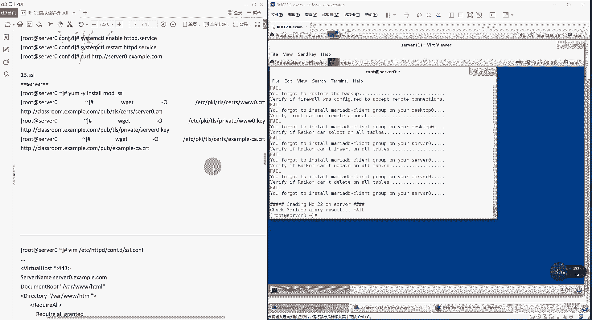
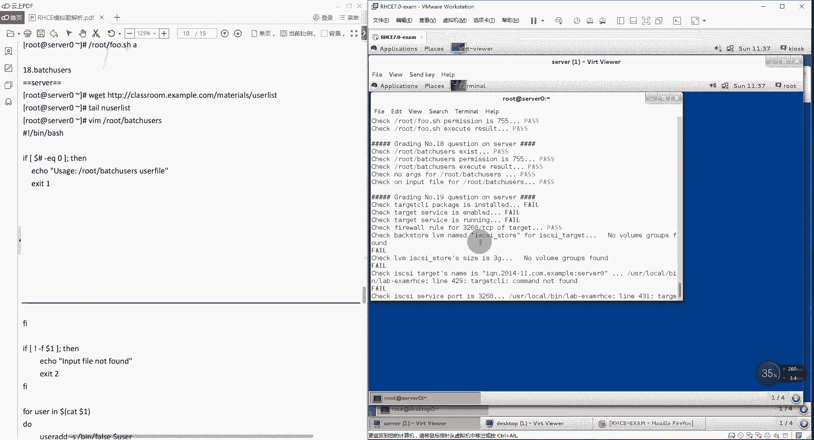
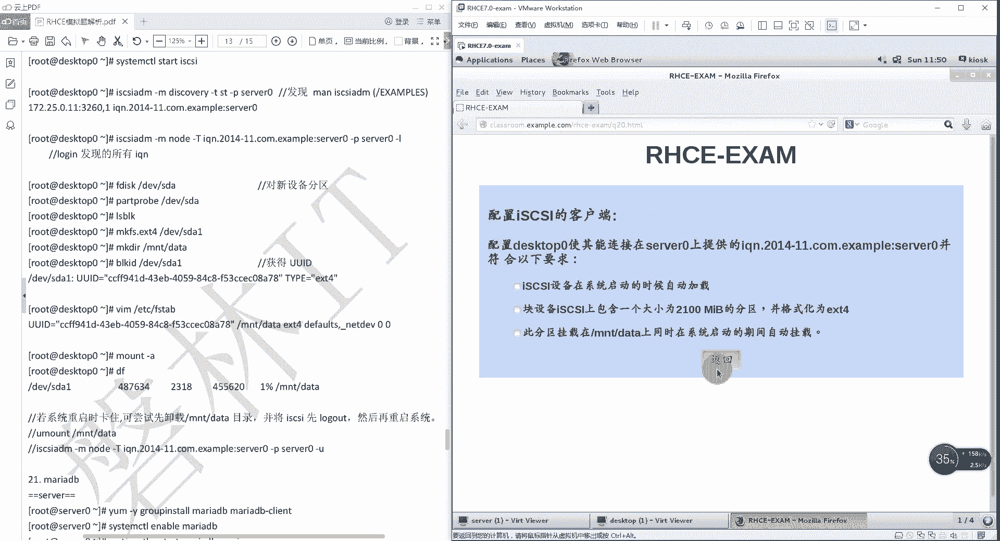

# 红帽RHCE认证考试视频 - P11：RHCE集训-2 - 我是冷空气 - BV1th4y1X7cC

好了那咱们继续了啊，哎呀这估计11点半估计完事不了，你大概12点了，咱们就上午把它讲完了，然后中午吃饭，下午大家伙就可以自己练习嗯，刚才做到第11题，第11题完事了之后，这个题就过去一半了。

那你本身一共22道题，然后接下来咱们继续啊，接下来这个注意啊，这个就是咱们当时上课的时候说的，这个强调的这个事就是阿帕奇的题，阿帕奇这个是特别重要的，在这个题里面占的比重也比较大。

你可以看到阿帕奇从第12题和第16题，全都是12345道题，全都是阿帕奇的，比如说他占这个比重，就占了你整个考试的1/4的不同，而且阿帕奇配置起来还比较麻烦，还比较麻烦，所以说一定得多练练也得多练。

咱们先看第12题啊，实现一个web服务器啊，这个就简单了，在server 0上配置一个站点，http m server零点35。com，他告诉你这个实际上就是告诉你，告诉你当前的这个服务器主机名了啊。

就是server 0点h3 模的卡，然后要求这个主页文件呀，你不能自己写，你得从这下下下来之后给他改成叫做index。html，但是他没有指定路径啊，这个环节啊。

他说将这个得放在你的这个web服务器的document，root目录下，但这个路径具体没说，并且他还是有要求的，他说example com这个域中的客户是可以访问的，但是买133t。com。

这个域中的客户是不能访问的，所以它有一个访问控制啊，那咱们来做一下，首先这个是在哪做的。

注意啊，在server 0上啊，这个跟在sop就没关系了，我们来到sol，第一步还是安装软件vu m store啊，杠y，可以看到这个他没有装，他还没有装，所以他们可以速度完好，装完之后，为了省事。

他这直接就把这个http的服务给提起来了，咱们直接就跟他一样，在防火墙上把这个端口给开启啊，那就刚刚杠杠杠，service等于这个注意啊，呃就是服务我们究竟是加服务还是加分，能加服务的都加服务。

然后这个服务没有的，再加端口，你比如说这个http，其实你加http这个服务和加tcp 80那个多口，效果是一样的，效果一样，但是有一些服务没有，你比如说ice scars，那没有的话怎么办。

就只能加端口，所以你得知道这些服务的端口是多少，然后bear w杠cmb杠杠得到重新加载，那你刚才的这个配置生效，然后我们就来获取他的这个主页文件，主页文件从哪下的，经告诉你了啊。

所以这个主页文件的下载路径，还有主页文件的名，默认的这个名字不要打错了就行了啊，那就w gu刚o它是把它放在默认的3w下的，watch的3w的html下来，并且直接将它保存到index。

html这个文件，然后从哪下htp往后升学杠还是class room，点x3 p。com下边有一个叫做meter rose，下边有一个station。htm，哎这就下载下来了，下载下来了。

并且已经帮你保存了，你可以看一下啊，不下来，3w的htm，现在几点，这里面写的就是一个html e l l，就增加了一个这个标题叫miss，这个无所谓啊，只要你下的对就行了啊，然后我们来编辑配置文件啊。

他的这个做法还是挺有意思的，他是这样的，虽然我们是一个默认的主页，但是他还是以这个虚拟主机的方式做的，所以他来到这个编辑虚拟主机配置文件的目录，也就是e级c下的htp向的考试卷t。

然后他编辑了一个虚拟主机，叫做v host gun server，第二config这个名字也是他没有指定这个名字，必须得叫这个，所以说你考试的时候，你可以简单的写写，不用非得写这么长啊。

然后写了个虚拟主机的内容啊，那就是v戳，cost啊，虚拟主机星冒号八零，然后杠没出，这就完事了，因为要涉及到主页文件目录，所以director这个主要文件目录是挖下的3w，现在。

然后我们来写虚拟主机的这个配置，虚拟主机的配置简单就写俩就行了，server name主机名他要求的叫server 0点x3 p。com，这个是在题目的第一个要求里面要求的啊。

说你这个访问的时候访问的是谁，这写的就是谁，然后document root你的主页文件目录，咱们用的是默认的y3 w一个htm，你指定的这个主页文件目录，你就在下边指定一个主页文件目录。

它的这个访问权限，也这加上了一个叫做requiry哦这么一个标签，有这个标签主要是为了干嘛，为了设置权限的啊，注意还是标签坠的形式，以这个开头，就以杠这个结尾，然后权限是什么，注意啊，它不变色。

需要注意它不变色，不要考试的时候发现诶这个没变色，是不是写错了，不是他本身就不变色，首先require all granted，这代表所有的主机都可以访问，然后require闹他好。

这些主机不能访问哪儿呢，点儿买133t。com这个域下的所谓的主机，然后他就说考试的时候你也可以写require，noip左边的ip，但是这个机构我们测试发现写ip就不行，还必须得写这个名字。

就是这个简单记一下就行了啊，w q标明数之后，把服务设置成开机自启，http t在启动服务start，哎这就完事了，完事了之后，我们就还是直接运行脚本检测了hc 1 x3 m，第二题，第12题，12。

首先l t t b这个服务已经是爱自己没有问题，l t d p正在运行也没有问题，然后这个防火墙设置的a h t t p啊，允许他的这个数据包通过也没有问题，然后你的这个主页文件也没有问题啊。

web的访问控制也没有问题，然后这会儿就有一个bug，就是这个叫selinux安全上下文，document root，就是wah的三代3f pm，咱们压根就没改过他的安全上下文啊。

所以说理论上这会儿应该是pass，应该是pass，但是他这显示的是feel，所以这个错误大家伙基本上可以忽略啊，这不是说咱们做错了，那他的这个检测脚本本身就有问题，而且这个很奇怪的。

就是有些同学你发现他做完了，这就是pass，有些同学就是废，但是我这么长时间一直都不睡觉，但是不耽误考试啊，不耽误考试，所以说这个要知道你别自己在做测试的时候，这个费用是不是我配错了，这个没有问题。

因为我们用的就是ios杠大cd瓦下的3w的pm，你可以看一下他，这上面已经包含了你的selinux的标签，所以说这个不应该有问题，然后我们尝试着r，让fr和v哇这个300试一下，我们重置一下403。

再查一下，看看能不能行啊，如果不行的话，那就说明确实是他有问题，那咱们就不用管，你看还是不行，所以说这就不用管了，不管了，你知道这个不是我配的东西就好了。

这个是第12题啊，然后第13题配置安全web服务，就是配置h t p s，他说要为你刚才的这个站点server，零点excel配置一个t l s加密，这个证书从哪下，这个证书密钥从哪下。

然后你的授权信息好吧。

那我们就直接来做就行了，首先第一步先把他说的这几个整数给下下来啊，y u m e star先安装mod cons s l这个模块，这个需要注意啊，不要忘记，因为你要做t t p s的话。

你得在阿帕奇上装它对应的模块，这个模块就是mod杠s s l，那同样的你要是想发布这个web应用的话，动态应用的话，就可以装那个mode gw s g i那个模块，然后来下载w get杠大物。

把它保存到哪，etc，下载pk i下的t l s的，ths下的3w0 点c r t从哪下载，从a t b榜上写上，class room。四单抛点com下边有一个里面长呀。

pub pub下有一个t r s t l下，有一个sert ths下有一个server 0。242，这个其实就是从后边这个目录下载这个server，0。4r t下载下来。

保存了保存的e t c p i t l s的设置键在哪，不动点c啊，这有同学说这这这不太好记，上太长了，这个怎么记，你有两种解决方法，第一种就是你把它死记记住，第二种解决方法。

你随便把它放在哪个目录也行啊，但是你一定得知道你放在哪个目录，文件名叫啥，这样的话你在改配置文件的时候才能对应上啊，不是说他必须非得在这个目录，但是在这个目录肯定是没有问题的，你这下载下来了。

然后再下载第二个，第二个是把它保存到etc下的，pk i下的t l s下的，不是search下了，是private，为了这个目录下叫做3w0 点，从哪下的呢，还是从这个下边有一个pub。

pub下边有一个t l s p l s，下边也不是sert的，bravt啊，这么一个母下有一个server 0点也不是c r t了，c r t是证书的意思，这里边是k neil的意思。

哎这就下载下来了啊，然后再下载第三个，第三个就是我们的这个，其实是一个c的签名证书啊，这个还是把它保存在t l s下的，啊这个模型叫做example，杠c a。c r t，sample杠c。

c r t从哪下，还是从classroom。example com下上边有一个pub，pub，下边直接就有一个example cb。cp，就完事了，完了之后，因为主要文件已经有了。

所以直接编辑它的配重件就行了，配重件在哪，在btc一下htb d下的config，点d就是我们刚才的那个辅助线，然后这里注意啊，这个时候就有两种方式的，一种方式是干嘛的，就是按照咱们上课那样。

你把所有的s s l的那个验证信息，全都泄露到这个文件里，全都写的，但是大伙也发现了，这个基本上不大现实，因为太长了，内容太多了，虽然上次考试有个同学确实是这么干的，我确实很佩服的。

因为我也被我家太长了，他就是把我们那个就是按咱们上课的那种方式，把这个s s l验证用的相关信息，全都直接写入到这个配置间里，这个太麻烦了，还容易写错，还不好记，那怎么办。

这个就是咱们课上的时候说的那个，咱们推荐大家会采用这种方式，你把这个验证的相关信息写入到哪呢，直接写入到s s l。config文件里，所以直接编辑s s l，然后找到多少行了。

注意set number，找到第59行啊，59在这个59行下边啊，你添加这么一段内容，这个可以直接在61行这块写就可以了，把这些内容给他写进去啊，我们的这个虚拟主机啊，v戳还是星冒号443。

因为是h t t p s了，所以端口改成四三了，杠v除，post结尾就完事了，然后再指定它的目录，第reactory是rush的3w写的html，之后杠一directory结尾就完事了。

然后中间再写上我们的这个虚拟主机的配置，和这个目录的访问权限就行了，首先server name，虚拟主机名还是叫server 0点example。

第二个document root主页目录还是往下的三大阶段啊，这些都没变，然后这个目录的访问权限也一样啊，require on开头杠query on，结尾中间还是指定我们这个要求。

require granted啊，所有的客户端都可以访问这个move，但是require not谁不行呢，买133，这个域中的日记，不然后这个验证的信息啊，其实在这里面都已经写上了，咱们考试的时候。

不是考试的时候，咱们那个上课的时候写的一些东西，你看其实他在这个配置文件里面给你写了，给你写，所以说这个好处就是咱们不用再写了啊，不用咱们只要指定什么呢，指定我们的那个证书密钥，还有我们这个数字签名。

这几个文件的位置就行了，那这几个文件的位置在哪呢，就在这个第一外行，这，首先是第109行，109行这块指定的是你的这个证书文件，证书文件，我们这个证书文件在哪，这个就是看你刚才下载在哪了。

我们把它下载到这个etc下的，pk写的t s是server项，叫做server 0。42，server ina，诶，这个是叫server inc之后有个问题啊，哦你看这确实有问题啊。

这确实我记得这个是改过的，没改没改的话，这大家伙注意一下就行了，你看这个是你验证用的这个证书文件，这个证书文件他的名字必须得给你下载，保存的名字一致，这块写的是多少，是不是server 0。4r p。

但是咱们上面下载的时候，它保存的名字叫sl和c r t吗，不是吧，这叫3w叫c p吧，所以这块他这个题目的答案有问题啊，一定要注意，你一定要以你下载的这个文字啊，要不然你就把你的这个。

刚才下载这个文件重命名，要不然你就在这块写成你刚才下载那个名，咱下载名不叫server 0，叫啥叫3w，所以这注意啊，然后下边这个也叫3w，看看他这块写的是啥，你看他这写的是不是还是server里啊。

所以说他这个不对啊，好了，改成3w0 ，这个第109行我们已经改了，然后在第改第116行，那应该就是这个目录啊，是3w0 点k，最后再改第125行，120行，首先把125行取消注释啊，它默认是注释掉了。

然后再把它改成我们下载的那个验证用的，数字签名，这个路径应该默认就是这个路径啊，刚才我们下载路径x3 p杠c加加好了，这就完事了啊，终于完成了，编辑完成了之后，重启服务，restart。

耶你看这个服务起不起来了，记不起来了，就说明你哪编的有问题了，咱们看一下他哪有问题，他说virhost里面不能包含vore house，他们好像是在为主house里面又写了，为什很尴尬啊。

那这样写是不对的，那就是我记错了，那就不是在59行，难道是在49行，那这个无所谓了，咱们只要把它移出去就行了是吧，移出去，这个星星辛苦写的，咱们不能把它复制粘贴了，他妈的1~55行是吧。

哎呀但是下边这个能生效吗。

有点记不清了，哦应该是这样，把这个删掉就行，w q完美说试一下csm cpr restart a b嗯，看就行了啊，原理是啥，再回过头来看一下233，因为你看啊他这个上边这是第多少，第56行的时候。

人家已经写了这个虚拟主机了，然后是杠b bot 43，你如果想把这块改一下的话，你可以把这个杠b bot改成星也可以，所以说我们这会就直接用它就行了，然后直接61行，62号线虚拟主机它的这个配置。

然后在63号到68号，写上你的主页文件目录以及主页文件目录，它相应的权限不，他下边应该是已经给你写了杠这个which house啊，所以这样就可以直接可以了，飞了之后注意我们是通过http s方分的。

所以一定不要忘记在防火墙里面加上http s，这个服务，刚刚permit杠杠i的啊，service htp或者加tcp的43号端口都可以，那咱们刚才这么配行不行呢，咱们还是用这个脚本来进行一下验证。

注意还是关于selinux的错误信息，你可以把它忽略掉，那不是我们配置的问题，应该是他这个检测脚本本身有问题，lab x m i h c1 ，我们是第13题啊，看看第13题对不对，123节。

首先检查http是否开启示http是否正在运行，然后是否支持hp e s是，然后防火墙上面对不对对，主页文件对不对对，然后你的访问控制对不对啊，这有个错误，看到没，接着呢，他说etc a的pk i的。

tl c的sert 0的说找不到这个文件，后面哎，咱们刚才不是改成3w联盟，我没改吗，我们去看一下啊，这个改的是什么，要p t server没有，那我们改一下s s l d l c应该是比100。

3w0。42t3 w0。42，没问题啊，这好神奇啊，咱们都没指定4502k啊，为什么说4502k找不到，我再用一下脚本试一下脚本里面写的啥，他说md 5检测etc现在pk和t s give no。

such field not be right，啥意思啊，必须得叫server 0吗，这还有要求啊，那我们试一下，我们改一下cd到etc下的，pk i一下的t l s加2s cd的设置里边rs，3w。

c rt没问题，刚才说的是哪，private还是这个，啊就是40，改一下3w0 改成server 0。42，思域到e t c下载app，下面出现在第一下，a m i s s l这样config，100。

我给他改一下，改成450，wq关于对数，我们再重启服务，再试一下c的cpr restore a b b r，pvd啊hd，然后lab ax 3 m i h c e可以再试一下，诶诡异了还是这个错误啊。

还是这个错误，但这次只报一个了是吧，说private server里那个啊那个也得改，这尴尬应该不检查，但是这个实验环境里确实检查了，还必须得叫sl 0，那咱们改一下就好了，etc下的pk i下的。

你先按下的什么玩意，t l r下边有一个private，嗯mv改一下就行了，改成server 0点，然后再改一下etc下的飞车，t t d下的旁边一个这d一下的s s l d config，这个文件啊。

下面这个也得改，这个必须还得叫server，那就叫server 0 w q r，然后c c pr restart，之后再检测，这回应该就没问题了啊，24 一个reader，一周三题啊，这就过去了。

看来他这个题目里面写的还是有点不太对啊，有些东西它没有指令，然后大家伙应该都有这个文档，你就在这做一个标识就行了，这会是server 0，这会也是server 0，配置上没啥问题就可以好了啊。

这个就是他这个要求不符合了，这是第13题啊。

这就全部都pass，然后是第14题，第14题配置虚拟主机，他说在server上扩展你的web服务器，为站点3w0 点except com创建一个虚拟主机。

诶这个其实就是虚拟主机的server name了，就已经指定好了3w0 点x3 m的com，而且他的这个主页文件目录是在vr下的，3w的viral，然后他的主页文件还是不需要你自动设置啊。

你需要从指定的目录去下载，并且把这个下载的这个主页文件，放到你的主页目录里边，就是挖一个三代的retro，然后他还确保有一个用户啊，叫这个用户能够在这个文件下创建文件。

那就说明它可以在这个目录下具有读写权限啊，就这么就好了。

那我们来做一下啊，这个还是在server上配置的，首先改一下我当前的系统的这个主机名，临时修改，host叫3w0 点x3 炮，看这就相当于又给他加了一个这么一个别名啊，这么他这写的呢说3w命令。

execom是server 0点excel com的一个别名，就是用house这个指令，然后来创建你的这个虚拟主机，主页文件存放目录，midr在vr下有个3w3 w下一个vi vital ring。

错了就行，然后他说必须得创建一个用户，叫做这个啊，这个用户对你的这个目录还得具有写权限，所以是sf a4 l到m哪个用户呢，我们刚才创建的这个用户啊，然后它具有什么权限呢，具有什么权限呢，读写执行。

然后就给它最大值，对哪个目录呢，挖下的三段来给它回出好了之后，下载这个主页文件，w tt杠o，直接把它保存在我们这个vr下载3w vtual，movie index，四点ht。

然后从哪下http冒号双斜杠，从class room。x3 好点com，这个目录下边有一个materials啊，下边有一个3w。html，哎又下载下载，下载下来了之后，编辑它的虚拟主机配置文件。

cd到e t c写的g b d下载cf比较低这个，然后编辑这个虚拟主机的运动员叫做v house，3v host conserver，零点config，这个我们是要做3w0 。

那就叫v host杠3w0 点，你考试的时候不用写这么长，你就直接写3w0 卡fa或者甚至写个w就行，名字可以随便还是v戳，星冒号八零杠v戳，然后虚拟主机主页文件存放目录叫directory。

他要求是在瓦下的3w下的v纯，然后杠d vv结尾，然后再写虚拟主机的相关配置，目前虚拟主机的名server name已经指定好了，叫做3w0。4example，第二个它的主页文件已经制定好了。

就说document root是va的cd w set的retro，之后指定他这个主页文件的访问权限，require all gone kid，因为他这个没有特殊设置啊，所有客户端都可以访问p就可以了。

之后重启服务，restart，通讯员服务之后，还是我们可以在客户端进行测试，也可以直接通过一个脚本来进行测试，咱们节省时间就用脚本来测试了，lab exam rh 41164，这是第14，诶又有错了。

看到没有，神奇了，看看错在哪啊，selinux有问题，这个有问题，这俩问题还是解决不了啊，这俩问题还是一个跟selinux的，就全部都忽略就行了，然后这个问题也确实是，这个也是他检测脚本的一个bug。

你看他检测的啥东西，他说你创建的这个用户，对于对于你的这个主页文件就是bug的sd和viral，他的这个权限不符合，但是我们确实是创建了这个用户，并且给它赋予了相关的，比如这两个问题。

你就把它忽略了就行，这不是我们配置问题，而这个检测脚本本身就有问题，然后来看第十第15题。

这个要求就是配置web内容的访问，这个其实就是配置访问权限，他说在server 0的web服务器的主页文件目录下，创建一个叫做private的登录，然后这个目录下有一个主页文件。

主页文件不是我们手中写的，是从指定的站点下载的，然后需要什么呢，需要在server 0上，任何人都可以浏览，但是从其他系统就不，说白了，其他的客户端都不能放，他说这个题目是紧接着上一期的。

所以这里的主页文件的目录。

指的就是vg的三大件的vi好了，那我们来做一下这个东西，首先在主页文件目录下，也就是画下的3w下的vtu目录下，创建另外一个目录，mc dr叫做brevi，之后在这个目录下边w get。

来下载一个这个文件啊，把它保存在哪，比如说咱就保存在当前目录下，就叫index 4点html，从哪下载，http冒号双斜杠，是在拉斯点example。com下边有一个meter real。

下面有一个pvdr html啊，因为我本身就在这个目录下，所以我直接把它保存当前r s a，这就有了，诶我是不是忘了你这个没，哎呦，这完蛋了，我还把那个给覆盖了是吧，那我们就这样吧。

把上边我们下载的index 4。1，基本上挪到当前目录，这个是没问题的，这时候咱们刚才下载，然后上面那个就没了，上面那个没了的话，咱们再重新下一下就行，也就是上一题里边下的这，好了。

然后来编辑虚拟主机的配置文件，在e t c下载，http下载configure，点d这个目录下啊，有一个v host杠3w0 点cc，注意这个配置文件就是我们刚才写的那个，他本身已经有210。

然后我们需要在这个配置文件的末尾再加一层，这个the directory rush的3w下的v圈，下单一v定义了这么一个主页文件的存放目录，be right啊，directory开头。

gun directory结尾，然后指定一下它的权限就可以了，它的权限是require，denied，all denied，就是所有用户都不能访问，但是rera local啊，本机用户可以吗。

哎这就完事了，w q报名书之后，再次重启出我restart http，再运行脚本来检测lab x x x x，这是第15题，这道题应该不会有错啊，应该不会有错，因为它不是一道the linux的设置。

只要不是这sb设置，还有权限问题，应该都没问题啊，看没问题啊。

然后第16题啊，第16第16题配置动态web内容，他说在420上配置一个提供动态web内容啊，就是提供一个动态页面，要求这个动态web内容的名字叫做web app，点excel com的虚拟主机。

就是你还在创建一个新的虚拟主机，新主机的名字就叫这个，并且这个虚拟主机监听在端口8908这块，注意一个特别严重的问题，也就是你的虚拟主机用的端口是一个新的端口，那首先你在编辑虚拟主机的时候。

你就要写他鉴定的端口是8908，或者你在阿帕奇的主配置文件里面，也写一个监听的端口是8908，这是第一个问题，就是你这期监听的端口，必须得把它写入到配置文件里面。

第二个就是这个8908并不是http这个服务，它的默认端口，所以还要给他加四linux的标签才行啊，所以这俩还有一个都不要忘了，然后这个主页文件，还是你从指定的目录上去下载就行。

然后客户端访问8908的时候，可以看到这个web页面，并且这个8908端口，它提供的web页面，可以被所有example com域中的用户好了。

那我们来设置一下啊，首先涉及到这个动态内容了，所以y u m in all，我们需要下载这个模块mow s g i，这样才能让它支持动态内容啊，这就相当于我们要想要的支持h h b s的话。

就像mod杠s s l，然后创建虚拟主机主页文件的目录，boss的3w的web app，之后来下载虚拟主机的主页文件啊，w get看看我把它保存到v下载3w下载web app，下边叫做web info。

w s键从哪下，从app包装线装下的class room，点x3 p。com下有一个make a real，下边有一个web引爆点w点哎，下载下来，下载下来了之后，我们来编辑这个虚拟主机。

在中间cd到e t c下载app下载cf，然后v m叫做web a p p0。2config，其实名字不一定非得叫v host，名字随意，只要一点config结尾就ok了啊好了，然后再写。

首先监听的端口必须得写上listen，他现在的端口是8908，这就相当于添加了一个新的监听端口之后，v戳host来制定你的虚拟主机新冒号8908，然后杠可以说pos结尾稍大了，打。

之后指定主页文件存放目录，directory是在vr下的3w在的web app，错了好了，然后指定你的这个虚拟主机的配置就行了，首先第一个它的server name。

the name叫做web a p p0 点x3 炮，第二个w s g i script a lies啊，跟mars的sw se web app下载web 0 fd w s键，这个特别重要，它是指定。

当你的客户端访问我这个服务器的，8908号端口的时候，访问的直接是哪一个主页文件，你看他没在写文件的目录了，直接就是一个啊，这里需要注意什么呢，注意就是这这个必须得大小写。

区分开大小的情况就必须得这样写，你本身这个文件啊，本身我们的阿帕奇的配文件，它是不分大小写的，但是这个项目注意该大写大写，该小写小写，必须得按照这个逻辑，第二个就是写出来之后它不变色啊。

所以说你不要以为说哎是不是不变色就错了，这个是不是好了，然后他的这个主页文件存放目录，我们还是得写下来的权限，叫做requery，好了，wq保存位数，然后我们刚才说了啊，我们用的这个端口8908。

它并不是这个阿帕奇出的标准前面的，所以千万别忘了第一个再加3004标签，那就是slamanager杠a啊，增加一个标签，杠t标签是什么呢，叫做a的g d p是，然后杠p指定tcp的8908。

加上slx标签，除了加slink标签里边还是以外，不要忘了啊，因为这个8908，他不是阿帕奇这个服务或者app服务的标准端口，所以说你还得在防火墙上把这个端口开起来，才好了。

那我们在方向上看一下这个动图，就是farewell done，3d杠杠，permit，杠杠i的增加一个，他这个开启端口还是用的是负规则，那咱们就用负规则等于单引号里面是规则，family等于ip啊。

ip with the gods sauce address，等于1721。二五点点零杠24，也就是172。二五点点零杠24，这个网段来的数据包，并且pot pot等于8908。

并且它的目标端口是访问8908的，而且这个数据包pro toco等于tcp的数据包，那全部都通过，这就完成了，然后firewall gcmd杠杠reload，重新加载配置文件，这个不要忘了。

这就是指定了，我们只有172。二五点点零杠二四，这个系统中的用户，并且他访问的是这个目标端口，是我们服务器的8908号的端口的话，可以通过，然后别忘了重启服务，rise服务启动起来了之后。

我们就可以再次通过这个脚本来验证，嗯这是第16题啊，除了selinux问题，应该都没有什么其他问题啊，看一下自己，啊可以看到都不对了啊，没问题，他检查了一下。

你这个web应用在不在web应用下载并下载下来啊，然后你的这个8908p cp端口，我们在防火墙上开启，然后selinux标签有没有给它设置。

这些都没问题好了，那截止到这儿了，咱们这个阿帕奇所有的实验都做完了，就是说你自己在做练习的时候，假如说跟那个snx有问题的相关的问题，你可以把它忽略掉，考试的时候应该不会出现这种问题好了。

然后我们看剩下的题，第17题啊，创建一个脚本，就脚本，当你运行这个脚本后面跟的参数是red hat，photoa，当你运行这个脚本后面跟的参数是pda的时候。

red hat当你没有跟参数或参数不是他俩的时候，输出这个类，这个就是咱们上课的时候讲脚本，那个时候的那个例题，其实就是这个写起来就特别简单，这个通过什么来实现，通过case语句来实现，对不对。

那我们写一下啊，要求注意啊，他是在server 0上创建一个叫做four，点s h的这个标本。

它保存在哪呢，跟下路的数我们写下p w b，我现在server里上就在更新的路上，所以直接v m编辑就行了，叫four。s h，然后先写释放一下的80引号单号并到80，他的要求是什么。

说假如说不带参数的时候啊，或者说你的这个参数不对的时候，输出的是一个帮助，假如说输入的参数是为了head的时候输出photoa，如果是pda吧，为了head，那怎么办，直接用case语句就可以了。

case dollar 1 dota一是什么意思，就是你在运行脚本时候，后边跟着这个参数，这个参数如果是red hat的话，那么输出一个叫做for dora，我说咋拼啊，f e b o r a。

如果你输入的是pdora的话，注意输出一个是red hat，这里边注意你的这个his的这个格式啊，它每一项后面都得加两个，如果你输出的是其他的话，那么我输出输出一个power来，这下面写着啊。

输出一个这个一个内容，叫根下的root下的four。s h，后边必须得跟red hat或者爆头了，就相当于这么一个提示就完事了，case开头e s e c结尾wq放个技术就完事了。

别忘了给它加一个执行权限，甚至mod a加x o。h，然后lab转发一，我直接用脚本来测量，脚本直接就会帮你全部测到底，咱就不用手动再给它一个一个测量，这是第17题啊，看看对不对，好没问题。

首先脚本存在第二个权限也对了，第三个这个脚本运行的结果也对，考试的时候没有这个脚本帮你来进行检测，那怎么办，手动来测一下就行了，试一下，后边给孩子看的是不是fla。

后面跟floor看输出的是不是啥也不跟，看输出的是不是错误提示，或者是你跟一个错误的参数输出，错误知识很简单。

这个脚本很简单，所以不难，他不如他，不如咱们那个课上的那个什么学生工作簿，里边那个脚本，那些脚本还是比较麻烦，这个比较简，第18题，创建一个添加用户的脚本。

在server 0上创建一个名为根线的root下的fetch users，这个脚本可以实现创建server 0本地用户，这些用户用户名来自什么呢，来自一个包含用户名列表的文件，并且他应该满足以下要求。

第一个这个脚本必须得提供一个参数，这个参数就是包含用户名列表的文件，如果没有提供参数呢，就会报这么一个错，如果你提供这个文件不存在呢，就报这么一个错，并且如果你创建一个用户成功的话。

他使用的shell必须得是这个，在这个脚本里面不需要为用户设置密码啊，那这个包含用户名列表的文件从哪儿呢，他说你可以从这去下载。

那咱们来写一下这个通过什么来实现呢，这个因为里边有这个判断，有判断的话，那就直接通过if来实现就行，然后要想批量创建用户的话，这得通过一个循环，主要用for循环，就是这个脚本相对来说也比较简单。

首先我本身就在server 0上，k大v就是在边境的路下，所以直接编辑这个btch user 4，注意啊，考试的时候脚本可千万别写错了，一下到80，好了。

首先他说判断什么玩意儿判断。

你的这个脚本有没有提供参数，如果没有提供参数的话，输出这么一坨啊，那我们来判断一下，dollar，dollar井是什么意思，就是运行脚本的时候输入的参数的总数，杠e q0 ，这是什么意思。

就是你说的参数总数如果等于零的话，这代表啥意思，就没跟参数呗对吧，那then我们执行什么玩意儿，输出一个他说的那个内容。

什么u s a g e m根下的lut下的batch user user file，这输出这么多，然后e s i t e，这个e s i t是代表脚本这个执行之后，返回的这个值，如果值是零的话。

代表他是正常退出。

如果是非零的话，代表是异常退出，里面题目里要求说要返回相应的值。

它没说是哪些值，所以你就从一开始往回翻就行了。

然后第二个要求是什么玩意儿来着，如果你提供的这个文件不存在。

那应该输出这么一个内容，那就说假如说你提提供了一个文件，再进行一个判断，为什么呢，如果感叹号杠杠f是后边的，如果存在，感叹号杠f是如果不存在，那后边是什么呢，是你输的第一个参数，所以是sol 1。

这就代表如果你后边输入的这个参数，它是个文件，并且文件不存在的话，then那么我们输出一个啥呢。

输出一个，input file not。

found的input file not，然后一定得注意这个if的格式，这里边已经用了两个if了，每个if都要以f结尾是成对出现的，因为注意他这个格式，那我这个if完事了之后，我也要f f第三个。

如果他输入的这个值是对的的话，怎么办，那我们通过一个for循环来创建用户，for user这个变量in in什么玩意儿呢，dollar cat dollar 1，因为dota一如果是个文件的话。

你cat dollar也会看到这个文件，这个文件按理说他其实应该是有一定的格式的，这个考试里的给题目，给你的这个文件就是一定格式的，它是里边有一大堆用户名，并且每个用户名是一行。

所以执行do和done之间的循环语句就行了，那就是创建用户，比如说i的用户换用户的时候，指定这个用户使用shell是been下的false啊，这是题目要求后边跟上你的用户名，那就是到了use。

这就完事了，w结果分数别忘了给他增加一个执行权限，乘着mod a加x bu啊，之后还是我们直接通过运行脚本来测试的，对比较省事啊，要不然你还得，这是第18题，第18题，第18题，对不对，哎呀不对。

看到没好，写错了，第十行，这个找包，第十行写错了，看看第十行哪写错了，bh users第十行诶，好像真的是红的，没有不是这一个不是这个问题啊，这个问题看到没有，前面是双引号，后边是单引号。

这样应该就行了，打不过我没出，再来一遍，一闪而过，好像是对了，看来第18题第啊对了，但是这还有个问题，看到没，他说检查这个input的文件，这个input的文件不存在，这个原因是啥。

原因是我们压根没下载那个测试文件，看来他这个要求是，必须还得把测试文件下载下来，要下压吧，w盖的h a d帮我升级上，从卡拉斯rom。x3 炮点com下下载这个测试文件，meter real。

下边有一个user list测试文件，下载下来，测试下来之后再来一遍，这下应该就行了，如果再有行的话，那说明脚本又写错了，哎还不对是吧，就是检查你的输出不对。

他说输出结果必须得是input file not found的，并且得返回一个错误的值才行啊，vm b而我们这个是input field的放的，写错了吗，没错呀，忘了返回值了啊，返回一个值返回值啊。

再来一遍，就是这个脚本好写，排错有点麻烦，18写这下就全对了，看到没。

就是这两个脚本相对来说都比较简单，之后是俩s gc的，咱们之前也说了，这个在学习的过程中必考的第18题，配置s sct服务器端，第19题配置s第二题配置客户端，用服务器端，客户端都给他配变。

我们先看服务器端，服务器呢他说提供一个磁盘，它的i q n叫做iq n点，2014杠11。com。一个怎么着，450，并符合以下条件，首先第一个服务端口是3260，这个我默认的也是36点是吧。

要注意使用ice cui杠storage作为其后端卷，大小为三个g，这边有一个坑作为其后端卷，说明这必须得是个lv才行，你不能是一个磁盘或者是一个分区，必须得是一个lv。

并且这个服务只能被dex top，点x example com访问啊。

那我们来做一下，首先做之前这涉及到的问题啊，你先l s p l k你看一下有没有足够的空间，你看是不是有个v dd啊，啊大小是十个g，然后你看一下后面的题。

你看还有没有涉及到要分区的这个部署，ml db数据库啊。

不用分区数据库查询，也不用分，所以说这样的话，我们这个所有空间就都可以用了，那我们先创建他说的那个lv就行了，那就是pv可以先创建pv啊，dv写的a d d，我把一整块都做成。

因为然后vg create创建vg，创建vg的时候，你注意看他创建vg有没有什么条件，但是没有啥条件，他就说你这个卷为三个g就行了啊。

那我们直接创建就可就vg correct，后面跟上你的微机名，这个v g名其实c2 就叫vg吧，然后使用的是dv下的v d b，这就完事了，然后创建lv啊，这个坑在那坑就在这这注意啊。

尽量你把你的这个vg设置的大一点。

因为他这个lv是有要求的多少呀，三个g3 个g你如果加上说说你的这个v g。

你创建的正好是三个g的话，他可能在你创建lv的时候空间就不够了，所以说微积尽量大一些啊，你看我这个我判断了，说下边这个题没有再进行分区的了，那我把整个全都给他创建成为这样的话，他大小肯定是够的。

杠大l多少叫名字叫什么玩意儿，叫做ice coc等store啊，必须得按照这个名在哪个位置中间，就是在位移之后，l vs，你看这是符合要求的名字，s classic gs，然后大小三个g好了。

有了它之后，我们就来配置s gay，首先第一步安装软件，那就west class install，叫做target diy，诶打错了，y u m e store guy，target c r y。

好了啊，安装完成了，安装完成之后启动服务c他们cpl in a bo，他改了点service，方好的设置，开机自启，然后再启动啊，restart啊，或者start都可以，然后不要忘记啊。

因为我们配置的是s garc，然后s scars仅要在你的防火墙上，开启了对应的服务和端口，然后防火墙上面没有s8 的这个服，所以怎么办呢，这是我们开端口，那就是permit杠杠i的port。

端口号3260，然后协议tcp 3200之后重新加载，让我们的配置生效，然后就开始进行配置就行了，热起来就，这个cos其实就是看着长，但是配置起来还是比较简单的，首先他get c l i啊。

进入我们的配置，l s注意目录结构，它这里边其实是有三个目录的，一个目录叫做backstories，一个叫做ice coffee，还有一个叫做loop back，三个目录是平级的。

但是在bsorry这个目前有四个平民族，分别是block b i o p scars和r e m b啊，所以说这个景点能看清楚的，然后我们再根下的bstories下的这个block啊，这个目录里边。

我们create创建一个这个后端存储文件，叫做ice scarc，用的就是dv下载，vg下载，咱这个不叫v g1 ，我当时创建的时候少写了个一啊，所以就是vc下载，sorry，哎这就创建出来了。

这就是我们后端存储目标文件之后，在s gari这个目录下创建一个accurate，create，accurate，叫做2014杠11。com。x example，冒号server 0往后就创建出来了。

创建出来了之后，我们再来到他的这个，n下的cos下的i q n，注意他这会儿又写错了，他这多了个r啊，这多了个下边这也多了个啊，这就写错了，在根下的s gari，根下的这个tp g1 。

这个目录下有个a c r o s，在这里边我们再创建一个艾伦，这个艾克是用来进行验证的，叫做艾伦n20114 杠11。com。x sample，a。com。is sample。

然后冒号desk top 0就是用来验证用的iphone，之后，在cos下的i q n下载我们创建的这个i q n下，呃，有一个tp g t p g1 ，下边有个l u n s这么一个move。

在这里边我们来创建我们的l u n s啊，那用的是根下的bstories下的这个coc杠storage，这就创建好了，创建好了之后，最后再来设置我们的这个监听的端口啊，啊那就是在根下的。

还是在s cos下有一个i cream，i rain，下边有一个t t t e t t下一个l u s，l u s下边有一个诶，这不是l u s下边有一个ptos啊。

在ptos里边create创建你监听的这个服务，监听的这个ip地址是172。二五点点一一，其实就是我当前的server 0，这台机器后边跟着你的端口3260，这个你注意你做实验的时候啊，不是考试的时候。

你须得是自己的这个ip地址啊，把它记成这个了啊，你说哎这就完事了，之后e s i t退出就完事了，这服务器端配置完成了，服务器端配置完成了之后，还是通过脚本来验证吧。

lab x x c e l我感觉没有配对，这是第19题，好像是没问题，提示有没有问题，可以看看他检测的内容，检测了他改的c l y这个软件包是否安装了，他改的这个服务是否正在运行。

并设置成开机自启防火墙，是否开启了tc p3260 端口，然后你的这个lv的名字是不是叫这个，并且大小是不是3g，然后你的爱坤坤的名字，是不是叫这个服务的端口，是不是3260以及a c l。

也就是只有客户端能够访问，是否设置正确。

这些都没问题，没问题之后再看下一个第一二十t配置，按src客户端，注意这个不是在server上配的，而是在dex top上配置，还要求可以连接到服务器的这个app，并且这个s garc设备。

可以在启动的时候自动加载，而且你需要在服务器提供的这个l u n里边，有一个3g里面，创建一个大小为2100兆的分区，并且格式化成e s t4 文件系统，挂载到你本地啊，而且可以开启自动化的。

就这么个要求好了，那我们来做一下，现在是在带草坪了啊，那你想作为s ky客户端的话，先得安装s karc客户端的软件，没有main store杠y我做s gari gta杠6t rs，这个有点长。

所以你打到s gc的时候，你可以s garc刚修，把服务器跟客户端全都给他装起来，绝对没有问题啊，然后编辑etc下单s classi下啊，有一个叫做itor name的s classic。

在这里边指定你验证用的，艾伦，我们刚才验证用的是icon，in。2014杠11。com。example，冒号desk top 0啊，这是我们之前的验证用的f，之后来把s cos服务启动并设置成开机自启。

建议a宝在，接下来之后就可以发现服务器端了，scar c a d m啊，杠md cover，杠t s t杠t server 0可以打主机名诶，发现了350上的这个eq，发现这个equ这个t就是他改的。

s t就是sin呢，他改的意思就是发送它改的，然后刚p后边指定的主题指定了之后，发现这个是可以发现的，可以发现之后我们来登录进去，登录之前，你可以先看一下l s d l k。

可以看到本机只有v da和v db两块磁盘，那我登录进去s gc a d m gm登录的时候，我们采用这个no的模式去登录啊，然后gt指定的cream实在是懒得写了，就ok了。

然后杠p登录的是server 0，上面这个杠l l就是login的意思诶，它显示log in successful，之后我们在ios b k诶，可以发现除了v da和v d b，是不是多出了一个sda。

大小为三个g，然后他说了，这对这个sd是有要求的，要求是什么呢，在上面创建一个大小为2100兆的分区啊，f d e那我们分一下，d v写的s d，因为你要指定你的这个分区大小为2100兆。

所以这又有问题了，如果采用默认的分区格式，你指定的是2100兆，但是做出来之后，他肯定会比2100兆小或者大，不一定是完整的，准确的，2100兆，那怎么办呢，建议你采用cb分gb分区分数。

这个分区指定的是多大，它就多大，创建一个分区分区号，默认起始扇区，默认中指扇区加2100，这就是2100兆p打印一下，看2。1g2100 兆没有问题，w保存，你说之后l s d l p可以看到是2。

17啊，2100兆，然后我们来把它加入到这个格式化之后来挂载，并且加入到开机动挂载，那先格式化，make fs杠t e s t4 ，它要求你对方的e s4 d v下的s d a。

之后mdr在mt下创建一个beat这么一个挂载点，然后实现可以存放的这个，其实你直接写的这个文件名也可以，或者你可以通过我们这种方式写这个u i d，写u i d的话，你得先获取他的ui d。

那就是b l k i d dv下的他的ui d就这啊，就这然后写etc i的house文件啊，那我们直接编辑就好了，直接编辑的话，我们这个，复制一下吧，编辑一起c的fs，而文件末尾，转接啊。

我们要挂的就是这个啊，挂载到mt下的date这个目录，文件，系统类型tx t，权限defaults逗号gnet d v，注意这个gnet d v特别重要啊，是网络启动之后来来进行挂载，如果网络不启动。

它会尝试挂载，挂载的时候，因为你网络还没有进入呢，它连接不到s kt的服务器端，所以就会卡死，进入到我们这个emergency moon，好了之后，mt杠a挂一下，哎，可以了可以了。

之后再运行脚本检测ex 3 x1 ，可以看到，最后这个就是gc的这个服务的那道题啊，s gc服务已经设置成开机自启了，然后gc已经连接到服务器端，并且我们的这个s s r c设备上面划分的分区。

真的是2100兆啊，并且他已经挂在了截止到这客户端上面，所有的题都做完了，可以看到客户端这个脚本还是没啥问题的。

全部都最后就剩服务器端了。

还差两题，就是m2 db数据库的题，这个相对来说我觉得还是比较简单。

不要丢分了，第21题不说maridb数据库要求在server理论上，注意是在server上创建maridb数据库名叫做contacts，并符合以下要求，这个数据库里面的内容不需要你自己创建啊。

它可以通过从这个目录下下载的这个文件，来进行一个恢复，恢复之后这个数据股价就有变了，那这个数据库只能被local host访问，有说其他的客户端是不能访问的，除了用户root用户以外。

这个数据库只能被这个用户查询，并且它的密码是这个，那root迷糊的用法是什么呢，也是这个同时不允许入的用户已扣密码登录啊。

让我们来试一下，排到sl上，首先第一步就是要安装maridb啊，安装满意地时候注意啊，这个maridb它是一个程序组，所以是y u m group install，装什么呢，装玛瑞尔db。

还有一个就是马瑞尔db，这个果断要走啊，然后杠外，安装完成了，然后安装完成了之后，我们来启动它的服务，system ctrl start maria db，并把这个服务设置成开机自启。

那就system cpl in able maria，这就ok了，然后可以直接在防火墙上，开启它对应的服务和端口，那就firework杠sb杠杠perpet，杠杠i的杠service。

mysql这个直接加上mysql这个服务就行了，原因是什么，就是mysql和ml t d这两个服务，它使用的端口都是tcp的33。6，所以说你加哪个都可以啊，然后firewall cmd杠杠vlog。

重新加载状态生效生效之后，我们就来对我们的这个m2 gb进行一个初始化，在初始化的时候就可以设置我们的root密码，并且不允许入的账户远程登录了。

说实话那就是my circu杠circure installation，输入当前root账户的密码没有。

所以直接回车问你是否设置root账号的密码是，然后设置的密码。

这个密码的要求啊叫做a t e n n o r t h，a t e n o r t h，a t e n o r t h，是否移除匿名账户，是是否不允许root账户远程登录，是是否移除测试用的数据库。

是是否重新下载，特约表示就剩下的都是y这就完事了，完事了之后，他有要求我们必须得创建一个数据库啊，同学数据库，那我们登录一下，就是mysql杠u root杠p。

它的密码是a t e n o r p h诶，登录上了，登录上了之后，我们show data basis，只能看到我们默认的这些个库，然后我们来创建数据库，create database叫做cott啊。

这个连数据不算解出来了，再受data vv查一下啊，可以看到有这个数据库了，注意这个名字不要打错啊，名字不要打，然后这个数据库它里边是没有任何表的，我们可以use一下啊。

use好之后show tables查一下，可以看到没有任何表啊，那他这个数据库里中的表从哪来呢，是从指定的数据库备份文件中恢复过来的，那我们先下载这个数据库的备份文件，w get http冒号双斜杠。

在contact这台主机下边有一个courses cos，下面有个h c e r h c e，下面有一个r h e l，七点下边有一个meerials，下边有一个user 4点mvp哎，下载下来。

下载下来之后，把它导入到我们刚才创建的数据库里，有mysql u roo杠p root的密码a t e n o r t h，然后导入到哪个库，context，这个库从哪个文件导入。

从我们刚才下载的这个叫做user 4点，mdb这个文件导入好，导完了之后，我们再来去看一下杠u root杠p a t e n r，show data basis，查一下数据库。

可以看到刚才我们创建的数据库，show apex这个数据库啊，use connect这个数据库，show tables，哎，可以看到表是不是就出来了，然后他有要求啊，除了root用户以外。

还得有个用户叫这个什么什么ron这个用户，然后这个瑞肯那个用户要求，他可以对这个数据库有检索权限，注意他这块是两条命令，你可以记这两条命令，当然你也可以把这两条命令给融合到一块。

那就是grant grant grin，什么权限，select对哪个数据库，对contact这个数据库下的所有表赋予权限给谁，赋予给这个r a i k o n，这个用户他可以从哪登录呢。

可以从local host本机登录，然后它的密码是多少，那就是i奔驰，fight by，后面加上它的密码还是a t e n r t h，这样的话就相当于把你刚才的两句合成一句了，之后。

在flash f vlog重新加载错接秒的生效诶，这就完事了，你可以看看你的用户是否创建成功了，那就是select user和host from my circle，这个数据库下有个user表啊。

可以看到有这个用户，并且他只能从主机登录，然后再查一下他的权限，对不对，那就是show grants，镂空，啊没问题，可以看到它对它tx这个数据库下的所有表，具有select屏幕好吧。

那我们这个就设置完成了，设置完成了之后，你就可以明显脚本检测了，lab x zr h4 e，这是第21题，第21题看看对不对，啊可以看到啊，第21题啊，这有问题啊，这有问题。

首先ml dp客户端已经安装了，在搜l上没有问题，m l d b服务已开启并设置，可以自己没有问题，这属于库也就创建了，也没有问题，然后你的这个是否是从备份恢复的，也没问题。

他说判断了一下防火墙是否设置成，可以接受远程连接，这是否，而且说你忘记咱们r d b客户端啊，在这个detb上专门r d p客端了，所以说他这个还要求在deck top上装。

那咱们deop上装一下y m group 4，install，注意他要装的是什么，是maria db的口端，所以是maria db啊，client，因为你的dex top上没有装备l tp客户端。

所以它服务器上这个验证就通过不了，再来试一下，这个比较麻烦，全部好了。

最后一道题22题说数据库查询，他问密码是这个的人叫啥名字，然后有多少人是姓这个的，同时住在这的啊，查询的结果填入到以下的这个空格里面去。

第一个问题，第二个问题填完之后，一点submit就可以了，好了，咱查一下吧，这个就要求你对数据库里面这个表的关系，它有一定的了解，那我们先登录数据库，mysql，on your shot。

杠p叫a t e n o r p h之后，我们use这个tx这个数据库啊，show tables啊，这里边问题就来了，咱们怎么来确定这三个表之间的关系呢，咱先说官方的正确答案应该是这样。

你用这个describe这个命令，分别看一下这三个表，他们里面都有哪些字段，然后通过这些字段来判断他们仨的关系啊，这是官方的，但是其实不太好使，看完了估计还是一脸懵，不知道是啥，所以怎么办呢。

毕在考试的时候，这个表通常是很小，所以咋办呀，等费纳进干啥呢，select形容slam就可以了，第一个l o c可以看到这里边有两个参数，一个是有俩字段，一个是c i d c i d。

应该是你的这个用户还是客户id，这个location其实相当于啥呀，肯定是他住在那，第二个再select scro，哎，你可以看到这里边有个应该是你的用户的id，还有他的名字啊。

他的这个什么first name，还有last name，第三个select行，不知道我们第三个表，第三个表叫啥叫pass是吧，哎这里面看到有一个b i d啊，还有他对应的密码，那通过这三个表。

你大概就能猜出来，猜出来什么，他们的关系是什么呢，这三个表记录的就是有一张表name是每个用户啊，还是人员呀，他的名字对吧，第二个表pass记录的就是这些个人它对应的密码。

第三个表这个l o c location应该是对标，对应的是啥呀，这些人住着看明白了吗，你这些个看明白之后，后边的事就好干了。

它题目要求什么东西来着，密码是这个人的名字，所以这就涉及到数据库查询了，第二个是有多少人姓这个，并且住在这，教大家一个最笨的办法，你看也能看出来，你看啊，密码是这个人的名字，那咱先看谁的密码是他呗。

那就找密码，这个密码是什么玩意儿，是不是这个呀，这个人是多少，是5号吧，那来的5号呗，5号是啥，赵云王，看明白了吗，就这么看就行了啊，就这么看，压根儿就不用查，但是如果要是按照正确答案来说去查，怎么查。

你就可以这样查了，select，查啥玩意儿，查他的这个什么，咱就差星吧，from ro name这张表啊，where条件是啥呢，条件是这个用户的a i d e，等于这个我们用子查询来做。

因为这个比较好理解，那他的这个用户id是多少呢，那就是select，我们从另外一张表查查他的这个b i g b a d，from哪个表，from我们刚才这个pass这个表，然后要求是啥来着。

where这个用户的密码，pass word等于叫什么，sol什么玩意儿，这就是两个什么子查询语句啊，是有语法错误，这应该没分号吧，查出来了，你看是不是就是他这还不如当时一眼睛看的，除了你的眼睛看。

我也会觉得速度更快，只要你别眼花就行，所以第一个问题就是招一个狼。

一个大招来再看第二个问题，第二问，有多少人姓芭芭拉。

同时住在这个地方，看一眼呗，咱们还拿咱们还是看这三个表，select，我把它给我长一点，这样就都能看见，select形from location，select形from ma，我去我打错了，这压根。

还有一个啥玩意，password，有多少个人姓芭芭拉，你看这块是不是有俩人姓芭芭拉，看到没，一下就确定了吧，是2号和3号星芭芭拉呀，并且住在那个什么三什么威尔，你看是不是刚才还刚好都站在住在这啊。

一下就拍到了这几个俩的，没错吗，当然这个是用这个看啊，咱们要用这个正规查询，怎么看，就这样查，select count星框的是技术啊，技术统计你的这个记录数从哪个表中统计呢。

从你的这个location这个表统计条件是啥的，条件是这个用户的cad in cd是多少呢，select哦，这样不行，对它它它有两个条件了是吧，这两个条件是他一个是住在这是吧，这还得把这个条件加上。

那就是wlocation等于什么，塞尼维尔好像真有这么个地方，and第二个条件，第二条是什么，c i d in in哪呢，我们还是用紫砂宣传啥，因为子查询比较好理解，并且它这个用户名应该是芭芭拉。

所以select a i d from name，where where什么last name等于，芭芭拉，是不是也是二，你这太麻烦了。

你万一考试时候放了这俩怎么写怎么办，就直接看就行，所以来进行填空。

填空的时候注意这还有个坑，我刚才查出来叫啥来着，那哥们儿，这什么叫照影王吧，这个赵文王，你注意john是first的内容方式是拉丝的内容。

外国人是这个在前，这个在后，所以这天的时候一定要填王座，你要听赵本王还不对，他还显示错啊，这个特别坑啊，而且主页人家这个赵文是不是大写的这个勾啊，你这也是大写，第二个问题，解压二subli。

它提示已经成功了。

成功之后，你在这就可以在运行我们最后的脚本了，e s t，然后来看第22题，对不对，注意除了死灵的那些狐狸诶，是不是最后查询正确就完事，截止到这所有的题就都完事了，咱们是九点半开始的吧，现在是12。

05，这是多少小时，满打满算两个半小时，所以说你做的再快的话，我估计打也得需要两个小时。

