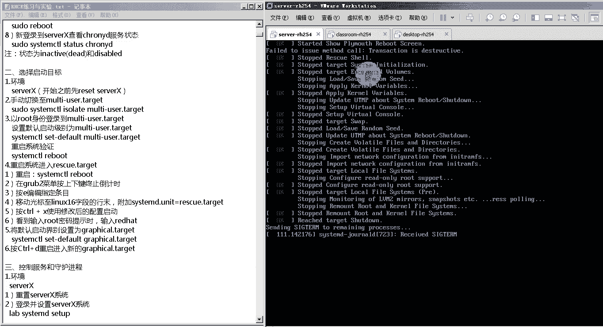
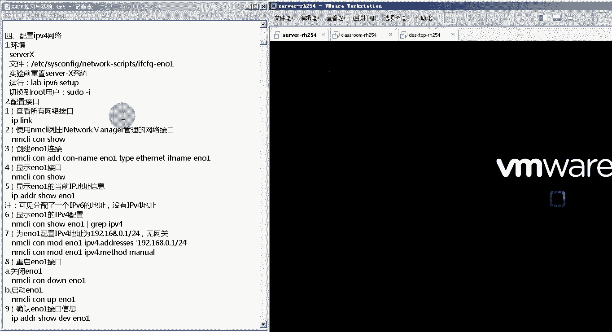

# 红帽RHCE认证考试视频 - P1：RHCE-1 - 我是冷空气 - BV1th4y1X7cC

好了，然后今天我们就开始我们这个rgc部分的，这个课程的授课了，然后今天是我们的这个第一天啊，第一天，然后第一天的话我们来看一下，先了解一下我们这个第一天的内容，主要有哪些啊，我主要有哪些。

首先第一天的话，我们先来看一下我们这个rh c e这个课程，主要学什么，然后整个的这个课程时间，课程周期是多长啊，然后这块主要分为三部分，第一部分就是这个红帽认证概述啊，就是我们学习的这个红包认证。

它由哪部分组成部分组成，然后这个红帽认证他是这个red hat公司，就红帽公司推出的一个linux的资格认证，它主要包括三块，第一块就是这个红帽认证管理员叫做i h c c。

然后红帽认证工程师叫做h c e，还有一个红帽认证架构师叫做i h c，然后这三块我们来简单看一下，首先第一块是这个i h c sa啊，这个h c s a全称就是red hat，这个验证系统管理员啊。

认证系统管理员它的主要内容是什么呢，就是第一个是管理你的文件目录文档，还有命令行的环境，第二个就是用f d s k i l v m，要实现本地存储的管理，第三个就是对你的这个系统与核心服务。

进行安装更新维护和配置，第四个是熟练创建修改删除用户与组啊，可以使用这个l d a p进行集中目录身份认证，第五就是可以熟练配置防火墙及linux，来改装系统安全，然后这几个部分。

就是咱们之前刘老师给大家上课的这个部分啊，这几个部分就是刚之前啊，刘老师给大家上课讲的这些内容，然后接下来我们的这个20c啊，全称它叫做red hat认证工程师，红帽认证工程师。

他的主要内容有以下这几个，第一个就是熟悉配置防火防规则链，与四linux安全上下文，这里的防火墙啊，用的是这个firewall防火墙，firewall防火墙，第二个就是配置静态路由包筛选。

以及网络地址转换，这也是通过这个firework来实现的，第三个就是配置这个s gz服务啊，配置s gc的服务器端与客户端，第四个编写shell脚本来批量创建，用户自动完成系统的维护任务。

所以说我们这个课程里面会涉及到一部分，shell的内容，第五部分就是配置这个http和https的网络，不当然这里边他只是在介绍里边包含那些内容，实际上这个课程里边，实际的内容要比这些内容要多啊。

这个下边我们给大家想介绍，第三个部分就是这个rgca啊，全程叫做red hat认证的架构师啊，真正证架构师它的主要内容包含这五部分，第一个就是红帽的微型服务管理，第二个就是虹猫系统集群的搭建。

第三个就是红帽的虚拟化，第四个就是这个系统性能调优，第五个就是红帽云系统的安装搭建与维护，然后这个课程我们现在是没有的，但是这个已经在准备中了，已经在准备中了啊，敬请期待，如果以后有这个需求的话。

我们也可以考这个r h c a的这么一个认证啊，这么一个认证，这是他的这三块认证啊，就是i c s i h c s a h c e和h c，这个我们已经结束了的是i h c c。

接下来将要进行的是r h c e h z e，那我们这个i h c e课程里边，它主要有哪些内容呢，它总共分了11课时啊，11课时，这11课时分别是，第一课是使用system d管理服务和守护进程啊。

重点就在于你的这个服务开机自启，还有服务的启动以及服务状态的查看等等等等，第二个就是使用nm c l y这个命令，来配置ipv 6的网络，配置ipv的网络呃，这个其实他没有什么特别复杂的地方。

它主要是用n m c y这个命令，来配置一个i p v6 的地址啊，给你一个链接，配个p6 的地址，然后让两台主机可以通过ipv 6的地址通信，就ok了，第三个是使用n m c l y这个命令。

来指链路聚合跟桥接啊，这个链路聚合这个是比较重要的一个考点，指的是把多块网，把多块网卡集合成一块网卡啊，第四个是使用firewall gucmd这个命令，和selinux来配置网络安全啊。

就是允许哪些服务对外这个开放端口啊，哪些服务不允许通信，第五个就是通过这个un bond来配置缓存dns啊，这个不涉及主dns服务器的搭建，主要是一个缓存dns和dns转发。

第六个就是使用post fix，来配置电子邮件服务器啊，这个是我们的一个重点啊，包括配置这个post fix电子邮件服务器，还有就是配置这个post fix，电子邮件服务器的空客户端。

第七个就是配置ice gari，包括它的服务器端，还有它的客户端，第八个就是一支nfs和sa的目录共享，目录共享，包括这个sub的多目录挂载啊，多用户挂载，包括你的这个nfs啊，他的这个认证。

第九个是安装和管理马瑞尔db啊，这是一个数据库管理系统啊，我们要对它有一个最初步的了解，掌握它的最基本的使用方式，第八个就是配置阿帕奇web服务器，这个是内容比较多的一张。

也是考试里面占的比重比较大的一章，第11个就是编写shell脚本啊，通过shell脚本实现批量创建，批量创建，或者是对系统的一些批量管理等等，第12个就是标linux容器技术docker啊。

这个第12课这个考试的时候基本上不会考啊，也可以看到他这个标题就是了解，然后这个课程内容，基本上就是我们整个rh c e考试里边，所有的重点内容，当然除了第12章啊，除了第12章以外，是所有的重点内容。

也是必考的内容啊，也是必考内容，这里边唯一就是这个缓存呃，转发dns这个可能考的不是特别频繁啊，剩下的都是必考内容啊，所以说呃大家伙每天如果这个有时间的话，一定要跟着咱们一块学习啊，如果没有时间的话。

比如说公司忙，有事的话，这个尽量尽量把每天的这个视频看一下，因为我们视频里边包含了一个比较重要的内容，就是每一天都会有一个验证练习，然后通过这个练习，我们可以把我们这个课程里面的重点掌握了。

然后通过这个练习，也可以为我们后边的这个i h c e的考试，各个小题打好基础啊，打好基础，所以说这个待会有时间一定要看啊，呃另外这个我们每天的视频，也给大家做一个什么呢，作为一个这么一个参考啊。

就是当你自己在做这些实验的时候，做不出来的时候，通过这个视频来回放来回顾一下，看看这个实验的关键点点啊，自己这个容易出错的点在哪里，第三个是我们这个课程周期，我们这个课程周期是这样的，每天两个小时啊。

两个课时课时不是两个小时，大概是一个半小时左右吧，大概是一个半小时左右，然后这个课程周期大概是十天啊，大概十天包含周六啊，包含周六，这样的话也就是说我们今天是周三，预计会在下周的下周六啊。

如果是正常进度的话，预计会在下周的下周六结束，然后这个课程时间相对来说是比较紧张，所以说嗯大家伙每天定照着视频，把这个实验给好好的做一做啊，把实验给好好做一做，然后为我们后边的这个20c一的考试。

大家一个良好的，好了，这是第一个第一章，我们这个24的一个介绍，然后第二个呃，我们要给大家简单介绍一下，我们这个h c e它的这个练习环境，如果这个练习环境搞不懂的话，这个大家伙在做实验的时候。

经常会出现各种各样的问题，我们给大家准备了两套环境，这两套环境应该都可以在我们这个群里下载，一套是三台虚拟机，三台虚拟机，这三台虚拟机分别是classroom rh，254和server guart。

254和dex top art 254，然后另外还有一个集成环境，叫做hc e七点杠exam，这个r h c e七点杠exam，这个环境里边它会有一套试题啊。

它会有一套试题，然后我们可以按照那套试题啊，然后来完成试题里面的内容，然后还可以通过脚本来做测试啊，这个是我们后期的一个内容，然后我们前期这个课程里面，主要涉及的就是这三台虚拟机。

分别是classroom杠h254 ，server杠h2 和desktop杠h4 ，那首先我们需要理清的就是这三台虚拟机，它们之间的关系啊，这个是特别重要的啊，很多同学就是因为这三台虚拟机之间的关系。

理不清，导致你在做实验的时候，出现各种各样稀奇古怪的问题啊，我们来简单来说一下啊，简单来说一下，首先这三台虚拟机他们在网络上是互通的啊，网络在互通的最重要的就是我们这个第一台。

也就是这个叫做classroom，classroom杠r h254524 ，在这个classroom杠h254 上面都有哪些东西呢，为什么说它比较重要呢，是这样的，首先第一个在这个上面有很多服务。

比较重要的服务，第一个服务就是它里边有一个dh cp服务，这个dh cp服务是为我们的这个server啊，h254 ，和，dex desktop，desktop杠2h254 。

为这两台机器分配ip地址等网络参数啊，等网络参数，这句话翻译过来是什么意思，就是大家伙在准备实验环境的时候，你现在不是有三台虚拟机吗，我应该先启动哪台虚拟机呢，一定要先启动这个rom。

这台虚拟机只有先启动，另外来机器，才可以通过它获取到ip地址等这些参数啊，要不然的话你获取不到，获取不到的时候，做实验就会出现问题，这是第一个，第二个就是classroom。

杠h254 上还会有这个我们的dns服啊，dns服它是为我们的这个server，杠h254 和desk top，港rh 254，提供了一个域名解析服务，渔名解析服，这里大家伙需要注意一点。

就是可能有些同学已经看过，那个hc的教材了啊，但在教材里边他在配置的时候，在你的这个环境里面配置的时候，经常，啊这哪个同学，这个这个这个这个麦克风没有关啊，关一下啊，这个要不然这个我们声音听不到了啊。

好了，然后我们的这台classroom杠h254 ，还为我们的这个server杠h254 ，和desktop 2 h254 提供了一个域名解析服务，域名解析服务，然后这里大家伙注意啊。

就是很多同学已经看到这个r这个r h c e，这个教材了，但在这个教材里边写的很多服务，他都说是server x和dex top x，然后我们现在这个环境你注意啊，要知道我们现在这两台server。

杠h254 和deco 254，它在里边主机名是什么，其中这个server杠rh 254，它的主机名是server 0，然后我们的这个desktop杠rh 254。

他在这里边的主机名是dex desktop 0啊，这个是需要注意的啊，这是需要注意的是第二个，然后第三个它还有一个功能，它里边包含了一些验证用到的文件，及网页文件啊，验证文件和网页文件，当我们做到一些。

比如说这个nfs呀，300啊，http啊，h t t p s啊，这些个实验的时候，需要从我们这个classroom上边，下载这些个验证用的文件，还有这些个网页文件啊。

所以说这就是这个classroom杠h254 啊，它的一个功能，它的一个功能，然后他的这个ip地址啊，在我们现在这个实验环境里边，他应该是需要72。二五点点254啊，应该是172。二五点点254。

这是它的一个ip地址，第二台机器叫做server杠r h54 啊，server杠h s，然后我们刚才说了，它的主机名实际上是server 0，它的主机名实际上是server 0，这个是作为什么呢。

是作为一个服务器端，做一个服务器端，就是我们做很多实验的时候啊，我们做很多实验的时候呃，都是这种cs架构的服务啊，比如说什么nfs sa h g d p等等，然后他需要一个服务器端和客户端。

大多数的情况下，我们这个server 0是作为这个服务器端来使用的啊，他的这个ip地址在我们这个环境里边，是172。二五点点110。1，第三台机器就是这个desk top杠h4 。

desktop杠二加入四，然后他的这个主机名咱们刚才也提到了，他的主机名是dex desktop 0啊，desktop 0，它是在一些cs架构的这种服务中，作为这个客户端，作为客户端来使用的。

也是我们在server领上搭建的一些服务，需要在desktop 0上来进行认证啊进行，然后他的ip地址在我们当前这个环境下，它是1721。二五点点100。10，这个就是我们的这么一个环境啊。

这个就是我们这么一个环境，所以说大家伙要先把这个环境给理清啊，大家伙要先把这个环境给理清，然后这三台虚拟机里边，我们进行最多操作的，就是在这个server gun h254 和dex top。

gun h254 上啊，server杠h254 和desktop杠h254 是，然后我们的这个classroom杠h254 这台机器，我们只要保证它是最先开启的就ok了，无需在上面进行任何其他的配置。

无需在上面进行任何其他的配置，然后我们在做很多实验的时候要注意啊，我们在准备实验环境的时候，通常会运行一些脚本啊，比如说lib什么lab set up，后边加上这个实验的名字，然后当你实验做完了之后。

你需要运行lab grade，然后边加上这个实验名字，这种脚本来自于进行验证，所以说这个大家伙也要清楚这个后边，当然我们在做到具体的实验的时候，大家伙可以看一下，就明白了，但是现在先有这么一个概念。

就是我们在准备某些实验环境的时候，需要运行这个脚本来准备实验环境，运行完这个脚本之后，你的系统会自动帮你把实验环境准备好，你就可以在当前的这个环境下进行实验，当你这个实验这个已经做完了之后。

你想对实验结果进行一个测试啊，那就用下边这条命令好了，这个就是我们给大家介绍的，这三台虚拟机之间的关系啊，这三台虚拟机的关系，然后在做实验的时候，希望大家伙在做每一个实验之前，都要把虚拟机给它。

还原成它最初始的这个状态啊，通过还原这个寻机快照啊，来还原它最初始的状态，好还原完状态初始状态之后，然后我们再来进行实验啊，这个大家伙一定得注意，然后这三台虚拟机，还有我们刚才说的那个集成环境。

在我们的这个群的分享里边，应该都能找到下载的方式啊，大伙可以自己去下载就ok了好了，这个是我们20cd的这个实验环境啊，大家一定要把这个实验环境给弄明白，呃那接下来我们就来看一下。

我们今天的这个课程内容啊，在看课程内容之前，因为我在做这些实验的时候，都是在我的这个vm workstation上去做的，我这个电脑相对来说稍微有点慢啊。

所以说我先把它开起来啊，省的一会儿再开。

好了，接下来我们来看一下我们今天的这个内容，今天第一个内容就是system c t l这个命令的使用，system c t l这个命令的使用这个system ctrl这个命令。

它是我们的这个linux系统最高进程，system d提供的一个命令，这个命令主要功能是什么，就是管理系统进程和服务啊，管理系统进程客服，这个我们在考试的时候，其实主要就是使用这个命令。

来管理我们的服务啊，当你搭建好了一个服务之后，你要启动服务，当你搭建好了一个服务之后，你可能要查看这个服务的状态啊，查看服务的状态，或者你重新编辑了它的配置文件，要重启服务，或者把它设置成开机自启等等。

那这些所有的都是通过system c t l，这个命令来使用的，那这个命令的格式是什么样的，是这样的，它是system c t l，后面加上你要执行的动作，后面加上你的目标单元啊，你的目标单元在这里边。

我们首先就要明白了解他这个动作都有哪些啊，动作主要有以下这些啊，首先这个status servitors，这个是查看你服务的状态，这个是特别有用的，特别是当大家伙在配置好一个服务之后。

然后这个满心欢喜的system ctrl start来启动这个服务，结果发现诶服务启动失败了，那这个时候怎么办呢，你就要system ctrl status来查看服务的状态啊，所以说这个是特别有用的。

第二个是stop是停止的意思，把一个服务给停止掉，第三个start就是把这个服务给开起来，第四个restart，restart就是重启服务，restart通常用在什么环境下呢。

就是你更改了这个服务的配置文件，第五个reload是重新加载配置文件啊，reload它跟restart有什么不一样的呢，就是reload操作的话，它会重新加载配置文件，但是你restart的话。

它会重新启动你的服务，什么意思呢，也就是说如果你是system c t l restart，后面加上一个服务的话，那实际上他是先把这个服务给stop了，再把它给start。

但是reload的话他就没有这个stop再start的这个过程，他就直接重新加载配置文件了啊，所以说这两个命令用哪个都可以，然后mask是彻底禁用服务啊，彻底进服，实际上它是将你的服务的这个。

启动文件给关联到d e v下的a u l l，那个特殊的设备文件里边的，就相当于将那个服务的文件给删除了，然后on mask是取消对这个服务的禁用啊，其实就是删除了一个链接。

因为a宝这个是特别特别重要的啊，是设置服务开机自启，这个也是我们的这个重重中之重，因为我们在做这个二gc e考试的时候，很多题啊，几乎是所有的题，他都要求你说这个服务是开机自启的。

所以说用哪一个动作啊来让它开机自启呢，就是引爆这个，然后如果禁止他开一次企业，就是disable disable，还有一个就是list dependence啊，这个是列出跟这个服务相关联的unit啊。

这个服务这个命令其实在考试的时候，一般是很少会用到啊，会少一个，第二个就是它的这个单元就是他的目标，他的目标主要有三个，第一个就是带service扩展名的服务单元，这也是我们用的最多的。

第二和第三个就是带点socket扩展名的，套接字单元和带点pass扩展名的路径单元，基本上用的特别少啊，基本上用的特别少，第三个就是如何查看一个服务的状态，这个咱们刚才给大家介绍了啊。

用system c t l这个命令查看状态的动作是status，所以这加的是status，后边还有个服务名叫s h d啊，叫s h d，这就是长按s s h d这个服务的状态，然后在显示的结果中。

你可以看到这些个关键字，不同的关键字代表着不同的含义啊，首先第一个是这个loaded的，它代表你这个单元的配置文件已经加载啊，如果他是active running，代表这个服务正在运行。

如果是active exist，代表他已经成功地完成了一次性的配置，如果是active waiting的话，代表它在运行中，但是它在等待事件的发生，如果是inactive，代表这个服务不再运行。

如果里边有enabled的，代表这个服务是跟随系统启动的，如果是disabled的，代表它不随系统启动，如果是static的话，代表它无法启动，但是可以由某一启动单元来自动启动，这个里边的内容很多。

但是我们详细关注的点，其实就关注这几个就行了，第一个就是active running代表服务正在运行，第二个就是这个inactive代表服务，它不是运行的，第三个就是引a包的跟随系统启动。

其他的基本上很少会看到啊，很少会用的好了，那第三个是我们这个system c t l，这个命令的使用啊，这个下边给大家伙列出了这个命令的常见用法，我们大致上来溜一遍啊，我们大致上来六遍。

然后一会儿我们可以通过实验啊，把这里边的重点给大家摘出来啊，大家伙只要把实验做熟就行了，第一个就是查询所有单元的状态哈，这个就是系统的c条，第二个仅查询单元服务的状态。

就是system c t l杠杠tape等于service，就是仅查询这种类型为service服务的状态，如果要查询某一个服务，具体的状态就是system ctrl status，后面加上服务名。

然后可以加杠l，这个参数如果不加杠l这个参数的话，他的很多显示结果会给你折叠起来，你看不见啊，只能看个大概，但是加上杠l可以查看详细信息，更利于我们排错啊，更利于我们排错，然后判断服务的状态。

比如说system ctrl is active，后面加上一个服务，就是判断后面的服务是否是active运行状态，然后is in a包后面加上一个服务，是判断你后面的服务是否是开机自启状态。

列出所有已经加载活动的单元的活动状态啊，就是system c t l list unit，刚刚tape等于service，是查看这种service单元就是服务他的状态。

还有就是太刚刚type service，刚刚all就是查询所有的，如果想要查看所有单元的，已启用和已禁用的设置，可以sm c t l list unit files啊，后面加上杠杠。

tape等于service，只是查看所有服务单元的启动或者禁用设置，如果想查看失败的服务，就是system cd l杠杠fail tape等于service，可以查看所有系统失败的服务。

然后查看s h d这个服务的状态呢，就是sem c t l status，刚才说了，如果查看详细内容的话，就加一个杠l参数啊，杠杆参数，然后可以通过下面的命令，来验证这个服务的运行。

比如说p s杠e l f grab，抓取一下s s h d在grape gv grip，把你之前grape的这个进程给它排除掉啊，这样的话抓取出来的就是s s h d的进程了，如果想把它停止的话。

就是stop stop，开启的话就是start啊，开启的话就是start，然后这里边需要注意的，就是我们刚才说的这个restart跟reload它的区别，如果你restart的一个服务之后。

你会发现这个服务，它所对应进程的p i d会发生变化，但是如果你reload的话，你会发现它的p i d就没有改变，然后如果你想把某一个服务给彻底屏蔽掉，就是mask取消屏蔽on mask。

比如说这里边把network这个服务给mask on mask，像禁止服务开启之前，就cm c t l disable，后面加上这个服务的名字啊，服务的名字。

然后也可以用is in a包的来查看你的这个服务，它是否是设置成禁止开机自启，然后我们的这个课程可以看到，这里边的内容其实是比较多的，但是如何快速的能够抓到这里边的重点呢。

也就是说我们考试的时候一定会用到的，这些内容呢，主要是通过我们这个实验啊，主要是通过我们的实验，然后我们已经为大家伙的准备好了，所有的实验文档，注意是我们这个二gc 1254这个课程里面，所有的实验啊。

是有这么一个实验文档啊，所有的实验都在这里边，然后这里边有一个目录，这个目录是可以用的，你直接点击就能够来到相应的实验，然后大家伙可以以这个为参考啊，做一下我们后边的这些个实验啊，做一下后面实验。

但是务必要注意啊，一定要细心啊，这个信心出现问题了的话，一定要先查你的这个实验文档，看看你做的这些个东西，跟实验文档上一致不一致，如果这个实验文档你发现查不出什么问题来，那可能是你的步骤有问题。

这个时候你可以看我们的这个实验视频啊，我们的这个实验视频，然后这个一会儿我会给他发到群里啊，发到群里好了，那接下来我们来看一下，我们今天的第一个实验啊，第一个实验。

第一个实验就是使用system c t l这个命令，来管理服务啊，来管理服务啊，那接下来我们来做一下这个实验做下，然后我们可以看到他的这个要求啊。

他的要求是我们用的环境是server x啊，server x系统，这个server x是哪一个，咱们刚才已经给大家伙介绍了，在咱们这个环境里面用的是什么呢，就是这台server gui h254 。

他虽然写的是server x，但是我们这个机器它的主机名并不是server x，而是刚才我们说过的server 0啊，这一定要注意啊，一定要注意，首先重置server 0系统，我们刚才已经还原快照了。

所以现在我们直接登录就行了，登录的时候大家可不可以用这个root账户登录啊，防止由于权限问题造成这个实验有问题，然后它的密码就是red hat，然后就是红帽red hat。

好了，然后我们这个实验第一个实验是什么呢，是观察一下system ctrl restart和system ctrl reload，这个命令的结果啊，那我们现在来看一下这个实验，我们现在在桌面上右键。

然后选择打开终端啊，open in terminal，打开终端。

注意在桌面空白处右键，然后打开终端，哎，在这里大家一会就可以看到，可以看到我们当前这个主机名叫做server 0，叫做server 0，你可以用host name这个命令去查看。

可以看到它的主机名是server 0，点example com example com好了，那接下来我们来进行一下实验，首先我们先查看s s h d这个服务的状态，然后来看一下它的p i d啊。

让我们来看一下c什么c条，status s h d，注意啊，因为我们刚才是用root用户登录的，所以说你不用打这个速度命令，就可以直接输入这个命令啊，如果你是用普通用户。

比如说刚才你是用student这个用户登录的话，那你可能要大速度这个命令，但是我们刚才是用root用户登录的，所以你不需要打速度这个命令啊，直接敲就可以了，在这里边我们可以看一下它的输出结果啊。

首先第一个啊我们需要看的就是他的这个状态，可以看到他现在的状态是active running，也就代表它是运行状态啊，它是运行状态，第二个在我们这个loaded的这一行里边，我们可以看到啊。

后边是你的这个服务，它的文件，这个服务文件后边是引a包的，就代表这个服务它是开机自启啊，开机自启，也就是说你系统启动的时候，你的s s h d，这个服务就会跟随系统一起启动啊，一起启动好了。

我们看一下这个服务的p i d，可以看到这个服务的p i d是1585啊，1585好了，那接下来我们运行一个命令啊，这样的话我们为了突出效果，我们再重新打开一个终端，我们在新打开的终端里边干嘛呢。

我们对我们的这个s s h d这个服务，来进行重启哈，system c t l那就是restart，restart start，启动restart重启s s h e重启之后，我们再来查一下他的状态。

那就是system c t l status and sd，诶，我们可以看到他的p i d，已经从刚才大一585变成了现在的2898，2898，这说明了一个什么问题呢。

也就说明当我们敲这个system ctrl，restart这个命令的时候，实际上他是先将你的这个ssh这个服务给它关掉，然后再重新启动，所以在服务重新启动的时候，系统会给他分配一个新的pad。

所以他的p i d号就已经变了好了，那接下来我们再试一下这个reload这个命令，我们看看reload这个命令它的p i d会不会变，那现在我们看到正在运行的s s h d。

这个服务的p i d是2898，我们再打开一个终端，然后在这个新终端里边，我们system c t l reload重新加载服务的配置文件，这种方式来重启s h e，重启之后我们再来查看这个服务的状态。

liters s h d诶，我们可以看到它的p i d还是2898，2898，也就说他的p i p没有变，这个就是我们的这个嗯restart，还有我们这个reload的区别啊，restart的主要区别。

那有同学可能会有疑问，但是我在考试的时候，我是用restart还是reload呃，建议就都用restart就ok了，只要你更改为服务的配置文件，建议就用start就可，因为他的这个pad发生改变。

并不会对你这个服务有什么影响，但是注意啊，有一些特殊的服务可能不能用restart，只能用reload啊，比如说我们后面要介绍的那个firewall，firewall，那我们介绍的那一刻的时候再讲好了。

第三个小实验是设置服务是否开机自启，这里边它用来做测试的这个服务是这个服啊，这个服务是一个本地的n t p的这么一个服务，那现在我们先来看一下这个服务当前的状态啊。

system c t l status，可以看到这个服务的状态，首先在第一行这个啊，这不是第一行，第二行了是吧，在ldate这一行可以看到它后边是引a包的，代表这个服务是开机自启的。

然后在active这块可以看到它的状态是active running，active running代表他现在正在启动，正在行好了，那我们现在把这个服务给它停止掉，然后再来查他的状态啊。

这就是cm ctrl stop，stop了之后再来查询它的状态啊，sem c t l status，然后我们可以看到刚才他是active状态，现在变成了in active状态啊。

in active状态啊，这就说明这个服务现在已经把它给停止掉了，然后大家伙注意啊，可以看到它下边有一些这个服务，它对应的输出结果，这些输出结果由于它的这个内容比较多，所以它中间都用点点点给你代替了。

如果你想查看到详细信息的话，我们只需要在刚才这个命令后面加一个杠l啊，杠然后杠完这个参数，注意大家伙啊，它可以在你的这个命令最后加啊，也可以在你的服务之前加，就是把它加在这里也可以。

也就是说他这个位置在服务前和服务后，都是可以的啊，在这里边就能查看它的详细信息了啊，刚才这一行，但是这个缩减成一行，现在就可以看到两行的详细信息，好了嗯，虽然这个服务已经把它停止掉了。

但是我们要看一下这个服务，它设计是否是一个开机自启的服，所以我们system c t l叫a杠inable，后面加上这个服务的名字，我们可以看到他给我返回的结果，就是你a包的这个。

实际上你用了这个命令查询的就是，这个第二行后边的这个状态啊，这个状态如果是引爆，你用这个命令查的就是引爆，如果这个状态是disabled的，那你的这个就是disabled好了，那如果他是以a包的状态。

这个咱们刚才给大家伙介绍了，也就证明说我这个服务它是开机自启的，也就是说系统在启动的时候，这个服务会跟着系统一起启动啊，那我们来试一下，看看是否是这样的啊，我们现在可以看到这个服务当前的状态。

啊当前的状态他现在是这个不是运行状态啊，是停止状态，那我们现在来启动一下系统，看我们这个服务是否会跟随系统一起，当大家伙在敲命令的时候，建议大家伙可以多用payable键，这样的话可以提高你的输入速度。

然后你再输入一些服务的这个，守护进程名的时候，可能你用table都会推出点service，这个有没有点service都是一样的，效果都是一样的，所以大伙不用在这个上面纠结好了，那下面我们来重启一下服务。

看看我们的这个服务，会不会跟随我们的系统来开机自启啊。

但是这个时候就比较纠结了。

因为我的电脑比较慢啊，所以说这可能需要一点时间。

真的是非常的慢。

这个让它启动着，咱简单再说一下这个课后实验与练习，这个2x254这本书的课后实验与练习。

总共是有42个实验，所以说我们需要在十天的时间里，把这42个实验全部都搞定了，就是大家伙这个一定要对照视频，然后对照我发给大家伙的这个实验文档，把每个实验这个都多做几遍。

当你把这些实验都做的特别成熟的话，那你在准备你的那个20c一考试的时候，就会特别简单，这个其实主要就是一个熟练度的问题好了，那我们现在登录一下啊，用root账户登录。

好了现在我们的系统已经重启了，那接下来我们来看一下，我们刚才那个跟随系统启动的服务，它是否真的跟随系统启动了，那我们就system ctrl status是，哎可以看到确实啊。

他已经跟随我们的系统启动了，就是在系统启动的时候，他就也跟着起来了啊，跟着起来了，那如果我不想让它跟随系统启动的话，我们只需要设置它的参数，把这个引爆的变成disable，就可以禁止它跟随系统启动了。

那个怎么设置呢，那就是system c t l disable啊，后边加上你这个服务的名字，好了之后我们再来查看我们这个服务的状态，我们可以看到，虽然这个服务它当前的状态是运行状态。

但是在这个第二行loaded这一行里边，可以看到最后这块已经变成da包的了，然后我们还是通过我们刚才这个命令，来看一下它是否开机自启，那就是system c t l is ginable。

后边跟上你的这个服务名，诶，可以看到它这块已经显示第四一报德了啊，这个因为刚才咱给大家介绍了这个命令，实际上查的就是你的这个服务，它第二行最后的这个状态，他是disabled。

就代表这个服务它在系统启动的时候，不会跟随系统一起启动，接下来我们再来重启系统来测试一下reboot。

好了经过漫长的等待，终于重启成功了啊，那接下来我们来输入我们的这个root账号，和它对应的密码，这个太慢了。

如果大家伙的这个电脑是固态硬盘的话，应该会比我这个好很多啊，另外如果大家伙的电脑像我的一样慢，甚至比我的更慢的话。

那大伙可以特别是我们需要参加考试的同学啊，你们可以，这个在我们这个周六周日来我们学校练习好了，那接下来我们再来看一下，我们当前那个服务的状态啊，status。

诶可以看到它当前的状态是inactive dead啊，原因就是我们这个服务，我们把它设置成disabled的，它就不会跟随你系统启动而启动，虽然在系统启动之前，它是开启状态，但是在我重启系统之后。

系统启动了啊，他就没有跟随启动啊，到这儿我们的这个实验就结束了，所以说第一个这个小实验，它主要是这个给大家这个验证了三个事，第一个是什么呢，就是通过status这个命令来查看服务的状态。

第二是就是这个restart和reload，他们俩之间的一个区别，第三个就是我们设置这个服务，开机企和禁止它开机自启，它的这个效果是什么，好了，这就是我们今天的第一个小实验啊。

接下来看一下我们今天的第二个内容，第二个内容是我们这个system c t l，它来修改系统级别啊，修改系统的这个运行级别，那首先第一个你要知道我们这个linux操作系统，它都有哪些常用的运行级别。

注意这里说的不是所有运行级别，而是常用的运行级别，主要是包括这四个，第一个叫做graphical。target，这是一个多用户的图形化界面啊，图形化界面这个我们之前在学校学习过的同学。

可以应该是有一些印象啊，就是我们之前在讲系统运行级别的时候说了，他有0~67个运行级别，这个graphic大概的实际上就是五个运行级别，也就是我们的一个多用户图形化运行级别啊，多用户图形化学级别啊。

那我们现在这个环境，实际上它就是一个多用户图形化的级别，也就是说当前他就处于graphic target这个状态，第二个是这个multi user target，它是一个多用户的字符界面啊。

都用的字符界面啊，就是说它是没有这个图形化界面的啊，只有一个这个shell环境让你输入命令，这个也是我们以后在日常工作组里边，用的最多的一个级别啊，这个对应的就是那个三运行级别。

第三个就是rescular，他改的这个是一个这个rescue，就是急救的意思啊，急救模式啊，急救模式这个通常急救模式有点类似于什么呢，就相当于我们windows的那个pe系统一样。

当你的linux操作系统出现问题的话，你可以通过这个rescue。target这个模式啊，来对系统进行修复，最后一个叫emergency target啊，这个是救援的意思啊。

救援这种模式通常在什么环境下会进入呢，就是当我们系统的这个出现一些问题的时候，会进入到它，这比如说这个大家伙在24里面都学过啊，啊20cc里面学过这个，我们etc下有个f s t b这个文件啊。

f s t v6 这个文件里面记录的是什么呢，就是我们系统需要挂载的这个文件，系统以及它挂载的相关信息，那如果这个配置文件编辑错了的话，系统在启动的时候，它会读取这个文件，结果发现这个文件里的错误。

导致了系统在启动的过程中就卡到了这一步，这个时候就会进入到这个级别啊，到了这个级别里面，那进入到这个级别里面怎么办呢，你只要跟随他的提示对系统进行修复就行了，一般情况下。

它的提示会让你输入当前系统账户的root密码，当然你输入人这个mt root密码之后，就可以进入这个模式下，就可以了好了，第二个是查看关联的unit，这些个建议大家了解就可以了，建议大家了解就行了啊。

因为真正在考试的时候基本上用不到，里面用不到，首先第一个查看依赖于graphic target的其他tk，也就是说，哪些target是必须在graphic target已经启动的模式下。

换句话说哪些其他的target是在图形化界面下啊，作为基础的，那就是system c t l list dependence，dependence就是依赖的啊，graphic target。

然后在所有的中里边你可以抓取一下great target啊，great target抓取一下这个target的相关信息，第二个是查看所有可用的就是list unit，杠杠，tape等于tan的杠凹。

第三个是查看所有安装的target的文件，那就是list gunit gfs，杠杠tape等于tk的杠，第四个就是用so late命令来临时切换，当前系统的运行，park的这个相对来说还是比较有用的。

它可以做到你这个系统的切换啊，这个咱们可以简单给大家试一下，虽然我这个特别慢啊，但是还能看效果的啊，比如说我现在csm c t l i s o late，我把它切换到字符界面。

那就是multi杠user点大概回车。

这样的话他就来到我们这个字符界面啊，字符界面啊，如果我把想把它切回到图形界面的话，那我们就输入system c t l i s o late graphical，点他改诶。

这样的话又切回到图层图形化界面了，这个就是它的一个应用化。

然后第五个这个用的相对来说也比较多吧，这个是查看当前系统默认的启动级别。

这个启动级别待会儿一定要注意啊，它指的是什么，指的是系统在启动的时候，它会自动在哪一种级别下运行啊。

是图形化还是字符啊，这个是用的是csm c t l get down default，如果你想设置的话，那就是set杠default啊，这样的话就可以对进行设置了。

后面可以跟上你的这个目标target的，然后这里大家伙一定得注意啊，这个默认启动级别和你系统当前运行级别，说的不是一个事儿啊，说的不是一个事儿，你的系统启动级别是指，当你的这个操作系统在启动的时候。

它运行在哪一个级别，然后你当前运行级别跟你的这个系统的默认，启动级别啊，它不是可能不是同一个级别，所以说这两个大家伙一定要把它给区分开来，第七个就是除了采用这个iso late啊，这种方式。

你也可以采用这种方式，来切换当前系统的运行级别，比如说我当年系统是在这种图形化呀，或者是字符界面下，我把它切换到rescular打开的，那怎么办呢，第一步重启系统啊，重启系统的时候。

它会出现一个group菜单啊，在graph菜单的时候按上下键取消倒计时，然后把光标移到你需要启动条目上，按e编辑这个条目之后，找到这个linux 16开头的号啊，这一行实际上就是加载内核的这一行。

在最后附加上这么一句，就是system d。unit，后面加上你想要进入的运行级别，然后按ctrl加x是更改生效之后，你就可以进入到你这个运行级别了，这个呃用的也不是特别多啊。

考试的时候考的也不是特别多啊，也不是特别多，这个就是这个第二个就是重置root密码，这个应该大家伙在学那个rh cs的时候，已经都做过了啊，已经都做过了，这个我昨天晚上在群里还看到有同学在问啊。

有同学在问这个问题啊，这个重置入的密码实际上它是有两种方法的，第一种方法就是通过grab to菜单来重置，然后第二种方法就是通过我们的那个系统，安装光盘或者是iso文件，在安装界面的时候。

他有一个传播出品，通过那个可以进行修改这个重置root密码，这种操作其实一般在工作中很少会用的啊，只有当一些特殊环境，比如说确实是忘记了他的root密码，或者是你跟其他同事这个进行一下交接，交接的时候。

这个不知道这个系统当前的root密码了，可能需要这个操作，可能需要这个操作，让我们简单来看一下它这个过程啊，这个我们就不给大家演示了啊，呃首先重启系统，重启系统，然后在grab to菜单出现的时候。

还是按照上下键取消倒计时之后，把你的光标移动到需要启动的条目上，ae编辑条目还是找到这个linux 16开头的行啊，就是加载内核的这个1号，然后在最后一行加上一个rd。break就行了。

但是这里边有一个特别需要大家注意的地方。

一定是一定要注意啊，在做的实验，因为我们当前的这个实验环境，它是一个图形化界面环境，所以说在图形化界面环境下。

除了要附加rd。break以外，还要加一个console等于ttl 0，这样的话才能继续生效啊，昨天有同学遇到的这个问题，可能就是由于这个原因导致的啊，你没有加这个，没有加这个的时候。

你按这个ctrl加x哎你发现它卡在那里了，不动了啊，原因就是这个，然后就会显示出一个这个shell环境啊，在shell环境里边你需要重新挂载跟分区，因为我们当前的根本区。

就是你按照这种方式的开始开启你系统的时候，它的根分区实际上是以只读方式挂载的，那只读方式挂载的话，我们没办法通过命令修改，跟分区里边文件的内容，所以我们需要重新挂载，那就是m啊。

杠o来指定你挂载的这个权限啊，remt重新挂载rw就是以读写方式挂在后面，加上你的这个根本区c root，然后趁着root切换到跟分区里边，就可以重置root密码了啊，这里需要注意的就是。

因为我们当前所有的系统都默认开启了selinux，所以你要touch一个在它的根下插，是一个点auto reliable reliable的这么一个文件，这样的话可以保证所有的文件在启动的过程中。

都会重新获得这个selinux标记啊，才能生效，然后再推出你的这个禁止root就ok了啊，root就ok了，这个就是重置root密码啊，但是我们今天就不给大家来演示了啊，不给大家演示了。

因为这个之前应该是在cs里边讲过，如果大家伙有需求的话，比如说很多人他很多同学啊，他都做不出来的话，那咱们可以到时候单独给大家再演示一下，第三个就是诊断和修复cmd启动的问题啊。

有些时候我们这个系统它可能会启动不起来，启动不起来怎么办呢，通过这几种方式来进行修复，第一种就是你得通过一个debug share，来对系统进行修复，这个debushell就是你运行这个命令。

叫做sm c t l enable debug share之后，你会多出一个t t y9 的这么一个本地终端啊，本地终端，这个我们之前介绍过我们的这个linux本地终端，它可以按alt键啊。

就是a r t加f一到f6 ，有六个本地终端啊，你开启了这个debug shell的话，就为他它就会新开启一个，t y9 的这么一个终端，然后在这个终端里边，你可以通过一些调试命令来对系统进行调试。

第二个就是紧急模式和救援模式，紧急模式怎么进入，这个可以按照我们上面的方法，在grab菜单里边进进机模式或者救援模式啊，救援模式也可以采用这种方式进入啊，另外就是咱们刚才说的。

如果你系统的一些关键性的配置文件，比如说e t e t c的f s t b文件，编辑有问题的话，它会自动进入这个emergency target emeria，第三个就是系统可能会由于这个阻塞作业啊。

阻塞作业导致这个系统启动失败啊，启动失败，那这个时候可以用这个system c t l list jobs，来查看我们这个作业，查看我们的作业好了，这个就是我们的这个system c t l这个命令。

的一些其他的用法，那我们来看一下，这里边有哪些需要我们掌握的一些关键用法，我们来看一下我们的第二个小实验，第二个小实验就是选择我们的启动目标啊。

选择我们的启动目标发展，首先实验环境还是用我们的这个server x啊，server x开始之前请reset server x就把它给重置一下，这个由于时间关系我们就不重置了啊，由于时间关系。

但是注意啊，我这个是由于为了这个这个这个这个不浪费，过于浪费时间啊，大家伙在做这个实验的时候，你还是该还原快照，一定要记得还原快照啊，我在这我就不还原了啊。

不管还是这里的server x指的就是我们这个server杠，h24 ，也就是server 0这台机器好了。

那接下来我们来看一下啊，首先我们当前的这个运行级别是图形化级别，是图形化级别，然后我们现在啊，手动把它切换到我们的这个字符级别啊，那就是system c t l，咱们刚才用的这个命令。

i so late，图形化这个字符级别叫做multu，12点发这个你敲到m u l的时候，沿table键就可以自动把它保出来。

好了，回头哎，我们可以看到它已经切换到这个字符级别了啊，切换到字符级别，切换到字符级别之后，我们来登录到这个字符级别上啊，这个密码输错了，sorry，然后我们来查看一下，我当前系统的默认启动级别。

那就是system c t l，让default可以看到它的默认启动级别是graphic，arta，也就是说当我系统重启的时候，会自动进入到我们的图形化界面啊，图形化界面。

那如果现在我不想让我的这个系统，进入到图形化界面，我现在想让我的这个系统进行到什么呢，进行到这个系统在重启的时候，自动进入到我们当前这种字符界面，那这个时候怎么办。

我就可以用system c t l site杠default，这个default就是默认启动级别的意思，get就是获取默认启动级别，set就是设置默认启动级别，所以说这个还是比较好记的，叫做。

哎这样的话我们再用system c t l get杠default，这个命令来查询的时候，可以看到，当前的系统默认启动级别已经变成了multiuser tt，也就是说当我们重启系统之后。

我们的系统会进入我们当前的这种字符，运行级别啊，那我们可以试一下，你可以用system c t l reboot这个命令，或者直接rebot啊，这个都可以回正，速度有些慢啊，好了现在系统已经启动起来了。

大家伙儿可以看到啊，我们当前自动进入了我们的这个什么级别啊，就是我们那个multi user多用户级别，就是我默认的这个字符级别啊，字符级别好了，那接下来我们重新再把系统的这个级别啊。

我们重新再把我们这个系统的默认级别，设置成我们的图形化级别啊，那这个怎么设置呢，首先我们先进入我们这个rescuer tk，也就是我们的急救模式来进行设置，那怎么进入急救模式呢，首先我们登录系统。

登录系统之后，我们重启系统reboot，哎注意在这一步的时候弹出的这个菜单，我们把它称为叫做grab to菜单，grab to菜单rosetter，这个大家伙。

应该在这个h c s a课程里面的那个系统，启动与排骨啊，启动启动与排骨那个相关章节的时候，应该是了解过是吧，好了，在这个grab菜单里边，我们选择我们需要进入的系统啊。

我们需要进入的系统就是我们上面这个系统啊，上面这个系统在上面这个系统里边，我们按什么呢，按e啊，编辑它，然后往下啊，移动鼠标找到linux 16字段啊，这个linux 6字实际上它是一个系统命令。

这个系统命令是加载后边的这个内核，这个内核就是这根线的boss下的vm linux z啊，这一长串这个文件，然后后边是它挂载的这个分区的相关信息啊，相关信息，然后我们找到这一行，在这一行文件的末尾啊。

文件的末尾添加一个system d。unit等于rescue，第二他给他，然后这个没有什么窍门，大家伙需要注意的一点，就是你在做这个实验的时候，千万别把命令打错了就ok了啊，千万不要命令打错了就好了。

修改完成之后按ctrl加x，这样的话，它就会按照我们刚才修改的这个graph to，菜单里面的条目去加载内核，那我们刚才这个声效，我们刚才的这个修改的内容，就会在内核加载的过程中生效了啊，ctrl加x。

哎我们现在已经进入到我们这个rescue啊，这个模式下了，在这里边提示了，大家说请输入当前root密码来进行维护啊，那我们现在输入我们的root密码啊，叫rider hat，好了。

然后我们获取到一个shell，在这个shell里面，我们再把我们系统的默认启动级别，注意是启动级别设置成我们的图形化级别，那就是csm c t l site杠default，graphical。

也是他给的graphic，好了之后，我们再来查看一下啊，那就是csm c t l get gun default，哎，确认一下，确实，现在它的系统默认启动级别变成了graphic text。

那接下来我们来重启系统，在重启系统的时候，当然这里边你也可以按这个快捷键ctrl加d，在重启系统的这个过程中啊，我们系统会重新启动，重新启动之后进入的就是我们的图形化界面，让我们来试一下。

他这个好慢啊，诶好了啊，现在已经进来了啊，进来了之后我们可以看到它是一个图形界面，这个我们其实登录不登录无所谓了，这已经显示了是一个图形界面，这个就是我们设置系统的这个默认启动级别的。

这么一个小实验，好，接下来是我们这个system c t l最后的一个实验，就是控制服务和守护进程，这个实验跟我们上面的实验就不一样了啊，因为我们的这个是r h c e练习与实验，这种都是练习啊。

这种都是练习，然后下边的这个是一个典型的实验，因为在实验的时候，你需要设置你的实验环境，当你实验完成了之后，还要运行脚本，对你当前这个实验来进行检测啊，进行检测啊，那接下来我们来看一下这个实验啊。

在看这个实验的时候，我们来看一下它这个实验环境啊，用的是server x，也就是当前我们这个server杠2h254 ，实际上是server 0 server 0。

首先我们需要重置这个server x系的话，这个时候我们就必须得重置了。

以保证我们这个实验的准确性，那我们把它重置一下，还原一下，快照重置之后。

开启此虚拟机之后，我们要登录这个server x系统，也就是登录到我们server 0上运行，这个脚本叫做lab cd set up，这个lab就是实验的意思，后边加上你的这个实验的名字。

我们现在要做的这个实验叫做c4 d setup，就是设置它的实验环境啊，就是设置它的实验环境，那我们设置好实验环境之后，就可以在当前它为你设置好的实验环境下。

来做这个实验，做完这个实验之后再运行lab，后面加上你这个实验名，greed来检测你这个实验是否成功好了，我们等他开机啊，开机之后我们来试一下，好了，现在系统已经启动起来了，我们现在登录到系统里边。

我们为了方便还是直接使用root账户登录。

接下来我们打开一个终端，我们来设置一下我们的这个实验环境好，我们来设置一下我们的实验环境，叫lab system d setup，嗯这样的话我们的实验环境就设置完成了啊，如果实验环境设置的有问题的话。

他会给你抛出一个错误提示啊，或者提出一个报错，首先切换到root用户，诶，这不我们省了，因为我们现在本身就是root用户，然后获取当前系统的默认系统级别。

让我们获取一下system c t get gun default，可以看到我们现在系统的默认启动级别是mart，user target的，比如说我系统一旦重启的话。

它会进入到我们的刚才的那个字符界面啊，的级别，那我们现在来修改它的默认启动级别，把它修改成graphical，他改的那就是system c t l site gun，default。

graphical target，啊grapt好了，接完了之后，我们来对我们的这个另外的一个服务，来进行操作，当然你也可以用我们刚才的get default，来查一下啊。

可以看到它现在已经变成graphical t之后，我们来查看一下我们的一个服务，就是p s e l f就是查看系统进程的，然后grab抓取一下服务叫做r c log，诶在这里边我们来看一下啊。

这个有没有这个服务，但是这个它显示的是我的这个grape，这个命令啊，grape这个命令并不是抓到的，c sc slg的进程，让我们看一下这个服务它是否是开机自启的。

system ctrl is gone enable r c log啊，可以看到它现在是没有开机自启，我们直接查看这个服务的状态，status r c log可以看到这个服务是inactive代的。

所以这个服务没有开启呢，刚才我们在抓这个服务相关的进程的话，也抓不到，有人说诶，这不是抓出一条记录了吗，注意这条记录是你在运行grape这个命令的时，候，grape它产生的进程。

所以说这个命令实际上这写的不是特别完整啊，你如果想查的话，理论上应该是这样，grape r sex log之后，再grape杠v grape，这样的话才对啊。

grape gv rap就是从你的输出结果里边，把grape这个进程给它排除掉，那这个就更明显了，可以看到我当前的这个r c log，它的这个守护进程并没有运行，有代表arc log的服务并没有启动。

那刚才我们也是通过status r c log，确定一下他当前的状态是因为active de好了，那接下来我们把这个服务给他启动起来，那就是system city l start r c。

之后我们再把它设置成开机自启啊，刚才我们可以看到这儿的状态是disable的，也就是说这个服务不是开机自启的，你也可以用a杠，你able arc log来确定不是开机自启的，也就是说系统在重启的时候。

或者在启动的时候，你的arc slog这个服务并不会跟随系统启动，那接下来我们把它设置成开机自启，那就是enable arc slog，注意刚才敲的这两个命令，是大家在后期考试的时候用的最多的命令啊。

最多的两个命令就是start，启动一个服务和in a b，来把一个服务设置给自己，但如果你的这个服务出现问题了，就得用这个status命令和restart这个命令啊，这是这几个使用频率最高的命令好。

接下来再来查看这个system r c log这个服务的状态，那就是status gul r c log，可以看到他现在状态是active running，并且是引力波的，就代表当前它是运行状态。

并且它还会跟随你的系统启动而启动，跟随系统启动好，那接下来我们来测试一下，看是否能达到我们的效果啊，那我们reboot一下。

好了已经启动起来了，我们在使用root账户来登录一下。

好登录成功之后，我们右键桌面空白区域啊，然后打开终端，打开终端之后，我们来看一下我们的这个graphical target的说法啊，可以看到它是active状态，也就代表我们当前正在处于。

graphic target的这个运行环境下，就是图形化的运行级别，然后我们再来查看我们的这个rc log服务的状态，可以看到它现在当前的状态也是active running。

这代表跟随我们系统启动了之后，跟随我们这个系统启动的，除了他直接进入了graphical图形界面以外，还有就是我们这个r c log这个服务，也跟随系统启动而启动，那我们这个实验基本上就成功了。

那我们还可以最后运行一下，这个实验的评分脚本，来验证一下这个实验具体是否成功，那就是lie吧，后面加上实验名，然后grade，然后这个脚本注意啊，他比较有讲究啊，这大家伙在运行脚本的时候。

首先第一个最新应该关注的，就是他后面的这个状态啊，如果都是绿色的pass啊，这就代表你当前这个实验，所有的配置都符合这个实验的要求啊，那如果有一个不符合要求的话，他这块会写着failed的啊。

failed就是失败的意思啊，红色的失败啊，所以说这个呃，这个这个，这个这个可以通过我们的这个后边的这个颜色，还有它的这个显示结果，可以看出你这个实验，它的各个步骤是否符合这个实验的要求。

第二个是什么呢，待会儿可以通过这个简单看一下这个实验，实际上最后在做评级的时候，他都验证了什么，可以看到它在验证你的这个服务，是否是开机自启的，这个我们刚才设置的，他还验证你这个服务它目前是否是启动的。

这个也认证了，然后还检查了一下默认的这个target，是不是graphia target，所以说你在运行这个实验验证脚本的时候，假如说你的实验出现了什么错误的话，你可以通过这个脚本来看一下。

具体是哪一个验证过程出现的问题，这样的话可以快速帮你定位问题啊，这个就是我们的这么一个小实验啊，这么一个小实验，好了啊，那我们的这个system c t l这个命令它的主要用途，咱们就给大家介绍到这了。

那我把它再还原一下快照，然后开机。

那重点在哪呢，重点还是在于我们刚才给大家介绍的那个，就是你要会用这个system c t l这个命令，来查看服务的状态，启动服务，重启服务，然后以及把服务设置成开机自启啊。

其实最多的在我们考试的时候用的就这几个，好接下来我们来看一下今天的最后一个内容，不就是配置ipv 4地址，ip v4 ，首先第一个我们需要先了解这个network manager。

network manager，这个network manager是什么呢，它是红帽企业linux，其中网络接口配置的一个守护进程，比如说通过这个net work manager。

我们可以实现对我们的这个网络接口，进行配置啊，进行配置，第一个命令就是我们一会要给大家介绍的，就nm c l i啊，这是在命令行里边对我们的网络接口进行配置，第二个叫n m t u i啊。

n m t y，这个是在图形化界面下对我们的接口进行配置，这个一般情况下呀，我们采用这个n m t y这种方式比较多啊，就是在我们这个正常工作环境下，因为它使用起来比较简单，也比较方便快捷。

n m ci这个命令啊，首先第一个它比较长啊，第一个它比较长，第二个他这个参数也不是特别好记啊，不是特别好记，那你同学可能会有疑问啊，说这既然nm t i这么好用的话，为什么不介绍m t m。

原因就是在真正考试的时候，建议大家伙还是用n m c l i啊，这样的话可以防止出现一些其他的这种情况啊，就是可能你同样一个操作用n m c l i的话，就绝对没问题，用n m p y的话。

虽然也能达到那个预期的效果，但是可能会产生一些没法估计的问题啊，比如之前我们很多同学在考试的时候就说了，你这个用n m c l i配置是没有问题的，然后一敲nm c l i的话，哎他就不能用了啊。

就不能用了啊，然后这里边有一些基本概念，就是什么是我们这个网络设备啊，网络设备在这里指的就是你的网络接口啊，网络接口，然后我们的这个网络连接是可以为设备配置的，设置的集合啊。

这个我们后边可以通过命令来加深一下，对他的了解，然后对于任何一个设备，在同一时间内只能有一个连接处于活动状态，可能存在多个链接，以供不同的设备，或者以便同一设备来更改配置，第四个是每个连接具有一个。

用来标识自身的名称或id，第五个是连接的持久性配置，存储在etc下的c config，network scripts下的if cf g杠内幕中，其中这个name是连接的名字，该文件可以手动标记。

第六个就是n m l i，可以通过shell提示符来创建和编辑词连接文件，他这个说了一堆啊，但是大伙其实只要掌握以下几点就行了，第一点就是我们可以通过nl c l i，这个命令啊。

就是network manager提供的nm c l i这个命令，来对我们的这个网络接口进行配置，第二个就是网络接口的配置，实际上它是修改了网卡，或者说你网络接口的配置文件，配置文件在哪个目录。

这个目录大家务必要把它给记住，在etc下的cs config下的network conscripts下，会有一个if cf g开头，后面加上你这个网络接口名的这么一个文件啊，网络接口名的这个文件。

我们用a m c l y这个命令，包括刚才介绍的n m t y这个命令，实际上改的都是这个配置件，当然这个配置文件也可以手动编辑啊，也可以手动编辑，这个我们可以简单来看一下。

啊这个已经记好了，我们登录一下。

好了。

我们新建一个终端，在终端里边我们cd到etc下的cs config下的network on，scripts rs，在这里边可以看到很多if cf g开头的文件。

在这里我们可以看到ev c f g e t h0 啊，可以看一下这个文件，这个文件里面写的就是我们的关于e t h0 ，这个网络接口，它的一些相关配置，这些相关配置我们在后边还会给大家介绍到啊。

你可以通过if config这个命令，来查看我们当前的这个网络接口，可以看到这个e t h0 这块网站接口，刚才的那个文件，就是这个网络接口的一个配置文件，和nm t y这两个命令来编辑啊。

这就是他说的这一图内容的一个核心点，第二个就是nm c l i，这个命令是如何使用的啊，它可以有以下这些用法，比如说查看网络设备的状态，就是nm c l i dv啊。

status status dv就代表网络设备，status是状态的意思，这个跟我们这个system c t l status status是一样的，第二个显示所有连接的列表。

就是n m c l i c o n c o n是connection的简写，就是连接的简写，受显示所有活动的连接，就是在后边加上一个杠杠active active。

然后显示当前接口的配置是i p a d d gun啊，a d d r a d d r就是address的意思，show后面加上你的这个接口名，当然你也可以为我们的这个网络接口，添加一个链接啊。

比如说这个例子，这个例子是我们用的比较多的一个例子啊，是nm cl i connection i的增加一个链接，增加连接的时候指定链接的名字，connection name啊。

比如说叫e n o2 type，指定连接的类型啊，这叫other night，以及太网接口，if name是你为哪一个实体的网络设备，或者网络接口设备添加这个链接，是为e n o2 。

如果想给他设置ip地址和网关的话，用的是这个名字，就是nm cr connection i的，对于哪一个链接呢，就是1n o2 ，这个链接上面创建的一二的这个链接，然后它的类型是以太网卡。

然后if name是e n o2 这个物理的接口和设备，后边i p4 ，后边紧跟他的ip地址，然后记w4 跟上他的网关的网关，这个就是他设置ip地址和网关的方式，如果你想激活一个连接的话。

那就是nm c l i connection up，后面加上你的这个接口名，如果你想去激活或者说断开一个连接的话，就是n m c l i这个d e v diss diss。

就是diss connection的意思啊，后面加上你的这个连接名啊，连接名如果想查看当前连接的设置的话，就是nm cl connection show，后面加上你的这个链接名。

如果想更改连接的设置的话，注意用这个mod or加上连接名，后边跟上你具体要更改哪一项，比如说我要更改ipv 4地址，后面就加上具体的ipv 4地址，和他要更改的网关就行了。

如果想给它增加dns服务器的话，就是n m c2 r connection mode，后面加上你的这个接口名，后边加i p v4 点d，后边跟上dns服务器的ip地址啊。

ip地址这个就是它的一些常用方式啊，这个大家伙简单了解就行了，因为在这里边嗯，呃这个环境我们就不给大家演示了，一会儿我们还是通过一个实验，来把这里边的这个重点啊，还有需要演示的地方给大家做一做。

然后我们需要注意的是n m c2 ，咱刚才说了这个命令实际上它编辑的是什么呢，是我们的这个etc下的c config下的network，杠scripts里边的这些个文件。

所以说你在用nm c l y这个命令，进行修改的时候，改的这些个属性，会跟你的配置文件里边的一些相关属性，是一一对应的啊，那我们来看一下它是怎么对应的，在nm c2 里边。

假如说你的这个参数是ip v4 点method menu，那实际上在你的e c f g的这个文件里面，写的就是bot protocol等于n，然后i p v4 的获取方式。

如果是通过dj c p获取的话，用m c2 的命令就是i p v4 点，method等于audio啊，没有等于啊，就是audio，如果是在你的配置文件里边，就是boprotocol等于dcp。

如果设置ipv 4地址自动源码和d s的话，用nm cl这个命令就是ip address，后面加上你的ip地址，还有它的这个自爆源码杠二四以及它的网关，如果在你的这个if cg配置文件里边。

那它的参数就是a b b c d gr等于多少，然后你的子网掩码等于多少，还有它的网关等于多少，如果要修改dns服务的话，使用的参数就是i p v4 ，dns后面还是dns服务器的地址。

如果在你的这个网卡的配置文件里边，就是dns 0啊，然后边等于dns服务器的地址，如果要想修改你的etc下的result文件，使用的指定域的话，在msl里用的命令是i p v4 点。

dns s杠search后面加上这个域名，在你的配置文件里是导慢，后边等于就记的域名，如果忽略d c p服务提供的dns相关信息的话，在nm cr里的配置这个参数就是i p v4 点，这个参数。

这个参数就是忽略的意思啊，忽略这个d是指处在你的配置文件里边，就是这个p e r d s等于中，如果是在启动时想激活此连接的话，在nm cl里的命令就是connection。

点auto connect等于yes啊，没有啊，说错了没有，等于啊就是yes，然后在配置文件里边就是on boat等于yes，如果想设置连接名称的话，在m c l里边就是connection。

点d会不会加上你的设备名，在配中间里边直接就是name等于设备名，如果要指定连接，与具有此名称的网络接口绑定的话，点interface gun name后面加上具体的名字。

在配置文件里就直接是device，等于多多少，如果要连接与具有次mac地址的网络接口，绑定的话，就是多个麦地址，然后你的这个msl里面用的命令是这个，但是在if config配置文件里面。

用的就是h w a d d r，等于后面具体的mac地址和mac地址啊，这个说起来可能是不是特别明显，我们来简单看一下一个配置文件，比如说我们就看看这个if cf g e t h0 啊。

这里是他的配文件，在这里边可以看到这个device，代表你的这个if cf g高e t a h0 ，它使用的实体的接口是e t h0 啊，这个物理接口。

然后board protocol等于d r c p，代表它是通过地址cp获取到的ip地址，on boot等于yes，代表你当前的这个e t h0 啊，这块网卡在系统启动的时候，它就会自动激活启用。

然后它的类型是either night，就是以太网网卡啊，以太网卡后边这两个这个没什么太大用啊，包括ipv 6的这些个设置啊，下边这个比较重要，就是这个hw a d d r，这个是代表他的什么玩意儿。

代表他的这个mac地址，mac地址，然后它的名字等于e t h0 ，e t h0 ，来进行修改的，当然你也可以有v i m手动修改，这些参数都是可以的，都是可以的，第11个，如果想删除连接的话。

实际上就是delete的意思，后面加上你的连接名啊，连接名，第12个，修改系统主机名啊，修改主机名，修改主机名主要是这几种方式，第一种就是检视系统主机名，host name。

这样的话会显示当前系统的主机名啊，而且这个命令也可以修改主机名，但是它的修改是临时修改，也就是说重启之后就失效了，如果想永久修改系统主机名，就是重启之后依然有效。

可以用holic t l site house slim，加上你指定的主机名字，如果想查看主机名相关信息，holic t l status即可，想查看保存主机名文件里面的内容。

可以cat后面加上e7 c的house live，这个文件里面保存的就是你系统的主机名啊，系统主机名，最后他给你列出了一个关键命令列表，也就是咱们这一章里边有哪些命令是最常用的，这里咱就不给大家念了。

因为念也没有什么任何意义啊，这个大家伙可能还是不太了解这些东西怎么用，那接下来咱们还是通过一个实验来看一下，我们的刚才介绍的这一坨命令里边，哪些是用的比较多的命令啊，哪些是这个关键命令。

啊那我们来到这个练习和实验，好了我们来看一下这个第四个实验啊，这个实验啊，这怎么能看出他的实验呢，刚才说了，你可以看他有没有这个运行脚本，运行脚本啊，我们来看一下这个实验。

这个实验是配置i p v4 网络，配置i p v4 网络，首先我们的环境用的是server x，也就是我们这个server杠rh 254，它的主机名是server 0。

然后这个实验需要涉及到的文件就是etc下的，this convict network杠scripts写的，if cf g杠e n o e r e n o e这个文件。

然后实验前要注意重置这个server杠x系统啊，重置server杠x系统，这个咱们刚才已经还原快照了，然后运行这个脚本，运行这个脚本是干嘛用的呢，这个咱们刚才给大家伙介绍过了。

这个脚本主要是用来准备实验环境的，什么叫准备实验环境呢，咱们现在可以简单来看一下，我们看看我们系统里边有没有e n o e，这块网卡，我们if config这个命令来看一下。

可以看到只有e t h0 和l o，压根就没有e n o e，所以说你现在需要运行这个脚本，ipv 6 set up来准备摄像环境诶，可以看到它这会显示setting up for ipv 6。

练习或实验啊，正在设置ip v6 练习或实验的环境，这块显示success，就代表你当前的这个设置成功了，然后大家伙很可能啊，当然这个可能性不是特别高啊，不是特别高很少啊，但是也会有些时候发生这种情况。

就是你在运行一些准备脚本的时候，你发现诶他不是success，它显示fail或者什么什么，这个时候怎么办啊，这个时候怎么办，不要急。

这个时候你只需要把你的环境给还原一下，就行了，怎么还原呢，先把classroom这台机器还原快照，然后再把server和dex shop这样的机器还原快照之后。

再来尝试啊，再来有的说，那我如果还原快照还是出现这个问题怎么办，这个时候你可能就要考虑，重新再用一套新的rgc环境了，可能是你的环境本身就有问题，可能是你在这个虚拟机在copy的过程中。

一些文件丢失了或者等等等等啊，等等好了，那接下来我们再应付康飞哥哎，可以看到是不是除了e t h0 以外，多出了一个e n o e啊，这个就是我们刚才运行这个脚本，带来的这个结果啊。

结果接下来我们来看一下所有的网络接口，ip link这个命令啊，ip命令link可以看到所有的网络接口，包括本地回环接口l o，包括我们这次实验用不着的e t h0 。

包括我们刚才运行脚本系生成的e n o e，e n o e，然后列一下我们当前这个network manager，管理的所有的网络接口，那就是n f c l i connect。

注意这个c o n是connection的简写啊，你可以用table键把它的卡片格式，这个完整的命令给他推出来啊，受受就是显示啊，可以看到当前系统里边只有一个e t h，零的这么一个链接。

这个e n o e虽然有这么一个物理设备，但是实际上是没有连接的，那么接下来我们就为它创建一个连接，那就是n m c r i，注意nm实际上就是network manager的简称，ci就是命令行。

然后connection就是对连接进行操作，i啊，就是增加一个连接，然后增加这个连接的名字，就是connection name，比如说叫e n o e type，就是它的类型。

比如说以太网吧就是either night，if name就是你使用的物理接口的名字，就是我们刚才新生成的这个e n o e，注意啊，前面的这个e n o e是连接名。

后边的这个e n o e是你使用的物理设备名，这个是大家伙需要注意的，在很多情况下他俩都是一致的啊，一致的回车回车之后，大家伙在敲命令的时候，一定要养成一个良好习惯，就是看这个命令他给你的反馈。

这个命令显示说连接e n o1 ，后边是这个连接的u i d已经成功的添加了，已经成功的添加了，所以n m c l i connection show啊，再show一下，可以看到刚才只有e t h0 。

现在是不是多出了一个e n o e e n o e，然后e n o e，它的u i d就是刚才的这个u i d，它的类型是以太网卡类型，它使用的物理设备就是我们的e n o e，这个网络接口啊。

网络接口，然后我们可以ip addr show e1 ，显示这个连接的ip地址，可以看到这个上面没有ip地址啊，没有ip地址，它有一个默认的ipv 6地址，这个ipv 6地址。

咱们明天会给大家做一个简单的介绍，但是没有ipv 4地址，所以我们要给他分配一个ip v4 地址，那就是n m c l i connection mode啊。

e n o e只为e n o e这个连接啊来进行编辑，modify也是编辑设置的意思，然后因为它的那个参数呢叫做i p v4 点address，注意这是可以table出来的，因为它比较长。

如果你数敲的话，大家伙注意啊，千万别把这个address给他拼错了，后边单引号括起来，加上你的ip地址，192。168点点一杠二四哎，这就添加成功了，添加成功之后。

i p a d d r受e n o e诶，我们看到添加成功的ip地址并没有在这里边显，示，原因是什么呢，这个网卡它默认的ip地址的获取方式，是通过地址cp获取，但是现在我们需要把它设置成手动过去。

所以设置完ip地址之后，还要设置一下它的ip地址获取方式，叫ipv 4点minor等于mu，这个mu就是手动的意思啊，手动的意思好了之后，我们i p a d d r收e n o e，唉。

我们发现好像还是没有啊，这个原因是什么，是这样的，我们在刚才给大家介绍了哈，我们网卡的配置文件全在etc下的c4 ，config下的network ganscripts，在这里可以看到。

我们刚才新生成的这个连接的配置文件，叫做if cf c杠e n o e，然后我们开了一下这个文件，if c f g g e o e，可以看到我们刚才的设置，在这里边都已经生效了啊。

最明显的就是我们给他设置的这个ip地址啊，可以看到这里边有个ap a d d r0 ，i p a d r0 就是我们刚才说的ip地址，1920168。2021则网页码，就是这个prefix 0=24啊。

等于24，然后我们的这个刚才通过nm cli这个命令，实际上你是修改了他的这个配置文件，里面的内容，但是这个配置文件它是没生效的啊，所以说你在用i p a d d r受ino一的时候。

你是看不到他的ip地址的，那怎么才能让我们刚才这个配置文件生效呢，最简单的办法就是把它给去激活，再激活也会把它给关闭再重启啊，关闭再重启，那关闭再重启。

用的是n m c l i connection down，后边跟上e o e，这就相当于把这块网卡给关闭了，再重启n m c r connection up in a o e。

在重启的时候就会重新读取它的配置文件，那这样的话，我们的这个配置文件里边的设置就生效了，所以我们在i p a d d r受n o e的时候，我们可以看到哎这里边已经有个ip地址了啊。

在这一行标识的叫i net，1920168点点一杠24，然后b r t它的这个广播地址，要求的就是把这0。2550。25，那接下来我们就可以测试一下，这个ip地址能不能用，我们拼一下192。168。

20。1诶，可以看到是可以拼通的啊，可以拼图的，然后我们再来拼一下其他的主机，比如说192。168点点254，这个其他主题实际上在哪呢，注意这个0。254，实际上也是我们的这个classroom。

上面一块网卡的ip地址啊，所以说也是用来做测试的，所以我们在拼的时候，假如说你的ip地址设计的没有问题的话，那是可以拼通的，那怎么看拼通拼不通呢，就是看拼这个命令，它里边这个关键字叫做ttl。

如果出现了这个关键字，就说明你跟目标主机是可以通信的，如果没有这个关键字，就说明你的目标主机无法通信啊，也就说明你的这个配置可能有问题好了，如果我们要对路由进行配置的话。

可以显示路由表就是ip root啊，ip root在这里边可以看到这有一个默认网关啊，默认网关这个叫做default，default是通过172。二五点点254，是我们的默认网关，然后跟172。25。

0254，相连的网卡是e t h0 。

那这个172。二五点点254在哪呢，就在我们的classroom上，这个咱们之前在给大家伙。

刚开始介绍环境的时候也介绍过了啊，好了，然后我们就可以cat这个etc，下载cs config，下载network杠scripts下边的，if cf g e n o e，这个其实刚才已经看过了啊。

这样的话，我们的这个配置文件里边的更改才会生效，才会出现好了，那我们现在想把这个192。16，八点点254，也就是我们这个classroom杠h254 ，上面的这个ip地址，给他一个域名啊。

给他的这一个主机名啊，主机名，然后我们在后面的过程中直接拼这个主机名，就相当于拼了192。168。024，那这个怎么办呢，我们需要编辑一个文件叫做etc下的耗子文件。

这个etc下的host文件叫做本地解析文件，也就是说当你要对一个主机名，或者是一个完整的f q0 进行解析的时候，会先读取一些学校的host这个文件里的内容啊，host文件里的内容好了。

那这个文件是如何进行编辑的呢，我们可以看一下，它这个格式是ip地址只写在前面，然后至少一个空格，后面写上你这个ip地址对应的主机名，或者它的域名啊，让我们增加一个就行了，我们echo一个192。

168点点254，后边跟上一个叫做other host啊，就是其他主机，然后把它输出成立向导etc的house文件里边，这里边需要注意的是什么，就是输出重定向符号一定要用两个大于号，就是追加。

千万不要用一个大于号覆盖啊，好了，这个时候我们再开的etc下的host文件，可以看到这个houses文件里边已经有，我们刚才添加的内容了，一个是192。16，8。0254。

那这个时候我拼这个thern host，1p那个主机名的时候，我的系统就会自动读取到etc i的house文件，然后去找这个other host，对应的ip地址是192。168点点四，然后再去拼他啊。

实际上也就是说我们在拼other house的时候，实际上拼的还是192。16，八点点254啊，我们可以试一下唉，在试的过程中，我们看到它实际上还是把这个other host解析成要求。

21680024，然后可以看到出现t t l关键字已经通了，这就代表我们这个实验就做完了，这个视频就做，然后这个实验我们的重点在于哪儿啊，虽然这里面用到了很多命令。

但是最重要最重要的命令实际上就是这两条，就是给你的这个网络接口添加ip地址，然后设置它的这个ip地址获取方式，还有就是这一条，就是增加一个连接为一个指定设备，这个是我们后面一定会用到的。

也是我们r c e里边，考试里边必考的一个内容啊，所以大家伙在课下的时候，一定要对照我们这个练习与实验的这个文档，还有我们的视频，把这个实验把它做的熟练一些，熟练习。

好了那我们今天的内容就到这了啊，那我们今天的内容就到这了，然后大家伙在课下的时候，还是啊一定要对照我们的文档，还有我们的视频，把我们的实验好好做一做，好好做一做啊，然后如果出现这种问题的话。

大伙可以把这个问题的截图发到群里啊，然后嗯我们一起祭祀广域，然后帮大家伙来解决这个问题啊，解决问题，但是大家伙一定得注意啊，还是要培养自己一个排查错误的能力啊，出现问题的时候，不要第一时间就想着问呢。

第一时间应该干嘛呀，首先第一个你可以对照我们的实验文章，然后来看一下我们的这个实验过程都有哪些，然后你在这个过程里边，每一步你是否做的都对啊，如果你检测这些个都没有问题的话，你可以再对照我们这个视频。

通过慢放的话来看一下，每一步具体是执行了哪些命令，然后执行这些命令的效果是为了干什么啊，是为了干什么，如果还是不行的话，你可以把你的这个系统环境给重置，重置之后，然后重新来进行测试啊，重新来进行测试。

重新再进行实验再测试，如果这些都不行的话，你可以尝试重新获取一下，你的这个r 10 c的环境，如果以上都不行的话，那大伙可以在这个群里面求助，怎么求助，然后我们一起来解决这个问题。

这个就是我们解决问题的这么一个思路和过程，基本上如果你按照这个思路的话，在前两波大多数问题都会解决，因为很多同学如果是初学者的话，最常见的问题就是命令敲错，再就是这个实验过程的这个细节。

理解的不够透彻啊，就是不知道每一步是干嘛，你只要把这个命令球队，然后实验的每一个步骤，你把它弄明白，这一步他是为了干什么，达到的是什么效果，其实就没有太多的问题了，好了，那我们今天的内容就到这了啊。

就到这了，然后一会儿，我会把我们所有涉及到的这些个文档，然后上传到群里啊，大家伙可以在群里直接下载，然后我的这个视频，一会我也会这个靠给刘老师啊，尤刘老师统一上传到我们这个网盘里边。

特别是这个没有时间听课的同学，可以从网盘里面把这个视频下载下来，试探下来，然后自己呃以后有时间可以仔细研究一下啊，研究好了。

