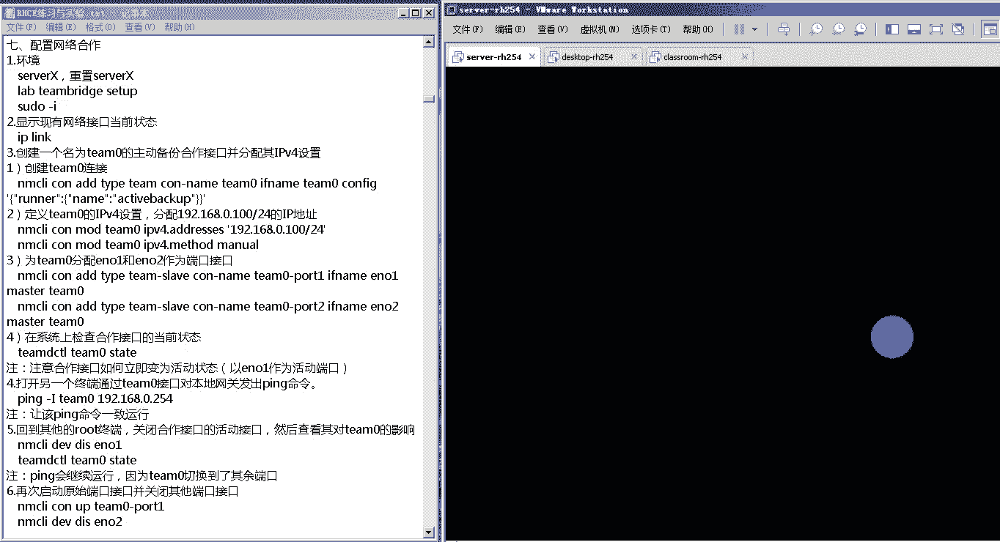

# 红帽RHCE认证考试视频 - P2：RHCE-2 - 我是冷空气 - BV1th4y1X7cC

那我们就开始我们今天这个rh c一的课程啊，rgc的课程，啊我们今天是第二天啊，第二天我们先来看第二天的第一节，第二天的第一节，呃第一节内容主要是一个ipv 6的介绍啊，主要是一个ipv 6介绍。

因为在我们这个r h c e的考试里边，它有一道题啊，这道题就是让我们给我们的网络接口，来配置一个ipv 6的地址，所以说在这一章，我们主要就是给大家介绍这个ipv 6地址，它的一个呃它的一个组成啊。

还有就是ipv 6地址的一些相关的，这些个概念啊，最重要的就是如何来给我们的这个网络接口，来配置ipv 6地址，那我们先来看一下啊，我们先来看一下，首先第一个就是什么是ipv 6。

这个ipv 6它是ip这个协议，也就是我们这个网络协议的第六版，第六版，然后为什么会出现ip v6 的，原因是这样的啊，我们之前使用的这个ip协议是ip的第四版，就是ip协议的第四版。

我们把它叫做i p v4 ，然后i p v4 ，它规定了ip地址是由32位二进制数组成的，然后这就导致了我们的这个ipv 4，这个版本最多可以有二的32次方个ip地址。

但是在这二的32次方的ip地址里边，我们在使用的时候把它分成a b c d e5 类，d类和e类是不能用的，并且127网段也不能用的，所以说我们这个ip地址，它的数量就比较有限了啊，大概是在30多亿啊。

大概是在30多亿，但是我们现在全球总人口数，都已经70多亿了啊，都已经70多亿了，并且我们有这个这么多的主机啊，需要联网的，每一个主机都需要一个ip地址啊，所以说这个ipv 4地址就不足了。

那为了解决ipv 4地址不足的问题，人们也是想了好多方法啊，比如说我们经常使用的这个nt啊，这种上网模式啊，但是最直接最有效的方法，就是推出了一个新的ip版本，叫做i p v6 ，i p v6 。

它规定了它的ip地址是由128位，二进制数组成的，也就是说，它最多可以标识二的128次方的ip，这个二档128次方个ip，这个数量有多大呢，这个ip v6 它有一个口号，说。

我们可以为地球上的每一粒沙子，分配一个ip地址啊，他这个数量是特别庞大啊，特别庞大，这是第一个啊，为什么会出现i p v6 ，就是因为ipv 4的地址不足啊，然后我们才产生的这个i p v6 地址。

第二个就是ipv 6地址的组成，这个ip 6地址，它是由128位二进制数组成，通常每八位二进制数分为一组，使用16进制数表示，所以ipv 6地址一般看起来都是有八组，八组16进制数。

然后这里边涉及到一个16进制数，这个16进制数，用零九啊，加上a b c d e f来代表这个十到16啊，所以这个就是16进制数啊，十到15~15，这个因为是16进制，逢16进一了，所以他没有16。

那就是0~9，然后a b c d e f大数15，然后这个就是ipv 6的这么一个地址哈，ipv 6的这么一个地址啊，然后这个地址写起来特别长，那为了书写方便的话，我们一般情况下是这样的。

我们可以对这个地址进行一个简写，进行一个简写，然后简写是怎么简写的，是这样的，我们可以不写每一个分组中的前导零啊，前导零什么意思，我们来看下这个例子，比如说有个i p v6 的地址是20010db 8。

你这个零就可以在这省略，直接写一笔答案就行了，然后后边这个同一组里面有四个零，这四个零可以缩写为一个零啊，然后00100可以把前面的零给他省略掉，后边的不要把这个后边不要把它省略，然后是一组啊。

把它写成一，后边一组零，把它写成一个零，然后后边还有一组零，也把它写成一个零，最后一组0001，这这个前边有三个零啊，我们把这三个零给简写，最后就写一个一啊，最后就写个一。

而且我们还可以把连续的零再进行合并，比如说刚才这个i p v6 地址，这里边我们可以看到这有连续三组全都是零，那可以把连续三组这个零写成2号来进行，来进行省略，然后这里边有一个问题。

就是我们在写i p v6 地址的时候啊，一个ip 6地址中只能有一个冒号冒号啊，只能有一个冒号冒号，也是说当你有多段连续相同啊，多段连续相同的练的时候，我们只可以把其中的一段用这个冒号冒号。

来把它给省略，这个原因是什么，原因很简单啊，那假如说你这里边出现了两个冒号冒号，那我们就没办法判断，前面这个冒号里边有几组零，后面的冒号有几组零了啊，几组零，这个就是ipv 6地址的一个简介啊。

一个简介，然后ipv 6地址他也有自己的词汇掩码，它的标准词汇解码是杠64，但是一般情况下，供应商会帮会把这个资源码设置成杠48，也就是说前48位都是网络位啊，前48位都是网络位。

那后边儿这64位是主机位，中间空出了16位，六位可以用来划分子网，划分为二进制数，最多就可以划分6553好了，下边就是一个ip 6地址的简写例啊，他把这中间一坨铃啊啊，用冒号来。

然后前面的零一组自制前面的零先导，零可以省略后边的图，我们还是用冒号冒号把它给省略了啊，冒号冒号把它给省略了啊，最后一组这三个都，然后在这个例子里边可以看到这边有四个零，这个零把它写成了一个零。

然后这前边有七有三个零，第三个零我省略掉啊，这有三组三组连最后一组前面有三个，再把省略就写成了这个第四个啊，我们可以看2016，因为零啊只要不在诶，00300有三个零零可以升，然后这是一组零。

这是一组一组连续的三组，0000700000，我们把它写成零二这三个，然后下面这个啊f f02 啊，这个零在中间，然后后边这是一把后来写上，然后这一组里边它有三个零三个零，这一组到最后那一段。

但是不能把每一段省略成那像这种全零的，把它直接写冒号冒号，然后下边举个例子，就像这个p620011 b8 号7号二啊，这种i p v6 地址，因为中间存在了两个冒号冒号。

这你就没办法判断前面那个冒号冒号，后边那个冒号冒号是这种是不可以用的啊，不用，然后下边是ipv 6的一些特殊地址，包括本机地址位置地址，本地唯一地址和多，在这里咱们会给大家一一介绍，原因是嗯。

我们在考试的时候涉及不到这些内容啊，实际上是涉及不到，如果大家伙在日常工作中有需要的话，那你的这些个，我们这个课件里面着重介绍一下，这个本地和多播地址，ipv 6和ipv 4有一个比较不同的地方。

i p v4 ，我们知道它里边的数据传播方式分成和广单播，就是一对一多播，一对多广播对所有，但是v6 里面是广播的单，然后主播还有一个叫任意波，任意说这是他跟ipv 4的区别，简单了解一下。

但是我们上面讲的这些所有的大家了解了，因为在真正的在21考试的时候，是不会让你对这个pv 6地址进行间歇的，涉及到这些内容，但是它涉及到一个比较重要的内容，就是你得会为你的这个网络配置ip。

接下来就看一下这个，首先ip，静态比如我们利用手动给他，第二个就是动态，可以通过dr cp或者是l s l a a c啊，这种方式来获取ip地址，那我们看一下，如果我们是手动配置的话。

这个其实也是我们考试的时候需要大家做的，手动配置ip地址，我们配置其实它配置跟ip配置的啊，我们还是n m c y这个命令好，right connei个连connection name后面可接名。

type类型是以太，if name是具体的方式，为增加一个增加连接之后，就可以为他设置i p v6 地址了，那就是，如果是ip的话，那就是ip 6 p设置ipv 6的gw代表的v6 的，v4 。

这个跟我们v4 配置一样的，只不过，如果要查看ipv 6的设置，就是m c y show啊，如果要添加多个ip地址的时候要注意啊，你只要在ipv 6，加p像删减的话就可以了，另外除了通过命令来修改以外。

我们还可以修改文件，咱们昨天给大家介绍过了，在etc config的cf开头，然后加上网卡名的，呃那这个文件里边它有一些l i相对应的单，来看一下，假如说是手动六点method的。

但是在配置文件里面参数p v6 auto no，然后如果是想让pv 6通过sl a c m c26 点，但是在这个配置店里是i pv 6，如果想通过第二cp获取的话。

那在i p v d c p是ipv 6，等于no d c p6 c等于，如果想一直静态ip地址是ip 6，vs ip地址对应的就行了，中间里面f p6 r后面加上他的地址，p6 杠default的地址。

如果要修改etc下的result文件，使用某一个指定的这个dns服务器的话，如果用n m c i的话，就是i p p6 点d n s，然后边上dns服务器的ip地址，如果是这个配置文件里边的话。

就是直接dns s0 等于多少，这是第一个d，然后d一等于多少，第二个dns服务器如果要修改，我们在这个etc的result文件里边，search指令搜索的域的话，search后边加上你的这个域名。

如果在配重件里就是倒慢，后面加上你这个域名，如果想忽略来自d c p提供的dns的相关信息，那在命令里边就是i p v6 ，然后忽略auto dns等于true啊，这个直接等于初始就行了，这个值。

然后在配置文件里边就是i p v6 啊，这个pd s等于六，启动时自动连接啊，就是当我们的行动启动的时候，这个网卡自动激活，如果是mc 2里边就是connection。

点auto connect yes，如果在配重件里边就是on boot yes，如果设置连接名称的话，在m c l命令里边就是connection。id啊，然后e t h0 ，如果是在我的配置文件里边。

就是name等于e t h0 ，如果要把某一个连接与某一个接口绑定的话，在我们的命令里边就是connection。interface，name等于后面具体的网络接口。

在配置文件里边就是device等于网络接口，如果想设置它的这个mac地址的话，那nm c2 里的命令就是802。3杠，either net mic杠address会被加上你的这个mac地址。

在配置文件里，就是这个hw a d d r就是硬件地址的意思，后面就是你的mac地址，可以用n m c r d v state来查看，或者n m c r connection show。

或者直接用ip i的数都可以，如果要查看ip v6 的路由表，那就是ip杠六root收，我们查i p v4 的时候，直接ip root 15就可以了啊，查i p v6 就得加一个杠六啊。

如果要是拼ipv 6的地址的话，这个跟ipv 4也是不一样的，ipv 4我们直接用拼这个命令，加上目标ip就行了，但是ipv 6里边我们要拼六，后边加上你的目标ip地址才行。

如果要ssh通过ipv 6地址，ssh到其他主机上的时候，也是s h后面直接加上ip地址就ok了就ok了，然后如果我们在i p v4 里边，想要追踪一个数据包，到达目标主机经过的所有的路由器。

那我们可以用这个穿transpass啊，transpass和trans root，但是在ipv 6的这个网络里边啊，我们如果想追踪ip v6 ，这个到达目标i p v6 地址的主机的话。

那我们需要在这两个命令后面加一个六，或者杠六就可以了，然后查看本机所有的这个端口信息，还是用s和net state，他们的参数都是一样的啊，比如说杠n显示端口号，杠t显示tcp杠u显示t udp。

杠l显示listen，监听中的杠a显示所有or，杠p显示所有的这个进程，杠大a i net对于这种ii地址啊，显示它的链接好了，这个就是我们给大家做的一个，i p v6 的简单介绍啊，ip 6简单介绍。

因为呃我们的这个考试里边，没有涉及到这么多内容啊，所以说我们再强调一下我们的这个重点，重点其实主要还是在于我们的这个ipv 6，地址的手动配置方式，i p v6 地址嗯，所以说其他的这些个相关的信息。

大家伙可以把它当做了解，如果工作中有需求的话，你还可以再通过我们的这个文档啊，把这些相关知识来充实一下啊，然后更好的应用在工作中好了，那接下来咱们就通过两个实验来看一下，这个ipv 6他该如何配置。

首先关于ipv 6的实验，我们今天是有两个啊，这两个实验，分别是一个专门配置ipv 6地址的啊，还有一个是将我们整个这个昨天ipv 4，和今天的ipv 6放在一起的一个小实验啊，就这样。

那我们一个一个来看一下，这个为了提高我们的这个速度啊，我已经把我们的虚拟机开好了啊，已经把我们的虚拟机开好了。

然后关于这三台虚拟机它们之间的关系，这个咱们昨天已经在课程里面给大家介绍了啊，如果有不清楚的同学的话，看一下咱们昨天的那个视频啊，看一下昨天昨天的视频，然后把这三台虚拟机之间的关系一定要捋清。

已经他们的关系的话，你这个做实验的时候，才不会出现一些其他的问题好了，先看我们今天的第一个实验，就是配置i p v6 联网，这是昨天的啊，配置ipv 6联网好了。

我们的环境还是使用这个server x啊，这个server x实际上就是我们现在打开的这个server，gun i h254 啊，它的主机名不是server x，而是server 0。

这个昨天我们已经给大家介绍过了，那今天我们就用它来做一下，我这个第一个实验啊，第一个实验，那首先我们要还原快照，这个快照我已经还原好了，那接下来我们来登录一下系统，我们使用root账户登录。

好登录之后，我们右击桌面，然后打开一个终端，在终端里边，我们先来设置我们的这个实验环境啊，lab我们这个实验是ipv 6 set up，这提示着说正在设置ipv 6的实验啊，或者练习success。

这个大家伙的注意啊，你运行这个命令的时候，一定要看到这是success，才能接着往下做，如果这不是success，是fa或者是其他的这种显示的话，怎么办，你需要把你的这个虚拟机还原快照。

如果还原快照之后还是运行这个命令，还是出现问题怎么办，那你就把三个虚拟机依次还原快照，还原快照之后先开classroom，再开server啊，然后再来尝试，如果不行的话。

那就重新换一个新的实验环境再来做实验好了，那接下来我们来做一下这个实验，这个速度杠i，这个我们就不输到我们的这个root用户了，因为我们本身就是用root用户登录的，那首先我们看一下我们所有的网络接口。

ip那个可以看到这个网络接口里面有lo，也就是本地回环地址e t h0 啊，还有e e n o e e n v e啊，可以看到我们当前的链接只有e t h0 啊，只有e t0 。

所以我们现在就为我们的这个e n o e，创建一个连接，并且为它设置一个ipv 6的地址啊，这就是我们这个实验啊，为e n o一创建一个连接，并且为这个连接设置i p v6 的地址。

然后我们可以使用这个地址，跟其他主机上的ipv 6地址进行通信，那首先我们创建一个连接，nm cl connection，i msl是我们这个命令。

connection cn代表connection连接的意思，i的增加一个连接，后边跟上什么呢，注意跟上一个connection gun name啊，你的连接名我们也叫e n o e type。

你这个连接的类型啊，我们是以太网，所以是either knight啊，以太网的意思，这个英文单词就是if name啊，你的这个使用的具体的物理连接啊，网络接口。

他的名字就是我们刚才看到的那个e n o e，好了，他提示我说这个连接eo一啊已经创建成功了，之后，这个命令去查看，可以看到这个音o e已经创建出来了，他使用的这个物理接口就是emo。

也就是我们刚才用ip link查看到e n o e好了，那接下来我们来给它设置一个ip地址啊，那首先我们看一下他的ip地址，ip a d d r show e n o e，可以看到当前的这个设备上。

没有任何的ip地址啊，它只有一个默认的ipv 6地址啊，ipv 6地址，这个就是我们的一个i p v6 的本地连接地址，那接下来我们给他分配一个ipv 6地址啊。

那就是nm ci connection啊，为我们的连接mode啊，修改这个链接，e n o e给他改下他的i p v6 地址，那就是i p v6 点而的dress啊，address。

然后单引号里边写上i p u地址，待会再写i p u6 t值的时候一定要细心啊，这个就是我们这个实验最容易出错的地方，就是iv 6地址，它比较长，你在写的时候一定要细心啊，如果写错了的话。

这个可能就导致拼不通了啊，如果写错的话怎么办，你可以把这个地址给它删除掉，然后再重新添加就可以了，那就是f d d b冒号f e r a冒号a b1 ，一这一块一定得注意啊，我们之前给大家伙介绍过。

说这个i p v6 地址，它是由16进制数表示的，那这个16进制数它就是从呃这个01234，56789，然后一直到多少啊，一直到这个a b c d e f a b c d e f。

所以说这个里边是没有l的，所以你看到这个字符的时候，这个就不要犹豫说他是一还是l一还是l了啊，他不可能有l，所以这个是一啊，这大伙在写的时候一定得注意啊，然后是c0 a8 冒号一啊，冒号一这杠64啊。

这是它的自动页码，这个就是他的i p v6 地址，然后后边还可以设置一下，它的这个i p v6 的网关啊，f d d b冒号，f12 a冒号a b e e冒号冒号啊，这就中间有连续的0c0 a。

八啊冒号f一注意啊，刚才这一块我们也是有一个连续的零，这个我们在敲的时候少敲了一个冒号啊，这个是需要注意的好，这样的话我们的i p v6 地址就给它添加上了，但是注意啊。

我们跟i p v4 的这个配置方法一样，你再给他添加完ip地址和他的网关之后，一定要注意修改他的这个网络参数获取方式，那就是nm c l i connection mode，修改一个连接，修改谁呢。

e n o e这个连接修改它的什么参数呢，i p v6 的获取方式，那就是i p v6 method改成mu啊，就是手动获取好之后，或者我们用i p a d d r啊，show啊。

e o e可以看到仍然看不到他的ip地址，原因我们昨天已经讲过了，是因为你给他配置完ip地址之后，实际上是修改了在etc下的cs config下的network on spring。

里面的这个if cf g杠e n o e这个文件啊，实际上你是改了这个文件，但是你如果想让你这个文件里面的内容，生效的话，你得怎么办呢，得把我们这个网卡给他先去激活再激活，那就把它禁用再启用。

所以我们来把它禁用一下，nm cri connection down啊，禁用这个网卡n o e再重新启用它，nm ci collection up e o b好了，它提示你已经成功起来了。

已经成功起来了之后，我们再i p a d d r受e n o e a，可以看到我们刚才配置的ipv 6地址，就已经生效了啊，已经生效了，那接下来我们来试一下，看这个i p v6 地址它是否能够对外通信。

它是否能够对外通信，那我们来拼一下拼，注意拼ip 6地址的时候，后面要加一个拼六，我们先拼一下这个f d d b冒号，f e r a冒号a b a，注意这大成分号了。

a b e e冒号冒号c0 a8 冒号1a，可以看到它是可以拼通的啊，可以品通的，然后我们再拼一下它的网关啊，它的网关f一啊，可以看到也是可以拼通的啊，也是可以拼图的。

我们可以看一下他的这个i p v6 的路由表，就是i p杠六root啊，这是他的ipv 6的路由表，路由表，在这里边可以看到我们刚才设置的默认网关，default vr，默认网关，这是我们刚才设置的啊。

这个我想通这个默认网关，或者说通过默认网关通信的话，他使用的这个网络接口，就是我们刚才设置的这个e n o e，然后我们还可以拼一下这个，ipv 6的多播地址啊，这个多播地址f f02 ，冒号冒号一啊。

然后百分号1o1 ，就是通过n o e这个网络接口，去拼这个多播地址，可以看到也可以拼图也可拼好了，那截止到这儿，我们的这个实验就完成了，这个实验就完成了，也就是说我们刚才给他配置的ipv 6的地址。

以及网关就都生效了，就都生效了，好了，这是我们今天的第一个小实验啊，配置ipv 6地址啊，配置ip 6就是第二个实验，就是管理ipv 6网络啊，这个是一个实验啊，所以说在实验开始的时候。

要运行这个实验准备环境的脚本，在实验结束之后可以运行评分脚本，对你的这个实验的效果做出评定，其实这个也是我们的这个网络配置啊，这一章节里边最重要的两个内容，也是我们20c一考试里边必考的一个内容。

就是给你的这个网络接口，配置ipv 4地址和ip地址，所以这个实验是比较重要的，大家一定要把它多多进行练习，增加你的熟练度好了。

那我们现在来把这个虚拟机给重置一下，然后开启此虚拟机，然后我们的这个20c一考试，它的主要特点就是它的体量实际上是比较大的，题量实际上是比较大的，并且有个别题目会稍微复杂一些。

所以说这个考试的关键点就在于，大家伙对这些个实验啊，他的一个熟练掌握，是对这些实验的一个熟练掌握，所以说大家伙，在这个自己这个有时间的这个条件下，当然这个加班没时间，这个没办法，有时间的条件下。

大家伙一定要把这些个关键的实验，就是我每次上课的时候会告诉大家说，这个实验比较关键啊，把这些关键的实验然后多做几遍，把它做的特别成熟，保证你的这个速度和准确率才可以啊，这样的话才能为我们后边的考试。

打下一个好的基础，当然在做实验的时候，大家也要注意的，就是你一定要知道你这个实验，它的大体步骤是什么，你每一步你敲的这个命令，要达到的效果是什么啊，不能盲目的就是跟着这个我们的这个文档敲。

但是不知道这个文档是在干嘛啊，这个肯定不行的，好的，那我们已经开启了，开启之后我们来登录一下。

好了，接下来我们打开一个终端，打开终端之后，我们来配置一下我们的这个实验的初始环境啊，那就是lab ipv 6 set up，诶这里显示successful，代表我们这个配置已经成功了啊，配置成功了。

配置成功了之后，那接下来我们就来查看一下，我们当前的这个网络连接啊，比如说我们用用这个ip addr，是可以看到除了本地回环连接地址啊，本地部分连接设备l o以外，还有一个e t0 。

这个t0 的ip地址，他就给你配好了，是172。二五点点一啊，在我们这个实验里边，这个是用不到的啊，我们要用的是这个啊，就是e n o e啊，可以看到e n o e这个网卡啊，它上面没有任何ip地址啊。

没有任何ip地址，然后我们用nm ci connection show来查看一下，我们现在的链接，可以看到只有这个e t h里面的一个链接好了，那接下来我们要做的第一个事。

就是为我们的这个e n o e来创建一个连接，那就是n m c y connection，di connection name，就是连接的名字啊，也叫应用oe type，这个连接的类型是以太网卡。

那就是爱德night啊，if name啊啊你使用的这个设备，就是我刚才看到的那个e o e，它提示我已经添加成功了，那就nm ci connection数，可以看到in n o e这个链接已经加上了。

它使用的设备，就是我们刚才看到的那个in n o，e的这个物理网卡，物理网卡，那接下来我们来给它配置一个ipv 4地址，修改一个链接，mod就是modify的意思，修改哪个链接。

e n o一修改它的哪个参数呢，i p v4 点address啊，把它的这个ipv 4地址设成192。16，八点点一，子网掩码杠24好了，这个昨天说过，我们设置ipv 4地址，还有我们刚才今天也说过。

设置ipv 6地址之后，一定要修改你的这个网络接口，它这个ip地址的获取方式，所以nm ci好，n m m c i connection mod e n o e这个连接。

然后i p v4 点minor获取方式改成menu menu，就是手动获取之后，我们再来给他配置一个ipv 6体制，那就是nm c r y connection mode啊。

应o一还是给这个应用一个连接，i p v6 点address，这个ip 6地址是f d d b冒号，f e r a冒号a b e e冒号冒号，然后c0 a8 冒号64啊，自网源码也是杠64啊，再杠64。

然后配置完成了之后，还要修改它的这个i p v6 的ip地址获取方式，那就是ipv 6点minor的改成麦好了啊，那接下来我们就可以把我们的这个应用o1 ，这个接口把它给down掉，然后再把它重新启动。

这样的话我们刚才在更改才能生效啊，实际上大家伙要注意啊，你刚才的这些更改，已经写入到etc下的network conscripts，下边的if c f g g e o e里边了啊。

在这里你可以清晰的看到它的这个，i p v4 地址啊，以及我们刚才说的这个i p v6 地址，但是现在他是不生效的啊，也就是说我们用这个ip show in oe，你是看不到的。

i p a d d r手有啊是看不到的啊，所以说为了能让它生效的话，我们得把我们这块网卡给他down掉，再重新启动，那就是n m c l i connection down烟oe哎。

这样的话就把它给down掉了，然后我们再把它记起来，那就是up平o1 ，它提示已经成功开启，然后我们在i d i p a d d r首页，o e就可以看到我们刚才的配置已经生效了。

首先i net这下边跟的是你的ipv 4地址，要求2。16，八点点124，然后再往下是你的ipv 6地址，就是我们刚才设置的f d d b这个ip地址，那接下来我们来测一下。

看我们的这个i p v4 地址和ip 6地址，能否对外通信啊，如果想适用ipv 4地址的话，就是ping gui杠大i是使用哪一块网络接口，来pin这个外界的这个ip地址啊。

我们是通过这个e n o e这个网络接口，也是刚才我们配置的，然后我们拼的ip地址是192。16，八点点254，这个0。254，实际上是classroom这台机器上面的一个ip地址啊，一个ip地址。

那就是我们现在通过我们server杠二，是254上面的e n o e这个接口，去拼classroom杠h254 上面的一个ip地址，192。168。0254，因为我们刚才v e n o e。

设置的ip地址是192。168点点一，跟0。254，它是在同一个子网掩码的，所以说理论上是可以拼通的，我们看到是可以通的，看到这个t t l值就说明能通了啊，那能通了，然后t t l值等于64。

说明他没有经过路由，那我们再拼一下ipv 6地址，看ip地址设置的是否正确，那就是拼六杠i还是使用emo 1，然后跟上你的ipv 6地址，fd db冒号f12 a2 号ab 11冒号，冒号c0 a8 。

问号f一回正诶，可以看到它也能拼能，那这就证明我们刚才为我们的这个e n o e，这个网络接口配置的ipv 4地址和ipv 6地址，都没有问题，那接下来我们就可以运行我们这个脚本，来进行实验的验证了。

好了，我们可以看到啊，全部都是pass，这代表我们这个实验就宣告成功了啊，我们可以看到它检查的是什么呢，检查的是i p v4 地址是否配置正确，然后ipv 4的网关是否能够通信。

ipv 6的地址是否配置正确，以及ipv 6的网关是否能够通信，好了，这个就是我们i p v6 网络的一个管理，所以说我们回过头来再说一下这一节的重点啊，这一节的重点不在于你的这个ipv 6地址。

它应该如何简写，以及它有哪些分类，有哪些应用，它的重点在于你得在我们这个考试的环境里边，会为我们的这个网络接口，配置ipv 4地址和ipv 6地址啊，这个就是我们的准备，所以课下的时候。

大家伙可以把这个实验仔细的做一做啊，就是配置ipv 6联网和管理ipv 6网络的，这个事情来做做，好了，我们把它还原一下啊，然后一会我们可以直接用，嗯那接下来我们来看一下，我们今天的下一节内容。

也就是我们的这个网卡的team啊，网卡的tm这个网卡的team，我们把它叫做网络合作，这个网络合作是什么意思呢，是以这种逻辑的方式讲，n i c i c这个叫nick，也就是我们说的网卡啊，连接在一起。

从而实现故障转移或者更高吞吐量的方式啊，高光图能量方式，然后下边给大家介绍了啊，这个网卡重组是什么意思，或者叫网卡和做，但是他这个介绍介绍的比较复杂，我们通过一个简单的小图来理解一下。

什么叫做网卡的tm我大概要花多少件a在哪里，这个被挡住了啊，在这儿，好了我给大家举一个例子啊，假如说我们现在有一台机器是这个server 0，这个就是我们的server name。

然后在搜索0377上面，它有两块网卡，然后这两块网卡可以对外通信啊，那我们的这个网卡的team指的是什么呢，你可以在你的这个server 0上生成一个虚拟的设备，虚拟的设备。

这个虚拟的设备我们把它叫做team设备，team设备啊，我们的小写就行，tm设备，然后我们可以把我们的这个物理网卡，连接到这个team设备上啊，连接到车这个这个题目设备上。

然后在这个物理网卡连接到steam设备上的时候，我们可以指定它的连接方式，连接方式，比如最常用的连接方式主要有两种，一种叫做round robin，叫做轮询，轮询是什么意思。

就是这两块网卡在对外通信的时候啊，这两块的话在对外通信的时候，也就是说你的这个tm在这个虚拟设备，在对外通信的时候，实际上用的是这两块物理网卡，那轮询，就是它会依次通过这两个设备，来进行数据的收发啊。

依次进行数据收发，可能这个发送前几个数据包啊，是通过这个第一条链路啊，然后第二个后几个数据包通过第二条电路，然后再通过第一个，然后再通过第二个，这个叫rrobin罗宾。

再还有一种常见的叫做什么叫做active backup，叫做active backup，这个active by cup是什么意思，这个就是我们常说的储备模式啊，你可以指定它这个模式为主，备模式为主。

被指定完备之后，那这两块网卡它有一块网卡就变成了主网卡，另外一块网卡就叫做被网卡，然后平时是通过这个主网卡跟外界通信的，但是如果说主网卡出现问题，比如他意外的down掉了啊，down掉了。

或者说你这个链路出现了问题，这个时候被网卡就会接替主啊，继续对外通信，这个就是我们的一个网卡tm网卡tm，所以说这个文字解释的过于复杂，我们画一个简单的图，就能把它给理解清楚了好了。

然后你在设置这个网卡存储的方式的时候，常见的就有这四种啊，包括这个bot cast啊，bot cast传输来自每个端口的包，run robin，这个咱们刚才说过了轮询的方式。

然后active by cup啊，故障转移的方式，还有就是l a c p啊，这个就是我们说的这个链路聚合控制协议，这个是要配合你的这个交换机来使用的，这是第一个什么叫做网络合作，或者说网卡重组。

也就是我们说的这个网卡team，第二个就是我们如何来配置网卡重组，这个主要还是通过a m c，l i这个名字来进行配置，所以说我们这个整个课程大概得有1/6啊，全都是呃在用这个n m c y这个命令。

然后配置这个网卡成组的这个过程，就跟我们刚才画图的这个过程是一模一样的哈，是一模一样的，首先你需要先干嘛呢，创建这个组接口啊，创建组接口，也就是说你先创建这个特殊的tm 0的这个设备。

创建完tim 0的设备的话，你可以给他配置i p v4 地址或者ipv 6地址，之后，将你的这个team 0设备连接到你的物理网卡上啊，连到物理网卡上，在可以启动你的物理接口。

还有你的这个team 0接口，启动关闭物理接口，team 0接口，这个就是它的过程啊，就先创建team设备，再将你的team设备连接到你的物理网卡上，在team设备连接到物理网卡上的时候。

指定你的这个连接的方式，就是上面这四种的哪一种啊，哪一种，这个也是我们考试的时候经常考的啊，好了，那我们如何来创建我们的这个team设备呢，啊就用这个命令就可以了啊。

my cl man connection i的啊，connection i的增加一个连接，然后type注意我们之前增加链接的时候，type都是以太网ither nt，但是team设备的话。

那就是team啊，题目我们后面还要学一个桥接设备，那桥接设备就是b r a bridge bridge，然后connection name就是你连接的名字，后面加上你这个具体的名字。

然后if name后面加上你的这个接口名，接口名，这个通常跟你的连接对名字也是一样的，然后在后边再指定你的这个连接的方式，方式就是我们刚才说的这四种方式，然后他下边举了一个例子。

比如说up server connection i啊，增加一个连接type，这个连接类型是team设备，然后connection name哈，他的这个名字叫team 0，然后config啊。

你的这个方式是采用load balance啊，load balance就是我们说的这个food均衡模式，如果你想确定你的这个接口的属性的话啊，想修改它的这个ip地址和ip地址的话。

比如说这里给大家举的例子是修改ip地址，v i p v4 地址，这个跟我们给物理接口修改ip地址是一样的，tm 0就是你创建的这个team设备，然后i p v4 点address。

或者加上ip v4 的地址和对应的子网掩码，但是跟我们的这个之前讲过的一样啊，你还是要把他的这个ip v mah，也就是ip地址的获取方式改成手动才行啊，手动才行，然后分配端口接口的话。

就是增加一个这种type类型为team live的设备啊，也就是我们的物理接口，然后connection name就是你的这个接口的名字啊，接口的物理接口的名字，if name就是你物理接口的名字。

然后master就是你是连接到哪一个team设备上，举个例子，if name e t h e master team 0，也就是说你现在就把e t h e这块物理网卡，连接到team 0啊。

这个题目设备什么啊，tm设备上如果要启动关闭接口或者是接口，这个端口接口的话，跟我们之前的命令是一样的啊，就是n m c r d v d4 断开连接，如果要启动的话，就是connection up啊。

后面加上的接口名，接口名，他下面给大家举了一个例子啊，比如说你把这个team 0这个设备给它开起来，那就是msi connection up team 0，如果你想断开某一个物理接口的话。

就是n m c l d v diss，diss就是disconnection的意思啊，后边加上接口名，如果想查看这个接口的状态的话，就用team ctrl team 0 state啊，就可以了。

这个就是我们的这个网卡成组啊，我们的网卡成组，好了，那接下来我们还是通过一个实验来看一下，我们的这个网卡程度应该如何实现，啊这是第七个实验啊，配置网络合作啊，配置网络合作好了，那我们会通过一个小实验。

来看一下我们的这个实验，它的这个过程，实验的过程以及这个实验的原理。

让我们把我们的虚拟机打开，啊这个刚才忘了开机了啊。

好尴尬啊，又得等一会儿我再把它还原一下。

然后我们还是在介绍这个实验的时候，我们给大家伙画一个图啊。

让大家伙对这个实验有更深刻的了解，好了。

我们那边已经开起来了啊，我们用root账户登录一下。

好了，我们已经登录进来了啊，我们六级桌面啊，打开一个终端，之后我们先来设置一下我们的这个环境，lab叫做team bridge，set up，这个实验的名字叫做team bridge，诶。

显示successful，successful，之后，我们来看一下我们当前的连接，ip link，可以看到，在这里边我们能看到这个e n o e这块网卡，还有e n o r t网卡。

当然还有你的这个本地回环地址，l o以及e t h0 ，那我们本次实验主要是用了这个，ino一和ino 2，所以说我们当前实验的初始环境，实际上是这样的，这是我们server 0。

这台机器上面有两块网卡，一个是应用o1 ，一个是应用无二好了，那接下来我们来创建一个team 0的设备啊，那就是n m c l i connection i，增加一个连接。

然后它的type它的连接类型是team设备，connection gun name，它的名字我们把它叫做tm 0，if name，我们也叫team 0啊，然后config。

config后边是指定你的这个连接物理网卡，然后物理网卡的连接方式，连接方式，这个我们是用这样指定的啊，里边加上一个render，然后冒号在中括号内，再冒号诶，在这里边就指定它的连接方式。

我们在这里面用到的是active bcup，active backup，也就是储备方式，诶他提示啊我们这个写错了啊，提示我们这个关键词写错了，这个是识别不出来的参数，这个这个应该是我们。

啊要加一个空格啊，要加一个空格，就是你的这个，方式啊，还有你这个confi之间这个有个空格啊，我当时是刚才是把这个空格忘了加了哈，所以说它有什么提示诶，然后你加完了之后的提示。

说你的这个team 0已经添加成功了，那也就是说我们现在的这个网络环境，变成了这样，这个就是我们的team这个设备，这就是我们，好了，然后我们就给这个t50 设备，分配一个ip地址啊，ipv 4地址。

n m ci connection mode tm 0 ipv 4点address啊，给他分配一个ip地址，这个单引号括起来，这个其实不加单引号也可以啊，我们刚才那个实验就没有加，192。168。2。

0。100~24，然后再设置这connection mode啊，这个是我刚才按了一下table啊，其实你这个c o n就是connection mode的team 0，它的i p v4 点minzor。

就是ip v4 地址的获取方式，改成mu好了，那这样的话它的ip地址就已经设置上了，那我们进行完这个步骤的话，实际上就是在往这个图里边，我用的tm 0设备设置了一个ip地址，19202168。

并且把它ip地址的获取方式，我设置成了手动获取，这就是我们刚才的这一步操作，那接下来我们把这个e n o一和n2 ，连接到我们这个群名上。

就是n m c i connection connection i的type，增加一个连接，这个连接的类型叫做team的live设备啊，就是它的存储设备。

connection杠name叫tm 0杠pot 1，这个是给它起的名字，然后if name就是你的这个接口名是e n o1 master，也就是它连接到哪一个team设备上，就是tm好了。

那这条命令下去了之后，我们的效果就变成了这样，变成这样之后，我们再添加另外一个啊，那就还是这个啊，还是这个还是这个的话，我们只要把这个参数稍微改一下就行，刚才添加的是e n o1 。

接下来我们添加1n2 ，就是nm c2 connection i的，还是增加一个连接，这个连接类型type是team杠s live设备，也就是team的这个存储设备，connection name。

你的这个连接的名字叫做team 0啊，杠pod 2，然后if name实际上使用的这个接口就是e the master，连接到的题目设备就是pm 0，好了，那这个步骤操作完成之后，我们现在。

就是这么一个环境啊，这么一个，因为我们刚才在生成这个team设备的时候，我们指定了指定了我们这个team，连接我们的这个物理接口的方式是t5 呃，back up，也就是主从方式。

那接下来我们看一下哪个是主，哪个是从，我们可以用team d c t l team 0 state，来查看这个team设备的状态，在这里边可以看到你的这个team设备。

它的运行方式是采用active by cup的方式运行，下边有两个端口，一个是e n o1 ，还有一个是n o2 ，那现在正在运行的端口是一一，那也就是说我们当前的这个最终的实验环境，它是这样的。

上边这个emo一作为我们现在的，主接口啊，下边的1n2 作为我们的背景背景好了，那接下来我们试一下，看我们这个team 0设备能否正常工作，那就是pin杠i啊，这个杠i咱们刚才说过了。

就是使用本机的某一个设备ping，我们使用team 0 pin pin一下它的网关，192。168点点254，也就是我们classroom上面这个网站的原a，可以看到，可以成功的跟我们的这个0。

254通信，20254通信，然后他跟0。254通信是怎么通信的呢，实际上是这样的，我们刚才为这个team 0设置了一个ipv 4，地址是19268点点100，跟我们的0。254是在同一个网段。

然后这两块物理网卡它使用的是eo 1，也就是说这个数据包是通过team 0发到eo 1，再发到你的这个classroom这台机器上的，那如果现在我们把它的这个e o e这块网卡，给它断开啊，给他断开。

那就是n m c l y d v d4 断开一个网卡，e n o e啊，sorry，这个敲错了啊，n m c l i d e a d s n o201 断开之后。

我们再来看这个team d c t l team 0设备的状态，我们可以看到啊，刚才他的这个接口里边有e n o e和n2 ，但是现在已经没有e n o一了，也就是说我们运行这个断开命令之后。

它的效果变成这样，首先这个位置断开了啊，这个位置状态，其次我们刚才的这个备用网卡，现在它变成了运行状态，也就是说，断开了之后，我们的这个应用二它就从主网卡啊，被网卡变成了，稍微往这边。

这个就是我们的这个效果啊，这个效果，那现在我用它来拼我们的这个当i pm 0，再p我们的192。168点点254，我们可以看到啊，仍然能够平衡，仍然能够，如果刚才你的那个拼音没有中断的话。

就是刚才拼音一直在运行的话，你会发现这个pin他是一直运行的，它不会有任何断开，那如果在这个时候，我要是把我们这个in 2这块网卡一断开了，我们来试一下，那这样的话。

tm 0就没有任何物理网卡跟外界通信了，那我们来试一下啊，n m z l y d v d，in u2 ，一用二，然后我们再用这个，team d c t l pm 0 state去查一下诶。

可以看到它已经没有活跃的结果了，那这个时候我再拼的话，你会发现诶就拼不通了，好了，那接下来我们把它的这个网络接口，再给他加回来啊，再把他加回来，那就是nm ci啊，connection up。

我们再把我们刚才的这个tm 0杠poe，这个接口给它记下来，他其实已经启动了，启动之后我们再tm 0 c t l tm d c t l，然后team 0 state查看这个状态的时候。

可以看到它里边已经有一个in n o一了啊，1o一了，然后并且他现在使用的就是1o1 ，也就是说他现在的情况是这样的，然后你的应用户一，就自动变成这个跟外界通信的主设备啊，主网卡，那我们再来拼一下。

可以看到它是能拼通的障碍，题目0192。168点点啊，又通了，那我们再把第二个也给它重新加过来，part 2，后台之后，我们再tm d c t l team 0 state啊，可以看到两个接口都回来了。

并且现在主接口还是neo 1，那现在我们的状态就变成了这样，哎也就是他回到了最初的状态，那肯定也是能平衡我们的这个0。254，这个就是我们的这个tm的这么一个小实验啊。

我刚才已经通过这个图示给大家介绍了，所以说大家伙在做实验的时候也是这样啊，你不仅这些命令你得把它记住，会敲你另外的还要知道你做这个实验，这个实验的步骤是什么啊，你每做完一步，他的这个造成这个结果是什么。

这个才行啊，好了，那接下来我们来帮我们来还原一下，我们来继续来看下面的。

啊这次不要忘了开机了，好了，我们来看一下这个第三节的内容，就是对组接口的配置进行排布和更改，组件和配置进行排啊，这个实际上主要是什么呢，就是我们在配置了我们这个team设备的时候。

我们指定了这个team设备，它连接我们的这个物理网卡的连接方式，就比如说刚才的轮询啊，或者是主存等等等等，那我们这一章主要就是讲解，它应该如何修改这个配置，这个修改配置，实际上。

虽然这里边用这个第二个部分和第三部分，讲的很多，但实际上就两种方式来看一下都是哪两种方式，首先第一种就是可以通过修改配置文件的方式，那首先我们要知道这个team设备，它的配置文件在哪。

还是在一体机下的c config下的network cost rise，用if conserve和开头，后面跟上你的一个team设备名啊，这个就是team设备的设备文件，提供设备的社会文件。

好在设备文件里面他会指定里边有一个配置，就是指定了你的这个tm设备的这个工作的方式，我们可以通过修改配置文件的方式，来更改它的工作方式，这是第一个，就是n m l i connection void。

后面加上你的这个team设备，team设备，后面再加上这个team设备的连接方式，主要就是这两种方式，虽然他写了很多，但实际上就是这样，另外我们在进行网络故障排除的时候，我们还可以用到其他的命令。

比如说这个team n l命令或者t m d c t l命令，这个t m d c t l命令咱们刚才已经看到了，它主要是可以查看你的tm设备的状态，比如说显示tm 0接口的组端口。

可以用team nl team 0 pts显示的当前活动的端口，team nl team 0啊，注意这里都是以team 0举例的，get option active po。

然后设置team 0活动端口的选项，可以用这个team n l team 0 over set option active port，后面加上端口的名字，还可以显示端口当前的状态啊。

这就是刚才我们用过的啊，这个team d c t l team 0 state，还可以使用这个team c t l，显示你tm 0当前的这个配置。

比如team d c t l team 0 confid，所以这个就是这一章讲的内容，虽然他这个说了很多，但实际上内容啊主播互联方面再强调一下，就是修改你的这个team设备工作方式的两个方法。

第一个是修改它的配置文件啊，你要知道它的配置文件在哪儿啊，如何修改，第二个就是通过命令来修改，那接下来我们通过实验，好了，也就是我们的第八个实验啊，管理网络，管理网络，啊这第八个实验也是一个测试啊。

它也不是一个实验，没有最后的验证文档好吧，那接下来我们来看一下啊，我们在看它的时候还是啊，我们来看一下这个实验的每一个步骤啊，一个步骤。

好了，那这个实验我们用到的还是450这台机器，并且还用到了我们这个team的网卡，哎呦这会比较尴尬哈哈，本实验紧接上个网络配置合作练习啊，也就是说，这第八个实验是在第七个实验的基础上完成了，啊。

这这个就很尴尬了啊，我们第七个实验的这个环境已经还原了，所以说我们还要把第七个实验来做一下，接下来做第八个实验好了，然后咱们只能抓紧时间了啊，只能抓紧时间了，但这个也比较快，大家伙在做的时候也是哈。

嗯就出现这种问题的时候，这个最好的方式就是做实验之前。

把那个实验环境先看一下啊，要不然就会像我一样，但是这个没关系啊，因为这个实验本身我快点桥，基本上还是可以的，那我们再来把这个第七个实验，这个前期准备工作来做一下。

首先第一个运行live team bridge，sa来说下你的实验环境，哎这个显示设置成功了，设置成功了之后，我们ip link来看一下啊，可以看到有这个应用和应用二，接下来我们就来创建这个题目设备。

i type team connection，杠name，叫做t0 啊，然后config来指定它的这个运行方式，双引号render，双引号，括号，大括号，双引号内双引号码尾号。

双引号叫active bc，双引号双引号单引号诶，这就成功了，成功了之后再给他设置ip地址，i m c l i connection mode啊，team 0 i p v4 点address。

ip地址是192。168点点100个二三好，在设置ip地址的获取方式，看了个深mode pm 0，然后ipv 4点midor改成mu好了，这就是成功了，再被它分配两个接口。

就是nm c l i connection i的type叫做team sleep设备，卡耐克深杠name啊，叫做tm 0的第一个接口，所以是po 1 if name叫做e n o e master。

连接到我们的team 0，这个设备上再增加一个，炮塔二的，嗯好了，那我们这个实验环境就准备好了啊，team c t l team 0 state，哎其实我听的也不存在啊，这很尴尬。

这是刚才我的名字打错了，看一下啊，听不清哎呀，这个没有打错，看一下这个ip addr，e n o e d n m r n m c l i connection数。

所以可以看到有这个题目进行设备提供电设备，有这个姓名设备，当然就是没有device设备，就是刚才我在创建t0 的时候，是不是少了命令啊，果然这少了命令，少了一个异，这就比较尴尬。

这个我们还要把它给断开算了，我们这个直接重启一下。

少打了一个命令啊，少打了一个内if name，导致了后面我们再起它的时候，这个起不来，尴尬又浪费了几分钟，好了啊，我们再重新登录一下。

还是lab team，bridge set up，and i'm sorry啊，connection i的type team，connection，搞name team 0。

if name team 0啊，这次不要忘敲了，然后config，双引号啊，runner，然后再是大括号，双引号，name，艾克t5 bc，嗯再对照一下啊，看看有没有问题啊，i t type是tm设备。

name叫tm也叫tm 0，看来config配置方式好的，显示添加成功，添加成功之后，m c l i connection，mode team，0i p v4 点address，192。

168点点124，i m c i connection，mod r team 0 i p v4 点visor改成mu，connection i type是team的live设备。

然后connection杠name是tm 0的pd 1，if name是ino e，需要指定master哈，那就是master team 0，再添加第二个g n o r和pd 2。

占用team d ctrl team 0 state来查看一下，哎，这个就添加成功了，然后可以在这看到他当前的运行方式是active，back up啊，是xtape by cup的这个方式。

然后它连接的两个接口，分别是应用一和应用二啊，因为是主备方式，所以主接口是应用一，应用二作为备用接口啊，这就是我们刚才做的这个网络合作的这个实验，最终的这个结果。

那接下来我们来看第八个就是管理网络合作啊，它是紧接着上面这个实验呢，所以第一个先查看你的这个合作接口，的初始状态，也就是查看我们这个题目设备的初始状态啊，这个就是我们题目设备的初始状态，然后。

啊我们来修改啊，修改它的这个配置文件，然后在配置文件里面把它的这个运行方式，从active backup转成我们的软robby啊，好了，那第一步先把它给关闭掉，听不清之后，我们来编辑它的配置文件在哪呢。

在etc下的cs config下有个network scripl s，在这里你可以看到你的if cfc杠t50 ，这是你tm 0接口的备注文件，还有c v z杠tm 0杠port 1。

还有if c y g杠tm 0杠port 2，那接下来我们需要编辑的就是这个if cf g，gtm 0这个配置文件v i m e c f g杠tm 0，在这里边我们看到它的第二行啊。

也就是team config，这一行指定的就是你的这个运行方式，可以看到它现在的运行方式是active running方式，那接下来我们就把它给它改成rt ruby red ruby。

这个你可以直接使用这个v i m的查找替换啊，但是我们就不查找替换了，我直接改了啊，ru，啊软的货币，这就改完了，改完了之后，wq保存退出，你还可以再抓一下，确定你刚才的更改已经正确了啊。

就render这个关键字啊，e t c下的this config，下载network杠scripts啊，其实我们当天就在这个目录啊，下载if cf g，if cf g刚听没听。

可以看到它现在已经是软的桌面了啊，那接下来我们再把我们的team 0重新提起来，connection up，听不听，这里显示他已经成功开起来了啊，成功开起来之后，我们再来查看的状态啊。

tm d c t l t m0 state，诶可以看到啊，诶他这个当前还是你的这个active by cup状态，还是active by cup状态，这是我刚才问的歌并写错了吗，我们再抓一下。

啊round robin啊，这个没有写错啊，没有写错，然后我们查一下这个team 0当前的状态，tm d c t l team 0 state啊，它的显示现在是没有活动的端口的，它没有端口啊。

所以说我们来拼一下，看看能不能拼通杠i通过pm 0 p192。16，8。20。254啊，这可以看到它是并不通的，并不多的，那我们现在激活它的其中的一个接口，就是nm cr collection。

up team 0上面的hot一激活起来之后，我们再来评诶，我发现就可以拼通了，我们就可以发现它就是一个平衡，然后我们再来设置它的第二个接口，就是呃呃nm c y connection up team。

零杠pot 2这个接口啊，这两个就都已经开起来了，两个都已经开起来之后还是可以平衡的，这个是启动的tm 0的接口，之后我们再来看team d c t l team 0 state，打错了啊，sorry。

啊这就可以看到他这里已经成功接起来了，接起来了，但是这个我们刚才的修改好像没有成功，他还是active by卡布的状态啊，哎这个我们看下我们这个哪有问题啊，run的ruby，这个red robin。

我刚才是打错了吗，我们再来看一下ios开cfg，刚听，诶这里我们已经把它改成软弱了啊，已经把它改成软弱了，他还是以xt 500卡状态就行，这个很奇怪啊，这个很奇怪，那我们再把它重新给他啊，这个没生效。

是因为我刚才说错作了一波啊，没有重新加载这个文件，所以导致他没啊，那这个怎么办，我们可以还是先把我们的这个team，零设备给他断开，diss team 0断开之后再重新加载msi connection。

lord connection led就是加载一个配置文件，哪一个配置文件呢，etc写的c4 config下的network conscripts，下载if cf g gt不行好了。

重新加载下来之后再把它重新开起来，那就是msl i caction up team 0，注意你在把一个设备断开的时候，它的这个子接口也断开了。

所以我们还要connection up tm 0杠pot一啊，这个设备和tm金刚炮塔二设备之后，我们再用这个team d c t l tm 0 state，这个命令来查一下，诶。

可以看到它现在已经变成软状态，这个就是我们这个实验的效果啊，实验的效果，然后我们刚才是通过这个编辑这个team 0，这个设备的配置文件，来修改它的这个运行方式的，那接下来我们还可以通过另外一个方式。

就是直接通过命令来修改，直接通过命令修改，那么接下来我们来通过命令来修改，多名单的修改，其实改的还是你的配置文件啊，改的还是你的配置文件，我们可以先看一下我们group runner抓这个关键字。

etc下的cs config下的network gps下载，if 4 y t杠tm 0啊，我们看一下这个team 0设备文件，当前可以看到它是red ruby arran，那接下来我们来修改一下啊。

诶这个我刚才有没有把它给断开啊，没有断开，那么它先给断开，mc i d v d team 0，再把team 0设备给他断开，断开之后，nm c y这个命令connection mode的team 0。

修改它的配置文件，修改他的team，点config，把它改成什么呢，注意把它改成runner，name，active，白卡，实际上这个修改的还是你的配置文件好了，我们再抓一下它的关键字。

可以看到它的关键字里边的这个red robin，已经替换成了active by cup啊，那接下来我们再把它重新开启下来，就n m sl看来是up提我tm 0，然后再显示我们这个team 0。

它的状态tm d c t l tm 0 state，可以看到它当前的状态，是不是又变回了active by cup啊，从刚才的run rob又变回来，但它下面没有接口，所以说如果想要那生效的话。

还要把它的接口给记下来，那就是n m c i connection up tm 0上面的pd 1，这个结果在nm ci connection up team 0上面的二。

之后我们再提供dc to l查看一下team 0的状态，也可以看到当前他已经有两个接口了，并且现在正在使用的接口是n1 ，那接下来我们可以拼一下，看它是否能拼通，通过这个tm 0能拼通我们的这个192。

16，八点点254，可以看到是可以拼成的啊，那我们的这个实验就到这里就结束了啊，这就结束了，所以说这个实验我们再来总结一下，我们再来总结一下这个实验，它的主要的内容是什么。

主要的内容就是更改你的这个team 0，它的工作模式，两种更改方式，这种方式就是通过它的配置文件更改，然后大家伙一定得注意，不要犯，我犯过这个错误，就是通过配置文件更改之后，一定要用这个嗯。

le cl i connect是law这个命令来重新加载配置文件，让你的更改生效才行啊，这是第一种方式，然后第二种方式，他用第一种方式是把你的就是修改配置文件，这种方式把他的这个tm 0。

他的工作模式由active backup改成了rrob，之后，他又通过命令的方式，通过命令的方式，又把他的这个状态，或者他的工作模式由软文再改回到了active backup啊。

这就是它的这个实验的这么一个效果，一个效果，然后注意的点就是咱们刚才说过的，第一个，如果有配置文件修改的话，一定要记得重新加载配置文件，如果是用你的这个命令修改的话。

一定要记得先把你的team 0设备断开，然后还有一个就是都需要注意的点，只要你断开了team设备，team上面这些个接口也就自动断开了，你再重新开启team设备之后，应该也把这些接口重新启动起来啊。

这个大家伙做这个实验需要注意的地方，好了啊，这个就是我们的管理网络连接，网络连接好了，接下来我们再把这个实验环境还原一下，那接下来我们来看一下，我们今天的最后一块内容啊，最后一块。

最后一块内容就是设置我们的软件网桥啊，软件网桥，这个软件网桥，其实它跟我们这个team设备是比较类似的，那首先第一个我们需要了解什么叫做网桥，网桥是一个链路层设备。

这个链路层指的是osi 7层模型中的第二层，数据链路层，也就是说它是可以基于mac地址，在网络之间来进行流量转发的，所以说它的这个效果，实际上就相当于是一个软件实现的交换机啊。

它实际上就是一个软件实现的交换机，和软件实现的交换机，那这个网桥有什么用呢，这个网桥的用途比较大啊，特别是在虚拟化，跟我们后边的云计算里面的用途都非常大，只要你的这个操作系统是这个linux操作系统啊。

那我们在进行这个q v m虚拟化，还有后边的云计算openstack的时候，需要在里面创建我们对应的这个网桥设备，用这个网桥设备来连接我们的虚拟机或者实力，使得他们可以通过这个网桥互相连接。

或者连接到外网和外网通信，所以说这个就是什么是网桥以及网桥的作用，让我们来看一下如何配置网桥啊，如何配置网桥，配置网查的方式有两种，第一种就是通过配置文件的方式，第二种就是通过我们i m c r y。

这个命令的方式啊，m c l命令的方式，那i m c i这个命令方式它是这样的啊，就是i m c i add，增加一个连接，type变成了bridge啊，增加一个网桥设备。

collection name是网球的名字，if name是它连接的设备的名字，然后网桥跟我们这个team设备比较类似啊，它也要连接你的端口，所以说你还要给他增加连接的端口。

add type bridge slive啊，type就变成了bridge live了啊，然后connection name叫做b r0 杠炮一，if name是你的这个连接接口的名字。

master是你连接到哪一个网桥上啊，连接哪一个网上，这是第一种方式，第二种方式，你还可以通过修改配置文件来生成网桥，比如说你在这个网桥的配置文件里边啊，这个注意这个文件也是可以自动生成的啊。

手动生成的吧，你是可以手动生成的，然后你就是你用vm编辑这么一个文件，文件里边设写一下内容就可以了，这些内容里面最关键的就是，你这个设备叫b20 ，name名字叫b20 。

还有这个type bridge，这是最重要的啊，他的这个设备类型是网球啊网球，然后这个bobo toto，是你的这个ip地址的获取方式，然后i p a d d r啊，这就是你的ip地址加上自动源码。

以及是否开启s t p等这个策略啊，策略，那如果是采用配置文件的方式，如何把一个我们的这个物理接口，连接到我们的网桥上，那你还要修改物理接口的这个ip地址啊，不是他的ip地址，它的这个配置文件。

配置文件里面就有这几个就行了，首先它的类型是以太网卡，然后它的接口的名字叫做你的这个网桥，下的那个接口，然后你的设备名额，还是你的这个物理接口的名额，然后on boat等于yes。

就代表它跟随系统开机启动，然后bridge就是调节到哪一个网球上，调节到b20 上，这个就代表你当前的e t h e连接到b20 上，然后这里有一个需要注意的点啊，这个在我们后边的这个实验的时候会用到。

这个，就是我们当前的这个网络，是通过network manager这个软件来进行管理的，但是如果你要是把这个team跟你的网桥相连，那必须得把它给禁用了，因为它不支持这个网桥连接题目啊，网桥连接题目。

这是需要注意的，如果想查看网桥接口列表的话，就用b r c t l数就可以，这个就是我们的网桥啊，它跟tm是比较类似的，接下来我们通过一个简单的实验来看一下这个，我们这个图一会儿也用不到啊，也用不到。

给删一下。

好了，我们这个server已经打开了啊，那接下来我们来登录一下。

那么一下我们来看一下第九个实验，就是配置软件网桥啊，配置软件网桥，让我们这个软件网桥的配置方式。

那接下来我们来看一下，首先我们还是打开一个终端，打开终端之后，我们来设置一下初始的实验环境，叫做lib team bridge，注意这很多实验用的都是一个环境啊，setup，哎我们可以看到这个实验环境。

已经设置成功了啊，设置成功了，设置成功了之后，我们可以i p a d d r收，看一下我们当前的接口都有哪些啊，可以看到有lo啊，这个本地回环设备，然后e n e t h0 这么一个网卡，它有ip地址。

然后e n o e和n2 ，那我们本次实验跟我们刚才的那个team，这个实验是一样的，还是用的1o一和ino 2好了，那接下来我们先用nm c l n命令，来创建一个软件网球b r e。

那就是nm c l i connection i啊，增加一个连接type，它的类型是bridge，连接的类型是bridge connection杠name，它的名字叫做b r1 ，if name。

它连接的这个物理接口的名也叫比r1 ，他提示我这个就已经创建出来之后，我们用b r c t l show，就可以看到我们创建出这个b1 b，它的名字以及他的id，还有他是否开启这个s t p。

s t p就是我们说的这个生成树协议，那截止到现在我们现在的效果是什么呢，是这样的，我们在这里创建了一个网球，这个网桥的名字叫做b r e，啊那我们现在的效果就是这样啊，就是这样。

那接下来我们来给它配置一个ip地址，那就是n m c i，connection mode b r e i p v4 点address啊，192。168点点100啊，还是这个ip之后还要修改它的ip地址。

获取方式啊，ip v4 点minor改成mu，那这一步完事了之后，其实实际上是达到了这么一个效果，他的ip就是192。168点点120，然后它的获取方式就是手动，就这么一个效果啊，这么一个效果好了。

那接下来我们把这个e n o e这个接口，连接到b r e的这个网桥上，就是m c y connection，i type叫做bridge杠sleep，然后connection name，注意啊。

这个是bridge guns live啊，他的这个连接的类型，connection的名字叫做b r e上面的端口零，那就是pot 0，if name用的是哪一个呢，e n o e e n o e。

然后master使用的是b r e，他其实这个已经成功的添加了就不可以了，那接下来我们这一步完成了之后，效果实际上啊效果实际上就是这样，然后我们可以通过它的配置文件来进行一下，认证啊。

我们开了一下etc的cs config，下载network scripts，晓得if cf g gb r e啊，这个就是我们这个网桥的配置键，在这里边可以看到这个网桥，它是b r一这个设备。

它的类型就是bridge，桥接这个调节器或者叫网桥设备，然后他的ui d啊，就是他的群里一标识符，它的名字啊，b r e以及它的ip地址，我们刚才设置的自动页码。

然后我们还可以查看一下etc写的c config，下载network gun grape seif cf g啊，b r一上面的pot 0，这个配置文件，在这里边可以看到他的这个类型是以太。

网卡的名字叫b r e钢炮零，这是他的ui d，然后他的这个使用的物理接口是e n o e，然后这个物理接口是开机自启的，它连接的网桥是b r d，那我们可以查看一下我们当前的这个b r e。

这个设备啊，可以看到它是有的啊，他是有，然后可以用b r c t l show来查看它的相关信息，相关信息可以看到在这里边，刚才他是没有这个接口名的，现在它已经连接到e r e n o一什么的。

所以有个机会名，那我们看一下这个它配置的ip地址，能否对外通信，那就是ping杠i b r1 ，也就是用b r e p19231680。25，诶可以看到是可以跟外界进行腾讯，诶。

这个就是我们网球的一个实验，对照gf的时候，就是我们通过这个b r e这个网桥，它上面的ip地址，然后走到我们这个e n o e这个物理接口，然后跟外界通信，这就是我们这个网桥的一个实验，好了。

那我们学完了这个网桥和我们刚才的这个网卡，team之后，我们就可以做一个综合的实验了。

做一个综合的实验，就是我们的第十个实验，配置链路聚合和网桥啊，配置链路聚合和网桥，这个配置电路切割和网桥这个实验啊，用到的还是我们这个server x，也就是server杠h254 啊。

实际上主机名就是server di，实际上主机名就是server 0，然后这个实验它是有验证脚本的，所以它确实是一个实验啊，不仅仅是一个练习，然后这个实验它主要的这个内容是什么啊，它主要的内容是什么。

就是把我们的一个team设备给它，连接到一个网桥设备上啊，把这个team设备连接到一个网球设备上，那接下来我们来做一下这个实验。

然后做实验的时候，我们还是要通过这个图来看一下，我们这个他最终能达到这个效果。

就拿同学的麦克风开了啊，那麦克风关一下好了，我们来看第十个实验，就是这个配置链路聚合和网桥的这个实验啊，那我们首先登录一下。

好了，那我们先来配置我们的实验环境啊，lib team bridge set up，诶可以看到实验环境已经配置成功了哈，那接下来我们来看一下我们的接口，就是ip link。

可以看到有l o e t h0 u一和u2 ，那我们本次首先还是用u u一和u2 ，首先我们先创建一个team设备叫做tm 0，那就是nm c l y connection i type team。

就是创建一个连接，连接的类型是team，然后connection name连接的名字叫tm 0，if name啊，你的这个物理接口名也叫team 0啊，config来指定你的这个tm 0。

它的运行方式啊，runner，name，active backup，好了看一下我们这个有没有问题啊，没有问题，直接回车哎，这个就创建出来了，所以说现在我们第一步它的效果是这样的，我们在里面创建了一个。

team 0创建了一个这个team设备啊，叫做tm 0，那接下来我们把这个team 0，连接到我们的1v一和1v2 啊，那就是n m ci connection，i的啊，type team钢steve。

它的类型就是tm的存储设备，connection name，它的名字叫做team 0上的第一个端口，所以是tm 0杠poe，if name使用的物理接口是inn o1 。

然后master连接到哪一个设备上，连接到tm 0这个设备上，那同样的我们在把这改一下啊，把我们的这个应用二也连接到上面去好了，这就连接上去了，那现在我们的这个网络，他的这个连接啊的情况就是这样的。

啊就这样好了，然后我们team d c t l team 0 state，来查看一下他的状态啊，可以看到它当前的运行方式，active by cup，然后上面有印o一和ino 2啊。

现在使用的活动端口是1o11 o一好，那接下来我们来把这个team 0设备给它断开，断开之后，我们一会儿要创建一个呃，创建我们的一个桥接设备啊，调节设备啊，这个调节设备我们是通过ip地址来创建它的啊。

通过这个sorry啊，是通过他的这个配置文件来创建它的，然后我们需要把这个桥接设备，连接到这个team 0设备上啊，所以在这里的时候，我们要关闭我们这个network manager这个服务啊。

因为它不支持我们这么做，所以要把它关闭掉啊，那就stop network manager，啊sec t l stop network manager，我写错了啊，所以说他这个提示我没有是吧。

manager啊，之后我们再禁止它开机自启，那就是disable at work manager，好，这就已经提示他开机自启了啊，这个当然你也可以用status来查一下他的状态啊，satus杠l。

manager啊，可以看到它现在是inactive in，对了好了，然后我们来编辑一下这个team 0的配置文件啊，v i m e t c下的six config下的network grupts。

下载ecfg gteam 0，然后在这个配置文件的末尾增加一句叫做bridge，注意这个bridge不要把它敲错，叫做b r team 0，也就是说我们现在要把它连接到一个网桥上。

这个网桥叫做b r t m b r t m0 好了，wq保存退出，之后我们再来配置它的这个端口的配置文件啊，就是cs config下的network杠。

scrapes下的if cf g gtm 0下的杠炮一，然后我们来修改它的这个配置文件啊，把他其余的内容都删除掉，只保留一下以下这些关键字，不包括这个name ud device。

on board team master和device type啊，剩下其余的都把它删掉啊，那我们来删一下，啊保留name uu id，device，on boot team master。

还有device type啊，只保留这些关键字段啊，wq保存退出，然后同样的还要修改这个第二个接口，就是pd 2啊，还是跟刚才一样，把他的这些个都删掉，治不了这些关键字段啊，治不了这些关键字段啊。

其他的就都都删掉，都删掉，wq保存，记住，这个主要是为了防止跟我们的这个网桥设备，发生冲突的啊，所以把它删掉之后，我们通过配置文件的方式来生成一个网球设备。

那就v i m一起c写的c compe的networker grupts，在这里面创建一个设备，叫做e c f g杠b r t m0 ，注意这个名字必须得跟刚才你在你的这个team 0。

这个设备配置文件最后加的这个bridge等于br team 0，后边的这个bridge等于号后边的一致啊，必须得保持一致啊，这个叫b r t m0 ，这也叫b r t m0 好了。

然后在里面输入这些关键字，比如说device，它使用的设备叫br team 0，on boot是否开机自启，yes type，这是比较重要的，它的类型是bridge桥接的网桥。

i p a d d r0 等于它的ip地址，192。168点点一零，pre fix 0，它的子网掩码是24次方二四，那这样的话我们的这个啊，我们的这个配置文件就生成出来了啊。

system city etc，system config下的network grips ios，在这里边可以看到，我们刚才生成的这个e c f g高b r t0 ，可以看一下。

看看它这个里面的详细内容，就是我们刚才更改的内容，然后我们来重启网络服务，重启网络服务的话，我们的系统就会读取这个配置文件，然后它就生效了。

那我们来重启一下system c t l restart network，这个过程可能稍微有点漫长啊，重启完了之后，我们的配置文件就生效了，生效最后的结果是什么，也就是说。

你现在系统里边就出现了一个新的网桥啊，新的网球，这个网桥的名字就叫做b r t m0 ，然后这个网桥就连接到了你的这个team 0，在这个team设备上，并且我们还通过配置文件。

为这个网桥设备配置了ip地址，是192。168点点100个二四啊，这就是我们实验最终的一个效果啊，最终的一个效果好了，然后我们来重启我们的系统。

而rebuild。

好了啊，我们系统已经启动起来了，那接下来我们来进行最后的测试，好了，我们看一下，通过我们的这个b r team 0这个设备啊，能否拼通我们的192。168点点254，它的网关诶。

可以看到它是可以平衡的啊，可以平衡的，也就是说我们现在是通过这个效果图啊，我把小号图关了是吧，也就是说我们是通过我的这个b r t m0 ，然后再通过我们的这个team 0的设备。

然后再通过我们team 0上的那个e n o e，那个接口，然后就可以连接到我们的这个classroom，杠rh 254上面的这个ip地址，192。168点点254，让我们最后运行一下脚本。

来检查一下我们这个实验做的是否正确啊，tm bridge grade好，可以看到啊，这个是脚本里边哎，这有一项设置错了啊，他说这个bridge network citing creek是否正确。

这块显示的是错误啊，这显示错误，我看看这个醋在哪啊，这个不应该有错啊，嗯是我们的这个ip地址设置有问题吗，cat etc，现在six config下载network。

它提示的是bridge network set，这个如果是如果是这个问题的话，刚才我们应该拼不通才对啊，ecfg港vr体零，啊果然有问题，我们ip地址配置错了啊，应该是0。100啊，尴尬。

那我们再编辑一下它的配置文件，来重新来修改一下哈，etc下的cs config下的network，gun scripts写的if cf g杠b r t m0 ，注意啊，这个我是怎么判断的。

因为他这是在写着呢，你的这个fail的这个原因是，因为bridge network就是你的桥接网络出现问题，所以说你要查看你的这个桥接设备，它的这个ip地址，啊你要查他的这个配置键。

在查配置件的时候发现是与ip地址，是这个错误导致的啊，ip地址改完了之后，我们还得重启网络服务，restart network，这样的话我们刚才的更改才能生效，好了，接下来再运行一下这个评分脚本诶。

可以看到啊，所有的都变成pass了，就通过了，然后我们可以看到它检查一下呃，他检查了哪些内容，首先他检查了一个team设备是否存在，然后看一下你这个team设备是否连接到的接口。

然后再看一下你的这个team设备，他是否按照你这个指定的模式去工作的，我们是active running active backup模式，然后他确定了一下你的网桥是否存在。

你的网桥是否连接到了team设备上，然后最后网桥的设置是否成功啊，好了，那这个就是我们最后的这个实验，以上呢也是我们今天的内容，这个我们今天的内容相对来说还是比较充实的，然后最主要的关键点在于哪儿。

我们再给大家强调一下，就是大家伙在做实验的时候是需要注意的，这也是我们考试必考的内容，就是ipv 4和ipv 6地址的配置，这是第一个ipv 4和ipv 6地址的配置，使用c n m c y这个命令。

第二个就是我们这个team啊，就是这个team设备啊，网卡重组，这个你得必须得会配置啊，会能生成题目设备，能把它连接到你的这个物理网卡上啊，这个就是我们这章的两个重点好了。

那今天我们就先到这里了，然后一会儿我会把我们今天的这个实验，相关的文档上传到群里，然后大家伙可以根据这些文档啊，然后自己把这些实验来做一下实验来做一下，然后如果有问题的话，还可以按照实验文档来排查。

如果有的同学呃，有很多同学可能工作比较忙啊，工作比较忙啊，或者说这个晚上要做变更啊，加班导致的这个没有时间看我们的直播课程啊，可以在我们的这个呃群里面发的链接里边啊，找到我们的视频，然后看一下这个视频。

看一下视频，然后对大伙的建议还是要多练啊。

因为这个r c e这个实验比较关键的一点，一定要多加练习，把它练得越来越纯熟啊，越来越快就可以了好了。

那我们今天就到这里了。