# 红帽RHCE认证考试视频 - P3：RHCE-3 - 我是冷空气 - BV1th4y1X7cC

好了嗯，那我们今天开始我们的这个rh c e的课程啊，我们打开我们的这个直播课程，今天是第三天啊，我们先来看一下这个第三天第一部分的内容，第一部分内容呃，第一部分内容是复习我们以前课程中的这个。

firewall的概念啊，管理命令，然后这里首先我们来看一下fireword的命令啊，这应该是哪个同学的，这个麦没有关啊，把麦关一下，嗯把这个麦关一下好了，这个是我们i h l7 中的一个火墙。

然后这个ferrell他们p t和其他的boss，他用的是linux内核，也就是这个叫做netfilter，这个netfilter内核主要是负责我们的这个诶，这里啊没关，把麦关一下。

啊他用的也是这个netfilter的内核，也就是说真正对数据包进行过滤的，和存储规则的都是netfilter，然后我们的这个farewell也好，ip tables也好，他们都是我们的一个用户空间。

我们也可以通过这个fireword的命令，或者ip tabs命令来编辑我们的规则，然后这些规则存储在这个net filter里，然后net filter再根据它存储的规则，对数据包进行过滤。

所以说我们在使用fireword之前，他跟我们的这个ip tables的这个防火墙是冲突的，所以说在使用ip t boss的时候，要先把这些防火墙给关掉，然后这里边有一个小的脚本啊。

这个脚本就是关闭其他的防火墙，当然你不采用他这个脚本，直接用sm c t l mask ip tables啊，sm c t l mask ip 6 tables。

sm c t l mask e b tabs，也能实现相同的这么一个功能啊，这个就是我们的这个fireword啊，firewor也就是说它本身就是一个防火墙防火墙。

然后接下来的这个概念就是fireword，它的区域概念啊，区域概念，这个firework它会将所有传入的流量划分成区域，也就是所有发往这个firework的防火墙，主机上的流量啊，被划分成区域。

然后每一个区域都有一套自己的规则啊，都有一套自己的规则，那么你的这个传入的流量，他应该应用于哪一个区域呢，它下边有这么一个逻辑啊，就是如果说传入包的原地址，和某个区域的某个原规则设置相匹配的话。

那就由该区域来进行过滤和路由，如果你这个数据包的传输接口，在某一个区域里边设置好了，那就通过那个该区域来进行路由转发和过滤啊，否则将会默认将会使用我们的这个默认区域啊。

默认区域也就是说我们这个fireword，首先他自己有一个默认区域，然后默认区里边会有一套规则，剩余其他的区域里边也会有自己相应的规则，当你传入一个数据包，这个数据包它的匹配规则符合哪一个区域。

就由哪一个区域来进行，数据包的转发和过滤好了，那总共有多少个区域呢，总共有九大区域啊，九大区域我们来简单来看一下这几个区域啊，首先第一个strucc的区域，它是允许所有传入流量。

也就是当你把你的这个firework的防火墙，所有的数据包接收的数据包，就基本上就相当于没有任何过滤规则啊，它是允许所有传输的数据包，第二个区域叫做home区域啊，home区域这个除非与传出流量相关。

特别是与这些服务，包括s h r m d n i p p，还有这个桑巴或者是dr cp 6等这些个服务，否则拒绝传输流量啊，就是说这些个服务，它是默认这个设置好的匹配规则啊，否则你传入的流量都被拒绝。

第三个叫做internet internet，这个又叫做内网区域，然后它主要是与这些个ssh，还有这些个相关服务，有一些预定义的规则匹配，否则他也会拒绝所有传入力量，所以说他跟home是特别相似的。

然后work区域，work区域它是s h i p p，还有地址cp有一些预定义的规则，其他的传入的流量也都全部拒绝public，这个是我们fireword默认的默认区域啊，默认区域啊，在这个默认区里边。

定义的s车和d j cp的一些预定义的规则啊，否则其他的这些流量是拒绝传入的，external，这个我又把它叫做外网区域，在这里边它定义了一些s，s h的这个预定规则啊，除了这个规则以外。

其他的流量也是拒绝传入，然后我们这个4~7月啊，经常用来配置这个伪装，这个伪装是什么意思，我们后面会给大家介绍，然后dmz区域，他也是预设了一些ssh小文的这个服务，剩下其他的流量都拒绝传入block。

跟跟job比较类似，block他是拒绝所有传输流量啊，然后job是丢弃所有传输流量啊，丢弃所有传输流量，这个就是他的九大区域啊，九大区域，然后我们如何来使用这九大区域。

或者说我们如何在某一个指定的区域里边，设置规则，这就涉及到了我们如何管理firework，这个管理firewall我们可以通过三种方式，第一个是通过命令行工具，这也是我们用的最多的。

也是我们的一个课程里面给大家介绍的啊，就做firework gc m d，第二个它有一个图形工具叫做farewell杠config，这个有兴趣的同学课下可以把它研究研究，这个。

第三个就是可以使用etc下firework中的配置文件，来设置我们的规则，但是大部分情况下，我们都不建议直接编辑这个配置文件啊，不建议直接编辑配置文件，原因是你在编辑这个配置文件的时候。

容易造成你的这个格式不正确啊，造成你的这个配置无法生效，但是我们推荐还是使用我们这个firework on cmd啊，这个命令或者是firework和config啊，这种程序化工具来编辑。

因为它能够保证，你在编辑你的这个配置文件的时候，它的这个格式啊一定是一定是最正确的，第五个就是我们这个firewall，它的命令行工具叫做firewall cmd这个命令。

firework gc md这个命令，然后这个命令他主要可以完成绝大部分的这个，防火墙相关的操作，然后在这里边需要给大家强调一点的就是，呃需要给大家强调一点的，就是这个我们这个firewall防火墙。

它有两个状态，一个是运行状态，还有一个是永久状态，当我们在添加规则的时候，一定要记住要把它添加到这种永久状态，但是永久状态添加的规则，它不会在运行状态生效，那怎么才能让它在运行状态生效呢。

我们需要在添加完永久规则之后，再重新加载配置文件来生效，那添加永久规则就要使用这个参数，就是杠杠permanent啊，这个permit就是永久的意思，然后永久规则添加完成了之后。

再使用firework on samd，杠杠reload来读取这个永久规则，然后你的这个永久规则，才会在我们的这个运行状态下生效，这个是大家伙需要注意的地方啊，这个我们在我们后边的很多实验里面。

都会用到这个firewall，所以说这个也不太容易忘记啊，因为你每一个实验基本上都要敲它，那firework的相关命令，这个之前在rh c里边，应该有一部分都已经接触过了，所以说我们来简单看一下啊。

首先第一个就是获取当前的默认区域，就是杠杠get default zone啊，我们刚才给大家伙介绍了，它一共有九大区域，但是这九大区里边会有一个默认区啊，会有一个默认区域。

那我们想看一下我们当前的这个默认区域，是哪一个区域的话，就可以用这个参数，然后如果你想设置当前的默认区域的话，可以用杠杠set default zone，然后边加上等于这个区域的名字就可以了。

如果想列出所有区域，就是刚刚get js加一个s，如果想列出所有预定一的服务呢，就是杠杠get啊，get service，如果想获取当前活跃的区域，那就是刚刚get active zone。

还有个同注释，所以在这个里边大家就可以看到啊，他的这个一个规律，就是你如果想获取哪些参数或者哪些状态，都是用get，如果想设置的话，就用set啊，就用set，如果想添加一个这个匹配规则，就用杠杠i的啊。

后边加上你的这个c d r，c i d r就是这个网段，这样的话就可以对指定网发过来的包进行匹配，这个同学把这个关一下啊，把这个关把这个关一下，好的嗯，我们继续啊，呃如果我们想。

啊这这个同学麦克风没关啊，把这个麦克关一下啊，把这个麦克关一下，诶好了，那我们继续啊，如果你想匹配某一个原ip啊，那可以加上这个杠杠，at source等于后面加上这个原ip地址啊。

原ip地址这个加的是ip地址，它所在的网段，所以说这块他用c i d r，就是网段给大家标记出来，如果想删除的话，就是刚刚remove啊，所以说这个规律也比较好记啊，添加就是爱的删除就是rem。

如果要在某一个区域里边，增加一个这个网络接口呢，就是刚刚i的interface，那你在哪个区域里面增加，那从这个对应的网络接口进来的这个流量，就会被你的这个指定的区域来进行过滤。

如果想更改你的这个网络接口，就是把它从一个区域改到另外一个区域，就是刚刚change in the race，然后就是这个最有用的命令，就是列出所有的这个区域的规则，就是杠杠list等于二啊。

刚刚list等于二，另外呃如果想查看当前所有的区域的话，那我们用的是这个杠杠list all jones啊，杠杠list all jones啊，如果想增加一个允许通过的服务。

那我们用的是这个杠杠i的service啊，杠杠i的service，如果我们要增加一个端口的话，那我们用的是杠杠at port啊，杠杠at port，然后如果我们要删除某一个增加的服务的话。

那只要把这个at换成remove就行了，remove就行了，如果要删除某个指定开放的端口，那就把这个ipod换成ram pot就可以了，然后就是我们刚才说的这个啊，我们刚才说的这个。

如果你要是永久添加了你的某一个匹配规则，或者是动作的话，一定要加杠杠reload，让他来生效才生效，然后下边就给大家举了几个例子，比如说当将当前的默认区域设置成dmz，那就是firework cmd。

刚刚set default zone，然后等于dmz啊，注意它的这个file的这个命令，他就有这么一个规律啊，就是参数之前都是两个杠，然后如果你要是永久在某一个区域里边。

添加对某个原地址匹配的这么一个规则，那就是firework md，刚刚permit就是永久添加，然后刚刚作文对哪一个区域，刚刚i source后面等于加上某一个啊，这个某一个网络段，那所有192。16。

八点点零杠24的网络段，它就会经过这个intel区域的过滤了，但注意这里边我们讲了，刚刚permit就是永久添加，你得用杠杠reload，firewormd，杠杠reload来重新加载配置它才能生效。

然后如果想在我们这个intel区里边增加一个服务，就是mysql，那就和firework杠samd，刚刚permit刚刚作文等于internet，然后刚刚i的service等于mysql。

这样的话就允许这个mysql，然后mysql这个服务啊，所有访问mysql服务的这个数据包，就可以，这个通过我们的这个intel区域来进行过滤了啊，就是这样啊，配置永久生效，就是我们这个。

然后这个fireword配置文件在etc加的fireword，和user写的leap下的fireword，user lip下的firewor，然后为什么他设置两个配置文件呢。

就是怕你在修改其中一个配置文件的时候，这个改错了啊，你还可以根据另外一个配置文件作为参考，再把这个配置文件给他修改正确就可以了好了，这个就是我们今天给大家介绍的一个，这个fireword啊。

这个也是当做一个复习，因为之前的课程应该都已经设计了啊，对于设计了，那么接下来我们来通过一个实验来看一下，这个fireword它的一个简单实用。

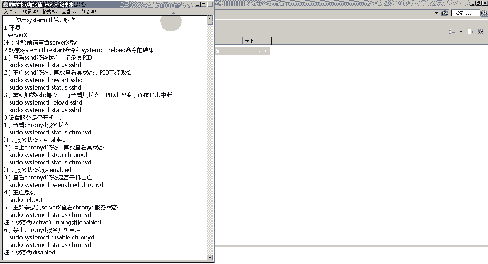

好了我们来看这个第11个实验啊，配置防火墙啊，配置防火墙，那我们会一步一步给大家演示这个实验啊，并且给大家梳理一下这个实验，它主要的这个步骤，还有它的目的是什么，好我们看一下啊，首先第一个实验环境。

我们的实验环境是surrx跟dex top x啊，这个首次用到了在我们的20c一里面，首次用到了两台虚拟机啊，两台虚拟机这个server x实际上就是server杠h254 ，这台虚拟机啊。

它的主机名是server 0，然后这个desktop x就是dex top gui h x啊，他的这个主机名就是desktop 0啊，这个之前我们在第一课的时候，给大家介绍过了啊，介绍过了。

然后在实验之前一定要把他们俩给重置啊。

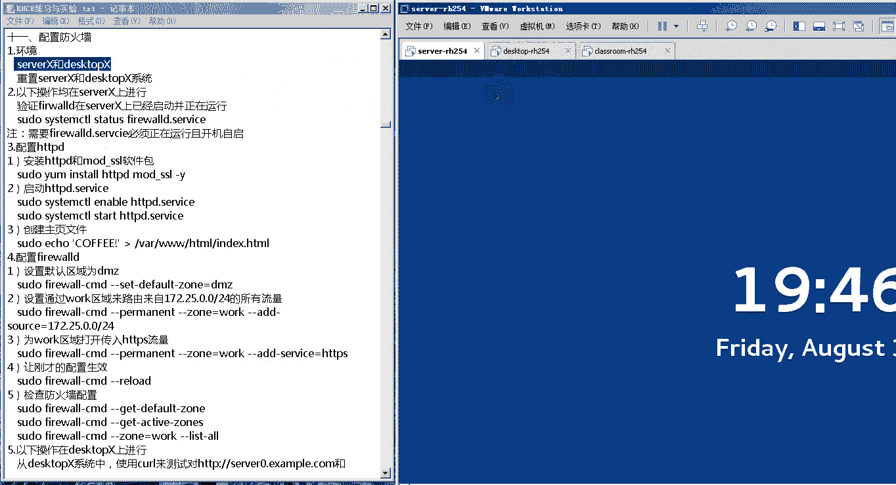

这个我们已经把它重置了啊，已经把它重置了，那接下来我们来登录一下我们的这个server，h2 m4 ，我们做实验的时候还是直接使用root账户登录。

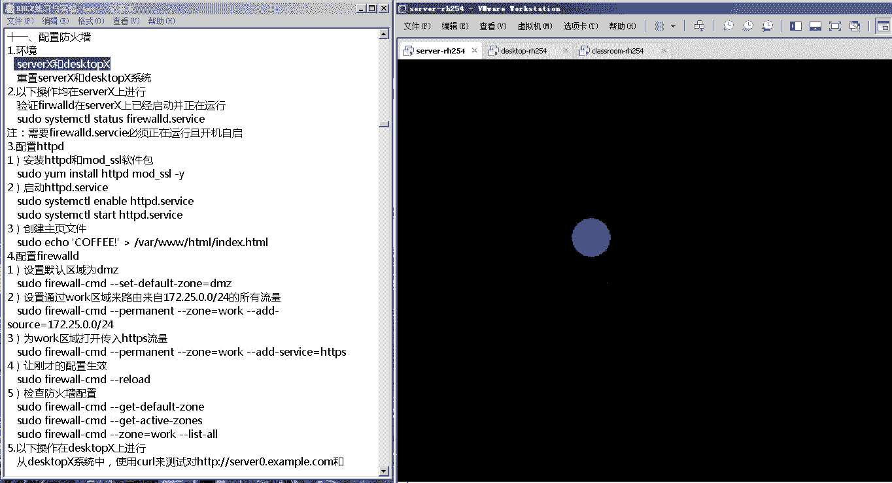

嗯好了啊，然后我们右键桌面打开一个终端啊。

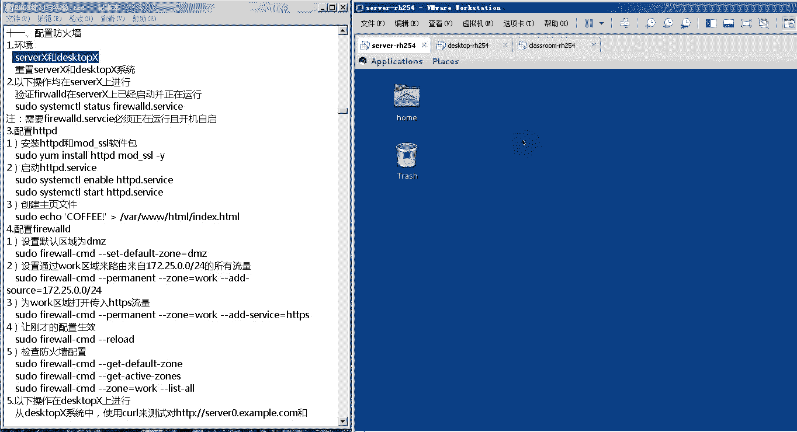

打开终端，因为我们这个实验需要用到我们这个firewall，所以我们现在在server 0上查看一下，我们这个firewall防火墙的状态，看它是否是已经启动并且正在运行。

那就是system c t l status firewor，啊可以看到他当前的状态是active running，并且他在第二行里的这个状态是引a包的，这就代表它不仅当前正在运行。

而且它是跟随系统开机自启的，跟随系统开机自启好了嗯，接下来我们来配置一个阿帕奇啊，配置一个阿帕奇服务器，那首先我们先安装阿帕奇的这个软件啊，y u m install啊，这个软件名叫做http d啊。

htp d，然后我们要配置一个http s的服务器，所以还要加这个模块，就是mod杠s s l，来进行这个https s的服务器的一个搭建啊，所以说我们装了两个软件，第一个软件是http t。

就是我们说的这个阿帕奇，用来搭建我们的web服务器，然后mod s s l是它的一个s s l模块，通过这个模块的安装，我们可以实现这个http s协议的访问，然后直接安装就可以了。

然后大家伙一定得注意啊，我们这个是从哪安装的，实际上哦我们的这个server杠h254 ，也就是server 0这台机器，它的亚本源在你还原快照的时候，已经给你配置好了，它是从哪台机器上下载的这个软件。

并安装呢，是从我们这个class room杠h254 上啊，class入门gr这四场诶，最后出现completely，这代表我们的软件已经安装成功了，好安装成功了之后，我们来启动这个http的服务。

那就是system c t l start，htp之后我们再把它这个服务设置成开机自启，那就是引爆h t t p d，这两条命令虽然特别简单，但是特别重要啊，我们后期在考试的时候啊。

几乎每一个搭建好的服务都要运行，这两个状态啊，都要运行这两个命令，就是sem c t l star，然后后面加上服务的名，再把它设置成开机自启，cm c t l e a报啊好了。

那我们来创建一个主页文件，这个主页文件就是我们客户端，访问我们的这台服务器的时候，能够看到的那个网页文件，那我们就echo这个文件的内容叫做咖啡，注意用单引号把它括起来，不要用双引号啊，不用双引号。

然后把它放到哪呢，放到vr下的3w写的html，然后写入到这个文件里边，叫做index。html，注意这个文件默认是没有的，然后我们创建了一个index html，使用这种输出重定向的方式。

然后这个文件里的内容就是这个coffee coffee，然后这大家伙一定要注意啊，就是这个文件名必须得叫index html，不能叫其他的这个文件名啊，不能叫其他的文件名。

因为这个文件名是我们这个阿帕奇web服务器，它的主页文件的默认名字啊，所以说这个一定得注意好了，那我们现在可以看一下我们刚才的这个操作，成为成功。

那我cat war下的3w的html下的index tml a，可以看到里面的内容是coffee啊，没有问题好没问题好了，那其实现在我们就可以在我们的这个dex top上。

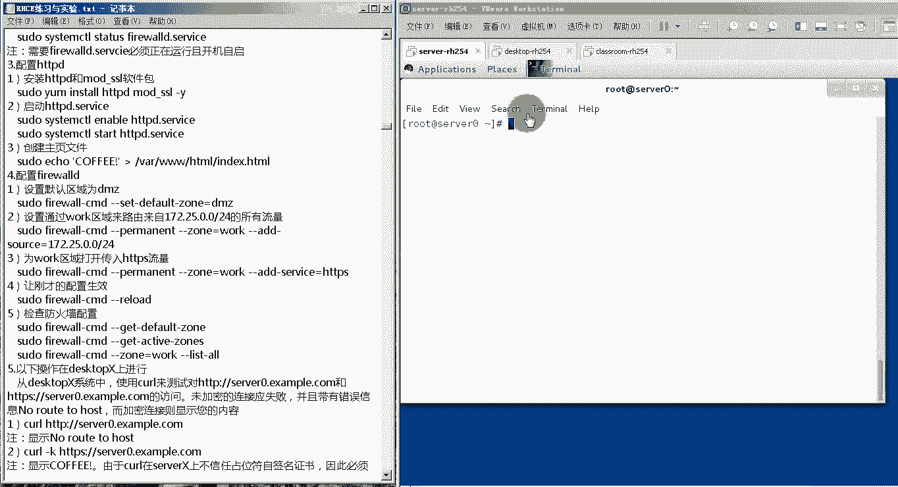

来访问我们这个server上的这个网站。

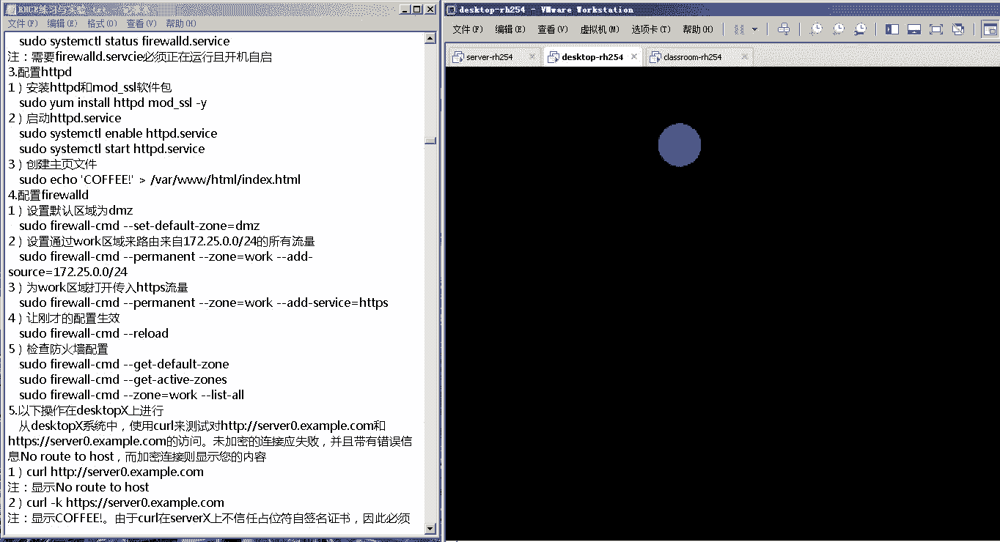

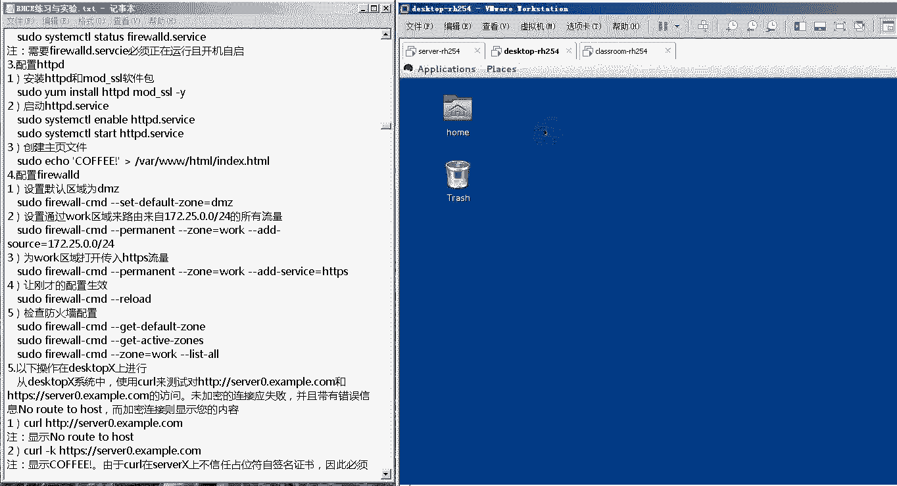

好了，我们右键打开，右键打开，然后访问网站的时候，我们可以用这个命令叫做c u l l，这个命令可以查看你的web服务器上面的主页，文件的内容，http冒号双斜杠代表我们通过http协议来访问。

我们的server杠h254 这台机器，那这台机器它的主机名是什么呢，是server 0点example。com，大家伙在敲的时候注意一定不要敲错了，诶，我们可以看到它给我们显示的结果是。

failed connect to server exeter com，mohabno jude，the host翻译成中文，就是这个连接到server 0的example，点com的八零端口失败。

因为这个我们知道http协议，它是通过八零端口对外提供服务的，现在我们的客户端显示啊，连接它的八零端口失败，原因是这个没有路由可以到达主机。

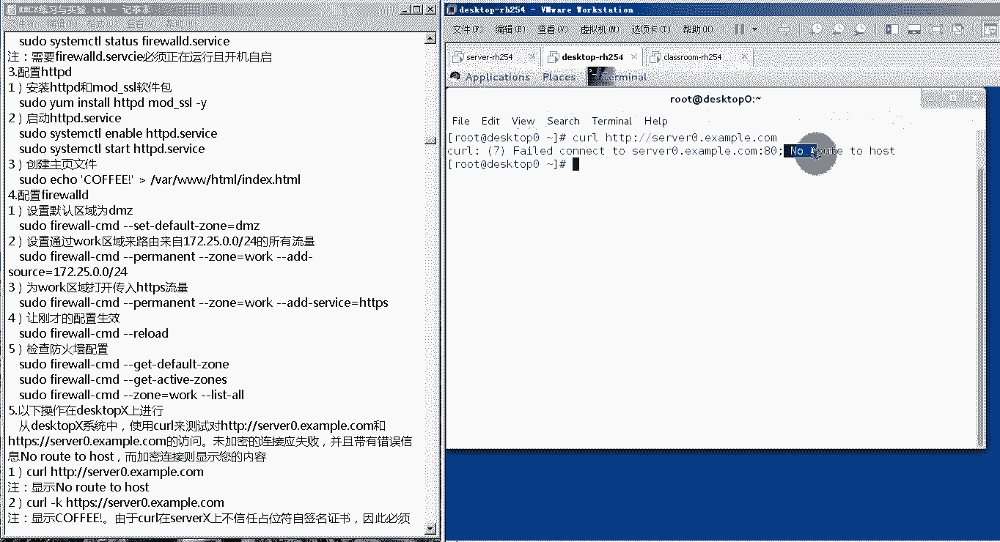

没有路由可以到达主机好了。

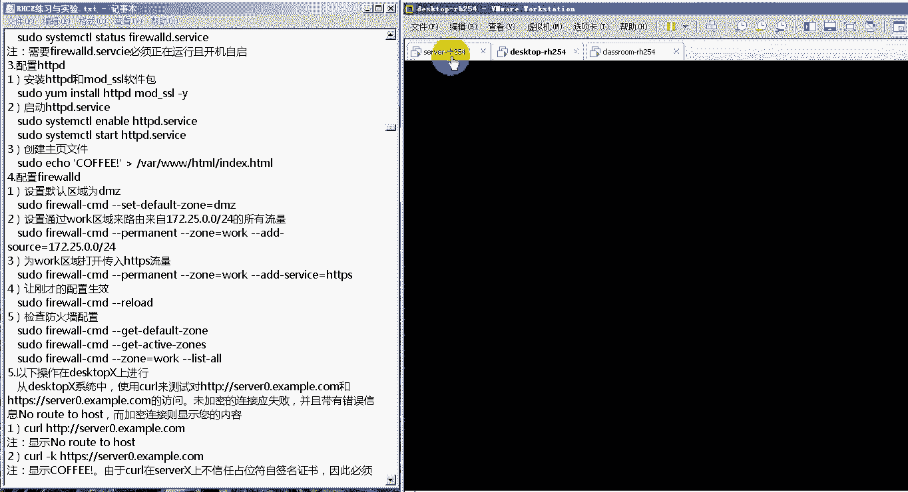

那这个原因是什么，主要还是因为我们在我们这个服务器端，开了我们这个firework的防火墙防火墙，那接下来我们来设置一下防火墙啊，让我们的这个客户端可以访问我们服务器上的，这个http和http s啊。

这些服务啊，那怎么设置，我们来看一下呃，我们现在先把我们的这个防火墙的默认区域，设置成dmz区，那就是firewall gucmd，杠杠set down default zone等于dmz。

注意这个是支持table的，然后大家伙在做这个实验的时候一定得注意啊，注意什么，就是我们这个实验其实主要是给大家演示，如何设置默认区域，所以说大伙不要以为说一定要这么做。

要把它的默认区域设成d哎d m z区啊，这个不是的啊，只不过是我们当前这个实验，他的这个目的，就是为了能让大家熟悉如何设置默认区域，所以他在这里把默认区域设置成dmz。

然后在这里看到显示success啊，代表我们设置成功了，是成功了之后，我们给这个dmz啊，我们给这个zone是walker啊，给worker区域，注意，虽然默认区是dmc。

但是我们现在要给worker区域，这个work区增加一条规则，也是匹配，所有来自172。2，五点点零杠二四的数据包，这个有些同学可能会稍有点疑问，说为什么要设置这个ip地址呢，我们可以简单看一下。

我现在if config看一下我当前的ip地址，可以看到我的ip地址是172。2，五点点一一，然后我来到我的这个dex top上，我衣服config看一下，可以看到我的这个e t h0 的ip地址是。

172。二五点点一零，也就是说我们这个server和我们这个desktop，他俩的网卡都在172。二五点点零，这个网段，他们俩就是通过这个网站来进行通信的啊，所以说我们在这才要设置这么一条规则。

那我们来设置一下，我们来到我们这个server端，firewall杠cmd，杠杠permanent啊，这个命令比较长，所以可以把它table zone等于work。

就是为我们的这个work区域设置一个永久规则，什么规则呢，杠杠i的增加一个原地址，原地址source啊，匹配172。225点点零杠24啊，172。二五点点零杠24传输的数据包。

也就是说我们这个dex top，我们刚才看到他的ip地址是172。2，五点点一零，他在访问我们这个server 0的时候，经过七层风行的封装，它的原ip也就是172。二五点点一零。

那他的这个数据包到达我们这个server 0上的时候，我们的firework就会匹配他这个数据包的原ip，发现它确实属于172。二五点点零，杠24这个网段的ip地址，所以这个数据包就经过work。

这个区域的规则来进行过滤，那我们还要在work这个区域再设置一条规则，让我们的这个客户端，也就是我们这个172。二五点点零网段，发过来的这个数据包，可以访问我本机的h t t p s啊。

那就是firewall港cmd杠杠permanent，杠杠zone等于work，杠杠爱杠service，杠杠i的杠service，就是增加一个允许客户端访问的，这么一个服务啊。

我们是h t t p s啊，当然我们可以用firework gc md杠杠list guo，杠杠zone等于work，查看一下这个work区域当前的配置啊，当前的配置诶。

可以看到当前它运行的这个状态下的配置，并没有我们刚才新添加的这两条规则，这个原因是什么，我们之前跟大家伙说了，因为我们在添加规则的时候，用的是这个permit永久添加。

所以如果你想让你的这个永久添加生效的话，我们需要重新加载我们的这个防火墙的配置，所以是杠杠reload，好了重新加载之后，我们再来看一下它的这个work work，可以看到这里边加了一个匹配172。2。

五点点零杠24的原地址的这么一条规则，然后允许我们的客户端访问他的htp啊，允许客户端访问我们的http s，好了啊，那接下来我们就可以检查一下防火墙的配置啊，这个方面的配置。

就是我们的这个fireword的几个命令啊，gc md比如说杠杠get gun default zone，查看一下当前的默认区啊，可以看到是dmz dmz，这是我们刚才修改过的。

然后非要我杠cmd杠杠get港active准啊，可以看到我当前活跃的区域有dmz区域，还有这个work区域啊，walk区域，然后firewall gucmd，杠杠作文等于work，杠杠list。

刚好这是查看我们这个work区域，它的这个规则好了，那我们这个规则就设置完成了，设置完成了之后啊，我们来到我们客户端再来尝试一下，再来尝试一下。

首先c o l http冒号双斜杠server 0点example。com，诶，可以看到跟刚才的显示结果是一模一样啊，还是no root to host啊，这个原因是什么呢，原因是这样的呃。

我访问server 0点example。com的时候，实际上我访问的就是我们这个server gui h254 ，其实你访问的就是它的172。2，五点点一一这个ip地址啊，这个是它的域名。

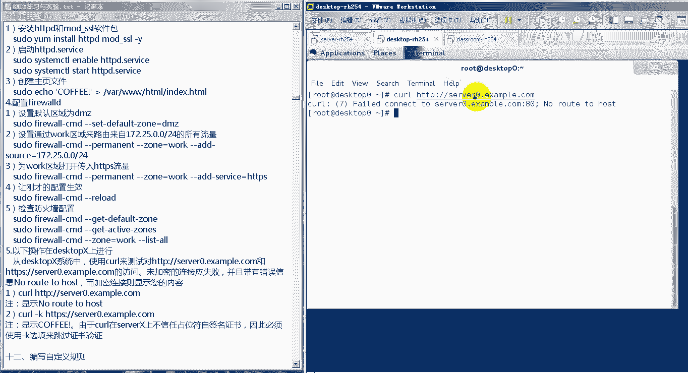

这个他之所以能够打开这个ip地址，是因为我们的classroom上有一台dns服务器啊。

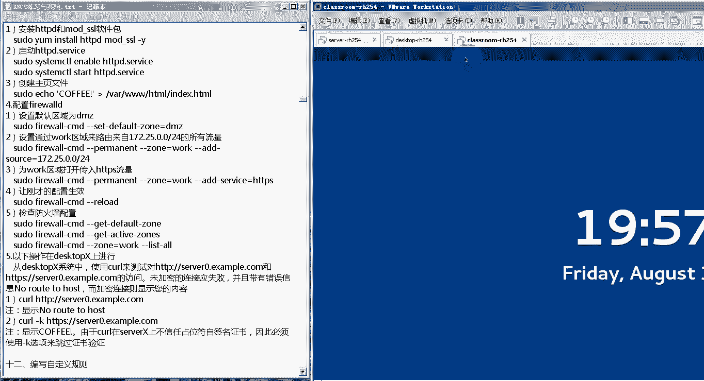

然后这台dns服务器，可以对我们所有的其他主机的这个域名，进行一个解析，所以说通过这台classroom上面的这个dns服务器，我们把这个server 0点excel。com，就成功的解析成了172。

二五点点一，当然你也可以用一些相关的命令来查看啊，server 0点x咱们跑点坑好，可以看到它的地址确实是172点，025。1，这个n s6 cm，这个命令用来查看你的这个f q d n。

它对应的ip地址啊，可以看到我用的是172。25。254，2。254，也就是classroom上这个服务器啊，它的ip地址是，这个对外提供服务的端口是53，因为dns的端口是53。

然后我要解析的域名是server 0点excel。com，就是我刚才后边写的这个域名，解出来，它的ip是172。二五点点一一，也就是这台机器，那既然能够解析了。

为什么访问它的八零端口显示no root to host呢，原因是这样，当我客户端访问我们这个server 0这台机器的时候，它要经过七层模型的封装，那七层模型的封装在第三层，他要封装与ip和目的ip。

那原ip就是我们这个数据包发送者的ip，所以这是172。二五点点一零，目的ip是我们的这个server，也就是你的这个目标服务器的ip，也就是172。二五点点一，当这个数据包发到我们这个server。

杠h254 上的时候，就是server 0上的时候，server 0上面开启了ip boss，然后我们的ip t box在我们的这个，在我们的这个work区域啊，我们设置一条规则，说，所有从172。

二五点点零杠二四，这个网段来的数据包，也就是从dex top这个网段啊，它本身就在这个这个ip地址，就在这个网络里来的数据包，都要经过我们这个work区域过滤，然后沃克区域只开了http s。

没有开放http这个服务，所以说你的客户端访问不了，那我们刚才开放的h t t p s，也就是说我们的客户端可以访问http s，我们可以试一下。

那就是c u r l杠k https冒号双斜杠server，零点x example。com，诶，可以看到显示的就是我们那个服务器上，主页内容的呃，主页的这个内容，然后这里边有一个参数是gk。

这个gk是什么呢，因为我们在通过htp访问一个服务器的时候，需要验证你的这个服务器证书的有效性啊，但是我们在服务器上没有设置任何证书，所以说加杠k就是跳过这个验证证书的过程，如果不加的话。

那就访问不了啊，那截止到这儿，我们这个实验就已经完成了，然后在这个实验的基础上，我们其实可以稍微拓展一下，我们刚才看了啊，我们直接访问它的八零端口的时候，它显示的是访问不同的。

原因是我们在这里边没有开放的八零端口，那如果我们把八零端口开放一下，我们再看看客户完整不能访问，那我们来开放一下八零端口，那就是firewall cmd，杠杠还是permanent啊。

杠杠zone等于哪一个区域啊，我们还是work区域，因为work区域它会过滤所有172。2，五点点零杠二四这个网段来的数据包，然后给它添加一个服务，或者添加一个端口都行，如果是添加一个服务的话。

就是杠杠i的service哪个服务呢，http那同样你也可以用杠杠pot等于八零tcp啊，这样效果的话是一样的诶，显示success之后，我们这个操作还是在我们的这个永久模式下，来执行的。

所以说我们还要杠杠reload，重新读取我的文件，让它生效好了，然后我们在firework gc md杠杠list杠哦，杠杠zone等于work，查看一下work区域好。

可以看到这里边的tcp的八零端口已经打开了啊，那么接下来我们再来访问一下诶，可以看到就能够看到你的这个主页文件了，这就是我们的第一个小实验啊，第一个小实验，让我们再来通过一个简单的画图。

来给大家解释一下这个实验的具体内容，在这个实验里边，我们用的两台机器，一个是server 0，一个是dex top 0，一个是server 0，一个是desktop 0。

然后我们server 0的ip地址是一九二点168点啊，不是192。168，是172，sorry啊，是172。二五点点一一杠二四，然后它的域名也是他的f q d n是server，零点example。

com，然后我们的客户端客户端的ip地址，是172。二五点点一零杠24224之后，我们在我们的这个server 0上，我们装了一个软件，就是这个htp，然后我们在它上面创建了一个主页文件啊。

这个主页文件在哪呢，在这个rua下的3w下载html，下载叫做index 4点html啊，这么一个文件里面的内容就是我们刚才的coffee coffee，然后这些编辑完成了之后啊，我们在客户端的时候。

我们通过这个命令啊，通过这个命令来尝试，连接到我们这个服务器的八零端口，八零端口啊，但是我们发现在我们的客户端，却没有看到你的这个主页文件的内容，原因是我们刚才看见的那个报错。

它提示说八零端口这个无法连接，原因是什么，原因是我们在这个server 0上开启了这个firewall，然后在firework里边我们制定了一条规则，什么规则呢，就是所有，从172。二五点点零杠24。

网站过来的数据包，都要经过这个work区work区域的这个过滤，然后并且在work区里边开放的这个服务，是h t t p s啊，是htb s，并没有开放htp啊。

所以说当我们在访问他的这个http的服务的端口，就是八零端口的时候，会访问失败，那我们的解决方案是什么呢，就是我们在这个work区域里边，再加上这个http s http这个服务，或者开放八零端口。

那它就可以访问了，然后我们刚才这个操作的时候，当我的这个客户端访问的是我服务器上的，http s的端口上的时候，就可以直接打开我们的这个主页文件的内容了，啊，这就是我们这个小实验。

然后这里边可以给大家简单拓展一下啊，htp s它的端口是tcp的443，是tcp的443，好了啊，这就是我们今天的第一个实验啊，第一个实验，让我们把我们的这个机器还原一下啊。

这样的话方便我们执行下一个实验。

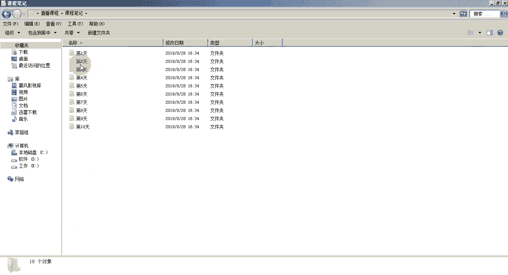

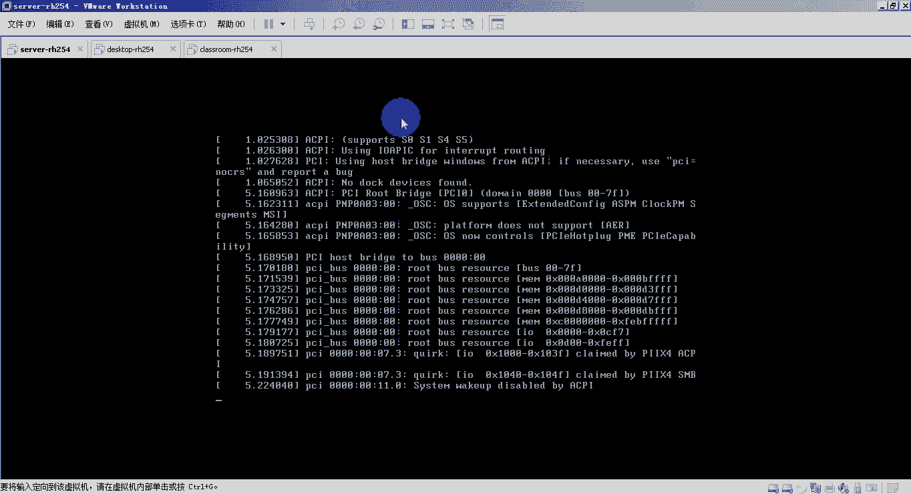

好了，接下来我们来看一下，我们今天的第二部分的内容啊，第二部分内容，第二部分的内容主要是firework，这个负规则的使用啊，firework的负规则的使用，这个复规则语言。

可以让我们的firework支持更加丰富的这个配置啊，这是更加丰富的配置，这个负在这里就是丰富的意思啊，丰富的意思，那首先第一个我们得知道这个ip tables啊，这个firework啊。

它的规则添加的规则有哪些啊，一种是直接规则，一种就是负规则，这个直接规则在我们本次课程里边没有涉及啊，所以说大家伙这个简单了解就行了，就知道他有这么一个直接规则就行了啊，直接规则行了。

但实际上这个直接规则跟什么规则比较像呢，跟我们这个ip tables的这个规则的写法，其实是比较类似的啊，但是我们这个课程里面没有涉及啊，所以说我们在这就不赘述了，第二个就是我们支持这个负规则啊。

负规则，这个负规则跟我们普通的ip tabs的规则相比，就是它可以让你的这个配置更加灵活，而且它支持更多的功能啊，支持更多的功能，然后当我们的这个ip这个fireword里边，既有这个副规则。

又有普通规则的时候，这个一定要注意规则的排序啊，也就是说你规则这个排序，最终会影响你的这个规则的生效情况啊，生效情况这个默认的这个排序方式，我们是这样的，首先就是为某一个区域设置端口，转发和伪装规则。

然后再为这个区域设置一些记录规则，比如说哪些数据包或者哪个客户端的访问，我们把它记录到某一个日志里边，在为这个区域设置一些允许的规则，那就是哪些客户端或者哪些数据包可以进来，然后再设置这些个拒绝规则啊。

拒绝规则，但如果所有的规则都不匹配，那么我们通常就是采用默认规则，那默认规则通常都是拒绝啊，都是拒绝，那我们的这个fireword它的这个调试啊，它的调试是我进行调试，是这样的，为什么要说这个调试。

就是我们有些时候出于这种测试的目的，可能要给我们这个fireword加上一条规则，但是这条规则它是有些危险的，比如说你加完这条规则之后，可能会导致你与你的这个firewall所在。

这台服务器之间就断开连接了啊，断开连接了，那假如说这个规则它有这样的风险，那一旦出现这种断开连接的话，那我们就没办法再来更改了啊，没办法再来更改，那怎么办呢，我们可以采用这种调试方案。

调试方案就是什么呢，当你在指定条规则的时候，后边可以加上一个参数，叫做杠杠time out啊，就是这个规则的生效时间，后边加上一个具体的时间啊，默认单位是秒，那这个规则只会在你的这个指定的时间内生效。

超过指定时间内，你的这个规则它就超时了，就失效了啊，这样的话就方便我们对这个firewall防火墙，它的这个规则的调试啊，所以说这个就是太太这个杠杠太慢了，这个操作，那我们如何来使用负规则呢。

在这里边有一个负规则的这么一个使用的例子，我们可以看啊，如果增加一个负离子，就是杠杠i的rich弱啊，这个也比较好记，杠杠i的添加这个rich啊，rich就是这个丰富富有的意思啊，raw就是规则。

后面用单引号里边加上你的这个副规则，如果要删除的话，就是杠杠remove ritual啊，就是把这个i换成remove就可以了，如果查询复规则的话，就是杠杠这个curry啊，这个就是查询的意思。

如果要列式复规则的话，就是刚刚list啊，刚刚list rich住，那接下来下边有几个这个负规则，它的这么一个事例，我们来简单看一下，比如说这个拒绝来自classroom区域里边，ip地址为192。

168点点一一，的所有流量啊，那我们就是这样写啊，firewall cmd，然后杠杠permit啊，这个permit就是永久添加的意思，然后杠杠作文啊，因为我们指定的区域是classroom。

然后杠杠i的rich roll啊，增加一个规则啊，增加一个负规则，这个复规则是什么呢，rural family啊，就是你的这个复规则是对i p v4 ，还是对ipv 6生效的啊，这是i p v4 。

也就是说它是对i p v4 的数据包生效的，然后source address对哪些数据包呢，就是原地址是192。16，八点点113 12啊，就是你指定的这个原地址的数据包，执行什么动作呢。

叫reject啊，reject是我们这个防火墙规则里边，一个执行的动作啊，reject的一个动作就是拒绝的意思啊，就是拒绝的意思，那如果我要是想让我们的这个数据包，可以访问的啊。

或者说我们接收这个数据包呢，那就是accept，我们可以看一下下面这个例子啊，说在默认区域里边，允许每分钟对ftp有两次新连接，the firewormd，刚刚爱的rich ro增加条幅规则。

然后rule service name啊，就是你的这个负规则，对哪个服务是对ftp这个服务啊，f t6 服，然后limit volume等于二杠m，二杠m就是每分钟两次啊，每分钟两次。

这种数据包accept accept就是接收的意思啊，就是接收的意思，然后我们还可以对数据包执行这个丢弃操作啊，丢弃操作，比如说下面这个例子，丢弃来自默认区域中。

任何区域传入的ip c c e sp协议的数据包，有farewell samd杠杠，permit，杠杠i的rich row等于ral protocol value啊。

就是你的这个规则的协议的值是e s p啊，这种协议的数据包，然后对他执行什么操作呢，job，然后这块有一个问题，就是我们刚才说了啊，如果你想拒绝某个数据包，那是reject啊。

然后这里边也有一个丢弃数据包，job那个job跟reject它们之间有什么区别呢，区别就在于这个reject在拒绝你个数据包的时候，会返回给你的一个主机，一个拒绝的这么一个消息。

而job不会返回任何消息啊，就直接丢弃了，就直接丢弃了，这个就是job can reject，然后下边还有一个例子说，在192。16，8。一点杠二四子网的v n c区域里边，接收端口。

7900~7905以上的tcp的数据包，那就是farewell c m d杠杠permit永久添加杠杠，作文是vn c这个区域里边刚刚i的rich roll啊，后边是rule family。

等于i p v4 啊，这就是你的这个规则，是对s i p v4 的数据包生效，然后source address，source address，就是原地址是192。168。1。024。

就对所有192168。1。024，这个网段啊，进来的数据包，然后端口7900~7905，所有的tcp的数据包全部都接收，全部都接受，也就是所有来自于192。16，8。一点零二二十四访问我。

目标端口是7900~7905的tcp数据包，全部都接受，最后还有一个就是可以使用负规则来进行记录，来进行记录，这个进行记录，主要是把你客户端的一些个访问啊，给记录到日志里边，给记录到日志里边。

它的基本语法就是用log这个参数啊，用log参数log后面加上一个prefix，等于这个就是你的这个日志里边，记录的这个标题，然后level是你日志的级别。

这个级别主要有这种emerge alert correct，然后还有这个error warning，notice info和debug等等，然后limit volume就是可以设置每隔多长时间啊。

每隔多长时间，或者说呃每隔多长时间，把你的这个日志输出多少条啊，输出多少条，或者你可以把它记录到你这个系统日志里边啊，进入到实时统日这边也行，我们下边这块就有一个例子啊。

就是接收从work区域到s h的信息链接，然后这些个连接把它记录到日志里边，并且日志的这个级别是notice，并且这个日志每分钟最多记录三条，记录到系统日志里边，也就是firewormd杠杠。

permanent，杠杠zone等于work杠杠，at rich rule，增加一个负规则，然后service name对于哪一个服务呢，对于s h记录到日志的时候。

日志的这个标题就是s h就是日志每一条日志，它最前边你的这个日志的开头是ssh，然后日志的级别是notice，就是注意的意思啊，然后limit注意每分钟最多生成三条。

然后对你的这个s h的访问是可以允许通过的，所以accept accept下边还有一个例子，就是在接下来的五分钟内，将拒绝从默认区域子网，这是一个ip v6 地址啊，到dns的新i p u连接。

并且拒绝的连接记录，可以记录到我们的这个系统里边啊，而且每小时最多一条，那就是farewell md，康康rich啊，i的rich ror family等于i p v6 。

因为这里是i p v6 的ip地址，所以我们这个family就变成了ipv 6，source address，就是你的这个原地址就是ip v6 的这个原地址。

然后service name访问的是dns服务，把它记录到系统日志，并且每个小时最多一条消息，并且我们是拒绝连接，所以执行的动作是reject reject，然后后边这块有一个杠杠。

time out等于300，比如说这个规则它会在300秒内生效，300秒之后啊，它就失效了，这300秒就是我们题目里边的这个五分钟，这个就是我们的一个负规则啊，一个负规则。

那接下来我们还是通过一个简单的小实验，来看一下这个复规则它如何应用，以及复规则里边最常用的这些命令，好了我们来看一下第12个实验啊。

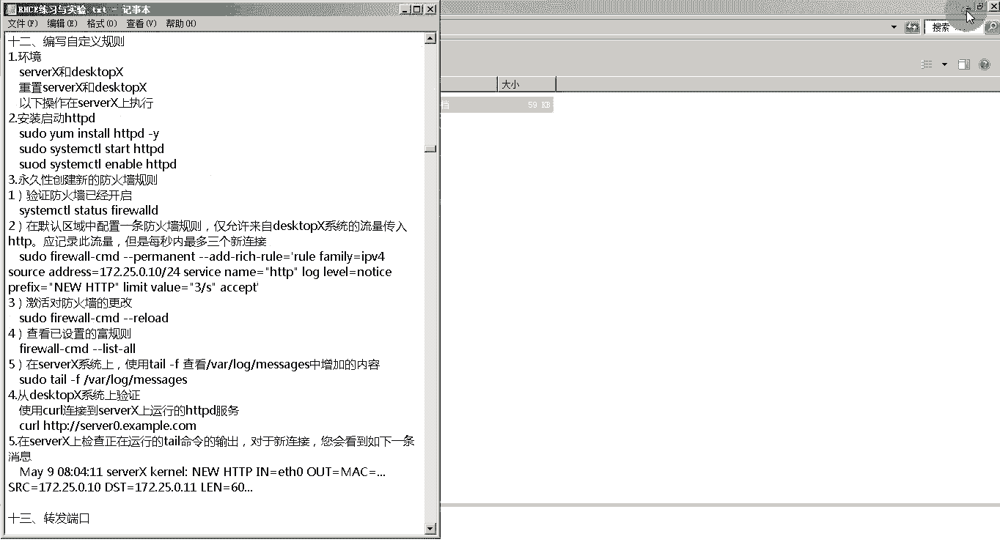

就是编辑自定义规则啊，编辑自定义规则，好了，那我们这个实验用到的还是我们的这个server x和。

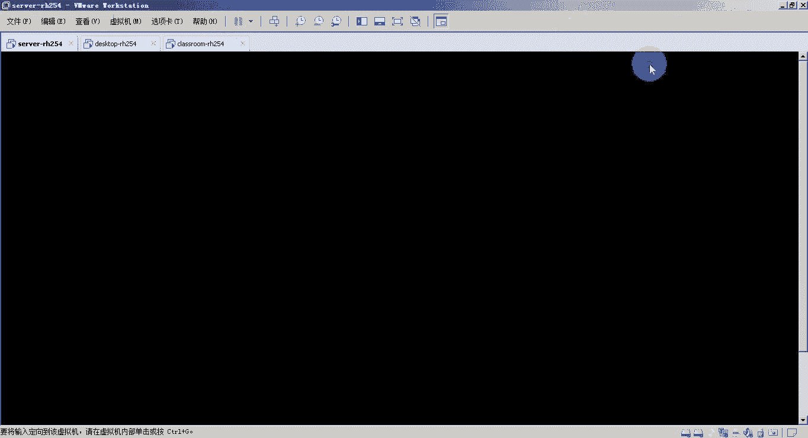

dex top x，也就是用了我们这个server杠h254 和dex top，杠h254 这两台机器啊。

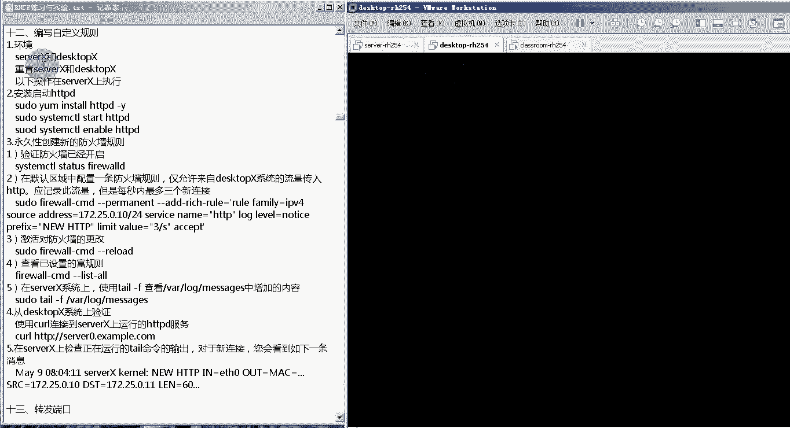

在做这个实验之前，首先要把这两台机器给重置啊，这个我们刚才已经重置过了啊，这样的话比较节约时间，然后以下操作均在server x上执行啊，所以说我们来到这个server x上啊。

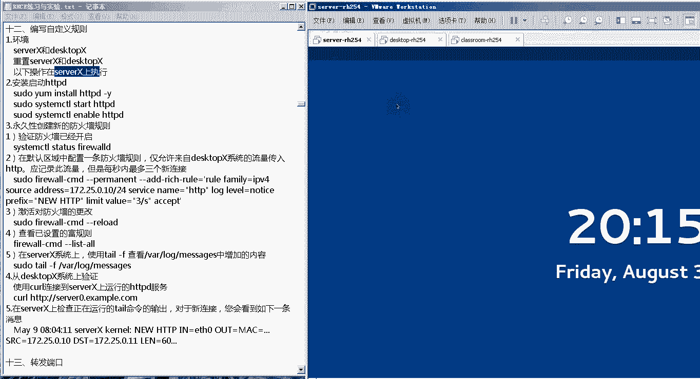

实际上他的这个主机名是server 0，然后我们登录一下，使用录的账户登录。

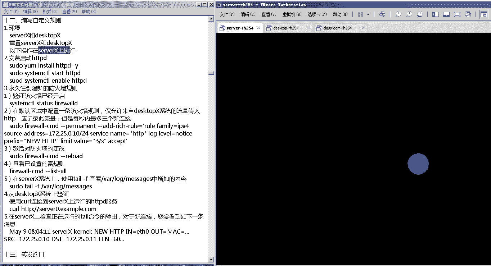

好了，那我们这个实验还是需要搭建一个web服务器，搭建一个web服务器，那我们现在就搭建一个web服务器，我们右击桌面，然后open terminal打开终端，然后搭建一个web服务器。

我们首先需要下载搭建web服务器的这个软件，那就是y u m install杠y h t t p d啊，注意还是我们上一个实验用到的这个软件，http t啊，这个我们叫做阿帕奇回撤，然后大家注意啊。

如果你自己在做实验的时候，安装软件的这个过程中出现任何问题，比如说安装软件安装失败啊，那很有可能是你的这个网络问题导致的，也就是说你的这个server杠h254 。

这台机器和我们的classroom杠h254 ，这台机器的网络有问题，那这个时候怎么办呢，最好把你的这个server杠h254 。

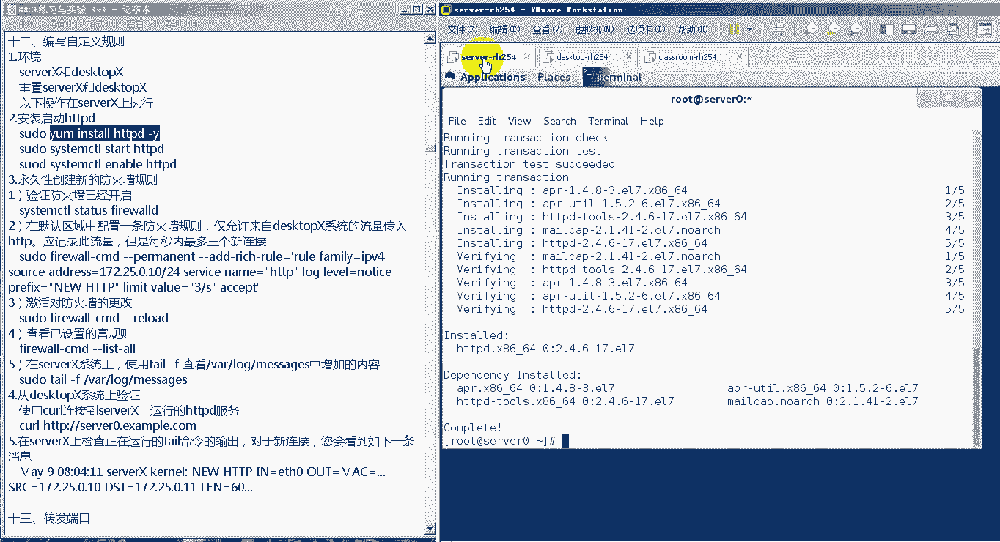

把它还原快照再重试，如果还原快照再重试，还是这个问题的话，那你就把这三台机器全部还原快照，然后先开启classroom 2，加入四，等它完全开起来之后。

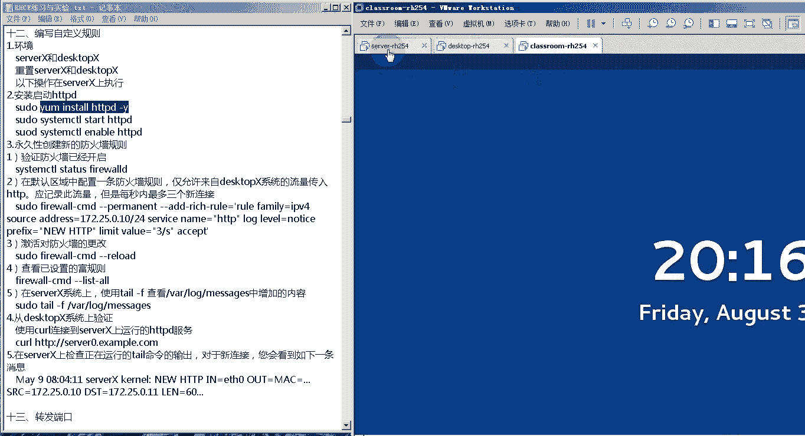

再开启server杠h254 和dex top杠h254 ，然后再重试重试，那我们这块已经显示安装成功了，注意大家伙在安装软件的时候，最终一定要看到末尾显示completely完毕。

才代表你这个安装成功了啊，安装成功了，这个一定得注意看啊，一定得注意看好了，安装成功了之后，我们来启动我们的这个服务，system ctrl start叫做http t，把这个服务设置成开机自启。

就是因able，http t在用我们这个前两天学习的这个命令，来查一下它的服务状态啊，htt可以看到它现在是active running状态，就是正在运行，并且这个服务会跟随系统开机自启啊，可以起好了。

那我们来看一下我们当前防火墙的状态，那就是system c t l status firework啊，firewor可以看到防火墙当前也是active running状态，并且他也跟随系统开机自启啊。

也跟随系统开机自启，然后我们的这个实验啊，我们的这个实验，主要是做一个这个firework的负规则，然后把客户端的对我们的这个服务器，也就是desktop，对我们server gun h254 。

这台服务器的访问给记录到日志里，记录到日志里，所以在这个里边我们就不创建这个主页文件了，我们在这里边就不创建主页文件了，那我们直接来配置我们这个防火墙规则啊，防伪规则。

那就是firewall杠c m d，注意我们都是用root账户登录的，所以这里边带速度的我们都不用敲啊，因为本身都是root账户，大家伙在做实验的时候也可以使用root账户啊，但如果你是普通账户。

比如说是student的话，那你执行这些命令的时候，前面都要加速度，不然的话你没有办法执行啊，这个速度是我们的这个权限，这个在r h c里边已经有介绍了。

所以firewall杠samd杠杠permanent啊，永久添加杠杠i的杠，rich杠，若添加一个负规则，注意这个负规则的写法，你如果不写等号，直接写这个负规则其实也是可以的。

但是我们的这个推荐的方式还是写上这个等号，然后两个单引号啊，两个单引号，这个建议大家伙在编写负规则的时候，先把这两个单引号写好，这样可以防止避免你只写了一个单引号，到后来写完富贵则的时候。

忘了加这个单引号的另一边啊，另一边，然后我们再把这个光标与dota引号里边，再增加我们的规则啊，rule family等于i p v4 啊，范围等于i p v4 啊。

也就是我们是对ip v4 的数据包进行过滤，然后source address，对ipv 4的原地址是172。二五点点一零。

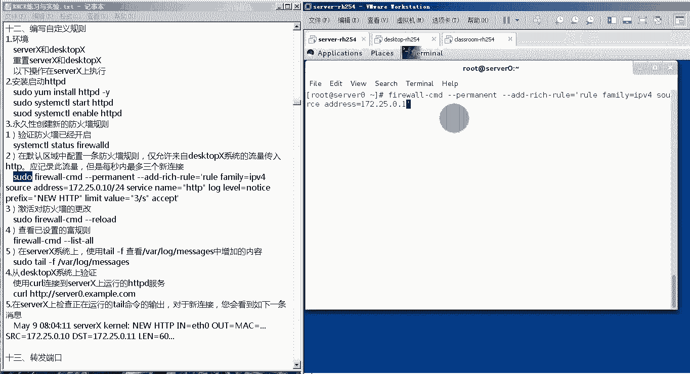

杠二四，这个172。二五点点一零，实际上就是我们这个dex top，这台机器网卡的ip地址。

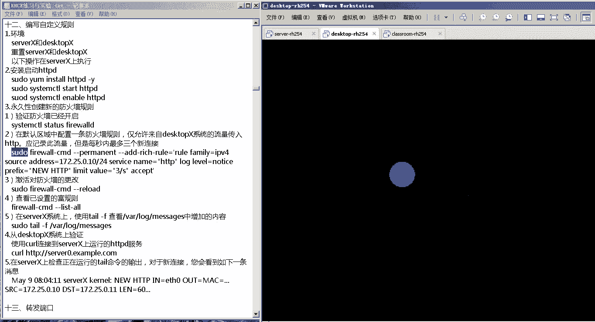

好了。

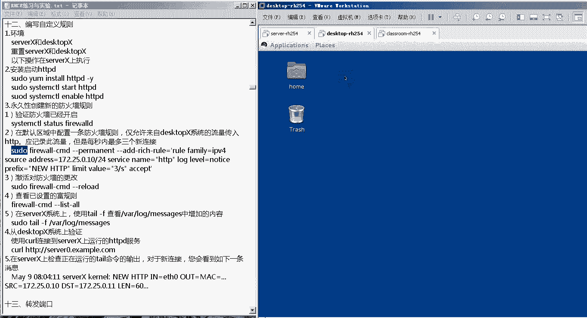

我们现在来到这个dex top上，我们可以看一下，if config诶，可以看到他的ip地址，e t h0 ，上面正好是172。二五点点一零啊，所以在这里边就是对我们dex top。

发网server的数据包进行一个匹配，当匹配上了之后，我们再给它增加后面的规则啊，service name等于http，也就是我这个desktop 172。二五点点一零。

发往我server 0上面的访问，我server 0上http的这些个数据包，把它给进行日志记录啊，记录到日志里边，所以log，然后log要指定你的这个日志级别叫做level leg。

lower等于什么呢，等于notice啊，notice就是提醒，然后prefix就是你的一个日志记录，它的这个标题哈，等于new http，然后limit value等于三杠s啊，就每秒钟最多三次。

但是对于这个数据包，我们执行的动作是什么呢，是a k sept，那是accept，这样的话我们就添加成功了，但是添加成功了之后，你注意我们没有指定你是在哪一个区域，所以它是在默认区域。

让我们firework on cmd，杠杠get，当做看一下我们的默认区域啊，诶他提示我这个命令写错了是吗，杠杠get啊，不是刚刚get作文，是刚刚get default作用啊。

组可以看到默认区域是public，然后我firework杠cmd杠杠list杠哦，注意这个命令没有指定哪个区域，他查的就是默认区域，可以看到默认区域public，我们刚才添加这条复规则没有成功啊。

如果他是成功的话，它就会在这个rich rule里边就会出现啊，为什么没有成功，其实也不是没有成功，是没有生效，是因为我们刚才在添加的时候，我们是添加到永久状态啊，就是刚刚permit。

所以说如果想让它生效的话，还是得重新加载配置文件，那就是firewall gun samd，杠杠reload，刚入的啊，只显示success，那success之后我们再来查看一下诶。

可以看到在rich rules下边有一条复规则，这个复规则就是我们刚才添加的规则啊，好了，那接下来我们来看一下，我们这个系统日志文件啊，til杠f y下的log下的messages。

tl杠f y log下的messages，这个wah的log下的message，则是我们linux操作系统的系统日志文件啊，系统日志文件，til杠f就是读取这个日志文件的末尾行啊，末尾行。

因为日志文件再往这个文件里面记录的时候，它有一个特点会记录在这个文件的末尾啊，我记录文件的末尾，所以说我们现在是一直查看这个文件的末尾，好了，那我们来到这个desktop上。

我们在dex top上来访问一下啊，我们的这个服务器还是用这个cl这个命令啊，来打开我们的这个server 0，这个咱们刚才画图给大家演示了这个server 0。

也就是我们的这个r h杠254这台机器啊，机器我们来访问他的主页，诶它显示这个name或者是名字写错了啊，server 0点x example啊，少打了一个a http冒号双斜杠。

server 0点x example。com，诶可以看到啊，这显示了一个页面，这个页面实际上是我们阿帕奇的一个配置页面，啊，配置页面，这个如果要是用我们的这个狐浏览器的话，可能效果会更好一些啊。

我们用火狐浏览器来试一下，这个我给了他四个g的内存的话，所以还是学文的，有些卡，server 0点x3 p。com。

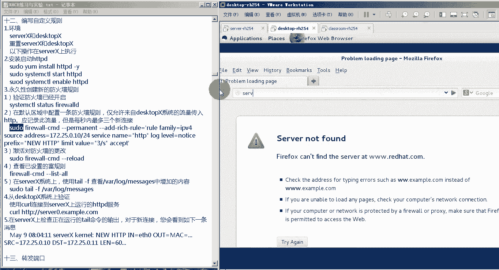

诶，可以看到啊，这是一个linux的测试页面啊，这刚才实际上就是这样的啊，就是这样好了，那现在我们这个客户端已经访问服务器了，我们在服务器上面就可以看到我们这个日志了，可以看到这个日志的格式。

首先是日志的时间，然后是哪台主机上的日志，我们是本机，所以是local host，然后谁发出的日志，kernel就是内核发出的日志，然后日志的开头是http啊，这个htp。

就是我们在我们这个负规则里边设置的啊，这然后在这里边提示说你的这个mac地址是多少，然后ip地址是多少，目的ip地址是多少，这个数据包访问了我本机的这个http，那能看到这两条记录。

就代表我们这个实验就已经成功了，就成功了，然后呢，我们再来通过画图来给大家简单总结一下，这个实验它的这个步骤，诶点错了，sorry。

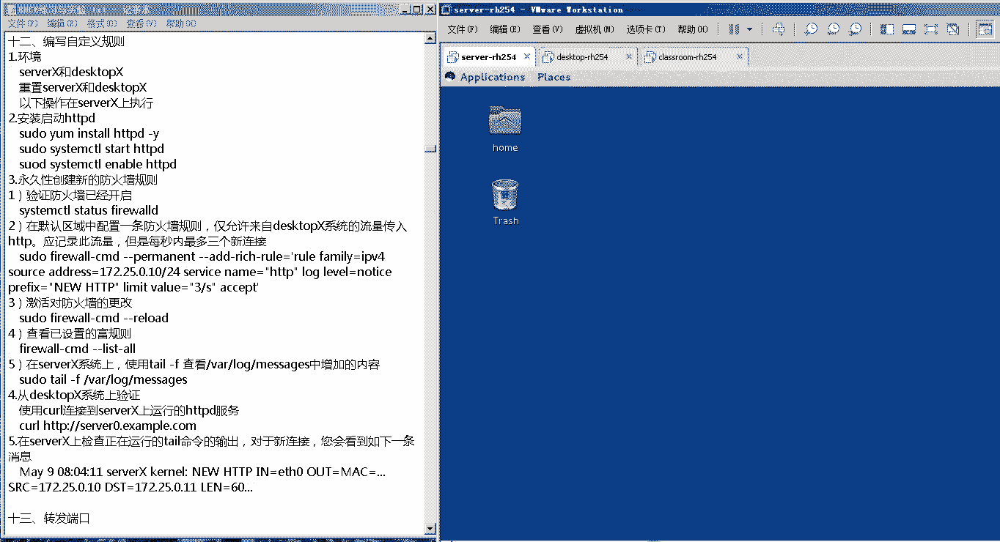

好了这个实验我们还是用到了两台机器啊，一个是server 0，一个是dex top 0，一个是server 0，一个是desktop 0，然后server 0它的ip地址，是192啊。

总是说1922172。二五点点一，一个二四，他的f q d n就是它的完整域名，还是server。x3 分炮，点com x3 com，然后我们在这上面配置了一个安装了一个http啊，装了一个htb d。

这样的话它就变成了一个web服务器，然后我们客户端就可以访问这个web服务器，注意客户端的ip地址时，172。二五点点，112 十，0。1024啊，0。1024好了。

当我这个客户端访问我的这个server 0的时候，其实它是向他发送这么一个数据包的过程，发送数据包的时候，我们都知道需要经过这个七层模型的封装啊，那在七层模型的第三层，我们要封装与ip和目的ip。

那在这里边有ip，就是我们的这个172。25。2，0。10172。二五点点一零，然后我们的目的ip在这里就是172。25，点0。1，那这个数据包在到达我们这个server 0上的时候。

我们在server 0上设置了一条不规则，这个不规则里的内容是什么呢，就是对i p v4 的数据包，注意这个我们的ip地址是ipv 4的，所以说我们这个数据包也是i p v4 的，这是符合要求的。

并且原地址是172。二五点点一零，可以看到我们这个数据包的原地址，正好是172。二五点点一零啊，它也是符合要求的，并且他访问的是我们的这个http服务，而且我们这个数据包确实访问的是我的，htp服务。

那把这个数据包的访问，或者这个客户端的访问记录到日志里边，记到日志里边，然后记录的级别是这个notice notice，然后日志的开头是new http，并且这个数据包是允许进入的，但是我那个日志啊。

每秒这个每三秒，这个每秒钟最多输出三次啊，最多输出三次，所以最终我们就可以在我们这个server 0上看到，客户端访问server 0的这个日志记录啊。

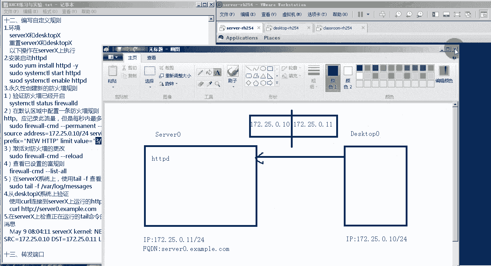

这就是我们的这么一个实验啊，这么一个实验好了，那我们再把这个实验，再把这个实验用到的主机给他换一下快照，再把它开启啊，然后方便我们的下课实验。

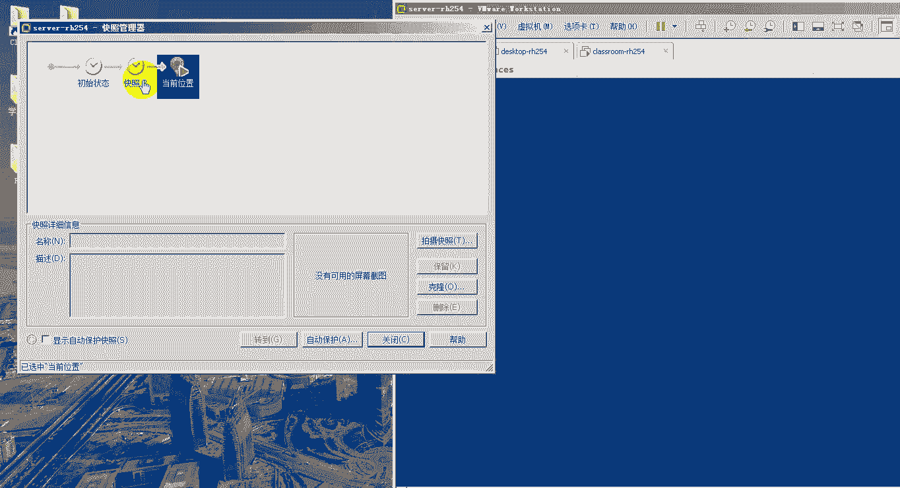

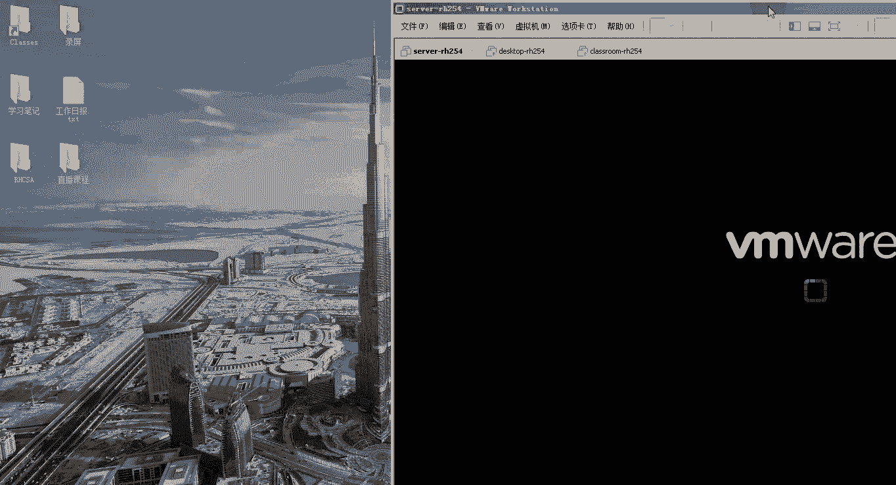

好了，接下来我们来看一下这个fireword，防火墙的一个高级应用，就是通过fireword防火墙来实现这个网络地址转换，nat网络地址转换ad，这个网络地址转化a t是什么意思呢。

这个我们来简单介绍一下啊，我们来通过一个画图来简单给大家介绍一下，我们就不看这个文档啊，这个文档说的相对来说麻烦一些，好了，我们来先说这个nt解决的是什么问题。

它其实主要解决的是这个ip地址不足的问题啊，因为我们的ipv 4地址，它是由32位二进制数组成，然后二的32次方应该是40多亿啊，40多亿，再排除一些不能用的ip地址，包括d类和e类。

还有127这种特殊ip地址，那实际上的ip地址数量是不足这么多的，但是我们这个现在，这个地球上的人口已经70多亿了啊，可能都快到80亿了，所以说这个ip地址是不够用的，那怎么办呢。

这个时候人们就研究出了一个n e t，这么一个技术，那什么叫n a t，at叫网络地址转换，网络地址转换技术，网络技术，然后网络地址转换技术它是如何来实现呢，我们来看一下。

我们通过一个简单的图给大家来看一下，好了啊，现在我们是这样啊，我们现在有两台主机，这两台主机通过一个路由器连接在一起，然后在这个路由器的左边啊，我们模拟它是一个内网环境嗯，或者我们把它叫做丝网环境啊。

四网环境，然后外网啊，右边我们把它叫做外网，或者叫做公网环境，公网环境，然后为什么要设置这个丝网跟公网呢，是这样，我们把ip地址抽出几类ip地址，就是a类b类c类三类ip地址，分别抽出几个地址段。

把它设置成私网ip，剩余其他的ip地址都是公网ip，那在我们这个图里边，我们可以简单给大家介绍一下，那我们这个图里边我左边这台机器啊，我们给他做一个标识吧，他说他是a右边这台机器就说他是b。

那a就是丝网类的一台主机，b就是公网类的一台主机，那丝网的这台主机，它的ip地址就是一个私网地址啊，它的ip地址是一个私网地址，私网地址让我们公网上的这台主机，它的ip地址就是公网地址。

中间是一个路由器，路由器是将两个不同的网络连接在一起的，这么一个网络设备，那跟我们这个丝网内主机连接的这个端口连接，一个端口上边应该也是一个丝网地址，那同理，那它跟我们的这个公网主机领域的。

这个连接的这个端口上面的地址，就应该是公网地址，官网地址好了，那我们现在啊来说这么一种情况，假如说我现在a主机想访问b主机，那a主机想访问b主机，实际上就是一个数据包的发送过程，那这个数据包的发送过程。

就要经过七层模型的封装，那七层模型封装在第三层网络层，我们要封装这个原ip和目的ip，那现在原ip就应该是a的ip，那这个a的ip应该是一个私网地址，目的ip是我们b的ip地址，那应该是一个公网地址。

之后这个数据包发给路由器，由路由器转发给我们这个b主机，但是这里面有一个问题我们需要注意，就是我们这个私网地址，是不允许出现在公网上的，所以当我这个路由器接收到这个数据包的时候。

一看你的这个地址是私网地址，那就把这个数据包直接给丢弃了，它就到达不了我们这个公网上的主机了，但是这样是达不到我们需要的效果的啊，因为我们在访问网站的时候，很多网站服务器都是在公网上。

然后我们的这个客户端，我们的这个家用电脑或者手机，它其实都在私网上，但是我们平时也可以访问我们的这个网站啊，浏览网页，那这个是怎么做到的呢，就是我们需要在我们的这个服务器上，开启一个n a t啊。

nat功能，开启了nt功能之后，它会对我们的这个私网法网，公网的数据包进行一个伪装，那什么是伪装呢，我们刚才还可以看到，我这个数据包发不到b主机的原因，就是因为这个数据包里包含一个私网地址，那伪装就是。

当这个数据包到达我们路由器的时候，路由器上如果开启了伪装，他会将你的这个数据包的原地址，也就是这个私网地址给你修改成一个公网地址，那你的这个数据包里面就不包含私网地址了。

所以这个数据包就可以在公网上传输了，然后我们的路由器就可以将你的这个数据包，帮你传输到你的目标主机上，这样的话咳咳我们就可以上网了，然后一般转换的这个公网地址，就是你路由器跟公网相连的这个。

网络结构的地址啊，网络结构的地址，这个就是我们说的n a t，但通过n e t技术，我们可以让我们这个丝网的数据包，发送到公网的主机上，但是如果是公网的这个主机，想访问我们私网的这台主机。

那又应该怎么办呢，这个时候我们采用第二种方式，第二种方式叫做端口转发，啊叫做端口转发，端口转发是这样的啊，就当我的这个公网的主机，想访问我私网主机上的某一个特定服务的时候。

实际上它是访问这个服务对应的端口啊，比如说s h啊，对应的是22号端口，比如说http啊，对应的是八零端口，那我们这个端口转发它是怎么一个原理呢，是这样的，我们这台公网的主机。

如果想访问你内网的某一个服务的话，那他会把这个数据包发给我们的这个路由器，如果在路由器上我们设置了这个端口转发的话，那假如说b访问的是我们路由器的八零端口。

然后我们就可以在路由器上通过firewall设置，将我们路由器接收的八零端口啊，八零端口接收的数据包给他转到，我们内网这台服务器的八零端口，这样的话就实现了一个我公网啊，上面的这个主机访问内网。

主机上的某一个指定服务，这个就叫做端口转发，也就是你的这个firewall防火墙，他某一个端口接收的数据，它可以给你转发到，另外一台机器的指定端口上啊，这就叫端口转发，然后我们刚才说的这个n e t。

这个过程就叫做伪装啊，这就是伪装和端口转发好了，那如果大家伙把这些概念掌握了之后，我们再来看一下我们刚才的文档，在这个文档里边我们看一下如何来配置伪装啊，配置网站我们是用的这个参数。

就是firewall cmd，杠杠permanent，杠杠作等于对某一个区域添加伪装，就是杠杠mascot啊，这个mascot这个英文单词就是伪装的意思，那爱的mascot就是开启伪装。

但是我们这里没有给大家介绍如何关闭伪装，那关闭伪装的话，实际上就是把这个i的替换成remove就可以了，替换成remo就可以了，当然我们也可以通过负规则来开启这个伪装，那就是firewall cmd。

杠杠permanent啊，还是永久添加，然后杠杠作文等于某一个指定的区域，然后刚刚at rich rule啊，在root里面指定对所有ipv 4，并且原ip是192。168点点零杠。

24的这几个数据包开启伪装，那开启伪装之后，就会把这个数据包的原ip，从192。168点点零杠24，这个网段的ip地址，替换成我这个路由器跟外网相连的，那个接口的ip地址，这就是伪装的配置。

那端口转发的命令是这样的，就是firework consimd杠杠prim，杠杠zone等于某一个指定区域，然后增加端口转发就是at forward forward转发port啊。

port后边等于port是你转的这个端口，然后pro toco是你这个端口，它是哪一种类型的端口，是tcp还是ud p，然后two point是把你的这个之前面的这个端口。

接收的数据包转到哪一个端口上去，然后to a d d r，等于是把它转到哪一个主机上去，也就是我当前防火墙的某一个端口，接收的某种类型的数据包，转到某台主机的某个端口上去啊。

这个就是它的这么一个一个语法，那我们来看一下这个例子啊，说对于来自public区域的客户端啊，将防火墙上通过tcp 513端口传入的数据包，发到谁呢，发到192。168。020。254。

这台主机子上的tcp 132号端口啊，那就这样做，firework杠c md杠杠permit，永久添加杠杠，作文等于public啊，这个就是我们刚才说的这个对public区域。

然后刚刚i的forward port啊，增加一个端口，转发端口是多少呢，是513啊，protocol指定它的这个协议类型，就是tcp的513号端口，然后转给谁呢，to a d d r转到192。

168点点254，上面哪个端口呢，突pot等于123132，转到他的tcp 132端口，当然上面这个例子也可以通过复规则来实现，比如说我们看下面这个，说将work区域中192。168点点零。

杠26这个网段传入的数据包，也就是传入到访问我tcp 80的数据包转到谁呢，转到我防火墙自身的8080端口上，注意他没有指定转到其他服务器上，也就是说他会把自己八零端口接收的数据包。

传到自己的8080端口上，那就是firework gc md，杠杠permit，杠杠作文等于work，杠杠i的rich ro，后边加上你的这个协议啊，是i p v4 啊，i p v4 。

然后source address就是对192。16，八点点零杠26，这是原地址，是这个的数据包，增加一个端口转发，然后端口转发是如果是ip地址，是要求二点点0206，并且它的目标端口是八零啊。

这种数据包把它转到哪呢，转到我本机的tcp的8080端口上啊，这就是端口转发的一个负规则的数学方式好了，那接下来我们还是通过一个小实验，来看一下我们的这个端口转发如何配置。

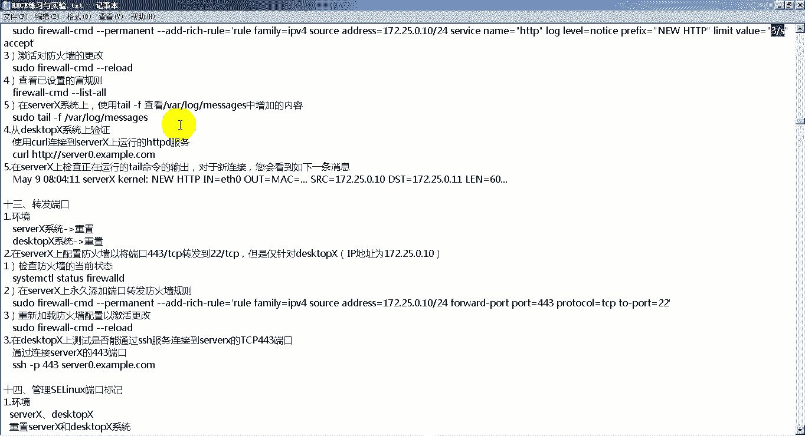

后转发如何配置，我们来看这个实验13啊，这个实验13啊，这个实验13的内容不是特别多啊，那我们简单来看一下，我们还是打开我们的虚拟机，这个实验还是用到了server x跟desktop s。

那对应的就是我们的server h54 和desktop h，首先在实验之前需要将两个系统给重置，这个我们刚才在做完上个实验的时候，已经把它重置过了啊，所以说我们现在直接打开我们的thrx。

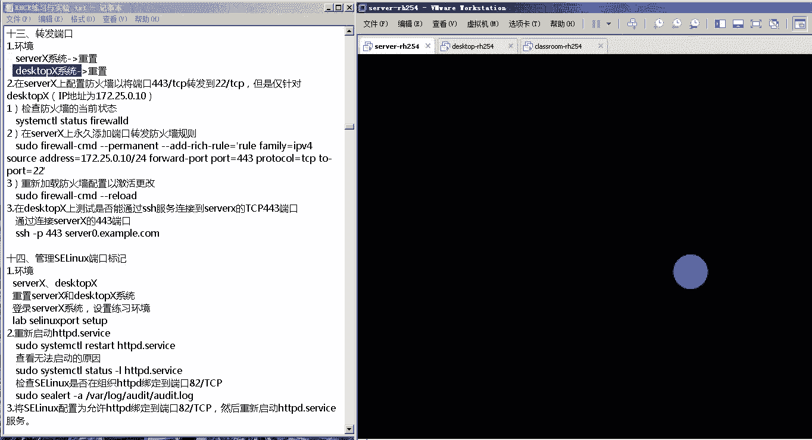

好了现在已经开起来了啊，开起来之后，我们右键桌面打开终端。

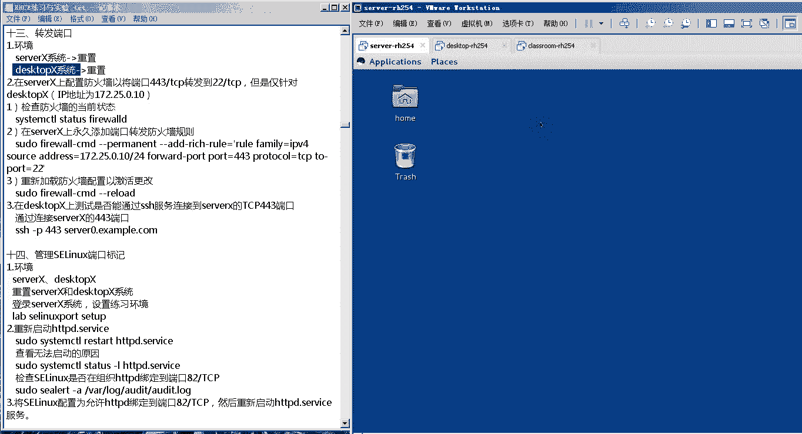

打开终端之后，我们先来查看一下我当前这台服务器的防火墙，正在status，诶可以看到当前状态是active running啊，并且这是in a包，代表它是开机自启的服务啊。

就是它会跟随你启动启动启动好了，然后我们在上面增加一条规则，这个规则是通过负规则的方式实现的啊，它是将我们这个tcp 443号端口接收的数据包，转发到tcp的22号端口。

但是仅仅是针对来自于dex top 0的数据包，那个dex top 0的ip地址是172。2，五点点一零好了，那我们来写一下这个复位则啊，实际上就是一条复规则，firewall。

杠c md杠杠permanent啊，注意这是永久添加杠杠i的杠rich入，等于还是把两个单引号都把它写好，然后若family是对ipv 4的数据包，所以是ipv 4，我的dress对原ip是多少呢。

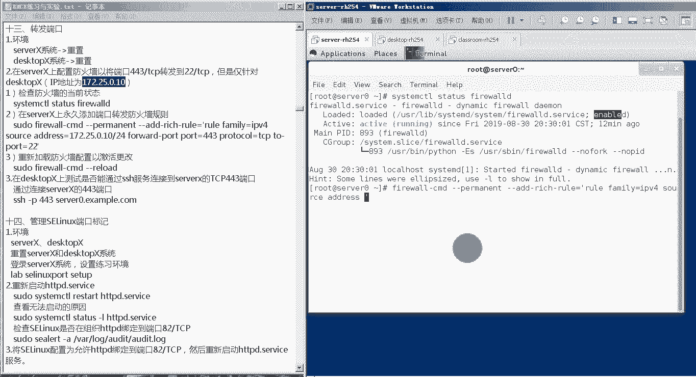

是我们desktop杠22 五四，那我们看一下desktop杠22 五四的ip地址。

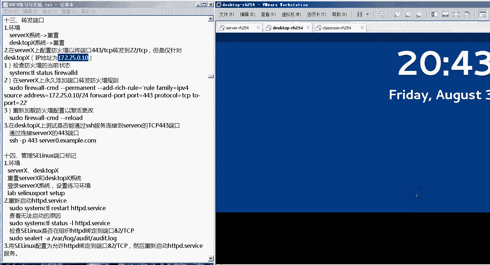

这个刚才其实已经看过了啊，就是这个00：10。

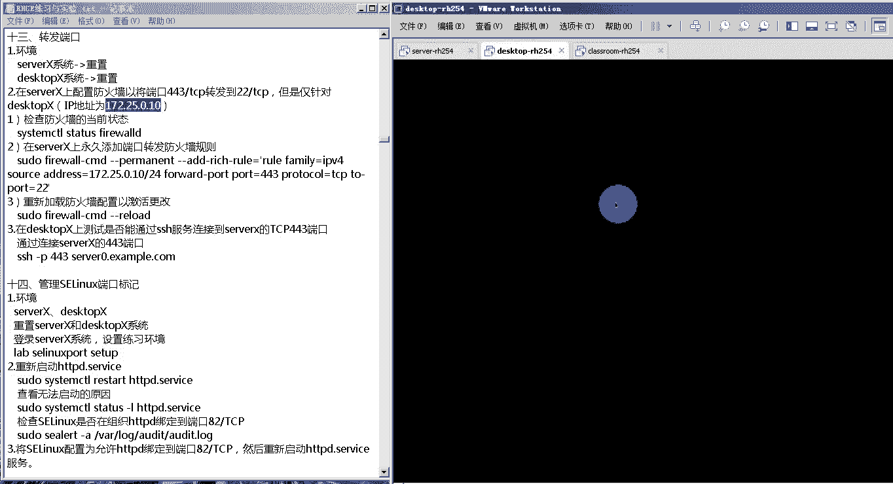

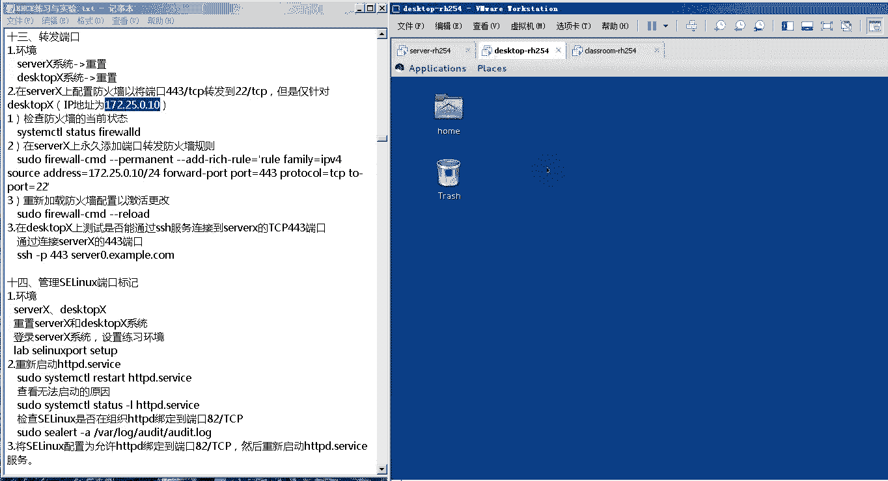

if config啊，可以看到e t h0 ip地址，172。172。25。020，也就是针对于172。二五点点零dex top，172。二五点点十，杠二四啊，原地址发送的数据包，添加一个端口转发。

forward gport啊，然后转哪个端口接收的数据包呢，443443那个协议的443端口呢，pro toco等于tcp啊，就是tcp的43号端口接收的数据包。

two gun port转到哪一个端口上了，转到本机的22号端口上好了，然后我们在firework杠cmd杠杠list杠啊，可以看到我们刚才在添加复规则的时候，没有指定是在哪个区域。

所以也就是在默认区域添加了一条复规则，但是我用刚刚类似的杠二在查看的时候发现诶，我的这个默认区里边并没有出现，我们刚才添加的负规则啊，原因是因为我当前的firewall在运行状态。

我在添加规则的时候是永久添加，所以如果想让永久添加生效的话，我们还是要firework gcmd杠杠，好了之后我们在firework杠samd杠杠vlog啊，这个已经围绕的过了啊。

我们在这个firework，让c md杠杠list guo来查看我们默认区域的规则，可以看到我们刚才添加的规则已经生效了，让我们来看一下我们这个规则的效果啊，我们现在在我们的desktop上啊。

通过ssh来连接我们server 0杠p指令连接的端口，443号端口，然后我们的server 0的f q0 n是server 0点x，3p。com，诶我们可以看到他弹出了这么一个请求。

说是否要接收来自server 0的这个密钥啊，那我们接收yes，然后输入server 0点example，点com上面入的账户的密码啊，那就是red hat，诶。

可以看到我现在已经连接到server 0上了啊，可以看到我当前的这个主机名，已经从dex 20到server 0上了，然后我e x i t退出当前的这个链接，诶，这就回到了dex top 0上。

那截止到这儿，我们这个实验就已经完成了，这个实验虽然完成了，但是我们一定得知道，这个实验它的效果是什么啊，是实验的，这个效果是，我们还是给大家伙画一个图来介绍一下，好了，我们现在还是有两台服务器。

这两台服务器，一台是server 0，一台是server 0，一台是desk holi，其中450是台服务器的ip地址是172。2，五点点1~24啊。

他的f q d n还是server 0点x sample。com，然后我们在我们的这个server 0上，设置了一条防火墙的负规则，这条复规则里边的内容是什么呢，首先他对这个原地址source。

address，原地址为172。二五点点一零杠二四，的数据包执行了一个端口转发，这个端口转发的效果是什么呢，它上面有两个端口，一个是tcp的443号端口，大写吧，dcp的43号的号。

另外有一个ssh服务用到的tcp 22号灯，tcp的22号端口，然后他这条复规则是什么呢，说当我的这个tcp 443号端口接收的数据包，我就自动把这个数据包转到那儿呢。

转到我的tcp 2号12号端口区啊，转到我的tcp 22的路上，这就是我们这些数规则它的内容，所以当我们在测试的时候，我们通过dex top 0去连接什么呢。

注意我们通过dex top 0上的一个随机端口，却连接到我们这个server 0上的tcp的43号端口，但是tcp是什么端口，上面并没有这个s s a这个服务工作呃。

所以我们通过这个fireword防火墙的这个端口转发，把tcp 43号端口这个数据包，也就是desktop 0发送的这个数据包啊，因为dex top 0它的ip地址是172。2，五点点一零。

正好符合我们这个匹配规则，所以将这个符合要求的，或者符合匹配规则的数据包，转给我们的这个server 0上的tcp的22端口，这样的话我们server 0上的tcp的22端口，就接触到这个数据包。

然后在tcp a22 号端口上面，运行着我们的s s制服务，那这样的话，我们的desktop 0就可以通过s认证服务，登录到我们这个server 0上，这就是我们这个实验的最终的一个结果啊。

最终的一个结果，好了，那我们的这个实验就给大家做了这个实验，我们就给大家做完了。

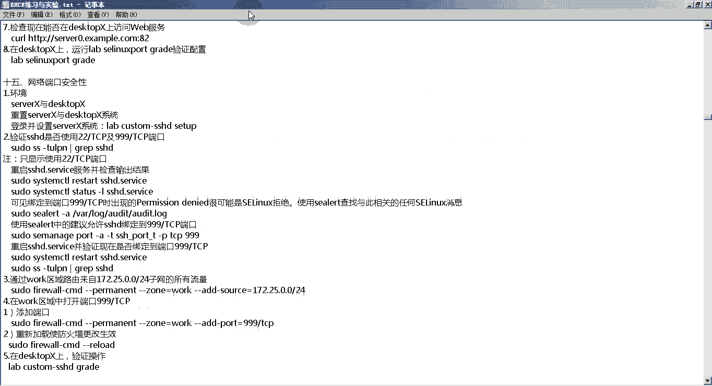

那我们再把我们这个环境还原一下。

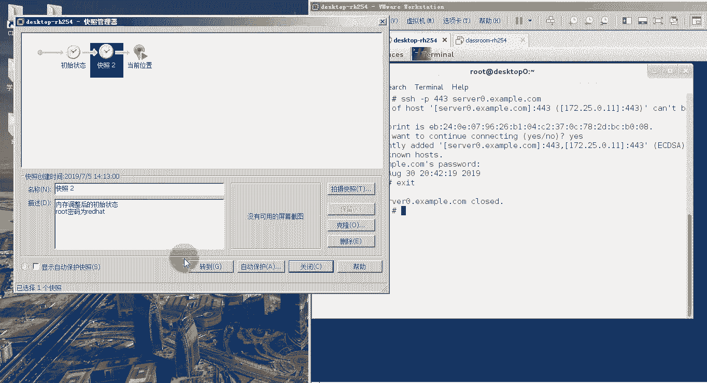

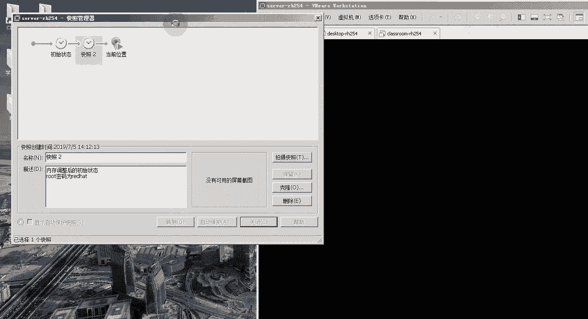

然后我们今天的内容也就都给大家，全部介绍完了啊，全部介绍完了，然后全部介绍完呢，我们在利用最后的这段时间简单说一下，今天我们的重点在于哪啊，重点在于那首先第一个这个firework。

这一章是我们20c考试里边必考的一张啊，必考题章，但是他的这个考察方式，不是说单独给你列出这么一条这个fireword，这么一个要求，然后让你实现，而是我们在做这个rh c e的这个考试的时候。

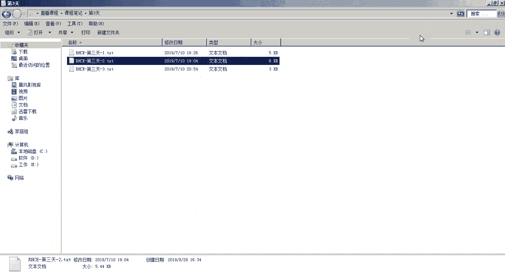

我们要在这个server上面搭建很多的服务，搭建很多的服务，然后我们搭建这个服务，必须都能够由我们这些客户端来访问才可以啊，后端访问才可以，那我们这个server上面是默认开启这个fireword的。

所以说你开启了这个fireword，你客户端在访问你这个对应的端口的时候，会发现这个端口是访问不了的啊，或者说你这个服务器访问不了的，那我们就给大家伙提出了这两个要求，第一个要求是什么。

就是这些个我们后边要涉及到这些服务的端口，端口号，大家伙必须得知道，因为你不知道它的端口号的话，呃，有些时候你在添加这个fireword规则的时候，不是那么方便，当然有的一些很多的服务。

你可以直接通过服务名来添加，比如说我们这个http s s h h t p s啊，这些都可以，但是有一些比较特殊的服务，它是不能通过服务添加了，只能通过端口号，让这些服务我们就要把它记住它的端口啊。

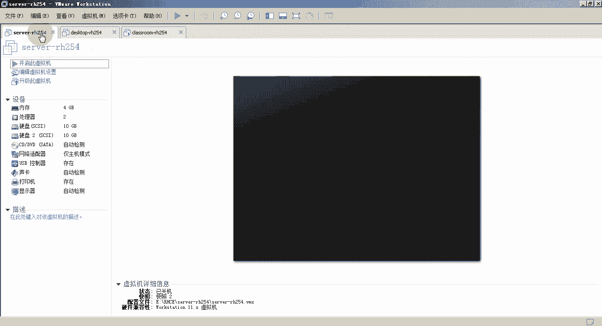

这是我们说的第一点，第二点就是我们必须得会使用我们的这个fireword，来添加，我们的这个来添加我们的这个防火墙的规则，然后在考试的时候，所有的规则我们都要添加这个permanent，这个参数啊。

就是添加永久规则，让它永久生效才可以，所以说大家伙必须得记住这个参数，并且一定要注意你使用permit参数，添加完规则之后，一定要加杠杠，reload，重新加载配置文件，才能使这个规则生效。

才能是一个规则表，第三个就是我们今天在介绍这个firework的时候，其实主要介绍的三部分内容，第一个就是firewall，它的一个基本的概念和简单的使用，第二个就是介绍了一个fireword负规则啊。

fireword负规则，第三个就是介绍了一个这个n a t，网络地址转换技术和伪装以及端口转发啊，当然了，那这三个里面哪一个是重点呢，就需要大家一定要把这个负规则这个给掌握了。

因为我们在考试的时候增加了很多规则，都是通过一种负规则的方式实现的啊，这个不规则，其实他的这个语法相对来说还是比较好记的啊，还是比较好记的，所以说大家一定要把它多练习一下啊。

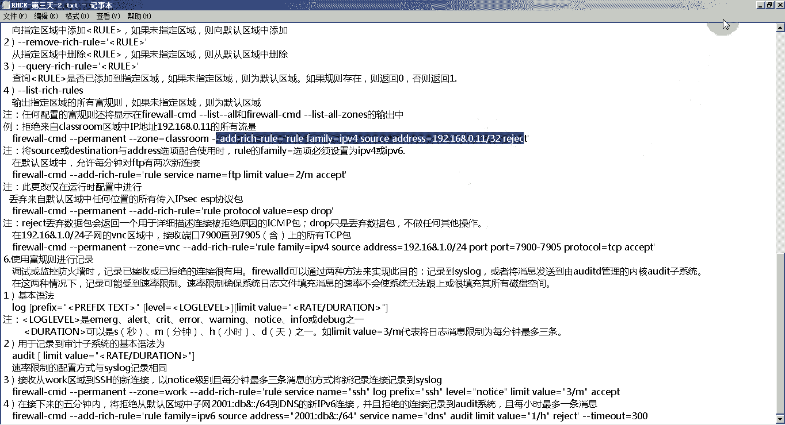

多练习，好了那以上就是咱们今天的内容了啊，今天，然后一会儿我会把我们的这个，今天讲的这些内容的相关文档发到我们的群啊。

