# RHCE课程：P3：RHCE-3：Firewall防火墙配置与管理 🔥

在本节课中，我们将要学习Red Hat Enterprise Linux中Firewall防火墙的核心概念、配置方法以及高级应用。课程内容涵盖防火墙的基本原理、区域管理、富规则使用以及网络地址转换（NAT）技术。

## 防火墙基础概念与架构

上一节我们介绍了课程概述，本节中我们来看看Firewall防火墙的基础架构。

Firewall防火墙在RHEL 7及之后的系统中，其底层使用的是Linux内核的Netfilter框架。Netfilter内核模块负责实际的数据包过滤和规则存储。而Firewall和iptables都是运行在用户空间的工具，用于编辑和管理这些规则。

因此，在使用Firewall之前，需要确保它与传统的iptables防火墙不冲突。通常需要关闭或屏蔽其他防火墙服务。

以下是关闭其他防火墙服务的命令示例：
```bash
systemctl mask iptables
systemctl mask ip6tables
systemctl mask ebtables
```

## 防火墙区域概念

理解了防火墙的架构后，本节中我们来看看Firewall的核心概念——区域。

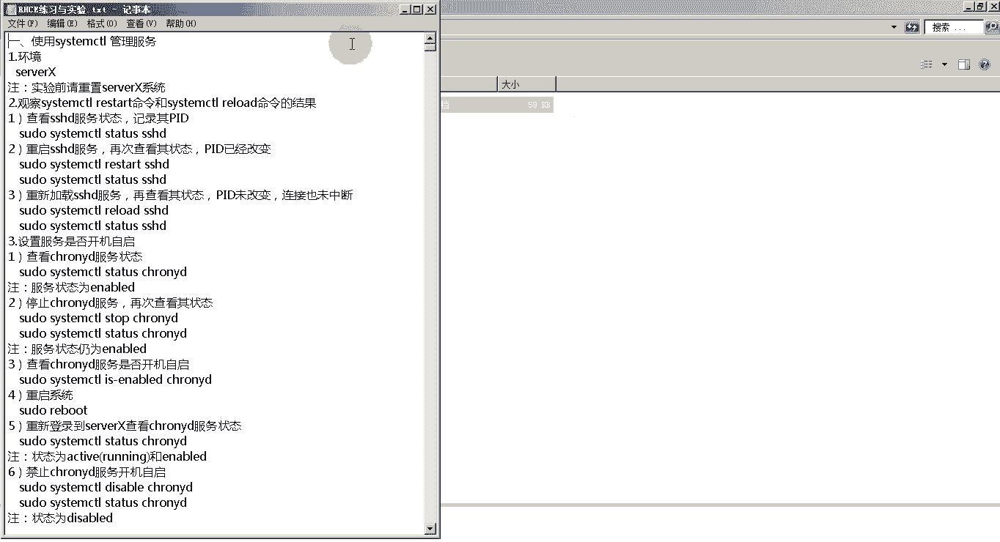

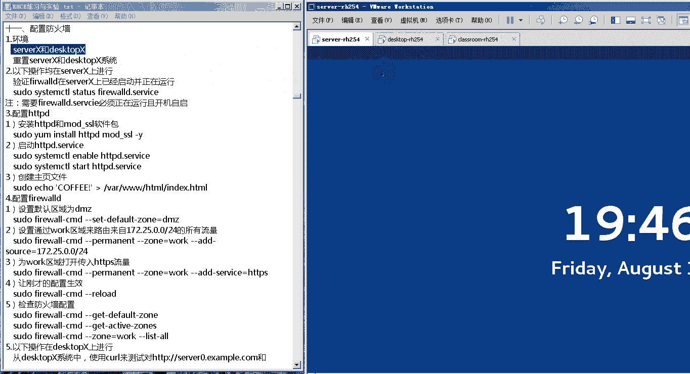

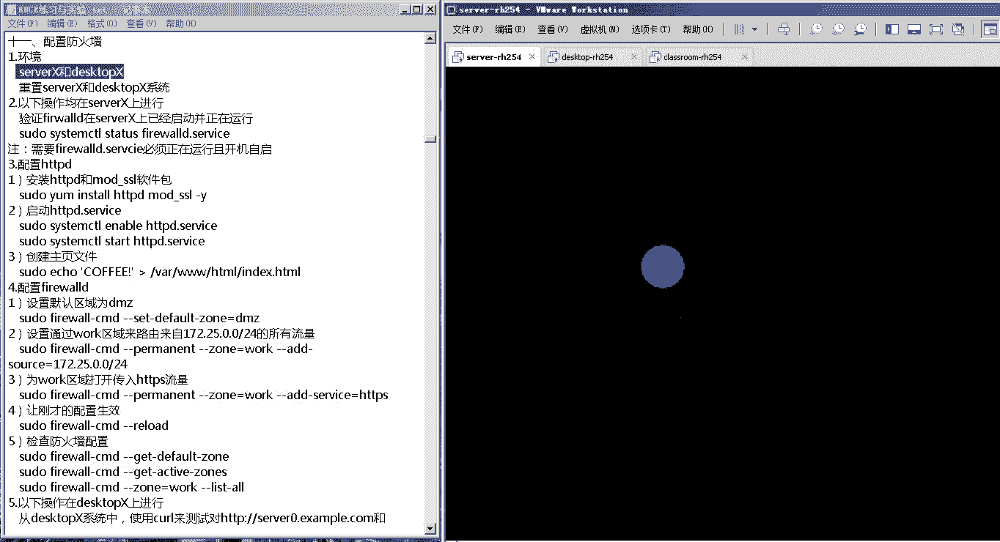

Firewall会将所有传入主机的流量划分到不同的区域。每个区域都有一套独立的规则集，用于决定如何处理匹配该区域的流量。

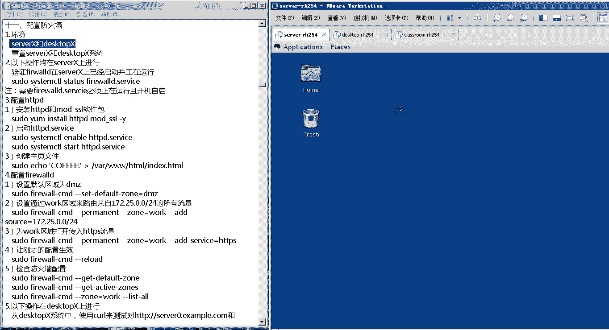

流量匹配区域的逻辑如下：
*   如果数据包的源IP地址匹配某个区域设置的源地址规则，则由该区域处理。
*   如果数据包进入的网络接口被绑定到某个区域，则由该区域处理。
*   如果以上都不匹配，则使用默认区域处理。

Firewall预定义了九大区域，以下是各区域的简要说明：
1.  **trusted**：允许所有传入流量。
2.  **home**：除非与传出流量相关，或匹配预定义服务（如ssh、mdns、samba-client、dhcpv6-client），否则拒绝传入流量。
3.  **internal**：与home区域类似，预定义了ssh等服务规则。
4.  **work**：预定义了ssh、ipp-client、dhcpv6-client服务规则，拒绝其他传入流量。
5.  **public**：**默认区域**。预定义了ssh、dhcpv6-client服务规则，拒绝其他传入流量。
6.  **external**：预定义了ssh服务规则，拒绝其他传入流量。通常用于配置伪装（masquerading）。
7.  **dmz**：预定义了ssh服务规则，拒绝其他传入流量。
8.  **block**：拒绝所有传入流量。
9.  **drop**：丢弃所有传入流量（不发送拒绝响应）。

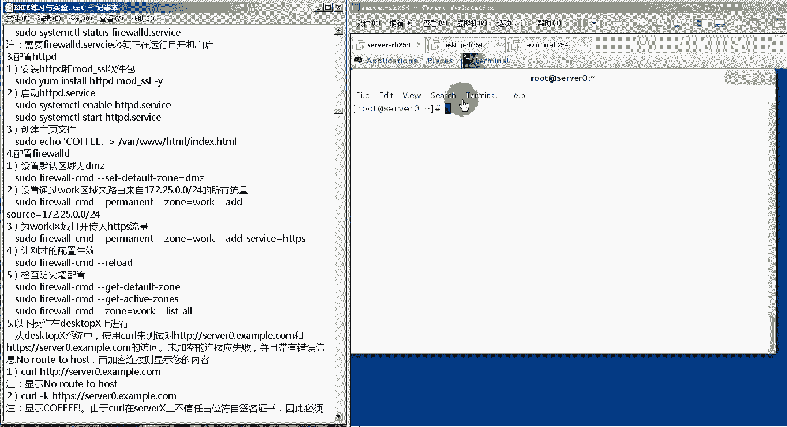

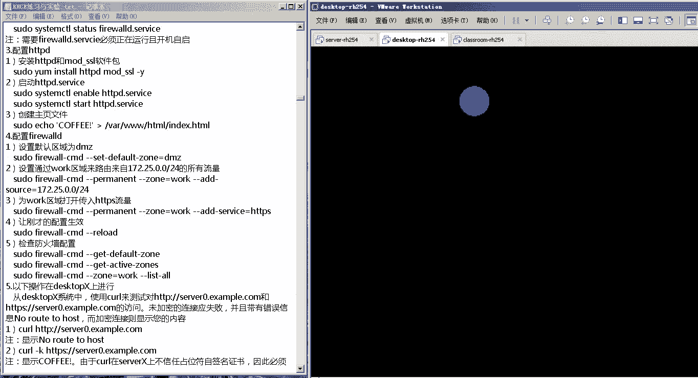

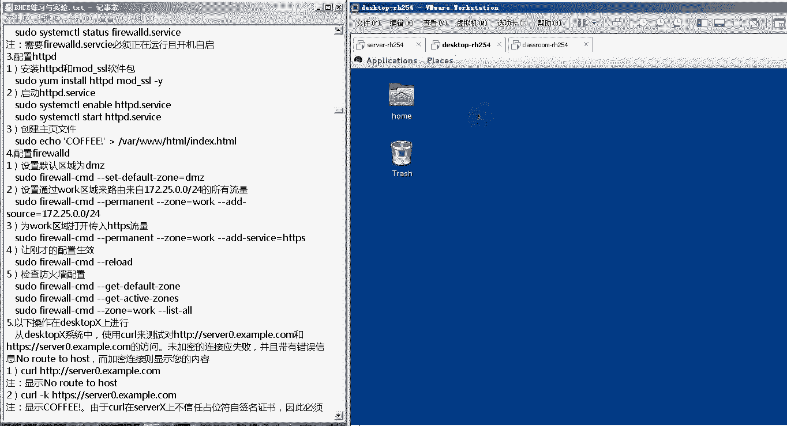

## 防火墙管理方式

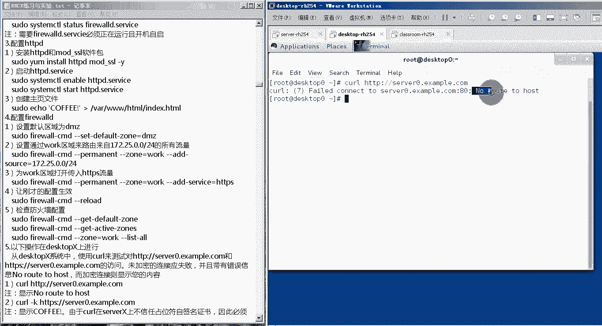

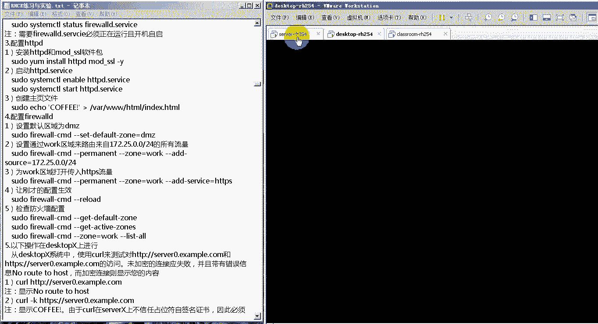

了解了区域概念后，我们来看看如何管理Firewall防火墙。

管理Firewall主要有三种方式：
1.  **命令行工具**：`firewall-cmd`，这是最常用且本课程重点介绍的方式。
2.  **图形化工具**：`firewall-config`，有兴趣可以课后研究。
3.  **配置文件**：编辑`/etc/firewalld/`下的配置文件。**不建议直接编辑**，容易因格式错误导致配置失效。推荐使用`firewall-cmd`等工具进行配置。

## firewall-cmd 命令详解

上一节我们介绍了管理工具，本节中我们深入看看核心命令`firewall-cmd`的使用。

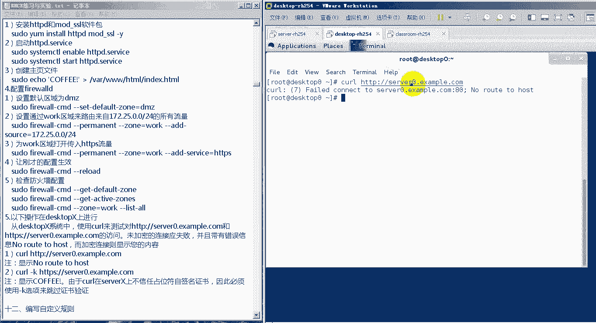

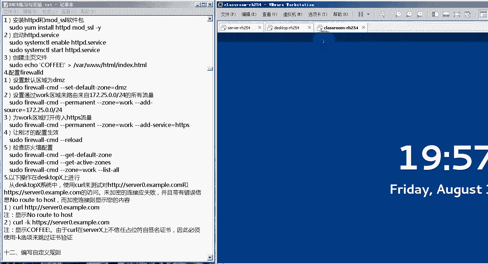

`firewall-cmd`命令可以完成绝大部分防火墙操作。需要特别注意Firewall的两种配置状态：
*   **运行时状态**：当前生效的规则。
*   **永久状态**：写入配置文件的规则，重启后依然有效。

添加规则时，若想永久生效，必须使用`--permanent`参数。但永久规则添加后不会立即生效，需要使用`firewall-cmd --reload`重新加载配置，才能使永久规则在运行时生效。

以下是`firewall-cmd`常用命令列表：
*   **查看与设置默认区域**：
    *   `firewall-cmd --get-default-zone`
    *   `firewall-cmd --set-default-zone=<zone_name>`
*   **列出信息**：
    *   `firewall-cmd --get-zones`
    *   `firewall-cmd --get-services`
    *   `firewall-cmd --get-active-zones`
*   **区域规则管理**：
    *   `firewall-cmd --zone=<zone_name> --list-all`
    *   `firewall-cmd --list-all-zones`
*   **添加/删除规则**：
    *   添加源地址/网段：`firewall-cmd --zone=<zone_name> --add-source=<CIDR>`
    *   删除源地址/网段：`firewall-cmd --zone=<zone_name> --remove-source=<CIDR>`
    *   添加服务：`firewall-cmd --zone=<zone_name> --add-service=<service_name>`
    *   删除服务：`firewall-cmd --zone=<zone_name> --remove-service=<service_name>`
    *   添加端口：`firewall-cmd --zone=<zone_name> --add-port=<port>/<protocol>`
    *   删除端口：`firewall-cmd --zone=<zone_name> --remove-port=<port>/<protocol>`

命令规律：获取用`--get-*`，设置用`--set-*`，添加用`--add-*`，删除用`--remove-*`。

**命令示例**：
*   设置默认区域为dmz：`firewall-cmd --set-default-zone=dmz`
*   永久为internal区域添加源网段规则：`firewall-cmd --permanent --zone=internal --add-source=192.168.0.0/24` （需`--reload`生效）
*   永久为internal区域添加mysql服务：`firewall-cmd --permanent --zone=internal --add-service=mysql` （需`--reload`生效）

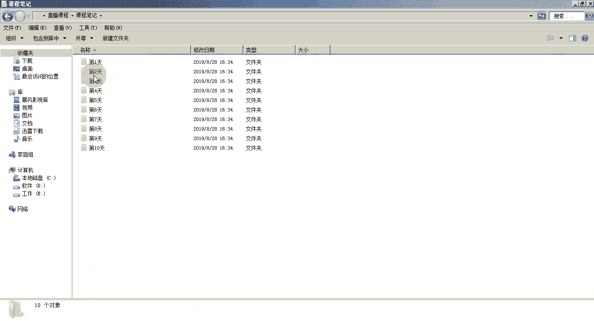

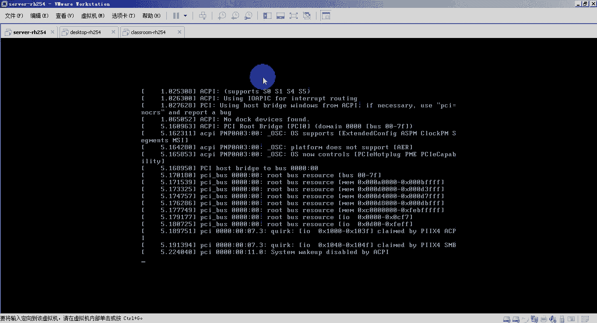

Firewall配置文件位于`/etc/firewalld/`和`/usr/lib/firewalld/`。后者作为参考，防止前者配置错误时无法恢复。

## 实验一：配置防火墙

理论需要实践来巩固，接下来我们通过实验来熟悉防火墙的基本配置。

**实验目标**：在server上配置Web服务器（Apache），并通过防火墙规则控制desktop客户端的访问。

**实验环境**：
*   server0 (server.example.com): 172.25.0.11
*   desktop0 (desktop.example.com): 172.25.0.10

**实验步骤**：
1.  在server0上安装并启动Apache。
    ```bash
    yum install -y httpd mod_ssl
    systemctl start httpd
    systemctl enable httpd
    ```
2.  创建测试主页。
    ```bash
    echo 'coffee' > /var/www/html/index.html
    ```
3.  此时从desktop0访问`http://server0.example.com`会失败，因为防火墙阻止了HTTP流量。
4.  在server0上配置防火墙。
    *   设置默认区域为dmz：`firewall-cmd --set-default-zone=dmz`
    *   永久为work区域添加规则，匹配来自desktop网段的流量，并允许HTTPS服务：
        ```bash
        firewall-cmd --permanent --zone=work --add-source=172.25.0.0/24
        firewall-cmd --permanent --zone=work --add-service=https
        firewall-cmd --reload
        ```
5.  验证。从desktop0访问HTTPS成功，访问HTTP依然失败。
    ```bash
    curl -k https://server0.example.com # 成功
    curl http://server0.example.com # 失败
    ```
6.  继续在work区域开放HTTP服务或80端口。
    ```bash
    firewall-cmd --permanent --zone=work --add-service=http
    # 或 firewall-cmd --permanent --zone=work --add-port=80/tcp
    firewall-cmd --reload
    ```
7.  再次从desktop0验证HTTP访问成功。

**实验总结**：本实验演示了通过防火墙区域和规则，精确控制特定源IP对特定服务的访问权限。

## 防火墙富规则

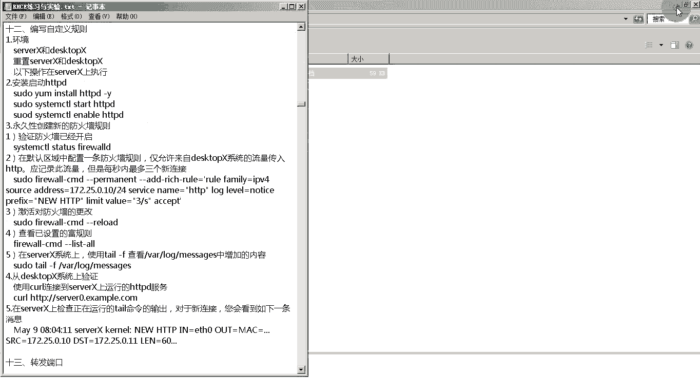

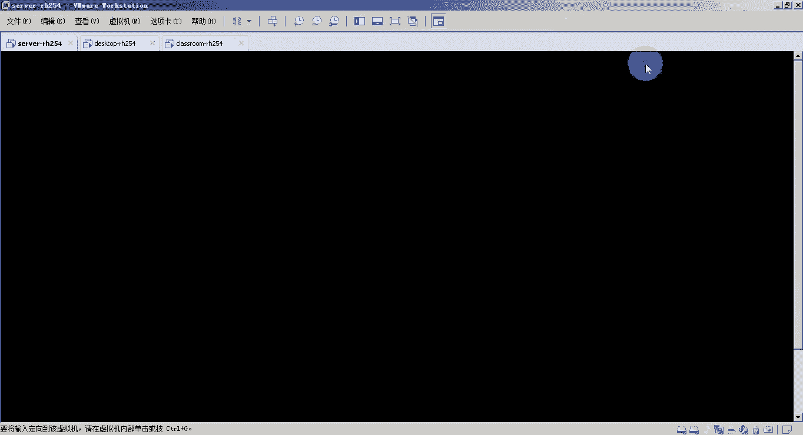

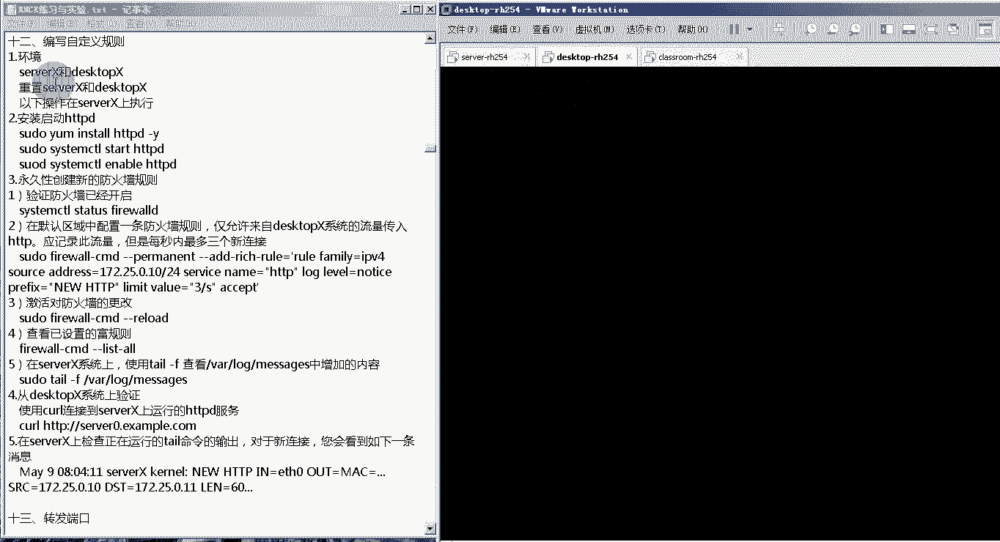

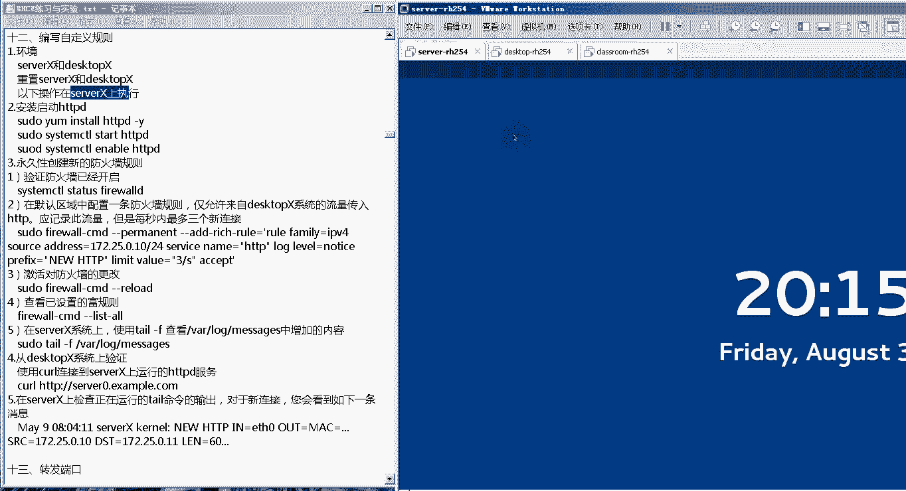

上一节我们完成了基础实验，本节中我们来看看更强大的配置工具——富规则。

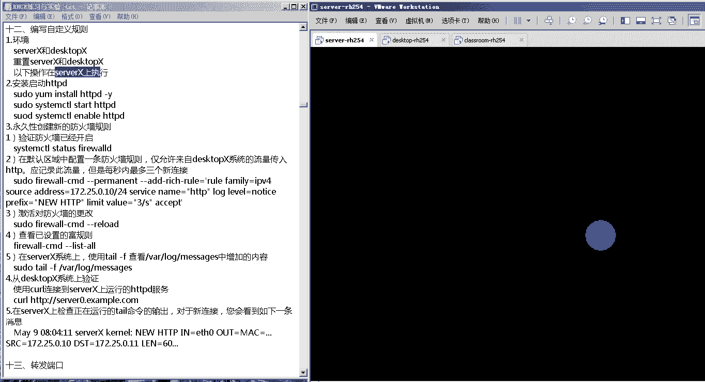

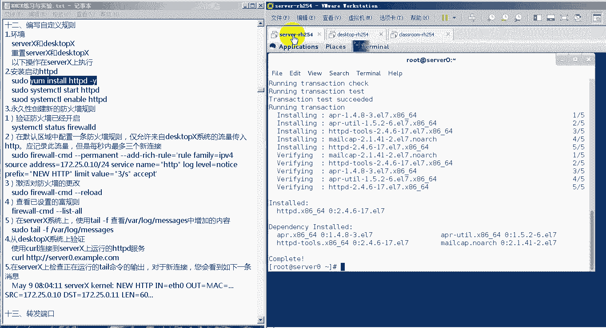

富规则（Rich Rules）为Firewall提供了更灵活、功能更丰富的配置方式。当富规则与普通规则共存时，规则的**顺序**会影响最终效果。默认处理顺序为：端口转发/伪装规则 -> 日志规则 -> 允许规则 -> 拒绝规则。全不匹配则采用默认动作（通常为拒绝）。

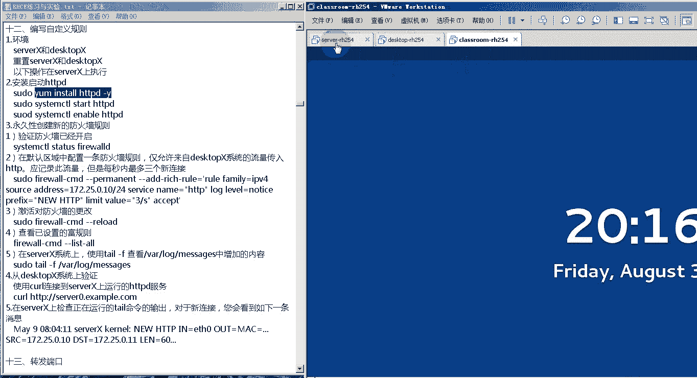

对于有风险的规则（如可能导致管理连接中断），可以使用`--timeout=<seconds>`参数设置规则临时生效，超时后自动移除，便于调试。

**富规则管理命令**：
*   添加：`firewall-cmd --add-rich-rule='<rule>'`
*   删除：`firewall-cmd --remove-rich-rule='<rule>'`
*   查询：`firewall-cmd --query-rich-rule='<rule>'` （返回是否已添加）
*   列出：`firewall-cmd --list-rich-rules`

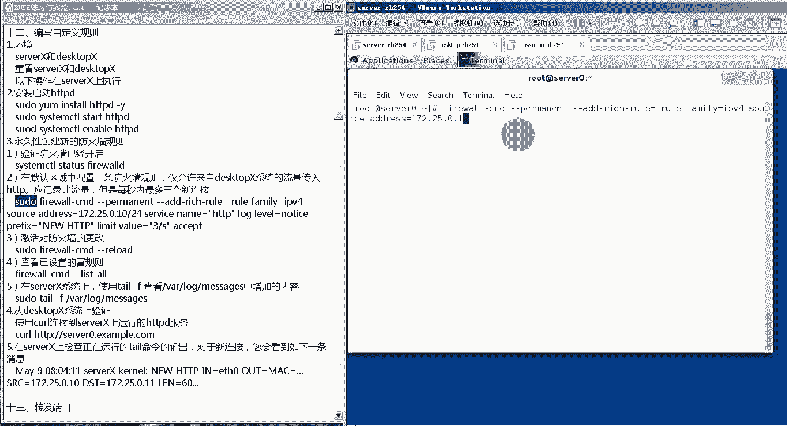

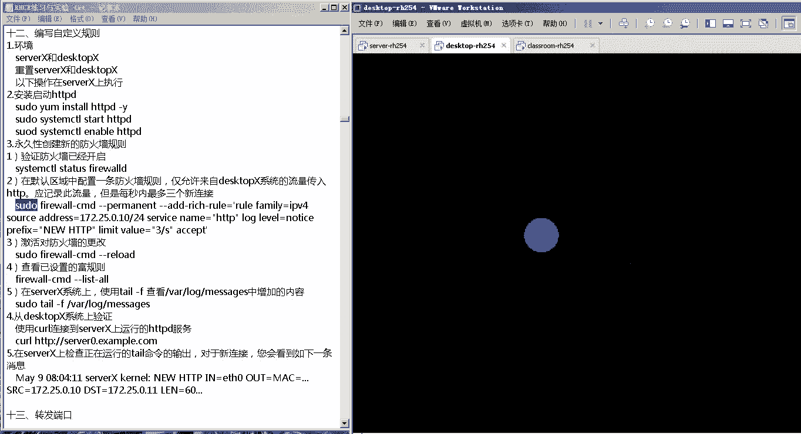

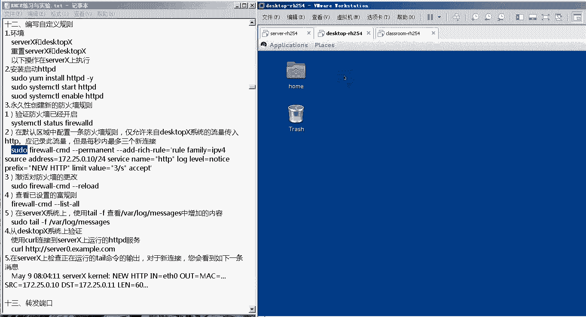

**富规则示例**：
*   **拒绝**特定IP的所有流量：
    `firewall-cmd --permanent --zone=classroom --add-rich-rule='rule family=ipv4 source address=192.168.0.11 reject'`
*   **允许**每分钟最多2次新的FTP连接：
    `firewall-cmd --add-rich-rule='rule service name=ftp limit value=2/m accept'`
*   **丢弃**ESP协议的数据包：
    `firewall-cmd --permanent --add-rich-rule='rule protocol value=esp drop'`
    > **注意**：`reject`会返回拒绝消息，`drop`则直接丢弃无响应。
*   **允许**特定网段访问端口范围：
    `firewall-cmd --permanent --zone=vnc --add-rich-rule='rule family=ipv4 source address=192.168.1.0/24 port port=7900-7905 protocol=tcp accept'`
*   **记录日志**并允许SSH连接（每分钟最多3条日志）：
    `firewall-cmd --permanent --zone=work --add-rich-rule='rule service name=ssh log prefix="ssh " level="notice" limit value="3/m" accept'`
*   **临时拒绝**IPv6地址的DNS连接5分钟，并记录日志（每小时最多1条）：
    `firewall-cmd --add-rich-rule='rule family=ipv6 source address=fe80::/64 service name=dns log prefix="dns " limit value="1/h" reject' --timeout=300`

## 实验二：使用富规则记录日志

接下来我们通过实验来应用富规则。

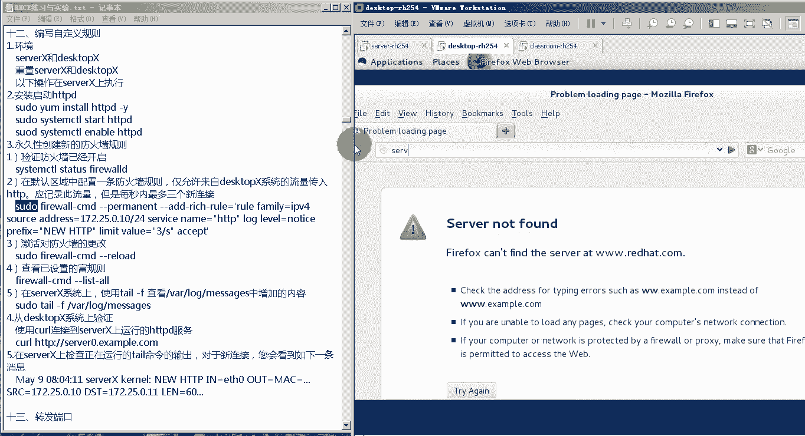

**实验目标**：在server0上配置富规则，将desktop0对其HTTP服务的访问记录到系统日志。

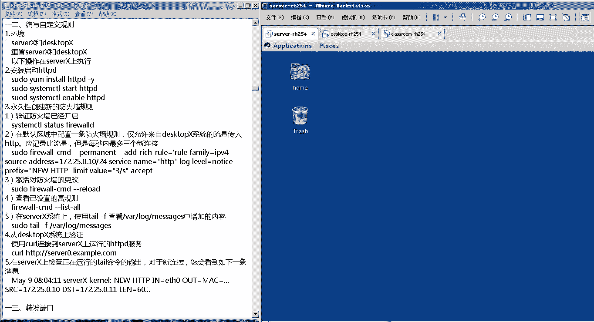

**实验步骤**：
1.  在server0上安装并启动Apache。
    ```bash
    yum install -y httpd
    systemctl start httpd
    systemctl enable httpd
    ```
2.  添加富规则，对来自desktop0 IP的HTTP访问进行日志记录并允许。
    ```bash
    firewall-cmd --permanent --add-rich-rule='rule family=ipv4 source address=172.25.0.10/24 service name=http log prefix="new_http " level="notice" limit value="3/s" accept'
    firewall-cmd --reload
    ```
3.  在server0上实时查看系统日志。
    ```bash
    tail -f /var/log/messages
    ```
4.  从desktop0访问server0的网站。
    ```bash
    curl http://server0.example.com
    ```
5.  观察server0的日志终端，可以看到格式为`new_http ... SRC=172.25.0.10 DST=172.25.0.11 ...`的日志条目。

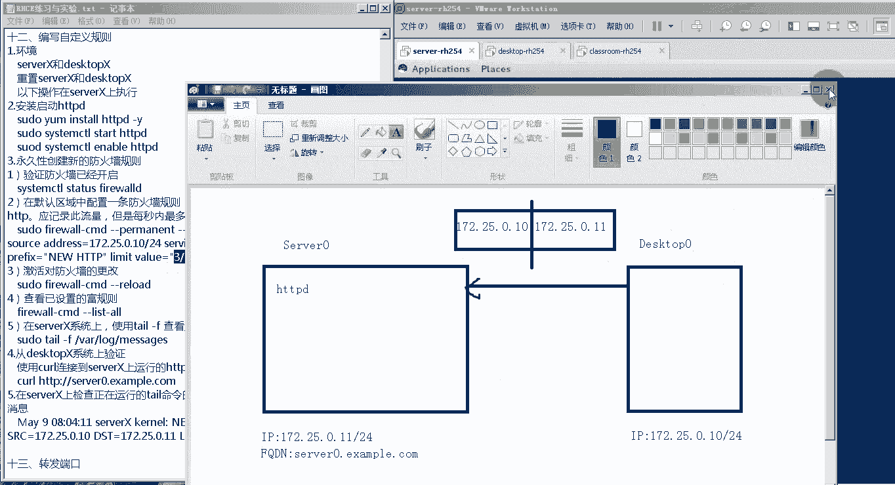

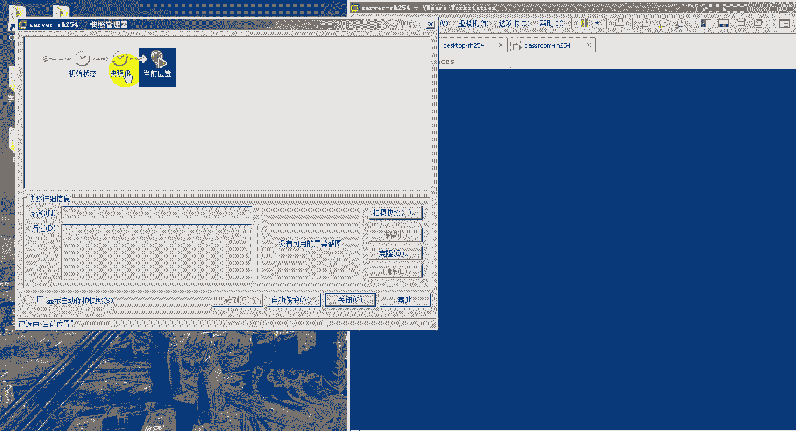

**实验总结**：本实验演示了使用富规则实现复杂的条件匹配（源IP+服务），并执行组合动作（记录日志+允许通过）。

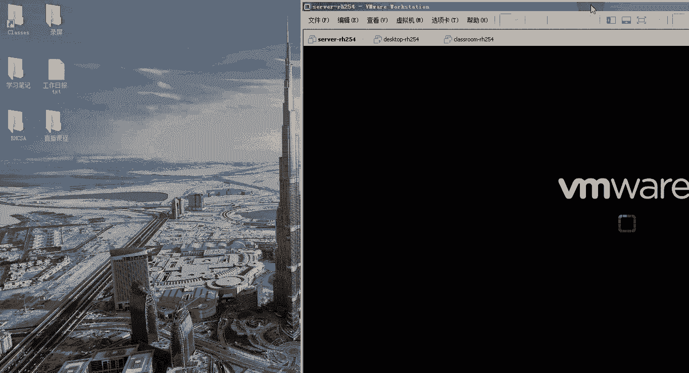

## 防火墙高级应用：NAT

掌握了基础规则和富规则后，本节中我们来看看防火墙的高级应用——网络地址转换。

NAT主要用于解决IPv4地址不足的问题。它允许私有网络内的主机使用私有IP地址，通过网关的公有IP地址访问互联网。

**主要技术**：
1.  **伪装**：当内网主机访问外网时，网关将其数据包的源IP（私有IP）替换为自己的公网IP。实现命令：
    *   普通命令：`firewall-cmd --permanent --zone=<zone> --add-masquerade`
    *   富规则：`firewall-cmd --permanent --zone=<zone> --add-rich-rule='rule family=ipv4 source address=192.168.0.0/24 masquerade'`
2.  **端口转发**：将到达防火墙某端口的数据包，转发到内部另一台主机的指定端口。实现命令：
    *   普通命令：`firewall-cmd --permanent --zone=<zone> --add-forward-port=port=<port>:proto=<tcp|udp>:toport=<port>:toaddr=<IP>`
    *   富规则：`firewall-cmd --permanent --zone=<zone> --add-rich-rule='rule family=ipv4 source address=192.168.0.0/26 forward-port port=80 protocol=tcp to-port=8080'`

**命令示例**：
*   将public区域TCP 513端口流量转发到192.168.0.254的132端口：
    `firewall-cmd --permanent --zone=public --add-forward-port=port=513:proto=tcp:toport=132:toaddr=192.168.0.254`
*   将work区域特定网段访问80端口的流量转发到本机8080端口（富规则）：
    `firewall-cmd --permanent --zone=work --add-rich-rule='rule family=ipv4 source address=192.168.0.0/26 forward-port port=80 protocol=tcp to-port=8080'`

## 实验三：配置端口转发

最后，我们通过一个实验来实践端口转发。

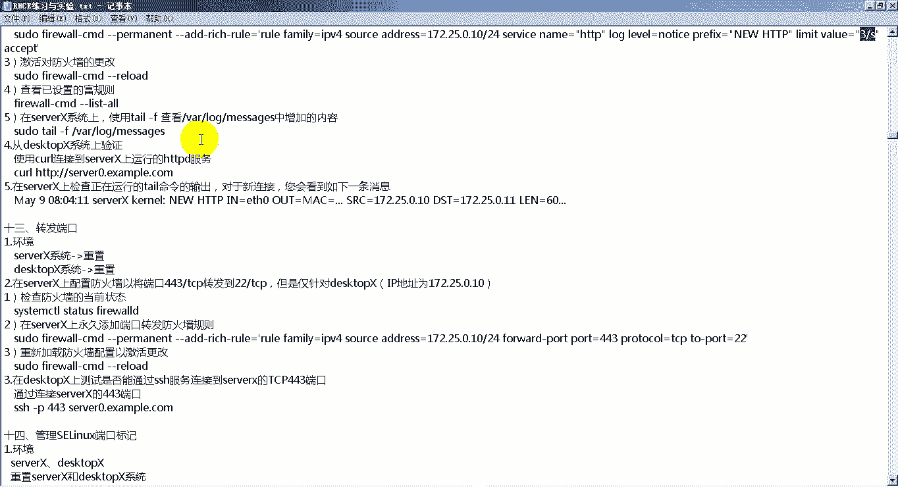

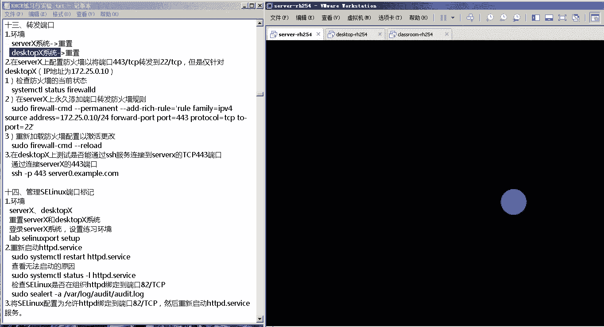

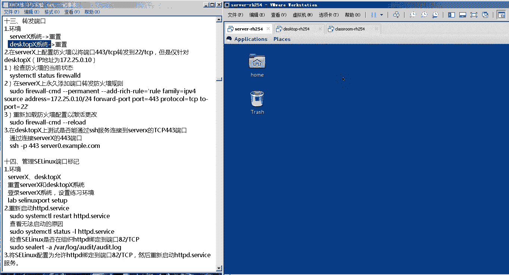

**实验目标**：在server0上配置富规则，将来自desktop0、目标为TCP 443端口的数据包，转发到本机的TCP 22端口（SSH）。

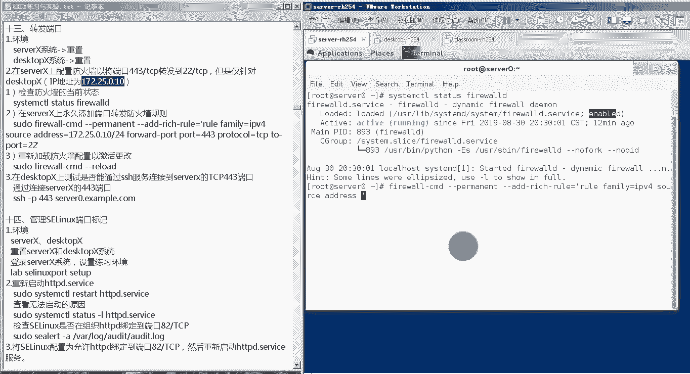

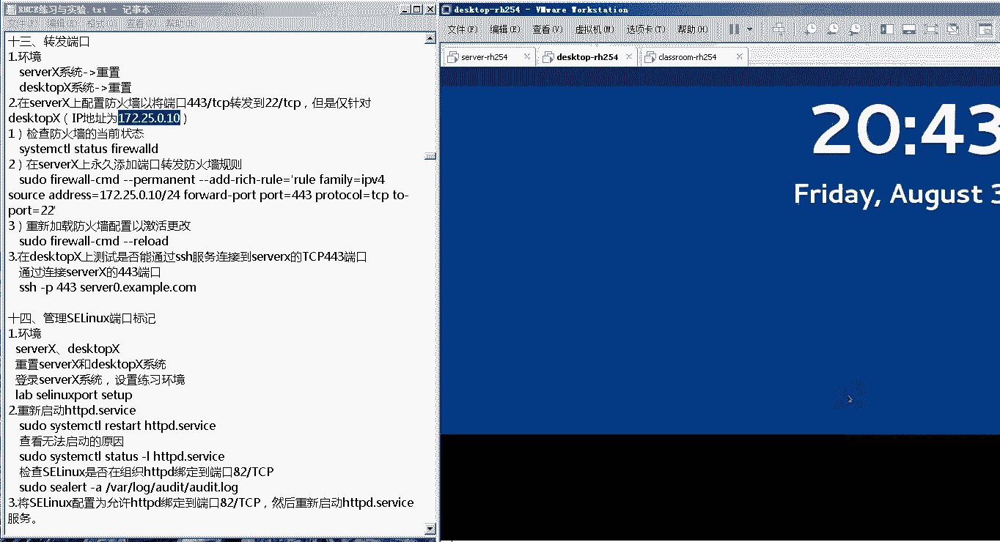

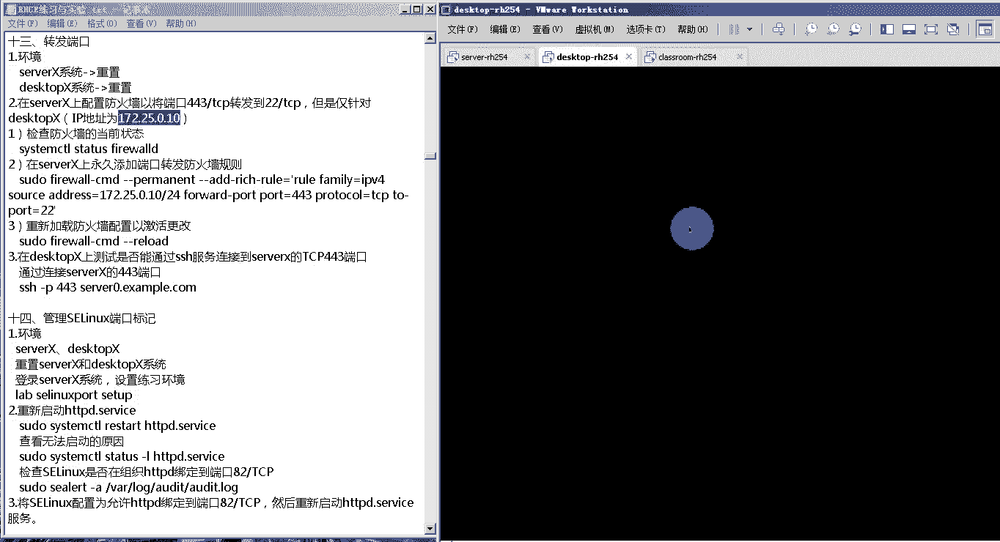

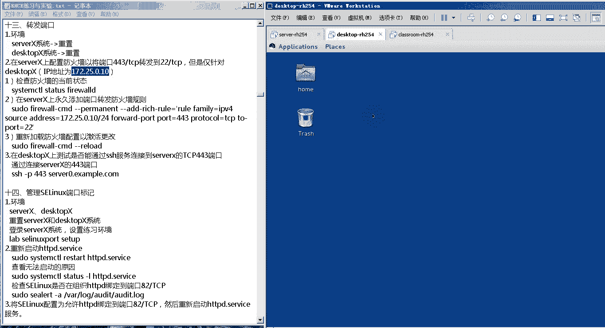

**实验步骤**：
1.  在server0上添加端口转发富规则。
    ```bash
    firewall-cmd --permanent --add-rich-rule='rule family=ipv4 source address=172.25.0.10/24 forward-port port=443 protocol=tcp to-port=22'
    firewall-cmd --reload
    ```
2.  从desktop0上，通过SSH连接server0的443端口。
    ```bash
    ssh -p 443 root@server0.example.com
    ```
3.  输入密码后，成功登录到server0。这说明443端口的连接被成功转发到了22端口的SSH服务。

**实验总结**：本实验展示了如何使用富规则实现灵活的端口转发，将对外部某个端口的访问，重定向到内部另一个完全不同的服务端口上。

## 课程总结

本节课中我们一起学习了RHEL中Firewall防火墙的全面配置与管理。

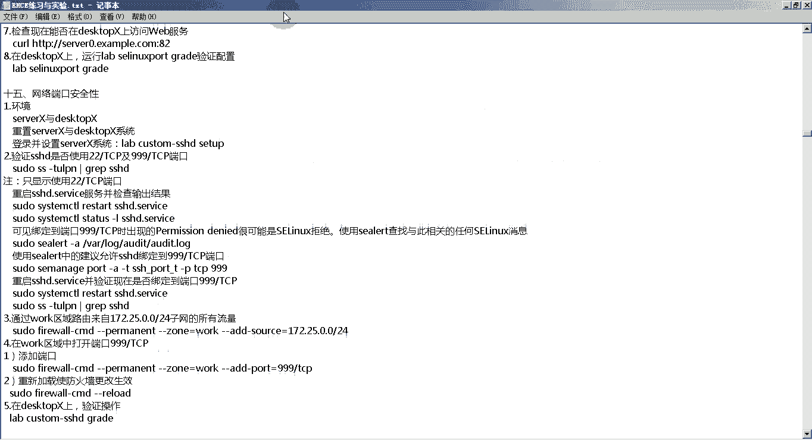

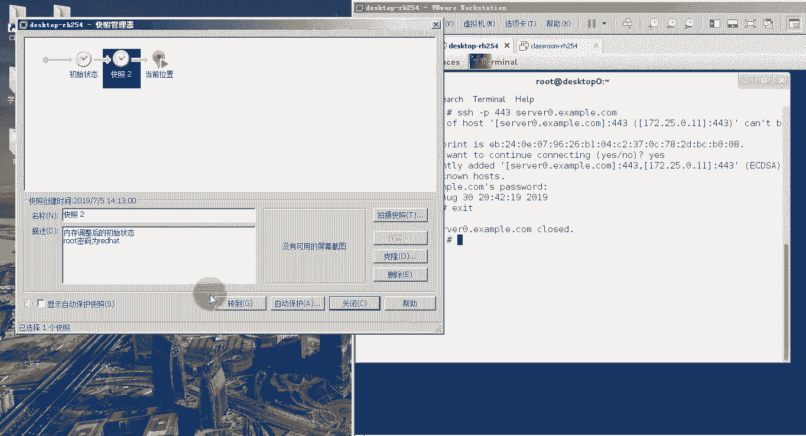

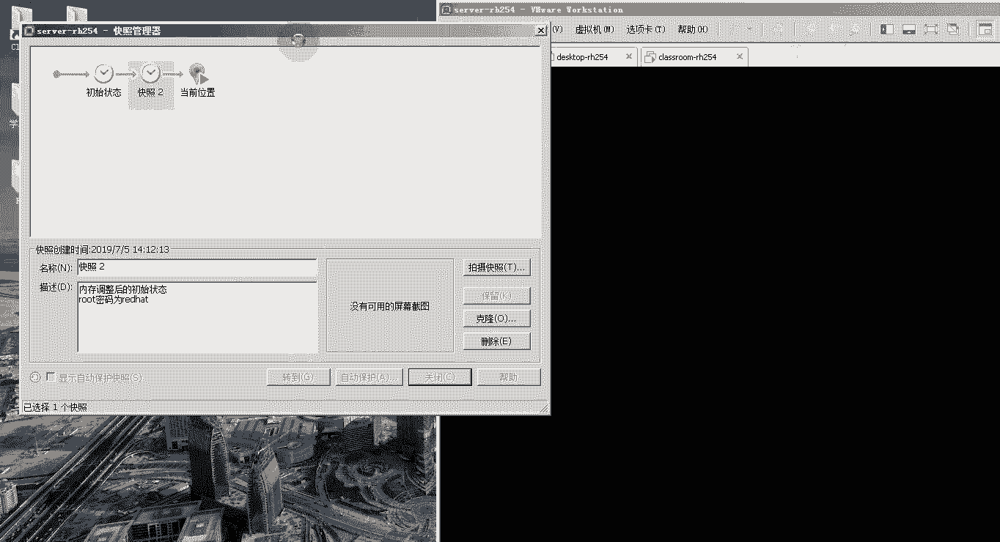

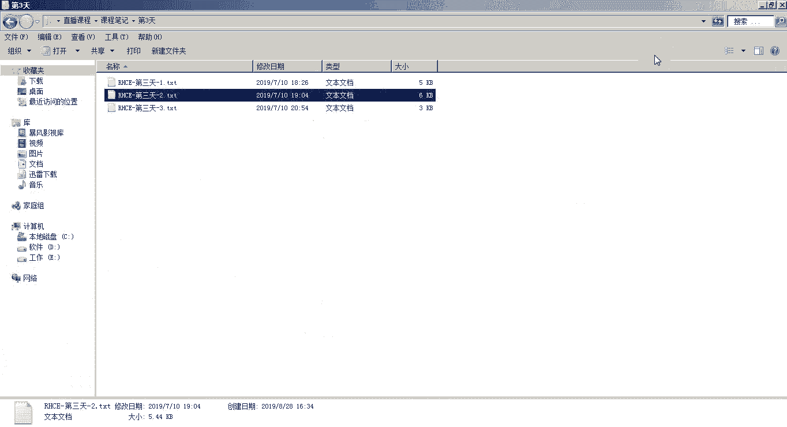

**核心要点回顾**：
1.  **基础与架构**：Firewall基于Netfilter，管理工具有`firewall-cmd`、`firewall-config`和配置文件。
2.  **区域管理**：理解九大预定义区域及其应用场景，掌握默认区域和绑定接口的配置。
3.  **规则管理**：熟练使用`firewall-cmd`命令添加、删除、查看规则。**务必记住**：使用`--permanent`参数添加永久规则后，必须执行`--reload`才能生效。
4.  **富规则**：这是考试和实际应用中的重点。掌握其语法，能够实现基于源IP、服务、端口等条件的复杂匹配，并执行记录日志、允许、拒绝、端口转发等组合动作。
5.  **高级应用**：理解NAT（伪装和端口转发）的原理与配置方法，能够实现网络地址转换和端口重定向。

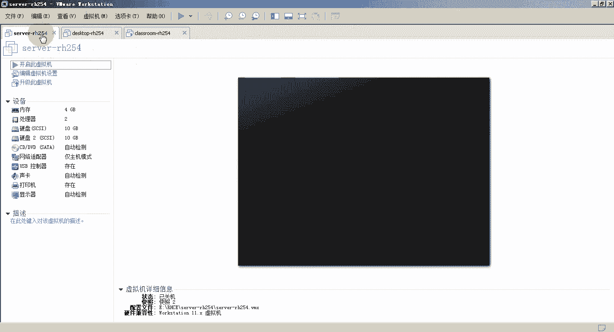

**考试与实践提示**：
*   Firewall配置是RHCE考试中的**必考**内容，通常贯穿于各个服务搭建任务中。
*   必须熟记常见服务（如ssh, http, https, ftp, mysql等）及其默认端口号。
*   考试中配置防火墙规则时，**必须使用`--permanent`参数**以确保配置持久化，并记得`--reload`。
*   多加练习富规则和端口转发的配置，这是灵活解决复杂网络访问控制的关键。

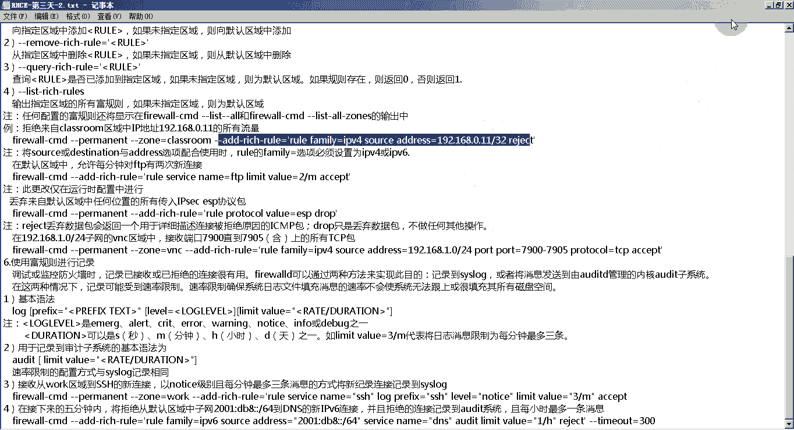

通过本课的学习，你应该能够为RHEL系统规划和实施有效的防火墙策略，控制网络流量，并实现基本的NAT功能。