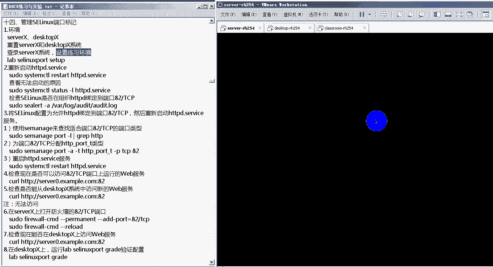
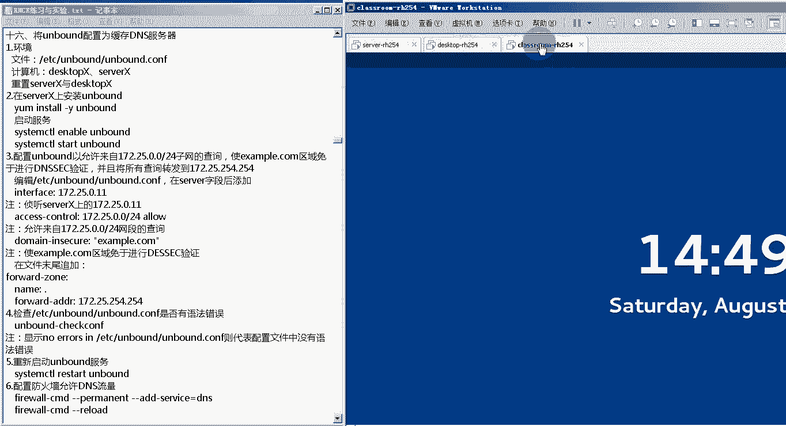

# 红帽RHCE认证考试视频 - P4：RHCE-4 - 我是冷空气 - BV1th4y1X7cC

麦克风关一下啊。好了，那我们就开始我们今天的课程了啊。今天是第四天啊第四天我们先来看第四天。第一部分的课程。第部分课程是。通过这个linux。对我们的这个端口来进行slinux的端口标记啊，端口标记。

这个s林啊。把那个。麦克风关一下啊。然后这个slinux标记端口，这个主要功能是什么？这个我们首先来了解一下，就是我们都知道啊，我们每一个服务都有它对应的这个提供服务的端口啊，提供服务的端。

当我们需要使用不同的端口来提供这个服务的时候，这个时候就需要对你的这个新端口加上一个slinux端口标记啊。当然前提是你这个slinux已经是开启状态啊，开启状态。举个例子，比如说我们之前的这个。

我们之前的这个HTDP协议啊，HTT协议，它的这个端口应该是TCP的22号端口。但是如果我们不使用TCP的22号端口，比如说我们使用TCP的呃2000号端口。

那么我们需要对这个2000号端口加上1个slinux的端口标记啊，这样的话它。那我们。如何通过这个slinux来给我们这个端口加标记呢？我们来简单看一下。

首先第一个就是我们首先得会查询啊这个端口标签都有哪些这个用这个命令就可以了啊，就是这个s manager啊，s manager这个SE就是slin的意思。

manager就是管理port就是这个端口的意思。然后杠L啊杠L就可以查看你的这个。然后如何来添加和删除这个端口标签啊？那添加端口标签用的是这个叫做s manager啊。

port啊port就是管理端口杠A添加一个标签。然后杠TT就是它改的标签的意思。后边加上你具体的这个端口标签，杠P指定你添加的这个端口是TCP还是UDP端口，后边加上端口号就行了。

它下边给大家举了个例子啊，他说允许这个服务啊，真听TCP的71号端口。也就是说你如果想让你的这个TCP的71号端口也能够作为你的这个服务的真听端口，那你需要给TCP71号端口加上一个端口标签啊。

那就是s managerport杠A增加一个端口标签杠T是这个端口标签。的这个名字啊，等会备上的名字杠P指定你。TCP的协议啊，P就是proto的意思。后边加上你具体的这个端口啊，具体的端口。

那如果我加上这个端口标签之后，我感觉这个端口标签，我想把它删除掉，那怎么删呢？这个很简单，其实就是把我们上面这个命令里边的杠A改成杠D就行了。A，我们说就是艾的意思，那D就是delay的。

比如说删除这个TCP71号端这个端口标签，那就是s杠D啊，杠D删除一个删除哪一个标签呢？用杠T来标识杠P指的是你删除的是。哪一种类型的端口啊？是TCP的71号端口。啊，如果你想直接修改的话。

那就把这个参数换成杠MM就是mod啊，mod。比如说我们把这个TCP701的端口啊，把它从之前的这个端口标签改为新的HTTPD啊，HTTP杠port杠T这个端口标签。

那就是 managerport杠M然后杠T后者加上你这个端口标签杠P。TCP71。这个就是我们如何通过slinux来管理我们这个端口的端口标签。所以回过头来，我们再来看一下这个主要讲的是什么内容。

第一个就是它适用于什么环境，适用于当你一个服务。啊，你想把这个服务的端口绑定到一个新的端口上，那需要为这个新的端口增加这个slin的端口标签。第二个就是如何来查看s令改变端口标签。

就用我们这个s managerpo杠L就行了。第三个如何管理管理的话主要有3个。内容第一个就是添加啊，就用这个s manager杠A。第二个是删除，就是杠D，第三个是修改，就是杠M。好了。

那接下来我们来通过一个实验来看一下啊，通过一个实验来看一下。

啊，看一下我们的这个实验14啊实验14。管理slinux的端口标记。那我们把我们的这个实验环境来准备一下。这个我为了节约时间，我已经把我们的这个实验用的虚拟机还原了快照了啊，还原了快照。

那我们来看一下这个第14个实验啊，管理slinux端口标记。首先它的这个环境是serv X和dextop X。比如说他用到两台虚拟机，server杠IHR和dextop杠IHR。首先在进行实验之前。

需要对这两台虚拟机进行重置，就是还原快照。这个操作我们刚才已经完成了，然后我们登录到serv X上来设置我们的练习环境。好，那我们现在登录一下。

我还是使用root用户通录。

了，登录成功之后。我们来运行一个命令。来，设置我们的这个实验的初始环境啊，叫做libblin port set up。把麦克关一下啊，有的同学这个麦克没有关。麦克风关一下啊。这个过程稍微有点慢啊。

因为我们的这个实验还是以这个阿帕奇，有时搭建一个 web部网站啊为例子。所以说它会给你安装这个软件包，并且会配置阿帕奇啊。然后下面这四项都是success就代表我们当前的这个初始实验环境已经完成了啊。

就是说当前已经把你的这个阿帕奇给你安装，并且配置上。那我们现在来尝试启动阿帕奇的这个服务，那就是stem cTLrestarHTTBD啊，这个是阿帕奇这个服务的首护进程，就是HTTBD就这。哎。

我们可以看到它给我们显示的说你的这个任务HTTBD这个服务启动失败了啊，那为什么启动失败呢？你应该如何查询你的这个启动失败的原因呢？他是告诉你的啊，系统提示你说。

你可以使用这个命令或者是这个命令来查看详细信息。那我们来查一下详细信息，system CTL datasHTPBD。唉，可以看到这儿看不到特别详细的信息啊，就是有一些行的内容比较长。

他用点儿给你省略了啊。如果想查看详细信息怎么办呢？下边给大家介绍着呢，说一些行已经被折叠了。如果想把它展示出来的话，完全展示出来的话，一定要加杠L参数啊，那我们再加下杠L参数来查一下。

Stature scar L HDB。好了，我们看一下。这个服务现在它的状态是fa的，也就是失败。那原因是什么？在下方的这个服务的日志里边告诉我们。

他说permission deny啊 permission deny他说我们无法绑定到端口82啊，也就是说我们这个实验它现在的要求是什么？我们知道我们这个HTTP阿帕奇这个服务。

它对外提供服务的端口是TCP的80。但是现在我们要把它绑定到TCP的82号端口啊，82端口。那可能的原因之一是什么？

可能原因就之一就是我们现在的这个TCP的82号端口上面并没有设置这个HTTP它对应的端口标签啊，这个我们可以通过命令来查询就是。杠AY下的log下的AUDIT下的AUDIT点log在这里边它会给出。

你这个阿帕奇服务启动之外的这个具体原因啊，阿及启动服务之外的这个具体原因啊，我们在这里边可以进行查询。哎，在这里边我们可以看到，这是我们刚才输入的命令啊，它提示发现了一个警告，在这个日志里边啊。

这个警告是什么？说slins它现在。对我们的这个HCP这个程序啊的这个端口啊端口发现了一个问题啊发现了一个问题。他说，如果你希望将你的HTBD这个程序绑定到端口82的话。

那么你需要设置你这个端口的端口类型啊，它下边还给大家举了个例子，说如何设置它的端口类型。这就是我们刚才说添加端口标签的那条命令。那我具体应该设置哪一个端口类型呢？在下边它给你。建议着呢。

他说这个端口类型可以是以下这几种啊，以下这几种。其实我们这次实验里边需要杂的这个端口标签就是HTTP杠port杠T这个标签啊，杠port杠T这个标签好了，那接下来我们来试一下，看是不是这个原因造成的。

我们给它TCP82号端口增加这么一个端口标签，那就是the manager。port杠A杠T杠A就是艾增加一个。杠T就是arget增加一个标签，后边指定你的标签是HDDP下划线port下划线T。

然后是对哪一个端口？杠P就是proto指定你的这个端口是TCP还是UDP我们是绑定到TCP的82号端口。这个我们通常对slinux进行的操作的时候，这个速度可能会稍微有点慢啊。好了啊。

这条命令已经成功执行了。成功执行之后，我们再来尝试启动我们的这个阿帕7的服务。HTDBD唉，可以看到这个服务已经成功的启动了啊，这就代表刚才服务启动不起来的原因。

确实是因为我们这个服务它使用的端口号不再是默认的TCP80而是TCP82。但是我们的这个TCP82这个端口没有这个HTDP这个服务对应的s标签，所以才没有启动成功。那我们的解决方式就给它加上了一个。

我们这不就可以过起。成功启动了之后，那么接下来我们来试一下啊，看看我们现在能不能。访问我们的这个。网站啊访访能不能访问我们这个网站？那首先我们先在我们的本机上试一下。

就是CURL这个命令HGDP冒号双序杠啊，server0点X点com。这个咱们上边唉可以看到啊，它提示说你访问80的话，这个80端口是访问不了的啊。因为我们现在提供服务的端口是TCP的82。

所以你在后边加上一个冒号82代表你访问。这个站点的82号窗口啊，这个站点实际上就是我们当前那个server杠RH254啊，它的这个主机名。唉可以看到它的主要文件是hello。

那我们现在来到客户端dextop上，我们在dextop上来尝试。

看否访问。

好了，那我们在访问之前，我们先来测试看我们的这个dextop客户端跟服务器是否能够拼通。那我就是拼 server0点ex example点com。哎。

可以看到这个server0点example点com被解析成172。25。0。11啊，这个也是我们server0这台机器的IP地址，172。25。0。11。啊，并且他们俩之间是可以互相通信的。

那接下来我来访问一下CURLHTDP冒号双斜杠ser0点Xcom。好发烦。哎，可以看到啊，并不能打开我们的这个。HTTP服务的主页文件原因是no root to host啊。

no host没有到主机的路由。那这个可能是由于什么原因造成的呢？这个我们。在昨天啊刚学完我们的这个fireair world防火墙。那我们看一下是不是由防火墙导致的。我们的这个服务没办法访问。

那就是faair world杠CMB杠杠list杠哦。在这里边我们可以看到啊，这是我们现在默认区public它的这个。诶。这个把麦克关一下啊，把麦克关一下，就别一直都没关麦啊。

应该是班里的同学啊应该是班里的同学把一个麦克关。然后那个可能同学没听到啊，然后听到的这个同学提醒一下啊，提醒一下，看看班里边哪翻一。他那个杂音有点大。好了啊。

我们看到这个faairwall杠CMD杠杠list杠2，可以看到我们现在当前的默认区是public。因为它这个里边写的是default默认区，并且它是active状态，就是re的区域。

然后在public区域里边，我们可以看到呃并没有这个82号端开放啊。所以说当我们的这个客户端访问服务器的82号端口的时候啊，就访问不到82号端口显示no入 to host。那么我们现在要做的就是什么呢？

就是让我们的这个服务器的这个82号端口打开啊，就是faair。杠CMD。杠杠。permate还是永久添加杠杠 add增加一个。port啊port等于多少呢？等于82号端口是TCP还是UDP呢？TCP。

哎，这样的话显示我们添加成功了，添加成功了之后，注意我们在添加的时候，我们使用了这个杠杠 permitm参数。所以我们要用杠杠reload来重新加载。才能让我们的这个刚才添加的这个82号端口生效。好。

那我们再来fireairwall杠CMD杠杠list杠2来查一下。哎，在这里边可以看到啊，我们这个TCP的82号端口已经对外开放了。那我们再来到我们的客户端来进行一次。哎。

可以看到成功的看到了我们的这个。82号端口啊，通过82号端口成功的看到了我们这个HTDP服务器上的这个主页文件里的那种开lo。然后最后我们还可以通过运行脚本来检查一下啊。

来检查一下我们的这个实验是否成功。slinux。Ho。Read。哎，可以看到啊。它的这个检测也是通过82号端口去访问我们的服务器啊，通过了。那这样的话，我们这个实验就成功了啊。

这就是我们的这个设置slinux标签，然后配置faair world这么一个实验。在我。好了，这是今天的第一个这个实验啊，然后下边它还有一个实验叫做网络端口安全性啊，网络端口安全性。

这个就是对我们这个slinux和firewall这个是一个叫综合的实验。这个实验的原理跟。刚才的这个实验是比较类似的那我们还原一下。来看一下这个。

这个好像是都关了麦克风啊。啊，李世李世明把自把麦克风关一下啊。这个麦风没有关啊，所以这个班上的同学说话这个都能听得见啊。李世民把麦克风关一下。如果李世明没有听到的话，班上的同学提醒一下。

关一下这个麦克风。我们今天的这个课程。主要以实验为主，实验类容比较多啊，今天有5个实验。好了，那我们来看这个第15个实验啊，叫做端口网络端口安全性啊，网络端口安全性。

其实它是由两部分组成和上一个实验比较类似的。首先就是端口的安全性，主要是涉及到。对我们的这个服务绑定的指定端口增加一个slinux的端口标签。第二个就是网络的安全性啊。

就是通过faair world来开放指定的这个提供服务的端口。

，那我们来看一下第一个实验环境，server X和dextop X实际上就是我们的dextop杠RH254和server杠H254。注意它们的主机名，server杠H254。

实际上的主机名是serv0dxtop杠H254，它的主机名实际上是dextop0。然后首先要重置这两个系统啊，我们刚才刚重置过，然后登录并设置so X系统啊。

注意呢我们现在已经登录到了serv X这个系统上。

我们来重置一下。就是lab。Customer。讲还是S的。赛塔啊，这是你的这个实验环境啊，可以看到它已经进行了这个SSHD这个服务的本地设置啊，success。那接下来我们就可以做实验了。

然后我们的这个实验主要是把这个SSH。除了它默认端口TCP22号以外，还要把它还要让它可以使用TCP的999号端口啊，99端号。那我们可以来查一下999号端口这个SS杠。

TULPN啊group抓一下我们的这个SSHD这个进程的端口。可以看到它的端口号还是22号，并没有我们的这个999啊，并没有999。让我们尝试来启动SSH这个服务restar SSHD。

可以看到这个服务已经启动起来了啊，启动起来了之后，我们来查看这个服务的状态，让LSSHD。SS唉，可以看到这是它的个服务的状态啊，虽然它的状态是activerun，但是它这下边有一个提示啊。

说band to port999 on0。0。0。0field permission deny。也就是说我的这个SSH这个服务想绑定到。TCP的99考端口上权限不允许啊，权限不允许。

那我们来看一下是不是由于slin来引起的那就是the alert杠A。va下的log下的AUDIT下的AUDIT点log。我们通过查看这个日志啊，查看这个日志文件。

分析这个日志文件来看一下是不是由于这个原因造成的这个原因造成。哎，还是跟我们刚才上一个实验的题醒比较类似。他说发现了一个警告啊，在word下的log下的这个文件里边啊，这个文件里边他说。

如果你想将SSHH这个服务绑定到这个999号端口上，那你需要来定义这个999号端口的端口类型啊，也就是用这个命令来定义它的端口类型。那这个端口类型可能是什么呢？下面告诉大家。

可能是这个SSH port或者VCport或者X port。那我们这次实际上就是要把它设置的它的端口标签设置成SSH杠port杠T。好了，那接下来我们来设置一下它的端口标签。

那就是s manager杠A增加一个端口标签杠T指定你的端口标签SSH下划线port下划线T。杠P指令你的这个。绑定的端口的TCP还是UDP啊，我们是TCPTCP的999号端口。啊。

它提示我这个命令写错了啊，我们看一下这个命令，我们刚写错了啊，写错地方就是忘了加这个pot了啊。那我们再加一下这个pot。The manager port。好了啊，然后我们再来查看。啊。

我们再来重启一下我们这个服务，再查看这个服务的状态。sters杠LSSAJDA可以看到它的状态变成activerunning在下方的日志文件里边没有新的报错了啊，没有新的报错了。

这样的话我们就解决了这个端口标签的问题。我们还可以通过SSH杠TU。LPN。查看本地所有的端口，然后抓取SSAD这个进程的端口。你可以看到这个抓不出来啊，抓不出来。是因为我敲错了啊，SSHD可以看到。

现在SS这是这个服务除了坚停22号端口以外，还坚停我们这个TCP的999号端口啊，那我们第一个问题就解决了啊，第一个问题就解决了。那第一个问题解决了之后，我们再来。解决第二个问题。

就是我们需要在我们的指定的fa world区域里边开放我们的TCP991号端口啊，那首先我们需要设置我们客户端所有访问服务器的流量都经过指定的区域，也就是work这个区域来进行过滤。

那就是faairwork。

杠CMD杠杠perman。杠杠zone等于work。杠杠I增加一个杠source。等于172。25。0。0-24。这条命令是什么意思呢？就是在我们的这个work区域里边啊。

就是我们faairwell九大区域里边的work区里边。增加一个规则，这个规则是对172。25。0。0-24这个网段的数据包进行匹配。那我们可以看一下我们的这个服务器端跟客户端。

他们俩之间就是通过172这个网段通信的。

好了，我们可以看到啊我们的这个服务器端客户端，他们都是通过172。25。0。0这个网段来进行通信的那当我的dextop访问我的server这台服务器的时候，它要经过7层模型的封装。

在第三层要封中原IP和目的IP那原IP就是172。25。0。10。那17点172。25。0。10，它本身就属于172。25。0。0这个网段啊，所以说在我的dextop连接我的server的话。

那所有的这些个数据包啊，都会经过work这个区域来进行过滤啊，work这个区域来进行过滤。然后我们再为work这个区域里边开放一个指定的端口啊。杠杠。perermit杠杠做等于。

work啊杠杠艾增加一个端口，端口是。PCP的999。好了，因为我们上面两个命令都加了杠杠 permit参数啊，所以我们airroll杠CMD杠杠reload啊，重新加载我们的这个规则。

重新加载规则之后，我们faairwall杠CMD杠杠list杠2。这个看的是默认区。如果想看我们的这个。work区还要加一个杠杠作文等于work。哎，可以看到啊。在这里面有一个对原IP的过滤匹配规则。

然后还开放了指定的端口。那我们就可以来到客户端来对这个实验进行检验了。我们无需手动。通过SSH连接到我们的这个serv，我们直接运行脚本来进行检测就行了。就是lab custom。

杠SSHD啊greed。哎，啊我们看这个实验最终就成功了啊成功了我们可以看一下它检查了哪些内容啊。首先它测试了一下能否通过22号端口来访问我们的这个serverer啊，发现是可以的。

然后又测试了一下能否通过999号端口来访问我们的server啊，也是可以的。然后又测试了一下我们的这个作文啊，还有这个service啊，作文的service。

这个应该是查看我们的这个server端的这个防火墙的规则。然后四个都符合要求了之后，最终我们这个结果就是pass啊，代表我们的这个实验。这个就是我们的这个。网络端口安全组的这个实验啊。

这个和第14个实验都是一样的，总共分两步。第一步就是。我们的这些个服务，它都用了一些其他的端口，就是除了它默认端口以外，其他的端口，我们需要通过slinux为新的端口增加我们的这个端口标签啊。

服务对应的端口标签。第二个就是我们需要在fa world防火墙上添加我们的这个端口啊，开放我们这个端口。然后这两个实验就完成了。这就是我们今天的第一部分的内容啊，slinux端口标签。

那我们现在把我们这个再还原一下。

好了，接下来我们来看一下我们今天的第二部分内容。啊，第二个。第二部分内容是我们的这个DNS的一些基本。啊，内容DNS的一些基本内容。然后这一章主要的内容就是了解一下DNS的一些基本概念啊，一些基本概念。

实际上这一张我们需要了解的内容和我们的这个实验啊没有什么特别大的关系啊，没有什么特别大的关系。但是这些作为DNS的一些基础知识，我们还是带着大家来了解一下。

然后之前可能有一些同学在我们的这个实训基地已经学习过了，就当是把它复习了啊，首先第一个要需要知道什么叫做域名系统啊，域名系统这个域名系统是由域名组成的系统。那这个域名是什么呢？它为什么会出现的？

原因是这样的，我们知道计算机和计算机之间都是通过IP地址来进行通信的啊，计算机和计算机之间都是通过IP地址来进行通信的。那当我访问一个网站的时候，实际上访问的是这个网站服务器。啊。

是这个网站它所在的服务器。但是如果要想记下这个服务器的IP地址的话，会发现这个IP地址啊它不太好记啊，它不太好记。那怎么办呢？于是人们发明出了一个叫做域名，或者叫FQDN。这个域名跟我们的IP地址相比。

它有一个比较突出的特点，就是它比较好记啊。你比如说这个什么我们学校的这个。域名3W点5Ybl点com点CN是吧？或者是百度3W点百度点com。比如淘宝3W点淘宝点comm啊，它这个有一定的规范啊。

所以说比较好记啊比较好记。但是我们刚才说了，你如果想访问这个域名的话，实际上还是通过。IP地址啊，就是你访问主机的话，还是通过主机的IP地址。

所以这个时候就需要有一个服务能够把我们的这个服务器的域名解析为它的IP地址啊，那这个服务就是我们的这个DNS服务。那这个域名它构成了这个系统，就是我们的域名系统。

这个域名系统主要介绍的就是我们这个域名它的结构。在这里我们给大家举了一个例子，比如说像这个3W点5I blue点com啊，这个域名实际上在很多域名的最后都有一个点儿，这个点在我们。

书写的时候经常会被省略啊，经常会省略，但是实际上它是有一个点儿的那这些都是什么呢？注意从右往左依次是。首先第一个这个点儿这个点我把它叫做。啊，叫做根域。然后点儿前面的这个点儿com。

这个我们把它叫做一级子域，或者叫做利用集域。啊，顶级域或一级子域。那前面的这个点Y blue，这个我们把它叫做二级子域二级子域。那最后左边的这个3W，我们把它叫做主机名啊，把它叫做。这个就是域名系统。

明细的比如说最右边有个省略的点叫根域，根域左边这个是我们的一级子域，然后再往前二级子域。如果还有的话，再往前三级子域，最后的3W啊或者mailile啊或者web啊等等，这些都是主机名。

然后我们的这个子域通常把它分成叫做地理域和机构域啊，地理域和机构域。这个地理域通常标识着你的这个网站在哪一个国家，哪一个地区。比如说我们这个点儿CN啊，常见的点CN就是在中国就么点US就是在美国。

点GP啊就在日本，就是你这个国家名字。第二种就是这种点机构语啊，就是这种机构语。比如说我们这种点儿com就代表公司company啊。

点儿GOA就代表government政府啊点儿ORG就代表这个organization啊，组织点儿EDU就代表ide啊edcation啊，教育等等等等。这个就是我们的域名系统啊，域名系统。

那我们刚才说了DNS这个服务主要就是通过查询你的这个域名系统找到它对应的IP地址，然后就可以连接到服务器。就有点类似于什么呢？就像我们手机的通讯录一样啊。我们如果想跟别人打电话的话。

实际上是通过别人的这个电话号码通信的啊，但是电话号码不好记怎么办呢？我手机里有个通讯录当你。打电话的时候，你只要点击这个人的姓名或者他的备注就可以了。然后通讯录会直接找到你的这个备注的这个姓名。

以及他对应的电话号码，然后把这个电话号码拨出去啊接通啊，这个就是我们的这个DNS它的那么一个功能。那DNS是如何查询这个域名系统呢，它有两种方式，一种叫做迭代查询啊，一种叫做递归查询，一种叫迭代。

一种叫递归。那我们通过一个简单的图示来给大家解释一下什么叫迭代，什么叫递归。在我们的这个。DNS这个域名系统里边，首先最高级的叫做根域服务器。根据主。或者叫做根夫器。然后在根符器下边就是其他的。

顶级预腐器。顶居域服务器顶居域服务器下边。是你的这个二级。然后最后才是你的这个主机。最后才。举一个例子啊，比如说这个是。点com服器。这个是点CN服务器。啊，点com服务器里面又分，比如说这个是。

点儿QQ。这个是点RY blue。这个是3W。这个是坏。然后根符器就是一个点儿啊。然后这个是我们的DNS。安子附近。啊，注意右边呢也都是DNS服务器啊，只不过是不种类型不同类型的DNS服务器。

然后最左边呢这个是我们的客户端。Plant。哎，假如现在客户端要查询一个域名，叫做3W点5Ybl点com。啊，三大片我也不如这看。那首先他会去向我们的这个DNS服务器来进行查询。

项我们的DS值服务器来进行。这个时候就要看你的这个查询方式了，一种叫迭代查询，一种叫DDV查询。如果是迭代查询的话，那它的过程就是这样。这台DNS服务器首先它会在本地的记录里边啊，就是在DNS服务器上。

它有一个文件，它会查询这个文件，看这个文件里边有没有记录3W点5点com和它对应的IP地址是多少。如果有的话，就直接返回给客户端了。如果没有的话，怎么办呢？注意它会返回给客户端，我们跟服务器的IP地址。

然后我们的这个客户端就会去访问到跟。然后他来到了跟服务器啊，去找跟服务器，说我现在要找一个网址，是3W点5Ybl点com跟服务器说哎，我没有这个具体的这个网址。但是根据你的这个查询的这个FQN。

我发现它应该是去点com这台服务器上查询。所以说这个跟服务器会返回给你这个cl点com服务器的地址。所以clant就去找到这个点com服务器，找到点com服务器的时候。

去找说我要查询的这个地址是3W点5Ybl点com。然后点com服务器上，它会进行一个查询啊。它下边就有记录我说是我的这个点QQ服务器和5I点5I blue服务器，它去对应的这个IP地址。

然后他就会把这个。点5Ibl这个DNS服务器的地址返馈给客户端，然后客户端话会根据这个地址找到点5Yblue。然后在点5Ibl这台服务器上就会记录着啊3W点5Iblue。点com啊，他的IP地址多少？

we点we点com它的IP地址多少，然后返回给客户端。那截止到这儿，我们的客户端就可以完成一个解析了啊，他就通过这个过程，最终把你的这个3W点5Y点com解析成了对应的IP地址。啊，这一场的对应来。

这个过程叫做迭代查询。那什么叫递归查询呢？递归查询呢？第一步跟迭代查询是一样的，客户端先去找到我的这台DNS服务器做解析，然后在DNS服务器会查看本地的解析记录啊。

然后发现没有3W点5Icom那怎么办呢？注意。它会代替客户端去进行刚才我们迭代查询的这个过程啊，也就是说他会先去找根服务器，再去找点com服务器，再去找这个DRY blue发去，最终找到了你这个地址。

然后再把地址返回给我们的客户端啊，这个就是低归查询。递归查询，这就是DNS条目的两种查询方式啊，这个大家了解就可以了。好了，然后我们查询出的这个数据啊，我们把它分成这个权威数据啊，非权威数据。

那这个权威数据是什么意思？非权威式数据什么意思？我们看一下本地权威数据代表你返回给客户端这个数据是由DNS数据库中文件的记录中给出的。把文件的记录给你出的这个叫做本地权威数据。

那什么叫做本地缓存非授权数据呢？也就是说我的这个给客户端的这条解析记录的结果并不是从我的这个本地的数据库文件中给出的。而从我本地的缓存数据中给出的那这种叫做本地缓存分授权数据。

那什么叫做递归获取非权威数据呢。也就是说我本身还是啊没有这个或者说我的解析文件里边没有你的这个客户端需要查询的记录。那我通过递归查询的方式啊，我最终给你找出了这个记录。

那这种方式就叫做递规获取非授权数据。所以说我们如何分辨你的这个数据是权威数据还是非授权数据呢？其实只要掌握一点就行了。就是我们给出最终解析结果的这台服务器，它的解析文件里边有没有对应的条目。如果有的话。

那这个解析就是一个权威数据。如果没有的话，那它就是非权威数据。那非权威数据一定是通过从其他BNS服务器上获取的那获取方式不同，就是不同的这种非权威数据。

比如说如果是你通时你是从这个缓存中获取的那就是缓存非授权服务器。如果你是通过递规查询获取的那就是递规获取非授权数据。这就是我们的这个数据分析。第五个是DNS的资源记录啊，资源记录啊。

其实这个在这里边讲呃不太好理解啊，因为这个最好是大家伙已经配置过这个DNS服务器，可能还稍微好理解。所以说在这儿我们大体上来了解一下就行了啊，这个主要是在DNS的解析记录文件里边的相关的这些个。

关键选项啊，比如说这个O name这个是解析资源记录的名称啊，TTL是资源记录的生存时间。class是记录的类啊，一般都是这个IN啊。

代表internet type是当前这个记录存储信息的排序date是记录存储的数据。第二个是资源记录类型，这个是比较重要的。希望大家伙能把它简单记一下，就是。我DNS的这个文件里边，它有哪些？记录啊。

首先它这个最基本的就是A记录。A记录，我们把它叫做正向解析记录。也就是你通过A记录，可以把一个主机的FQ里根解析到它对应的IP地址。然后4个A这个记录啊。

4个加2这个记录是将主机的FQDN或主机名解析为你的IPV6地址啊，所以这两个都是正向解析记录，也就是通过FQDN来查询你的IP地址。那第三个叫PTR记录。PTR记录叫做反向解析记录，它是什么呢？

是将IP地址或者IPV6地址，然后解析它的这个主机名，解析为它的主机名或者FQ0N啊，这个叫做反向解析记录。这就有点类似于什么呢？这个正向解记录就是你通过你手机通讯录里边的一个备注的姓名去查找。

你的这个备注姓名所对应的电话号码，然后你的这个PDR记录就相当于你拿着电话号码去看这个电话号码是啊你的哪一个同事或者家人啊，他的电话。第二个叫做sname记录，这个叫做主机的别名记录啊。

这个别名是什么意思呢？比如说我现在有个主机叫做3W点5app点com啊，它可能会有一个别名叫web点5点com。他们俩实际上对应的是同一个网站啊，这个就叫做别名记录。啊，避免记录。然后NS记录啊。

这个代表的是我的这个。域里边的核心DNS服务器啊，就是我这个域它的DNS服务器。的IP地址是哪一个啊？它的这个服务器是哪一个服务器SOA叫做授权开始记录啊，这个是必须的。在你的配置文件里边必须要写。

然后MX这个是邮件记录啊，就是当你的这个域中有很多邮件服务器的时候，可以。对这个邮件服务器写这个MX记录啊，当然你也可以直接通过A记录来实现也是可以的。但是写MX记录，它有一个好处。

就是你可以设置这些个邮件服务器的优先级PSST就是将你的这个名称映射到一个只读的文本啊，可读的文本啊，SRV啊可以用来查找或支是特定的。在这些记录里边啊，大家必须要理解的就是这个A记录啊。

Cname记录啊，PTR记录MX记录啊，这是4个比较常用的记录。第六个就是我们DNS服务器的类型啊，我们都有哪些DNS服务器啊，主要有以下几几类。第一个就是主要DNS服务器。

主要DNS服务器一般我们它叫做主DNS，上面有完整的解析记录文件，它提供的应答是全为应答啊。也就是说在这台DNS服务器上，它会有一个文件。

这个文件里边记录着你不同网站的FQDN或者主机名对应的IP地址啊对应的IP地址。然后当我的这个客户端来进行查询的时候，它可以通过自己的这个文件。然后回复我们的客户端，然后所以说提供的就是权威硬答。

第二种叫做辅助DNS或者叫辅DNS辅DNS它上面的解析记录是来源于主DNS。所以说当我客户端来查询否定S的时候，我的否定S上也是有这么一份解析记录文件的。虽然这个文件不是它自己生成的。

而是来源于其他的DNS，就是主定S。但是由于它也是经过这个文件，最终把你的这个查询结果返回给客户。所以说他提供的也是权威应的。第三种叫做转发定S。这个转发定S大家伙在这要注意一下。

因为我们这个实验主要就是配置转发定S。置转发DS。转发DNS服务器上面并没有你的这个解析记录文件。那当我们的这个客户端去找到转发DNS服务器的时候。

转发DN服务器会把客户端的请求转发给其他的DNS服务器，然后再把其他DNS服务器对客户端的应答转发给用户啊，所以它叫转发DNS服务器。那它上边没有我们的这个解析记录文件。

所以说它的这个提供的对客户端的应答就是非权威应答。第四个叫缓存DNS服务器啊，缓存DNS服务器缓存DNS服务器就是它会缓存来自其他DNS服务器的查询结果。当客户端找到缓存DNS服务器的时候。

它会从自己的缓存中把你的这个结果返回给客户端。但是它的这个结果是来源于它本地的缓存，并不是通过它上面的解析记录文件啊，所以说它提供的也是非全名达。别想明白。然后关于这个缓存DNS。

我们有一个缓存DNS的一个应用叫做DNS缓存中毒。什么叫DNS缓存中毒呢？就是由于缓存DNS的特性嘛，它是缓存来自于其他DNS的查询结果。所以我们可以啊。通过往这个缓存DS服务器上啊。

让他恶意接收一些什么呢？接收一些恶意数据啊，让他接收一些恶意数据。也就是说。它会缓存来自其他DNS服器的查询结果。那我就让他接收一些错误的查询结果。这样的话。

当我们的这个客户端去找缓存DNS做解析的时候，那这些个计析的结果都是是一些错误的结果，就可以让你的这个客户端上不去网啊，或者是把你的客户端啊，让它访问到我们错误的网站或者假的这种钓鱼网站。

这个就是D然色化成中毒啊，这个了解。好了，这些就是我们关于DNS的这些基本的内容啊基本内。那下面我们通过一个实验来配置一下这个缓存DNS。我们第16个实验啊，使用这个UN bound这个软件啊。

UNB这个软件。来配置缓存电压服器。那我们先来准备一下实验环境。

准备想一。好了，我们看一下它的这个实验环境。首先。它需要的这个服务器是我们dextop X和serv X啊，也就是我们的s杠HL和dxtop。在进行实验的之前，要重置serverer X和dtop X。

这个我们刚才已经进行重置了。那我们现在直接来做这个实验了。首先我们先来到我们这个server X上。

我们现在要把我们的这个s X配置成一个。这个缓存DS服务器啊缓存DS服务器。但是这个缓存DS服务器，它缓存的内容是来源于转发其他DS服务器的解析。那所以在我们这个环境里边其实是需要一个主电S服务器的啊。

需要一个主电S服务器那我们这三台机器里边哪一台是主电S服务器呢，这个不用我们自己搭建，我们这个使用环境已经给我们配置好了，就是这个classroom杠H2540台机。

啊，这台机器就是我们的这个DNS的主服务器啊，DNS的主服务器。

那我们现在就要把这个server杠H254配置为一台缓存电压服务器。然后当有客户端查询的时候，他会去找这个classroom杠H254啊，然后再把classroom杠H254返回给客户端的解析记录。

在它上面缓存一份。好了，那接下来我们来配置一下。首先第一步来安装软件YUMt杠YUN。好了。😊，最后看到completely代表软件已经安装成功了。那么接下来我们来将这个服务设置成开机自体啊。

以A宝这个服务的名字跟软件的名字一致啊，叫英文版，然后再启动这个服务。star游文到。其实在这个过程中，你现在不启动这个服务也是可以的。原因是我们一会儿要修改配置文件，你在这儿启动服务了。

一会儿我们就要重启服务啊，重启服务。如果你在这没有启动的话，我们直接修改配置文件，一会儿再启动服务也是可以的。好了啊。那我们刚才已经说过了，我们现在是要。

配置我们的这个缓存DSD缓存DS它缓存的是来自于classroom杠H254的解析记录。还有就是他要将客户端的这个请求也要发给这个classroom杠H254。所以说我们现在需要对它进行一些配置。

让我们来编辑一下它的配置文件，在一期之下有个UN bondUN bond下面有1个UN bond点COFG啊COF。在这个CONF里边啊，我们来进行配置。首先找到这个server字段。

注意这个server字段，也就是第十行，在server字段下边添加，这个我们尽量跟我们的这个配置文件的原格是保持一致啊，叫做interface冒号。172点25。0。1。这个是配置的是什么呢？

是我本机使用哪一块网卡来监听来自客户端的DNS这个服务的请求啊，那我使用的是172。25。0。1。这个网卡实际上。啊，就是我的ETH0，这块儿我看啊172。025。0。

然后再配置一个access杠ctl。172。点25。0。0-24呃lo。这个是允许哪些客户端啊，允许哪些客户端来访问我的这台DNS服务器。也就是说我会接收哪些客户端的请求。那这些客户端的就是172。

25。0。0-24啊，实际上我的客户端dextoptype地址就是172。25。0。10啊，本身它就是属于这个网段。那这些网段客户端发来的请求都allove啊，都可以响应。然后。懂咧。杠04Q。叫说X。

三跑点CO。这个设置的是安全的域啊。比如example点com，也就是当我客户端。来对example点com这个域下面的FQ进行查询的时候，就不用再进行认证了啊，就不用再进行认证了。

然后在这个文件的末尾。文件的末尾追加，注意在。文件的末尾追加，我们O进入到下一行添加数据的时候，它会默认在前面给你加上一个井，需要把这个井号去掉啊，要不然就变成注释了就不会生效了，叫做forward。

港座。就是你转发哪一台DNS服务器上的解析记录。name冒号。行。啊，那一冒号点啊代表所有的解析都进行转发啊，也就是说当我客户端访问我的这个缓存DS服务的时候。所有的请求它都直接转发。

那转发到哪一台服务器上呢？也就是我们这台主力S服务器forward杠ADDR冒号172点25。254。254，也就是我们这个classroom机器的IP地址。好了，然后WQ保存内出，我们来检测一下。

看我们的这个配置文件是否编辑的正确。那就用UN棒杠。check configurefi啊这个命令。我们可以看到，它在这里边显示着no errors in这个文件。

有就是说在这个文件里边没有发现任何错误啊，这就代表我们在编辑这个文件的时候，没有出现这种语法错误啊，没有出现这种语法错误。好，那我们配置文件已经编辑完成了。那如果想让刚才你的这个编辑生效的话。

我们需要重启我们的服务才能让配置文件生效，那就restar u。好了，服务已经重启了。那重启了之后注意啊。当我们的这个客户端去。通过我们的这个地嗯这个这个这个。

DNS啊想访问我这个服务器的DNS服务的时候，它需要连接到我这个服务器上DNS服务。但是我现在必须得保证我们这个服务器上的DNS服务可以正常对外提供。那如何保证呢？

主要是通过这个防火墙来拆看一下这个防火墙上面DNS这个服务是否开启，那就是firewall。杠CMD杠杠list的杠。啊，可以看到我当前采用的区域是public啊，默认区。

在这里边在这个service服务里边并没有看到这个防火墙也呃我们的这个DNS这个服务啊，它已经处于开启，或者说查看到这个DNS服务的端口。所以在这里边我们需要给它增加一个服务，那就是faairwell。

杠CMD杠杠。Permanent。杠杠艾增加一个service服务，这个服务的名字叫做DS。由于我们是使用了杠杠perm操作，所以杠杠reload重新加载。配置上让它生效之后。

我们再faairwall杠7D杠杠list。啊好，哎，可以看到。在我们的这个service里边就有了DNS这个服务了啊，也就是代表我们现在的客户端可以访问我服务器和DNS服务。那接下来我们来试一下啊。

在我们的服务器上，首先我们来缓存一下。我们的这个查询，那就是UN bound的杠ctl。叫dump catch。dump就是缓存cash啊，就是你的缓存数据。哎。

之后我们来到我们这个客户端。

来到客户端之后，我们在客户端上来进行一个查询。

进行一个查询。我们来解析一下这个。nextop0点ex点com啊，这个FQN对应的IP地址啊。那在这里我们用的是这个这个这个命令啊，dig艾艾后边指定的是你用哪一台DNS服务器。

我们用的是server零点examp点com。啊，server0点ex点com这个server0点ex点com实际上指的就是server杠H254这台信器。然后我们要解析什么呢？解析一条A记录啊。

就是正向解析解析的这个网址是ddesk top0点X。张炮点儿COM。一个三块的号。之后我们可以在这个命令的这个answer section里边看到啊，它这个应答啊，通过解析。

我们发现说dextop0点A3点com，它的IP地址是172。25。0。10。实际上就是我们当前这个dextop0这台机器本身啊本身。那么我们再来进行一个查询，我们再来查询一下这个servver令啊。

servver。那只要把后边的这个dexho0改成server0就可以。可以看到解析的是serverer0点ex点com，它对应的IP地址是172。25。0。11。唉，这两次解析都已经成功了。

成功了之后，我们再次来到server X上啊，再次来到serv X上，我们再次啊转储我们的这个文件。在我们转存这个转储缓存文件的时候，我们发现唉刚才解析的那两张记录已经出现在我们的缓存数据里边了啊。

包括你客户端穿询的dextop0点exam点com它对应的IP地址，以及so0点ex点com对应的IP地址，甚至还有我们这个groom点ex点com它对应的IP地址啊，对应。那如果我现在不想让他。

存储某一个指定的FI地址。比如说我现在不想要这条记录了啊，那怎么办呢？我们可以用这条命令叫做UN bond。杠ctrl。flash flash就是清空的意思。清空的一条记种呢serv0。X单点COM。

Yeah。🤧。好了，这个命令显示OK显示OK之后，我们再来重新进行一次专出，那就是UN bound杠ctrl。Dump， gun catch。可以看到在你。

转储的这个缓存记录里边就没有serverer0点ex点com啊，那这样的话，我们的这个。缓存DNS就配置成功了啊。啊，缓算DS就不是。好了，我们通过一个简单的小画图。😊。

来再给大家介绍一下这个实验它的这个原理。好了，我们这个实验主要涉及到了三台机器。😊，这三台机器分别是dextop0。serv0。以及classroom。然后我们在这个server零上配置了。

我们的这个UN。放的这个缓存DS在这个缓存DS里边，我们指向了一个什么呢？指向了它通过class room。0来进行我们的这个通过classroom这台机器来进行我们的这个DNS的查询。

并且还会对classroom返回的结果进行存储啊，进行存储和缓存。然后我们在dex top上。去进行我们这个DNS的解析啊解析。然后我们dextop它就会。通过我们的这个serv0来进行解析。

所以说他把这个解析的请求。で。发到我们这个server零上，然后serverer0它本身并没有这些解析记录，所以说它会把你的这个请求。发给我们已经设置好的这个classroom这台机器上。

注意在classroom这台机上已经配置好了DNS啊，是通过这个binin的这个命令配置的DNS这个服务。然后classroom就会回复给。我们这个serv零上的一个请求。

这个解析应答到达我们so零的时候，注意s0会首先把它缓存一份。缓存一份，然后再把你的这个解析应答。转发给我们的dextop。这个就是我们的这个实验它的这么一个过程啊，它的这么一个原理。

然后我们还可以在我们的这个serv零上，通过这个U文 bound的杠cttrol那个命令来控制缓存哪些解析记录，不缓存哪些解析记录啊，这个就是我们的这个小实验。好了。

那接下来我们来看一下今天最后一块内容啊。我们还是把我们的这个环境。

重置一下。

嗯。😊，好了，今天的最后一部分内容就是对DNS。进行一个排布啊进行一个排布。主要使用第一个这个命令啊，就DIG这个命令对常见的DNS故障进行排除，并且得会识别常见的DNS的相关问题啊。

那我们来看一下这个DNS它。容易出现哪些故障，然后这些个故障又是如何进行排除。首先第一个就是我们要知道一个解析顺序啊，也就是当我们的这个。呃，当我们这个要进行域名解析的时候。

我们先进行哪些解析后进行哪些解析？那当我们这个客户端需要进行一个域名解析的时候，其实实际上它不是马上去找到DNS服务器，而是先去找到主机文件ET3的houses啊housess文件。

如果houses文件里边有解析记录的话，那会直接按照这个文件中的解析记录啊来执行。如果没有的话，才去找DNS服务器。那。ETC的house文件和DNS服务器，它们俩的这个优先级顺序是如何设定的呢？

是通过这个ETC下的NS switch点fi这个文件中的指定顺序来尝试域名解析的。所以说在这个文件里边就规定了当你的客户端要进行解析的时候。

先去找EThouse文件再去找DNS就D第二个就是我们客户端如何来指定自己使用的DNS服务器呢，是通过一个文件叫做ETC下的re文件。在这个ETre文件里边有一个关键字叫做name server。

也就是你当前这个客户端使用的DNS服务器。在后边加上你使用的DNS服务器的IP就可以了。第三个是DNS，它的响应代码啊，这个里打错字的，应该是响应啊。啊，响应代码。也就是当我们客户端。

去找到DS服务器进行解析的时候，DS服务器给我们客户端的这个响应代码是哪些啊，返回的代码都有哪些？然后这些哪些这些代码它都对应着哪些错误。首先第一个代码叫做这个S意思这个代表么呢？

表我们个D服务器本异常啊，它下边的解释就是名称服务器在处理查询时遇到问题。这种常见的问题是什么呢？是你的DS服务器可本身就有问题或者是D客户端无法DS服务器进行通信的啊。第二种常见的错误就是这个NX啊。

就是你的这个查询的区域不存在，就是你想查询结给你返回的代码是代表你需要查询的个在的DS服务器是没有这条记录的啊，没有这条记录第三个叫做re拒绝的意思代表D服务器它拒绝了客户端的请求这种常见原因是什么呢？

可能。😊，由于你这个端口有问题啊，DNS服务器上端口有问题，或者是DNS服务器上设置了这个farewall或者此linux啊，禁止你的这个DNS服务器对外提供服务啊，这是这三个的常见问题啊，常见问题。

这个一会儿我们可以通过实验来看一下啊来看。那还有一些DNS其他的场景问题。比如说第一个就是缓存数据过去。啊，缓存数据过去。那这种问题经常发生在我们的这个缓存DNS服务器上。

也就是我们说过缓存DS服务器呃，它里边提供的这个解析的记录都是来自于其他DNS服务器上的缓存数据。那如果其他DNS服务器的这个缓存数据已经过去了的话，就会导致它给客户端的响应，并不是最新的啊。

比如说人家的这个网站对应的IP地址，或者它的网站名或者IP地址已经更新了。但是你的缓存DNS服务器里边的记录还是旧的啊，所以它回给你客户端的数据就是旧的，很容易导致你这个客户端无法正确连接到服务器。

第二个就是对不存在的记录来进行响应。比如说。你要查询一个test点example点com在DNS服务器上压根儿没有这个F，但是它仍然给你做了一个解析。这种情况都是源于什么造成的呢？就是在解析记录里边。

你用了这个通配符啊，比如说你写了一个对所有星点example点com。这个域名都把它解析为1722525454啊，即使你的这个ex点com这个域下可能只有3W，可能只有we压根没有test。

但是由于你这写的是星的话，它仍然会把你的这个域名给你解析成一个指定的IP地址啊，这是这个通贝符导致的对不存在的记录进行响应。第三个就是非FQDN名称错误，这个是经常容易出现的。

但是呃在我们这个课程里边基本上不涉及啊，但是在我们同学自己搭建这个DS服务器，特别是主DS服务器的时候，经常容易出现这个问题。就是你在写FQDN名的时候没有写最后的这个根域啊，这个点啊。

这个是经常容易出现的问题。第四个实际上是一个逻辑问题啊叫做别名记录循环。什么意思呢？我们给大家举一个例子啊，我们来看一下下边这两条记录。第二条记录什么意思呢？

说如果你想查询test的点examp点com这个域名的话，你去找谁呢？你去找lab点ex点然。记录是如果你要查询lab点ex点com的话，那去找谁呢？去找test点ex点com啊。

就好像这两个域名在踢皮球一样啊，这个就是别名记录循环，这个是永远解析不出来的。第五个就是缺少PTR记录啊。如果你的DS服器里边没有PTR记录的话，将无法进行反向解析。也就是说你没办法找到这个IP地址。

它对应的F是哪些。但是实际上在我们真正的这个。我们这个生产环境里边，或者是我们这个平时的这个日常生活里边，很少会去进行这个PTR记录的解析，就是很少会去进行反向解析啊，大多数都是正向解析。

然后第六个循环DNS啊就是一个名称可以指定多个A记录，可以实现DNS负载均衡啊，什么意思呢？就是你有1个IP间，它可以指定多个IB地址。那为什么可以实现负载均衡呢？那就是第一个客户端来访问的时候。

把它解析成第1个IP第二客户端来访问的时候解析成第二个IP第三个客户端来访问的时候解析成第三个IP这样的话，这三个客户端在访问的时候，实际上访问的就是不同的主机。

那这样的话就能达到一个负载均衡的这么一个效果啊，这叫循环DNS。好了，这些就是我们DNS里边常见的这些一个故障啊，常见的这故障。那我们接下来还是通过一个简单的实验来看一下。这个故障有哪些啊。

应该如何排除？

好了，我们来看第17个实验，就是DNS的故障排除。啊，下边还有一个小实验啊，今天我们把这两个实验做完，基本上啊今天内容就完事了啊。77个啊DNS的故障排除。好了，那我们准备一下实验环境。那。

这个实验环境我们已经把它还原快照了。

我已经把他朋友坏照了。然后我们需要用到的计算机是dextop X啊，注意下啊，这次只用的dextop X啊，不用serv X嗯。好了，那我那我们用到这个dstop S，我们来启动这个dstop X。😊。

登录一下。还是石用路的账户登录。

好了，我们先来设置一下这个实验环境啊，在实验开始之前设置实验环境啊，运行lab叫做DNS issue。2s up。好了，这个实验环境已经设置成功了。

那我们先来尝试通过SSH连接到这个A samplele点com啊，SSHX example点com。有的人可能会问这个X3点com是哪台机器啊，应该是classroom杠H254这台机器啊。

那我现在我就要通过SSA直连接到这台服务器了。诶。大家伙儿注意我的这个命令的原理啊，原理你看我SSH后边并没有加IP地址，而是加了一个域名。所以说当你连接到后边这个域名或者主机名的时候。

那首先要通过DNS把它解析成这个域名对应的IP地址才行。那我们看他这个命令给我们反馈说，无法解析主机名example点com原因是名字或者服务未知啊，服务未知。那我们在dextop X上。

我们用这个命令叫做getten。hostsXM点com来解析一下，看能否解析出来。这个命令有点慢啊。哎，可以看到啊，并没有有任何解析记录。也就是说现在我们压根儿没办法解析X3点com这个主机名啊。

这个主机名啊，那我们来看一下啊，我们先来看一下，看一下ETC写的NS switchitch点config这个文件。我们刚才说了，在这个文件规定了什么呢？规定你的这个解析顺序，啊，规定解析顺序。

但我们看它这个文件里的内容比较多。所以说我们抓一下关键字，就是group。😊，Hosts。ETC下的NS switch唉，该到这有一个houses啊houses啊。

这个第二个啊第二个housess以houses开头的这一行，然后这一行后边有两个值，一个是fill，一个是DS。那这两个写的是什么意思呢？也就是说当我们刚才尝试着去解析exm点com的时候啊。

比如说我们用这个命令去解析的时候，它会先去找哪个文件呢？先去找ETC下的houses文件，它会去这里边看一下有没有。

这个ex点com它对应的IP地址在这里边我们可以看到这个文件里面可以看到它是没有的那没有的话怎么办？再去找DNS啊，再去找DNS那现在我们已经看到了ETC文件里边已经没有这条解析驱容。

所以说它在尝试解析的时候，肯定是去找DNS服务器做解析。但是DNS服务器没有给它一个正确的解析结果。那首先我们来确定一下，看它这个DNS服务器是否是一台可用的DNS服务器，那就ETC下的re文件。😊。

啊，resolve点config可以看到这里边指定DS服务器的。IP地址就是name server是172。25。254。255。这个注意啊，实际上我们现在这个desktop呃。

desktop它使用的DS服务器应该是我们这个classroom杠H254。但是classroom杠H254的IP地址并不是172。25。254。25，而是172。25。255。25啊。25。25。

这个我们可以来进行加验证啊，我们现在就使用啊，注意第个艾艾是你指定使用哪台DS服务器做解析。那我们用这个ETCRresol这个文件里边指定的这台DNS服务器254。

255来解析examp点com对应的IP地址。哎，我们看到啊他最终给我们的反馈结果是。no service could be reached。也就是说压根儿就找不到，或者到不了我们的这个172。25。

254。25这台机器啊，那我们的这个ETC的re文件里边的这条记录是从何而来的呢？其实它是通过DCP获取而来的啊这个DCP服务器也是我们的classroom杠RH254。

这个我们在我们第一天的视频里边就给大家介绍到了啊，那现在可以看到，它从D2CP里边获取的这个IP地址。啊，也就是我们DS服务器的I壁值并不正确，那怎么办呢？我们可以让它重新获取，那怎么让它重新获取呢？

我们重启一下我们的network manager这个。少打了一个A。好，重启之后，我们再开的ETC写的res文件。哎，可以看到，经过重新获取的时候，它的这个IP地址就是一个正确的IP了。

那接下来我们再来试一下，看能不能访问。Gided hosts。X example点comA可以看到它现在已经把example点com访的地址解析为172。25。254。254了。好了，那接下来我们再来。

一个正向解析啊，用第一个这个命令啊，X3抛点com啊，注意正向解析是A记录，下面加一个A。哎，可以看到啊，在answer section里边看到的example点com被解析成了172。254。254。

好了，这就是解析记录就出来了。那接下来我们再来连接一下example点com。哎，可以看到这里边就给你返回了是否接受来自example点com它对应的公钥了，这就代表我们现在这个DNS就已经配置完成了。

啊，在这里边你只要输入这个classroom对应的root密码就可以登录了。哎，现在就登录到classroom这台机器上了啊。如果想退出SSA这登录的话，ESIT。好了，那截止到这儿。

我们这个实验就成功了。所以说这个实验我们再来回过头来总结一下这个实验它的这个原理是什么？原理是这样的，我们在dexxtop上尝试通过SSH连接到这个classroom这台机器上。但是我们发现连接不上。

所以我们。

的这个推测是我们没办法对这个A3点com这个域名来进行解析，也就是classroom的这个主机名来进行解析。然后我们尝试着查看了一下我们这个解析记录的这个顺序啊，发现他是先去找ETC的house文件。

再去找DNS做解析。然后我们去找了ET文件，发现里边并没有解析记录。所以我们断定了应该是DNS没有正确的解析记录。那首先我们先来看一下我个DNS服务器它的IP地址是否正确。

以我们看到了Ere文件然文发现了这个文件是通过CP自动生成的啊，也CP协议自动获取的这个文件里的参数。但是这个参数获取错误了。

所以我们重启了一下这个network manager这个服让重新获取了一个正确的DN后我们尝试再来进行主机的解析发现可解解析之后通过SSH发现可访问这就是我这个实验的一个过程。

那我们来看一下今天最后的一个实验，就是管理服务器的DS啊，管理服务器的DS。那我们还是把我们的这个实验环境给重置一下。

啊，这个serv没用到啊，不用重置也可以，但是已经重置了。

就这样吧。

好了，我们这个环境已经重置好了。来等不下。我们可以看到这次实验使用的服务器就是dextop X跟serv X，也就是server杠H254和dextop杠H254。首先先重置它呢，我们已经重置好了。

然后登录到serv X上运行这个命令来准备我们的实验环境。

好了。😊，右键打开终端。然后设置实验环境。Lb电SU N bond。A数。赛他。啊，提实我。说错了啊。我看一下哪敲错了，少了个S。

实际上这个实验它会把你的这个serverer杠H254这台机器配置成一台DNS缓存服务器，然后缓存的这个解析记录。和数据就来源于classroom杠 jobs。所以他要先。

配置我们的这个DNS缓存服务器，所以它需要安装软件啊，并且做一些基础的配置。所以这会提示的可能会花费一分钟，反正我们稍等一下。好了啊，已经完成完成了之后，我们来做一下解析啊。

DIG艾我们就使用我们当前的这台服务器。注意啊，它这个解析是在哪做的，是在dextop x做的。好了，我们来到dex。

也就是我们的dextop0。

好了，我们来进行一下解析，我们使用servver0点examp点com这台服务器来解析examp点com啊，解析它的A记录。不错。哎。

我们发现最终给我们的这个结果是no server could be reached啊，就说连接不到服务器。哎。

那我们现在的情形就是在客户端使用server0点X3点com就是IH啊server杠H24这台DNS转发服务器或者缓存服务器。那进行解析的时候，这个解析失败了。那我们思路是这样的。

我们先在我们的这个serv X上在本地做一个解析。电记。Local host。然后还是尝试解析我们在客户端的解析内容。哎，我们发现已经成功的解析了，他把ex点com解析为172。25。254。254。

也就是说在我本机是可以解析的，客户端是不能解析的啊，客户端不能解析的。那么我们看一下我们现在的端口SSISSS杠PULPN。Rip。杠W抓一下我们的53号端口啊，DNS它的端口是53号。我们可以看到。

当前我们配置的这个缓存DS服务器，就是这个UN棒的，它只监听本机回还地址上的53个端口，不监听其他的网卡的53个端口。这就是为什么我们的这个客户端来尝试解析的时候，我们的这个服务器，它不提供解析。

因为它只有本地的53个端口。开放了。所以刚才我们在本地来进行解析的时候，就能够解析成功。那我们确定好了问题之后来编辑UNb的配置文件。在ETC下的UNb写载UNb点。好了。

我们在serv零下边增加一个关键词。叫做interface冒号0。0。0。这样的话，我本机所有网卡啊，这个0。0。0。0就代表本机所有网卡的53号端口就都坚停了。好了，修改完配置文件之后。

我们用UN bound杠check config来看一下你的这个配置文件有没有这个语法错误。哎，发现no errors啊，no errors就代表你编辑成功了。编辑成功了之后。

为了能够让我们刚才的设置生效的话，我们需要重启伏。好了，重启服务上重启服务之后啊，我们再在我们的这个serv X上本地我们来尝试一下信息。第一个艾特因为我们本机的那个对外提供服务的IP地址172。25。

0。11，还是来尝试解析X3点com。哎，我们发现啊并没有解析记录啊，我们发现并没有解析录。然后它的这个状态码是refused啊，refuserefuse。也就是说解析不了。

这个我们在客户端尝试也是一样。啊，可以看到也是rerefuse。那我们刚才在。给大家介绍文档的时候说过啊，这个refuse通常是由于什么原因导致的呢？就可能是由于一些安全原因原因导致的啊。

那我们来再次来编辑一下这个ETC下的UN bound的的UN bound点comfi个这个文件。我们在这个文件里边的serv里边再加上一个关键词，叫做access杠ctl。

access杠ctrl注意这个不要把它拼错。然后172点25。0。0-24。alow。加上这一条是什么意思呢？就是所有172啊172。25。0。0网段的客户端发过来的这个解析请求的话。

我都是会进行应答的都是进行。WQ房退出WQ房退出之后，我们再来。看一下我们这个配置文件是否有问题啊。这个咖啡が。也可以看到还是显示no errors啊，那么为了能够让这个配置文件生效，我们再来重启服务。

好了。😊，然后我们再来在本地先做一下解析啊，dig艾使用我本地的这个对外提供服务的端口172。25。0。11，然后解析examp。点com的A记录唉，可以看到解析成功了啊，那我们再来到客户端来进行。唉。

可以看到也解析成功了啊，所以说我们这个DNS的问题就得到了排查。最后lebDNSUN。Found。A shoesread啊运行这个角度来检查，看我们的这个试验有没有成功。哎，pass代表。好了。

那这个实验完成了之后，我们再回过头来看一下我们这个实验。它的这么一个原理啊。原理是这样的。就是我们在客户端啊进行DNS解析的时候啊，使用我们这个server0这台机器进行DNS解析的时候。

发现解析不了啊，解析不了。然后解析不了的这个。显示结果是提示你的这个服务器这个无法到达啊无法到达。然后我们在我们的这个server上面进行了一次本地解析。

使用的是我们本地解析的端口locgo house，你发现是可以解析成功了，这就代表。我们的这个本地解析可以成功，但是客户端的解析无法成功。所以说我们通过它的这个效果啊。

我们怀疑是因为我们的这个其他的端口，就是对外提供服务的这个网卡上的53号端口没有打开。所以我们抓了一下53号端口，发现只监听了本地的53号端口，没有监听这个对外提供服务的172。25。0。

11那块网卡上。所以说我们通过修改配置文件的话，我们使我们这个U文b的监听本机所有网卡上的5。那这样的话，理论上我们的dextop再去。通过我们的这个172点。0点啊172。25。0。10啊。

就是服务器上的这块网卡。来进行解析的时候，理论上是就可以成功了啊，0。11这块。但是我们发现啊还是成功不了啊，还是解析的问题。那我们怀疑可能是什么原因造成的？并且我们这个状态码是refuse啊。

我们怀疑可能是在我们的这个服务器上并没有允许来自172。25。0。0这个网段的客户端。你。发送我们的这个解析请求。所以说我们再次修改它的配注面。然后在配置页里我们添加了一行，允许172。25。0。

0-24这个网段发过来这些解析请求。然后之后我们再重启服务，重启服务之后，我们这个微信最终就得到解决。这就是我们的这个。DS的这么两个小时验。好了，那我们今天的课程也就到这儿了啊也到这儿了。

然后这个呃大家在周六周日的这个时间里，除了要好好休息以外啊，呃希望大家能抽出一定的时间啊，把我们这些实验来做一做。

特别是周六这个知道大家可能很辛苦。所以说今天听课的人因也比较少。比较少，这个我们一个群里可能只有一个同学。今天可能只有一个同学啊，两个同学这个停课了啊。然后其他的是我们这个在校学习的。

所以说这个没有听课的同学呃，在后面最好。看一下视频。该开视频这着视频把这个实验做一做啊，这样的话对大家我这个后期的RHC考试的话还是有很大帮助的。好了，那我们今天的内容就到这。同学们好好休息。

