# 红帽RHCE认证考试视频 - P5：RHCE-5 - 我是冷空气 - BV1th4y1X7cC

好了我们看一下我们今天的内容啊，今天是我们这个直播课程的第五天了，已经是啊已经过半了好了，今天的内容啊实际上不是很多啊，但是还是跟我们第四天这比较类似，它的实验内容比较多啊。

那我们先来看一下这个第五天的第一个，好了，第一个部分是我们的这个配置，sm tp的空客户端啊，配置sm tp的空客户端，然后如果想要配置这个s m p的，空s m tp的空客户端的话。

那首先我们得先了解一下这个sm t p，它是什么东西啊，它能够完成什么功能，首先我们来看一下这个网络邮件的相关协议啊，网络邮件的相关信息呢，首先第一个就是这个s m t p。

s m t p全称叫做simple mile transfer protocol啊，翻译成中文叫做简单邮件传输协议，它的端口号是pcp的25，主要用来发送邮件啊，主要用来发送邮件。

然后配合sm tp邮件嗯，这个传输协议使用了其他协议，包括pop 3，叫做游集血液啊，邮寄血液它的端口号是tcp的110，是用来下载邮件的，还有一个就是我们这个i m a t4 。

i m m p4 叫做网络邮件访问协议啊，就是internet mile access protocol啊，然后后面这个四是他的版本好，端口号是tcp的143，也是用来下载邮件的，下载邮件的。

那这三个邮件相关的协议是如何工作的呢，这个咱们给大家画一个简图来看一下，首先我们这个收发邮件的时候，是有服务器和客户端的，也就是说邮件的这些相关协议，它也是cs架构啊，就是客户端服务器架构。

那首先得有一个邮件客户端，这个我们把它写作叫做mail server，然后没有时，这个是邮件的服务器啊，剩下两个是我们的这个邮件的客户端啊，比如这个我们把它写作client 1。

右边的这个我们的写作叫做克兰达，啊克莱德，那我们这个发送邮件和接收邮件，是一个什么样的过程呢，是这样的，首先我们在客户端编辑好邮件，编辑好邮件之后，然后我们把它发送到我们的邮件服务器上。

然后发送到邮件服务器上的时候，是通过s m t p啊，这个协议发送到邮件服务器上的，我们在编辑一封邮件的时候，这个就跟写信是一样的啊，要写你的这个收件人和发件人，那我们在这个邮件服务器。

接收到这封邮件的时候，他会查看你的这个邮件的收件人，他会看你这个收件人，是不是在我这台本服务器上的一个邮件的用户，如果是的话，那我们的这个用户就可以，直接从你的邮件服务器上。

把你的这个邮件下载到你的这个收件人的邮件，客户端，那下载的这个协议用的就是我们说的这个pop 3，嗯或者i m a p协议啊，或者i m p4 协议诶，这个就是邮件的一个简单的收发过程。

但是我们的这个例子只适用于什么呢，就是你的这个收件人和发件人，使用的是同一个邮件服务器，那如果说收件人和发件人使用的，不是同一个邮件服务器的时候，那它又是如何来进行这个邮件的传递和收发呢，比如说呃。

我们的这个发件人用的是163的邮箱，但是我们这个收件人用的是qq邮箱，那这个时候他是这样完成的，首先我们的这个收件发件人啊，在编辑好这个文件，编辑好这个邮件之后，还是通过s m tp。

发到自己的这个邮件服务器上，然后自己的这个邮件服务器，他会查看你的这个收件人的邮箱地址啊，邮箱地址，然后发现你的这个收件人的邮箱，并不在我这台服务器上，那怎么办呢。

他就要把你的这个邮件转到其他的服务器上啊，比如说我们刚才给大家举个例子啊，我这个发言人他用的是163的邮箱，那所以说他发这个邮件，最终是把它发到163的邮件服务器上，然后163的邮件服务器上。

看到这封邮件的收件人是qq邮箱，那怎么办呢，他就会把这封邮件发到qq邮箱呢，这台服务器上，那通过哪个协议呢，就是我们的sm tp，r s m tp，那这边是我们的另外一台ml server。

然后之后我们的这个qq邮件服务器的这个，客户端，就可以通过我们的这个pop 3协议，或者i mp 4协议，从我们的这个qq的邮件服务器上，把我们的这封邮件下载的客户端啊。

这个就是我们这个邮件它的一个工作原理，pop 3或者i m p4 ，这就是我们邮件的一个工作原理，好了，这就是我们给大家介绍的，这个邮件的相关协议啊，他在邮件传输这个过程中的作用，那第三个。

我们要知道网络邮件的一些相关名词啊，包括首先第一个叫做mta，mta就是mail transport agent的意思，叫做邮件传输代理，它的主要功能是通过sm tp协议发送邮件。

让我们常用的这个f t a软件都包括什么，包括这种smile啊，我们linux上常用的smile post，fix或者是windows上的exchange等等等等，可以进行邮件的发送。

然后第二个叫做mda，叫做邮件投递代理，它是从mta获取邮件，然后传输至目标邮箱，比如说这个post fix里面用的这个plc mail等等，第三个叫做m r a叫做邮件取回代理。

它是可以通过pop 3或者i m p4 协议，从用户的邮箱中取回邮件，到我们用户的代理客户端，这个常用的就是我们的这个啊，常用的就是我们的这个组件啊，然后第四个叫做m u a叫做邮件用户代理啊。

它指的就是我们的用户客户端常用的，比如说这个outlook啊，这个windows的或者是linux里边的m u t t啊等等等等，第五个就是哦，我们可以通过sa sl这个协议，叫做简单认证，安全层的。

这个协议，可以对我们邮件服务器的用户身份，来进行一个认证啊，这是它里面的一些相关名词，第四个是我们这个邮件的传输过程，这个邮件的传输过程，这刚才我们已经给大家介绍过了啊，最后一个就是我们这次实验啊。

要配置的内容就是邮件服务器空客户端，什么叫邮件服务器，空客空客户端呢，这个咱们还是给大家伙画一个图，让大家来理解一下啊，他是这样的，假如现在你有两台邮件服务器，有两台邮件服务器，这个是server杠二。

这个邮件服务器就可以负责邮件的收发，邮件的收发，然后这边是server杠一，我们可以将其中的一台邮件服务器，给它配置成叫做邮件的空客户端啊，叫n u l l client，这个空后端的意思是什么。

首先这台邮件服务器不接收其他邮件服务器，发送过来的邮件啊，也就是说他不接收其他的这个邮件服务器，发过来的邮件，第二个，它本身只要是从这台邮件服务器发出的邮件啊，都可以把它指定到。

把这个邮件投递到另外的一个，指定的邮件服务器上，比如说我们指定的就是只要从server杠一啊，这台邮件服务器上发出的邮件，都会自动被转发到自work 2上，那这个就是我们说的这个空客户端。

其实这个空后端是什么含义呢，就是本身它是一个邮件服务器，但是我们现在就把它做成一个邮件的客户端，来使用，就可以这么理解，它就是一个邮件的空客户端啊，首先第一个他不接收其他主机发过来的邮件。

第二个他自己本地发出的邮件，全部都通过其他的邮件服务器，然后给我们转发出去，那这个就是我们邮件的空客户端好了，那接下来咱们就通过一个实验，来看一下这个邮件的坑客户端。

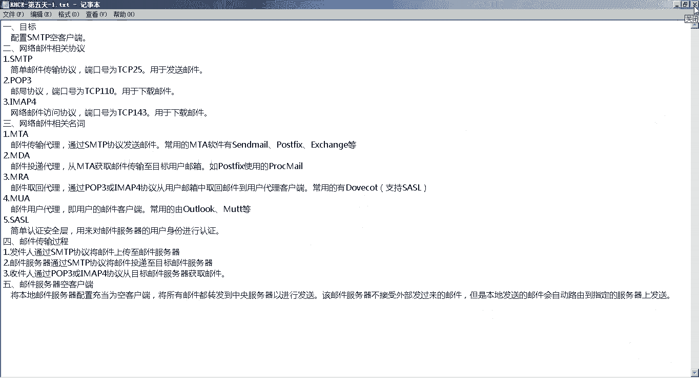

客户端，这个实验虽然比较简单，但是还是比较重要的啊。

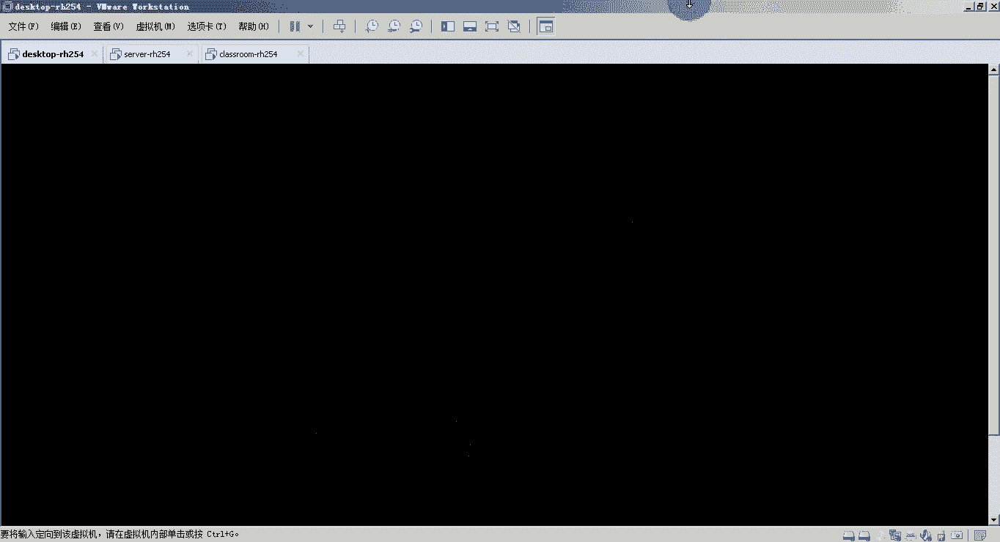

因为这个出现的频率很高，我们来看一下这个第19题，第19题，第19实验配置及发送电子邮件服务啊，就是一个电子邮件的这么一个空客户端啊，一个口端，那我们还是带着大家把这个实验做一做。

然后做完之后再带着大家梳理一下，我们这个实验它的大体流程是什么，首先第一个，我们先看一下它使用到的这个环境啊，他用了两台虚拟机，一个是desktop x，一个是server x。

那实际上就是我们现在的这个server杠h254 和，desktop杠2h254 ，然后在进行实验之前，需要重置srx和dex top x这样的系统，这个我们之前已经还原快照重置好了之后。

分别登录到dex top x上和sx上。

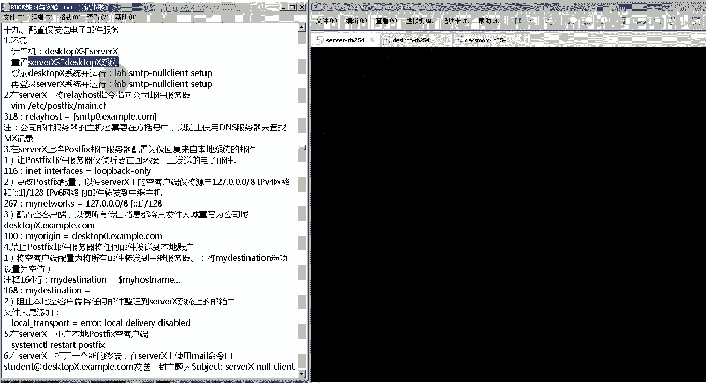

运行脚本来创建我们的这个初始环境好，那我们接下来再运行一下。

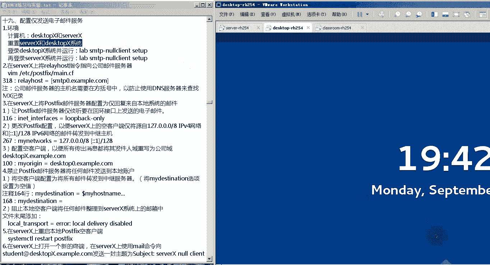

首先我们来到这个dex top x上，我们的这台dex top x实际上它是tx top 0啊。

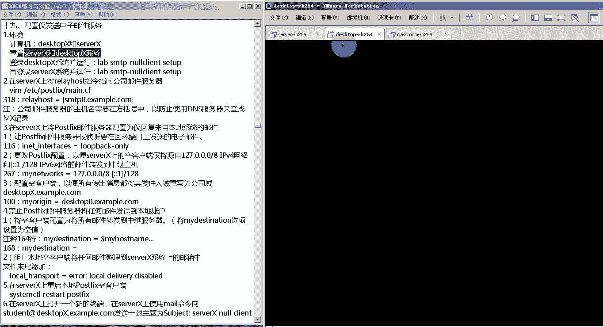

实际上它是tx top 0，好了，我们打开一个终端啊，打开一个终端之后，我们运行这个脚本啊，叫做lab s m t p gun u l l client setup，就是空客户端的意思啊。

之后他会设置一个初始环境，实际上在这个实验里边，我们这个dex top 0，这台机器运行完这个脚本之后，它会自动把自己配置成一个s m tp的邮件，服务器，也是可以进行这个邮件的发送啊发送。

但是由于这个要安装软件，还要进行一些后端的配置啊，所以说这个过程可能稍微时间上，可能会稍微长一些，好了啊，这就已经设置完成了啊，已经设置完成了。

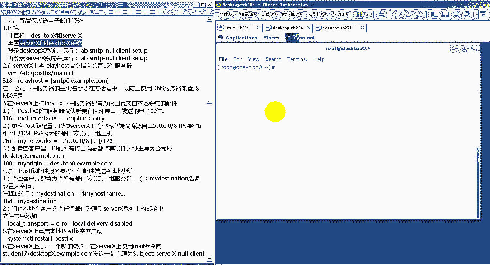

然后我们再来到我们这个server端，因为这个server x实际上它的这个主机名，在我们这个环境里边是server 0。

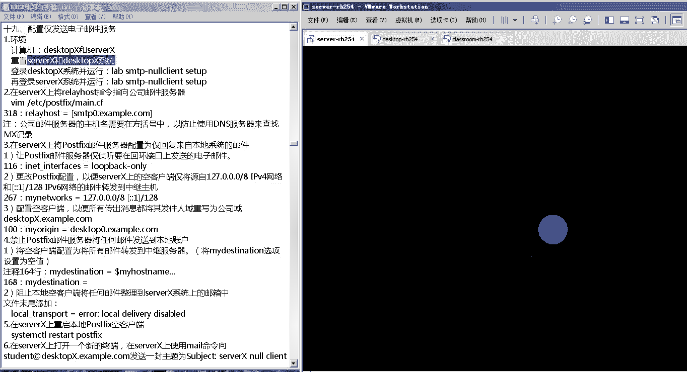

lab sm tp刚空客户端，setup，然后我们在这个server上在运行这个脚本之后，它也会把我们这个server 0，这台机器也配置成一个邮件服务器，也就是说desktop是一个邮件服务器。

我们的这个server 0也是一个有限服务器啊，也是一个进服务器，然后我们下边要进行的工作，就是要把我们这个server 0这台邮件服务器，把它配置成一个邮件的空客户端，邮件的空客户端。

所以说server 0上发出的邮件，都会自动通过我们这个dex top 0，这个台邮件服务器来进行发送的，转发好了，那接下来我们进行一下配置啊，进一下配置哦。

我们的这个邮件服务都是通过这个post fix啊，这款软件来实现的啊，这款软件实现，所以说我们需要对它的配置文件进行配置，那它的配置文件在哪呢，在etc下的post fix下有一个慢点cf啊。

这就是他的配置文件啊，这个配置文件，然后配置文件，我们首先第一个要修改它的318号啊，那我们set number 310一八，在318行这块添加这么一行啊，叫做rel host。

等于中括号sm tp 0点x example。com啊，中括号中括号这句话是什么意思呢，也就是说我这个server 0上的这个发送出来的邮件，发送出的邮件，都会自动把它传输到我们这个叫做xm tp。

零点xm。com这台机器上，然后这有同学可能会问，说这个s m t p0 点example com，这台机器是哪一台机器呢，这个其实我们可以来看一下。

我们n s look up sm tp 0点x example。com，哎我们看一下他给我们做出一个解析，他说这个sm t p0 点charm，实际上它的i p地址是172。2，五点点一零。

那其实就是我们desktop 0这台机器啊，我们一服康复科看一下，可以看到它1t是零的ip地址，就是172。二五点点一零，好我们按回车啊，继续，也就是说我的这一台server 0上发出的邮件。

都会自动通过dex top 0，这个邮件服务器来进转发，注意这会儿要加上中括号啊，要加上中括号，否则的话，我那个dns就会去把它当成是一个，这个邮件的记录啊，去查找邮件的记录去查找。

然后再修改第116号，116号，116行是我们的这个所有的这个接口啊，所有的接口也是监听的接口，在这里边他是进监听本地，我们把这个给改一下，改成loop back红雷。

也就是说我仅监听我本地的这个127点，零点点一啊，这个回环低开收回环地址上发送的这个邮件啊，其他这个其他的这个网络接口收到的邮件啊，这个我们都不予收啊，都都都都不收，然后再改第267号，267行。

260项，我们在herb是67行，这块添加一个叫做i ne杠，啊叫做my networks，空格等于空格127点点零点杠八，然后冒号冒号一杠128，这个实际上就是ipv 4和ipv 6的这个。

本机回环地址的网段啊，本机回环地址的网段，这个其实跟上面的配置起到的效果是差不多的，也就是它仅仅是把我们的这个本机上面，发送的邮件转发出去啊，不接收其他机器发过来的这个邮件。

然后再修改我们的这个第100行啊，100行当前的这个玉啊，那就是买与改成什么呢，改成叫做dex top 0点x example。com，这个desktop 0点except rom。

实际上就是我们这个desktop 0这台机器，也就是desktop gui h254 啊，25 四，这个是将我们的这个所有消息，他的发件人改成dex top 0。1，咱们的科目。

也就是说我本身是从server 0这台机器上发出的，所以理论上，我的这个邮件的发件人应该是server 0啊，但是我们刚才配置了，他所有发出的邮件都会发到dex top 0上。

那这句话就可以把你的这个邮件的发件人，改成dex top零点13。com啊，就是这么个意思啊，这个意思，然后第164行，要六四，实际上我们可以直接在这一行更改，当然你也可以把这一行注释掉，注释掉之后。

在下边168行，重新添加一个叫做m destination，就是我邮件的目标地址，等于啊，等于，这样的话，可以阻止这个空客户端，将任何邮件发送到我们的这个本机上啊。

本质上最后再在我们的这个末尾添加这么一句，叫做local，transport，等于error，叫做local delivery disab，对啊这个实际上写的是一个什么呢，就是一个错误的这么一个警告。

比如说当我的这个本地的这台机器，尝试通过自己发送邮件的时候，就会弹出这么一个错误报告，错误报告，当然这一行其实你加不加都无所谓啊，加不都做一个好，那我们w退出退出导入到我们退出之后。

由于我们修改了这个配置文件，我们要重启我们的这个post fix这个服务，让我们刚才的更改生效啊，更改生效好了，申请完成了之后，我们就可以在server x上面，再打开一个新的终端了啊。

打开一个新的终端，那我们打开一个新的动漫，然后在这个终端上，我们使用我们的这个mail这个命令，来发送一封邮件啊，这就是mail杠s，杠s是指定你的这个邮件的标题啊，就是邮件的sunlight。

叫做server 0 nor client，这是邮件的标题，发给谁呢，发给student，这个student呢是哪一个机器上的这个邮箱，用户呢是dex top 0点example。com。

这台机器上的啊，这台机器上，然后你的这个之后我们回车回车之后，在这里输入你的邮件的具体内容，我们输入一个n u l l client test n u l class，这就是我们邮件的具体内容。

之后再按回车回车之后，我们邮件如果编辑完成之后，按点再回车，哎这样的话我们这封邮件就编辑完成了，并且我们是在我们server 0上编辑的，所以说这封邮件server 0会把它转到dex top 0上。

再由dex top 0这台邮件服务器啊，给你发到desktop 0上面的这个students，这个用户上啊，students这个好了，那接下来我们可以试一下啊，我们可以试一下。

我们在server 0上去联系我们这个dex top 0上的，这个邮箱服务器，那就是m u t t，这个是我们刚才说的，它是一个邮件的客户端杠，f i m a p s冒号双斜杠。

i m a p0 点x3 p。com，这块可能有同学又会有疑问，诶，说这个i m a p0 点example。com，这又是哪台机器啊，这个我们可以，哎呦这波先漏一下啊。

这个我们可以n s录cp的去看一下啊，m a p0 点x3 炮点com，可以看到它的ip值还是172。2，五点点一零，也就是说我们的这个m a p这个邮箱服务，还是在我们这个top 0上。

那现在我只不过是通过server 0上，通过我们这个m u t t这个客户端，连接到dex tape顶上这个邮件服务器，那就m u t t杠f mp s2 号双斜杠，i m a p0 点x咱们跑点看诶。

他问你说我们这个root的邮件不存在，是否要创建它啊，这我们yes啊，yes yes，之后啊，在这里边他会让你选择，他说这个证书是属于这个的，问你是否接受这个证书，那我们是接受的，如果你按o的话。

就是只接受一次，如果按a的话，就是全部接收完了，我们按a一直接受，它提示证书已经接收完毕了啊，之后他让我们来登录我们的这个邮箱啊，邮箱那我们刚才发的这个呃，邮件是发给了我们这个student这个用户。

所以我们用student这个用户登录啊，student，然后它的密码也是student，注意密码不要求错诶，在这里边我们可以看到这是一封邮件啊，邮件这个邮件是在这个时间发送的啊，这个时间发送谁发的。

是root发的邮件的大小0。6k，然后这个邮件的标题，就是我们刚才在发送邮件的时候，指定的这个标题叫做server 0 n这个client啊，你还可以点到这个邮件里面去啊，回车键直接点进去。

连接之后可以看到我们的这个邮件啊，是root desktop 0上发送的诶，大伙可以看到，因为我们刚才在我们的这个post fix，它的这个配置文件里面编辑了它发出的邮件。

其实本来应该是在server 0点exemple com上的，但是我们编辑完配置文件之后，可以看到它的发电人地址改成了dex top，零点example，然后发给谁呢，发给dex top 0。

1x3 方向的student啊，然后我们这个邮件他的这个标题叫做server 0，空客户端，然后里面的内容就是空客户端的测试邮件啊，如果退出这个m u t t这个客户端就按q啊，连续按q就可以了。

之后我们就可以在server 0上和desktop 0上运行，我们的这个脚本来进行检查了，就是啊lab啊，sm tp港通客户端breed诶，可以看到它提示我们这个server 0上配置成功了啊。

我们再在我们这个dex top 0上查lab，sm t p gnu l l client，lab s m tp杠n u l l client grad啊，刚才打错了诶，它提示这个验证也成功了啊。

看到我们的这个邮件服务器上，成功的接收了这个邮件啊，就是在我们students这个用户的邮箱，这个就是我们的这个实验，那么回过头来再通过一个简单的小图示，简单的小图示来给大家。

再来说一下我们这个邮件服务它的这个原理啊，原理我们现在是有两台机器，一个是server 0，一个是desktop，小写吧，server 20，还有一个是desk top 0，然后这两台服务器上。

我们都通过了这个post fix啊，这个软件来把他们俩配置成了，是两个邮件服务器，postfix之后，我们在sol上进行了一些配置，这些配置主要是什么呢，就是我本地不接收任何邮件，服务器发送过来的邮件。

而我本地发送出去的邮件，就是在sl 0上创建的邮件，我都自动把它发给谁呢，发给我的desktop 0，然后通过desktop 0，这台机器来实现这个邮件的投递啊，邮件的投递啊，就是这么一个原理啊。

这个原理，然后我们后期的时候，我们用这个root账户，在我们这个sl 0上创建了一封邮件啊，创建了一封邮件，这个邮件他的这个发件人，实际上应该是root at server 0点x sample。

com啊，实际上应该是这个root at server 0点example。com，但是由于我的这个配置啊，我的这封邮件会自动转到我们dex top 0上，转到他要造dex top 0上之后。

他的这个发件人，就自动变成了root at dex top 0点example，就是这么一个效果啊，这个就是我们这个小实验，这个赞这块写错了，然后再由我们desktop 0上这个post fix。

这个邮件服务器，将我们的这封邮件，转到了我们dex top 0上的一个用户，也就是这个student这个用户他的邮箱里面，之后我们又通过我们的这个叫做m u t t，这个m u t t这个邮件客户端。

它是在我们的这个server 0上的，但是我们通过这个邮件客户端，连接到了我们的这个desktop 0上面的mvp服务器，然后连接上了之后，我们就可以看到这个students这个用户。

他这个邮箱里的邮件了，这就是我们整个的这么一个完整的，完整的这么一个小实验，小实验好了，那我们这个就到这了就到这，然后大家伙在课下的时候，一定要把这个实验做的特别成熟，因为很多次考试的时候都会考。

这个就是配置s m tp的这个攻克无端供暖，它这个配置配置文件里面需要记的东西，实际上不是特别多，所以说大家伙多做几遍，把它做的纯熟就可以了，当然前提还是得把我们的这个呃实验，它的这个原理把它搞清。

这样的话你才能明白，那我们这个实验就到这儿了啊，这个实验就到这儿了，我们把这两台机器还原一下。

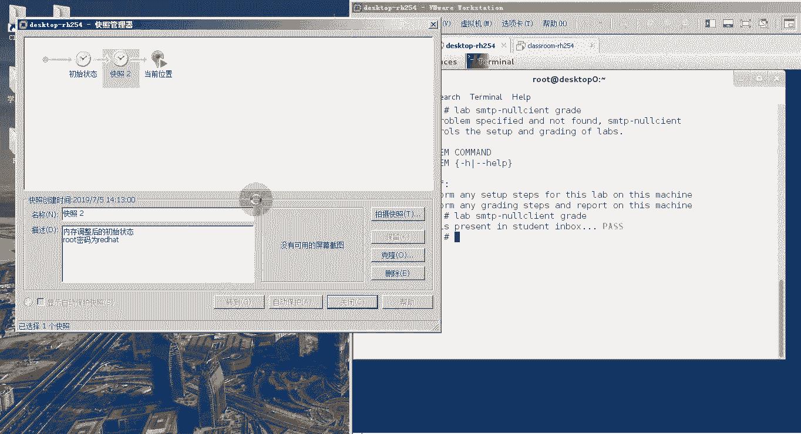

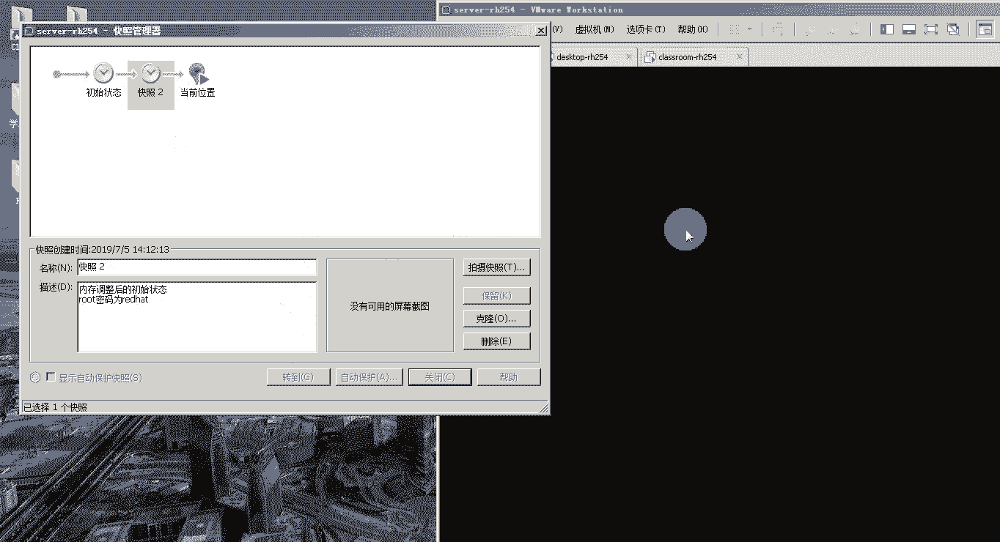

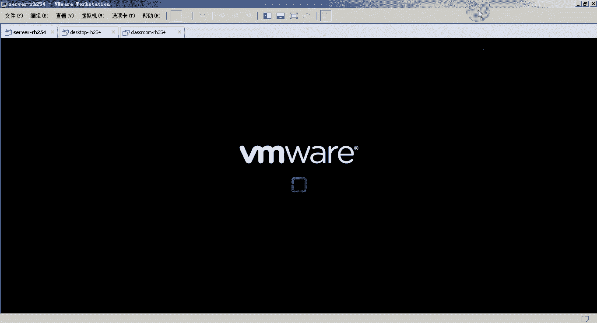

完成之后我们来看我们今天的第二部分内容，第二部，第二部分内容，跟我们刚才讲的那个邮件服务器的内容，是一样的啊，是一样的，都属于这个高频考点啊，就是每次考试的时候，这个几乎是必考的啊，几乎是必考的。

所以说这个第二块的内容，大家伙一定要把它掌握得把掌握，第二块内容是什么呢，就是egi啊，就是ice sci，他的目标就是熟悉s sci的相关概念，可以构建sci target和这个line。

并且设置访问权限，可以word启动区去登录coc的icon啊，等，诶这王亚蓉的这个麦没有关啊，把麦关一下好了，好了这个就是这个s gi啊，gi，所以说s gi这个实验，总体来说相对来说比较简单的。

只要你把它的服务器端和客户端的配置都搞定，就ok了啊，然后他跟刚才我们介绍的sm tp，邮件服务器的那个空客户端是一样的啊，几乎属于每次考试必考的，所以说大家伙一定要把它做的特别成熟才行，好了。

首先第一个，我们先来看一下这个i sci的相关术语，第一个什么叫做sci sci，这个叫做小型计算机系统接口，全称叫做small computer system interface啊。

小型计算机系统接口啊，系统接口，这个sci实际上是我们的这个服务器上啊，服务器上我们的这个福气，他语服务器上面有个硬盘之间互相交换数据啊，的这么一个协议，那ice garc是什么意思呢。

ice garc实际上就是internet garc的意思，它可以使我们的服务器，可以通过internet网络与远程的我们的这个存储设备，互相交换这个scars的相关的这些个指令啊。

来让完成数据的这个存储，这就叫s cai，第二个概念叫做fc fc，这个我们这叫做光纤通道啊，叫fibre channel啊，光纤通道，这个fc通常是指，就是利用我们这个光纤和光纤交换机来搭建的。

这么一个存储网络主要是用在存储网络里边，它的特点就是它的速度会特别快，然后它的缺点就是它的这个造价成本比较高，造价成本一般情况下它用在哪呢，就比如说是虚拟化呀，或者是后边的这个云计算啊。

或者是我们的这个对我们存储它的这个速度啊，要求比较高的这种业务场景下啊，一般都用这个fc啊，fc第三种叫做dos啊，dos叫做直连式存储啊，叫direct，这attach storage啊。

叫做直连式存储，它指的是什么，是指的是你这个服务器直接去通过网线连接，我们这个磁盘阵列等存储设备啊等等，这种叫做大肆存储，第四个叫做nas，nas叫做网络接入存储，或者叫做网络附加存储。

叫network attach storage，他指的是什么，就是在你的这个网络里边，会有一台专门的存储服务器，这个存储服务器可以是阿帕奇这种web服务器，可以是nfs服务器，也可以是ftp服务器。

然后用来存储文件啊，这叫做nas nas，第五就是sun sun叫做存储区域网络，叫做storage area network，这个sun就是我们刚才说的这个fc，它可以使用光纤作为传输介质，通行。

通过这个光纤接换机啊，去连接你的这个磁盘阵列啊，或者是我们的这个存储服务器等等，从而构建一个高速的存储网络啊，这就是我们存储的相关数据，存储相关数据sci啊，scc，这个是我们服务器与我们的这个磁盘。

进行交互的一个协议，进行数据交互的一个协议，ice sky就是网络sci internet cai的意思，可以让我们服务器与远程上面的这个磁盘，进行数据交互，fc啊，光纤通道啊。

指的就是我们的这个光纤这种传输介质啊，还有我们的hb卡连接光纤的啊，还有就是我们这个光纤交换机等等，dos指的是直列存储，就是服务器的存储空间不足啊，可以直接通过网线连接磁盘阵列。

扩充我们的这个存储空间，nas和网络接入存储指的是一个网络里边，还有一个存储服务器，可以是ftp，可以是fs，三，就是我们说的存储区域，网络特点就是速度快，但是造价成本比较高啊。

这就是我们的这个i s cai的相关数据，那什么是ice scars呢，这个咱们刚才其实已经简单介绍过了，就是internet sci的意思，他指的是通过tcp ip的网络来运行scc协议。

来提供存储空间，他的这个主要工作原理其实也很简单啊，它是发送端将sci命令和数据封装的tcp ip包，再通过网络转发接收端接收到这个数据包之后，把它还原成scars命令和数据，并执行完成之后。

再将返回sci命令和数据，再次封装到tcp i v报中进行传输，发送给我们的这个传回到我们这个发送端啊，这就是它的工作原理，那它的这个效果是什么呢，那我们给大家通过一个图来简单的说一下。

这个s cos的这个效果，然后在这个图里面，我们也会捎带着把我们这个第四块，就是这个cai的相关名词，给大家简单介绍一下啊，介绍一下，好了，ice sci，实际上它也是一个服务器，客户端的这么一个架构。

首先你有一个cos服务器端，这个服务器端通常我们把它叫做target，叫做ice scaring，target，然后是我们的客户端，但是客户端我们把它叫做clean，我们把它叫做ice scussi。

印尼twitter啊，这个in tator这个英文单词是什么意思，就是发起者的意思啊，叫做发起者的意思，然后我们在这个i gi target就是这个服务器上，我们可以有什么呢，我们可以有以下这些东西。

包括，点img文件，然后disk磁盘part分区lv啊，就是我们的逻辑卷，逻辑卷啊，你可以有这些物理的这种存储设备，存储设备，然后我们可以在我们的这个i s cast target。

上面创建一个什么东西呢，叫做iq n i q n，这个艾q人实际上就是ice gari，合格名称的意思啊，就是ice gari这个quantity of name啊，quantity name之后。

有了这个icron之后可以干嘛呢，我们可以将egis，服务器上的这些个文件做一个映射，把它们映射成什么呢，注意把它们映射成l u n，那什么叫做lu n呢。

lu n其实全称叫做logic unit name的意思啊，叫做逻辑单元名，叫做逻辑单元名，在这里边你就可以把它理解成什么呢，就相当于是一块块磁盘啊，一会儿磁盘，然后你可以把这些个磁盘。

让他们属于某一个指定的agrant，那我们这个图里面，假如说这个l u n0 ，m u n e m u2 和m u n3 ，他们都属于同一个iphone啊，同一个ip好了，这就是服务器端，然后客户端。

假如说我们现在客户端上面已经有一台啊，已经有一个磁盘设备了，比如说他是第一威胁的sd啊，sd，但是我的这个客户端它现在存储空间不足了，那怎么办，他可以这样安装客户端的软件，并且通过这个客户端的软件。

登录到我服务器上的这个icony，注意这是一个登录的过程，我把它写写一下，就叫log老公，你等登录之后的效果是什么呢，效果就是你服务器的这个艾克，下边的这些个l u n，就会自动映射成我客户端的磁盘啊。

举个例子，比如说我的这个l u n0 啊，做一个映射l u n e啊，做一个应用设l u n2 ，做一个应用设l u n3 ，映射，然后映射成什么呢，就映射成你的这个客户端的磁盘。

比如他就映射成了比如d威胁的s d b，这个就是s d c，这个就是s d d，这个就是s d，然后你在使用这些磁盘的时候，就仿佛和你使用本地服务器上的，这个本地磁盘的效果是一模一样啊。

这个就是ice car seat最终的这么一个效果啊，这么一个效果，那我们可以看到啊，这个磁盘是从哪来的，是从我们这个艾斯cos服务器上的lu n映射来的，l u n又是从哪来的呢。

是通过我们这些个点i m g文件，或者第四个磁盘或者是part的分区，或者是lv逻辑卷应声而来的，然后他是如何映射到我的这个客户端上呢，是通过我客户端安装客户端软件。

然后登录到sci上的指令i q那边来的，那如果我们登出的话，log out的话，那上面的这些个映射啊，就是服务器跟客户端的映射就会断开，然后你的这个客户端，上面的这些个磁盘就不见了，那就不在了。

这个就是我们的这个gc的这么一个，简单的原理啊，简单的这么一个原理好了，那接下来我们来通过三个实验啊，来看一下这个scar c服务器端和客户端的配置，我们来看一下，第20个实验，第20个实验。

20 21和22哈，这就是这三个实验，20 21和22都是s cc的实验，那我们来看一下第20个实验。

第二是个实验室提供s s r c m标语，就是提供s gc，他get的啊，其实主要就是配置我们的这个s gc服务器端，配置s gc服务器端好了，那么我们先把这个环境来准备一下啊。

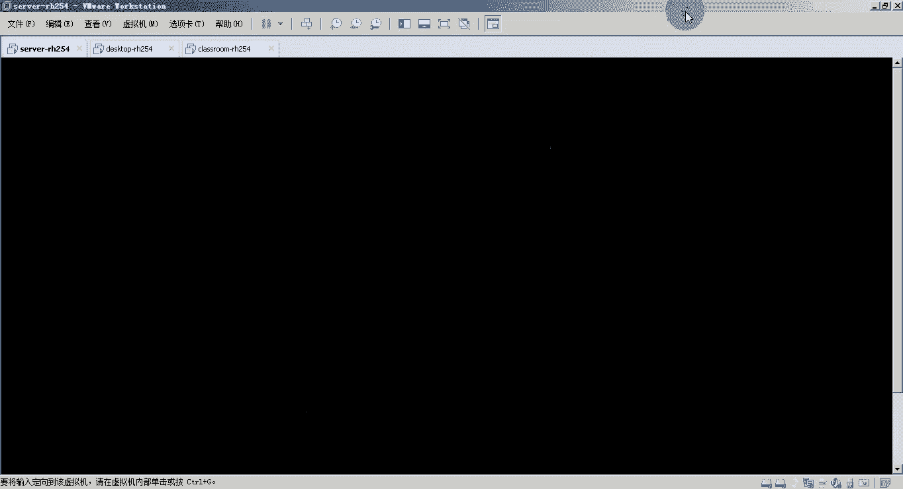

然后这个实验用的话就是server x这一台机器，server x g一台机器，实际上就是我们这个server coh 254，也就是server 0这台机器在进行实验之前，首先要对这台机器进行重置啊。

那我们刚才已经把它重置好了，那接下来我们来登录一下，还是使用root账户登录。

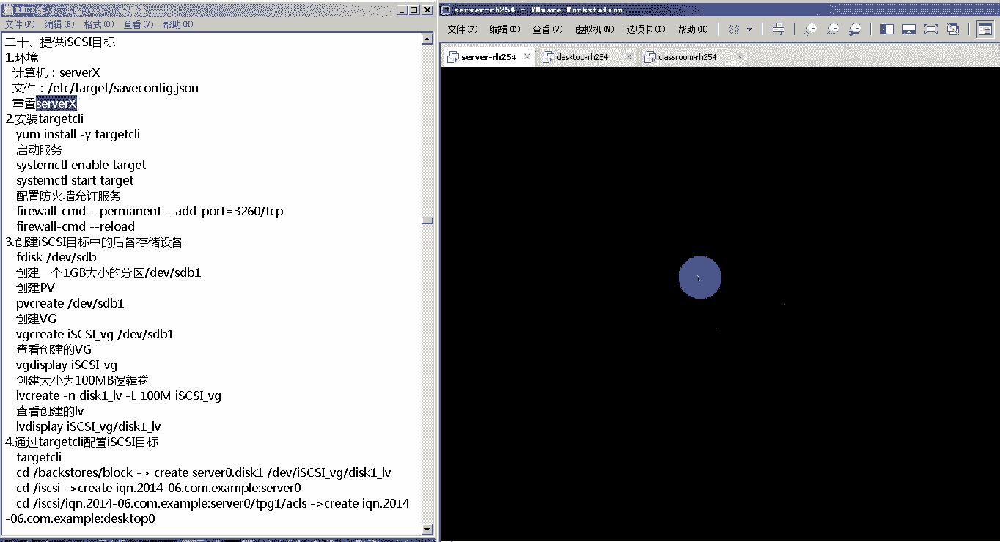

好了啊。

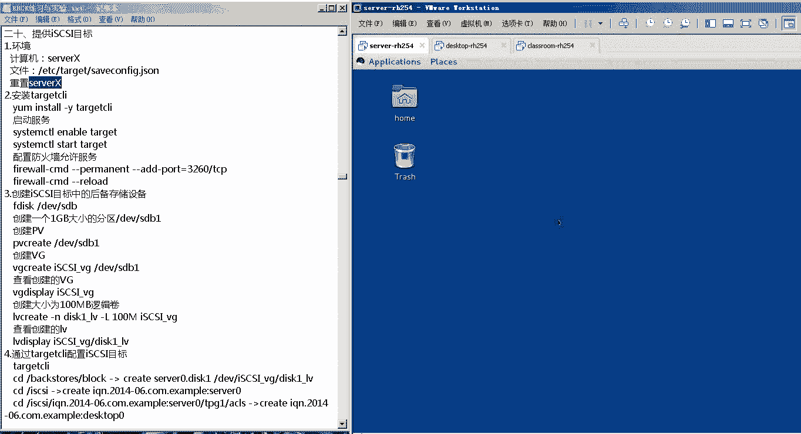

已经登录成功了，登录成功之后，我们把我们的这台机器配置成一个s garc的target，就是ice coc服务器，那首先第一步我们先要安装软件啊。

y u m install这个服务器端软件就叫做target cli和y，他改的cv方块，就这，注意啊，就是大家伙在做实验的时候，可能也会遇到这种问题啊，这种问题我们可以看一下他写的是什么意思。

他说现在一个其他的应用程序，正在使用ym这个命令啊，这个已经闪过去了，这个时候怎么办，你只要稍等就行了，当其他的程序使用完这个y u y m之后，然后他就解除了释放。

然后我们的这个y y m命令就可以运行了，哎出现completely，代表我们这个软件已经安装成功了，安装成功了，那我们现在把这个服务开起来，首先将服务设置成开机自启。

就是system c t l inable target，再把它启动，那就是start tk，好了启动起来了之后，注意一定要查一下这个服务的状态，看看是否真的已经开启啊。

stus cal可以看到他现在的状态是active writing，active，running，active exist，active状态是正在运行，然后你a包的啊，代表他是开机自启的。

之后我们要配置我们的防火墙，配置防火墙，允许我们这个s ky对外提供服务的端口开放啊，那它端口是多少呢，这个大会必须得把它记住啊，s cos服务的端口是3260tcp的三角这里。

所以我们来加起来就是feral杠，cmd杠杠permit啊，永久添加杠杠i的，增加一个port端口啊，增加一个开放的端口，哪个端口呢，32603260是tcp还是udp的啊，是tcp的端口好了。

这就添加成功了，添加成功了之后，由于我们刚才在添加端口的时候加了杠杠，permanent，这个参数就是永久添加，所以得杠杠reload，重新加载配置，让其生效好了，重新加载完配置之后。

一定要firework on c md杠杠list guo，查看一下你的配置是否成功诶，我们可以看到我们当前的默认区域是public啊，因为它是default的啊，而且他是active活跃的区域。

然后在它的端口这里边，有一项就是tcp的3200，那看到这就说明我们的这个端口已经开放了，已经开放端口开放了之后，我们现在啊就需要创建我们的这个l u n啊，创建我们的l u n，但是l u n。

我们刚才在图示里边给大伙已经解释过了啊，这个l l n可以通过什么来重建呢，可以通过一个分区啊，可以通过一个磁盘啊，可以通过一个点r m g文件，还有一个lv，那在我们这个实验里边。

我们是通过什么来创建的，注意我们是通过一个lv来创建的啊，lv然后这个就考研呢，大家伙之前在这个rh cr c课程里面学的，lvm呢哈那我们在这就不赘述了，我们直接来了。

首先第一步l s p l k看下我本机可用的磁盘，可以了，本机可用磁盘有两块，一个是sd和sdb，但是sda上面已经安装了操作系统，所以说我们可用的真正的就是s d b。

这个s d b这块磁盘大小是十个g啊，它的类型是disk，那我们首先需要在上面进行一个分区啊，分区，那就是f disk啊，dva的sdb，然后分区的时候我们可以选择dos分区，或者是gp p分区。

这个为了方便我们直接选择gp分区了，所以在这里我们能记，然后创建一个新的分区n，然后分区的编号采用默认的一，然后首扇区直接回车采用默认的，然后这个伪扇区，这个时候可以设定这个分区的大小。

比如我们设置一gb加一gb，然后w啊写入写入之后l o s b k诶，可以看到现在有一个这个大小大约为1g啊，这实际上是500 954兆的这么一个分区，那接下来我们把这个分区创建成我们的这个pv。

就是pv correct，dv下的sdb 1 a提示我们physical volume，也就是物理卷pv的意思啊，已经成功的创建了，那我们p vs这个命令来看一下。

可以看到我们当前有个dv下的s d b一啊，它的大小大概是一个g啊，是954兆，那我们再创建一个vg，那就是vg create a在这指定的vg的名字啊，比如说我们就叫做ice sci港v g。

实际上这个vg的名是可以随便起的，然后使用的pv是第一威胁的s d b一啊，那这样的话vg就已经创建成功了，注意在创建vg的这个过程里边，它有一个很重要的步骤，它就会把你的这个pv分成等大的块啊。

然后每一个块我们把它叫做一个什么东西，叫做一个p，然后这个p在设置的时候，实际上我们是可以指定它的大小的，但是我们刚才在创建这个vg的时候，并没有指定的大小，所以说它是默认的大小就是四兆啊。

就是四兆好了，那我们vg也创建出来了之后，我们再在vg里面创建一个大小为100兆的，一个lv，就是lv correct啊，lv create杠n给它一个名字，比如说跟小disk一杠，v杠l指令。

它的大小，比如100兆在哪个微机中创建的，是在ice sci下划线危机中创建好了，它提示我这个lv已经创建了之后，我们l v s可以看到有一个叫做disk，一杠lv的这么一个lv。

它属于s cai杠v g这个vg，它的大小是100兆好了，那截止到现在我们这个lv就已经创建出来了，那我们接下来就要把这个lv，映射成我们的这个cos服务器上面的，一个i q n下的l u n啊。

那这个怎么做也很简单，我们通过这个target cli这个命令啊，tag的cp，然后进入我们这个ice scars这个编辑界面，编辑界面，那首先我先cd到这个跟下的啊，back stories这块。

注意啊，有同学可能对这个目录不是很熟悉啊，其实你可以直接l s来看一下，您可以看到我当前是在跟这个目录下，根目录下它有几个目录呢，有三个目录，注意看这个目录之间的关系。

这三个目录分别叫做backstories，i gari跟loop back，然后在backstories下边有四个目录，分别是block file，i o pesci和r a m disk啊。

那现在我们要进到哪一个目录去呢，就是要进到这个backstories这个模型，所以cd到根下的back slowly，下边有一个block这么一个目录啊，注意看blog这么好进入这个目录了。

你也可以用p w看一下自己是不是在这之后，我们create创建server 0点disk 1，用的是dv下的egi港vg，下边我们刚才创建的dixk一杠lv，这样的话我们就创建了一个文件。

这个文件叫做server 0点disc 1，这个文件实际上就是我们刚才创建的这个lv，那创建完这个文件之后，我们cd到根下的gc这个目录下啊，s class目录下之后，p w b看下啊。

确实在更新s gc，我们创建一个i q n create iq n，注意iq n的这个格式是点啊，后面加上你的这个年份啊，比如说我们就按照我们这个实验来吧，2014杠零六，这里需要注意什么。

就是i q n的这个命名格式，他的月份必须得写两位数啊，比如说你6月份你不能写六，你要写零六啊，要不然它会提示说这个名字不对啊，不对，点com。example啊，点com。example。

然后叫做server li啊，这是我们这个艾克的名字好了，他其实你说i pro已经创建出来了啊，创建出来了，创建出来了之后，我们在cd到我们的这个根下的i sci下的，其实就是在当前目录啊。

你创建的这个i q n下啊，i q n下l s可以看到你的这个概率空间下，有一个目录叫做t p g1 ，t p g一这个目录下有三个目录，分别是a c l s l u n s跟这个portals啊。

portals，那我们现在要进入哪个目录呢，要进入这个tp g一下的a c l s，然后在这里边我们要再创建一个icon，2014杠06。com。example，冒号desk top 0。

然后这位同学可能会稍微有疑问，说诶我们刚才不是已经创建了个q了，那这个app是用来干嘛的，注意你后创建的这个acron，是来验证客户端的身份的啊，是客户端验证自己的身份之后。

才能连接到我们的s卡c服务器，所以大家一定要清楚这两个icron，他们的功能是什么，要不然这个实验你做着做着就乱了，我们第一个创建的爱国人，里边包含了我们的这个l u n，就包含了我们这个磁盘文件。

第二个i o n是用来进行认证的啊，认证的好了，然后我们cd到我们的这个ice gari啊，跟新的i gi下的，我们创建的那个icon下的sl 0下有一个tp g。

1t p g一下边有一个l u n s啊，这个目录下啊，实际上我们现在进入的就是这个目录，你可以p w b来看一下啊，那可以看一下好了，进到这个目录之后。

我们create我们跟下的backstories，下这个420d disk啊，这个文件，这样的话就把它给映射成我们的这个，l u n0 了啊，注意啊，我们的这个文件是我们第一步创建的，那个文件啊。

在跟下的bstories的blog下啊，有一个这个server 0 g41 ，那这一步实际上是把它给创建成l u n0 了，并且把这个l u n0 给映射到我们这个i q，n点，2014杠零六点。

example，冒号dex top 0，这在这个上面了，然后我们再来设置一下它的这个端口，实际上设置端口这一步其实可以把它省略掉，因为我们可以不设置的端口，你不设置端口。

它默认的端口也是tcp的3060，那我们就来到这个ptos啊，这个模下，然后create啊，172。二五点点一一，注意这个就是我们server 0这台机器，它上面的这个ip地址啊。

然后他对外提供服务的端口是3260，然后整个都已经配置完成之后，e s t退出就ok了，然后我们if config看一下啊，可以看到啊，172。二五点点一啊，跟我们这个配置是一样的好了，那截止到这儿。

我们的这个小实验就完成了，我们s scarc的服务器端就配置完成了啊，那接下来我们再配置一个客户端，然后在配置客户端的时候，大会需要注意啊，这两个实验它是紧紧连接在一起的啊，一定得注意啊。

这两个实验室紧紧连接在一起的，所以说你刚才做完这个配置，s coc服务器端的这个提供s class目标，这个实验之后，你不要重置环境啊，不要重置环境，我们直接来到这个dex top 0的机器上。

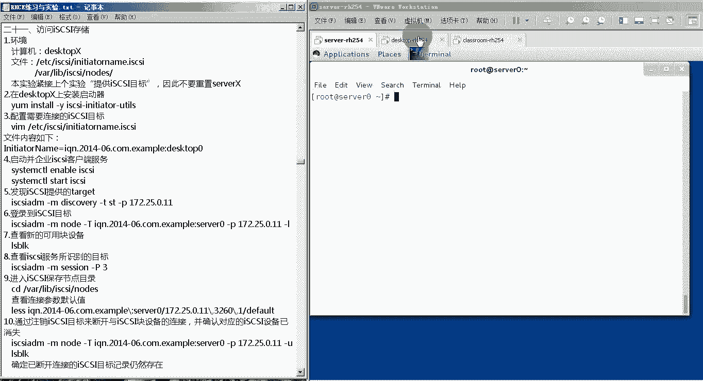

在dex sop 0这台机器上啊，我们可以看到它是我们本次实验运行的，这个环境，它是本实验是紧接上个实验的。

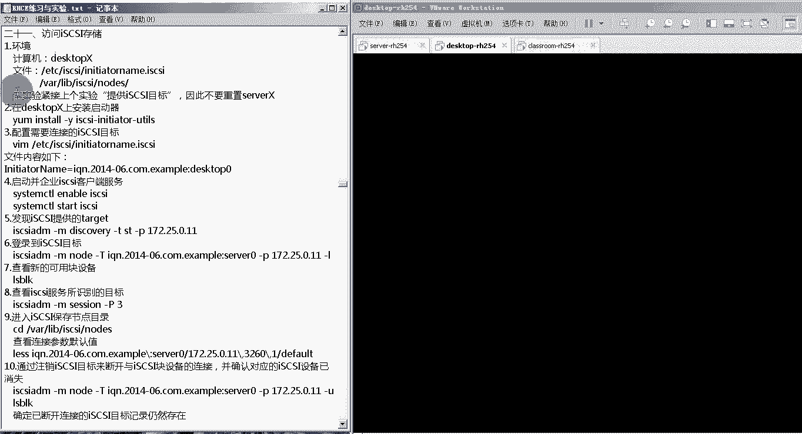

因此不要重置sx啊，我刚才没有重置，那我们来到death sop 0上。

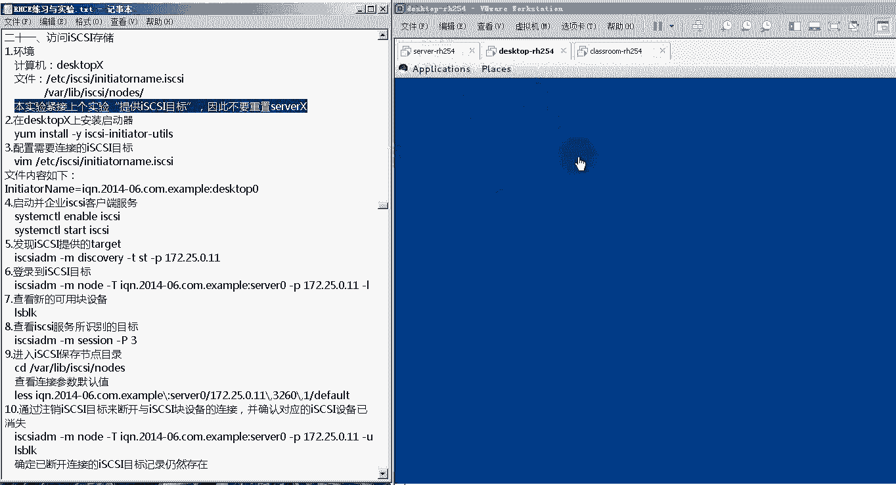

s death top 0上之后，我们要干嘛呢，首先第一步，它作为一个s garc的客户端，我们要安装一个gc的应用，那就是y u m install guy，i cai guinning tator。

gu t l s啊，这个名字比较长，哎还是这个啊，这刚才咱已经说过了，因为现在这个y u m，这个程序被其他的应用占用着，我们稍等一下就好了，诶，他提示说package escari，这个软件包。

already in store and lattivision，nothing to do，注意啊，很多同学嗯有一个不太好的习惯，就是你运行命令之后，这个命令给你的反馈经常不看啊，有同学可以看到了。

诶，这什么意思啊，是吧啊，是不是我这个没装成功啊，其实不是人家告诉了说这个软件已经安装成功，并且是最新版本了啊，好了，那既然已经安装成功了之后，我们直接来编辑它的配置文件。

在etc下有一个s gc gc，下边有个mini itor name，点s gc，在这个配置文件里面，我们需要指定我们验证用的艾克ine，这个验证用的艾克是，我们刚才在服务器端上面创建的第二个icon。

所以他是艾克ine，2014杠铃6。com。x sample，冒号desk top 0啊，冒号dex top 0，之后配置完成之后，wq推出，我们来启动s cs的客户端，首先先引able。

把它设置成开机自启，然后再start cc好了，那接下来我们现在就来看一下，我们服务器端上有没有已经导出的target，已经导出，大概那我们用的命令叫做s coc a d m杠m啊。

指的是你的这个模式mode，第四cover discover，就是发现的意思，杠t杠t发现哪台机器呢，杠p参数用来指定，发现172。二五点点一一这台机器诶，可以看到他这块给你有一个显示啊，他说172。

二五点点一的3260端口，没有发现记录，诶，这个是我们刚才哪儿做错了啊，我看啊杠t啊，注意这个杠s t这没有杠啊，唉这就发现成功了，这是我们参数打错了啊，参数打错了，可以看到他说172025点点一一的。

3200端口上发现了一个ap啊，这个icon叫艾坤点2014，杠06。com下的example，往后server，往后server好了，那我们就可以登录到这个acronib了。

那首先我our spk看一下我的这个客户端，可以看到我客户端现在有两个磁盘，一个是s d a，一个是s d b s d b大小是十个g好了，那现在我再来登录一下，那就是s coc adm杠m node。

港大t后边跟上你发现的这个i q n啊，这个我直接写一下吧，iq n。2014杠06。com。x sample，冒号server 0，然后杠p登录的是172。二五点点一一。

然后杠l就是登录的意思哎在登录的时候，大家伙一定要看他最后登录给你的这个提示啊，它提示说log to locking to到你的这个艾克上，successful，这代表你已经登录成功了好了。

那登录成功了之后，我们来看一下效果，l s b2 k可以看到诶，是不是本机奇迹般的多了一块磁盘，叫做s d c，这块磁盘的大小是100兆啊，这个磁盘的大小是100兆，好了，这个。

其实我们这个实验到这就基本上告一段落了，但是下面还有一些对你的这个cos，它改的进行一些相关操作，比如说你可以查看一下你的这个section杠p3 ，这个session打错了啊，杠p3 。

在这里你可以看到你这个session，就是你这个人客户端跟服务器，他们的这个连接啊，section就是连接的意思，还可以看什么呢，还可以看我们的这个艾克人保存的位置。

它实际上是把服务器上的艾克人发现了之后，保存到本地的一个目录，这个目录就是挖下的live下的sci写的nose lip啊，可以看到这个ph，然后你还可以去查看这个icon，它里边的是一个值。

你注意这个icon实际上它是一个目录，是一个目录，default可以查看到这个文件里面值啊，这就是连接的一些相关信息，在这里都能看到，这里都能看到，rush的另一部写的sci写的nose啊。

在这里边你可以看到这个s garc呃，他接收的这个target啊，它里边的目录结构，目录结构，然后我们现在来system c t l restart，重启一下我们的这个s r c服务之后。

我们在l s p l k可以看到我们这个s d c，它仍然存在仍然存在好了，那我们现在要把我们的这个i q n给他更新，并删除之后再重新发现啊，就是我们现在客户端，不是从服务器端发现了一个app。

我们现在要把这个iphone给它删除掉，那就是ice scars，adm杠m node，杠大t iq n。2014杠06。com。x sample，冒号server 0 fp 172。25。20。1。

杠u杠u是更新的意思啊，更新的意思，如果你把杠u给它改改成杠o delete，这样的话就把它给删除了，删除了之后l s p l k可以看到诶，就已经没有了，s d c就已经没有了，那没有了怎么办。

我们还可以重新发现目标就是s x c a d m，注意啊，这个没有了之后，你到这个vr下的力不下的sci写的notes里边，s，你发现诶，这个保存在我的这个客户端的这个文件里面，也没有了啊，也没有。

所以我们可以重新发现了哈，那就s杠c a d m啊，杠m d cover，杠t s t啊，杠p172。二五点点一啊，重新发现，重新发现了之后，我们再cd到vr下的lib下的i sci写的notes里边。

l s诶，发现它就已经有了，有了之后我们就可以再次把它删除，gm node杠大t，然后i q n。2014，杠零六点x com。x3 炮冒号server，零杠p172。二五点点一。

然后杠o delete再次把它删除，再次把它删除，再次删除之后再cd到rush的live下载sci下的nose，诶发现我们的这个就用没了啊，这个就相当于是对应的这个target的一个管理。

然后教会大家如何删除它，该如何再重新发现或者更新，就这么一个东西好了，那其实到这我们这个小实验就已经完事了，就完事了，完事了之后，我们再回过头来看一下这个实验的效果。

我们还是通过一个透视来给大家介绍一下，是这样的，我们现在有两台机器，一个是server 0，一个是dex top，一个是server 0，一个是dex top，server in desting。

然后我们在server 0上边，我们安装了这个s s cos服务器端的软件，就是这个target c l i，之后我们在这里边儿创建了一个vg啊，我们先说pv吧，从从头开始说吧。

我们这里边有一个dv下的s d b，有这么一块磁盘，我们这个在这个磁盘的基础上，给它创建了一个分区，叫做第一威胁的sd b1 ，啊这个分区比磁盘还大呢，啊，这我还是直接写这个分区吧，dv下载sdb。

之后我们把这个dv t的sb 1，给它做成了一个什么东西呢，它做成了一个pv，把它做成了一个pv之后，我们通过这个pv创建了一个vg，然后我们在这个vg里面划分出了一个lv。

之后我们把这个lv映射成了一个ln，映射成了一个l u n0 啊，lu 0，之后我们在我们的这个服务器上，创建了两个icon啊，这两个i q这两个q呢一个叫做i q n，然后点比如说这个2014啊。

杠零六，然后点com。x3 跑冒号server 0啊，注意这两个icon的名字啊，注意这icon的名字啊，这是一个i phone，然后我们又创建了另外一个i phone，叫做iq n点。

还是2014杠06。com。example，冒号desk top 0 top，这两个i q n它分别是用来干嘛的呢，一个i q n里边包含了这个l u0 ，另外一个i o n是用来做认证的。

之后我们在这个dex top 0上边，我们安装了这个desktop 0的这个软件，有人ice scars软件叫做ice scars，杠tor杠ut i s啊，安装了这个软件，装完这个软件之后。

我们来编辑了一下这个软件的配置文件，在这个配置文件里面就写了，我们验证需要用到的这个验证用的acr啊，这个配置文件里面就写了这个验证，安的这个配置文件，就是etc下的那个文件啊。

etc下的scoc下的配置文件，这样的话，我们的这个客户端，就能通过服务器端的这个认证了，通过了之后，我们客户端，就可以登录到服务器上的这个eq，logging，然后登录之后的效果是什么呢，是这样的。

我们的这个客户端本身，它原来只有一个s d a啊，dv下的sd和dv下的sdb，然后登录了之后就多了一块dv下的s d c，然后这个dv下的sdc，实际上就是我们这个l u n0 映射过来。

l u n0 映射过来，这个就是我们这个实验啊实验的这么一个效果，实验的效果，好了啊，这个就是我们gc的一个服务器，端和客户端的一个配置啊，这刚才的两个小时验，那接下来我们来看一下。

我们今天最后的一个实验，这个最后的一个实验，其实是跟上面的两个小实验嗯，对比一下，没有什么太大的不一样啊，没有什么太大的不一样，好了，那接下来我们来看一下这个最后的实验啊。

那首先我们还是要把我们的这个实验环境，来还原一下，那我们还原一下实验环境。

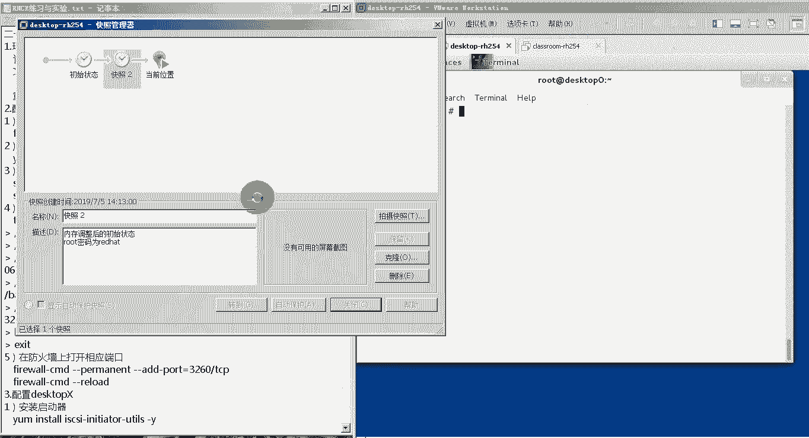

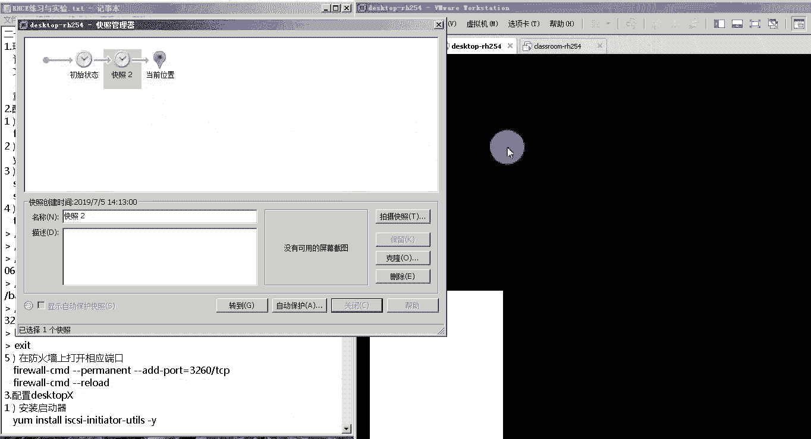

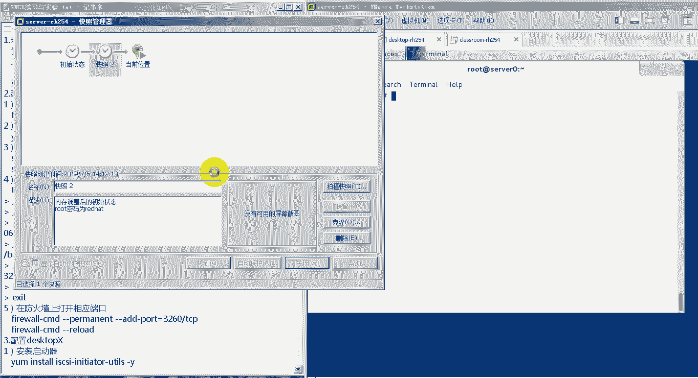

然后再开启这个速度，可能稍微有点慢了，好了啊，我们的这个环境已经重置好了，重置好了之后，我们来看一下我们这个实验诶，这个server 0还没好，这server 0，啊终于好了好了。

我们最后这个实验用的还是server 0和dex top 0啊，这两台机器server 0和dex sop 0，让我们在实验之前，首先把这两台机器给重置，我们已经重置好了，重置好了之后。

我们先来配置我们这个s卡c的，他改的短啊，就是我们这个server 0，那我还是使用我们的这个root用户登录，诶卡了，这个desktop 0是没有问题的，server 0卡只能再重置一下。

开的虚拟机太多，每一个虚拟机是四个g啊，那我总共这三台虚拟机就占了12个g啊，所以说有些卡，而且这个虚拟机开启关闭这个速度有点慢，好我们再来试一下，诶，这下好了啊，我们使用root账户登录。

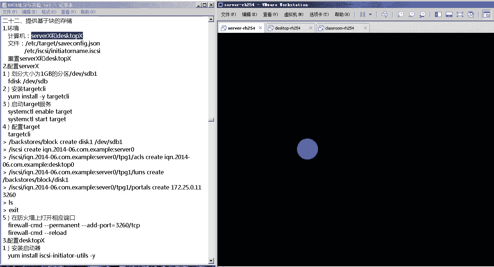

然后这次我们的这个cos服务器端的这个l u n，我们不再用这个lv来做映射了啊，我们直接用一个分区，所以说我们右键桌面。

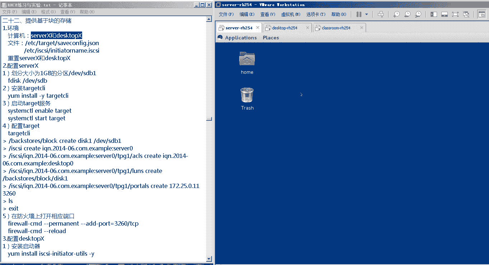

然后打开一个终端，之后我们ios spare key来查看一下，我这个可用的磁盘，可以看到除了sd以外，还有一个sdb，那么本次实验我们就用这个sdb啊，划分一个大小为一个g的分区，s d b一啊。

那就是f d k d威胁的sdb，然后我们还是采用gbt分区啊，所以我们不用dos分区，啊这已经用dos分区了是吧，我q退出，g g b t分区n创建一个新的分区啊，分区编号采用默认的一起指山区。

直接回车中指山区我们加一gb加1g之后，w写入之后l o s p l k诶，可以看到这有一个大小为1g的，这么一个s b啊，大小为g的这么一个s d b，然后我们就有了这个分区了，有了这个分区之后。

我们来安装cos服务器端的软件啊，那就y u m install叫做杠y target c l i，ok completely啊，已经安装成功了，安装成功了之后，我们还是将这个服务设置成开机自启。

注意这个虽然每个实验都会做，但是这个是这个实际上还是特别重要的，这个大家伙一定得注意啊，因为我们在考试的时候，他要求所有的服务都是可以开机自启的，然后我们target cy来进行配置。

我们之前给大家在配置那个cos服务器端的时候，我们是cd到指定的目录下，然后再在目录下运行文件，实际上还有另外一种方式，另外一种方式就是，你可以直接在前边把这个目录名写上啊，在后边直接写。

你需要运行的文件啊，这样的话就不需要我们cd了，d v写的s d p，这条命令就是相当于我们cd的这个根下的，bstories下的block这个目录下，然后create disc 0 disc 1。

然后使用的是dv下的sd b一啊，回正诶，它提示已经创建好了啊，也创建好了，你的这个存储对象disc一已经创建，然后我们再来创建我们的这个icron，那就是根下的sci，我是在这个模型创建的。

q create iq n。2014杠06。com。x example，冒号还是叫server 0诶，它提示已经创建好了，并且在你的这个创建好eq下边有一个tp集啊，tp集的这么一个目录。

然后我们再创建我们的这个iq n的q啊，是用来进行验证的啊，就是在gc这个目录下有一个我们刚才创建的icon，在这个icon下有一个tp g一这么一个目录，下面有一个a c l s。

然后我们再create accurate，点2014杠06。com。x example，冒号desk top 0，诶，这就创建好了啊，创建好了，创建好了之后，我们来把我们的这个l u n创建出来。

那就是爱sci下的我们的icon，in下的tpg一下的l u n s加r create创建，然后根据我们这个根下的bstories的blog，写的第四个一啊，把它创建成我们的这个l u n诶。

可以看到我们这个l u n0 就创建出来了，并且它已经映射到我们刚才那个desktop 0上了，然后我们再来创建我们的这个监听的端口，监听的端口，那就是coc i curren，下载tp g1 。

下载photos这个目录啊，然后create 172。二五点点一，然后使用的端口tcp的3260，然后整个全部都创建成功了，我们可以ios看一下啊，lc看一下。

在这个backstories的这个blog下边，可以看到我们最开始创建的这个dex d4 k1 ，r d c这个dk一实际上用的是dv下的sdb 1，大小为一个记忆创建的。

然后在我们这个ice coc这个目录下，可以看到你创建的这个艾伦，在这个icon in下的au啊，a c l s下边可以看见我们验证用的这个icon啊，注意这俩不是一个一个是包含了你的l u n的。

一个是你验证用来春，然后在这个验证用的iphone下边，你这会有一个已经把它映射到l u n0 了，这个l u n0 实际上就是我们上面这个disc 1，这个可以在我们这个l u n s。

这个目录可以看到啊，l u v0 实际上用的是block里边的disc 1，然后block里dc一实际上用的是tv的s d v一啊，就这么一个关系，然后在photos这块，我们指定了。

我们监听的是172。二五点点一上的tcp，3200灯好了，配置没有问题，e s i d退出就可以了，退出之后一定得注意啊，我们的这个s ky的服务器端，它是通过tcp的3260号端口对外提供服务的。

所以首先我们需要开放这个端口，那就是firewall cmd，杠杠permanent，杠杠add port等于3260tcp，诶已经添加成功，添加成功了之后，注意杠杠reload来重新加载。

让我们刚才的配置成交好，生效完成之后，我们这个服务器端就已经配置完成了啊，服务器端配，那接下来我们来配置一下这个客户端。

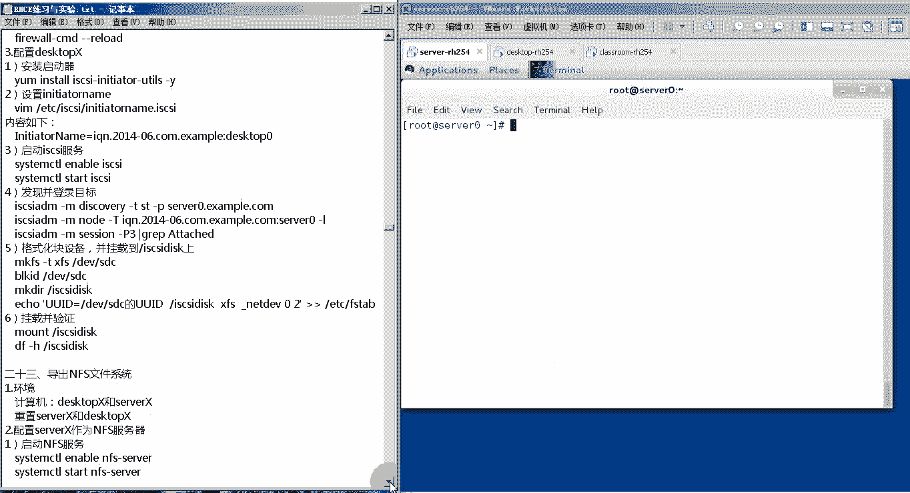

客户端我用的是这个desktop 0，那首先我们先登录一下，诶我这个用户名写错了。

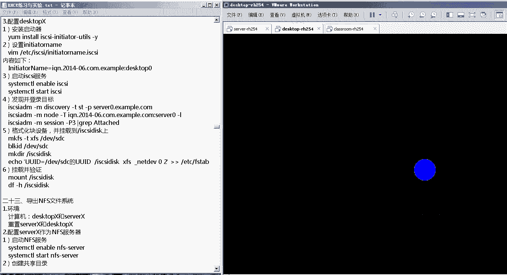

好了已经登录进来了，登录进来了，首先我们打开一个终端，先来安装我们这个s garc的客户端软件啊，先来安装这个s gc的客户端软件，y u m in store啊，egi gi尼，twitter。

名字不太好打u t i r s guy，诶跟刚才的结果一样啊，其实你说这个软件已经安装了啊，已经安装了，f同学可能会有疑问，说考试的时候也会这样吗，建议大家伙考试的时候，你还是先把它装一遍啊。

如果他已经安装了，那当然是最好的，如果他没有安装的话，那我们就会把这个软件给安装下来，安装下来之后还是编辑它的配置文件啊，这个跟上面的这个实验，实际上没有什么太大的区别，因为tator name。

sci，然后在这里边有个integer de，是我们用来进行验证的啊，就是服务器端验证客户端的身份，在这里边需要把我们验证用的这个agram写上来，就是2014杠06。com。x3 炮冒号。

下载dex啊，top 6啊，之后wq保存退出，然后把我们的这个客户端的服务设置成，开机自启，就是system c t l in a bs coc，然后再启动它。

就sm c t l start escussion，好启动起来了之后，我们就可以来发现我们的这个s s r c目标了，那就是s car c a d m杠m discover，杠t s t啊。

我们直接这次不再写ip地址了，写的是他的这个f q0 ，注意其实这是有前提的，前提就是你的ip q n得能够这个解析才行啊，那我们可以先解析一下，看能不能解析n s two cup。

这个命令是用来解析f0 的server 0点x3 炮点cp，可以看到他把你解析成了，172。二五点点一，实际上就是我们的这个server 0这台机器啊，172。二五点点一哦，刚才那个命令敲错了。

scc a d m杠m d4 ，cover gt s t啊，server 0点x3 炮，我靠，please，诶我这个又敲错了啊，后面加了一少，加了一个参数gp，诶可以看到啊，我的这个server 0。

这台机器上已经有一个导出的rm叫iq n d，2014杠06。com。example ml server 0 ml server 0，好了，那么接下来我们来登录一下。

那就是ice coc a d gm node node模式，杠大t后面加上你的爱gri q n d，2014杠06。com，点x example。

点com冒号server 0杠l gl就是login的意思，就是登录的意思，呃其实我没有发现啊，这个是我刚才看了一下，我哪里写错了啊，gt accurate，2014杠06。com。example啊。

这是多了一个点com，诶它显示已经successful登录成功了，登录成功了之后，我就可以ob可以查看一下本集了，可以看到本机多出了一块s d c的，这么一块磁盘，大小是一个g啊，大小是一个g。

那这个s d c是块磁盘，实际上就可以把它当做一个什么东西呢，当做一个本地的磁盘来使用，把它们就来先对它进行格式化啊，make fs杠t x f s d威胁的s d c啊，只是把它格式化成x f s诶。

格式化已经成功了，格式化成功了之后啊，我们b l k i d d威胁的s d c，这个主要是来查看你的这个dv s d c，这个设备的u u i d，b r k i d就是block d的意思。

在这里边可以看到他的ui d号，这个ui d叫做全局唯一标识符，系统里边每一个硬件设备，不管你是实体的还是虚拟的，都会有一个相对应的u i d，好了，这个有了他的ui d，我们是为了干嘛呢。

是为了把它实现开机动挂载，那我就make a dr，先创建一个本机的挂载点，就叫s gc disk，更新了s coc disc，然后我们i o u u i d。

等于等于后边写上你刚才查出来的这个ui d啊，右键py在这儿再pass粘贴啊粘贴，然后这是第一列，第二列要写你的这个挂载点gc迪斯科啊，更新了s x第三个挂载的文件系统类型x f s，第四个挂载的选项。

注意这会儿一定要加上杠night，第一位啊，gnetv gnetv什么意思呢，就是当我的这个客户端，它的网络启动之后才会挂载这个文件系统啊，因为你如果网络没启动的话，它是连接不到s gc的服务器端的。

连接不到cc的服务器端，实际上啊实际上你是没有本地的这块磁盘的，那没有这块磁盘，它是挂载不上去的，挂载不上去，你的系统就会进入这个救援模式啊，emerges model，所以说我们在这一定要加这个。

然后是否进行文件系统大模不做，是否进行fs check呢，做做的话，如果你是根分区要写一，如果不做的话是零，如果是非根分区要写二，所以这波不写二，然后把这一条追加到etc下的f s t b文件里面。

之后开了一下etc的fs 1，可以看到我们最后一条这个内容就已经追加上，还有上好了，追加上了之后，我们来看一下，看能否挂载啊，那就m其实你可以直接忘的杠a啊，直接忘的背。

当然你也可以指定它的挂载点s gc disco，诶，之后你在mount grab抓一下你的这个gc disc，可以看到dvt的s d c，已经成功的挂载到了gc disk，然后我们的这个实验就完成了。

这个实验就完成了，好了，到最后我们再间断的通过一个啊图示，来给大家看一下我们的这个实验，它的一个简单的原理，好我们现在还是有两台机器啊，server 0和dex top，这次我把它画的稍微宽一些吧。

这样的话方便在里面写字啊，左边这个就是我们的server里，右边是我们的desk t，那个草坪，然后在server 0上，首先我们有一块磁盘啊，这个瓷板是dv系的sd b。

我们在这个磁盘里划分了一个分区，是dv下的sd b1 ，这个分区的大小是多少呢，是一个g，之后我们把这块磁盘，我们把这块磁盘映射成了我们这个l u n0 ，映射成了我们这个l u n0 。

我们这个l u n0 它是属于一个icon的，这个icon就是icon in。2014杠零六点，com。x example，冒号serverly，那同时呢我们在这上面还创建了另外一个icon。

叫做iq n。2014杠06。com。x战跑，冒号dex top 0，好的差不多，然后这两个i o n注意它们的功能，上面那个i q是用来登录的，下面这个icon是用来进行验证的啊，下面的icon是经。

然后注意我们这个i sci，他使用的这个端口是tcp的3260，所以在fireword上一定要开放tcp的3260号端口，这个cp的320等好了之后是客户端，客户端首先安装了软件，安装完软件之后。

在我们的这个软件，他的etc下的这个s gc下会有一个音音，twitter，name嗯这么一个文件啊，inteor name这一个文件在这个文件里面，我们需要指定一下我们验证用的这个icon啊。

你说它里边写的实际上是这个内容啊，是验证用的，艾克之后我再登录到，我的这个登录用的icon上啊，注意这里登录使用了这个log，然后登录上去之后，这个效果是什么呢，效果是这样的。

我的这个l u n0 就自动映射为，我的这个desktop 0上的一个磁盘了啊，就是第一位下的s d c，就是dv下的s d c，然后我们把这个dv下的s d c我们给它格式化，格式化之后。

我把它给挂载到了我们的一个目录上，注意这里边有一个过程就是格式化啊，make fs把它格式化成这个x2 fs文件系统，然后挂载到那，挂载到我这个根下有一个s gc a d m啊。

叫做s garc disco这么一个目录上，然后并且把这个挂载的信息写入到了这个etc，写的f s t b啊，实现开机自动挂载啊，这就是我们这个sgc这个实验的一个，过程和原理，过程和原理。

然后这个实验跟我们今天的第一个实验，就是配置sm tp服务器的空后端，这两个实验是特别重要的，就是每次考试的时候，基本上都会考的，所以说大家伙在课下的时候，可以对照着咱们今天的这个视频。

把这两个实验他的这个原理搞清楚，然后把他的这个实验的步骤，一步一步的把它做的精细一些啊，然后多做几遍，把这个实验做的特别纯熟啊，做的做别。

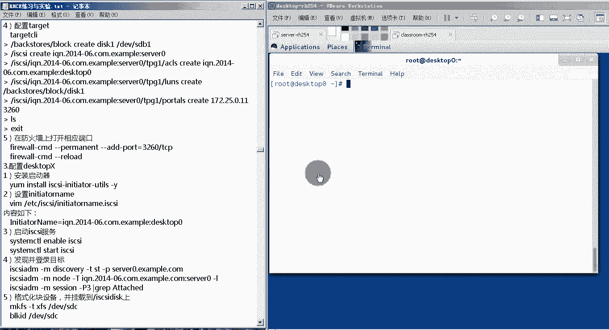

好了，那以上就是我们今天的内容啊，然后稍后的话，这个我会把我们的这个今天讲的这些内容，它的相关文档还是上传到我们这个群里，大伙可以在群里面接受这些文档，然后对照这些文档，把我们这个实验仔细去做一做啊。

仔细去做一做，然后另外大家伙。

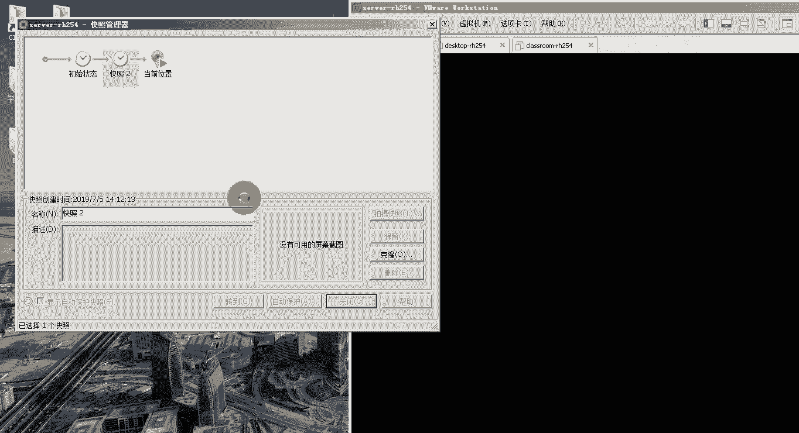

这个还可以对照这些文档来进行一些排除，当然有一些这个错误，假如说大家伙这个经过自己的重重努力啊，没有排查出来的话，你可以把它发到群里了。

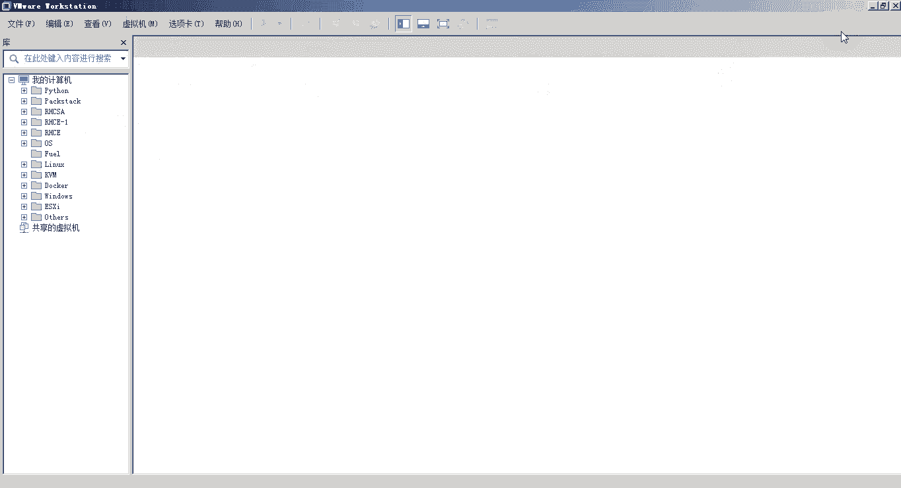

然后老师和同学们，我们一块儿来把这个问题给解决啊，因为现在发现很多同学没有问题，这个也不知道同学们是真没有问题啊，还是说这个压根没有时间，很多同学就是很长时间没有听课，然后也没有时间去看这个直播。

没有做这个实验，没有发现问题啊，所以说这个大伙还是要多挤出时间，把这些时间做一做啊，我这实验做的越来越纯熟的话啊，那我们后期这个rc一的考试，也就会越来越简单好了，那我们今天的内容就先到这儿了啊。

啊那个各位好好休息啊。