# 红帽RHCE认证考试视频：P5：RHCE-5

在本节课中，我们将要学习两个在RHCE考试中非常重要的实验：配置SMTP空客户端和配置iSCSI存储服务。这两个实验都是高频考点，需要大家熟练掌握其原理和配置步骤。

## 邮件服务基础与SMTP空客户端配置

上一节我们介绍了课程的整体安排，本节中我们来看看邮件服务的基础知识和如何配置SMTP空客户端。

### 邮件相关协议

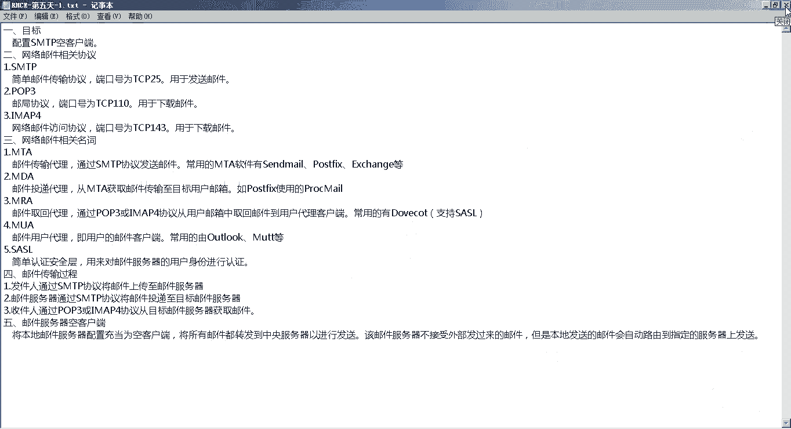

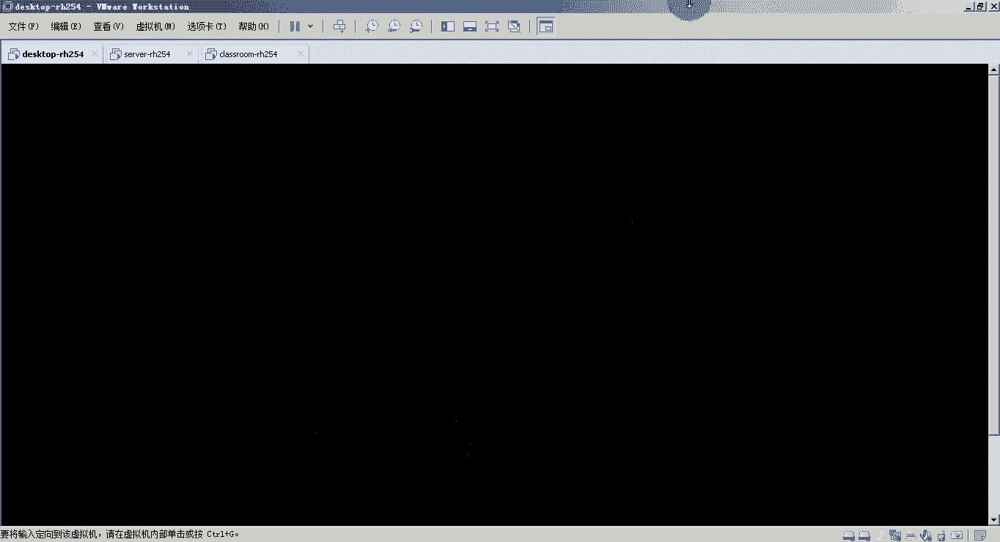

网络邮件传输依赖于几个核心协议，以下是这些协议及其功能的介绍：

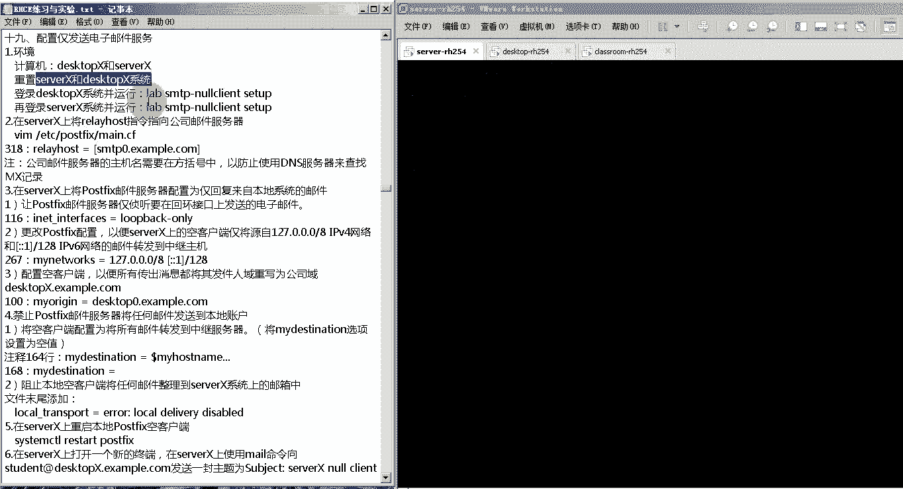

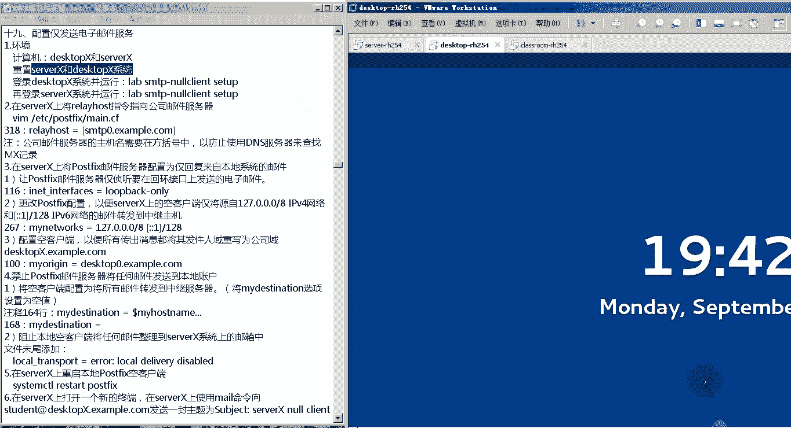

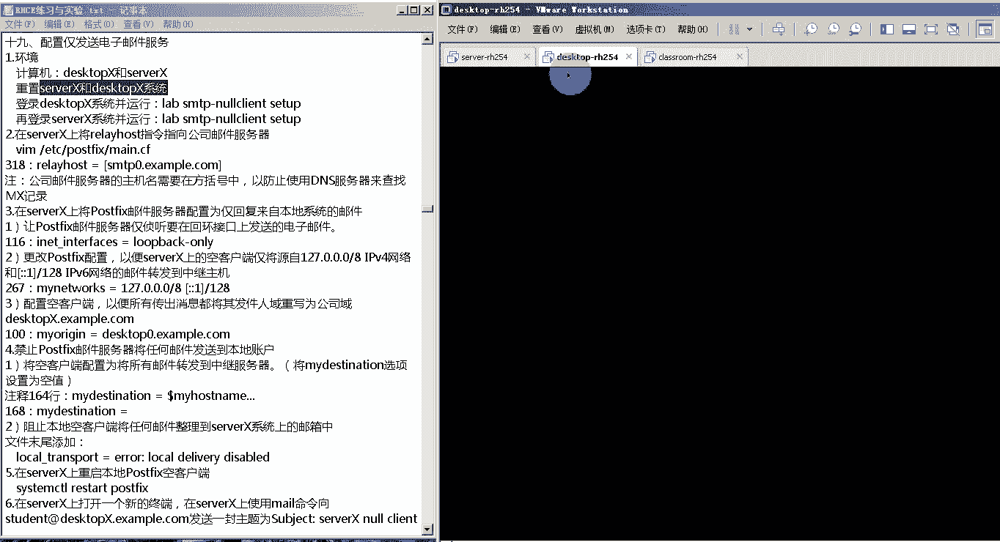

*   **SMTP**：全称 **Simple Mail Transfer Protocol**，即简单邮件传输协议。其端口号为 **TCP 25**，主要用于**发送**邮件。
*   **POP3**：全称 Post Office Protocol version 3，即邮局协议版本3。其端口号为 **TCP 110**，主要用于**下载**邮件到本地客户端。
*   **IMAP4**：全称 **Internet Message Access Protocol version 4**，即互联网消息访问协议版本4。其端口号为 **TCP 143**，同样用于**下载**邮件，但比POP3功能更丰富，支持在服务器上管理邮件。

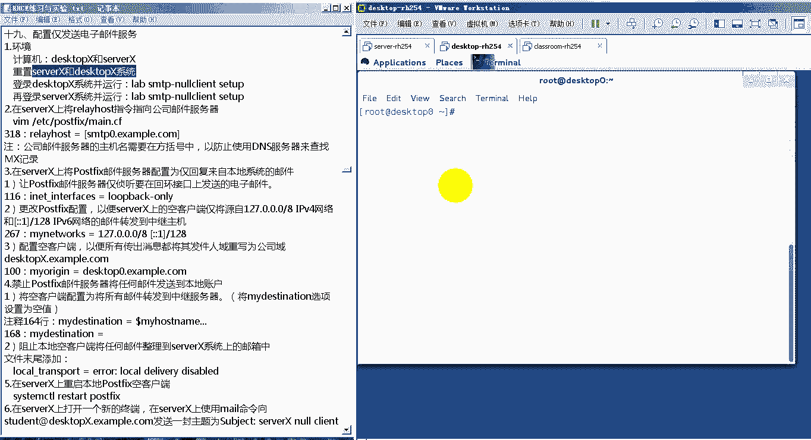

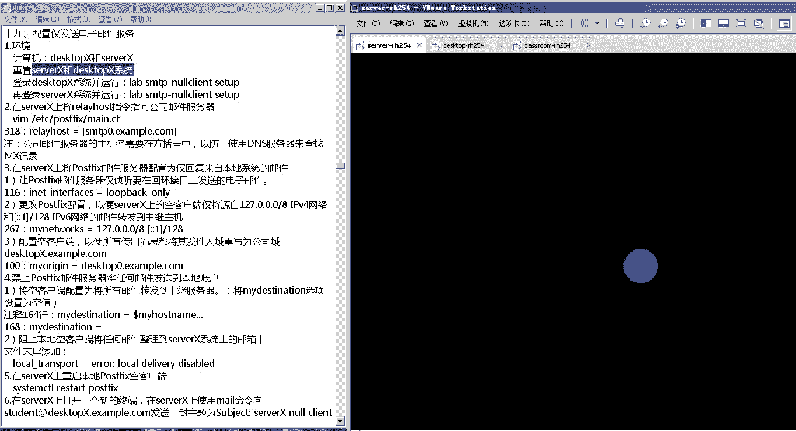

### 邮件工作原理

邮件系统采用客户端/服务器架构。其工作流程可以概括为：
1.  用户在邮件客户端编辑邮件并发送，邮件通过 **SMTP** 协议传输到发件人的邮件服务器。
2.  发件人邮件服务器检查收件人地址。如果收件人属于同一台服务器，则直接投递到其邮箱；如果属于另一台服务器，则通过 **SMTP** 协议将邮件转发到收件人的邮件服务器。
3.  收件人通过邮件客户端，使用 **POP3** 或 **IMAP4** 协议从自己的邮件服务器下载邮件。

### 邮件系统相关名词

以下是邮件系统中常见的组件和概念：

*   **MTA**：邮件传输代理，负责通过SMTP协议发送邮件。常见软件有 `sendmail`、`postfix`。
*   **MDA**：邮件投递代理，负责从MTA获取邮件并投递到用户的本地邮箱。
*   **MRA**：邮件取回代理，负责通过POP3或IMAP4协议从邮箱取回邮件到客户端。
*   **MUA**：邮件用户代理，即用户使用的邮件客户端软件，如Outlook、`mutt`。
*   **SASL**：简单认证安全层协议，用于对邮件服务器的用户身份进行认证。

### 什么是SMTP空客户端

SMTP空客户端是一种特殊的邮件服务器配置。其核心特点是：
1.  不接收来自其他邮件服务器的邮件。
2.  将所有本地发出的邮件都**转发**到另一台指定的邮件服务器上进行投递。

可以将其理解为一台“只发不收”、且邮件全部委托另一台服务器处理的邮件客户端。

### 实验：配置SMTP空客户端

本实验的目标是将 `server0` 配置为SMTP空客户端，使其所有外发邮件都通过 `desktop0` 转发。

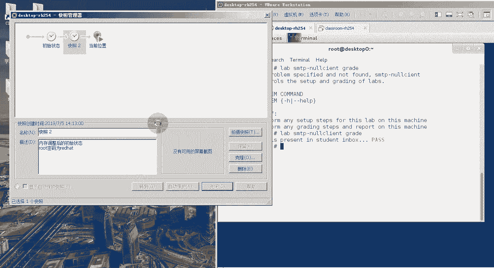

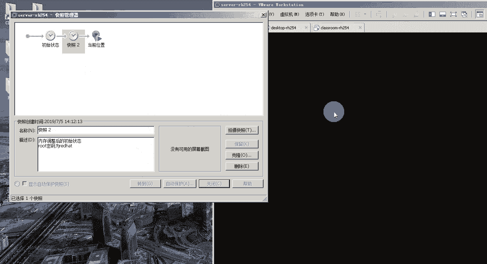

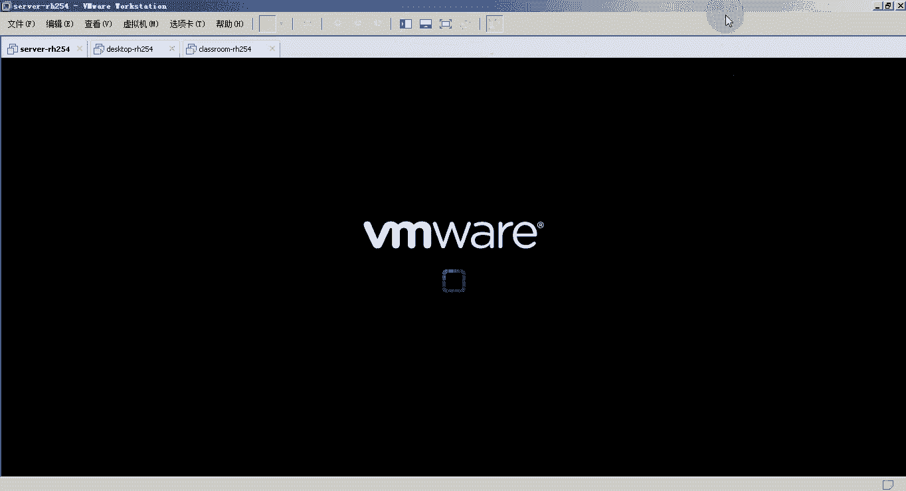

**实验环境**：
*   服务器：`desktop0` (已预配置为邮件服务器)
*   空客户端：`server0`

**配置步骤**：

1.  **修改Postfix主配置文件**：
    编辑 `/etc/postfix/main.cf` 文件，进行以下关键修改：
    ```bash
    # 第318行附近：指定中继邮件服务器
    relayhost = [smtp0.example.com]
    # 第116行：仅监听本地回环地址
    inet_interfaces = loopback-only
    # 第267行：仅允许本地网络（回环地址）使用邮件服务
    mynetworks = 127.0.0.0/8 ::1/128
    # 第100行：修改邮件域，使发出邮件的发件人地址显示为 desktop0
    myorigin = desktop0.example.com
    # 第164行：禁止向本机投递邮件
    mydestination =
    # 文件末尾：添加本地投递禁用错误提示
    local_transport = error: local delivery disabled
    ```

2.  **重启Postfix服务**：
    配置修改后，需要重启服务使更改生效。
    ```bash
    systemctl restart postfix
    ```

3.  **测试空客户端**：
    在 `server0` 上使用 `mail` 命令发送一封测试邮件。
    ```bash
    mail -s “server0 null client” student@desktop0.example.com
    ```
    输入邮件正文后，按 `.` 再回车发送。

4.  **验证邮件投递**：
    在 `server0` 上使用 `mutt` 客户端连接 `desktop0` 的IMAP服务，查看 `student` 用户是否收到邮件。
    ```bash
    mutt -f imaps://imap0.example.com
    ```
    使用 `student` 用户登录（密码同为 `student`），检查收件箱。

**实验原理总结**：
配置完成后，`server0` 上发出的邮件（发件人显示为 `root@desktop0.example.com`）会被自动转发到 `desktop0` 邮件服务器，并由 `desktop0` 最终投递给本地用户 `student`。`server0` 本身不处理任何接收邮件的请求。

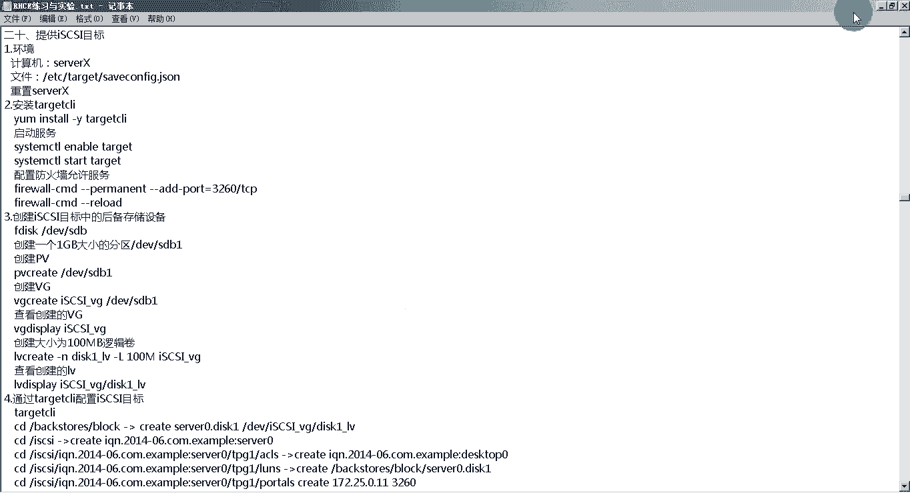

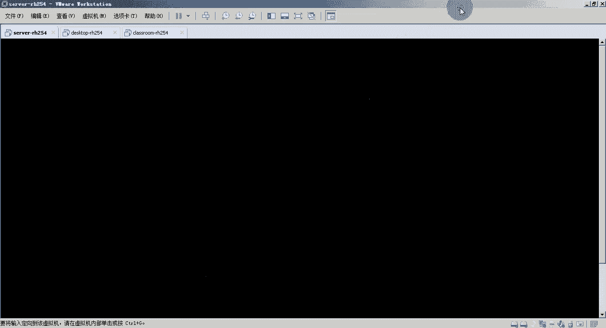

---

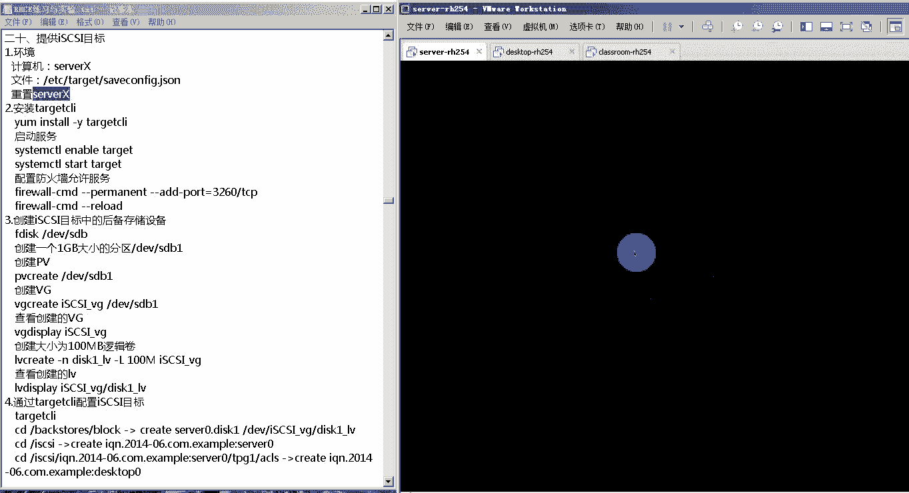

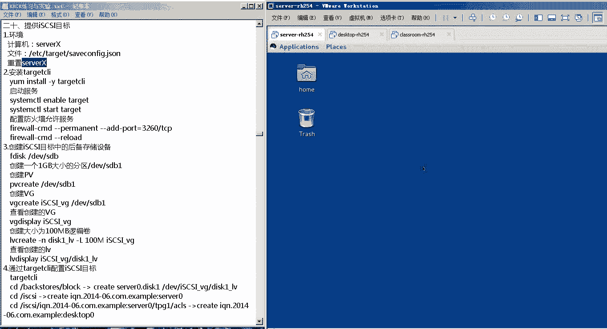

## iSCSI存储服务配置

上一节我们完成了邮件空客户端的配置，本节中我们来看看另一个重要的存储服务——iSCSI。

### 存储相关术语

在开始iSCSI配置前，需要了解一些存储领域的基础概念：

*   **SCSI**：小型计算机系统接口，是服务器与硬盘间传输数据的标准协议。
*   **iSCSI**：**Internet SCSI**，允许通过TCP/IP网络传输SCSI指令，从而实现远程存储访问。
*   **FC**：光纤通道，一种高速但成本较高的存储网络技术。
*   **DAS**：直连式存储，存储设备直接连接到服务器。
*   **NAS**：网络附加存储，通过网络（如NFS， FTP）提供文件级存储服务。
*   **SAN**：存储区域网络，专用于块级存储数据传输的高速网络（常基于FC或iSCSI）。

### iSCSI工作原理

iSCSI采用客户端-服务器架构：
*   **服务端**：称为 **iSCSI Target**，提供存储空间。
*   **客户端**：称为 **iSCSI Initiator**，发起连接以使用远程存储。

工作流程如下：
1.  在Target上创建存储对象（如磁盘镜像、分区、逻辑卷等），并将其映射为逻辑单元号 **LUN**。
2.  为这些LUN创建一个唯一的标识 **IQN**，并设置访问控制。
3.  Initiator客户端发现Target服务器上的IQN，并通过身份验证登录。
4.  登录成功后，Target上的LUN会以本地磁盘的形式（如 `/dev/sdb`， `/dev/sdc`）出现在Initiator客户端上，可供格式化、挂载和使用。

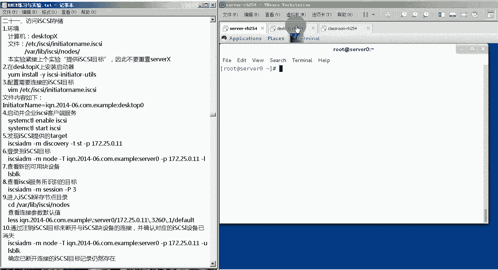

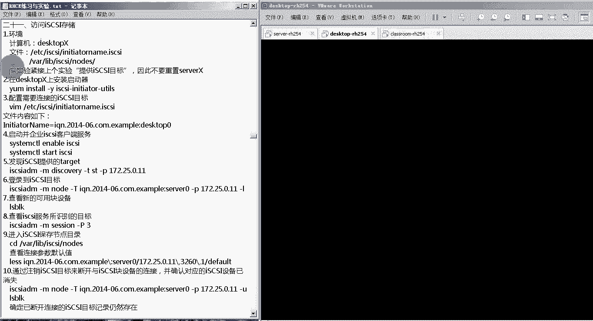

### 实验1：提供iSCSI Target（服务器端配置）

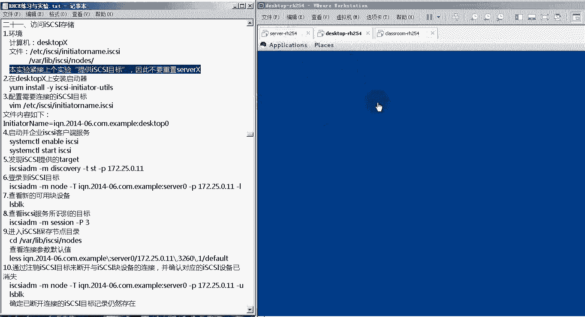

本实验在 `server0` 上配置iSCSI Target，提供一个LUN。

**配置步骤**：

1.  **安装软件并启动服务**：
    ```bash
    yum install -y targetcli
    systemctl enable target
    systemctl start target
    ```

2.  **配置防火墙**：
    iSCSI使用TCP 3260端口。
    ```bash
    firewall-cmd --permanent --add-port=3260/tcp
    firewall-cmd --reload
    ```

3.  **准备存储后端**：
    使用LVM创建一个逻辑卷作为存储后端。
    ```bash
    # 在 /dev/sdb 上创建分区
    fdisk /dev/sdb # 创建新分区 /dev/sdb1
    # 创建物理卷、卷组和逻辑卷
    pvcreate /dev/sdb1
    vgcreate iscsi_vg /dev/sdb1
    lvcreate -n disk1 -L 100M iscsi_vg
    ```

4.  **使用targetcli配置iSCSI Target**：
    运行 `targetcli` 进入交互式配置界面。
    ```bash
    targetcli
    ```
    在 `targetcli` 提示符下依次执行：
    ```bash
    # 1. 创建存储后端对象
    cd /backstores/block
    create server0.disk1 /dev/iscsi_vg/disk1
    # 2. 创建Target IQN (用于包含LUN)
    cd /iscsi
    create iqn.2014-06.com.example:server0
    # 3. 创建ACL（用于客户端认证）
    cd iqn.2014-06.com.example:server0/tpg1/acls
    create iqn.2014-06.com.example:desktop0
    # 4. 创建LUN并映射到存储对象
    cd ../luns
    create /backstores/block/server0.disk1
    # 5. 设置监听地址和端口
    cd ../portals
    create 172.25.0.11 3260
    # 6. 退出并保存
    exit
    ```

### 实验2：配置iSCSI Initiator（客户端连接）

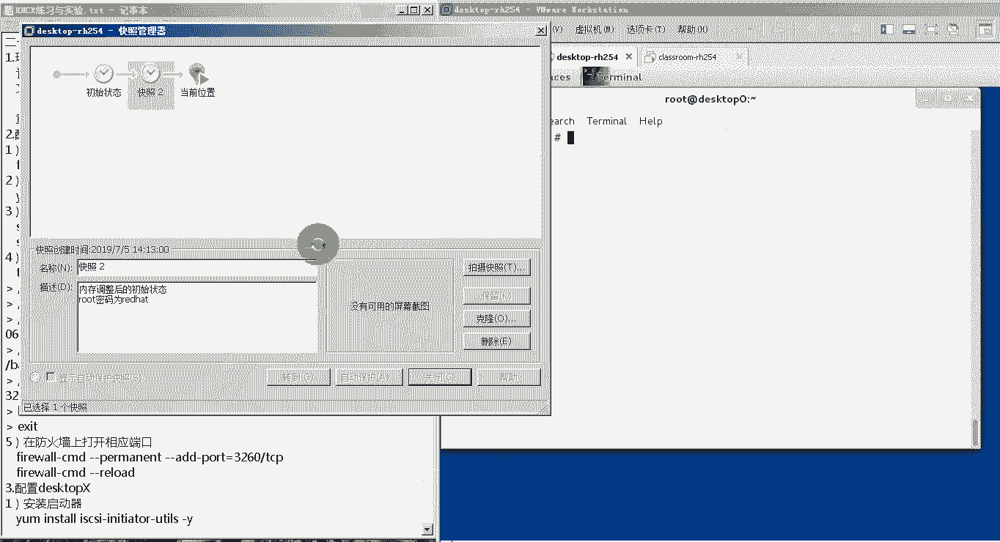

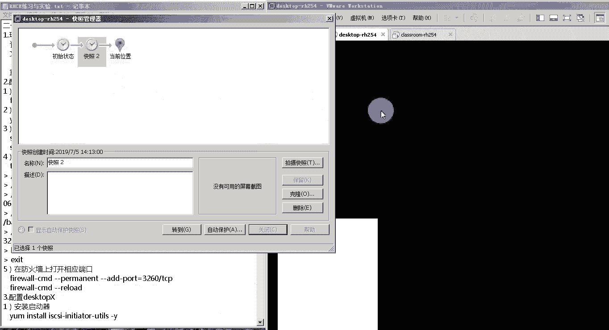

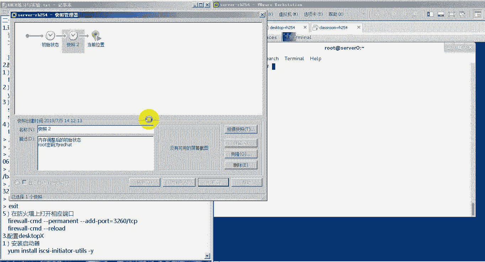

本实验在 `desktop0` 上配置iSCSI Initiator，连接并使用 `server0` 提供的存储。

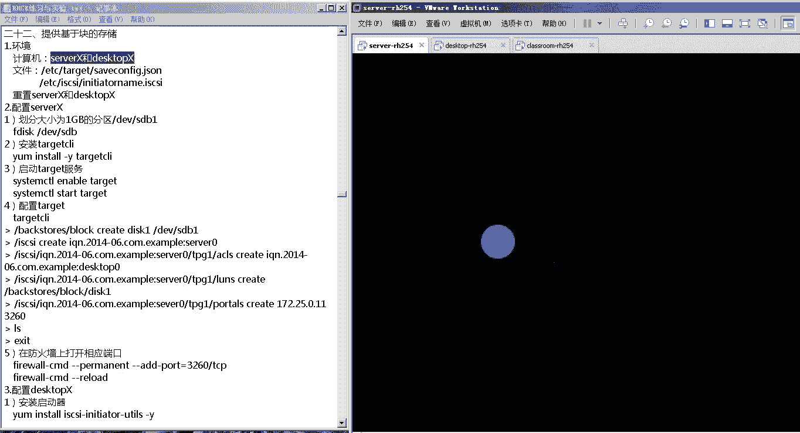

**配置步骤**：

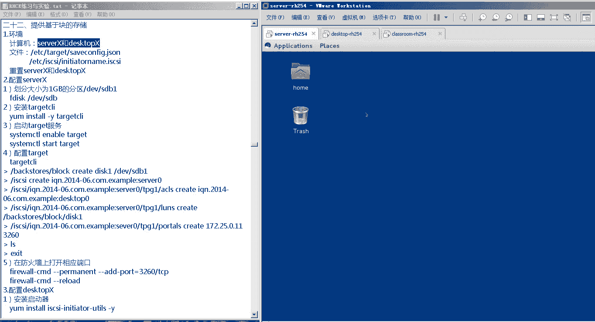

1.  **安装客户端软件**：
    ```bash
    yum install -y iscsi-initiator-utils
    ```

2.  **配置Initiator名称**：
    编辑 `/etc/iscsi/initiatorname.iscsi`，将名称设置为Target端ACL允许的IQN。
    ```bash
    InitiatorName=iqn.2014-06.com.example:desktop0
    ```

3.  **启动服务并发现Target**：
    ```bash
    systemctl enable iscsid
    systemctl start iscsid
    iscsiadm -m discovery -t st -p 172.25.0.11
    ```

4.  **登录Target**：
    ```bash
    iscsiadm -m node -T iqn.2014-06.com.example:server0 -p 172.25.0.11 -l
    ```

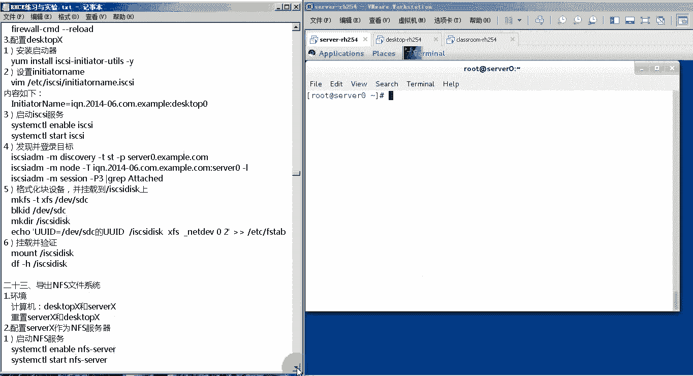

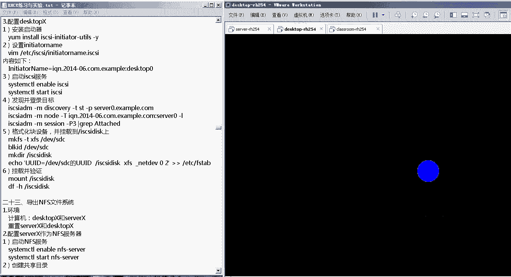

5.  **验证和使用磁盘**：
    登录成功后，使用 `lsblk` 命令会看到一个新的磁盘（如 `/dev/sdc`）。可以像使用本地磁盘一样对其进行分区、格式化和挂载。
    ```bash
    lsblk # 查看新磁盘，例如 /dev/sdc
    mkfs.xfs /dev/sdc # 格式化
    mkdir /mnt/iscsi
    mount /dev/sdc /mnt/iscsi # 挂载
    ```

### 实验3：使用分区作为iSCSI后端并实现开机自动挂载

此实验与实验1、2类似，区别在于使用磁盘分区直接作为存储后端，并在客户端实现开机自动挂载。

**服务器端关键步骤**：
*   使用 `fdisk` 创建分区（如 `/dev/sdb1`）。
*   在 `targetcli` 中，创建后端对象时直接指向该分区：
    ```bash
    cd /backstores/block
    create disk1 /dev/sdb1
    ```
    后续创建IQN、ACL、LUN和Portal的步骤与实验1相同。

**客户端实现开机挂载**：
1.  登录Target并发现新磁盘（如 `/dev/sdc`）。
2.  格式化磁盘并创建挂载点。
3.  获取磁盘的UUID：`blkid /dev/sdc`
4.  编辑 `/etc/fstab` 文件，添加挂载信息，并**必须使用 `_netdev` 挂载选项**，确保在网络就绪后再挂载iSCSI磁盘。
    ```bash
    UUID=你的磁盘UUID /mnt/iscsi xfs defaults,_netdev 0 0
    ```
5.  测试挂载：`mount -a`

**iSCSI配置原理总结**：
通过在Target端将物理存储资源映射为LUN并设置访问权限，Initiator端在登录后即可将这些LUN识别为本地磁盘。整个过程中，IQN用于唯一标识Target和进行访问控制，网络传输则基于TCP/IP协议。

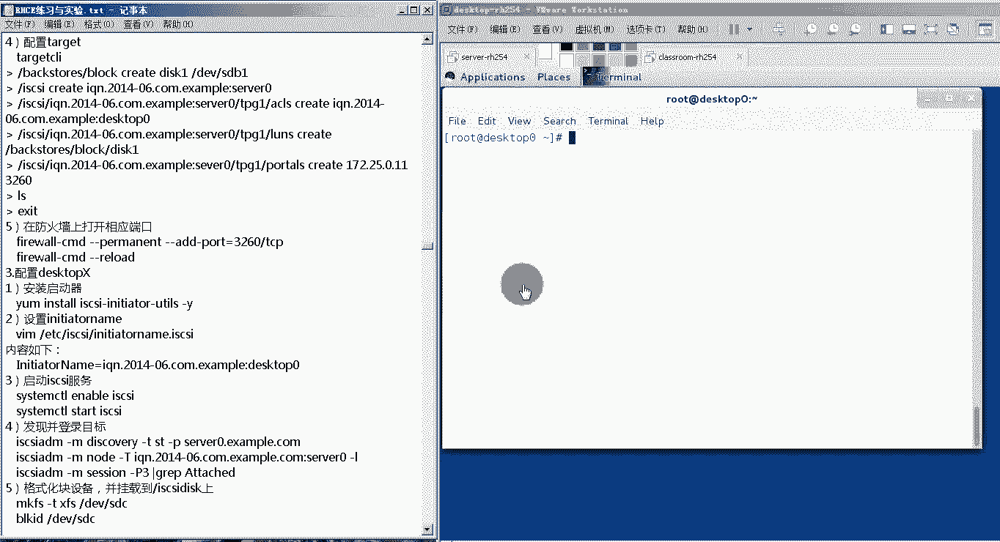

---

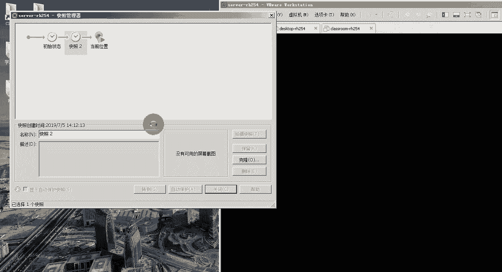

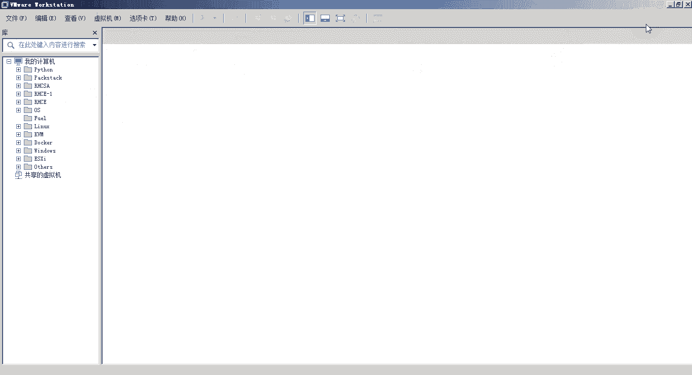

本节课中我们一起学习了两个RHCE考试的核心实验：SMTP空客户端和iSCSI存储服务。这两个实验都要求深刻理解其服务架构和工作原理，并熟练掌握具体的配置命令和步骤。请大家务必在课下反复练习，做到步骤清晰、操作熟练，为通过考试打下坚实基础。