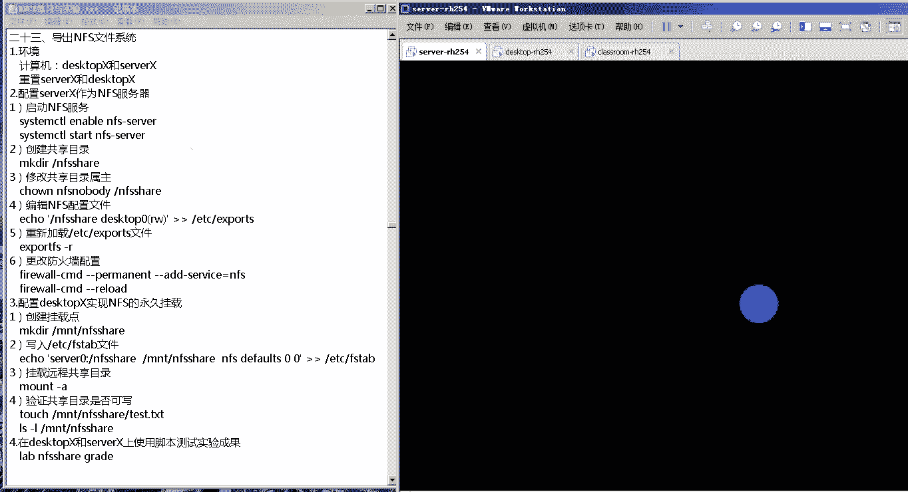
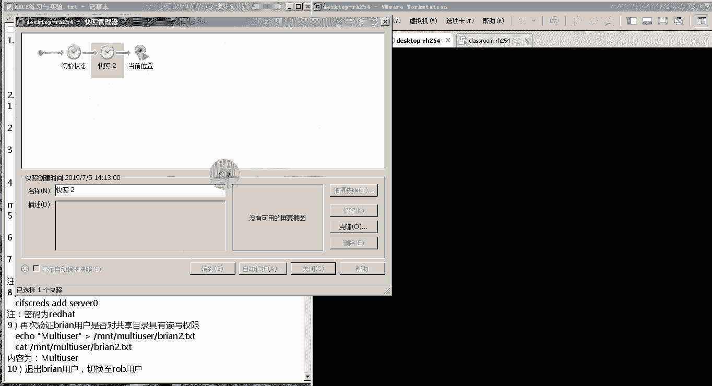

# 红帽RHCE认证考试视频 - P6：RHCE-6 - 我是冷空气 - BV1th4y1X7cC

能听见我说话的话，可以扣个一看一下，好的，那接下来就开始我们今天的课程了啊，今天是我们课程的第六天了啊，已经是第六天了，那接下来我们来看一下我们第六天的第一部分，那就是nfs nfs。

然后我们这个nfs这个部分主要分成呃，两个实验啊，第一个就是配置这个nfs共享目录，让我们的客户端可以远程挂载nfs共享目录，第二个就是通过我们这个kbs，对我们的这个nfs进行认证。

来实现一个安全的nfs，重点就是在于我们第二个实验，就是通过这个corpse来对我们nfs进行认证啊，这个考试的时候会考好了，那首先我们先来看一下什么叫做nfs，nfs，它是三个英文单词的首字母的组合。

叫做network fail sm，中文名字叫做网络文件系统啊，网络文件系统这个nfs的主要功能是什么呢，就是可以通过网络让不同的机器，不同的操作系统可以共享彼此的文件。

实际上它实现的一个功能就是目录共享，这个nfs服务器啊，可以将自己本机上的一个目录给他共享出来，共享出来之后通过nfs客户端，把这个目录挂载到客户端的本地文件系统中，然后在这个本地客户端上来看。

这个远程主机的目录，就像自己的一个磁盘分区一样啊，这个就是nfs啊，如果是画图的话，它就是这样的，我们现在有两台服务器啊，一台是nfs服务器，一台是nfs客户端。

nfs客户端左边这台是nfs server，右边这台是nfs的client，好n s client，然后nfs它的效果是什么，是这样的啊，假如你在nfs这个server端啊，有一个目录啊。

有一个目录你可以把这个目录给它共享出去，变成一个共享目录，啊把它变成一个共享目录，然后我们可以在我们的客户端，创建一个挂载点啊，挂载点创建完挂载点之后，可以通过这个挂载的命令。

把远程服务器上的这个目录啊，把你的远程服务器上的这个目录，挂载到我的nfs客户端，这样的话我的这个nfs客户端，这个挂载点里面存入了哪些文件，在我的远程服务器上都会有，那我远程服务器上的这些文件。

在我的nfs客户端的挂载点里边也都能看到啊，这样的话就实现了一个目录的共享啊，也就间接的实现了一个这个文件的传输和共享，这个就是nfs的这么一个服务，好，那接下来我们来看一下，这个nfs配置文件的解析。

首先第一个我们得知道这个nfs，它的配置文件在哪啊，在nfs的服务器端的配置文件是etc下的，exports啊，export这个export就是导出的意思啊，就是导出的意思。

然后这个配置文件里边我们要写什么呢，注意这个配置文件它主要由三部分组成，这三部分别是什么呢，注意这三个部分写的一行啊，第一个部分是目录，就是你需要导出或者共享出去的目录，第二个就是哪些客户端可以挂载啊。

哪些客户端可以挂载，然后后边跟着一个括号，括号里边写的是你的这个客户端挂载时的权限，以及这种安全认证的方式，安全运动方式，那这三个部分有哪些需要注意的呢，我们先看第一部分，第一部分需要注意的是。

必须得是一个目录啊，就是你共享出去的必须得是一个目录啊，共享的目标是一个目录，在这里不能写文件，并且你这个目录必须得存在才行，这是大家需要注意的啊，必须得存在，而且是一个目录，第二个就是客户端啊。

这个客户端是哪些客户端可以挂载在这儿，你可以通过多种方式来指定，你能够挂载的客户端，首先最常用的就是这个星新，代表所有客户端均可以挂载，所有的客户端都去可以挂载，如果你想指定某一台客户端挂载，怎么办呢。

就只有这一台客户端挂载，那你可以在这里边写客户端的ip地址，或者客户端的主机名或iq，那这样的话就可以指定某一台客户端，指定的客户端可以挂载，但注意，如果在这里写这个主机名或者高端的app q的话。

他必须得能被解析才行，然后你还可以让指定网络段的客户端挂载啊，那在这只要写成网络段就行了，当然你也可以让指定域名下边的所有主机，可以挂载在这，我写上域名就行了，第三部分，括号里边的是权限和安全验证方式。

权限这里边其实用的最多的就是两个，一个是r o，r o，代表客户端在挂载远程服务器上的目录的时候，具有只读权限啊，有时候不能往这个挂载点里边，创建文件或者删除文件，然后如果是rw的话。

就代表它具有读写权限，这也是我们用的最多的，如果你要是进行安全认证，也就是通过认证的方式去挂载服务器端啊，去验证服务器端和客户端的身份，那你在这要写这个sc，等于后面指定安全验证方式。

这个sec就是security的意思啊，就是security意思，这个就是nfs，它配置文件里面的内容，这个一会儿我们会通过一个实验，来给大家来演示一下，验证一下，好了，第四部分就是nfx的相关命令啊。

nfx相关命令这里给大家介绍两个，第一个叫做export fs杠r啊，export fs gr这个命令主要是用来干嘛呢，就是当你在服务器端修改完配置文件之后，你可以运行这个命令。

让我们的系统重新读取etc下的exports文件，然后让你的更改生效啊，当然如果你不用这个命令的话，你直接用system c t l restart nfs，这个服务也是可以的啊，也是可以的。

第二个是在我们客户端运行的一个命令，注意上面这个命令是运行的服务器，下面这个命令客户端，然后这个名称叫做show mt杠一，后面加上nfs服务器的ip或者f互联，当然如果跟f q0 的话。

它的f q人必须得能够被解析才行，那这条命令它的功能是什么呢，就是查看我们这个nfs服务器上有哪些目录，已经导出了啊，或者说共享啊，这个就是nfs的相关命令，第五个也是我们这个比较重要的一个。

就是这个curbs kbs，我们说了这个nfs啊，它可以通过kbs来进行认证来实现安全的fs，那我们首先就要沥青两点，第一点就是什么是corpse，第二个就是他的认证流程是什么样的。

那我们先看第一个什么是corpse，这个corpse是一种安全认证系统，它是用于验证客户端和服务器之间的身份的啊，是验证客户端和服务器之间的身份的，叫kbs啊。

这个kbs它是神话里边这个看守地狱的三头恶犬，三头恶犬就是这个单词这个单词，然后我们本次用的这个科bose，用的是这个科b45 科四五，然后第二个我们就要搞清楚这个科普，它的验证流程，这个验证流程。

我们通过一个画图来给大家简单介绍一下，在这个验证验证环境里边有三台机器，第一台是我们的验证服务器或者叫验证中心，这个我们叫k dc啊，kd c验证中心叫做kbs验证中心啊，然后另外两台一台是服务器。

一台是客户端，那在我们现在这个环境里边，你就可以把它认作一台是nfs服务器啊，一台是nfs的客户端啊，这个是服务器server，这个是客户端client，首先如果要想实现你的这个curse认证的话。

那你服务器端和客户端，必须得有自己的这个密钥啊，那服务器端的那个密钥，我们就把它叫做s。k啊，就叫做s。k客户端的这个密钥，我们就把它叫做什么叫做c。k啊，叫做c。k。

注意这个服务器端的密钥和客户端的密钥，都是从哪来的呢，都是从问你的你的这个k dc上面来的啊，它上面既有s。k，又有c。q，好了，那我们这个密钥它主要是用来干嘛的呢，是用来对你这个数据进行加密和解密的。

加密和解密，也就是说它是一种对称式加密方式，什么叫对称式呢，就是你的这个密钥既能对数据加密，又能对数据解密，那我们来看一下这个corpse他认证的这个过程，首先嗯我的客户端想要连接服务器。

那首先得经过corpse认证，所以他向kurpose发送一个请求啊，发送一个请求，发送一个请求，然后我们的这个curb服务器啊，它会在这里边生成两个数据包，然后第一个数据包里边存的是什么呢。

是用这个section，k注意，这个30k是我客户端向服务器发送请求的时，候，这个服务器上创建的啊，用30k然后加密一个信息，这个信息是什么，就是我客户端的相关信息，啊就是我客户端的相关信息。

之后他还会用我们的这个客户端的密钥，来进行加密，加密一个什么东西呢，加密一个我们的这个section k，30高配，注意上面这两个数据包是这样的啊，上面这两个数据包是这样的。

你的这个session key，还有你的这个客户端信息，它还要经过一层加密，这层加密是用什么来进行加密的，注意是用这个s。k来进行加密的啊，是用这个s。k来加加密，所以说你最终获取的就是这么一个东西啊。

你最终获取的就是这么一个东西，诶我看一下啊，这个东西呃，s。k啊，s。k加上你的这个客户端信息啊，这个注意啊，这会儿刚才这块说错了啊，这块并不是，用session k加密的。

这个session k加密的，是我们这个一会儿要进行的内容啊，他这里边是这样的啊，我们重新来一次，首先他用我们这个服务器端的啊，s2 k加密的信息，这个信息里面包含什么呢，包括一个session ke。

一个session key加上什么呢，加上一个我们客户端的信息，client的，信息好可怜的信息，然后注意啊注意这个呃，session key还有client信息，是用这个s。k来进行加密的。

也就是用服务器的密钥进行加密的，然后他用客户端的密钥加密了一个什么呢，加密了一个session ke，加密了一个session ke，也是也就是说你的这个客户端。

它的密钥加密的就是这么一个session k，然后他把这两个数据包，发给我们的这个客户端啊，client那client接收这两个数据包的时候，你注意啊，由于下边这个数据包也就是这个呃，第二个数据包。

它是用你的这个客户端的密钥来进行加密的，那你客户端的密钥还可以对它进行解密啊，解密之后你的客户端就获取到了一个什么呢，获取到了一个session k，就获取了一个c位。

然后客户端就会向你的服务器发送数据包了，注意他向服务器发送哪些数据包呢，它会发送两个数据包，第一个数据包是什么，第二第一个数据包是用session key加密过的，我的客户端信息，啊客户端信息。

这是第一个啊，这是第一个，第二个他会把什么呢，把我们刚才的这个呃认证中心发给他的，这个用服务器端的密钥加密的信息，也会发给我们的服务器啊，因为我们客户端没有服务器上的这个密钥。

它是无法对这个书包进行解密的啊，所以说他把这个信息也会发给我们的服务器，session。k，加上我们的客户端信息，口袋信息，然后这两个数据包就发给服务器了，那么服务器接收到这个数据包的时候，注意啊。

因为服务器现在它没有这个session k啊，没有这个session key，所以他没办法对第一个数据包来进行界面，那怎么办呢，他会这样，你看第二个数据包，第二个数据包。

它是用我们这个服务器端的这个密钥，来进行加密的，所以我们的这个server端，可以使用它的这个server端的s。k，对你的这个数据包来进行一个解密啊，解密那第二个数据包解完密之后。

你就获取到了一个什么东西呢，你就获取到了一个session key，还有什么东西呢，还有就是你客户端的信息，狗男的信息，然后有了这个session k之后呢，他就会拿着你这个session k。

把第一个这个加密的这个包来进行解密，那第一个加密这个包进行解密了之后，获取到的信息是什么呢，就是我们的这个client信息，这个时候注意啊，我们第一个包在解的时候获取的clip信息。

刚才这个用s2 k加密的包在解开之后，除了拿到这个session k以外，是不是也获得了一个这个client信息啊，然后他会把这两个信息进行比对，如果这两个信息一致的话，就说明我们这个client。

是经过我们这个k dc认证的啊，也就是说整个这个数据包在传输，所有的数据包在传输的过程中没有经过篡改啊，这个就是我们的这个kdc的一个认证机制，稍微有点绕，稍微有点绕，然后大家伙课下的时候。

可以对照这个视频再仔细看一下，然后这个还说明了一个什么问题呢，就说明我们如果要是想实现这种安全的，n f s的话，那么首先我们需要从我们这个验证中心去下载，这两个密钥，就是服务器端与服务器端的密钥。

客户端有客户端的密钥，这个一会儿在我们在做实验的时候，是有所体现的，所以大家会在下载的时候一定得注意啊，你知道我们下载的这样密码是用来干嘛的，然后有同学可能会有疑问啊，就说诶那我们在做这个实验的时候。

这个1k d c这也是我们需要搭建的吗，注意啊，在咱们这个课程里面不涉及到他的搭建啊，这个一般情况下在考试的时候，也是就是你的这个kd c它已经帮你打好了，你只要这个下载的时候。

从这个ktc指定的目录下去，下载你的这个密钥来进行验证就可以了好了，这就是我们的这个covers啊，认证的这么一个流程啊，这个就是我们nfs的这么一个介绍，所以说通过这个介绍。

大伙只要掌握以下这几点就行了，第一个就是nfs它这个功能是什么，第二个就是它的这个配置文件，还有相关命令有哪些，第三个就是这种安全的nfs采用科普认证，那kep认证他的这个流程是什么，这就ok了好了。

那接下来我们来通过两个实验来看一下。

这个实验好像都已经缩到20多个了，已经到了第二三个了啊，导出nfs文件系统，那我们接下来来试一下，好了，首先第一个啊，我们这个时间需要用到两台计算机啊，就是tx top x6 x。

那对应的实际上就是dex top gr h4 ，还有server杠i h54 ，首先在实验之前需要先重置系统，这个我们刚才已经还原为快招了好。

那接下来我们配置server x作为nfs服务器，就是我们现在这台机器server 0，那我们使用root用户登录一下。

然后我们右键桌面打开终端，打开终端，打完账单之后，我们先来启动我们这个nfs，注意这个nfs这个软件，默认他应该已经给我们安装好了，这个软件实际上是nfs杠u t i l s，实际上应该是已经装好了啊。

不用我们安装了，我们试一下，哎果然他提示啊说这个软件包已经安装了，并且是最新版本，nothing to do好了，那我们直接启动服务就行了。

system c t l因able uvs让server system c t l start，fs杠15好了，服务已经启动起来了，启动起来之后，我们要创建一个共享目录啊，我要把这个共享目录挂载出。

然后修改一下这个目录的数组啊，把它的数组改成nfs nobody，n f s nobody，然后跟下的nfs这样啊，之后我们来看一下l l杠d跟新的nfs，这样可以看到他当前的这个数据。

已经从root改成f4 中版，有同学就会可能会有一个疑问说，为什么要把它的数组改成af s nobody，是因为我们在客户端挂载的时候，如果你没有指定其他的特殊权限的话。

那你客户端是以nfs nova的这个身份去挂载，你远程服务器上的共享目录的，所以说如果你想让你的客户端挂载之后，可以在你的这个共享目录里面创建文件啊，就是具有这些可读写的权限。

你可以把它的这个共享目录的数组设置成avs，nobody，我可以看到这个数组对这个目录是有读写，执行权限的好了，然后接下来我们来编辑a f s配置文件，注意啊，它的配置文件是etc写的。

exports文件，可以看到这是一个空文件，所以我们只要把我们的那三条写进去就行了，首先第一个部分就是我们共享的目录是n，是nfs啊，share啊，跟下的nfs，注意我们刚才说的点必须得是一个目录。

不能是一个文件，第二个哪些客户端可以挂载在这里面，我们指定desktop 0可以挂载，那这样的话就是你的这个共享目录，只有desktop 0那样挂载，那dex top 0是哪台机器呢。

实际上就是我们的这个dex top gr 254啊，这台机器，然后括号写上的挂载的权限我们是rw，也就是说它可以以读写的权限挂载，然后我们把它追加到我们etc写的expose文件，追加完成之后。

我们可以cut一下etc写的express文件诶，可以看到我们这三部分就已经完成了，完成之后呢，我们来看一下，我们拼一下这个dex top 6哎，可以看到这个death 20的ip地址是172。2。

五点点一零，也就是我们的这台机器啊，这机器，那我们这时候就把它登录一下。

if config看一下我的ip地址，172025点点一零啊，确实是我们的这个desktop这台机器，然后注意啊，我们刚才上来就直接启动了，我们这个nfs服务之后，我们是不是改了n f f。

f s这个服务的配置文件啊，所以说如果想重新加载配置文件生效的话，就引起我们刚才说的export fs杠r，这样的话，就能够让我们这个配置文件成为生效了，但是注意啊。

我们现在这个server garh 2546，已经开着这个fireword防火墙，啊可以看到它是active running，所以说你配的每一个服务，如果想让客户端可以访问的话。

你必须把这个服务的端口加到我的firework里面，或者是把这个服务的名字加到我的firework里边好，那我们添加服务名的方式来加一下，那就firewall gucmd，杠杠permanent。

杠杠a杠service等于nfs，然后firework杠cmd杠杠reload，因为我们是加了permit这个参数，所以要reload才能让它生效，生下来之后，我们服务器端就配置完成了。

接下来配置客户端，配置客户端高端，首先创建一个挂载点，midr mt下的也叫nfs share a版选，然后我们不直接挂载，我们通过这个etc的f s t b文件来挂载。

这样的话也可以让他实现开机自动挂载，那怎么办呢，我们来echo一个啊，内容把它追加等dtc的f t b，首先挂载的是哪一个目录，是server 0上边的根下的nfs share 0。

然后挂载到本地哪个挂载点呢，是我们在上面创建的nfs share，注意挂载点必须得是目录啊，这个我们应该在二至c c课程里面学过，第三个挂载的文件系统类型nfs，第四个挂载的权限。

我们采用默认权限default，第五个是否进行文件系统大吗，我们不进行零，第六个是否进行我们的fc k我们也不进行零，注意把这个追加的etc引起的fs cb，注意一定得用追加，千万不要把它覆盖掉。

然后cat etc下的f s t b诶，可以看到啊，我们最后一行已经被压完成了，或者你用tell杠n1 e t c下的f s t b，也可以啊，这一行已经追加完成了，那追加完成了之后。

我们就want杠a mt刚一注意在mt钢一之前，你可以先查一下，比如说我mt，然后grape，我的nfs share这个关键字诶，可以看到没有挂载啊，然后我挂载一下mont杠a，mont杠a。

就是按照etc的fs t b文件里面的设置，去挂载所有文件系统哎，挂载成功了之后，我再来抓一下，可以看到server 0下的m n t server，零上面的这个根下的nfs share。

挂载到我本地mt下的nfs share上啊，这样就完成了一个光彩，让我们看一下我们这个客户端，对这个共享目录有没有这个可写权限，我们touch 0文件就在我的挂载点，m n t下的fs share啊。

叫test。tsd之后l s杠l看一下mt的nfs线，也可以看到里面有这个test t s d，并联你到你的这个服务器端，cd到服务器端的共享目录下，rsa也可以看到这个文件，也可以看到这个之后。

我们就可以在我们这个tx top x上和server x上，使用脚本来验证我们的实验结果了，那就是lab n f s share grade，诶可以看到啊，这个已经成功了。

可以看到客户端检查的都是什么呢，他去检查你的这个挂载点存在不存在，然后检查d e t c的fs t v文件里面的内容，编辑是否正确，然后看你的这个nfs远程目录是否挂载上，然后挂载上之后。

我看他的这个权限是否是对，nfs nova的这个用户是可写的，最后就延长成功了，我们也可以在服务器上运行这个脚本啊，lab n f s share gra，诶可以看到啊，这也就成功了。

首先他检查了nfs的这个service服务是否开启，是否是开机自启，你的共享目录是否存在e d c f s t面，文件是否编辑正确，然后你的这个啊这个看不出来是什么了啊，这应该是你的服务器上面。

是否把这个共享目录给导出了，好了，这就是咱们今天的第一个小实验啊，那接下来我们把环境来还原一下。

注意这个实验是不带我们的这个认证的啊。

不带我们认证的，但是在考试的时候考的都是这个单认证的这个，那我们把环境还原一下之后。

我们来给大家演示一下这个带认证的fs。

然后趁着这个还原的时候，咱们再画个图吧，刚才的实验来看一下啊，刚才实验的这个效果啊，实际上很简单，刚才的实验里边一台是server 0，这个是我们nfs服务器的，另外一台是desk top live。

这个是我们的nfs客户端，然后在我们的server 0上，我们创建了一个共享目录，创建一个共享目录，然后这个共享目录就是我们刚才服务中的nfs，跟新的nf s share。

之后我们在客户端里边创建了一个挂载点，啊这个挂载点就是我跟下的mt下的nfs share，那这样，之后我们就把我们这个远程服务器上的，木工小目录挂载到我的这个客户端上，挂在点上。

这个就是我们的这个nfs的这个实验。

这个server每次还原都很慢，好了，接下来我们来看一下这个带线正常fs，首先我们登录一下系统，注意首先我们用到的这个服务器，还是我们的错法x跟server x，也就是说他用了两台机器。

dex top和rh f4 和server garchs啊。

首先重置我们已经重置过了，重置之后登录这两个系统来运行我们的脚本。

来准备我们的初始环境，让我们登录两个系统上，然后运行脚本。

好了。

然后我们来运行这两个脚本，来准备我们的实验环境，lab nfs kb 5赛塔，啊这个打错了啊，lab n f s。

setup，然后客户端也来运行，也来运行我们的这个脚本。

lab n f s kb 5赛道，啧啧啧，这个速度有些慢啊，稍等，诶好这个我们server端已经准备好了，好了我们的这个dex top端也已经准备好了啊，那实验环境准备好了之后，我们现在来就来配置。

我们这个需要验证的n f s，首先第一步我们先下载我们的这个密钥啊，密钥这个密钥，就是我们刚才在介绍这个curse原理的时候，给大家说到的这个密钥，那首先w get更大o啊，把这个密钥放在哪。

放在etc下的kb 5点k table，注意这个w get是从服务器上下载指定的文件，杠o是把它保存在哪一个目录下，保存成哪一个文件啊，后面就是这个文件名，然后我们从哪儿下载呢。

http冒号双斜杠classroom，注意这个classroom就是我们classroom杠h254 ，这台机器点example，点com下的pub下的k table。

四下的server 0点ktable，也就是说我们下载的文件实际上是server 0点ktable，但是我们把它保存到etc下，叫做k r b5 点ktv回正，然后这儿有同学可能会问啊。

那我们考试的时候我还要记这个路径吗，注意这个路径不用去在考题里面会给你啊，他会告诉你从哪去下啊，但是这个命令你得知道好了，下载完成之后，我们来修改一下我们这个nfs的版本。

etc下载cs config下有个nfs，然后找到这里边的第13行啊，第13行在第13行这块啊，是设置你的这个i f s的版本，我们后边加上一个杠大v4。2啊，代表我们当前使用的nfs版本是4。2啊。

因为只有这个4。2这个版本啊，就是超过4。2的这个版本，它才能支持我们这个验证啊，之前的版本不支持，然后我们启动nfs服务，system ctrl enable，我们的这个nfs杠secure。

gg server server，然后再把它启动起来啊，restart a fs杠secure，刚，之后在system c t l引able nfs港server，system。

ctrl restart nfs杠server，好了之后，我们来创建一个共享的目录啊，make a dr在跟下创建一个叫做secure bren fs，security and abus。

之后我们来编辑a fs的配置文件，那我们还是用echo echo，共享的目录是根下的security a fs，然后谁可以挂载还是desktop 0，可以挂载那个desktop 0。

就是我们的desktop garch 254这台机器啊，然后挂载时候注意指定你的验证方式是kr b，5p啊，就是从这个covers来验证rw是代表你挂载之后，你对这个目录所具有的权限。

还是注意把它追加到etc写的exports里边啊，标到etc exports里面之后，我们看了一下etc写的exports文件，诶，可以看到这个已经质押成功了，那追加成功了之后，我们修改了这个配置文件。

要想让系统重新读取的话，我们得用export fs杠r来重新读取它好了，然后不要忘记在我们的防火墙上设置，我们的这个nfs服务啊，它可以对外开放，那就是feral港semd杠杠permit杠杠。

爱的杠service等于nfs，然后firewall gone seventy，杠杠reload，好了啊，这个已经添加成功了，添加成功了之后，我们的这个服务器端就设置完成了，接下来我们来配置客户端。

客户端首先跟服务器一样，还是要下载我们验证用的这个密钥文件，还是把它保存在etc下啊，然后文件名保存成这个k r b5 点k table啊，从哪儿下载呢，还是http冒号双斜杠克拉斯room。

x example，注意classroom。ex example，点com，还是我们这个classroom gx，254下边有一个目录叫做pub，pub，下边有一个叫做key tables。

这么一个目录在ketables下边有个desktop，零点k table好了，这就下载下来，并且一些已经保存了，你可以看一下你的etc现在k r b5 点ketable，这就是下载的这个文件啊，对啊。

这个它提示我要安装这个啊，我不装这个密钥文件是经过加密的，所以咱们刚才看的时候，它是一堆乱码，一堆乱码之后，我们来启动这个nfs杠security，把它设置成开机自启引。

able fs杠security，注意这个security在我们服务器端客户端都要启动，然后我们来创建挂载点，make dr mt下的security share，i m chat secret sh。

之后，我们来把我们的这个需要挂载的信息，写入到etc的fs t v t v b文件里边，首先第一个你需要挂载的是server 0上面的，跟下的security nfs挂载到我本地的哪一个目录呢。

m n t下的security share这个目录，然后挂载的文件系统类型，nfs权限defaults，逗号v4。2，在挂载的时候指定它的版本，然后逗号sec指定它的这个认证方式啊。

就这corpse认证是否进行文件系统dp不进行，是否进行f c k不进行之后，把它追加到etc写的f s b，注意一定得用追加之后tell，杠n e e t c下的fs tb文件诶，可以看到啊。

这个里边就是我们的这个，刚才加进去这个信息之后，我们mt杠a啊，mt杠a来，按照我们的这个etc i的fs 7面，来挂载文件系统，诶，这件就已经挂上了，我们可以mt grape抓一下我们的这个挂载点啊。

叫做security share，好可以看到这已经挂在上了啊，已经挂在上了，挂载上了之后，我们来看一下它的这个权限啊，他这个权限我们来创建一个测试文件啊。

echo一个注意这些步骤是在server x上操作的，还是会来到server x eo，一个叫做hello word到我们的这个共享目录上去啊，然后里边创建一个叫做test fail，点t s d啊。

test field，然后改一下它的安全上下文啊，gt叫做public当content gt啊，这是他的标签，然后secret n f s s fil。t s t。

改完之后再来改一下他这个文件的输入输出，change，把这个文件的输出改成l d a p u40 啊，因为一会儿我们要拿这个用户，在我们的高端进行测试，l d a p u40 。

注意数组数组都改成这个啊，lda p user 0啊，这个写错了跟前的sq n f c的test费用啊，test费用之后再改一下他的这个权限啊。

趁着mod把它权限改成644in下的security test file，点tsd改完了之后，我们来到我们的客户端，然后客户端上我们l s杠大z大z，就是看他的三linux安全上下文啊，自定的指纹。

可以看到它的这个数组数组，已经变成l b a p0 了啊，l t a p0 ，并且在他的这个slx标签里边已经加进去，我们这个public content gt这个标签了。

然后我们s h l d a p u420 ，l d a p190 啊，他需要指定你的这个连接到是哪一个，服务器上的这个r b a p u40 啊，我们连的是dex top 0上，哎yes啊。

然后输入这个密码啊，密码就叫cos啊，这个在这里边，实验里边已经给大家给出了这个密码，可，哎这样就登录成功了啊，现在我就是l d a p u40 这个身份了啊，然后我试一下。

看我这个l d a p u40 有没有这个写的权限，对我们这个共享目录写一个安康write，i can write到根下的mt下载security share下的fia t s t a。

可以看到写进去了之后，我们看了一下编写的n t下的security share下的test，field t s t a，可以看到，除了在我们服务器端创建的这个hello world以外啊。

我们的这个客户端使用l d a p user 0，写入的这个i can write也写进去了，那这样的话我们这个实验就成功了，实验成功之后，我们在server 0跟desktop 0上运行脚本。

来验证实验是否成功，也就是lab a f s k r b5 grade，五打成了四sorry诶，可以看到所有的都成功了，我们可以看到它验证的是什么东西啊，首先他验证了客户端里边有没有。

这个客户端的密钥啊，这是有的，并且是开启自启，然后验证了一下你的挂载点有没有创建，然后验证了你的etc的fc vb文件，有没有设置正确，最后验证了你的nfs是否挂载，那服务器端。

我们可以来通过这个脚本来实验一下，af s k r b，诶可以看到啊，也都成功了，首先还是验证了你的这个密钥在不在，然后他验证了一下你的这个版本有没有设置，然后设置看你的这个secure杠server。

这个服务是否开启，并且是开机自启共享的目录是否存在，然后e t c l的expose a fs，配置文件编辑的是否正确，以及是否将这个目录给导出好了，那截止到这儿，我们的这个nfs的实验就完成了。

然后考试的时候大家一定要注意啊，呃做的就是这个验证啊，基于验证的nfs，当然他可能没有，后边的这个验证用户身份的这块啊，啊这块可能没有，但是一直到你的这个服务器端和客户端挂载，这个部分是有的。

所以大家伙这个实验还是课下的时候，把它都做做，对照好了之后，我们把这个环境来还原一下。

好了，这边环境还原着，我们这边来看一下我们今天的第二部分内容，c u t，也就是我们的这个sub，好了，我们来看一下，我们这个sa里面都介绍了哪些内容，首先第一个就是我们学习这些课的目标。

就是配置sa服务器端与客户端，注意重点就是后边这句话，实现桑巴的多用户挂载，并且控制用户对共享目录的访问权限啊，这个就是我们这个实验的重中之重，也是我们这个考点啊，考虑好的。

那接下来首先我们先来看看什么叫summer啊，在配置这个服之前，你知道什么叫做sum，这个summer是一个实现不同操作系统之间啊，文件共享和打印机共享的，一种s m b协议的免费软件。

诶这里又扯出一个s m b协议，是那什么叫s m b协议呢，叫做server message block协议啊，它是windows下一个所使用的文件共享协议，我们在linux或者unix系统中。

可以通过这个桑巴这个服务，来实现sub的功能啊，他这个解释的其实不是特别清楚，所以咱们还是可以简单给大家伙来介绍一下，我们刚才给大家介绍的那个网络文件系统，nfs它主要实现的功能是什么呢。

就是linux操作系统之间，或者是linux与unix操作系统之间的这个目录共享，那假如说现在我们想实现一个windows和linux，或者windows和unix操作系统的目录共享，那怎么办。

那就要通过我们的这个桑巴服务，sa服务可以实现什么呢，就是你在linux里边有一个目录，你可以把这个目录共享到我们这个windows系统上啊，这个其实就是桑巴服啊，通过的是哪种协议呢。

就是我们说的这个s m b协议啊，sm b协议，所以说这就是桑巴，但是在我们的这个实验里边，注意并不涉及到windows操作系统，也就是说它的summer的服务器端和客户端都是linux啊。

没有用到这个windows，那都在linux环境下，它是一个什么效果呢，其实就跟我们的nfs比较类似，也就是它也分为服务器端和客户端，服务器端上面我们可以创建一个目录，并且把这个目录共享出来。

在客户端来挂载啊，就跟刚才的那个nfs高的有类似了，好了，那我们如果想实现sumer这个服务啊，我们得知道它有哪些服务啊，是我们这个桑巴这个必要的啊，首先第一个就是这个s m b d s m b d。

这个就是summer的核心功能啊，它的端口是我们这个p c p的139和445，第二个就是这个n m b t n m d t，它是提供一个nbs的一个支持啊，这个其实是类似于我们的一个dns。

用来解析我们这个windows网上邻居之间的，这个主机名的，它使用的是tcp的137138端口啊，137138端口，然后我们之前嗯在很长一段时间之前吧，有一个特别出名的那个电脑病毒叫永恒之蓝。

就可以锁你电脑里边所有的那个文件的，那个病毒，它传播的端口主要是通过这个扫把，就是tcp的137138139445啊，那个时候我记得网上有一个教程啊。

那个教程就是公教你如何通过windows防火墙来限制，诶断网了啊，刚才，sorry啊，刚才那个断网呢，尴尬，诶大家能听到吗，听到的话可以扣个一啊，这刚才掉线了啊，刚才这个网线掉了哦，真真正正的掉线了。

然后之前那个网上就有一个小视频啊，那个小视频教你如何用windows火墙啊，来抵抗这个永恒之蓝啊，其实就是把你的这个sub的这个服务端口，全部都给你禁掉了啊，137138139445啊。

这个就是方法好了，我们刚才给他介绍说桑巴这个服务啊，它有点类似于nfs这个服务啊，它是客户端，把服务器端上的共享目录给挂载到本地，那在挂载的时候，实际上它是有一个权限的，认证的权限的这么一个识别。

也就是你客户端对我这个共享的目录，它有哪些呃，哪些这个身份认证级别啊，在这里边主要有三个啊，其实本身它是有四个啊，它是有四个，但是在我们这里只介绍了三个啊，第一个就是share，任何用户都可以。

不需要输入自己的用户名和口令，来访问服务器上的资源，这个就类似于我们刚才的那个nfs，里面那个星一样，就所有客户端都可以挂载，然后user级别啊是sumer的默认设置，也就是说你没有进行任何配置的时候。

实际上是采用user级别，要求用户在访问共享资源之前，必须提供用户名和密码进行验证，也就是说客户端挂载共享目录的时候，需要提供你挂载十以哪个用户身份挂载啊，它的密码是多少。

然后server级别它是与user级别比较类似，但是用户名和密码是交给指定的服务器，去进行认证的，如果认证失败怎么办呢，第五个是sumer的配置念，sm的配置念，首先第一个得知道他在哪。

在etc下的sub下有一个sm b。config，第二那我们修改配置文件的时候，经常修改哪些内容呢，啊有这么几个关键选项，第一个就是这个global，在global下面会定义你的全局性配置。

这个一会儿我们在配置这个summer的时候，我们可以看一下第二个这个work group，用来指定你的这个工作组工作组，这个工作组就类似于我们windows上的这个，工作组的概念。

就是我们每个计算机它都在某一个工作组里边，如果你没有加入域的话，这个默认的工作组都是work group啊，都是work，这个可以看一下，可以看到我当前所处的这个工作就是work group啊。

因为这个suma这个服务，本身就是把你的这个windows上的目录给你共享到呃，呃把linux上的目录共享到windows上，所以说这里边涉及到一个这个目录，所属的这个工作组就是这么个东西。

然后这个pass啊，db bacon这个是用来指定验证summer用户的数据库啊，我们之前给大家介绍了，你桑巴在客户端挂在服务器上的共享目录的时，候，需要提供你的这个挂载的用户名，以及对应的密码。

那这个用户名和对应的密码，就是通过我们这个服务器上的这个，p s s d b baga来进行验证了啊，pass啊，这个是来设置你共享目录的路径啊，write list这个是比较有用的。

它是用来指定可写的组或者可写的用户，就是哪些用户对我的这个共享目录权限，是读写的啊，是可写的，第六个就是sa的这个s m b password这个命令，这个命令它是sumer的一个套件啊。

它属于sa客户端在里边一个命令，也就是说你要是想用这个命令的话，得安装sum的客户端，那这个命令他主要是用来干嘛的呢，它可以实现添加或者删除sub用户，及为用户修改密码，常用的参数。

比如说杠a向sua password中添加一个用过，杠x向sua password中删除用啊删除，用这个扫把用户，指的就是我们刚才说的那个客户端，在挂载服务器的共享目录的时候。

需要指定需要提供一个用户名和密码，那这个用户名就是我们的这个桑巴用户，密码就是这个用户对应的密码，最后一个也是我们这个考试的时候考的，这个叫做summer的多用户挂载，多用户挂载。

我们把它叫做multi user，multi user，multi就是多的意思，multi user就多用户的意思，这个多用户挂的还指的是什么意思呢，其实是这个意思啊。

就是支持切换访问三把共享的用户身份，但不需要重新挂载资源，什么意思呢，比如说我们现在有个服务器端，有个客户端客户端，然后通过啊客户端，通过我们的某一个用户的身份，挂在了这个服务器端的一个共享目录。

到过这个客户端的挂载点上，那我如果想让他以另外一个用户的身份，去重新挂断啊，你无需要把它给卸掉，你直接用我们这个多用户挂载的，这个功能就可以了，你可以直接切换你挂载用户的身份。

那当然不同的用户可能对应着不同的权限啊，不同的权限好了，这个就是我们给大家介绍的sumer的内容，所以说通过这个内容，还是我们需要掌握以下几点就行了，第一个知道summer这个服务它的功能是什么。

然后实现linux和windows之间的目录共享啊，但是在我们这个实验里边，实际上是类似于nfs一样，是linux和linux之间的目录共享，第二个就是你的这个summer的配置文件啊。

它配置文件里边有哪些参数，以及这些参数，第三个就是你可以通过sua password这个命令，来设置你的这个桑巴的用户，可以实现添加或删除，第四个就是要指导这个桑巴多用户，挂载的这个概念。

比如说用户一个身份啊，挂载了这个扫把客户端之后，可以不需重新挂载，在这种情况下直接切换你挂载用户的身份啊，就要多用户发好了，那接下来我们来通过两个实验。

来给大家验证一下这个扫码这个效果，我们看第25个实验啊，这个桑巴它也是有两个实验，加上最后还有一个综合的实验，也是接下来我们还有三个实验啊，接下来还有三个实啊，那我们就先来看一下这个第25个实验。

就是提供三把文件共享。

首先他用的这个机啊，还是tvx跟server x，实际上就是server高h54 和tp高h54 ，在做这些实验之前，要先把他俩给重置，这个咱们刚才已经重置过了之后。

我们这个server coh 254作为一个服务器端，dex top 22254作为一个客户端，那接下来我们先来配置summer的服务器端，首先登录，认证失败了，可能是我密码输错了。

那我们趁着这个时候把这个go端也登录一下啊，因为一会我们要在购端操作。

好了，服务器端，我们右键桌面，然后打开一个终端，在终端里面，首先第一步按照我们的这个summer软件啊，y u m in store dua杠y，注意这个软件的名就叫sa啊，所以说是比较好记的，杠y。

这个题是我们昨天解释过了，代表你的这个ym这个程序被其他的应用占用，好了我completely啊，安装完成了之后，我们来创建一个新的用户组合啊，那如何创建组合，这个咱们之前都已经结束了啊。

这个啊这个组合叫做marketing啊，就是市场的意思啊，市场的意思之后，我们创建一个共享的目录，madr杠p啊，跟下的s m b这样这个其实加不加p都无所谓，因为这里没有涉及到。

诶那哪哪位同学是不是这个声音没关啊，陈福泉同学把这个声音关一下啊，好的谢谢谢谢好了，啊然后我们来修改一下这个共享目录的权限，然后change group啊，我们来修改它的数组啊。

注意那group是进行修改数组，我把数组改成什么呢，改成这个marketing，就是我们刚才创建的这个用户用户组，md r share之后啊，l l杠d啊，跟下的这个sub share啊。

可以看到它现在数组已经改成这个marketing啊，之后改一下它的权限啊，叫做chining mode，2775跟一下打，所以这个2775，对你这个数组增加了一个s g i d的权限。

这个s g i d的权限指的是什么，就是当你的数组啊，来对这个目录来执行任何操作的时候，他是以你的这个就是其他人，在对你的这个目录来执行操作的时候，是以数组的身份来执行，是以数组的身份来执行。

就这么一个权限，然后再设置一下它的这个共享目录的标签，注意啊，这个千万不要忘了啊，这个是桑巴这个服务里边跟其他服务不一样的，就是你创建了一个共享目录之后，一定要设置它的selenix标签。

那就是sermanage f context，杠a添加杠t添加一个标签，叫做sub下划线share gt，对我们的共享目录跟下的sb share，杠点星，问号哎，这一步骤千万不要忘记啊，千万不要忘记。

然后再对这个共享目录，使用我们这个selenix规则，gv v f r根下的sm b扫码诶，这样的话可以看到它这里边已经有，我们刚才设置的这个共享目录了啊。

这个共享目录它对应的这个selinux标签了好了，接下来我们就来配置summer配置文件，在etc下有一个sa这个目录，sub下有一个s m b。config，在共享文件里边勾修改这几行。

首先第一个89行，把work group改成我们这个题目里边指定的啊，在我们这个题目里指定的叫做my company，我的公司啊，my company，然后修改第123号啊，之后来到第124行啊。

确定你的这个验证用的数据库啊，这个是默认值就ok了，最后在文件末尾追加，所以来到文件末尾，然后追加啊，叫做你的这个共享的名字叫做桑巴share，顾小名，然后pass这个关键字来指定你的这个共享目录。

共享目录是根的s m b share，然后这个right list等于这个是指定哪些啊，哪些用户或者用户组，对这个共享目录具有写权限，我们是marketing marketing。

就是marketing这个用户组下的成员，都对这个共享目录具有限权限啊，wq保存退出之后，我们来安装这个sub的客户端软件啊，为什么要装sub的客户端软件，这个其实咱们刚才已经介绍过了啊。

就是因为你需要这个s m b password这个命令，来添加sub用户，好了已经安装成功了，安装成功了之后，那我们来创建两个用户啊，这两个用户注意一个叫做b r i a n啊，这个英文不太会读。

还有一个叫做这个rob啊，r o b这两个用户的区别是什么，就是这个b r i a n这个用户，它是属于我们这个marketing这个用户组的，但是rob的用户是不属于rocketing啊。

这个marketing这个用户组的啊，所以我们先来添加这个啊，brain这个用户啊，那就是user啊，i的杠s指定它使用的登录shell啊，我们是让它采用的shell是s并且在nvlov啊。

这样的话其实它是无没有办法登录系统的，杠大g它指定的组是marketing，然后用户名这个bring，然后把它加入到我们这个summer用户组里啊。

那就是sm b password杠a杠a是添加一个用户嗯，然后他需要在这里边设置，你挂载summer时候用到的这个密码，我们就red hat啊，再输入一遍right hand好了。

已经成功添加了之后再创建第二个用户啊，usi杠s它使用的share还是s，并且在中v也就说这个用户也也是啊，不能够登录到系统的，然后这个用户名叫做rog啊rob，但是注意。

这个用户并没有在我们这个marketing户组里面之后，再把它也添加成我们这个桑巴的用户，那就是s m b password杠a roll，同样把它的密码设置成red hat，好了这就已经添加成功了。

添加成功了，注意啊，还是不要忘记啊，要不在防火墙上开启相关的服务，这样的话客户端才能访问啊，这样的话客户端才能访问，那我们在防火墙上设置一下，首先我们把我这个桑巴服务开起来啊。

就是以able sm b和n m b啊，这对应的就是我们sm d b和n m d b，就是刚才我们介绍的这个sa这个软件，它需要用到两个服之后，我们再start开启它。

那就是system ctrl stars m b和nm，这样的话somebody这个服务就启动了，然后我们设置房墙规则，让我们客户端可以访问，那就是val gc md杠杠permanent。

杠杠i的杠service等于300，由于你加的是杠杠permanent这个参数，所以我们firework on seventy，杠杠reload重新加载，让我们这个配置生效好了，这就已经完事了。

完事了之后，我们来配置dex pop这个客户端啊，首先我们开启一个终端。

开启终端之后，我们来下载我们的客户端软件啊，y u m in store叫做c i f s杠ut i s guy，好了，这个客户端的文件已经下载下来了，之后，我们来创建一个挂载点啊。

make dr m t的break啊，不之后我们以bring这个用户的身份来挂载，那就是mount guo user name，注意杠o是你挂载的时候指定的一些相关参数。

比如说user name是指令你挂载的这个用户的身份，使用brain这个用户，然后挂的是哪呢，注意杠杠server 0 server 0上的哪一个共享了sm b，这样这块一定要提醒大家伙注意啊。

我们来看一下sub的配置文件，tell杠n我们看一下他最后十行吗，etc下的somebody的sm b一点cp，注意这个十行看多了，其实只要看最后三行就行了，最后三行。

这里边我们是不是指定了一个sumer的共享呀，然后共享下边用pass指定的，你实际上共享出去这个目录，那我们在客户端挂载的时候，你要注意你写的是这个共享名呢，还是它的这个目录名啊。

注意写的是这个共享名啊，虽然我们这个实验的里面，他这个共享名和目录名好像叫的是一样的，但是注意你这写的是共享名，这代表的是你的这个中括号里写的内容，而不是你下边的这个路径，这个是跟nfs不一样的地方。

大家伙一定得注意啊，然后挂在我本地mate的brain这个目，他让你输入我们的这个brain这个用户的密码，那就是red hat，唉这样的话就挂载成功了，我们可以mount grape rp挂载点，诶。

可以看到它已经挂在上了啊，挂载上了之后，注意我们刚才在服务器端设置了这个brain，这个用户属于marketing啊，它属于marketing这个用户组。

并且marketing这个用户组他对我们的这个共享的目录，也就是跟下的somebody share，它是具有写权限的，那接下来我们来看一下它是否具有写权限啊，我们来看一下它是否具有写权限。

我们来到我们的这个desktop上啊，我们echo一个hello world word，还打错了，根下的mt下的brain这个挂载点下，然后创建一个文件，就叫brain一点2t s t a。

可以看到这个文件创建成功了，我们看了一下md下的brain下的brain，一点t s的文件，可以看到我们刚才的这个hello word这个文件，所以说现在我们的这个brain这个用户，它是可以写的。

那接下来我们用这个rob这个用户来挂载，那首先创建一个rob用户的挂载点，mj的之后再挂载啊，那就是mt杠o user name，这里挂载的用户身份使用roll这个用户。

然后挂载的还是server 0上的s m b share，注意再次强调这个share是你的这个配置文件中，括号里边括起来的那部分内容啊，然后挂载到mta的rob啊，输入它的密码还是red hat，诶。

这样的话我们mount grape一下rob，可以看到也已经挂上了，已经挂上了之后，我们来看一下它是否具有协定线，我们touch在m t r的rob下，创建一个叫做rob一点txt这个文件诶。

可以看到它提示无法创建permission里，那啊这个原因是什么，原因是只有marketing这个用户组里面的用户才能创建，那brain那个用户它是属于marketing用户组的。

所以它可以在共享的目录里边，创建文件或者删除文件，但是我们的这个rob这个用户，它不是属于可写的那个用户组里面的用户。

所以说它不能够充电好了，最后我们可以在我们的server x上运行我们的脚本。

来验证我们的这个配置的准确性，可以看到啊，全部都是pass，代表我们这个实验就已经成功了啊，我们可以看一下它检测了哪些内容，首先第一个测试一下你的sa有没有安装，然后sama的这个服务有没有开启。

然后你somebody的配置文件里面的内容有没有写对，然后你的这个共享目录是否有没有创建，然后some of the selinux，安全上下文有没有配置，以及你的这个brown这个用户是否存在。

是否加入了somebody用户独立rob，这个用户是否存在，是否加到sumer用户组，最后所有的都满足要求，最后就是通过了，这是我们的第一个实验啊，第一个实验，然后接下来我们来看一下第二个实验。

这个第二个实验是比较重要的一个实验啊，是我们这个考试的时候经常考到的一个实验，就是summer多用户挂载，挂载好了，那首先还一下软件。

好在还原环境的时候。

我们把刚才的那个小实验的那个给大家，还是通过图示来解释一下啊，通过图示来解释一下，这个桑巴跟我们这n f s是比较类似的啊，首先它也是有两台机器，一台是服务器端，一台是客户端。

那服务器端实际上就是我们的server name，server code就是我们的desk top 0啊，dew之后，我们在server 0上创建了一个共享的目录啊，共享的目录，这个共享的目录。

就是根下的sm b share啊，编写的sm b share，然后我们把这个共享目录注意把它的数组，把它的数组，设置成了哪个组呢，叫做market，啊marketing这个组。

然后marketing这个组下边它有一个成员啊，这个成员是谁呢，叫做这个不，这是我们这个sa服务器端，服务器端，然后我们在客户端里边创建了两个挂载点，这两个挂载点一个是mt下的brain。

还有这个写的有点看不大出来了啊，我放这，一个是我们的这个mt下的rob，然后这两个挂载点都挂在了，我们这个共享的目录，注意这两个挂载点上都挂在了我们的共享，但是挂载的时候他俩有啥不一样的地方。

不一样的地方就在这儿啊，就是我们的这个挂载到n t i的brain的时候，我使用的这个用户名是brain，然后挂载到mt下的这个rob的时候，我使用的这个用户是rob，但是我们之前说了，在服务器端。

我的这个sm b share这个共享目录，它的数组是marketing，然后bro就是marketing这个组下的一个成员，并且我们还在它的配置文件里边，也就是etc下的桑巴下的s m b。

config中，指定了一个比较重要的参数啊，这个重要的参数是哪一个呢，就是这个right list等于at marketing，也就是这个marking，这个组内的用户对这个目录具有写权限。

所以最终我们测试的时候就发现啊，在我们这个mt的brain这个目录里面，可以创建文件或者删除文件，但是在mt的rob下边就创建删除不了，这样就达到我们这个实验的页面。

嗯好了，我们这个环境已经还原了啊，那接下来我们来看一下这个第二个实验，summer的多用途挂载啊，这个实验还是需要desp x跟server x这两台机器啊，首先先重置两台机器，我们刚才已经重置过了。

然后登录两台机器，来通过脚本设置我们的初始环境好，那我们先登录dex top上，再登录到server上啊，刚好说反啊，一个刚才登录的是server啊，这个是登录的dex po。

啊，好了现在已经登录上了，登录上了之后。

我们来运行这两个脚本啊，首先我们在这个dex top上来运行这个脚本，叫做soma multi user setup，好卡啊，我的天哪，突然看，诶可以看到客户端的这个设置很简单。

它就是添加了两个用户啊，一个叫bring，一个叫roll，然后我们再来到服务器端来。

通过这个脚本来设置，啊lab还是s m b multi user setup，注意服务器端这个脚本在运行的时候，它执行了很多动作啊，首先他装了这个summer，装了suma之后，把sa给启动起来了。

然后并且设置了这个桑巴的用户啊，bring in rob啊，并且配置的这个扫码，然后开启了这个selinux，开启了防火墙，可以防火墙，其实这个实验的话，我们这个服务器端，是不需要我们进行什么配置的啊。

不要进行配置，所以说我们直接来到我们这个客户端放出来的，在客户端上首先安装客户端软件啊，y u m e store，然后y c i f s杠u t i s，好了已经安装成功了，安装成功之后创建挂载点啊。

make dl md下的multi user之后，我们来创建这个brain用户，它的这个用户名和密码评论文件，那我们echo一个user name，这个别打错啊，把它追加到根下的root架。

叫做s m b杠multi user dt s t，然后再eq一个password等于red hat，还是被压到跟前的root写的s m b multi user。t s t，诶。

这样的话我们这个文件就已经创建出来了，ios看一下，然后看了一下这个文件哈，可以看到里面有这个brain用户的登录信息啊，用户名是brain，然后我们的这个密码是red head，诶这个注意啊。

写错了啊，这个刚才说着说着别写错，结果还把它写错了，写错了，我直接vr改，好wq普通级数之后，我们在etc的fs t b文件中，我们来增加一个条目啊，那就echo增加一个什么呢。

就是你挂载的这个服务器是server 0，四零上的是什么呢，s m b share，sm b share，这个注意啊，模特运行脚本的时候，server 0上把这些配置好了。

然后挂载到本地mt 2的multi user挂载文件系统类型，注意啊，这个sa是c i f s，然后c，credin tees，等于也就是你验证用的文件，是我们刚才在root下创建的那个叫做sm b杠。

multi user。txt文件，然后挂彩的时候是多用户挂载，所以指定multi user，然后s e c，你的这个安全模式叫nt l m s s p啊，n t l m s p。

这个是windows上一个专门用来进行sa认证的，一个安全协议啊，然后是否进行文件系统dp这个不做，是否做文件系统的f x c k也不做，把这一行追加到etc的fs db文件之后。

我们tag n e e t c写的f i c v，也就是查看这个文件的最后一行，可以看到我们刚才添加的内容已经在里面了，那接下来我们来挂载一下，看能否挂载，我们直接mount加上我们的挂载点。

m n t加的multi user诶，可以看到挂载成功了啊，挂载成功了，我们可以mont grape抓下挂载点来查看一下，挂载成功了之后，我们现在输到我们的这个brain用户上，搜到bring不上。

然后我们来touch一个文件，看它是否对我们的这个挂载点啊，也就是你这个共享目录具有线权限，multi user，想创建一个文件叫做test file，点t诶，可以看到它提示你的这个是权限不允许啊。

权限不允许，那我们c i f s credence，我们用这个命令来验证一下，我们的这个客户端的身份啊，客户端的身份也就是为我们的这个sa这个服务，提供一下，我们brain这个用户。

他的一个扫码平均让你输入的密码啊，red hat提供频率之后，我们接下来再来试一下，看看能不能借我们ego一个alt user到mt下载，multi user下啊，叫做bring 2点t s t a。

可以看到这下就可以写了啊，cat mt下的multi user下的brain 2点txt文件里的内容，就有了这个原因是什么，原因，就是因为我们brain，它本身对我们这个目录是具有限权限的啊。

你挂载了之后，需要通过这个命令来验证一下，你的这个brain的用户的身份啊，就是用户的凭据，然后你才能执行你这个用户真正的权限，才能往里写好了，那接下来我们退出一下，再使用rob用户啊。

ob这个rob用户，首先本身他对我们这个目录是没有写天线的，但是它有独选限，那我们来验证一下，验证一下，首先我们还是c i f s presence i server 0。

输入它的密码就是red head，这样的话，我们的这个rob用过相对应的权限才行，那我们看一下他能不能写啊，这个它是不能写的，multi user到mt下的mult user下啊。

就叫rob 2点tx t可以看到权限不允许，那我们看一下它能不能读呢，cat etc下载multiuse，下载bring art s t a可以看到它有毒权限啊，这跟我们的这个之前用脚本设置的。

这两个用户的默认权限是一致的啊，这就代表我们这个实验是没问题的，最后你可以运行脚本来检查这个实验，桑巴multi user grade，s mb马，t user berry，诶可以看到啊。

所有的都已经成功了，我们看他的检查的内容，他检查了你客户端软件有没有安装，然后你的这个挂载点有没有存在不存在，并且是否挂什么etc的，f s c a b是否有你的这个挂载信息。

以及最后多用户挂载是否成功啊，所有的都成功了，所以最终这个就结束了，然后这个实验有同学可能会有疑问，说诶这个实验发现啊，他没有配置我们这个桑巴的服务器端，那我们考试的时候也是这样的啊。

不是考试的时候你需要配置上网的服务器端，还要配置方面的客户端，那比较贴近考试的是我们最后的这个实验，就是提供基于文件的存储，这个实验里面，其实把我们刚做过的所有的实验给整合了啊。

他既做了我们的这个需要验证的nfs，也做了方法的多用户，这个多用户发不需要手动，这就是成功了好了，那接下来我们来看一下今天最后的这个实验，也就是这个基于文件的存储提供资源，27个实验啊。

我们整个实验是44个，27个，这个正好我们一个课程过半，时间也已经过半了好了，那首先第一步先把环境重置，那我们还是来还原一下快照。

然后等待一点。

啊我们的这个dex top上已经起来了啊，那我们先登录一下，运行一下脚本，来准备一下实验环境，sl都还没。

好了，那我们现在客户端里面运行一下，我们这个脚本来准备一下这个实验环境。

来吧，storage share。

服务器端我们也已经开好了。

我登录一下。

然后这个实验跟我们这个考试，贴合的就比较近啊，离得比较近，所以说这个实验大家伙还是在校的时候，把它做多做几遍啊。

卡住了。

好我们右键桌面啊，打开一个终端，然后lab啊叫做storage shares set up，准备一下试验环境，这个速度都有些慢，稍等一下，这么慢真的好慢诶，客户端这个脚本已经成了。

好服务器的那个脚本也终于成功了，成功了之后，那么接下来配置，然后我们需要在服务器端上配置一个，nfs的共享目录，而配置一个summer的共享目录，然后客户端可以基于论证的方式，挂载nfs的共享目录。

然后基于多用户挂载的方式去挂，在我们这个服务器端的扫码啊，这个就是我们这个实验好了，那接下来我们先来配置f s，首先第一步，因为我们用到了这个验证，所以说还是要下载我们验证用的有没有文件啊。

就是把它保存到etc下的kb 5点k table文件，还是从http冒号双斜杠，classroom。x simple，点com啊，这台机器上的pub目录下有一个叫做k tabs，这么一个目录。

下面有一个server 0点k它诶这就下载下来了，下载下来，并且把它保存到etc下来，并且将其重命名为这个k r b5 点k啊table，然后我们来修改一下，我们的这个nfs的这个版本啊。

就是v m e t c的cs config写的nfs，还是找到第13行，在第13行的这个双引号啊，里边加上一个杠大v空格4。2啊，这里他的版本是4。2版本啊，w q宝内出，然后重启n f s服啊。

刚server把它设置成开机自启，那就是演able杠security杠server，然后再restart nfs gone server，再把nfs gone server设置成开机自启。

就是enable nfs好了，然后创建一个共享目录啊，mic dr在跟下创建一个k r b a f s啊，这么一个构项目，然后把共享目录的相关配置信息，写入到我们nfs配置组件里边。

那首先第一个区域就是你的共享目录，第二个区域哪个客户端可以挂载，next top 0可以挂载，也就是我们btob杠rh 254，然后他挂载的时候，要经过我们的这个k r b5 p啊。

就这个kpose认证挂载完成之后，它的权限是r w，然后把这个信息写入到etc下的x plus文件，把tsx然后使用exports啊，export fs杠r来重新加载品种间的生效。

之后在防火墙上开启nfs的五端口，杠杠permanent杠杠a杠service等于n f s，因为我们是用permit这个参数，所以firework杠c m d杠杠reload。

重新读取你的配置文件生效，那这样的话，我们的nfs的服务器端就已经配置好了，接下来我们来配置客户端，这个重新读取这个过程有点慢啊，好成功了，成功了之后来配置客户端，首先客户端也需要我们这个验证的文件。

所以w啊大o保存到etc，k r b多点k table文件从哪下载呢，还是htp冒号双斜杠，注意不要打错，冒号双斜杠，class room。x3 p。com下载pub下啊，有一个叫做ketables。

这么一个目录下有一个desk top，零点k宝，注意把它保存到e t c下面，叫做kr b5 点k table，哎这就已经完成了，完成了之后，我们来启动服务c c t l star这个nfs scp。

然后再把它设置成开一次协议，able nfs杠security好了，启动起来之后创建挂载点啊，在md 2创建一个挂载点，叫做security space，安全空间是吧，然后我们永久挂载。

把挂载的信息写入到etc的f tv文件里面，首先第一个挂载的是server 0上的k r b n f s啊，跟前的k r b n f s这个录放在德国本地mt的。

就是security space这个目录下，然后挂载文件系统类型nfs权限default，然后加上版本v4。2，然后验证方式等于科普5p啊，然后事务信息文件系统检查受信息，这个文件系统备份啊。

是不进文件系思维啊，这些都不做零零，然后把它追加到一些c写的f s，d b文件里面去，之后，我们可以tail杠n1 ，来查看etc，下载f cb文件里边这一行是否已经添加成功啊，先添加成功，添加成之后。

我们来尝试挂载mount m t下的security啊，space诶，这个的话就挂载成功了，我们可以忘了这grave抓一下你的挂载点space，可以看到已经成功了，那这样的话我们这个nfs啊。

基于验证的nfs就实现了啊，就是这个跟我们今天做的第二个实验比较类似，最后我们来配置sa，注意在配置这个sua的时候，就是服务器端和客户端都要配置了，并且是实现多用户挂载啊，那我们来配置一下。

首先先来配置服务器端啊，就是server 0上安装summer的软件，y u m install on y叫做summer，好了已经安装完成了，安装完成之后，我们来增加一个用户组。

group add gr，这个用户组叫做sales，sales销售部是吧，然后mc dr杠p我们来创建一个共享目录，这个其实不用加杠p啊，因为它没有涉及到多级目录外的共享目录，叫做sbs space。

根下的sunbus space创建的，跟下来桑巴space，然后修改一下共享目录，它的数组change group叫做sales，就是把我们刚才创建的那个组，是让他的这个数组只有改善它的权限。

趁着mod r g g5 sm b转出来转出来，注意啊，这个是我们刚才强调过的，就是你在配置summer的时候跟其他的服务不一样，你必须给它设置一个slink标签啊，杠a杠b。

他的slink标签是sa g share，是t后面可以让你的共享目录是根下的，sum把space啊这个目录杠第二行括号问号表，之后应用selinux规则杠vv f2 。

并且that somebody d这个miss space，诶，可以看到我们刚才设置的这个sb杠，shell杠t就已经收效了，这样之后我们来编辑sum的配置文件，在etc下有一个summer sumi。

有一个s m b。config在配置文件里边，注意首先89行，改一下你的这个数组，数组改成我们的这个指定的组啊，我group叫做sales，啊这个sales deep啊，然后第123行和124行，之后。

在文件末尾跳转到文件末尾添加添加，你的共享名叫s m b4 辈子，然后path空格等于空格啊，它的共享目录是根下的桑巴space啊，注意这个就不一样了啊，共享名叫s m b space。

然后你共享的目录叫做sub space，之后right list等于如果是用户组的话，前面加一个at啊，at sales，比如sales，这个用户组里面的用户对它都具有稀缺性啊。

谢谢之后我们来安装它的客户端，安装客户端，主要还是为了获取这个sub password的那个命令啊，y u m e storm on my sub，刚看看，好了，之后我们来创建一个用户啊。

user i杠s指定用户使用的shell叫做s，并且的no login啊，我以为你的用户是没办法登录系统的，当大自指定这个用户的数组属于sales，这个用户的名字叫做frank，弗兰克是吧。

之后我们把这个用户添加成我们的sa用户，所以sm b password杠a杠a就是i的意思，添加添加哪个用户呢，frank然后设置frank的这个密码，我们还是把它设置成这个red hat。

再重新设置一下red hat之后，再添加第二个用户啊，user i杠s指定用户使用的shell还是s in下的no log，这样的话，这个用户也没办法直接登录到系统里面去，然后这个用户名叫马丁啊，马丁。

但注意这个马丁那个用户并不是sell这个用户，独立的成员啊，之后我们sm b password杠a，把我们这个马丁也添加到三个这个用户里，设置存的密码还是red hat。

red hat进行成功下成功之后，我们启动suv的服务，start sm b和n m b c，从cpl或者设置成开机自启i s m d n m好了，然后在防火墙上开启sub的一个服务。

and firework on seventy，杠杠permanent，杠杠i的杠service等于桑巴，因为我们加了这个permit这个参数，所以firework got seventy。

杠杠reload，重新读取配置文件上的生效，这样的话我们这个服务器端就已经配置完成了，啊这个重新读取配置的这个过程稍微有点慢啊，好了啊，然后我们来到客户端，客户端，首先第一步装sub的客户端软件啊。

y u m e l guy叫做c i f s gu t i l l s，好了安装完成之后，我们来创建一个挂载点，make dr在mt下我们创建挂载点叫做sales share，sales share。

之后我们来创建一个frank这个用户的凭证文件啊，name server等于frank，然后这个评论文件还是放在跟进的root下，叫做sm b杠multi user。

dark s t之后再把他的这个密码也设置进去啊，password等于red hat到更新的root的sm b multi user，点p s好了之后，我们把这个挂载信息写入到etc的f s t。

v t v b文件里边，那首先第一个是你挂载的是server，零下的s m b space啊，注意啊，这里边写的是你的共享名，而不是你的那个共享目录名，这一定得注意啊。

然后挂载到本地mt下的叫做sales share，sales share，挂载文件系统类型c i f s，然后credon health也是挂载用的，凭证文件是跟下的，root下。

我们刚才创建的这个叫做sm b杠vt user。txt，然后挂载的时候采用多用户挂载，所以是multi user s e c，等于你验证用的这个协议叫做nt l m s s p。

是否进行文件系统dp 0，是否进行fs k0 不进行，追加到etc写的f s t b文件里面去，之后，我们tell杠a e，查看etc的fs c v文件的最后一行，边上这个信息已经成功的吸进去了之后。

我直接want mt的sales share，诶，它提示我这个permission deny，这个permission deny的话，通常是什么原因造成的呢。

就是我们刚才etc的f s t b文件里面写错了，我们来对照一下，看哪写错了，首先我们挂载的是这个server 0下的s m b space啊，我们到这个server上看一下。

看是不是s m b s v啊，cat etc下的桑巴，现在sm b d2 费的，可以看到最后的这个共享确实是s m b space啊，说明我们这写的没有问题啊，然后挂载的挂载点是m t下的。

叫做啊sales share，那我们看一下我们这个mc下有没有sales share，l l跟下载md啊，可以看到里面有个sales share啊，这也是没问题的。

然后挂载的时候这个呃文件系统类型是cf s，这也没有问题，然后cardin啊，grayden tls啊，你挂载的时候指定了你的这个验证文件，是跟新的root下的s m b gmt user。p s t。

那我现在就在更新的路线，ios看一下我这个是不是叫做sm b gmulti user，点t s没有问题，我们开了一下这个s m b mt user的问题，你可以看到这里边没有用户名，只有密码。

这个是什么原因造成的，就是我们刚才在追加的时候，可能是把它给覆盖掉了啊，在这确实是把它给覆盖掉了，这本身应该用追加，但是我们用的覆盖，那这个时候怎么办呢，嗯他这个主要原因就是。

因为没办法验证您户的身份了，所以说这个登录不了，那我们再重新来改一下这个文件就可以了，s m d gm ot u s，在上面我们加上个user name等于frank，这样就ok了，w q r没出号。

再重新挂载mark杠a啊，mont杠一，就是以e t c a的f s t b，这种方式来进行挂载啊，里面的这个挂载，这个就等同于我们直接运行这个mt mt下的sales，share，我们现在可以查一下。

看看挂没挂着，grap抓一下这个sales，这样也可以看到是不是已经挂在上好了，最后我们在dex top 0上和450上来，通过这个脚本来进行认证，注意啊，我们刚才说的那两个用户的权限。

你就不用再手动进行认证，直接采用脚本认证就ok了啊，可以看到全部都通过了，那我们来看一下，这个客户端验证的内容都有哪些，首先他验证了你的这个purpose的密钥文件存在，不存在。

然后看一下你的nfs sq这个服务是否开启，并且是开机自启之后，验证了你的这个fs挂载点是否存在，然后查看了etc的f s t e b文件，来确保你的这个挂载成功之后，看你的nfs是否已经挂载成功啊。

这些都是nfs的，然后来测试扫码的，首先看你的summer客户端软件有没有安装，summer挂载点有没有存在，etc的fs t b文件有没有编辑正确，还有你最后你的这个挂载是否成功，这些都成功了之后。

最终结果就是pass，然后再来到服务器端的运行下，叫做lab storage shes，grade诶也可以看到所有的都成功了，我们再来看一下在服务器的话，还是他先看了你的这个nfs的密钥是否存在。

然后来验证你的这个nfs的版本是否进行设置，然后nfs gq server这个服务啊有没有开启，并且设置成开机自启，然后你的这个挂载啊，各小目录是否存在，然后etc下的exports文件是否编辑正确。

以及你的这个共享目录是否已经成功的共享，这是测的n f s在sumer这边测试的，你summer这个软件有没有安装成功，然后s m b的这个服务是否开启，并且设置成开机自启。

e d c下的some bug的sm b。cofg文件是否正确，以及你的这个sub space啊，这个目录是否存在，然后sa space这个move的selinux，安全上下文是否设置正确。

一用户frank，还有用户这个马丁是否存在，并且都是扫码的用户，那所有的链接都通过了，最终我们这个实验就完成了，好了，那我们今天的内容也就到这了啊，今天我们最后做的这个实验。

是比较贴合我们考试时候的这个实验的，所以大家伙在课下的时候，可以对照我们今天的这个视频，把这个实验多做几遍，做的特别熟啊。

好了，那我们今天就到这了啊。