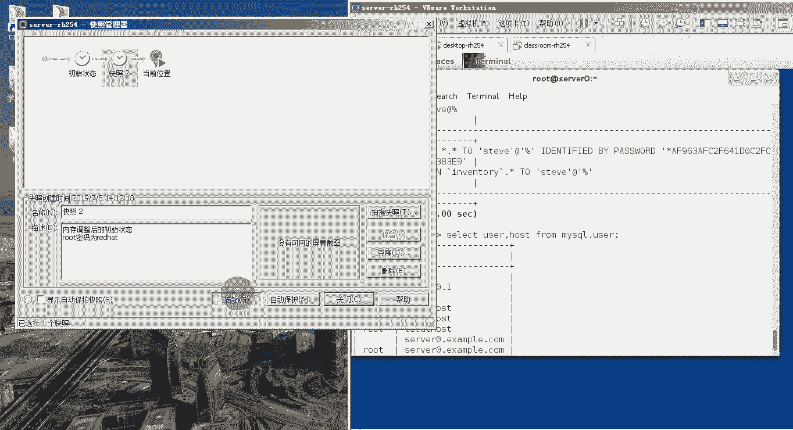

# 红帽RHCE认证考试视频 - P7：RHCE-7 - 我是冷空气 - BV1th4y1X7cC

那我们就开始今天的课程了，今天是我们的第七天，第七天，我们先来看看第七天的第一部分内容，我们今天的主要内容是我们的这个数据库，就是我们这个maria dp数据库，首先第一节啊。

它的目标是数据数据库的一些基本概念，然后可以安装这个mv db数据库的软件，包括服务器端与客户端，让我们首先来看一下这个数据库的基本概念，第一个就是这个数据库的介绍啊，什么叫数据库。

我们看一下这个数据库，我们叫做database database，简称叫做db啊，这个叫数据库，它的主要功能是什么呢，是存储已经组织好数据的容器，存储已经组织好的数据的容器。

那这个已经组织好的数据指的是什么，其实指的就是数据库中的表，数据库中的表，然后数据库通常是一个文件或者是一个文件夹，通常它是一个文件夹的形式存在的，然后这个文件夹里边有我们的很多，数据库中的表。

然后我们人呢经常会使用这个什么叫做数据库，来指他们运行的数据库软件，这个其实是错误的概念，这个数据库和数据库软件这个不是一个概念，数据库我们刚才说了，它是一个集合，这个集合里面存储的是结构化的数据。

也就是我们的表，那这个数据库软件是什么呢，叫做数据库管理系统，也叫d b m s啊，就是database啊，manager sister的意思，我们所有的数据库的这些个操作啊。

以及里边的这些个相关的动作，都是通过我们这个dbm来执行的，好，我们平时是不会直接访问数据库的，是通过d b m s，然后d b m s来代替我们去访问数据库，这就是数据库和数据库管理系统。

他们俩的一个概念，让我们再来看一下什么叫做马瑞尔db，这个maridb它就是一个数据库管理系统啊，或者是一个数据库软件，他是mysql的一个分支，它是mysql的一个分支，主要是由这个开源社区在维护呢。

采用g p l授权许可，就是我们说的那个通用软件许可协议，通用软件许可协议，然后这个马瑞db其实它是这个mysql，mysql这个创建人啊，他创建的另外一个数据库，原因就是因为mysql这个数据库。

他被我们这个oracle收购了，被oracle收购了，所以说他又创建了一个开源的数据库啊，把db然后用以代替这个mysql，那我们如何来对我们的这个数据库，来进行操作呢。

这个刚才我们说了是通过db m s，那么我们如何通过db m s来操作数据库上，主要是通过这个sql语句，sql语句，那么什么叫做sql语句呢，叫做structure pure language。

叫做结构化查询语言，他是为了数据库之间通信而专门设计出来的语，言，由极少的单词组成，提供了一个从数据库读取数据的简单，有效的方式，它的优势就是它通用性比较好啊，几乎所有的这种关系型数据库。

都可以使用sql语句啊，不管你用的是mysql，db two seq server啊，或者是这个什么oracle啊，或者什么rtd诶，都可以用啊，那这个sql语句它有哪些类型呢，我们来看一下。

主要有以下这六个类型，第一个类型叫做数据查询语言啊，就数据查询语言叫做d q l啊，这个d就是数据意思，q就是查询，l就是language啊，这个数据查询语言，我们也把它叫做数据检索语句。

它的主要功能是什么，就是从我们的表中获得数据，以及确定你这个数据，在应用程序中是如何给出的，他的这个关键字啊，主要是select select select，关键字。

用来从我们的这个数据库的表中获取数据，然后我们也可以通过这个where来指定你的pp条件，order by来指定你的这个排序规则，group by来指定你的这个分组。

还无英来执行分组之后的过滤啊等等等等，这几个叫做dq l数据查询语句，第二个叫做数据操作语言和数据操作语言和，dml就是数据操作语言的意思啊，这就分别是dml这三个字母的含义。

它的这个主要语句就包括这个insert update和delete delete，他们的主要功能是什么呢，就是对表中的数据进行操作，这个insert向表中插入数据，update更新表中已经存在的数据。

delete删除表中的数据啊等等等等，第三个语言叫做t p l，这个我们把它叫做事物处理演员啊，叫transaction process language啊，事物处理语言这个事务处理人想要理解他的话。

得先理解什么叫做事物，这个事物是指我们将这个多句啊，多个这个sql语句把它整合成为一个事物，然后事物啊它有这个它的这个特点，我们把它叫做a c i d属性啊，a c i d属性。

其中有一个比较重要的特点，就是事物这个东西如果要是执行成功的话，整个一个事务里面所有的sql语句都会执行，但是如果执行失败的话，那么所有的sql语句都不会执行，这样的话可以保证你这个数据的一致性一致性。

所以说我们这个事务啊，在我们这个工作过程中会经常使用啊，经常使用他的这个语序，包括开启一个事物啊，begin transaction commit提交以及rubik回归。

第四个语句叫做数据控制语句叫做d c l，date control like，它主要是通过brt和rework来控制的，然后这个是控制什么呢，是对你的这个用户来控制。

用户对某一个数据库下的某些表具有哪些权限，这个是数据控制，第五个叫做数据定义语言ddd l，它的主要关键词就是这个create跟job啊，用来创建删除表或者数据库，第六个叫做指针控制语言叫做ccl。

就是castle control language，它主要是用来控制我们的这个指针的，这个指针，可以对我们数据库中的表中的数据进行遍历，然后提取表中的数据啊，嗯典型的这个语句，比如说声明一个指针啊。

declare coser啊，然后获取数据啊，就是这个fish fish，以及更新你的这个数据库的当前状态啊，等等等等等等等等，这是指针控制语言，那我们这次课程里面就涉及到什么了。

涉及到了这个数据查询语言，数据操作语言，还有我们的这个数据控制语言，以及数据定义啊数据，然后事物在这个课程里面，应该应该是很少涉及啊，然后这个指针控制源基本上不涉及啊，基本上不涉及好了。

这些就是我们这个数据库的一些基本的知识，主要包括这几个地方，第一个就是什么叫数据库，什么叫数据库管理系统，它俩之间的区别，然后这个百分之db这个数据库管理系统啊，他的这么一个简单的介绍。

再就是如何通过数据库管理系统来控制，数据库中的数据，主要是通过sql语句，那sql语句都有哪些类型，他们的保留字是，第五个是马瑞db的架构，我们刚才说过，这个marrgb是一个数据库管理系统。

那这个数据库管理系统它其实是一个cs架构，就是它由服务器和客户端组成，这个服务器客户端可以在同一个节点上，当然也可以在不同的节点上，但是一般情况下，我们在部署这个m l d b的时候。

服务器和客户端经常把它们放在一起啊，就是在同一个节点，第六个是maridb的一个安装啊，maridb的安装，这个我们在我们的这个red hat里面安装的时候，因为马瑞db还有马瑞db的客户端。

它是一个程序组，所以在安装的时候，需要用到这个y u m groups in store，然后后面加上你的这个mary db，这是它的服务器端，mary d b杠client客户端，杠外。

如果你想启动mrgb的话，我们可以用c c t l start，a relib这个表情来启动，将其设置为开机自启，只要把这个start换成隐形包就可以了啊，引力包就可以了，如果想查看马瑞利b的状态。

有两种方式，第一个直接使用cmc t l status，maridb这个命令来查看，第二个就是我们可以通过查看这个马瑞db服务，的端口号来查看它的服务状态。

它的端口号跟我们这个mysql的端口号是一样的，是tcp的3306啊，tcp的3306，所以说这些端口号大家伙一定要把它给记住啊，一定要把它记住，然后马瑞尔db安装完成之后，我们需要进行一个初始化啊。

运行的是这个命令，就是mysqq啊，gq installation，然后在初始化的时候，它会弹出一个交互式的菜单给你来进行交互，通过这个交互菜单，你可以对你的这个软件里面，进行一个初始化测试。

包括设置入的密码呀，是否移除测试文件名账户呀，是否禁止入的账户远程登录，是否删除这些测试用的数据库，以及是否重新加载你的特权表，这个一会儿我们在初始化的过程中，会给大家详细介绍，第七个。

当我们的数据库安装完成之后，我们需要通过我们的这个maridb客户端，连接到我们这个db m s上，那怎么连接的，用的是这个例句，叫做mysql杠u，后面加上你登录数据库使用的用户名。

杠p加上这个用户名对应的密码，如果你想直接进入到某一个数据库内部的话，那直接加上目标数据库就行了，如果你是远程程度的话，可以加杠h这个参数，后面加上目标服务器的ip地址。

最后就是我们maridb它的相关文件啊，包括它的配置文件所在的目录是etc，现在买点cf。d主配置文件，etc下的买点c o和cn f，配置文件模板所在路径。

user下载share下的mysql以及它的数据库文件啊，就是我们在里面创建的这个数据库，以及数据库下的表，这些文件在wah的live现代版sl，以及它的日志文件，在wah的logo前大220好了。

那这些就是我们马瑞利b的一个简单介绍，那接下来我们就来安装一下马瑞利b。

我们来看我们的第28个实验啊，安装marily b，首先我们的这个实验，我们这个实验环境是这样的啊，嗯我们需要用到两台机器，就是dex top 0和server 0啊。

dex top 0跟server 0，然后进行实验之前，先把这个desktop 0和这个server领先重置，这个我们刚才已经把它重置好了，已经重置好了，就无需重置了啊。

然后我们在server 0上安装这个maridb，在btb上安装mdb它的这个客户端，那这个是把它都装在一起了啊，这都把它装在一起了，这个也不是一道远程的路。

那这样的话应该只需要server 0这台机器就行了。

好吧，那我们在server 0上来指引下这些操作啊，我们来到我们这个server里面的机器上登录一下。

好了，我们右键打开一个终端，然后我们开始来安装这个软瑞db，还有马瑞db的客户端，y u m groups，因此到maria db和maria db dolent，这个大家伙需要注意的一点就是。

第一个是group的意思就是你安装的是程序组，第二个就是玩玩db这个英文单词，不要把它拼凑，好了，我显示completely代表已经安装完成了，安装完成之后，我们就可以启动服务了。

首先把这个服务设置成开机自启啊，system c t l in a，宝马瑞尔db，再加服务，启动system ctrl start r，零，服务启动之后，我们可以通过查看它的端口来查看它的状态。

抓一下它的端口，它的端口是我们说的这个3306，3306，可以看到端口号是3306啊，这个属于mysql这个进程啊，mysql这个进程，然后我们来修改它的这个配置文件啊。

编辑etc下的买点cn f在这个mysql这个字段下啊，注意这就是mysql这个字段，在这个字段下你找一个空白号，在空白行里面添加一个ip啊，network等于一啊。

skip networking等于一，那添加这个指令是什么意思呢，就是让你的服务器进行仅侦听本地客户端，进行侦听本地客户端好了，然后我们wq网上推出，由于刚才我们修改了它的配置文件。

所以我们需要重启服务啊，让我们的这个来重新读取备注音啊，restart maria db，好了啊，再次查看它的端口啊，我们可以let state查这次，啊l n t rap，a3306 没有监听啊。

l s o f杠i tcp的330，r s o f啊杠i t c p，诶端口没有监听，这很奇怪，我们s s查一下s s杠t u lpn啊，grape i49 哎也查不出来啊，也查不出来啊。

这个我们刚才重启了一下服务，发现这个服务状态有异常的，我们status stl maria db来查一下，也可以看到它现在已经是etiring了啊，已经是好了，那我们来试一下啊，看他这个是否真正启动了。

我们直接对它进行初始化，诶，可以看到可以进行存储化啊，好了，然后在这里边我们就进行了这个maridb，它的一个初始化啊，首先它让你输入当前root账户的密码。

注意这个root账户并不是指你系统的root账户，如果没有的话，那直接按回车就行了，那我们直接回车，回来之后让你设置root密码啊，他这里写着说设置root密码，可以确保这个没有人可以。

在没有足够授权的情况下，通过root用户登录到我们的这个mary db上，然后他问你是否设置等于这个我们是，所以打个y，注意这个y是不去分大小写的，然后他让你设置一个新的root密码。

这个我们直接随便设一个就好了，我们设一个right hand red hat，重新输入一次诶，他提示你说这个root密码已经设置成功了，assuccess，然后他说在默认情况下。

这个maridb在安装的过程中会有一个animals use，一个匿名用户，这个用户他是可以领取这个，anyone to locking to maridb啊，而无需你这个为这些用户啊单独创建账户。

这个主要是用来干嘛的呢，他说这个主要是用来做测试的，而且可以使你的这个安装更加的平滑，然后他告诉你说，你应该再把你的这个maria db投入到生产环境之前，把他们给删除掉。

那下面就问你说是否要删除这个进行账户，按照我们删除所有关显示，success normally，通常的说，root账户是仅被允许可以从local host本机登入的，这样可以确保第三方。

就是其他人无法通过网络来获取，你这个root账户的密码，他问你是否不允许root账户验证登录，那我们这也显示by default默认的这个默认db啊，它有一个默认的数据库，这个数据库的名字叫test。

这个数据库是所有的用户都可以访问的，那这个数据库是用来干嘛的呢，也是用来做测试的，而且当你把马瑞dp投入到生产环境之前，应该把它删除掉，那下面他就问你说，是否删除这个测试用的数据库的方式。

最后它提示你说reloading重新加载这个特权表，preview啊，privillage tables可以干嘛呢，可以确保截止到现在，上述的所有步骤都能立即生效，那问你是否重新加载这个配方。

那我们也是当所有的步骤完成之后，他会给你显示说all that啊，所有的都已经完成，他说如果你完成了上述所有的步骤的话，那你的马瑞db现在已已经安全了啊，最后跟你说啊。

这个thanks for you sim rgb，感谢您使用mrgb好了，那接下来我们就用root账户来登录一下啊，登录我们刚才说了是mysql u root，注意我们又加杠p这个参数。

也就是说我不采用这个口令的方式登录啊，可以看到他给我提出一个报错，报错报错这个内容是什么呢，说access denied for user，当root用户想尝试从local host这台主机。

登录我的maridb的时候，这块显示的是访问被拒绝了啊，为什么访问被拒绝了，因为他没有使用密码登录，让我们接下来使用密码登录一下啊，mysq让u root让p后面直接跟上密码就可以了，red hat。

或者你不直接跟密码啊，这样的话他让你输入密码，你输入red hat也可以诶，这就登录进来了，登录进来之后，show d，this is查一下，明天打错了，show d，这个a岛上面vs查一下。

可以看到这里边是没有test这个数据库的，因为test那个数据库，是我们刚才在安装过程中说的，而是一个测试用的数据库已经被清除了好了，那截止到这儿，我们的第一个小实验就完一个小实验就完成了。

那我们把我们的这个环境来还原一下，只要还原server x就行了。

其实没有用到这个dex top x。

好了，接下来看一下我们今天的第二部，就是实现对数据库以及数据库，表中的数据进行操作，实现对数据库以及数据库中的表中数据进行唉，我们看一下，我们看一下这个实验是不是对应的。

啊这个我们得把二和三都说完了之后，才能跟这个实验对应上啊，那首先第一个就是数据库的相关操作啊，数据库的相关操作，那对于数据库的情况操作主要以下这些，第一个就是查看当前db m s中有哪些数据库。

这个命令我们刚才就已经用过了，叫做show show，就是显示的意思，database database database就是数据库后面加一个s databases啊，代表多个数据库。

所以是show databases，他的每个命令的分隔符都是这个分号，所以说你敲完每个命令轴必须得敲分号，不然的话他就会换行，让你继续输入，这个是需要注意的点，第二个就是在呃。

在我们写这个数据库的sql语句的时候，一定得注意，其实标准的这个写法应该是关键字不大写，什么是关键词，比如像这个就是关键词show database，这都是关键词，理论上都是应该大写的。

但是我们的这个maridb，默认它是不区分这个大小写的，默认是不区分大小写的，所以说你写大写小写这个都可以，但是我们也得注意啊，在标准这个文章里面，特别是你在写一些sql语句的脚本的时候。

尽量这个按照标准来，就是把它都大写，那我们这个课程里面可能就都小写了啊，所以说大家伙必须得清楚这个事，第二个查看当前数据库下有哪些表，这个我们用的是show tables，show tables。

show显示啊，tables tables就是表的意思，有表的意思，显示当前数据库价有哪些表，第三个查看表的结构或者信息，这个我们用的是describe，后面加上一个表明。

describe就是描述的意思啊，查看你这个表中的字段，字段就是你有哪些列，有哪些列，然后每个列的特性都是什么，第四个创建数据库，这个我们用的是create语句啊，create创建创建什么呢。

数据库database database，后面跟上数据库名就可以了，然后变成数据库名，第五个是使用数据库，那使用数据库比较简单，我们用的是use这个关键字啊，use后面改成数据库名。

就是你使用的是哪一个数据库，使用了数据库之后，你就可以直接在这个数据库下索引，这个数据库里边所有表以及表中的相关信息了，最后删除数据库，删除数据库，我用的是job，这个大家伙要注意啊。

就是你在数据库管理系统里边，所有用create创建的东西都可以用job删除，所有用create创建的东西都可以用job删除，那删除数据库就是job删除什么东西呢。

数据库database database后面跟上什么呢，跟上你要删除的是哪一个数据库啊，这就是对数据库的相关操作，所以重点主要就是查库啊，查看当前都有哪些库，查库中的表，查看当前数据库下有哪些表。

注意这里边一定要是选择当前数据库，那怎么使用哪个数据库呢，就是这个use后面加的数据回应，如果创建数据库create，如果删除数据库招，如果想查看我们数据库中某一个表的表结构，用的是describe。

后面加表面好了，这就是数据库的相关操作，那我们会了数据库的相关操作中，还要会对表中的数据来进行相关操作，那对表中的数据都有哪些操作呢，无非就是增删改查，无非就是增删改查，让我们看看。

先看看这个增增设向表中插入数据，插入数据的时候，我们用的是insert语句啊，insert本身就是插入的意思，这个大家伙这个单词应该见过，就是我们以前在学那个vim编辑器，vi编辑器里边有一个插入模式。

那个同学好像这个麦克风没关啊，把麦关一下好的，然后下面中插入数据用的就是这个insert语句，insert in two，向哪个表中插入数据，然后表中它是有很多的字段的，这个字段就是我们说的这个列。

就是你向哪一列插入数据，在后面可以跟上这个字段，多个字段之间注意用逗号隔开，后边跟上values，这个values后边里边就跟上具体的值，注意每个值用单引号括起来，然后只跟值之间用逗号隔开。

也就是你像你的这个数据库中的某一个表，里边的哪一列插入什么值啊，插入升值，然后这块简单说一下，在数据库中的这个表中的列，我们把它叫做什么，叫做字段，那表中的行我们叫做什么，叫做记录，叫做记录。

所以说字段和记录你可知道分别代表的是列，根号里根号，第二个就是更新表中的数据啊，更新表数据，也就是说你这个表中已经有一个数据了，把这个数据给他更改一下啊。

更改一下这个用的命令是update update，update就是更新的意思，update后面可以上你这个表明，然后set某一个字段等于新的值啊，set某一个字呢，一直也就是设置某一个列里边的某一个值。

等于一个新的数值，但是你后边如果不跟限定条件的话，那他就会把整个这一列，所有的值全部都替换为这个性质，那怎么加上限定条件呢，我们用的是这个where子句，where where后面跟上指定条件叫做主键。

列名等于某一个具体的值，那这里边又冒出了一个新的概念，叫做主键，什么叫做主线呢，就是一个表中，能够唯一标识每一行的那一个字段，我们把它叫做主键啊，再说一遍啊，是一个表中。

可以唯一标识这个表中每一行的字段，或者每一行的列，我们把它称为叫做主键，通常这个组件它都是一个序号，多少一个序号，所以说你通过这个组件就可以确定，你更改的是某一列中的哪一行的这个位置。

这样的话就把具体的这个值给锁定了啊，这是update，这个后面我们都会用到啊，第三个就是删除表中数据，删除表中数据，删除表中数据，我们用的是delete这个关键词，delete from。

从哪个表中删除，后面加上具体的表名，where啊，后边跟上你这个字段等于具体的值啊，具体的值这个是删除表中的某一个值，删除表中，那如果你想删除整个表的内容，其实有两种办法。

第一个就是delete from，后面加表面，后边什么都不加，这样可以删除表中的字啊，字段中所有的数据啊，就删除所有的记录，第二个就delete啊，不用delete了，我们用那个trunk。

trunk后面加上表明也可以快速清空表，求求第四个就是检索表中的数据，检索表中的数据就是我们说的这个查了啊，上面就是我们说的增删改，最后就是查就是解锁啊，这怎么检索表中的数据呢。

我们用的是select这个关键字，select后面加上字段，这就是我们说的列，你查的是表中的哪些列，字段和字段之间，注意用逗号隔开，后边from具体的某一个表明具体的某一个表面。

但是如果你要是讲检索这个表中所有的字段，就是所有列的信息，就几乎是整个表的内容，怎么办呢，我们用的是select星from rom，表明啊，select星from标配，但是大家伙一定得注意啊。

在生产环境下，这个命令是千万不要用的啊，千万不要用，我们在这个测试环境下，每一个表中的数据量都比较少，所以我们select使用from表明这个是没有问题，但是在生产环境下，可能你的这个表中的记录特别多。

当你select from表明的时候，它会一条一条进行查询啊，就是表中的每一行进行查询，那这样的话很容易造成你的这个数据库，四级数据库司机好了，这个就是我们的这个数据库相关操作语句。

以及表中数据的相关操作的语句好，那接下来我们来看一下第三部分，看一下第三部分之后，我们再来做下一个实验，第三部分主要的内容是设置你的这个maridb中，用户啊，以及这些个用户它对应的权限，对的权。

也就是说实现对我们ml db数据库管理系统，的一个用户控制啊，一个用户控制，那这个用户控制这块注意啊，它分为两个内容，第一个是访问控制，第二个是用户管理，那什么叫访问控制呢。

就是你可以通过创建不同的用户，并且给这些用户赋予适当的权限，来实现马瑞尔db的一个访问控制，比如说呃你可能需要有多个应用去访问数据库，那么我们这个合理的操作办法应该是。

你可以为每一个应用设置它对应的用户，之后，为这些用户对数据库中的某些库下的某个表，设置相对应的权限，这样的话就可以实现这个方法，处置的话就可以确保第二个就是用户管理啊，第二个就是用户管理。

然后用户管理这块涉及到这些命令，首先第一个就是查看当前系统用户，这个我们马上tb其实跟mysql是一样的，它将当前我的这个数据库管理系统里边，所有的用户的信息全部都放在mysql数据库下的。

一个叫做user表中，所以说我们如果想查看信息的话，首先第一个你得先用我这个mysql的数据库，那就是use mysq，之后再查下它的这个user表中的信息，那就是select后面跟上字段。

那user表中哪一个字段代表的是用户呢，就是user这个字段，比如user这一列from user这个表啊，当然如果你觉得这样比较麻烦的话，你不想再敲这个use的话，怎么办呢。

你可以使用完全限定数据库名和完全限定表明，就是下面这种方式select，我查的是user这个表，下面的host和user这个表现的user字段，从哪个表中查查。

从mysql这个数据库下载user表还有什么，然后user这个资料我刚才给大家解释过了，它代表的是什么呢，就是当前系统里边有哪些用户，那这个host是什么意思呢，host在这里代表的是。

这些用户可以在哪些主机上登录啊，可以在哪些主机上登录，如果你查出来的结果是这个百分号的话，就代表当前这个用户可以在任何主机上登录，如果是local house的话，代表这个用户只能在本机登。

这是需要注意的，这是第一个查看用户，第二个创建用户啊，创建户创建用户，我们用的是create语句，那create后边你创建的是什么呢，是用户，所以create user后边跟上用户名。

然后at后边跟上主机，这个代表你创建的这个用户，可以在哪些主机上登录，如果这后边你写的是local house的话，那只能在本机登录，如果是百分号的话，可以在任何主机上登录，但如果你不写的话。

直接create user用户名的话，它默认是在任何主机上登录，identified by，就是你的这个密码是多少啊，密码是多少，然后具体这个密码的内容用单引号引起来，放在后面就可以了啊，这是创建用户。

并且设置用户密码，那如果我创建完这个用户之后，我发觉诶我的用户名创建错了啊，这个不是我需要的那个用户名，手一滑打错了，这怎么办呢，我们可以对用户名进行重命名，怎么重命名呢。

我们用的这个命令是rename啊，ame name命名，rename，重命名，rename，对什么重命名呢，对用户，所以是rename，user user后面跟上你的这个旧的名字，然后to改成新的名字。

这是重命名用户，那如果用户的名字没有敲错，但是我密码输入错了怎么办，我们可以修改用户的密码，那就是set set password设置，set就是设置的意思，password密码为哪个用户设置呢。

for后面跟上用户名等于号，后边跟上password这个函数，注意这是一个函数，然后里面加上具体的密码啊，后面加上去的密码，这个是我们修改用户它的用户名，还有密码，修改用户和密码。

然后但是大家伙注意这个创建也好，修改也好，然后删删除，包括后面的删除也好，这个都需要你具有一定的权限啊，大多数情况下这些都是通过root账户来实现啊，你普通账户但是没有这些权限，第四个就是删除账户啊。

删除账户，删除用户这个命令就很简单了，我们可以看到创建用户的时候，我们用的命令是create，所以删除的时候就是用对应的job job job，就是删除删除什么呢，删除用户，所以是job user。

这个我们之前学过啊，说删除数据过，那就是job debase，那这样的话我们可以推测一下，那删除表那就是job table，table就是表的意思，所以删除数据库就是job user。

后面加上你的这个用户名啊，这就是删除用户，job user后面加上诶，这个就是我们用户的管理，包括查看创建修改删除，那我们有了用户之后，如何来控制用户的权限呢，那我们来看一下这个权限管理。

首先第一个就是你得会查看用户的权限，查看用户的缺陷，我们用的命令是show grants for，后面加上一个用户名，就是查看某一个用户它具体的权限，show grass for。

如果你想为这个用户赋予权限怎么办呢，就grant后面加上具体的权限，这个权限包括什么，select，可以检索update呀，可以更新delete呀，可以删除等等。

或者是all privileges所有权限，然后or对哪一个数据库下的点哪一个表，如果是这个数据库下的所有表的话，就是数据库名点星星就代表所有表，然后为这个数据库下的这个权限，赋给哪个用户呢。

所以是to后面跟上用户名，这是赋予权限，这是赋予权限，那能够为用户赋予权限，就远程删除或者撤销用户的权，撤销户的权限，我们用的是rev啊，revoke，revoke后面加上具体的权限啊，哪一个数据库。

现在哪一个表from，从哪个用户中撤销这个权限，这就是权限管理，包括，好了，那接下来我们通过两个简单的小实验，来看一下啊，来看一下这些相关操作。

我们来看第29个，实验和管理用户，第29个实验管理也不，首先啊这个实验我们看一下，它用到了两台机器啊，这个跟上面这个不一样，是真的用到了两台机器啊，sl x和dex top x。

那其实就是server杠h254 和dex top gx 54，首先第一步重置server x和dex top x，这个我们已经重置过了，然后登录两个服务器来运行这个基本的脚本，环境设置的脚本好。

那我们接下来登录一下，我们首先登录到，我们的server。

然后我们打开终端。

运行我们的技术环境设置脚本，lab maria db gun，users set up，好我们可以看到啊，实际上它会自动帮你安装并配置，这个马瑞利b啊，可以看到他现在就在安装马瑞利b啊。

installing maria db，但是这个亚目这个程序被其他的应用占用着啊，啊其他应用已经占用完成了，然后就开始安装，安装完，好了安装完成之后，你看它会自动帮你启动这个m l d b的服务。

并且把它设置成开机自启，设置开机自启，然后啊，他还从我们的这个指令的站点上，下载了一个文件，下载这个文件之后，把这个文件里面的相关数据导入到数据库好了。

那我们这个server端我们就已经完成了，然后我们来试试dex top。

好了，然后我们打开右键桌面啊。

打开一个终端，啊然后我们也是运行这个脚本啊，live maria db杠user 4，我们可以看到它实际上就是三种，1。2对一的客户端啊，一个客户端好了，那接下来我们来开始我们的实验。

首先来到我们这个server 0上啊，server 0上在server 0上，我们先连接到数据库，那就是my circular gu root，注意没有密码直接登录啊，这就已经登录上来了，登录上来之后。

其实你是可以看到这个mysql的情况信息的啊，welcome to maria db的这个monitor啊，欢迎来到这个maria db的这个监控器，他告诉你命令需要以这个分号或者杠g结尾。

然后我们的这个maria db，它的这个连接的id是哪个啊，包括我们服务器端，它的这个版本是5。5。3啊，5。5。3，下边是他这个版权啊，oracle公司好了，那在这里边我们先来创建我们的用户。

我们需要创建两个用户啊，一个叫做什么叫做join，一个叫做steven啊，steven那创建用户的时候一定得注意啊，如果按照标准写法的话，那就是我们这个课件上的这个写法，但是他也不是特别标准。

如果真的标准的话，他是这样的，create创建user后面跟上用户名叫做join at，后边跟上这个用户可以在哪登录local host，那这个用户只能在本机登录啊，本机登录，然后i da fight。

注意这个identified这个英文单词千万不要打错，by后面加上你的这个密码，叫做join p s s w o r d，诶这个用户我们就创建成功了，创建成功了之后，他会给你反馈说这个查询成功啊。

查询成功以及它的这个用时，我们再来创建第二个用户，那创建第二个用户的时候，我们就按照这个严格标准的这种方式来写了，我们直接消息来了，create创建user，这个用户叫什么呢，叫做steven。

然后at它可以在哪登录呢，注意单引号百分号，单引号就代表可以在任意主机登录idfi by啊，你的这个密码叫做斯蒂文p a s s w o r d，好了，那我们这个用户就已经创建成功了啊。

我们的用户就已经创建成功了，那我们来验证一下，看这两个用户是否创建成功了，怎么验证来着，我们之前说过可以select user host，从哪个表中，从mysql这个表中的这个数据库下的有色表里诶。

在这个里边我们可以看到啊，可以看到刚才创建的用户join啊，它可以从哪个手机上登录呢，local host还有我们第二次创建用户steven啊，它可以从哪登录呢，从百分号诶，这哪个同学这个没有关啊。

把这个关一下，啊陆师可以把麦关一下，把麦关一下，要不然这个声音太大了，诶好的，这应该这应该是在家啊，好了，然后我们可以看到啊，当然你也可以不采用这条语句，你还可以干嘛呢，还可以才这样啊。

我们show d basis啊，在这里边可以看到有个数据库叫mysql，然后我们use mysq诶，可以看到我们已经切换到mysql数据库了啊，除了他给你的提示以外。

我们还可以看到我们之前这块写的是none，就是没有任何数据库，然后现在是不是变成mysql了啊，mysql之后我们可以show tables，查看这个数据库下的所有表，在这里边有一个表叫做user啊。

那我们既然在这个框架就可以直接select user，host from user这个表诶，看到的效果跟刚才是一样的，好了，然后我们再为这个两个用户，分别授予不同的权限。

我们用户为用户这个join授予可以插入更新，删除和检索的权限，那就是grant啊，ground后面加上具体的权限啊，哪个用哪些权限呢，哈可以插入插入insert更新，update。

删除delete检索select，对哪个数据库呢，叫做inventory点星点星我们刚才给大家解释过了，这就代表着这个数据库下的所有表，给哪个用户呢，给join这个用户，这个用户可以在哪登录呢。

可以在local host登录诶，这样的话我们就设置成功了，然后紧接着再为我们刚才这个steve用户，设置可以检索的权限，那就是grand检索select对哪一个数据库。

还是刚才的这个inventory，这个数据库下载哪一个表啊，星所有表给谁设置，给steve这个用户设置这个steve用户可以在哪登录呢，百分号可以在任何主机上登录，哎这都提示我们设置成功了。

设置成功了之后，我们可以刷新特权表，叫做flash play villages，注意这个最好就是你对数据库的权限，相关操作变更之后，都要运行这个命令啊，运行这个命令好了。

那我们来看一下这两个用户它对应的权限，首先我们看一下这个join用户了，那就是show grant for john，诶他提示我说你这个语法输入错误了，那哪输入错误了呢。

他说在这个grant这块就输入错误，那就是show grace for john，嗯它提示没有这么一个权限，定义为join这个用户在所有主机上啊，所以说这样的话我们还不能查，我们得后面跟上一个艾特。

然后指定他在哪台主机上登录才行啊，这样的话就查出来了啊，这样才能，然后我们看到这个join这个用户，他对这个inventory这个数据库，点星下的所有表具有什么权限呢，select检索权限。

insert，插入权限，update，更新权限和delete删除权限，让我们再看看另外一位用户受grants for steve at，啊他说可以在任意主机登录啊，所以这就能看到了诶。

可以看到这个steve这个用户，他对我们的这个inventory，这个数据库下的所有表具有的权限是检索，也就是说它跟我们这个招a用户相比，它少了三个权限，分别是更新插入和删除好了。

那接下来我们来验证一下，这两个用户的权限是否正确，验证一下我们这个用户的权限是否，同学我e s i t退出当前的数据库啊，注意退出当前的这个数据库，连接也是e s i t好了，那我们接下来使用join。

这个用户来连接到数据库mysql，杠u join gump 的密码密码是什么呢，应该是join杠p s s w r d，注意这个密码你可以直接在这输入，或者你不在这输入敲一个p。

然后在他的给你个提示后面输也可以，这个刚才已经给大家伙演示过了，不知回来之后我们来使用我们的这个数据库，我们先show data basis，查一下当天都有哪些数据库。

a可以看到是不是有这个叫做inventory，这个数据库，那这个数据库我们现在使用它，那就是use inventory，好了可以看到重新切换到这个数据库了。

这个我们show tables看一下它下边有哪些表啊，可以看到它有这些个表，什么什么cat green啊，什么product，还有中间这个不太会读啊，不太会读好了，那我们现在来看一下。

我们现在这个用户的身份是这个join，我们看看用户john对这个数据库，当前那个数据库下的所有表是否具有检索检验，我们随便查一个表吧，就查第一个表，那检索就是select，你要检索哪一个字段呢。

我们新from cat great这个表a可以看到能够重新查看，能够成功的查看这个表中所有的字段啊，可以看到这个表中有两个字，一个叫id，一个叫name，然后里边有三条记录，123。

这个id这个字段实际上就是这个表的一个组件，一个组件嗯好了，这证明了他是可以具有这个检索切切的，那我们看看它能不能插入呢，我们像这个表中再插入一条记录啊，这个记录叫什么呢，叫做memory哈。

name叫做memory好了，那我们插入一下，insert into哪个表叫cat green，插入它中的哪一个字段呢，name这个字段values插入的值是什么呢，注意，单引号括起来啊。

叫做memory，其实有内存啊，其实有内存诶，提示我们已经插入成功了，插入成功之后，我们再select行from cat，可以看到刚才里边是三条记录，现在多了一条记录，四条记录了啊。

就是这个memory，所以这个就证明了我们现在这个join用户，对我们的这个inventor，一个数据库下的这个categ啊，这个表是具有插入权限的，让我们看看它能不能更新。

因为刚才我们也给他设置更新权限，我们现在可以看到这个第四个啊，第三个这个内容叫做ssd啊，第三个叫s s d j s s d固态硬盘啊，德尔塔是简写，我们把它来更新一下，那就是update嗯。

更新哪个表，cat green这个表set设置哪一个字段呢，设置name这个字段字段的值等于多少呢，等于s s d固态，这是固体，太driver硬盘，注意如果这个命令你就敲到这儿，直接打分号结尾的话。

那所有的这个name字段里面，所有的值都会被替换成这个值啊，那我们需要定位我们要替换的是哪个呀，是不是这个呀，所以说我们需要去进行一个数据的过滤，那怎么过滤呢。

我们用where where你的这个id号等于三，这就代表我们要修改的是id号等于三，的这条记录里边中的name这个字段啊，就是把这个s s d改成我们这个目标内容就行，好了之后我们再来查看一下啊。

select行，from cat，哎我们可以看到，是不是他这个第三条记录已经被修改了啊，这也证明了我们的这个join用户，对这个数据库下的这个表是具有更新权限的，那我们再看一下它能不能删除啊。

删除我们现在把这个memory学校记录给他删除掉啊，那我们用的是delete语句，delete from哪个表，from cat green这个表，然后where where后面加上限定条件。

就是你删除表中的哪条结论，name like，memory，注意这里边用到了一个like词句啊，用来进行匹配，什么意思呢，也就是说我删除这个表中的数据，删的是哪一个数据呢。

name也就是它的name这个字段里边的信息是什么呢，是memory啊，那其实删的就是第四条记录，就这回收之后，我们再select行from cat ga，可以看到第四条记录就被成功的删除了啊。

这也证明了什么呢，证明了我们当前这个join这个用户，他对这个数据库下的表确实是具有更新，插入删除和检索的权限，好了，那下面我们退出这个数据库，拜拜我们来验证一下我们另外一个用户，他的这个权限啊。

来验证一下我们另外一个用户他的权限，然后另外一个用户注意我们在设置的时候啊，我们可以看一下，再看一下，show grants for steve，啊sorry我现在不在数据库里面啊。

mysql更优秀的杠p啊，这好像没密码，直接登上去就行了啊，show grants，steve看到第五他后边跟的at是百分号啊，或者你也可以在select user。

host from mysql这个数据库下的优势表，可以看到，这个steve用户是可以在任意主机登录的啊，所以我们可以在dex shop上来登录steve用户。

大家伙可以看到这个照用户只能在本机登录。

它是不能在远程登录的，这个我们可以通过我们在这个单top上来试一试，首先我们现在先用join来登录，看能不能登啊，my circu杠u join要不要写错了，然后杠p它的密码叫做john。

下划线p s s w i d杠h啊，用来登录你的哪台机器，我们用来登录server 0这台机器诶，可以看到它提示你说join这个用户，它是无法登录的啊，那我们再试一下。

我们刚才设置的可以在任意主机登录的用户，steve杠p它的密码是d5 下划线p s s w r d啊，然后杠h登录呢还是机器上的server 0 server 0。

注意你也可以采用我们这个课件上给大家敲的，这个就是杠p后面没有跟密码，没有给密码的话，你还在这下面输入一下诶，可以看到已经成功的登录上了啊，成功登录，登录上之后。

我们再show data basis查看一下当前的数据库，可以相当于这个inventory这个数据库，然后我们来使用这个数据库use inventory，可以了，切换到这个数据库去了。

然后show tables我们来看一下啊，看一下我们的这个steve这个用户他的权限，我们之前给他设置的权限是什么呢，就是它只具有检索权限，没有其他任何权限，那我们来验证一下，看是不是这样。

首先看它能不能检索数据，那就是select新from cat green，这个表可以看到能够成功检测数据，那能不能执行其他的这些操作的，比如说insert insert into cat g。

然后插入哪中表中的哪一个字段的name，这个字段啊，williams它的值是什么呢，是memory，诶可以看到啊，他说insert这个语句deny啊，被拒绝，当你的steam用户尝试去执行他的时候。

也说他是没有这个插入权益的，那同样的也没有更新和删除节点，我们可以试一下，比如说update cat，site name等于随便设置一个吧，where id号等于比如说就改第三项，完了别呵呵了。

把它再改回成s s d吧，s z哎，提示你update这个命令也被拒绝了，那delete肯定也不可以，我们试一下delete from ro cat green啊，我们这些尝试把它这个表中记录全部删除。

也可以看到也删不了，那这样的话就验证了我们这两个不同用户，它所对应的不同的权限啊，对准好了，这个就是我们这个29与管理用户的，这么一个小实验啊，这么一个小实验，那我们再把我们那个环境还原一下。

好了啊，这个让他还原证，那接下来我们来看一下，我们今天最后一块的内容，第七天最后一块内容，最后一块内容是数据库中的数，据的备份与恢复啊，数据库中数据的备份与恢复，这个首先得知道一个概念。

什么叫做数据的备份，数据的备份，实际上就是把你的这个数据再另存一份啊，另存一份，那备份的这个目标是什么呢，其实主要就是为了恢复啊，当你这个数据库中的数据啊，假如说因为一些这个异常的原因。

导致了这个数据丢失了，怎么办呢，假如说你有备份的话，你可以通过这个备份来恢复数据啊，就这么一个东西，让我们这个数据库的备份与恢复呃，首先我们来看一下这个备份，备份的话主要是通过mysql dm这个命令。

通过它来实现备份的这个mysql dump这个命令，它的主要用法是这样的，首先它跟登录数据库的这种方式是一样的，杠u后边指定的用户名，杠p后边可以直接指定你的这个密码，当然你也可以后边不给密码啊。

再手动输入也可以，后边是你要备份的目标数据库之后，用一个输出重定向啊，把它导出成为一个备份的文件，备份的文件，这样的话就可以把这个数据库中的所有数据，全部都备份出来，那数据库中所有数据都是什么呢。

其实就是数据库中的表，数据库中的表以及表中的数据，第二个，如果你想备份的是所有的库，而不是指定的某一个库的话，怎么办呢，我用的命令是这个叫做my circle dump。

mysql demo杠u后面跟上一个用户名杠p啊，加上这个用户对应的密码，然后杠杠all date basis，杠杠all date bases啊，这个就是所有数据库的，然后这个输出重定向。

把它备份成某一个指定的备份文件，备份解，这就可以了，第三个是恢复库，这个恢复库的话，其实就是恢复你这个数据库中备份的信息，那第一个是恢复所有的数据库，那不用所有数据库，它有个前提啊。

前提就是你得有所有数据库的备份文件才可以，那怎么恢复呢，就是my circu杠u后面加上一个用户名，杠p加上这个用户名对应的密码啊，然后输入重定项，注意备份的时候用的是输出重定向。

然后我们恢复的时候用的是输入重定向，后边加上你的备份文件就可以了，这样的话就可以恢复所有数据库中的所有表，以及表中的数据，第四个是恢复指定数据库啊，恢复指定数据库，那恢复指定数据库就是mysql杠u。

会不会加上用户名杠p后面加上目标数据库，后边再跟上你的这个目标数据库的备份文件，这里边注意第一个备份文件必须得存在啊，没有备份文件是没办法恢复的，第二个就是他跟我们刚才讲的这个恢复所有库。

这个有一点不同，就是当你恢复指定数据库的时候，你的这个目标数据库必须得已经存在才行，如果它不存在的话，你得先创建你要恢复的这个目标数据库啊，你得先创建它，创建它之后再回复啊，再回复。

好了，那接下来我们还是通过一个实验，来把这个数据库的恢复与备份来看一下啊，恢复与备份。

首先第一个，我们这个实验需要用到的机器是server x啊，可以看到它这个只用一台机器就可以实现了啊，那我们现在登录一下threx，实际上就是server h254 啊。

我们主机名就是server 0登录用户root密码red。

好了，然后我们打开一个终端，打开终端之后，我们来运行一个脚本，来设置一下初始环境啊，是这些就是初始环境，就这个脚本实际上是干嘛呢，就是我们可以从指定的这个服务器上来。

下载一个我们的这个数据库的备份用的文件，可以看到我现在在当前目录下，ios这个没有什么数据库备份的这个文件，它只有你的这个更加的root，现在加目录下的一些这个目录目录好。

我们运行一下就做lab maria db港restore set up，可以看到他先帮你安装了这个maridb，好了，然后我们看啊，他帮你安装完马瑞db之后，他又帮你启动的马瑞db。

并且把它设置成开机自启之后，他还设置了这个马二db，它在防火墙上的规则啊，这两个四个size，这个其实可以基本判断，它一定是通过永久添加设置的防火墙规则，然后他干嘛呢，他下载了一个maridb。

这个实验用到的备份文件叫做winter，点大啊，因为winter简单，ios看一下这个配置应该下载到哪了，诶，这个好像不是在我们这个位置啊，不是在这个位置，它是下载到根下的。

home下有一个students这么一个用户，students下面可以看到啊，就一个inventor dump啊，这个就是我们用来恢复数据库中的这个数据库，备份文件好了，那接下来我们先来登录数据库啊。

因为我们要恢复的是指指定的一个数据库，然后我们刚才给大家介绍了，你如果想恢复指定数据库中的文件，你得先这个数据库存在才行啊，这个数据库得先存在才行，所以我们现在要干嘛呢。

我们要以root的身份连接到我们db，然后创建这个数据库啊，没有密码，直接连就行了，连接完成之后，我们show data bases，我们来看一下啊，现在都有哪些库可以看到有这个mysql数据库。

有test数据库，因为有test数据库，我们就可以判断，其实他这个没有经过初始化啊，没有经过初始化，那么创建一个数据库，create data，base这个数据库名叫什么呢，叫in w terry啊。

证明一个数据库创建完成的直播主页，一定要再查一下，看你是否创建成功，data basis可以看到啊，这个数据库已经创建出来了，创建出来之后我们e x i t e s t，这个我们先不急，e s t。

我们先看一下我们这个数据库已经创建出来了，databases，我们use一下这个数据库叫做英文，切换到这个数据库之后，我们show tables诶，我们可以看到没有任何表啊，这个数据库下没有任何表。

就是没有任何数据，所以最终给我返回的是一个叫做empty，siempty set，就是空的结果急的意思，那就是空的结果集的意思嗯好了，那现在我e s i t退出，退出之后。

我们来用我们刚才的那个下载的文件，来进行恢复，那就是my circu杠u root，你要恢复的是哪一个数据库呢，inventory这个数据库从哪个备份文件恢复呢。

从根下的home下有一个student啊，student student下边有一个inventory，点dumb这么一个文件诶，这个命令就可以看到执行成功了，执行成功了之后，我们来验证一下。

看是否恢复成功了，那就是my circle gu root之后，data bases诶，可以看到我们的这个inventory这个数据库。

然后use inventory这个数据库之后再show tables，哎我们就可以看到这个数据库下所有的表啊，那我们来看看表里边有没有数据呢，我们可以select星from哪个表呢，就看第一个表吧。

cat这个表a可以看到这个标准的数据，那我们这个数据库的恢复就完成了啊，数据恢复就完成了，那截止到这儿，其实我们这个maridb，它的这个里边介绍的这些个东西，就已经给大家介绍完了。

包括meridb的安装，然后用户及权限的管理以及数据库的恢复等等，最后我们来看一下这个综合实验啊，它有一个综合实验，这个综合实验就是把我们之前学的这些东西，就都囊括在里面了，那我们来看一下。

首先这个综合实验需要用到desktop x跟server x啊，看看这个是否需要用到death top啊，还真用到dt tvs好了。

那我们来还原一下环境吧。

然后开启巡警。

然后开启新机，好了，我们这个系统已经启动了，然后我们登录一下，还是使用root账户登录啊，然后我们的这个客户端desktop，我们也登录一下。

之后在server和desktop上都运行我们这个脚本，来准备使用环境，那我们新建一个终端，啊lab maria db set up，诶可以看到它下载了一个文件啊，指的是下载了一个文件。

这个文件是一个maridb点大码文件啊，maridb大，然后我们来到客户端dex top上，我们同样运行这个命令来准备我们的实验环境，lab maria db，setup setable。

可以看到它增加了一个这个a private key啊，private key好了，那接下来我们来进行我们的实验，首先我们在我们的这个server x上，也就是server 0这台机器上。

我们先来安装这个maria db的服务器端，那就是y u m groups install maria，db杠y，然后同时在我们的这个desktop上来安装maria db，它的这个客户端。

那就是y u m group install maria db杠client gone，诶客户端已经安装完成了，服务器端也已经安装完成了啊好了，那接下来在服务器端。

我们来先把我们的这个maria db给它设置成，开机自启再启动服务，启动服务之后注意啊，因为我们在这个服务器端是有防火墙的啊，status gl by reward啊。

所以我们要在防火墙上开启我们的这个maria db，它的这个服务，开启服务的时候，你可以直接开启什么，开启这个mysql就可以了，因为他们俩是一样的，杠杠permanent，杠杠爱杠service。

等于mysql，当然其实你也可以直接添加它的端口，就是3306啊，firework杠seventy，杠杠reload，因为我们加了这个杠杠permit永久参数，所以加杠杠reload来重新让他设置。

我们的这个设置，我们的这个防火墙的规则，然后我们连接到我们的maridb服务器，创建一个使用的数据库，mysql u root，还是同样没有密码，然后创建一个数据库。

我们就create data base，这个数据库的名叫做legacy，legacy，创建完成之后，我们来看一下是否创建成功，show data bases诶，可以看到这个数据库已经创建成功了啊。

叫做lex啊，lex好了，但是我们use一下这个数据库啊，leg之后我们show tables，查看一下这个数据库中的表，也可以看到返回的结果是empty set，也就是说这个数据库里边它是没有任何表。

它是没有任何表，那一会儿我们需要用到的这个数据库中的表，是从哪来的呢，是通过我们的这个备份恢复来的，备份恢复来的，那我们现在e s i t啊，退出我们这个数据库，然后我们来恢复啊。

恢复的这个备份文件在哪，在home下有一个student，student下边有一个maria db点大啊，我们就从这个文件来恢复，那就是my circular杠u root，然后恢复的是legacy。

这个数据库，从哪个文件里面恢复上，从home下的student下的meridbt dump，诶，这样的话就恢复完成了，恢复完成了之后，我们接下来来连接到这个数据库来查看一下。

mysqu root show data bases，可以看到这个数据库，use legs show tables，诶，可以看到这里边已经有表了啊，已经有了，这也代表我们刚才的这个恢复已经成功了，之后。

我们来创建三个用户啊，三个用户第一个叫做marie，create user，mari at，它可以在哪登录呢，百分号它可以在任何主机上登录，然后id fbi的密码是什么呢。

叫做mari下划线p s s w r d啊，就是mari的密码，password好，创建成功了，再来创建第二个用户，create user叫做legacy啊。

legacy这个legacy这个用户可以在哪登录呢，它可以从任何主机登录，idfied by，他的密码是什么呢，是lexi，下划线怕死，哎其实我有一个语法错误，说你的语法错误在哪呢，在idfi。

don't find这个英文单词，我拼错了啊，我拼错了，然后再改一下就可以了，i dentified诶，这就可以了，再创建第三个用户叫做report啊，create user啊，这个用户名叫什么玩意呢。

叫做reports，这个report可以在哪登录呢，还是可以在任意主机上登录，然后i dentified，bite的密码叫做report下划线p s s w i d好了，那我们这个用户就已经创建出来了。

出来之后我们可以确认一下，select user host from my circle，这个数据股价的user表，在这里边，可以看到我们刚才创建的这三个用户啊，legacy marie和report。

当然你可以采用第二种方式，就是use mysql，之后再select user host from user，这个表哎这样也是可以的啊，效果是一样的，好了，接下来我们为这三个用户分别赋予不同的权限。

首先grant select on legacy，点腥to marry，艾特百分号诶，这是什么意思呢，你说对玛丽这个用户，他可以在任何主机上登录，为什么呢，为这个legacy这个数据库下的所有表。

赋予了一个什么select select，也就是检索权限之后，grant select insert update delete on legacy啊，还是为这个对这个数据库下的所有表啊，给哪个用户呢。

给这个legacy这个用户at百分号，这个就是代表为我们这个legacy，这个用户可以在任意主页上登录，对legacy这个数据库下，点星代表所有表赋予了什么权限呢，select insert。

update和delete啊，这些权限之后再grant select on legacy点心，to report at百分号，这个就是为我们report这个用户，对legacy这个数据库下。

所有表赋予了一个什么权限，select检索期之后，我们修改了权限，所以flash，诶刷新特权表，然后我们可以看一下这些用户它对应的权限啊，show france for mari，at也是任意主机啊。

show grants雷acy，在任意中心我们可以看到这个玛丽这个用户，他对lex这个数据库下所有表只具有select的权限，而我们legacy这个用户，对这个数据库下的所有的表具有这个检索啊。

select插入insert update更新和delete删除权限，然后我们最后一个report这个用户啊，对这个数据库还是和我们的marie，用户的权限是一样的，只有select的权限啊。

selection好了，然后我们需要对某一个这个指定的数据库，下的某一个表啊，然后向里边插入数据啊，所以说我们来进行一下这个数据的插入，首先选择数据库use legacy，切换到这个数据库下之后。

show tables啊，可以看到这个数据库下所有表，我们现在要对这个表像这个表中插入数据啊，这个表就是我们这个制作商制作商的这个表，那可以先describe，啊描述一下这个表啊，查看这个表的信息。

factur，可以看这个表里边有四个字段，分别是id啊，id它是一个整形字段啊，整形字段，然后它是不可以为空的，是我们这个表的主键，它得有一个特性，就是它可以自增长啊，自增长，然后name name。

它是这个vx啊，vx啊，这字符串它也必须得是非空的啊，非空的，然后这个什么sailor ser，ser这个类型也是字符啊，它是可以为空的，还有就是这个four number。

four number也是字符，也是可以为空的，这是这个表中的字段，表中字段，我们或者你也可以直接select星from这个表啊，my，啊可以看到这里边已经有几个啊，已经有几个这个记住了。

第一条记录叫什么三disc啊，三diss，这其实就是设备的意思啊，闪迪闪迪谁在卖呢，这个jin什么米勒在卖电话号码是多少，第二个kinh顿啊，金士顿金士顿谁在卖呢，这个麦克tiger啊。

在卖他的第2号码多少，然后华硕啊，华硕谁在卖呢，这个什么wilson jackson在卖他的电话号码多少，然后第四个叫做索尼啊，索尼谁在卖呢，是这个哥们儿阿伦斯克啊，两行没多少。

那接下来我们就是要向这里面插入一些数据啊，插入数据我们用的语句就是insert into了哪个表呢，money，terry啊，这个表插入它里边的哪些字段呢，name这个字段啊。

就像name这段插入还有什么玩意呢，ser这个字段还有什么呢，for number这个字段，后边values啊，跟上它对应的值，对应的值，这个值注意是一一对应的啊，比如说我这写了一个惠普好。

hp这个惠普实际上就是name这个字段啊，就会在这块添加上去啊，就是name这个字段，然后逗号内幕，这个这个惠普谁来卖呢，叫做周，这个用户来卖，然后后边跟上的电话号码加一空格432，括号空格754。

3509啊，这就是他的电话号，哎回车啊，就显示你已经插入成功了，然后我们再来插入第二个，insert into money factory。

还是插入这个name sailor和f number这几个字段，values啊，它的值是什么呢，第二个值叫做戴尔啊，戴尔谁来卖呢，叫做卢克死盖，welter啊，welker，skywalker啊。

这个不要把打错了，然后他的电话是多少呢，加一空格，然后431括号空格，219杠，4589，哎这就添加成功了，再添加第三条记录，insert into many factor。

还是添加name sailor，number，电话号码值values，这次是谁呢，联想冷，no我，联想谁在卖呢，叫做，不会读啊，不会读，然后他的电话号码是多少呢，是加一，然后是327647杠。

6784是323272行328了啊，注意327647杠6784，384写成八五诶好了，那这一下记住就已经添加成功了，添加成功了之后，我们再select from my，fa terry啊。

这个表可以看到诶，这里边就有我们新添加的内容了啊，今天内容好了，最后我们再在我们这个dex top上来运行，这个脚本，来验证我们这个实验是否正确，lab marily be grade。

哎我们可以看到它检查的内容有很多啊，我们可以看一下他检查的都检查了哪些内容啊，首先第一个他检查了一下，看m2 db的客户端是否安装在dex top顶上，是所以我就通过了，然后它来检测一下。

看我们的myrtp客户端是否安装在server里面，这个已经显示过了啊，然后他检查这个马瑞db的服务是否已经开启，并且正在运行啊，是然后啊注意啊，他这个直接是通过ssh连接到server里。

所以说他检查的是server 0，它的maria db的服务是否开启，并且是正在运行的时，然后他验证了一下这个legacy，这个数据库是否已经创建出来了，已经创建了，这个大家伙的注意啊。

在做题的时候一定要细致，很多同学可能做的时候，你把这个数据库的名字写错了，那最后他再进行认证的时候也是通过不了，然后他验证一下，看你的这个数据库的备份软件是否恢复了，也就是你这个数据库里面的信息。

只不过他的这个备份文件进行恢复，这个会，然后他是验证了一下，你的这个防火墙是否设置先啊，接受远程的链接之后，他测试一下这个maria是否可以进行远程连接，lax用户可以进行远程连接。

还有这个report用户是否能够进行远程连接，然后他来测试了一下，发现诶这个马瑞可以查询这个数据库下所有表，但是他无法进行插入更新和删除，这个跟我们为马瑞玛丽这个用户，创建的这个权限是保持一致的。

然后lex这个用户它是可以进行这个查询，插入更新和删除的，然后report这个用户跟马瑞一样，只能进行查询，无法进行更新，删除这些操作，然后他查了一下这个manufactor这个表里边。

惠普这个存在不存在这条记录，戴尔这条记录的存在，还有联想在那整个这个都存在了之后，好这个就是我们这个金钱的内容，就是我们ml db这个数据库的安装以及管理，这个其实相对来说是比较简单的。

所以啊大家伙在课下的时候，还是对着我们的视频，把这些实验啊仔细的做一做，因为马瑞db这个东西它不能成为一个丢分的点，不一较简单，所以大家会，然后明天的话我们接着再继续看。

好了，那我们今天就到这了，然后一会儿我会把我们今天的这些个，相关的文档上传到群里，好了。