# 红帽RHCE认证考试视频：P7：RHCE-7 - MariaDB数据库基础与管理

在本节课中，我们将要学习MariaDB数据库的基础知识与管理操作。课程内容涵盖数据库的基本概念、MariaDB的安装与初始化、数据库与表的操作、用户与权限管理，以及数据的备份与恢复。通过本课的学习，你将能够独立完成MariaDB数据库的部署和基本运维工作。

## 数据库基本概念

首先，我们来了解数据库的基本概念。数据库（Database，简称DB）是一个用于存储已组织好数据的容器。这里的“已组织好的数据”通常指的是数据库中的表。数据库本身通常以文件或文件夹的形式存在。

人们常说的“数据库”有时指的是数据库软件，这是一个常见的误解。数据库软件的正确名称是数据库管理系统（Database Management System，简称DBMS）。我们所有的数据库操作，都是通过DBMS来执行的，而不是直接访问数据库文件。

## MariaDB简介

MariaDB是一个数据库管理系统（DBMS），它是MySQL的一个分支，主要由开源社区维护，采用GPL授权许可。它由MySQL的创始人创建，旨在提供一个开源的替代方案。

## SQL语句类型

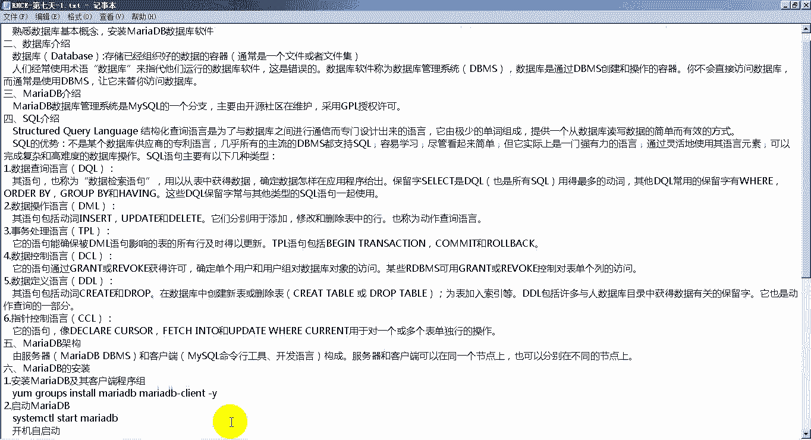

我们通过SQL（Structured Query Language，结构化查询语言）语句来操作数据库。SQL是一种为数据库通信设计的语言，由极少的单词组成，通用性强。SQL语句主要分为以下六种类型：

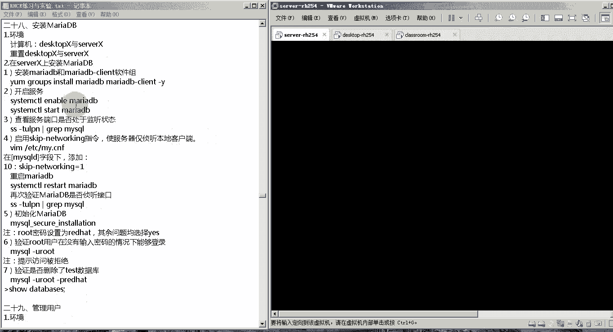

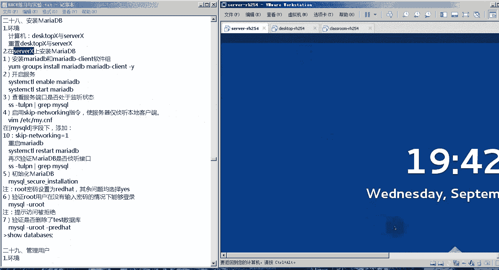

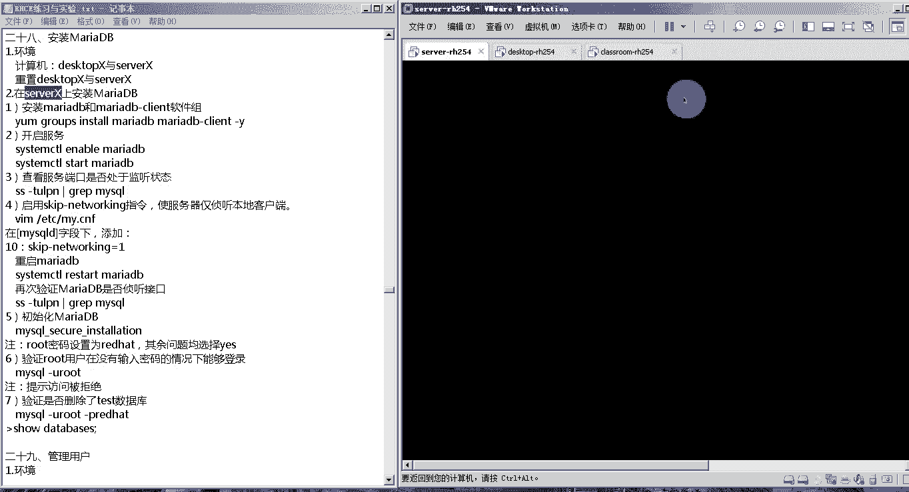

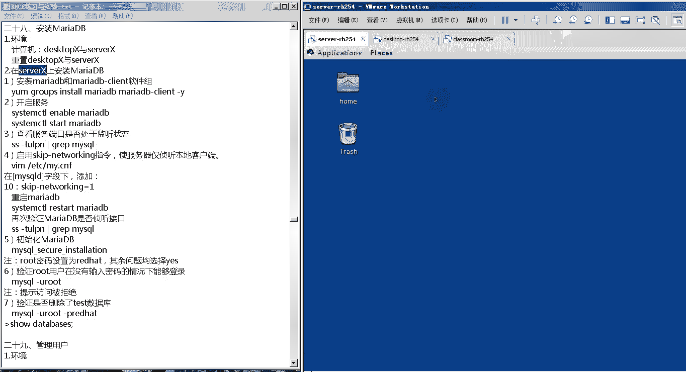

以下是SQL语句的主要类型：

1.  **数据查询语言（DQL）**：用于从表中检索数据。关键字是 `SELECT`，常与 `WHERE`、`ORDER BY`、`GROUP BY`、`HAVING` 等子句配合使用。
2.  **数据操作语言（DML）**：用于对表中的数据进行增、删、改操作。关键字包括 `INSERT`、`UPDATE`、`DELETE`。
3.  **事务处理语言（TPL）**：用于管理事务。事务具有ACID属性，确保数据的一致性。关键字包括 `BEGIN TRANSACTION`、`COMMIT`、`ROLLBACK`。
4.  **数据控制语言（DCL）**：用于控制用户对数据库的访问权限。关键字包括 `GRANT`、`REVOKE`。
5.  **数据定义语言（DDL）**：用于创建和删除数据库、表等对象。关键字包括 `CREATE`、`DROP`。
6.  **指针控制语言（CCL）**：用于控制指针，遍历和提取表中的数据。关键字包括 `DECLARE CURSOR`、`FETCH`。

本课程将重点涉及DQL、DML、DCL和DDL。

## MariaDB架构与安装

MariaDB采用客户端-服务器（C/S）架构。服务器和客户端可以部署在同一台机器上，也可以部署在不同的机器上。

在Red Hat系统中，可以使用以下命令安装MariaDB服务器和客户端：

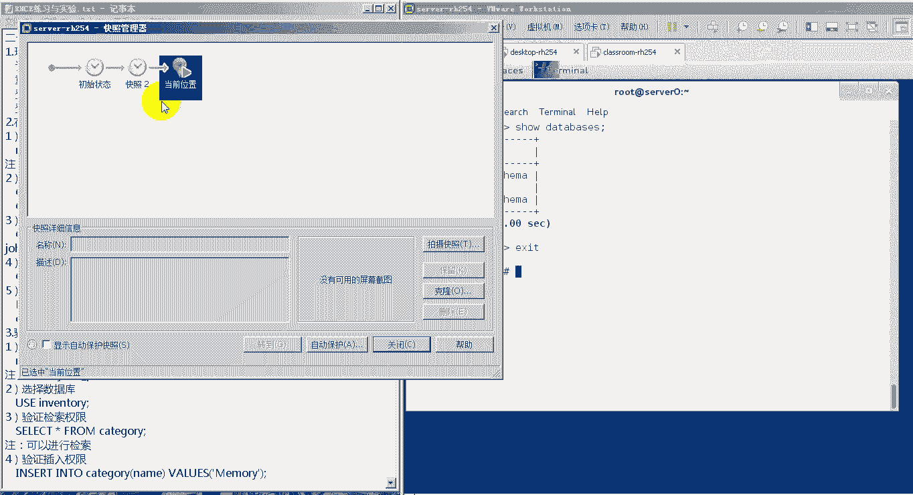

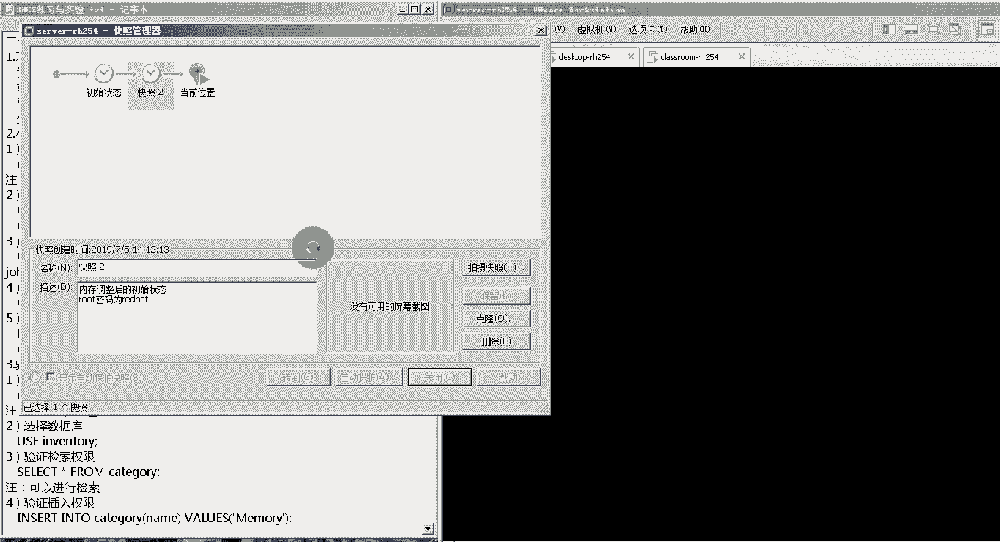

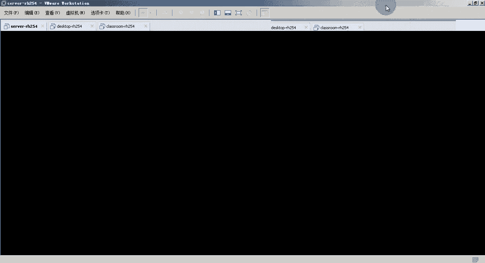

```bash
yum groups install mariadb mariadb-client -y
```

安装完成后，启动服务并设置为开机自启：

```bash
systemctl start mariadb
systemctl enable mariadb
```

可以通过以下命令检查服务状态：

```bash
systemctl status mariadb
# 或通过端口检查
ss -tulpn | grep :3306
```

MariaDB默认使用TCP 3306端口。

## 初始化MariaDB

安装后需要进行初始化，运行以下命令：

```bash
mysql_secure_installation
```

此命令会启动一个交互式向导，引导你完成以下安全设置：
*   设置root用户密码。
*   移除匿名用户。
*   禁止root用户远程登录。
*   删除测试数据库（`test`）。
*   重新加载权限表。

## 连接MariaDB

使用客户端连接数据库的命令如下：

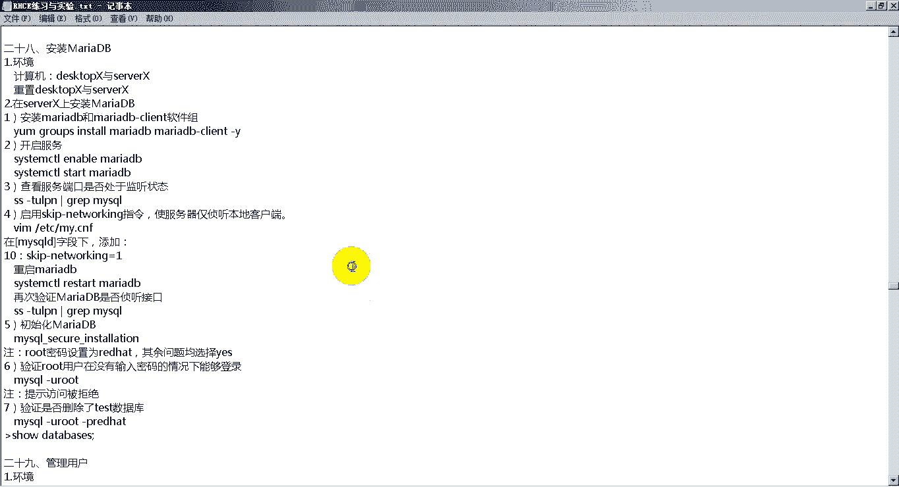

```bash
mysql -u [用户名] -p[密码] [数据库名]
```

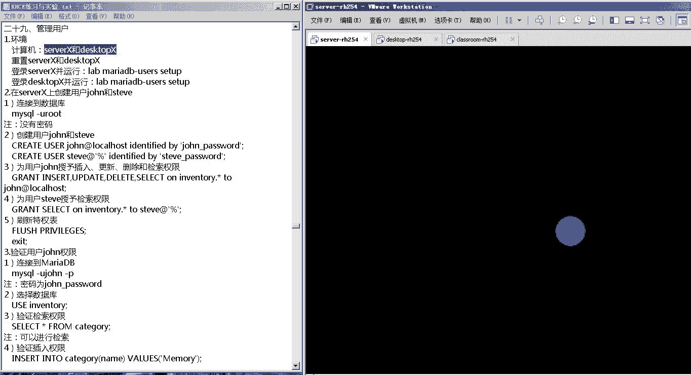


例如，使用root用户登录：

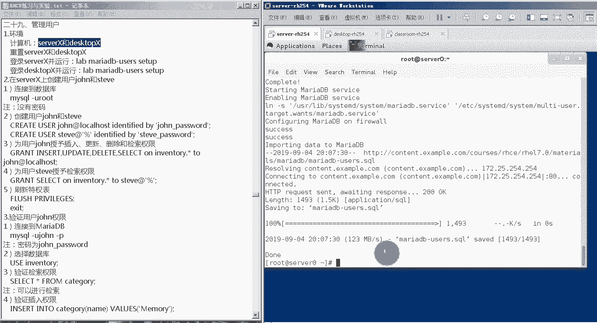

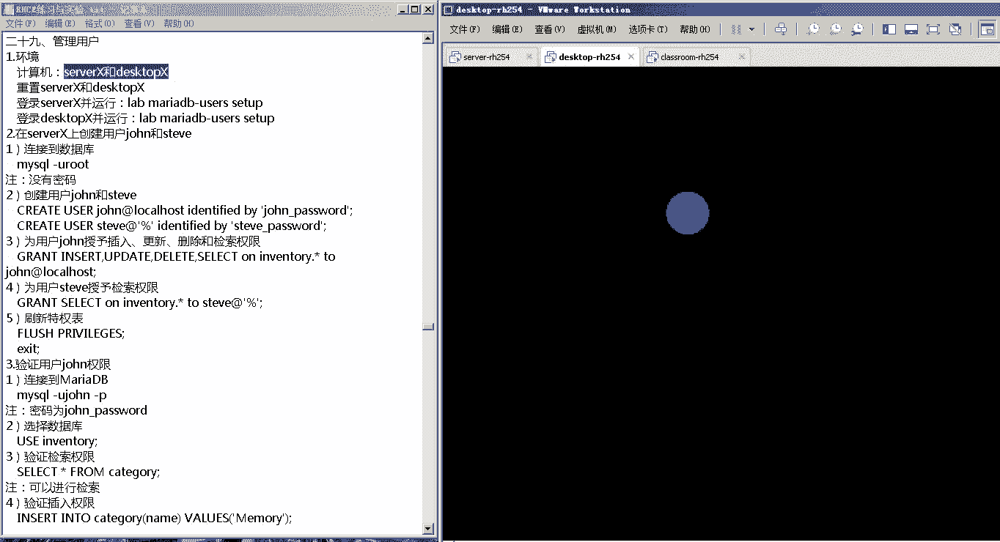

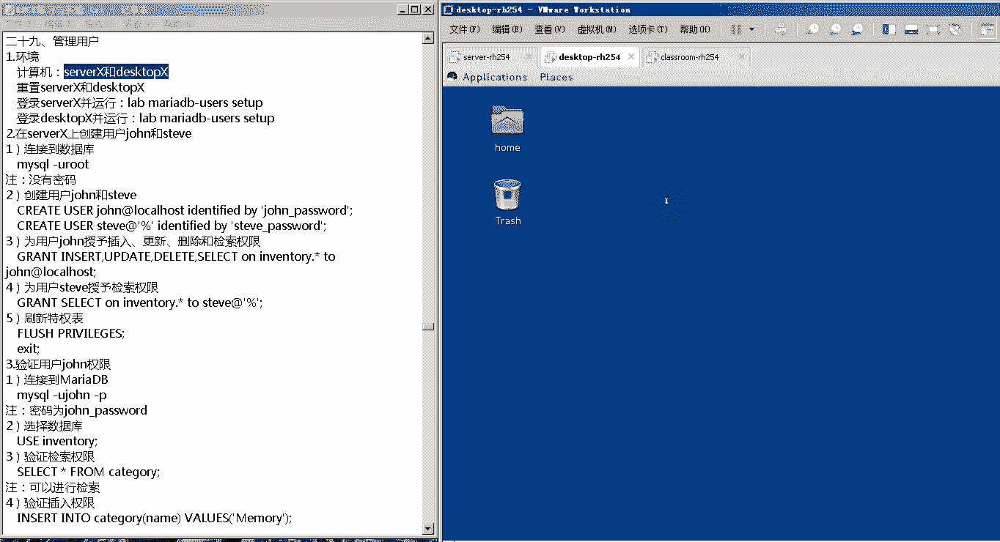

```bash
mysql -u root -p
```

## 数据库文件位置

了解MariaDB相关文件的位置有助于管理：
*   配置文件目录：`/etc/my.cnf.d/`
*   主配置文件：`/etc/my.cnf`
*   数据库文件：`/var/lib/mysql/`
*   日志文件：`/var/log/mariadb/`

---

上一节我们介绍了MariaDB的基础概念和安装，本节中我们来看看如何对数据库和其中的数据进行操作。

## 数据库操作

对数据库本身的操作主要包括查看、创建、使用和删除。

以下是数据库的基本操作命令：

*   **查看所有数据库**：`SHOW DATABASES;`
*   **使用某个数据库**：`USE [数据库名];`
*   **查看当前数据库中的所有表**：`SHOW TABLES;`
*   **查看表结构**：`DESCRIBE [表名];` 或 `DESC [表名];`
*   **创建数据库**：`CREATE DATABASE [数据库名];`
*   **删除数据库**：`DROP DATABASE [数据库名];`

**注意**：SQL语句以分号 `;` 结尾。关键字通常大写，但MariaDB不区分大小写。

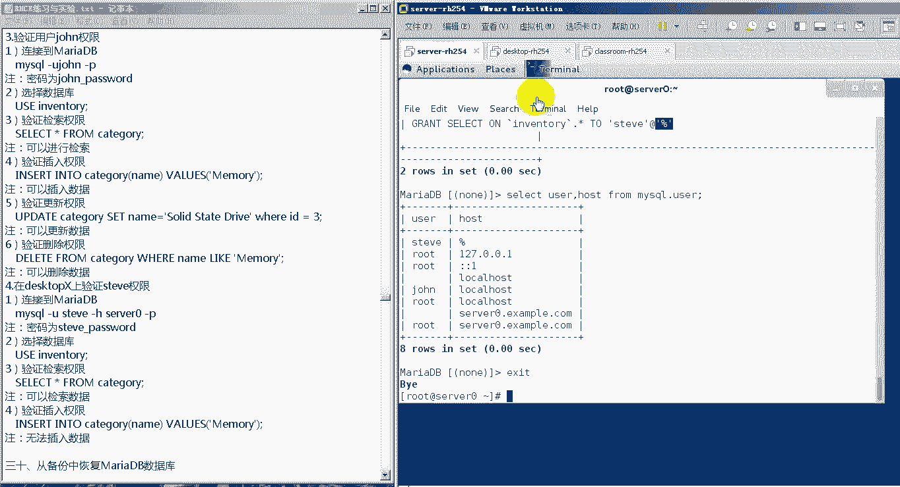

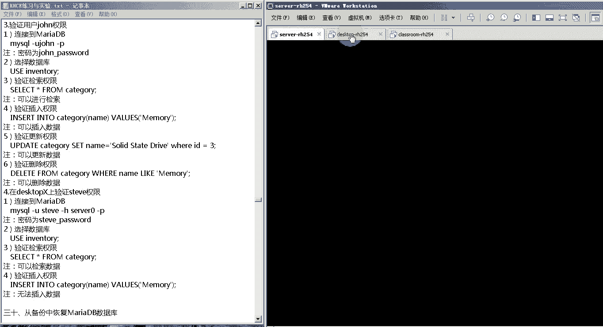

## 表中数据的操作（增删改查）

对表中数据的操作即我们常说的“增删改查”（CRUD）。

以下是数据操作的基本命令：

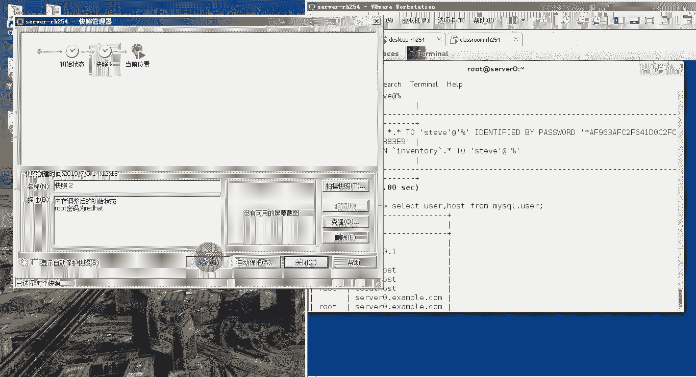

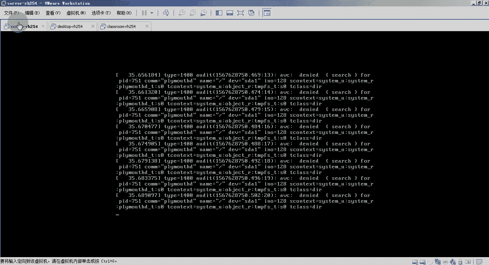

*   **插入数据（增）**：
    ```sql
    INSERT INTO [表名] (字段1， 字段2， ...) VALUES (‘值1’， ‘值2’， ...);
    ```
*   **更新数据（改）**：
    ```sql
    UPDATE [表名] SET 字段1=‘新值1’ WHERE 条件;
    ```
    **注意**：`WHERE` 子句用于指定更新哪一行，通常使用主键（能唯一标识一行的字段）来定位，如 `WHERE id=1`。不加 `WHERE` 条件会更新整个表。
*   **删除数据（删）**：
    ```sql
    DELETE FROM [表名] WHERE 条件;
    ```
    同样，不加 `WHERE` 条件会删除表中所有记录。快速清空表可以使用 `TRUNCATE TABLE [表名];`。
*   **查询数据（查）**：
    ```sql
    SELECT 字段1， 字段2 FROM [表名] WHERE 条件;
    ```
    查询所有字段可以使用 `SELECT * FROM [表名];`，但在生产环境中对大数据表慎用此命令，以免造成数据库负载过高。

---

掌握了数据库和数据的操作后，我们需要学习如何管理访问数据库的用户及其权限。

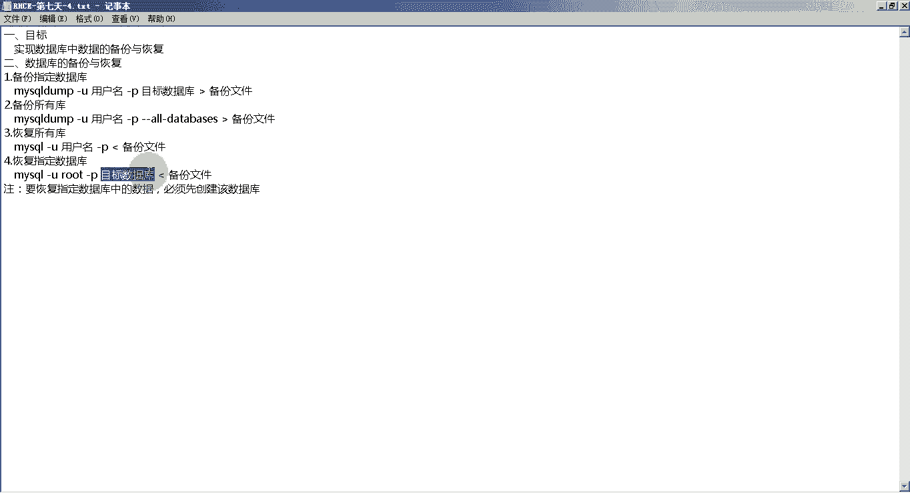

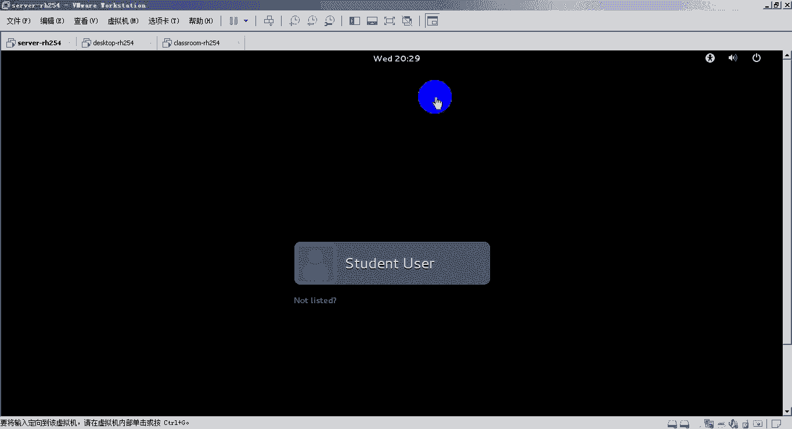

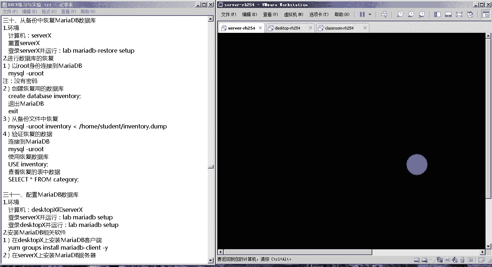

## 用户管理

用户信息存储在 `mysql` 数据库的 `user` 表中。

以下是用户管理的常用命令：

*   **查看所有用户**：
    ```sql
    SELECT user， host FROM mysql.user;
    ```
    其中 `host` 字段表示用户可以从哪台主机登录（`%` 代表任意主机，`localhost` 代表本机）。
*   **创建用户**：
    ```sql
    CREATE USER ‘用户名’@‘主机’ IDENTIFIED BY ‘密码’;
    ```
    例如，`CREATE USER ‘john’@‘localhost’ IDENTIFIED BY ‘password’;`
*   **重命名用户**：`RENAME USER ‘旧用户名’@‘主机’ TO ‘新用户名’@‘主机’;`
*   **修改用户密码**：`SET PASSWORD FOR ‘用户名’@‘主机’ = PASSWORD(‘新密码’);`
*   **删除用户**：`DROP USER ‘用户名’@‘主机’;`

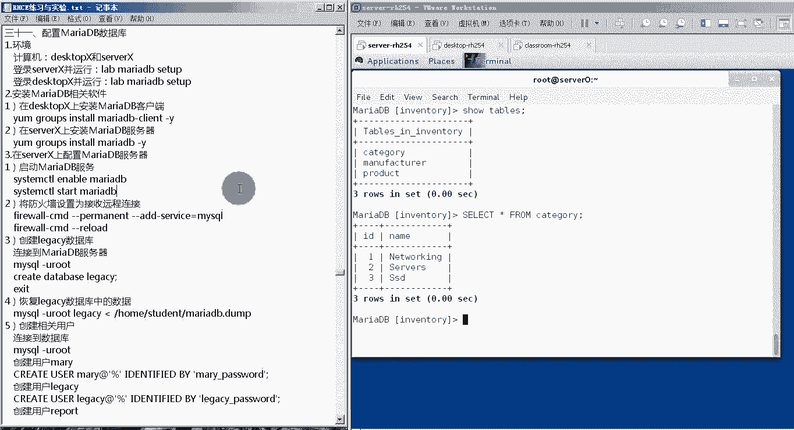

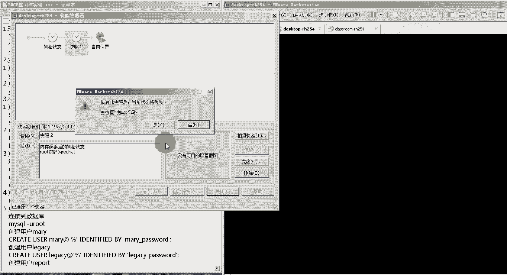

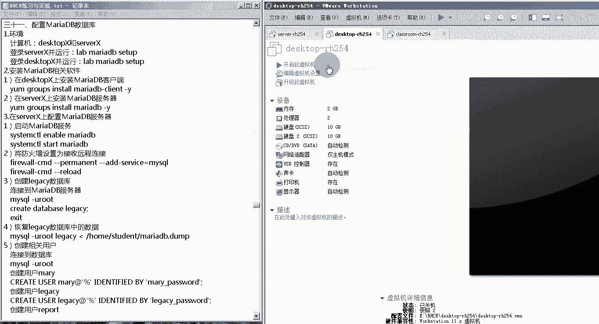

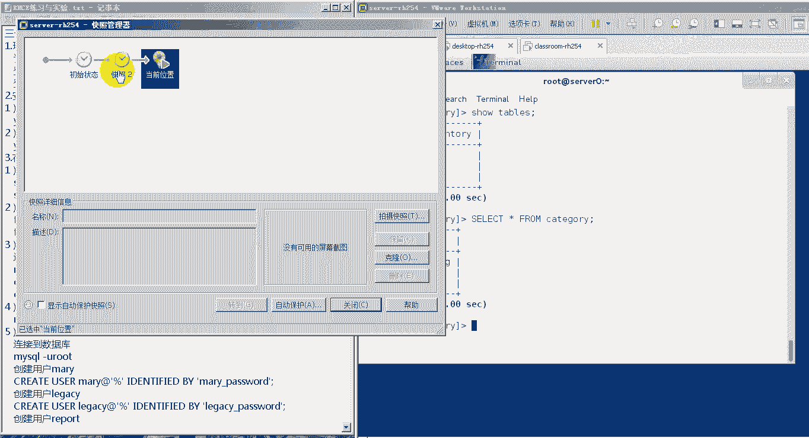

## 权限管理

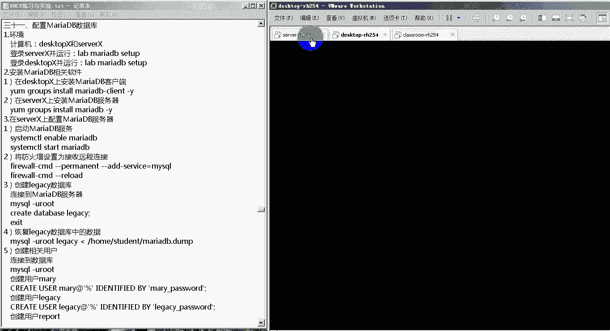

权限管理是数据库安全的重要环节。

以下是权限管理的常用命令：

*   **查看用户权限**：`SHOW GRANTS FOR ‘用户名’@‘主机’;`
*   **授予权限**：
    ```sql
    GRANT 权限 ON 数据库.表 TO ‘用户名’@‘主机’;
    ```
    例如，授予 `john` 用户对 `inventory` 数据库所有表的查询、插入、更新、删除权限：
    ```sql
    GRANT SELECT， INSERT， UPDATE， DELETE ON inventory.* TO ‘john’@‘localhost’;
    ```
    授予所有权限使用 `ALL PRIVILEGES`。
*   **撤销权限**：
    ```sql
    REVOKE 权限 ON 数据库.表 FROM ‘用户名’@‘主机’;
    ```
*   **刷新权限**：修改权限后，需要执行 `FLUSH PRIVILEGES;` 使更改立即生效。

---

最后，我们来学习如何备份和恢复数据库，这是防止数据丢失的关键技能。

## 数据备份与恢复

备份的目的是在数据丢失或损坏时能够恢复。

以下是备份与恢复的常用命令：

*   **备份单个数据库**：
    ```bash
    mysqldump -u [用户名] -p[密码] [数据库名] > 备份文件.sql
    ```
*   **备份所有数据库**：
    ```bash
    mysqldump -u [用户名] -p[密码] --all-databases > 备份文件.sql
    ```
*   **恢复所有数据库**：
    ```bash
    mysql -u [用户名] -p[密码] < 备份文件.sql
    ```
*   **恢复单个数据库**：
    ```bash
    mysql -u [用户名] -p[密码] [数据库名] < 备份文件.sql
    ```
    **注意**：恢复单个数据库前，**目标数据库必须已存在**。如果不存在，需要先用 `CREATE DATABASE` 命令创建。

---

本节课中我们一起学习了MariaDB数据库从安装、配置到日常管理维护的全过程。核心内容包括：
1.  理解了数据库（DB）与数据库管理系统（DBMS）的区别。
2.  掌握了MariaDB的安装、初始化及服务管理。
3.  学会了使用SQL语句进行数据库和表的创建、删除，以及对表中数据的增、删、改、查操作。
4.  掌握了数据库用户与权限的管理，能够创建用户并分配适当的权限。
5.  学会了使用 `mysqldump` 工具进行数据的备份与恢复。

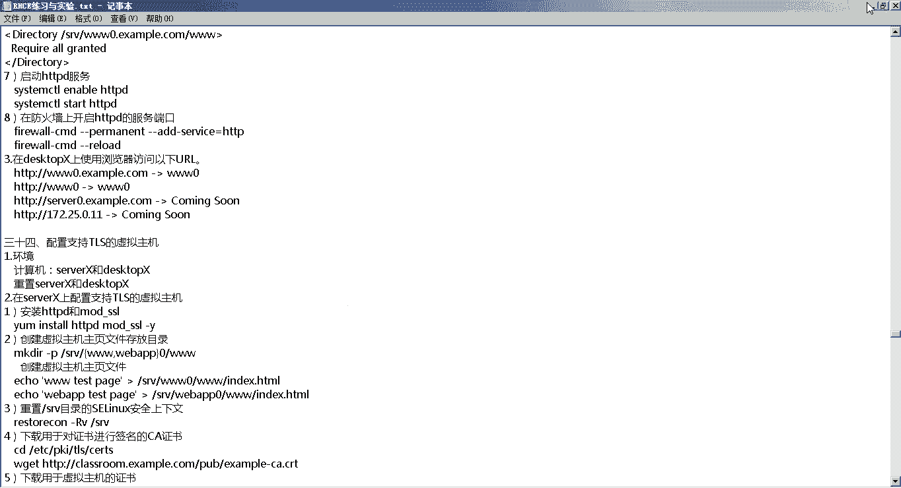

这些是RHCE认证中关于MariaDB管理的基础且重要的技能，请务必通过实践练习加以巩固。