# 红帽RHCE认证考试视频 - P8：RHCE-9 - 我是冷空气 - BV1th4y1X7cC

大家能看吗，如果能听见我说话的话，可以扣个一，大家能听见我说话吗，如果能听见我说话的话，然后那个进了群的同学的话，把那个自己的一个外观，好了，接下来就开始我们今天的课程，今天是我们这个21年的第四篇。

那接下来我们来看一下这个技术，第一节内容是我们要了解一下这个shell shell，因为我们第九天整个的这个内容就是shell和shell，脚本的使用，那第一节就是了解一下什么叫做shell。

以及shell的相关文件，还有及其功能，那什么是shell shell实际上是linux的一个命令解释器啊，用户输入的命令，通过shell解析为内核能够处理的代码，然后用内核来驱动一点工作。

我们也可以将一系列的命令写入到一个文件，然后通过执行该文件，来达到批量执行命令的功能，用来简化工作流程，那我们这个文件通常称为shell脚本啊，一般是一点ac这个s h结尾。

也就是说shell它是一个什么东西呢，它是一个命令解释器，我们画一个图来给大家解释一下，是这样的，这个底层是我们的硬件设备，叫做server，硬件设备啊，but well。

然后我们在上面安装了我们这个操作系统的，操作系统，那它就有一层操作系统的内核，这是我们做的比较，然后在坑上上一层就是我们这个用户了，当我们用户输入一个命令的时候，注意当我们用户输入一个命令的时候啊。

比如说我们输入一个什么l s啊，或者是其他的命令，或者是其他的命令，这个命令我们的内核它是识别不了的，如果用户直接输入的命令的内核是识别不了，那可是实力不佳，所以在我们这个用户。

还有我们的内核之间有一个shell shell，这个shell它作为一个什么呢，作为一个命令解释器，他可以把我们这个命令，它可以把我们的这个命令给翻译成我们内核，能够把它翻译成识别的代码。

然后内核在执行这些代码，来驱动下方的这些规定啊，你说这个就是这样这样，那我们可以把一系列命令引入到一个文件里，一系列背面还是上一次的这个文件里面，就是一系列能量，00d。

然后通过执行这个文件来批量执行里面的命令，这样可以简化我们这个工作流程，那这个文件我们把它叫做shell脚本，这个就是我们这样好了，那我们linux驾驶也会是哪一个shell呢，注意linux下是什么。

shell，是并列的80，也就是说linux下的这个minux线是必须的bus，那控制边界的bug，主要是通过以下这些文件来控制的，第一个叫做etc profile，它主要是设置你用户的工作环境。

第二个叫etc的80r c，它是设置你系统方面的这些个功能函数，以及别名等等，然后在我们用户的家目录也会有三个文件啊，注意这是在用户的加入中，一个是点bus profile，设置个人环境变量文件。

点burc，设置个人的相关功能函数，以及命令变量和点80杠log，一个是用户推出80shell的时候，就会执行这个文件，那这五个文件之间的关系是怎么样的，是这样的。

我们的e t c l的profile还是etcl的88c，这个是系统环境变量，可能明显是对所有用户等功效的，然后在你用户家目录下边的这三个文件，叫做个人环境变量配置文件，他们仅对你的这个当前用户的生效。

那如果是系统环境变量里边设置的内容，但是个人环境变量配置文件里面没有设置的话，那就遵从于我们这个系统环境变量配置文件，但是如果两个都有的话，并且设置的不一致的话，那我们要遵从这个人环节。

这个就是我们的这个shell的控制文件啊，就是这五个，这个一会儿我们可以通过一个实验来看一下，这个文件是如何引用的，第四个就是这个share的类型啊。

shell我们经常把它分成一个登录share和非登录上，什么叫登录这样的就是你在使用这个shell之前，就获取你的输入命令的这个shell环境之前，需要提供用户密码，密码登录之后才能进行下。

那我们一般登录到linux系统的时候，都要输入它对应没有互联和密码，所以你开启的都是灯组线，那什么叫非登录权，就是你用户名啊，不需要输入用户名和密码就可以直接开启的事。

比如说我们这个运行一个命令叫bug，这个bug就是用来打开一个新的非登录，在这个新的非登录shell里面，我们就不需要输入用户密码就直接打开了，第三个是share的退出，share的退出有这两种方式。

第一个就是执行e s i t命令，e x t它会推出一个share，第二个就是执行这个log out，他会推出一个登录share，但是这个logout命令，他只能突出那种登录才能进入的shell啊。

这是非登录shell，它是进入不了的，第四个就是我们说的这个注意啊，对于bug来说，这个登录share啊，它会首先读取e d c的profile，然后依次查找你用户。

那这些个人环境变量包括这个点bus profile，点bus logi，点profile这三个，但是在非的motel里面，它只会读取灵魂加目前的这个点burc文件，但是不同的linux发行版里面。

这个是对于登录shell和非登录shell的时候，所读取的文件是不一样的，第五个叫做命运的别名啊，命令别名就是我们可以对系统性令来设置别名，那首先在设置别名之前，你得先会查看我的系统有哪些命令的命名。

这个我们用的命令去做as allize，这个命令本身就是别名的意思，本身就是病，第二个是设置命令别名，设置命令别离谱，我们用alex后面加上你要设置的别名，然后等于单引号引起来，右边是你的目标命令。

就是为哪个命令设置这个变，如果你想取消这个命令别名的话，那就是on alex会这是命令的命令，我们后边也有实验，有实验可以看一下这个命令命令，第六个就是系统环境变量，在我们的系统里边有一些系统环境变量。

这些系统环境变量它跟我们普通变量一样，里边是存储一些值，这些值可以控制我们当前使用的这个shell环境啊，环境变量中存储的值可以控制用户的工作环境，如果想查看所有的系统环境变量。

我们只要求这个东西就是e n v，因为实际上就是这个环境那个英文单词前三个，首字母，前三个数字，那常用的环境变量有哪些呢，比如说这个p s1 ，它是你一个命令提示符的一个格式，pass啊。

这是比较有用的，是你命令搜索都进不term，这个是我当前的这个动作类型以及language啊，这个是我，那如果我们想设置我们当前的系统环境的话，你可以通过设置系统变量的这种方式来实现。

那怎么设置系统环境变量呢，只需要对它进行重新复制，并且使用这个export这个命令把它导出来就行了，当然我们也可以在系统环境变量配置文件中，设置它们，比如说举个例子。

我们可以在你用户加入下的点bug r c里边，设置你的自定义变量，比什么java home啊，以及它的路径，然后export java后，再用source执行你的这个文件，这样的话就能让别的，好了。

这就是我们给大家介绍的一个shell的基本内容啊，首先你知道shell是一个命令解释器，可以把多个命令写到一个文件给批量执行，这个叫做市场调本，第二个它的控制文件，两个系统环境变量的基建。

三个个人才怎么样，第三个就是这个share的类型，登录shell和非登录shell，第四个就是我们可以对系统命令设置别名，既可以查看，也可以设置里面还可以取消，第五个就是我们可以通过修改。

系统环境变量里的值来设置我们当前的好了，那接下来我们就通过几个实验。

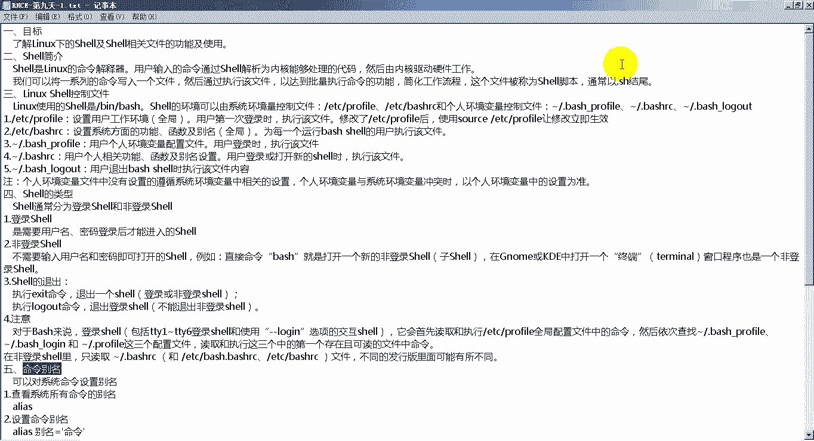

来看一下我们的这些，好了来到我们的这个第41个实验啊，第41个实验，我们的这个实验总个数是44个啊，44个，但是啊我第一天给大家发的那个实验文档里边，可能只有42个40，后来又填充了两个填充的这两个。

一会儿我会把它再重新发动，我去给大家接收一下就行了，大家接收一下，然后在这个之前有几个特别复杂的shell脚本，这个因为我们考试的时候压根用不到，所以这块我不会给大家介绍了。

我们只介绍我们这个考试的时候，这个跟考题贴近比较近的，这个实验效果就可以了好了，那我们先看我们这个第41个就是使用登录，share和非，首先这个环境，实验环境需要用到我们这个server x嗯。

用到的文件包括etc的profile，tci的burr c，还有用户加木材的点file啊，这个还有点80r c啊，这个只需要一台服务器就行了，所以我们开启我们这个surrx。

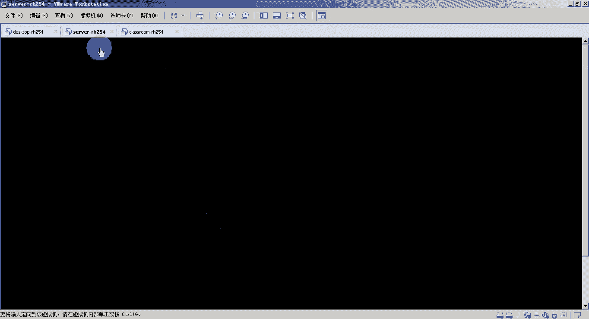

首先将sx重置，这个我们已经重复过了，然后我们直接登录。

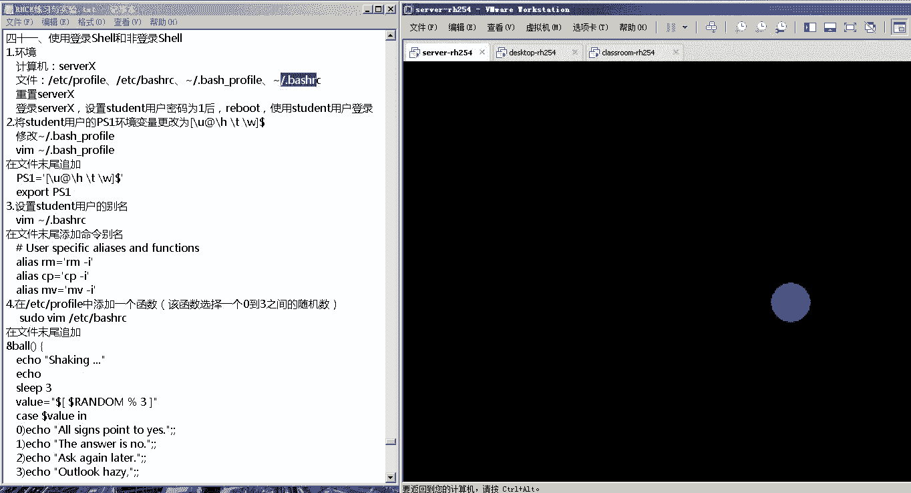

好已经进来了，进来了之后啊，我们设置我们的这个students这个用户的密码啊，那我们来设置一个密码，password，student，我把它的密码改一下，改成你记住的对象，不会把它改成一。

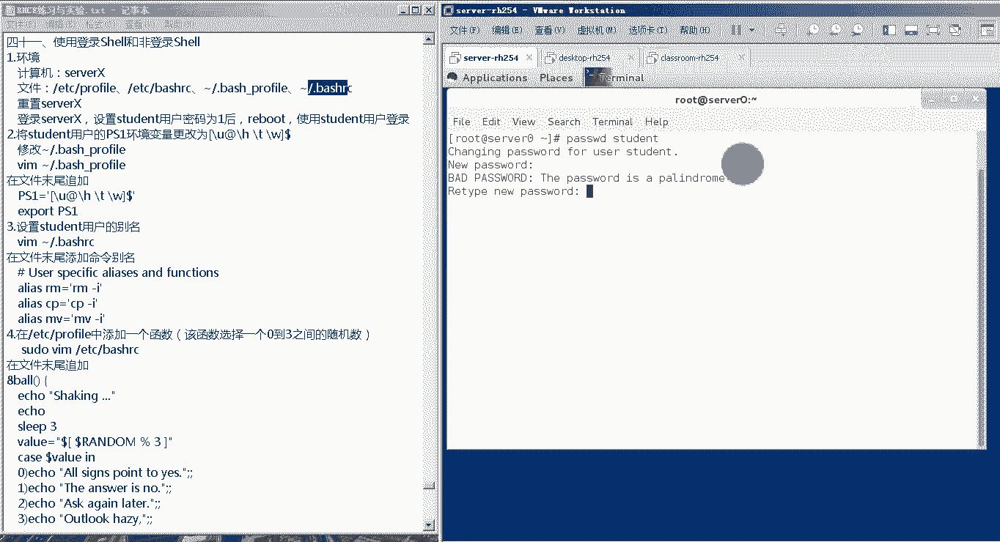

然后我们recording，啊，然后我们登录一下，我们使用这个student，把密码是我们可以重新设置密码。

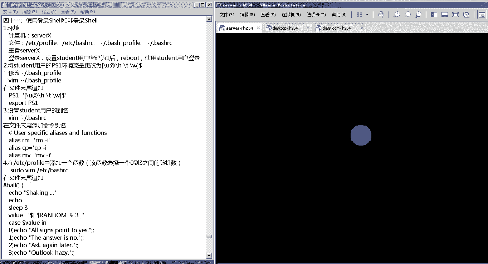

登录了之后啊，我们来设置一下它的这个p s一这个环境变量，首先我们右键桌面打开一个重宽，在终端里面看一下我当前的工作路径，可以看到是根接到home下的student，也就是说用户的加入之后。

我ios杠a来看一下当前目录下的文件，注意啊，这很多环境变量文件它都是一点开头的，所以说它是一个隐藏文件，那我们l s k这个l s杠a之后，我们看到啊，在我当前这个用户的角度下。

有一个点80杠profile，那我们就要修改一下这个文件vm，这个点80杠profile，80多分，然后在这个文件的末尾追加追加，叫做p s1 ，p s1 ，我刚才给大家介绍的是。

控制你这个系统的命令提示符的一个环境变量，我们对这个环境变量进行重新赋值，比如说杠九杠h，w，大家注意，这里的这个杠u，就是显示你当前的这个灯的用户名，i的，还是我们这个at杠h。

显示的是你的这个当前登录的主机，杠t是系统时间杠w是你的这个当前工作路线，然后如果你让它生效的话，把它得把它导出c，对w之光你说就行了，注意当前他还没有升票，如果生票的话，我们前面的这个命题。

然后我们为我们的这个student用户，设置一个别名啊，设置一个命令页面，那是编辑我们这个当前用户加目录下啊，因为我本身就在用户家目录下，有一个点20r c文件。

还是在这个文件的末尾添加这么一个和less，rm等于rm，就是我们定义的一个别名叫rm，当你输入rm的时候，实际上输的是rm，刚，也就是说当我们输入coffee的时候。

实际上运行的是coffee档案这个东西，然后li，mv等于mv，好了，最后我们还在它的系统环境变量里边，来设置一个函数啊，设置一个小函数啊，那我们现在是student用户的身份啊。

不是root用户的身份，所以你如果想修改系统环境这配置文件的话，得加速度才行啊，就是速度会啊，直接大a让你输入student用户的密码，输入进来了，输进来了之后打开了这个，我们在下边追加一个函数啊。

这个8号啊，这个是函数，然后大括号大括号里边是函数的内容，这个函数的内容都有什么呢，首先echo一个，就是摇的意思，放一个a之后，echo，三lip 3就是让我们系统休眠三秒，就是执行这个输出了。

shin之后，我们就会进行三秒，value等于双引号dollar，单引号啊啊这个中括号，然后dollar random，百分号三这个random百分号三会从0~3啊，里边选出一个随机数，就是0123。

这个时候我们进了一个条件判断，叫kidol value 1，k dollar value一如果选出的这个数是零的话，那么我们输出一个比，all inside，oh yes，如果出的是一的话。

那么我就要输出一个，the answer，is，如果输出的是二的话，我会输出一个ask p，如果输出的值是三的话，out look hy，然后在啊这个是kiss这个的格式，如果我们再开口一个风格诶。

这个小脚本就写完了，这个脚本实际上是什么，实际上就是生成一个0~3的随机数，生成的这个数是零的时候，它就会显示第一条内容就是of things to yes，如果选出的这个数是一的话。

那它那它就会输出在answer is no，如果你在这输出的数是二的话，那就输出一个ask again later，如果输出这个数是三的话，它就会输出一个up。

之后我们还是ssh通过student的地方做再来登录，是否接受中药是输入它的密码一诶，这个时候我们就发现了一个改变，我们之前在我们的这个个人环境变量配置文件，也就是这个用户加入小点80c里边。

设置的p s1 ，这个环境变量就升值了啊，它就生效了，这个第一个环境变量就生效了，可以看到我当前的这个命令其实不变成了，这个杠u代表你的这个用户，student at还是在哪里登录啊。

所以说还是at杠就是你当前登录的主机名啊，叫server 0杠t多了一个时间杠，w当前用作他所在的录，所以说第一个就已经撤销，一个就已经撤销了，然后我们它是一个文件啊。

比如说它是一个fae之后rm f一诶，你看他会提示我说是否删除了一个收益网页了，这就ok了，这代表什么呢，代表我们在我们的这个刚才用户家目录下的，这个点bug r c文件里边设置的命令别名。

又是这个rm这个命令别名13，当我敲rm的时候，实际上他输出的是rm杠i，所以他说才会问我是否要删除这个啊，是否要删除，这，如果我在这直接运行一个，我们那个刚才设置的函数名啊，叫做bub诶，可以看到啊。

他先吃一瓶，然后过三秒钟，最后选出一个值，然后选出的这个值应该是二，所以他就复出了一个说ask again，这样的话，就代表我们在我们这个bp c下的80r c里面，设置的这个函数，也这样的话。

我们这个实验，所以说这个实验主要是这个给大家演示一下，就是我的这些个系统环境量文件和个人环境量，这个文件里面的东西啊，你通过修改这里边的这些个系统环境变量啊，可以设置你到点的这个系统一个小实验好了啊。

这就是我们今天的第一个小实验啊，然后紧接着我们来看一下第二个小实验，因为第二个小实验也是设置，我们，啊那做这个实验之前还是我们需要的环境，还是这个server x，所以我们把这个server x。

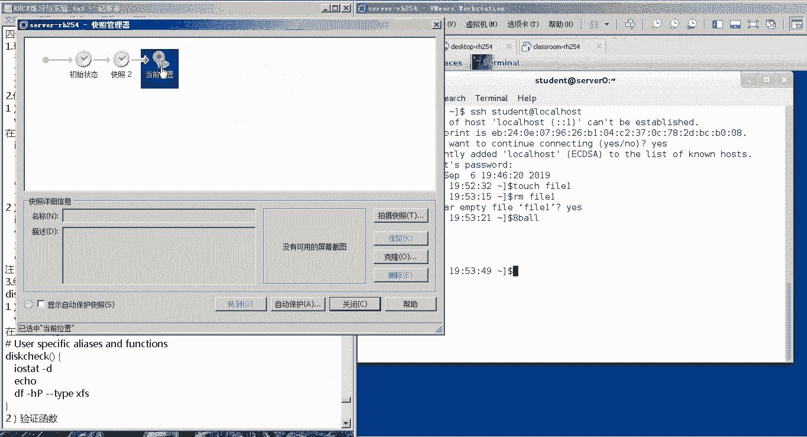

好了，我们系统已经重置完毕了，我们接下来登录一下这个student用户。

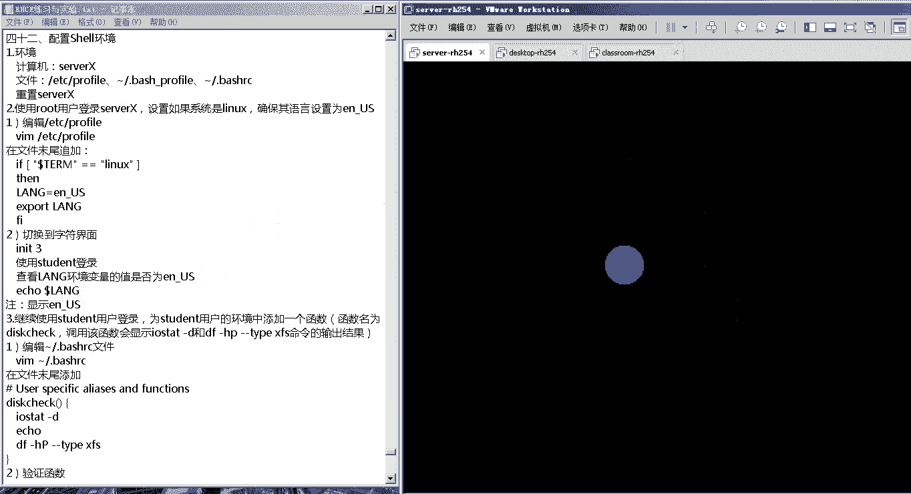

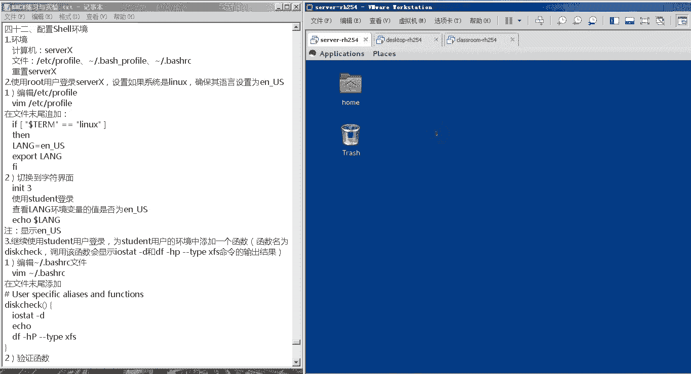

啊我当年是用student，好吧，那我们一会儿这个实验需要用到root就行，所以我先修一下，可以看到我的用户名啊，这是这样好，我们看一下我们这个实验他需要的要求，他说使用mod用户登录时候x啊。

我现在已经登录了，如果你的系统终端是linux类型的话，要确保它的语言设置为这个e n u s，那我们如何来设置呢，这个我们来通过我们的这个系统环境变量，我们展示在etc下载一个profile。

我们来到profile的最后一行，在最后一行部位来追加if，dollar这个term，这个我们之前跟大家伙解释了这个term，这个是当前的终端，这个终端指的是什么呢。

就是我们linux可以同时打开多个终端，比如说你按这个alt加f1 f2 f3 f4 就可以，然后这个dollar term就代表你这个终端它的值，它值，这个我们可以先开一个终端给大家看一下。

我当前的这个，可以看到我当前的这个终端类型叫做xterm杠，256color，比如说当前争端的类型并不是这个linux，然后我们这个要求就是，如果这个term的类型时间那个字话。

那一定要保证它的语言是1n u s啊，那我们看下我们这的这个语言是不是打怪，开口一个door lo，这个long就是language的意思，language dollar law就是显示他的这个环境。

联想到现在是1n杠六点u好了，那我们在这里继续选择小本啊，if等于，这句话是什么意思呢，就是说如果你的这个term term，这个第二列的值是linux的法，那么我们执行什么呢。

the language等于1n代号，我们就对language环境变量重新赋值，让它等于零到u s，然后我们在port导出这个language这个环境变量，那这样的话就能生效了，然后if开头s结尾。

哎这样的话这个脚本设置完成了，脚本设置完成了，设置完成了之后，这个注意啊，我们要得保证它在什么环境下才能测试呢，就是我们刚才说的这个，它的这个term类型具体是linux，但是刚才我们已经给大家伙看了。

我在图形化界面下，它并不是，所以切换到字符界面，就是比一比三，或者用我们这里一张纸一样啊。

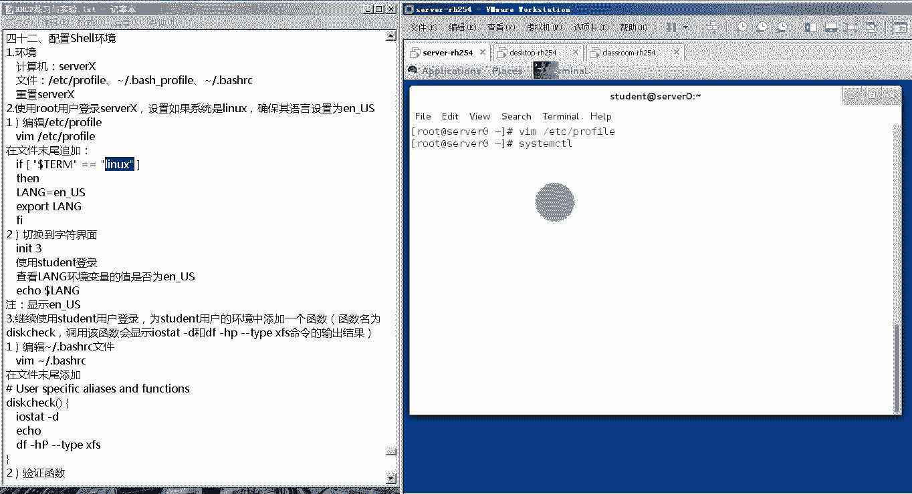

sm c t r i s o late multi user d，诶现在我们还是登录我们，它的密码验证记录好，登录有了之后，我们echo一个，我们echo一个dollar term。

看一下我当前的重量类型，诶，这个时候这个那我eq一下dollar pro，可以看到这个dodo上到，这，就代表我们刚才在环境变量里边，最值的这个内容就取消了，也就是当你的firm是理想的时候。

你的这个烂位置，它里边的值就是一，好了，这是我们的这个第二个小题啊，第二小题让我们看第三个小题，继续使用这个student用户，登录为student用户的环境，并添加一个函数。

这个函数的名字叫做disk check，就这啊当调用该函数的时候，它会显示ion state杠d这个命令，以及df杠hp杠杠，cap x f s这个命令的输出结果，那我们还是同样通过他的这个人环境变量。

来控制它pv，我当前的这个工作路径，就在student这个用户加目录啊，在项目前可以看到有一个点80r c，2。88c的这么一个文件，那现在我就编辑一下这个点80r c，在这个文件的末尾。

我们来设置第三层check，就是函数名，用括号括起来，代表它是一个，然后后边跟上一个大括号，大括号里面是这个函数的内容，这个函数的内容是什么呢，io state，杠b这个能用的输出结果。

第一我们echo echo，这样的话就会有一个空格，然后df杠h杠杠tap x，这样的话就是这点红利的数字，结果上了呢，接下来要w q保存退出，修改了这个环境变量文件，如何让它生效呢。

只要source这个病就行了，source加上第二，这样的话，你刚才在这个文件编辑的内容就可以上票了，那我们来验证一下，看能否出线，我直接调用这个函数而已，诶可以看到这两个命令的输出结果啊。

上面就是我们这个i o state这个命令的输出结果，然后echo输出了一行空格，输出一行空格把它隔开，然后下边就是df杠小h大b刚刚开播x fs，这就代表我们这个函数也成功了，运行了好了。

接下来到最后一个，第四个就是将student用户的环境变量，java home设置成user下的lib下的gbm，那同样我们设置的是student，这个用户的个人环境变量配置文件。

所以我p w b看一下我当前的工作路径，可以看到我本身就在跟前的home下的student，然后我ios杠a看一下，可以看到我这里的个人环境变量配置文件，点80杠profile，我们编辑一下这个点80。

然后在文件的末尾设置这个环境变量，叫做java下划线，home等于哪呢，等于user下的lib下的jdi，然后让它生效，export jav，之后编辑的这个变量文件之后，source的这个变量不变的。

好了，然后我们开启一个the shell，开启shell直接运行bug就行了，之后我们echo一下，我们的这个正好玩，环境变量诶，可以看到正是我们刚才在我们用户加入下的。

点bus杠profile里面设置的这个变量的值好了，那这两个实验就是我们这个shell环境变量。

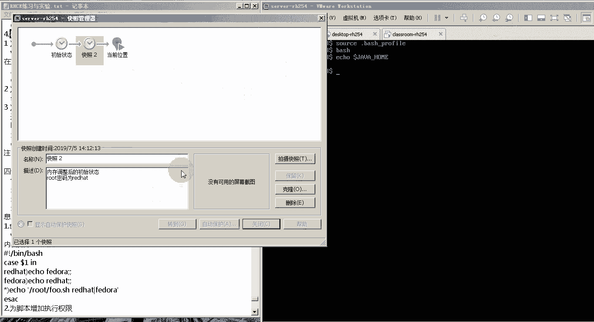

就这么一个呃这么一个实验，这个实验就是控制我们shell以及shell里面的变量，里面的值，来控制我们这个shell环境的这么一个实验。

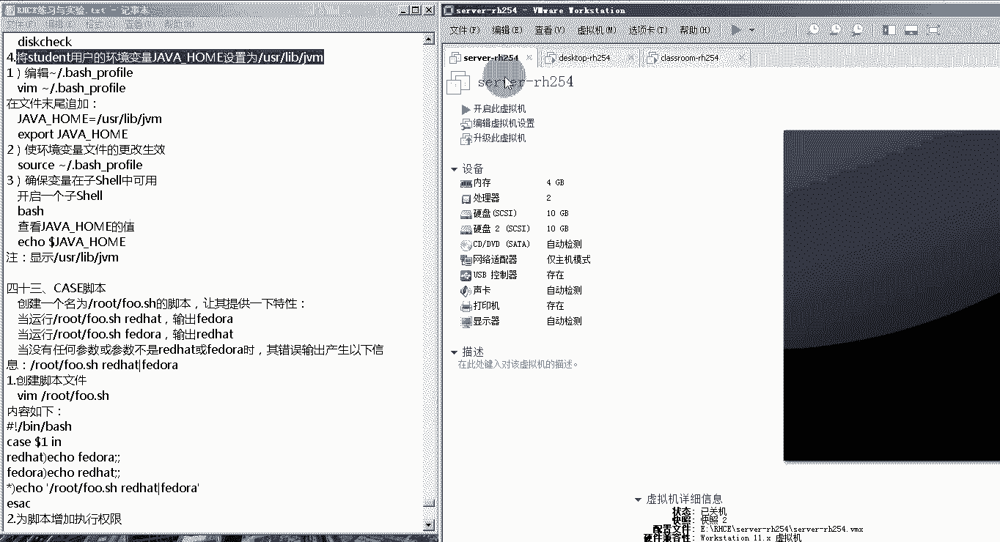

接下来我们把这个环境重置一下。

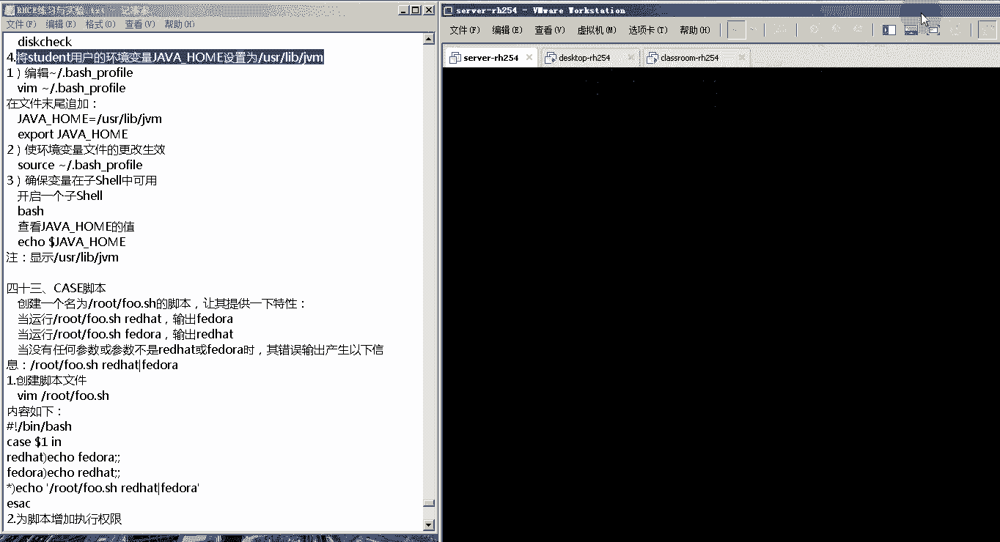

好重置一下，我们来看我们今天的第二节内容，诶这个是我这个有点卡是吗，可能是我网速的原因，这个声音大家能听见吗，可能是我网速的问题，是我网速的问题，因为今天没有用没有用，有线啊，好了。

那接下来我们来看一下，我们今天的第二部分的内容，第九天，第二部分的内容就比较多了啊，因为第二部分主要是编写shell脚本，编写shell脚本，啊可以看到这个内容比较多，那我们来看一下，首先第一个。

我们的目标就是可以使用流程控制语句，包括判断语句，循环语句等来编写shell脚本，并且能够配置用户的shell环境，能够比这一步能吓唬你，然后在编写shell脚本之前。

我们要清楚的是这个shell脚本啊，它需要用到什么呢，它需要用到这个正则表达式，以及字符管理的相关命令，所以在这儿我们首先来这个回顾一下啊，复习一下我们之前学过的这个正则表达式，以及字符管理命令。

在shell脚本里边最常用的，首先第一个就是grape，用来匹配指定文件中的关键字，它的这个格式就是grape后面加上关键字，后面再加上我们的目标文件，比如说这下面这个例子啊，匹配etc啊。

password中包函数的关键词啊，new grip后边按关键词root后边加上e t c加大word，在password，如果想嗯这个匹配e t c r password中。

以no login结尾的行的话，那就grab农罗归隐后面加上一个正则表达式，dollar，dollar这个正则表达式就是以什么什么结尾啊，以什么结尾，然后e t c下载password。

然后它还可以排除包含指定关键字的行，那就是grp杠v后面加上关键词，再加上目标文件，比如下面这个例子，说这个匹配etc password文件里面不包含root关键字行。

那就是把包含root关键字的这一行给你排除掉，就是grape gv root关键字啊，以及cr的发生关，另外它还可以统计，你包含这个关键字的这个行数啊，php就是统计函数的意思，后面加上关键词。

后面加上目标文件，比如说统计1t在password文件里边，以no login结尾的函数呢，就grab杠c no login，因为这里涉及到了以什么结尾，所以后面再加上这个结尾。

这个刀刃和中文表达式啊一起分享的password，这是第一个啊，grab grab应用这个用的特别广泛，第二个就是cut，cut是用来截取子列的，他的这个命令主要是把它的格式给记住就行了。

那就是cut down d来指定分隔符，当你指定完分隔符之后，你的一个文件通常会被划分成好多列，然后杠f来指定你截取的这些列中的哪一列，后面加上你对哪一个文件这个操作，比如说我们看下面这个例子啊。

以冒号为分隔符截取加pass文件中的第二列，那就是cut一冒号分隔符，那就杠d然后截取第二列，那就是杠f哪一个文件呢，etc下的password啊，这是第二cut截取，第三个最常用的命令是这个sd。

sd是对指定列按特定的规则排序啊，对指定的列按特定的规则排序，所以说他跟cut有一些比较相近的地方，就是你首先得按照某一种分隔符，把你的这个文件分隔成好多列，所以它的这个格式是salt杠t。

注意分隔符使用杠t指定的分隔符，然后杠k指定你的按哪一列来进行排序，或者再加上文件名，比如说我们下面这个例子，以冒号为分隔符，对应pc的password，这个文件里的第三列按数值排序，并且降序显示。

那就是salt杠t以什么作为分隔符呢，你冒号，所以这个是冒号，按照第几列进行排序的第三列，所以是杠k3 ，按照什么排序呢，按照数值排序，所以是杠n n就是number啊，数值的意思，降序排序。

降序排序就是大的值在上边，小的值在下边，那我们加一个参数，杠二啊，就是reverse的意思，反向啊，然后一起c下的，那如果不加杠杆的话，它默认的就是升序排序，就是小的在上面，大的在下边。

第四个是side side，我们用的最多的，就是对文件的内容进行匹配和替换啊，它的这个格式大家一定要记住是sgi这个参数，然后s杠，其中这个中间这个杠两边，一个是你要匹配的关键字。

右边是你要把你这个匹配的关键字，替换成的内容，后边再加上一个文件，其中前面这个s是替换的意思，即代表全部替换，举个例子，比如说将etc下的selinux configure。

文件中的第七行里边的enforcing改成disabled，就是sgi单引号第几行，第七行，所以是数字七空格代表对第七行进行操作，然后s你要把什么关键词进行替换呢，你boing。

所以后边加上你匹配的关键词与boing，然后杠替换为什么替换成b41 包的，所以后面加上你替换成了关键字，然后杠z代表全部替换1p c下的307，第五个叫做t r，t r是对字符进行转化的。

通常用来转化字符的大小写，比如说下面这个例子，说字符把字符从大写的转化为小写字符，那就是我们echo一个hello world，这样的话会向你的屏幕上输出一个hello world。

但是我加上一个管道图，我要对我输的结果进行处理，等着pr就是把你输出结果里边，从a到z的所有大写字符全部替换成小写的，a到z，从最终输出的就是个小写的word，这是pr。

第六个叫做t这个我们又把它叫做分叉命令，分叉命令它的主要功能是什么，是这样的，它可以将你指定命令的结果输出出来，并重定向到指定文件，比如说echo一个hello world，然后管道符。

那这样的话的结果就是，不仅会在你的屏幕上输出一个hello word，而且hello word，这个文件里的内容还会自动被重定向到，这个就是我们在shell脚本里边比较常用的，这几个正则表达式。

字符管理没电了，所以大家课下的时候，可照着我们的这个文件里面的这些内容，去试一试，这些例子都是经过测试的，都可以啊，看出效果，这个是我们第二个正则表达式，与我们的字符管理，第三个就是一个概念性的内容啊。

第三个就是概念性的，就是变量的赋值，变这个首先在介绍变量赋值之前，你得先介绍什么叫做变量，这个变量其实跟我们上一章说的，那个环境变量是一样的啊，它都是变量的变量，变量主要是用来存储某一个质的变量。

主要是随着某一个值的那对变量进行赋值，实际上就是指定你这个变量里面，存储的值是什么，那如何对变量进行赋值呢，我们用的是赋值运算符，也是这个等级号，他的这个方式就是前面声明变量，后边赋值运算符。

赋值运算符的右边加上你这个值，比如说这个例子说声明变量a并对a负之一，那这个时候就写a的一，注意在shell里边，这个等于左右两边不能有空格，你在其他的这种编程语言里边。

比如说python里边或者其他的啊，你的这个空格，你的这个等号两边其实是可以包含空格的，空格是不算直的，但在shell里面不行啊，这一定得注意啊，等号两边不要有空格，那如果我现在想查看a这边里的值呢。

那就是eo，eo就是把你后面的内容给输出出来，这个命令我们都知道，然后dollar a，dollar就代表调用a这个变量的值，所以最终icon dollar a输出的结果就是输出一个。

那如果我想清空变量a的值，那就是当set a set，这个时候你再开口到了，你会发现没有，然后我们可以对我们的这个变量，进行数据运算啊，比如说a等于一，b等于二，c等于多少呢。

等于dollar a乘以100啊，那dota就代表变量a的值就是11x100，等于100，再除以谁呢，除以dolb lb就代表b这个变量的值，所以除以二，这个时候他的这个值就是100。

除以二等于50 50，这个值就付给了我变量c，然后我们在ico遭到c的话，最终输出的值，这就是变量的一个属性运算，这就是变量的赋值运算，然后我们在写shell脚本的时候，除了需要用到一些系统定义的变量。

还有我个人定义的这种自定义变量以外，还需要用到一些特殊的变量，特殊的变量，这些特殊的变量在我们写shell脚本的时候，应用也特别广泛，比如说dollar一代表第一个参数。

就是我们运行shell脚本的时候，可以像shell脚本里面传递参数，doa 1，第一个参数到了二，第二个函数到了三，第三个函数到了四，代表第四个，如果是刀了星的话，代表的是所有的参数内容。

就是一项这个脚本里面传了一些参数，可能会给你显示出来，刀了井是你这个参数的数量，就是一项脚本里面传递了多少个参数，总数是多少个，dollar 9来表示doa，doa是当前程序的p。

当前运行的这个shell脚本，在后台会有一个它对应的进程，这个进程的id号是多少，到了零是当前程序的程序员，如果你运行的是个shell脚本，就会直接显示你的这个shell脚本。

dollar问号是命令执行后返回的结果，这个返回的结果通常会返回零，如果返回的是零的话，代表你这个命令是正常执行成功就退出，但如果返回的值不是零的话，那就代表你当前这个命令执行失败，或者执行命令的时候。

我们看下面这个例子啊，我们这个创建了一个文件啊，叫做这个特殊变量啊，特殊变量点s h，然后里边的这个内容是，首先第一行叫做并下的bug，并下的bug，这个我们把它叫做释放。

比如说下面的命令都是通过我并且下的bug，这个shell啊，也就是这个命令解释器来进行翻译的，那下边输出的是什么呢，就是echo dot一输出第一个参数，刀了星所有参数的内容，然后刀了井所有参数的个数。

刀了刀了当前程序的id号以及dollar 0，当前的程序名以及dollar in 2，就是程序事故执行成功，然后我执行一下这个脚本啊，我给他增加一个执行权限之后点杠啊，加上你的这个脚本名来。

在执行的时候，我后边加上三个参数，分别是123，所以这个脚本执行的结果就这样了，首先刀了一代表你像脚本那传递的第一个参数，那第一个参数是一，所以这是显示的是一dollar星。

代表你像脚本里面传递的所有的参数，所以所有的参数分别是123，所以这显示123，然后刀了井代表的是你所有参数单个数，那我看啊这是123，总共三个参数，所以这就显示三，然后dollar dollar。

dollar dollar是你当前程序的pad啊，那我的这个shell脚本在后台运行的时候，会产生一个p i d，这个p i d是2283，当然你在做这个例子的时候，可能是个p i d的数值是不一样的。

是不一样的，然后到了零刀了，零是代表我们当前这个程序的程序，我发现那个程序实际上是执行这个，当前目录下的就是点杠啊，这个特殊变量点r c h，所以这就输出了一个点杠，特殊变量点c h。

最后这个dollar问号，dollar问号是代表你这个脚本是否直不成功，那我们这个已经执行成功了，所以最终返回的结果就是零，唉这些个就是特殊变量好了，第五个特殊符号。

特殊符号我们在写shell脚本的时候，除了用到我们的定义的变量里面，其实测试变量以外，还要用到一些特殊符号，那这些特殊符号都是什么，怎么简单给大家伙介绍一下，首先第一个分号它代表命令依次执行。

比如说用分号连接起来的命令，它会依次执行第一个命令，执行完成之后再执行第二个，那如果第一个命令执行错误的，第二个命令也会依然执行，第二个是按按按按的也连接多个命令，但是按着按呢，它有一个特点。

就是必须得前面的命令执行成功，就是按着按着前面的命令执行成功之后，按着按着后边的命令才会执行，如果前面的命令执行失败，后面的就不执行，然后这个杠杠杠杠上的话，跟按的按的这样相反。

前面的命令就是刚刚连接了两个命令，前面的命令必须得执行失败，后面的命令如果前面用执行分工的话，后面命令就不执行最后一个案子，一个案子，这个是把命令放入后台之前，然后当你的多个命令之间啊。

包含了很多个命令分隔符的时候，这个时候怎么办呢，注意它们之间实际上是有个优先级关系的，那如果我想控制他们的优先级关系怎么办，直接用括号就可以了啊，这个其实是一个这个屡试不爽的。

就是你不管是学什么开发语言，还是在系统里边啊，编写一些脚本的时候，可能在多个符号连用的时候，都会产生这个优先级的问题，那怎么办呢，最好的方式就是我们不需要借谁的，先级高手的点击。

我们只要用括号可以来控制电机，就是就有就有点类似于什么呢，比如说我们四则运算，我们都知道要先算乘除后算加减，但如果先算加减怎么办，用括号把它括起来就可以了，第二个是重定向符号，重定向符号主要有两个。

一个叫输入重定向，一个输出重定向输入重新下，这个符号一般情况下用的比较少，只有一些特殊的命令会用到啊，比如说我们之前学过的那个selinux，你如果想分析这个selinux它的日志文件的话。

你要加一个这个输入，然后输出重定向是用的最多的，输出重定向的符号有两个，一个是一个大于号，一个是两个大于号，一个大于号叫做输出重定向，但是它是覆盖的，比如说之前你一个文件里面有内容。

当你使用这个输出成像，像这个文件里边重零项新的内容的时候，之前的就没有了，就被覆盖掉了，但是如果是两个大于号的话，是追加，也就是说你现在有个文件里边有内容，然后你像你的这个文件里边。

用两个大于号重新向了新的内容，那新的那种会在原来那种的下面，就是一打一炮就两，第三个就是单引号，双引号和单引号啊，被单引号括起来的，注意看里边全都当做不同字符，都到了普通字符。

即使你里边有一些字符有特殊含义的话，他也把它当作同字符，如果用双引号引起来的话，那如果里面是普通字符的话，就当普通字符显示，如果有特殊含义的话，特殊含义会执行会执行啊。

比如说我们这个输出一个什么dollar a啊，假如说a是一个变量，然后里边有个值，我输出dola dollar a，那它就代表了一个特殊反应，当我把它用单引号括起来的时候。

他就输出一个dota特殊含义就被去掉了，但是如果我是用双引号把它引起来的话，可能他输出的就是a b上你的值，如果是反应号合起来的内容，把它都当作命令，这个我们在显示的需要注意。

如果你要是想把一个命令或者一个命令的输出，结果赋值给某个变量，那这个命令一定要用反引号，这是我们的单引号，双引号和单引号，第六个就是我们的这个输出控制，我们如何来控制我们的这个命令。

或者是脚本的输出结果，这个首先要知道我们这个输出文件描述符，主要有三个，分别是0120代表标准输入啊，叫做stander in啊，这个s t d就是standard标准应九输入，它的代码是标准。

输出的话叫做center up s p d就是标准的意思，out就是输出的意思，然后标准错误输出的话是standard error和standard error的代码片。

这个标准输出和标准错误输出我们怎么理解呢，是这样的，当你执行一个命令，假如说这个命令执行成功了啊，有一个输出结果，那这个输出结果我们把它叫做标准输出，假如说你在执行这个命令的时候，这个命令执行失败了。

他相关的也会给你返回一个反馈，结果说这个命令是为什么失败了，是因为找不到这个命令，而是这个命令它后边的对象不存在等等等等，那这个输出结果就是个标准错误输出，那标准输出的代码是一，标准凑数的代码是二。

如果我想把标准输出和标准错的代码合在一起，怎么办，那就是and或者是二大于n一这种方式，举个例子，比如说我们echo hello world，卡了我的输出这么一个呃hard word的这么一个字符。

但是我现在不想看到这个输入字符，我可以把它的输出结果成认，下到d e v c的n u l l l，那我就可以用这条echo hello world，理论上他会在你的屏幕上是不加收了。

但是我后面加了一个这个叫做暗的，大于这个and的，在这就代表，不管你前面这个命令执行成功或者失败，那他的这个结果全部成立的，第一威胁的n u l l，说白了就是我不要你的这个输出接口。

所以这个就是我们的输出控制，也是我们最常用的一种功能，就是你某些命令你不想看到它的数值结果，怎么办，把它重定向到d e v7 的u l l，那不管这个命令执行成功或者失败，都把这个结果输出到dvul。

就可以加这个and的，当然上面这个女婿可以，还可以采用下面这种方式来写，比如说echo hello world，大于e b t n l，然后二大于n1 ，这个二大于n的一。

实际上就跟这个效果是一模一样的，所以大家伙在写shell脚本的时候，或者是在读其他在这个同事写的shell脚本的时候，你必须得能看到这个二大于二的题是什么意思，代表的就是将所有的输出结果。

包括标准输出和标准错误输出，都冲向到从上到我们的指定的，好了，这是我们的输出控制啊，然后就是我们的这个第七个啊，流程控制语句，流程控制语句主要分成两个部分，一个就是条件啊，这个什么叫做判断语句啊。

还有一个就是这个循环语句，那我们先看第一个这个判断语句叫做一if语句，常用于根据指定的条件，判断结果来执行相应的命令，首先第一个大家伙要把他的这个格式，以及它执行的这个流程的一个格式。

这样if后面加上一个中括号，中括号里面是一个条件，然后注意写法，就是你的条件跟中括号左右两边要保持一个空，格，要有一个空格，然后任命令一else if后面再加上一个条件，then命名二。

然后else命令三，if开头f结尾，这就是它的格式，那它执行的这个顺序是什么，是这样的，if后面加上这个条件，如果这个条件满足的话，直接执行then后面一句，所以说就只会直接执行命令机，那如果成功的话。

那直接执行命令一，我们这个条件判断语句就走完了，但是如果条件一如果不满足的话，怎么办呢，开始判断l if后面的这个条件，如果l if后面的条件满足的话，那就执行l if后面的一个then。

后面的一句就会直接执行用啊，然后这个if就走了，但是如果你的这个条件二也不满足的话，怎么办呢，就上面两个条件都不满足了，那就执行else后面的语句这个内容size。

这个就是我们一步一趋的这么一个工作流程，那判断条件这块，首先条件它有两个这个值，一个是true true，就代表条件满足，boss就代表条件不满足，但是你也可以直接在这写if true。

那就代表如果满足的话，如果永远满足的话，但是这种这个判断语句，它实际上是没有什么意义的，第二个我们这个条件里边还可以写数值判断，数值判断就是判断两个数值是否相等啊，或者他们之间的关系，如果eq的话。

就是等于如果这个n e的话，就是不等于如果杠gt大于，如果是杠g e大于等于，如果是l t就是小于l，这是对数字，也可以对字串进行判断，比如说等于号，是判断两个字串它的内容是否一致，然后感叹号等于号。

是判断两个字串内容是否不一致，然后还可以对什么判断呢，对我们的这个文件来进行判断，那就是如果目录存在的话，代表条件满足杠f加上一个文件，如果文件满足的话啊，存在的话，那就满足我的条件。

然后感叹号杠d就是如果目录不存在的话，才满足我的条件，然后感叹号杠f就是如果文件不存在的话，参考机构的条件，这是单个条件，如果你想同时在一个if里面，增加了多判断条件的话，怎么办呢。

我们用的是这个暗暗的和杠杠和他们连在一起，写法就是if条件一and and条件二，那这种方式是用按按呢把两个条件满足起来，那按呢按呢在这里边是切合的意思，比如说两个条件都满足。

才代表你的这个if后面的条件，但如果你是杠杠的话，就不是这个意思了，那就是条件一加条件二，两个条件的话，那就是两个条件只要满足一个条件就可以，好了，下面我们这块通过一个例子，来简单给大家伙来看一下啊。

他这个例子举了好多，哇今天这个内容好多好，让我们来看一下这个例子，首先第一个啊我们编辑了一个shell脚本啊，这个呃首先第一行是释放，然后我们瑞典a瑞的a就是从键盘读取一个值。

赋给变量a之后做一个判断的时候，如果a的值等于零的话，那么就执行z后面一句啊，输出一个值是零，如果a的值不等于零的话，那就执行else或者已经输出一个这个值不为零啊，那我们执行这个语句。

执行你的这个条件，执行脚本的时候，注意你可以有两种方式，第一种方式是给脚本添加一个执行权限，然后用它的绝对路径来执行啊，或者你可以直接用bug来执行这个脚本，用bug后边加上这个脚本的名字。

然后这个时候他让你从键盘里输入一个值，我们输入一个零，输入一个零的话，那他会把这个零分给变量a之后进入判断，如果a的值等于零，那现在a的值就等于零，那零和零是相等的，满足条件。

所以它执行then会不会就会输出一个的值是零，所以下面就是出了一个这个值是零啊，在这呢啊这个值是零，然后我们再次执行这个脚本，再次执行脚本的时候，他还是让我输入一个值。

我输入了一个一那一这个值就处理变量a，然后再进行判断，那a的值现在是一，所以一和零不相等，那就不执行then后面的语句了，就执行else后面的句，else后面的语句是输出一个的值不是零。

那就输出一个的value is not啊，这就是一个简单的一个标准，第二个是判断你的这个文件是否存在的，这么一个脚本啊，首先第一行还是释放，然后e出杠f是判断文件是否存在，判断的是哪个文件呢。

就是etc i的password，这个文件如果它存在的话，执行的是then，后面一句就是文件存在，如果它不存在的话，执行的是else语句，就是文件不存在之后，我们来执行这个脚本。

由于etcl password默认这个文件是在的，所以它就显示在这这个文件，然后第三个是对目录进行判断的啊，还是第一行是这个释放书包，然后进行异步判断，杠d后面加上目录。

就是来判断你后边这个目录存在不存在，如果存在的话，执行自用的一句输出一个目录存在，如果不存在的话，执行else不可以去输出一个目录boss，在那我们执行一下这个脚本，默认mt这个目录是系统里面有的。

所以这个目录存在就执行任何领域，输出了一个directory exist啊，好了，第四个啊，是我们一个这个多个条件判断的这么一个，if语句啊，首先还是释放，然后输出一个请输入你的分数之后。

我们输入一个分数，他会把这个分数赋给变量a之后，对a的值进行一个判断，如果a的值大于80的话，那么它会输出一个优秀，如果它的值不大于80，但是它满足第二个条件，就是a的值大于60的话，它会输出一个及格。

如果上面都不满足，也就是说a的值小于60的话，那么它只配l怎么不去输出一个补给，让我们来判断一下，首先我们运行这个脚本，他先输出一个，请输入你的分数啊，请然后输入一个89，输入89之后。

89输给变量a那a的值就是89，进入条件判断89大于80成立，所以执行这样根据输出一个优秀啊，这个脚本就退出了，然后第二次在运行这个脚本的时候，还是先输出一个，请出你的分数，我们输了一个76。

那现在76这个值就不给变量a，那a的值等于76，再进行条件判断，76大于等于80诶，这个不成立，那不成立的话，再进行下面的一个判断，判断76是否大于等于60诶，这个成立成立之后。

执行这样的输出了一个及格，所以就输出了，然后第三次再次运行脚本啊，再次运行脚本还是输出一个，请输入你的分数，我们输了一个57，那这个时候a的值就是57，再进入条件判断a的值是57，57大于80不成立啊。

所以再进行下一个判断，下一个判断是57，大于60也不成立，那只能执行else分的局输出一个负极值，这个就是我们的这个多个，唉如果我们想把这个，如果我们想把这个一个if，你去后边同时跟上多个条件的话。

那我们刚才跟大家伙说了，可以用按按的或者杠杠把它连起来，反正我们看一下下面这个例子哈，还是第一行是释放，然后输出一个请输入你的年龄，这个时候你输入一个值赋给变量a，然后对a的这个值。

可能说如果a大于等于22，并且a的值小于等于35，那么输出你的这个合格，否则的话输出一个不合格，那我们执行一下这个脚本，执行脚本的时候，首先输出一个请输入你的年龄啊，这就突出一个请输入。

然后我们初始值是28，那现在a的直接变成28，那首先第一个条件28大于等于20，然后28小于等于35，也是成立的，那这两个条件都满足，所以执行任何例句输出一个合格，然后我们再执行这个脚本。

它还是先输出一个，请输入你的年龄，然后我输入了一个39，39，那39就赋给变量a a里边就是39，然后进行判断，然后a的值大于等于32，r大于等于22，39大于等于22，这是满足的。

然后a的值小于等于35，39并不小于等于35，这个不满足那两个条件，有一个被满足的话，整个这个if条件就不满足，那就执行else不就输出一个不合格，两个条件同时满足才满足我们这个判断。

然后下边这个例子就是我们的这个杠杠啊，下边这个例子就是我们这个杠杠，杠杠是两个条件，只要满足一个就可以了，那我们看一下下面这个例子，下面这个例子啊，它的写法虽然不一样。

但是实际上跟我们这个第五题的这个小例子，它的这个实现的功能是一样的，应该是对应的这个年龄进来了，我们看一下啊，首先第一行还是释放，然后第二行输出一个请输入你的年龄，这个时候你输入一个年龄赋给变量a。

然后对变量a进化呢说如果a的值小于22，或者a的值大于35，注意这两个条件满足一个即可，那么的话我们就输出一个不合格，也就是22比22小的，比35大的都不合格啊，比22小的或者比30多大的。

比如说只有22~35这个才合格啊，我们上面这个就是22~35这个区间，那如果不符合条件的话，那我们就输出一个合格，那我们看一下这个脚本啊，我看一下这个脚本，我们第一次执行它的时候，它先输出一个。

请输入你的年龄，我们输入一个23啊，我们输入一个23，那这个时候a的值就是23，然后进行判断a的值是23，23小于22啊，这个不满足，然后23大于35诶，这个也不满足，二三大于35，这个也不满足。

也就是说它既小于22也不满足，大于30也不满足，但这样的话他都不满足，不满足的话，就执行bios后面一步就输出了一个合格，然后第二次我在执行这个脚本的时候，他还是先输出一个请输出，请输入你的年龄。

然后我们输入一个年龄八，那再进行条件判断，八小于22a第一个就满足了八大于35，p都不满足两个，满足一个即可，所以执行的就是z后面的啊，这个就是，那这个就是我们的这个if条件判断语句。

大家伙在课下的时候可以对照着我们这个文档，把这几个例子都来进行尝试一下，加深自己对这个衣服条件判断的理解，好了，第二个就是我们的这个多路分支判断语句，叫做kiss多路分支出来。

这个kiss的格式是这样的，kiss一个变量in啊，就是这个变量的值来进行判断，如果你的变量值跟第一个项目匹配的话，那就执行第一个项目，后边的，如果跟第二个项目匹配的话，就执行第二个父母单独列。

跟第三个项目匹配的话，就执行第三个项目不怎么，如果上面这三项都不匹配的话，那就是新裤子的，然后kiss开头e s a c结尾，注意这个跟if开头f结尾是，那我们看一下下边的例子，来加深一下对它的理解。

首先我们编辑了一个脚本，这个脚本的第一行还是释放还是释放，然后首先输出一个请输入你的选择，请输入你的选择，然后输出了一个一的话是rh cs a，二的话是rh c一之后我们会输入一个数值。

那输入的这个数值会被赋给变量a之后，我们kiss dollar a e，也就是对变量a的值进行判断，如果这个值是一的话，注意这个括号就代表你判断那个条件啊，也就代表dota里的指数一的话。

那输出一个这个rh cs a啊，这么一个内容主要主要面向系统，主要面向系统，如果你说的是二的话，那输出一个r s e啊，主要面向如果你输出的值既不是一和，也不是二的话。

那就会执行新后边的那个输出一个输入错不错，然后e r c c结尾，那我们来看一下这个脚本运行的这个结果啊，我们运行一下这个脚本，然后他首先是输出一个请输入你的选择，请输你的选择，请注你的选择。

然后它会输出一个e是rh cs a i h c1 ，这个时候我输入了一个数值页面，那也就是a的值变成了一，然后开始进行case，判断a的值是一，那就匹配第一项。

所以输出一个r f c f a主要面c r h c s a，第二次运行脚本的时候，还是先输出一个请输入你的选择，所以这输出了一个请输入你的选择，然后输出了一个一是24s a，二是20c e啊。

那这就是23，然后在这里边我输入了一个二，那这个时候a的值就是二啊，a的值就是二，然后再进行进行case判断，首先它的值是二，并不是一，所以不满足第一个啊，那就满足第二个啊，满足第二个。

满足第二个就输出了一个h c e主要面向服务，所以说就输出一个rh cn，主要面向第三次，我来执行这个脚本的时候，还是首先他先输出，请输入你的选择一是20 31，20 24 一，但是我输入了一个数值五。

这个时候a的值就变成把a的值变成五，既不符合一也不符二，那就执行新后边的句数字一个输入错误，所以这就是这个就是kiss判断，具体这个我们在考试的时候需要用到它，第三个叫做for循环。

从第三开始就是我们的循环语句了啊，就是我们的循环，好了，我们来看一下这个循环语句，循环语句for循环，它的格式是for变量in后面加上一个关键字，然后执行do跟三之间的语句。

它的这个功能就是会把你的这个变量，对后边的关键字依次进行赋值，然后每复制一个关键字，就执行你的部分单之间的这个，这个就是它的这么一个效果，咱们通过例子来看一下，我们写一个简单的小脚本啊，这1。

24h里面第一行还是十磅，然后我们下面呢我们看一下这个for i in 123，for i in 123，比如说i的值会一次等于一，等于2=3，然后执行do跟done之间的语句。

然后文字之间的语句是什么呢，是echo dollar i就输出i的值，让我们在执行这个脚本的时候，我们来看一下它循环的过程，第一次执行啊，第一次循环的时候i的值等于一。

然后执行do跟done之间一句echo dollar i，所以输出i的值，这就输出了一个一，输出一个一之后i的值记录第二次循环，第二次循环的时候，i的值等于二，那还是执行度跟站直那一句。

echo一个刀了二啊，eo一个这个i的值也就是up所值数出了一张，然后第三次循环的时候，i的值等于几的等于三，还是执行部分战争的一句，echo一个dollar i输出i里面的值，所以就输出一个三。

然后后边没有值了，我们这个循环有证据啊，这个就是我们的错循环，然后下边还有一个例子啊，下面这个例子是我们控制循环的两个语句啊，控制循环两个语句主要是这个continue和break continue。

下边这两个例子是这么一个效果啊，就是我们会显示12345这五个数啊，但是如果你的这个数，就从12345这个数中里边去挑，如果你的这个数除以三的话，能够整除，那这个数我们就不显示啊。

那123455个数三这个数字能被三整除，所以说最终显示结果就应该是1245，那我们看看这个怎么实现呢，for i in s e q e5 除以s e q e5 ，这个是我们的linux一个命令。

所以大伙可以看到，这个命令是用反引号把它括起来的，那s1 q15 ，实际上就是12345这五个数，然后执行do跟done之间的语句，do过，但这语句是什么，叫做light light是进行复原运算。

我们重新声明一个变量a，然后a的值等于多少呢，等于dollar i百分号三，到了百分号三就代表这个值对三取，那什么叫取余呢，就是这个值除以三取它的余数，所以说这个a的值就等于你的每一次循环的。

这个数对3÷3取得的那个余数，那如果a的值等于零的话，就代表整除，那么我们直接can continue continue是跳过本次循环，进入下一次循环，那如果不等于零的话。

我们执行else不是一句输出你的这个i d的值，if开头f结尾就完事了，那我们看一下它的效果啊，我们执行一下这个语句，结果输出的结果就是1245，那他是怎么输出1245呢，我们来看一下第一次循环的时候。

i的值等于几呢，等于一啊，因为s e q15 实际上输出的是12345，实际上输出的是12345，所以第一次的时候它就值等于一，那它的值等于一之后执行度跟大之间的语句啊，首先a的值就等于一对三取余。

那一对三取余就是1÷3，你知道要商零余一，所以余数就是一，那a的值就是一，然后进行判断一和零不相等，那就执行else语句，输出这个i的值，所以然后第一次循环完事了之后，第二次循环i的值就等于二二的。

还是执行渡边单词的语句啊，首先a就等于二对三取余，二对三取余还是商零余二，所以a的值就变成二，那再进行判断二和零不相等，所以执行else或者一输出一个dollar x，所以这就输出一个二。

第三次循环的时候，i的值等于三，然后再执行渡边单j的语句，然后a就等于三对三取余，三对三取余整除，所以a的值就变成零了，然后进行判断a的值和零相等，可以执行任何的语句。

continue还真就是跳过本次循环，进入下次循环，所以直接i的值就等于四了，i的值等于四，那a的值就等于一，4÷3商111，所以a和零的值不相等啊，那就执行else轴里就输出一个倒了，所以就输出四。

这样的话就跳过了数字三，然后最后一次循环i的值等于五，i的值等于五，那a的值就等于五，对三取余等于二，然后二和零还是不相等，执行as和输出，到了二次输出一个，那这样的话就把三给调过。

这就是continue continue语句是跳过本次循环，进入下次循环，然后还有一个语句也是用来执行我们的这个，对我们的这个循环语句进行控制的，就是break语句，它跟卡西尼不一样的地方是。

break语句是直接中断循环，直接中断循环，所以我们把上面这个脚本里边的这个continue，改成了break之后，我们发现输出结果就只有一和二了，原因是什么，我们来看一下第一次循环的时候。

i的值还是等于一，然后执行do跟dc的一句，那a就等于一对三取余一对三取余商零余一，所以a的值就等于一，那一和零不相等，我们执行的是els，输出到了i的值，所以输出一个一第二次循环的时候，i的值等于二。

然后a的值就等于多少呢，二对三取商零余二，所以a的值等于二，二和零还是不相等，还是执行else或输出一个li，所以输出一个第三次循环的时候，i的值等于三，那a就等于三对三区三对三，局商一于零。

所以a的值等于零，那a的值等于零，执行任何类聚then后的语句是不k，所以直接取完整整，所以最终就输出一个e2 ，这个就是我们的循环啊，这个控制循环的这个语句啊，continue跟独立。

一个是跳过本次循环，continue跳过本次循环，进入下一次循环，一个是直接跳出循环，好了，这个就是我们的for语句，那接下来我们来看一下这个while循环语句，while循环语句，它是这样的。

就是while后面加上一个判断的条件，如果判断的条件满足的话，就会一直执行do跟dk的语句，让我们看一下下面这个例子，我们这个例子里面，首先第一行还是我们的这个事放，然后我们定义了一个变量a。

给它设置了一个初始值，a等于一，那为什么要设置这个初始值，实际上是要对这个循环来进行控制的，对这个循环来进行控制，然后我们加上一个while循环语句，说如果a的值小于等于三的话。

就执行度跟单指的那执行度跟单这一句是什么，首先输出一个dola啊，输一dollar，然后再让a的值等于dota加一，也就是对a重新进行赋值，让它等于自己的值加一，那这个效果执行出来是什么呢，就是123。

让我看一下这个123这个效果是怎么来的，第一次循环的时候，a的值等于一，那一小于等于三是吧，都所以执行部分，但真的一句，首先输出a的值，输出一个一，然后a的值变成刀了，a加一，也就是1+1=2。

所以第一次循环输出一个一，a的值变成二，那进入第二次循环，第二次循环的时，a的值等于二，二小于等于三，还是满足的执行度跟氮之间的依据，首先输出到a输出一个值二，然后再让a重新赋值，等于dota加一。

所以a的值就为什么2+1=3，所以第二次循环a的值等于三输出的数，那a的值等于三的话，进入第三次循环，a的值等于三，三小于等于三，还是满足的，继续执行渡边带节，首先输出a的值，输出了一个三。

然后再让a的值等于3+1=4，所以第三次循环输出一个三，a的值变成四，那a的值变成四，再进入循环的时候，他就不满足条件了，循环就终止了，所以最终输出的就是123，然后下边是一个例子啊，下边是一个例子。

这个例子是将我们的这个df杠h这个命令，每隔三秒输出到正确的root下的desk点，log这个文件，那每隔三秒输出一次，这个我们要写什么呢，我们要写一个死循环，死循环就是永远满足条件，它会一直执行下去。

让我们看一下这个语句的内容，首先第一行并线的bug，第二行while后面不再跟条件，直接跟的是true，那既然是true的话，就代表永远满足条件，就会一直执行，就跟大家在一起，那执行的这个命令是什么呢。

d f杠1h重庆到跟前了，路子线的迪斯科，这文件，然后第一次输出完成之后，它会sleep 3，sleep 3，就是让你系统休眠停止三秒，停止三秒之后再次进入第二次循环，再将这个df 21致命令输出。

结果输到这里边，再停三秒，那这个效果就是每隔三秒数数一次，那这种脚本一般我们可以采用用hub来运行，它，忽略哈巴7号，即使当天终端退出依然执行，然后点杠1。23h后面加上一个暗点，把它放入后台执行。

这样的话你就可以看到在你编写的录下，会多出一个desk tp文件，每隔三秒里面就会追加新的内容，这个就是你的while条件的一个好了，第五个是函数啊，第五个是，函数啊。

它实际上是相当于在shell脚本里面，定义了一个功能，这个功能它具有某一个在功能被调用的时候，会执行这个功能题里面具体的这些语句，然后我们这个函数如何声明呢。

我们就用这个function这个关键词来证明，后面加上你的这个函数名，然后加上一个括号之后，大括号里边是函数的内容，在调用函数的时候，直接调用这个函数名就行了，就不用加括号了。

那我们看一下下面的这个例子，首先这个脚本第一行还是并且的bug，然后我们生命的一个函数叫做function，function本身是功能的意思，功能函数啊，这个函数叫做什么，叫做sum求和函数啊。

然后括号大括号里边是函数的内容，这个函数的内容是什么呢，说上a这个变量等于多少呢，等于调用这个函数值，传递的第一个参数和第二个参数的和啊，之后再输出一个的summer is dola。

也就是输出the sum is后面是你这个a的值，注意这个时候这个函数没有被调用，它是不起作用的，那我们看看下面的这个脚本内容啊，首先输出一个请输入你的第一个数字，然后把第一个数字赋值给变量x。

然后他再输出一个请出你的第二个数字，然后把第二个输出的数字输给b。y，之后调用sum这个函数，dollar x和dollar y，那这样dollar x的值其实就是，我们现在这个函数里面的dota 1。

dollar y的值实际上就是函数里的doa 2，那函数被调用了之后，a就等于这两个值相加，然后再输出的sm，我们看一下这个脚本的运行，首先你运行这个脚本的时候，注意刚开始的时候函数并没有成效。

所以直接执行的是这个先输出一个，请输入数字一，然后我们输入的数字是啊，那这个时候数字一就被赋给变量x，x这个变量里的值就是一，之后他会输出一个请输入数字二，请输入数字二，然后我们输入一个二输入字。

那这个时候二这个值就被赋给变成y，然后我们调用了sum这个函数，在调用sum函数的时候，向里面传递两个参数，就是dollar x和dollar y，也就是x变量的值和y变量值。

实际上就是像sum这个函数里面传列了两个数，一跟二，那一就是里边的到了一二，到了二，所以a这个变量就等于1+2的和等于三，然后再输出一个the sun is dollar。

a的值就是the fis the sun，所以这输出一个啊，这个就是我们的函数函数，然后大家伙一定要提，好好体会一下这个函数它的这个编程思想，如果你很多的这个脚本都从函数来简化。

那你的这个脚本在调用起来，我觉得非常方便，并且它可以有效地这个节约你的这个代码的，好了，第六个是我们的这个sleep命令，sleep命令刚才在上面已经应用了，sleep命令的功能。

是让你的这个linux系统进入睡眠啊，睡眠他经常应用在循环语句中，用来控制循环的延长这个延迟时间啊，然后sleep后面可以跟直接你的这个数字，这个数字就是代表时间啊，那就代表默认的时间就是秒。

你也可以分分钟小时或者线，比如说设置延迟时间为三秒，就是例子大就可以，这个在我们刚才的这个while语句中，就已经介绍过好了，第八个就是shell语句句的运行与调试，shell语句的运行啊。

就shell脚本的运行，我们两种方式，第一种方式给它增加全执行权限，那就趁着mod a加x加上脚本名，然后再通过脚本的路径来执行，比如执行当前目录下的就是点杠，后面加上脚本名。

第二个就是直接使用bug来提交本，就是bug不加上交通名就可以了，如果想对12脚本进行调试的时候怎么办呢，我们用的是80杠x加上脚本零，这样的话shell脚本里边刚才有多条语句的话。

它就会给你展示每一条语句执行的这个过程，这样的话方便我们对shell脚本的好了，这个就是我们shell脚本的内容啊，我们这个课件里面给大家举了大量的例子，所以说大家伙在课下的时候。

一定要把这个例子来试一试，那接下来我们还是通过两个简单的小脚本，来看一下我们下脚本应该如何。

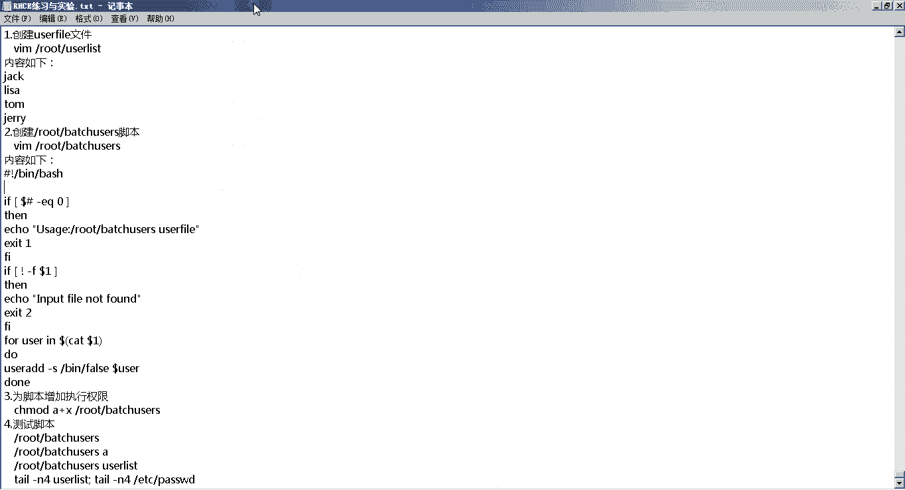

然后注意啊，我们在我们的这个文档里面，实际上就是有很多shell脚本的这个文档里面的第，我看看是从第多少概念，是从第37个实验开始，一直到第，一直到第40个都是shell脚本编写啊。

但是我们今天就不介绍这些shell脚本，介绍这些事，教会大家有兴趣的话，可以在这些可以把这些shell脚本，在自己的这个环境里面运行一下，原因是什么，是我们在进行这个r h c一考试的时候。

用不着这么复杂的，用不着这么算，不会考虑你这么反驳的，所以还有一些相对来说简单的，但是又特别基础特别重要的消费，那我们的这个客户的例子，给大家准备的也是这两个标本，那咱们来看一下这两个标本。

也就是我们的第13个实验，43个实验case校对啊，第14 44个实验批量添加，用户贵啊，这个在之前给大家发到群里的文档里面，是没有的，但是我已经把这个文档更新了，一会儿的话。

我会把这个文档再重新发到群里面，大家伙会在群里接受一个新的文档，后来进行这个练习和测试好了，我们看第三个脚本case脚本，这个其实你实验环境在哪，黑台上都行，我们还是直接在server。

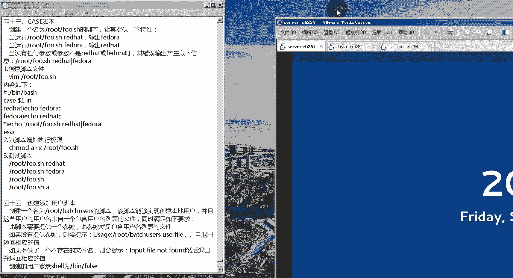

然后这个小实验它跟我们这个考试，全部贴合的就比较近，我们来看一下它的这个要求，说创建一个名叫做root下载four。s h的脚本。

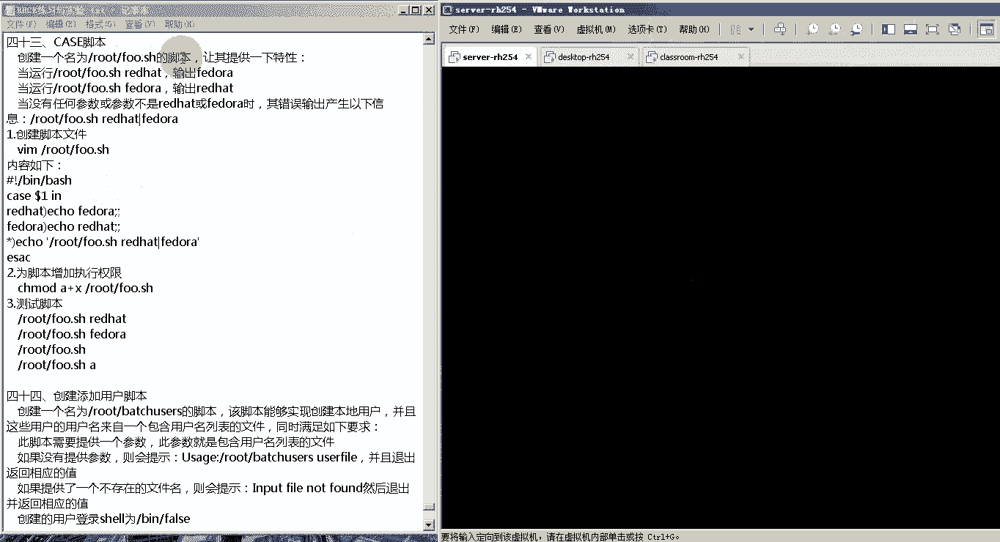

让其提供以下特性，都哪些特性呢，首先第一个说当你运行跟腱的root。for。s5 ，是为了head的时候，输出的是fda，但是当你运行的是根据路线的four，点s h pda的话。

它输出别管是不是他hi，但是如果你没有加任何参数运行的话，就直接运行飞行的路线或者s h的时候啊，或者不加任何参数或者参数写错的话，他会给你输出一个提示，说运行这个脚本的话。

后面要跟着参数是red hat或者。

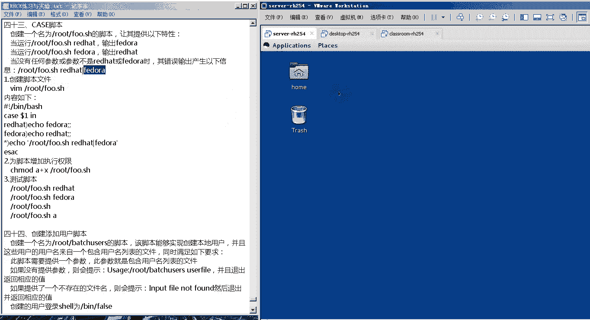

这个脚本标签我们可以通过什么来实现的，通过我们这个case语句，好编辑一下跟腱的root下单，首先脚本第一行释放中间了，并且大，然后case dollar。

你这个case dollar in就代表当我们输入啊，当我们运行这个脚本的时候，我们后边要跟上一个什么呢，跟上它的一个参数，他这个第一个参数就用dota一来着，然后我们来进行判断。

如果你输入的参数是red h，那么我们输出一个pda，注意啊，我们这个case语句，它的这个格式每一条写完了之后要有两份啊，如果你写的是pda的，那么我们输入一个rider。

但是如果你输出的既不是pda，也不是red head的话，那么我们输出一个根下的root，下载s h red hat或者flow啊，然后这个kiss开头vs a c结尾。

case开头e e s e c结尾完了之后，我们来看一下这个效果，先为脚本添加一个指定变量，a加x进行了录的下载，four。s1 h然后我们来运行一下，首先我们运行它的这个绝对路径的方式啊。

后面跟的是redhead，诶，可以按照输出结果的pda，如果我运行的是这个fda诶，可以看到输出的是为了has，如果我后面什么都没跟诶，他会给我提示说你后面要跟father had，或者说说。

或者我跟的是其他参数，也会给我这个提示，那这个就是我们一个简单的，好了，然后我们再对照这个配脚本的内容，来简单看一下，再说一下，是这样的，在第一次运行的时候，我后面跟的参数是red hat。

这个red hat这个参数在我们这里就是dollar 1，所以dota一它匹配red hat这个参数，所以输出它就会执行这个这条语句，就是输出一个pda，所以这是输出了一个pda，然后第二次执行的时候。

后边跟的是我这个pda啊，跟的是pda，那这个时候dota一的值就是pda，所以他执行的是pda这个条件，输出一个vhs，然后第三次运行的时候会没有跟任何值，所以这个是代表星，你就不满足上面两件。

输出一个这个内，然后第四次我输出了一个错误的内容，错误的内容，也就是说你这个极度符合right hand，还是执行新作，我们来看一下最后一个脚本就是添加用户的，他的要求是说创建一个名为根线的柱子下的。

batch user的这么一个脚本，那这个脚本可以实现创建本地用户的功能，并且这些用户的用户名来自于一个，包含用户名列表的这么一个文件，同时满足以下一个，说这个脚本咱就需要提供一个参数。

这个参数刚才说的这个包含用户名列表文件，如果你没有提示参数的时候，他会给你报出这么一个提升，并且会出返回相应的值，如果你提供的这个文件啊是不存在的话，它就会提示你说这个文件不存在，然后退出返回相应的值。

然后我们创建的这些用户的登录share，都必须是印加的force，并且这个脚本不需要为用户设置密码好了，那我们来看一下，首先他告诉我们说，你用的这个包含用户名列表的文件叫做user diss。

那我编辑一下这个，然后里边内容分别是杰克rusa，汤姆，李白是老鼠啊，wc我没说过之后，我们可以开了一下这个resilist，里面包含了这些用，之后我们来创建我们那个脚本啊，跟下来录的下载bh。

然后我们按照他这个要求来写一下，首先第一行释放一下的话，然后进行判断，如果你的这个参数的个数等于零，注意这个dollar井是参数的个数等于零，then也就是说你没有输任何参数。

我们输出一个u s a p e，冒号n下载root下单，batch user user表，也就是说你运行这个脚本的时候，要跟上一个文件才行啊，要跟上一个发布一个值e r s t。

e这个e s t也是用来返回指定值的啊，然后如果如果什么呢，如果你输了一个文件，但是这个文件，不存在啊，不存在，那么我们输出一个你输入的文件，没有发现，输出你的二之后，假如说你说的这个文件对的话。

那我们就for user的参数，然后dollar，后边的内容是cat到了一就是cat你输入的，然后之后执行部分站点，那这里的语句是什么呢，是user add增加一个用户杠s，杠s是指定你添加这个用户。

他使用的啊，share我们是定下的false，这个是我的要求，然后我配上好了，我们来试验一下，首先为这个脚本增加值，取组件a加x之前的root下的batch users，然后我们来运行一下。

我们直接运行编写的注释下的bassets，这样的话我们没有加任何的这个参数，所以满足第一个判断条件，输出了这么一条，如果我加的是一个错误的文件，它会提示我说你这个错误的文件不存在啊，但是他这里边告诉我。

这个脚本信息行走的有问题啊，肯定给你一个第七行的，这个问题应该是在这这个感叹号，分差时间应该有一个好了，再次运行，不你说的这个文件a，如果我们执行的没有问题的话，后边直接可以user list。

好注意我的这个user list打错了，user list诶，这样的话我的这几个呃，这几个用户就已经创建出来了，我们可以看一下tell杠四，这意思就是现在内容，然后往til杠n4 。

etc下的pass文件和husword文件啊，可以看到我们这四个词都已，这就代表我们的脚本，好了，那以上就是我们今天的内容。

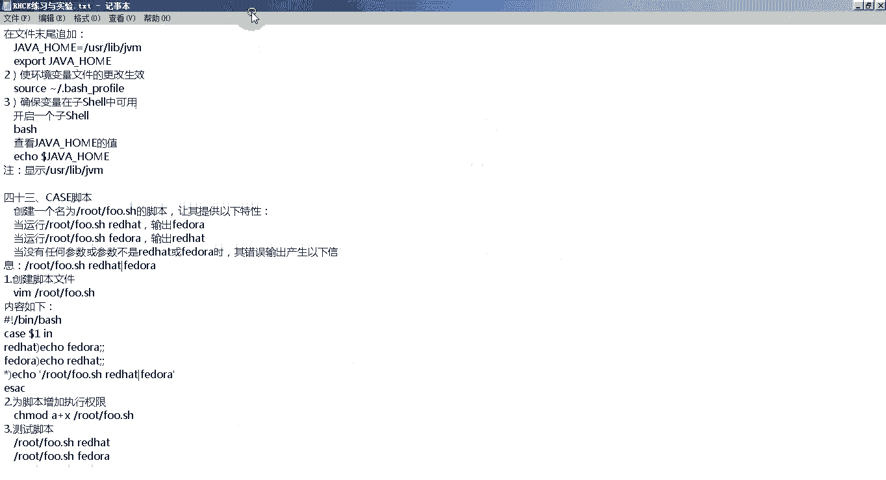

然后大家伙在课下的时候，一定要把小脚本这块呃研究复杂了啊，考试的时候这也属于是必考题，当然这个脚本消费来说比较简单，但是我们尽量不要在这上丢分好了，那么今天的内容就到这儿了啊。

