# RHCE认证课程：P8：RHCE-9 - Shell脚本基础

在本节课中，我们将要学习Linux Shell的基础知识，包括Shell的概念、环境变量配置文件、Shell类型以及如何编写简单的Shell脚本。通过本课的学习，你将能够理解Shell的工作原理，并能够配置用户环境和编写基础的自动化脚本。

## Shell基础概念与配置文件

上一节我们介绍了课程概述，本节中我们来看看什么是Shell以及它的核心配置文件。

### 什么是Shell？

Shell是Linux系统的命令解释器。用户输入的命令通过Shell解析为内核能够处理的代码，然后由内核驱动硬件工作。

我们也可以将一系列命令写入一个文件，通过执行该文件来达到批量执行命令的目的，从而简化工作流程。这个文件通常称为Shell脚本，一般以 `.sh` 结尾。

**核心概念图示：**
```
用户输入命令 (如 `ls`) -> Shell (命令解释器) -> 内核 (Kernel) -> 硬件 (Hardware)
```

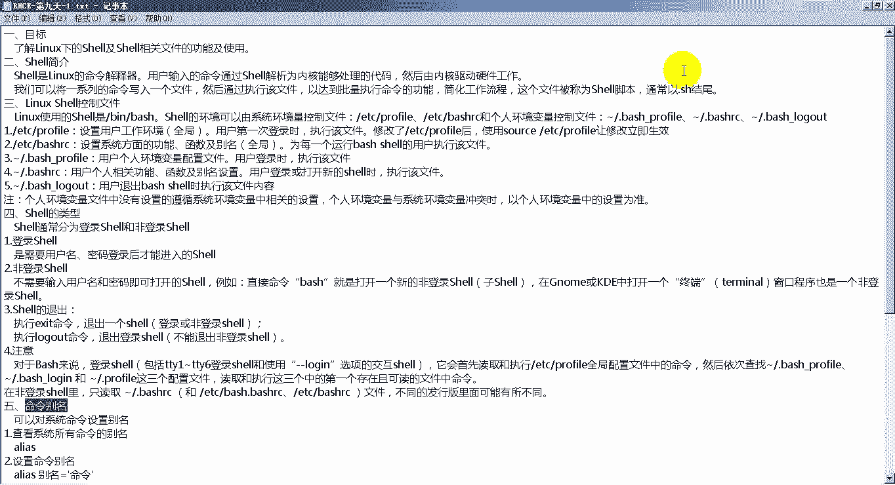

### Shell的控制文件

Linux下默认的Shell是Bash。Bash主要通过以下五个文件来控制环境：


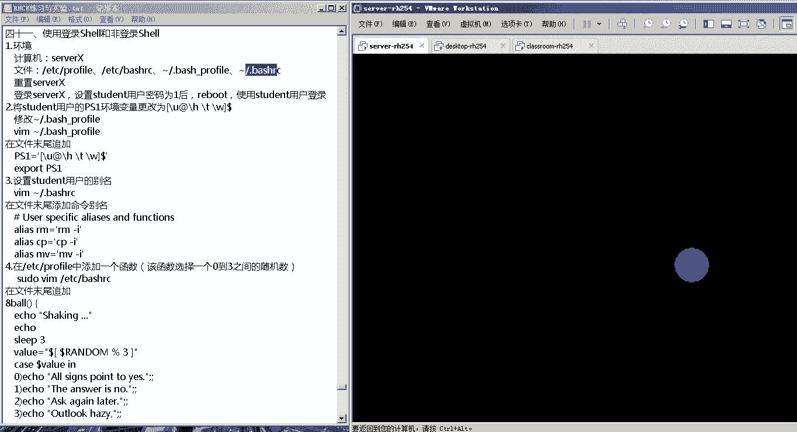

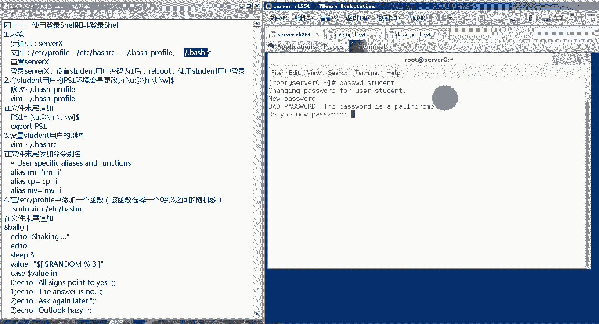

以下是系统级配置文件，对所有用户生效：
*   `/etc/profile`： 设置用户的工作环境。
*   `/etc/bashrc`： 设置系统功能函数及命令别名等。

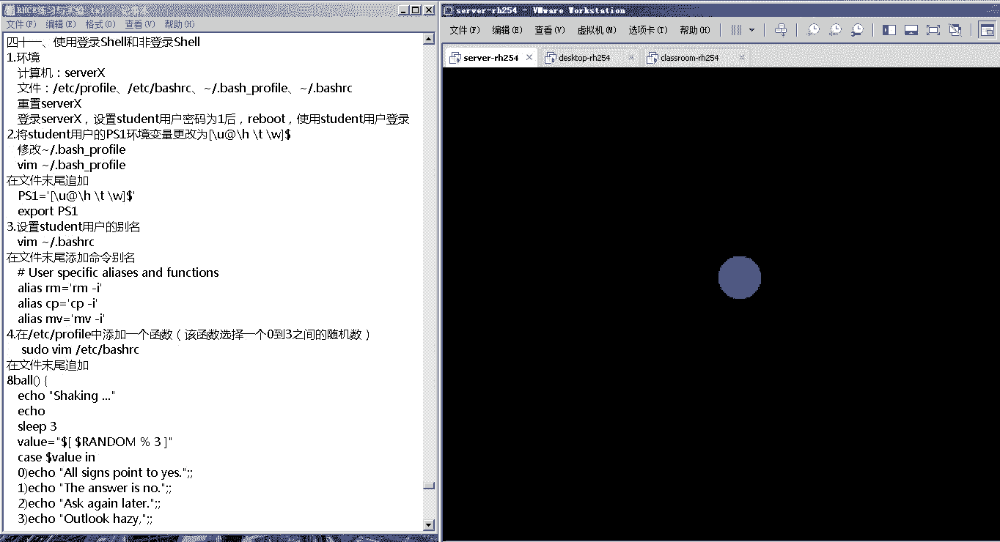

以下是用户级配置文件，仅对当前用户生效（位于用户家目录 `~`）：
*   `~/.bash_profile`： 设置个人环境变量。
*   `~/.bashrc`： 设置个人功能函数、命令别名等。
*   `~/.bash_logout`： 用户退出Bash Shell时执行此文件。

**文件关系说明：**
如果系统环境变量和个人环境变量设置冲突，个人环境变量的设置优先。

### Shell的类型

Shell主要分为登录Shell和非登录Shell。

*   **登录Shell**： 使用Shell前需要提供用户名和密码进行认证。例如，通过终端或SSH登录系统时开启的就是登录Shell。
*   **非登录Shell**： 无需认证即可直接开启的Shell。例如，在已登录的Shell中执行 `bash` 命令开启的新Shell。

**Shell的退出方式：**
*   执行 `exit` 命令： 退出一个Shell会话。
*   执行 `logout` 命令： 退出一个登录Shell（仅对登录Shell有效）。

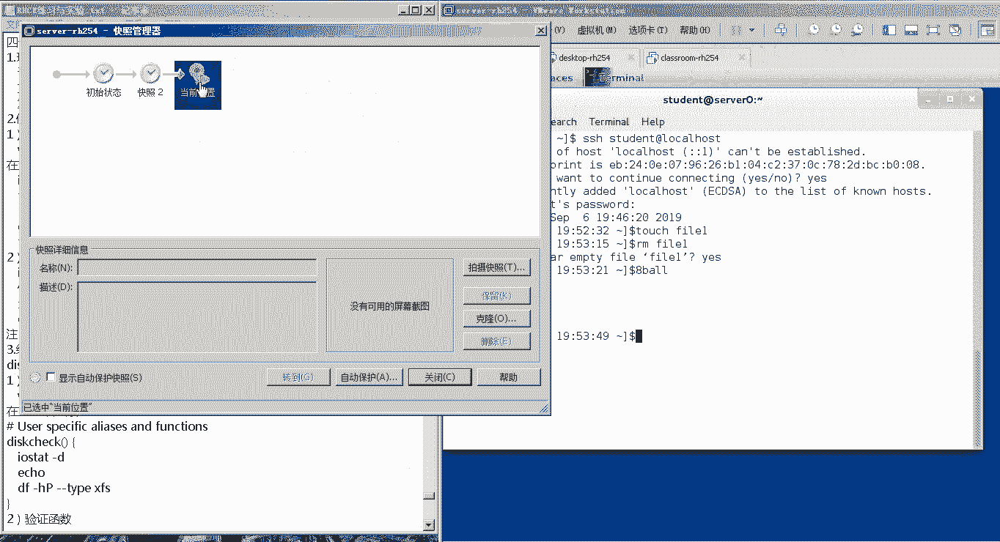

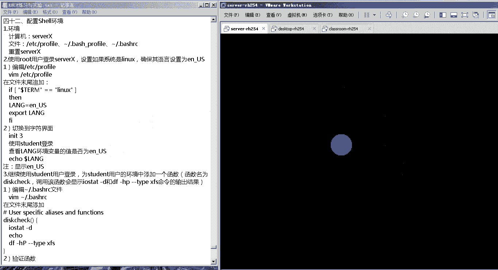

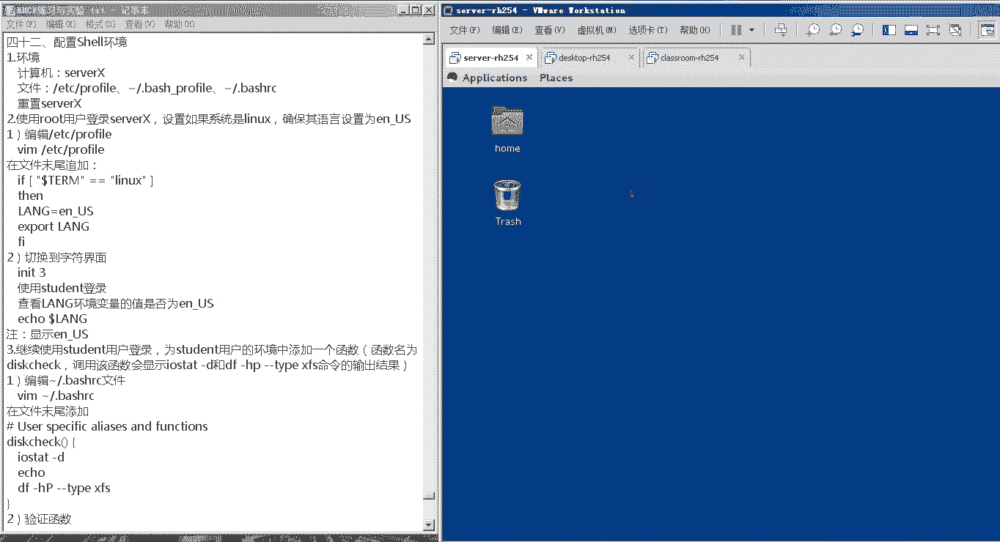

**重要区别：**
对于登录Shell，它会读取 `/etc/profile` 和用户家目录下的个人配置文件（如 `~/.bash_profile`）。
对于非登录Shell，它通常只读取用户家目录下的 `~/.bashrc` 文件。

### 命令别名

命令别名允许我们为系统命令设置简短的替代名称。

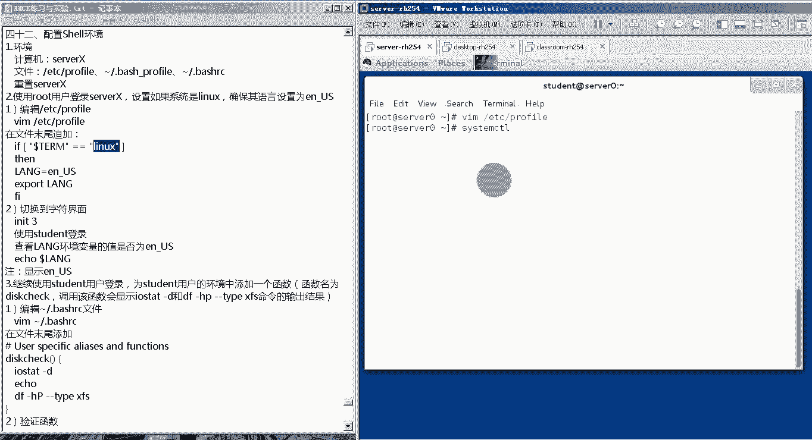

以下是相关操作命令：
*   **查看别名**： `alias`
*   **设置别名**： `alias 别名='目标命令'`。例如：`alias ll='ls -l'`
*   **取消别名**： `unalias 别名`

### 系统环境变量

环境变量存储了一些可以控制Shell工作环境的值。

*   **查看所有环境变量**： `env`
*   **常用环境变量示例**：
    *   `PS1`： 定义命令提示符的格式。
    *   `PATH`： 定义命令的搜索路径。
    *   `LANG`： 定义系统语言。

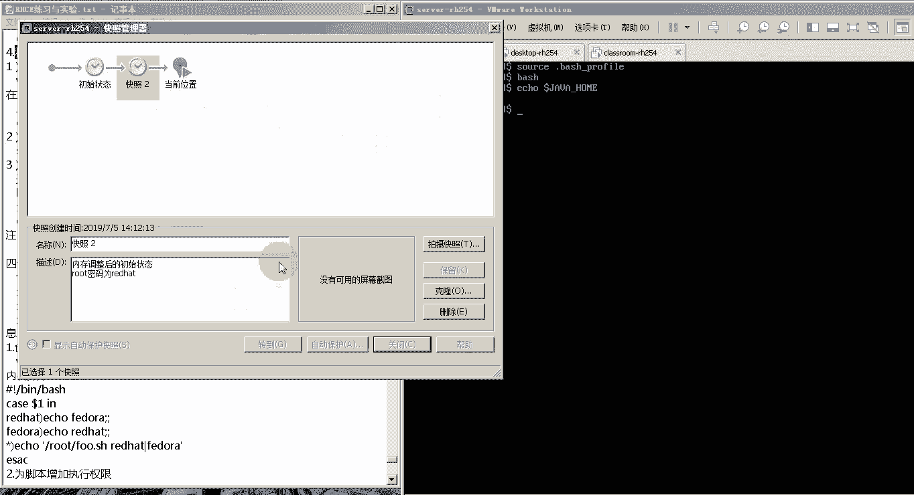

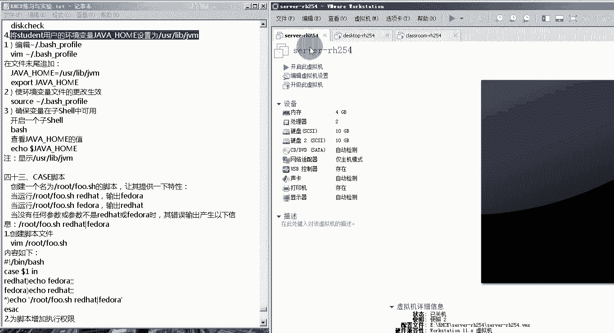

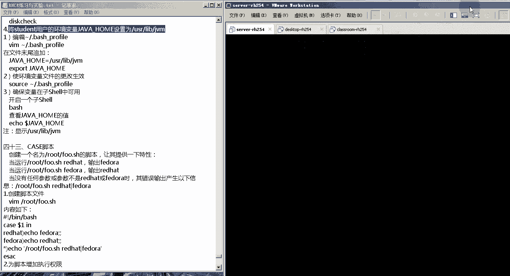

*   **设置环境变量**：
    1.  直接赋值并导出：`VARIABLE_NAME=value` 然后 `export VARIABLE_NAME`
    2.  在配置文件（如 `~/.bashrc`）中设置，然后使用 `source ~/.bashrc` 命令使其生效。

**示例（在 `~/.bashrc` 中设置JAVA_HOME）：**
```bash
JAVA_HOME=/usr/lib/jvm
export JAVA_HOME
```

在本节中，我们一起学习了Shell作为命令解释器的角色、控制Shell环境的五个关键配置文件、登录与非登录Shell的区别、命令别名的使用以及系统环境变量的查看与设置方法。接下来，我们将通过实验来巩固这些知识。

## 实验一：Shell环境变量配置

上一节我们介绍了Shell的理论知识，本节中我们通过实验来实际操作环境变量和别名。

### 实验目标与步骤

本实验将演示如何通过修改配置文件来设置命令提示符、命令别名和自定义函数。

**实验步骤概述：**
1.  以student用户登录。
2.  修改 `~/.bash_profile`，自定义 `PS1` 环境变量。
3.  修改 `~/.bashrc`，为 `rm` 和 `mv` 命令设置别名（增加交互提示）。
4.  修改 `/etc/bashrc`，添加一个能随机输出答案的小函数。
5.  通过开启新的Shell会话来验证配置是否生效。

**核心操作代码：**

1.  **设置命令提示符（`PS1`）**，编辑 `~/.bash_profile`：
    ```bash
    PS1='[\u@\h \t \w]\$ '
    export PS1
    ```
    *   `\u`：用户名
    *   `\h`：主机名
    *   `\t`：时间
    *   `\w`：当前工作目录

2.  **设置命令别名**，编辑 `~/.bashrc`：
    ```bash
    alias rm='rm -i'
    alias mv='mv -i'
    ```

3.  **添加自定义函数**，编辑 `/etc/bashrc` (需要sudo权限)：
    ```bash
    function bub {
        echo "摇一摇..."
        sleep 3
        value=$(( RANDOM % 4 ))
        case $value in
            0) echo "Of course yes";;
            1) echo "The answer is no";;
            2) echo "Ask again later";;
            3) echo "Outlook hazy";;
        esac
    }
    ```

**验证：**
执行 `source ~/.bash_profile` 和 `source ~/.bashrc` 使配置立即生效，或开启新的终端窗口。然后测试新提示符、别名(`rm file`)和函数(`bub`)。

在本节实验中，我们动手修改了Shell配置文件，成功定制了命令提示符、为危险命令添加了安全别名，并创建了一个有趣的随机函数，直观地理解了环境变量和配置文件的作用。

## 实验二：条件化环境设置与函数创建

上一节我们进行了基础环境配置，本节中我们来看看如何根据条件设置环境，并创建实用的Shell函数。

### 实验目标与步骤

本实验包含三个任务：
1.  在 `/etc/profile` 中设置条件语句：当终端类型为 `linux` 时，强制将语言设置为 `en_US.UTF-8`。
2.  为student用户创建一个名为 `diskcheck` 的函数，用于检查磁盘I/O状态和文件系统使用情况。
3.  为student用户设置 `JAVA_HOME` 环境变量。

**核心操作代码：**

1.  **条件化语言设置**，编辑 `/etc/profile` (需要sudo权限)：
    ```bash
    if [ "$TERM" = "linux" ]; then
        LANG=en_US.UTF-8
        export LANG
    fi
    ```
    *   使用 `$TERM` 环境变量判断终端类型。
    *   在字符终端（`TERM=linux`）下验证：`echo $LANG`

2.  **创建 `diskcheck` 函数**，编辑 `~/.bashrc`：
    ```bash
    diskcheck() {
        iostat -dx 1 2
        echo
        df -hT -x tmpfs -x devtmpfs
    }
    ```
    *   执行 `source ~/.bashrc` 后，可直接运行 `diskcheck` 命令调用此函数。

3.  **设置 `JAVA_HOME` 变量**，编辑 `~/.bash_profile`：
    ```bash
    JAVA_HOME=/usr/lib/jvm
    export JAVA_HOME
    ```
    *   执行 `source ~/.bash_profile` 后，运行 `echo $JAVA_HOME` 或开启新Shell (`bash`) 进行验证。

在本节实验中，我们学习了如何编写带条件判断的系统级配置，创建了可重复调用的实用Shell函数，并设置了用户特定的环境变量。这些技能对于系统管理和环境定制至关重要。

## Shell脚本编写基础

上一节我们完成了环境配置实验，本节中我们将深入Shell脚本编写的核心知识，包括常用命令、变量、特殊符号和流程控制。

### 常用文本处理命令

在编写Shell脚本时，以下命令常用于文本处理和过滤：

以下是几个关键命令及其示例：
*   **`grep`**： 搜索文本
    *   `grep root /etc/passwd` (查找包含"root"的行)
    *   `grep -v root /etc/passwd` (查找不包含"root"的行)
    *   `grep -c bash$ /etc/passwd` (统计以"bash"结尾的行数)
*   **`cut`**： 截取列
    *   `cut -d: -f1 /etc/passwd` (以冒号分隔，取第一列)
*   **`sort`**： 排序
    *   `sort -t: -k3 -n /etc/passwd` (以冒号分隔，按第三列数字升序排序)
*   **`sed`**： 流编辑器，用于替换文本
    *   `sed -i 's/SELINUX=enforcing/SELINUX=disabled/' /etc/selinux/config` (替换文件中的字符串)
*   **`tr`**： 字符转换
    *   `echo "HELLO" | tr 'A-Z' 'a-z'` (大写转小写)
*   **`tee`**： 同时输出到屏幕和文件
    *   `echo "Hello" | tee output.txt`

### 变量与特殊符号

**变量赋值与引用：**
```bash
name="RHCE"  # 赋值，等号两边不能有空格
echo $name   # 引用变量，输出 RHCE
unset name   # 清空变量
```
**计算示例：**
```bash
a=10
b=20
c=$(( a * 100 / b ))
echo $c  # 输出 50
```

**特殊变量：**
*   `$0`： 脚本名称
*   `$1`, `$2`, `$3`...： 第1、2、3...个参数
*   `$#`： 参数个数
*   `$*`： 所有参数
*   `$$`： 当前脚本的进程ID (PID)
*   `$?`： 上一条命令的退出状态 (0通常表示成功)

**特殊符号：**
*   `;`： 顺序执行命令，无论前一个是否成功。
*   `&&`： 只有前一个命令成功，才执行后一个。
*   `||`： 只有前一个命令失败，才执行后一个。
*   `>` 和 `>>`： 输出重定向（覆盖）和追加。
*   `2>&1`： 将标准错误重定向到标准输出。
*   `` ` `` (反引号) 或 `$()`： 命令替换，获取命令的输出结果。
*   `' '` (单引号)： 强引用，所有字符字面意义。
*   `" "` (双引号)： 弱引用，变量和命令会被解析。

### 流程控制语句

流程控制是Shell脚本的灵魂，主要包括判断和循环。

**1. if 条件判断**
基本格式：
```bash
if [ 条件1 ]; then
    命令1
elif [ 条件2 ]; then
    命令2
else
    命令3
fi
```
**条件判断常用写法：**
*   **数值比较**： `-eq` (等于), `-ne` (不等于), `-gt` (大于), `-ge` (大于等于), `-lt` (小于), `-le` (小于等于)
*   **字符串比较**： `=` (相等), `!=` (不相等)
*   **文件测试**： `-f file` (文件存在), `-d dir` (目录存在)
*   **组合条件**： `-a` 或 `&&` (与), `-o` 或 `||` (或)

**示例：分数评级**
```bash
read -p "请输入分数: " score
if [ $score -ge 80 ]; then
    echo "优秀"
elif [ $score -ge 60 ]; then
    echo "及格"
else
    echo "不及格"
fi
```

**2. case 多分支选择**
适用于匹配固定字符串的场景。
```bash
case $变量 in
    "模式1")
        命令1
        ;;
    "模式2")
        命令2
        ;;
    *)
        默认命令
        ;;
esac
```

**3. for 循环**
用于遍历列表。
```bash
for i in 1 2 3 4 5; do
    echo "数字: $i"
done
# 或者使用命令生成序列
for user in $(cat userlist.txt); do
    echo "添加用户: $user"
done
```
**循环控制：**
*   `continue`： 跳过本次循环，进入下一次。
*   `break`： 直接跳出整个循环。

**4. while 循环**
当条件为真时持续循环。
```bash
count=1
while [ $count -le 5 ]; do
    echo "计数: $count"
    count=$(( count + 1 ))
done
```
**无限循环示例（监控磁盘）：**
```bash
while true; do
    df -h >> /root/disk.log
    sleep 300 # 休眠300秒
done
```

**5. 函数**
将代码块封装为可重复调用的单元。
```bash
function greet {
    echo "Hello, $1!"
}
greet "World"  # 输出：Hello, World!
```

### 脚本执行与调试

*   **执行脚本**：
    1.  添加执行权限：`chmod +x script.sh`
    2.  运行：`./script.sh` 或 `bash script.sh`
*   **调试脚本**： 使用 `bash -x script.sh`，可以显示脚本执行过程中的每一步命令及其结果，便于排查错误。

在本节中，我们一起系统学习了Shell脚本编写的核心要素：从文本处理命令、变量使用到复杂的流程控制（if判断、case选择、for/while循环）和函数定义。掌握这些基础是编写自动化脚本的关键。

## 实验三：编写实用Shell脚本

上一节我们学习了脚本编写的语法，本节中我们将通过两个贴近RHCE考试要求的脚本来进行实战。

### 实验3.1：使用case语句的脚本

**目标：** 创建 `/root/foo.sh` 脚本，根据输入参数输出不同内容。

**脚本要求：**
*   运行 `/root/foo.sh redhat`，输出 `fedora`。
*   运行 `/root/foo.sh fedora`，输出 `redhat`。
*   运行 `/root/foo.sh` 或不带指定参数，输出提示信息：`/root/foo.sh redhat|fedora`。

**脚本代码 (`/root/foo.sh`):**
```bash
#!/bin/bash
case $1 in
    "redhat")
        echo "fedora"
        ;;
    "fedora")
        echo "redhat"
        ;;
    *)
        echo "/root/foo.sh redhat|fedora"
        ;;
esac
```
**操作与验证：**
```bash
chmod +x /root/foo.sh
/root/foo.sh redhat    # 输出 fedora
/root/foo.sh fedora    # 输出 redhat
/root/foo.sh           # 输出提示信息
/root/foo.sh abc       # 输出提示信息
```


### 实验3.2：批量创建用户的脚本

**目标：** 创建 `/root/batchusers.sh` 脚本，根据用户列表文件批量创建用户。

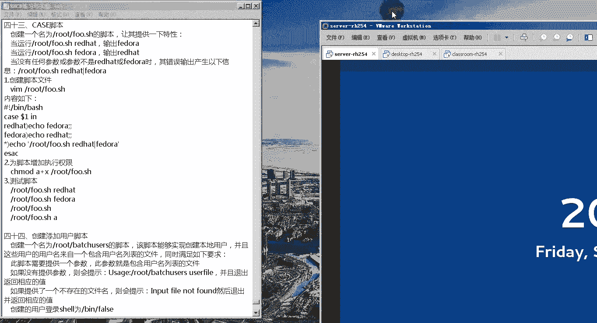

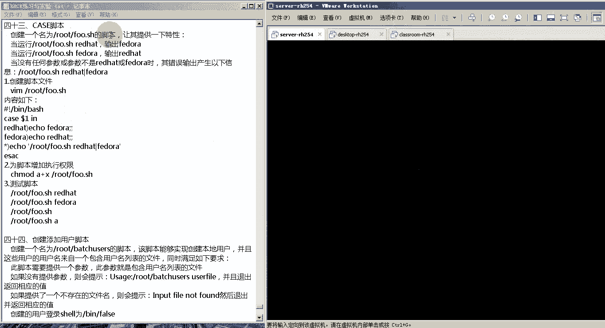

**脚本要求：**
1.  脚本需要一个参数（用户列表文件）。
2.  若无参数，提示用法并退出。
3.  若参数文件不存在，报错并退出。
4.  创建用户时，Shell设置为 `/sbin/nologin`。
5.  不为用户设置密码。

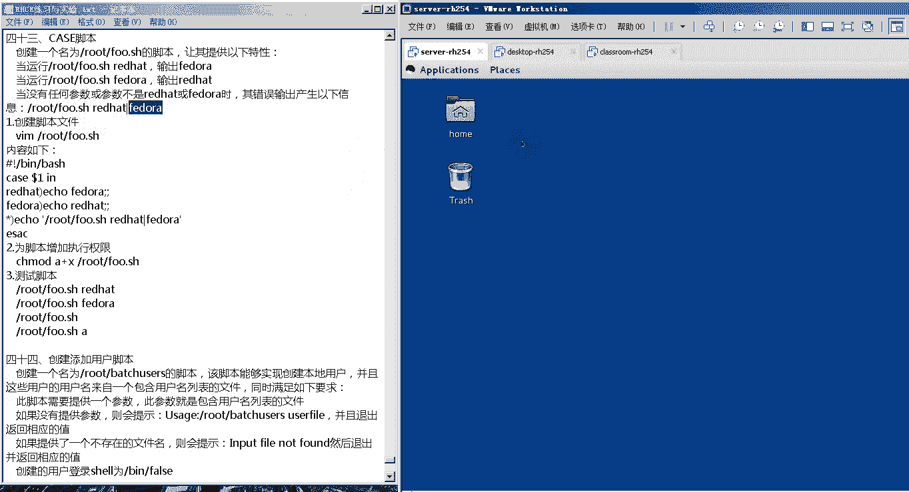

**准备用户列表文件 (`/root/userlist.txt`):**
```
jack
tom
lily
harry
```

**脚本代码 (`/root/batchusers.sh`):**
```bash
#!/bin/bash
if [ $# -eq 0 ]; then
    echo "Usage: $0 <userlist_file>"
    exit 1
fi
if [ ! -f "$1" ]; then
    echo "Error: File $1 not found."
    exit 2
fi
for username in $(cat "$1"); do
    useradd -s /sbin/nologin "$username"
done
echo "Users created from $1"
```
**操作与验证：**
```bash
chmod +x /root/batchusers.sh
# 测试1：无参数
/root/batchusers.sh
# 测试2：文件不存在
/root/batchusers.sh nofile.txt
# 测试3：正常执行
/root/batchusers.sh /root/userlist.txt
# 验证用户是否创建
tail -4 /etc/passwd
```

在本节的实战中，我们编写了两个具有明确功能的Shell脚本。第一个脚本利用 `case` 语句实现参数匹配，第二个脚本结合 `if` 判断、`for` 循环和文件测试，实现了安全的批量用户创建功能。这些脚本体现了RHCE考试对Shell脚本的基本要求。

## 课程总结

本节课中我们一起学习了Linux Shell的核心知识。我们从Shell作为命令解释器的基本概念出发，详细探讨了Bash的环境配置文件、变量设置以及登录与非登录Shell的区别。

在实践部分，我们通过实验掌握了如何定制Shell环境，包括设置提示符、别名和自定义函数。进而，我们系统性地学习了Shell脚本编程的基础，涵盖了文本处理命令、变量操作、特殊符号的含义以及关键的流程控制语句（如 `if`、`case`、`for`、`while` 和函数）。


最后，通过两个贴近实际应用（及RHCE考试要求）的脚本案例，我们将理论知识综合运用，完成了从参数判断到批量自动化任务的脚本编写。掌握这些内容，是迈向Linux系统自动化管理和通过RHCE认证的重要一步。