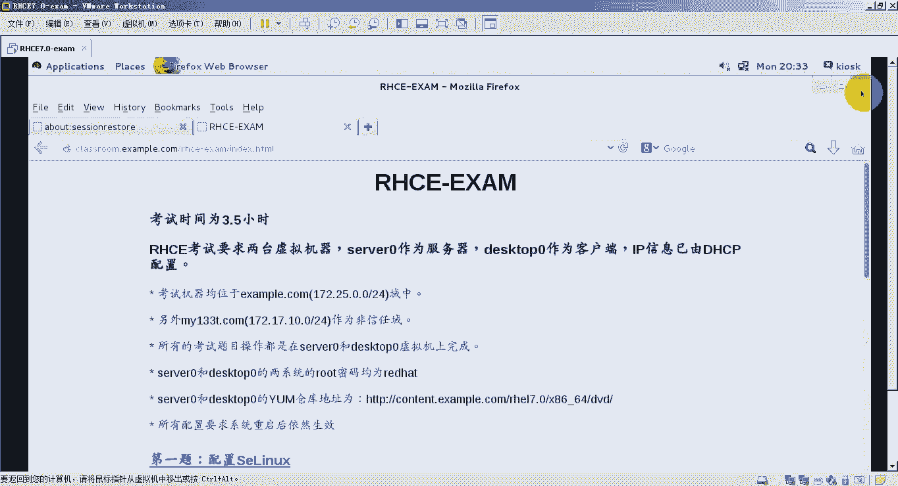
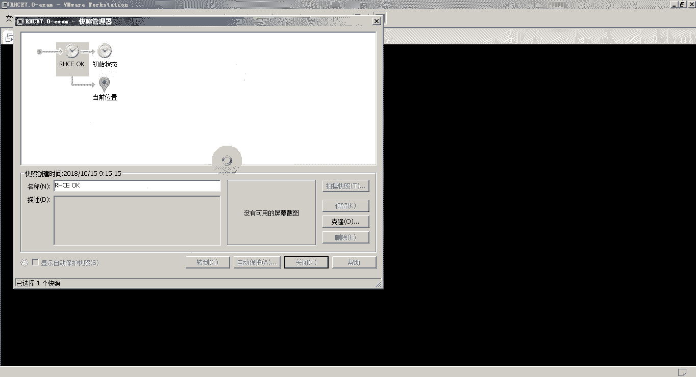

# 红帽RHCE认证考试视频 - P9：RHCE-10 - 我是冷空气 - BV1th4y1X7cC

好了，那接下来就是我们这个20c1 ，课程的最后一天了，20c可能，然后最后一天的第一节这块，我们先来看一下这个容器技术，也就是我们的doer，然后这一节没有实验啊，只有一些理论部分。

所以我们简单带着大家来看一下就行了，然后这一章主要分为以下这几个部分，就是docker容器概述，容器和虚拟机的一个比较，以及dog的特性和架构，还有就是docker运行容器的过程。

这个算是我们一个重点了，还有一个第六个就是docker的镜像，那我们接下来依次来看一下，首先第一个容器概述，什么叫做容器技术，容器是一直是一种轻量级的可移植的，自包含的软件打包技术。

它的这个主要的功能是什么呢，就是可以让我们的应用程序，可以在几乎任何地方以相同的方式运行啊，所以这个就是我们说的这个容器技术，那docker是容器的一种技术啊，docker是这个容器的一种技术。

也就是说它本身也是一个轻量级可移植的，自包含的打包技术啊，打包技术，那我们为什么要用容器呢，我们来看一下这个容器和虚拟机，它们的一个对比啊，容器和虚拟机的一个对比。

首先我们先看一下传统的这种虚拟化的方式啊，传统的虚拟化，它的这个方式主要是重建完整的虚拟机，比如说我们之前接触过的这个vml，比如说kv m或者是then等等，这个为了运行应用啊。

我们除了要部署应用以外啊，还要安装一个完整的操作系统，我们可以看一下我们左边的这幅图啊，这个就是我们传统的虚拟化啊，这就是我们传统的虚拟化，然后底层是我们的这个服务器，在服务器上面我们装的一个操作系统。

然后在操作系统上边，我们通过软件来实现了一个虚拟化层啊，当然在这个例子，这个是我们是二型虚拟机，其实对应的就是我们说的这个叫做呃，寄居架构的虚拟化啊，gg架构的系统。

也就是说他是在操作系统的基础上完成的，操作系统上面装一个应用软件，然后把你的整个操作系统上边，生成一个虚拟化层，这个虚拟化层就可以基于它来创建，我们的虚拟机了啊，典型的例子。

比如说我们之前用过的这个vml workstation啊，这就属于典型的虚拟化啊，或者是我们之前用过的这个k v m，都属于这种r型虚拟化，然后我们再在虚拟化层上面创建虚拟机，在虚拟机上装操作系统啊。

再到操作系统上运行应用程序，这是我们传统的虚拟化，那容器技术它是这样的，底层是我们的服务器，在服务器上边还要安装一层操作系统之后，你部署了我们这个容器的软件，部署了容器软件之后。

可以直接在我们这个操作系统上运行容器，那就无需再在上面创建虚拟机，再给虚拟机安装操作系统，在运行英了就可以在上面直接运行我们的容器，然后容器里边就包含了我们的应用程序，还有它依赖的底层的这些相关软件。

这个就是我们容器技术，那我们这个容器技术跟我们的虚拟化技术相比，它有哪些优点呢，首先所有的容器，它会共享一个底层的宿主机操作系统，所以说容器在体积上会比虚拟机小很多，我们一个虚拟机创建出来之后。

它是一个目录，这个目录里边有很多虚拟机的虚拟硬件文件啊，那我们的这个容器啊，它里边没有这么多东西啊，所以说它在体积上就要比虚拟机小很多，另外启动容器也不需要启动整个操作系统。

所以容器的部署和启动速度更快，因为我们的这个虚拟机里边，它包含了一个完整的操作系统，所以说你要想启动这个虚拟机上的服务，或者虚拟机上的应用，你得先启动虚拟机的系统，再启动它的应用。

但是我们的容器一旦运行起来，它上面的应用程序就可以直接对外提供服务，所以说它启动的速度，部署的速度就比我们这个虚拟化要快，并且他这个开销也小，就是占用系统资源比较少，而且也容易被迁移啊。

而且他也容易被迁移，迁移起来比我们虚拟机迁移要更加方便，只需要把这个容器导出来之后，再在其他的宿主机上运行就可以了，这就是我们docker的特性，第四个也是我们这节课最重要的一个部分。

就是docker的这个架构啊，我们要通过他这个架构图熟悉一下这个docker，他的这个组成部分，以及它的这个语气原理及它与行，在这个docker的架构图里边。

我们可以看到docker它主要分成这三个部分，第一个叫做client，就是docker的客户端，第二个叫做host，就是docker的服务器端，第三个叫做registry啊。

就是我们docker的仓库啊，仓库在客户端主要包含什么东西呢，就包含一些docker的命令，比如docker build，docker pull，docker ran等等这些命令。

然后我们在客户端输入这些指令，这些指令会被发送到我们docker的服务器端，就是docker host，在服务器端运行着我们的docker的守护进程，就是这个docker demo啊。

docker这个demo，然后当我们在我们的客户端，输入运行容器的命令的时候，比如我们输入这个docker run，那这个指令会发到我们这个docker host上。

然后由docker demo这个进程来处理，那dio da进程处理的时候，他是如何处理的呢，首先他要查看本地是否有运行容器的image image。

这个image有点类似于是我们open stack中的image，也有点类似于我们虚拟化中的那个模板啊，也有点类似于我们虚拟化中的模板，那有了image之后，我们可以直接运行这个image。

就会产生它对应的容器啊，container，那如果我本地没有我需要的这个image，那怎么办，我们的docker demo会跑到这个registry去。

把你的这个需要的image下载到docker的本地，然后再通过这个image生成啊运行，成为他的这个容器啊，这个就是dk的架构啊，这个也是dog架构，也就是我们今天的这个核心内容。

所以说大家伙如果把这个docker的这个架构理清了，这个docker的内容基本上就已经搞定了，搞定了好了，刚才上面就是我们说的这些个dk的架构啊，dk架构，第五个docker运行容器的过程。

这个其实我们刚才在架构里边，也就把它给介绍过了，首先docker的客户端执行docker run命令，然后这个指令会被发送，docker host也是docker的服务器端。

服务器端有一个docker demo集成，接收到我们的这个信息，接收到信息之后，他会尝试运行容器，当然运行容器的前提是，它本地得有这个容器型对应的镜像，如果有的话，直接运行，如果没有的话。

他会去从registry上去下载这个registry啊，分成公有和私有，公有的registry就是docker hub，它是一个网站，上面有很多官方的registry。

他从这个docker hub上下载镜像，下载完成之后，把这个镜像保存到本地，再通过这个镜像，就是我们说的这个image生成容器并启动啊，这个就是我们docker它的一个运行流程。

六个也是最后一个就是我们这个docker的镜像啊，docker的镜像就是我们说的这个docker image，这个door image，首先第一个需要了解什么叫做base镜像。

这个base镜像指的是该隐mage不依赖于其他镜像，可以从空白直接构建，然后其他迹象可以在base进行的，基础上来进行扩展啊，其他镜像可以在base基础上进行扩展，然后一般的这个被子镜像里边是什么呢。

就是一般的linux发行版，另一个方向的，比如说五班图啊，sa vs啊等等等等啊等等，但是他这个发行版里边不包含，整个操作系统的内核，只包括什么呢，只包含这个root f s这一部分。

也就是说你这个系统里边的这个基本目录结构，一些以及一些常用的工具和命令等等，那底层内核用的是什么呢，底层内核用的就是我们这个宿主机的内核，底层用的是我们宿主机的内，好了。

我们的镜像实际上它是一个层级架构，它是一个层级架构，比如说当你在有一个镜像运行成容器的时候，我们可以在这个镜像里边呃，在我们的容器里边部署新的应用，再把它导成新的image。

那每生成一个新的image就会多出一层啊，多出一层，然后我们的这个镜像它由两部分组成啊，最上面的这个部分叫做咳血的容器层，也说在容器层里边，你的数据是可以进行读写的。

然后容器层的下边全部都是只读的镜像层，比如说镜像层里的内容是没办法更改的，那如果我想更改这个镜像里面的内容，这个应该怎么办呢，注意它主要分成以4g以下这四种方式，一种就是添加文件，当你添加文件的时候。

它只能被添加到容器层，因为容器层还是可以读写的，如果要读取文件的话，他会先查找这个文件是否在容器层，如果容器层没有的话，就会往下层去镜像层中查找，查找到了这个文件，再把这个文件复制到我们的容器层。

然后再打开，如果要修改文件的时候，也是先去找这个文件是否在我们的容器层，如果在的话，直接在容器层修改该文件，如果不在的话，他会依次向下层去镜像层中寻找，在镜像层中找到这个文件了之后。

它会在我们的这个容器层里边啊，在我们的容器层里边把它给修改掉啊，待会把这个文件从我们的镜像层复制到容器层，然后把它修改掉啊，保存在容器层，如果要删除文件的时候注意，因为这个文件本身它在容器层的话。

可以直接删除，但如果他在镜像层的话，是删除不了，那怎么办呢，我们会先往下层找到这个文件，找到这个文件之后，在我们的可写的容器从里边做一个标记啊，就是这个文件已经被删除了，那下次再找的时候。

找到我们这个当前的这个容器层的时候，它就会显示这个文件已经被删除啊，这个就是我们的docker镜像好了，那截止到这这个docker就简单给大家介绍完了啊，重点还是在于我们这个docker的架构啊。

我们把它的这个架构弄明白，然后把docker的这三大基本概念，包括我们的这个容器镜像，还有仓库之间的关系搞清楚，基本上就ok了，然后我们的这节课啊没有这个实验，没有这个实验。

所以说剩下还剩下这个很长的时间，这个很长的时间，我们把我们r h c e这个教材，最后的这个总复习来给大家，带着大家来做一下啊，这个总复习带着大家来做一下，然后这个总复习的文档我已经整理好了。

然后一会儿我会把它发到这个群里，但是要注意我们这个总复习实验，它对应的是哪一个实验，我们得知道它对应的实际上是我们的这个，实际上是我们的这个rgcd那本教材，最后的一个实验啊，咱们带大家看，我要找官方。

应该是在这里啊，我找一下，这个是我们这个红灯红帽系统管理三啊，就是h254 的学生工作部，我们现在要给大家介绍的实验是什么，是最后的这个实验，把他拉到最后，拉到最后有一个第15章，第15章有一个总复习。

这个比较，难找不太好找，这个就是这个电子教材它的一个弊端，不太好翻，好了哈，第15章有一个总复习啊，我们做的实验就是这个实验，我们做的实验就是这个实验，然后这个实验里边可以看到。

大家伙可以在我们的这个教材里边看一下，我们这个实验的要求啊，我这个实验要求啊，第一章什么控制守护进程，第二章管理i p啊，他这个是介绍每章的内容，发票上没那啊，这是最后的这个实验室啊。

系统管理总复习三啊，系统管理总复习三，然后他的这个相关要求在这里边都有相关因素，在这里边，基本上囊括了我们这本书的这个重点实验，基本上囊括了我们这些书的正本，这个这本书的这些重点实验。

所以说在这里边题目我就就不给大家介绍了啊，大家伙到时候如果想看题目的话，注意啊，去哪看，去这个你的这个电子版的396页去看啊，在这里边有所有的这些个实验的要求啊，都在这里边，所有实验要求。

那我们现在就对照这些要求，把我们的这个实验带着大家来做一下啊，这个实验文档我已经把它给做好了，做好了之后一会我会把它发到群里，然后大家课下的时候就可以对照，这个实验文档来做好了。

那把我们的这个实验环境先准备一下，还是这三台机器啊，这三台机器我们把它都换一个快照，好开机。

稍等一下。

这个有点慢，来几次也已经都启动起来了啊，那接下来我们登录一下我这个，我也登录一下你的这个。

我们登录了这个server和desktop，首先我们先来到desktop，运行一下我们最后的这个实验的脚本，来准备我们的实验环境，叫做lab sa，三杠review sea，这个过程可能会稍微有些慢。

那我们也来到我们这个server，也来运行这个脚本，准备一下我们最后的实验，好我们这个dex top已经准备好实验环境了，我们server也已经准备好实验环境，那接下来我们就来设置一下。

首先第一道题是创建这个team设备啊，tm这个是创建tm设备那一章的一个题目，我现在来看一下我当前的设备，可以看到这已经为我们准备好了team的live设备啊，steve 1402，注意啊。

我现在是在配置server x啊，一定要仔细看这个文档，看看这些步骤都是在哪，第一台机器上做的，然后他的这个tab是tm，然后看那个是name，这个连接的名字叫做t m t m。

if name也叫做t m e config，后边指定你的这个team的运行方式，把它设置成这个设置成这样，这个不够大。

后runner，那我们采用的方式是什么，是猪贝啊方式，所以是active麦卡，诶他提示已经添加成功了，加成功了之后，我们为它来设置ip地址，设置ip地址的时候。

注意需要设置ipv 4地址和ipv 6地址，我们先来设置ipv 4地址，就是nm c l i connection load，平民1i p v4 点address，这可以直接提报设置成多少呢，192。

168点，设置ip地址之后，注意不要把他的这个忘记，把它这个网卡的ip地址的获取方式给他改一下，ip v4 点visor改成手动static或者menu都可以，然后再设置这个ipv 6的地址。

就是nm ci connection mode t v i p v6 点address，这个cl打错了，所以table不出来，connection mode tm 1，ipv 6点address啊。

把它改成，零零ba，b a，冒号冒号一杠，然后还是不要忘记修改它的，这个网卡的获取方式，ipv 6点y z改成static好了，设置完成了之后，再为它添加我们这个sd设备。

cl i connection，i type team gun sleep，添加一个链接，连接类型是team设备的sleep，然后connect是叫做tm一杠16，if name。

我们用的是sleep 1 master，指定你的这个team设备是tm 1，然后再加一个题目，把题目设备的这个sley，这个直接在上面的基础上的一改成二就ok了，然后我们来测试一下。

看能否变成c1192。168点，sorry，这少了个杠，这就代表拼一次哎，可以看到这个已经拼，再拼一下这个ipv 6地址，那就是拼六刚c1 ，还是拼一次，拼f d00 冒号ba。

b a e一冒号088号，可以看到也拼通了，那我第一个就ok了，第二个我们来配置这个dns缓存服务器，这个dns缓存服务器还是转发这个其他的主机啊，作为一个dns缓存服务器。

他转发的这个解析结果是来自其他主机，然后主要是来自我们这个class room配置一下，首先我们还是通过我们这个un bang来实现，所以第一步先安装这个软件，y y放，安装完成之后来编辑它的配置文件。

在etc下有个un bu bu bg，然后找server字段在这里边，就是第十行，在下边添加啊，interface冒号监听本机所有的ip地址，然后被所以ip地址s do，172。二五点点零杠24。

就是所有172。25这个网段的主机，都可以通过我这台d缓存服务器来进行解析，导慢，in sq，所有访问excel报点com，或者对excel报点com这个域中的主题，进行解析的时候，无需进行认证。

然后再在本件的末尾添加，forward杠冒号，name，点name点，这就代表对所有的记录都进行转发，然后forward ga d d r转的是哪一台机器，车是172。25。254点。

也就是我们这个classroom gx这台机器好了，w q l推出之后，来启动服务，首先设置服务，开机自启，也就是ina保，第二步启动服务，这个启动服务的速度先慢啊，如果服务启动失败的话。

我们可以再查一下，我们刚才配置文件配置的问题，再改过来就好了，可以看到这个服务启动成功了，我们查一下服务的状态，status gul u，这里边没有错误啊，好了，然后再在防火墙上开启这个服务。

那就是vivgsam d杠杠，杠杠a杠service等于之后，firewall gone seventy，杠杠，这样的话我们的这个，dns的缓存服务器约好了之后。

我们就来配置第三个服务就是post fix，这个post fix这个服务，我们还是仍然把它这个空客户端md store杠y post，提示我们post fix已经安装，所以我们可以直接更改。

注意在修改post fix文件的时候，其实有两种方式，第一种方式直接修改etc下的post fix，下载慢点c，这是一种，第二种方式，你可以用这个命令叫做post config杠。

直接修改这个文件里的相关参数，比如说pinguinter bases等，post config，三杠一修改，my night，等于172。二五点点零杠二，和127点点零点杠八，当前的这个网段。

然后在post config杠一修改这个my de，nation这个目标地址改成server。x3 p。com和loco，host，点local倒卖local host。

然后在post config杠一修改我们这个转发的主机host，desk top 0点x3 ，啊注意这个注意，然后这些修修改完了之后，我们就可以在防火墙上开启的这些相关服务了。

当然你要是感觉这几个改怕出现问题，你还可以再对照下中间etc下的post fix下载慢，找一下这些关键字就行了，比如说i might杠，好可以看到这个是我刚才改的ai杠interfaces。

于这个改的没问题，然后再往下查找下一个my de，没事，啊叫my network，这里面都没有哎，在最后找到了就做my networks，等于172。25127点点零杠八啊，这没问题。

然后再找这样一个my d，在这里面可以看到my dance nation是server 0。13com，或者是local host，点local倒卖logo号，这也没问题，最后。

可以看到rehouse我们把它改成dex top，0。1352，这些都没有问题，好了，w q保存退出，然后我们可以在放火墙上开启它的服务，fireworks 3 d刚刚杠杠的杠。

service等于s m tp，之后在刚刚reload重新加载，回来之后，因为我刚才修改了它的配置文件，所以我们要重启服务生效，system c t l in a boost fix。

把它加入到开机自启这个postfix多大之后，再system c t l start restart，这样啊我们这个服务就记起来了，我们再查一下服务的状态，status gl post啊，里边没有错误。

我们这个post好了，第四个，我们来修改一下我们的这个配置，一下我们这个cos cos，然后我们这个server配这个阿卡斯的服务器端，所以首先我们先安装软件，叫他改的d和他get，c r i港湾。

好了已经安装完成了，安装完成之后，我们来先把它设置成开机自启1a包，再把它启动起来，好记下来了之后，我们就来创建我们这个s cos，首先你需要一个大小为512兆，这不是这不是密码，需要512兆的分区。

这个分区我把他直接带过，分区怎么突然，往下拉多了，诶这个没改过来啊，很神奇啊，那我一会再改，我改完了之后再给大家发，中间这么一大小的一个分区呢，还是spark可以看到我们这除了s d以外。

还有一个s d d，那我们在s db上，出现一个大小为512兆的分区，那就是f disk dev sd g，选择gbt分区n创建一个新的分区，分区号就是一几十山区回车中指山区加512，然后p打印一下啊。

512兆没问题，w保存退出啊，l os pk可以看到512兆的分区就已经，然后我们来创建这个s cos的，他get的，所以就是他改的c l i。

进来进来之后还是先运行backstories下的blog下啊，create叫做server 0。2，串出来了之后再运行sc下的create，i q n点，2014杠06。com。x sample。

冒号server，零点cd，哎就创建好了，装修好了之后，再运行cos下的i q n下的p p t，以下的l u n s，创建这个l u n create fix下的zero表转出来了，这个叫lv文件。

之后再运行s x c写的i q n，加tpg一下的ptos啊，create来创建它的端口，172。25，端口是3260tcp的300啊，在cac i q n下载t p g一下的a c l o s。

我们来创建它验证用的f0 i q n，点201杠06。com。x，创新出来了之后，save confi保存设置e s t退出服务器端，就设置好了，接下来我们在防火墙上开启的端口。

firewall cmd，杠杠permanent，杠杠a的，加上我们这个端口端口是23260tcp的三，之后我们再重新加载，杠杠vlog，然后我们刚才的这个声效，好了这就完成了，接下来我们来配置。

第五个就是通过corpse认证的fs服务器，首先创建一个共享目录啊，make a dr杠m1777 杠p，在跟下创建一个x，这个下边重建一个叫做hyper，这个拼法都好奇怪啊，拼法都好奇怪。

所以说不要把它写错了，然后我们把它，进入到配置文件里面啊，echo一个导出的是a根下的x pose下的h，然后172，杠24啊，这个网段的主机可以访问，其实就是我们dex top。

让他访问的s e c等于k r b验证方式，注意这个密钥我们一会儿还要下载啊，不要忘记，然后把它重新上到e t c下的，看了下etc，现在把里面的内容看跟我是否一致啊。

创建的目录是根下来exports下的h note啊，谁可以访问，172。250。04s e c验证方式，采用p之后，我们来下载密钥六，get港欧，把这个密钥保存到etc下的，还是kr。

table保存到文件里，然后从哪下载htp冒号双斜杠，拉斯入目点x3 炮，k k boss下的server 0点，哎这就下载完成了，下载完成之后，我们就可以启动服务了，首先引爆nfs杠secure。

杠server再启动它，再把另外一个n fs杠server，这两个都是重开机自启，然后再启动start nfs gq so，在restart这个，接下来不要忘记在防火墙上开启，我们这个fs的服务。

firework杠samd杠杠杠杠的杠service，增加一个服务，firever杠三md杠杠重新加载，这个速度行吧，好重新加载完了之后，哎本也配置完了，接下来配置我sub sumer。

首先增加一个组块的big b，然后创建一个用户，user i杠s，这个用户使用的登录shell是根据sp log，实际上就是不能登录，让大g它就属于我们创建的这个big bang，然后用户名叫什么。

叫做叛逆，之后我们创建一个导出的目录啊，midr杠m指定它的权限，27p0 杠p指定这个目录，还是在根下的x pos下创建一个叫做big b，创建出来了之后，改一下这个目录的数组，这个数组改成贝棒。

之后不要忘记设置它的selinux安全上下文啊，samanager，杠a增加一个杠t标签，叫做sb杠share杠t给谁增加给根下的x，这个目录下面big棒这个目录增加又是杠点进，然后增加完成了之后。

再设置一下它的这个安全上限，reg f v etc下载exports，现在，这里边还有一个小报错，报错可以忽略，这就相当于是我们的bug，大家可以好了，然后再安装sa的客户端软件。

主要是想获得这个sa password store，sb杠client和sa，好安装完成，安装完成之后，我们来编辑sm的配置文件，在etc下的sub项有一个sm一点三，在文件末尾添加b格。

这是我们的共享名啊，然后后边pss共享的目录是编写的，expose下的北方，然后wild users哪些用户可以访问，这个是at bigbang，也就是说bigbang这个用户组成的用户都可以访问。

然后list哪些用户可以写呢，还是我们这个at bigbang bigbg用户都可以写好了，然后我们再来添加我们的summer用户，那就是sa。

sm b password password杠a增加一个用户就是py，然后为这个用户设置密码的时候，大家会一定得注意啊，你要设置相应的密码，这个密码设置不对，最后验证通过不了的，这个密码是大写的i。

然后输入符号三大写的s h e l e o n好，再来一遍大写的i，输入重定向符号，三大写的s h e l，这个用户就已经压出来了，压出来之后，我们就可以将三把这个图设置成开机自启。

it它提示我们这没有sm啊，sorry s，再把它启动起来啊，好了，然后再在防火墙上开启他的这个端口，vp 3 mb杠杠，permit杠杠i的杠service啊，等于因为是永久添加。

所以我们还是要重新加载，让其生效杠杠，好了啊，这就添加成功了，那我们三把就配置完了，接下来我们来配置第七个符，就是h t t p s的虚拟主机，js的虚拟主机好了，那我们先来安装一下相关的软件。

vim in store，http d mode杠s s l，这是用作htp的，然后maria d b杠server，这个是马克db数据库，然后p2 p啊，我们这个主要文件是通过p2 p写的。

然后p2 p杠mysql，p2 p的主要文件需要连接mysql，实际上连接的是这个maridb server啊，杠y，然后我们这个实验，它的这个主页文件是不需要我们自己写的。

我们刚才在准备实验环境的时候，实际上就已经把它下载到这个server上，我们一会儿直接把它放到指定的目录里，就可以了，好了已经安装完成了，安装完成之后，我们先来启动把db以，再把它启动起来，start。

启动起来之后啊，我们这个运行这个sql脚本，来在mysql数据库下生成它需要的表，这个脚本放在了跟下的红线的student，叫做my db mysql down。

通过这个来回复我的这个库以及数据库中的表，然后创建了我们的主页文件存放目录，每个dr杠p还是在跟前的s r v下，还是创建两个，一个是3w，一个是web app，然后零这样的话就是一个是3w0 。

y b a p p0 ，下面再创建一个3w cd档s确认一下没问题，然后copy我们跟下的home下这个student下的买app，点p2 p这是他的主页。

放在s y s r v下的web app下载3w改成index。php，然后我们再生成另外一个虚拟主机的文件啊，this is 3 w这是他的主页文件的内容，然后t啊这个t这个命令导数叫做分叉。

分叉命令，用这个命令，后面跟上你这个指定目录下的指定文件之后，第一个他会把这个显示你当前，第二个还会把你显示的内容，写入到这个文件之后，再设置它的这个selinux的权限，3004标签对s v好了。

这就设置好了，设置好了之后，因为我们要做也是t t p s，所以我们需要下载这个公钥私钥，以及我们验证用的证书啊，那cd到etc下的pk i下的t l s ths这个目录下。

w get http冒号双斜杠，class room。x example，点com下有一个pop，pop下有一个example杠ca。c r t，注意你下载的路径以及你下载这个文件的名额。

这个是需要注意的，再w get这个我直接上了，因为他这个路径基本上是一致的，这个是pop下的t ios下有一个设置，设置下有个3w，这就下载下来了啊，然后再去下载，这个目录下web a p p0。

4r t下载下来，然后再下载它的这个cl d到e t c下的pk，按下set private，这个还是w get po下的tl下的p vt下来，3w0 点在下载这个下的web app，零点。

这些都降下来了，然后把所有的这个点k文件的目录都改，权限都改成400啊，把所有的这个这个文件的权限都改成改过来了，之后设置三linux它的端口杠a杠t http杠后杠，因为我们这个http。

我们要绑定的是他的tcp的44号，所以在300，你要为这个tcp的44号端口，设置一个http的端口标签才行，然后我们虽然在selinux里边，为这个tcp的44号端口。

增加了一个这个http的端口标签，但是你为了能够监听到它的一个端口，所以我们还要编辑我们这个http的配置，我们等他写完写完之后，我们来编辑它的主配文件，我们将主配置文件里增加这么一段，listen。

444http s追加到e t c写的g d p d f格，写的h t t p d点之后，我们可以have杠n一看一下etc写的a gtp，t型的config h t t p d点。

可以看到这个内容已经加进去了之后，再来编辑虚拟主机的配置文件，cd到一线的h t t p地下的config。b，这个编辑一个3w0 点，这个配置文件里的内容特别长，在这里就不给大家手打了。

然后里边的这个内容，之前也给大家大体上介绍过了，所以说在这里，然后大家伙在做这个实验，如果你要是在验证的话，你也可以复制粘贴，然后这个配置文件里面有哪些关键的重点，需要大家注意啊。

就是这个server name的名字，还有就是你下载的这个文件，它们对应的路径，注意这个路径和它的文件名必须得保持一致，这是很多同学在做t t p s这个实验，出错的这个关键点。

很多的这个问题就是由于你下载的这个文件，保存的目录和配置文件里不一致，或者是文件名和配置文件不一致导致的，wq保存退出，我们在编辑另外一个虚拟主机的配置文件，叫做y b a p p0 。

第二config配置文件里的内容，还是啊我们就不熟悉了，注意重点还是我刚才强调的，就是你的这个验证用的这个文件，它的所在路径，还有它的名字，一定要跟这种片里面写的一。

然后我们再来把http这个服务给设置成开机自启，然后再启动它，如果能启动起来，就说明配置文件编译的没有问题啊，我们可以查看一下服务的状态，scar l，好了，然后我们就可以在防火墙上开启它的端口。

首先我们这块绑定了一个端口444，所以在防火墙上要开启这个444号端口，有permit杠杠，i的杠等于444tcp的44号灯，然后我们再重新加载我的配置面，提升，好了啊，这个我们就可以完成了。

配置完成之后，那接下来我们就可以在desktop上编辑，返回用户信息的脚本，注意这个脚本是在dex top上，并不是在server上，所以大家会在做题的时候一定要仔细审题，来到这里。

首先创建脚本infirm midr，在跟前的home下有一个student这么一个目录，下面创建一个b，然后cd到跟前了，我们家的student下载，然后我们来编辑这个脚本vm。

这个脚本名叫做my user 4，然后脚本的内容如下，这个我也不收到，因为这个脚本的内容比较长，然后大家在复制粘贴的时候，也要注意注意什么呢，注意我们这复制粘贴的格式。

你首先得对这个if i我们kiss的这些相关语句，他的这个格式就有一定的了解啊，你要保证你站的格式你要保证对，其次再是你写的时候格式可以简单看一下，这个，首先呢判断一下这个运行脚本时，传入参数的数量。

如果等于零的话，它会输出这两个就是你的这个脚本名，需要加上一个有色，加上一个之后，如果你传递的参数的话，会对第一个参数来进行判断，如果第一个参数传递的是user list的话。

那它会在etc password里面按照这个user list啊，你传入的参数把你指定用户给出来，如果是user info的话，那他还要进行第二个的判断，如果第二个判断的时候，后边这个没有值输出。

一个是让你确定一下u30 啊，然后如果在你输的第二个参数里面，他发现诶没有这个用户的话，他会输出一个没有，那么否则的话，那他就会这个按照你输入的值，第二个参数去查找你的系统用户，并且把信息给你输出。

如果你选择的是其他的话，就，然后写完脚本的时候一定得注意，不要忘记给脚本增加执行权限，a加x好了，接下来我们就可以进行认证了。

首先我们把server x这台机器重启一下，重启是为了这个判断，我们这些个是否都已经设置好了，开启自己，开机速度比较慢，稍等一下。

好了这个已经开启了，开起来了之后，我们无需登录，直接来到客户端来运行验证脚本，来看一下这个最终的实验结果，就是lab s a3 钢the reader，然后这个脚本大家伙一定得会用啊。

它会依次检查你每个实验中的配置是否正确，所以哪个实验配置的有问题，在这个脚本里边它会给你显示出来，你一定要看一下他这个查的具体是哪一个服务，这个服务当然有问题，再去修改这个服务的内容就可以。

这个到nfs卡住了，难道是我们nfs配置有问题，稍等一下，好可以看到nfs没有问题，三把也没有问题诶，最后所有的都没有问题，所以最终的结果是如果你哪一项有问题的话。

他会在哪一项后边给你标记一个feel啊，你只要去修改就可以好了，这就是我们最后的总复习实验，然后这个文件我一会会把里面错误的内容，稍微进行一下，修改后会发到群里，可以对照这个群众的这个来做下来做下。

然后除了这些个题以外啊。

咱们还有一些这种其他的测试题啊。

这其他的测试题也是特别具有含金量的，大家在课下的时候一定要把它练一练，这个其他的测试题，一会我也会把它整理一下，发到群里。

另外还要给大家再强调一下啊，强调一下什么呢，就是我们的第二套环境，我们知道这个r c e它有两个环境，一个是这个环境，一个是这个1t的，把这个一体的这个环境。

稍等一下，因为这个是虚拟基地，又嵌套了很多虚拟机，所以说启动速度会很慢。

好了，我们来简单介绍一下这个实验环境，它应该怎么用啊，然后这个实验环境里边，所有的虚拟机，都通过这个虚拟机的管理程序来控制啊，在这里边你可以status查看你虚拟机的状态，或者will啊。

连接到一个虚拟机或者start启动一个群集，注意啊，我们只用到这三个reset，这个操作千万不要做啊，不要把它reset啊，不要把它reset，比如说这里边会包含三个虚拟机，分别是classroom啊。

还有我们的这个desktop跟server啊，但是这三台虚拟机注意不要重置啊，再强调一遍，不要重置，而且当你的这个r h c e七点杠exam，这个虚拟机启动起来之后。

里边的这个classroom虚拟机就自动已经启动起来了，我们可以看一下它的状态，我们选择status，ok啊，可以看到这三台新机，我们看看这个classroom，ok。

可以看到它提示你class rom running，它正在运行，那我们看看另外两台新机，另外一台虚拟机，比如说我们看一下这个server，可以看到server missing啊，他没有开启。

我们再看另外一台，啊dex top可以看到desktop missing，也说他也没有开起来，所以说做这个实验之前，注意glassroom这台虚拟机已经帮你开起来了啊，已经帮你开起来了。

但是我们的desktop跟server都没有开起来，所以怎么办呢，你要把他俩开启，但注意是开启不是重置啊，再强调一遍啊，不要重置，那我们开启一下这个server，提示你starting server。

这就代表已经开起来了，然后我们再开启一下next top，诶starting desert，这就也已经开启起来了，之后，我们就可以连接到这两台机器了，用view去连接啊，比如说先连接server。

它提示正在运行诶，然后就打开了server的这个界面了啊，等到它全部开启之后，就可以进去开始配置了，然后dex top也是一样的，那就view dex诶，可以看到打开了dex top这个管理控制台啊。

然后你就可以进入到dex top里面设置了，然后题目就在我们这个will arc exam啊，这个图标里边，我们点开，诶可以看到这里边有很多的题目啊，很多的题目，待会可以把这些个题目都做一下啊。

都做一下。

但是这个答案的话哈，答案的话我们同学可以在网上找一下，然后我们也有这个已经做好了这个答案啊，但是这个答案并不是十分完备，一会我也把它发到群里，大家伙把这个呃虚拟机一定要利用起来好，一定训练起来。

把里边的这些个试题一定要多做几遍啊，把它做的特别成熟才行，特别准才行。

好了，那以上就是我们所有rh c一的这个课程了啊，rh c一的课程，然后最后还是希望大家一定要多多练习，因为考试的时候，他除了要验证你对这个知识的掌握程度以外啊，还涉及到一个。

就是你对这个实验的这些个熟练度，你只有保持你的这个熟练度非常高，你才能在这个有限的时间里面，把所有的实验都做完，把所有的这个实验题目都做完，然后做完之后你才有充足的时间来进行检查啊。

啊最终才能做到这个万无一失，好了，那我们今天就到这里了啊，预祝各位同学这个考试成功，然后一定要多加练习啊，对着我们的这个视频，还有我们的文档好了，那我们今天就到这里了。

