# 红帽RHCE认证考试：P9：RHCE-10 - 容器技术与总复习实验 🐳

在本节课中，我们将学习容器技术的基本概念，特别是Docker的架构和工作原理。课程的后半部分，我们将通过一个综合性的总复习实验，来回顾和巩固之前学过的各项系统管理技能。

---

## 容器技术概述

容器技术是一种轻量级、可移植、自包含的软件打包技术。它的主要功能是让应用程序可以在几乎任何地方以相同的方式运行。Docker是容器技术的一种具体实现，它本身也是一种轻量级、可移植、自包含的打包技术。

## 容器与虚拟机的比较

为了理解容器的优势，我们将其与传统虚拟化技术进行比较。

### 传统虚拟化

传统的虚拟化方式需要重建完整的虚拟机。例如，使用KVM或VMware Workstation。为了运行一个应用，除了部署应用本身，还需要安装一个完整的操作系统。

**架构流程**：
1.  底层是物理服务器。
2.  服务器上安装宿主机操作系统。
3.  操作系统上运行虚拟化软件（如KVM）。
4.  虚拟化层上创建虚拟机。
5.  虚拟机内安装客户机操作系统。
6.  客户机操作系统上运行应用程序。

### 容器技术

容器技术的架构更为简洁。

**架构流程**：
1.  底层是物理服务器。
2.  服务器上安装宿主机操作系统。
3.  操作系统上部署容器软件（如Docker）。
4.  直接在操作系统上运行容器。
5.  容器内包含了应用程序及其依赖的底层软件。

### 容器的优点

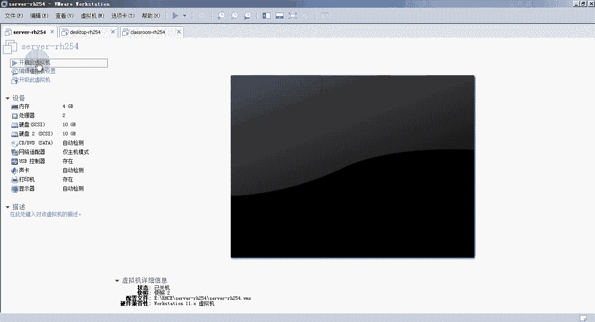

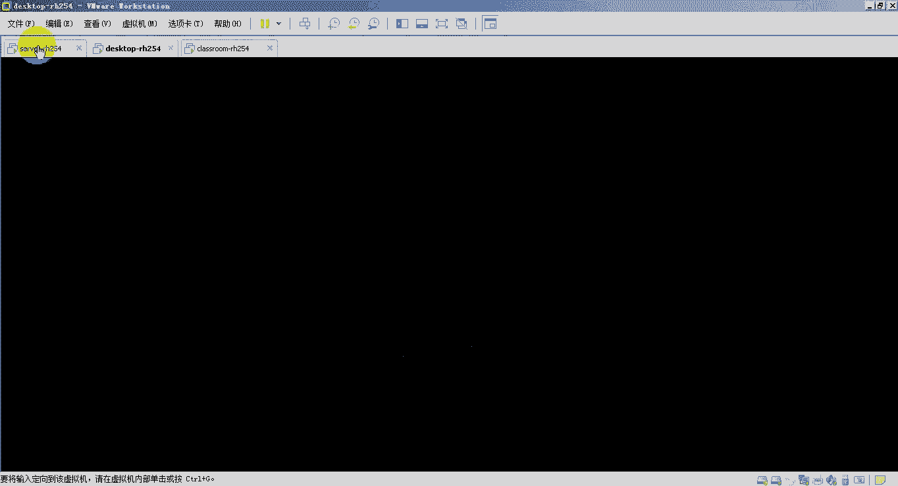

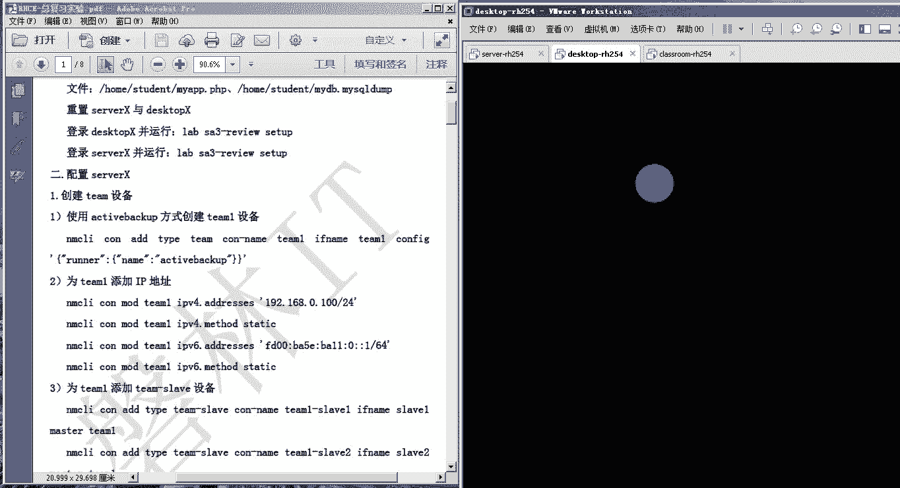

与虚拟机相比，容器技术具有以下优点：
*   **体积更小**：所有容器共享底层宿主机操作系统，无需包含完整的操作系统文件。
*   **启动更快**：启动容器无需启动整个操作系统，部署和启动速度更快。
*   **开销更小**：占用系统资源更少。
*   **易于迁移**：容器可以方便地导出并在其他宿主机上运行。

## Docker的特性与架构

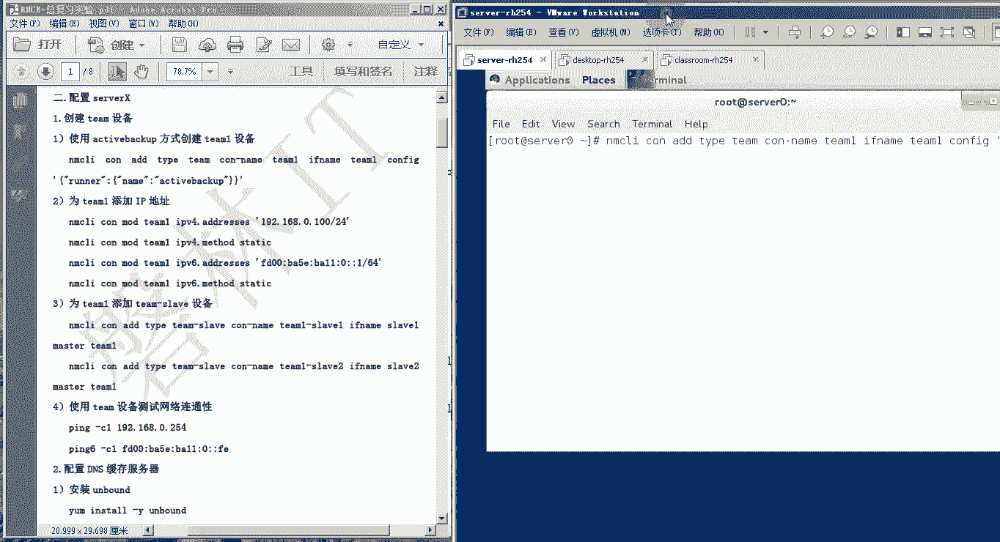

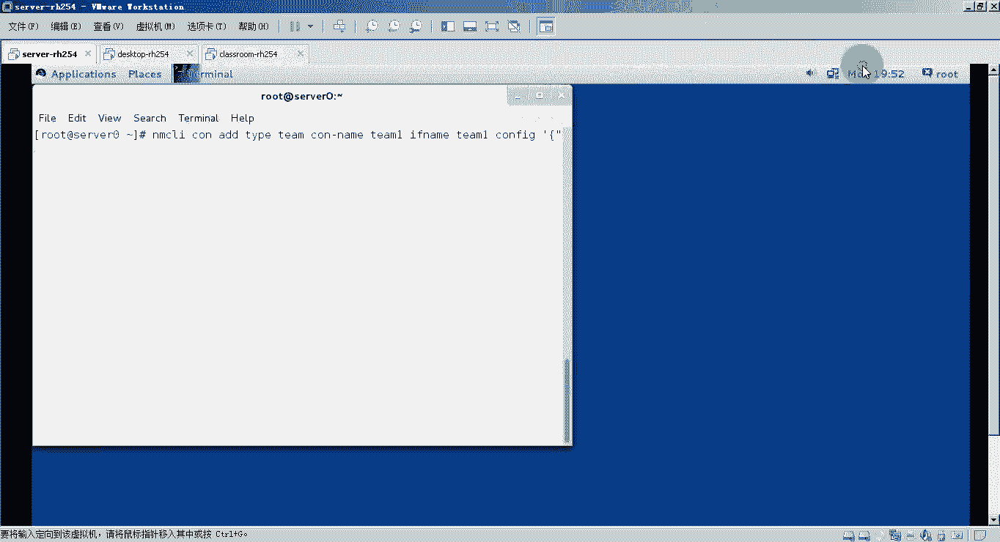

Docker的架构是我们本节课的核心内容。理解其组成部分和工作原理至关重要。

Docker架构主要分为三个部分：
1.  **Client（客户端）**：包含Docker命令，如 `docker build`、`docker pull`、`docker run`。
2.  **Host（服务器端/守护进程）**：运行着Docker的守护进程（`dockerd`）。
3.  **Registry（仓库）**：用于存储和分发Docker镜像。

**工作流程**：
1.  用户在客户端输入命令（如 `docker run`）。
2.  命令被发送到服务器端的Docker守护进程。
3.  守护进程检查本地是否存在所需的镜像（`image`）。
4.  如果镜像存在，则直接运行该镜像以创建容器（`container`）。
5.  如果镜像不存在，守护进程会从Registry（如Docker Hub）下载镜像到本地，然后再运行。

## Docker运行容器的过程

上一节我们介绍了Docker的架构，本节中我们具体看看容器是如何运行的。

Docker运行容器的过程可以概括为以下步骤：
1.  Docker客户端执行 `docker run` 命令。
2.  指令被发送到Docker服务器端（Host）。
3.  服务器端的 `dockerd` 守护进程接收指令。
4.  守护进程尝试运行容器，前提是本地有该容器对应的镜像。
5.  如果本地有镜像，则直接运行并启动容器。
6.  如果本地没有镜像，则从Registry（公有如Docker Hub，或私有仓库）下载镜像。
7.  镜像下载到本地后，通过该镜像生成并启动容器。

## Docker镜像

镜像是容器运行的基础。一个Docker镜像是一个只读的模板，包含了运行应用所需的代码、运行时、库、环境变量和配置文件。

### 基础镜像（Base Image）

基础镜像不依赖于其他镜像，可以从空白开始构建。其他镜像可以在基础镜像的基础上进行扩展。常见的基础镜像是精简的Linux发行版，如Ubuntu、CentOS。但请注意，基础镜像**不包含**操作系统内核，只包含根文件系统（rootfs），即基本的目录结构、常用工具和命令。容器底层的内核使用的是宿主机的内核。

### 镜像的层级结构

Docker镜像采用层级架构，每一层都是只读的。当基于一个镜像运行容器时，会在最顶层添加一个可写的“容器层”。对容器的所有修改都发生在这个可写的容器层中。

镜像由两部分组成：
*   **容器层（最上层）**：可读写。
*   **镜像层（下层）**：只读。

对文件的操作遵循以下规则：
*   **添加文件**：新文件只能被添加到可写的容器层。
*   **读取文件**：Docker会从容器层开始向下查找文件。如果在容器层找到，则直接使用；如果没找到，则继续在下层的镜像层中查找。
*   **修改文件**：Docker会从容器层开始向下查找要修改的文件。如果在容器层找到，则直接修改；如果没找到，则将该文件从镜像层复制到容器层，然后在容器层进行修改（**写时复制**机制）。
*   **删除文件**：如果要删除的文件在容器层，则直接删除。如果在镜像层，则无法直接删除，但Docker会在容器层标记该文件已被删除，后续读取时会认为该文件不存在。

---

## 总复习实验

本节课的理论部分到此结束。接下来，我们将进行一个综合性的总复习实验。这个实验涵盖了RHCE教材中的多个重点技能点，旨在帮助大家巩固所学知识。

实验环境基于三台虚拟机：`classroom`、`server` 和 `desktop`。`classroom` 虚拟机通常作为服务端或资源提供者，`server` 和 `desktop` 是需要我们配置的客户端。

以下是实验的主要步骤概览，我们将逐一配置各项服务：

### 1. 配置Team网络设备
在 `server` 上创建一个Team设备，并配置IPv4和IPv6地址。
```bash
nmcli connection add type team con-name team0 ifname team0 config '{"runner": {"name": "activebackup"}}'
nmcli connection modify team0 ipv4.addresses 192.168.0.1/24 ipv4.method manual
nmcli connection modify team0 ipv6.addresses fd00::1/64 ipv6.method manual
nmcli connection add type team-slave con-name team0-slave1 ifname eth1 master team0
nmcli connection add type team-slave con-name team0-slave2 ifname eth2 master team0
```

### 2. 配置DNS缓存服务器
在 `server` 上配置Unbound服务，作为DNS缓存和转发服务器。
```bash
yum install -y unbound
# 编辑 /etc/unbound/unbound.conf，配置监听地址、允许查询的网段和转发规则
systemctl enable --now unbound
firewall-cmd --permanent --add-service=dns
firewall-cmd --reload
```

### 3. 配置Postfix邮件服务
在 `server` 上配置Postfix作为空客户端，将邮件转发到指定主机。
```bash
yum install -y postfix
postconf -e ‘inet_interfaces = loopback-only’
postconf -e ‘mydestination = ’
postconf -e ‘relayhost = desktop0.example.com’
systemctl enable --now postfix
firewall-cmd --permanent --add-service=smtp
firewall-cmd --reload
```

### 4. 配置iSCSI Target服务
在 `server` 上配置iSCSI存储目标。
```bash
yum install -y targetcli
# 使用 targetcli 交互式命令创建后端存储、iSCSI目标、LUN和访问控制
firewall-cmd --permanent --add-port=3260/tcp
firewall-cmd --reload
```

### 5. 配置通过Kerberos认证的NFS服务器
在 `server` 上配置NFS共享，并使用Kerberos进行安全认证。
```bash
mkdir -p /exports/homes
# 编辑 /etc/exports，配置共享目录和Kerberos安全选项（sec=krb5）
wget -O /etc/krb5.keytab http://classroom.example.com/krb5.keytab
systemctl enable --now nfs-secure-server
systemctl enable --now nfs-server
firewall-cmd --permanent --add-service=nfs
firewall-cmd --permanent --add-service=mountd
firewall-cmd --permanent --add-service=rpc-bind
firewall-cmd --reload
```

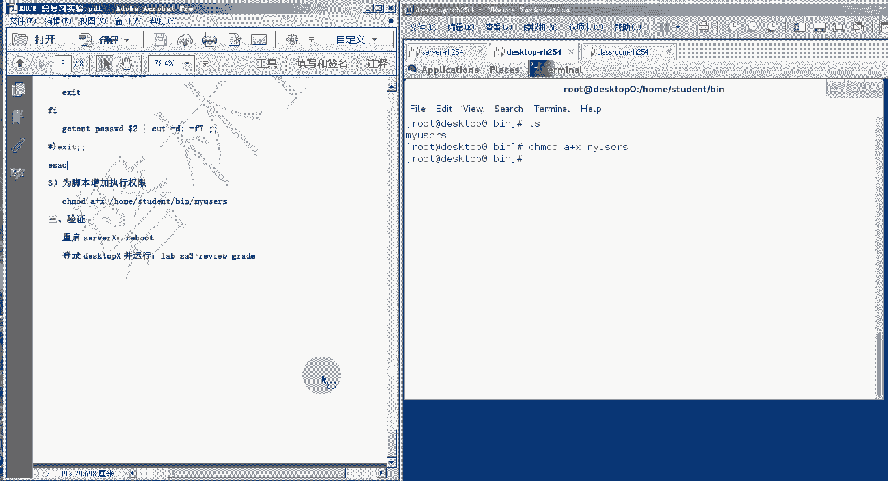

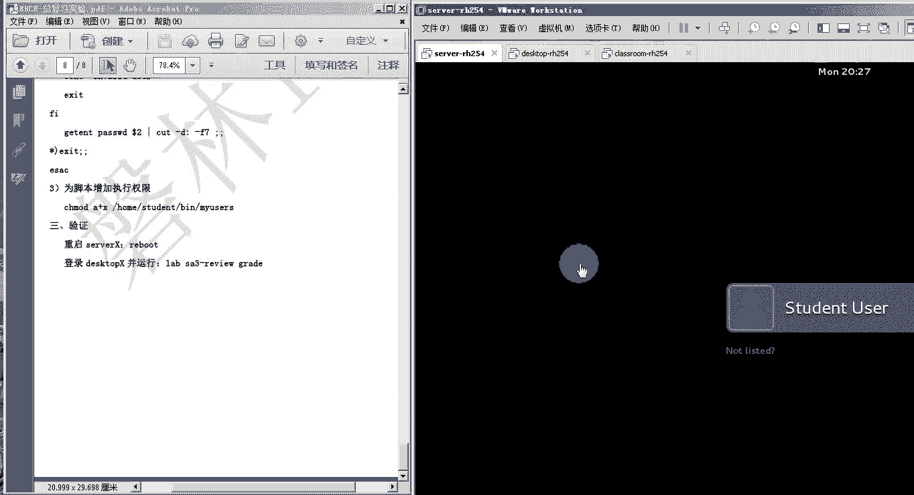

### 6. 配置Samba共享服务
在 `server` 上配置Samba共享，并设置组和用户访问控制。
```bash
groupadd bigbang
useradd -s /sbin/nologin -G bigbang penny
mkdir -p /exports/bigbang
chown :bigbang /exports/bigbang
semanage fcontext -a -t samba_share_t ‘/exports/bigbang(/.*)?’
restorecon -Rv /exports/bigbang
# 编辑 /etc/samba/smb.conf，添加共享配置
smbpasswd -a penny # 设置Samba用户密码
systemctl enable --now smb
firewall-cmd --permanent --add-service=samba
firewall-cmd --reload
```

### 7. 配置HTTPS虚拟主机
在 `server` 上配置Apache，实现基于SSL/TLS的HTTPS虚拟主机。
```bash
yum install -y httpd mod_ssl mariadb-server php php-mysql
# 配置数据库，部署网页文件到 /srv/www 和 /srv/webapp
# 从 classroom 下载SSL证书和密钥到 /etc/pki/tls 相应目录
# 编辑 /etc/httpd/conf.d/ssl.conf 或创建独立的虚拟主机配置文件
semanage port -a -t http_port_t -p tcp 444 # 如果使用非标准端口
systemctl enable --now httpd
firewall-cmd --permanent --add-port=443/tcp # 或 add-port=444/tcp
firewall-cmd --reload
```

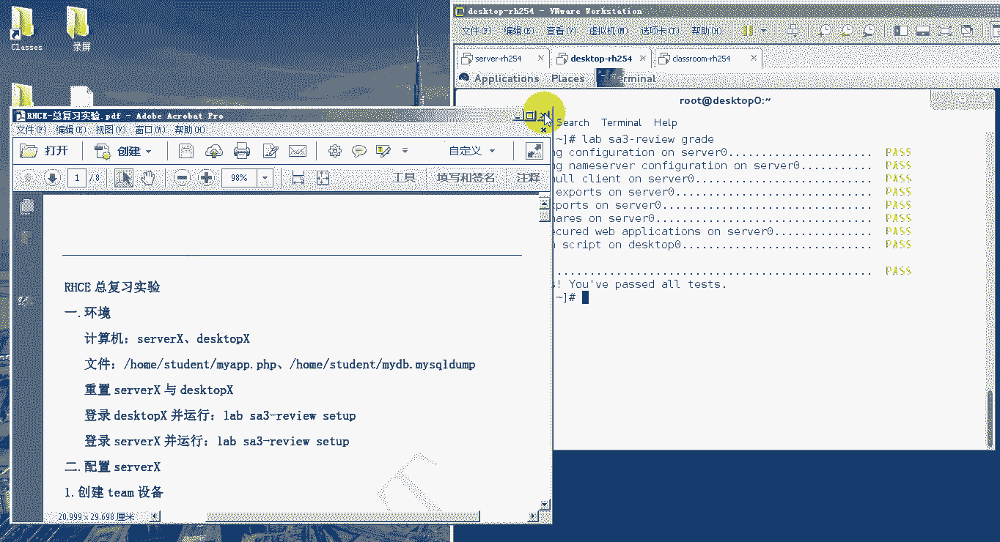

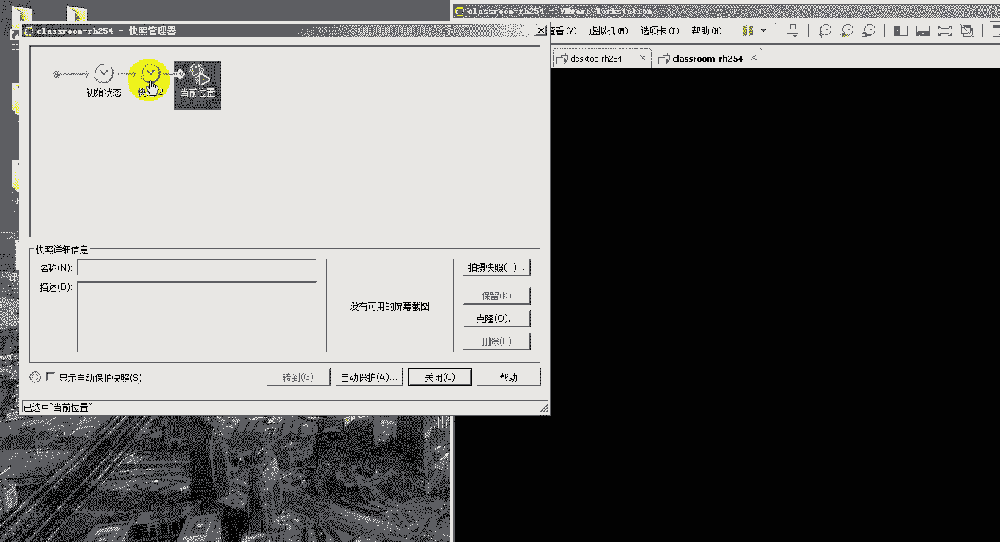

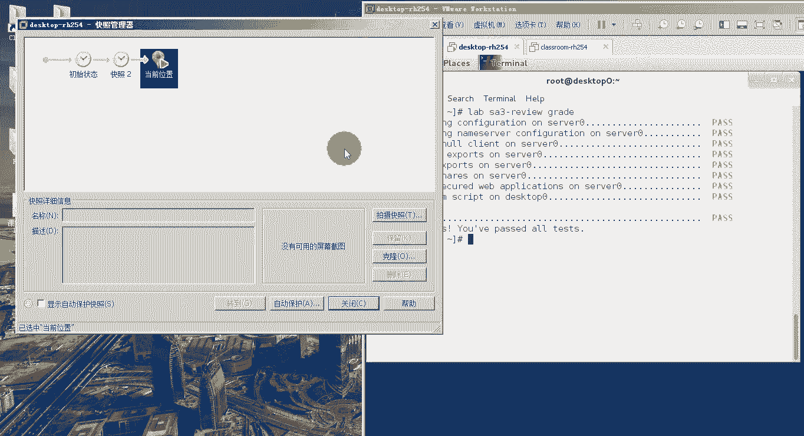

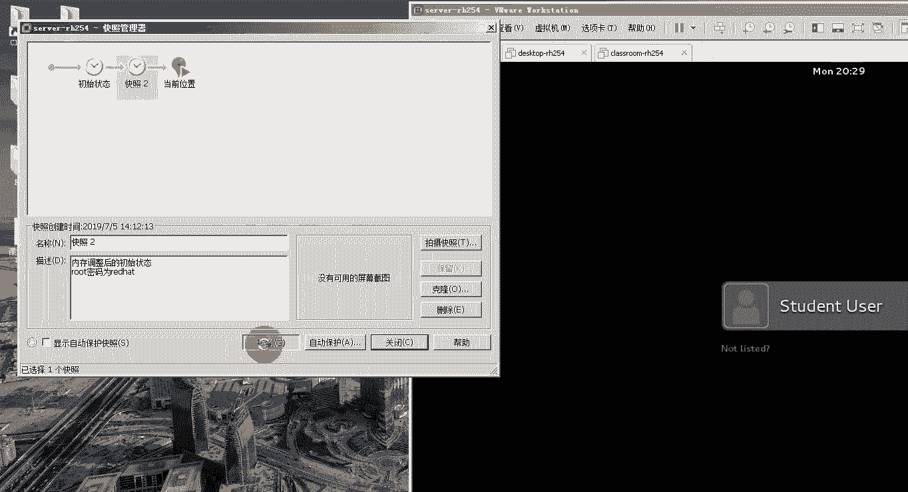

### 8. 编写用户信息查询脚本（在desktop上）
在 `desktop` 上编写一个Bash脚本，根据输入参数查询用户信息。
```bash
#!/bin/bash
# 脚本名：myuserinfo
# 功能：根据参数输出用户列表或指定用户信息
# 脚本逻辑判断参数并执行相应操作
chmod +x myuserinfo
```

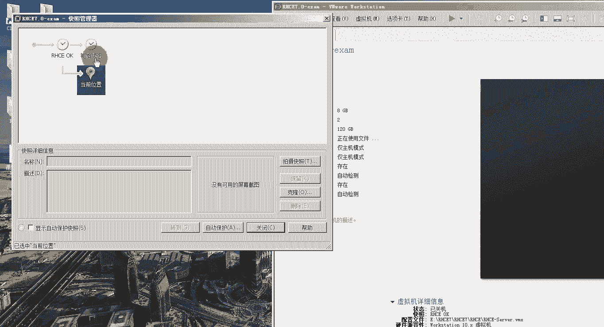

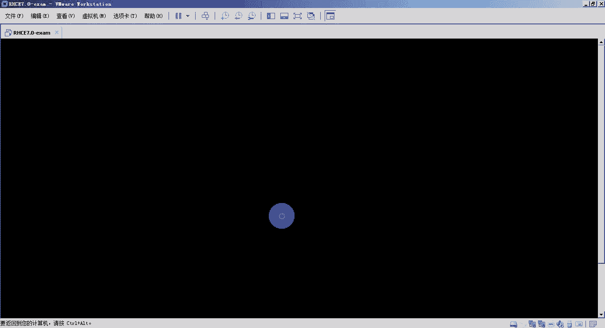

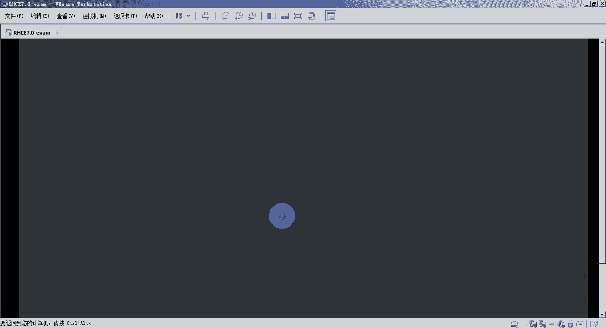

### 实验验证
完成所有配置后，在 `desktop` 上运行验证脚本，检查各项服务配置是否正确。
```bash
lab sa3-review grade
```

---

## 课程总结与考试准备

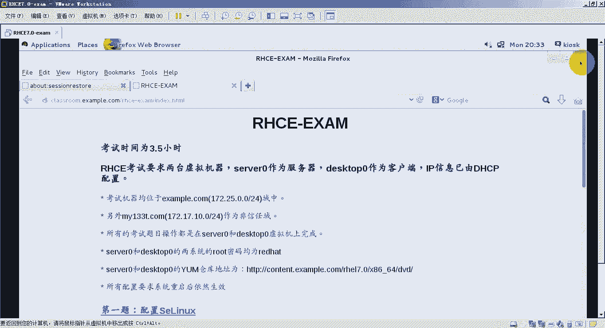

本节课中，我们一起学习了Docker容器技术的基本概念、架构以及镜像的层级结构。随后，我们通过一个总复习实验，综合演练了网络配置、DNS、邮件服务、存储服务（iSCSI、NFS、Samba）、Web服务（HTTPS）和Shell脚本编写等核心技能。

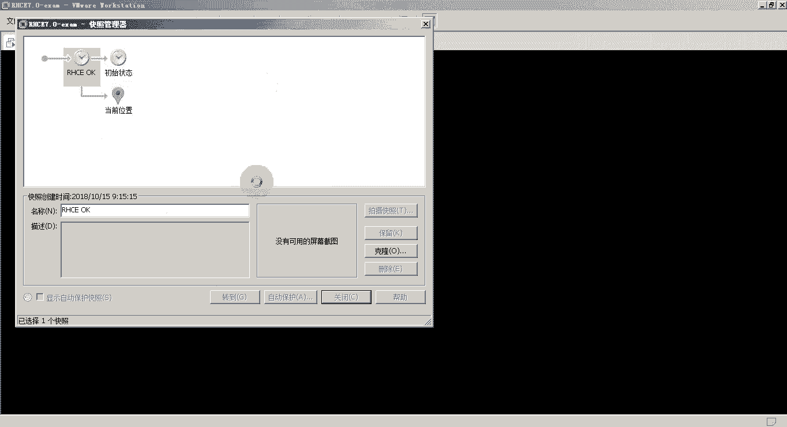

RHCE考试不仅考察知识的掌握程度，更强调操作的熟练度。希望大家能利用课程提供的实验环境、复习资料和模拟试题，反复练习，做到熟练、准确、高效。预祝各位考试成功！