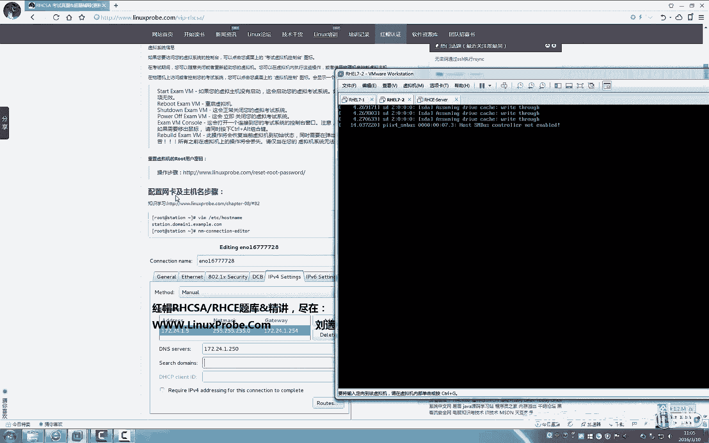

# 红帽RHCSA 7考试真题精讲考前辅导（Linux就该这么学） - P1 - 老刘努力不废话 - BV1iG411r7k4

点击一下后面认证这个标签，那就可以看到咱们这个帖子，这个帖子里面呢，我们很详细的去讲解了红帽二公司红毛认证，红帽认证体系，红马HCCHCEHCA的各种的考试技巧，考试范围，考试的这个时间的一些要求。

那我们今天就不去再去介绍这些了好吧，因为这要是全部说下来的话，要70多分钟，所以呢，我们这里给大家单独又去录制了一个视频啊，已经放到咱们这个帖子里面了，一定要去看，一定要去看。

因为毕竟大家考一次是4000多块钱，挣钱很不容易对吧，4000多块钱一定要准备充分了，并且呢咱们这套课程是完全的覆盖了，咱们的红帽rh cs，红帽的HC的考前边这个考试内容，那么呢我们呃。

但是同学们的掌握程度是因人而异的，虽然我们的课程完全覆盖了，但是大家的掌握程度是因人而异的，并不能说老师做完了一遍之后，你就认为自己去掌握了对吧，一定要能够自己也能够去做出来，这些相关的实验。

那么我们的课程量呢非常的大，但能够感觉出来，但是实际上我们考试的时候，你就会感觉到是so easy的啊，非常非常简单，那么我们一般同学呢在上午课程安排，考试安排的话呢，是上午考的是CSA。

下午的考试是CE，如果你的上午还是CIC过了，那么恭喜你就拿到了红木阿智CIC的认证啊，证书，如果下午的HC也过了，OK那你就是RHCE，而如果是下午的HCE啊，过了的话，上午的这科H3C挂科了。

那你需要去补考一下，这科才能拿到完整的RHCO，那么我们对于红帽的HCC和红帽的HC，的考试费用呢是4200块钱，全国统一价格，那么我们如果要是挂科了的话，如果要是有一科挂掉的话。

那我们分如果要是红帽的，上午H3C挂掉的话呢，是1500块钱，考试费很便宜，下午的RHCE考试挂掉呢，就是2500块钱啊，就是加在一起了，这个价格也是比这个单报考试费用要优惠很多，要优惠几百块钱。

同时呢也就是哪科，不过啊，我们去补考哪科就可以了，另外呢希望大家用不到我们这种优惠好吧，大家都能都能够争取一次通过它，OK那我们对于鸿毛二这个认证啊，考试要求啊什么的，我就不多说了。

我们主要来讲一下今天的这个HCAC的考题，那么考题呢也是点击一下我们的标签，点击一下是cs这个超经辅导这个帖子啊，你就可以看到这个帖子了，那么有这个我们因为是有这个密码的限制的。

如果你要不是已经登录的会员呢，你需要用一个你的密钥去验证它，这个密钥你没有的话，一定要来跟我们的老师说，那然后或者如果老师呃没有回复你的话，比如说比较忙，你可以在咱们的论坛里面发帖索要一下。

但是千万不能说在咱们的会员群里面，还有这个学员群里面去问，如果要是我们谁把自己的密钥透露出去了，那最后我们发现呃，比如说我们最后会做那种验证的对吧，我们发现同一个密钥在两个不同的地方，这个地点登录。

我们会对这个账号做一些限制的，OK那我们就先说到这些啊，红包20CC的考题，就是咱们帖子里面写到的，一共17道题，有人说这个很很简单，实际上它就是很简单，红帽H3C的考题，这是最全的版本了。

最全的你们考试的时候顶多这是这是17道题，只会比这个简单，不会比这个更难了，红马rh cs的考题，那我们这个所有的题呢，也都是根据红帽这个真实考题，我们给大家的。

不信可以来看一下我们的红帽考试是这样的呃，红帽的考试是这样的，是这样的，是这样的，当你做到了你的椅子上之后啊，你的桌面上就会有一个图标，是让你去点击一下那个开始考试，当你点了开始考试之后。

你就会看到这么一个界面啊，就是在左上角的是一个红帽logo，这边是你的考试的内容，这边是可以选择语言，中，英文还是日语都可以去选择，所以我看到网上有人说红包的还是CCR，红包还是C不能选择中文。

就是纯扯了，你看这个都能够去选择，没问题呃，英文的，日语的，韩文的都可以啊，这边呢会出现你的名字，我把这个名字给它去掉了啊，大家会看到，比如说我是流传OK为流传准备的啊，这cs考试。

那么这个呢就是完全的是考试的那个界面，所以我给大家都粘贴出来了，提提前了之后一定要看每一个字都要看清楚，每个字都要看清楚，因为你考试的时候你要再去看的话，是不是就浪费你的考试时间了。

就浪费你的考试时间了，所以你要提前把咱们这份帖子里面的，所有的字都给他看明白好吧，一定要去看，不要等到考试的时候，你再详细去看去，就浪费你考试的时间了。

好，那我们鸿蒙HCSC呢只有一台机器，就一台电脑啊，我们的红马HCC，红马HC都是一台机器，只有到了RHC里面才是两台机器，三台机器的才有两台机器，那我们这个红包HCSA啊，它是一台机器。

不过你这台主机里面呢有一台虚拟机，就是当你啊进入你的考场，然后签字，然后跟老师打报告什么的，这样都做好了之后，你坐在椅子上面坐定了，OK他让你去统一填写一些信息啊，我们先来说一下考试这个信息啊。

你会看到这么一个淡黄色的啊，这么一个界面才要求这个老师会上讲台去说啊，他说什么就填什么，比如说他想去填写，填写你的姓名好，你就填写你的姓名一定要是拼音啊啊然后呢，天气姐。

你的这个邮箱地址就是我们的姓名拼音，at linux prop点com，这个邮箱一定要统一，因为大家去接证书的时候，是通过这个证去，通过这个邮箱去接收我们的证书的。

邮箱一定要跟我们登记的时候是保持一致的，然后呢是你的国家在什么，是这个以及这个考试的内容，这个都是英文的，如果你要看不懂的话，随时跟老师举举手，是去说啊，这个老师会给你一步一步去点啊。

这这这这个是他这个会完全负责的，因为我们毕竟是我们虽然说是考试对吧，但是我们也花了4000多块钱，我们是一名消费者，我们如果要是对他的考试不满意，也可以发起投诉的，大家可能没有想到对吧，是这样的啊。

我们如果对考试呢不太满意的话，比如说这个老师啊，明明出现了系统性的问题，比如说我这个网线或者说松了，或者说我的电源线松了，一下子又关机了，做到一半关机了，而我们知道按一个服务的时候，如果他中断的话。

是不是我们再装的话就很麻烦，还要去投研机器什么的，他但是他不给你去处理，还不给你加时间什么的，可以去发起投诉，没问题啊，那么这些呢就是我们除了技术方面以外，老师会给你介绍一些我就会想起来的话啊。

我都会给大家去说，考试的技巧会给大家讲明白啊，包括说考试的时候，因为这套课程呢我们会加密之后再发布，所以呢也都是学员能够听到，我们也就有什么就说什么啊，不管是rh cs h c e都是可以带参考资料的。

也就是小抄的可以带，但是我们就不能说出去对吧，因为当你考试之前会有一段准备时间，比如说你九点钟考试，我十点钟考试，你会提前半个小时去对吧，那你总要带什么东西提前去看一看对吧。

尤其是我们考试的前20分钟啊，我们这样啊看一眼的话，会有一个很好的记忆对吧，OK那我们可以临到考试的前5分钟，都可以去看我们这个纸的，也就他这可不叫做小抄啊对吧，我们就叫做这个资料吧。

我们都可以去看我们的资料的，OK你可以拿着你的资料去，只不过考试的时候放到你的包里就可以了，好那我们这个考试呢这个开始之后，老师就不会管你了，老师会坐在前面，你们这个机房里面人就哗哗哗去打。

这个气氛还是比较好的，一般也没有人说话，那你就去做你的题就可以了，呃考试时间呢老师不会提醒你，然后这个老师不会提醒你，你要自己带一块表呃，老师的考试的时候呢，可以发一张A4纸或一张会感笔，他会给你发。

如果他没有发的话，你可以跟他要啊，要的这个用处就是它会给你呢去啊，提示一些信息，你可以把你的密码啊什么的写到那个纸上，省来回来去翻，比如说你最后其实没有什么可写的，对吧啊，比如说你要写一些笔记啊。

或者说你写些草稿，如果要用的话，可以跟老师要红毛RHCC的考试是这样的，当你进入到你的这个考试的，这个环境里面了之后，你就填你的信息，国家地点什么的，还以账号邮箱姓名都填好了之后，点击下一步。

这时候不要动听老师的指挥，他告他会告诉你说同学们都不要动，点完下一步之后不要动，他那边呢会开启他的虚拟机啊，不他会开启他的考试这个平台，等它开始了之后，他会要求你们好的，你们统一点一下下一步。

然后这时候再不要动它，让你点几下，然后你就点几下，一定要按照步骤走，有同学就是点的非常快啊，快快快快快，从小点到下一步了，从头点完了，其实在老师那边平台还没有开，你就点完了。

于是呢就导致你的这个考试这边就出现问题，还需要对你重新去做，耽误你的时间，好那我们这个考试呢就啊来说一下考试吧，我们的考试呢是这样的，当你都做完了这些之后，填写好了之后，点击最后一次。

下一步一个完成的时候，你的系统都会重启，重启了之后你就可以登录到这个系统里面，但是这个系统是一个你的考试的一个物理机，就像我们做实验的时候，是不是拿虚拟机去做，考试的时候也是他是拿KVM这个虚拟机。

我们是用的VN where workstation，对吧，它呢是拿KVM去做的，实际上是一样的，你就点击一下桌面上有一个小图标，很简单，你能看得明白啊，就是一个考试机器差不多这么四个字。

或者它叫做server，你去双击它，它有一个开启啊，它会有一键，还有这么几个动作，有这个启动，有这个重启，有这个关闭啊，power up就是强制关闭，还有这个console口啊。

还有这个rebuilt review呢，一般不要去动，因为review代表你机器是这个考试环境啊，真是出现了很大的问题，你排错已经来不及了，你就可以直接去rebuild，在红帽RH3啊。

红包real和real6的时候呢，冲进去rebuild的机器的话呢，需要老师去干预，而在real7的考试环境里面，他加入了这个功能，学员自己就可以去做这个rebuild，不需要跟老师去说。

直接如果你要是机器真的出现了大问题，先不要急着骂老师啊，先不要急着骂，我就赶紧去，不要想着去排错，因为除了出现了很大的问题，比如说做着做着突然断电了，做到安装一个服务，很大的一个服务啊，突然突然断电了。

马上你就要去从事这个rebuild的机器，因为我们坦白来说，我们去考试的时候并不是为了学习，我们顺便拿了那张纸，所以我们一定要拿说去配置一个服务的时候，排错时间要远远大于你就重新安装它的时间的。

所以我们根据这个时间来定，另外呢有些时候啊呃比如说我们刚做完两道题，从rebuild的机器没有问题，如果你做到最后一道题了，最后一道题做不出来，但是你能保证你前面的题全都做对了的话。

你就千万千万别给他rebuild了好吗，因为你的这个考试成绩是210分，满分300分，也就70%就可以及格了，它允许你30%的错误，他允许你30%的错误，你非得为了最后一道题你给他rebuild了。

结果你就前面的这个时间不够了，没有再重新做完对吧，OK就先说这些，然后呢我们的红包h cc呢，进入了你的考试界面之后，就是我们进入到里面这个KVM虚拟机之后，是这么一个界面，这个时候不要举手问老师。

因为他会给你一个密码，这个密码你去试那个密码的话，他登录不进去的，就是重置啊，重新去重置我们的密码，从这个不告诉你root的密码。

你去重置它，这个是让你把它重置成什么密码好吧，重制成的，它默认密码不会告诉你，所以呢我们把它给重启，这个不要按你底下那个机箱的这个开关啊，知道为什么吗，因为它是你的虚拟机。

你就在那个桌面上那个图标上面点击一下，它，点击重启就可以了，千万别捅你这个脚底下，那个机箱的那个按钮键啊，因为你这样一捅的话，是不是太傻了是吧，整个机器都给他重启了嗯我自己有问题是吧。

好这台虚拟机它这个重启时到的问题，我们的虚拟机重启了之后呢，我们就来啊，首先呢把它这个编辑一下内核对吧，我们都学过，我们在这个LINUX16后面加上什么r d break对吧，我们稍等一下。

移到最后面啊，输入RD点break，CTRL加X去重置一下我们的日期密码，考试的时候就这样去做就可以了。

而且考试的机器会比较快啊，相对于来说比较快。

那么老师做一些步骤的时候啊，你就都要看清楚我们是怎么样去做的好，另外呢红帽的考试的系统是这样的，红帽考试环境老有同学跟我们去要，实际上你看到实际上就是你的这个练习环境，就完全可以胜任了啊，红帽了。

考试的环境只是说他帮你配置好了这个样仓库，比如说配置好的DNS，实际上我们去练习的时候完全可以自己去动的，因为我们的课程不像实力培训，只讲考试范围，比如说open stack，比如说这个不不。

比如说open open l d a p这些老师都是讲过的，你可以完全自己去配，比如DNSDHCP我们都学过对吧，我们可以自己去配，但是如果一定要跟老师要这个考试环境的话呢，老师也可以提供给你。

但是不太建议，因为我们希望自己再去练一遍，毕竟还是除了这个考试之外，还有一个工作呢对吧，我们现在来重置一下你的密码呃，红帽的上午啊，这是cc，我们就瞎聊啊，一般我一般做的时候就瞎聊着。

考试呢是时间是比较充裕的，我们将这个密码给他重置，别人给他right hand，别给他瞎写啊，他要求你是什么就写成什么，它是FLECTRAG还要求什么，你就写什么，要求什么，写什么好，重置好。

重启一下虚拟机，再进的时候就可以使用新密码登录了，那么这个密码呢你可能不熟，所以你可以拿一张纸写到那个纸上，放放你的这个桌子上面对吧，然后你就不用再来回来去往那边翻页了。

你看老师这里也把它放在一个页面上了，实际上他考试的时候是一个网页式的，你要来回家去点，挺麻烦的对吧，飞鼠标就把它写在你的纸上，放在你的桌子上就可以了，那么只有当你的这个，而且cs c是这样的。

如果没有听过考前辅导人上去准死，就是他不知道怎么去做啊，红包呢你看首先去重置一下你的密码，重置完你的密码之后呢，你是看不到考题的啊，你需要把你的这个虚拟机里面的IP地址，我这我必须要再说一遍啊。

听清楚一定要听清楚，这话只说一遍的，就是说你当你进入到哪去cc的考试环境里面，你的物理机上有考题对吧，你双击了之后，默认是看不到考题的，只会看到这么一段话，从这里到这里，这么一段话只看到这些。

你需要将你的虚拟机里面的密码给他，重置了之后，配置好了主机名和IP地址之后，再去刷新一下你的真实机上面的这个页面，你才能够看到考题，就是说如果你的虚拟机里面的IP地址，没有配置对的话。

你连考题都看不到的，你是看不到考题的啊，我们这边稍等啊，他这个有点慢是吧。

哦他这个速度比较慢啊。

所以我把它，稍等一下，考试的时候不会这么慢啊，因为我这个是虚拟机，而且这边有一台机器挂掉了，不知道为什么，所以呢他这个去重置密码，重启那一次会很慢啊，这样的我们稍等一下他好吧。

好我们重启之后呢，点击登录，登录之后用root登录啊，用root登录，不要说用其他用户自己下去打一个，他不是他就用root登录就可以了，密码呢就是我们刚才重置好的。

他这个IP地址跟这个主机名呢，你看到是不是station点DOM一点example点cook，他的IP地址是172。24。1。5，看看老师说这个一时候是不是强调了一下，就是说考试的时候呢。

他可能会有一个合唱，里面有15台机器，这个一呢是第一台机器的，如果你做到第12个位置呢，它就变成了12，那就是station点慢，12。1example点com，你要配置的IP地址就是172。2，4。

12。5，也就是说你练习的时候，这个一这边这个位置的一可能会随着你的位置，就是你做到哪里了，它会发生改变的，不要说我们现在看的是一，到最后夸夸夸，算到赔偿的是一，最后没有分好吧，就是考试的时候。

你这个题目会发生变化，但是变化只会变化这个这一位好啊，我们有些同学啊就非常可爱，就是我们听完了这个考前辅导之后，因为练的是一就去抢第一个位置去，其实也是可以的啊，以后看到了上来就去抢抢第一个位置的。

就一定是老刘老师的这个学生，OK是这样的，我们讲过啊，配置网卡有五种方法，好记得吗，有一个这个直接编辑配置文件，有一个NMTUI，一个NMCICLY，一个这个图形化界面，一个点右上角啊。

考试的时候呢怎么简单，怎么来，别像老师似的去配置这个配置文件了，我们用这个图形化工具来配好吧，我来一步一步来做哦，怎么这么多这个网卡，另外呢考试的时候这台机器没有还原是吧，管他管他，我把它都给删掉。

考试的时候你会有一块网卡，就是叫ETH0，网卡名称无所谓，你管他呢对吧，我们双击它进去啊，这里面呢我们有一个两个勾，不需要勾选上代表开机自动启动，如果你这两个勾不勾的话，包括你以后配置出来的服务。

如果没有勾选的话，你的考试是没有分的，你配置的再对它会重启你的机器，你依然是没有分，这里面呢我们看一下没问题，Ipv4，我去改一下，172点呃，24。1。5对吧，子网是R52525。0，网关是172点。

24。1。254呃，网名这个名称服务呢就是DNS对吧，D172。24。1。250都没问题了，之后点击保存啊，点击关闭，然后重启一下你的网卡啊，重启一下你的网络，这个时候你再刷新一下你的这个上面的题目。

你的真实机上面的题目呢就会看到了，OK那你的网卡呢网络呢已经配出来了，也已经是配出来的，因为老师这个机器忘了还原了，所以我们这边有一些多余的网卡，没有关系，考试的时候就有一块1T0就可以了。

看到这个网卡，这个IP地址是配置出来的才可以啊，并且把它加入到K启动项，那么下面老师在配置这些服务的时候，可能会没有跟你说，把这个服务加到开启录像当中，但是大家必须要记清楚，一旦你去考试了。

任何的这个服务配置的东西，配置过的东西都必须要加入到开机启动项当中，都必须加入到开机启动项当中好，首先呢我们一步来重置密码之后，重置一下网卡都是太简单的事情了对吧，第一道题。

将你的CLINUX给大家加入到必须是强制启动模式，ok vim etc里面的SELINUXCONFIG这个文件，它默认已经是enforcing了，已经是强制了，所以你的动作就是看一眼它，看一眼它。

然后呢就把它退出就可以了，有同学说老师这这是一道考题呢，我们就看一眼就走了吗，那你还要怎么样，他已经是强制了，我们还要把它改成disabled的吗，是吧，就是说我们考试的时候。

他只是让你去检查一下就可以了，不要傻到把它改成，去把它改什么的，如果他是disabled，把它改成enforcing，如果他是，如果他是enforcing了，就把它怎么样保存退出就可以了。

退出它就可以了，我们不用去做修改，这道题是一道送分题啊，这是一道送分题，然后呢来配置你的YM仓库啊，考试的时候他不会给你镜像，而是给你一个配置好的YM仓库。

你需要去一呃YM点etc里面的YMRAMPLES对吧，去新建一个叫做比如说叫做real的REPO文件，这个名称无所谓，他的考试要求描述都不是老师瞎讲出来的，都是原真的考题里面去要求的。

并且呢我们每道题上面给大家去写了，如果你知道考题，你按照下面的方法去做，能够拿分，但是如果你想要去真正的再去复习一下，如果你完全忘记的话，想去复习的话，点一下上面这个链接。

就可以去复习一下我们相关的技术啊，很贴心是吧，OK我们现在起一个随这个随便来，比如说就是HCHCC点，Rainbow r e p o，没有要求的时候无随便去写，没有关系啊，敲下回车里面呢。

我们首先大括号是csa name，随便写的吧，BAI到后面他会给你这么一串这个信息，给你这么一串信息，记住考题有一个坑，就是这里边有一个点，这个点儿啊，千万别给我复制进去，这有个句号。

考试的时候句号都别给我复制进去啊，太傻了就好，我们给它填写进去，这时候可别手夸夸，夸一瞬就给我们填上，考试的时候挂在光盘那个地址了啊，千万别这样去做，这样给他写好啊，enable等于一。

它会给你这么一个地址，它已经配置好YM仓库，你可以在浏览器里面去看这个地址了，好现在呢我们把它写好了之后，保存并退出，因为老师这个环境呢没有这个rap，所以呢我们就啊不用测试了，你做完了之后。

你就可以用到这个ym clean2，稍等我把它先删掉，因为我们这边没有这个啊仓库它会报错了，所以呢我们把它删掉好，然后呢我们当你当当你做好了之后，添加好了之后，Ym clean or。

然后ym make catch啊，这样呢他把这个给它同步上了缓存，给他建立出来了，你要去做呢。

就是yum install，可以去尝试安装一个服务，比如说阿帕，你可以去尝试安装一下啊，他会安装成功的话，代表我们的配置也是成功的，既然他要求我们去配置一个逻辑卷进行扩充啊。

扩充跟缩小呢我们也不太确定它到底是考哪个，不过呢我们看了很多份这个题目啊，看了很多份题目，他要求的都是这个啊，他要求的全部都是扩充，不过既然我们学习技术嘛啊，就是扩充跟这个减小都去学一下就最好了。

好我们现在呢添加一块网卡，添加一块硬盘进去，添加一块硬盘，比如说20个G无所谓啊，无所谓，然后呢他看这个题目，他说将逻辑卷，VO及其文件系统调整到300兆啊，请确保文件系统内的内容是完整的呃。

并且呢说是300兆，当你是270~330之间，这个范围都是可以被接受的，就是我们还是这么一个说的，就是我们的硬盘的制造商呢，是按照这个1K等于1024字节这样去造的。

我们的LINUX系统是按照1K等于呃，1024K这个字节这样去算的，所以呢他每个K每个这个KB也就差了24集，这个字节每100兆呢，每1000啊，每1G呢就差了24兆，所以呢我们这里有一些这个偏差。

是能够被允许的，不用说非得要卡到这个300上，差了两个照都不行啊，没有啊，就是说考试会给你一个范围，270~330之间都是可以的，都是可以的，好我们先来进入到系统，因为我们的这个考试环境。

跟这个练习环境虽然是一样的，不过我们现在没有他为我们做的铺垫，所以呢我们自己先去创建出来这么一个逻辑卷，这个呢我们都是在第六章里面学习过的，我们在第六章里面学习了硬盘的分区格式化。

挂载，做raid015十，还有做LVM的扩充扩展，还有快照，其实我们都是学过的，我们的课程量非常的丰富，好我们现在呢自己去啊，首先我们来做一个LVM好吧，这个呢我们在考试的时候不用去做，它默认会有啊。

默认会有，我们现在自己来去做，比如说给他一个H3C吧好吧，创建这么一个卷组好，创建一个卷子A应该是vg correct对吧，Vg correct，然后呢我们给他一个卷子，他说扩充到300兆。

那我们就先给他一个200兆的好吧，给他一个名字叫VOGELO，200兆的话，一个P是五兆吧，一个是四兆，那么也就是4452十，那就给他50个还是cs，这个因为老师讲这个课程的时候，就感觉到非常的快对吧。

我们不会说呃，太费心给大家去太详细的给大家再讲一遍，比如说什么叫LVMLVM逻辑卷，PVVG啊，还有LV它的作用是什么，每个参数的含义，因为我们的考试的考前辅导呢，就是以考试为准的啊，考试为主的。

所以如果你要是忘记的话呢，就啊去看一下我们的相关的培训课程好吧，培训的课程，我们的考试呢是给一定有基础的学员来准备的，如果你现在刚刚听到第十节，第五节课，刚刚报名的学员啊，我们就先可以先放一放。

不用担心这些老师做过的一些事情，都会去讲课的时候去讲解到的，并且我们考试的时候会有两个月时间的对吧，不着急，然后我们去这个给它格式化一下，这些啊，到此为止全都是他做好的，当你接到这个系统了之后。

你要去做的就是把这个给他扩充到300兆，并且呢他说挂载到一个地方，他没有要求是吧，但是应该你去看一眼那个fs tab这个文件，有没有他这个挂载信息，比如说有的话，你就DV里面的RJCSVO。

它是挂载到了这个fancy这个目录上面，格式呢是XFS权限，Default，减四减是零零好，我们呢先去创建这么一个目录，假设说啊他考试的时候这样要求，因为如果你要是他有的话，你没有这样去做。

他会算你没有分了，因为他会冲进你的机器好，这个时候呢，但是如果要是没有写到那个配置文件里面说，那不需要去开机自动加载，你也不要自己去给它加载上好吧，就按照它的默认去走，看到他现在已经挂载上了。

大小是197兆，我们现在呢呃扩充的话，尽量要把它给卸载掉对吧，那保证我们的数据完整性卸载掉，然后lv extend，它这个默认的文件系统呢是这个XFS的，所以我们跟这个ETEXT4的话还有差别。

首先我们将它扩充到300兆DV里面的H3，SA里面的VO啊，我们这个里面的这个卷组叫做LINUX，无所谓啊。

我们现在里面叫做HCC，考试的时候是什么就是什么，如果你不知道是什么的话，那执行这条命令叫做LV，看，这条命令这个呢就是它的地址了，他说这个VO这个卷是不是就能够找到他了，对吧。

如果你要是不知道它是什么的话，这就告诉你了，这是他的设备的目录，这是他的卷组名称，这是它的卷的名称，好现在呢我们去扩充到300兆，扩充好了之后，XFS什么group啊，增加它。

它是不是跟ETXT4还有不一样的对吧，有一个不一样的命令好，我们去呃，我怎么样，必须要把它挂载上才行是吧，OK给它挂载上，刚刚老师说错了，必须要挂载上之后插FI才能够去扩充，现在把它扩充到了300兆了。

对吧好，我们再来看一下这个挂载的信息，是不是从二百一百九十七到了297，297，我们仔细一看，是不是也满足了这个需求了，270~330之间可满足需求，太简单了，就第四道题了啊，非常的简单。

考试的时候你可以提前走的，因为我们的这个H3C相对来讲是非常简单的，如果你要是做完了的话，你就可以提前走啊，中午吃点饭什么的，因为上午考完试，cs下午考试C挺累的呃，你可以去吃点饭啊对吧。

准备准备吓我都可以，红帽这边瞎扯，红帽HC，红帽考试的话是在东大桥侨福芳草地那边。

环境是很不错的，那边是在一个购物广场里面呃，比较上档次吧，然后下面有那个西餐啊，日式的，还有意式的，这些饭都有，出门之后有吉野家麦当劳，都是在马路对面啊，老师比较喜欢吃他们楼下那个意式的那个。

还有一个日本的，就是在那个美食广场里面往左走，你可以去找一找啊，好我们先来看第四道题，第四道题就是说创建一个叫做admin user，怎么一个组，是不是闹着玩的一样的，是不是这都什么题啊，多简单啊。

创建这么一个组好，拿到一个分，创建一个叫做NATASHA怎么念NASA是吧，这么一用户让它属于到这个组里面，这不是闹着玩的吗，太简单了，1group对吧，扩充组的话是大结局，负这个本本组的话是小写G。

大写的G1定要是呃给他写到这个用户上面，这个用户组上面，参数加前面加后面无所谓啊，但如果你是处女座的话，有强迫症啊是吧，我们必须要给他写漂亮一些，OK再新建一个harry，看到没有。

这两个用户实际上是一样的，hi然后这道题很扯，看到第四个小问啊，第四个小问很扯，说新建一个叫做SERAH的用户，其在系统中没有可交互的一个shell，就是说我们的翻译官呢是一个NO longin对吧。

并且呢该用户不是admin user这个组的成员，这不很扯吗，他不提不就行了吗对吧，也就是说我们不用去啊去加给他，加到这个组里面，而是指定一下他这个解释官，翻译官是谁啊，所以它的名称叫做sorry是吧。

无所谓啊，给大家写上去，并且呢重置这三个用户的密码，他们的密码都是这个FLECTOR，Y r a g k，我们做的快一些呢，呃我们吃饭的时候也省得排队，因为呃红帽那边考试的地方不光是你在考。

那还有一些商场什么的，电影院什么的，他们也要吃饭对吧，你天天早上去，比如说你听老师的这个课程做的很顺，坐一个半小时，做完了，你就先去吃点省的排队了啊，红帽这边樵夫你还需要去办一张卡啊。

就是前台的时候需要办张卡，吃完再退那种，你要是去晚的话，还老得排队，你想多烦，比如说你中午就休息一个半小时，你花了半个小时排队，仓仓促促的吃完饭了是吧，上古杂志C是很轻松的，我们就啊把时间放充裕了去做。

然后做完了之后检查一下，没问题就可以走了，呃，第五道题呢是配置一下你的FSTB这个文件，实际上它讲的是什么，讲的是FASL和默认的权限的考这个考察，但是我们对于文件的权限是不是又学过什么。

我们学过文件的普通权限，特殊权限，还有隐藏权限，还学过sq啊啊还学过sq u i d和F4L，实际上这两题拿过来之后非常的简单，他会要求你去拷贝一个文件，这个文件是在etc里面的fs tab。

这个文件拷贝到VR目录下里面的TMP里面的time，里面的FSTB拷贝到这里，然后要求说这该这个拷贝到的这个文件啊，所有者是root k root，所属于也属于root组组，其实这道题很扯。

因为你把它拷贝过来的这个过程，就已经把他这个所有者和所有者给更改了，所验证的话，那你就可以去看一下这个文件，它的所有者和所有组是不是都是root，OK都没有问题，他对于任何人都不可执行。

你看任何人都不可执行，所以说前三道题，只要你把这个文件复制过来的话，它都是默认已经是做好的，给分题，只要你不要去改它就行了，就给分的题，用户呢他可以对它进行进行读写，harry呢不能够进行读。

也不能进行写，那么对于单一用户进行的一个文件限制，是不是就是权限限制就是FA sl了，好fa4L呃，这两个用户都是刚才新建好对吧，我们直接来啊，Get fl，先来看一下这个文件，先来看一下这个文件啊。

当前没有这个控制列表，我们来set fs l啊，杠mu对于用户进行设置的话是杠mu，对于一个用户组的话是杠mg，对于一个目录来讲的话是杠R大写RM啊对吧，带一个递归，啊听过老师课的同学好好听的话。

听老师现在再去讲一遍的话，考前辅导会很轻松很轻松，如果要是没有听的话，没有听过刘老师讲课的话，可能就会觉得你在说什么呀，好harry好很爽，我们现在做题对吧，非常简单，敲下回车。

这样呢这个用户就可以有了读写权限，而harry呢没有任何权限就可以了，好对于其他用户，包括将来的都能够对该用户，都能够对该文件进行读操作，这道题其实也很扯，也是送分题，你看一下这个权限。

如果我们对于其他的这个用户，包括什么的都能对它进行读，是默认已经是可以都读了，并且都不能去执行，所以这道题实际上就两步啊，第一是把它复制过来，第二设置一下FA sl这道题稳拿好，传达到这个分太简单了。

第一道第六道题啊，第六道题呢我们去这个配置一个计划任务，他说这个很诡异，他说每天啊就是下午还好啊，说下午14：23分去执行这个使用echo，输入一个hie啊，这么一句话，你现在可以自己去执行一下。

看看什么用处啊，他就是把这个hi输出到屏幕上，就这么一个事情好，我们去写它的配置文件，但是看好了，他说要对于NATASS一个用户拿啥吧，这个用户不是不叫那啥，这个用户进行了设置。

所以我们要用到FATAB杠一杠U对吧，对于其他用户的话呢，不是本用户需要加杠U参数，你也可以怎么样，是不是可以去切到这个用户里面，这个毕竟我们是root用户，而且他这是我们刚刚建立出来的一个用户。

如果你不想加杠U的话，我们直接切进去是不是也是可以的，切进去也是可以的，好我们这样去做就行了，显得我们有水平是吧，OK啊，计划任务的话，他这个格式是分时日月星期命令来再说一遍。

分时日月星期命令分时没有的话，就是日月星期用星号来代替，然后命令命令不要去瞎想啊，比如说给他一个echo hiit，这样老师也敢跟你说是对的，你这样做肯定是对的，不过啊考试的那个判分脚本呢是一个考判分。

是一个脚本，他如果有一点不匹配，没有匹配上的话呢，他都可能会算你错，他这个命令可能就是这个脚本老是猜啊，就是匹配一下，你这个这这这句话里面有没有出现23，有没有出现14。

有没有出现这个being equal high，完全匹配上了之后，这道题才有分，所以呢我们这样一定要按照他的要求去写，做完了之后啊，我们可以用的杠杠U，看一下这个该用户它有哪些啊。

计划任务是不是已经有了，好又拿一道题分，太简单了，然后说让你去创建一个共享的目录，这个共享目录的名字叫做home里面的enemies，OK所属组是它，那我们就CHMOD所有者不改的话。

就直接冒号或者一个点都可以，这个我们都讲过对吧，好给它修改用户组，修改好用户组之后啊，我们来看一下这个文件，用户组是不是已经被修改了，好的，看第二小问说啊，该成员对目录有读写。

该组的成员谁哪哪是哪个组的，是不ADD in user，这个用户组的有读写权限，其他用户呢没有除了用户以外，没有除了这个超级用户以外没有任何的权限，OK那很简单。

那么就是CHOD对于root组给他一个七无所谓，他没有要求对吧，超级用户对于所有对于该组的话呢，有读写与执行权限，这里啊读写与执行权限，那就是4+2加七，R加WI加X对于其他用户没有任何权限，就是零啊。

太简单了，这个我们讲权限RWX啊，421R啊，RWX读写之前觉得我们很熟的好，然后说呢我们要这个很扯看啊，他说在这个目录里面创建的任何文件，都归属于admin user，这个组，也是我们一想。

什么能够让该目录里面创建出来的文件，都属于该目录组的话呢，我们一想老师教过特殊权限，S u d s g d s b t，那我们想到SUID，是让他临时拥有了用户的权限啊，该拥有者的权限，SGID能用。

让他去拥有该拥这个程序的所有组的权限，并且对于目录来讲的话呢，执行好了，它是让它能够立即拥有什么，他让他去在里面去创建文件啊，归属于到该用户组，该目录的用户组的这个好事情。

就是说我们在这个目录里面再去创建的文件，都会归属到这个相关的用户组里面，好，我们来添加上他这个SGID啊，SBIT是什么来着，是不是我们加了SBIT之后，文件只能自己去管理，而其他人不能去管理好。

我们加好了之后再来最后看一下这个文件权限，还有用户所有者770用户组，并且呢我们加上了一个SGII啊，SGID没有问题都没有问题，就要去拿分升级内核，升级内核呢，实际上也是让你去配置一下YM仓库的。

这个时候老师做的时候有两种方法，就是他给你一个网址对吧，这个网址你去把这个复制进来，那复制进来之后用你的火狐浏览器打开它，它会有一个rpm包，你直接rpm杠IVH，把它下载下来之后去执行也是可以的。

你也可以配置你的YM仓库，就说两种方法，如果你考试的时候遇到哪种了呃，比如说遇到这种我们教的YM方式，出错了的时候，你就嗯用老师教第二种方法好吧，我们再去新建一个叫做update点rap。

这么一个文件名称无所谓，叫做ABC点rainbow也是也是对的啊，大括号name都是随便写的，随便写的这个脚本不管你老师也不管你对吧，随便去写，你写的越随意，说明你能对他这个理解越深刻，如果你看到这。

有些有同学啊啊这个做题的时候写的非常死板，比如说写下桑巴的描述文件的时候，还给他写上啊，什么什么啊，该什么实验，仅供书籍参考什么的，一看就是抄来的啊，就是说我们对于参数一定要有自己的理解。

我们能够随意一些的时候就省就省了一些键盘，好把这个路径呢这个地址啊给它复制进来，并且记住了两边这个点号，句号的话，我们一定要把它给扯这个删除掉，空格的话尽量也把它删除掉，enable把它启用JPG。

check等于零不进程进行这个校验，好保存它，因为老师这边呢没有这个文件，所以把它删掉，把它删掉了之后啊，我们ym clean2考试的时候，你可别配完之后把它删了啊，老师是因为没有这个目录。

没有这个YM仓库才把它删掉的，然后你再没再may catch一下，然后你用update kernel这个命令去来更新一下，你的内核，执行这条命去更新，因为我这边没有配置这个yum仓库。

所以呢他没有要求去更新什么，你要是配置好的话，他就要求你输入一下Y就安装，安装好了之后，你重启一下机器也是可以的，不重启也没有关系好吧，第九道题呢是说绑定一下web验证，这个其实是非常简单的。

因为老师呢不光是教了你的，open l d a p的这个客户端，也就教了一下如何去搭建open l d a p这个服务，我们连搭建服务都讲了，所以我相信同学们对于这个是没有问题的。

首先来安装一下open l d a p，它的这个客户端的管理工具，实际上我们凭良心来讲，老师讲的课程是非常丰富的，凭良凭这个凭良心说啊，全国的，乃至是说我们所有的这个培训的这个友商们啊。

网络的还是实地的，没有一家培训机构在HC阶段给你们讲过，Open l d a p，没有一家去讲，但是老师给你们讲了，并且我们做这个实验了，所以呢我们同学们对于这个红帽HC。

实际上我们可以感受刘老师的同学这个学生过，他是一个非常怎么说呢，因为很轻松的事情啊，很轻松的事情好，我们来安装这个open l d a p台的客户端，然后打开图形化工具，考试的时候。

不要像老师说的编辑配置文件什么的，打开图形化工具啊，并且你看到我们写边这个书籍，全国来讲，没有一家培训机构能够，把我们的课程写成一本书籍给大家提供出去，大家拿到手里就知道厚甸甸的，沉甸甸的。

有这么好的教材，而且我们的考试总结出来的这些题目，还有这些精讲配套的视频，还有这些答疑，过不去了，结果考试再不及格，那你就脸上其实很没有光的对吧，不要说是教师的学生了，就我们准备的真是太充分了。

只要你稍微用点心，你过这个考试是完全没有问题的，因为我们的培训主要就是这完全就超越了这个，考这个还是CE了对吧，所以我们过来考试应该是so easy的，顺手的事情，这个考前辅导其实都不是很必要。

因为你学学完了一遍之后，你直接去考试去，我觉得没问题，那么下面呢他让你去填写一下DNA信息，就是服务器的地址，DN等于DMA了，这你说老师这哪来的呀，这个是怎么算出来的呀，什么算，你看这不是写着呢吗。

他题目里面你看如果你懒的话，你就像这样，最后这个点可别把它复制进去啊，最后老有种坑，就是这个点句号别给它复制进去，把它复制进来，服务器的地址，这个怎么算呀，算什么呀，直接把它给复制进来。

你要看清题目之后，复制不就得了吗，然后说这个密钥的下载地址怎么算出来的呀，算什么呀，直接复制这个，因为老师这边没有open l DP，所以呢我们这样点会报错，我们就点击一下，取消好了，点击一下应用。

这个时候你再来啊，在你的这个Q这个客户端上面，那他让你去测试，有一个用户呢叫做l d a p user1，你就可以使用到这个速命令来切换到它了，切换到这个l d a p user1，但是切换之后呢。

他会告诉你没有该用户的加目录没有关系，因为我们待会去啊，挂载上它就是你切换一下，他看看能不能看到切换进去，你也可以直接i d l d a p user1，绑定之前是看不到这个用户的。

绑定之后就能看到了啊，很神奇，这个我们实际上是在这个讲open l d a p的时候，给大家去做过这么一个实验的是吧，然后再配置一下你的NTPNTP是什么，就是你的这个系统时间，系统时间啊。

你可以直接点你的右上角啊，这个时间看到了吗，考试的时候也有鼠标，它不能不给鼠标是吧，它有图形化界面，跟这个环境是一模一样的，好我们点击一下这个时间，点击一下系统时间设置，这个我不太确定啊。

如果要是我能找到的话，我告诉大家，如果找不到的话，我们就还用这个配置文件的方法，因为老师喜欢用这个文文这个文字界面的啊，应该是系统时间在里面写着，是不是NDP去配置，OK他没有配置NDP的地址。

好用配置文件的方法好吧，首先呢我们来安装这NTP这个软件包，应该是已经是啊，安装一下它叫NTP，安装好了之后再编辑一下的配置文件，etc里面的CHRONY点CONFIG。

这有一会说老师这个你为什么没有讲啊，你不是说考试的时候会完全覆盖了吗，培训内容，因为这叫因为这个呢，我们实际上是想过写一个章节，发现它太简单了，它就是一个系统的网络，校验时间的这么一个服务。

出这个满打满算可能一两千字就可以写出来，他们没有办法占用一个章节，大家看到我们安装这NTP这个包了之后，敲下回车，默认的会有几个服务器的地址，我把全给删掉，然后我们手动去添加VM里面。

按一下A或A或O切换到编辑模式对吧，server这个怎么算出来，这个服务器地址呢是把这个粘贴进去就可以了，红木2HCISC考试其实是非常简单的，但是RHCE可别大意啊，HCE挂掉的是非常的多。

就大部分人死都死的，这C上面好，我们现在来写上后面前面是服务器的地址，后面是一个服务器的，应该是一个参数，我们写上它，然后呢我们来重启一下我们的NTP的服务端，服务端呢是叫CHRONYD。

并且加入到开机启动项当中，即便如果你要是考试的时候没有去加，抱歉这道题零分你配置的再对一样，零分第11道题，配置一下open啊，凹凸FS，为什么，因为你刚才是不是配置了一下open ldp。

那么我们这个啊l l d a p user1，这个用户切到里面之后呢，它会提示你没有该用户的家目录，所以你就必须要去接上这么一个啊，给它加上这么一个auto fs，将远程的服这个加目录给它挂载过来。

OK来安装这个ultra fs，Auto fs，是不是我们也讲过，用来自动去挂载它这个啊加目录的，并且他这个加目录对方已经给你配置好了，NFS了，一些全都不用管，老师现在去做。

就是你考试的时候见到一些东西，就像带着你去考一遍一样，然后创建一下这个加目录，这个怎么算出来的啊，这个算什么呀，你就看一下这个用户，他会写上把这个前一段给他创建出来，这个实际上考试的时候如果要有的话。

不用去创建的，然后呢我们来编辑一下auto fs的主配置文件，去给它添加上这么一行，加上一行什么呢，哎给它加上一行挂载的配置文件放到哪里，放到etc里面的凹凸点，guest这个名称。

然后呢我们再去编辑这个文件，当然它是不存在的，它是我们自己自定义出来的对吧，写上什么呢，写上一个星号，写上一个RW代表可读可写权限，后面写上服务器，谁提供了该用户的家目录。

是不是提供的是这个它提供出来的，OK复制进来，他怎么提供的呢，他是不是提供了这么一段，OK再把它复制进来，最后这个两边的这个标点符号不要复制进来，实际上不用自己去算什么。

只要你知道把这些信息分别粘贴到哪里，这条线就拿分了，并且呢后面把这个啊给它删掉，写上一个这么一个符号，代表的是随机用户，就是说你比如说你登录的是l d a p user0。

那么它就会挂载到Lt l d a p user0，这个用户他的家目录如果登录的是一则，挂载的是一的好，我们先把它写上面，然后呢，我们去重启一下我们的o to fs和TIAN的，这道题是吧。

Open o two fs，然后出FS加入到开机启动项当中，这段话代表的是你加入的开启当当中，这个动作做什么事情，必须要看到这段话了才能够拿到分，但是有些情况下你去执行第二遍的时候。

它就不会有些信息了啊，就是说我们一定要看到，加入到开启动项这个动作了，才能够拿分，当你都做完了之后，你可以再去，刚才我们是不是尝试塑造这个open l DP user，零一这个上面了，还是一上面了。

它会提示我们没有该用户的家目录，当你做完了之后，再去塑造这个用户上面就没有问题的，然后呢，第12道题，这什么题啊，这太简单了，创建创建一个用户叫jack，有用户的UID是2000，这什么题目啊。

都是open user ada，用户名称叫做jack是吧。

杰克他的用户的UID是2000杠U2000，创建好之后，id再看一下UID是2000拿分，这道题做完了对吧好，第13道题题，这个题目都是红帽真实的考题，不是老是瞎想出来的，逗大家玩的啊，就这么简单。

添加一个swap分区好，大小呢是512兆，并且是自动挂载好FDISKDEV里面的SDB啊，去看一下这个没有，当前没有是吧，但是我们这个好像是做了这个LVM了对吧，嘶这个我们之前做的LVM了。

所以呢我们这里再去添加一块硬盘好吧，考试的时候啊，我们去创建分区的时候，一定要用这个逻辑分区，因为我给大家去讲过，考试的时候讲过去吧，后面有坑，坑，里面就是前面让你去创建了这么一个扩展。

LVM这么一个动作，后面呢又要求你去创建一个slave分区，如果你刚才创建的是主分区的话呢，占用的是主分区的四的编号，于是你导致这道题做不了怎么办，你要赶紧再去回去把这个swap分区。

把这个什么LVM分区给它删掉，才能去做这道题，所以呢待会我给你讲我们怎么样去做好吧，红帽北京这边啊，我们去的时候，楼下有一个城市超市，然后他们前面有一个卖面包的，挺好吃的，它的右边就是针对这个超市。

右手边有一个卖面包的。

挺好吃的，法式的，左边是一个小区的一个城，上海的话老师也去过，在这个草宝路上是吧，有很多考点，然后漕宝路上那边街对面有一个牛奶棚啊，挺好吃的。

啊其实我还是比较喜欢北京这边，因为北京那边吃的比较多。

辛苦了一天了是吧，每回我们考完试之后，老师也喜欢，比如说我们做完培训啦，或者说我们教完学生什么的，老师一块吃的东西对吧，北京这边确实比较好吃，因为它确实是在一个小吃城里面。

北京这边对面是一个就是除了这个樵夫以外呢，后面是一个那个呃对面吧，街对面是也是一个购物中心，买什么奢侈品什么的，如考完试挺高兴的，可以去逛一逛，而且考完试不会太晚对吧，好。

我们现在FDISK去给他挂载上去分区对吧，SDBSSDC考试的时候就是SDB啊，因为刚才我们忘了去新建一个分区，新建一个扩展分区，只要我告诉你，在HCC和HC里面让你去新建分区的时候。

必须必须给我新建扩展分区，E必须要跟新扩展分区，四必须要是扩展分区P，逻辑分区呢给他一个大小是512，加512兆，那这里面啊加512兆回车好，然后我们W保存，你会说老师啊，我做完了之后吧。

你看你这有对吧，我这哎我这也没有，你看我这做完了之后也没有，为什么你用pad prop这个命令打两遍啊，打两遍这个命令你再看这个文件哦，还是没有是吧，哦因为是我们是扩展分区对吧。

扩展分区它是SDSDC5，好打脸啊，好SDA5就是SDC5，就是说如果我们要没有的话，你就用那个part prov给他打两遍，还不行的话，你就重启你的机器，还不行的话，就老师原则上老师是不会问你去问。

你去解决技术上的问题的，但是如果说坦白来说，坦白来说，坦白来说就是因为我们都是看到这个视频的，同学都已经是报名的，同学都已经考试了，老师没有必要为难你们说啊，这个红帽多多正经啊，这些公司什么的。

然后这些没有意义对吧，我也希望你们能够考过，实际上红木耳这些考试，老老老师啊，监考老师啊什么的呃，比较通情达理的，还不要看他面子上可能怎么着，过不去怎么样呢，技术上的问题，那原则性是不帮助你的。

但是你态度好一些，比如说老师啊，您好，我们这遇到遇到问题，我不知道是系统的问题还是我配置的问题，您可以帮我来看一下吗，谢谢您啊，这些话说出来之后，肯定还会帮你，至少会看一眼的对吧。

他也会检查一下是不是系统问题，他可能会给你一些指点，比如说这没有没有这个文件，他说你重启试试，OK你就重启一下试试，他会帮你的啊，因为我们就算老师去监考的时候去以后啊，考学生的时候也不会说太死心了对吧。

干嘛呀，你们考过了，考不过的，我也不加工资，不扣工资的，而且我希望你们考过呢，我们分好区之后，Mk s w a p，SDB5给大家创建成这SDC5啊，这道题是SDC5变成一个swap分区好。

然后呢我们加入到我们的开机启动项当中，要求了啊，看这第二小问要求了我们，并且开机之后需要自动加载，给它加入到下面DEV里面的SDCE5，挂载到哪里呢，不用写SSWAP。

不需要挂载点default权限零零好，做好了之后，MD杠A你看一下F好，他没有，我们需要搭s w a p on杠A再来，是不是就已经加上了500兆，加了500张啊，我们的SWAP就加上去了。

并且你就算重启一下，你可以试试，重启依然会是有的，然后第14道题，查找一个文件，查找了这道题我们讲烂了，我们每期讲课的时候，我们都会骂一下红毛说这道题呀，他特别喜欢他。

这个从红帽real5开始就有这道题啊，real6real7讲了有十多年了，这件事情就是说查找所有属于RONI这个用户，他的文件，并且拷贝到这个目录里面，那就使用found进行条件的匹配对吧。

首先来创建这么一个目录，然后呢我们看一下这个目录创建的没有，这个成功了，肯定是成功的对吧，不可能创建目录还是失败了，那就甭考试了，这种问题不可能出现，OK有这个目录放的杠啊。

从根目录去搜索搜索全的name roni啊，EXEC杠CP如果查找了该用户的文件，则CP杠A杠A代表的是保留该文件的权限，该属于RONI用户的，还属于他们只做文件的搬运工，而不去修改它，好结束符呃。

因为我这边好像没有RONI用户，所以呢这样拷贝的话，好像不会有任何的文件，所以呢我们切到这个，我们去创建一个这个RONI用户啊，创建出来它好，然后再切进去，考试的时候不用去做一些操作。

这个用户已经是有一些文件了，默认肯定是有一些文件的，我这是担心没有，所以呢我就瞎创建一些文件啊，好我们去搜索老师打字比较快对吧，这边我去做了这件事情，这边就开始搜索张了，你就可以他在搜索的时候。

你的时间很充裕，你就可以不用再去着急看下一道题，毕竟我们的考前辅导做的这么详细对吧，那就可以喝口水，看看周围人是怎么忙活的，会很舒服，看到其他人啊满满头擦汗，咱们已经是开始做一些事情了。

他说啊有些目录这些报错什么的不用管，因为有些时候呃他PROC目录啊什么的，他会有一些报错，那包括这些目录啊什么的哦，这里应该加一杠R参数对吧，杠R参数将这个目录也给它复制进来好，我们加一杠二参数啊。

加上杠二参数之后呢，再看一下这个目录有小报错，不用管不用管，这个是考题的破解方法，只要求这些OK有哪些文件，就是哪些文件就可以了，如果没有的话，不用管他不用管它，然后查找一个字符串，是这样的。

他说啊有一个文件是叫这个文件里面呢，有很多包含于包含有SEI，SMIC这么一个关键词的行，将这个行都找出来，写入到这个文件里面啊，就是想说我们之前举那个例子啊，我们是一个嗯不说太监吧。

我们是一个公公对吧啊，比如说我们每天有很多的奏折，通过LINUX服务器上传给皇上，我们这个呃作为大臣，我们先来过滤一下我的名字，看有没有说流传坏话吧，做一个带有流传这一个行的，这个话都给它提取出来。

我们看看有没有说我们坏话的，有说坏话的，直接RM删除掉对吧好，我们就是GREP命令，因为我们现在没有那个文件，其实无所谓，你有没有的话，你随便找个不就行了吗，比如说找这个文件好吧。

我们找一个里面的关键词，比如说CORE好，我们就去过滤出所有带CORE这个行，那搜索哪个文件呢，搜索这个文件，并且我们输出标准的输出，重定向输出到home呃，root用户里面的f list这个文件。

这个文件不是老师瞎讲的啊，这都是题目要求的，我现在讲的比较快，就是但是你去呃复习的时候，一定要把它给呃，所有题目都得再看一遍，好，我们再来看一下这个文件，是不是里面就包含了所有的car。

这个行了就已经有了，并且呢老师告诉你一个考试技巧，就是我们呃是要考试的对吧，我们考试的时候是要去可以带电脑，可以带手机，但是不能开，那于是呢我们就可以呃，把他这个给打印出来，其实也花不了多少钱是吧。

这么一页，把老师这个页面啊，这样选中它，然后拖到一个word文本里面，给它打印出来得花不了多少钱，拿着去考场，拿着去考场，你去考场的时候，你去复习20分钟，顶，你去复习一天的时候，那样还有效率。

因为你看完之后马上就要去考，就算你记一个单词之后，马上再去写一遍，能够写得出来的啊，这样去画画看一遍，但是一定要说好了，我们这些考题什么的，一定要收好了，可别拿出来之后啊，被别人看到了。

尤其被红木耳星人看到了之后比较麻烦啊，比较麻烦，好就收好就可以了，好吧好，然后呢，第16道题创建一个归档，什么叫归档啊，这都是新加坡人翻译的，新加坡人把这个英语翻译成中文，咱们去考试。

实际上它就是一个压缩包，OK吗，新加坡版的叫做归档，我们都这样去看就行了，叫做压缩包，说啊把这个etc目录给他打包成一个压缩包，那就是tr打包成一个后缀，叫做tr点BZ2，那么就是CZVF吗，不对。

CZVF打包出来的后缀是tg z tb，Z2的话是XGVF，他用的是啊，什么g z IP two这么一个压缩方式，CGVIFETC目录对吧，把它压缩到呃，压缩的到哪里。

首先是root目录里面的backup点TTGZBZ2，压缩哪个目录，etc目录显示一个压缩过程，因为我们加了V参数好，我们等他压缩好，这个时候又可以看着你周围的人在忙碌的做题，还会有成就感。

让你们不报刘老师的课是吧，好哎我这个名字打错了，应该是back up，打成NNACK没有关系好，我们来看一下这个文件大小啊，14章考试的时候差不多也就十几兆啊，其实大了无所谓。

因为我们的考试环境跟环境还是有些差异的，第17道题，看到刚才我们去做了一个SWAP，如果那道题给你创建了一个主分区，占用的编号是四，这道题你都做不出来的，你要赶紧去把十几道题。

那个SWAP给它删掉才可以，所以呢我们现在很很就可以直接去做了这个坑，我们就怎么样迈过去了，跳过去了，好创建一个叫做database的逻辑转，它的转组叫做DSTOREKFDISK，再去分析一下这个区。

因为这是最后一道题了，你这些空间留着给谁用啊对吧，我们杠N杠了啊，创建一个扩展分区，其实这个扇区呢是空，就直接敲回车，最后一个扇区敲一下，回车全都给他分配上，因为你到因为你考完试之后。

这个空间又是给谁用啊，对吧好，我们做完了之后啊，呃应该有一个叫做SDB6的分区，我们来看一下SDC6，好没有，它没有，怎么办啊，part prop两遍，明明是两遍呢，一遍其实也行，但是我们习惯于两遍好。

这个文件就有了，有了之后呢，就让他创建出，让他支持一下LVMDV里面的SDC6K，然后呢vg group别给我瞎写，看清楚题目专组名称是什么。

data store k date date star div里面的SDC6，SEC6好，它的这个名称呢是i lv correct名称啊，是叫database大小，看到没，大小呢是160兆哟。

它P大小要求是16兆啊，那P大小是应该是在VG的时候阶段去创建的，怎么办，Vg remove，把把刚才我们这步操作啊给它删掉，这是最后一道题了，你可千万别给我把它系统还原了，那可担不起这个责任。

你说你都做，比如说做俩小时了，你把它给我删了，那可千万别点对吧，那么我们下面的题目还要重新去做，上面的题目要重新去做，把vg remove就可以了，再去创建一个vg remove，它。

因为它说P大小的是16，默认的话是四兆，所以去指定一下P大小，就是杠S16兆港is16张好，然后呢我们给他这个卷组名称，卷组名称呢是这个杠n database，你从哪里去取呢，data store好。

Vi correct，avg创建的时候不用加感恩参数的，好我看一下啊，谁都想什么呢是吧，他应该是只有这么一个的啊，现在还没有出现的逻辑卷啊，脑子有些乱啊，重新把pv correct。

让他支持了这个逻辑卷六是吧，脑子有些乱，尤其是到这样，尤其快答完的时候，快做完题了，然后就想着怎么什么时候吃什么呀什么的，就乱了，好PE是16兆，你们可以去试试那个，如果在北京考的话。

你可以去试试那个呃，楼下有个日本料理，但是比较贵，好像是20多块钱吧，而且挺少的一份饭，然后有一个煎蛋似的东西，然后还会送一个汤，好，我们把这个VG创建出来，并且PE是16兆lv correct。

一个人吃一份就差不多就够了，然后你可以再去逛逛超市什么的，溜达溜达，买点什么零食，那边多少的都是进口的东西比较好，然后大小是16兆呃，160兆，实际上你可以加一个小L，一个P是16兆。

160兆的话就十个P，你可以加一个十，你也可以一个大L直接指定它的大小，160兆好，190章，感恩database，LV的名称，PV的名称呢，Data stone，OK这道题做完了之后呢。

他要求开机之后自动挂载到这个目录上面，什么格式，什么文件类型，他说了吗，没说我们就同意一下，变成EXT4的好吧，EXT4如果他要没说的话，理论上老师是不会管，是不会帮你的，但是你客气一些，老师您好。

这道题他没有讲清楚呃，您可以帮我看一下吗，啊他过来之后说，然后你指一下这道题，说老师这道题他没有要求文件系统，我们应该怎么去做呢，老师如果说随便吧，是不是就告诉你就随便了。

所以吧老师可能不会说非常明确的告诉你，去执行MKFS点ET4，这是刘老师的事情，考试的时候有问题可以去问的，但是如果技术性的问题说老师你帮我配一下，这情况我实在配不出来了，这个是不可以的，好吧。

这个原则性的是这样的，好DV里面的SD啊，不是这个data stone里面的database，把它格式化成ex t4，并且呢我们去编辑一下etc里面的FSTAB。

将它加入到开机启动项当中，加入到开机启动项当中，div里面的data storm，database好挂的到哪里呢，挂载到NMNMNTDATASE，文件格式是ext4default这个权限default。

Default，这个权限零零开机不自检，并且呢我们去创建一下这个挂载点，创建一下挂载点，创建挂载点，好了之后再去mt杠A再来看一下，哎，他就他就是这个程序不呃，少写了一个是吧，稍等啊。

这里面呢我们是database少写了一个A好，我们再来mt杠A试一下，没有任何问题，看一下挂载信息好，已经挂载上了，大小呢是160兆，他要求现在是变成150兆，同内道这个啊LVM的扩展到那道题一样。

300兆，它250~350之间，它都是一个允许的范围，这也是一个允许范围，他说160，你151没问题，好做完了之后呢，我们别着急走啊，别别着急走，reboot重启一下你的机器，重启了机器之后。

从头到尾的给老师看一遍每道题目，比如这道题要求是什么，因为你已经配置好了，所以你就快速的看一遍都过一遍，如果发现没有问题就可以走了，去找老师，我做完了走吧，那你就可以吃饭去了呃如果要是说遇到问题了。

比如说老师没有讲到的地方，因为我们在考试的时候是这样的，你看一眼啊，他这还有写小勾，你看一下啊，就是每道题前面啊，它会有一些嗯呃勾，你看比如说这些这些是你自己打着玩儿的，就是说如果要是你做完这道题呢。

把它选择到这个完成，就给自己弄着玩的好吧，自己弄着玩的，考试的时候不会说把这个记录到成绩里面，打成这个完成了就给你分，不打完成就没有分，这不是啊，就说你做完一道题之后呢，可以打上这么一个标签。

这样呢你就知道这道题做完了给自己去参考的，比如这道题我不会，或者说我们还没有去做，把它点成这个重新查看，呃如果说考试的时候什么东西老师没有讲到的，比如说呃对了，我们另外啊说考试的时候不要抖腿，不要抖腿。

因为你们的每个位置，尤其是而是CSC还是C，每个人是一台机器，每一个人都是挨着的，你可以用余光去扫到其他人在做什么题，你就这样去看的话啊，你看多少眼别做太过分了，比如说你真的趴人家屏幕上去看。

你这样看多少眼，老师一般都不会再去搭理你的，就说这个距离很近对吧，你抖腿的时候，可能会把你的那个机箱上的网线给它抖松了，抖松紧的没关系，抖松别人呢就要挨打了对吧，英语老师真的见过，因为考了。

我们是从45年之前就开始跟红毛打交道，真的是见过也听说过啊，有同学作弊啊什么的，包括说实话就是瞎扯啊，但是真事儿，网上有一个交红帽的一个人，他在红北京那边考红帽，在考新版的六七的时候作弊被发现了。

我们就不说是什么，还挺有名的，他考红帽热火器的时候被发现了，被抓作弊直接被叫出去的，就是说我们考试的时候，如果有一些突发情况，比如说网线断了什么的，呃网线掉什么的，就举手，跟老师说。

如果老师有一些现在我没有讲到的地方，比如说网线掉了，这种突发情况，比如说肚子疼啊，这种突发情况就随时跟老师去说，健康老师他会管你的，好吧啊哈ch3C就是这么简单，我们连说带讲，用了一个小时零十六分钟。

那我们真正考试的时候，如果你做熟了，而且你不用给人家去讲啊，你夸夸自己去做就行了，一个小时还做不完，你检查半个小时，一个半小时你就可以走了啊，一个半小时左右就能走了，上午呢很简单。

主要也是给你留留留一些吃饭时间，另外也希望大家如果考完试之后啊，啊考完了红AHCCHCE之后呃，有这些证书了啊，把这些证书呢发给老师啊，老师也算给你恭喜一下啊，有些考试心得呢。

我们在咱们的啊网站上面发布一下啊，比如说哪里吃饭好吃啊，比如说上海考试这个监考老师叫谁谁谁啊，态度挺好的什么的啊，都可以去写一下，比如说上海地区哪吃饭好吃啊什么的啊，中午怎么去休息什么的。

这些攻略我们都可以去写一下吧，老师会有一些相应的奖励啊，好OK而且cc就到这里，希望大家能够顺利顺顺，非常顺利的啊，能够通过这个红包这么一个检查，成为一名红包的这个运维工程师。

