# 红帽RHCSA 7考试真题精讲考前辅导：P1：考试概述与真题详解

在本节课中，我们将要学习红帽RHCSA 7认证考试的详细流程、注意事项，并逐题精讲官方真题。课程内容完全覆盖考试范围，旨在帮助大家充分准备，一次通过考试。

## 考试体系与费用说明

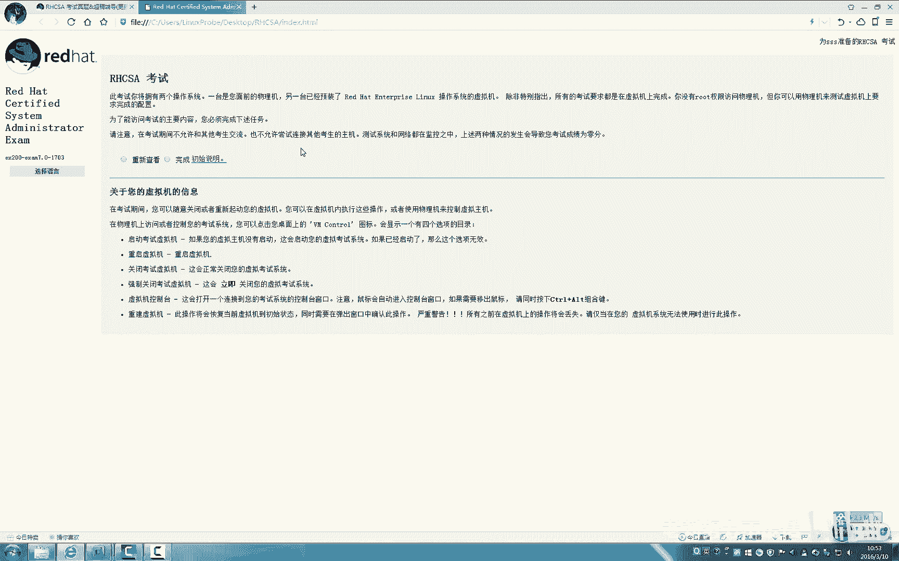

上一节我们介绍了课程目标，本节中我们来看看红帽认证的考试体系与相关费用。

红帽认证体系包括RHCSA、RHCE和RHCA。考试通常安排在同一天，上午考RHCSA，下午考RHCE。

*   RHCSA和RHCE的考试费用合计为4200元，全国统一价格。
*   如果上午的RHCSA未通过，补考费用为1500元。
*   如果下午的RHCE未通过，补考费用为2500元。
*   补考只需重考未通过的科目即可。

## 考试环境与登录流程

了解了考试费用，接下来我们进入考场，熟悉考试环境与登录流程。

考试时，你面前只有一台物理机。启动后，桌面上会有一个虚拟机图标。你需要通过这个图标来管理考试用的虚拟机。

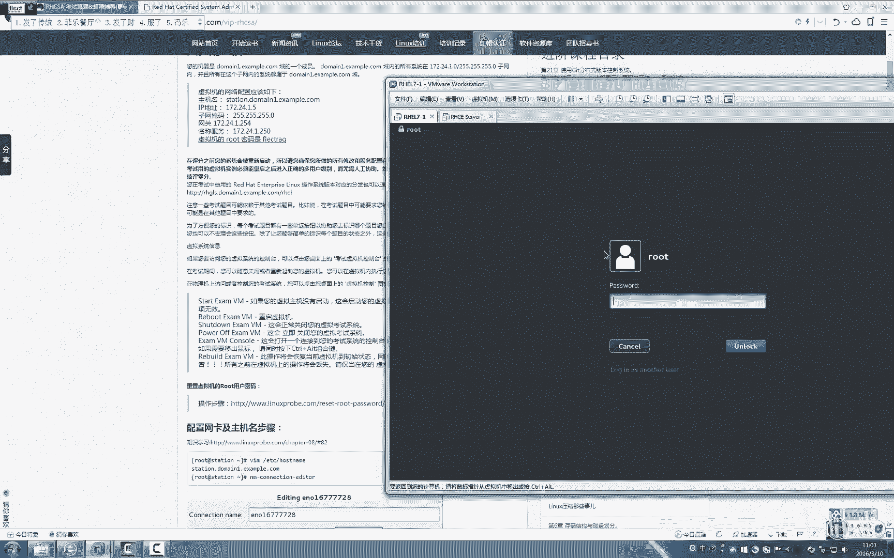

首次登录虚拟机时，系统不会提供root密码。你需要按照以下步骤重置密码：

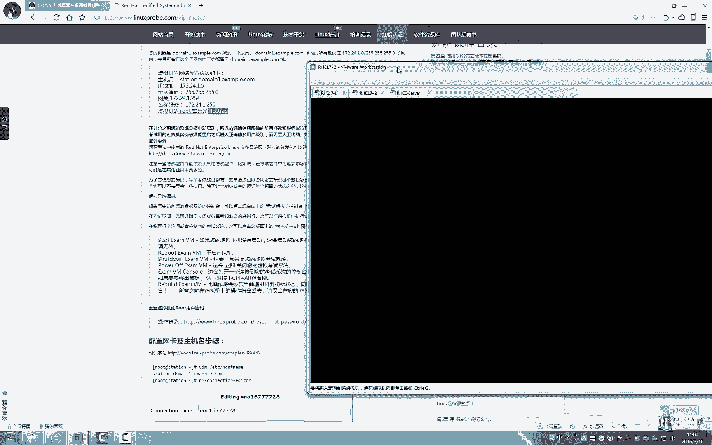

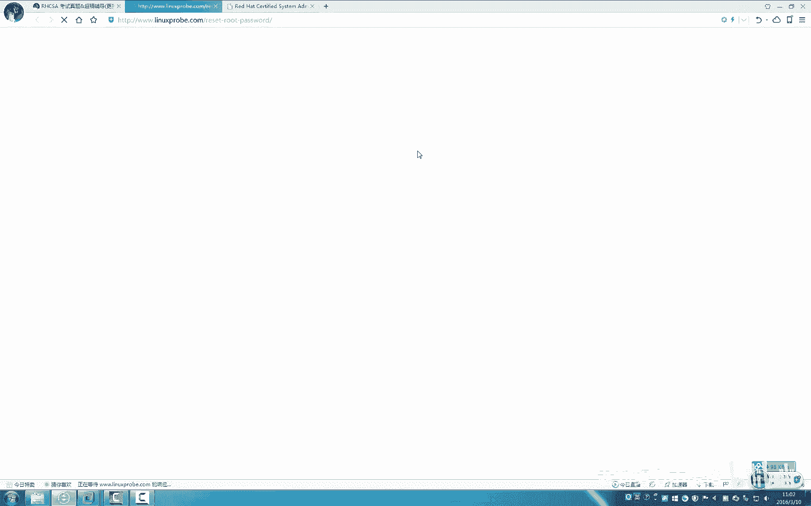

1.  重启虚拟机，在GRUB引导界面编辑内核启动参数。
2.  在 `linux16` 行末尾添加 `rd.break`，然后按 `Ctrl+X` 启动。
3.  进入紧急救援模式后，执行以下命令重置密码：
    ```bash
    mount -o remount,rw /sysroot
    chroot /sysroot
    passwd root
    touch /.autorelabel
    exit
    reboot
    ```
4.  重启后，即可使用新设置的root密码登录。

## 真题详解与操作步骤

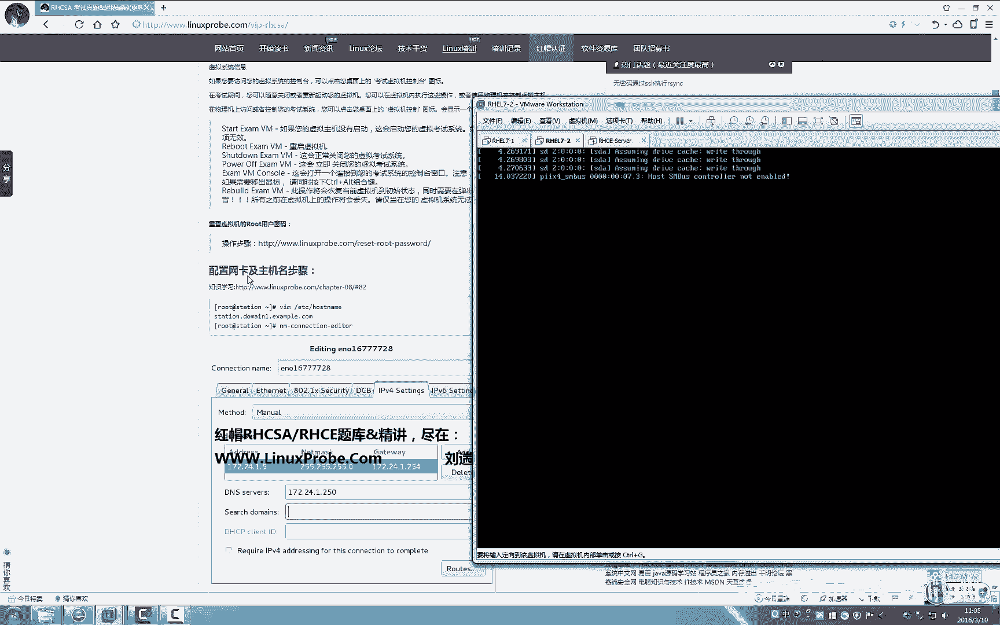

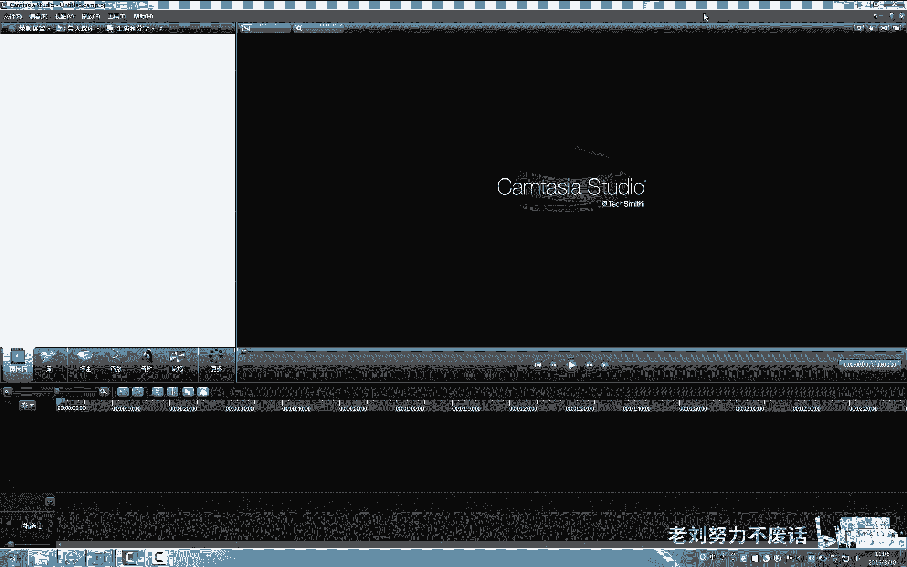

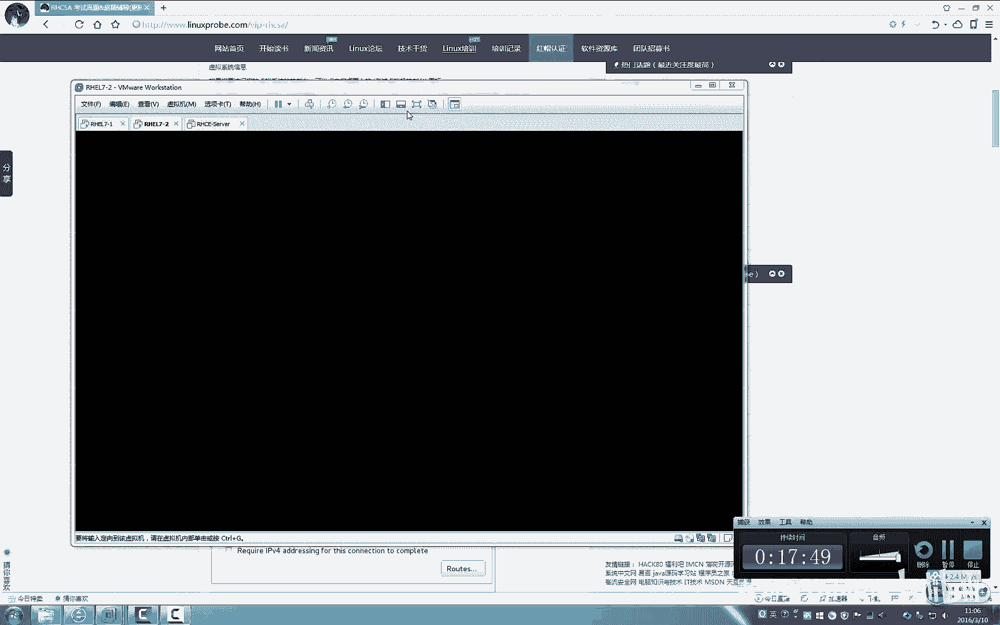

成功登录系统后，真正的挑战才开始。以下是RHCSA考试真题的详细解答步骤。

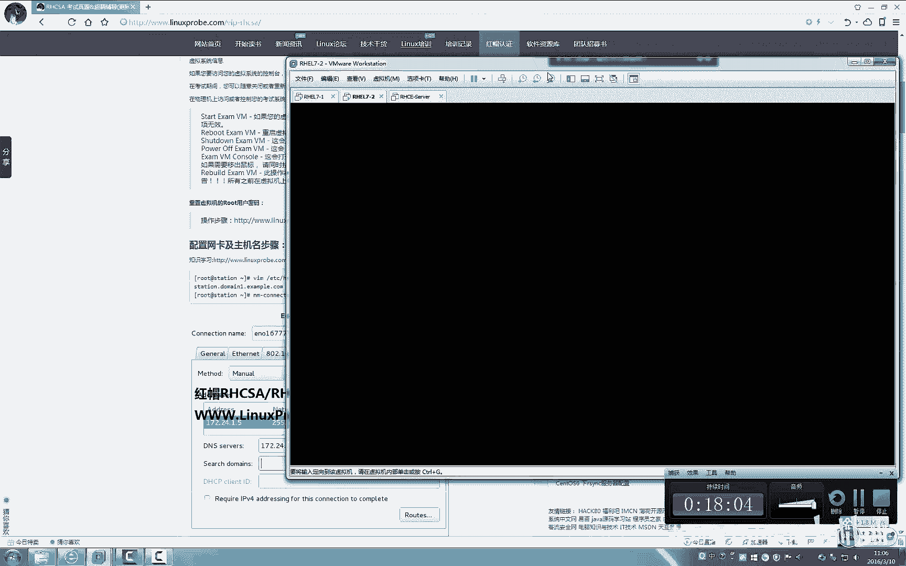

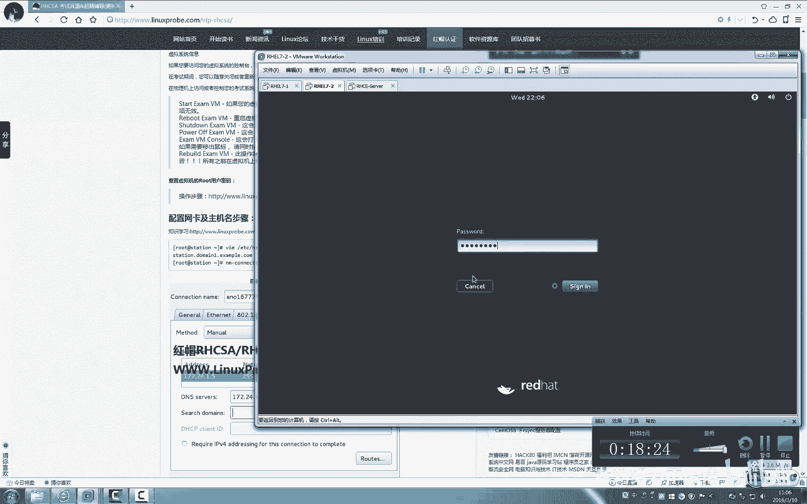

**重要提示**：配置完IP地址和主机名后，必须刷新物理机上的考试页面，才能看到全部考题。

### 第1题：配置SELinux为强制模式

检查SELinux是否处于强制模式。
```bash
vim /etc/selinux/config
```
确保 `SELINUX=` 的值为 `enforcing`。如果已是强制模式，无需修改，直接退出即可。

### 第2题：配置YUM软件仓库

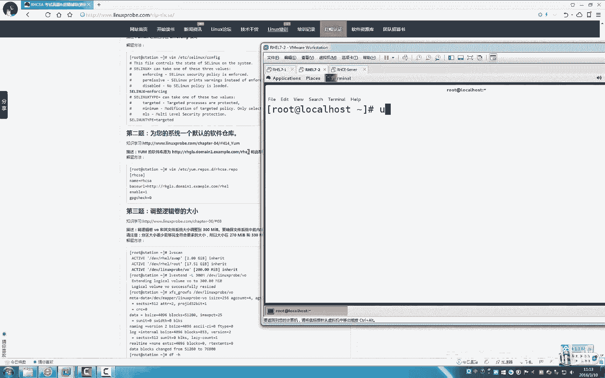

为系统配置一个可用的YUM仓库。
```bash
vim /etc/yum.repos.d/example.repo
```
在文件中添加以下内容（具体URL以考题为准）：
```
[base]
name=example
baseurl=http://server.example.com/repo
enabled=1
gpgcheck=0
```
配置完成后，更新缓存：
```bash
yum clean all
yum makecache
```

### 第3题：调整逻辑卷大小

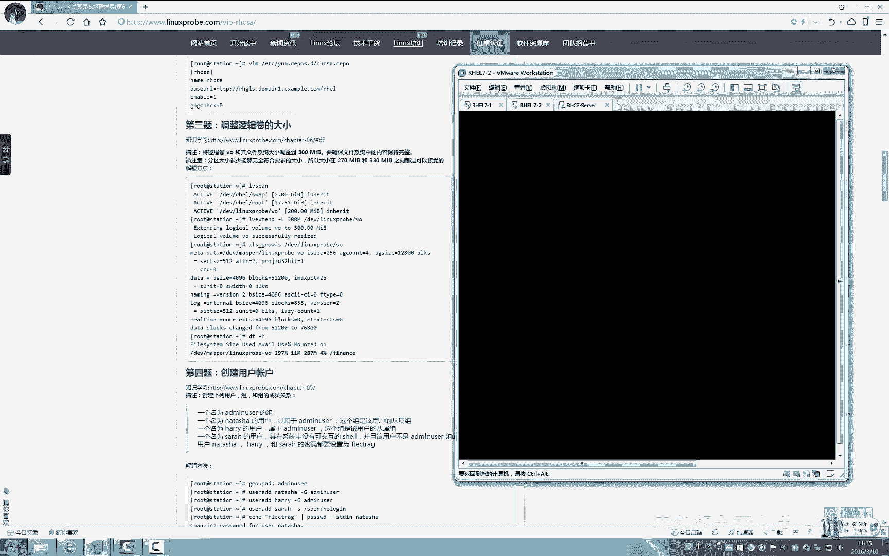

将指定的逻辑卷及其文件系统扩展到300MB。

假设逻辑卷路径为 `/dev/vgname/lvname`，挂载在 `/mnt/data`：
```bash
# 卸载逻辑卷（确保数据安全）
umount /mnt/data
# 扩展逻辑卷大小
lvextend -L 300M /dev/vgname/lvname
# 扩展文件系统（针对xfs格式）
mount /dev/vgname/lvname /mnt/data
xfs_growfs /mnt/data
# 或针对ext4格式
resize2fs /dev/vgname/lvname
```
结果在270MB-330MB之间均被接受。

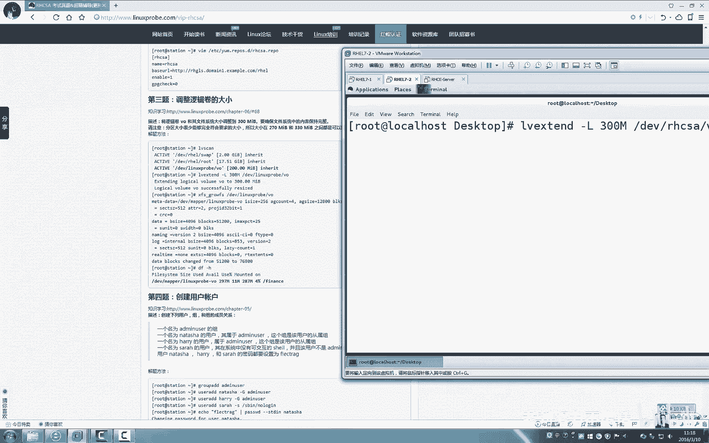

### 第4题：创建用户与组

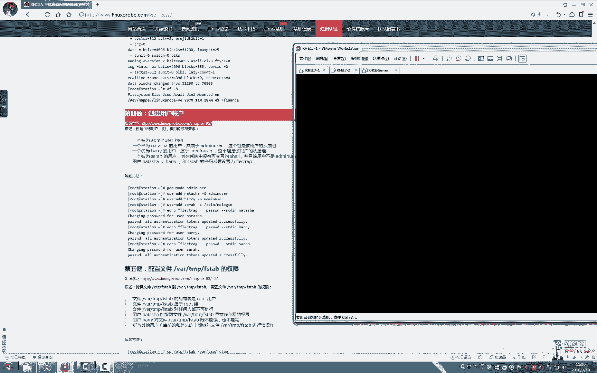

按要求创建用户和组。
```bash
# 创建组
groupadd adminuser
# 创建用户并指定附加组
useradd -G adminuser natasha
useradd -G adminuser harry
# 创建无登录shell的用户
useradd -s /sbin/nologin sarah
# 为所有用户设置密码
echo "password" | passwd --stdin natasha
echo "password" | passwd --stdin harry
echo "password" | passwd --stdin sarah
```

### 第5题：配置文件权限与FACL

复制文件并设置复杂的访问控制。
```bash
# 复制文件
cp /etc/fstab /var/tmp/fstab
# 设置FACL，允许natasha读写，拒绝harry访问
setfacl -m u:natasha:rw /var/tmp/fstab
setfacl -m u:harry:0 /var/tmp/fstab
```

### 第6题：配置计划任务

为指定用户配置计划任务。
```bash
# 为用户natasha添加计划任务
crontab -u natasha -e
```
在编辑器中添加以下行（每天14:23执行）：
```
23 14 * * * /bin/echo "Hi there"
```

### 第7题：创建共享目录

创建一个具有特殊权限的共享目录。
```bash
# 创建目录并修改属组
mkdir /home/admins
chown :adminuser /home/admins
# 设置目录权限：属组rwx，其他人无权限
chmod 770 /home/admins
# 设置SGID权限，使新建文件继承目录属组
chmod g+s /home/admins
```

### 第8题：升级系统内核

通过YUM仓库升级内核。
```bash
# 安装内核更新包
yum update kernel
# 重启系统使新内核生效
reboot
```

### 第9题：配置LDAP客户端

配置系统使用LDAP进行用户认证。
```bash
# 安装LDAP客户端工具
yum install openldap-clients sssd authconfig-gtk
# 打开图形化配置工具
authconfig-gtk
```
在图形界面中，根据考题提供的信息填写LDAP服务器地址和Base DN。

### 第10题：配置时间同步

配置系统与NTP服务器时间同步。
```bash
# 安装chrony服务
yum install chrony
# 编辑配置文件，指定NTP服务器
vim /etc/chrony.conf
# 添加 server ntp.server.example.com
# 启动并启用服务
systemctl restart chronyd
systemctl enable chronyd
```

### 第11题：配置autofs自动挂载

配置autofs自动挂载LDAP用户的家目录。
```bash
# 安装autofs
yum install autofs
# 编辑主配置文件
vim /etc/auto.master
# 添加一行：/home/guests /etc/auto.guests
# 创建映射文件
vim /etc/auto.guests
# 添加内容：* -rw,sync nfs.server.example.com:/home/guests/&
# 启动并启用服务
systemctl restart autofs
systemctl enable autofs
```

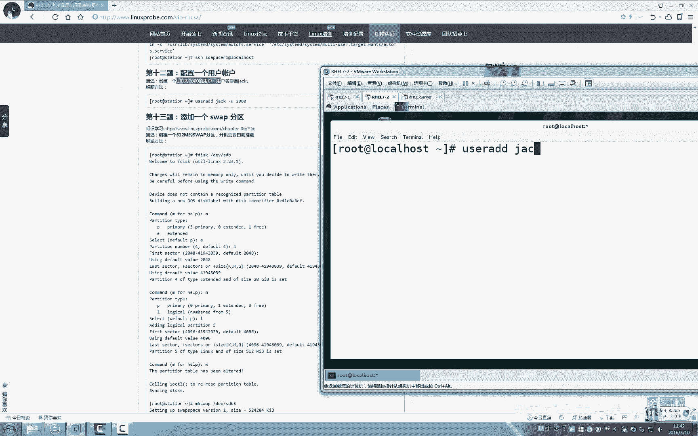

### 第12题：创建指定UID的用户

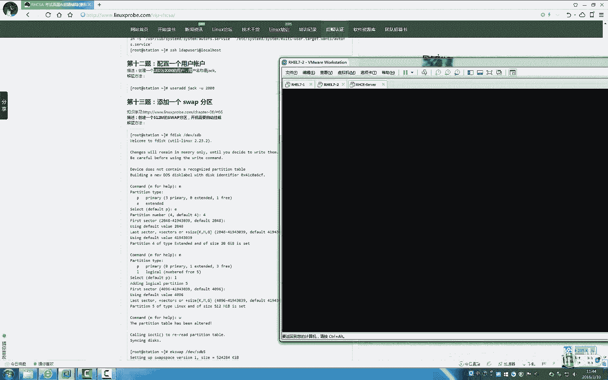

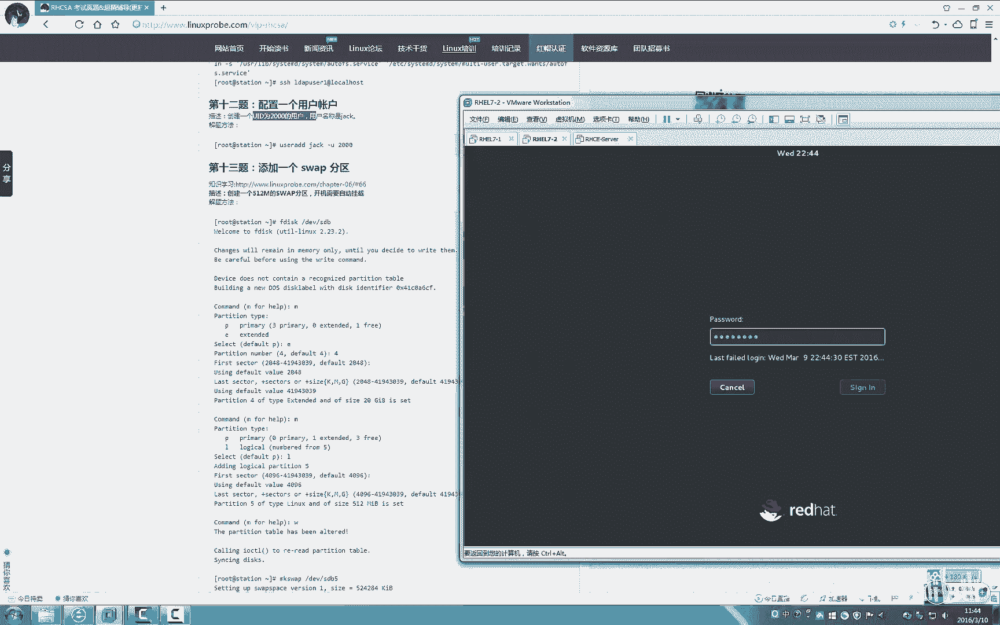

创建一个UID为2000的用户。
```bash
useradd -u 2000 jack
```

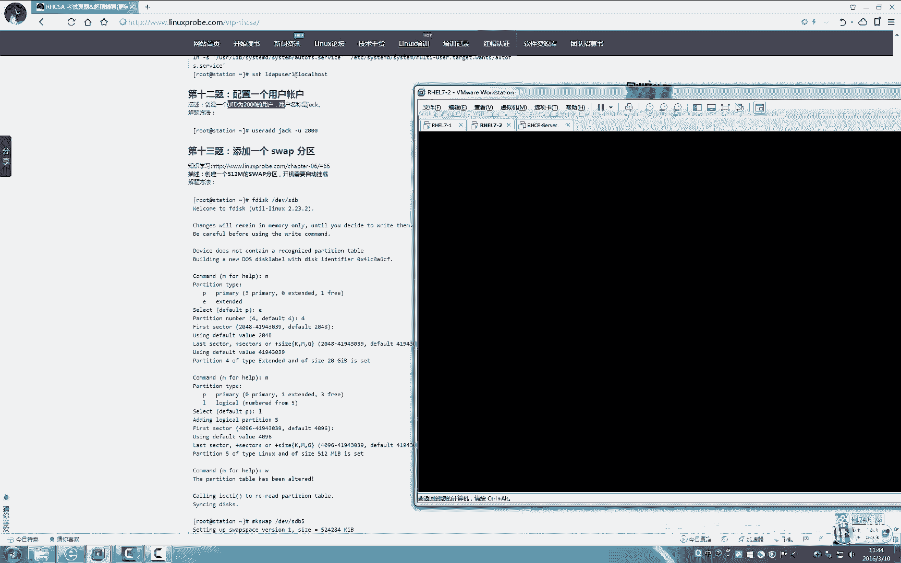

### 第13题：创建并启用Swap分区

在新增磁盘上创建Swap分区。
```bash
# 使用fdisk创建新分区，类型为82 (Linux swap)
fdisk /dev/sdb
# 格式化分区为swap
mkswap /dev/sdb1
# 启用swap分区
swapon /dev/sdb1
# 写入/etc/fstab实现开机自动挂载
echo "/dev/sdb1 swap swap defaults 0 0" >> /etc/fstab
```

### 第14题：查找并复制文件

查找属于特定用户的所有文件并复制。
```bash
mkdir /root/findfiles
find / -user roni -exec cp -a {} /root/findfiles/ \;
```

### 第15题：查找字符串并输出

在文件中查找包含特定字符串的行。
```bash
grep "keyword" /path/to/file > /root/final.txt
```

### 第16题：创建归档文件

打包并压缩指定目录。
```bash
tar -cjvf /root/backup.tar.bz2 /etc
```

### 第17题：创建逻辑卷并挂载

在新磁盘上创建卷组和逻辑卷，并挂载使用。
```bash
# 在新磁盘上创建分区
fdisk /dev/sdc
# 创建物理卷
pvcreate /dev/sdc1
# 创建卷组，指定PE大小为16MB
vgcreate -s 16M datastore /dev/sdc1
# 创建大小为160MB的逻辑卷
lvcreate -L 160M -n database datastore
# 格式化逻辑卷
mkfs.ext4 /dev/datastore/database
# 创建挂载点并配置开机自动挂载
mkdir /mnt/database
echo "/dev/datastore/database /mnt/database ext4 defaults 0 0" >> /etc/fstab
mount -a
```

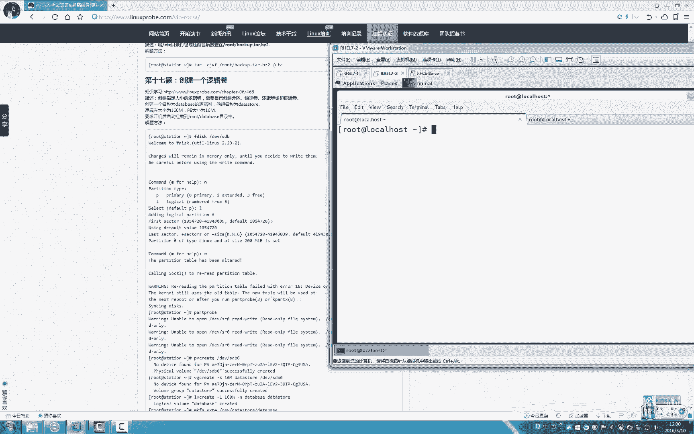

## 考试技巧与注意事项总结

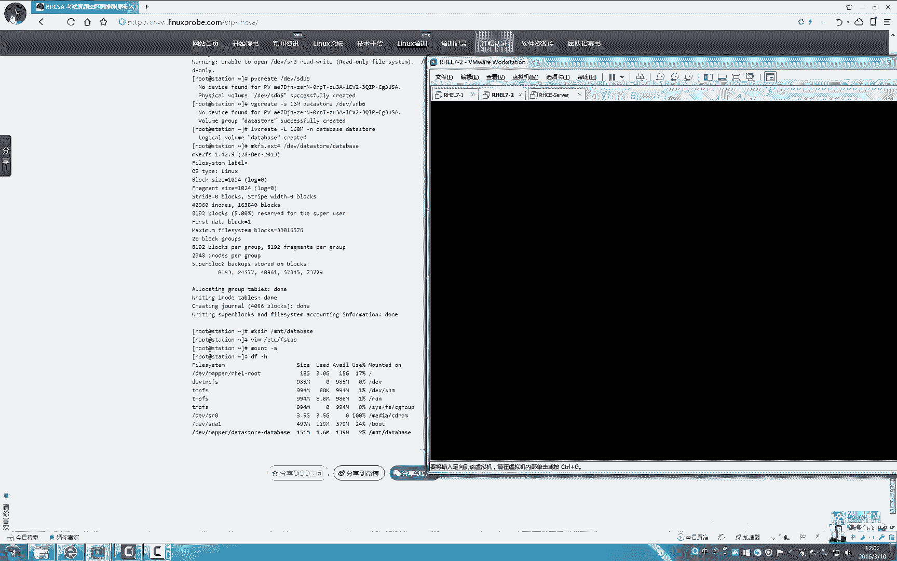

在本节课中，我们一起学习了RHCSA 7考试的完整流程和全部17道真题的解答方法。

最后，总结几个关键技巧：
*   **考前准备**：可携带纸质资料复习，但考试时需收好。
*   **时间管理**：考试时间充裕，做完务必重启检查所有配置是否生效。
*   **求助方式**：遇到非技术性系统问题，可礼貌地向监考老师求助。
*   **谨慎操作**：慎用`rebuild`功能，除非前期出现重大故障。
*   **核对信息**：注意考题中IP地址、主机名的数字部分，可能随座位号变化。

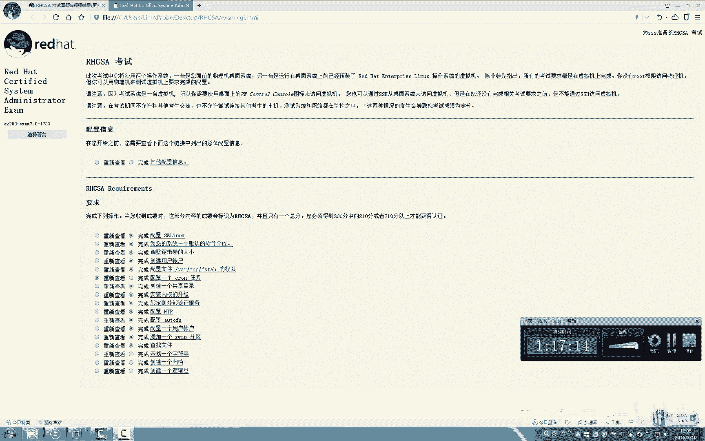

预祝大家考试顺利，一次通过！