# 红帽Redhat RHCE7培训课程+RCHE7实战参考教程+红帽8.0教材电子版+模拟环境及辅导 - P10：4 - 16688888 - BV1zu41197p6

Okay。那FACL它有两个命令啊，一个叫set FSL，另外一个叫get FSL。那么它们两个的区别。在linux当中啊，尤其是在企业版7当中，我们有好多set的命令啊。

有好多s命令都是设置ge命令啊都是来查看FACL叫做fillac control list文件访问控制列表。那么在设定选项的时候。或者叫修改权限，添加权限，我们用的都是I body啊修改。用户水。

用户谁后面是一个具体用户名，再后面呢是权限。如果我直接这么来写。这条命令是不是相当于我们之前讲的一个叫亲城bo的命令啊？有。等于RWX。这个是不是就一个意思了？那么我们在赛FSL的时候。

通常会在这个冒号冒号中间加上具体的用户。如果加上具体的用户，他真的就不是默认用户了，也就属于哪个用户啊，属于哪个用户。那么get FSL是看什么的呀？查看权限。我们在讲ge FACL的时候。

是不是又提到了说可以通过它来查看一堆权限了。如果你在用LS杠L的时候，发现这个文件权限后面呢多了个加号。这个时候你想看具体前线，用什么命令来看。ge FSL啊get FSL。什么时候用这两盆命令呢？😡。

简单来说就是当有具体某个人的权限的时候，或者某个组的权限。那我们需要用到s FACL来做。那什么时候用get FSL呢？如果你发现LS杠L的时候，权限多了个加号，那么要先用需要用到get FACL啊。

这个是他们的关系。这个里面呢你还需要知道1个LS杠L啊，LS杠L如果看文件夹的话，是不是加个D呀？这个里面我都用个foder来给大家做实例。那另外一个知识点呢是SElinux。在241的考试当中啊。

SElinux一共会考4个知识点。第一个知识点。你需要知道S一类那个的配置文件在哪？在哪呀？S类那个是很fi啊，这是第一个知识点。那，无论是上午考试也好，还是下午考试。那么我们的区别是什么呢？

就是你SElinux它的开关inforcing permissionmissive还是did。inforcing和forcing和permissive，他们两个都是开。faceable代表是关。

就相当于没装IE Linux。但是开合关之间必须重启升降。开和关之间。那么另外我们有两个开呀，inforcing和permissive。对于inforcing和permissive呢，它俩的区别。

他们都会去做警告。那区别是什么呢？ifforcing会做限制permissive我只警告，他说也这么个事儿啊。有这么个事儿。他不会去限制你，只是有警告啊。比如说呃我们举个例子啊举个例子。

说做菜啊做菜的时候我们知道啊，多放一个调味圣体啊，鲜盐是吧？做菜有没有不放盐的呀？一个人做菜好不好吃啊，主要跟什么有关呢？跟放的盐合不合适有关。如果你放盐太少了呢，菜不好吃，放盐太多了呢，菜也不好吃。

放盐正好是好吃啊，什么叫正好呢？这个得自己考虑是吧，自己考虑。每个人口味不一样。O。😊，那么如果我说这个放个盐放适量，很多人都不明白这个适量什么含义，你自己尝嘛，你尝尝正喊就叫适量啊。

这个得靠自己靠经验。那对于permiss而言呢，他就是做一个警告，他说放盐多了，这菜不好吃。有的正常我们做一个菜啊，应该放一勺盐是吧？有些人口肉放两勺盐，这个有点齁腾了。那我们已经说了，放两勺盐太齁。

这个菜不不能不能这么做，已经警告了，但有人就这么做。这人说，那没事儿啊，我做的是汤啊，你做汤放两勺盐是无所谓了啊。😡，警告这个东西啊，它不会去做限制。那如果。如果是inforcing的话呢。

他会去做限制啊去做限制。呃，美德饭呢就给你一勺盐，你想多发放不了。啊，美的饭只给放一勺盐，只有一勺啊，或说你家只剩一勺盐了，你想多发放不了这多限制。呃，第二个第二个考点。啊，我们会考到一个叫算把服务。

算把服务。下午的考试。会考到一个阿帕奇服务啊，阿帕奇服务。嗯。还会考一个单用户挑密码啊，单用跳密码。对于上班扶尔炎呢，考的是什么呀？上下文关系吧。那在我们的配置文件当中。哎呀38配容件是啥了？上吧。

Yes。忽然间忘了。后面是啥？肯fi哥。啊。一般都是CNF哈CFG的很少啊，CFG的很少。那在它的配置文件中，是不是有一条叫CHCON呢？chan context这是改上下面关系。

为什么要改上下面关系呢？因为在我们的。题议中要求新创建一个顶级目录做共享吧。那么顶级目录它默认会继承父目录的上下方关系吗？我去。你知道。嗯。She。🤧嗯。现着 contexttex。

提议的要求是创建个顶级目录。顶级目录它不会。继承啊，它不会继承父目的sever关系。所以说你需要去设定啊，有设定会要修改。那some百的配置文件中，建议我们用chan context改吧。

那我们在上次课还做了个这么个实验，是不是还用了一个叫SEmanage命令啊？F context做设定。在做单户测密码的时候，我们是不是生成了一个。点儿凹toreable的文件。这个文件生成了之后啊。

系统会重启两遍。系统我重新两遍，重新两遍之后啊，这个文件还存在吗？不存在吧，这个文件作用是什么？😡，更新。他作用什么？能看懂吗？瑞斯道 contact杠R什么意思呀？是不是恢复算什么关系啊。

通过什么恢复，通过数据库恢复吧，通过数据库恢复。那么为什么讲完散霸直接把阿帕奇跳过，跑到单应户这儿来了呢？原因。用t contact的话，它确实是立即生效，永久生效。不包含哪种情况啊？这种情况。

因为趁着康泰克斯他会写数据库吗？不会啊，他不会写数据库。那如果你要写数据库的话，我们是不是还得用一个叫做。SE manage的命令啊，S contact。这条命令的作用啊就是来写数据库，写数据库。

然后呢，通过re context来恢复。如果你用touch跟点au to label，它的作用就是说系统在启动的时候，它会将系统中所有数据库中包含的上述关系全回复一下。全回复一下。还有朋友又问了。

考试的时候到底用是用这种方式呢，还是下面这种方式用哪种啊？看你心情。都可以啊都可以都对哈。因为我们发现呢。为什么要斗队呢？我们实验做完了之后，当天生效了吧，系统重启是不是也生效了啊，不影响。😡，啊。

什么时候做单户跳密码呢？上午的题。而上班服务呢是下午的题是吧？如果这两道题它都是下午考的话，那么你必须得用下面这种方法。但不管是用哪种方法呀，你得知道他原因是什么，你得知道他原因。之所以下午考试。

不建议大家用下面这种方式的原因，是因为他的敲两条命令，而且这个命令是不是很长啊？命令很长，记不住怎么办？可以查办手册吧，可以查办手册。那即术不查扳手册在上边的配置文件中。

他已经明确的说明了趁着 contexttex怎么做啊。那再有一个考点。阿帕奇啊阿帕奇在考试的时候呢，阿帕奇中有一道题是修改服务默认端口。默认情况下，我们的端口号是80啊。我服务直接能启动吧。

装完之后什么都配服务直接能启动。但是我只改了一条端口号改了。那我们做实验的时候改的是8089，考试的时候可能考的是8989啊，8980，不一定是什么？

那么改成了另外一个端口RSSElinux默认是infy。在启用的情况下，那你现在。阿帕奇伏还能启动了吗？端网号一改，服务启动不了了吧，嗯只修改了一处。然后呢，我可以把SElinux临时的给关闭。

临时关闭是什么命令啊？Yes。来。Set in force。等下。临时关闭是吧，临时关闭之后发现阿卡西夫是不是又能启动了？然后呢，我再给它开开。看下是不是改成一呀。开开一个改成一。再开开之后。

发现阿帕西夫是不是又启动不了啊？换句话说，当前你能不能判断就是SElinux原因呢？可以判断吧？一个东西开关我可以来判断到底谁的原因。因为我们在之前讲了说在lininux当中权限，你是不是要考虑4块啊？

啊，这4块你可以把它列解成四大金刚啊，四大金刚1234啊，4块。那么对于这4块而言，我到底是谁引起的哪一个安全性引起的服务法启动，我是不是需要来判断。对于文件上门关系而言呢，它不会影响你服务是否启动啊。

不会影响。但是对于布尔值的话，它会影响。我们去看了一下日志，或者说看了一下服务的状态，他都提了一些安全性相关的内容啊，安全相关内容跟SElin有关。那其中有条命令叫SE manage泡吧。

泡泡杠L是干嘛的？列出啊列出。因为我们在message文件当中啊，是不是看到了一个杠A一个具体的类型啊，但是他告诉你说哪个类型了吗？而我刚刚修改的是不是阿帕奇服务HTTP80端口啊。

你可以找到我们的HTTPP类型。杠L是查看杠A是什么呀？干一添加啊添加这条命令在设置的时候啊比较慢啊，在5秒到10秒那样。就如果你看着它卡那儿了啊，肯定超过2秒。人的视血残留是2秒吧。

SE Linux啊。这个是上次课呀啊。讲的重点啊讲的重点，你把这些实验呢做熟了啊，做熟了之后呢，你会发现我们到第三门课的时候啊，这个实验都很容易啊，实验都很容易。第三门课就是讲具体的实验。

然后这些权限的内容呢是穿插在每个实验当中啊，这第三门课的内容。第三门课，如果非说有什么难点的话，就是多了个SElinux跟6之前来做比较的话。因为6之前呢我们在配服务的时候，基本上都是把Slin关闭。

那为什么之前不开开呢？因为以前的IElinux它的提示，你得用一个命令叫C alert啊，C alert去查C alert杠L杠A啊，杠A分析啊。那但是在企业版期当中啊。

在我们服务状态和日志当中已经很详细的说明了啊，可能用到什么开关啊，这个是为什么7的时候开始考SElinux。Okay。呃，下面我们来看今天内容。告。呃。配置网络连接用户啊，第八章啊配置网络连接用户。

那这张讲的内容是什么呢？这章讲的内容啊叫Ld啊，Ld在微软的系统当中啊，我们经常会用一个东西叫活动目录。大家听过活动目录吧。实际上这个活动目录证明啊。

我在刚接触微微软windows server的时候啊，我就挺奇怪，为什么它叫活动目录呢？活动目作作用是什么？在公司里面，你为什么要做成一个预要使用活动目录这样的软件？为什么？不用玉行不行？也行是吧。

我们都自己装个系统，是不是随便啊，那为什么非要用玉呢？那讲介绍之前呢，我们先来回忆一下。在windows当中，我们有个概念叫做玉。如果你把一台机器做成一个预控了之后。它上面是不是多了个软件啊。

叫活动目录啊。他为什么叫活动目录？是因为这个目录是活动的，到处跑是吗？不是吧，是因为这个目录里面主要是管什么的呀？主要管的是账号吧。如果你把一台机器windows server做成了预控。

它里面会多出来一个软件啊，叫做活动目录。而活动目录主要的功能啊是不是管理用户和计算机的呀？主要的功能啊，管理用或计算机的。换句话说，用户集中管理啊，用户集中管理。举个最简单的例子啊。

那我们现在这个公司啊是一个呼叫中心。嗯，大家知道呼叫中心主要干什么活吧？来个小姑娘往那一坐，有电脑啊，然后有电话就接，然后查一下数据库，然后告诉他这个小姑娘是不坐在哪个工位上都一样吗？好，现在问题来了。

😊，有些呼销中心呢，它可能是四班三云转之类的啊，就是说一天24小时都有人吧。OK那我们现在来举个例子，这个屋屋里面呢只能坐50个人啊，只能坐50个人。但是我公司里面呢有150个员工。我有150个员工。

那这150个员工啊分成三班啊，上午下午晚上分成三个班。每一个班呢只有50个人上班。那现在问题来了。好，他们来了之后啊，可以做任意的位置，哪有空位坐哪，对吧？正常，我们是不是前面有个牌儿啊。

你不按牌做行不行？也可以吧，你电脑坏了，你不按牌做，你说不可以做别人机器。但是当你做别人机器的时候，问题来了，你登录windows系统的时候，是不是需要一个账号啊？大家都用一个账号可不可以？也行吧。

可以。那我们换另外一个思路，你在系统当中，你有没有说把root密码告诉所有的人？不可能吧，你们公司那么多人不可能先告诉。换句话说，微软系统也是一样的，你不可能所有人都用同样的账号。换句话说。

不同人的账号，我怎么样可以在别人机器上来登录呢？😡，这个是微软的活动目录，当把下面所有的机器都加入了一个预控之后啊，都加入一个windows预之后，它实际上啊就用到了一个Id协议。

它的功能就是集中账号管理。不管你用哪台机器登录。你的。你登录之后啊，只要是在玉当中呢，你登录之后，你的身份是不是认可的呀？第一个身份是认可的，而且在活动目录当中啊，它还有一个概念叫做漫游用户。

漫游用户听过吗？漫游用户。慢用户的概念是什么呢？不管你在狱中哪台机器上登录，你的桌面，你的文档都跟着你走。因为你的桌面属于配置文件，你的文档啊都放在一个这个网络中能扫问的一个共享目录当中。换句话说。

做成了一个预控之后，然后呢，把你这个用户变成了卖淫用户，会导致什么结果呢？不管你用狱中的哪台用机器来登录，用户名是不是固定的，桌面是一样的，你的文档是一样的。OK吧，机器你机器坏了，会影响工作吗？来。

坐旁边吧啊，旁边空位可以吧？这个是玉的一个优点啊，玉的一个优点。OK那现在问题又来了啊。😊，那就来了。那你做出了一个。你只是做一个用户的集融管理，实际上这个功能啊我们会发现。比如说QQ啊QQ的话。

不管用手机QQ用电脑QQ啊，不管是用哪个版本的QQ啊，是不是都是通一账号登录啊，它也是一个金融账号管理，不管用哪台机器，不管是什么平台都可以是吧，都可以。那么我们在微软的域当中，它有一个很重要的策略啊。

叫做主策略。或者要预测的。左侧里右侧里。这个东西它有什么作用啊？它可以定义啊软件的安装啊，它可以定义。我说主要的作用啊，当然它有好多作用了。定义软件的安装。什么叫定义软件的安装呢？好。

我们依样这50台机器。如果你要一台一台机器装软件的话，可不可以？一个事儿干五十遍吧。那如果是我做成预之后，比如我装个office，我可以来定义啊，用户在刚开机的时候，用户在登录的时候。

office软件自动来安装。用不用我去给他装一遍啊，不用，我只要在这边来做一个共享，把office扔共享里边，然后呢再定一个主策略。你们只要一开机一登录，哎，office装完了。节约管理员段时间吧。

方便管理。或者说我们有一个大家都用的一个办公软件。比如说我们依然是呼叫中心嘛，你呼叫中心的话，肯定有一些自己的呼叫中心的应用软件。当然了，它有些格式的要求是吧？啊，直接分发。

快速的分发节约时间啊节约时间。这个是使用微软活动目录的一个。环境啊说明环境。简单来说呀，就大批量管理机器的时候，我们会用。那么在这个里面呢，我们会发现用到了一个用户集中管理。而这个用户集成管理啊。

微软用的是一个叫Ld夫的协议。俺老大。叫light。Diirectctory。呃，轻量级目录啊访问accesspro啊，轻量级目录访问协议。轻量级目录法务协议微软在Ld这个协议的基础上啊。

做了一些自己的一些特性啊，做一些自己特性。但然不管是做什么特性，L代的功能是什么呀？集中账号管理。集中账号管理。嗯。那么这个漫游用户呢，我们在后面呢会讲到一个叫auto FS。

outto FS凹 to什么意思呀？自动自动文件系统，file seek啊，自动文件系统。那么在上午的考试的时候啊，需要有两道题啊，这两道题是连着的Ld加out to FS。

这个实验实验最终结果是什么呢？不管是从哪台机器。都可以用同一个身份来登录，密码是一样的啊，密码是一样的，这边密码改了，那边密码是不是跟着变吧？你用手机登录QQ，你把密码改了。

你用电脑登录QQ的密码是不是跟着变账号相同。那奥凸SS呢？那我们刚刚讲了一个慢用户的概念，你用户登录系统之后，你的桌面也好啊，你的文件也好，是不是都是一样的。那么在linux当中。

我们也可以实现用户的主目录啊，自动挂载啊，自动挂载依然是放在文件服务器上。凹 to FS。那这个主策略软件的定义安装呢，这个在linux当中啊呃要是浮帽的话是C当中的一个内容，叫做自动化部署啊。

自动化部署。也就是说你在学操作系统的时候啊，你会发现，不管是windows也好，还是linux，只要是操作系统，它们的功能呢基本上都有重复吧啊都有重复。换句话说，你到底用什么服务器啊。

随意啊到底用什么服器随意它的功能是相同的啊，功能相同。Okay。Yeah。啊，合作下来啊，我们开始看第八章。配置网络连接用户。用户信息和身份验证。啊，什么叫用户信息？我们在系统当中啊。

账号名密码存在于哪个文件中？账号名、密码组都存在哪个文件中？在跟ETC下是不是有仨文件呢？跟用户权限有关的，跟ETC下的pasword文件。跟ETC一下的s文件，还有一个是跟ETC下group文件。

这三个文件默认存在哪儿啊？本地吧。本地的啊本地的。ETC啊ETC目录下。那么在系统当中呢，有个比较特别的文件叫做NS switch的 configurefi。

也再给你提示一下NS叫做那name service，叫名称服务。民生湖。我为什么s我启动之后要跟你们聊一会儿，我才回车呢？😡，系统他起一会儿是吧，你动作别太快，一连连不上。老师，你帮我看一下呗。

我慢悠走过去，一连连上了。😡，这是为什么呀？因为走的慢是吧？因为机器嘛嗯OK。看一下这两个文件，在GETC下有这么几个文件，pas word。G啊 shadowle。猪肉。给你提示一下，有这么三个文件。

账号密码组啊账号密码组。那做用户管理的时候，是不是有组的概念呢？所以说你要做三个文件。另外你还需要知道一个文件，在DETCR的NSs第二 can这个文件switch翻译成中文什么意思呀？交换交换ok。

我们在这个文件中啊。啊，我们进去看一眼吧啊。进去之后有颜色呀。好好讲上。第四行啊，他告诉你说NSspe是干什么的？名称服务配置文件。它有什么作用呢？我问下翻啊。下面有好多的说明啊。

感兴趣同学可以慢慢看看。哎，看到29331这三行了吗？他是少人涉到人狗文件。有音象吗？刚刚提到三个文件。这是注释行，我们会发现他们是有一堆东西。这一堆内容当中，他们有相应顺序吗？有有相顺你好。

不是病例了。看下面这个。password文件是干嘛的？😡，是用户文件是吧，账号，那么系统当存在这个模式的时候，系统会先看本地的fill文件，本地的文件说跟ETC下的pasword文件。

大看这个里面的账号。这个账号看完了之后啊，才看哪个账号呢？SS里面的账号，这两个里面的账号都可以登录这台机器。能理解吗？SSS跟kibo有关啊跟kibos有关。下面这个是组啊，这是密码组。

他们是不是都先用本地的账号，然后用kibo的账号啊，用kipo的账号。那如果在这个里面呢，又多了一些什么Ld之类的，是不是就也支持Ld账号啊？这个位置有三行。Okay。😊，那我们可以这么来写过滤。

pass word开头。Sal开头。gro开头。这个文件中。能看到吗？但是。如果你机器加入了域之后，它也是有相应的变化啊，有相应的变化，先用谁来解析。Okay。那不管是本地的账号还是网络当中的账号。

它都会用到UID和JID。也就是我们说的password文件，d文件和group文件都会用到。那现在呀最受欢迎的解决方案呢用的就是L的。最受欢迎的啊，L达为什么呢？因为它是一个标准协议。

大家知道什么叫标准协议吗？😡，呃，我们听过ISO吗？听过国标吗？为什么都要去做一些标准？😡，你去买个螺丝的时候，说给我买个10号12号螺丝啊，螺母，为什么都要说标准？想过没？标准的作用是什么？😡。

标蝉主要作用呢是为了收钱。嗯。你只要符合这个标准啊，就要交费用啊，交费用。这如果从盈利上来讲啊，但是标准对于我们而言呢还是方便。比如说你买个电脑，大家会发现电脑是不是都有USB口啊？它的参合宽宽呢。

还有中间到底几根金属角啊，它是固定的，这个是不是都有事先定义好的标准呢？有了标准之后，我们会发现哎不同的机器之间，他们可以来联网了。有了标准之后，我们就会发现哎同样的U盘只要同做成统一的USB接锁标准。

是不是随便插都能用啊啊，这就是标准的作用。如果没有标准的话，你就会发现哎。买个U盘必须得买。好多转换器是吧？没有标准的话，就得买好多转换器，家伙都用不了。😊，这标准的作用。

而Ldap呢是现在应用最广的啊应用最广的，它叫做轻量级目录访问协议。不管是IBM也好啊，还是微软的活动目录啊。或者说miss服务，他们都用到了L的。在活动目录当中。和IPA当中。

还有miss当中都用到了这个协议。阿d协议。活动目录刚刚提了是微软的是吧，IPA是什么东西啊？IPA是linux当中，账号管理服务也用到了Iap协议。换句话说，一个协议它是个标准的协议。

大家如果都想拿过来用的话，都可以用啊，都可以用。你可以基于它的基础上开发一些软件。那活动目录和IPA呢都是软件，一个是微软的，一个是红帽的。呃，IPA这个软件呢在红帽。6、红帽七的时候啊已经很完美了啊。

所以说红帽开始往外推了是吧？到六的时候，你看有IPA吗？6的时候也有啊，但他不讲到7的时候呢啊出这么个东西啊，IPA它跟活动目录是一样的。那你是服务呢？呃，逆斯服务以前呢在unix当中啊。

如果你接触过unix的话，可能会接触过逆思服务。不讲究那个词的话没没发现哪讲miss啊，哪讲miss网络信息服务，network information啊，service，网络信息服务。

winindowslin Uniux。那我们会发现不同的平台都用到了L代。Okay。那么不管是哪种协议啊，他们最终都是做什么的呀？第一个账号是谁？这个账号存不存在？第二个。密码。哎。

carboscarscars，cars这个词儿。它叫做cbo式人证啊，kibo人证。那么科宝森证它属于票据人的。既然提到票据认证了，它跟时间有关。换句话说，跟科 boss斯有关的实验吧，时间很重要。

记住一点哈，不管你是。学的是非E也好，还是CA也好。所以当中有好多实验呢，有好多同学也做不出来，也是时间的事儿，跟科本书有关，一定要记得呀，跟时间有关。记住这句话哈。我给你们写一下吧。

嗯有同学可能是在看着我听课，有可能是看着我这个号嗯。你只要是提到了car这个东西。一定要注意。世间。重要事说三遍是吧？我给你加三个叹号得了啊，师间。只要跟科 boss有关的时间，请一定要注意时间。

什么叫时间呢？有客户端，有服务器端是吧？他们的时间又同步。你差个几分钟无所谓哈，别差时间太多。比如说差个半个点，一个点儿，差一天两天呢呃即使你实验做的全全退，这个实验也不成功。

我们在后面呢有一个叫NFS的实验。kibo实验呢，咱们课上啊会提到两个，一个是Ld实验。还会提到一个叫NFS科实验。这个是一会我们要做的实验。上午的考试的练题，上午考试的时候，他只考L概，他不考c。

但是在培训环境当中，我们这个实验室两个都做。这区别啊这区别。那么下午的考试题呢会有一个NFS实验，也用crose。那么你既然是提到了crose，不管是Ld也好。

还是NFS是不是都有服务器端和客户端的概念？OK那么这个时候至少提到了两台机器吧，serv和 clam。他们的时间要一致啊时间要一致。我写的是等号哈。😊，约等于越行，你差个三两分钟都可以，你差个5分钟。

10分钟，这就基本上残废了啊，OK吧，时间很重要。在我们的培训环节中啊，谁是。L戴夫服务器啊。嗯。class room培训环境中是不是有class room机器啊？他拉送。谁是客户端呢？

我们是不是有个serv娃呀？是不是还有个叫克烂呀？对，叫戴斯top吧。As斯康。他俩都是客户。他俩都说过。我们在上午的考试环境呢。注意我说的话哈，上午的考试环境它是要求你把一台虚拟机加入到SI培。

下午的考试环境呢是这两台机器已经加入了FWV。能听懂吗？上午是要求你自己配，下午是已经加完了啊，已经加完了。为什么下午的考试题已经加入了L待回域呢？考试环境已经加入了I待回域。

原因是下午的时候是不是要用一些账号啊，那些账号不管是在这台机器，那台机箱都可以用，是因为已经在域当中了吧。在域当中你可以直接使用所有的域账号，当然你得知道密码得知道密码。O。嗯。呃。

Ld它可以提供身份认证，也可以提供密码认证，还可以和科bo速度配合。科包是专门做什么的呀？密码严证啊，他主要是做密码验证。只不过因为我们时课长时间当中啊跟时间戳的。跟时间的关系啊这个。啊，比较大啊。

所以说强调一下啊，强调一下。有些同学回去之后呢，做NFS实验，特实验。呃，照着笔记做呀，全对。全部。但是最后实验就不成功啊。啊，最有可能的呀，两种原因。第一种原因就是时间的问题，客户端服务器时间不同步。

第二个原因第二个原因是什么呀？票据失效啊，票据失效两个原因。当然了，这两个原因我们在第三门课的时候会给大家看现象。如果你用线上环境的话。线上环境。呃，在局域网当中，VNC连的一套环境吧，线上环境啊。

有一些机器啊就是科po斯。呃，他的票据失效了，那重新生层。那如果是我们线下环境的话呀，呃那个票据都是OK的，都没有问题。所以说你只要考虑时间就可以了。只需要考虑时间。那么在2RPEL7当中。

所有的本地账号都存在于他索的文件中啊，反回材料内容。OK看一下右侧也有两个图。这个白色呃蓝色的这个这个界面见过吧，我们在之前是不是提过一个叫NMTUI呀？或者是说set up命令。

在企业版其中有set up命令吗？也有啊也有，只不过在里面没有配IP的设置了啊，没有配IP的设置了，变成NMTY了啊，去之前可以用set up来配IP。啊，类似的界面通过字符来模拟图形啊。

通过字符来模拟图形。那么在后面呢，还有一个专门的图形界面。我们在配置Ld客户端的时候，你有两种方式，实际上有三种方式啊，这是第二种第三种，还有个第一种啊，还有第一种。命令行啊类似于图形的命令行。

还有图形啊三种。我们来看几个文件。这些文件呢不要求大家。备注啊不要单们备注，但需要你知道有这么几个文件，你在用这两个界面啊来配置的时候，最终写的就是什么呀？配置文件。换句话说，这两个东西都是永久生效。

立即生效。永久啊永久成效。OK那如果是用后面这个命令啊，或前面这个命令，他们除了永久生效之外呢，他们也会立即生效。就你配完了之后是改文件了是吧？永久生效。然后呢，你一测试发现哎这个Ld账号也存在了。

也能用了，它也立即生效。看几个文件。第一个Ld点肯fi。这个文件呢它对应的就是Lap服务器的设置。我class room是L贷货，你是不是它指向L代服务器在哪呀？这个里面的设置。第二个科bo5。

再看这个，那它里面的设置主要指的就是科po斯服务器啊。你作为客户端，你要指向科波斯服务器是谁。想想在微软的系统当中，如果你要加入LO带域，加入活动目录，你是不要写一些服务器相关的内容啊。

都要在客户端指定。SSSD唉，这个词儿看着这么熟呢。我们在刚刚看IS speech文件中。唉，看下面这文件了吧，看这个文件的时候，它里面是不是提到了一个fi空格SSS啊，它叫做什么呢？第一个S叫做st。

第二个叫做。Security。第三个叫做service啊叫sS。那如果你是在一些外企工作的话，是不是还听过一些5S啊？5S什么呀？我还是说早上得洗脸是吧，嗯，叫什么整理整顿之类的啊。

就是办公环境啊看着舒服一点，是不是这概念？Yes。在下面派木点D派木是什么意思呀？判模叫做。Cl拉y啊叫可插拔的啊authentation啊。modode叫可插拔的验证模块，可插拔的验证模块。

这个东西是干什么用的呢？在L尼个词当中啊有好多种验证方式，这些验证方式他们可以调用不同的验证模块。简单的来说就是把一个验证方式啊做成模块化，你到底用什么服务啊，你可以直接来调用啊，你可以直接来调用。那。

关于pa模的具体设置啊，也是在CA当中有专门的一门课啊，安全啊安全驾务会去讲啊P。那在下面open L back。为什么L代我前面要加个open。😡，open代表什么意思？开放是吧，它开源的软件。啊。

随便用啊随便用。比如说你们公司去弄了一套系统往外卖，然后其中的账号管理呢，就用open air代，这个可以不收费。可以拿过来用，不侵犯版权，能理解吧？但你不要把原来人家lessense给干掉。

这就侵犯版权了。呃，3urice啊CAhir。那么它代表的是C证书目录啊，C证书目录。あ？在配置Id的时候，需要设定一些参数。第一个主题名。嗯，主记名怎么写？DNDC。哦。啊。

如果你做过windows域的话啊，这样的词儿应该见过啊，这样词见过。BC叫做可分辨的名称啊。第人。DC。分名称DC这简单来说呀，就是域名是吧？给咱po点com啊，他弄2个DC来表示OU呢叫做组织单元啊。

组织单元谁啊谁可能是人用户名，可能计算机名。那么在加密的时候呢，为什么我们提到了证书啊？因为证书主要作用有两个，一个是加密，一个是验证，加密怎么来加密呢？🤧嗯。

我们在互联网上是不是发现有好多叫HTTPS的网站呢？他用到了证书，你在访问这个站点的时候，是不是密文传书啊？你在刚访问的时候呢，会自动在你这边下载个公钥。公钥相当于锁了吧，把你里面放放的什么账号密码。

然后加密传输。密文传输之后呢，对方有私钥是不是可以解密呀啊，这个是证书的一个应用啊，加密解密证书的另外一个应用呢。我们之前做SSH是不是也加密解密的过程啊，有印象吗？它也是用证书。呃。

证书另外一个作用啊就是验证啊验证验证来源。就像我们用信用卡，你用信用信用卡的时候，信用卡的背面呢是不是都会先签个名啊？这个东西叫公钥啊叫公钥。你每次在用信用卡刷卡消费的时候，正常情况下是不是要再次签名？

而收银员正常的操作流程应该是确认的。你签的名和信用卡这个名是不是一个人写的，一个人写的笔记是类似的是吧？不能说完全一样，但类似啊但类似。那针对这样情况，他可以来通过公钥来做一个验证。再举个例子啊。

你有1个20年之前的一个女友啊，不对，你有个堂妹，你有个堂妹要要来找你玩儿，但是好多年没见了呀。有同学说不对呀，现在微信QQ多方便呢。你想想啊，201年之前就有照片是吧？你要去火车站去见堂妹怎么接啊。

是不是事先要准备张照片啊？😡，拿照片哎，照片看的是公药吧，然后去车上去找，你是不是去找那个私药啊，那张脸就是私药。你是不是通过这个公钥和销来做对比，做个验证的过程啊？啊，这是证书的另外一个应用。

就像我们现在呀是不是都有身份证，身份证上有个东西叫照片。那照片是公钥私药。公钥。你的脸是死要，为什么我们会发现，随着你年龄的变化，那个身份证呢，它的时间呢有效期一直在变。😡，发现没？为什么？

因为我们的私要一直在变吧，看看你们高中同学。啊，不用，就看你高中的时候，你那脸长什么样。你再看你现在的脸长什么样，肯定有变化是吧？我看我高中的时候啊，看我大学的时候可瘦了。现在也不是特别胖是吧？

但是呢这个还有变化，也就你私钥变了，公销数的变。私要跟公告是一对。有些小姑娘去韩国了，等回来之后，哎，身份证是不是得换呢，要海关过不了，为什么呀？整容了是吧？变化太大，公钥私要有个认证的过程啊认证过程。

O。继续。呃。必要的刻包斯参数数，还有什么呢？这条刻包式了是吧，密码啊密码在加入一个L代域的时候啊，如果你用到的刻包s斯密码，这段主要是跟密码有关啊，跟密码关。你可不是服气。科包是一。

还要解析啊还要解析。都要指明啊都要指明。呃，压么杠癌什么作用啊？不清。嗯。干啥样吧干完一时安装个包是吧？呃，有这么多包名要求大家就寄一个包就行。

叫oscanfiGTK奥canfiGTK下面是一个实验的要求，他说呃。也就是你Ld在配置的时候啊，要一些填空。大家想在考试的时候啊，如果你用一个命令去填一个内容的时候，这个叫简答题吧。

你是不要先看格式啊，按照格式把这个简答题做出来。那么另外一个呢，如果你不想做简答题，是不是填空题要容易一些呀？天空比较容易写，更简单的是不是叫做连线体呀？大家做过连线题吗？这边有三个值，这边有三个扣。

然后你把相应的东西给填在相应扣里。这是个连线题要比填充题更容易些吧啊。OK那么这道题把它理解成是连线题。那下面呢我们。嗯。下面我们来看一下啊，怎么来做。在做这段内容之前呢啊我要讲这么几个东西。第一个。

我们之前提了说，如果你加入一个L带回去有三种方法是吧？三种方法。第一种。我们这个时间叫什么时验来着？啊，叫Ld实验吧，你需要记一个词儿叫os斯confi。三种方法都是以这一个命令开头。

authentation翻译成中文什么意思呀？😡，认证。大家听过3A认证吧。3A最后一个N就代表是authentation啊，验证看这个呢。配置Otable。是不是有个这个命令，有个这个命令啊。

这个就是两种方法。第三种方法是什么呢？第三种方法是GTK。好，我们先list一下。行。JTK代表什么意思呀？G代表的是图形。ZUI或者说你理解成Gome也行。是不都图形啊？

TK呢是一个单词叫做ts kit啊，tos kit它翻译成中文呢叫工具箱。啊，工具箱，我们家里面有什么螺丝刀啊，钳子都放哪儿啊，放工具箱里吧。嗯，有同学说放兜里。为什么放兜里呢？肯定要去干点什么是吧？

嗯，放工具箱里tos kit。三种方法就这三条命令。okK我们先来看第一种啊，先来看第一种。第一种方法，我们有个现成的示例。我这跑哪儿去了？classroom在classroom上有个文件。Cot。

Couse。IH254。7。0。Readreing scripts。这个下面呢有好多lab开头的文件，看到了吧？这些文件是干嘛的呢？这些文件都是一些脚本。🤧这个文件都是一些脚本啊都是一些脚本。

在我们的教材上啊，是不是有一些什么lab，什么东西set up啊嗯。到底是什么setup不一定是看实验为准吧。那你在执行lab set up的时候，中间的那个词儿就是这个文件名嗯。

中间那个词儿就这个文件名，它的作用啊就是设定一个实验环境。设定一个实验环境。在培训环境中，我们的机器都非常干净。你只要是做相应的实验，是不是要做lab set up啊？那如果是考试环境的话。

考试环境是已经帮你配置好了，已经set up完的，直接配就行。这是培训环境跟考试环境它的一个区别。那么在这个里面呢，我们去猜一个词儿，叫autin f。下面这些词儿啊不要求大家来背啊，你就看看有个印象。

知道这么回事儿就得了。实际工作当中，如果你想做个脚本，让这些机器都加入一个S带回域，你要用类似的格式啊，类似的格式。al canfi命令行结尾加空格反斜杠什么作用？什么都有。有问下没？手动换行吧。

就从57行开始啊，一直到70行是一条命令。就是一条奥fi，只不过因为它的选项太多了，为了方便看是不是手动换了一行啊？我把这个过程啊简单给大家捋一遍哈，也内。😊，58号什么意思啊？启用吧。

行用还是d5九行呢。TLTL和SSL它们都代表是使用证书。OK吧。60那你要加入Ld域，是不要指明Ld夫服务器地址啊？我们当年培训环境中，服务器是谁？Clasroom。DN。可辨识的名称吧。

大家会发现如果不看DC的话，是不是就example点com域名啊啊，你要在哪个域当中。你想想微软的活动目录。你是不是也加入了一个玉啊啊，加了个玉。你刚刚第59条说启用了证书，那62行就说证书是谁了？

能看懂吧？启用证书证书是谁？从63号开始啊，他是问密码的事儿了，启用课包是吗？启用吧，你要启用kibo的话，是不是一样？要写kibo式的名称啊。真实的名称啊，reM大家注意这大写小写。まし。大写是吧？

这个实验如果做不成功的话，就是有同学啊闭着眼睛抄，不注于大小写。考试的时候呢，他给你的提议是大写就写大写，是小写就写小写。因为linux严格区大写，OK吧。考试时考科po服务吗？不同。

L大夫就Ld夫账号密码，全是L大夫看提要求哈，培训环境是说Ld夫账号cars密码。培训环境是这么多的，跟考试环境稍微有点区别。换句话说，考试环境的题要更简单一些吧。在下面。DC啊福系。

管理服务器是不是都是classroom啊，6265、66是不是一台机器，都是classroom。67。SSSD对这词这么熟呢。这不是什么安全什么什么服务啊。Oh。好，验证启用验证。哎，这个啥意思？

Make。😡，是不自动破译用户的数主目录啊，因为你跟账号有关了，我们想跟password那个文件中，它是不是有专门一列用户的主目录代码？留印象吧。啊不对，什么意思呀？😡，更新是不是让它立即生效？

那为什么要按的大于号诺呢？就说命令的回浅不想看是吧？要想看的话就不加这条了。那俩管道是干嘛的？😡，我们之前是不是讲过两个案的，然后就讲了俩管道。😊，来子是什么意思来着？前面命令执行成功乐执行后面命令吧。

打广告呢？前面命令执行失败乐执行，后面的命令是吧啊，他们区别。Okay。好，第一个你要知道的，我们有三种方式。来加入爱尔代文浴，这是第一种。第二种。第三种。都可以。第一种方式呢给大家举个例子。

这个是个示例。啊。在class room上。编辑这个文件吧。这是第一种方法。这个文件中是不是一个示例啊啊，怎么加入这个I待回域，实际上它里面呢主要干了两个事，账号。密码啊账号密码。看一下第二种方法。

奥斯an fakeTY。ちわ？这个我们在serv上来做。

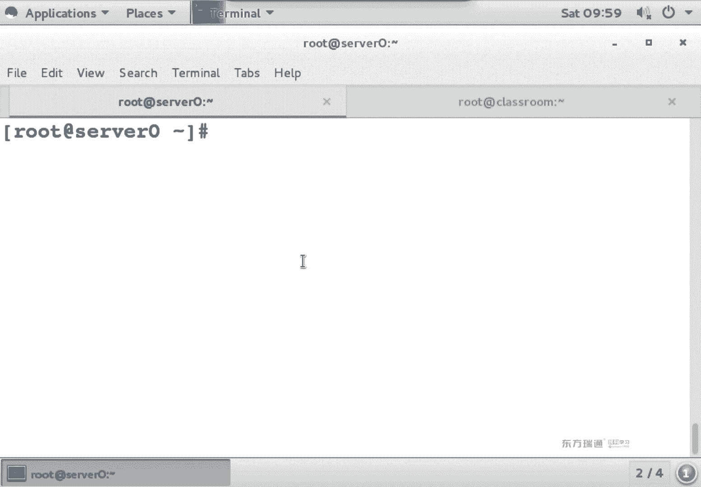

我把字儿稍微弄小点啊，为什么呢？我们记不记得这场命令？嗯。如果你字儿太大的话。大家看右侧串行没？这个正常情况下应该是往左边点的位置啊，都跑屏幕外去了是吧？这字太大了。Yes。

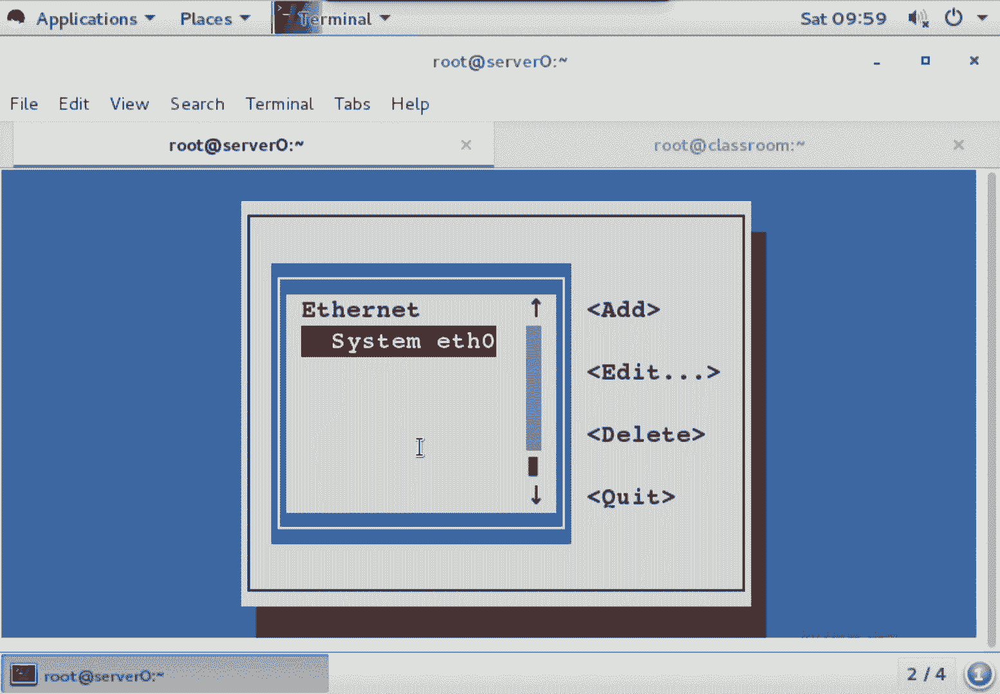

所以说你在做这个实验的时候，字儿弄小点啊，字儿弄小点，看着舒服。ask can fake个。

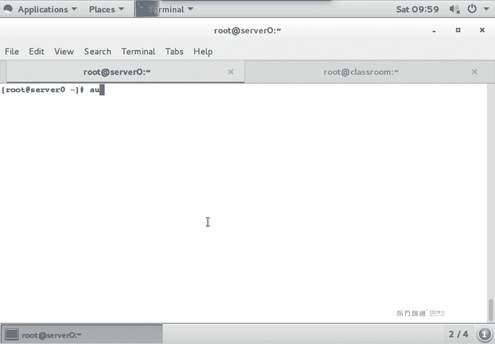

啤油啊。okK左边代表的是user information，右边代表的是authentation。那么默认情况下，我们在验证的时候使用到Ld了吗？没用使用到miss了吗？IPA什么都没用啊。

如果你做这个实验，要用到Id空格。空格是复选哈，在windows也好，linux操作操作系统当中，如果你要复选某个东西的话，一般都是空格。😊，不用键盘操作啊，比如说装一个office，里面好多的组件。

你想来选择，这个时候用空格来选。O。😊，移到右边呢，我们可以看到默认是不是密码存新sle文件中啊。呃，看到这个位置了吗？要用科包式给他选。要用科po式给他选。然后下一步。

下一步他是不是说提示了少一些文件呢？做这个实验，你需要装几个包。他说这个文件来自于哪个包了吗？交好。看到了吧？那大家想考试的时候这个。一一着急啊，你还得去备包名。

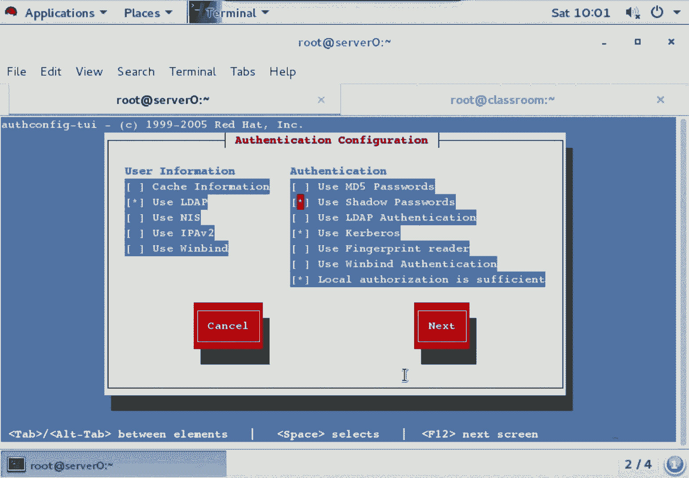

考试的时候，你还得去备报名，这个时间正常情况下需要备三个报名。但是呢我们有个比较简单的方法。叫做。唉，这个包有印象吗？所以我们说第三种方法要用的东西啊。

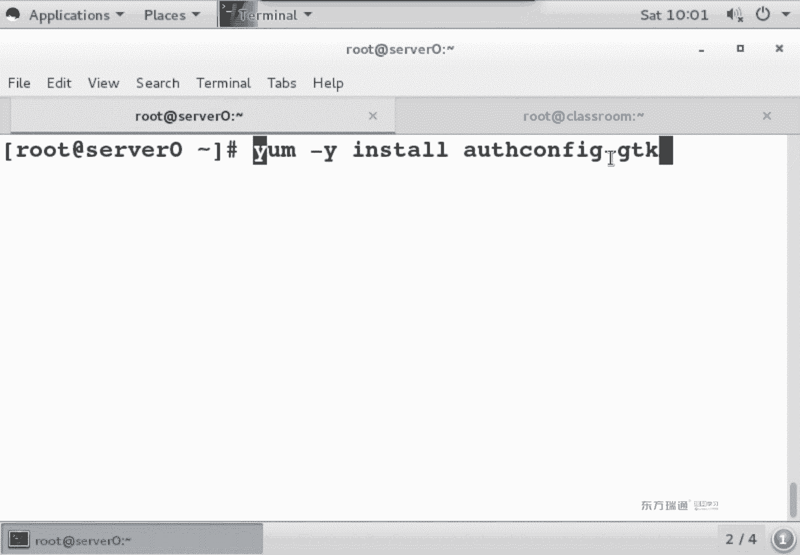

第三种话用的。

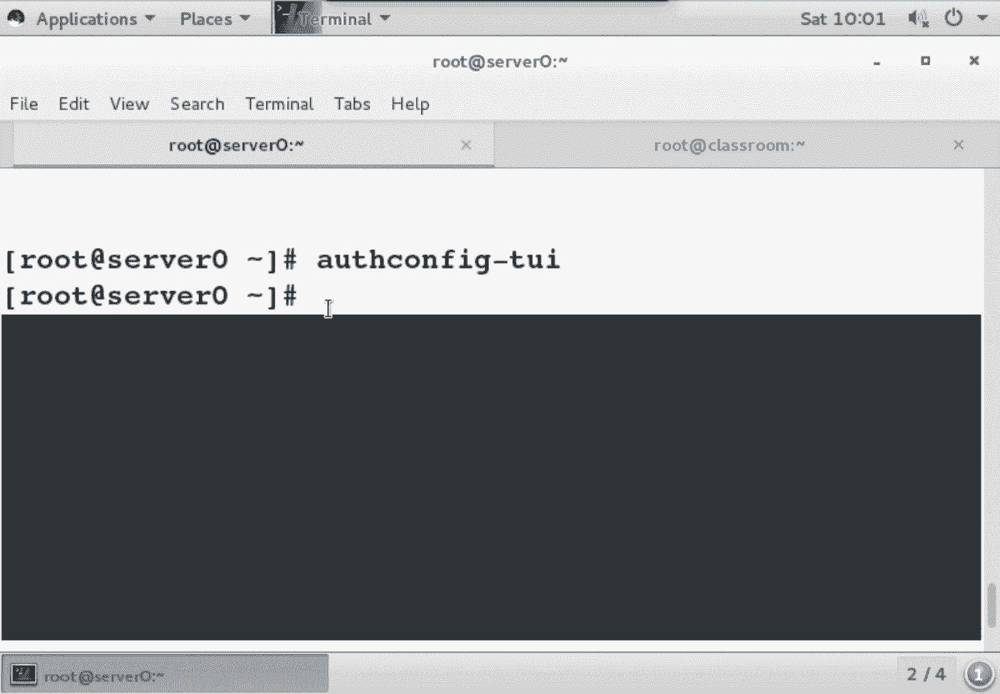

建议大家呀考试的是候用第三种方式来配头两种方式啊就了解就行。JDK这个包在装的时候呢，它会自动来安装关联包啊。自动来安装管联网。奥斯坦 figureGTK。装完了之后，大家看装了几个包啊。这接。

这个看好一1个装的时候，我们发现只装了一个包是吧？关了一包是没装。はい。哎呀，复制。嗯。好，那下面我们来看一个事儿。既然是一个图形的程序，一般我是不是习惯在结尾加个按的呀？加按的什么作用？こら。

大家呢是说把重序放到后台运行是吧？那如果提示了说不能初始化图形。这是为啥？SSH的时候杠X吧。OK依然是这条命令。大家看这个应用啊是不是到本地了。alconfiGTK啊，他到本地了。啊。

标识和验证分成几部分。没有。すご。呃，class room是一台已经配置好Ldap的服务器。我们现在是在serv上来做serv是相当于一台Ld的客户端吧。对于Ldap实验而言，它相当于客户端。

我们现在是在serv上来配。在色上来配，我要加入什么呀？加入矮带回。嗯。第一种方法呢是告诉你们有个脚本文件，注意我说的词哈，脚本文件在classroom上。😊，好，我把这个。因为有朋友歧义了是吧？

如果你赖吧，我现在serv上是吧？L什么？😡，回车。那么你现在这台机器就加入IW月。刚刚我们是不是看了一个脚本儿啊？😡，脚本在克拉斯room母上吧。那我写全了吧。对呀，我少写一点，你们就问我问题。

Okay。我在soer上，我去干一个事儿，赖吧。はい。来吧什么。NFSKRB5赛 up。我这套命令是在哪执行的？在serv上执行的，而这个脚本它的内容是不os canfi什么事儿啊？有问象吧？

就那个命令太长了，你考试的时候，如果是敲命令的话，那崩溃是吧？这个时间得做一上午啊。这条命令。它可以把serv加入I戴。这回理解了吧啊，这道命令什么时候用啊？第三门课的时候，我们做NFS科实验会用到。

😊，自动把我这个serv窝加入I域，不用手动配了，就这作用。那么。回不头来。我就不回车了哈。😊，我就不回车了，要要不。那要不一会儿我还得resite再做一遍。这个你们感兴趣的话，一会儿回去看一下现象啊。

自动加入I。通过命令。Okay。回过头来，al肯 figureJDK。😊，我们会发现在当前这个窗口当中啊，它。有两大部分，第一部分呢叫做账号配置，第二部分叫验证配置。简单的来说就是账号密码。

账号用什么验证，密码用什么验证？😡，默认情况下，这个位置是不是全白了？😡，像白的。OK如果你选择L。大家会发现出一个提示没。啊，要装什么包，看到安装没？

之所以建议大家用这种方式的原因是因为你不用去背那么多包名，因为这几个包啊它比较特别，叫什么SSSD什么work station啊比较特别。😊，不用去背，我可以直接点安装。

它会自动把刚刚提示的那个关联的包啊都装上。能理解吧。或者说看这个位置有没有报名啊？啊。你再退出去，要么干莱因斯大把它装上是不也行啊？😡，看你心情吧啊，ins到。看个提示没要装这个包吧，ins到。

安装安装强制fse false什么意思？强制安装。诶。变没。😡，说变另外一个包了，刚刚是三个词吧，现在变俩词了，太猛。接着安装安装强制安装。诶。😊，那个红色白减号没了吧。下面我们会发现哎。

账号密码考试的时候呢，你把题中要求的那些东西啊，粘贴粘贴粘贴Ld就做完了。然后呢，考试要求是Ld密码。考试的时候。培训环境中呢，我们做的是crose密码都体验一遍。OK吧区别。我们看。

我们在执行它的时候，是不是做了个安装安装强制安装干了两遍。又装了两个包吧，那两个包没用背吗？😡，不用背。就人的记忆啊实际上是有限的。每个人大脑里面呢可能记得或多或少，但是你对于一个人而言。

他记忆是有限的。我们尽可能课上的讲方法，怎么让让你记更少的命令，把这个时间来完成。OK吧，就让我说哎，从我们当前这个位置到天安门怎么走，我只会告诉你从哪倒车，坐什么车，从哪倒车，剩下中间经过几站不讲吧。

主要记思路OK。那现在呢我们再次回来。😊，我看走了哈，退出了。😊，最后我们再来看奥斯肯fiTY。嗯，字儿能小点。行用L戴法。行，carbo。nax的。哎，这回他还提示说少什么什么文件了吗？

是不是不提示了？就是说在做这个实验的时候啊，你至少要装三个包。😡，只不过另外两个包用去备苗嘛，不用备而已，对吧？奥这个JCK，然后呢启用TL把相应的地址都填上。这个是不是第二种方法呀？呃。

因为我们主要建议大家呀用第三种方法来做。所以说我主要给大家演示第三种方法。奥斯肯这个GTK。O。看一下怎么做。那这个呢是考试类型题啊当中的一个内容。是。我们拿考试类型题啊看一下。是。🤧嗯。

这个实验呢叫做。呃。叫做Ld系验。考试的时候呢，题中会明确的告诉你。基本的DN是什么？Ldap服务器地址是多少，证书的位置在哪？carbo的密码是什么？呃，我们测试用的账号的密码就是Cs都小写哈。😊。

carbos都小写。域名。考试环境中。有ker boss密码的事儿吗？没有，但是培训环境中有这个位置是大写小写。😡，大写啊大写。再都小写是吧？这种消息。复制粘贴会吧。

为什么考试的时候建议大家用图像来做呢？第一个。我们是不是可以复制粘贴呀？😊，双人贴O。看看这个实验怎么做。好。我们刚刚退出了之后，再次打开，大家会发现这个位置是不是就有值了？为什么呢？

因为刚刚我们是不是后来又装了两个包？那两个包装完了之后，我把这个图形应用给关了，再次打开的时候，它是不是重新读配置文件呢？读新装的两个包的配成线是不是既有值了呀？它这么来的，当然了。

有没有无所谓啊无所谓。首先呢你会看到一个叫基本的DNDN这个词儿。看到了吧。ex点com，要不你就闭着眼睛复制粘贴。😡，要不你就去确认一下是不是两个东西长一样的呀。看到了吧，都不用改。

Ldap服务器地址。佛务器地址给的是啥？ClasClroom。复制。在这个位置，他说大家看这个格式啊，Ld协议冒号杠杠地址是吧？那我是不是可以把这个位置。粘贴一下。他的另外一种写法呢就是这样。都对。

你写L戴夫冒号杠尬也行，你不写，直接写地址也可以，两种想法哈都对。在下面启用TL吗？😊，启用证书吧。题中会明确的告诉你启用证书，然后呢，证书的位置这个路径长不长？手一敲的话呀，有可能敲不错是吧？

也有可能敲错。所以说对于很长的路径呢，为什么建议大家拷贝啊？拷贝肯定不带出错是吧？看下面这个有个按钮，当load的C就出了吧。把这个路径pa。或者ctrol V在图形界面。

ctrl C controll V是不复制粘贴？O。在下面c是密码。那在下面这个东西啊。他太大了。窗体太大了，然后呢，我的。桌面分辨率太小了，是不是看不全呢？看不全的话。

你是不是可以去修改一下我的分辨率做设置啊也行。哎呀，分辨率分辨率在哪改？设置。然后嘞。这是 play。亮，这啥？Display。呀呀咋看不着呢？哎，这呢是吧？555的比他大吧。😡，找个。找一个。8。

这个800的就够了。老婆来。😊，Tap。O。保存了之后呢。我这个窗体啊，它是不是就有这个垂直滚动条了呀？哎呀。这个稍等一下啊。我给它拉大点。垂直滚动条。然这个VMM附身版本呢，它有个。自动适配窗口大小。

所以说先给你们看到看全了不太容易。因为我这边。生命率不够。系呀。我先给你们截个图看吧哈。😊，我放到我左边这个桌面上截个图给你们看。

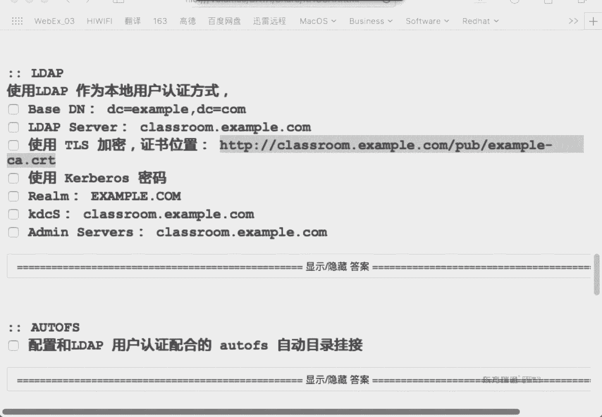

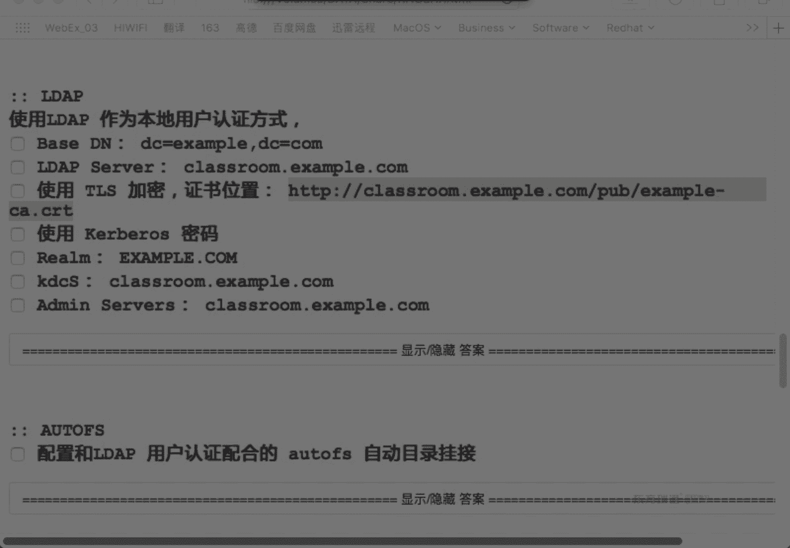

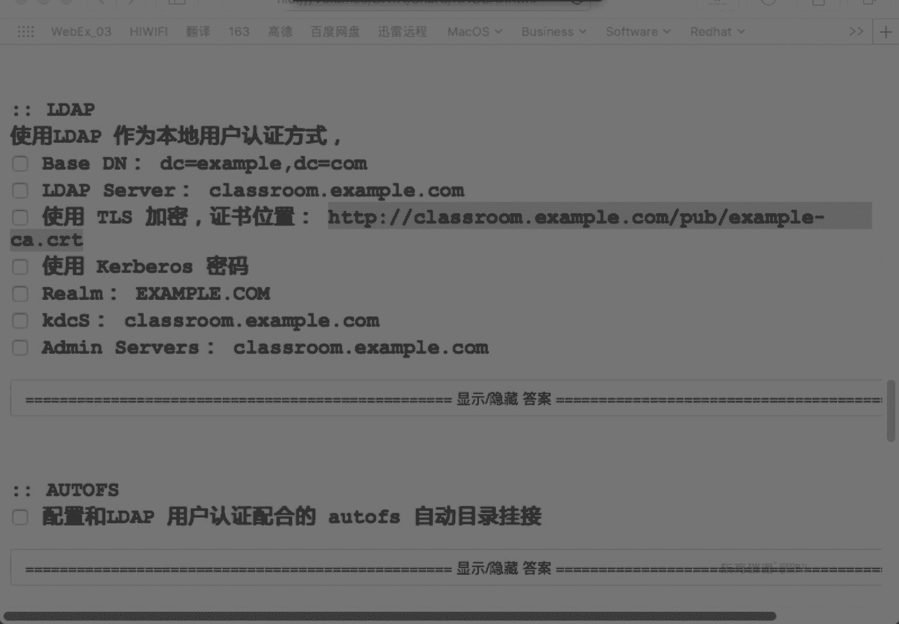

嗯。ok。截个图。大家看下面长什么样啊。6MKDC。我的命死我，下面是不是有敷小矿啊？使用DNS来查找KDCVM名。那么这两个位置啊，你会发现它是虚的，跟上面这数候长得不一样。不让你选或者不让你输入。

不让你输入。如果你想输入的话怎么办呢？第一个要取消复选。取消复选。取消复选之后呢，下面这两个位置就能输入了。那么再看上面这个reM井号代表什么含义？注释吧，讲化代表注释。那如果你想写锐M的话。

是不该把几号删了呀？O。我把这个位置填完。把这个东西呢复制。复制到哪呢？复制到reM里。Yes。复置到reMD。然后呢，要取消最下面那个复选，把下面两个值啊。

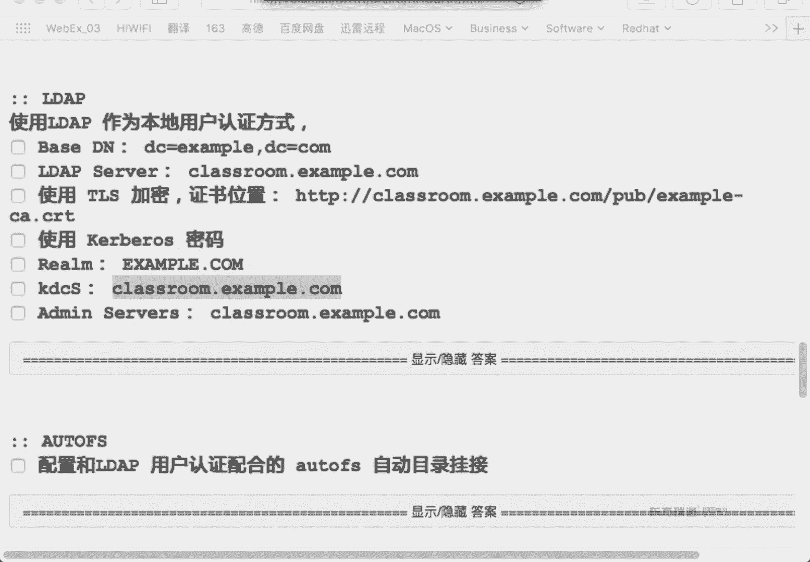

把下面两个词。你要贴过去。

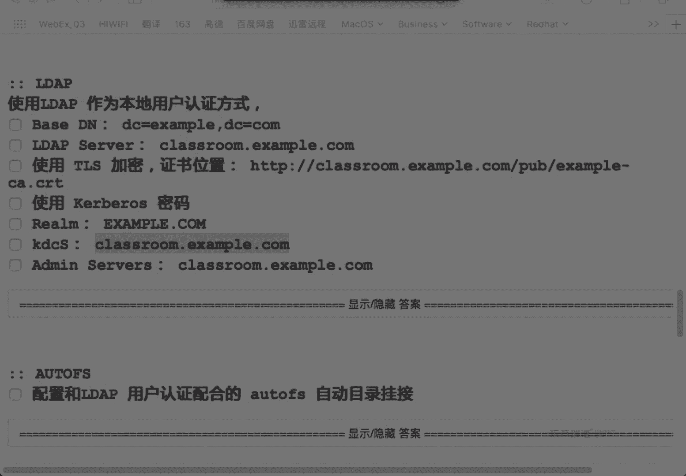

最终的结果应该是这样。我们在密码这段啊干了这么几个事儿。第一个要先取消复选。第一个事儿，要不下面两个粘贴不进来。第二个事儿是不是原来有井号啊？有井号，先把井号干掉。把它弄进来，注意大消息。然后呢。

把相应的KDC和admin server的地址，是不是都是classroom啊粘贴进来应用。应用的时候啊，它会。有一段时间有个卡住的感觉。Yeah。有段时间都卡住的感觉。诶。然后后这个窗底是不是就没了？

串品来了，怎么来做验证？😡，怎么来做验证？有这么几条命令。第一个。你既然是加入了Ld域，那么你是不是应该有L代遇上一些账号啊？在我们L代货域当中啊，已经创下了一些用户都叫做Ld user则什么东西。

有条命令叫做get entry。哎，又是盖子是吧？刚才命令是干嘛的呀？看一下东西是不是？该段安全命令，安全翻译中文呢叫做内容啊，获得内容，获得谁的内容呢？pass word什么呢？账号文件。

这块明明是看阿代库服务器上的password的文件。没车。你看里面是不是好多人。😡，看到Ld多少了没？看到了吧。这些都是Ldap用户啊，这都是Ld用户。我当天用的是so20，那么我就来看一下Ld优20。

有这人没？有吧，这个功能是不是相当于做了个过滤呀？ok那我现在想看一下这个人能不能用。SSH我这台机器是不是已经。加入到L代活域了。我们之前讲过苏命令没。说命令是不是可以切换身份？搜到Ldapus。

大家看我青岛熟变没？嗯。看看我是谁。是吧还带回1乐01700。看到没？OK换句话说，你这台机器是不是已经有LW的0这个人了，他们都是在class room上读过来的。那我现在。

我在 foundation上LSSSH。L带回UZ这里啊。8。4万0。回车。它的密码是KERBEROScos都消写。可以登录吗？是不也可以啊？现在完成。我为什么非要去纺贼身上去登录一下呢？

我要是在自己机天登录自己，我怕也看不明白。😡，放了下吧。OK我们把这个实验给大家整理一下。那么。咱们所有都实验的，实际上。验证步骤很重要啊。验证不是很重要。嗯。呃，是。这个是servvo上做的。

然后你可以注销。是不是还可以用。L带回U泽0的身份。登录S0啊。登录的时候密码是什么呀？Cars。当做升高之后。也可以来看。嗯。这个时间看走了吧。好，简单来说呢，我们把思路给捋一遍哈。😊，第一步。

你要装一个包叫aucan figureGDK，整个实验就就这么一步就行。aucan figureGTK那么装完了之后，命令是什么呀？就报名吧，osconfiGDK它是不是提示要装两个包啊。

安装安装强制安装。装完了之后，按照T的要求，培训环境中，我们要求是做Ld账号c密码。所以说按照T要求选择Ld账号，co密码，是不把相的值接粘贴进来就可以。另外一个cpo密码默认下面的你的复习地址。

无法粘贴，是不是有个复选框啊，取消复选啊，粘贴进来，粘进来之后一应用，它写到了配成键永久生效，然后呢，它还立即生效，怎么确认立即生效啊，用get安全命令，我是不是能看password。

有哪些Ld的账号一堆吧，因为我用的是ker包，我用的是foition0。所以说我就用ld user0给大家举例子。当然你用别的ldus20行不行啊？😊，可以吧，L代用户用谁都一样啊，用谁都一样。😡。

然后呢，我们可以用苏命令切换。在这在机器上，如果已经有这个账号了，是不是可以直接输过去啊？只不过我们缩过去的时候，青岛湖是不是很奇怪？因为还没做漫游用户。在这台机器上是不是没有它的宿主目录啊？

它的速种目露长什么样？瞅一眼啊。我们在刚刚看的时候，它的诉种目录是不是叫这个名儿？你跟凤木虾有这个东西吗？说没有。因为没有，所以说秦岛佛是不是就很怪？啊，等我们在后面呢讲完凹凸 FS之后。

整个实验完成你就发现唉秦老师就正常了。凹凸 FS就是说把class room上。他的这个主目录挂过来。挂过来之后，你一登录这个用户搜种目录自动挂过来。哎，起老佛是不是就正常了呀啊？

这个实间我们啊一会儿接着讲啊，一会儿接着讲。那么对于这个实验而言呢。配置步骤。双包执行。选择Ld安装安装强制安装。看走什么意思呀？我在第一次打开了之后啊，是不是退出了呀？再次打开，为什么呢？

因为普通音读配成件是吧，当然了，你这步不退出啊，你直接往下做也行，把相子值是不是粘进来呀？复选下载证书粘进来。啊，验证使用科斯密码域名，这两个只是默认是不让你输入，默认不让输入。

因为它默认会用DNS来解析，但是DNS还没配，所以说你要干嘛呀？取消复选这两个值是他们设置，设置完之后，最简单的验证方式，你是不是要看存在这个用户了呀？考试的时候，他会告诉你来代夫用户叫什么名啊。

get and。这条命令记住哈，get entry。看Ld，它服务器上的什么呢？账号pass word文件是不是账号文件，服务器上的pasword文件，然后过滤里面的ld的零，有这个人吧。嗯。

他代表这里。啊，这个是太长了，串行了是吧？这是这个实验的过程。考试的时候呢，它只要求配什么呀？alap没要求curse。所以说下面那个位置是不是就选择Lap密码就完事了？

这个是培训环境和考试环境稍微有些区别。然。O我们继续。将一个系统连到IPA服务器。那，如果你想把这个系统连到IPA服务器的话，我们用的是命令来做。用这个IPA的命令。IPA它是红帽提供的一个解决方案啊。

这个软件呢在。六的时候就已经有了，只不是到7的时候啊，已经很成熟了啊，已经很成熟了。就是黄帽之前呢，它有好多的软件，只不过好多也没有拿出来。没有拿出来的给大家演示啊。

那么IPA它也使用了Ld和cars啊，也用到了。呃，IPA它是一个基于web管理的套件。基于外部管理的。如果你用过微软的AD的话，微软的活动目录，它用的是什么管理啊？一个应用程序吧。

在管理工具中有专门一个应用程序叫活动目录，用户和计算机。那么对于IP而言的话，它是通过浏览器来管理浏览器管理。对于红帽好多的软件呢，它基本上都是用浏览器来做管理，为什么呢？为什么不用图形应用程序来管的？

为什么有浏览器呢？浏览器它最大的优势是什么？不用装客户端，有浏览器就能用，是不是啊啊，这它最大优势。如果你是做一个图形界面的应用程序，这问题就来了。你要是做windows的话。

你得装个windows的应用。做linux的话，比如说linux应用是不是得好做做好多程序啊啊，他们为了节约成本。简单来说呀，做软件的话，BST和CST的区别。BS代表是浏览器啊。

服务器CS代表是客户端服务器。IPA客户端。就一条命令啊，IPA client in store向导交互式，你把所有的IPA服务器的地址敲里面啊，实验完成。就一套命令。灰IPA table键就得了吧。

clant a它是一个设置。设置。那如果你想加入活动目录的话，怎么办？就是说在公司里面呢已经有AD了啊，已经有windows的AD了。我想把一个linux给加入一个windows的AD。

那你可以使用real MD啊，re MD。用样么杠Y道把reMD这套命令给装上。那以前我们在7之前呢，如果要加入玉的话，怎么加呀？可以用n命令来加啊，n命令来加入。加玉的目的是为了什么呀？

是为了用预账号吧，主要的目的是为了用玉账号。可以先discover来发现账号，然后john来加入。这个是怎么来加入活动目录的步骤？对这两个实验呢感兴趣的同学可以做一下啊。

那下面这个时间你是不是得先配一个？活动目录啊，再抓一个windowsserv版本啊，然后呢DCpro把它变成预控。选预控之后呢。你来那个4的和你那个windows的联网吧，你再干这个事儿就OK了。呃。

IPA客户端呢，这个我们可以直接来做啊，可以直接来做class room啊就是IPA服务器啊，直接配就行。这两个实验呢按照教材上的步骤都可以直接做的。OK地着。吃饭。文件系统在整个2CE的考试当中呢。

磁盘文件系统它属于很重要的知识点。一共要考四道题啊，考四道题。82838E。I死咖y。都是跟分区有关的实验啊，跟分区有关实验。那么在提到分区的时候呢，我们要回忆几个知识点。So。第一个。

一块磁盘最多几个主三分区。我是样。是是。是的。四个主饭吗。这前面还点内容啊。硬盘的分区表分几种。分区表分几种。两龙。分级标有两种，哪两种？嗯。硬盘的分区标有两种，一种是MBR，一种是PPT。🤧う。O。

😊，那我们是不是还提到过一个叫临磁道啊？询问一下没？他提过临丝道是吧？Yeah。512代表什么？😡，0迟到啊0迟到46代表。Yeah。中引导记录是吧？哎，我为什么显BR不显GPT呢？😡，嗯。为啥？

因为MBR和GBT他们还不太一样嗯。6四代表什么呀？吃饭分区表啊。这个二呢分个符。嗯嗯这样也对哈这样也对。Okay。MBR和GPT啊，它们主要的区别。一个硬盘，如果是按BR分区的话。

这块硬盘最多是15分区。15个分区。不多。最多。Yes。🤧番茄数小于15个。什么叫分居数小要15个呢？我们那个盘符最多是不是能分到Z呀？微软的系统Z的话，这肯定是大于15个字符啊。

这个A到Z一共多少个字符啊？20多个吧嗯二十几个不一定啊。这个也不是交精文的，记不住啊，我就是20多，那是不是有多块硬盘呢？有多块硬盘。那GPT分区呢。Partition。这个数的限制哈分区个数的限制。

而且MBR和GPT分区啊，他们还不太一样。MBR就是在零磁道当中有个分区表，而GPT是前面后面都有个分区表，有个备份啊，有个备份。换句话说，GPT分区要更安全更安全一些吧。有备份，我们都认为是安全一些。

所以说我们在前面这个位置写的时候啊，我就这个位置给你们写了个MBR没有写GPT啊，因为他们的分级表结构不一样。如果是MBR分区的话，就是前面呢有个分区表，有个主意导记录，然后就是分区。

每个分区是不是分为节点区和块区啊？没分区都分一去快去。那GPT它和MBR不太一样，什么呢？GPT是前面有个分区表，GPT分区表，后面有个GPT分区表，它有2块，它有2块。然后中间呢是你所有的分区。

每个分区是不是也分为节点区和块区啊？这他们的区别。O。那么对于MBR分区而言。一个硬盘最多几个主存分区啊。4个为什么呢？😡，对对，就是那因为一个组十八分区。一个主持万分区。他占十六自己。

而我的分区表是不是644几啊，64除以16，最多就4个这么来的。换句话说，你换硬盘不管怎么分，最多4个组盘分区。ok现在问题来了。😊，考试的时候呢。你会发现呢只有一块硬盘，考试环境中只有一块硬盘。

然后呢，在这块硬盘上已经有三个主酸分区了。他又让你分两个区怎么办？怎么办？听没听过扩展分区啊？一块硬盘最多几个扩展程区。一个。一光硬盘最多就一个扩展分区啊。扩展分区要不就有要不就没有，只有一个。

可不可能说我分了个组，分个扩展，再分个组，再分个扩展。没有扩展只能有一个。only one，on one只能有一个。扩展分区它的级别和谁是一样的呢？如果你的硬盘有一个扩展分区了。

那么最多有几个主酸分区啊。3个。它和主酸分区的级别是一样的。有三个组。有三个组有三个组。那如果你要再想分两个区的话，我们只能去分个扩展，在扩展里面来划分逻辑。啊，这么来分。扩产分区它就是个范围。

大家知道什么叫范围？强。我们去种地的时候啊，可能你们没种过地是吧？我们看农民种地的时候啊，他们是不是要把这个地给围起来呀？圈圈儿。啊，圈这一圈啊。是一个范围，它叫扩展分区。然后在扩展分区里面。

我们是不是再可以来分逻辑分区啊？再分逻辑分区，给逻辑分区指排大。换句话说。扩展分区。它永远大于什么呀？逻辑分区。你逻辑分区是在扩展分区里面。他们就跟。苹果和苹果盒子的区别是一样。水果和果篮啊。

果篮是相当于扩展分区，水果就相当于逻辑分区。能力解区别吧。一个扩展分区里面可不可以就分一个逻辑分区啊，可以吧，可不可以分多个逻辑分区啊？也可以，但是不能超过15啊，盒不能超过15ok。嗯。

那现在我们再来想一下，那么考试环境中，如果给了你一块硬盘，已经有一个三个分主词分区了。然后题一中呢，上午的考试题还让你再分两个分区出来，怎么办？是不是画个扩展呢？在框里面画俩逻辑一样。能理解吧？

这上午考试题啊，有个坑，你别上来之后就主主主主主，因为默认一回车就是主啊，你别上来就是主分了四个组，即使还有空间还能分区了吗？分不了啊啊，分不了。实际上还有一个方法呀。就是我不用IBR分区。

我直接给他GPT给他转成GBD分区也行。再或者是说呢用我们后面讲的LVM都可以。就说对于上午考试这一道题啊，实际上是有三种方法来做。只不过后两种方法还没有讲。那如果只看今天讲的内容呢。

你就知道分个扩展里面来逻辑就得了。今天会用到第一种方法啊，第一种。这段内容OK吧。ok我们回过来。看这张内容。这张面有两个实验，一个是分区实验。另外一个呢就是交换分区啊，交换分区。

交安分具在微软的系统当中啊叫什么呀？虚拟内存。微软的虚拟内存是不是用p file点s文件来做的呀？配置fi点 c文件是用一个文件来实现。linux呢它可以用分区来实现，也可以用文件来实现。换句话说。

这张我们会讲两个大实业啊，两个大实验。O。看一下MBR还是JBD。从1982年以来。一直在用MBR。从哪个年代开有GPT的呢？从哪个年代开用GPT的？或者GBT什么时候出现？想想。

你们的硬盘现在是GBT吗？😡，你们一盘有没有分GBD分区的？有吧，笔本是不是一般都是GPT分区啊？😡，台式机可能好多人还是MBR分区啊，那为什么还用GPT分区，原因是什么？他还有个原因。

除了个数限制之外。大硬盘。大硬盘就说你的硬盘超过2T的话，MBR分区不认识。嗯。能理解吧？就是硬盘太大了，你只能用GPT。😡，还有一种原因是什么？😡，大家听过这个东西没？UEFI听验了没？你没听过啊。

主板bios，以前我们主板bios长什么样？蓝瓶吧蓝瓶子盖是吧？😡，开机启动的时候，摁deelete键或F1F2之类的键，是不是进入了一个奇怪的模式啊，叫什么smobi之类的吧。见过没？

如果你在用VMY这个软件的时候，你会发现它不支持虚拟化。你是不是要去bios里面把虚拟化功能启用？或者说当你去设置用哪一个设备来启动的时候，是不是也要进boss？OK吧。好。

那么以前我们的拜奥斯长得什么样呢？就是蓝屏啊蓝屏。然后上面白字儿吧，上白字。在后来的时候呢，UEI掰出来了，你会发现哎。😊，里面是带图片的吧，是不是鼠标还能用啊？最开始在bios当中鼠标能用吗？

只能用键盘table键方向键回车，就这么几个键吧RESC啊，还有它下面提示一些功能键。好，那么UEfi我们会发现它跟bios区别啊，鼠标能动了，是不是多了个驱动啊？UEFfi呀。

它可以加载一些驱动啊这载驱动。为什么我们建议用UEFI呢？你在用MBR的时候，大家想你启动一个windows，它是先加载系统再来加载驱动。这个是一个串行的过程，顺序的过程。当你用UEFI的时候呢。

它是加载驱动，然后启动系统，它是并行的过程。你说哪个快呀？这个找朋友去吃饭啊，找朋友去家里面吃饭呢，我先做饭再做菜，还是同时做饭和做菜哪个快？同时快是不是并行肯定要快一些啊，并行OK。

那么UEI发译啊它的一个特性啊，就是知持驱动的并行加载。我们以前在用V8系统的时候啊，你会发现用IBR分区，它是先加载驱动呃，加载系统是这么一个过程，它是顺序的。那么当使用UEI发现呢，它是并行啊。

启动更快一些。换句话说，用笔记本的时候，一般都建议用什么分区啊？又E嗨吧。笔记本最大的特点是不是快速开关机啊啊，快速开关机。那如果你用的是固态硬盘的话呀，这个区别不大，固态硬盘呢这两种分区格式区别不大。

那如果你都是用机械硬盘的话，能差好几秒。啊，你们可以回去试试啊，我之前特意去试过同样一台机器。I5的CPU16G内存不对，台式机32G内存。然后硬盘是机械硬盘啊，机械硬盘做MBR分区还是做UEFI分区。

它俩同样是启动系统的，同样的系统啊启动的时候能差好几秒啊差好几秒。Okay。Oh。那们回过头来。😊，呃，这个就是刚刚讲过的内容啊，刚刚讲过内容，你要知道几个词儿啊，一个是128，1个15，还有个2T嗯。

2T啊，有这么几个词儿。超过2T了就只能用什么了呀？GPT。再有就是UEII呀，一般会适和GPT做配合的啊，GPU做配合的。啊，看一条命令叫Fdi啊，Fdi Fdi它的功能啊叫做分区命令。

如果你用过dss命令的话，依然存在F disk命令啊，分区命令。只不过后来呀我们一般用DM比较多是吧？嗯在doss下图形下也可以用DM啊，分区管理器啊，叫磁盘管理器di manager。

那么在分区的时候，你是给硬盘分区，所以说F disk个命令后面要接硬盘。VDB啊VDB。既然提到分区了，我们要。看一下分区的思路。在做分区的时候，我们都干了什么？第一步。判断硬盘。你要给硬盘分区的时候。

第一步肯定是判断硬盘。判的。怎么要判断？大家想啊，linux当中你所有的硬盘是不是都在跟dice下？你是叫VDAVDB还是叫SDASD，还是叫HDAHDB你是否先判断一下给哪块硬盘分区啊。

没有人上来说之后。我机器上尤其是服务器啊，是不是好多硬盘，别分岔了啊，别分岔了。判断硬盘。然后呢，我们要给硬盘分区啊分区。判断了之后呢，是分区。到底分几个区呢，是不是看你心情啊？没有人规定到底分几个区。

看你心情，我就分一个区行不行？可以吧。我就分四个区行不行？这到底分几个区都是看用户的心情，或者说看管理员的心情，没有人管你愿意怎么分怎么分啊。三区算完了之后做什么？格式化。分完去之后，一定要搁着的话。

为什么要格式化？不格式化，这个分区没有办法使用。不是。比如说微软的系统是不是建议我们NTFS啊？😊，linux到切版7啊，建议我们XFS啊XFS切版7默认的文件系统类型是XFS。以前默认是EIT4啊。

再以前是EIT3啊，再以前是T3。这是他们的文件格式。呃，割完了之后做什么？割完了之后做什么？我天吗。一般会有个券标的事儿是吧？这苗不射行不行。也行。就说我们割完了之后啊，有这么个2。5出来啊，叫选标。

这标叫可选项。做不做，随便看你心情。对呀这个。啊，先不要了。对于微软的系统而言，割完了之后，我们是不是只拍个盘符啊？但是对于类那个字是不是隔完了之后，你要把它挂在某个文件夹下。

这个东西呢我们管它叫做挂雷点。大来一点。有挂载点了之后，那我们是不是要把这个分区挂在这个挂载点下？如果只用mo命令的话，它是临时生效，一重启就没了。每次开机的时候，你都得来骂他一遍。

说然挺麻烦一件事儿啊。所以说我们要考虑的是不是永久挂载啊。永久生效。永久生效。那既然永久生效了之后，我们是不是还要让它立即生效啊？立即生效。好，都做完了之后要干嘛？😊，确认。确认。在linux当中。

我们有四道分区的题。四道分题的题都是这个思路。嗯，第一步都要先判断硬盘。那么判断硬盘的命令是什么呢？叫Fdi。I a disk。分区的命令是什么呢？叫Fdi。格式化的命令是什么呢？make FS。

制作文件系统卷标的命令呢？不一定。他是看你分区类型是啥，这线空着挂载点。关了点是不是就有文件夹啊？😡，创建没那家妹呢是啥？没开电样啊永久生效是不是改文件呢？立即生效，我们是不是之前提过一个m命令呢？啊。

确认。忘了。有。这个实验中，首先你需要知道思路是什么。然后呢，你知道命令是什么，再之后是不是知道选项跟参数就OK了呀。啊，我给大家写这个过程呢，是记忆的过程啊，记忆的过程。首先我们要来判断硬盘。

I have a disk。看一下怎么判断哈。😊，🤧嗯。FD是个杠楼。乐是什么意思？😡，list list列出。啊，我们看一下。VVA。这个是一块硬盘，这块硬盘多大？收割机。这个硬盘多大？多少自己啊？

单位不一样是吧，都是多大这个硬盘多少个扇区？然后呢，一个山区多大？他乘以他得他。能看懂吧，这是扇区的大小，有同学可能觉得说哎，老师，你这个说扇区干嘛呀？😡，你上去月多大多大，跟我身上没啥太大关系是吧？

啊，你可以先不管。然后在下面。うん。逻辑上物理上。你的一个一块或者一簇多大？50百下自己啊。IOIO叫什么？输入输出读和写啊，读和写最小和优化的单位。512。当前你的分区类型是什么分区类型啊？

他说一个叫做doss卷标，la不看卷标类型叫doss，这个什么分区？MBR分区。dos系统听过吧？嗯，在很久很久以前，在1十多年之前了啊，doss分区倒ss系统那个时候都MBR分区，这他磁盘的标识符。

这块硬盘几个分区啊？1个VDA1。A呢代表的是第几块硬盘VD呢代表硬盘的类型。KBM虚拟机中的硬盘都叫VD设备。A代表第一个E代表是第一个分区。

星星代表是说不table从这个分区来引导启动被激活的主传分区就是星。此大和案的。我们往天上翻，大家看这个按的值和这个值。2097。啊，后面我们就先不看了是吧？2097换句话说。

我是不是硬盘整个空间都分了一个区啊。看这两个数啊，判断硬盘还有空间，看暗的数和这个数。再然后block blocklock代表是块的大小，我这个分区一共多大？三位为一组。

它的单位有K有B单位是不是有KB呀？KB三维为一组，兆三维为一组G是不是使的G。能看懂吗？多大。后面呢是它的类型啊，IDID和类型。我这个是1个83IDle那个4分间型类型。

le那个4分间系类型可能是XFS可能是IT4，可能EIT3不一定是啥。不一定啥，83呢是做一个标识，后面是具体的类型是什墨。呃，这篇能看懂吗？能看懂，我们继续。哎，这是不是还有一块硬盘？多大。10个G。

剩下是不是都一样。豆让不用管。OK那我们到天上。显示工具栏。看一下硬件设置。嗯。哎呀，这个不看这儿哈。看错地方。呃，我们当前这个是哪台机器啊？4520是吧，4120应该去哪儿看，去这儿看吧。

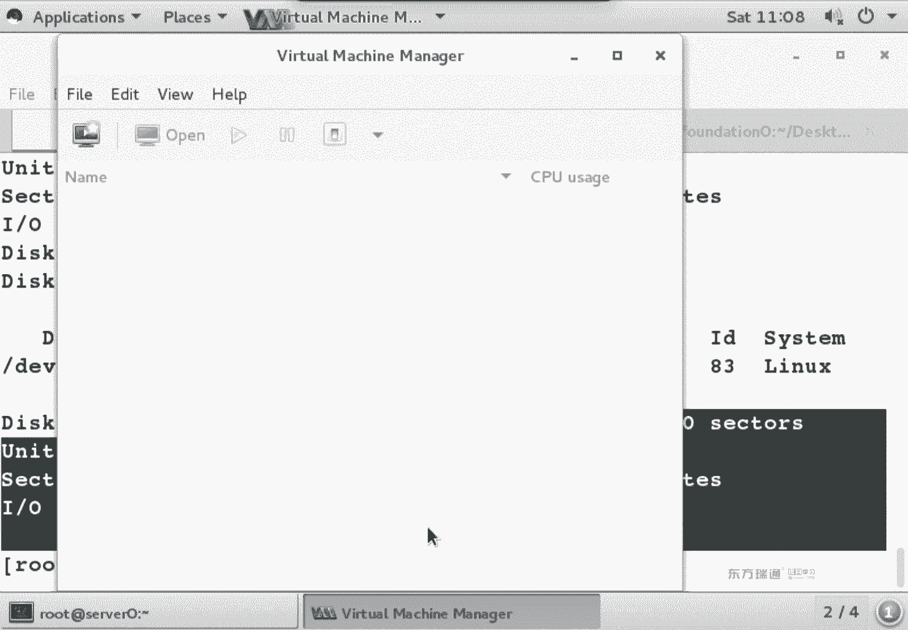

虚拟机管理器。哎，我 the mini teacher，这人是谁？

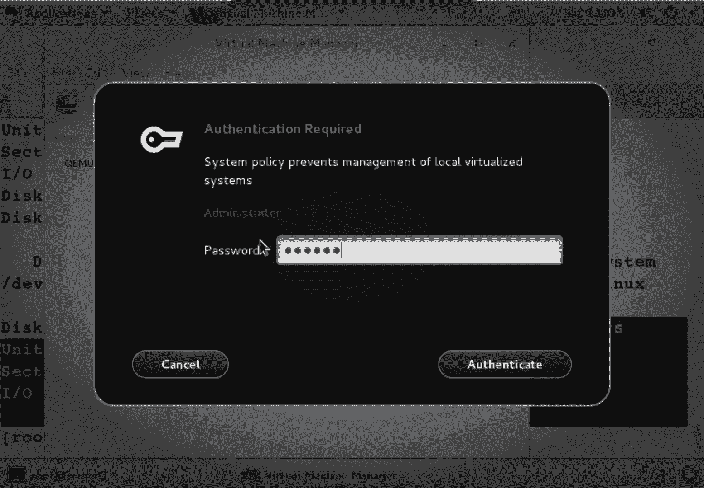

root吧root的密码大ASIMOV。找到seropen。看灯泡。Show virtual hardware details。如果你买了一台硬件的话，买一台电脑有硬件，你是不是可以拆开看硬盘多大呀？

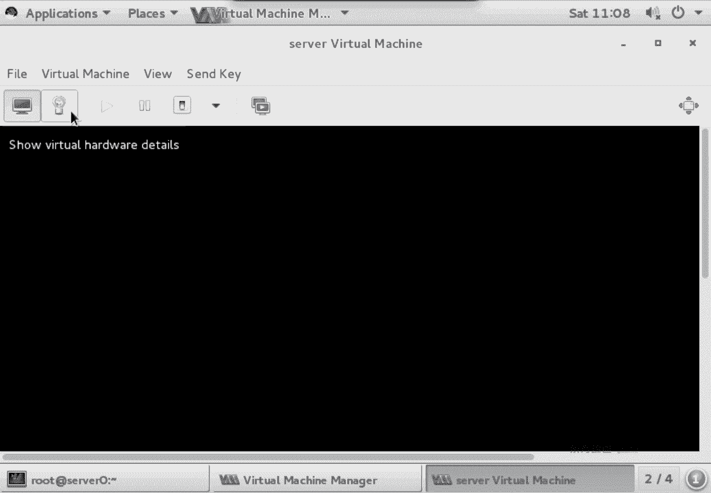

一个意思啊，几块硬盘。😊，没有啊。多大？不定。能看懂吧？在这看就相当于物理机，你给拆开，你看硬盘拿出来看一下多大矢个计啊，在这看。虚拟机管理器。オ。😊，现在会判断硬盘多大了吧。那么还有另外一种方式呢。

叫做LS block。几块硬盘。啊，第一方硬盘分了个区多大？挂哪儿了？第一块硬盘还能分区吗？还能分区吗？不能没空间了是吧，没空间了OK。😊，现在我们刚才第一步。我们有两种方式，一种是FSD杠了。

第二种是。阿拉斯不lock。block叫块设备吧，列出块设备大小。通过这两个命令，是不是都能判断你的硬盘？再或者是变态点的方法呢，就是去跟dvic下面去找。你硬盘接口类型ABCD也行。

那种方法正常人不用啊嗯正常人不用。有好多不正常人。O。硬盘判断完了之后，你们要干什么呀？😡，分区啊分区刚刚已经判断了有两块硬盘，第一块硬盘10个G，分了一个10个G的分区。现在如果你分区的话。

只能用哪块硬盘。块第2块只能用第2块硬盘。第二块硬盘是我没有分区啊，随便分。但是在考试的时候，你只有一块硬盘。而这块硬盘已经有三个组三分区了，还让你再分两个分区怎么办？分科扩展分俩逻辑是吧。

就是培训环境和考试环境稍微有点区别。那下面呢我们给它分区。分区命令FD跟dice。丽丽。嗯B okay。进来之后啊，大家看唉这个词儿没？是。你用这条命令进来之后啊，他就给弄个doss分区表了。啊。

学习任何一个软件进来之后，第一件事要先看什么呢？帮助啊，先谈帮助先摸一下。到此一游是吧？看一下都能干什么。如果你想新建一个分区，应该用什么呢？系。嗯，爱这个newpartition。

N代表的词是么 new啊，新建一个分区，这个分区手续都说建错了，是不是得干掉啊，删除应该用什么？那可以买。D。删除一个分区吧。好，那么这个分区分完了之后，你是不是想保存退出啊？保存应该是。好了。W。

保存一个磁盘，然后退出。看完了吧。那手一哆嗦，我分的是VDA分错了。我有两块硬盘，对吧？所以多说分VDA去了，分错了怎么办？他在。退出不保存吧。分错了，没事哈，你别保存，没事，你别一高兴Q了啊。

一高兴W了，你没有Q直接W了啊。😊，别重洗哈。一重启是不是起巴来了呀嗯。好。啊，A。AAA在这儿没讲吗。诶，好。啊，VDA对那个不是。我们当前系统是不是装在VDAE上啊？你把VD也给分区了。

那整个硬盘只有一个区，你把它分区的话，肯定得把原来分区删掉，是吧？原来分妮删掉了。那系统是不就没了。啊，所以说我拿VD给大家举下例子啊，千万别W啊，分区分错了，别紧张，没事儿，你别W没事，Q啊Q退出。

好，这几个东西会了，是不是用的分区了？😊，我们再来看比较特殊的地方啊。呃，他这个没。嗯。系能。FD还支持做GPT分区。以前没有这项。新多出来的功能。换句话说，FDC是不是升级了呀？FD个升级了。

它可以分GPT分区，只不过默认分的是MBR到s分区啊，OK。AA代表什么呀？激活。激活哪一个主酸分区？呃，我们来考虑个问题啊，说微软的系统啊。我们说windows98啊。

min族498安装的时候必须安装在哪个分区里？这个。被激活的主酸安分区，有同学说是C盘啊，对于9吧而言，我有一块硬盘，四个分区都是主酸安分区，谁被激活谁是C。能听懂吗？他不是按照顺序的CDEF。

它是谁被激活，谁是C，它是这么个顺序。所以说windows98的时候，那个年代呢，98必须得安装在被激活的主方分区里。在9吧。还有几乎是在。加了。呃，16字前。加了个标记。不是。不是在那里面加。

加哪不知道，你可以去查一下，查完之后告诉我。没研究过没研究过或者加代码。OK那么后来呀微软是不是做了一个叫NTLM文件呢？NT得他有点看。微软是到NT版本之后啊，多了两个文件。

NTLL和NT datacom这两个文件呢是放在被激活的主安分区，然后它的系统可以放在别的盘。专门做引导的吧，这两个文件你可以把它理解成是IPR文件引导文件。O。那我么再往下。呃。She。

这个OO代表什么呀？你既然是可以G变成GPT分区，那是不是就也可以O变成倒s分区啊，两个分区类型切换。分区类型在切换的时候呢，它有这么一个要求，得先删除原来的分区。再转换。换句话说。

你删除原来分去里面数据是不就没了呀，数据没了。P的作用什么呢？😡，FD是个杠L什么作用？查看硬盘几个分区吧，那么P的作用是查看当前硬盘有几个分区。

这个是在FD4里面看和FD4外面看区别P查看printnt。呃，TT的有什么呀？转换ID是吧？我们在之前提到过说，linux分区实验一共4个实验，82838E。我说的82838E呢，代表就他的系统ID。

82838E对应的就是啊linux的分区。交换分区和逻莉卷LVRLVR三个实验。O。那下面呢我们要来分区。新建分区的话应该什么？嗯嗯。默认是主的扩展的。主的，如果你用的是企业版6的话呀。

这个位置必须得敲P或者是E，它没有默认值。那么到企版7的时候，它是有默认值了。你fa。换句话说，我直接回车的时候，就按默认值走批。啊，那。我我弄个P吧。直接P的话，说不用挑，直接回车就行了。考试的时候。

如果你要创建扩展分区，你应该摁什么呀？EE。Okay。看是不是有4个？1到4随便默认是不是一样，不用管。First。唉，这个值范围有点眼熟啊。20482097眼熟吧FZ4杠L看你在分区的时候呢。

范围就是在这个里面分。一般情况下，福尔斯都不用改。什么时候改的？呃，硬盘有坏道的时候。硬盘有快道的时候啊，我们是不是可以通过一些软件来扫描出大概在哪个位置，附近有快道啊？

那你是不是可以分区的时候把这个位置给跳过？我分了个区，这边我有空出来，然后后面再接着分区，这个时候你会改什么呀？负说的是。正常情况下不用修改。for的代表是开始是吧，第一次嗯，OK吧。

plus plus的代表是最后。最后。一个分区有开始和结束啊，拉丝的值我们要洗拉丝的只有几种写法啊。三种写法。第一种想法呢，山区。到哪个山区？啊，我们之前是不是提到说一个三区5扇，有印象吗？啊。

你到哪个山区，你可以直接洗。这个还得算，或者说以富尔斯的为基准，加上多少的山区。能看懂吧？以分为基准，加上多少扇区。但这个东西不是给人用的啊，不是给人用的。你有你硬盘有坏道的时候，你可能会用删区。

硬盘没有坏道的时候，我们都用什么呀？大行嗯。看到这种写法了吧。什么时候开始啊？想好，后面那个KMG大写小写大写OK它这是小数点吗？比如说我想分1个1。2G的分区。我可不可以加上1。2G呀？不可以。

它只是是整数嗯，它只是整数。所以说你想分一个分区的话，那我们一般就这样。1。2G就是这么写。那么在考试的时候呢。他会给你个范围，他说想分个多大分区，皮中会明确的告诉你说，只要在这个范围当中就对。

所以说你按100只来算就可以。正常情况下，我们的金日是不是1。24啊？你给他是算的话，这这个也挺痛苦一件事儿。所以考试的时候题中会明确的告诉你，你的这个容量的范围啊，只要在这个之间就OK啊。

所以你按清洁日啊清洁日来算。回错。1。2G吧。确认怎么确认？P。呃，分区算完了之后也确认了，是不是要保存呢嗯。那为了给大家看现象。我们再来分个扩展分区。我想把剩下的所有空间都给扩展进去，怎么办？

新建的话依然是什么呀N。扩展分区呢，一。几啊。鼠标。2三4随便哈。开始。不管。结束呢。嗯。用算吗？嗯不用算，大家看拉丝那位置啊。我拉斯的位置最多说2097的，嗯，你要再敲一遍，和这个默认值是不是一样的？

所以说剩下的空间都给他回车回车代表什么含义？剩下空间是不是都给扩展同学了，然后是不是可以在扩展同序里面分逻辑？再分逻辑N。还有扩展分区的事了吗？因为只能有一个扩展，当扩展有了之后。就只有皮和轮了啊。

只有皮和轮逻辑是什么？L。大家会看这个位置有个数值叫 numberumber from。这个里面有个知识点啊，叫逻辑分区，永远从五开始。为什么？哎啊。永远从不开始。因为在分区的时候呢，我们会发现。

虽然整块硬盘你分了一个主，分了一个扩展。剩下两个乳说没有用，但他要给保留。万一你硬盘还有空间吗？1234不是主，就是扩展。1234不是主就扩展，到底是主还扩展呢，我也不知道，这不得确认呢。

OK所以说第一个逻辑分区啊就是5系统中第一个逻辑分区永远是5，知道什么叫永远吧？嗯，只要你又类那个事啊，只要你用。分区这个分区的知识点呢，不是说只有linux使用。能理解吧？只要是MBR分区。

只要是GPD分区使用啊，那我们这个里面主要讲的是MBR分区。So。我有。好，fort的位置。这个逻辑分区我们想分多大。啊，我我分个200兆行吧？行好，可以吧。这怎么写啊？家。明白。嗯好来。啊。

在大写是吧？😊，严格请问大家写哈。😊，我有。确认。刚。好保存。一和2谁是扩展的？你怎么判断？我们在最后啊是不是有个ID呀？有个835是吧。ID看不懂的话，我们是不是能看到这个词儿啊？X3的。

即使这个词你看不懂的话，大家能不能看到spa和案的这个范围？你看一下你这个分区是从哪到哪。😡，你这个分区是不是在上面那个分区里面？能看懂吧。这么几个注意点哈，okK保存。证据做完了。刚刚分区的时候。

我都干了什么呢？😡，分是新建分区是吧？新建分区之后，我直接回车了。第一个是不是煮的呀？然后他说问咱们1234。我是为也卖力了。再之后他是问咱们firs的。从哪开始，我管他嘛？不管。

你能定义你从哪天出生的吗？😡，定义不了啊，你能定义你哪天结束吗？这个可以是吧？只不过一般我不愿意定义而已啊。😡，ok。😊，一。1200大米。多少兆吧。这个是不分了一个区啊？

分完了一个去皱树皮瞅了一眼一个主。在之后呢，我们是不是分那个扩展的。新建扩展。那么在新建扩展的时候，是不是写E了？😊，一口来，他是不是又问咱们1234啊？啊，个。啊，对。最后保存嗯。

right咱们最后保存。要不年。嗯。好，那么分扩展分区的时候呢，是不是也有开始的范围呀？没有开始的范围。开始发的也没管吧。多少啊？开始结束是不是都安车啊？这件事不代表所有空间都给谁了啊。

都给扩展上去了吧。再之号再新建。这回在新建的时候，默认是不是还是主，你还能新建主了吗？😡，建不了了是吧，一块硬盘主了在1。2G，剩下是不是全给扩展了。你想再新建没有空间了，没地方了，那我们只能新建什么？

😊，逻辑。国际开始。开始从来没改过。罗辑他说12345的事了吗？默认就是5啊，所以说你还要去定义这个池了吗？😡，这个值是不是就不用定义了，默认就是5哈开始。多大？200兆吧。之后呢，P瞅一眼没问题。

要干嘛。🤧W。好，给大家做了一个紧扩展和逻辑。那么在考试的时候呢，你必须要做的是扩展和逻辑是吧？第刻了逻辑OK。分区分完了之后干什么了呢？😡，格式化吧啊格式化，因为这P已经确认完了哈，不用再杠L了。😊。

格式化。我们在格式化的时候呢，有这么几个命例。才会发现点后边呢有不同的文定性类型，有没有XFS。嗯。有没有EI74？嗯，有吧。隔的时候到底用哪种文件选种类型呢？看题要求。就考这两种嗯，就考这两种。

OK那我要隔成这个。格式化的话，它后面接的是什么呀？🤧。分区是吧，BD啥BBDB然后嘞。21。我们现在有三个分区125是吧，搁谁？隔二吗？回答出了。只能搁一和5是吧只能搁一和5，一和5。

你随便写一下就行。格式化出功呢就长这样，他说你的数据源是他。节点大小是这么大。然后你的格式化一些参数是不是大于这等号啊啊，这是格式化成功的提示。格画成功之后，我怎么判断？格式化成功了呢？

我们在之前提没提到一个命令。叫做。呀忽然间忘了。我用哪天魅令来看文件系统类型的。用哪条命令来看文件信访类型。之前讲过。啊，讲过是吧。嗯，想样。L4block是看什么的呀？啊。看列出块设备是吧？啊。

那我看块设备信息呢。应该是什么命运令啊？这个命令有印象没？把拉开的。能看懂吗？ID是什么意思呀？块标识啊块标识，你有什么标识都给我列出来。你是UUID值啊类型啊，还是是么有捐标啊，都给我列出来。

叫不老ID。有。嗯。格式化。なか。えか。的是的。商标啊，改成VDB了啊，为啥不写VDA呀？因VDA的话。你是不是还得先做个删除啊？😡，要不分不了区啊，这分。对，咱们培训环境中啊。

只能是VDB因为VDA是没分区了，整个硬盘一个分区。再改成B号。Okay。这不是用来确认的哈确认多劳ID。啊，实际上呢我们这个命令完整的应该是这样来提。只不过一般知道，但很少用，原因是什么呢？

因为make F点，它是个脚本，用贴步键是不能补全呢？你不用去想刚T，还得想什么文信类型，万一手艺嘚嗦顺序写反了，还自己看不出来啊。OK咱们来看一下EIT4。这个搁谁呀？🤧哼。5。

刚刚是不是要EIT4啊？看几个蛋。四个吧。EIT三几个万了。三个了ET2呢。两个了。这是234啊，他们每一个版本区别都是多了一些内容嗯。主表节点啊，胶nel。超级块文件系统账号信息。

就每个版本呢它都有一个变化的。都有变化。Okay。好，割完了之后。喂呃，在这儿。我们做了两个格式化。割完了之后，线条是不是可加可不加呀？啊，那如果是XFS，它这里标的命令呢用的是XFS的 meanle。

用为这才米力。刚乐。卷掉。电我吧。游戏。然后后面是谁？哔BB姐。1一。那要查看呢。能看懂了？这没。你愿意加卷标就加，不愿意加卷标就不加可选项。这步不是必须做的。那我们再看XFS。啊，第二个分区啊。

EIT4对于EIT4分区而言呢，它在设定标的时候，我们用的是ewo label命令。它是不是EIT4分区呀？从EITR文件系统开始才有卷标的概念。Etolabel是从EITR开始之后，第一直有。

所以说一直叫一tolabel。呃。猛然之间命令忘了怎么用了怎么办？😡，可以慢一下是吧？刚H是认识吗？不认识。是不是只能一拖来走了？你头来不后面接上吗？然对。然后接俊标是吧？那不接近猫是干嘛的？😡。

查看音标接近标是设置音标。那个叫VDD姐来着。我刘建标吗？没有。啊，刚刚那个我们叫game，叫游戏，这个叫什么呢？啊，软件啊啊萨货特。而这个。扩展。那逻辑。他只能给EITR之后的文件系统加卷标。

EIT2EIT3他们只是文件系统来型啊。O block IDD。能看到吗？是不是又多了个label啊？这条命令加卷标的命令。查看列标的命令有E to label。そ。在，这个内容当中。

我们是还贴了个block ID地呀。啊，还挺不老快递。我拉还一会卡。做到这儿的时候呢，我们就可以直接。Block。ID。唠嗑ID。那我要会这两个命令，不会这个命令，看病表述也行啊。他看的更全。

你什么文件系统类型是不是都能看到？OK创建挂在脸。你们先把瓜的点放在哪。跟俺门去一下啊，跟俺门T去专门来放挂载的位置，我们创建俩文件夹。一个文件夹叫做game。一个文件夹叫soft。来个那条吧啊。哎。

为什么用画括号来写啊？两个同一个目录下两个，要不然我是不是得这么写？能看懂吧？就是说当路径很长的时候，我们想在同一个目录下创建多个文件，用划括号。这条命令和上面这个命令结果也不一样。Yeah。

就到概怎么写，看你心情。如果你就记不住画括号的话，就下面这种写法也行，是吧，也可以。创建完关于点之后，我们是不是想让它永久生效啊？永久永久说下我们需要编辑个文件，在跟ETC下有叫FStable文件。

跟ETC下有个FST。这个文件生哨的行有几行？是。是不是有第九行啊，生效的行。Yes。这个UEID9B什么什么D15，这是谁呀？嗯。是不是有VDAE呀？第一块硬盘的第一个分区是不是就我们的根分区啊？

在FI table当中，第一列可以是UUI地址，可以是。设备名也可以是卷标都可以。这个已经有个UID值了，对吧？把剩下两种啊用。分区名和捐标给大家做演示。那么到底用哪种方式呢？考试的时候。

强烈建议各位同学用UUI地址来说。能理解吧？用UID值来做。只不过我现在这个实验呢是为了给大家讲，我第一列可以写UID可以写捐标，可以写设备名。那这条怎么写呢？慢一点。😡，FS cable是吧？唔买翻。

first field， firstrs field有N种写法。在下一面可不可以写设会名啊？可以吧。然后再往下翻。可不可以写UUI地址啊？可以吧，可可写就标。这被方。看到没？la包大学小姐。大写ok。

那我刚刚已经看到了我的军标叫啥名来的？嗯。叫game吧啊，换句话说，我直接把这个复制过来就完事了。能复制的我从来不熟悉，为什么？😡，因为我很懒是吧？这是优点啊，减少出错的几率。

okK编辑fipa文件大G光标是不是跳到最后一行嘛？O新开一行，然后粘贴。cttrol shift的V粘贴粘贴是不是新加一行啊。ok爸在哪呢？空格变色呗。关键字都刚才显示啊，我要把它挂在哪？就挂这。

第二列是挂载点。第三列是什么？文件胸有类型是吧，第四列是什么？选项。我们之前做mom高remon逗号RW有印象没？嗯O代表什么option，这一列就是option选项，默认有7个选项。

你也不用管你要想看到底哪7个选项呢？myFI table它怎么会写这几列什么含义？那它代表的是说是否启用日志文件系统。莱那斯当中，本地文件系统都是日志文件系统。什么叫日志文件系统呢？在微软的系用当中啊。

如果异常关机了，一开机，它是不是自动去扫描啊？见过见过没？XP呀之类的系统有这么一个过程。然后扫描完之后。进入系统是不是都正常啊？如果不扫描完的话，我直接进入系统能不能用？能用是不是有些地方会有异常？

这个不知道你们见没见过。会有异常哈，我们要等它扫描完它的过程啊，因为微软从叉P开始是不是NTFS，它也属于日志文件系统。数据在写到磁盘的时候是先写数据。再写磁盘2块。日志的文件听懂，他写的时候有2块啊。

这2块我们都管叫block，都叫块数据，只不过它先写数据后写磁盘。那如果是突然荡荡掉了。那他可以通过他的日志来恢复我们的数据。这就是检测的时候怎么检测。所以说这个位置呢，如果是日热文件系统。

要一不是日热文件系统是。凉啊是零。最后一位。最后因为有3个值012啊012。那这三个值代表的是系统启动之后检测的顺序。我windows突然荡荡掉了，关机了，拔电了。然后呢。

开机的时候它是不会自动检测C盘D盘E盘呢。有顺序没？有没有？有顺序，两阳代表不检测。一代表是开始检测。二代表是第二个检测。在系统当中，除了根分区之外。上面根分区是一是吧？剩下都是2。要不是零。能听懂吧？

除了根分区之外，剩下都是2，要不是0。有同学说，那如果不是根分区的话。如果不是根分区的话，我就选一行不行？😡，也行。也可以哈也可以，只不过在慢手册当中呢，它明确的说明了他们的含义。我们再回来慢一下。

第一类是设备。第二列是什么？说挂在底。第三列是什么？文件系用类型。哎，看没看到这个ISO9660，这个代表什么类型？光盘吧。这个呢。XFS刚刚我们看到吧，这第三列第四列呢。第四类代表什么？选项啊选项。

这个选项得fose默认有几个呀？1234567啊，这默认选项默认有读写权限吗？有默认能做SUID吗？默认能做设备吗？它里面的文件有执行权限吗？如果你手一哆嗦，把执行权限给干掉了。

你里面就设不了执行权限了。能听懂不？文件系统支持，但是挂载的时候没这个选项，你里面再去设什么亲着mod杠加X，就没人那功能。再往下。呃，第五列。第五列代表什么呀？😡，淡泊这词儿什么意思？备份吧。

日志文件系统先写日志后写数据，这个叫备份。最后一列。最后一点啥？pass number文件系统检测了顺序。该分区是一。root文件系统是一，除了root文件系统之外，一般都是几啊。阿朵阿朵是啥意思？

1多2啊。ok那么这个是FI table。我们继续。是不是还有一个分区呀？姐。5我。挂在哪？萨夫特是吧，什么类型？EVIP4。等下吗？这个实验做的时候啊。如果你敲的时候，你发现长度一样，但颜色不一样。

一般就词儿敲错了。换开筒吧。看7元呗。这个是姐？启用日志吗？检测顺序。嗯。我们编辑的时候，原来的内容删吗？😡，不闪，你是新增加两行是吧？新增压两行，你到底是。是用卷标还是用设备名，是不随便啊，都可以。

O。嗯啊。保存。现在我想让它立即生效，怎么让它立即生效呢？我们有个命令忘记。😊，正常情况下说梦子什么设备到哪个挂来点了？我们可以直接慢到刚A。它会将FI table当中没有挂载的设备立即挂载。

ipad推播当刚刚是不是增加两行？如果慢达干完一之后没有报错，代表实验成功了。如果报错了，代表。实验成不成功啊？如果他报错了，或者说卡了个两秒以上。你这个时间有问题，FI table肯定写错了。

mon他刚才他会检查FI people文件，然后给我们挂载上。如果你直接mon他设备名挂载点的话，是直接手动挂载吧。区别建议用慢的岗位也好，我能确认ipad table没问题，要不一重启系统起不来了。

你是不又得去进行单用户模式啊？okK吧，或者说或者说我们可能会进入一个叫做repair file system，叫修复文件系统的模式。FIQ文件非常重要啊非常重要。O。生效之后，我们是不是要来确认呢？

这个立即生效吧，就杠A就得了。啊，立即生效确认怎么确认呢？你可以有吗。骂他之后，用你的肉眼去找。看最后两行了吧，用的肉眼去找，或者是说呢。过滤我们是不是VDB设备呀？或者过滤是不是都挂在MNP下了？

你到底过虑什么，看你心情吧。😡，看你心情。再或者是我们还有个命令叫finMT。嗯。都可以吧嗯都可以。这个。因为在上课呀，所以好多同学问问题，我就。一直没回复啊，这时间讲完了，开始回复了是吧？🤧啊。

这第一个问题啊。扩展分区无法格式化。扩展分区可以格式化。在linux当中可以搁这扩展分区，只不过对于微软的系统而言呢，扩展分区是规化不了了。在微软的系统当中，有没有个叫磁盘管理器啊？

你新建了扩展分区之后，它就是外面一圈范围吧。然后新建逻辑分区的格式化leing是可以。所以说为了讲通信呢，我们不格式化扩展分区，我们格式化逻辑分区。能理解吧？为了养通信，你别要有记特性啊啊。呃。

逻辑分区啊逻辑分区可以搁式化啊。那么什么时候逻辑分区会发现格式化不了呢？下午我们还会再做一个实验。当前这块硬盘是不是有两个分区，或者说这块硬盘已经有个分区已经挂载了呀。当我在新建一个分区的时候。

你会发现新的分区表不生效。新的分区网不生效的话，你能格式化成功新的分区吗？都化不了。这个是下午要讲的时间啊，没讲到。因为上午看这个时间呢，正好这两个时间讲完啊。所以说你先知道这么个事儿啊。

分级表生不生效。确认分区的命令有两个，一个是mount。或者是说。markt。加管道过滤吧。到底过滤什么呢？是不是看你心情了。都看了。还没替上。So。这是分期实验啊。这个实验弄明白之后啊。

剩下三个分区实验基本上都一样，稍微有些步骤不太一样啊，稍微有些步骤不太一。有问题没？O吧。😊，呃。B。没问题的话，再来看一个问题哈。😊，这这是。你们经常会问我一些问题啊。😡，大家问我问题的时候，一般。

一般可能我还没回答呢，然后就自言自语完事儿了。因为有的时候我可能正在干什么，是吧？比如说在马路上溜达。没有网当然有网了，可能不太方便是吧？马路上能看手机吗？不能是吧，马路上看手机。

这你就真的决定了什么时间last他了是吧，什么时间结束了，马路上别看手机哈。Okay。呃，他这个问题。跟IP有关的问题。这个是下午一道类型题啊，做T。做team的时候啊，他说失败。那肯定配置文件出错。

为啥不能启动啊？好，在类那个词当中有这么一句话，如果你的服务启动不了，基本上是你配置文件的事儿。能听懂吗？你的服务法启动，基本上是你配文件的事儿。比如我们在之前呢启动阿帕奇服务的时候。

服务是不是启动不了啊，你配置文件是不是改了个8089。改配置文件了吧，没改受服能启动啊，再来那个是当通信哈通信。服务无法启动，基本的配置一件事，包括他这个实验做的是双网卡team。双网卡team实验呢。

它也会生成网卡的配置文件，网卡配置文件出问题了，是不是也启动不了啊？OK吧，剩下到底怎么去判断呢？这个是我们第三门课要讲的内容，双网卡team啊，不过他问到了，我就简单说一嘴。OK今天上午就进些内容啊。

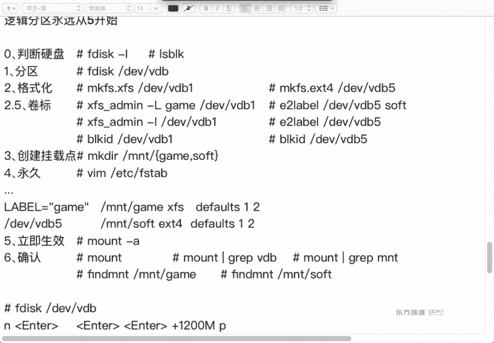

你们先去吃饭吧，我把文档传到百度盘，我再去吃饭。