# 红帽RHCE7培训课程：P10：4 - 配置网络连接用户与磁盘管理

## 概述
在本节课中，我们将学习两个核心主题：如何将Linux系统连接到网络用户目录服务（如LDAP）以实现集中式用户管理，以及如何进行磁盘分区、格式化和挂载操作。这些是系统管理员日常工作中的基础且重要的技能。

---

## 网络连接用户与身份验证

上一节我们介绍了文件访问控制列表（FACL）和SELinux的相关知识。本节中，我们来看看如何配置系统，使其能够使用网络上的集中用户目录进行身份验证。

### 集中式用户管理简介
在大型环境中，为每台机器单独管理用户账号效率低下。类似于微软Windows Server中的“活动目录”，Linux系统可以通过协议连接到中央用户数据库。最常用的协议是**LDAP**。

*   **LDAP**：轻量级目录访问协议。它是一个开放标准，用于访问和维护分布式目录信息服务。
*   **IPA**：红帽提供的身份、策略和审计管理套件，基于LDAP和Kerberos构建。
*   **Kerberos**：一种网络身份验证协议，通过使用“票据”来允许节点在非安全网络上安全地证明彼此身份。**与Kerberos相关的配置，时间同步至关重要**。

### 配置LDAP客户端
有三种主要方法可以将系统配置为LDAP客户端。

以下是配置步骤概览：

1.  **安装必要软件包**：首先需要安装配置工具及其依赖。
    ```bash
    yum install -y authconfig-gtk
    ```
    此命令会自动安装所有必需的关联包。

2.  **运行图形化配置工具**：使用`authconfig-gtk`命令启动配置界面。
    ```bash
    authconfig-gtk
    ```
    *   在 **User Information** 选项卡中，选择 **LDAP**。
    *   在 **Authentication** 选项卡中，选择 **LDAP Password** 和 **Kerberos Password**（根据考题要求选择）。
    *   根据考题提供的信息，填写LDAP服务器地址、基础DN、Kerberos域和服务器等信息。
    *   注意：配置Kerberos时，可能需要取消“使用DNS查找服务器”的复选框，才能手动输入服务器地址。

3.  **验证配置**：配置完成后，可以验证LDAP用户是否可用。
    ```bash
    # 查看LDAP服务器上的用户
    getent passwd
    # 切换到某个LDAP用户（例如ldapuser0）
    su - ldapuser0
    # 使用SSH尝试以LDAP用户登录
    ssh ldapuser0@localhost
    ```

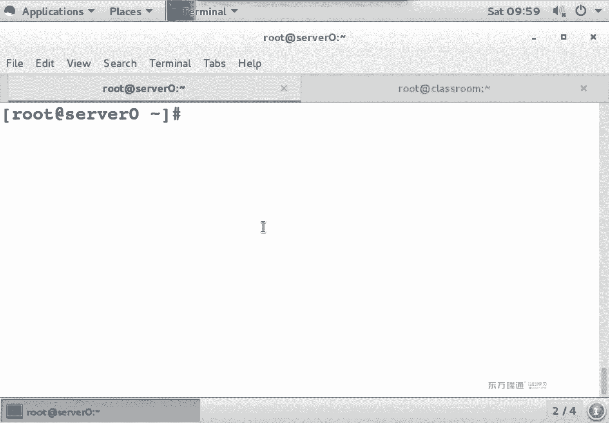

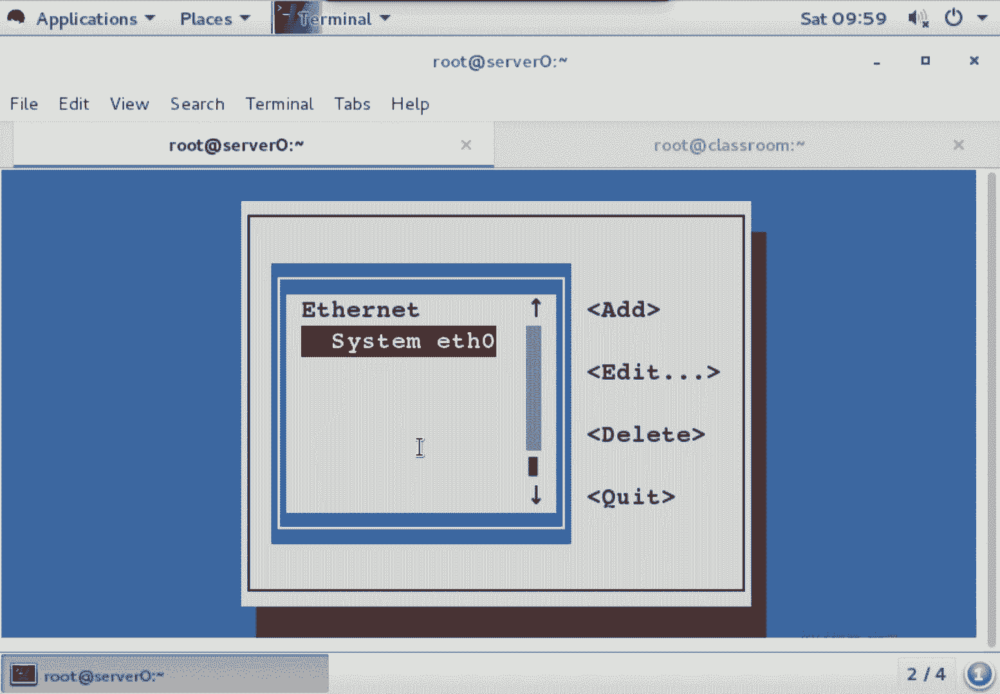

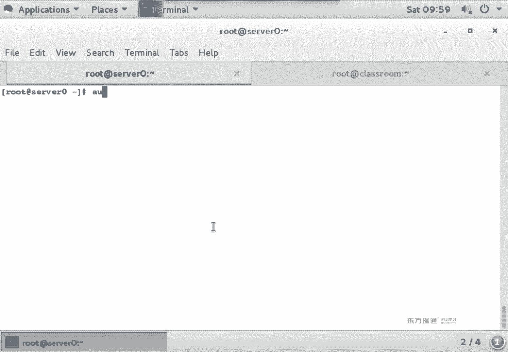

**关键点**：考试时，仔细阅读题目要求，准确填写服务器地址、域名等信息。使用图形化工具可以方便地复制粘贴，减少错误。

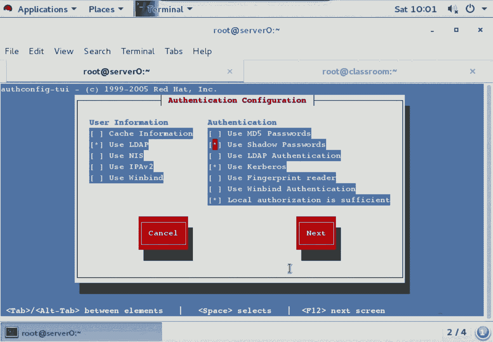

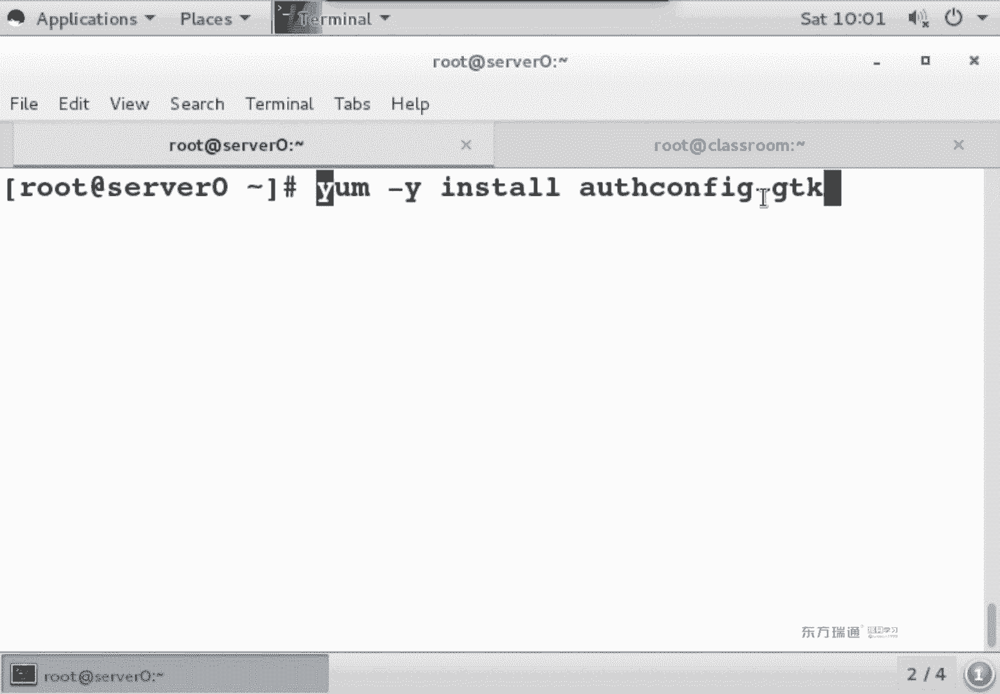

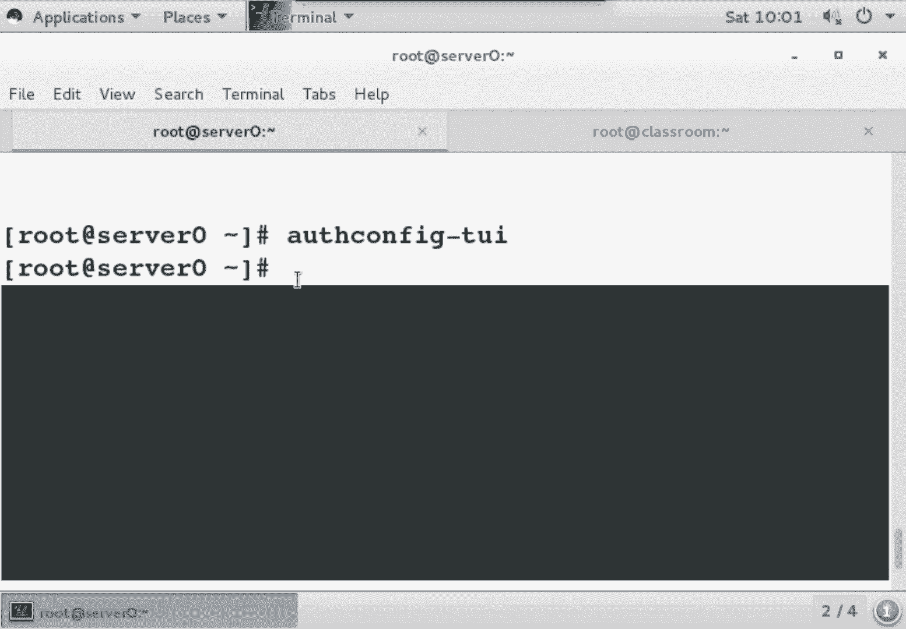

---

## 磁盘分区与管理

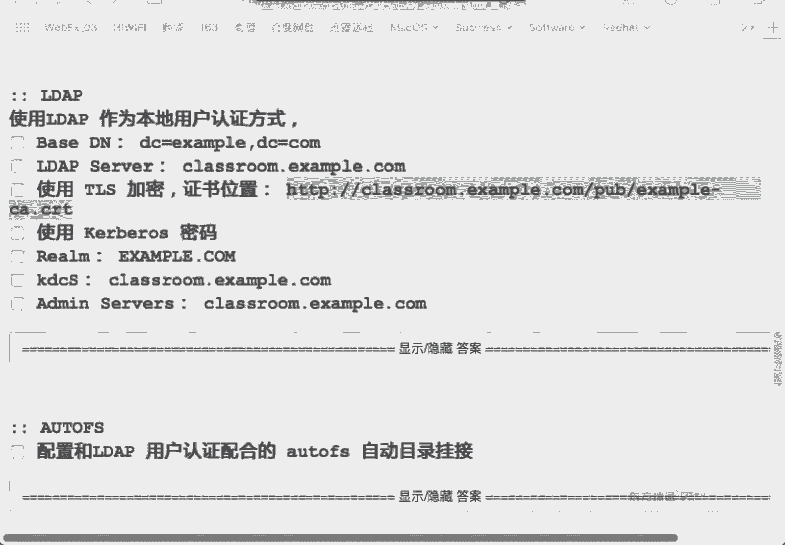

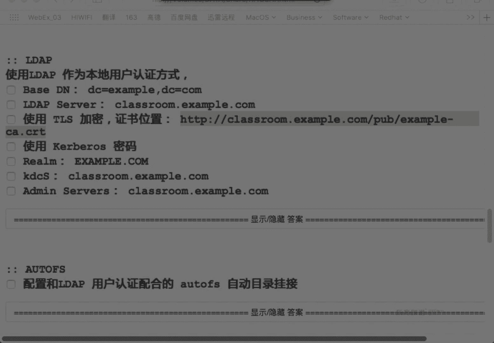


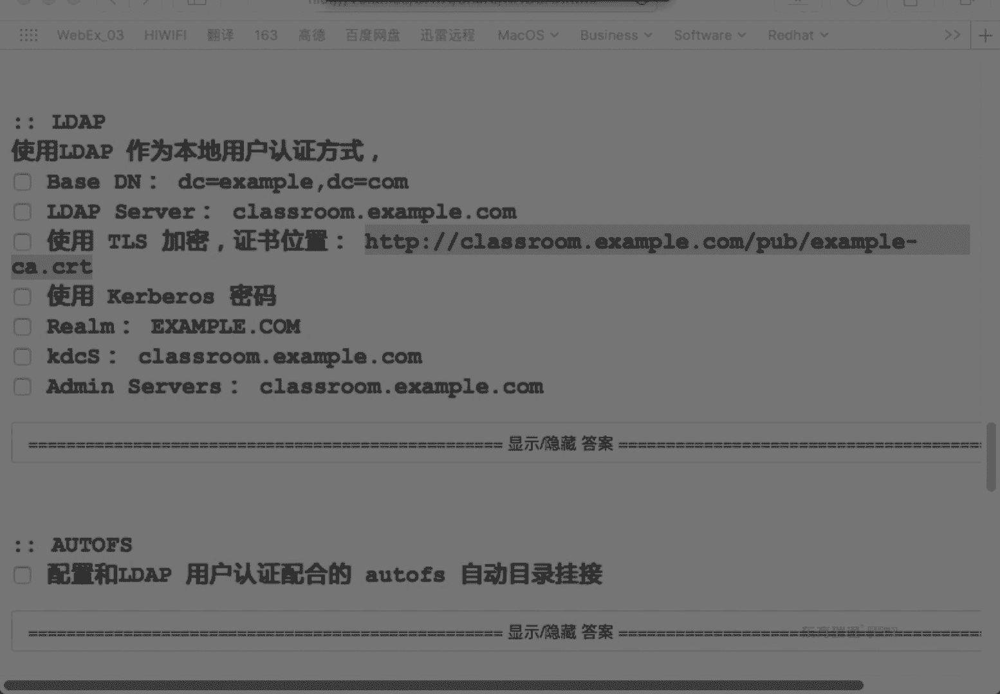

在配置好用户身份验证后，我们来看另一个基础而重要的主题：磁盘管理。在RHCE考试中，磁盘相关的题目通常涉及分区、文件系统创建和挂载。

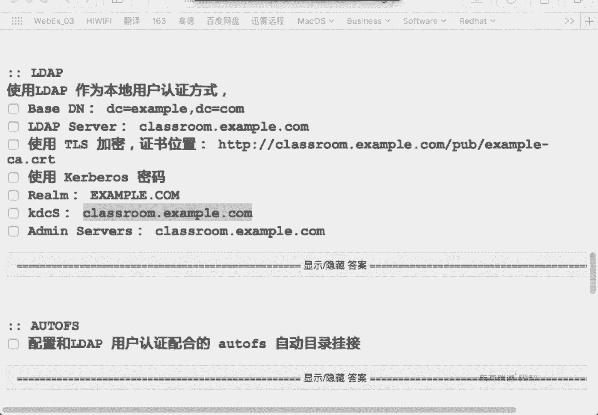

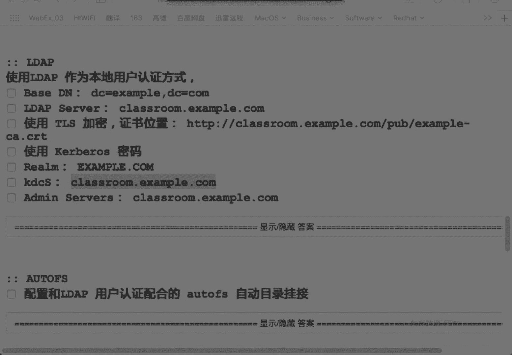

### 磁盘分区基础
硬盘分区主要有两种格式：**MBR** 和 **GPT**。

*   **MBR**：传统分区格式。
    *   最多支持 **4个主分区**。
    *   如需更多分区，需创建**1个扩展分区**，并在其中划分**逻辑分区**。
    *   单个分区最大支持 **2TB**。
    *   分区表存储在磁盘起始位置，无备份。
*   **GPT**：新一代分区格式。
    *   支持几乎无限数量的分区（实际受操作系统限制）。
    *   单个分区最大支持 **18EB**。
    *   分区表在磁盘首尾均有存储，更安全。
    *   通常与 **UEFI** 启动方式配合使用。

### 分区与管理操作流程
对一块新磁盘进行操作，通常遵循以下步骤：

1.  **识别磁盘**：首先确认要操作的磁盘设备。
    ```bash
    fdisk -l
    # 或
    lsblk
    ```

2.  **创建分区**：使用 `fdisk` 或 `gdisk` 命令。
    ```bash
    fdisk /dev/vdb
    ```
    在交互界面中，常用命令：
    *   `n`：新建分区。
    *   `p`：打印分区表。
    *   `t`：更改分区类型ID。
    *   `w`：保存并退出。
    *   `q`：不保存退出。

3.  **格式化分区**：为分区创建文件系统。
    ```bash
    # 创建XFS文件系统（RHEL7默认）
    mkfs.xfs /dev/vdb1
    # 创建ext4文件系统
    mkfs.ext4 /dev/vdb5
    ```

4.  **添加卷标（可选）**：为分区设置一个易读的标签。
    ```bash
    # 为XFS分区添加卷标
    xfs_admin -L game /dev/vdb1
    # 为ext4分区添加卷标
    e2label /dev/vdb5 soft
    ```

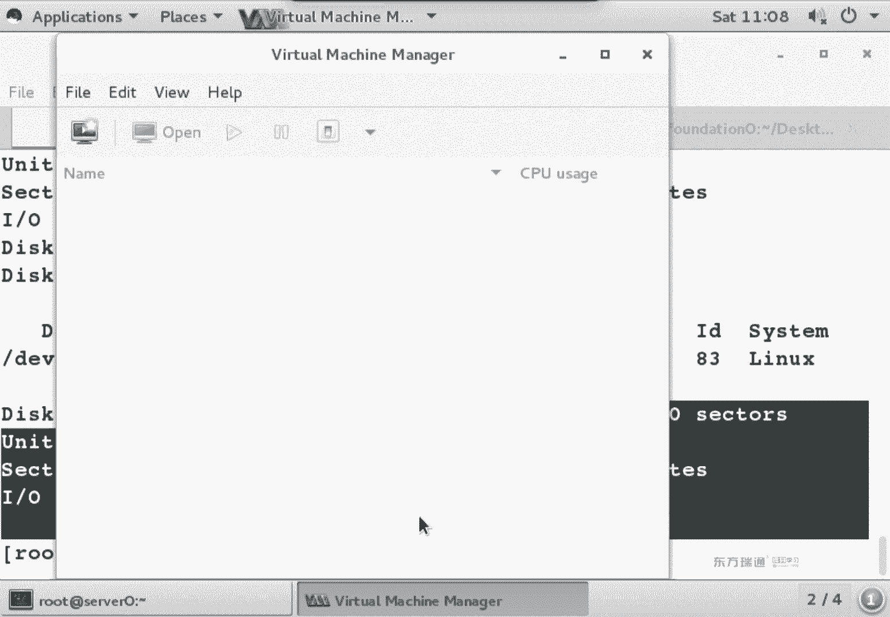

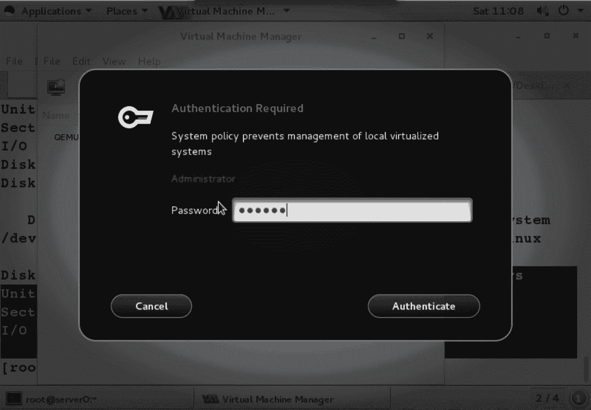

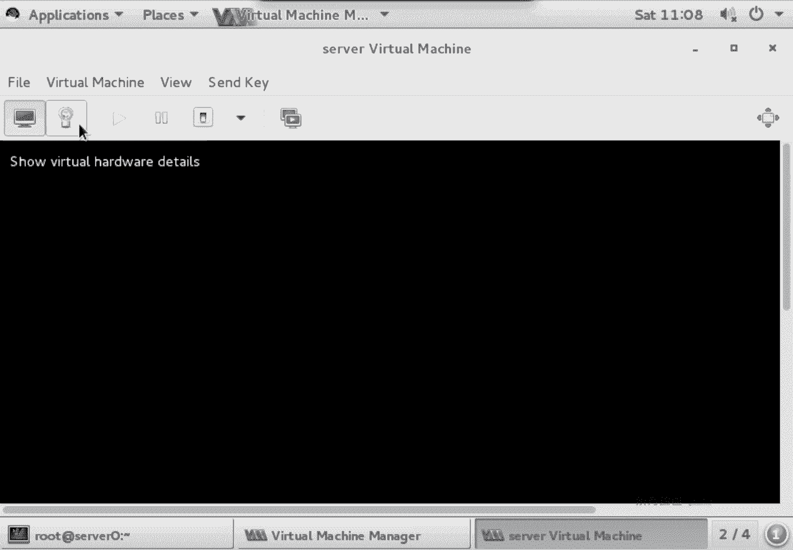

5.  **创建挂载点**：准备一个目录作为分区的访问入口。
    ```bash
    mkdir /mnt/{game,soft}
    ```

6.  **配置永久挂载**：编辑 `/etc/fstab` 文件，使分区在系统启动时自动挂载。
    ```
    # 使用设备名（不推荐，可能变化）
    /dev/vdb1 /mnt/game xfs defaults 0 0
    # 使用卷标（更稳定）
    LABEL=soft /mnt/soft ext4 defaults 0 0
    # 使用UUID（最稳定，推荐）
    UUID=xxxx-xxxx-xxxx /mnt/data xfs defaults 0 0
    ```
    可以使用 `blkid` 命令查看分区的UUID和卷标。

7.  **挂载分区**：应用配置。
    ```bash
    # 挂载/etc/fstab中所有未挂载的设备
    mount -a
    # 检查挂载结果
    mount | grep /mnt
    # 或
    df -hT
    ```

**关键点**：在考试中，务必注意题目对分区类型（主分区/逻辑分区）、文件系统类型（xfs/ext4）和挂载点的要求。修改 `/etc/fstab` 后，务必执行 `mount -a` 测试配置是否正确，避免系统无法启动。

---

## 总结
本节课我们一起学习了两个核心的系统管理技能。

首先，我们探讨了如何配置Linux系统作为LDAP客户端，连接到中央用户目录服务。这包括理解LDAP和Kerberos的基本概念，以及使用 `authconfig-gtk` 工具进行实际配置和验证。这实现了用户的集中管理和跨系统认证。

其次，我们深入学习了磁盘管理的完整流程：从识别磁盘、使用 `fdisk` 进行分区、使用 `mkfs` 格式化、可选地设置卷标，到最终通过编辑 `/etc/fstab` 文件实现分区的永久挂载。我们比较了MBR和GPT分区格式的区别，并强调了在配置中使用UUID是最佳实践。

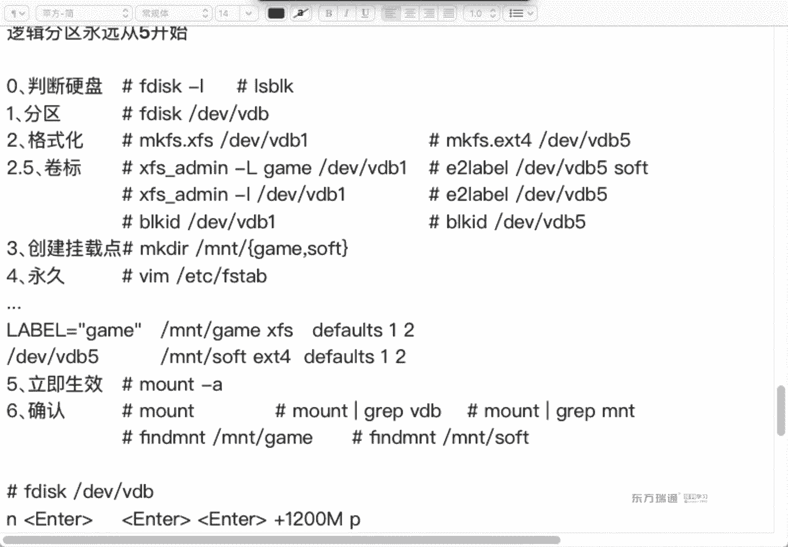

掌握这些内容，你已具备了管理多用户环境和系统存储的基础能力。在接下来的课程中，我们将基于这些知识，进行更复杂的实战练习。