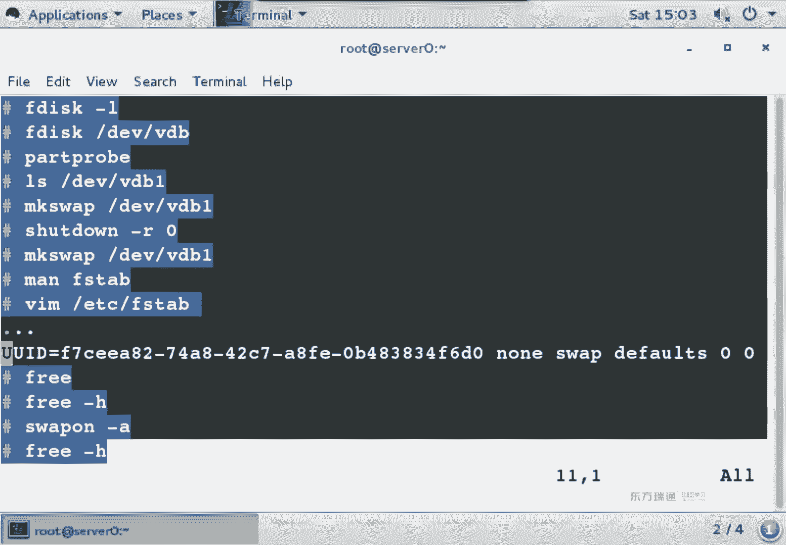
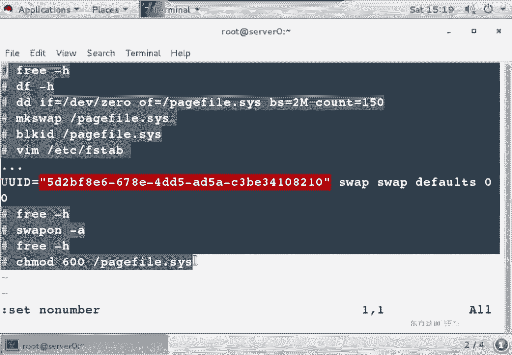
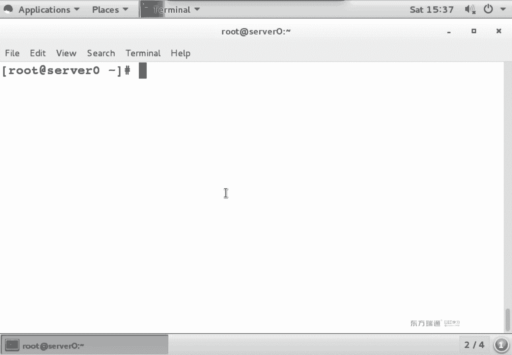
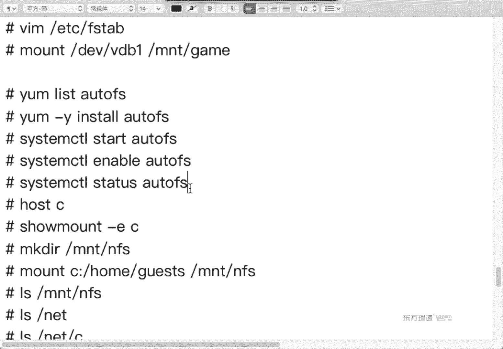

# 红帽Redhat RHCE7培训课程+RCHE7实战参考教程+红帽8.0教材电子版+模拟环境及辅导 - P11：5 - 16688888 - BV1zu41197p6

好，这段内容我们来写一下哈。😊，如果你用的是企业版7。写满期的话呢，我们有个命令叫做sscom。砍串儿。Site default。空格。marty。U了。开播店啊。开包间之后。

后面是不是要补贴一个叫他给他呀？他给他翻成中文叫什么？😡，目标啊目标。这个是开机默认器字符。那默认进字符之后。我是不是要看一下现象啊？杀到。高阿粮。系统重启之后，开机时默认进字符了。

金字符我在字符模式下怎么启动图形呢？我们是不是可以使startX？可以启动图形吧，让你敲账号名密码呗。他是直接用当前的身份来打开一个图形界面。相当于一个应用程序，能理解吧？然后呢，你们注销。

图形注销会注销吧。图像注销怎么注销？在菜单里面找到用户有没有log out。你注销了的话，图形就关了，能理解吧？你注销图形就关了。促销。注销。图形就没了。那么如果你想要打开图形程序的话。

那可以用inn5。它也会打开图形，但是因天5启动图形的时候，要求你输入账号名密码。这个叫运行级别的切换。st X只是打开一个图形的应用，图形桌面能理解吗？一个是用当年的身份打开一个图形桌面。

另外一个是运行级别做了一个切换。你这个级别切换了之后，你再注销是不是还是图形啊？能理解吧，你这个再促销还是突销。那如果你想改成啊默认就是图形的话怎么办？依然是这条命令。就把后面改成什么呀？

Graphical。Gical什么意思呀？图形吧。对，这个非非是怎么写来的？是Y还是挨？为什么我记不清楚了呢？😡，因为平时我们老公推不见。可以开啊，是爱是吧？不能没有爱呀嗯。Graical。看的那么怪。

し。哦，是这么写是吧，OK。那这条命令是说开机启动默认是不是进入图形啊？确认。たら？一看你是不是进图宵了。那这段当中我们学了几个命令。十大X。考试的时候，你那个serv和戴top开机默认是字符。

你是不是可以starX起图形啊？你这条命令要是不会的话。是不是也可以一定到无期徒刑啊？都行。😡，能理解吧？考试的时候默认确实是字符，那图形装没装啊。😡，装了啊装了。然后说哎，老师图形没有也没装怎么办？

😡，哎呀，我们再扩展一下。我们在之前的课程当中讲没讲过一个样么命令。讲了吧。y某g。这条命令的作用啊是来看软件组啊，软件组在这个组当中有没有一个。一个这个名都要组。叫啥名？你看。

Sve with GOI。serv例之外。什么概念？如果。你再用g list的时候，你发现这个包没装。那么你可以用亚母。Grope in star。装一下这个包。有没有徒刑了？是不记有徒刑了呀。

因为这个里面它包含好多的包啊，你要一个一个背的话，考试你也做不完，寄个包组。我们平时用office的话，是用的都office套装啊。没有人说我就装个word的吧，哎，你把word拷贝给我没有。😡。

offffice套装记住一个包住。这个包组装完了之后，是不是就有图形了？再举个例子，系统在安装的时候，你是不是可以选择最小化安装？这个安装有图形吗？😡，也没有啊，你把这条命令执行一遍。

你上面那条命令是不是都不用看，执行它就行了。然后star x in5是不是又图形了？嗯，O吧。呃，这个里面再顺道提嘴，如果是7之前的版本。我们在修改默认运行级别的时候。

修改的是geETClinate table文件。这个文件中有好不好？其中一个行叫ID冒号G。可能是三，可能是5。有这么一行。那如果改成三的话，系统一重启是默认进图形了呀？改成我。

赶上我系统说默认进出型了。那如果你可它改成三呢。哎。你要给他改成三呢。是我默认机字符啊，三代表是marus字符。五代表是braific图形。OK吧。考试的时候啊，你的虚拟机当中有图形啊。

只不过默认不是图形，你可以自己sstarX一下，因那5都可以啊，看你心情。一般我们去不去本地啊，哪一个时间必须配去本地呀？哪个时验单用户跳密码。那个时间必须去本地，剩下实间我们是不是一直在远程啊？

一直在远程。OK吧。呃，实际上你不去弄它也无所谓哈。我们在SSH啊图形界面重导过来之后，下一个ins到出不来的时候，你也可以把serv给重启一下，再重新SSH连，一般重导就能成功了。能理解吧？

就是就是必杀技呀，当你不知道怎么解决问题的时候，必杀技重启。😡，能理解吧？就这招啊，重启啊，重启就好用。只不过是我不想光给你们讲个重启，你们该觉得老师糊弄你了是吧？所以我跟你讲啊，有这么多种方法。

到底用哪种方法呢？你自己来选OK吧。😡，好，这段内容没问题的话，继续刚才的实验。拿了。O我们继续看分区。合头头来啊。😊，就是。孙区啊。那这戴斯个作用什么呀？这で是か。嗯。和F戴的用法基本完全一样。

基本上完全一样。也是分区。但是这这四个命令啊，他只能分GPT分区。F电四和是不是两个都能干？两个都能看他们区别。这个我们一会儿要做的实验。我们先来再做一个实验啊。八？我现在想再分一个逻辑分区。

这个实际上我不给你们写笔记啊，你自己看啊，你自己看。是不是再分一个区？新建。逻辑了。开始不管这个分区小分多大。家很好。嗯，那个300兆可以吧。我为什么都不分特别大呢？就第一个没办法给你们分那么大。

为什么呢？你每次分去之后，是不是都要可视化？能理解吧？自己的硬盘啊，尽可能啊少分一点。回车。发发了之后保存。大会发现我新分那个区之后，它的提示跟原来不太一样。

看到没？多了一片。重读分区表失败，错误。16设备网。

内核依然使用O table。旧的分区表，新的分区表什么时候会生效呢？😡，重启呀。或者你运行pa pro命令，或者tpart X。能看到吧？你有三种方式让新分区表生效。我新分区表叫应该叫做VDB几。

没有是吧。我们用个最简单的方式VDV6。有吗？没有没有分区表就没生效那怎么生效呢？三种方法重启浪费时间是吧？建议大家用后面两个命令。对于pa probe和Kpart X呢。

建议大家用pa probepa probe它是立即生效。KpartX也是利益生效，但是得等会儿。大家知道什么？等会儿吗？跟重启的感觉是一样，等半天它再生效。它也生效，但是不利益啊。

所以说建议大家用哪个命令啊。分区调试命力。分区调和美女。ok趴 probe回车。这条命令是说将系统中所有硬盘的分析表都生效。系统中所有硬盘的分区表都生效。如果你只是想让某一个分区表生效的话。

你可以直接写。相应的分区。第要求。🎼能看懂吧？两种方法，范围的区别范围区别。那么在做完了之后再撒来。这个分区有了吗？有了吧，分久了，我是不是又可以接这格丝化了？😊，嗯，这个我用另外一种方式啊。

你们想格式化成什么文件系统类型？要求。啊，那就XFS。6。哥成功了之后不加军标是不是也行？这回我再再来编辑。wifi table文件。UI我们建议大家用UUI地址。啊，建议大家用完地址。

呀UI地址刚刚没看着是吧？忘复制了啊，讲着讲着去忘复制了，那怎么办呢？我们是不是得冒号啊叹号啊？😊，读入读入一个命令执行的结果，block IDD database deviceice VDB解6。

是不是这个值读进来了？不要个内容是不是都干掉？UID注意必须顶头写，为什么？记得什么叫入乡随俗吗？因为原来UUID就顶头写是吧，跟他一样，你要敢加个空格的话，系统会认为UUID是第二列。能听懂吧？

你敢在它前面加个空格，系统会认为UID是第二列，意思就变了啊，顶号写示第一列。O。😊，第二列是什么呀？发他点吧，哎呀，我还没创建呢，一会儿创建行不行？😡，可以吧。呃，游戏也有了，软件也有了，这个叫啥呢？

啊，我 work呀。你们都是工作狂啊。😡，What。你看我写的跟工作都没有关系，我软件里面是游戏安装程序。Okay。呃，文件缺口类型，然后选项。12。okK吧，做完了之后呢。😊，M和杠A。哎，他说什么？

妈妈刚才是不会报错啊？我特意给你们看一下，报错了。实际上是下午有点困，忘了嗯。那我们看有提示是吧，一定会看提示啊。如果是选项错了，他会告诉你option。那么去看defo那个词是不是写错了。

如果他说pat有问题，不存在，是不没创建吗？如果他说UID的事儿，那么肯定UID写错了。能理解吧，就你写的这几列呀，哪儿写错了，它还会提示你。😡，O再次mount。没忘说了吧。确认。fin南T。OK吧。

这个时间跟之前时间什么区别？主要为了讲一条命令，怕pro吧。当这块硬盘已经有分区，我不管几个分区。已经有分居在使用，简单来说是不是挂载了。已经有分区挂载了。那么当你新分新分区的时候生效吗？

不生效是不是有三种方法呀？建议大家用哪种？part的 problem没part的pro立即生效好，那个分析文件存在了，是不是可以格式化，接着做操作了，实验完成。😊，O。😊，我把这个时间给大家整理一下啊。

说不给你们写笔记，也没法写了。因为我怕你们一会儿问我。😡，为什么我上课的时候老给大家写笔记呢？😡，笔记写的越细啊，你们的问题越少。😡，是不是？嗯。分区。啊，在这呢吧。哎。首先分区分区的时候我干了什么呢？

新建分区吧。因为之前的分区我们已经知道了，一个主，一个扩展。扩展里面呢分了个逻辑，然后呢，我们直接新建。逻辑逻辑的时候，他是不不问第几个呀？没有什么56789，然后起始范围。其实他也不管。

安特知道啥意思吧。回车哈回车的意思啊。😊，呃，结束的位置，我们收也300兆啊。为什么不做00兆的呢？因为全200兆的话，你可能迷糊分不出来谁是谁啊，分个300兆，300兆分完了之后干嘛？😊，呃。

你可以瞅一眼或者直接保存吧，就分区很熟的情况下，可以不去确认了。在学习的过程当中多确认啊。保存。发现分区不存在，那么你在保存的时候啊，系统是不是提示了有3条命令啊，我们。因为分区表没生效。你这个。

在VGP里面再上面一个。4。我们在做第三行W保存的时候，系统会提示你分期表没有生效，依然就说旧分区表吧。嗯，如果是旧分区表的话，那么VDB6就不存在。我怎么让这个VDVU存在呢？或者说让分析表生效呢？

😡，papro56这两行都行。😡，他们的区别是说将所有硬盘的分区表生效，或者是说将这块硬盘这个分区表生效。啊，区别。然后呢，你会发现哎。VDB6是不是有了呀，有了之后能不能格式化？😡，可以吧。

隔完了之后看UUI地址，然后编辑ifi table文件。在里面我们是不是原来的内种不变？然后呢。新塞了一行吧。在。新塞了一行，用你的UAID值。那因为你这个MNTwork也没有创建。

那你是不是得先创建完了再慢呢？杠A呀？就是说慢慢杠一之前的步骤啊，肯定是FI table改完了之后的步骤，对吧？你里面的内容必许存在。生下了之后呢，确认。我们在确认的时候。

我可不可以用BF再来确认一下嗯。第二步是看什么呢？看什么呢？DF看大小了吧。你说你分区分那个300兆，我怎么知道就是300兆呢？😡。

DF是来确认你分区实际上多大。

分区实际上多大？这个实间当中啊，关键就为了讲这一条。他 problem。当你的磁盘已经有分区。mount他了。😡，那么新分区怎么样生降呢？pa five吧。看好。能听懂吗？嗯。看下第6个VDB6。そ话。

おうま。提示错误呃，不就是说。其实我们要。啊，为什么提示我们要papro一下？因为这个硬盘已经有分区在用了。我们上午是不是分了两个区啊？两个区是不是都忘他挂载了？就这原因。因为这个硬盘已经有在用了。

你在弄的时候，那逼得啪的top一下，这个有点类似于什么呢？我们买了个100平的房子。但是装修钱不够啊，我是不是先装修两个房间呢？😡，可以吧？可以先装修了，房姐。😊，好，然后今年买彩票正好中了500万。

我是不是先把另外两个房间也装修一下啊？😊，你能直接装修吗？😡，不能吧，你是不是也通知一下啊啊，老人小孩撤退要装修了。😡，就这个概念让它生效一下。这是房坏。啊，或者是说你把刚刚两个分区啊。😡，先都幽梦。

然后再重新骂上刚A，重新都挂载一下。能理解吗？就不用啪了考我命令了。😡，你如果实在记不住papro的话，youmountVDB1VDB5。再骂他杠A也行。那你有啊。他相当是指定给他其他目标对。

这个谁一会儿你们在做的时候啊，你可以不按照我的思路做。你在这步之前呢？有吗？一般咱们先挂在店比较多是吧？Gme。你先把它俩卸载。他俩卸载的话呢。一会儿你就不会看到这条命令了。OK吧。

你们可以自己试一下一会儿啊。O。咱们继续。格式化命令。手动挂在。那我为什么不给大家用这种方法来挂载呢？为什么？做任何一件事情都是有原因的。不可能闲着没事儿。就去编辑ipad table帮他干阿姨。

为什么不用这个美令？曼达刚一它的优点是什么？他是不是会检查FI cable文件？它会以FI table文件为基础给你发载，就相当于你重启了，就相当于重启的时候加载FI table。

如果你是这么来挂载的话，假设你FIP我写错了，系统启动时候是不会报错啊？比如说挂载点不存在，系动启动时会不会报错，会吧？你会进入一个叫修复文件系统的模式。更严重的情况下，你还得去进单户模式。

最严重的是救援模式。はい。永久生效的话就是改FI配文件，确认文件系统的信息，block IDD啊，block ID。在分区实验当中，建议大家都用UUID值。之所以给大家讲三种方式。

卷标设备名UUID是说都可以。但是实际工作当中呢，建议大家都用UUID值，为什么呀？发。UUI地址是唯一的吧，唯一标识符啊唯一标识符。王回他。OK那我们看下面一个实验，GPT分区。

现在呢我想把我的硬盘分区啊变成GPT分区，看怎么做。Gで。哔哩哔。用F disk这条命令的时候，是不是也是分区啊？默认是dos分区或有MBR分区GPT呢Gdi默认是分GPT分区这车。

大家还出来这么一句话。哎。这个是软件版本号吧。呃，看到IBR没？好，行。呃，MBR only。发现了一个。GPT。MBR分区。系统去干了一个事儿，看 wordy这词啥意思？在微软的系统当中啊。

大家用没用过卡word命令。微软是fin32文件系统的时候，是不是可以用canward的命令，把fin32文件系统变成NTFS看word是什么意思呀？转换啊转换转换。OKIBR分之转换成了GPT格式。

他说。这个如果你不想用GPT分区的话，摁什么退出啊？按跳退出吧。那如果你就想用GPT分区的话，请继续操作。能理解吧。我现在就想要GPT。问号是干嘛的？😡，帮助。看一下里面内容哈，新建分区是什么？😊。

删除分区呢。保存呢。退出不保存。查看。哎，没啥变化是吧？说跟F是个基本上样。为什么说基本上呢？你看这个里面有什么倒s分区表吗？😡，原来在FD当中，O是倒数分区表。这个里面O是啥？😡，GPT审计表。

oppen newGBTop newGBT。就有些地方还是不太一样哈，所以一定要看帮助。一定要看帮。举个最简单的例子呀。我们去饭店吃饭的时候，为啥要看菜刀呢？大家吃没吃过？要。鱼香肉丝。吃了没？

同样一道菜哈。听实说香辣肉丝啊。可能没吃过是吧，香辣肉丝就香菜、辣椒和肉丝，叫香辣肉丝。同样一道菜在不同的地区，不同家饭馆炒的菜是不一样味儿。差的区别很大。所以说你去这一个环境的时候。

首先第一件事儿先看菜单。能理解吧？我们再用F disk这 disk时候也是一样的，先M先问号ok那么我们先P瞅一眼。现在几个分区啊？ま。款。你发没发现个问题，扩展分区没了。发现没？扩展它就是个范围。

块什没白了。然后呢，你会看到他这个范围的值。是不是全是主酸分区啊？没有那个范围。结后你在新建。看到128没？之前我们说了，那个什么十5啊，128说不用你背呀，你没事，你多用啊，你得老看就记住了。

我没有特意去背过啊，因为老讲课讲着讲着就记住了。每次一看128128128的数实不也挺好记啊。二的多少次黄啊？嗯，二的N次方。看你们还有点蒜。愿意几次方几次方呗，反正是128二的倍数吧。

说二的几次方原因呢，主要是告诉他压车二的倍数2倍倍数OK那现在如果再想新建的话，234一直到128，是不是全能用啊，你可以一直分区。你高兴分的话就自己分一个哈，我们也看看一个现象吧。

first不管last。😊，带看辣丝的山区。或者加上。这个是不是就两种写法啊？F电是三种吧。这次。不去。是不好意思啊。都是猪。它没有扩展的概念都是一个类型。发现没我们原来是有个2啊。😡，二是扩展吧。

没了。啊，没了。啊，400兆吧。加400兆。他是不是按你设代码823呢？他要83004位数。初日。FD色的时候，我们的代码是83嗯。两位，他的8300。1256，这个是不刚创建吗？哎，这是刚出面的吧。

看大小哈。出本要。156是之前有的20双床垫。ok保存的话呢。W。他说啊这个你如果要退出的话，怎么怎么样啊，你想继续吗？哎，回车的话，默认是什么？嗯，然后继续的话有Y。他说什么？嗯行。你的分区表啊。

重启之后生效。OF disk杠乐。现在有没？F days个能看到是吧？Nvis VDV2。有吗？生效没？已经生效了吧。如果你看到有这个文件的话，说明已经生效了。那下面有是要格式化呀？没开fi4。

能哥成功吗？他说什么？😡，我V地面这个分区多大？是。400兆是吧。它这个提示的原因呢是因为我分区大小的原因。他说在当年这个分区当中啊，节点是128。抗的是梁。对于当时那个孙秋来说呀，太大了。啊，说一堆。

让我们来指定哪个选项啊。嗯，杠I是不是可以指定它的大小啊啊。好吗？呃，我换一个文件系统格式。我们是不是还会1个XFS啊？可不可以啊？他要说什么？他说你这个分区啊，所以原来包含一个到次分区表。

你要用什么选项？杠F。各种提示是吧？这是成功了是没成功？成功没。没有没成功吧。他一直说一个零的概念，零是啥呀？是不是还是分具场没生效啊？虽然说设备文件存在了，对吧？O当他生效怎么办？😊，8大pro吧。

再给我再格式化。要成功了吗？等号是隔成功了哈，不成功的是长这样，看到没？😊，不成功，就什么斜杠行斜斜杠出一堆，告诉你怎么怎么回事。好，最后我们再来看一下EIT4。喝充功了吗？格成功了。

就是如果你发现格不成功，肯定是分区表没生效。能理解吧？如果你发现革没成功，肯定是分区管的成效。那飞机码没生效，那生效怎么办？就趴着pro吧。OK现在问题来了。😊，我们当前的申请表啊是变成了GPT。

我想把它变成IDR分区怎么办？用mountt命令，大家会发现原来的分区是不是依然挂着。换句话说，原来的数据没有变化，但是你要想把它转回到s分区表。他把原来的分区都删掉，都删掉的话，里面的数据是不是没了？

升级的话是不是不损坏数据？降级的话都存在风险。能理解吧？升级没事，你像微软fd升级到NTFS。在微软的系统当中，我们有个叫f2分区。它可以升级到NTFS。用的一个命令呢叫canward。升级。

升级的时候里面的数据不损坏。但是微软提供我们降级命令了吗？没有得通过第三方工具。第三方工具如果损害数据的话，人家也不管你，因为是免费的。为什么微软不提供啊？😡，因为有风险。知道什么概念吧？对于用户而言。

😡，计算机里面有硬件，有软件，有数据，哪个最重要？数据最重要，硬件坏了可以换，软件坏了可以重装。数据呢过去20年的数据咔服务器崩了，什么感觉？数据最重要是吧？也不是爽啊，这加班啊。😡，所以说对于升级啊。

数据不损坏的话，系统是不是给我们提供，他不怕这事儿，但是降级的话没有。同理，我们当前分区当中IBR分区。想升级到GPT分区的时候。是不直接Jdi就可以，直接升级了。那如果要降级呢？看一下酱级怎么做。

降级的话思路呢就是。删除分区，重新分区。就降级了啊，直接降不了啊，看怎么做啊。😊，那我是不是应该把原来挂载的分区先卸载啊？😡，不卸载的话，你想直接去删删不掉。又吗，我们之前挂了好几个是吧？呃。

最后一个叫工作狂是吧？游戏人生。转家。然后再上一步上一步是不是改SI table文件呢？那我现在是不是就删除FI table文件那几行就行了。那几行都挂在跟MNT上是吧？那我们可不可以这么写？查找MT。

干播。健康命令什么作用？删除这个文件当中包含MNT那三行。有MIT那三行，是不是就我们最后加的那三行嗯。😊，你报错了吧。虽然没报错，你也去瞅一眼。跳。看是不就剩最后一行了，UID跟分区吧。OK再往上。

再往上我们是不是就要去山分区了呀？杀分月怎么杀？你看现在是什么支持。如果你现在新建分区的时候。128看到没？128。行面。我是不是也可以接着分GPT分区啊？OK现在我要删除分区嘚。12356。

你要删谁的。得。的。和。所有分机是不是全傻了？现在我们要把这个分区表变成doss分区表，变成dos分区表是啥来的？哪个？哦啊哦。Create new empty do position哦。

现在又变成倒数分析表了，你P瞅一眼。看到这儿没？那现在你保存的话，它不会生效。现在保存它不会生效，他要求什么时候生效呢？你随便建个分区。双，我是不是随便建了个分区？W。啊。他要不要求你papro吧。😡。

没要求，因为整块硬盘呢所有分据没有没有分区在挂载是吧，都删没了。这会也大家进去瞅一眼新店。是不是到次分居表？就是你想从PPT返回到数分析表的话，你要删除所有分区，要删除所有分区。O。我。

把这个时间给大家整理一下。刚刚演示这一圈实验呢就计话。GPT转成IBR到次分区。要删除原来的分区。如果上面有做到数据的话，你是要备份的。这个实验当中还包含了一个小实验。恢复实验。

你会创建一个分区做了一堆事儿，是不是还会恢复啊？分区删完了之后，文件系统还有吗？没有分区删完了之后，卷标还有吗？没有。能理解吧？那我们在创建的时候，是不是还创建那个挂载点呢？你RM把那些文件夹删了啊。

按把那些文件删了就恢复了。No。嗯。我们把这样内容给大家整理一下啊，用这 disk革命令可不可以升级成GPD分区啊？可以吧？直接就变PPT分区了。那么我们在这个里面，你是不是可以问号看帮助啊？

那是不是依然心见？新建的时候。呃，他是不是依然会问咱们2345啊？会为咱们是什么主还扩展逻辑了吗？没有了吧，没有了，但是他会为咱们2345，是不是咱直接回车了？😊，开始的位置从来没改过。

除非硬盘有坏道结束的位置。但是我们这个分区的时候呢，跟FD有区别，它是又多了一个文件系统类型是啥呀？8300吧。多了个8300，默认不显示就8300。没问题了之后P瞅一眼，最后保存。是不是又分了个区？

又分了个区之后，FD杠L发现设备存在设备存在。但是你在格式化的时候能格式化成功吗？割刷不成功，为什么？😡，分区没有生效啊分区没有生效，怎么让它生效吧？这个是不是让分区生效，生效了之后。

你愿意格式化成什么文件系统，是不是随便，看你心情。开心眼。去睡觉了。的是。理解。あ。呃。它的pro命令针对是机器上所有的硬盘，分区表都生效。那如果是直接写VDB的话，是说这块硬盘的分期表生效。

那如果写VDB6VDB几的话，是说强调这个一定要让它生效，别的不管。😡，能理解区别吗？😡，我有10块硬盘，它的pro全生效吧。我有10块硬盘，它的prob VDB是不是就它生效得了。

这块硬盘是不是有好多分区啊？我又分了三个分区，我这想其中某个分区生效，它的 problem那一个分区。😡，是不是就范围的区别呀啊，我想吃一锅馒头，我想吃一屉包子，我想吃一个饺子。说的范围不一样。

大中小的区别OK。一当。啊，上午为什么不用pa probe呀？因为这个分区啊。我们上午的时候是不是直接新建了两个分区？然后呢，挂载了两个分区。你在两个分区新建的时候，有其他分区已经在挂载了吗？

有没有其他分区正在使用，没有吧。如果这块硬盘上有分区，别人再用了，那么你这个怎么办？啪的pro一下。啊。那大家说用F disk方便呢，还是用Jdi方便。F days，因为F days在退出的时候。

分据表不生效，它是不是提示你。😡，而这d他挺骗人的，什么叫骗人呢？😡，明明没生效，还给我非弄出了1个VDB几的文件。😡，能理解吧，结果死活也格式化不成功是吧？我都杠F force的也格式化不成功。

因为没生效。😡，Okay。啊，隔完了之后。哥完了之后，我们是不是也想挂仔呀？😊，啊，没想挂载呀，这是。搞完了之后，我们。想把这个GPD分区是不是变成MBR分区啊？首先你要确认。你聊来先去都挂在哪？

然后呢，是把它们都卸载，卸载了之后，FI table文件中是不是有三行也删了。你只要分区删了FI table文件中对应的行也删了哈。如果不删的话，有什么结果？不重启没事儿。不重启没事。

重启的话会进入一个叫修复文件系统模式啊。就ifi table文件呢很重要，重要什么程度啊？系统启动的时候，它会来检测这个文件。Yeah。然后我们再来分区，这回进来之后，我们干什么了呢？是不是的删除啊？

删除分区。得回车。不要回车。呃对对对。方便啊。四边是吧，四个分区。啊，都完事了之后，我们是不是O新建到s分区啊？如果你现在直接W保存的话，它不生效。一会儿你们可以试哈，那怎么办呢？再新建一个分区。😊。

新建的时候，他是问咱们主还扩展了。看你心情。直接回车是不是就。主了，因为在考试的时候啊，主要用扩展，这我就给你们写E了哈，扩展。😊，其始结束是不是所有空间都给扩展存取了？都改完了之后P成演。

正常情况下应该在创建逻辑了哈，我就不创建了。😊，好，出来之后。确认。你会发现里面会很明显的标识它是个dos分区啊，MBR分区。两完头。

这一组实验呢是说。MBR和GPT分区如何来做转换？

如何来做转换？第一条命令呢是升级到GPT下面删除了，然后再新建。这是转回到数分据表。到底是什么分居类型啊，他跟你操作系统无关。他跟你文件。他跟你机器上的硬盘有关。能理解吧？硬盘MBR也好，GPD也好。

它对应的是硬盘，跟系统无关啊，跟系统无关。不管你是学windows也好啊，还学unux，学的都是硬盘的知识。没有人说啊这个东西是只有linux这么来用啊，没有这样的概念。我们学的是操作系统。

OK下个休息10分钟。下面我们来看一下交换分区啊交换分区。交换分区跟我们之前讲的实验呢有什么不一样啊，有什么不一样。首先来回忆一下我们之前讲的内容。正常情况下，你在分一个区的时候要做几步。六步吧。

正常做6步OK那首先我们来看第一步分区。我们在之前有一步判断啊，要判断给谁分区。那当前的环境当中，我们肯定是给第二块硬行分区。再给第二硬盘分区的时候呢，分区的命令依然没有变啊依然没有变。

但是我们会用到一个类型啊一个类型。我们之前的实验中类型的ID是不是都83呢？不管是XFS也好，还是EIT4，都是83。在交换分区当中，它的类型是82啊，交换分区类型是82变了。83遍。然后格式化。

格式化的命令也变了。给人用的文件系统是m个FS点什么东西。那么交换分区叫maxwa。做交换啊做交换make make什么意思呀？做吧啊做什么。葛中化命令有区别。那对于交换分区而言，加卷标吗？

对于焦化喷区而言，加境标吗？你见过windows系统给虚拟内存加卷标的事儿吗？有没有没有，所以说交换分区没加过这标，而且我们学的家具没有命令啊，一个针对的是XFS一个针对的是EITR之后的文件系统。

发现了吧，交换也没有均标和概念。再然后。交换分区虚拟内存有挂载点吧。你windows里面有没有个盘符，给配置fi点s用的没有。盘符是给人用的。爬芙是给人用的，计算机自己用的时候不用到爬芙。换了边也没用。

永久生效FI table文件依然需要修改。对于FI table文件而言，一共123456，一共6列。那么第一列第一列是不是建议大家用UUID值啊？嗯第二列是不是挂载点？交换跟鱼有关的点吧。嗯。

你看想微软的系统虚内存有判松吗？没有大家在学习的时候啊，你不要想说我这边学的是linux，你想让着学你的你学的是什么呀？操作系统。😡，能理解吧？你多做对比来记忆啊，你会发现啊这课很容易学学过。

至少用过吧，用过windows啊，用过windows。文件系统类型选项啊。后面有相应的变化，相应的变化。骂他杠A是不是立即生效啊？😡，给人用的m卡杠内立即成效。交换分区呢叫做swa。奥是什么意思？😡。

开那有关呢。offs2杠As of杠A。然后最后确认。用m命令也好，还是finMAT命令也好，我们确认都是给人用的文件系统吧。那对于虚拟内存而言，如果你想确认的话，怎么确认呢？用的一个命令叫free。

FREE。福re瑞是什么意思啊？自由是吧啊，自由用了多少蓄内存，用了多少内存啊，要frreee你来确认。确认命令不太一样，思路呢依然是123456啊。

这个六步OK那下面我们来看一下虚拟内存这个实验上怎么来做。Yes。首先第一步FD4个杠L。看到我的硬盘空间。第一块硬盘空间已经用满了，之前已经讲过，我们不用看了，是不是只能对第2块硬盘做操作呀？

第2块硬盘2097。哎呀，我发现了个问题，我空间是不是都给这个分区了呀，那怎么办？我可不可以把分区给删了？可以吧。Okay。F disk。是VDB还是VDBE？

分区的时候记得啊是给硬盘分区目标明确哈啊目标明确。这是什么叫目标明确呢？嗯。有一天呢一不小心你结婚了。然后呢，新娘会问你这么一句话。你为什么要跟我结婚，你怎么回答？😡，你是喜欢他的优点吗？😡。

你还喜欢它的缺点吗？还是全部啊？😡，全部是不是虽然说不太想要缺点，但是没办法。儿子都有了是吧？这叫优点嗯，OK那么你在分区的时候也是一样的，目标明确，我们给硬盘分区。呃，要把原来分区都删掉the。好。

新建。我新建一个主的。for他不管。啊，这个我分个多大呢？200兆可以吧。P。我把字稍微弄小点啊，要不这个看有点乱，串行。大家可以看一下，默认我新建的分区文件系用类型是多少。83。

83代表的是XFSEIT234随便给人用的文件系统都属于83。我们这个里面呢有一个命令叫做t。特是什么作用？更ID啊跟ID你可以把它理解成switchSWTITCH啊switch切换。

还有一个叫做乐乐是什么意思呀？😡，列出已存在的分区类型，已知的分区类型。OK那么我们t转换。当天因为只有一个分区啊，默认是不是就一呀？如果你有多个分区的时候，他会问你转谁啊，如果有多个的时候。

他会给你转谁。好，这个代码你知道吗？如果实间很熟的话，你是不是知道8283呢？828381啊，我们常用的就是3个。那是按什么列出？大L小L都行。来那个斯是不是我严格区部大家写？

刚刚我们在上面这儿看的是不是小写？在这看说大写。这儿大小写都行。OK吧，这个。我敲的是乐，不是一哈。😊，OK来那个色默认支持多少种，我们先胸我类型啊。80多种。嗯，80钟左右是吧？

那么在这个里面我们找到我们熟悉的83。83是不是linux？我顺道去扫了一眼，8282什么系什么能件系统。交换稳件系统。O吧。82。回去了。他说改了类型，到死吧，P丑一眼。第二没。第一步。

你要做的分区类型要改变啊，分区类型要改变W干嘛的？保存。啊，他说什么？现在分析表没生效是吧，还忙，什么时候生效？三种方法建议大家拍 probe是吧？哎呀，又说啥？し。你得。在分区在VDB上。

一这个分区已经被righten了。但是呢那盒改过来了吗？还没有啊，结果呢你旧的分区啊依然在使用。如果你看到这样的情况，你就只能干嘛了？只能re护他了。能看到区别吧，在lininux当中。

你尤其要掌握一个概念，就是一定要看提示，别闭眼的瞧。我们在实验当中啊，经常会给大家写一些实间笔记是吧？但是每个人的环境是不是可能不一样？一定要看提示。有朋友说哎老师我不看提示，我就来看跟deVDB1。

有没有啊嗯有吧，然后是不是想着格式化？😡，能哥成功吗？搞不什么。当前这个情况你就只能干嘛了，重启。重启的命令到底用哪个随便啊，一般实际工作当中啊，建议大家用杀档命令。建议啥了。沙达命令啊。

它默认可以来设定时间，多长时间之后重启。默尔克说的时间，为什么呢？呃，如果服务器上没有人用的话，NW就不可以查看谁连接着服务器呢？如果服务器没有用的话，你随便充气，没人管。

但是当好多人用一个服务器的时候，你是不是要看一下谁在，然后通知一下人家。啊，我什么时候要定期维护啊，通知一下。用沙档可以来设定时间。如果设定的时间还有几分钟的话，想取消关机，我们是不是还可以杠C呀？

还可以反悔吧，我不关机了，cancel啊cancel。Okay。隔了2分钟，系统重启之后，你再次登录啊，再次登录登录之后，我们再格式画，是不是就能格式化成功了？依然是这条命令。回说。唱歌未？报错了吗？

报错和没报错的区别是什么？😡，你看这个提示当中啊有没有什么i呀，fieldel这样字样。那如果提示个no error啊，是报错还是没报错？我们明天呢要做一个实验。里面提示就是no rule。

所以说你别光挨我一紧张哈，前面咱弄这么弄。😊，O。他说这个设备呀。原来的时候是XFX，然后呢已经被我们格式化成了交换系统格式，版本是一它的UUI地址。看到没？既然有UID址。

我是不是可以直接写FI table里啊？ok。用春天刮在点吗？不用是吧。我们回过头来看一下Ffi table文件。在FI table文件中，第一列是设备。不管你是用卷标表示啊。

设备名还是用UI地址都可以。第二列是什么？第二列代表是挂载点。如果你是交换分区的话。挂在点我们写什么呀？😡，好。先干那写长了OK。编辑wifi table文件。第一列UID10吧。第二列。

帮助中是不是说显淡呢？如果你不写慢的话，也可以写swap。SWAP也行啊。第三列是什么？是我。文件系统类型。这色猎呢。选项。第五列是否启用日志文件系统？启用吗？不启用，为什么？

因为这个分区里啊是给谁用的呀，给系统用的吧。什么时候会用到虚拟内存？这是然后。内存太小的时候会用是吧？系统会把内存中的一些数据放到虚拟内存里做消换用。开机检测吗？检不检测？不检测。零是不检测。

根分区是一，除了根分区是一之外，其他分区是不是全是2啊？OK吧。这是标准的格式。有同学说老师我我不知道标准格式，通性是什么呢？通行是00。通性是00。零代表什么含义啊？不启用日志文件系统不检测是吧？啊。

能看懂吧？通信就不管是本地文件系统也好，还是网络文件系统，你可以都写列名。当然了，建议各位同学按照标准来走。可以啊。可以。只不过你把日志微系统功能给关了。😡，嗯。就像NTFF分区，我不用NTAFF分区。

我就用fe32行不行？可以吗？也行吧，我只有个地方能存数据就行了。但是我们会发现不同的文件系统当中啊，它们是不是有些区别呀？有些什么区别呢？举个例子。微软在早期的时候啊。😡。

他给我们弄了一个fa文件系统，我们管他叫f16是吧？后来呢微软是不是弄了一个F32啊？再后来呢，微软是不是一直NTFS？他们区别是什么？f16分区。这个分区最大2G。大家知道什么2G吗？😡，你上。

京东啊买了一块移动硬盘，500G。不大是吧。如果你要分范16分区的话，一个分区只能分两G。你能分250个分区吗？😡，能吗？不能到次分区最多15个是吧？GPT分区128个，150分不出来。

是不是还剩你一段空间，啥都没用啊，还分不了了啊，就是在那个年代，后来呢微软给我们弄了个fax2，这个文件系统最大多大呀？全民。32这个数是哪来呢？32G。这个分区最大分32G。但是他有个。问题什么呢？

单文件多大。单元件司机。啥意思？It's。这个问题问的好啊，但没念是啥意思？😡，单文件就一个文件。我们是不是有好多ISO文件？😡，20块钱干嘛的？😡，光盘镜像。现在好多光盘定向文件超过4个G了。

你copy copypy不过去。你这个分区fi32文件系统格式还剩20多个G，你拷贝一个5个G的文件，拷贝不过来。能听懂吧？单文件限制啊单文件限制。后来微软为什么一直NTF了呢？

这个是不是他俩的优点都屏蔽了？而且它多个什么功能啊？安全性吧。在f32文件系统中可以设安全吧。受不了啊受不了。那为什么在类那个词当中，我们现在用XFS呢？为啥？为什么用XFS？单分区域。支持500T。

知道什么叫单心区吗？我们分了好几个区是吧，一个分区最大500T。500T是个什么概念？你去买一块硬盘，2T，500T是250块啊，就这么个概念。我们会发现呢，现在的文件系统是不是支持的越来越大呀？

为什么？因为硬盘越来越便宜。能理解吧，要硬盘还是像以前呢1个32兆的U盘它，卖好几百的话。然后一个大硬盘卖好贵的话，这个。你就不会有新的文件系统就已经出来了，就还旧的还旧。ok。😊，回头再来。

FStable文件写完了之后，我们要做什么呢？是不是让它立即生效？曼达杠号A呢指的是给人用的文件系统，让它立即生效。那如果对于交换问区而言，我们用的是一个命令叫做sp啊。杠A。

我FI table当中是不是可以写多条区域内存呢？交换分区。你新增加的条目立即生效。我们在生效之前呢，先来看一个命令，叫free。所以翻译成中文呢叫自由的。有一首歌叫什么自由飞翔是吧？

那如果你直接看frreee的话，这些数值知道单位是多少吗？不容易看。那我们如果加个H humanreable，你当前的内存多大？两个G用了多大？还剩多大有多少共享，有多少缓存。那么你在下面呢。

你会发现是不是有叫swap。现在是几？凉如果一会儿生效了，这个数是不会变？能理解吧。Os on杠A。到错了没？没报错，我们再F一下。看到200兆了吧。嗯。那如果想关闭的话，应该是。哦。

1la off十 off。OK吧。就是lin好多的命令啊，是不是都有个通信啊？你敢on就能of，你敢set是不是就能get啊，有个反义词啊，有个反义词，相关联性的词语。这个谁看懂没？

其中有些位置稍微有点区别是吧？各我们之前讲吧，分区实验稍尾的区别OK。😊，我把这个实验稍微整理一下。Kll。

咱们交换分区啊有两个实验。一种呢是用分区。分区来实现。おし。实际工作当中，如果你的硬盘上啊还有空间空间的话，我们是不是可以做一个虚拟内存，提高机器的性能啊？提高记续性吧。

确认你的硬盘给硬盘分区分区的时候，我们有个很关键的一步，是不是体转换了？类型是什么？是不是看到有个叫82啊？就差这一步啊，别的跟之前的实验一样。分一个区转换类型82。如果你不勒查看的话。

直接记住82是不是也行啊，也可以。然后呢，让你们分区表生效。表生效。那分区表就提示你重启生效的话，是不是就重启呀？Okay。😊，那maxva这个命令什么作用？格式化格式化。格式画这个分区。

这条命令的作用啊是为了给大家讲解第二列写什么。第二列写什么？因为虚拟内存有挂载点吗。而我们第二列写挂来点是吧？那没有挂来点怎么办？没有挂来点，慢手册当中是不是说显慢写慢就可以。

用framere名来来确认。你当时的虚拟内存是零，然后呢用swap on杠A让SIT部文件当中所有的。江安分区立即生效。利生效了之后再来确认，发现有了吧。实验完成。那我们做一个对比机。在实际工作当中。

你可不可能说还有空闲的磁盘空间做虚拟内存呢？不太可能吧。买个公司服务器买回来之后，有多少块硬盘是不是就全用了啊？不会说还扣一块面放着。😡，这很少，就像好多公司花了几百万买个放火墙。

很少有时候买回来放机房里放那堆着吧，是不得用啊。但是这种情况确实有啊确实有公司花个几百万买个防火枪，往这一放。也不着火是吧嗯。公司立买的设备一定要用吧一定要用好多公司设备买回来不用，原因是什么呢？

没人会用。し。OK我们继续啊，那么用文件怎么来实现？在实际工作当中啊，遇到最常见的情况就是机器内存不够用了。机器上内存不够用了。内存不够用了，你是不是想弄个虚拟内存先对付用着呀，等内存买回来之后。

是不是再塞一张？临时先用一下啊，或者说一直用着也无所谓。它主要是看磁盘的IO啊，磁盘IO现在我们是不是有这个叫固态硬盘呢？固态它硬盘它的性能啊跟内存一样吗。读写的速度一样。还是内存快哈还是内存快。

当然了比原来什么机械硬盘的是不是快得多呀啊快得多哎。

看怎么实现。啊。首先第一步啊。

也不。我们之前提到了fr杠H，是不是可以看到你的虚拟内存呢？在实际工作当中，你首先要确认的memory。1。8G。Yeah。然后呢，使用的使用量如果接近了1。8G，是不说明内存长时间80%以上啊？

80%以上，这个肯定内存不够用，内存不够用怎么办？买内存。那你去请购的话，公司比较大是吧？各州领导一顿批，然后再一顿买。害了半天。那还没买回来怎么办？临时看一下硬盘哪有空间。增加一个虚拟内存就可以。

或者是说你的虚拟内存也用满了，我设定了200兆，然后呢，它已经用用了已经用完200兆了，已经用完200兆了。那我是不是还应该再增加虚拟内存呢？内存不够用，它也在增加，那怎么办？首先第一步确认完了之后呢。

用DF杠H。这个明天干嘛的？查看你磁盘分区使用情况吧。啊，下面有这么多分区，哪个是给人用的？被告方。是不是就他给人用的呀？然后呢，我们会发现在这个分区当中，总共的大小是10个G，已经用了多大。

3个G还剩多大？还剩7割剂，那么我再去做一个。300兆的文件。这个里面能不能放一下？可以放下吧，啊外able还有7割G呢，300兆肯定能放下。生上1个300兆的文件，有什么命令生成？B弟。😊，好。我。

这个名有起名叫配着饭。There areシ。微软的虚拟内存文件是不是这个文件默认存在哪？系统盘符跟目录是吧？啊，BS是2兆，如果我想做1个300兆的，应该看得几啊。2乘150得多少？300吧。

有同学说老师不对呀，你这明明315嘛。😡，啊，那15块是小费是吧嗯。我们在买硬盘的时候，你明明买的是两个T的硬盘，为什么买回来之后不到两个T？那些跑哪儿了？😡，那些空间跑哪儿去了，走道没了。一样啊。

算法不一样是吧？我们在买硬盘的时候，硬盘它的算法厂商的算法是千进制。计算机在读的时候是一拉死。能理解吧，也就硬盘越大差的容量是不是越多呀？另外一个银行牌分区数目是不是也有关系呀？你分区越多。

你可用空间实际上就越小。分区越多，合生空间越小，为什么呢？因为你分区越多，每个区是不是都有几点区啊，几点区它要占空间。而在磁盘当中啊，它显示的空间显示什么空间了？微软的系统它只显示block空间。

winow空间不显示。能听懂吧？在微软的系统当中，你只能看到blockin node看不到啊，in看不到。Okay。😊，下面我们要接着做了格式化。呃，叫啥来着？嗯。Makeake袜是吧？😡，哥式是谁？

文件在微软的系用当中，文件能格式化吗？能不能？那么。哼。没给我是吧？啊，我们隔成功了吗？哥成功了吧啊。在微软的系用当中啊，第三方的软件可以把文件格式化。第三方软件。

有一个叫做PGP的软件PGP它是个加密软件。加密解密了，利用证书加密解密，它可以专门格式画出一个指令大小的文件，然后呢把这个文件格式化成不同的文件这种类型。谁能访问这个文件中的内容呢？有相应权限。

或者说有证书的人啊，有证书人，有个叫PGP的软件。呃，大家可以记一下名，然后回去搜一搜。在一些这个外企当中啊，一般愿意用这个软件。还有什么样的特点呢？既然是用到了证书，证书有什么功能啊？加密是一个吧。

还有一个呢验证他通过签名来验证，用私钥来签名，然后公钥来做验证。O。😊，你文件格式化了之后，我们是不是依然要永久生效啊？编辑哪个门店？FS table吧。第二列。大家会发现呢。

我写捺和这个sp颜色一不一样。厉害换句话说，s袜p是不是也关键词儿？就是在以前呢历史版本当中。当你不知道这个位置到底写什么的时候，一般我们都写死了。那什么时候显淡呢？😡，呃，如果是按照帮助来说的话。

是不是应该写慢？帮助忠说写smar了吗？没说吧啊，没说。好，做完了之后，怎么让它立即生效？好好。首先我们依然是死力 free杠H200兆瓦。rap跑2杠A。他说什么？那账。没有。

他说这个5D2B这些人是谁不认识是吧，找不到。Block ID。Page file。配 the file点s。有啥区别？能看出区别吗？是不差个双引号啊？能看到吧。OK我再次复制。Yes。编辑。

粘贴在前面。啊。这粘的啥？这个。退出来哈。复制。control shift the C。编辑。啊。你也贴在前面，怎么看着这么怪？对スです。哦，controlV是吧，说的。That's。

首先呢是不是要先进入输入模式啊？在肯出谁的逼啊。能看到吧？啊，然后呢，后面原来的内容是不是得干掉啊？干掉。呃。ctrl加U是不是跳到下一个词儿啊？然后往前摔。ctrlW是干嘛的？先说词儿。

但这个里面肯tlW不好用。嗯。好，那我们在删词的时候，VIB去删词用什么？D啊DW和删钩词是吧？D几DW合适呢？1234567。7DW。对啊。差不够是吧。9DW。还不行。10DW。11DW。的11样。

11D为什么得11呢？它一个减号算一个单词。能理解吧？两个减号中间算一个单词，一个标点算一个单词，你数一下正11个。第一列第二列。吧。怎么带引号的呀，不lock IDD。本案该地显示的。

ok最后我们再次1万方刚。😊，哎，提示变了吧，还有什么？嗯。他说你这个文件的权限呢不太安全，我们乐乐去瞅了一眼。你的权限如果用数值来表示的话，是多少？す。644是吧。他建议我们用什么权限呢？你们这个。

600吗，今天有没有600权限？这条不改行不行？😡，我先瞅一眼。生效没生效了。好，如果你不改的话，权限。如果你不改系统，每次启动的时候，是不是要加载FI table，每次启动都说这句话。能听懂吧？

每次情都说这句话，是不是一直在提示啊，也在提示。所以说你们在做这个实验的时候呢，建议各位同学。改一下。签完地的时候。原本他的也有一。でまで。因为你这个是个文件，它不是设备。

大家想我们在之前呢挂光盘的时候，你是不是可以直接忘着一个光盘到一个目录下呀？但是如果你要挂光盘镜像的话，是不是要往着杠O路索。只不过是到企业版7的时候，刚刚录是不是可以省略？

那为什么挂后门镜像会加一个杠O loop呢？因为它不是设备，它是个文件。它不是个真实的设备，我们当前这个配置fi点s，它是一个分区文件吗？它只是一个普通文件吧。能理解吗？你不加引号，他找不着。

即使你是手写的，自己加引号，他也不认识，必须得复制粘贴。😡，能听懂不？一会儿你们在做实验的时候啊，这个实验室出问题最多的。都在哪儿呢？你不复制粘贴，你就会问我老师，你看我这个字母一个个都对过了。

就是不好用。差的原因就没有复你解体。富味津贴是一个好的习惯，减少出错的几率，提高输入的效率。提高书物的效率。这个时间看懂了吧。虚拟内存啊虚拟内存。まあね。今天还有一个知识点啊，还有一个知识点。

我先把这个时间给大家整理一下。这一会儿要做这一个实验。我们在上午的时候啊，是不是讲了一个Ld实验？Ld夫实验，我是不是说得和另外一个实验做配合呀？凹 to FS变成一个类似的漫游用户吧。

那我们Ld实验已经做成功了。如果我明天再去讲啊另外一个实验的话，Ld明天是不是再做一遍啊，所以说把那个明明应该是明天讲的实验吧，挪到今天来讲。OK咱们先把这个时间整理完。😊。

free杠H呢是来查看我当前。虚拟内存使用情况或内存使用情况。如果你的内存或虚拟内存。长时间80%。那这个时候你需要再增加一个内存。再增加个内存，但是内存没买过来怎么办？用虚拟内存来代替。

我当时的硬盘已经没有空间再来分区了，那我时候就用一个文件来实现了。windows当中虚拟内存是不是用文件来实现的？好，那我们看怎么做，你既然要文件来实现，弄个300兆的文件，是不是它都有地方放。

你到底放在C盘，C盘E盘放在哪个盘，我们是不是用DF杠H瞅一眼，哪有地方？哪儿能大于300兆啊，哪儿的空间大于300兆。我们发现根分区啊大于300兆，还有7个G呢啊还有7个G呢。那么我们生成一个文件。

上传个300兆的文件，然后呢说把这个文件格式化。割完了之后做什么？是不是要在这个文件当中去添一行啊？去K一行这个UUID哪来的呀？我默认格式化之后，它是不是也有个UUID值啊？

但是那个UI地址它带双引号吗？我刚刚是复制粘贴的，他说不认识找不到这个设备，那怎么办呢？😡，我是不是用block ID，我再去确认一下，能看到带双引号的UI地址了吧。把带双引号的值给它复制，粘贴进来。

明天进来之后呢。我们先用frreee杠H，原来是200兆吧。如果我fl on杠A生效了之后。我再来确认。是不变成500兆了？系统是不是要提示一个change mode600啊？改600权限。

这个权限不改行不行？😡，可以，没有什么影响。就是每次开机的时候啊，只要是一加载这个虚内存，它老提示600这个事儿。你要不嫌烦的话，或者说你根本从来不看开机步骤的话，这步你可以不累他啊，你可以不累他。

这是虚拟内存的第二个实验。

那么在考试的时候啊，虚拟内存这个是一个考点。到底考的是第一个实验还是第二实验呢？不一定。我们在上午的时候讲到了，说考试的时候呢。你已经有三个主参分区了，然后他又让你创建两个分区。😡。

然后你就闭着眼睛又创建了个主，即使还有空间，是不是创建不了分区了？😡，那这个时候还有虚拟内存，这个题怎么办？用文件的这种形式来做。能理解吧，看一下哪个硬盘上有空间BB生成个文件，这么做也可以。OK吧。

就是说考试的时候呢，同样一道题，好多种做法，到底用哪一种看你心情。或者说你能记住哪种。😡，能记住哪种用哪种啊能记住哪种哪种OK。今天最后一个知识点。今天再讲一个知识点就不讲了啊，然后剩下的时间做实验。

😊，那下一个知识点讲什么呢？我们回到我们的幻灯啊。😊，这是交换空间的内容啊。第九章讲完了。第十章明天讲啊LVM我们在之前提到了说linux文件系统属于重点，考试考四道题吧。82838ESRRC。

那刚刚我们是不是提到了8283了啊，81是明天的LVMS咖呢是第三门课讲完内容啊，第三门课。okK看自动挂板。自动化的。在看自动挂载之前呢，我们先来回忆一个内容。我们在之前的实验当中啊。

干了这么两个事儿。咱们是不是编辑过FStable文件？这个叫手动挂载。还是这个叫手动挂碗。哪个叫手么瓜仔？这两种都叫手动YY。他们V一的区别就是永久生效和立即生效的区别。能看懂吧？举个例子。

你们在公司里面是不是有好多文件服务器？你如果经常要去访问那台文件服务器的话。你每天来了之后，你是不是都要去杠杠访问一下那台机的IP或者主机名，每天都要干这个事儿吧，在运行里面杠杠他的IP或主机名。

那每天东西敲的时候，我们觉得有点麻烦。你会发现这个过程啊，是不是全手动啊，我可不可以把它映制成一个网络驱动器？网络驱动器，比如说把它应用成S盘Z盘挂在本地。每次我直接访问本地的S盘Z盘。

是不是就是那个共享啊嗯。能听懂吧？不管是哪种方式，都叫做手动wifi。自动刮载是什么概念吗？自动挂档的概念。跟他俩都没有关系了，自动挂了，他是个服务。Yes。自动挂载它是个服务。

叫凹凸 FS在整个IHCE的课程当中，客户端只接触两个服务。一个是。第二门课讲au凸 FS。另外一个呢是第三门课讲NFS呃，NFS叫做网络文件系统做共享这个实验。只有这两个实验中接触到了客户端的服务。

正常情况下，我们说服务服务他肯定是在服务器端是吧？那这个东西它在客户端啊，它在客户端。他是个服。那既然是个服务的话，你要找到他的包。Aice of five。あ。这个服装了吗？没有。没装装一下。啊，对。

ok装完了之后呢，我们来看一下。😊，他的状态。这个服务现在说不没启动？啊，没启动，如果要启动这个服务的话，怎么启动啊？star吧。解动。对于服二言，你敢死大，他就得害得干部什么。The enable。

OK最后我们再来看一下状态。Active running， enable。漏得。在整个ISCE这门课程当中啊，我们讲三门课。客户端只接触两个服务，剩下的服务全是服务器端。奥凸FS是其中一个。

客户端的服务，这个是上午的考试。考点啊上午考试考点凹 to FS那上来之后呢，你会发现默认没这个符是不是得装啊？这个报名好不好记？自动文件系统。我们是不是之前的时间一直FI table啊，文件系统表。

那全手动的oppo FS自动啊自动文件系统。我们看一下它自动到什么程度。举几个例子啊，帮大家理解。而3。し。class room上有没有NFS共享？卡拉斯入目它的别业名是不是叫C？用收帽的命令。

授叫显示，mount叫挂载，E叫做export导出，查看这台机器，C是主机名哈。查看C这台主机上有什么共享，看没看到一个home盖斯词共享。嗯。ho母盖是吃东西。那正常情况下，我要使用这个共享。

我要怎么做呀？我是不是要先创建个80点？然后说mon他。这台机器上的。ho母盖世吃。挂在。这个位置。这是正常你使用，你是不是要挂载一下才能用。你得忘它，你不忘它的话。

你是不是要去编辑ifi table文件，忘它杠A呀，不管你怎么莽它，反正你得忘它，就正常情况下。那自动挂载它有什么优点呢？LS跟n。大家看下面有什么东西。啥没有。我现在敲了个主机名，C回车。有东西吗？

Home。有东西吗？嗯。ああ。干时吃。知道什么叫自动刮载了吧。你只要访问跟奈子家那台主机名。😡，他就直接把那台主机下面的共享直接全挂过来了。你唯要做的操作就是访问一下。😡，LS。能理解吧？

LS它自动外载。往他瞅一眼。B。看到这行没？耗斯斯是什么意思？主机一堆主机，只要是那台机器上有NF共享，都能自动挂过来。要求你写的就是主机名。有的人说老师我不写主机名。我写。

刚刚我们写的示class写C是吧？写克拉room行不行？IP25。克拉松YP多少了？啊，24的24吗？啊，24的24024的人。0导4是反对选吧。看到没？什么叫自动挂载呀？你只要去访问你网络当中啊。

那些机器上都有NIS服务。你只要访问它的主地名，或IP地址，是不是自动就挂过来了自。😊，对，都在奈下。为什么都在奈得下呢？😡，我们再来看原因哈。😊，我们在之前的课程上讲没讲过RPM跟QCQV很fi的。

😊，讲话吧。查询配置文件。Upo F S。哪个是他的配置文件？这个像是吧，还不是。我们不改它的配置文件，这个服务比较特别，我们改的是它的地图文件。什么叫地图文件呢？大家用过百度地图吗？用过高德地图吗？

用过谷歌饿s吗？啊，可能没用过是吧，不个个是挺好玩的，是一个立体。一个地球你可以随便来转，跟地球仪似的。然后一双击呢能放大每一个国家啊，然后呢再放大可以看到。看到你们村你出生的地方。挺方便啊。

感兴趣的同学可以回去玩玩啊，叫谷歌地球啊，谷歌地球。那不管是地图也好还是谷歌地球也好，我们会发现它们的通信。什么途径啊？我们在看地图的时候，是不是先看大地图，然后再看小地图啊。😡，先分周五。

然后再分什么市。啊，不对，在中国的话应该要先分省是吧？省完了再市，然后再去这么来分。那对于凹凸 FS而言呢，它也是类似的概念。它有个叫主地图。Master。ma特翻现东文什么意？主地图。

那么他还有一个子地图。下面这一堆呢都叫紫地图。主地图和子地图的区别。OK那下面呢我们来看一下那个house是哪来的。看一下主地图文件。在跟ETC下有个叫outto点master文件。

大家看没看到第十三行。我妈刚刚访问的所有的主机名是不是都在跟代下？当年宝宝们变代了一下主地名的时候，系统会自动把那台机器NFS目录换过来。首先跟他在下面。第一个你要看的是主地名。

下面是不是看到它上面所有的共享目录啊？一这叫自动化的。网络自动范呗这个网络自动化呗啊，它针对的服务器端是NFS服务NFS服务。NF服务呢叫做网络文件系统，它是用那个是系统之间做共享这个服务。

那我们是不是还提到过一个叫散班服务啊？那个是微软的系统，windows和linux异购平台之间做共享的服务啊，这它们区别。那下面呢我们再来看一个实验。他们。呃，凹凸FS能理解了吧。

自动挂载okK知道什么要自动挂载了之后，我们来看一个实验。现在呢我给它塞一个光驱啊，C一个光驱。那为什要关机呢？为什么关机？因为在。VIRT manager当中啊。这个是个图形的程序是吧？

在VRT managerr这个程序当中，如果你要给虚拟机来修改硬件配置的话，只有开开机的时候它才生效。就不关机的话，它不生效，或者说不重启的话，它不生效，OK吧？关机之后我去干一个事儿。

我们在之前讲没讲过的说添个光驱，然后呢挂载光盘。讲过吧，找到你的硬件OK。我要塞一个光盘镜像，右键爱的helloware。然后。找到你的磁盘类型，光驱是这个吧。呃，光盘在哪？光盘在哪？可以啊。

这个下面还有个按钮点不着，我先把这个放在另外一个窗口点一下啊。这桌面分辨率太大也不好，够不着。浏览本地。OK我把浏览本地给点开了啊。😊，那么当。我们的硬盘在光盘镜像在哪呢？在硬盘。Computer。

Content。七呀好几个版本是吧？就随便找个SO手机行哈。😊，你们机器上应该是只有7。0了哈。好，塞这个光盘镜像，塞完光盘镜像之后，是不是应该确定啊？确定在下一屏看不着啊。

我左边的这个显示器啊分辨率比较高啊，我能看得着。我先点一下确定。fininish啊finish完成。Okay。完成了之后呢，我们会发现在当前的虚拟机里，我是不是多了一个光驱啊？然后呢，他塞了个光盘镜像。

启动的熏机。取拟机启动成功之后，我们再次来连接这台机器。那为什么每次启动虚拟机的时候，我都要等一会儿呢？你机器越快呀，等的时间越短啊，机器越快等的时间。那机器要是慢的话，就多等一会儿。

以前我们挂在光驱的时候是怎么挂的？光驱是跟在外说什么来着？有印象没？塞他接口只读设备第一个设备。叫SR0。S20代表是我们的光驱。嗯诶。怎么半天连不上呢？

半天连不上怎么办？去本地瞅一眼。

他咋的了？啊，还没启动完是吧？嘿。那。正在启动过什么事儿是吧？跟什么有关呢？跟设备磁盘有关。大家看到前面有三个红点了吧。点点点啊，正在启那个工作，哎，过去了是吧？刚刚在干嘛呢？新统在启动的时候啊。

是不是跟FS table有关？ifi table大家想我重启之前呢干了几个事儿，是不是加了个光驱？然后ifi table塞了几个虚拟内存呢。

Okay。最后我们再次来连接。带上了吧。以前我们在用光驱的时候是怎么用的？mount。首先来看两个文件。这两门件啥关系？就是快一件。嗯，快捷方式给在ice下面CDR是不是快捷方式？

默认在所有的lady系统当中都有CDR，我跟你讲。默认都有他。而他指向的是谁呀？😡，S20。但是有些机器呢可能CD账目没有了，没有了，你也别紧张，你去找S20能找着。那正个常我们要使用光驱的话。

是不是应该mount？800啊。这是不个光盘的内容，在正常情况下。ok。😊，现在问题来了。那我光滑能不能自动挂载？在Lux图形界面下，光盘就是自动关载了。

我现在是不是在房定这里？如果我现在直接去这个位置。呃，文件。这是北光区。我在这塞一个光盘镜像。大家看到没？光盘是不是自动挂上了？这个是图形界面下的功能。只有图形键面下的功能，图形键面下光盘自动挂载。

O。那我们现在要讲的这个凹凸 FS跟这还不太一样。我们现在是不是在serv0里啊？300里面我们登录图形了吗？没登录没登录。OK看两个位置啊，第一个位置。😊，依然是auto masterster。哦。

大家还有这么一行gem。跟ETC out to点m。然后我们再来看一行。こ当。凹 to点m。是。当我访问跟mask的时候，他是不是要用到这个文件？这能看到吧啊。这个文件的内容是说。

当你访问跟meCD的时候，竖着看哈，竖着看。当你访问跟meCD的时候，它会自动把你的工驱，这个是不是就那个S30啊？自动麦的光驱按照这个optionm选项挂载过来。现在我凹凸FS是不是已经启动了？

我LS真m。有东西吗？没有。我现在要访问CD购车。能看懂吗？默认跟妹子个下有内容吗？没有内容，当我访问CD的时候，这是有CD啊。这个CD是绝对路径，三对路径。あそ。他在谁下面？m的家跟m的家。

当你把它跟mCD的时候，系统会自动把。CDro那个设备按照这个选项换了过来。这个叫光盘的自动外带。光盘空过来。换句话说，有一个auto FS服务，我用不用去m它编辑FI table文件了。

我是不是直接就阿拉斯瞅一眼，直接挂下来了。直接用就可以了啊，直接用。把他的。自动挂载这个理解了吧。理解了，我们来看今天的实验，这两个不是考点啊。只是为了解释考点啊解释考点。

大家先来回忆一下我们上午讲的时间，Ld。L大部实当中。我们用L代回U德0登录了之后，你会发现一个问题，他的前脑核是不是很怪？前岛说很怪的原因是因为它的主目录没不存在。主目录不存在。那么当用户登录的时候。

是不是要自动去访问用户的主目录？如果访问用户的主目录，它自动去把class room上这个用户的主目录给挂过来，是不是要用到自动挂载啊？那这个时候你会发现实现了一个类似于漫游用户的概念。

用户在classroom上，他的主目录也在class room上。当你在这个Ld域当中任何一台机器登录。用这个S代或U端0登录的时候，会自动把服务器端那个目录换过来啊，实现一个漫游用户的功能。

这个是考点。那下面我们来看一下这个实验怎么做。在整个实验当中呢，你会发现。我们这个L大用户是有20个嗯。如果按照他这种写法呀。比如我上面写个跟ho，我下面是不是得写20行，一行对应的是一个用户，很麻烦。

我们在之前讲没讲过正则表达式，讲过吧，有通配符吧，那么我写通配符之后，你会发现哎，是不是写一行，因为这20个用户就用户名不一样吧，我只要写一行就可以。OK来看下怎么做。学习的过程啊最多的都是照猫画虎啊。

照猫画虎。你既然去光盘自动下载，用的是maskCD。那么我的用户。Get entry， pass word。L大夫就是这里啊。我用户访问的是不是都跟home盖斯思下面的这个东西啊？

是不是跟home下面的内容，那我就可以这么来写。首先依然要编辑凹 to点master文件。我在里面呢随便加一行跟home。Ld夫优特0的附主目录是不是在跟ho下？ok。然后呢，随便写一个文件。

文件名随便写的吧，这个文件现在还不存在，一会儿是不是得做一份啊，一会要做一份儿。呃，我们要编辑你的文件，你的文件刚刚是不是叫Ld点miss呀？叫什么名，写什么名，你都叫A点妹斯也行。😡。

尽量起个有意义的名字，因为我们这个实验室要配合那个Ld实验的。第一列。跟home下任意文件夹。星号代表任意呀。第二列是不是选项，你挂载过来是什么选项，看你心情，这个选项有好多种写法。还有好多人呀。

比如说你挂回来之后，是不是享有读写权限？它是不是一个网络链接软软设备啊啊软设备可不可以中断呢？Interrupt。可以打断。我讲课过程当中，你们是不是可以随便打断我呀？😡，是打断，不是打我哈。😊。

别紧张啊，上课你要随时打我，我也受不了，随时打断我。随时中断都可以啊，叫interrap。就说你在挂载的这过程当中啊，可以随时中断。然后呢，一般我们还建议加个什么呀？同步啊同步。好，这个后面写。

哪台机器上的什么共享？我们是不是有classroom吗？他的别名叫C，对吧？冒号。考试的时候呢，他给你的名是什么？写全了。考试的时候给的应该是这种啊，classroom点example点com。

做实验的时候，你可以光写个C就行，能解析就可以。这台机器呢什么共享呢？哎，叫啥了的？还有印象吗？这台机器啊什么共享？猛然间忘了嗯。那怎么办？再开个终端。So amount。杠一看一下。

class room有什么梦想？有木后母干什吃。好吧。号目该是。OK合作它来，那这个位主呢选什么呀？😊，At home嗯。呀，干是吃写不写？该是吃血不行？我们再来看一个位置啊。

get entry password。L大6到脸。好。用户的主目录。OK跟home盖吃。Ld user连。这个是一行哈，它自动错行了。😊，再词后面是用户名啊。OK回到第一个终端。😊。

这个位置我们写一个and的。按呢它代表什么含义呢？它代表是说。正常情况下，命令的结尾加个案的什么作用？放在后台运行是吧？那么在这个里面呢，按的它也代表是一个通配符。通配符什么叫通配符呢？

不同用户在登录的时候，它显示的。中路各不相同吧。当你访问跟home下。但是词L代夫特0是不是可以写成星？把谁给挂过来呢？把class room上的。跟home下的文件夹挂过来。

跟home下是有好多文件夹对应不同用户。因为我们当前环境中有几个用户。220个是吧，20个。你要不这么写的话，你写2十行。😡，好，配置件打完之后要干嘛？😡，重启服务。没报错是吧？没报错，要测试一下。

SSH。Ld user量8S0。Yes。密码什么？Caras。KR BR O。大家看到秦岛福了吧。那么这个实验完成之后啊，不管你用哪个用户来登录。有点酒。可压。这个用户名敲错了是吧？这个实验当中啊。

问题最多的就是密码为什么老不对？😡，就是L代货这几个字母敲反了。这个是问题最多的哈，你们做实验的时候一定要注意，如果你确认密码没敲错，还登录不上，那肯定用户名错了。用户登录的时候就用户名和密码。

不是密码错了，就是用户名错了。能看到吧？好，通配辅的作用。

那么这个实验呢？

这个实验。

在我们的文档上。L代夫下面这个实验。L大夫吧，下面紧挨着就哪个谁呀子凹凸FS紧挨着就它。首先第一步插包吧。密装，然后嘞。装包包装了之后，编辑这个文件。我们是不是新塞了一行啊？竖着看啊。

当访问各ho下任意文件夹的时候，要用到这个文件，这个文件默认不存在吧，你要弄一份出来。中间这个选项啊，你可以一个都不写。😡，能听懂吧。如果实在不知道写啥的话，你可以一个都不写。

你可以多写点啊你可以多写点，看心情。一般情况下，我们建议啊加上SYNC啊，加上SYNC加上RW啊加RW。后面呢是主机名，因为题中没有要求说哪台主机，对吧？嗯考试的时候题一中会明确的告诉你。拿台主机。

考试的时候会明确的写啊。然后呢，星和暗的都代表是通配符啊，通配符。做完了之后，主地图文件和子地图文件改完之后，必须要服务书启。为了让下回开机启动之后依然生效，是不是要inname啊？然后呢，确认。

怎么验证成功啊？前倒夫正确了就成功了。😡，我们在上午做实验的时候，是不是一个Ld，一个c呀？如果是账号名正确，就get安全也能看到，就是账号名没问题。如果kibos密码登不去。

就下面那kibo密码设错了，再改一下。如果账户面密码都正确的话，L带货记一屏是不是就OK了？有一个账号，有个密码吧。那千岛夫不对，就是au凸 FS的事儿。三个知识点啊三个知识点。这个知识点呢。

你就直接按这个做就可以啊，先按这个做。那关于Ld这个实验部分呢，我给大家整理一下啊，就是你需要还知道一些内容。前面这段内容啊是帮助大家来理解凹凸 FS的。Oh。啊。O咱们来看一下。

我把这个过程啊给大家捋一遍哈。😊，给大家的文档当中啊，没有说这个注释是吧？所以给大家说明的时候啊，你就认真听一下啊，认真听一下。一会儿在做实验的时候呢，哪步不理解，及时问啊，及时问。

第一步命令第一条插包吧。那刚刚给大家看另外一个文档，用RPM当Q可不可以啊？结果是相同的，用谁都行。插包装没装。肯定没装，考试的时候也是一样的，没装的话，要用就得安装。安装之后呢，我们是要启动服务。

然后把它设定开机自动启动啊，确认。用house C，你会发现C这台主机啊是不是class room？C是别名啊，C是DNS别名。

然后我们用sman杠ECsman杠一是查看classroom这台机器上有什么共享，意代表的是export。EXP瓦体导出有什么导出的共享？如果手动挂载的话呢，你是不是要创建到挂载点。

把服务器上的这个共享挂在本地啊，这个叫手动挂载。什么叫自动挂载呢？阿拉莱斯跟耐。跟那子下面有内容吗？没有内容al莱杠C有内容了吧，有homehome下有guess。OK又氓他命令，你可以来确认。

在梦的命令当中啊，是不是有个杠houses他？谁挂载的谁呀，有那么好横么一行啊。用帽子能看到。或者是说你直接用class room用IP地址是不是都可以看到共享？只要是网络中存在的NFS共享的主机。

有IP有IP有主机名就可以。这个是网络自动挂载啊，网络自动挂载。那么对于光驱自动刮载怎么来做呢？もな。哪个。这个这个是文件夹目录。目录。他的电。手鸡名。四下。主机名，这个主机下面有什么共享？现在是肯。

本地来卖的。有点类似于看网上邻居。你双击网上进居之后，是不是能看到那台主机呀？然后你双击那个主机之后，是不是能看它什么共享啊？共享下面是不是还有个游戏文件夹啊？😡，这么一个思路啊。

nice跟我们微软的产品看网上邻居一样，唯一的区别是什么呢？😡，网上邻居是不是把局网中所有能看到的这些全给你列出来了？有个扫描的过程吧，这个事儿你看谁，你写谁。😡，稍微有点区别吧。发的这个。

他只要是共享共享乐，你有权限才能看到。那他就。对，自动刮载这这块显示的关意。并不说不用常件。啊，耐是你小装了凹凸S这个包。我们在之前是不是讲过一个叫RPM当QF啊？你看奈他哪来的？哎呀。

他说不属于任何一担保。那就是装系统就有这个吧。这个包这个目录就是给。oppo F用的但默认情况有这文件夹吗？没有吧。一会儿你们做实验之前，你先看一下，默认没有。😡，呃，我们是不是学过一个叫阿RPM杠。

😊，QL。QL干什么的？Q瑞类色是吧，凹凸FS。哎呀，好多位。任意用户啊，au to FS服务启动了之后是任意用户，不是说只能ro它去看。啊，没有啊，这个包里没有。Student。

我们用st的身份呢去看n。空了是吧？麦 C。能看懂吧。原来s student他前老伏是不是正常的，为什么现在不正？😡，为什么？原因是什么？16号那个总目路在哪？そか。

sud那怎么是跟home student呀。但是现在跟home一下，你看一下有student了吗？说没有啊。没有他的主目录，为什么呢？😡，现在跟付文香是谁？然后。克拉斯room上的那个后。能理解吗？

现在是一个网盘的路径，不是本定路径。所以说这个提示这是正常的哈，这是正常的。为什么下午考试的时候呢？你两台机器都已经加入了I戴和域。😊，原因也在这儿，因为本地用户的主目录啊是不是会被覆盖掉啊，看不到了。

Okay。我们把这个实验整理完。我们做了一个操作，关机。关机。关机之后干了个什么事啊？关机之后，是不是回到房内线了？在防对里面敲一个命令，VRRT managerager。

是不是打开了一个虚拟机管理器啊？打开这个东西干嘛？添个光驱光盘。先到光驱光盘。简写了哈，因为这个实验之前讲过给你们简写了。😊，光驱光盘弄完了之后，是不是启动这个虚拟机啊？启动虚拟之后，又次回到了烧碗。

我们会发现CCDro和S20是不是一个东西，都是光驱都是光驱。你可以手动的把你的光盘光驱挂在一个目录下。这个叫手动挂载。改FI table一样，也是手动刮的。那你也可以直接去看一下master文件。

在这个master文件和msask文件是不是一个叫主地图文件，一个叫子地图文件呢？我们先看了一下mm下面有内容吗？😡，没有，然后你访问一下跟m个CD当你访问CD的时候，这是不是系统激活了呀？自动把。

那台机器上的共享是不是自动挂到CD上了？自动把你的光驱挂在了CD上相应的选项。あは。这个都做完了之后呢，下面就是什么实验？那个咱们笔记上了呃，那个HTML上的实验了吧啊，那个实验就不往这里写了。

Okay。今天就这些内容。今天考点讲了几个呢？L大夫。凹凸FS分区实验8283是不是都讲了呀？要分区时间算一个的话，就三个草点。L戴夫一个凹凸 FS1个。呃。再有句说呃L代奥凸FS在我分区。

分居实验是一系列操作是吧嗯。那分区实间又分成82和83啊，82和83到底是82还是83呢？两道题都考啊，两道题都考。考试的时候考不考设箭标啊？好不好？为什么叫可选项呢？😡，就是考试的时候你要做呀。

不扣分儿。😡，也不加分儿。能听懂啊。所以说对于可选项而言，在考试的过程当中能不做就不做。考试时间本来就短。如果你时间做的足够手的话，你会觉得考试时间很长。上午的考试一般是半个小时，一个小时就能做完。

下午的实验呢一般一个小时一个半小时能做完。如果很熟的话，如果时间不熟的话，你会发现题你都会做不完。那跟清区别吧。换句话说，咱们课上讲的任何一个实验，我只要提到考点了。你要多练练到什么程度呢？

这个时间拿出来之后，15分钟之内内能做完。然后你就可以去参加考试了。如果是满足不到这个要求的话，就别着急考试，回去慢慢练啊，回去慢慢练。OK吧。😊，那，今天呢就这些内容我就不往下讲了啊。

咱们先下课休息10分钟，休息完了之后呢，大家把这个这几个实验呢。😊，自己都做一下，OK吧。

