# 红帽RHCE7培训课程：P11：分区、交换空间与自动挂载实战教程

## 📚 课程概述
在本节课中，我们将深入学习Linux系统管理的三个核心主题：磁盘分区管理、交换空间（虚拟内存）的配置，以及使用`autofs`服务实现自动挂载。我们将通过一系列实验，掌握从基础分区到高级自动化管理的完整技能链，这些内容也是RHCE认证考试的重点。

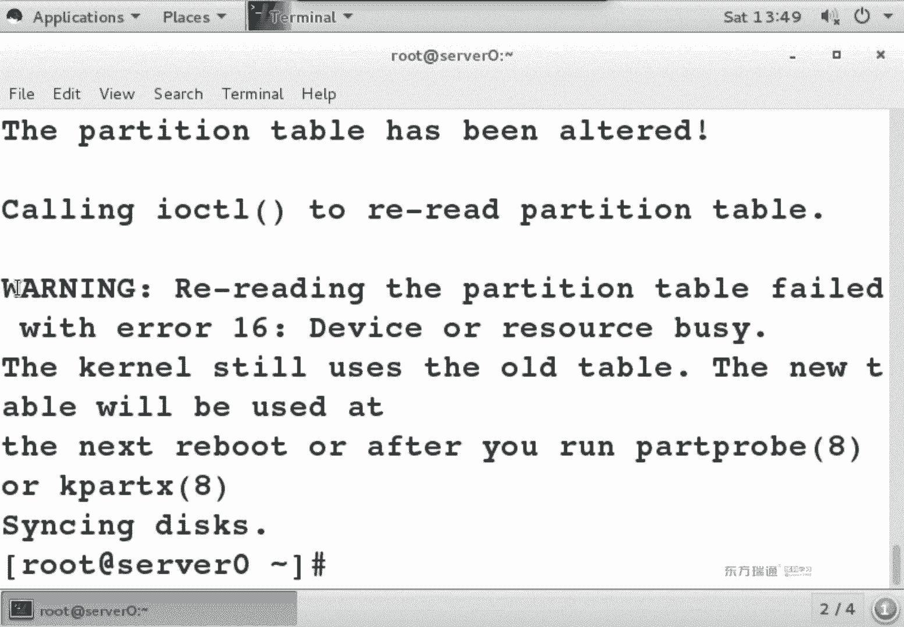

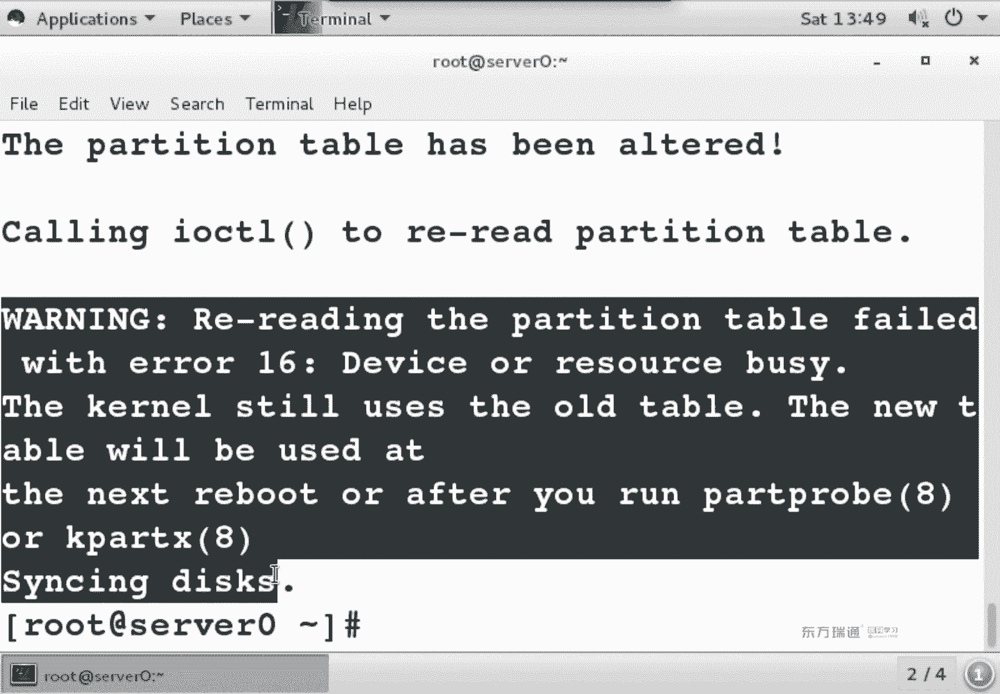

---

## 🗂️ 章节一：磁盘分区管理进阶

上一节我们介绍了基础的`fdisk`分区操作，本节中我们来看看更复杂的分区场景，特别是当磁盘已有分区在使用时，如何操作以及MBR与GPT分区格式的转换。

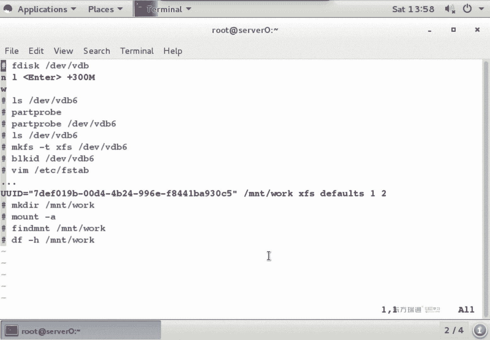

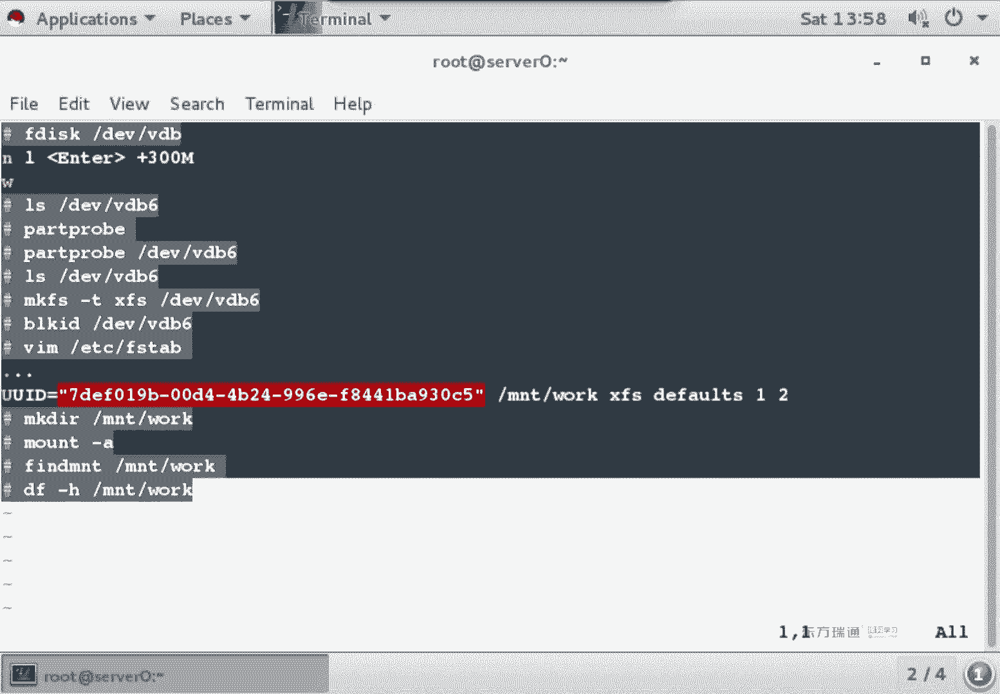

### 1.1 在已挂载磁盘上新增分区
当一块硬盘上已有分区被挂载使用时，新增分区后，新分区表不会立即生效。

**核心命令与步骤：**
1.  使用`fdisk /dev/vdb`对第二块硬盘进行分区。
2.  在已有分区（例如`/dev/vdb1`，`/dev/vdb5`）被挂载的情况下，新建一个逻辑分区（例如`/dev/vdb6`）。
3.  保存（`w`）分区表时，系统会提示“设备忙”，新分区表未生效。
4.  此时，查看`/dev/vdb6`不存在，无法格式化。

**让新分区表生效的方法：**
有以下三种方法，推荐使用`partprobe`。
*   **重启系统**：耗时较长。
*   **`partprobe`命令**：立即让系统中所有硬盘的新分区表生效。
    *   命令：`partprobe`
    *   若只想让特定硬盘生效：`partprobe /dev/vdb`
*   **`kpartx`命令**：也可生效，但非立即生效，需要等待。

分区表生效后，即可正常进行格式化、获取UUID、编辑`/etc/fstab`和挂载等后续操作。

**实验要点回顾：**
这个实验的关键在于理解`partprobe`命令的作用。当磁盘有分区正在被使用时，新增分区必须通过此命令（或重启）使内核识别新的分区表。

### 1.2 MBR与GPT分区格式转换
Linux支持传统的MBR（DOS）分区和现代的GPT分区。`fdisk`工具默认操作MBR分区，而`gdisk`（或`parted`）工具用于操作GPT分区。

**从MBR升级到GPT：**
使用`gdisk`命令可以无损地将MBR分区表转换为GPT分区表。
1.  命令：`gdisk /dev/vdb`
2.  进入交互界面后，程序会提示发现MBR分区表，并询问是否将其转换为GPT。输入`y`继续。
3.  转换后，原有分区信息会保留，数据不会丢失。之后即可按GPT规则进行新建、删除分区等操作。
4.  GPT分区没有“扩展/逻辑”分区的概念，所有分区都是“主分区”，最多可创建128个。

**从GPT降级回MBR：**
降级过程无法直接转换，需要**删除所有分区**，这会**导致数据丢失**。操作前务必备份。
1.  卸载所有相关分区：`umount /dev/vdb*`
2.  编辑`/etc/fstab`，删除与该硬盘相关的挂载项。
3.  使用`gdisk /dev/vdb`删除所有分区（`d`命令）。
4.  使用`o`命令创建新的空MBR分区表。
5.  使用`fdisk /dev/vdb`重新划分MBR分区。

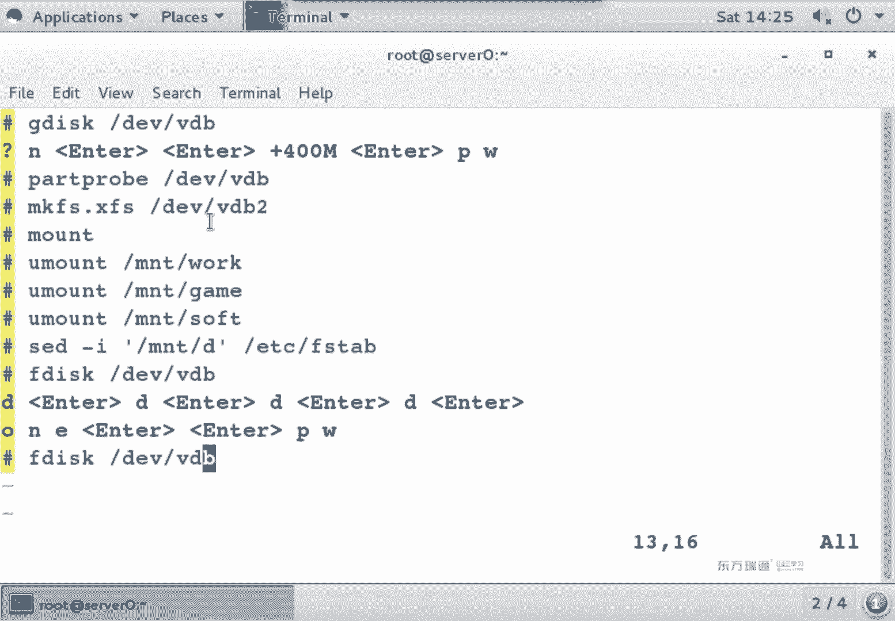

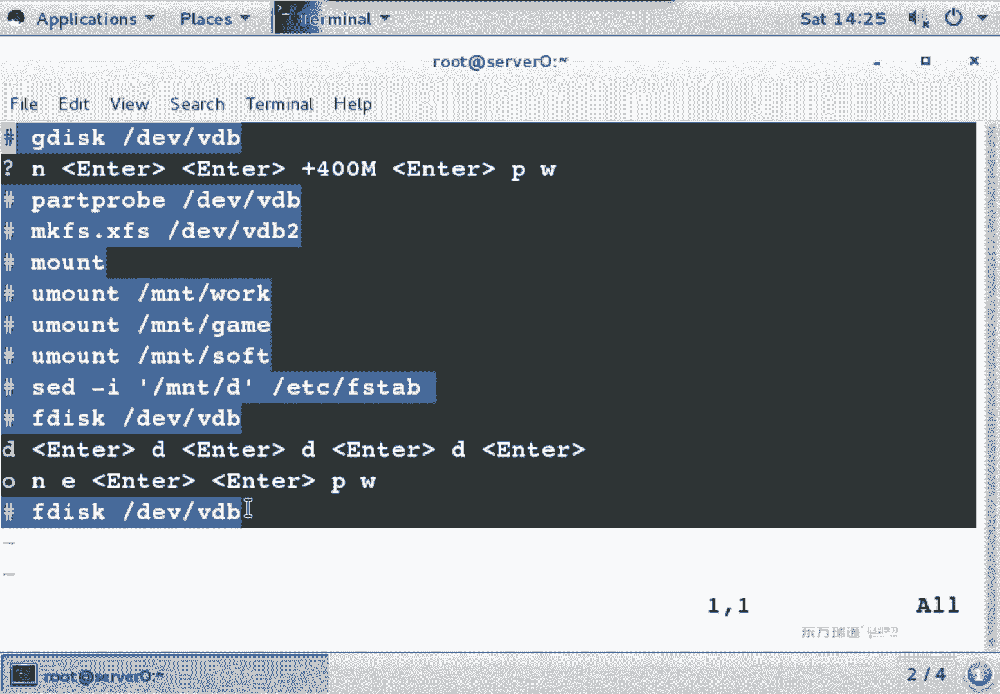

**核心概念对比：**
*   **`fdisk`**：主要用于MBR分区，类型ID为`83`(Linux)、`82`(Swap)、`8e`(LVM)等。
*   **`gdisk`**：主要用于GPT分区，类型ID为`8300`(Linux)、`8200`(Swap)、`8e00`(LVM)等。
*   **转换原则**：升级（MBR -> GPT）通常可无损进行；降级（GPT -> MBR）必须删除所有分区。

---

## 💾 章节二：配置交换空间（Swap）

交换空间相当于Windows系统的虚拟内存，当物理内存不足时，系统会将部分内存数据交换到磁盘空间，以提升系统处理能力。配置交换空间有两种方式：使用独立分区或使用文件。

### 2.1 使用分区创建Swap
步骤与普通分区类似，但有两个关键区别：**分区类型ID**和**格式化命令**。

**操作步骤：**
1.  **分区**：使用`fdisk /dev/vdb`创建新分区（如`/dev/vdb1`）。
2.  **修改分区类型**：在`fdisk`交互界面中使用`t`命令，将分区类型ID从默认的`83`(Linux)改为`82`(Linux swap)。
3.  **让分区表生效**：保存退出后，执行`partprobe`或重启。
4.  **格式化**：使用`mkswap`命令格式化分区为Swap格式。
    *   命令：`mkswap /dev/vdb1`
5.  **编辑`/etc/fstab`实现永久挂载**：
    *   使用`blkid`获取分区的UUID。
    *   在`/etc/fstab`中添加一行：
        ```bash
        UUID=xxxx-xxxx-xxxx  swap  swap  defaults  0 0
        ```
    *   **注意**：第二列挂载点写`swap`，第三列文件系统类型也写`swap`。
6.  **启用Swap**：执行`swapon -a`启用`/etc/fstab`中所有定义的Swap空间。
7.  **验证**：使用`free -h`命令查看，Swap空间大小应已增加。

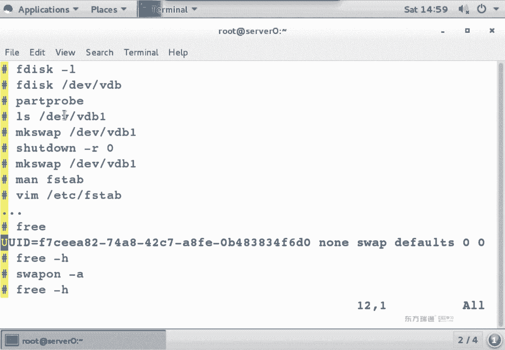

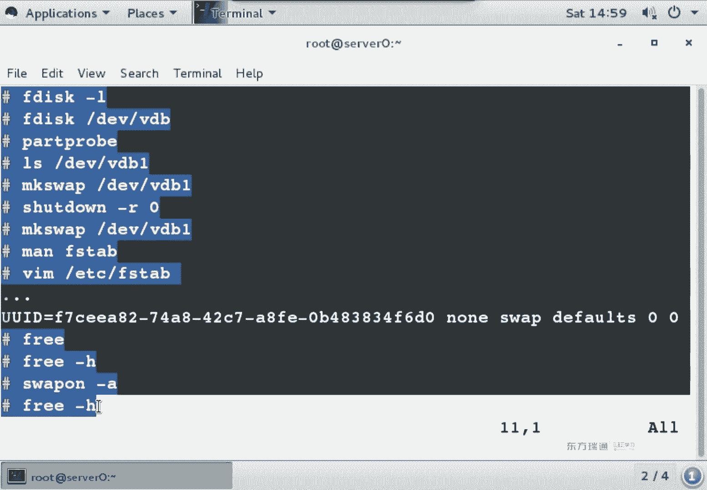

### 2.2 使用文件创建Swap
当磁盘没有剩余空间创建新分区时，可以创建一个特定大小的文件作为Swap空间。

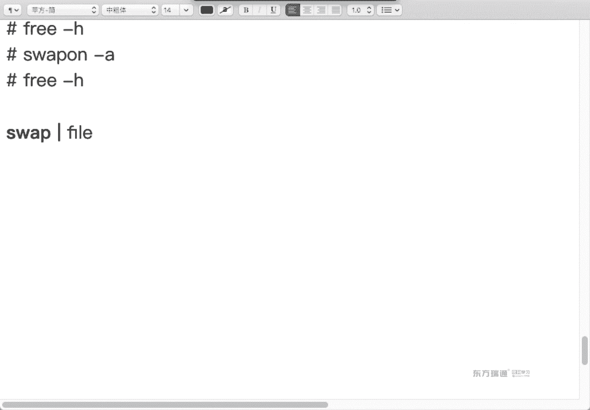

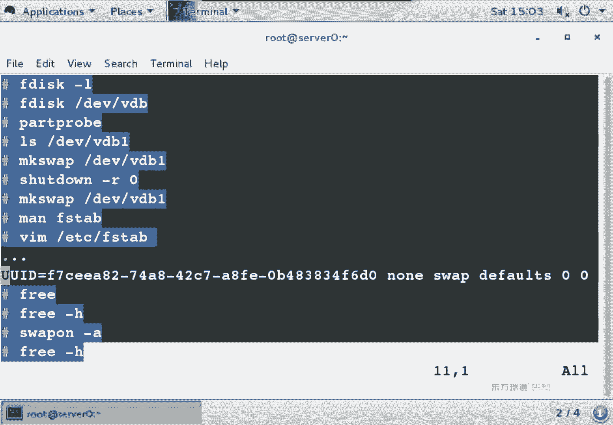

**操作步骤：**
1.  **确认磁盘空间**：使用`df -h`查看哪个分区有足够空间（例如根分区`/`）。
2.  **创建Swap文件**：使用`dd`命令在选定目录下创建指定大小的空文件。
    *   命令：`dd if=/dev/zero of=/swapfile bs=1M count=512`
    *   含义：从`/dev/zero`读取数据，输出到`/swapfile`文件，块大小为1MB，共512块，即创建512MB的Swap文件。
3.  **格式化文件**：`mkswap /swapfile`
4.  **编辑`/etc/fstab`**：
    *   此处不能使用UUID，需直接填写文件路径。
    *   添加一行：`/swapfile swap swap defaults 0 0`
5.  **启用并验证**：
    *   `swapon -a`
    *   `free -h`
6.  **（可选）修改文件权限**：系统可能建议将Swap文件权限设置为`600`，以增强安全性。
    *   命令：`chmod 600 /swapfile`

**应用场景选择：**
*   **考试/生产环境**：若有空闲磁盘空间，优先使用**分区方式**。
*   **临时扩容或磁盘无空间**：使用**文件方式**。

---

## 🔄 章节三：使用Autofs实现自动挂载

`autofs`服务提供了一种按需挂载的机制。与手动编辑`/etc/fstab`或执行`mount`命令不同，`autofs`会在用户访问指定目录时自动挂载远程共享或本地设备，在闲置一段时间后自动卸载，非常灵活。

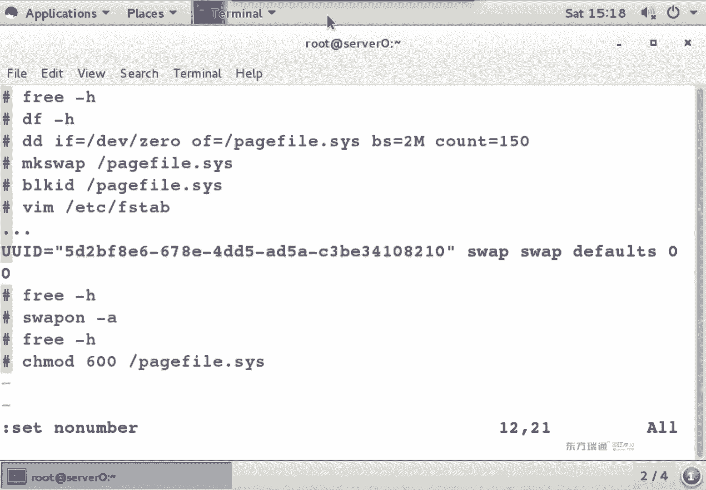

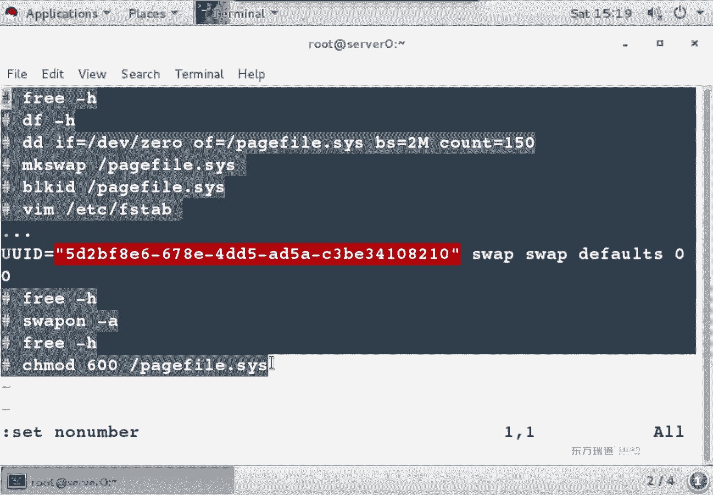

### 3.1 Autofs服务原理与配置
`autofs`服务通过“主映射文件”和“子映射文件”来定义挂载规则。

*   **主映射文件**：`/etc/auto.master`
    *   定义挂载点目录和对应的子映射文件。
*   **子映射文件**：通常位于`/etc/auto.[子映射名]`
    *   定义具体的挂载源、选项等。

**服务管理命令：**
```bash
systemctl start autofs      # 启动服务
systemctl enable autofs     # 设置开机自启
systemctl status autofs     # 查看状态
```

### 3.2 实验一：自动挂载NFS共享（用户主目录漫游）
此实验常与LDAP用户认证结合，实现用户在任何客户端登录时，都能自动挂载服务器上的个人主目录。

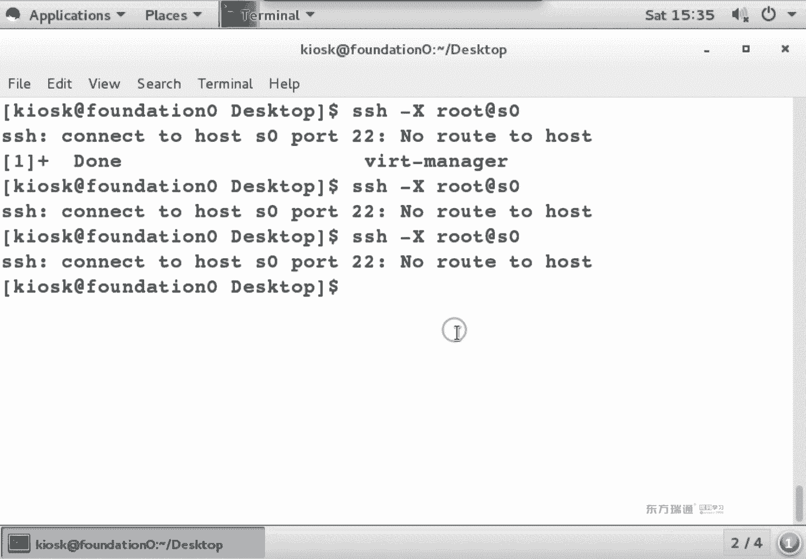

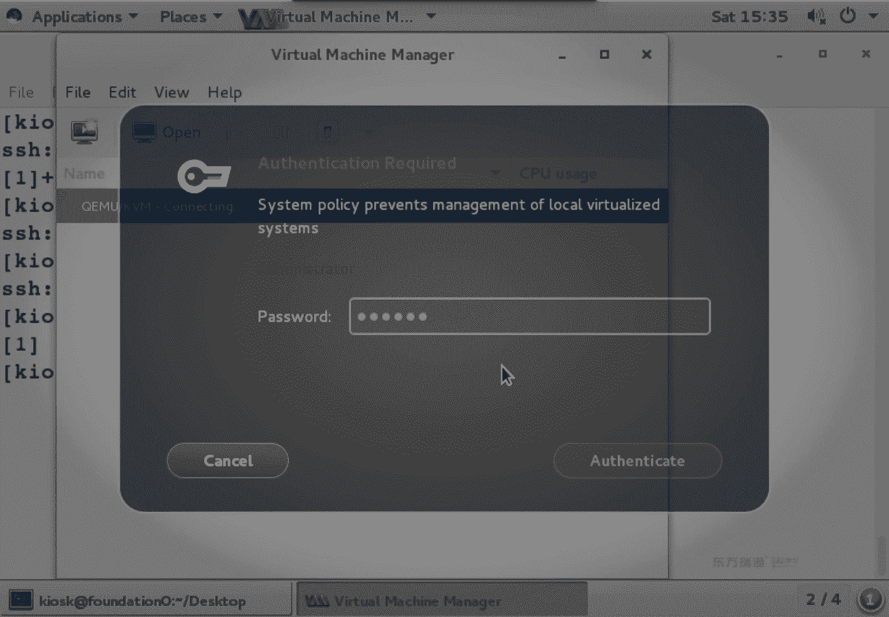

**实验目标**：实现访问`/home/guests/ldapuser0`时，自动挂载NFS服务器`classroom.example.com`上的`/home/guests/ldapuser0`目录。

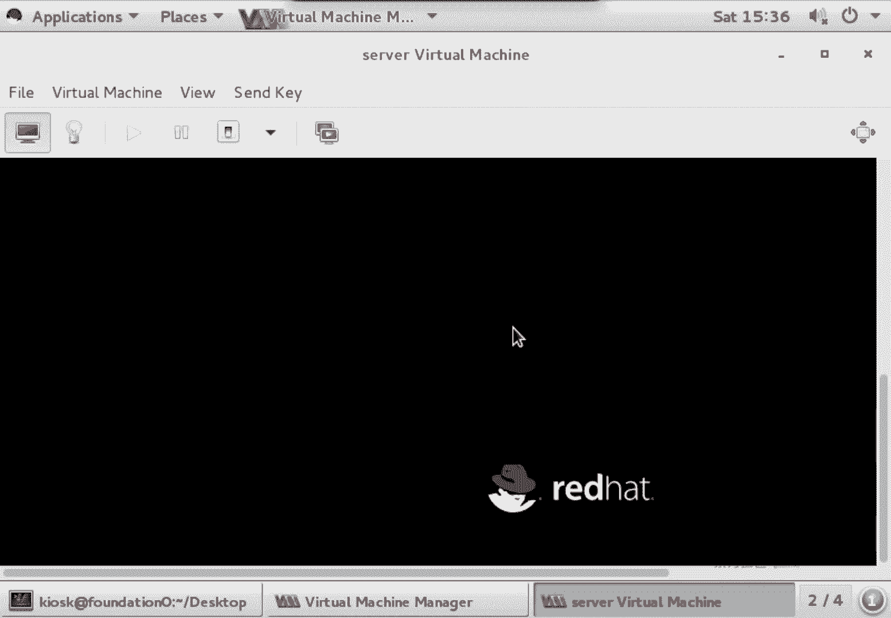

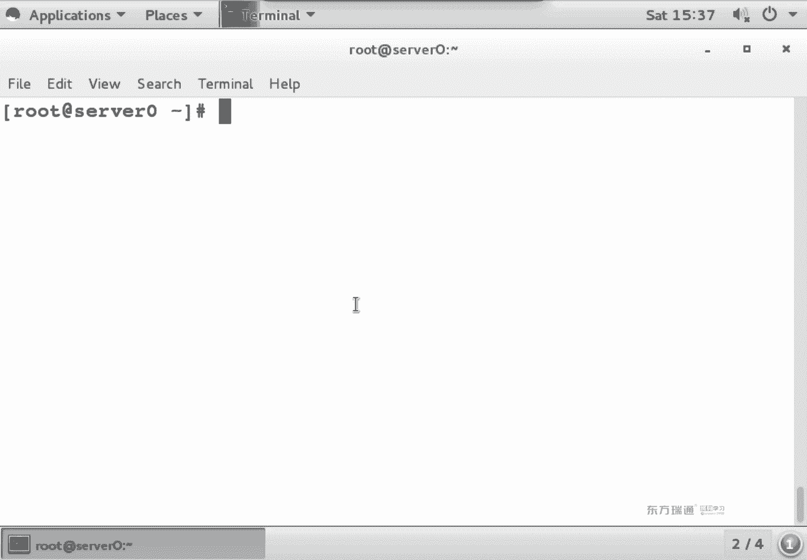

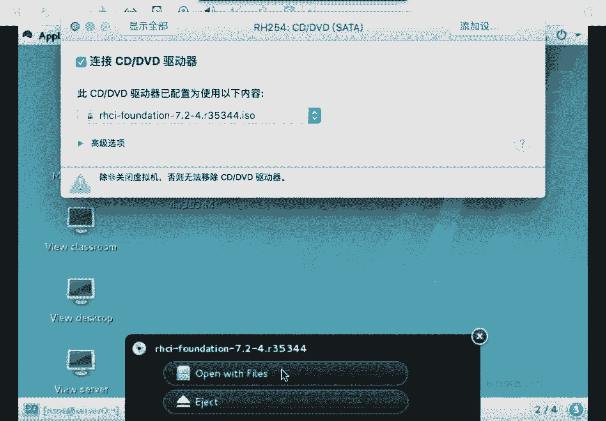

**配置步骤：**
1.  **安装并启动服务**：`yum install -y autofs && systemctl enable --now autofs`
2.  **编辑主映射文件** (`/etc/auto.master`)：
    ```bash
    /home/guests /etc/auto.ldap
    ```
    表示`/home/guests`目录下的自动挂载由`/etc/auto.ldap`文件定义。
3.  **创建并编辑子映射文件** (`/etc/auto.ldap`)：
    ```bash
    * -rw,sync classroom.example.com:/home/guests/&
    ```
    *   `*`：通配符，匹配`/home/guests`下的任何目录名。
    *   `-rw,sync`：挂载选项，以读写模式挂载，同步写入。
    *   `classroom.example.com:/home/guests/&`：挂载源。`&`是另一个通配符，代表前面`*`匹配到的目录名。
4.  **重启服务**：`systemctl restart autofs`
5.  **测试**：使用LDAP用户（如`ldapuser0`）登录，其主目录应被自动挂载，命令提示符显示正常。

### 3.3 实验二：自动挂载光盘
系统已为光盘预留了自动挂载配置。

**配置查看：**
*   主映射文件中有默认行：`/misc /etc/auto.misc`
*   子映射文件`/etc/auto.misc`中已定义：`cd -fstype=iso9660,ro,nosuid,nodev :/dev/cdrom`

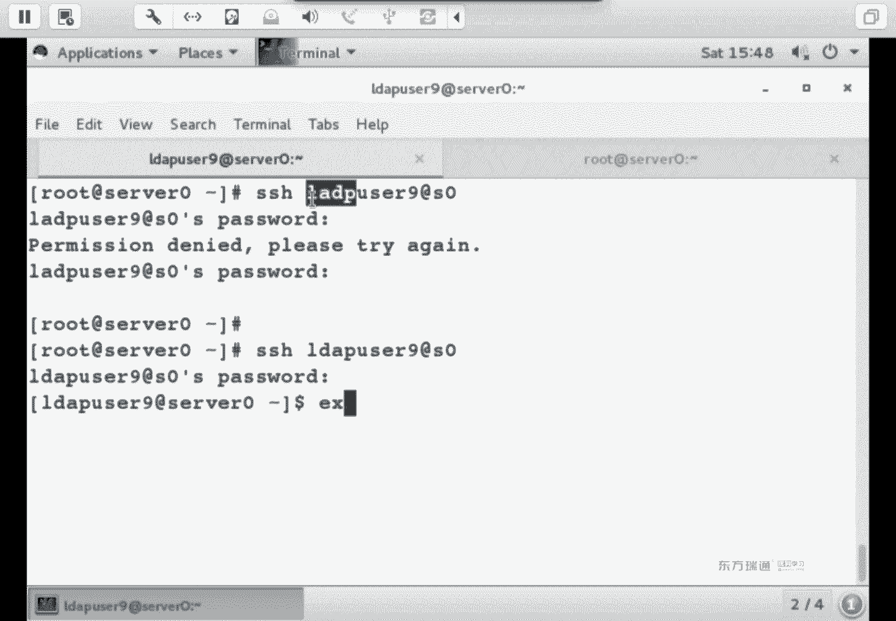

**使用方法：**
1.  确保`autofs`服务运行。
2.  插入光盘。
3.  访问`/misc/cd`目录：`ls /misc/cd`
4.  系统会自动将光盘挂载到`/misc/cd`下。退出该目录一段时间后，会自动卸载。

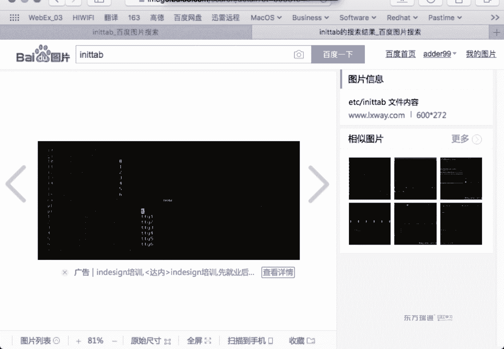

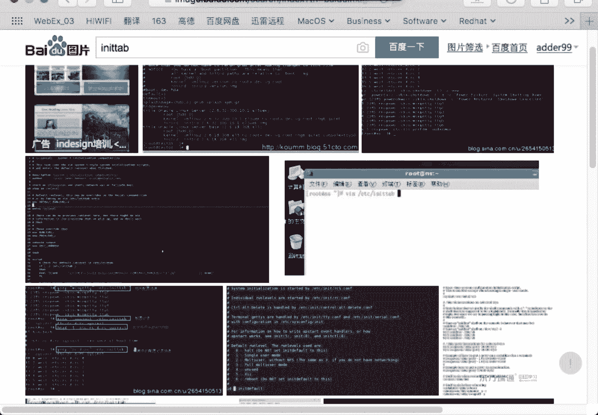

---

## 📝 课程总结
本节课中我们一起学习了三个重要的系统管理技能：

1.  **高级分区管理**：掌握了在已使用磁盘上安全添加分区的方法（`partprobe`），以及MBR与GPT两种分区格式的特性和转换流程。理解`fdisk`与`gdisk`工具的区别是关键。
2.  **交换空间配置**：学会了通过**独立分区**和**镜像文件**两种方式创建与启用Swap空间。重点是记住Swap分区的类型ID是`82`，格式化命令是`mkswap`，以及在`/etc/fstab`中的正确配置格式。
3.  **自动挂载服务Autofs**：理解了`autofs`按需挂载的工作机制。通过配置`/etc/auto.master`和子映射文件，我们实现了**NFS共享目录的自动挂载**（用于用户主目录漫游）和**光盘的自动挂载**。`autofs`是优化资源使用和实现自动化管理的重要工具。

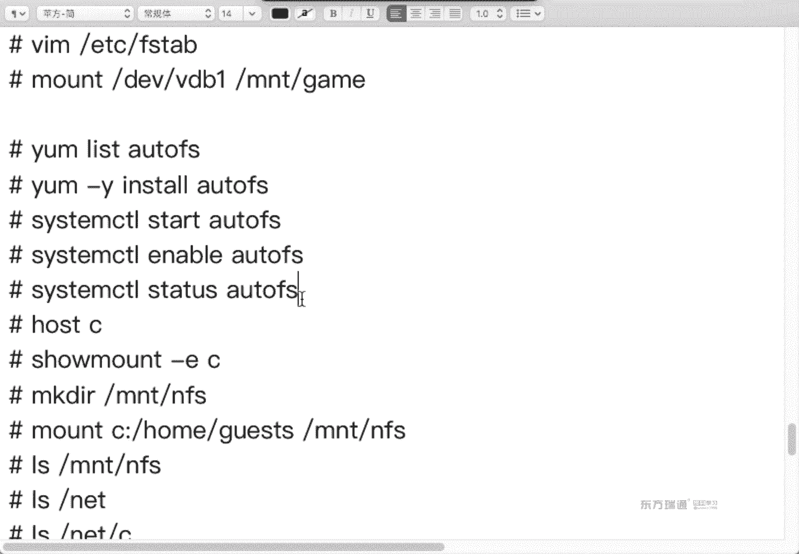

这些知识紧密联系，从基础的存储管理到提升系统性能的Swap配置，再到实现便捷、自动化的网络存储访问，构成了Linux系统管理员必备的核心能力。请务必通过实验巩固这些操作。