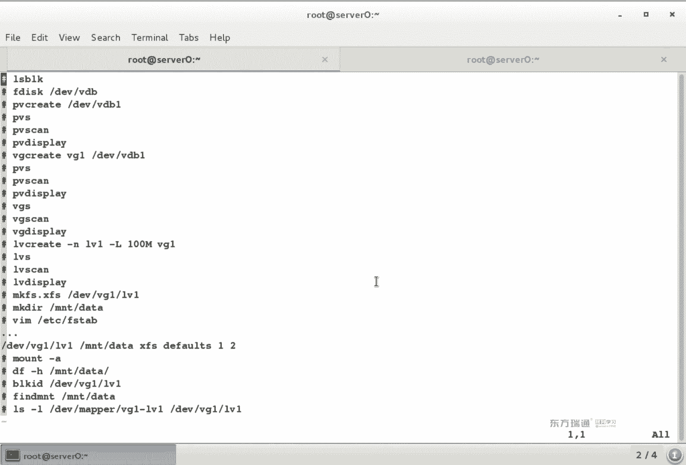
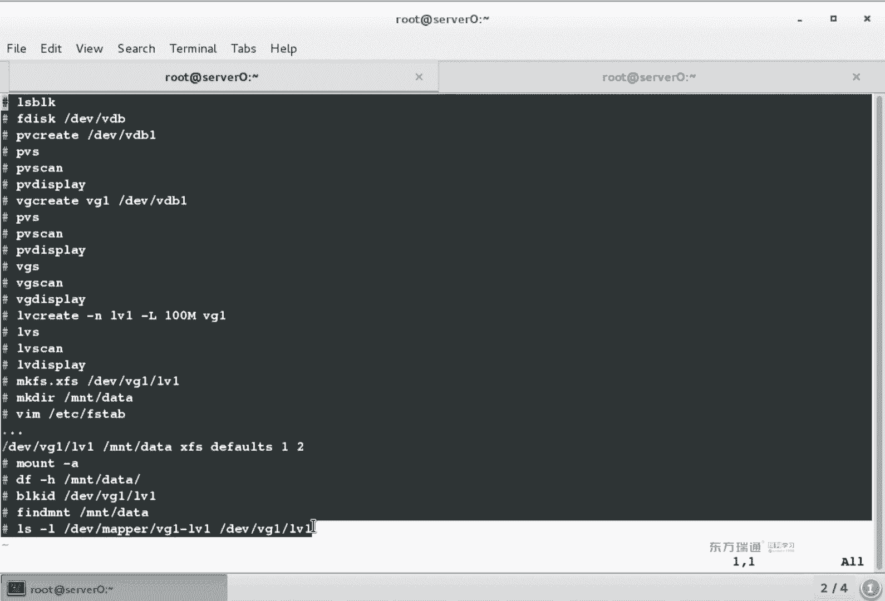
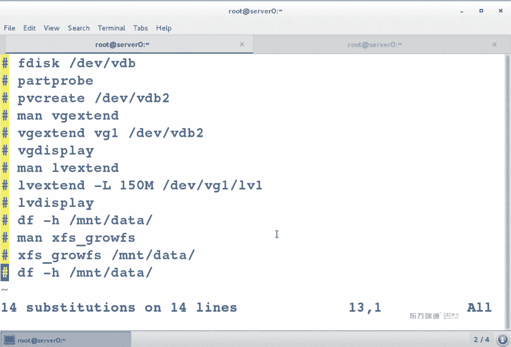
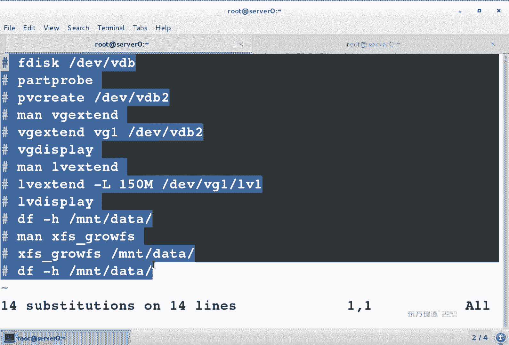
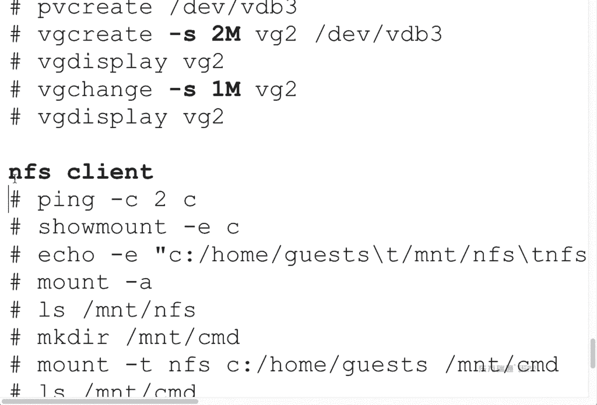
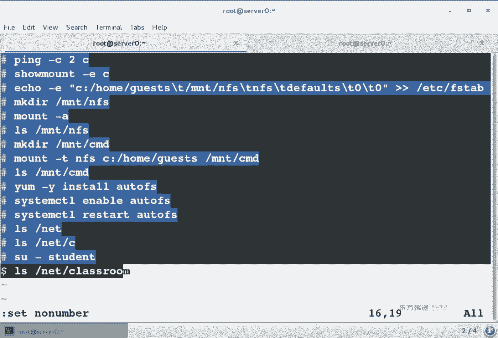
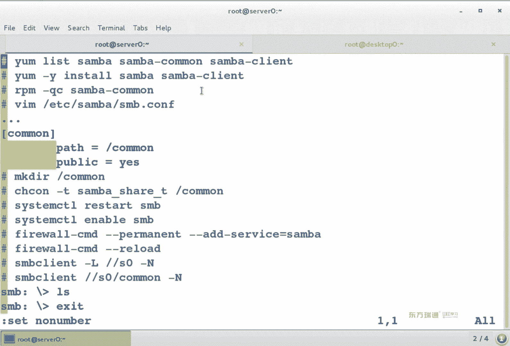
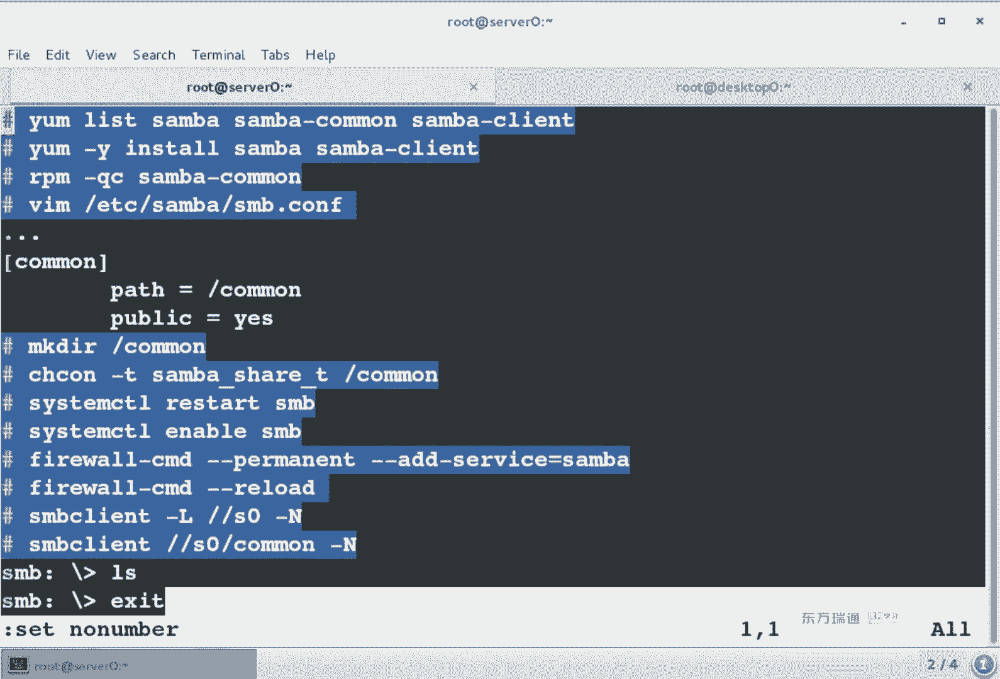
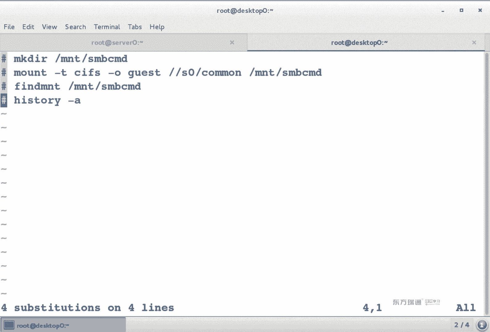

# 红帽Redhat RHCE7培训课程+RCHE7实战参考教程+红帽8.0教材电子版+模拟环境及辅导 - P12：6 - 16688888 - BV1zu41197p6

好，大家抬头。我们开始今天内容。嗯。首先呢来回忆一下昨天讲的知点啊，第1个Ld呃，对于Ld这个实验呢，你关键要记哪步啊？关将鸡乃布。啊。有一个东西叫做奥斯肯fi杠GTK。就把这波记住就得了是吧。

剩下说就是给什么东西添什么地方呀事。就这么一步啊，奥斯an飞个这DK。那对于奥凸 F而言呢，要记承了。要记哪文件。哦，这个我说一下我的思路啊。那我们所接触的这些东西啊，不管是命令也好啊，还是服务也好。

你在刚拿过来之后，首先第一件事，你要考虑装不装。OK吧。换句话说，第一步你要考虑的是装分装。装了之后才能配置。就像我们平时用IF canfiger命令一样。如果是系统最小化安装。

有IF canfiger吗？也没有是吧，那装那个兔子吧okK那么既然包装了之后，你要考虑什么？它是服务还是个命令，或者叫是个服务，还是个应用。如果是服务的话，你是不是想办法要启动它呀？另外一个。

对于lininux当中大多数的服务而言，默认情况下，即使我不修改它的赔偿件，服务是不是也能起动？但是对于这个时间而言，你是不要改他的配置文件？用什么命令来查？

RPMQC我是不是能查到它的主地图文件和子地图文件？剩下我要考虑的是就编辑两个文件。下面这个文件不存在是吧？两号文件编辑完之后要什么？重启服务。然后呢。是不是开机自动启动。再然后是不是去测试？啊。

3然后去测试测试的话呀，你可以用L或者是用苏，只要是能激活那个。目录是不是就自动会挂载成功了？换句话说，我们在配置服务的时候啊。是不是有个通用的思路啊？想想我们在之前是配了一些服务啊，奥凸凡是奇云个。

那么在配肤的时候啊，我们思路是这样的。首先第一个呢你要考虑的是什么？IP地址啊。oppoF这个服务用考虑IP地址吗？不用吧，因为就自己用，对不对？但是我们所接触的大多数的服务。

它是不是都是为了给别人使用。所以说第一步你要考虑IP的事儿，你先能通，然后才能提供服务。OK第二步，你要考虑什么？主金苗。有同学可能觉得奇怪，为什么考虑主名？😊，在我们所基础的服务当中啊。啊。

咱们后面会做到一个NFS purpose实验。那个石验中的票据啊，它是针对于那个主机的。就像我们现在去坐火车的时候，你拿着你那个火车票，是不是可以身份证都拿着呀？火车票上是不是有身份证号，有吧。

他针对那个人的啊，你人得对上，他才让你上去啊。那对于我们一些服务而言呢，他要求你的主机名，要求你的主机名必须得设置。而且在很久以前呢，阿帕奇服务要求必须是完全限定主机名啊，就很多的服务都会限定主机名。

所以说你在配服务的时候啊，主机名也要注意。啊，再有呢。IP主机名，然后干嘛？然后你要考虑什么？然后就说插包了，插包我们通常怎么查呀？😡，你要么list也好啊，RPM杠Q也好，都可以是吧？

你愿怎么查怎么查，包查完了之后做什么呢？😡，没装的话，安装吧。没装的话安装。包装完了之后。我们配置服务的思路都是这样的。那么你接触一个新的服务，你知道它配置文件在哪吗？大概能猜出来再跟ETC一下吧。

跟ETC叫等等文件夹，有那么多东西，我怎么知道哪个是我的配置文件？😡，用RPM杠QC。在你的包当中来查询你的配置文件在哪。查到的配置文件通常情况下，我们是不是直接去修改跟ETC下的某个配置文件就可以。

通常都是这样，那么配置文件改完了之后，你要做什么？启动服务吧。或要重启服务。三门的意思呀是说守侯进城的意思。每个服务的首候进水名数不一样啊，你像outto FS，你是不是重启的是auto FS服务？

我们在之前做了一个阿帕奇服务，是不是叫HTPBD？有印象吧。啊，这个是守护进城的意思啊，每个服务的守护进程名都不一样啊都不一样。你要去查啊你要去查。Okay。啊，服务已经立即启动了。

你是不是还要设置它开机自动启动啊？En enableable。开机自动启动。在之后你要考虑什么？帮火墙。防火墙的话，我们是不是一般都是先permanent？哎呀，这破卖的咋拼了的？可。朋友们。

NNTN题。Permanent。看着这么怪吗？这为什么单词拼不出来呢？因为老用配不键呢。这就推欧店用太熟了，是吧？2哦，很忙的。MANENT啊，这个怎么记呢？破男人。嗯。还是企业版是吧，anerpri。

啊，就是说你在记一些单词的时候啊，如果你实在背不住，你给它变成。你能理解的一句话就好记了。当然了，这个东西也不用记。一般情况下，我们说都是天服务啊。负等于什么啊负等于什么？呃。这个名啊不一定是什么名。

按table键一般写一个字母啊，按table键能列出来，你让它永久生效之后，是不是还要reload让它立即生效啊，防火墙的事。防火枪弄完了之后做什么？嗯。こで。啊，我们已经给他拥有生效。

已经reload的了，然后你要做什么？这波抓完了之后啊，你是不是还要去reload一下啊，立即生效。然后要干嘛放箱完事儿了。下面是不是要考虑测试啊？返さし。测试的话呢我们习惯性的是先本地测试。然后呢。

在网络测试。先本地在远程。为啥呀？本地测试没问题，网络测试才没问题是吧？那如果是网络测试有问题，本地测试没问题，肯定是防火墙的事，都会来判断的。这为什么先本地测试一下？另外呢。我们会发现。

在这个十步配置服务的思路当中有这么一个问题。他里面说权限的事儿了吧。是不是光说了一个防火墙权限的事儿？你在配置服务的时候啊，不是说光这食物就完事儿了，你还要考虑什么呀？权线。权限的话我们有几个。

4个第一个是什么？文件系统的权限。第二个呢。服务的权限。第3个。帮我抢第4个。S一类那个是。你这个实步思路掌握了，再把四个权限弄明白了，那么配置任何一个服务基本上都是这样。那么这四部权限呢到底放在哪儿。

看你心情。什么叫看你心情了？你上面实物配完了，你再考虑四个权限也行，是吧？或者说你上面实物在配置过程当中去设权限，是不是也可以？但是不管怎么做，你要记得一共你有14户你要考虑的东西。一共是十四步。

不管是哪个服务，你都往这十四步里面塞塞完了之后呢，你会发现哎这个服务实际上基本上都一样。莱那个斯的学习过程当中啊，就是服务是最简单的，因为他们有通信。有通性的东西最简单。Okay。那对于文件系统而言呢。

你要知道一个叫亲mo的名令。那你还要知道拼着O文命令s FXL它都真的是本地文件系统设置权限。那对于服务而言呢，你需要知道。改配证件。一般服务的权限是不是都在配证件里啊？对于防火墙而言。

你需要知道permanent。永久生效吧。那一般情况下，我们贴的是不是都是服务？有的时候呢你还会添端口。挨er port，挨 part。为什么有的时候添端口呢？因为默认他服务中定义的，比如说阿帕鞋服务。

他服务中默认定义的HTTP是80端口，但是你就给服务改了一个端口，就8089。那这个时候你防火墙定义说允许HTDG80端口，边人是不是还访不了啊，因为要用80898089要开放。这个时候呢。

你需要去做一个portch啊，你需要挨port。那对于S一类那个词而言呢。S1linux而言，它是增强安全增强的lininux。之所以要增强，是说它是以头三个为基础，在头三个基础上又增加了一层安全性。

又增加了产品。举个非常简单的例子。平时我们这个家里的门呢，上面是不是一把锁呀？😡，那为什么你外面还要再弄一层门，或者说一层门有一把锁之后，你还要闪锁一下。😡，是不是想增加安全性啊，得有原来的基础。

对于文件系统而言，它增加了一个什么安全性啊？上下不是关系吧。对于文件系统而言，它增加了安全性，叫上下文关系。你用chan contact用SE managerage。F complex。

它都是针对上游关系修改的。只过S context而言，你是不是还得做一个restar context呀？对于服务而言，我们是不是有个不稳时？有个布尔时开关啊，简单来说呀，对于服务而言，就是做的个开关。

再 us一部。啊。设定布尔值啊设定布尔值。那么对于。防火枪而言，我们是不是有一个叫SCmanage套呀？S一类那个谁给我管端口的东西吧，你如果不是在我端口列表当中存在的端口，我这个服务啊不让启动啊。

这个服务不让启动。SElinux呀，它叫做安全增强的linux。它是在我们上面三个基础上啊，又多增加了一层安全性。又多增加了一层嗯。那对于IC类那个词而言呢，我们之前讲的实验呢，你就献个印象就行啊。

献个印象就行。我们在讲服务的时候啊，第三门课还会再次强调。你就知道它是增强安全性。在我们三层安全性基础上又多了一层啊，增强安全性。O。回过头来。对于磁拍而言，磁盘而言，我们一共有三道题啊，82。83。

白一。还有个叫S加。呃，82是什么文件系统啊？1了吧83呢。XFS或者是EXP4是吧？考试的时候到底考哪种呢？不一定啊到得考哪不一定。这道题是下午的题。这道题是上午的题。那么上午还考虑到什么题呢？

LVM这是一会儿马上要讲的。今天上午的内容逻辑卷啊，L叫做logicalical呃，有有一个。比较出名的厂商啊叫罗技是吧？啊，罗技hello罗技。volume manager啊逻辑卷管理。

那S咖也是第三门课讲的啊，第三门课讲的，它主要是做远程远程存储。那我们82838E啊，这个都要本地存储。local这个是远程S。ok那下面呢我们来看今天的内容。看一下这个LVM怎么弄。

那么再看LVM怎么弄之前呢，你要确认一点分区的时候，你分区的思路又是什么？嗯。对于自拍而言，你分区的思路又是什么？首先第一步知道干嘛呀？可能还是。拿过CG一块硬盘之后，我们第一个不操作。

肯定是把硬盘连到电脑上是吧？不管是USB也好啊，还是什么接口，反正得连上。连完了之后啊，你是不是正常要去什么磁盘管理器啊，设备管理器中去查看有没有这个设备啊，简单来说判断硬盘。我们怎么判断硬盘呢？😊。

你们喜欢用哪条命令？嗯，好的。呃，我们有两个命令是吧，FD4杠L还有个LS block，你觉得哪个方便？哪个显示的内容少？阿兰是不lock吧。这个。我建议你们要用LS block，那到底要哪条命令啊。

随便。都可以哈。那为什么建议用LS block呢？我们可以很直观的看到你几块硬盘一篇就能看全了，是吧？一圈能看到大结局。那如果用FD4杠L的话，他虽然说看的很详细。虽然说看的很详细，但字儿太多。

你想想你。上小学的时候，我们最愿看的是动画书，不愿看字儿，为什么呀？简单明了是吧，很直观的知道看的是什么。你要看字的话，现在是愿意看小说，愿意看漫画书啊。我都愿意看啊，我没事，我也翻翻漫画也挺有意思。

但是小说的话，它是不更多一些想象空间呢？同样一个电视剧，你看电视剧的时候啊，导演呢演员给你怎么表演就是那么回事儿。但是你看小说的时候，是不是随便想象啊，美女到底长什么样，你随便想。

但是看电视剧已经固定了啊，就长那样，你怎么看他都长那样，OK吧，就是区别。😊，啊，就是我们在看一个内容的时候啊，如果能判断尽可能显示的内容比较少，判断更容易一些。

就像我们平时经常是不是会用到grape命令啊？Great。Okay。判断完硬盘之后干嘛呀？分区吧F disk和Gdi建议用哪条命令分区呢？F disk啊F disk是两种分区格式都可以是吧？嗯，都可以。

考试的时候呢是A培训环境中呢是B。区别哈。呃，分区的时候。对于考试环境中啊，你已经有三个组存分区，并且只有一块硬盘。那这个时候想再分两个分区的话，你应该怎么办吧？分个扩展吧，在里面是不是分两个逻辑呀？

这个是上午考试啊，要注意点，扩展逻辑逻辑ok。分期分完了之后做什么？格式化吧。那到底是XFS还是EIT4啊，这看你心情啊，看你心情。如果是做交换分区的话，应该是make什么？办法。登完了之后干嘛？ま。

没灯会。穿迎光家点是吧？交化分区用创建过来点吗？用不用不是给人用的，不创建过来点。你想让他永久功效给你买。FI tableFI table当中第一列。我可不可以直接写？3北名。可以，第二列写挂的点。

第三类写文件系统类型。第四类是啥？得bo对五练呢。有没有。是否启用日志文件系统启动检测的顺序？你知道他们是什么东西的时候写几哈。😡，好呃，下面这个。它没有关来点，没有关来点的话，我们可以直接写spa。

或者是写nice吧，都可以吧，看你心情。然后呢，你是不是想办法让他立即生效啊？这些生效的话，我们可以慢和打。忘子刚才是针对于VDB5给人用的分区。十大胖杠A呢？给交换分区吧。账号干嘛？

确认啊确认确认的话，好多种确认方法，你可以用mount，可以用finMT可以用DF建议用哪个呢？DFDF你能看到实际生效的空间多大。你说给分了多大，我怎么知道分了多大呢？我们平时是不是看资资源管理器呀？

啊，那类那个是用DF来看。消防分期而言的话，我们fr。为什么都要喝点吗？为什么都要喝点？因为便于人类读的单位显示是吧？O。这是昨天讲的内容啊，昨天讲的内容。这组实验呢，你弄明白之后啊。

我们剩下两个分区实验就很容易。他们只是在它的基础上啊多了几步，然后机差异性就可以。那下面呢我们来看今天的内容，I loveM。嗯。逻辑卷。管理器啊，逻辑卷管理器。首先来说一下呀。

为什么要用LVM或者说LVM的作用。任何一个东西啊，你只要知道它的作用之后，你才会去使用它。在提到LVM之前呢，我先来说一个微软的产品。在微软windows当中啊。有一种。叫做动态磁盘。听过没？

没听过啊。东泰私房他是干什么用的呢？微软呢把磁盘可以去做两种格式的变换，一种叫基本磁盘，一种叫动态磁盘。基本磁盘和动态磁盘。平时我们用的磁盘呢都是基本磁盘。他可以把基本磁玩升级为动态复法。

微软的动态磁盘呢跟linux的LVM它的功能是一样的。它俩是一个功能啊，它是一个功能。它叫什么功能啊嗯什么功能？我下面来说一个故事啊，然后大家一起来听一下。我有个朋友啊，这个硬盘很多，一块硬盘10个G。

然后呢，他给了我4块。4。钱8加起来一共多大？40个之1O。那么我把这4块硬盘呢，如果直接连在我的电脑上，我的硬盘空间是不是多了40个G啊？我能把4块硬盘变成一个分区吗？不能是吧。

如果用我们之前掌握的技术啊。我可以把4块硬盘每个硬盘分一个区域，我是不是有4个分区，每分区10个G啊，可以吧？那如果去买块rad卡，我是不是可以把4块硬盘做个readd呀？这能理解吧，vi塔花不花钱？

😡，你给我4块硬盘，我要买个瑞的卡，我还不如买块硬盘呢。😡，500500G是不是比40亿大多了。那这个时候怎么办呢？操作系统当中呢，不管是微软也好，还是linux，它给我们提供了这样的技术。

它这个技术有什么样的优点呢？它可以把你一堆硬盘或者分区逻辑上的变成一个大硬盘。不用哎不用这个read的卡啊，只用它系统本身支持的，你可以把它列解成是一个软锐的啊，练成个软瑞逻辑上变成了单硬盘。

什么概念呢？你现在有4块硬盘，每个硬盘十个计。通过LVM或动态磁盘，可以把它们变成一个大的分区，这个大的分区就是40P。大的分区就是41，简单来说是不是相当于合并的操作呀，相当于合并。嗯。

那合并了之后呢，你会发现。现在啊你有一个多大的分区了呀？40页的分区啊40页分区。或者说你有1个40G的硬盘，那么这个40硬盘最大是不是能分1个40G的分区啊？那我如果在里面想分2个20G的分区。

可不可以？也可以啊也可以逻辑上的大圆盘啊，逻辑上大圆盘。那我们在下面呢会讲到几个东西啊，几个东西叫做PV。V记。LV啊。你会发现呢就出现了好多VVV啊，这个V代表什么呢？代表是倦啊代表是卷。啊网留。

领券LB叫逻辑券。VG叫卷阻volume group。PV叫做physical啊，physical叫物理卷。物理卷卷组和逻辑卷。那么这个东西怎么来理解呢？首先你应该知道卷组相当于一块硬盘。逻辑上的硬盘。

LV呢相当于一个分区。逻辑上硬盘的分区。PV叫物理卷。它相当于什么呀？逻辑上的组成磁盘的盘片是吧？逻辑上组成磁盘的盘片。一块硬盘有几个盘片呢？嗯，一般就一个是吧一般就一个，有些公司比较变态，弄两个。

这个东西叫做逻辑卷。我。中文呢啊逻辑卷，这叫什么呀？电阻。PP叫什么？物理卷对。先知道这个东西大概是干什么的啊。先知道三个词儿。LBM，你把这三个词弄明白了就OK了啊，它里面这个时间不管怎么变的。

都很容易啊。PV物理券。VG卷组LV逻辑卷。okK啊，我们来看一下他们的关系。看下面。我们是从低往高看哈，先看最下面，你可以有3块硬盘。或者是三个分区。三个硬盘或者三个分区都可以。

然后呢把它们变成物理卷。变成物理液。这变成盘片了吧。然后呢，把这个物理院呢。放到一个卷组里，是不是相当于一个逻辑上大硬盘呢？在这个逻辑上大硬盘当中啊，你愿意怎么分区随便这个呢相当于逻辑卷LV啊LV。

PBBGLV，你要知道他们的关系，最终我们使用的是什么呀？LV啊最终使用是LV。啊。看一下。你有4块硬盘，每个硬盘我可以分一个区，是不是可以分多个区啊，看你心情啊，看你心情。

SDAESDBESDCESDDE我可以把它们变成物理卷，变成物理卷。然后呢把这些物理卷呢加入到一个卷组当中。加入到卷组当中之后啊，就相当于组成了一个大的逻辑上的硬盘。在这个逻辑上硬盘呢。

我可以再来划分我自己的分区，这个呢就叫LV。这个LV到底分多大呀？肯定是要小于VG，对吧？肯定要小于BG，就像你买了1个500G的硬盘，你分区最大是不是就只能分个500G啊，能大于500吧，大于不了。

肯定比它小。那么在这个里面呢，我们会发现有一个词儿叫PE是吧？看到没？PEPE是干嘛的？😡，是。我们来看下P。又提到一个词儿是吧PE。那说到PE的话，我们要提到你们之前听过的一些东西。大家听过这个醋吗？

是。听过块儿吗？微软的产品呢，你再把一个磁盘格式化的时候。数据最小的存储单位叫做促。大家听过4K对起吗？啊。4K对齐是啥意思呀？为啥要4K对齐啊？是不是为了速度更快呀啊速度更快。

我们在给一个分区格式化的时候，微软的产品呢它会给你定义说格式化的时候，这一个速度大。微软就够促。linux叫做块，一块多大？这个东西叫数据存储的最小单位。LVM呢叫做PE啊，LVM叫做PE。

他们三个概念是一样的，都指的是数据存储的最小单位。数据存储的最小单位。OK那我来举个例子。😊，那对于微软的产品呢，假设你一个措施是。4096。系。是对。呀这是K这么大。啊，就这样吧。

假设你一个错施4096K啊，4兆是吧？好，现在问题来了啊。😊，我有个6兆的文件，请问要占几个醋？嗯这两个数，那另外一个图师不没有用满呢啊没有用满。所以说我们在看一个文件的时候啊，在一个文件鼠标键属性。

你会发现它有个文件多大，实际占用空间多大，有俩十吧，俩这不一样，那就是它占了多多少个醋，占了醋的空间和文件实际的容量，它俩的区别。这是醋的大小，那linux也是一样啊，LVM也上啊。

LVM默认呢也是4兆。P啊P的大小。他们都代表着一个概念数据存储的最小单位。为什么我们非要去弄一个促的概念出来呢？为什么我非要弄一个P的概念呢？大家先来想一个问题啊。在实际工作当中。

你既然是由多块硬盘来组成的，有没有这样可能我这块硬盘坏了，我是不是想把这块硬盘撤走啊？换一块新的一个盘。那么在这个时候呢，你上面的数据是不要想办法挪走。如果你是由PE来组成的。

你上面是不是可能有多块PE，我只把PE挪走就行了，是不是相当于数据一走了？因为我们后面要去呃有这么一个实验，就是它的移动木移动。把它的PE给移走了之后，它上面是不是没有数据了，你可以把硬盘随便给拷走。

支持n8的硬盘可以随便薅走，插一块新的硬盘，再塞回来。那么我们现在要考虑一个问题，你既然是可以把PE移走，你是不是其他的位置要有相的空间放这个PE啊？所以说在做实验的时候。

一定要注意它们大小啊大小有地方来放。O。呃，我们来看一下这个实验怎么做。首先依然是分区F disk。然后呢，有个命令，分区算完了之后呢，有个命令叫create。colre这个词儿什么意思呀？

创建我们之前在学t命令的时候，t命令创建用的是。踏杠什么？加C吧。嗯嗯。创建压缩包啊，踏命令2C。OK那么我们首先把你这个物理的分区啊，物理的分区变成一个物理卷PVc。编成物理卷之后呢。

我可以把他们加入到一个卷组。VG create。那VGcate叫创建一个卷子。创建个卷组的话，首先写卷组名，然后呢要把哪些物理卷塞下来。再之后LV create。创建逻辑卷。那你罗地卷必须得有什么呀？

😡，名N是 name的意思，大是logic size逻辑卷大小啊，有大了是吧？所以个是大写啊，逻辑大小。后面这个呢是说在哪个卷组当中来创建，相当于实际工作中说在哪块硬盘上来创建。创建逻辑大小。

那最终我们格式化的时候，格式化的是谁呀？什么意见。好了。设备跟deevice这个卷组当中的这个逻辑卷。能看懂吧，你格式化的最终是逻辑卷，别格式化物理卷哈，格式化逻辑卷。罗辑院搁完了之后。

我们依然要创建挂来点。编辑FI table文件，monnda杠A立即生效。大家会发现这个实验跟我们之前讲的实验呢是不是就多了三步啊，创建物理卷创建卷组创建逻辑卷，然后依然是格式化挂在点，永久生效。

立即生效。后面思路是一样的吧，多了三步PVVGLV啊PVVGLV。オ？那下面我们来看一下LVM的充电。好完了。首先第一步FD是个杠L。第二玩硬盘没有分区吧。或者是说LS block。第二页盘说没有分区。

啊。ok确认没有分区，或者说有可用空间的时候，我是不是可以来分区啊？呃，现在有个疑问呢，说。我这个卷组当中，如果只有一个物理卷，可不可以？啊。可以吗？可以吧啊，OK那我是不先分一个区就行了。😊，分区。

呃。分开200兆的分区吧。F disk灯 deviceiceVVV。乐。主的扩展的随便是吧？回车回车回车。200兆加200大米。呵转换。乐类型。呃，我们看一下这个类型，有个叫8E的类型。看到没？嗯。

这步不是必须做的啊。有同学经常去问我说，我必须要把类型转成82转成8亿吗？建议哈。就建议就正常我们去做操作的时候，有个规则，建议你这么做，当然你不做可不可以啊？也行。在实际工作当中啊，你本身有4块硬盘。

4块硬盘可以不分区，直接把它们做成物理变。能理解吧？可以部分去直接做成物理卷。但是我们当前环节中，如果把一块硬盘直接做成物理卷的话。我是不是现在就2块硬盘嘛，一个硬盘已经装系统用完了。

另外一块硬盘你就做了一个物理卷，我们一会儿再去怎么讲扩容减容啊，还得加硬盘嘛。所以说我们是不是拿分区来做，能理解吧。针对培训环境，不管也是硬盘也好，还是用分区也好，都可以啊，都可以。

就是说LVM都支持啊，但是在培训环境中，我们只有一块空闲一排，所以说用分区来做OK发译。抓了之后呢，瞅一眼。200吧。保存。那你什么什么立即生效了吗？没有什么pa problem之类的是吧？

那也不用letok。😊，变成物理面PV。再sha一下，我们有两个table键，两个table键的功能是啥呀？两个特播间功能是不是列出啊？大家会PP开头的命令了好几个，这都干嘛的呀？

我们来看一下我们要用到的啊。啊，这个里面哪个像创建？这个创建一个不理券。呃，这个里面哪个像查看？The配。这个S啊。SPBS和PVDplay一个意思都是查看，就是查看显示的内容不太一样。

PV看的也是查看，只不过它更倾向于是扫描检测的意思吧啊，扫描检测的意思，这个扫描这是检测。嗯，这个木是干嘛的呀？移动 remove木呢。删除resize呢。改大小是吧。趁着呢更改。一堆啊。

即使这些命令没用过，大概看英文单词的含义，大概意思是不是能知道是什么意思呀？ok。那么首先呢来创建一个。物理院。刚刚我那个分区叫什么来着？A哔。冲好未？对。在看提示的时候啊，我再来说一下。

我怎么知道它是成功了。Yeah。成功了，什么叫没有报错呢？它提示了说一个什么什么东西被创建了，有成功这样字样肯定是成功了，是吧？什么no error呀，也是成功的意思，对吧？它是no error。

如果出现什么i field，是不是就失败了？😡，这能理解吧？那么在执行个命令的时候。举个例子哈。😊，这个命令有回险吗？没有回险。这个没令有回响吗？也没有。这是安装了一个新的包是吧？依然是enable。

有回险吗？有。安装新的包就时有了是吧，这是正确的错误的。我们在判断正确错误的时候啊，你可以看一下你在做Enable的这个操作。系统它是自动给你做了1个LN杠SLN杠S干嘛的？创建快捷方式吧。

他这句话实际上是提示啊，是说你用这条命令可以把这个服务设成开机自动启动，或者是说你用这条命令也可以做成开机自动启动一个意思。我们在之前学没学过ch canfi什么什么on。

这个命令和我们现在用的in内包这个东西是不是一个意思啊？这个就是个提示note。能看到吗？你看不到提示的时候，或者说当你看到提示。一会儿有声一会儿没声啊，那那是网络的事儿啊，有声没声，网络的事儿O。

一定要会看提示啊会看提示，别平时没提示，忽然间出过提示就紧张，看命令是啥哈，看命令是啥。我们也不知道你这个秘密到底是干什么的，但不要紧，你可以去手动的执行一遍，你就知道干什么用的了，OK吧。好，转过来。

那么物理卷创建完成之后，你要创建什么了？卷组吧啊，创建物理卷的格式啊，因为比较简单，我没有给大家看这个它的用法啊，那对于卷组的话，我们来看一下它的用法。VD。看看哪个像创建。还是可瑞的是吧？我们会发现。

对于卷子而言呢，是不是比这个物理卷宗要多呀？啊，比我这变东西要多。啊，在这个里面我们可以干什么呢？你可以创建一个卷组。要删除卷组的话，应该是吧。reduce啊尾幕删除一个卷组，那reduce干什么呢？

我第次发现中文叫减小。减少啊减少我卷组当中有一堆物理卷，你想把某个物理卷移除，减小物理卷。这么一个概念就减小，你既然是可以减小你的卷阻，那么还可以干什么？扩容你的卷阻。它这个扩容嘛是在线扩容。

什么叫在线扩容啊？大家想百度盘呢。假设两个T哈，百度还有两个T。用户在使用的时候，那管理员发现空间不够的，他是想办法把硬盘增加呀。他可不可能说把硬盘卸载了，重新在分么区再挂载上。

那我这个时候我百度盘是用不了了，它要支持一个在线扩容。LVM或者是动态磁盘呢，它们最大的一个特性叫在线扩容。考试的时候呢，主要考的就是在线扩容。他不靠你创建，他靠在线扩容。O。这个是等知道哈。

一会儿我们要用到。😊，同理VG这颗类是干什么的呢？查看VGSVG看都是查看的意思啊，都是查看。好，那我们首先呢先看一下PVS。现在你有几个物理院？他在哪个卷组里？空了是吧，我现在只是有个护理院。

还没有捐组啊。我们现在用的版本LVM几呀。二是版本号二是版本号。然后呢，你多大？200兆剩多大200兆还没用呢，是吧啊。然后你可以PV看。那。你看这个内容和上面这些内容一不一样。显示的格式不太一样。

但是内容是一个意思吧。你当年物理卷是他。200兆。总共呢就200兆再用呢没有。没有建阻啊。没有在卷筑当中的。空了。能看懂吧。意思是一个意思，就显示的格式不同啊显示的格式不同。TV display。啊。

我们在这个里面呢可以看到这么一个值叫什么呀？😊，PP多大？0儿。现在还没有呢是吧？好，马上就有了啊，下面我们来干一个事儿。😊，啊，VD create。这个命令怎么用呢？😡，我们卖一下。

对于命令的语法格式。你要知道怎么看。方括号都叫做可选项。什么叫可选？有没有都行，叫可选，看你心情。方括号全叫科选项。啊，一堆。有。那我们在这个里面呢发现了一些地方。这个没有放工号，看到没？

是不是他俩没有分过号？换句话说，我当前。Volume group name。卷组名。自己起的吧，那。物理卷设备路径。设备是哪个分区啊啊，物流啊设备漏件。那后面又加个方括号，就是说如果有多个的话。

是不是也接着写呀，空格A空格B啊，接着写。那么在这个里面呢，我们会发现有一个叫做S的选项啊S。这个叫什么？物理扩展size。我们之前是不是提到一个叫PE的大小啊？😡，P的大小一个P多大？啊。

四兆你可以不更改。因为它是在方工号里面，是不是可以不写啊？这个方框是一到这儿哈，这是一组能看懂吧？这一组。那么。你可以不写P的大小，你可以在创建卷组的时候，直接定义P大小都可以啊。大S小S啊。小SO。

MeD， great。啊，首先起个卷斗名吧。第一个卷组VG1，然后是不是说要把谁放在里面呢？VB。B1。也成功了吧。最后我们再去PV瞅一眼。这个地方变了吧。P的你笔时间查一下。这儿也变了。然后呢。

这儿也变了。那嘛。然后呢，这儿也变了。哎，为什么变196了呢？明明是200兆是吧？因为那要约等于约不够200兆。不过200兆生磁兆数不够啊，就变成了196啊，这么来的。😡。

如果你就是想让他弄200兆的话，你就分区的时候啊，分个202兆。能理解吧？因为1024和1000千金日的关系做出来是差了点。考试的时候，这个是在误差范围当中，它是允许的。所以说你可以必然往下做嗯。O。

😊，那我们再来看一下VPV displayplay。看到P的大小了吗？4张吧嗯4张。4乘以49得于多少？10是不是有196啊，一共多少个PE呀？49个每个是4兆。能看到吗？okK没使用的呢，还有4兆。

为啥呀？因为不够4兆嗯。那我们来看一下VD。这个卷组当中有一个物理卷，有逻辑卷吗？还没分呢啊，多大，这个是不就是你里面所有物理电的大小啊？VG思看。啊。VD一。这个scan就是扫描了一下是吧？啊。

VD display。叫做名儿。大小P的大小。好，那我们现在发现个问题，就是说PV刚创建完之后，他说我没有P的大小。当你把它放到某个卷组中，那个卷组中的P大小是多大？你PV当中的PE是不是就是多大呀？

它来同步的啊同步的。Okay。卷都有了该做什么了？😊，LV。LV的时候，我们也来看一眼。创建的话依然是。这儿呢吗？创建。啊，删除的话呢。改名儿。嗯，对。扩容呢。啊。是不是还有个减小啊？OK吧。好。

I love it。😊，这个东西怎么用？我们依来看它的语法格式，方括号都叫做可选项。这科人家好多是吧？呃。截个。可选项。对。这上面这一片看出哪个是B选项了？1般9。嗯。上面太乱，往下看吧啊。

PP create上面方工号都叫做可选项。哎，这个S是不是没括号啊？sni哨了这个什么东西？快照啊，LVM支持快照，它的快照啊，实际上就是把那个LVM再备份一份。再备份份，原来占多大空间。

你备份出来之后就占多大空间。就相当于我们做的个拷贝的过程啊，创建拍照。呃，呃，我们看一下这个怎么来创建。看一下几个我们要用到的选项。你在创建逻辑卷的时候，你是不是要指明大小啊？大家会发现这个括号当中啊。

是不是有一种的花括号啊？你看这个花货号到哪？用付了。哎呀，到这儿吧。到这儿。小乐大乐，不管你是哪种单位来表示。还是V也好，它代表都是什么呀？逻辑卷的大小。平时我们看罗叶叶大小啊，一般用什么看比较方便呢？

小乐的话呢，他代表着说几个PE。几个P大了的话代表什么呀？你看这个单位眼熟吧。几兆几灶，我们熟悉的单位都是照位单位呀，不用去计算啊，所以说大乐用的比较多。小乐呀，还有这个大V呀，这个一般啊用的比较少。

再往下。第一个是乐，你要知道。第二个乐。对于你逻辑卷而言，你是不是要是给他起个名呢？给他起个名。小摸也行，内幕也可以给罗姐起个名。然后。再往下。你得在一个卷组当中。大家看到这个了吗？有。看到没？😊。

这个时候没有放工号啊。没封号。就说你在用LVc的时候，必须得有卷组名，在哪个卷组中创建。然后呢，你想想我们在创建分区的时候，你是不是得有一个大小啊？那个大小。再后呢，我们不起名可不可以呢？他这个杠摸呀。

大那个。啊，在这儿刚哥是不是可选项啊啊。这样的课选项话说可以不写。那我们来看一下LV create杠L5，我总共大小是196兆，那我是不是可以来创建1个100兆的。罗进院呢在哪个卷组中创建的？VD一。

大家看我没写名是吧？没写名叫什么？被告。LVOL0这默认的名吧。考试的时候呢，他会有我指定类名啊指定的名。所以说干不到这个选项，你也得知道。那我要给他改名的话，应该怎么改？虽然说这个命令没用过是吧？

看着像改名。LV软 name。啊，我直接给他删了吧。别删了，重再重创一个。呃，删除是什么？L loveV remove我后面应该写什么呀？写你的逻辑卷。跟diceVGE下面的LVOL的样。

为什么要这么写呢？😡，大家想我是不是可能有多个眷组？我有两个郡组中啊，都有一个模具，都叫这一个名。有可能吧，所以说要写绝对路径啊。Yes市。K，这回呢我重新来创建，我要给它起个名。LV。OK吧。

创那个逻辑卷。打开之后呢，我们最终要使用是不是逻辑卷，你要格式化嗯啊格式化makeFS。约定一。I loveV。割完了之后干嘛呢？放一个发在点，唉，打错了。呃交。这是左右手没配合好是吧？左手太快了。

再然后呢编辑FItable文件永久生效吧。我们在这个里面可以写设备名。写完了之后呢，ma达刚A立即生效。确认吧。哎，是不是100兆？约等于是吧？嗯，这个对于容量而言，约等于就可以了。

刚刚我明明写的确实100嘛啊，97okK可以。现在我有个问题哈。😊，我只是分完了一个逻辑院啊，用了5兆，还有92兆能用。对，6%。让谁用了？让谁用了？我们在之前提到过说。

每个分区啊是不是都有节点区和块区啊啊节点区占用了。就说你在勒那个词当中啊，你会经常会发现这样的情况。你分了一个区，这个分区啊，刚用的时候。他直接使用不就会占个百分之几，差的那百分之几是哪来的呀，节点去。

节点区也让空间能理解吧？就硬盘呢你分区分的越多，可使用的空间就越小。啊，这原因哈原因。在微软的系统当中啊，他给你看节点区的空间吗？不给你看，因为微软系统它主要面向的是谁啊？普通用户。你给普通用户看。

我这硬盘有问题啊，我为什么刚分割区没了6%呢？😡，能理解吧，这区别OK。这个谁OK吧。跟我们之前分区的时间，是不是就多了个PVBGLV。那我们来确认一下LVLVS。LV1属于VG1当中啊100兆。

LloVcar。扫描逻进去。当前罗辑卷呢是active可用的。LV display。他在这个卷子中看到pass路径没？看到了吧？然后呢，10道。唉，再给你们看看好玩的哈。😊，看到UUID没？

Block ID。你看这个值跟这个值一样。不一样是吧？OK如果是在FI table当中要写的话，是不是写这个值啊？😊，嗯，还有地方你们得指导。我们之前是不是讲过这个叫finMNT免令啊？大家看这个路径。

提供。dy目录所有的设备是不是都在dice目录下？嗯，平时我们写的路径是不是叫VDE杠LVE呀？这个是我们理解的名说编译记。而系统他在认的时候啊，他认的是它是一个m克映射吧，映射到哪呢？

BDE这个卷组当中的LVLV。换句话说，你在SST当中写这个路径，他也认识。有两种路径的显卡吧，有点类似于什么呢？我们在之前讲没讲过。😊，讲没讲过他俩的区别啊我。😡，光盘和光盘的快捷方式吧。

他们指向的是不是一个位置？为什么现在我EL的时候，它显示什么no such fell？😡，因为我没有光驱。能理解吧？没有光驱，这个文件没有快捷方式也没有。这个设备。这个设备。他们是一样的。真德麦。

VDELV1和gVD1杠LV1。他们纸上都是DM了。一个位置。嗯。这是第一个实验。啊。创建啊创建。我都。LVM。考试的时候呢，直接考的就是什么呀？扩容啊，考试时候他不考创建。但是你创建要不会的话。

能扩容吗？不能是吧，所以说创建你也得会。卷组名、逻辑卷名、格式挂载目录永久生效。刚刚配置过程吧。PV career的时比较简单吗？写分区就得VGc是不是多了个卷组名？LV create名你可以不写。

它会自动创建，大小是不得写？大的写。那么对于你的名而言。啊，对应的名而言，题中会要求所以说杠N的这道N代表是name，大了代表是logicalical size啊，logical size。

格式化的是逻辑卷。格式化是逻辑卷哈，我强调多强调两遍。在做这个实验的时候呢，好多同学去格式化物理卷。格式化谁呀？VBB1对吗？不对，格式化逻辑卷哈，别格式它，这是物理卷，它是盘片啊，它是盘片。永久生效。

立即生效确认。OK吧。う。あ。😮，对。Alice block来判断空间。啊，我每天给你们讲课的时候啊，虚拟机环境都是快照恢复的啊，因为每天放学的时候，我是不是都快照还原呢？这种方法关机最快啊关机最快。

PVc创建物理院，然后确认确认确认。都是确认是吧？VG create确认确认确认。确认确认确认LV。LB create。LV create之后，是不是应该确认确认的？传DB。确认完了之后格式化。

实际上我们在做实验的时候啊，这些确认的资骤你可以省略啊。如果你只考虑效率的话，确那不骤可以省略。但建议大家学习的过程当中，至少瞅一眼，你知道这个杂插什么东西在哪看就可以。格式化创天挂来点，永久生效。

别的内容别删，增加一行。未经生效确认。确认你也可以看一下它的block ID啊。FMT确认。

嗯。Okay。

这个实验跟我们昨天的实验呢就是多了三步。PVVDLV create。这个实验就是LVMcate。O。我们继续。你还的。嗯。嗯。来，刚刚呢我们创建了物理卷卷组逻辑卷。那逻辑卷怎么来删除呢？

如果要删除的话呀，就是思路是完全相反的。想想我们昨天在分区实验当中怎么去删除分区的呀？最后一步是生效，那么首先是不是应该失效啊，又忘了吧。然后再上一步，你是不是编辑个FIT文件添了一行啊，添了几行。

是不是删除FIT文件中那一行啊，再往上你是不是创建了一个挂载点呢，可以删除吧，不删放那放着行不行？就一些空门添夹。空间夹没占多大空间哈，就占个4K删的文件夹，我昨天没给你们删，再往上删分区。

分区也删了之后，是不是就恢复了呀？就说你创建的过程啊和恢复的过程是完全相反的过程。就像你每天穿鞋和穿袜子，有顺序吧？拖鞋脱袜子有顺序吗？有没有先脱袜子后脱鞋的？什么型号可能先脱袜子后脱鞋。没有鞋底儿。

啊，没有鞋底的话，你们可以先脱袜子。但是正常情况下，我们都是先脱鞋后脱袜子吧，它是有顺序的。所以说你创建的过程和你恢复的过程，它正好是相反的嗯，它正好相反OK。那删除的时候也是一样的，用ma它卸载。

LV remove幕。删除啊VG人目PV人目。大家看这个删除的时候，PVVGLV他们的顺序是不是先删LV呀？在3米G呀。再三PV呀。能看懂吧？就顺序正好相反。这个谁让我们最后做啊最后做回复的实验。

验证的过程啊就是S display看都可以。VG啊LV。下面我们来看一下扩容啊扩容。我现在卷组不够大了，我想把卷组变大，那卷组的组成部分是不是物理卷啊？我再弄一个物理卷。加进来，我的卷阻是不是变大了。

那物理卷怎么弄啊，是不是还得先分个区啊？OK再次来分取。でか。F disk。我。再分组行吗？可以吧？因为省事儿吧，就直接回车得了啊。分哥多大？嗯，弄个不一样的哈，有稍有点区分。啊，500也行哈。

这个用用你们机器可以做500啊，我演示做300兆。😊，实上我都想做三十道了，我就怕你们觉得老师太抠了，弄个三十道。Okay。三兆型吗？他东西。三兆太小，为什么？一个屁都放不下，能理解吧？😊。

它至少得比这个P的大小要大啊。唉，如果你非要弄个三兆的话，你得去定义P的大小。把它定义的更小才可以。Yeah。转换。回车翻译。呵瞅一眼W。他说什么？他的pro是吧？Yeah。嗯嗯。😊，生效了之后呢。

我们要去把它变成物理卷PV create。BDB。好。然后我们是不是把它。在创建建阻吗？扩容卷组是吧。哪个像扩容？嗯。扩容血组这个命令咋用呢？方块就可选项。卷宗名。物理卷。哎，跟创建格式一样是吧？

这命令不一样。建筑苗。然后嘞。没有。下面我是要看一下你这个菌组变大了。瞅眼。我们还是这个。okK吧，变大了就可以。叫扩容卷组，卷组扩容了之后，你是不是想扩容逻辑卷？看一下逻辑就能不扩容。也是这个词儿。

你这然是跟大小有关，是不是得有？乐呀。大家看它前面多了个符号。加减。这个也是可选项是吧，增加乐多少兆。减小乐多少绕都可以。再或者是说你不写增加到多少兆有区别没？我们现在这个逻辑卷呢。

我想给它增加多少道啊？后面是他的逻辑卷的路径是吧？OK。看下怎么弄。现在我们罗辑圈多大？嗯白。100兆吧。我想把它变成150兆。150号应该怎么写的？你可以加上50兆。

原来100兆加50兆是不是变成150兆？这个你还得去寻思原来多少吧，原来多大，还得去按加减法算吧。所以说这个位置我们一般写的比较多的呢就是。150兆就完事儿。咁，你就话。当然你有别的加减法的写法。

你得知道啊，你得知道。后面。索要。变150兆了吧。150能被4整除吗？不能吧嗯。他说变152了。确认。是不是152。DF确认。生效没？没生效。在lening个词当中啊，我们学了前面好多的秘力。

你会发现想让一个东西生效，是不是得干点什么事啊？一般是通过命令来实现。我当前的这个文件系统类型，什么文件系统类型？XFS吧，昨天我们是不是学了一个叫XFSwhat命。啊，OK那个命令是管理的命令。

所以说我顺道来看一下XXS。你会发现这个里面有一个很疼的命令。为什么要很疼的命令啊，叫割肉FS割肉疼不疼啊？疼是吧，所以要很疼的命令这条命令的功能呢就是让我当前的这个。逻辑卷立即生效。

你罗旋大小之后变了，但是没有生效，是不是你想让它立即生效，立即增容啊，立即增容叫g。葛肉翻译成中文呢叫增长啊，增长的意思。方括号叫可选价，最后接什么？挂在点挂了脸O。大点是什么啊？戴他吧。

出了一堆什么什么东西，然后师傅说了这么一句话，wo。啊，再次DF抽烟。变150了吧。啊，增笼。还贷。这个是卷组征容，逻辑卷增容怎么来整？我们跟第一哥谁间来做比较啊，是不是依然要创建物理卷？

然后是VGX tenLV X ten只不过LV X ten之后啊，它没有立即生效吧。割肉啊割肉。Oh。现在问题就来了，XFS割肉。那这条命令是不是只针对于XFS文件系统生效啊？

那如果是EIT4EIT3怎么办？我们有叫resize，resizeF的名。这命令不太一样啊，先知道有什么东西。

好的。方。我们这组实验呢讲的是增荣。首先，E然分区。E然分区再分一个区出来。我们在做实验的时候啊，我这个给大家演示的是又分了个主酸分区是吧？你要是就接着昨天实验做，用逻辑分析做，可不可以？可不可以？

可以啊可以做啊，就是你到底是主还是逻辑啊，没有人要求考试的时候也不会要求。你到底是主织逻辑，他只要求大小。因为之前有个分区已经在使用了，说啪了 power立即生效啊。好吧。创建物理卷。

物里院创建完了之后呢。扩容卷组扩容完之后确认一下吧，变大了。然后呢，扩容逻辑卷。扩上逻辑卷。螺辑卷扩充完了之后呢，确认。逻辑键生效了，但是实际上生效了吗？实际使用容量没生效，想办法让它生效。

我们有个命令叫grow FS。他后面接是挂在底。确认。生效实完成。扩容实验。扩容实验呢，你要知道这个这么几个东西。Ext PV create， extend， L V extent。我们来。加粗字体啊。

都是你要注意的地方啊，你注意地方。或者说是实验的思路。O。继续。呃，现在我有个问题啊，说能减容吗？我们在刚刚看XFS命令的时候啊，大家会发现。有个叫格肉FS。你看有什么什么FS之类的。你好。有没有啊？

另外你要不会看的话，我们也可以这么来看。如果他有简容命令的话，在慢手册当中。一般最后啊会有个C also的美力，跟减容有关。或者说在慢手测大中啊，他会说明。他有这样选项啊，当是我们会发现有吗？没有吧。

Okay。那下面呢我们来看一下。移除移除。这个为什么不讲减容呢？😡，简容这个事儿危不危险？我实际的容量啊200兆。实际容量200兆。那么当你减容的话，我可不可以减容到100兆？可以。

它会提示你会破坏数据。那么那有多的那100兆数据有可能会被干掉，所以说减容很危险啊，减容很危险，没事，少减容啊，尽量多增容。那我们来看一下移动。移动PB。为什么要移动PV呢？

在实际工作当中啊会有这样的情况。呃。你有块硬盘有坏道了，有块硬盘坏道了，我要把硬盘给它挪走啊，硬盘挪走。那这个时候啊就会用到移动。PP幕PP幕这个功能啊是告诉系统，先把我要把哪块硬盘移走啊。

要把哪块硬盘移走。然后之后要做什么呢？VG为丢死。VGreduce VGreduce干嘛的呀？然后。减小移除在卷组中谁移除。那我们来看一下啊，怎么来移动。这第三个鞋。

首先呢我们要用VD display来瞅一眼你当时的卷组。500兆吧。PBS。free是什么意思呀？😡，是道。剩了多大是吧？那我们现在会发现个问题啊，说这个PV。VDV1。一共是196兆，还剩下44兆。

是不是用了150兆啊？换句话说，你刚才那个LV裸辑券是不是都在它上面呢？嗯。你下边这个东西是没用。现在我个想法，这块硬盘有问题了，我要把它移走。😡，啊，那么就PV。P屏幕。好。这一个。

大家看有个百分比是吧？他在干什么事儿呢？他在把VDBE上的那些PE呀都挪到其他的。其他的物理卷上。我也没有指定说往哪儿移呀？😡，没有你没指命往哪移，它自动。😡，可以，你看一下慢手册啊。

它里面有把哪上面的PE移动到哪个物理卷上。可以指明哈，因为当天我只有两个物理院，我不指的话，是不是往另外一个上移啊，我就省事了，没写。我们可以顺拿来瞅一眼。好。你保的。圆。目标是不是可以省略呀？

看到了吧？您可以说指定移动到哪一个。物理卷上这个是可以指的啊可以指。OK移完了之后，我们再次PVS。看看变化没？能看到吧。现在我VBBE上是不是全frre了？换句话说，VBBE上是不是没有数据了？

没有数据，你可以安全移除了吧。😡，啊，怎么移了的？这个VD啥？Re。首先卷组名，然后。VBB1。这块的PS来看。移除了吧。那要给他再干掉怎么弄啊？白梦啊。OK吧。哦。这个实验呢主要是看啊主要是看。

这个实验呢你可以把它理解成是简容啊简容。V竟没60。じかく。首先呢来看一下。哪一个物理院使用了？有两个护理医院是吧？我们发现VBB用了，他要想把它上面的PE移走PP幕告诉系统，我把它移走。

把它上面所有PE都移走。😡，确认确实移走了，移走了之后呢，上面没有数据了，我可以把这个卷组当中的PV。删除掉删除成功之后呢，确认。它上面没有数据了呢，我就可以真正的把它给删除了啊。PV人目确认。OK吧。

这个时间当中，你要多用PBS来看确认。你们在做实验的时候啊。😡，也有可能会出现什么情况啊。也有可能你们都是在另外1个PV物理卷上吧，就说你到底是PV目水，不一定。看情况吧看情况。

一般情况下他是顺下来写啊，一般是按顺下来写。嗯。啊，刚刚讲过了逻辑卷扩容。如果是EIT4，它扩容的话，用的是什么命令呢？看到这条命令没？resize e two FS这条命令后面接的是啥？如可な。

是挂了点还是设位？快了。あ。喂 size E twoFS。E图F啥意思呀？从EIT2开始之后才有的功能是吧？换句话说，这条命令针对的是不是EXT文件系统啊，EXT文件系统。M。まあ。他后面接什么呢？好。

XFS接是挂载点是吧？考试的时候，如果是实在想不起来接什班慢一点啊，慢一点ok。呃，这张还有一个实验。嗯，叫恢复实验是吧，全删除恢复实验。全删除怎么删呢？😡，先删时怎么删？ま。不理我呢啊。

那我给来演示吧啊，不理我演示。考试的时候考的是XFS还考EIT4啊。不一定哈。两种方法也都得会两种方法，它们实际上主要区别就是增容的命令不太一样吧，是XFSg FS还是伪s一 toFS就是俩区别啊。

ok呃，我再来演示一个恢复怎么恢复。首先是不是要先卸载啊？OK吧。然后他上一步是不是要删除文件中那一行啊？嗯。MIT那行是吧？再往上是不删除。逻辑卷子。删除LV人木。删除吗？他是不是多了个确认呢？

为什么？😡，因为上面有可能有数据是吧？数据很重要，它会提示你真歪了，卖的人就不管啊。删除成功再删谁？卷组。再干谁？し。姐。正法。好。你海啊。Yeah。我也忘了怎么办？他对。能理解吧？

等你实在想不起来的时候，我就删一个删个啊。那为啥么不删一呢？因为一刚才删过了是吧？😡，PB等你。好好。好，再然后是不删除分区啊。哥哥。的。W。诶。原来什么样，现在什么样，实验完成。嗯嗯嗯。Oh。编较好。

这个实验呢叫恢复实验。好是吧。そう。这是LYVM。IOBM最后演示一个实验呢，就不给大家写笔记了，就EIT4增容啊，EIT4容我们来看怎么做啊。再给大家演示一个实验。现在呢我分两个区，1个100兆。

1个200兆。啊，1个100兆，1个200兆。呀这咋办呢？哦，可以不可以就前面空了100兆出来嘛，我那100兆留着不用啊，就这么地。OK接着分。哎呀，又敲早了是吧？呀这说啥？不诉。系呀。那咋办呢？上吧。

分错了个3。新建。10大是吧。新建。200兆。往看。确认。转换。8一能后换。8亿。确认保存。不完学了吧嗯。然后PVc。或者你VDB1空格跟dyVDB2也行。大招是创建眷组啊。你可以这么写。

也可以按照刚才的写法。然后是不是创建逻辑卷呢？我一个分区100兆，一个分区200兆，我先给他分个150120兆，行不行？120兆是不是占用了两个物理卷？嗯。120。啊。这句话提示啊是为什么呢？

因为之前呢我们是不是用过。最以会的提示哈。嗯。嗯，换一种想法。听功了吧。哎，哎呀，刚才没删文件夹是吧？那就直接用吧。😡，这个提示是不是温件夹存在直接用就可以，不用创建。OK吧。另外一种写法啊。

文件系统类型。嗯。启用日文件系统。除了根都是2。没报错吧。10了。那现在我想给它变成140兆。增茸到1402。首先呢你要VD displayplay来确认一下我实际的空间。嗯。够140张吧？嗯够吧。

PVS来瞅一眼。第1个PV是不是用了了？嗯，用不了了，我要把它啊升到150吧。第一个。啊，第一个没用啊，用是第二个是吧？啊。好，那么第二个用了一部分。我现在要给它变大。看怎么弄。呃。

首先确认VGdiplay。总共空间够吗？我够。前面120150啊，前面150兆空间够，用不用再往里面CPV了。不用吧，我直接扩容逻辑卷就行。LV extend。搞了。550。啊。200吧。20了。麦克。

一1啊。Ilo。啊。那么你扩容完了之后啊，I love display。是不200兆了。办事。是200兆吗？不是是不是让他立即生效啊，用哪台命令来的？side into to F。然后呢。写设贝名是吧？

最多的。まい？还有。我们会发现下面有什么闹什么什么东西。😡，最后确认。先安成吧嗯。喂。下课休息10分钟。问大家一个问题啊。一块一台机器能有几块硬盘？他们。啊，看什么机器，或者说看机器接口的数目是吧？

换句话说，一台机器至少有多块硬盘吧。那么对于我们的卷组而言，它是逻辑上硬盘，卷组可不可以有多个？可以吧，卷子也可以多个逻辑卷是不是也可以有多个呀？喂系嗰个 ok k 。下面我们。补充两点。好。

第一个内容。Vi visit this place。我们现在已经有一个线索了是吧？叫VG1。我想再做1个VG2VG2能做出来吗？你是不是现在有个物理院吗？还得再分个序。嗯Yeah。呃。

200兆3个100兆吧。转坏。翻译。瞅一眼我存。Part。阿里。剩下的之后PV create。3。物理液有了卷组。另外一个卷组了吧。确认一下。we yes。是不是有两个电阻了？TYes。看到没？啊。

那再补充一个知识点呢，就是。size的大小size的大小。我现在想把这个卷组给删了呀，应该是VD什么。E这原目。AG2。没有就组二了是吧？VDcreate杠S。原来我们那个PE大小多大默认。四兆是吧啊。

嗯。V did this play。VG2。再看这个位置。看到P大小了吧。你在创建卷组的时候，你得来设定P的大小。那如果我当天建组已经创建完了，我想把它给改成四兆，你该怎么改？哪个是。解啊。嗯。啊。

有个词儿叫changer是吧？骗着。命令没用过，先慢一点。卖下的原因呢有这么两点，第一点是看它的格式。看它格式。第二点呢是看它大概。作用是什么？改属性吧。该属性。那么在这个里面呢。

既然是你创建的时候有杠S更改的时候是不是也应该杠S啊？看到没？后面是你的名OK。ううん。大S。大兆吧。他说啥？没有。fate是合适的意思哈，你去买件衣服啊，大了小了的得就是，这叫fate。

为什么买衣服的时候非得人去呢？啊，原因的视样。Yes。嗯，也不行是吧？为啥？大家会发现我写这些数啊都是二的倍数。能看懂吗？啊二的倍数一兆可不可以啊？嗯，你这也可以。什么三兆六兆啊。唉，六兆没试过啊。啊。

六绕也属于二的倍数是吧？啊，别说5哈，别什么357之类的啊，二的倍数就可以。可以成功吧，就是你在更改PE大小的时候，它这个到底改大改小啊，不是随便改的啊，不是随便改的，它是它里面有一些自己的算法。

到底能不能改成功，它是不是会提示你啊？😡，能看懂吧，是否能改成功，它是由你里面那个PV大小来限定。物理院。我们在之前呢跟大家说了，说我要创建一个三兆的物理院行不行？😡，默认PE是4兆对吧？

那肯定是不可以的，就是他们有个大小的关系，两个大小关系。好，LVM就这些内容啊，我把这个时间给大家整理一下。呃，这个实验呢主要来讲一下这个P的大小啊。只要讲要讲到的P。那为什么要讲一下P的大小呢？😡。

考试题当中啊，他会告诉你说要求P大小设为四绕。本身就4兆是吧？那就默认值，你设不设都丝了，就给分7。但是你得知道这个批大要怎么改，就他提的这个知识点了，是不是这个杠S啊SO。三个区域立即生效。然后创建。

发验卷组。我们在创建卷组的时候啊，是不可以杠S直接来指明它的PE大小。确认。然后呢，是不是可以通过VG change？来更改它P的大小。就已经有了。喝酒之前看你心情啊，看心情。之后再来确认P的大小。

Okay。那在这些实验当中啊，FD的步骤我都没给你们写。我只写了有个命令是吧？呃，命令当中啊，你就记得有个转换的步骤。转换。花艺的事儿。okK吧，剩下跟昨天讲的时间是不是都是一样的呀？哦。F第1克。

转换8亿的事儿。呃。LVMLVM大家必须会的实验呢就是增容啊，增容实验考试要考增容。那么你要去做增容的练习，你不会创建的话，是不是也增容不了啊？所以说创建也得会吧，会创建会增容就可以。

这是LOVM啊考点。有。呃，增容的步骤强调一下。风笼。再分一个区。把这个新区这个物理院呢转成八一类型。然后立即生效，创建成物理卷，扩容卷组。扩容逻辑卷逻辑卷扩容之后，它立即生效吗？不立即生效。

那怎么办呢？对于XFS而言，你是应该是XFS grow FS挂在底。对于EIT4微件性而言，你要resite E toFS。OK吧嗯。😊，两个知识点喂。我们继续。访问文件系统嗯访问文件系统。

实际上第十1章的内容呢，我们在之前一直在用啊一直在用。那第11章它主要来讲的是客户端的使用啊，客户端的使用。如何来装载如何来使用网络共享啊，我使用网络共享NFS。我们有个包号叫NFS有t。这个包应面有。

NFS还支持cos还支持cbos。大家看到这个服务了没？如果你用system control meaning令in enable start，这个肯定是个服务吧。

这个服务叫NFI security security。那么他是在destop执行的，受客户端的服务啊。整个RC的课程上，客户端会有两个服务，一个是auto FS，另外一个就是NFSque。

它是针对于NFS客户端那个服。服务器端叫NFS9Q1杠server啊，多了个server啊，服务器端。那我们在挂载的时候呢，如果想使用用mount命令临时生效，修改F table文件永久生效。

用out to XS是不是自动挂载嗯，三种方法都可以啊三种方法都可以。那我们来看一下这个。NFS客户端的使用几条命令。第一个。在微软的产品当中，如果你要访问别人共享的时候，第一件事儿你要干什么？

知道那台机器的IP或主机名吧。第一件事儿。能通吧啊，一般都能听通。然后呢，你是不是要看那台基金有什么共享啊？收帽。等一。C。能看到共享吧，能看到共享了之后，你下面是个访问那个共享啊。访问共享的话。

我们有三种方法，FI table文件mount命令还是用outto FS随便都可以啊，都可以。如果是用文件来做的话呢。边尼。啊。用ic面的行不行？往文件里这样一行。可以吗？可以。哎扣杠EE是啥？

expression表达式啊，我们在用grape的时候，大家记不得grape杠一。可以刚一堆小一，可以刚一个大一是吧？它代表一堆表达式。啊。我要将这台机器上的。home盖是吃。ZESTS。然后加个推键。

推键那些啊。是啊。挂在哪呢？挂在本地的跟MNTNFS上。然后。文件系统类型是啥呀？NFS吧。再然后。选项选项是不是得fose啊？再然后它是日志文件系统吗？网络文件系统都不是日志文件系统只针对于本地有效。

能听懂吧？日志文件系统，这本地可能有网络都没有。而本地是都有吗？不是。你像什么fax2啊，没有到NTEFS开始有EIT3EIT4都有。最后一个。最后一个啥来着？启动检测顺序吧。

网络文件系统检测它干嘛能检测吧？系统刚启动的时候是先加载分区，然后采网络采网络文件，系统还没到内部呢。所以说这个位置是0。对呀，这个TT不是这么写吗？这哪写错了呀？那也错了。在用户诉主目录下。

是不是有一个KS。好那康aKS点CFG文件呢。啊，反斜杠对呀。差哪了？你好。啊，没加引号是吧？O。大家双眼。C方号是哪出来的？啊，C是主机名是吧？这个一看C号想windows写吧，这个主机名啊。

我是为了省事，写个C，是不是正常应该写什么classroom之类的。OK那我们这条命离回车呀，大家可以看一下，我们将这台机器上的这个共享挂在本地的这个目录。文件系统类型是它选项是它。

然后不启用这文件系统不检测。喂，那这个目录啊说不存在呀。FI table文件什么时候生效啊？重启的时候生效。OK吧，或者是说你这用m达杠A。立即生效。也可以吧，报错没？没报错没报错的话。

我们LS跟MTNF瞅一眼。诶，光。对呀，没注加到文件里是吧？哎呀。那为什么先apple一下，不先追加文件呢？我们追加文件之前呢，先看一下你要的内容对不对。看下内容对了之后。都忘了一步是吧？😡。

为什么是两个大于号啊？聚焦追下。一定两个大于号哈，你要改一个大于号的话，一会儿你就得多做一个实验。耽误跳密码能跳过去吗？嗯，可以哈去单户模式，然后呢把这个。根深区那行添回来就OK了。OK吧。

我们之前做了一段实验叫单用户跳密码，你可以去单用户改FI部分键。大然或在考试的时候也有可能会用哈，因为你赶开 table念，你想你有。好，六道题啊有六道题。那如果是再多点的话。

说有8道题都要改ipad table文件。ip table文件改了8次，万一有一次写错了，系统停不了怎么办？你不可能把这个dstop reset重复一遍吧。进大用户模式给改正确了，再启动就OK了。

能理解吧？FI文件单用户必须会啊。😊，okK这回我们再次慢它刚A没报错，然后呢确认一下。😊，OK吧。这是用ifi table文件。第二种方式呢是直接敲个命令。

我可以用mot命令指定NF用这个命令C机器上的。home盖吃。挂在本地的跟MTCMD下。看看龙吧。开始了。然后呢，你来看一下。哎。所以啊没得。OK吧。这种类是临时挂载啊，也手动的自动挂载呢。自动外载。

我是得装一个包啊。在昨天讲了是吧？自动挂载了之后，我直接LS跟n。这个的启动服务吧。你没不。奥po F S。用 style了行不行？也可以是吧？那为什么我一般都用restar呢？如果服务已经启动的话。

restar是不是会重新加载配置文件呢？如果已经启动，你再star配置文件不动，它不管。这跟没敲是一样。ok呃我们正会看n。没有杠C。OK吧。自动挂载就是到底用什么挂载呢？随便。😡，到底什么话了？随便。

那我们现在会发一个问题啊。😊，普通用户能用漫画命令吗？Mart。呃，mon soon。Yeah。他面这个。看到没？他要只有ro他能杠t是吧，那不起。😡，嗯不打。FI table是不是只有路它能改？

ma的命令只有root能用，普通用户是不是只能去。自动挂载呀。拉斯用。能理解区别吧，权限上搜有区别。虽然有三种方法，但是头两种方法只针对于root有效。是针对要root。au to FS是不是谁都能用。

你有权限就行啊，你有权限就行。Okay。呃，第一条命令。PC代表是class room的DN别名，那我们可以直接是杠C2。这啥意思啊？拼俩包吧，抗看2啊，抗看2。那寿mount呢是说查看NF共享。

如果双曼达刚一是查看自己的共享。双曼达刚一那台主机名是查看那台机器共享。你知道哪些主机就看谁的共享就可以。看谁的光想，为什么要先拼一下啊，确认那台机开机了是吧？啊，第三步。第三步。

那我们会发现呢用ele。用icle追查命令，是不是可以把一个内容追加到一个文件中啊？这个里面的杠T是什么意思？k剑是吧，k剑。呃，杠E是为了把这些行这容西加个tableable键。

如果你不用tableable键的话，用空格行不行？也可以别挨着就行。😡，是一个空格还是两个空格呢？随便你愿意几个空格，几个空格，至少有一个啊。我们经常说的一句话叫做距离产生美。请问那个距离是多远？

不挨了。能理解吧？这个就叫距离，至少得有一毫米。OK创建个挂载点，mt刚立即生效。那像这种挂载啊，用FI table是不是永久有效立即生效。然后呢，m它mt杠A是立即生效啊，确认。用下面这个方式呢。

又骂的命令。用下面这个方式，它是不是立即生效了，重启之后还有效吗？重启时效啊重启时效。系统重启啊系统重启。那在下面这个呢。在下面这个奥凸 FS。au拓FS是不是自动关载啊，你不用改FI table文件。

你也不用去mon它，你就去访问那台主机就可以。😡，直接访问就可以。那在这个里面呢，我们深道说了一下普通用户。是不是可以去。干这个事儿啊。FI table mount的都干不了吧啊，图内户只能干这个。

这个实验呢叫做。NFS client。作为1个NFS客户端啊，怎么用？我们的class room是已经配置好了NFS服务器的一台机器，你可以直接访问嗯。

soer呢，我们当年所在这台机ser啊，它是作为1个NF客户端来使用。虽然你的主机名叫ser0是吧？

但是在NFS服务当中，我们当前是属于一个客户端。呃，创建自动挂载的实验呢是我们昨天做了一个Ld叫奥to FS啊，做了一个自动挂载。那下面我们来看一下上把。哎呀，这个实验。不太好讲，为什么呢？

你是不是得先做一个windows的动享啊？windows的共享要讲多了，那么话又变成讲windows课了啊，那怎么办呢？😊，我们当年环境中是不是有个serv0，有个戴斯top0啊，有两台机器。

我用serv0做38的服务器端，用戴stop0做客户端，可不可以？可以吧。那你需要来启动啊相应的机器。H T VM control， start。但是套。用so20做服务器端，但是top0做客户端。

我开两个table，outote一out2切换是不是很方便呢？考试的时候也是一样的，一个table是服务器，一个table是客户端。别弄差了。如果考试的时候要求你配服务器，你给配反了的话。

不得分哈啊不得分，别配反了。确认一台机器服务器，一台机客户端。那么考试的时候，他们不叫server，也不叫destop，他们叫st一s2，一就是soer，二就是destop，就是考试环境主机名不一样啊。

主机名不一样。ok那我们继续。首先呢来配一个上巴的服务器端啊，首先说一下上巴是什么东西。上边就是windows的共享。windows共享用了一个SNB的协议。

叫做server message block协议啊，这个协议在linux当中和windows当中，他们做易购平台共享文件的时候会用到。SNB啊上吧。上面的包呢3个。上把上把common。上把克辣。

第一个是程序。第二个是主件。简单来说，配置文件。第三个呢是客户端命令。啊。Yes。敲门包装了是吧？装另外两个包。ま点啊。包装完了之后，你是不是要去改配置文件？哪个是配准文件？好。

SMB点config是吧？大G。大G什么作用？光标跳到最后一行。314到320，这个是一组共享示例。我们会发现前面都是分号注释掉的，是吧？啊，我们在之前也提到过方画当中代表什么？共享名吧。

comment的是共享注释，既然是注释的话，写不写都一样是吧？啊行不行都一样。再然后passpass代表什么？楼径。路径必须是绝对路径。这个文件小时还没充电呢。谁能发问呢？public等于yes。

是不是谁都能好问呢。啊，选三号得了。那如果你要有写权限的话，是不是还得加个rite table等y访问的人都有写权限。啊。你想让别人来访问。立即生效。还要干什么？还要加。啊，建个文件夹啊。

呀文件夹没创建，这服务咋启动的呀？跟康门文家是不没创建。服务能启动挺奇怪是吧？但是一会也访问不了。能理解吧？也反不了。还要干嘛？有印象吗？OK吧。好，测试先本地测试。应用s卡的命令啊，只要是访问共享。

大家都应该有个习惯。首先第一步要先确认联通性。拼一下吧。因为我就在自己机器上我就省得拼了。然后呢，你是要查看这台机器有没有什么共享啊，再这是个访问共享。首先查看共享呢我没这么看。乐乐的吧查看共下。うん。

😊，刚刚。这台机器里面是不是要S0了？我访问的时候是不是不用账号名密码？匿名账号叫no password。大乐大闷子。看到共享名没？看到了吧？下面有不要访问这个东西啊？什么访问呢？38卡烂的。

这台机器烫热。这个共享。访问的时候呢，不用账号名密码。能看出区别吧。查看共享的时候是不是杠勒没共享名，访问共享的时候是不是共共享名没有杠勒。大区别啊，做一下对比。LS能访问吗？直播里面啥没有。OK吧。

退出。通过客户端。相同的先拼一下。通吗？通吧。你如果是这么做的话，你得conttrol C cancel。所以说给大家写文档的时候，我是不是先C一下啊？能看懂吧，就拼俩包，你要和windows一样的话。

是不是杠C4啊啊，杠C4。拼完了之后干什么？查看共享吧。收慢是看NFS的那我们要用的是什么命令？上把卡烂这条命令有吗？table table table都没有。刚刚在服务器端。

咱是不是装了个叫38克拉小包？ok。安装1个38可烂的包。我。包装完了之后，咱把卡烂。看到S0，不要账号粘密码。多好的。扫个什么呀？找个乐是吧，嗯列出这台机器上有什么共享，看到框没没？

大家会发现呢上巴服务他默认在哪个工作组里啊？在自己的公安组里。微软的产品是不是叫work group嗯，不一样啊。那你是不是也要访问那个共享？S连上。Comment。不要账号名密码。O吧。实验完成。

那这个方式呢是说临时生效。3把可ant是临时生效，永久生效呢。永久生锈的话，你还要去干一个事儿。装个CFS9跳s包，为啥呢？原因在这儿。我们永久生效，是不是要编辑FI table文件？

你在这个里面第一列写什么？那好。路径吧，设备那台机器上那个共享挂在哪？我还没创建文件夹呢，是吧，写个地方。这是不是要写文件系统类型啊？我们刚刚是不是装了个CEF9跳丝包？那个包不装，这个不认识。

换句话说，客户端装了几个包。30克antCFS有ts，有ts翻译成中文呢叫工具工具。启用日志文件系统吗？检测吗？网络文件系统都是00。哦。哎，哎少东西吧。あ。这为啥得fss呀。你就算忘了也没事。

一会儿问他刚A的时候，他提示。mount子杠A。先放上我一芽是吧。他说什么？哎，密码，你敲命令的时候，是不是加了个杠N？😡，那么你刚刚那个选项里面是不什么选项都没写？Okay。我们来看看麦。

在这个手册当中啊。有一个词儿叫盖斯科。盖斯特这个选项的作用是什么呢？不询问密码，就是3巴卡兰杠N。能理解吧，盖斯特。Okay。选项里面。级别相同是不是逗号分割呀？有同学说老师我不这么写，我直接这样。😊。

也行。就算你写了个gas，他那个deossse值也有默认的。能理解吧？它有默认值，除非是你写的这个值跟默认值冲突，以你写的位置。默认值是不是有7个？有印象吗？默认只有7个加你写了，现在有8个选项。

如果你写的选项和默认值有冲突的话，以谁为准？该你为以你为准，你写的为准。O吧。好，现在我们再次慢慢杠A。确认。啊，你这么确认。没啥感觉是吧？咱们是不是得叫finMNT命令？是不是那个那个挂在那儿？

看到没？这个机器挂在这个位置。你要是想LS直接能看到内容的话，你是不是在服务器端先放个文件，这边一看有那个文件就OK了吧。自动挂载手动挂板。啊，I table。这是第二个实验。哎呀，讲的是不是有点快呀？

你看一下又讲完一张，这事。文档给大家整理一下嗯。这个时用到两台机器吧，一台服务器端，一台客户端。呃，算吧。首先是插包装包，插配置文件，改配置文件。配这文件中我们塞了几行啊。😊，三行吧嗯嗯。然后呢。

你是不是得有相应的权限啊？你得有相应的权限。都有相应的文件夹。服务重启，开机自动启动，防火响永久生效，立即生效。然后。本地测试。能看到一堆共享38clant这边呢。进入到30卡兰的模式。

你可以LS看啥没有。个Z退出。

这是夫妻了是？🤧。

S3B。诶。这个叫SIB服务器端。这个我们是不是在serv上做的呀？烧微方做完了之后。🤧做SNB客户端。客户端我们是在戴斯top上做的。我要还。ま。好吗。我宝来。首先第一步P。是不是缺认联同性啊？

雷同性没问题的话，你要去用访问人家的共享，需要查查看共享名的，需要用到38卡命令。查看共享第三步，看到共享了之后，是不是可以访问共享啊？可以R莱。那个这去。嗯。然后呢，我们是不是也可以永久生效？

永久生效的话，你需要编辑FI table文件。FI table文件中需要用到CIFS文件系统类型，那你是不是还要装1个CFS有t包啊？装完了之后，编辑ipad table文件。在里面添加一行。

在里面添加一行，填完了之后呢。😊，注意一个选项啊，盖斯特盖斯特。盖斯车是哪来的呢？用慢手册查到的。啊，漫如茶道的。是不是叫来宾呢？或者叫匿名用户啊，是不是就相当于杠哥不要账号没码，任何人都能发问。

断完了之后，创建个挂来点立即生效。因为里面没有内容LS看不到效果是吧？如果有内容的话，能看到效果，finMNT来确认。因为。嗯。呃，在做这两组实验的时候啊，NFS客户端也建议大家用再斯top来做。

OK吧。NF口端也建议大家用destop来做，为什么呢？因为你用dtop做完了之后，我们是不是改了1个FI table文件呢？你能做对比NFS和sbody的区别是什么？能对比出来很直观。嗯。

那我们再来看一个漫他名力。我在当前目录下创建一个文件夹。创一个文件夹，然后用m。杠TCF。杠O盖斯特。然后。杠杠S0。那共享叫啥来着？com门一下吧。挂在哪？挂这。等啱冇啊。就0时挂板的话。

你可以这么来挂。那你既然用这个类型的话，是不是也需要去安装CFS有Q4包啊？是不是也得安装300克蓝的包？三把卡拉包主要目的也是为了看共享的对吧？你不知道共享名，这个地方不知道咋洗。

在做这组实验的时候呢，需要干这么几个事儿。第一个。你需要有。上吧Cl。嗯。CFS有Qs包。第二个。你要用smerant杠l。S0杠N，你是要查看到共享名啊？当然了，这个我们在之前已经装过了，对吧？

如果你不做FI table，只是想做这一条的话，那么你也要干这两个事儿，安装两个包，安装CFS有跳的包啊，他是不是就认识了？安装3巴卡兰的包是不是有这条命令啊？有这条命令是不是能看到共享名？

我们最终要使用的是不是这条命令？因为这套命令中需要用到这两个东西，所以说你需要把箱袋包装。🤧Yeah。OK吧。这个是1个KG的游戏。你要去干一件事儿。需要贴两个东西，这两个东西哪来？通过上面两个包来啊。

好，我们继续。能干什么？跟不上这声哈。他妈的事。因为这个里面有些实验呢，我们之前都讲过了是吧？所以就再提一嘴，再做一遍啊，再做一遍哎。对于上巴服而言呢，你需要用的1个CFS9Ts包。

需要用到3巴clant两个包。呃，网络文件系统啊CF这个是一个标准协议。然后呢。而针对于上班呢。我我们之前提到说微软用的是SIB叫servver message blocksva是吧？

s巴协议这个东西属于方言。他属于方言啊。所以说我们要用通信，要用普通话是吧？只不过我们只能说尽量讲普通话啊ZFS。Yes。30克烂的杠L是不是查看共享啊，关键挂在底冒腾命令。生效吧，临时的永久生效的话。

是不是依然修改FI文件？呃。大家看下面这个位置啊。我们是不是用了一个杠O guest呀？来宾要用指定的身份怎么办？指定的身份。一个。指定的身份，我们用了一个叫杠Ouser name。那我们也来看一下。

うん。😊，打。呀指定的身份，咱下午讲吧。我怕上午讲太多，你们受不了。行吗？嗯，那就先去吃饭吧，然后下午早点回来，下午回来之后啊，先做上午的实验，OK吧。😊。

哦。