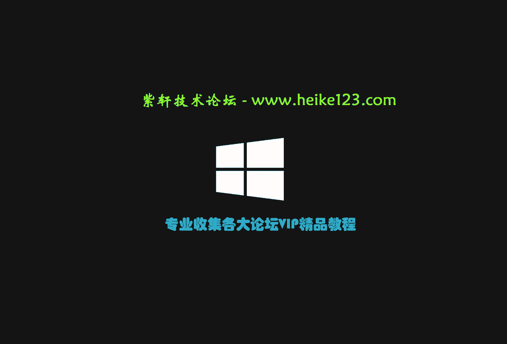
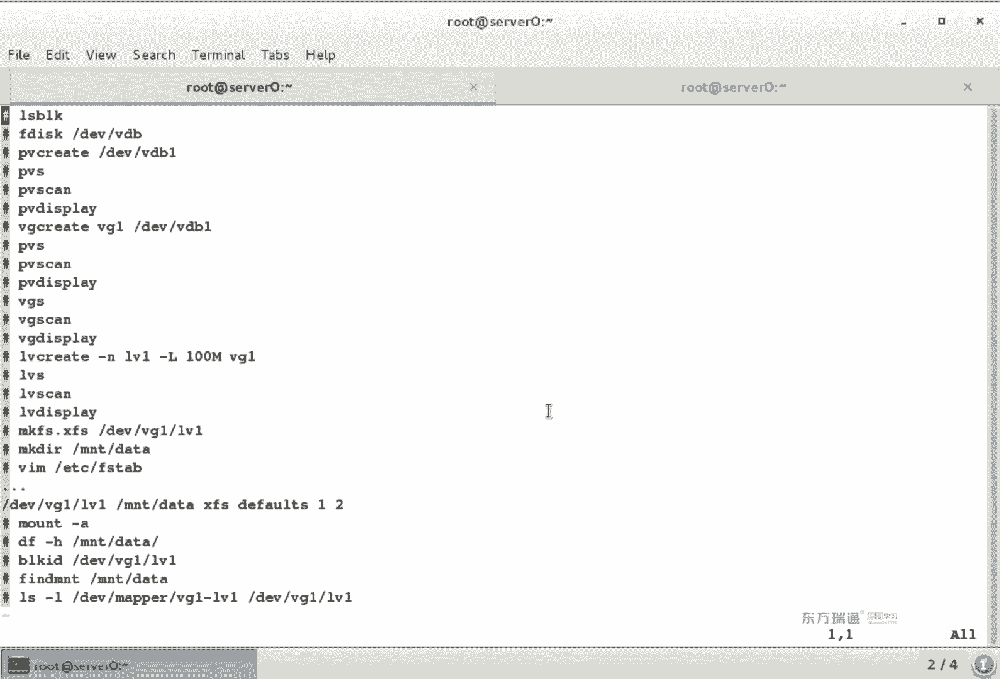
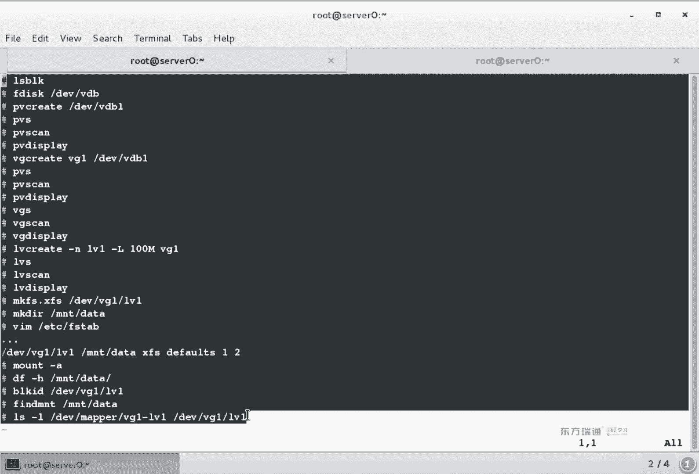
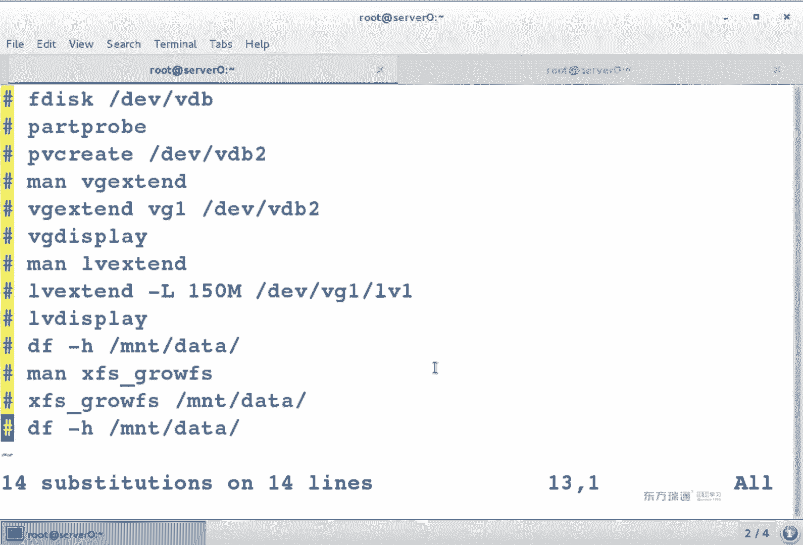
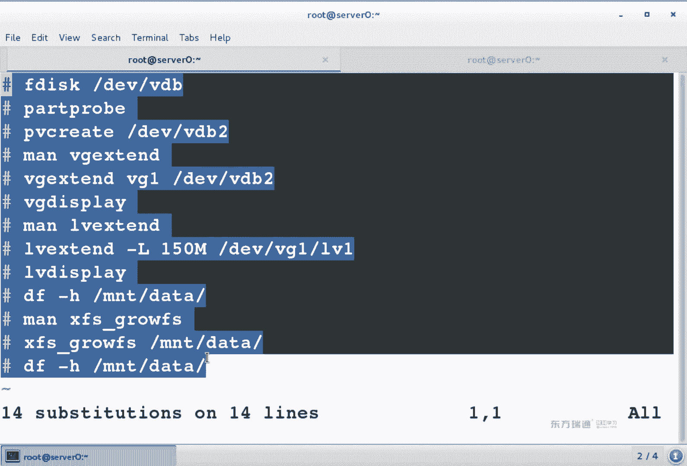
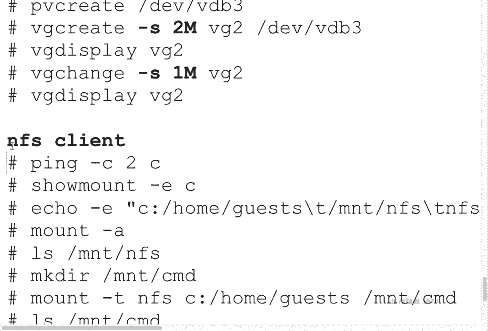
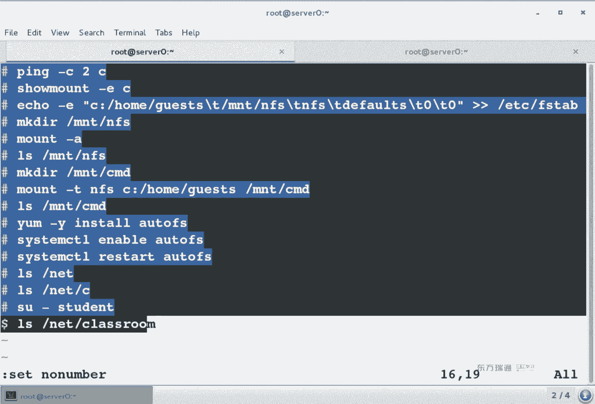
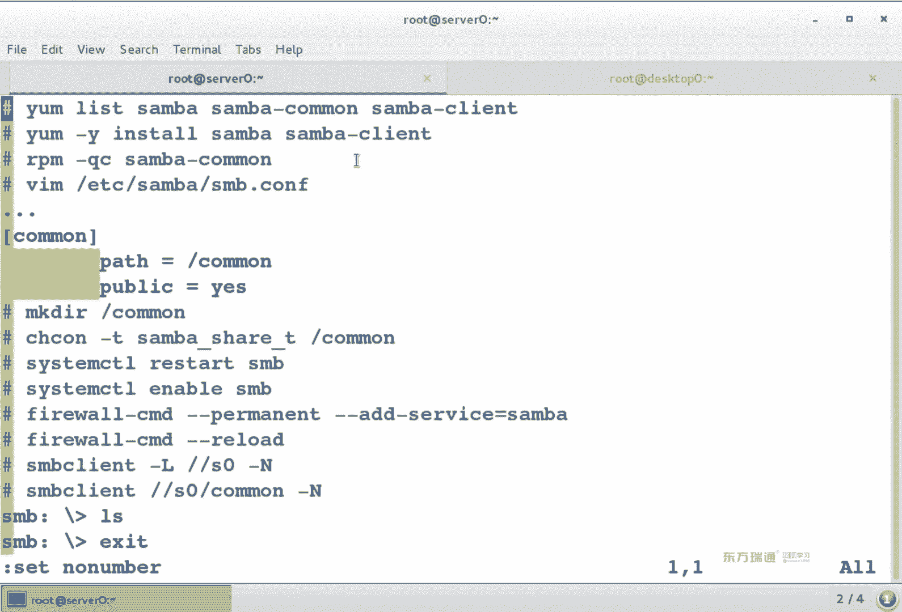
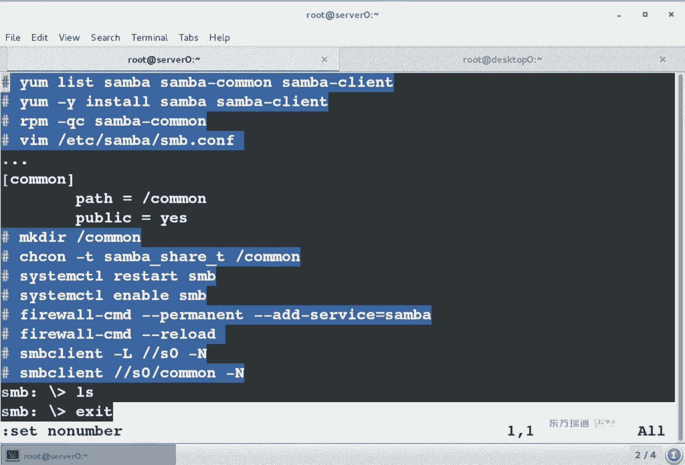
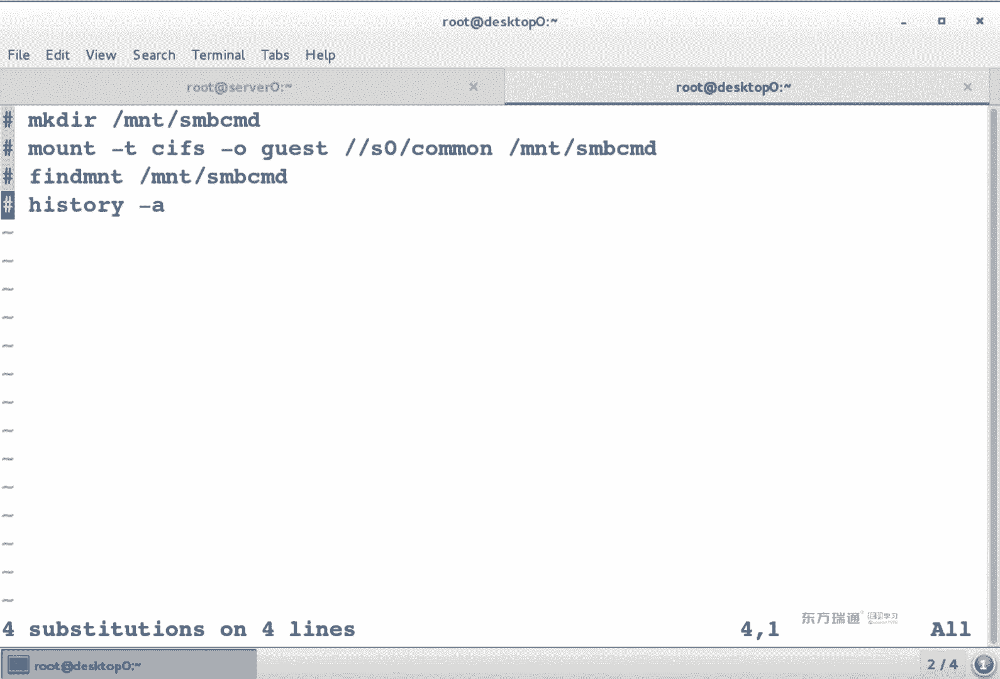

# 红帽RHCE7培训课程：P12：LVM管理与网络文件系统客户端



## 概述
在本节课中，我们将学习Linux系统中的逻辑卷管理（LVM）和网络文件系统客户端的使用。LVM是一种强大的磁盘管理工具，允许我们灵活地管理存储空间。同时，我们也将学习如何作为客户端访问NFS和Samba网络共享。

---

## 回顾：服务配置通用思路
上一节我们介绍了服务配置的通用思路，本节中我们来看看如何将这些思路应用到新的场景中。

配置任何服务时，都可以遵循一个通用的十四步思路，这有助于我们系统地理解和操作。

以下是服务配置的通用步骤：
1.  **IP地址**：确保网络连通性。
2.  **主机名**：检查并设置正确的主机名。
3.  **检查软件包**：使用 `rpm -q` 或 `yum list` 检查所需软件包是否安装。
4.  **安装软件包**：如果未安装，则进行安装。
5.  **查找配置文件**：使用 `rpm -qc` 查询软件包的主配置文件和子配置文件位置。
6.  **编辑配置文件**：通常位于 `/etc` 目录下。
7.  **启动/重启服务**：使用 `systemctl start/restart [服务名]`。
8.  **设置开机自启**：使用 `systemctl enable [服务名]`。
9.  **配置防火墙**：永久添加服务或端口，然后重新加载。
    ```bash
    firewall-cmd --permanent --add-service=[服务名]
    firewall-cmd --reload
    ```
10. **配置SELinux**：根据服务需要，设置文件上下文、布尔值或端口标签。
11. **文件系统权限**：使用 `chmod`, `chown`, `setfacl` 设置文件和目录权限。
12. **服务自身权限**：通常在服务的配置文件中设置访问控制。
13. **本地测试**：在服务器本地验证服务是否正常工作。
14. **远程测试**：从网络上的其他客户端进行访问测试。

这十四步涵盖了配置服务时需要考虑的主要方面，包括网络、软件、配置、权限和安全。

---

## LVM逻辑卷管理器 🔧

### LVM的作用
上一节我们回顾了基础磁盘分区，本节中我们来看看更灵活的磁盘管理方案——LVM。

LVM（Logical Volume Manager）的主要作用是将多个物理磁盘或分区在逻辑上组合成一个大容量的“卷组”，然后可以在这个大池子里灵活地划分“逻辑卷”。它支持**在线扩容**，即在不中断服务的情况下增加存储空间，这是其核心优势。

### LVM核心概念
理解LVM，需要掌握三个核心概念及其关系：

*   **PV（Physical Volume，物理卷）**：可以是整块硬盘（如 `/dev/sdb`），也可以是硬盘上的一个分区（如 `/dev/sdb1`）。它是LVM管理的基本存储块。
*   **VG（Volume Group，卷组）**：由一个或多个PV组成。可以把它想象成由多块“盘片”（PV）组成的一块“大硬盘”。
*   **LV（Logical Volume，逻辑卷）**：从VG中划分出来的逻辑分区。最终我们需要格式化和挂载使用的就是LV。

它们的关系是：**多个PV组成一个VG，从一个VG中可以划分出多个LV**。

**PE（Physical Extent）**：是VG中的最小存储单元，类似于文件系统的“块”。默认大小为4MB。数据在VG中以PE为单位进行存储和移动。

### LVM创建实验 🛠️
下面，我们通过一个实验来演示如何创建和使用LVM。

实验目标：使用一个200MB的分区，创建卷组并划分一个100MB的逻辑卷。

以下是创建LVM的具体步骤：
1.  **准备分区**：使用 `fdisk` 或 `gdisk` 创建一个新分区（例如 `/dev/vdb1`），大小200MB。建议将分区类型更改为 `8e` (Linux LVM)。
    ```bash
    fdisk /dev/vdb
    # 在fdisk中：n (新建), p (主分区), 1 (分区号), 回车 (起始扇区), +200M (大小), t (更改类型), 8e (LVM类型), w (保存)
    ```
2.  **创建物理卷（PV）**：将分区初始化为物理卷。
    ```bash
    pvcreate /dev/vdb1
    ```
3.  **创建卷组（VG）**：创建一个名为 `vg1` 的卷组，并将物理卷加入。
    ```bash
    vgcreate vg1 /dev/vdb1
    ```
4.  **创建逻辑卷（LV）**：在卷组 `vg1` 中创建一个名为 `lv1`、大小为100MB的逻辑卷。
    ```bash
    lvcreate -n lv1 -L 100M vg1
    ```
5.  **格式化逻辑卷**：将逻辑卷格式化为所需的文件系统（如XFS）。
    ```bash
    mkfs.xfs /dev/vg1/lv1
    ```
6.  **挂载使用**：创建挂载点，编辑 `/etc/fstab` 实现永久挂载，然后立即挂载。
    ```bash
    mkdir /mnt/lvm_test
    echo "/dev/vg1/lv1 /mnt/lvm_test xfs defaults 0 0" >> /etc/fstab
    mount -a
    ```
7.  **验证**：使用 `df -h` 或 `lsblk` 命令确认挂载成功。

**关键点**：我们格式化和挂载的对象是**逻辑卷**（`/dev/vg1/lv1`），而不是物理卷或分区。





---

## LVM扩容实验 📈
LVM最常用的功能之一就是在线扩容。现在，假设我们的逻辑卷空间不足，需要扩容。

上一节我们创建了一个LVM，本节中我们来看看如何对它进行扩容。





实验目标：为刚才创建的 `lv1` 逻辑卷增加50MB空间。

以下是LVM扩容的具体步骤：
1.  **准备新的物理空间**：首先需要有空闲空间。可以给VG添加新的PV。
    *   **创建新分区**：再分出一个300MB的分区 `/dev/vdb2`，类型为 `8e`。
        ```bash
        fdisk /dev/vdb # 创建 /dev/vdb2
        ```
    *   **创建新PV**：
        ```bash
        pvcreate /dev/vdb2
        ```
2.  **扩展卷组（VG）**：将新的PV加入到现有的卷组 `vg1` 中。
    ```bash
    vgextend vg1 /dev/vdb2
    ```
3.  **扩展逻辑卷（LV）**：将逻辑卷 `lv1` 的大小扩展到150MB。
    ```bash
    lvextend -L 150M /dev/vg1/lv1
    # 或者使用增量方式：lvextend -L +50M /dev/vg1/lv1
    ```
4.  **扩展文件系统**：**这一步至关重要！** `lvextend` 只扩展了LV的“容器”大小，里面的文件系统并未变大。需要针对不同的文件系统使用特定命令使其生效。
    *   **对于XFS文件系统**：
        ```bash
        xfs_growfs /mnt/lvm_test
        ```
    *   **对于ext4文件系统**：
        ```bash
        resize2fs /dev/vg1/lv1
        ```
5.  **验证**：使用 `df -h` 查看，确认 `/mnt/lvm_test` 的可用空间已变为150MB左右。

---

## LVM移除与减容 ⚠️
上一节我们进行了扩容，本节中我们简要了解如何安全地移除组件。**减容操作有数据丢失风险，需谨慎。**

如果需要移除一块硬盘（PV），应确保其上的数据（PE）已被移走。
1.  **移动数据**：将目标PV（如 `/dev/vdb1`）上的所有PE移动到卷组中的其他PV上。
    ```bash
    pvmove /dev/vdb1
    ```
2.  **从卷组中移除PV**：确认数据移走后，将PV从卷组中移除。
    ```bash
    vgreduce vg1 /dev/vdb1
    ```
3.  **删除物理卷**：
    ```bash
    pvremove /dev/vdb1
    ```

**删除整个LVM的逆序**：卸载 (`umount`) -> 删除 `/etc/fstab` 中的配置 -> 删除LV (`lvremove`) -> 删除VG (`vgremove`) -> 删除PV (`pvremove`)。

---

## 网络文件系统客户端 🌐

### NFS客户端
NFS（Network File System）允许在网络上共享目录。作为客户端，访问NFS共享有三种方式。

以下是访问NFS共享的几种方法：
1.  **手动挂载（临时）**：使用 `mount` 命令，重启后失效。
    ```bash
    mount -t nfs classroom.example.com:/home/guests /mnt/nfs
    ```
2.  **自动挂载（永久）**：编辑 `/etc/fstab` 文件，实现开机自动挂载。
    ```bash
    echo "classroom.example.com:/home/guests /mnt/nfs nfs defaults 0 0" >> /etc/fstab
    mount -a # 立即生效
    ```
3.  **自动挂载（按需）**：使用 `autofs` 服务。当访问挂载点目录时自动挂载，一段时间不用后自动卸载。
    *   安装软件包：`yum install autofs`
    *   配置主映射文件 `/etc/auto.master` 和直接映射文件（如 `/etc/auto.nfs`）。
    *   启动服务：`systemctl enable --now autofs`

**注意**：`mount` 命令和修改 `/etc/fstab` 需要root权限，而 `autofs` 配置好后，普通用户也可以触发挂载。





### Samba（CIFS）客户端
Samba实现了与Windows系统共享文件（使用SMB/CIFS协议）。Linux客户端访问Samba共享也需要安装相应软件包。

以下是访问Samba共享的步骤：
1.  **安装客户端软件包**：
    ```bash
    yum install cifs-utils samba-client
    ```
2.  **查看共享**：查看服务器 `server0` 上提供了哪些共享。
    ```bash
    smbclient -L server0 -N
    ```
3.  **访问共享（临时）**：使用 `smbclient` 以交互模式访问（类似FTP），或使用 `mount` 挂载到本地目录。
    *   交互式访问：
        ```bash
        smbclient //server0/share_name -N
        ```
    *   挂载访问（匿名）：
        ```bash
        mount -t cifs -o guest //server0/share_name /mnt/smb
        ```
4.  **自动挂载（永久）**：在 `/etc/fstab` 中添加一行。`guest` 选项表示匿名访问。
    ```bash
    echo "//server0/share_name /mnt/smb cifs defaults,guest 0 0" >> /etc/fstab
    mount -a
    ```

---





## 总结
本节课中我们一起学习了两个重要的系统管理技能：

1.  **LVM逻辑卷管理**：我们理解了PV、VG、LV的核心概念，掌握了创建LVM、在线扩容逻辑卷以及安全移除物理卷的操作方法。LVM的灵活性使其成为管理服务器存储的理想选择。
2.  **网络文件系统客户端**：我们学习了如何以客户端身份访问NFS和Samba（CIFS）网络共享。掌握了通过手动挂载、`/etc/fstab`永久挂载以及`autofs`按需挂载三种方式来使用网络存储资源。



通过将新服务的配置套入“十四步”通用思路，并理解LVM的层次化模型，可以更系统、更轻松地应对各种系统管理和存储配置任务。