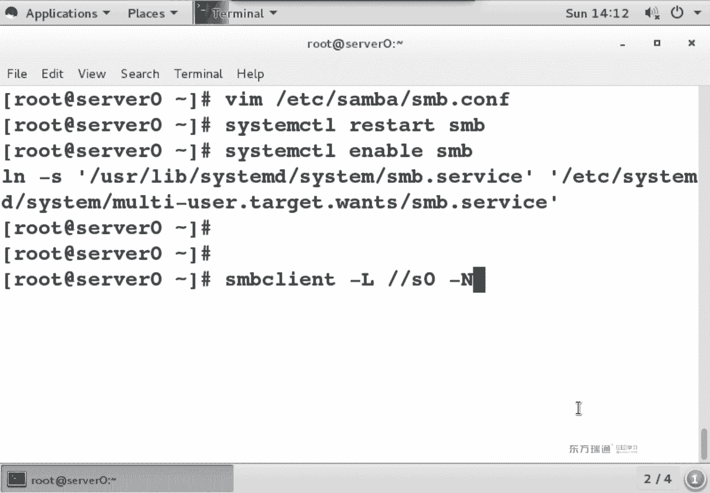
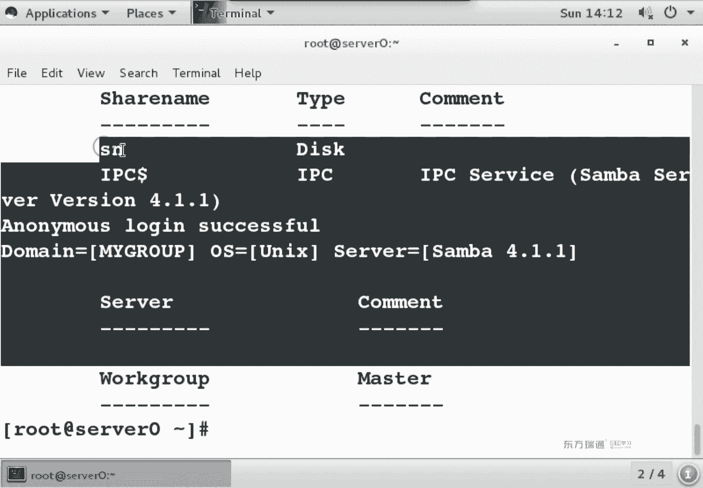
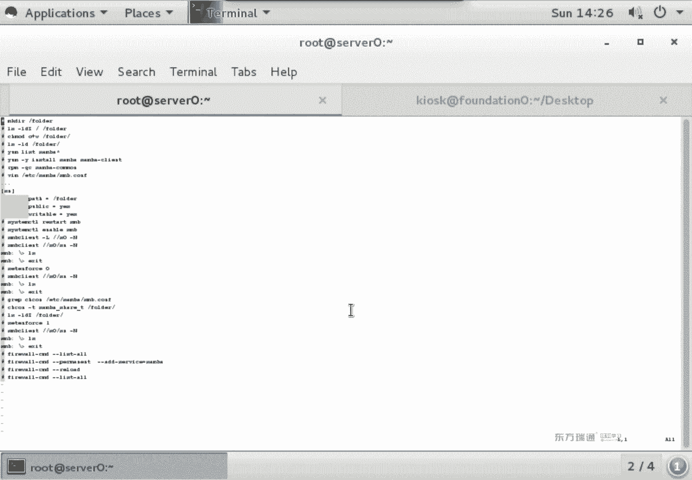
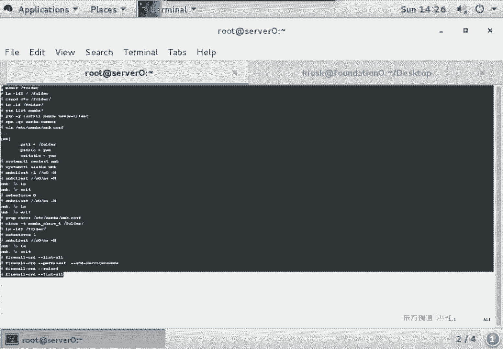
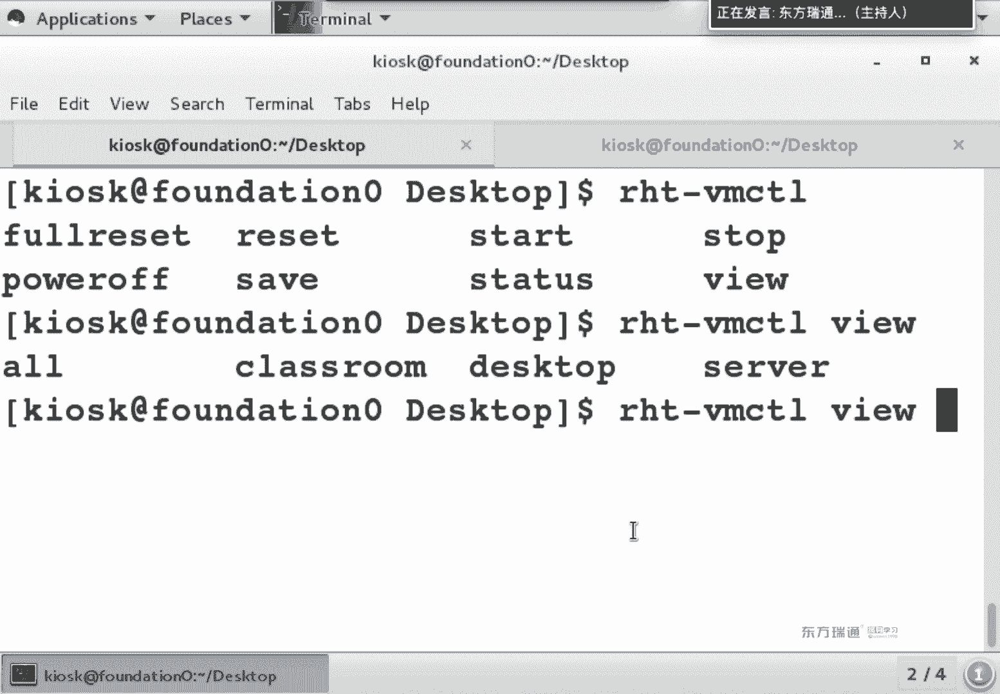
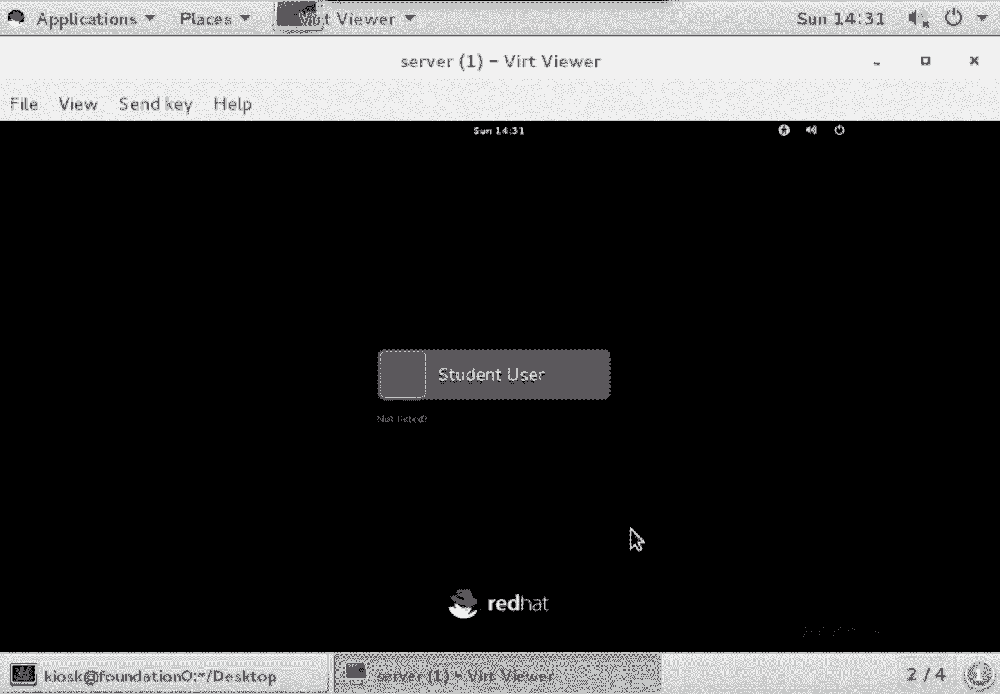
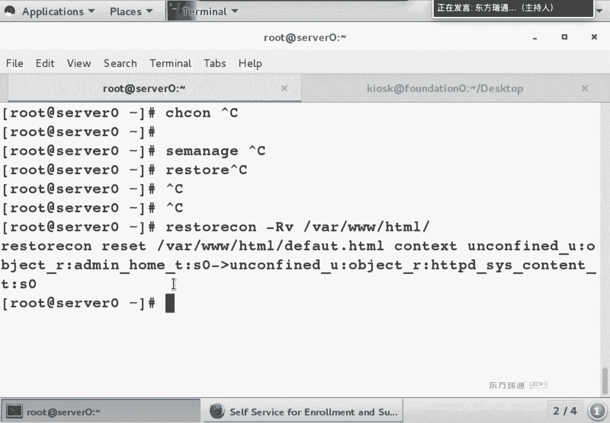

# 红帽Redhat RHCE7培训课程+RCHE7实战参考教程+红帽8.0教材电子版+模拟环境及辅导 - P13：7 - 16688888 - BV1zu41197p6

我们继续刚才的内容。S一类那个是他和。或值有关。它还和上下文关系有关啊，和文件系统上下文关系。那下面呢我们来看一个上什么关系的。私例啊，帮大家理解。我们在上午的时候呢，提到了说红色的这个呢叫做类型。

从箭头指的这个叫做类型，它代表是类型。呃，一般情况下，文件的user row，还有security level是相同的，不需要修改，但是tap类型不同，需要修改。下面给大家举个示例。

这个事例呢我们用散把符给大家举例子。首先说一下三八伏的作用啊，简单来说就是共享。简单来说，这个无下。我们在上午的时候呢做了这样的示例。当你新创建一个文件的时候，这个文件是不是要继承父目录的上核关系啊？

这个没问题吧，但是有个比较特别的。跟。盖目录。Yeah。大家看一下。真木的的类型是啥？root是吧，root类型根类型。那么我们上午的时候啊，是不是在这个里面还创建了一个foer文件夹啊？啊。

这个我刚刚网卡没了是吧，掉线了。全发现一个。まか。大家看一下，你在顶级目录，像根下面创建的文件夹，我们把它叫顶级目录，在根下面创建吧。顶级目录，它的上面关系类型继承吗？是不不一样啊？正常情况下。

我在ETC也好，VR也好，不管在哪个目录下创建，是不是都记成，顶级目录不继成。那么在考试的时候啊，会专门有这么一道题，要求你做一个共享，而这个共享呢要求就是顶级目录。那么这道题有一个知识点。

考的就是上下边关系。上下文关系不对，所以怎么样呢？访问不了啊，那下面我们来做一个共享服务。在配置服务的时候，首先是我亚姆丽的茶包啊。3八大包就是3八开头的。你三把星就行。如果你亚么不好用的话呀。

肯定是亚么源出问题了是吧？在我们当前培训环境中，亚木言如果出问题了，就是classroom上啊没有把foition的conend的共享挂载成功。这个你要要么类似的有问题的话。

去classroom上冒个杠A一下。骂他是什么作用啊？挂载命令是吧，曼达杠A是指将FI table当中已存在的。设备立即挂载，没有挂载成功的，立即挂载。我们在后面讲分区实验的时候。

基本上每个实验都要骂他干一遍立即生效。O。😊，下面我们要装几个包，这个呢是上班的服务器端。这个是上巴的客户端。这个是30的主件，我们需要用到三个包啊，需要用到三个包。既然有两个包没有装。

说把这两个包装上了。饭吧。上吧烂。抓好了之后。我们跟平时做的实验相同，依然要考虑四个权限吧。你只要是敢做共享，那么就要考虑这四个权限。我们在跟下面创建了个foer文件夹，我想将foer文件夹共享。

大家想我共享给别人之后，我想让任意一个人可以在里面有写权限。本地文件系统都有什么权限吧？得有写吧，是不阿道都有写。线条帽子O加上W。本地文件系统权限。OK吧，在第一个要考虑的本地文件系统权限。然后呢。

我们要考虑服务的权限，服务的权限是不是都在配置文件里啊？RPM杠QC我们来查询一下它的配置文件。common包当中common叫主件包，这个包里面呢包含它的配置文件。

我们可以看到是不是有带confi样的文件，这个是smer的配置文件。编辑。上班配人家进来之后啊，你会发现有好多哈。什么叫好多呀？商么好多。大G跳到最后一行。这个文件多少？300多。大家从312开始看啊。

312、313是不是两个型号？井号入释，我们知道，那我们会发现下面是不是好多分号。在sber的配置文件中有两种注释符务，井号和分号，两个都是注释。它俩的区别是什么呢？井号注释全是说明它是不是出了一堆呀？

分号注是都是开关，你把分号一删，这行就生效了。从314到320，这一组它是一个共享。换句话说是给我们提供的一个示例。如果你要做一个共享，按照他的模式做一份出来，就出了一个共享。那我们来举个例子。

方块当中叫什么呢？方块当中叫共享名。叫公海名s our name，我给它缩写起名叫SN，可以吧？这个叫共享名。那你既然是要做共享的话，是不是必须要指明个路径啊，把谁共享，你看上面哪个像路径。Pass。

录径必须写绝对录径。决斗罗镜都是以什么开头？跟开头。有同学经常问我的问题是说，老师，你等号写号到底有没有空格？一句话入乡随俗啊，什么叫入乡随俗啊？你现在是不是在配三八伏呢？3八伏等号前后有空格没？有吧。

然后当你配邮件服务的时候，你会发现邮件服务有好多等号型号都没有空格，那么就没有空格。能理解吧，到底有还没有都不是绝对的。我不知道你推荐哪个服务。😡，就一句话，入乡随俗，他是有空格，我就有空格，他没空格。

我就没空格，肯定对，能理解吧？O。😊，当然了，实验做成功之后，你会发现空格山雷好用啊，山雷好用。但是你要知道这个思路啊，我们大体的思路是什么啊，把思路掌握学习很容易。O。那下面我要做服务的权限。

你看下面这一堆哪个项服务的权限。p like等意思是啥意思？你在做一个共享的时候，是不是得说谁能访问呢？帕布雷克什么意思？公共的在中国有个很著名的卫生间叫WC是吧？啊，但后来呢中国加入WTO之后。

你会发现卫生间是不全改名了。不叫WC了，为什么？😡，中国加入WTO之后有两个变化。第一个变化就是上超市的缩道收费。第二个变化就是厕所改名啊。还有个变化就是上银行，你去排号去领个号，可以坐着等啊。

不用站着等啊，有三个变化啊，WTOWTO是啥呀？世贸是吧？嗯就中国到了一个国际上的舞台，是这意思。O。那如果我说公共卫生间的话，是不是都能用啊？那如果我说这个温夹公共都可以来使用。是不所有人都能发了。

任意人都方发问。那匿名火时被能放了？Pブレ yes。这个是说谁能访问，说没说谁能写呀。你看上面是不是有这么一个词儿，叫right table。reable是说能写吗？他说谁能写啊？能访问的人都能写。

能访问的人都能写。现在我们来看一个环境哈，当你访问一个文件服务器的时候，首先呢是不是要先过防火墙？防火钱过了之后。那么你是不是要先要用服务的权限往里写？服务的权限过了之后，是不是要走到文件系统写的权限？

是不是要走这三个权限，1233个权限吧，而且在三个权限当中，是不是都有SElin的影子呀？SElin不一定在哪限制。在散八这个实验当中呢，它会在文件系统上多了一个上下文关系。O。😊，写这三行就得了哈。

😊，那right list的是什么意思呀？就这个人这个组有写权限。那我这个right table是说能访问的人都能写，而你写的是说都能访问，是不是叫都能写啊？这个是权限，这叫服务的权限。能看懂吧？

不同的服务服务的权限是不是各不相同？看情况啊，那我们上天啊往上面去找，看上面还有那么一句话。大家去查一个词儿叫CHCUN。叫change context，这个是条命令。我们看37行，从37行看开始看。

他说用LS杠LBZ唉，这个命令我用过是吧，是不是看这个文件夹，它的生方关系啊，它可以列出上关关系。然后呢，再再往上。我们从这开始看哈，32行，如果你创建了一个新的文件夹。放多算新文件夹吧。

刚刚没肯电样的。并且它是一个顶级文件夹。什么叫顶级文件夹啊？在根下面创建叫顶级文件夹。那么顶级文件夹它上面关系默认是不是叫defa t类型啊？得放到T类型。上班访问不了。三8能仿吗哪种类型的？这个类型。

所以说如果你敢在顶级目录下创建一个文件夹，你必须要去用3把32T这个类型更改。label labelbel什么意思呀？label就说你要把它上面关系给改掉。那不用去。改的类型有哪些呢？系统自带的文件夹。

看到没？跟ETC跟home是不是系统自带的？OK然后往下瞅，他说如果你要改的话，可以用这个名令。channge the context杠是T。改类型了。382T，然后哪个文件夹。能看懂吧？

他说应该这么改，我先不改给你们看现象OK吧。你看过现象了之后，等下次呢你闭眼家SE没动。然后你看这现象，你就会想到哎，有个上下边关系没改。Okay。有这么个事儿哈，先想着。配置文件改完之后要干嘛？😊。

重启服务是吧？是不是要开机自动启动啊？你那包。呃。然后是不是可以测试了？防火墙和SE类那个是咱是不是还没动呢？先不管哈，本地说事先不用管38cl，我们有调命令。😊，这条命令的功能是查看功西。查看过下。

杠了。乐是列出共享。那时候哪台机器上的功享吗？是不是S0这台机器呀，大家会发现我用的是什么杠。正斜杠是吧，为啥不用反斜杠？😡，在L尼4试一下反斜杠有什么样的作用。转移还有呢。手动换行是吧。

两个反斜杠用过没？是不转移转移啊。双节棍双节棍。就为了双节棍。这个。有些时候啊必须得用双截棍的。比如说你在慢手册当中去查一个减号，你过滤的不是减不是减号啊。啊，不是杠，不是选项。

要用两个反斜杠给它转移转移OK那么在后面呢，我们再加一个选项叫做N，叫做no password啊，no password它代表的含义是说，我在访问这个共享的时候，不用账号密密码，是不是就匿名身份呢？

匿名神神法问的用的就是杠N。

能看到共享名吗？

看到没？刚刚写的共享明书叫sha日 name。简析简称SN。那我当前的身份是谁呀？这个就是告呢没有账号密密码，那就匿名身份。能看到共享吧。O。38planant。好把这条命的放在这哈，做一下对比。😊。

现在依然用这条命令S连杠SN哎呀，这名起来杠摸这条命令什么作用？我还。😮，用匿名身份访问S0上SN共享。S0是主机名，SN是不是共享名啊，是 name。成功没？成功了LS。看到没？

这个是谁引起的上下文关系。正常情况下，如果你没有上下边关系的话，它不这样。为了确认我们怎么来确认呢？咱是不是有个命令叫get。欢迎ss啊。现在这不in。我想判断是不是他的问题。

我可不可以临时的把它给关闭呀？可以吧。临时关闭了之后，我再次来三把卡。LS正常。那肯定是SElin事儿，对吧？而SElinux就三个事儿，上下关系不值。嗯，还有个什么来着？还有跟防火箱有关的内容是吧？

端口有关的那这个肯定跟端口无关的。你用命令来访问这个服务，用的是一个相同的端口吧。两次用的相同端口。跟布尔机有关吗？跟上边关系有关吗？跟布值也没有关系，要是跟布值有关系的话。😡，你用V娅。在这儿能看到。

有没有什么改不稳值的提示？没有，那就剩什么了，上下边关系啊，上下边关系OK那么你既然跟上边关系有关的话。然后我们就回忆了一下啊，在配置文件中有个叫chan context的命令吧。

CHCON啊CH是确认能力。30的卫生件。看到这条没？好的。上边关系改完了之后啊，你是不是可以确认一下？是不是变成了3837呀？不道。然后。这个是永久生效还是立即生效？我们在定义的时候说立即生效啊。

现在是不是生效了，你重启之后它还是这样，是不是叫永久生效？😡，是。这个注意哈，它确实叫立即生效，永久生效。但是。你别做touch跟点auto enable的操作。为什么？

你再做touch跟点推label，它是不是跟默认数据库当中的值重新relabel啊？能理解吧？但是你这个没有写数据库的操作，你只是把它的权限给改。如果你永远不做touch跟点腿lebel。

它确实要立即生效，永久生效能理解吧？确实没问题。但是你要敢踏实跟点凹tole的话，你会发现它又变成 default操贴了。他就又变成对方的题了。所以说这个东西到底叫不叫立即生效，永久生效啊。啊。

确实叫啊，因为我们定义的时候是指你做完了之后已经生效了，重启之后还生效啊。但是跟数据库有关，那个我们一会儿还会再来介绍啊，用另外一种方式怎么来改。呃，这步呢做完了之后，我们再次来确认。上巴克兰。LS。

看区别了吧。哎，不对呀，我们是不是还有个叫。S一类那个是它得关开开呀。你否是一。现在由于放生了吧，这回再次伤疤卡烂。是不正常了。OK这是上边关系怎么来解决？あそ。如果你要通过网络来访问的话。

Cttrol shift T。半八可拉。刚乐。S0杠6。哎，在说啥？嗯，主机不可达，安reable。防火箱没开。能看懂吧？本地访问好用，远程访问不好用，那就是防火墙的事。如果你这边本地能访问。

远程访问不了，就去看防火墙。那我们就帮好小孩去扫了一眼。有上班吗？没有。啊，因为我刚刚resite了，那FTP是不是都没了？你如果是接着上午的时间再做的话，这个位置应该还有个FTP啊。我刚刚是网卡。

网卡获得不了IP了，所以我重启了一下。换句话说，这个虚拟机给resite了一下。OK啊，防火墙怎么弄？😊，Pmanent。这条们一定是改配置文件。能理解吧。既然是改配置文件，这条命令是不是永久生效？

我们这个服务叫上0，那是写SAMB呢，还是写SMB呢？不知道的时候敲一个字母，推不见。你在启动服务的时候，是不是用的SMB？那么你在防火墙当中，防火墙的作者呀和那个散八夫作者这俩人。能听懂吧？

防火墙作者说啊，你这个服务就叫SAMBA。这是防火墙上作者的定义，你那个服务作者的定义是不是叫SMB呀啊，它俩的区别啊，就到底用什么呢？我也不知道，你也不用知道会tableable见就行。S推落电。

敲着敲着习惯了就知道啊，就是敲散吧。永久生效之后，我们用fwork among。然后嘞。买漏的。重新载入，让它立即生效。再次来确认。有。有了吧，回到客户端foition。是不是可以看过下了？嗯。

这个叫查看共享。这套命令请大家熟练使用哈。谁在使用你们在后面做实验的时候，好多同学经常问我说哎，老师这个东西怎么排错？你不要先考虑说最终要怎么来使用一个服务配完了之后，你首先要本地测试。

然后网络测试都好用了之后，你再要考虑什么映射网络驱动器的操作。能理解吧，先确认该服可用，再用射网络驱动器。那么我要来访问它的SN。都正常吧，明白你是不是想有写权限啊？😡，破。啊。啊，随便传个文件吧。

这这是在哪？啊是T。桌面是吧。啊，那么换个路径LCD是切换local change对本地路径。这本地不让切换了。为啥呀？因为你是谁？Kos的普通用户是吧，你去不了过他他家。那得了，那咱就吐它吧。

有啥传啥吧。😡，20T6。和拉丝肉。让传吗？看到速率没？传不了的话，苏率是0。能理解吧。好，确认全成功了。阿拉斯瞅一眼。点是当前目录，点点是上前目录，是不是多了个文件？如果你还不确认的话。

回到服务梯端LS folder。OK吧。这个文件是啥呢？这个文件就是。他。哎，刚刚是带是套白色啊。啊卡拉斯路。啊，原来选项是C是吧，是它这个是个快捷方式啊。这时间看懂了吗？嗯，OK我们把这个时间补全。

😊，现在呢我去干一个事儿。啊，我先把这个。你一性也靠得出来是吧？创建文件夹。喂。我们创建了一个文件夹，然后确认跟文件夹和顶击文件夹它载的区别没有继承上面关系。这第一个你要知道知识点。

然后我们又做了一个操作。我想讲我想将跟下面foto文件夹共享。那么你需要来创建创建个文件夹。我还想让匿名用户有写权限，是不是应该亲自mododeO加W啊？本地的权限。本地的权限。呃，在做完了之后呢。

我们要装扫巴服务查询包。38有三个包，3838common38卡。看门包已经装完了啊，就下面这三个包哈，这三个包。三包抗门包装完了，你把另外两个包给装上，装完了之后是不是来查它的配置文件了。

查到了配置文件。在配置文件当中，大G光标跳到最后一行。跳到最后一行之后干什么呢？我们是不是添了几行啊，咱添了几行。😊，共享pass权限play4哈。上行是吧。这个冒号啊叹号是干嘛的？写入。前单来到。

把后面这条命令执行的结果读进来吧。嗯。是不是写下来了？你在作为共享的时候啊，就有这么几项。第一个这不边有共享名吗？方括当中叫公享名，什么叫公享名啊？就是通过网络路径访问的。

杠杠网络路径来访问的共享名pass呢叫本地路径，将谁共享，必须是绝对路径哈，共享使用的永远都是绝对路径。不管是什么共享，sm也好，NFS也好，FTP也好，写到永远都绝对路径。巴布雷克代表说共享给谁？

任意这个anyone anyoneevery。Arightable代表是说能访问的人具有了权限。配置文件改完了之后，是不是要服务重启，开机自动启动啊？服务的权限也改完了，本地文件系统也改完了。

那么我们下面是不是可以测试？😊，38卡烂的杠L，这个叫查看功效。第十七行这个叫访问共享。登录成功之后，你L发现哎有权限看内容吗？没有。啊，没有。没有权限退出。没有权员退出啊，你赛他 in放0。

是不是临时关闭了S一类那个是关闭了之后呢，你再次来访问。能看到了吗？有权限了吧，有权限了。那做到这步是不是能确认是SElinux事儿啊？我们在配置文件当中。我们在配置文件当中。

是不是有一行说chan contextt？那我可以过滤这行，然后呢按照它的提示更改它的上边关系。改完了之后确认。讲完了之后确认，然后呢。再把SE learning是。是不是再给开开呀嗯再给开开。

这回你再来确认的时候。哎，是不是能反问共享了？现在本地来访问是不是都正常了？本地法官就都正常，都正常之后呢，你是不是想其他人也能正常使用，跟防火墙有关？开了。让他永久生效，立即生效。生效完了之后呢。

你去客户端。再来一访问OK实验完成。

这组实际验讲的是上下轮关系。F context。那么在RSRC1下午的考试当中啊。会考一个散八实验啊，考两个算八实验，这个是其中一个考点，上下文关系啊。提到散半服务要记得上下文关系。

那下面呢我们来做额外一个实验，帮大家理解。呃，我把这个时间补全哈，还差一步。回到方备身上。刚刚前面这一堆操作是在哪干的呀？知道啊。刷完弄完之后去纺队身上，纺对上是不是也可以三把卡烂他？如我はな。

登录了之后。LS你会发现里面啥文件都没有。没有的话，我是不是可以上成的文件？可以吧？put可以put上传个文件。呃。我们那个是用普通用户身份登录的。普通用户身份登录的话是一个R开头的是吧？

一会儿你们做测试的时候呢，用管理员登录。因为在管理员的主目录下，是不是有个A开头的文件呢？啊，那躺糖是吧？啊那烫的。能上传吧？能上传了之后，你是不是可以回到服务器上？或者说我不回服务器。

我直接在这个位置。SSH root特。S0。俺来是。Al拉斯根faer。也行吧。也可以呀。O。那下一个实验主要想来说明的是CHCN和SEmanre context它们的区别。现在我干一个事儿。

我们以前是不是做过一个叫touch跟点autore。等一下吧。好，我依然是干一个这么个事儿。他退得。干完了之后呢，你去确认一下根和fader文件夹。现在我们看它的上面关系类型是不是38127呀？OK吧。

然后做一下磁盘同步重启。重启之后你就会发现唉上一边关系变了。这个实验讲的是CHCON。他和。As see manager。F complex。他们的区别。那么。我们在soer上干了一个事儿。

阿莱斯杠嗯他。跟点儿凹凸reable。呃，这是EL还是LE？ELEL开头L结尾是吧？O。然后呢，确认一下。根和根foder。没有变化是吧，原来什么样，现在还什么样，然后呢，坐下来磁盘同步。把系统重启。

系统会重启几遍呢？好，现。两遍是吧，如果你想看系统重启的过程。我们可不可以在这个位置？20TVM control。RHD。VM control。怎没有个6啊。有吧，有啥。

咱们现在弄是不是搜er不用搜网。哎，已经充启完了是吧，这机器快看不着启动过程。

挺好。行你要想看的话呀，敲命令是不是也行啊？用这套命令和双击桌面上那个快捷方式，结果是相同的。好吧。你这边重启了之后，是不是又回到了防备身这台机器呀？反这台这台机器不管什么身份呢都可以看。

如果你是刚刚执行重启，你再来看会发现它重启两遍。O。😊，再次来登录。240。这不又回到4520了。我们依然执行一下。这条命令。大家会发现。看看类型变没。因为踏实跟点凹腿内部作用是什么呀？

用数据库中的纸把相应的文件夹是不是更改上下边关系类型啊。但是我们没有去设定它默认值，所以类型就变回去了。那怎么办？啊。か。考试的时候，你用chan context可不可以啊？可以吧，为什么呢？

因为这个是下午的题。😡，上午的题是不是单幕调密码，有这个操作呀？touch。那标准的情况下。虽然说上班的配置文件中，建议我们趁着cont对吧？但是标准的情况下，你为了让它保证。

即使你踏实跟点凹 to也能保持默认值的话，那我们建议用这层命的来做SE manage。但是这条命令。太长了，怎么办？看慢手册。ま I see manage。我们在看慢手册的时候啊。

是不是后面没那个金好手敲啊？我忘了怎么写了，怎么了？😡，在用慢手册的时候，建议大家SE manage。命令推不出来了吧。cttrol A。慢控制能看懂吧？如果一个命令很长，就插慢手册的话。

我们都是先敲命令ctrl A再敲慢。这区别啊，防止敲错嗯。在这个里面，我们来查F come。有没有啊？有吧，文件的上一文关系啊，有一堆。有没有实力呀？没看着是吧？没看着。O。这条命令啊。

它有个子命令F context。慢命令查命令子命令的8助。看到没？正常卖命令是不是可以查命令的帮助？好，命令子命令。O。啊，在这篇里边呢，我把字儿稍微变小点啊。😊，这篇里面你往下翻一翻呢。

你会发现它有好多的说明，杠什么是什么含义，杠什么是什么含义，看到 example没？你把他。看到没？看这一行设定上一边关系杠A的作用啊，一会儿你可以去看一下帮助A是添加的意思。添加一个新的数据库。

类型是它哪一个文件夹，下面所有文件定义它的双向关关系。数据库中默认的值定义完了之后干什么呀？恢复为什么要写R啊？你这个文夹下面是不是可能有好多子文件夹？为什么要写V呢？是不是想看一下过程啊，变成了什么。

这个视例能看懂吗？换句话说，这个事例当中是不是出现了几号？看到没？O。如果你不想去里面慢慢看的话，你是不是可以过滤？讲啊。开车。哎，是不是两条命令搞定两条命令搞定。能看到吧。下面有这么多种写法。

建议大家使用第一种。因为第一种写法的话，它包含了这个文件夹和下面的所有文件夹。而你下面这些写法它都包含了。目录。有没有子文件夹的事儿啊？没有啊没有。OK那我们就复制。😊，粘贴。有几个地方要改。

第一个要修改的地方。我们的类型是不是算吧塞尔。P类型啊。如果你想不起来什么类型的话，可不可以再开个中端去看一眼也行吧。我们的文件夹叫什么名？包的。这条命令啊是来创建数据库的时。他是给他是跟点腿类沟用的。

那我现在还不想没事，老to一下，再重启，我怎么让它立即生效啊？没识道吧。好的。你说。大家看没看到谁的值变成了谁。看到这个符号了吗？能看到吧？这个就立即生效，你再touch跟点凹 to label啊。

实际上就告诉系统启动的时候多给我restore context一遍，就干这个事儿。O。😊，我把这段内容给大家整理一下。这一组实验单做完了之后啊，你是不是想再次来确认呢？touch跟点凹凸。

O label。你累播完了之后，是不是还要重洗啊？冲启之前再给大家看一眼。现在是不38十2题？包括。重启之后再次来确认。依然还是382T，不会变成顶号的题了。换句话说。

SE manager F context它代表的功能是不是定义数据库中默认的值啊？但是他不会立即生效，你需要用restore context配合。他俩是一对。他。但是这段命令啊太长了，不容易记。

那么你需要会看他。OK吧。这是。理解CHCON和SEman F context它们区别。他28。还没重写完是吧？那我们看下一个实验。SElin呀，它不仅仅对上下文关系。对文件系统多了一个权限。

上下边关系。没有的话。这个你是不是能想到上班服务啊，说到文件系统，你要想到上班服务啊。好，那么对于布尔值能想要什么服务啊？过了。我们是给大家举个FTP的例子呀。UFTB例了。呃。

考试的时候过者时不需要修改啊，不需要修改，没有啊，哪个时间都不用改，默认时就可以。那么对于方晓强端口的限定，方小强针对的是不是端口？协议和端口。下面我们来看看实例，帮大家理解。大看不还是38127呀。

啊，哎。下面这个实验呢是跟端口有关。防火墙增强的一个内容。看一下。我们用一个服务叫做阿帕奇来举决。阿帕奇的包啊叫做HTTPD。抓完了吗？没装是吧。这个服装完了之后啊，什么都不用改。启动。立即升降。

这服务就偏了，简单吗？在那个词当中服务默认都能直接用啊，默认都能直接用。那现在我去干一个事儿。QC是干嘛的？查配成件，我为什么老去QC呀？😡，现政。lening个4杀基本上啊我们配服务就是改配置文件。

配置文件改完了之后，服务重启生效是吧，都这思路，你知道报名了，QC是不是都能查到配置文件？通信啊。那我们会发现配置件多不多啊，一堆。这个。这个是他的配置文件。

NETC下HTTBDconfigHTTPD点config。我们会发现它的路径啊和我的配置文件名是不是很像啊，差一个符号吧，杠还是点，杠还是点。在这个里面呢插一个词儿叫lace。

42行默认阿帕奇监听的多少号是多少？8零。我现在干一个事儿。我把外部服务改成8089了。能启动吗？我刚刚就干了一个事是吧，改了个端口，服务是不是启动不了了？呃，在linux当中啊，有这么一个功能。

然后有这么一个功能。如果你启用了SElinux，它会限定你这些服务只能使用默认的端口号来使用。如果不在我端口号列表当中，默认不让你启动。能理解吧？不在我的管控范围当中，默认都不让你启动。

我们用下面两条命令，随便用哪条都可以。用这条比较熟而已是吧？一般要给他们的时候都当什么？干了吧。刚乐之后，我们来看这句话，他说甜心拒绝。不能绑定到8089。跟8089有关吧。哎他有没有说怎么解决？没有。

大G跳到最后一行。往上翻。我们刚刚配逆服务了吗？没有，所以说这行你就过，不用勒。咱刚刚是不是改跟端口有关的东西了？哎，8089这词看着很面善呢。刚看你弄的你应该知道是吧？嗯谁弄谁知道。

那我们在这个里面呢，你会发现当AA代表含义是添加。套的那表是端口吧。我在端口列表中添加了一个类型。大写的。大会告诉你说，有这么多类型。看到没？有这么一堆类型。换句话说。

我们现在是不是要用SEMage只port命令？As in manager touch。在这个里面呢，我们先来看下杠A。行这个慢得咁。S， E， manage。好。我们先来看一下杠AA是什么作用。

A是干嘛的？添加顺道扫了一眼吧，这个例子的这个词我老用是吧？咱是不是没事，老LS。历史的代表什么呀？列出既然刚刚在帮助当中。你这条命令。杠A是添加，那杠L是什么呀？列粗吧，看到没？好多吧。

那我们刚刚做的那个服务是什么服务啊？HTTP吧。看到没？那么带80的呢。带80的是不是就这两个类型啊？啊，这是8080吧。换句话说，我们要用的类型是谁呀？我。HDDP泡T类型吧，在他的类型当中。

默认是不是只有这么几种？有没有8089？没有你不在我合规的范围当中，你无法启动。那我们把那个8089的艾添加进来，是不是就OK了？ok。😊，那我们要用的命令啊，是不是就这条？哪个词要改？这个吧大写的。

类型是啥？Thank。HTVP帮口类型。这条命令执行慢不慢？跟ICE的那个是有关的，命令执行动慢。OK做到这步之后呢，我们要继续啊干一个事儿。确认。哎。国虑是吧？

现在我们看这个类型中是不是又添了1个8089啊？这回再次来启龙湖。能启动了吧。可以了吧。呃，要测试怎么测试啊？是不是拿火狐浏览器直接测试就可以。但是。你其他的机器能访问火狐浏览器这个服务吗？发不了啊。

是不是发好啥没改。如果想让别人也能用的话，是不是在firewall。我们今天做了一堆实验呢，都是围绕着四个权限跑来跑去的吧。四个概钱啊。HTTP。OK我们在这个里面呢去访问一下。H是TVP。艾40。

啊啊，8089是吧？啊。冒号8089。有问题啊。哦，有啥问题啊？😮，你现在这个服务是啥？这不会常定。你添单服务没有问题哈，这显示的成功，但是你默认定义的服务是什么端口？80，所以说这个写的是80啊。

那你要开放8089的话，应该咋写？不添服务了，添端口了。啊，填多少了？8089杠TCP。在铁板漆当中。如果你添的这个端口啊比较特别，不是默认的端口，防火墙是不是还有变化呀？别写服务名了，写端口。刷新。

看到没？如果你能看到测试页，说明能访问那个服务。那什么时候会显示测试页呢？是因为我们有一个叫索引页文件不存在。你如果想看到测试的类型的话，hello。这个是默认的路径，跟VR3WATMI。

这个呢是索引页。回过头来，你再刷新一下。嗯。OK吧。试验完成。这都谁要朋们。再讲一个实验，今天就不讲了啊。😊，呀才两两点才3点是吧，再讲一个实验。那我们在之前提到过一个内容，说当你下载了一个文件。

你把这个文件MV移过来的时候，文件是不是会附带它的上下边关系过来啊？这就有问题了。看看例子啊。嗯。我们去class room上。有好多的文件。卡拉斯room不上有没有个叫VT点ATML的文件？

有个这么个文件是吧？OK我把这个文件给下载下来。😊，W get。classasroomBT点HTML。保存了吧。我看一下这个文件，它的上十文关系是啥？看到没？现在我把这个文件MOV移动。

移动到V牙3W1天卖多下。找index。换个名吧给套。加STML。移动过去之后呢。大家看一下这个文件的上面关系跟着过去了吧。但是HTML文件夹，它默认的上面关系什么？说HTDP的类型啊。

ok那现在我们来访问一下。😊，它下面有个叫做以后是吧？点2A0L。那法问吗？不让访问，为什么？没权限，类型不对。记不记得我们做三八服务的时候，那是文件夹没权限吧。不管你是文件夹也好，还是文件也好。

上下边关键类型不对，都仿不了。为什么呢？因为我们在访问外部服务的时候，实际上系统用了一个阿帕奇用户，阿帕奇组的身份。他去跟VR3W下找到那个文件读出来，然后告诉你。但是这个类型不对，它读不了，就这提示。

那怎么让它类型能对呢？改了想咋改了的？没事。怎么改？是用听着 contextt感呢，还是用SC manage F context再restore用哪种方式？有三个选项哈，你们来选。我都不回车哈。

第一档是C是CON。你把类型给改了。第二种呢是SEmanage。然后再re大。在第二个。第三种呢是职接瑞大。为什么？有葱也可选的是第三种哈。没有做SE managerage操作，他直接rese到。

为什么？因为跟VR3WATML啊，是不是我装完包之后，它自动生成的呀，系统已经有他默认值了。所以说你不用IC manager再去定义默认值了，直接re store就可以。我们试一下啊。没知到。

Tongt。威十大。tex然后嘞。R。V呀那是不是这么写就行了。感谢飞牙3WH天M。大家看里面别的文件他都没管是吧，是不是就这个文件管了，因为这个文件上面关系不对。能看懂吧。对于系统自带的文件夹。

它本身有默认石，你不用去定义，直接re store就得啊。我们确认。原来闹的放脑，我这个刷新。有。这个原件名写错没？default点HTML。Devo。呀少个L是吧？哎呀这事儿。调个M。能看到网页了吧。

这时我弄了吧。好，今天你要了解的内容四个权限。来那个字当中不管配什么服务，就记得有4个权限的事儿。四个权限有一个不满足，这个时间都有问题。防火墙水线确定的水啊。内外主机和别人是吧，谁能访问我？

剩下三个权限。文件系统权限是不得给？你是用change mode，change old还是set FACF随便，反正你权限给了就行，这是文件系统的权限。然后呢，服务的权限不同的服务。

它里面配的方法数都不一样。看作者的想法，按作者思路走啊，入乡随俗啊，入乡随俗服务的权限服务的权限做完了之后做什么呀？SE类那个SE类那个是是针对3块都有是吧？到底是什么，我也不知道你配的服务。

因为每个人配的服务可能都不一样，你到底改什么，看提示，看服务的状态，看日志。OK吧。服务状态看日，如果都没提示的话，肯定是上下班关系。或者说最简单的方式，我临时的把SElin给关了再测试。一下好用了。

是不是就S一类那个事儿啊？RRClin就这3块。今天就这些内容。

