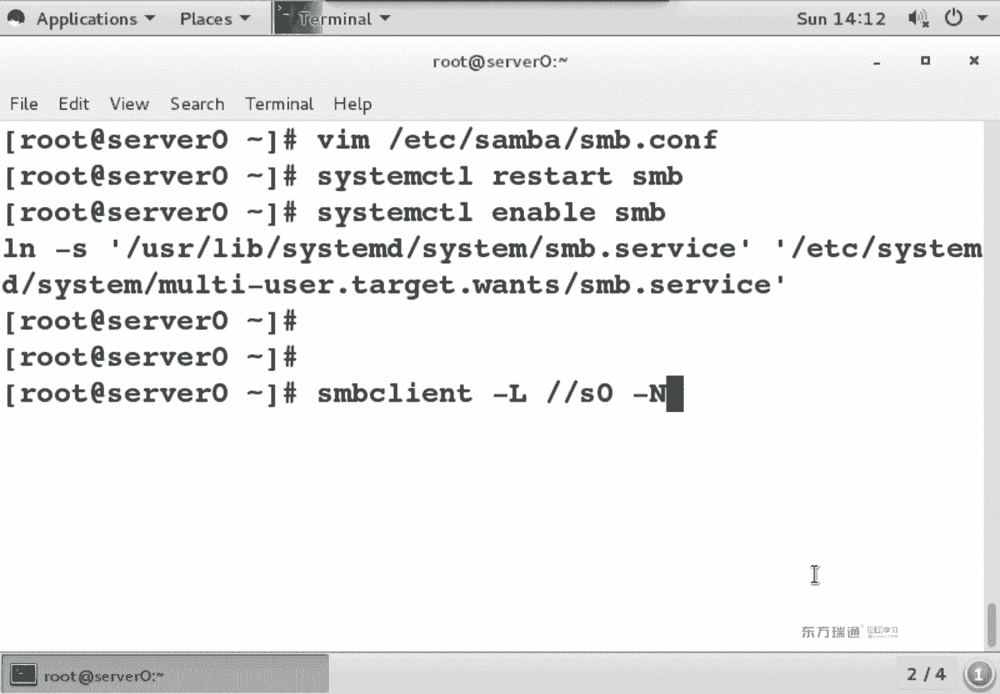
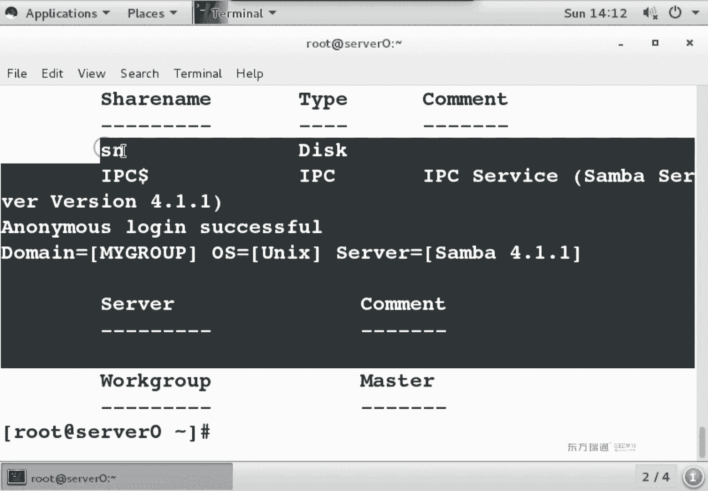
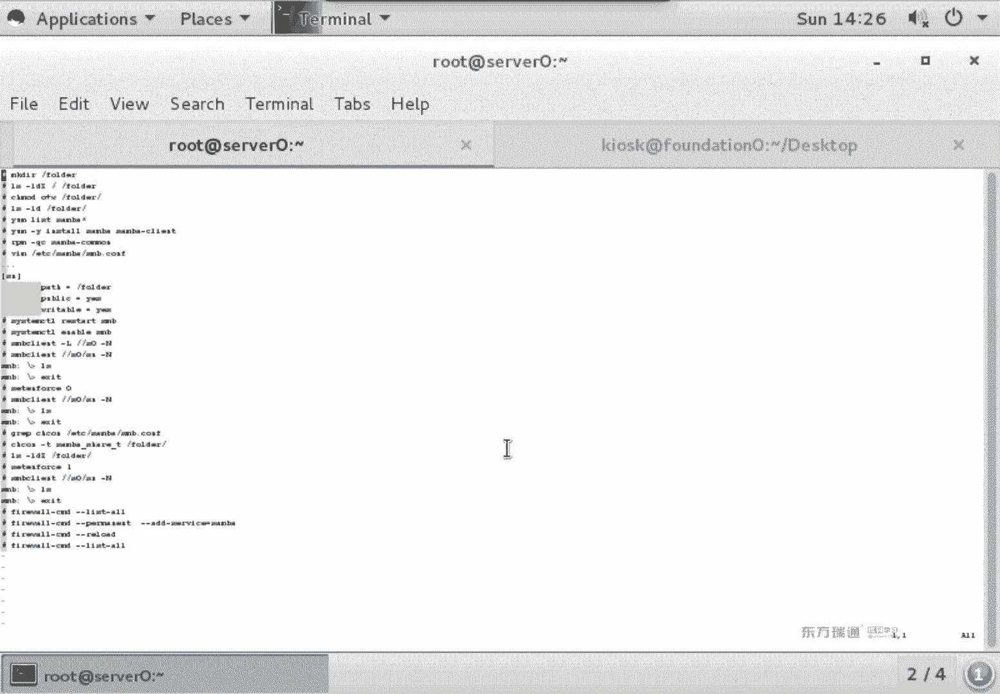
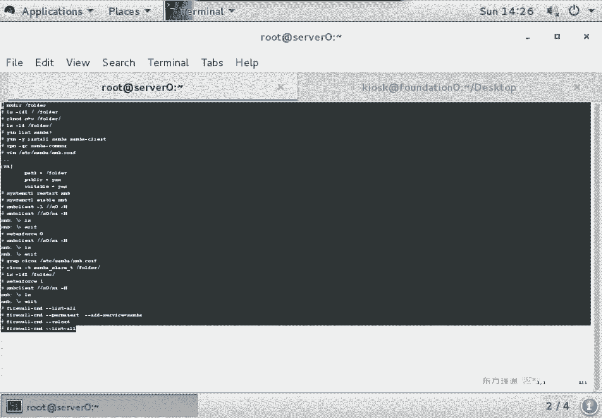
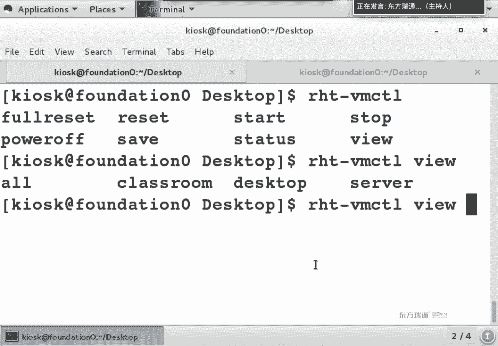
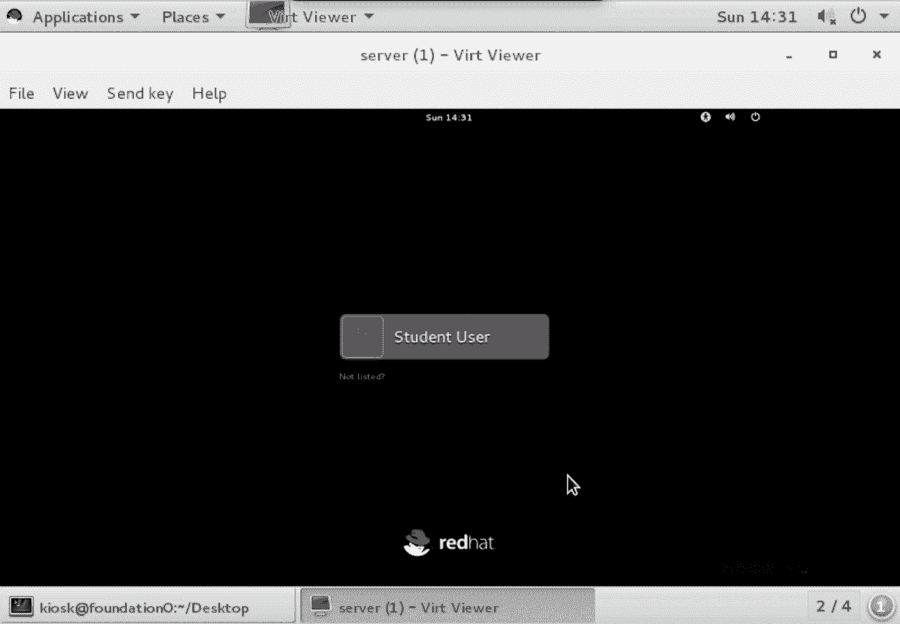
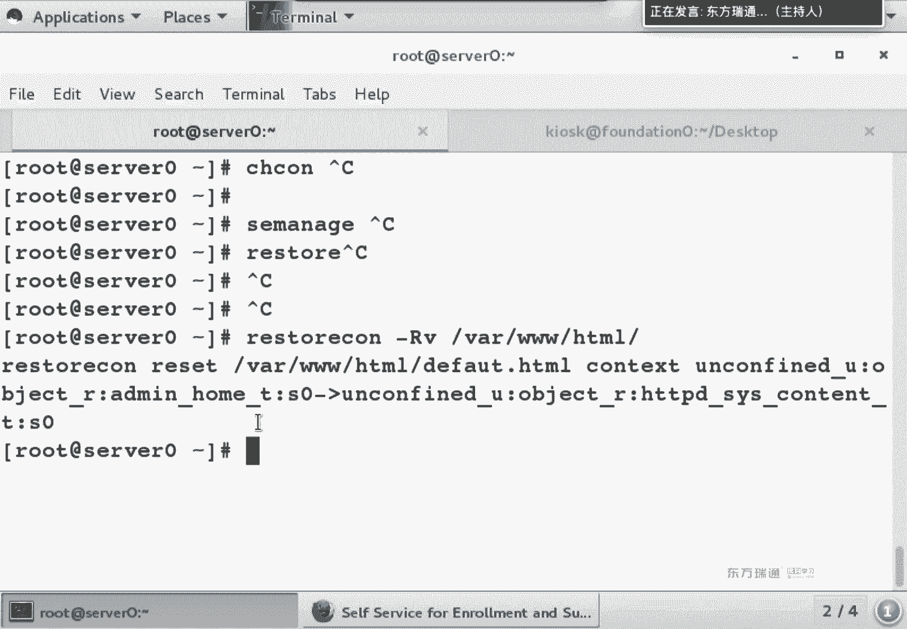

# Red Hat RHCE 7 培训课程：P13：SELinux 上下文关系与端口管理实战 🚀

在本节课中，我们将深入学习 SELinux 的两个核心应用场景：**文件上下文关系**和**端口访问控制**。我们将通过配置 Samba 共享服务和 Apache Web 服务，来理解 SELinux 如何影响服务的正常运行，并掌握相应的排错与配置方法。

---

## 上下文关系与 Samba 共享服务 🔗

上一节我们介绍了 SELinux 的基本概念。本节中，我们来看看如何在实际服务（如 Samba）中应用和修改上下文关系。

### 理解上下文关系问题

在根目录（`/`）下创建的文件夹，其 SELinux 上下文类型默认为 `default_t`，这与某些服务（如 Samba）所需的类型不匹配，会导致访问失败。

**示例：创建顶级目录**
```bash
mkdir /folder
ls -ldZ /folder
```
你会发现其上下文类型为 `default_t`。

### 配置 Samba 共享服务

以下是配置一个允许匿名写入的 Samba 共享的完整步骤。





**第一步：安装必要软件包**
```bash
yum install samba samba-client -y
```

**第二步：设置本地文件系统权限**
需要确保共享目录对“其他人”有写权限。
```bash
chmod o+w /folder
```

**第三步：配置 Samba 服务权限**
编辑 Samba 的主配置文件 `/etc/samba/smb.conf`。
```bash
vim /etc/samba/smb.conf
```
在文件末尾添加以下共享定义：
```ini
[sn]
    path = /folder
    public = yes
    writable = yes
```
- `[sn]`：共享名。
- `path`：要共享的**绝对路径**。
- `public = yes`：允许所有人访问。
- `writable = yes`：允许访问者写入。

**第四步：启动并设置服务开机自启**
```bash
systemctl start smb
systemctl enable smb
```

**第五步：本地测试与 SELinux 排错**
1.  查看共享列表：
    ```bash
    smbclient -L //localhost -N
    ```
2.  尝试访问共享（此时会失败）：
    ```bash
    smbclient //localhost/sn -N
    ```
3.  临时禁用 SELinux 进行测试，确认是 SELinux 问题：
    ```bash
    setenforce 0
    smbclient //localhost/sn -N  # 此时应能成功访问
    setenforce 1  # 重新启用 SELinux
    ```

**第六步：修正上下文关系**
根据 Samba 配置文件的提示，需要将共享目录的上下文类型改为 `samba_share_t`。
```bash
chcon -t samba_share_t /folder
ls -ldZ /folder  # 确认类型已更改
```
现在再次使用 `smbclient` 访问共享，应该可以成功。

**第七步：配置防火墙**
允许外部客户端访问 Samba 服务。
```bash
firewall-cmd --permanent --add-service=samba
firewall-cmd --reload
```

**第八步：客户端测试**
从另一台机器访问共享，并测试文件上传。
```bash
# 在客户端查看共享
smbclient -L //server_ip -N
# 连接共享并上传文件
smbclient //server_ip/sn -N
> put local_file
```

### `chcon` 与 `semanage fcontext` 的区别

上一节我们使用 `chcon` 直接修改了上下文，但这种方法不是永久性的。本节我们来看看如何永久修改数据库中的默认值。





- **`chcon`**：直接修改文件上下文，立即生效。但执行 `restorecon` 或系统重打标签（`touch /.autorelabel` 后重启）后，更改会丢失。
- **`semanage fcontext` & `restorecon`**：修改 SELinux 策略数据库中的默认规则，再使用 `restorecon` 应用规则，是永久性更改。

**永久修改 `/folder` 的上下文类型：**
```bash
# 1. 在策略数据库中添加规则
semanage fcontext -a -t samba_share_t '/folder(/.*)?'
# 2. 应用新规则到目录
restorecon -Rv /folder
```
执行后，即使系统重启或执行 `restorecon`，`/folder` 的上下文类型也会保持为 `samba_share_t`。



---



## SELinux 端口访问控制 ⚓

SELinux 不仅管理文件上下文，还严格限制服务可以使用的端口。接下来，我们通过修改 Apache 服务的监听端口来学习如何管理端口上下文。

### 修改 Apache 默认端口

**第一步：安装并尝试修改端口**
1.  安装 Apache (`httpd`) 包。
    ```bash
    yum install httpd -y
    ```
2.  修改其默认监听端口。编辑 `/etc/httpd/conf/httpd.conf`，找到 `Listen` 指令。
    ```bash
    vim /etc/httpd/conf/httpd.conf
    # 将 Listen 80 改为 Listen 8089
    ```
3.  尝试启动服务，此时会失败，因为 SELinux 不允许 `httpd` 使用 8089 端口。
    ```bash
    systemctl start httpd  # 启动失败
    journalctl -xe  # 查看日志会发现与权限拒绝相关的错误
    ```

**第二步：查看并添加允许的端口**
1.  列出 `httpd` 服务在 SELinux 策略中允许使用的端口：
    ```bash
    semanage port -l | grep http
    ```
2.  将 8089 端口添加到 `http_port_t` 类型中：
    ```bash
    semanage port -a -t http_port_t -p tcp 8089
    ```
3.  再次查看，确认端口已添加：
    ```bash
    semanage port -l | grep http_port_t
    ```

**第三步：启动服务并配置防火墙**
1.  现在可以成功启动 Apache 服务。
    ```bash
    systemctl start httpd
    ```
2.  配置防火墙，开放 8089 端口（因为不是默认的 80 端口，所以不能直接添加 `http` 服务）。
    ```bash
    firewall-cmd --permanent --add-port=8089/tcp
    firewall-cmd --reload
    ```
3.  在浏览器中访问 `http://服务器IP:8089` 进行测试。

---

## 文件移动与上下文继承问题 📁

当文件被移动（`mv`）时，它会保留原有的 SELinux 上下文，这可能与新位置所需的上下文不匹配。

**示例：Web 文件上下文错误**
1.  从其他位置下载或移动一个文件到 Web 根目录 `/var/www/html/`。
    ```bash
    wget http://classroom/example.html
    mv example.html /var/www/html/
    ls -Z /var/www/html/example.html  # 上下文可能不是 httpd_sys_content_t
    ```
2.  通过浏览器访问该文件时，可能会遇到 `403 Forbidden` 错误。
3.  修复上下文。对于系统已有默认规则的目录（如 `/var/www/html`），直接使用 `restorecon` 即可。
    ```bash
    restorecon -v /var/www/html/example.html
    ```
    此命令会根据数据库中的规则，将文件的上下文恢复为正确的 `httpd_sys_content_t`。

---

## 总结与核心思路 🎯

本节课中我们一起学习了 SELinux 在服务配置中的关键作用。在 Linux 中配置任何服务时，都应系统性地检查以下四个层面的权限，任何一个出问题都可能导致服务异常：

1.  **本地文件系统权限**：使用 `chmod`、`chown` 等命令设置。
2.  **服务自身权限**：在服务的配置文件中定义（如 Samba 的 `smb.conf`）。
3.  **SELinux 安全上下文**：
    - **文件/目录上下文**：使用 `ls -Z` 查看，`chcon` 临时修改，`semanage fcontext` 永久修改。
    - **端口上下文**：使用 `semanage port` 管理服务可用的端口。
    - **布尔值**：使用 `getsebool`、`setsebool` 管理策略开关。
4.  **防火墙规则**：使用 `firewall-cmd` 管理网络访问控制。



**排错黄金法则**：当服务访问出现问题时，遵循“先本地后网络，先服务后内核”的顺序排查。可以临时禁用 SELinux (`setenforce 0`) 来快速判断问题是否由其引起。务必养成查看服务状态 (`systemctl status`) 和日志 (`journalctl -xe`) 的习惯。