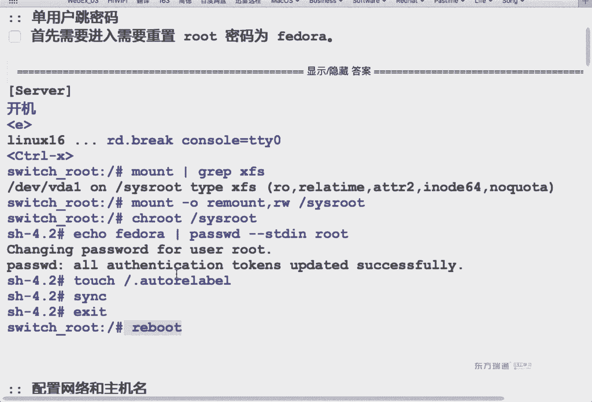
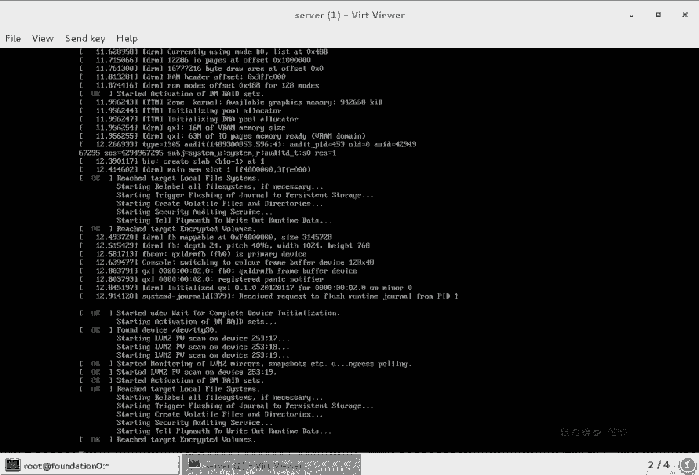
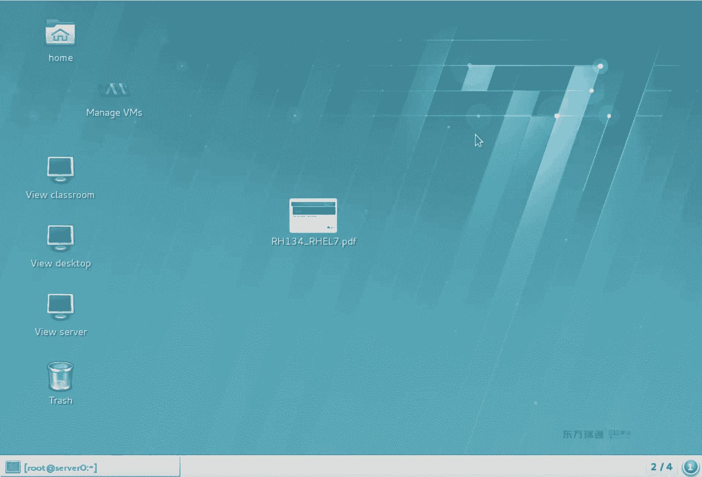
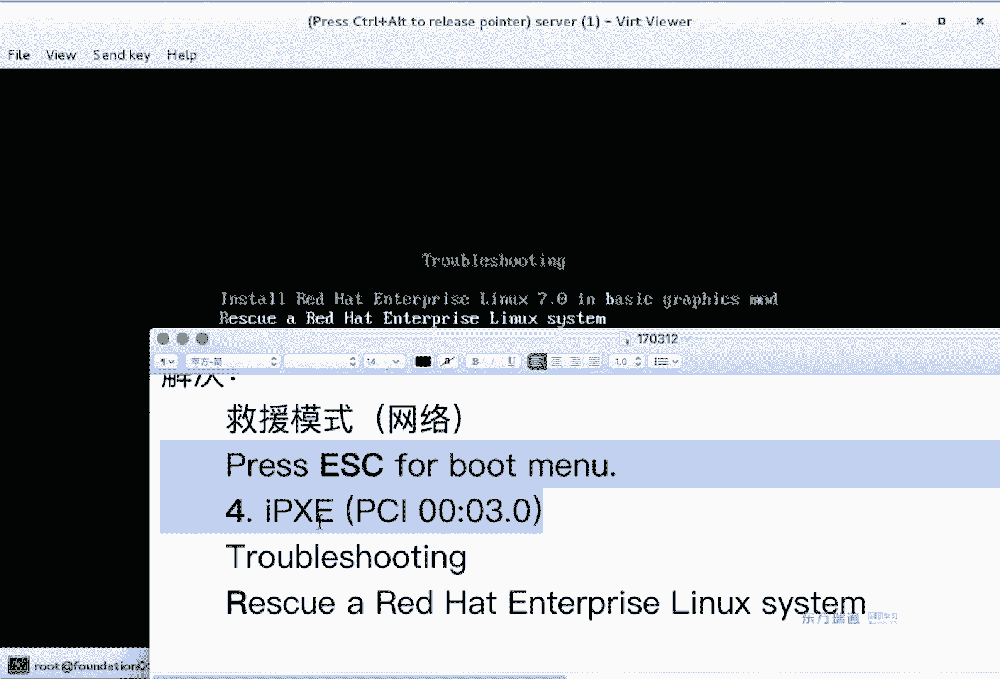

# 红帽Redhat RHCE7培训课程+RCHE7实战参考教程+红帽8.0教材电子版+模拟环境及辅导 - P14：8 - 16688888 - BV1zu41197p6

下面我们来看一下13章系统引导过程啊，系统引导过程。那么为什么要了解引导过程呢？排错的思路啊排错的思路。系风启动不了了，怎么来解决？那引导过程，如果你了解了之后，出现不同的故障现象。

你知道大概问题出在哪，知道去改什么啊，就去改什么。系统在启动的时候啊，首先是从主机的bis来启动。从是一个B。那么bios当中可以来设定是从哪个设备来泄动。如果。是从你的硬盘来启动。

那么它会找到硬盘上的MBR。在我们MBR当中，如果是类那个系统的话，MBR当中安装的是一个grarab系统，grab软件。gora软件它在启动的时候呢，会去找相应的配置文件。我们的配置文件在哪呀？

还记得吗？grarab的配置文件是跟ETC样，还是跟跟不的样？跟部的下是吧，跟ETC下那个是。快捷方式啊，软软链接。如果你的配置文件手一嘚被干掉了，大家看下面是不是有一个文件夹，然后有几个文件呢？

它可以把这个文件夹中的文件和这个文件合并生成你的配置文件。合并生份的偿件。这grab two在grab的时候啊，gra一版本的时候，你配置文件如果是被干掉了，只能自己写份儿，没有生成功能。

那么在grab two的时候啊，可以直接生成。有一条命令叫做grab make configure。Grab make这个可以来生成。咱们后面有这个实验啊，你就先知道这么回事就行了。

那用户做出了一个选择的时候，系统在启动的时候出现G巴菜单。如果你不选择哪一个菜单，倒计时有个默认会选择默认的菜单。系统在启动过程当中呢，它会来加载内核 kernelnel和内存文件系统。和内存文件系统。

然后呢来加载配置文件。加载完了之后呢。那么可又再次提到了一个什么呀？Gra的配置文件。系统把你当前的内核啊，还有内存文件系统加载成功之后，然后把内存当中它的控制权传递给谁啊，传递给系统又回到硬盘了。

这段是在内存当中。为什么我们在之前呢能进一个叫单用户模式？那个时候都没进硬盘呢，一直在那村里。你加了1个RD点break，它实际上就是说在内存文件系统rame disk的时候中断就到这就停了，没往下走。

做单户特密码的时候就做到第六步。OK吧。那么我们继续。如果选择了相应的grarab菜单，系统会继续来启动。系统第一个进程运行的是哪个程序啊？7的时候运行的是sstem D7之前运行的是。IIT啊。

这它俩的区别。那你init当中默认的运行级别是三还是5，是不是可以来启动到GPS3级别5啊，字符或图形以前的版本呢都叫init几啊，in几。那么到铁满期的时候，我们管它叫做targe叫做目标啊这个目标。

挂载跟文件系统。然后呢，挂载什么？Ifi table。是先挂载网络服务，还是先挂载文件系统？先安文件系统吧。文件系统发完了之后，系统。来启动找到硬盘的根。加来你箱的网络服务。

然后到最后出现了一个图形化的动作界面。那么在这个里面呢，我们提到了两个文件。叫做defa target。你发到他给。我们在之前记不记得有一个命令叫做seatem controls default。

my users default graphical有印象吧？那么你在做那两个set的时候啊，它实际上就是做了两个快捷方式。指向给发的文件。换句话说，比方的文件指向的是ma user一开机就是进入字符。

指向的是gal一开机就进入图形啊，就这么一个功能。OK这一片当中啊。看完了之后，我们能了解单付模式在哪，这是第一个。第二个系统启动的时候是新加载文件系统还是网络还是服务文件系统啊。

文件系统matework是不是也属于服务啊？F水服务。那我们的。啊，比如说我们那个呃基于网络的服务，是不是应该在耐克沃克之后来启动啊？嗯，这有点区别。启动和重启啊，关机。

我们用reboot命令可以重启stt controlreboot也是重启。power off可以关机，所以他 controltl power off也可以关机啊。就是又多了两条命令，也可以重启和关机。

在解版器当中。Sma control，re power off。那么在7之前呢，我们用的是IIT06关机和重启。在企业版7中，IIT0和6好用吗？依然可以使用，记得向下兼容啊，以前会的东西现在都一样。

叫向下兼容。在系统当中有两个tt，你要记得，一个是叫grafico图形，一个叫mark user多个用户，多用户指的是字符模式啊字符模式。如果想临时来切换的话，我们有一个命令叫isol。

所以通们ctrl isolate来进行切换。设定默认的加载模式。如果要来查看的话呢，s controlrl get default要设置的话就set default。之前做过吧嗯。做后就提嘴啊。

系统在启动过程当中，我们可以按任意键打断启动。除了回车之外的任意键啊，一按回车是不是就启动了呀？然后呢，光标移动呢想更改的启动项，默认我们是不是有两个启动项。IE是编辑。这个异议的话。

下面菜单中是不是有提示嗯？找到了那个石榴的行，这行是什么？那盒吧。在内核这行可以修改参数，修改内核的参数，那么内核启动啊是有些变化。内核参数改完之后怎么来启动啊？control X是不是也是系统提示的？

那么大用户跳密码，这个实间是上午考试的第一道题。当然户调密码。依然是NE and controltrl X唯一的区别，我们要添加在内核当中添加的这个。

参数啊第二个参数叫RD点breakrame disk break。打乱到内存文件系统的时候，打断啊，不加载硬行这个文件系统。我们在做实验的时候说还多加了一个cl等于PTY0。那行不加，有时候也能成功。

但注意要是有时候不是肯定能成功其不行其。其他其二不加就直接管线不加就。啊，那其他还挺好是吧？O。😊，RD theybreak。我们在进入系统之后啊，为什么要重新挂载Croot呀？因为权限的事吧。

要凸显权限，为什么要切换到硬盘的根呢？请字root到硬盘那边。因为你要改密码的话，实际上是不是改硬盘上的杀毒文件了？切换到硬盘它跟 pass错word了修改。

那为什么要生成一个点au to label的文件呢？是不告诉系统把所有数据库中有的上边关系全给我restore context全恢复。然后之后一exist退出两次系统重启，密码就改成功了吧。

这个是英文版。这个是中文版，他俩是一个东西。

这个是图的示例啊，怎么读？okK我把这个时间给大家演示一下。😊。

系统当出现grarab菜单的时候，摁任意键打断，现在有grarab菜单吗？重启之后才有，或者要系统启动时才有考试的时候呢，你这个虚拟机默认都是启动的，你是不是要能重启呀？充气怎么办？那么在考试的时候呢。

你们桌面上啊有类似于这样的程序。类似这程序。你是不是想重启呀？这里面有瑞啊。没有是吧，没有，我是不是就先st再star。能理解吧。先stop哈，s玩。O。快不快？只着急哈，这个没反应，看到没？那咋办呢？

我直接点这重启行吗？行吧，考试的时候，你们这个是字符模式咋办呢？へへ。😊。

ts你都进不去，咋st。没有彩密码呢，还。😡，考试的时候，桌面上这个东西肯定好用哈，跟它长得不一样啊，就大概是个这么个东西，一个图形的，你可以点。

Okay。我给重启一下。那如果你找不到那个图形的程序啊，我们是不是叫R7VM controltl啊？用那个命令号off一下也可以。ok刚刚看到两个菜单了吧，看到两个菜单的时候，摁任意键。

那么我看到两个菜单的时候，就就。就跟你们聊天了，也没有恩人意见。

对呀，我怎么给他关机呢？我们是不是有个命令啊？不申请。HT VM control， power off。拔电源最快是吧？

开机。胶点先切进去啊，我的习惯呢是按方向键。我的习惯是方向键。大家会发现能默认有几个菜单呢？两个你到底用哪个菜单随便。这两个菜单基本上一样，它俩的区别，下面这个相当于微软的安全模式。

安全模式OK我们用第一个E。一是编辑吧，摁方向键下下下下下这边有没有类那个字16啊？没有你就一直往方向键下，看到linux16和initRD16了吧。原来那个16这行啊叫做内核。

因为他阿D这行啊叫做内存文件系统。你找到内核这行啊，ctrl加上。Eい。cttrol加上EE代表暗的光标是不是调到行尾了呀？加上空格RD点break。空格。看il。等于EBY0。大家会发现在最后一列呀。

是不是自动加个反斜杠，那反斜杠不是我敲的哈。😊，强调一下把型上部数交了，看so等于PTY0都做完了之后。下面这个位置是否有提示，按什么启动啊？ctrl x系统。它会使用你现在修改了的内核来启动。

修改了的那盒。那么系统启动之后，我们会发现直接就进到哪了呢？单用户模式啊单用户模式。别着急跑啊，我们往天上看。他说。挂载正在挂载Croot跟Croot。然后呢。他前面又说了啊。

VDAE挂载乐VDAE恢复乐VDAE结束恢复乐。然后C rootot挂载成功乐。看到这么几句话没？简单来说，这一段啊是不是就是在做一个mount的操作呀？把VBAE是不是挂在了C4root下？

mediadia一是谁？系统系统跟分区是吧，系统跟分区OK。嗯。啊好了继续。通过mar命令管道过滤VDA1。我们会发现。或者是说你又骂他命令，反倒过滤。这次 rootot。一个意思吧嗯嗯一个意思。

那我们到这个里面看一下结果。这个硬盘分区挂在了这个目录下，什么权限挂在？只读只读权限挂载的话，你能更改密码吗？能改上面的文件吗？没权限啊，没权限。就像有一个共享啊，共享给你是只读权限的话。

你能往里面写文件吗？永远写不了吧，它都会写权限，我们怎么加写权限呢？用m和命令杠O为m。重新挂载RW。把C4 root的这个挂载点呢重新挂载一下。选项做了一个修改RW之后呢，你再次来确认。看这个位置。

权限是不是变堵写了？有读写权限之后，我是不是可以去改密码，密码筛毒文件会保存成功啊，要不永远保存不成功。现在我是不是想切换到硬盘的根呢？这个过程有点类似于你拿U盘启动啊，拿光盘启动。

想切回硬盘的根一个概念change root。C是 rootot。大家看秦老师很怪是吧？我们之前在做Ld夫实验的时候，Ld夫实验做完秦岛夫是不是一个12名加版本号啊？做完凹凸 FS之后。

前岛伏是不是就正常了？如果你想看正常的前岛服，你可以输一下。看到没？但是我们会发现你输也好，不输也好，千岛福是不是都是井号？为什么我们管这个模式叫单用户呢？我们主要想强调是它的权限。

世界上如果只有一个人的话，这个人什么权限？是不是就入他呀啊，他就上帝权限，你愿意吃谁就吃谁啊。你愿意上银行拿钱就去拿，都不用刷卡是吧？啊，真好。但是那个时候用钱有什么用呢？取暖。う。

就是说等世界末日的时候，钱的作用就取暖。因为钱啥买不了是吧？弄块金砖能干什么呢？能当棒子用，砸个核桃吃啥的嗯，当锤子用。Okay。那我们切换到硬盘的跟了之后，做什么操作呢？

是不是可以用pasword的命改密码啊？这说了给谁改密码啊？root单用户模式是不是就是root呀，权限一样密码改成什么，随便。成功没？成功了吧？如果你权限依然只读的话，这个永远不成功啊。

因为它写不到筛动文件，对吧？写不进来。呃，一般我们建议啊你用这种方式来写。pass word杠杠死stand in什么作用啊？Yes。密码只设一次是吧，标准输入一次。

子弹的叫标准in输入子弹 in标准输入一次。那么密码是什么呢？Iical回选的内容吧。那建议大家用这种方式的原因呢，是说我可以直接看到密码是什么，万一一会儿敲错了，对吧？很直观。考试的时候。

如果密码敲错了，我是不是可以再跳一遍密码啊，再做一遍，就是浪费点时间。上午的时间很富裕，3到半小时。一般情况下一个小时能做完。一般一个小时就右吧。慢点也一个半点也做完了。

所以说这个时间你多做两遍也无所谓啊也无所谓。ok。呃，密码改完了之后，我们要干嘛呀？在硬盘跟目录下生成一个点，alltoreable的文件。啊，最后一个字母是什么？Hello。记住啊，是L结尾。

你看一下这个label这个词儿啊，是不是以L开头L结尾啊啊这个标签。做完了之后呢。一般情况下，建议各同学SYC1下。不做也行啊，那个这个呢是退出。啥。退出侵得住它，退出硬盘的根吧，这又回到内存的根了。

那么再exit退出什么？退出单用户模式。那系统会重启几遍呢？嗯。蓝面。大家看最下面一行啊。是不是有一个叫SElin是一个词儿？SE策略被需求，为什么被需求呢？

因为你刚刚做了一个au to label文件。好退了个文件。大家看有个百分比吧。它是将数据库当中所有的三核关系自动re到contexs。为什么要去干一下这个事儿？🤧S1lin是不是安全增强啊？

如果你的福气被人动过。你的服务器被人动过，他是不是没有正常机系统啊？把筛毒文件给改了吧。下到文件就有变化了。那这个时候系统启动的时候，它在检测哎。检测到帅多文件了，上下份关系不匹配。

他认为系统被冻过就卡这了，永远启动不起来。那么系统怎么能正常启动呢？它检测上方关系都对，数据库中的值和当前的上方关系都能匹配上。他认为你的系统是正常的，安全的，它能启动。

所以说你必须得去touch一下啊，你不touch就重启卡死啊，重新卡死。嗯。重新软面之后呢，进入登录界面，我们敲相应的密码，可以登录啊，我的密码刚刚改成什么了？你。密码是吧。试一下啊。

notote list用户名路特。MIME回车可以登录吧。实验完成叫单用户模式挑密码，这个时间必须得会嗯。

这个时间不会别着急考试啊。上午考试这个时间是最重要的，为什么呢？你要去任何一个地方啊，必须得先把门灯开开是吧？等开门才能办业务，一个意思啊。

呃，这个实验在哪个文档里呢？在CSA这个文档当中。我们有个CIA的文件。上午第一道题吧，单用户挑密码考试的时候要求你改成什么，你就设上什么。这个密码不一定是什么哈，密码不一定是什么。😡，开机。

你们考试的时候啊，这个位置不叫开机。😡，因为考试的时候，你的虚拟默认是启动的。那首先你要考虑给它重启。能理解吧，能出启。重启的时候看到Gra菜单NE。NE。我这就摁了一下哈，建议按一下方向键确认。

然后再摁E找到leting slow这行ad迪 there break cancellTTY0ctrl X启动。确认权限权限不确认可不可以？行，可以，你就直接做这步就行。改权限，更改到硬盘的根，改密码。

生成开关文件。SU类那个开关文件。然后退出退出，我不退出的话，reboot行不行啊？也行啊，都可以啊，都是重启的意思。

然后呢，用你改过的密码一登录啊，实验完成。

呃，专门conttrol这条命令啊，它的功能啊它的功能。他有什么功能啊？他也会来生成日志啊他也会来生成日志。但是呢他的是生成在临时目录当中，跟run目录当中，临时有效，不关机能看到一关机就没了啊。

一关机没了。那如果你想把你的这个配置啊。保存在指定的目录下啊，可以这么来做，先创建个文件夹。诶。😊，先创建个文件夹，创建文件夹是杠M什么作用。2775。杠M什么作用。权限。能理解吧？创建文件夹的时候。

可以同时杠M来设定权限，相当于makeDR之后清真默的。签什么的。二是什么权限呢？421。SGID吧。SGID。775啊用户组其他人啊读写执行。然后呢，这个文件夹改成谁所属啊？C占这个组所属。

之后用Q命令给他干掉。Q命令给他干掉的目的是什么呀？是为了让你刚刚的这个东西生效。类似于把服务重启。能理解吧？泪水把浮冲洗。然后呢，你再去看一些事儿的时候呢，你可以粘在ctl杠B。

这样Parrow可以来查看它的日，并且系统在重启之后啊，这个日志依然存在存在于哪呢？VRlog下的粘到这个文件中啊粘到文件中。关于这个实验呢和我们第一门课。也提到了简单conttrol啊。也提到了。

可以来定义你的日志放在哪。

哎，这篇讲了什么呀？修复文件系统。修复文件系统什么意思？销户文件系统。是不是FI table出问题了呀？wifi table文件出问题怎么办？我们来看一下哈。😊。

给大家演示个实例。

我现在干一个事儿。编辑fiable文件。IY特播件中是不好不好嘛？😊，由于某种原因。我们做实验的时候，是不是可以直接IQ两个大于号到这个文件中啊。但是由于某种原因呢，我属于嘚瑟，也我写上一个大原号。

什么结果成空了。看到没嗯？不重启没事哈，因为这个文件启末时候用，现在呢我重启一下。😊，Shart到。这吧。嗯。啊，权限不够。

大家看左侧有红色的。黄色的绿色的滚来滚去吧。看到没？一一顿爆粗。然后你会发现系统一直起不来。看到没？红色的、黄色的、绿色的。然后又一顿跑错，还是起不来。为啥起不来呢？😡，我们在刚刚讲系统启动的时候。

它是不是。控制权交给硬盘吗？然后加个FI贴播文件，但是FI贴文件是空的，它找不到硬盘的系统在哪。能理解吗？找要不知道硬盘系统在哪，就这样。一直启动不了。永远启动不了。怎么解决啊？你是不是想去进单户啊？

Okay。咋进单户来的？系统启动的时候。NE。进来了吗？然后嘞。哎，为什么这个有有这些内容吗？我硬盘都找不着，他为什么能找着。嗯。看看哈。大家看这个词儿没？HD0逗号MS到11。他看的是分区。能理解吗？

系统还没有CDE盘符的概念的时候，它直接就能读分区HD0代表是谁呀？第一块硬盘。M到s一代表是它的第一个分区。能理解吧？也就是说我们看下边呢。大看这个位置是不是有个什么根部之类的呀？

就这个根呢系统本身自己是认识的。啊，本身自己认识的，大家看到这些内容都是直接读分区的内容啊，直接读分区的内容。O我们找到这行cttrol E。空格RD点break。空格cancel。等于GPY0。

Ctl X。又进单用户了。我们现在依然往天上看。mountunin this route， VDAE mounted this route。他找没找到硬盘那该。找到了。Mount。markt杠O点帽。

RW。电示录。这硬盘的怎嘛先入ot。硬盘那个。系统无法启动啊，遇到最多的情况就是。CETC的ifi table有问题。这个文件进来是不是空的呀？我们刚刚看系统启动的时候，是不是提了个VDAE呀？

给 thevis meDAEok吧，挂在哪？根身区文件系统类型是啥？XFS。你怎么知道？😡，用什么命令看。说面那个能看到文件系统。啊，好了开。有吗？内有是吧？记不记得我们刚刚看那个日志啊。

日志里面说没说呀。这个。苹果这个键盘哪个是翻页键的？就。在字符模式下按shift pay up式往上翻哈。😊，Yeah shop。FN呢啊那就shiftftFN加上上。向上翻页啊，往上翻。

你找到刚刚那个分区的那块儿。看到这儿没？看到没？XF吧？就说如果你这条命令不存在的话，我是不是可以去日日当中去找啊？上软件加payrap是上一套翻页。就刚刚我们停的那一瓶，他就有。ok。😊，编辑。

I拍 table。1234第四列是啥来着？选项是吧。然后呢。嗯。FI cable是不是写回来了？写回来了之后，那个touch嘛？这个时间踏不踏实都行哈。就说你要是不知道踏不踏实的时候啊，看通信。

通信是都踏实啊。刚刚我们进单户干嘛了？这个。就把ipad table弄正确了是吧？单用户模式不是说只能去改用户的密码。你新起妇来了，是基本上都能干。但是有些事是干不了的。比如说我们下面要做的实验。

这个是让我们先看线下啊。

嗯，用户。耽误模式。单护模式常用的有两种。第一种呢就是单护模式跳密码。嗯跳。密码。考试考点是吧？单用户模式修复文件系统。修复文件系统主要指主要指的是不是FS table啊嗯。后开操作。爱好。

说把I把 table清空了呀。操作线下。啥现象啊？系统无法启动。是不是看到好多什么红色的fieldilled，然后黄色的警告，一堆报错啊。然后就卡死了啊，就这么个现象，管系统怎么解决呀？咋解决？

单用户模式。进单误模式会吧。进入待红模式之后，我们不去password了，我们去干嘛呀？编辑FI table文件是不是改正确了呀？改正确了之后呢。不し。是不依然是正常退出啊。

什么touch跟点推 label啊，SYN呀，okK吧，这样退出，然后系统是不能正常启动了。为什么我非要给你们讲这个实验？咱们在第三门课呀也要讲到Sga实验。

S杠C实验中，FS table里呢需要加一个特殊的选项。

系统能正常启动了吧。OK回到头来。Night。大家看到这个选项了吧。N device。前面有下划线吗？有吧，有下划线嗯嗯。在第三门课讲S杠实验的时候呢。

FS table需要加一个下划线n device选项。如果你做实验的时候，手一嘚啵没夹。那么考试交卷之前呢，你是不是要至少重启一遍呢？发现系统起不来，基本上就是这个选项写错了。耐翻译成中文什么意思啊？

网络得外词翻译成中文是设备。卖 deviceice啊有下划线，有下划线，下划线卖 deviceice它代表什么含义啊？我们之前讲了系统启动的过程，系统是不是先加载文件系统，再启动网络，再启动服务啊。

顺序是这样，那现在你加载文件系统，网络还没启动呢，能看到那个网络上共享给那个网盘吗？看不到，所以说它挂载不成功。能理解吧。如果你想用Scar设备，必须有个选项。上划下那的dice。但是你在测试的时候。

m到杠A，它根本不检测这个选项，看不到效果。你认为说唉挂成功了，但实际上没挂成功。系统启动的时候挂不成，为什么呀？你当前慢达杠A是因为当前是不是有network服务啊？😡，我现在系统启动的情况下。

网络服务是不是正常？所以你挂的时候能不能启动？你写不写都能挂上高。😡，但是你系统在重启的时候，它先下载文件系统，网络服务还没启动呢吧，那个网盘共享能挂成功吗？挂不成功。这个时候怎么办？

单用户模式修复文件系统。OK吧，编辑FI table文件，把这个选项给塞进来。😊，okK然后再重启一次发现全正常了。为什么非要强调一下这个实验？考试的时候，下午啊，SKC是下午的实验。

下午你有两台虚拟机，下午三个半小时的，时间很紧。如果你很熟的话，时间不紧，一个半点能做完。不熟的话，时间很紧，时间很紧。如果你但词套不出问题了，你还不会解决的话，是不是得去resite呀？

随时resite，但你resite的话，客户端好多的操作是不是都得重做啊？不赶碰。能理解吧？根本不敢趟。再或者是说这道题分你压根不要了。你直接编辑FI table文件，把。把这个I这个实验呢。

这分我就不要了。能理解吧？下午考试一共20多道题。用作一期做一个拍照。不能没权限，你没有访对深垒住他的密码。😊，他不让你破，破了的话，他直接算零分儿。不让你动，能理解吧？为什么不让动啊？

如果你把房贷性给搞崩溃了。😡，教师机的判分脚本连不到你findition里面的虚拟机，你虚拟机里面都配对了，是不是得不到分啊，所以说他们压根就不告诉你findation的密码。

咱们finditionroot密码是不是大ASIMOV呀？我不怕告诉你们，因为我们可以随便拍招回复是吧？考试的时候呢，仿对身是个物理机。

什么概念呢？你物理机就长这样。

能听懂吧？考试的时候，这所有的机械物理技术长这样。然后呢，你们里面是桌面是考试题。然后呢，有两个虚拟机。下午两个呀，然后让你来配置考试的环境。而且你的权限呢是个普通用户的权限。是管理员吗？

不是不是管理员能做快照吗？做不了，还有下半月内。虚拟意件是。是。不让你改。权限限制哈。

嗯。修复文件系统会了吧，单用户模式修复文件系统这两个实验呢？必须会做啊必须会做。虽然第二时间你不一定能用得上，但是考试的时候万一得说下划线没写。那个得Y是写错了，你是不是都得改FS table啊？

看引导出问题了，引导出问题，这个怎么弄？嗯，这个好玩。引导出问题。下面这个是grab程序。这个是grab程序。这个实验是FStable。文件啊文件有问题。程序有问题，程序怎么有问题呢？😡。

我们在之前呢讲没讲过一个实验。嗯，说G的配置文件在哪？ok吧。破坏操作，现在看破坏操作啊。😊，我们把它的配置文件给干掉。他的配合键在哪呢？有吗？我们现在用的版本呢叫华巴 two。看到配置线在哪了吧。

哪个是他的配置文件？哪个是他的配容线？这个是他的配置文件。能看懂吧，下面跟ETC的看到这个青色没？这个是个快捷方式。或者说你看llink吧。😡，你把快捷方式删了有影响吗？没影响。Okay。あもう。

Iphone注特。这些步骤实际上做一步就行了。删图吧。做一步知行。那我为什么给你们写这么多步呢？😡，我得告诉你怎么查呀。😡，ok吧。grab的程序配置文件，你把配置文件删了有啥结果？现在我们再来重启。

啥了。

看到没？如果是有配置文件的话，是不是能看到两个菜单？没配置文件的话，就进grarab程序了。你要是能记得什么 kernell啊，因为它raF，你要能写出来，系统也能启动。😡，会ro它会ro它命令。

你按推不见是不是好多命令啊？你会root命令或 kernell命令，就linux16那行会init Ram16那行再会一个bot，你会4条命令，你系统也能启动。但是这个挺变态的，太长了是吧？怎么办？

怎么解决？配置文件没了，我说把配置文件弄回来就行了。😡，我叭大于号吧，咋解决这个呢我们用的叫做救援模式。救援模式。用救援模式把Gb配成线重新生成，试验完成。救援模式重新生成。那么用救援模式怎么来生成呢？

啊。我们看一下救援模式。什么叫救援模式呢？在微软的产品当中啊，大家都用个PE吧。PE和我们的救援模式类似，都指的是说用另外一个介指来引导启动。PE的话可以网络启动，也可以U盘启动，光盘启动。

那么我们的救援模式呢也是一样的那下面我们来看一下网络救援。网道9。在当前呢，我们的class room是一个。呃，安装服务器啊安装服务器。什么叫安装服务器呢？我们在之前是不是讲过一个叫KS啊。

kstar有印象吗？那classroom已经是一台配置好的kstar的服务器，你可以直接通过class room来安装相应的系统。换句话说，也可以通过它来做救援模式，网络引导。

重启。NESE启动是吧？欢迎呀C。

是不是出现了几个菜单呢？😊，哪个是网络启动？

漏由。啊，第一判最后。多吵啊。その？系统启动的时候看到了这行。看到了这行摁什么呀？E C。Price。y。啊。哦。Book menu。然后呢，4。Galaxy。

然后呢。4我摁的是4哈。😊，看到这菜单没眼熟吗？光环启动时是北这呀。选择第一个菜单。

Sure。刚刚那是4哈，给你加粗了。

然后选择第一个菜单。

这啊，不选择第一个菜单。看第三个菜单吧，第三个菜单叫什么？他不舒听这词啥意思？排错吧。Okay。别说。回州之后啊，有好几个菜单，看不看到有一个叫做rice给我。你说完。

rescue什么意思？Oh。bras哥这个词儿啊翻译成中文叫救援。翻译成中文叫救援。如果你用光盘启动，选择troublehootingrescue叫光盘救援。我把我光盘可不可以弄成一个呃U盘呢？

U盘启动到这个界面叫U盘救援都行。因为我们classroom上已经做好了kstar的服务器，你直接做网络救援就可以。几种救援方式就是启动的方法不一样，启动方法不同。

启动过程中你得等一会儿，马上要等一会儿。那为什么再等一会儿啊，他是不是要去classroom去下载一些文件呢？

classroom有TFTP有FTP，有sslin，有kickstar啊，都有啊。看这个界面正在下载。啊。She。哎，你看这个过程，像面像系统启动过程。

现在有个问题哈。那么我们在用救援模式的时候。这个系统版本有要求吗？我当天用的是企业版7，我这个就业模式必须得用企业版期吗？你想想windows里面你再用P。你可能用的是windows8是吧。

你那个P可能是什么windows2003。能理解吧。我们的PE或者我们的救援模式，他们的功能只是来负责启动的吧。我有个sha，我是不是能敲命令啊，我可以改硬盘上的文件就这么一个作用。

OK所以说你不用管它的版本啊，不用管它版本。进来之后，我们会发现有三项。Continue， reading， let escape。他说，救援模式现在要试图发现你已经安装的类那系统。

把它挂载在跟MNTCCmage。我们之前做单用户实验的时候，是不是叫跟inces root？路径不一样是吧，提示。那如果你想更改你系统的话，那么请按contin。那如果你只是想看一看的话。

请选择reon磊。我们在做单用户实验的时候，默认是不是叫RO啊？锐don磊。如果你不想去再去mount他刚里mount他的话，这步建议你contin。

这就读写权限。She。进来了之后。他给。这波我们选择的是continue。

继续吧。默认职。回车空格都行。嗯。又说这么一行。这一行当中啊就看这个change root。那证命令熟不熟？更改跟吧，更改硬盘的跟。他说你的系统已经被挂载到了跟MNTCC妹age下。

如果你想获得一个sha，请运行下面这个命令。那如果你exit退出这个事的话，系统会自动重启。我们在单用户模式的时候，exit是不是也重启啊，rebo是不是重启一个y思。

来这波选什么呀？O。

Okay。哎呀，这不他又说了，你的系统已经被挂载到了这个位置。

啊，这人挺遇到是吧？然后他三篇说的不一个东西哈。上一瓶是说要去发现，这一瓶是说发现乐。

能理解吧啊。对。又进井号了吧。这么眼熟呢。

去。剩下会了吧。好，那我们在单用户模式的时候，你是不是要切换到硬盘那跟？

救援模式也是一样的，切换到硬盘的根是什么了的？那个目录叫啥来着？跟MNTCC image在这个位置。有没有录径？有吧，如果没抓没挂成龙，他没有。如果挂成龙了，它就有你就照着那个路径写就行了。

救援模式考试不考哈，但实际工作中你肯定会用到啊救援模式。单用户模式考试考实际工作中。

看心情吧。看心情。

好，切换到硬盘的根之后，大家会发现前脑图变了。变成半式。4。2。好，剩下的操作干什么呢？你回到了硬盘的根，你是不是就可以去生成你的G配成键了？😊。

上场grarab配置文件的命令是什么呢？我们有个命令叫做grab。我背不住，按table键。😡，我就知道是Graup开头的命令。😡，我们有个命令叫做gb to make confi。

Grab two， make configurefi。这套命令是干嘛的呀？

生成G拉叭配置件。生成瓜人件，那我直接就执行一下，看看长什么样。Make坦fi。哎，是不是所有配置文件都跑终端里来了？都生在终端里，那我配成线应该放在哪？我们在之前呢讲了讲了RPM杠QC。😊。

RPM杠QC。是不是能找到配证件所在的位置？换句话说，我是不是可以把我这条命令生成的配置文件大于号。放到根 bootgra。graber two下和raber点CFD。

アピアマかq c。这个是不是能找到配成件呢？然后我们是不是可以把配件件追加到。或者生成到这个文件里。这能看懂吧，你配置文件被干掉了，重新生成个配置文件就得了啊。😡。

黑人件生刻之后还要干什么呀？还干什么用去他吃吗？有没有踏实啊？

不知道的话，你就踏实一下。😡，实际上不用哈。实际上不踏实也行。谁，看到grarab菜单了吗？系统启动了。生成配置文件之后，定义做一下磁盘同步。说盘同步之后干什么来的？啊，应该先to是吧？先踏。re。

第一个exZ它退出的什么？じ先す。T着root第改Z退出救援模式。啊，那我现现在想问一个问题，救援模式能不能改密码啊？Okay。可不可以啊？可以改密码，也就是说单用户模式都能改密码了。

为什么就业模式还要也能改密码呢？现在我们来想一个问题。我们在grab菜单当中可以来设置密码。正常我们耽误Q密码，是不是grarab菜单AE呀？现在我可以给grab菜单设个密码，粘异的时候编辑不了。

得有密码才能编辑gb菜单。能理解吗？grap菜单可以设密码，终极挑密码的方式就是旧援模式调密码。OK吧。就是你系统都进不去了啊，我们只能用救援模式救援模式。

嗯。呃们来看两个内容。在DETC下。有个叫grab点儿。Deout。你 thought。看到这个文件了吧。还有一个gra点D。我们在用make confi的时候，生成grarab配文件。

它会把这个文件和这一堆文件都放到grarab的配置件里。那你有吧。你生成文件的话，你得有圆呢，从哪生成，它是通过这两个文件生成的啊。而这两个文件呢，我们刚刚在讲解说系统启动过程当中啊。

是不是提到了这个目录啊？启动的思路。She。Yes。给是说明的意思啊。这条命令。这条命令它实际上就用的是这个文件和这个文件夹里面的一堆文件生成的。为了显示一堆啊，就写个箱。一 do的 yes。

我们来瞅一眼啊。😊，呃，边尼。根 boot grabwo。Grab confi。大家看到第八行了吗？00her。看到没？往下翻。看到69行了吗？and line0 header。71行。10linux。

102行10linux，然后10410520。3040。41。你看41里面是不是123455行。我们也去看一下，这没有41。我听着笑怎么跟玩游戏CS似的。编辑gb的配成件。41。能看到吧？好。

这个是makefi。啊。嗯嗯。这个实验能跟上吧。救援模式。你走到这一步啊。这个就是进救援模式了。OK吧。下面我们再来继续。看更恶劣的情况。我们在之前呢讲到了1个512等于446加64加2。呃。

446是啥嗯？446是啥？继楚。I4周4是分机秒，446是MBR主引导记录是吧？而我们的主引导记录当中是不是grab程序？OK那我们来看这个时验怎么做。我现在就干一个事儿，弟弟。VD。这两面了啥作用？

所以。我说哪个C区了吗？没说是吧。呃，这个是啥时验？g up点肯fi是吧？完看这个。下面这个实验呢是gb程序。刚让程序被干掉了。系统在启动的时候。我们就干了一件事儿。弟弟。446呢是MBR大小。

也就是Grab程序所在位置。如果我把grarab程序所在位置添了一堆零，这个程序是不是没了，程序没了，系统还能启动了吗？启动不了了。我们看一下。

对对。

。有首歌叫一闪一闪亮晶晶，满天都是小星星是吧？大家会发现呢，你光标是不是在左侧一闪一闪一闪嘛？为什么？找不到引脑记录了。他找到硬盘了哈，不听hello disk，找到硬盘了。

但是找不到硬盘上的MBR引导记录。换句话说，grab程序被干掉。

现象什么现象啊？嗯。一个下划线啊，只不过我这笔记写不出来一闪一闪是吧？😡，嗯，先给写会啥在线下。怎么解决呢？E机救援模式给把grab程序装一下就行。

依然是进行救援模式喂。是。重启按EIC按4。发不出庭。Rescue。

进救援模式之后呢，我们有条命令。

叫做grab in store。呃，中间这些步骤我就不给你们写了，可以吧？我就写关键的步骤啊。你像这个实验中关键的步骤就这么一条。OK那我也写关键的步骤。进救援模式之后，我要干什么呢？

有个命令叫grab two。因迟到。这条命令是安装grab程序，后面要写在哪块硬盘上安装，我们那块硬盘是不是VEDA呀？这条命令啊。建议执行两遍。另面执行一遍有可能不成功。7大年的时候。就以前的版本呢。

我们讲六讲五的时候啊，一遍都成功。但期的时候有时候不成功，得执行两遍。

接下来卖肯定成功。看一下continue。OO。Change root跟MT。谁谢妹纸。到底是跟MMTCCMage还是跟CC rootot，是不是都以提示为准呐啊？好，切换到硬盘的跟踪后。

grab to instore跟 deviceice。为什么是VDA呀？😡，因为你跟分区是不是？安装在哪了？没得上吧？这道命令执行完之后啊，大家看下下面的提示。安装到SM6平台安装完成no error。

有个词儿，noever po。被他命令执行两遍。那这个用。他是跟点autore吗？这个肯定不用，为啥？

为什么？我们说的那个上下边关系啊，它都针对的是分区里的文件是吧？这个不在分区里。你那个那些分区啊都跟他没关系，我是在MBR里。

他是在监控室里边机房啊，机房。我们没有去touch跟点凹推来不，他自动去干这事儿是吧？嗯啊自动干这事。

Okay。这个是grarab程序。

我们合头他来。不可意。

呃，这是13章的内容。O吧。救援模式。呃，就院模式在实际工作当中啊。呃，你会用到。单用户模式你也会用到啊，考试的时候考单用户模式。就说机器如果是实在是出问题的话，只能使用救援模式。只能听就要模式。

是那个救援模式的。这事情。就是他怎么知道是去哪个网络。网络地址啊，我们在之前第二门课第一章讲这个要K个star是吧？有印象没？k个 star要求配DRCP服务器。配TFTB服务器，配FTB服务器。

配Clin有印象吧？当时是不是给你们个文档？你把那个文档配完了之后，它就是一个tstar的服务器。在你的网络当中。别的DNCP服务器都关了哈，就存在这个DNCP服务器的时候。那么你们机器E般卡启动。

是不是到它上面来获得IP地址啊，获得IP的之后，是不是获得启动文件，获得内核内存文件系统，然后就是跟刚才界面是一样的了。😊，如果没有交。对，如果没有的话，你没有不想做服务器。

弄个光盘光盘启动是不是也rescyclq救援模式啊，troub shootingoting rescueq援模式，或者你把ISO弄到U盘上，用U盘启动也一样吧。就救援模式到底有哪一种，看实际环境。

我当天给大家这么演示的原因呢，是因为classroom配好了，我直接做就行。要不然的话，我虚拟机是不是还得塞一个光盘镜像啊？嗯。OK吧。😊，今天最后一组实验，防火墙啊防火墙。Fwell地。呃。

那 filter叫网络过滤器，这个东西它是在内核当中的。这个东西它内核当中。然后呢，我们有两个软件，一个软件叫firewallD，一个软件叫IP tables。这个两个软件都是一个前端的应用。

前端的程序，它后端最终改的是谁呀？都是n。OK吧。最后改net factor。我们在之前这不讲了好多种方法改IP地址的配置文件了。嗯，但是前端应用我不同，后端改的是不是都是一个文件？一个意思啊一个意思。

它是交互模式啊交互模式。不管是firewall command还是acts，他们都是用命令来对防火墙做操作。立即生效app table和立即生效。app table save是永久生效。

对firewell而言呢，permanent是永久生效，reload是立即生效，有点区别吧。咱们改配置文件了吗？用命令改的是吧？🤧那为什么要用f地呢？包括IPP4和IPP6。都包含。

而且他可以来自定义区域。做啊这些区域你可以把每个区域当中来定义自己的规则，然后呢把接口啊区域。定义在某个区域上啊，就拍完了。在系统中有些自定义的服务，我们之前在做防火墙的时候。

是不是用到了HTTP服务3班服务？当时咱们直接写的服务名吧，你写端口和协议了吧？定义好的。本気。配防火墙时候，你有两个方法，两个方法，一种是图形，另外一种字符。你有两条命令，第一个叫菲尔沃。可曼歌。

第二个叫做菲尔旺。看费鸽。结尾带暗的图形了吧嗯，结尾按图形的。那为了方便大家理解啊，我们先来看图形了。

Yes。既然是要图形的话，你这个命令啊。是不是得加一个杠什么？啊X。F王。嗯被告按的。配置的思路啊。回忆一下我们之前呢讲命令的时候，咱们是不是发报。come on了，先perman呀。

Permanent。然后是不是爱 service啊？戴志浩说farewell。Com on的。选项我漏的呀，有印象吗？看图形怎么做。天上configer，看到permanent没？

这个是perman的选项，然后你是不是说要允许散班呀？在下面找这边呢是已存在的作文，默认用的就是它。服务吧，爱 service谁呀？上吧。哎，这已经挑上了呀。那我们挑个别的吧。调个TFTP的。

这个命令是不是敲完了？第一个命令，然后你是不是选项reload了？选项reload看到没？立即生效。你要想确认的话，是不是还可以类似他奥啊？要确认一下的话，我们用的是什么命令？あ。确认吧。

那图形下怎么确认呢？看run time。re time当中是不是TITP也这样啊？你这个的操作跟你敲命令的步骤是完全一致。第一步。Feverever command permanent。第二步。

艾 service是不是复选呢？要是remove service的话，是不是要取消复选呢？要让它生效的话怎么办？选项reload的吧。查看的话是不看run time。能看到吧？考试的时候。

防火墙的设置是用图形来做，还是灭堂来做，都可以。建议大家用图形来做。快。能理想吧，拿石头点点就就完了。但是你要记得点的顺序，我们这个顺序是先什么呀？第一步，permanent。第二步。复选。服务第三步。

reload。第四步。看 run time。第四步对应到我们命令当中，是不是就是。perermanent嗯。服务。reload的。list是不是也四步啊？啊。这是图形怎么做？那么命令行怎么做呢？

命令行我们在之前已经做过了吧。对命令哈而言，你需要知道这么两点。天福。对对对对。大家话可慢的。慢慢点。正常情况下，我们能填服务的都填服务。他认识HTTPD吗？不认识。按table键。他认识HTVP。

能添服务的添服务。8开的。RPC办。是。那么这个服务啊，如果它不存在的话。你像存在的是不是填服务就可以。如果这个服务它不存在。你就只能填端口。比如说考试的时候出了一个短号叫。叫啥来着？8089是吧？

PCP。比如说我们后面再讲到艾斯咖ci的时候，它没有服务名捏的填端口。像S咖服务用的。都配完了之后，他们生效嘛。那我们是不是得立即生效啊？剩下之后要确认。你配完了之后啊，养成有好习惯的确认确认的话。

你才知道你做的对不对。病。那个斯他。看一下刚刚那天的服务都在这呢吧。看看你现在端口是不是在这儿呢。如果你做了伪装的话，是不是在这儿？如果你做了光合转发，是不是在这儿，你做的负规则是不是在这儿？能看到吧？

做的内容不同，它所在的位置不一样。类似事都能确认到啊。ok。

但是。命令图形。回头头来。那你要是在图形下啊，在图形下。我们也可以来瞅一眼，在应用菜单当中。哦，我们可以来看一下。三转。fireair out看到没？这个就是fire out con。一个东西。

你直接点它，你就不用去敲我们命令了。3万我看这个。我们有很多的子迷令啊。刚刚我们可以来设定。好多的服务啊，在service里面添加是public和做文的。你要想查看默认的作文，你可以getde作文。

默认做就是生效到做。我们没有写座明，就是在这个诉讼当中来设职。那如果你盖着钻丝呢，它是查看所有的钻都有哪些？查看激活的作可以添加源删除源。可以添接口，可以改接口。可以类似到。我们刚刚用的是不是天服物啊？

你能添加一个服务就能干什么？Re幕删除一个服务。前面什么permin都一样的啊，permanent remove service服务名，然后再reload生效，思路是一样的。端口也是一样，你可以艾端口。

你也可以remo端口，Rem端口。我。在这个里面呢，大家可以看有个选项叫杠杠坐稳。我们刚刚在历史上我们在敲这个命令的时候，就没写过杠刚作文吧。因为默认你这台机器上有几个网卡。一个。

而且当前生效的就是public啊public这个作。所以说你可以省略。如果你想来定义某一个作文的话，某一个作文的策略你可以直接作文。

啊，直接做来定义。第二门课。哦。