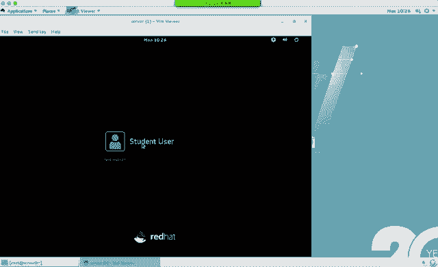

# 红帽Redhat RHCE7培训课程+RCHE7实战参考教程+红帽8.0教材电子版+模拟环境及辅导 - P15：1 - 16688888 - BV1zu41197p6

啊，大家大家好。呃，我们之前呢学了两门课程。那么对于这两门课程啊，来说大家掌握的内容。第一个单物测密码。对于单误跳密码而言呢，你需要知道有一个叫brab菜单。系统在启动的时候。按方向键上或者下。

他会在grarab菜单停止。然后呢，我们选择第一个grab菜单。A。编辑。编辑的时候呢，找到linux16这行，这行代表是系统的内核。然后你找到内核这行结尾的位置。ctrorl加E光标跳到尾行。

添加1个RD点break cancell等于PTY0。按照最下面行的提示，按cttrol X启动。它会通过你修改完了内核来启动系统。启动系统之后呢，你会发现进入了一个只读模式。单用户啊只读模式。

只读权限的一个单用户。那么在指读权限下，如果你想修改sle文件的话，改不了。所以说我们需要mon刚remark逗号RW级别相同的时候，逗号分割，这个是通信。我们把这个文件系统啊重新挂载了之后。

重新挂载了之后啊，你就可以用password改密码。但是呢你当前的根是在内存的根上，不是在硬盘的根上。所以说我们需要通过chan root命令来切换到硬盘的根。那么切换到硬盘的根。

硬盘的根在哪一个目录下呢？在跟随时root。系统会提示啊系统会提示，切换完了之后，我们通过password命令来修改密码。密码改成功了呢。建议大家去干一个事儿。

touch跟点auto reliable为什么要去做这步呢？因为你在用单用户模式挑密码的时候。SE类是默认是开启。而你改完密码之后呢，上下边关系变了，系统在启动的时候，它会来检测一些重要的系统的电。

它的上下边关系。如果上下边关系不匹配的话，那么系统无法启动。所以说你要告诉系统啊，把我重要的系统文件重新标记一下，touch跟点al level，这个是个开关文件。系统会重启两遍。

系统重启另一遍的时候呢，它会做一个重新标记的操作。标记完之后会将跟下面点O退la文件删除。然后再次侦常启动。啊。我看远程同学再举手。有问题吗？啊。啊，没问题，我们继续哈。嗯。改完密码之后呢，敲两个XZ。

第1个AZ退出的是。亲自住。第二个这个呢推出的是大用户。那么对于241上午的考试也。耽误特密码实验是必须会的。这个实间你不会，剩下题没法做，即使剩下题都会，你进不去系统没法做。这是第一个实验。VIP。

PIP这个实验很重要，重到什么程度呢？在RRC的考试当中。我们所有的配置在配置完成之后，都是通过客户端。都是通过客户端远程来连接到你们的机器上，然后进行判分。换句话说，在教师机上啊。

它会用SSH命令登录咱的机器来判断你当前生效的值和永久生效的值。然后呢来计算你的成绩。我们的成绩虽然说是当天能计算出来啊，但是一般情况下是隔一天或者说再隔一天会给你发货假啊，告诉你成绩。换句话说。

IP地址很重要啊，你要确认IP地址没有问题。PIP的话呢，我们课上讲了4种方法。NM satellitelineNMTOY。NM connectionction editor不管用哪一种方法。

最终都是修改的配置文件。那有同学这个问过我这样的问题，他说我们如果直接修改配置文件，应该怎么改？直接修改配置文件的话，你要确认你的proicalproical协议是什么？是n还是DRCP。

第RCP的话代表是动态获得。那如果是烂的话，代表是静态静态IP你需要去设置你的静态IP亚码。那如果你要上网的话呢，需要配DNS如果你要指网关的话，有其他的网段，你需要指网关。需要做get位。

到底设哪些选项是看你的实际情况。考试的时候，IPM拉网关BS这个都会要求我们来做设置啊，设置一下之后，网络重启开机自动启动。再有主机名在企业版器当中新多了一个命令。

叫做house name controlls house name。这条命令又可以来设置永久生效主机名，又可以让它立即成效。在企业版7当中，我们的主机名在跟ETC下叫ho斯内部文件。七当中打的个性。

I一lin。那这道题说白了，它是考你VI宾辑系。还有它的值配置文件在哪个文件？在跟ETC。SElinux confi一下，这个是SElinux的配置文件。那你需要把它配文件呢做修改。呃。

这道题要求是说把enforcing改成permissive。那么你要查到pro5做复制。然后查到等号如粘贴大D删除ZZ网存退出确认改文件之后呢，它是永久生效。我想要立即生效的话。

用side a false0立即生效。get a false呢来确认。这道题主要考的是VI编器，还有SElin配置面在哪？亚棉仓库。亚么逊仓库他考的一个命令叫亚么肯fier manager。

这条命令作用呢是添加一个。样么源仓库文件添加一个样目源仓库文件。如果你不用这条名义的话，我们可以手动的编辑编ETC要么点report点D目录下，自己生成一个X点report文件。

这个文件当中呢需要有方括号。你的样目源名称啊，IDname。杯子UL地址。你那包启用啊你那包启用。等于一相应的值。那如果你记不住这些值的话呢，你就叫要记住要么confi managerage这方命令。

用Ire选项来添加来添加。当你写了一个贝子12录径之后，它会自动来生成你当前的ID和内容。以及Enable这个都会自动生成，不需要我们手写。在7之前的版本，你需要用VI来编辑自己手写。啊。

这是七和6之间还有点区别。那么你做完亚棉棉仓库文件之后呢，这个亚棉仓库不能马上使用。为什么呢？因为我们有1个GPG检测的问题，GPG签名检测建议大家呢用导入的方式啊用导入的方式。

在他给我们这个路径下边呢，会有1个GPGkey1个release文件，你把它导入导入这个公钥之后呢，它就支持签名了。如果你不导入的话，你需要在咱亚明源仓库文件中添加一行GPG拆的等于0，不检测GPG。

那么你也可以使用亚膜来进行。氧块。阿lo啱。对LTM而言呢，在考试的时候。主要考的是扩容。主要考虑扩容，但是。在培训环境当中，如果你想扩容的话呢，你得先创建一个。所以说创建业委会。嗯。扩容放进。

对LDM而言呢，你需要知道这么几个。第1个PV第二个VG第3个LV在整个分区管理当中。24亿一共会考两道题，上午呢会考到。8E和82啊，828E82代表的是交通分区L83代表是LVM啊，这是上午的内容。

下午呢会考到S咖C和83。S scar和83。那么对于S scar而言。能听到声音。对于832。没了。就是全利。对。我就是他。哎，所以我得叫技术。こらない。跑了又不用叫鸡爪。忽然间蹦下来个人。O。

那我们继续。LVM而言呢，你需要知道PBBZLV。物理卷、卷子和逻辑卷。在考试的时候，既然让你扩容呢，你首先应该确认你当天的卷子够不够打VG display。如果不够大的话呢。

你是不是还要创建1个PV呀？然后把卷组扩容，把螺辑卷扩容，记得螺辑圈扩容的时候，让它立即生效的命令。叫啥来着？如果是XFS文件驱动。XFSg FS是吧？如果是EIT4文件驱动。

是不是用reside e toFS让它立即生效？这是考试的时候考点。那么在这个答案当中呢。啊，我们把这个创建。还有扩容。分别写了一下。他们扩容唯一的区别，根据你文件系统的不同，根据你文件系统不同。

扩容的立即生效命令不太一样啊，这个注意一下。那么考试的时候，你的那个分区到底是什么文件系统呢？要注意瞅一眼，然后再来让它立即成效。添加用户合组啊，user爱不fi的。附加组大D非交互的12杠S。

考点是什么？用户的UIDU则mod杠U。pass word使密码。权限。创建文件夹makeDR。缩手组为ad命族，你可以用 change group，也可以用ch word都行。其他人没有权限。

陈志茂的。同组成员在这个目录下创建的文件所属组为额的命。那么所属组为额的命呢，它代表的含义就是考的SGID天modG加S。如果你不要用chmod GIS呢，你是不是可以用初值来表示啊？

SGID应该叫2是吧？第四位是2啊，第四位是2。然后呢，你还把原来个位百位、个位、10位，它的权限也要看一下。Yeah。嗯。啊，请假。不钱啊。Yes。这个是权限的内容。那么对于C嗯啊先随便做吧。

都没有人。呃，计划任务。计划任务在考试的时候呢，它也是个考点。你得知道prometable命令，你还得知道protable文件。为什么得知道他俩呢？因为在用proown的时候，你要注意一个问题。

chn当中它会用到5个星，那5个星是不是得知道它们的含义啊？分时日月舟。那你在做这个实验的时候，怎么来验证的？用没有命令来验证。没有魅力。如果你执行的命令啊是Ile哈楼挨le hell楼的话。

一定要注意，它只有在邮件当中才会写这个内容。那我们应该选的呢是2314。二3十4。分时是吧？行行行，然后命令。在做这个实验的时候啊，要多做一步，看一下这个服务启没启动。是否开机自工启动？安装那盒。

安装内核这个实验呢，它主要考的是RPR命令。他会给你个网络包的入径，直接RPM安装就可以。我用不用说先给它Wble get下载啊。不用了，RPM支持网络安装，直接RPM就可以。而且默认呢就是启动的时候。

第一项啊，默认启动是第一项。对于用户ID和锁ID而言呢。对于用ID和主ID而言。如果想添加，那么杠PJIDUID杠U啊，原始组呢杠小G啊，这是考点。在考试的时候，Ldap实验呢。

它主要考的是一个Ld用户Ldap密码。我们在培训环境中做的实验是Ldap账号，purpose密码稍微有点区别。所以说你们在做的时候呢。如果是培训环庭中。这么来做。这些步都做吧。

如果是考试环境当中就做到这儿。就这区别。对于这个实而言，你必须知道一个叫奥斯坦贝克GTK吧。GTK这个包默认装了吗？没吧装完了之后来执行啊，来执行就可以。剩下呢就是连线体了。

把相应的包装上执行安装安装强制安装，然后呢把相应的内容填上。如果是上午的考试，考试环境当中，我们只需要输入这个内容。晚上。那如果是培训环境呢，你是不是得输入。相应的值啊。财经环境cs。确认。

OKL dive夫实验和科po斯实验一组实验。为什么要一组呢？我们用LdU座0LdU座8。最终想实现的功能，用户在登录系统的时候啊，我是不是可以直接自动挂在你的主头录啊，用完突然还自动挂载。

所以说你需要来查询箱的包装没装，改我们的地图文件。那在这个地图文件当中，子地图文件默认不存在，你是不是弄一份出来？星代表什么含义？行，代表啥？代表home下的某个文件夹是吧？比如说你用Ld用作零登录。

这个形容代表的是不是就ho目下的盖茨词。有印象吗？L代负40。那么后面这个and代表什么含义呢？后面暗的代表是你刚刚这个星是什么？他妈形上。它也代表的是盖茨斯达的代法如和林。啊，这门课是RCE啊。

B上门课嗯我刚才出去确认看。因为一般情况下呀，我们每天呢头20到30分钟啊，都是复习上次的讲名容。配置文件改完之后，服务必须重启开机自动启动。然后呢。验证。验证之后，如果你缺现千导伏正常了。

代表au凸F实验成功了。千岛佛如果不正常，说明autoF才有问题。这个通飞符一定要看懂哈，一定要看懂这个实间建议你们回去做实验。然后呢，你还要去用这套命令配合，你看一下LWU的0，还有主轴在哪。

在这个模糊下吧，一定要确认啊。因为这次考试啊。最近一次考试啊，好几个学生跟我讲过，这个时间他还没做什么。你没做成功的话，一定要确认你的地图文件对不对，服务启没启动。OK吧，你的路径是啥？你的路径是啥？

这个通便茯酒能弄明白之后。那肯定就没问题了。那那些成功呢也是一起听的课呀，他们怎么成功？实验工做哈，熟能生巧熟能生巧。莱那个斯就熟练工种，你做了就会不做就不会，就这区别。同样是一个老师教的。

为什么有的能做出来，有的做不出来呢？你光看能看懂啊，和能做明白那俩事儿啊。交换弯区交换弯区的话，我们是不是得知道文件系统类型是882。然后呢，格式化命令是。Maxwa。挂的点是。刮来点是啥？

我要不写slogve还得写什么？显大都行是吧，怎么让他立即生效？18方，如果是某一个分区的话，这个位置你可以写geinyVDB3。那如果你是这个文件中交换问题都封效的话，杠A。跟漫画张维是不是类似啊？

A代表是傲的含义。二。确认fr。那我们在确认的时候啊，通常会加一个选项杠H啊，杠H为什么杠H呢？因为你看这个大小啊，我们比较习惯是吧？你不习惯买多少T的硬盘，多少G的硬盘吗？

没有人说我买多少字节的硬硬盘，这个也受不了。放弹命令。对于范的命令而言，它的格式是说在哪儿查什么啊，在哪儿查什么。就像我们在windows当中，你使用搜索功能的时候。

也是说在C盘一盘我的电脑里查什么内容。那如果要查属于谁的文件，我们用了一个选项叫杠user，几个杠啊。一个二码比较特别。那如果你要说明是文件的话，那们就typeF没有说明是文件文件夹的话。

typeF是不是可以不写？反正属于优则了，全搜出来，不是文件就文件夹。那拷贝到哪杠EICcopy。为什么我这个位置加个大A选项，杠R选项行不行？杠R的话是不是文件文件夹都考虑呀？为什么加杠A。

在A的目的上是说我拷贝过来之后，这个文件是不还属于哈尔用户，然后它的权限也不变了，把它的权限也拷贝过来。奥属性全都拷贝过来。杠A。就原来怎么样，现在什么样。花括号代表什么含义呢？

画括号代表的含义是说我当前犯的搜索到的结果。fin的搜索到的结果。那为什么分号前面加个反斜杠？分号我知道它代表不车吧，反斜杠代表什么？转译。因为我们当时这个分号吧是copy的分号，不是泛掉的分号。

能看到吗？就你在做任何一套命令之前，首先你要理解这个命令什么含义，每个特殊符号的含义，然后呢再放一起敲个五遍十遍，基本上就忘不了了基本忘不了。对于gpe命令而言，那我们主要考的是杠低。空行。管道大一号。

呃，当天给大家写的时候呢，我是按这个岁序来写的。考试的时候，如果你是先gra杠BHTBD然后呢管道再过滤杠B蜜到这，结果一不一样，一样的吧。你先吃米饭和先吃菜或者先吃菜后吃米饭，结果是相同的，都吃了啊。

都吃了。大句号呢代表说我过滤完的结果生成到文件中。管道的作用呢，将前面命令执行的结果传递给后面的命令。这是管道的作用。抗美力。他面的功能啊打包拆包也就是压缩。呃，如果让你把这个目录下所有的文件都打包了。

所有的文件都打包。压缩成这个格式，扩展名叫他，那应该怎么来做？首先呢你要去确认一下我们到底用哪个选项。是小勾大勾还是小Z？那，BZ two它用的是一个小勾啊，小勾XZ呢是大勾JZ呢是小Z啊，这个要知道。

不知道的话，先瞅一眼，上午三个半点，时间非常富裕。上午3到半点，基本上一个小时能做完，然后慢慢做呢，一个半点也做完了啊，一个半点也做完了。所以你慢慢吧啊。创建压缩包要求你创建在哪，叫什么名，按照要求走。

夫人也可以过来。那要求是说把这个目录上所有文件都打包是吧？看到星没？如果你不写星的话，代表说你把root文件夹打包。那里也区别吧。我说去买点饺子馅儿，我没让你买饺子。别把饺子皮儿带过来。OK吧。

有区别嗯有区别。也，喜望注一啊。然后。做完了之后呢，你可以确认一眼你可以确认一眼。O。NTP。😊，那在企业版期当中，NTP用的是亲商的服务。你需要把它的配置文件做修改。配置文件当中呢。

把原来的使钟服务器都给它干掉。当然你可以去删除。一般我们建议大家给它注释掉就可以。添一个你自己的使钟服务器。考试的时候呢，你的时钟服务器是谁？他会明确的告诉你，复制粘贴过来就行。

ibo呢代表是说我先拼能拼通之后再同步。所以说你在服务重启之后，马上来确认不一定时间同步了吧，有可能你得看两遍，看三遍，等一会儿。然后呢，你要确认这两个值都是yes。第一个叫做启用问题P。

第二个呢叫做已经同步乐。如果NTP没有启用的话，你是不是还得手动的给它set一下set处。最后FSL。那对于文件系统当中，FSL它属于重点文件系统和权限。不管是上午还是下午考试啊。

亲真mod亲 setFACL都会涉及到。但是到底用谁来设计权限呢？考试其中没有要求，你只要把权限给设置了就行。你到底是用cher mode来做，cher over来做，还是下载FSL看你心情。

只要符合题要求就可以。在FACL当中有一个选项是B选项到MM代表什么含义？修改modday饭啊。它代表行业修改，修改谁的权限，又代表是用户，冒号代表是谁。再后面冒号代表具体权限是什么？

如果说其他人没有权限。对于其他用户而言呢，你可以用ch mode来做，也可以用set F来做都行。都行都可以。然后呢，确认。这是这段命令，没有权限的时候，你可以什么都不写，或者写一个减号都可以啊。

都可以。就这个想法很多呀。那这个是我们上午讲的内容，上午考的内容，第一门课第二门课吧。

回去之后呢，大家把这个实验多做两遍。不要因为它简单。看着都会就不练。能听懂吧。历史上上午考试也有不过的。虽然很少，也有啊也有。一年会出现一个。几率很大是吧，跟买彩票，一年能出一个。呃，如果。

你想很顺利的通过RSE考试。就是多练。每个时间弄懂了之后多练。那我们有个标准是吧？任何一道题，我看答案15分钟之内能完成。你这里边随便哪道题，你要是能用过15分钟也挺厉害，是吧？随便哪道题。

你要能用过15分钟也挺厉害。那我们说的15分钟呢，包含排错时间。啊，包含排错时间。大家在做实验的时候，一定不用配波键，为什么？快播店是不是能补全呢？另外一个多用复制粘贴那么长的路径，如果你拿手敲的话。

容易敲错吧。多用户粘贴，减少出错的几率。O。W。下面呢我们来看一下第三门课。254254是红帽的课程代码，叫RH254，叫rightidehead。🤧第三门课主要讲的内容呢。第三门课主要讲的内容。

安全和服务。安全和服务。

在linux当中提到安全的话，你需要考虑4块安全性。哪4块？4款安全性。第一个。第一个我们管它叫做文件系统的安全系。文店系统来。那文件信不安就行。怎么来设呢？我们在之前讲过青真末吧。千州啊。赛坦FAC。

这些都是设文件系统安全性的，是不是本地安全性啊？如果你这个文件系统是fate16f32文件系统的话，你能设置安全性吗？设置不了那个文件系统不支持。大家会发现微软的系统啊，从叉P年代开始。

是不是一直建议我们用NTFS呀？为什么呢？如果你的分区不设NTFS，你在分区上面某个文件夹鼠标键或者分区鼠标键，它有没有安全选项卡呀？没有啊没有。换句话说，文件系统安全性，它是跟文件系统走的。

也就是说你chan mode change ons FACL这些权限都跟文件系统走。OK吧，第一个内容。第二了。服务的安全性。我们在之前做实验的时候啊，是不是修改过服务的配置文件？

一般情况下服务的配置文件都在哪？给你PC一下，它的扩展名是不是都很fig之类的？服务的配置文件。比如说我们之前做过s马服务，做过NFS服务。你在做共享的时候，你是不是说了某个文件夹有什么什么权限。

在配置文件里设的吧，服务的权限。再然后。防火墙。防火墙。防火墙指的是本地和远程之间的一个出口，谁能访问你的服务，那么你的防火墙是不是得开放相应的端口，默认防火墙的功能是不是全拒绝？

防火墙的作用是不是就拒绝呀？我们在一些这个商场当中，你会发现隔一段距离啊是不是有个很大的门呢，在天上悬着啊，那都是防火门啊，防火门。再然后。🤧嗯。在企业版7当中或者说RC7的考试当中。

我们多了一个叫做SElinux。7之前的版本呢有这个东西吗？十多年了，一直有到RSRC16的时候啊，考试也不考。但是到RSRC17的时候考试考。而多了S1linux之后。

我们所有的实验呢都多了一层安全性。它叫做安全增强。为什么叫安全增强的linux呀？是说你在上面123个安全性上面又多了一层安全性，所以说叫增强。我们在家里面每天出门的时候，你是把门给锁上了。

你为什么反锁一下？😡，你反不反锁门是不是都锁上了，反锁一下是不是安全增强啊？不容易开开啊不容易开开。那你晚上去这个酒店住宿，我们会发现呢酒店除了这个门之外呀，上面一般是不是还有个小铁垫儿啊？睡觉的时候。

我们以后把小铁链给关一下，划上，为什么是不是也要增强啊，本身有锁已经锁上了，你再弄个小铁链增强安全性啊。示问一下。你说的第三个这个ge报是全是提供进去。啊，在企业板7当中啊，我们有俩防火墙。

一个叫菲尔报地。那还有一个呢叫做IP tables。两个都有啊两个都有在企业版期当中啊。推荐使用favalD，为什么呢？因为favalD更简单。比apppa4各配置起来更容易啊更容易。它俩实际上是一个。

他们命令配置文件不同，最终使用的都是内核当中的mattter filter。他们最终修改的内核是一样的。最终改的都是类那斯的内核参数。那 filter的内容就是命令不同。嗯，我说问你行像那个。嗯。

那跟这个。不管你用的是哪个linux版本，如果报名也叫firewell D就是一样的。因为类尼个斯的发行版，大家说有这么多发行版，他们有什么区别呀？有啥区别？你会发现你如果是会用一个linux。

你再用其他的Linux，是不是很容易上手啊？有些差异的位置，对吧？但是不多，就像我们在使用微软的产品，你用过windows98。你也用过windows95啊，你也用过windowsNP。

WN7win8win10有这么多版本。那为什么这么多window系统，你也没说特意去学过，很容易上手啊。就因为他们基本上相同。当然有差异的地方啊有差异不是完全一样啊，肯定有差异的地方。包括都是红帽。

七和六是不是也有区别啊？嗯也有区别。OK那么你S一类那个是既然叫做安全增强，你增强乐什么啊，增强乐什么。它是针对于上面3块啊，都做了增强啊，都做了增强。比如说。对于文件系统而言。

它多了一个叫做上下文关系。Change context。或者是用SC manage F context。都是上下边关系。那么他们修改的呀就是文件系统上的增强。文件系统发布的。🤧咳。那么对于服务而言呢。

我们多了个布尔石。做那个布尔石。s S一部杠PP代表是permanent永久生效，立即生效。如果你要来确认的话，我们可以用一个命令叫做get S一步。杠A的话呢是显示所有的不式。显示所有的本。在服务的。

安全性上它也做了一个增强，用布尔值多了个开关。用布尔汁多了个开关，问大家一个问题。我们家里面呢有厨房，有卫生间，有卧室，上面是不是也有门呢？门上为什么也要上锁呀？是不是一个意思呀？只不过门上都是个锁呀。

通常不锁而已啊。但是你家如果来客人的话，晚上睡觉你肯定会锁，为什么呢？因为怕晚上下班。我一睁眼睛，哎，这家伙怎么在我旁边站呢，这多吓人。当然如果很熟的话就无所谓了，是吧？都是自己家人一般都不会锁门。

OK这叫服务的安全性上也多了一个增强，通过布值开关。布尔值翻译成中文呢，就是开关开关。啊，开关啊开关。Okay。那么对于范小强呢，对于范小强而言，我们又多了一个端口的限制。嗯。呃。

这个杠A后面啊还有内容，我就没写啊。这个后面也有内容。这个后面也有内容。这个后面也有内容。O。防火墙的主要作用啊是不是限定端口的呀？SE manageport也是来限定端口的。

如果你的服务不在这个端口列表当中，那么不让你启动。那烦去了。换句话说，SElin是不是也多了一个安全性啊，安全增强。那有同学说了。我可不可以把SElinux这个功能全给它关掉啊？

我可不可以把它的功能全关掉？我们在之前上一门课是不是讲到它的配置文件吧？如果你将它的配置文件改成Dcbo，是不就关了呀？如果你把它的配文件改成diable。相当于关闭。关闭SElinux之后。

你下面这些功能还有了吗？都没了啊都没了。那如果你是inforcing的话，下面这些是不是都要考虑呀？这他们的区别。🤧嗯。针对于上下文关系，考试的时候呢，还会有这么一道题，单用户跳密码。

我们是不是做了一个au torelaable的操作呀？Re label。它也是针对文件系统而言吧，文件系统安全性。你在做toash的时候，这条命令，它的功能是不是开机之后。

系统会自动按你数据库中的综合值去做restore context。它的作用实际上就是告诉系统重启之后给我做恢复restore。Context。Yeah。按照数据库中所有的值全够作re。

那么在SERCE的考试当中，RHCSA的考试当中。整门课程当中会考这么几道题。第一道题。你需要知道配置文件怎么改？上午的题呢是说把inforcing改成permissive。下午的题呢是说把这两台机器。

permissive改成infive。这是上午和下午期区别。都考这道题。然后。下午题呢会考一个上班服务。上班服务你可以用chan contact来做，也可以用IE manager来做。

It道 contact来做。re context呀，它实际上是说这条命令它是修改数据库的值吧？然后rastore contact是不是立即生效啊？他俩是一对儿。然后呢，做单户跳密码的时候。

你是不是得干这步啊？这第三道题啊。第一道。第二道。第三道。第四道题是啥呢？第四道题是阿帕奇服务改端口。阿帕西服务啊要求你们把这个端口啊。改成8089。8980之类的端口扶务起不来啊，通过开放修改或者值。

开放端口让它启动。那么这个布尔值我们什么时候用过呀？咱们在做实验的时候，是不是经常遇到啊？我们之前做实验，讲没讲到KVM安装一个虚拟机啊。使用到一个光盘镜像吧。

然后你会发现他是不是提示一个peration的问题。虚拟机不让使用NFS上的FISO啊，所以说你说的修改过值。再有你用FTP服务。去干什么事儿的时候，没有权限，也有布尔值的事儿。

服务的权限都跟布尔职有关。他不一定从哪儿出现啊。一共有1000多个不室，我们可不可能都讲啊？不可能吧，那怎么办？你是不是得去知道一个叫NVR logmessages文件？跟VR那个message手机。

这是安全。安全四大块。ok。那下面呢我们再来看一下。这一门课既然要讲到服务，你是不是得知道服务配置思路啊，服务怎么配？知道思路之后，我们只要把。你的操作步骤往思路里面套。你就不会丢步障。うん。

派服务的时候呢，首先你要考虑的肯定是。物理槽。物理层什么概念呢？连门连接是吧？把线连没连，交换机通没通电。wifi是否已连接啊，wifi是否已连接？那么在考试环节中，这个需要我们考虑吗？不需要。

因为考试的时候，我们配的是不是都是KBM虚拟机啊？所以说上来之后，物理层不用考虑，但是你首先要考虑的什么呀？IP。IP考虑完了之后，我们要考虑什么？手机名吧。然后嘞。插包吧。插包再然后呢。

一般我们考试中用到的包是不是都没装？但是有的包是装了，比如说NFI有Qs。开999啊开99。大多数的时都没装。包装了之后，我们的习惯通常是不是查一下。配置文件吧。查一下配什么电。查到了配置文件之后。

通常我们是不是修改配置文件？修改复意见。而配置文件通常是不是在跟ETC下某个路径。跟ETC的某个路径下。然后呢。你的配件件吧。我们的配置文件一般是不是都什么CONF是类似呀。

它到底是在跟ETC还是跟ETC下的某个路径下？用RPM杠QC是不是都能查到？查到了配件键，改完了之后。我是不是要让这个配置文件立即生效？那么你要干什么？重启吧。重启。啊，我们写大写吧。

这个文面都写大写哈。小大仙，你知道哪个位置有变化？可い。当我们将服务设置重启了之后，你还应该干什么呢？顺手去干一个事儿。你内部。开机自动启动。Yeah。开机自动启动之后。

如果你想让其他人来访问我这个服务的话，你是不是要开防火墙了？这样吧。Permanent。能填服务是不是填服务啊？能填服填服务，填完服务之后要干什么呀？🤧是不是要让它reload立即生效啊，防火墙。

最后一步。测试。我们测试的时候啊，有个思路，先做什么测试啊？本地所示，然后呢。远程测试。先本地再远程。嗯。在整个服务配置过程当中。服务和安全这2块你都需要考虑。你都需要考虑。不是说光看服务就完事儿。

1234567890没了。除了看服务之外呢，你还要该去看权限，安全的权限。4块权限都需要考虑。举个例子。我们来说一个场景，当你共享一个文件夹的时候，你想让别人来访问。你肯定要涉及到四个权限。

从远程来访问你服务的话，首先走的什么程序？强方晓强房小强权限进来了之后，可以访问你的服务，然后走的是服务的权限嘛。服务的权限走完了之后，最终要写到硬盘上，是不是要走文件系统的权限？那么在这每一块当中。

是不是还会涉及到SElin？都有个增强啊都有个增强。我们会发现去过安检的时候啊。早上坐地铁不检，如果你有包包是不是塞里边。但是呢是不是还有个小姑娘拿一个棍子在你身上拍来拍去的呀？啊，跟咱跟你比划。

也就我们极好是吧？拿棍子跟我比划。当然他们人多哈。所以们两个。OK安检有个增强性啊有个增强性。你把这块内容学完了之后啊，第三门课就很容易了。第三面所说的所有实验都是按照这个思路来做。

我们课上讲的所有实验呢，你学完了之后，你往里面套。这个里面最容易忘的是第八步。所容易忘了inable，为什么呢？实验做完了之后，一测试都正常。但是在考试的时候，你答完卷之后，老师我做完了，考官我交卷。

然后你走了之后，考官会干件事，扎当当20，把你机器重启。把你两个KVM虚拟机重启。如果你没有做Enableable的话，你那个服是不就起不来呀？能理解吧？很重要哈，所以说你按照思路来配，买步都不带辣啊。

买步都不带辣。O。那下面呢我们回过头来。Yes。看第三张。你看为了等某位同学啊，我一直没开始讲是吧。多好。我们前面是回忆了一下上次特讲的内容，然后大概讲了一下第三门课要讲什么啊，讲什么。

下面呢我们看第三个。第三门课第一章。呃，这章当中就讲一条命令，所以他们看抽。这条命令我们在第二门课讲没讲过。两个吧。因为这个东西很重要啊，所以说第三门课我再次来强调一下他能干什么。sD它的作用。

在很多年来呀，linux和unix当中一直喜欢是INIT系统中的第一个镜头。但是到解满7的时候呢，我们换成了sD。写他么地系统中第一个技能变了。那为什么要换成sD呢？第一个并行化功能。提高启动速度。

微软呢到windows8开始。大家会发现这个系统启动是变快了。而且到V8开始呢。如果你是买了一些平板之类的设备啊，买笔记本，你会发现你的硬盘默认是个是GBTEFI呀。你的bis默认是EFI，然后呢。

你的硬盘分区表默认是GPT分区。这是为什么呢？它是不是也是为了使用这个B行启动的概念呢？提高启动速度优化。按需启动守护进常。按需启动，那我们是不是可以引mailable可以背c宝啊？

不用的服务是不是都s disable，用的服务都以那种按需启动。实际上去之前是不是也是按需启动，check and make on check and make off也一样。

但是我们又多了一个功能叫做自动服务依赖关系关理，防止长时间超时。以前的时候呢，如果你网络出问题了，这个机器就卡在网络服务这儿了，它不往下走。能理解吧？不往下走，启动不了。但是到斜版期CD呢。

它解决了这个问题。自动服务依赖关系。学用Lux来控制组。哎，我们多了个组的概念吧，一个进程当中啊，我们用个组，一个组当中可以设多个进程。也可以设一个进程啊，多了个组的概念。进程组。C怎么ctr。

我们的单元类型有一堆。在做实验的时候呢，你的服务名可能叫SSHD点service。通常情况下，service可以省略是吧？因为只有一个service，它也是唯一的。

service代表是服务stockocket它也是服务。那它翻译中文呢叫做套接字啊，套接字。他俩的区别是什么？举个例子。大家听过tnet服务吗？经过SSH服务吗。我们默认远程管理服务器的时候。

是不是都是SSH？SSH它属于service。他那在服务他属于scket。他那服是OK。Yeah。他们都是服务啊都是服务。那么他给他给的代表是目标。在企版器当中，我们默认启动的图形。

默认启动字符都是通过修改，它给它来进行设置。图形的话是不是叫gal他给他的？字符的话是不是叫mary user target？啊，我们来瞅一瞅。Sa from my control。呃。

如果直接会车的话，一堆吧。大家看后面这个点儿，后面的名称是不是有service啊？や service。这不也有scket的呀。套件4。是不是要他给谁呀？目标啊一堆。在这些目标当中呢。

我们先来看一个SSHD。呃，如果用最强命令的话，是不是可以来看SSHD这个服务的状态呀？我们在敲命令的时候，如果你手机嘚瑟，敲了个table键，大家会发现它后面是不是带了个service。他就是个服。

他就是服务。那当年我的机器上有carnet服务吗？开播电开播不出来吧。要么 list。他上耐克箱。猜猜哪个是服务。一そ？骚玩那个是吧。啊那还骚啊。这个是套奈的服务。我们把它装上。装完了之后呢。

依然通过ts来确认。Ter night。系。我们用音乐宝宝。那部。看到没？他叫scket。他稍的。那为什么我要内呢？因为正常情况下，我们是先给它设成开机自动启动再启动。就是如果你要敲命令的话啊。

那为什么我们讲思路的时候都是先重启再设开自动启动的？因为你是改完配置文件立即生效还是永久生效啊？永久成效。然后我们是不是想办法让它立即生效啊，因为是上一步是配置文件。但是如果你只敲这两个命令的话。

大家可以看到我现在敲一个star。carnet摁pa播键能列出来吗？没反应，你table键摁碎了也没有反应是吧？摁碎了也就心疼没有反应。那我们怎么办呢？Enable。能看到吧。太ilenet它叫套件字。

这个是太阳net的服务。那么他给他呢，我们在之前讲没讲过这条命令。Get default。当年我系统默认的运行级别是什么？graifical吧，默认音频级别。那如果你能get，我们是不是也能set呀？

St default。设置market user。最后你再干。大家可以看到，当前我。他给他是变成了maryU的。它代表的含义是说，系统启动的时候默认启动字符界面。

我怎么知道默认启动字符界面呢？去看吧。我们可以看到ser这个虚拟机啊重启了是吧？这个是开机的过程。如果是图形界面的话，一开机是不是会有个图形啊？用户名字符界面的话全是黑底白字，然后主机名冒号。

让你瞧账号没密码吧。看到了吧？字符界面。他给他代表行业，代表目标系统默认的运行启动级别是什么？如果。我现在再去做一个操作。现在你要是登录的话，是不是敲账号名密码啊？洛克。密码是啥来的？红帽吧，帅的害了。

我敲一个命令star X。stopX什么意思啊？

开始图形。那么他会用当前用户的身份启动一个桌面应用。注意我说的词儿啊，启动一个桌面应用。启动完桌面应用之后，你在这个里面是不是可以来使用啊？然后。有注销没？

促销。你会发现当你注销之后又回到哪了？是不是又回到井号了呀？又回到家好了。现在我敲个IIT5。启动图形了吧。init5和star X它俩区别什么？init5是系统的运行级别的切换。

运行级别的切换相当于临时切换到了gal点tget。临时想完，而sta X呢是说我用刚刚用户身份打开了一个图形应用。有区别吧？打开个投音直接就进去。那你在这个里面可不可以用siel来登录啊？CB的。

也可以吧，那么你注销之后，是不是依然到你刚刚登录的那个减面？

注销之后。

老高。那大家可以看，依然是图形登录的界面。那你怎么回到原来的那个字符界面呢？嗯。你既然用IEIT5能启动的图形，那我是不是可以用IEIT3切换到字符？IP5和3呢是临时切换。

立即成效，临时切换重启之后呢，都以你那个mar user为准。你赛的 default是谁，以谁为准。我理有啊。O。😊。

你唱个IET3。图像是不是关了呀？回到字符。那你想每次开机的时候。你要每次开机的时候直接去自动进入图形，那你是不是应该C to controltl先盖再瞅一眼。现在是maus吧，想每次都启动到图形。

那我们是不是应该得去s一下？在他说什么？Graracical。塞在国飞勾之后，我们再次来重启。

是不又回到图形了呀？这组实验呢主要跟大家来讲解的是set default。

每秒讲这组实验，为了说是他给。在考试环境当中啊。跟我们培训环境还有点不同。咱们培训环中serv和 desktoptop一开机默认是不是都图形。我人都不晓。考试环境呢两个讯机开机默认都是字符界压。

如果你就是想用图形的话怎么办？你可以去登录一下set default。不肺口吐气，是不都是吐小了呀？也行啊也行。只不过我们不用而已啊不用而已。吹一嘴啊，因为有同学一到考试的时候，发现哎这个环境不一样。

就紧张，别紧张哈，默认的他给。他给的不同。

🤧。🤧呃，第一个内容。SSHD是不是服务啊？service是写不写都行啊，强调一下。第二个内容，tnet服务。他阳卖的服务装完了之后。再他 control。Enable care night。睇播剑。

他是stockocket。他是双开的。第三个内容，默认的运行级别，或者说叫目标，我们是graphal，一开机启动图形吧。然后呢，你是不是可以给它设置成mat user？字符。这个就是我们数字3。

然后再确认。确认完了之后再重启。再重启。呃，我们去笔记里写了啊。调消鞋。

不太方便。

🤧。呃，呃坐到这儿。第一组实验吧。然后这个是默认目标。我们这个是用谁做的呀？用serv做的吧。远程和本地做的都随一好。确认。确认了之后，一重启一重启之后，如果你想看到现象的话，你必须得去哪看呢？哪汉。

是不是搜入本地看的？怎么去搜索本地呀？🤧在防贝上。

桌面上是不是有一个快捷方式？

看到没？在房地上利丝网。fination桌面。6骚了。你会发现我们这个系统啊是默认进到字符界面的。金到四傅见面之后。你可不可以叫张浩名？可不可以敲密码？可以登录。那如果你在本地啊想临时切换到图形。

我们是不是可以使大X一下？可以吧，知到X。s大X它的作用。使大X才会有。井号怎么做呀？就是吧嗯就是。它是相当于启动一个图形应用。临时使用。这个应用呢就是你的桌面。然后呢，你注销。注销会注销吧。

右上角用户名注销老高。🤧注销之后，你会发现你是不是又回到了字符终端？又回到了组么办？回到自播终端之后，我们可不可以敲1个IT通格5啊？可以启动图形吧，这个东西呢它也是临时。切换。临时切换哈为。

临时切换目标，E5就相当于临时切换到了gphal。临时切换到了Gfi下。え。公cycl。临时切换。在你注销了之后啊，依然是图形的登录界面。所以说你要敲个init3。这个也是临时。临时切换到。写个字吧。

到。My user。那如果想永久切换呢，每次开机的时候自动启动到图形。System control。嗯。临时切换的话，你可以get瞅一眼，get的这个是永久的值，开机的时候什么样？Site。

Graphical。你把你开机默认它给它设成图形了，这回你再重启。说开机又回到图像了。🤧。这个又是一组实验。那么我们在做这组实验的时候啊，依然是在server上来做。

但是你这个server啊是在它的相当于本地吧，server本地来做远程做不了。强调一下啊。🤧Yeah。他给他理解了吗？目标。我们继续。看到devicemount凹 mount了吧。得外私是干嘛的呢？

行ます。对外是叫设备。こ。我们之前在做分区实验的时候，如果你的分区生效了，那么它会在跟 deviceice目录下。是不是会生成相应的分区啊？当前我这块硬盘有别的分区吗？没有。而且我们在做分区实验的时候。

如果这个分区已经使用了一个分区，已经挂载了一个分区。当你再分区让分区表生效的时候，是不是要pa proper一下？然后呢，这个目录下是不是会生成一个文件？分区生效，这个叫device设备。

在sstem control当中。他们海哨。降T。Harp。设备。大们也来练一下。Great。Yes。大家可以看到很多的设备。看到VDA和VDB没？能看到吧。他们都属于设备类型。

dir deviceice设备类型。VD。看到VDAE没？是不是分区啊，它也属于设备类型。大家看你这个点点点后边是不是点dice呀？OK吧。先是设备。画了点。Mo子。😡，我们在之前用过mark命令吧。

花仔。那我们也来瞅一下。在这个里面呢有一些点mount子的设备啊，点mount子的设备。呃，NFSNFS什么呀？是一个服务是吧？挂在。插的那些。这个类型是给谁用的？

我们可不可以直接将某台服务器的NF挂载过来？比如说。将17225。1725点24。250。没有0。250。我把它上面的content。挂在本地的麦点下。能挂吧。看到了吧。就是mon啊mon设备类型。

那么out凸 mount呢，我们在之前是不是讲过一个叫做out凸 FS。自动发的。那么它对应的。就是我们这个里面的。Oh two。要脱吗？文件系统。看到妹斯科这词没？眼熟吧，在哪见。自动挂载。

他跟他是对应的。那么在我们这个里面呢，还提到了一个叫snni shot。sn shotsni shot是干啥的？大家看。我们在讲LVM的时候，讲没讲过说可以给分区做快照。创建一个逻辑卷。

V一的区别多了一个选项放S吧，跟它是对应的。OK吧。嗯。这个用A来指例。VDA。Mot。Mot。Fund。奥 to f。连不上。刚刚讲的这一堆呀，都讲是CD。他跟你干了什么事情有关。对外斯设备。挂在脸。

奥特FS。S内shot跟谁有关呢？它跟LOVM有关。LloV pretty。我们在创建逻辑卷的时候，说要指定大小啊。指行大小。然后呢，在哪个电阻中创建吧。如果要创建快照的话，是要杠S啊。聊问一下吧。

LOVM讲的内容，没印象的话，回去翻第二门课的文档。码都有。这种实间不要求你们做啊，就要求你知道有这个东西就行了。我们是不是有好多类型啊，好多type。嗯。

带来看服务状态啊服务状。对于服务状态而言，大家要知道几个词儿。第一个，你要知道enable the它代表是说系统启动的时候启动这个服务叫enable。它想反义词相对应的反义词叫做baable。

开启启动系统的时候不启动这个服务。不启动。那另外一个呢，你要知道X。XO代表是说我当年服务启动乐吗。现在启没启动，现在启没启动，当前的状态，阴然KO代表是没有启动。那么这三个active。

他们都代表是启动乐。那它们的区别有什么呢？如果是running的话，就是当前运行一次之后呢，接着运行。叫running是不是有个持续的状态呀，简容也行。如果existit呢是说当前启动了一次。观太。

成龙他启动一次之后不管。那没听呢。启动乐，但是他正在等待一个事件。等待什么事件？俺早上起床了，你正在等一个电话，就是等一个试驾啊，等一个事儿。

inactive代表是not running not running load data呢代表是说你已经设置成了enable，然后呢，系统启动了，它已经low data了。low data成功之后。

正常是不是叫active啊啊，这个是一个过程啊，这个过程它是前面显示的内容。磁 data呢代表说你没有设置成机内部。然后呢，当你自动启动的时候。可以被enable啊，可以设置成enable这t。

静态静态。那我们来看一下这几个值，用tatus来查看。

我们看第一个词儿，enabled。当你用s controltl enableable一个服务之后，这个词是我 enableable的。如果你系统启动了，它利用这个enableable的启动乐。

那么它会显示loadate。载弱了吧。载入成功乐，那么现在系统是不是在变成I？SSH服务是不是持续运行？我随时可以来连吧，所以说它叫running。什么时间呢？当当当一堆。

我们在下面呢大家可以看到有没有一个叫group啊。我们说CtD是不是有个组的概念呢？控制组啊。C叫做conttrol格入或叫组控制组，它里面是不是就一个进程。你里面就一个进程，也有控制组。啊，又控制嘴。

就像。这个我们有有些职位呀，比如说市长。市场官挺大的是吧？然后跟市长官差不多，还有一个职位叫什么呀？叫书记，你说书记官大还是市长官大？书记管大，为什么呢？党啊啊，跟党走了吗。很打扫。

你看我们看看抗战片有个团长。然后旁边有个政委是吧，还得跟党走啊，还得跟党。你说团长大还政委大？貌似好像听团长，但团长还得听真伪。还有区别的吧？把跟挡走啊。OK控制组知道是谁了吧，这个就是打啊。

那下面呢有些状态。一。服的状态。OK对于sma control spec而言呢，要求大家知道就这个词儿。你年吧。这个词儿active。不是他俩的话，你要给变成他俩就OK了。我们在之前讲服务配置思路。

你是不是设置restar，设置了enable就弄他俩的。in enable设置的是它瑞斯 star设的是它。OK了。永久生效，未即生效。继续。😊，🤧嗯。用s controltrl来查看单元文件啊。呃。

se controltrl啊会列出所有的单元。如果以type service呢只会列出服务。你要是type mounted呢，会列出挂载，有外都可以立类型。看状态的时候，我们看状态的时候。

通常回家一要杠勒选项。为什么呢？大家看后面这个位置是不是点点点啊？此处省略一万字。那么这一般字写的到底是啥？大家都看过小说吧。很多人在看电视剧，看小说的时候都着急用看半结局。大结局实际上你自己都知道。

还非要看。看电视剧的过程啊，就是慢慢。慢慢看那过程不是为了看结局，你要看结局的话，就不用不必要看了，是吧？这个。这个也是一样的。你要想看过程的话呢，再家看下面有个词儿。这个词儿啥意思？服了。

福了是什么意思呀？完整的吧。完整了。你去买碗米饭，中午吃饭的时候买碗米饭，然后上面被人骂了一口，你是不是让老板换一个？买个馒头让别人咬了一口，你肯定得坏。我们要看完整的完整的怎么办呢？

刚乐乐就是服了的意思。为什么说杠乐不是杠F呢？俩乐呀。看到没？因为他俩啰嗦是告诉你。OK看到这一万字说啥了吧。看到没？说的很详细，怎么那么回事。那当今下面这段内容啊，它显示的实际上就是日志。日志的内容。

在日志当中把跟你这个服务相关的内容给它过滤出来。日志的内容。这个里面说了一句话，说谁。从哪儿？用什么端口连到SSH了？然后它的指纹是什么？看到没？谁登录到这台服务器了？250是谁呀？说防内呢。

我是不是对用root身份通过访贷身登陆到这台机器了？东口号是不是一搭4以后随机那个端口啊，来到了他。但然后。is active和is enable的这两个选项，这两个子命令，它主要是写脚本的时候来使用。

在实际工作当中，你写脚本的时候，你需要去判断那个服务启没启动。如果没有启动的话。我给他启动，如果已经启动了的话啊，我怎么样？我们可以做脚本吧，做判断。呃。咱们这周啊会讲到脚本的实验啊，两个实验脚本。

用if来做判断。Is active， is enable。那你既然st controltrl可以来列出单元。我们也可以用类似的un。指定啊就列出单元。类似un呀和上面的st control。

它们的格式不同。区别就格式不同，结果相同。那如果想列出单元文件。list unit files， unitit files。这个叫单元文件。那我们来看一下区别。有个叫fis吧。回车。

大家看前面叫单名文件，后面叫状态。我Q推出，如果你列出的是单元的话。有哪次。如果你列出是单元的话。看到没？内容很多，单元和单元文件的内容是不同的。133个单元。单元显示133行。

如果你要是列出单元文件呢。不槛有区别吧，是不是更多呀嗯更多。一个单元里面是不是可能住好多人？更详细一些。在单元文件当中，我来查一个东西。我。呃。第。大家来看一下。有没有个特殊的目标？这三个我你能想起啥？

重启是吧，它默认是什么状态？借用。啊，换句话说，以前呢在期之前的版本。你在服务器上默认三个热键，系统是不是自动重启了？很危险吧，不用账号名密码。不用账号密码，三个热件也能出齐，这事儿很危险。

所以说到企业版期的时候，我们默认是不是有一个tt disable的呀。默认是禁用的啊，默认你三个热键没反应。

啥意思呢？回到这个位置。看天上摁三个热键，cttrorl to deletete了。你看它重启吗？不重启7之前的版本默认你这样它就直接重启了。都不用登录。

都不用登录，太危险了吧。Lt unit5。Fse， unit files。所以同们cttrol feel the。fe是什么意思呢？失败了。大家看这个位置。阿C1点local这个文件大家见过没？

Yeah。这了吧。在7之前的版本，我们是不是用过一个叫做开机脚本？我想一系统开机的时候，执行什么东西，你可以往这里写。到企业版期的时候，这个服务启动了吗？fa了没启动是吧？启动失败了，没启动。

而在我们的考试当中有这么道题。做脚本别名。脚玩别名每次开机的时候自动生成个别命命令。这个谁啊，我们之前讲过没？ize咱们当时是把它写在哪个文件中？跟ETC的白沙C里吧。如果你是考七之前的版本。

这个服务默认是启动的。那我是不是可以把。白alies不写白沙C，写这里面也行啊。能理解吧？7之前的版本为什么到期的时候，我们不用这个文件，因为它默认没启动，或者说启动没成功。

所以说你即使把个赖s写在它里边，它是不是也不生效了？等你有啊，你。查看状态服务只要启动了，它是不是都有进程啊？你的进程ID是1073，那么用PS命令看进程，你的进程ID是不是1073？

停止服务服务如果停止了，它这个状态是变成inactive。停止服务我就不给大家演示了啊。先停止服务再启动，就restar啊。依赖关系。Le dependence。せす。列出依赖关系。我们看下面这个。

Default target。当你塞在 defaulter之后，你默认的他给他是谁，他基于谁？会列出来关系。大家看这个里面有没有个m柚的啊。他给他吧，然后上面是不是有一堆服务？能看到吧？

一个目标当中可能包含另外一个目标，然后呢，它里面基于一堆服务，是他们的关系。mask mask的作用呢叫做屏蔽。骂石个中间的平地。在7之前的版本。

我们可以用cheick confi杠杠deelete删除在服务列表中删除。我们首先来看一个服务IP tables。当前这个服务是不是diable inactive啊？然后呢，我们还有另外一个服务。

防火墙吧。防火墙服务。现在呢我想把IPKbo给启动。I p t。能启动吗？启动了之后，你再来看一下防火墙。方小翔变什么状态了？🤧inactive了是吧，然后呢。

IP tablesIP table是变什么状态呢？嗯，看的还不对。IP tables。他是变启动了呀。换说话说，他俩能同时running吗？不能为啥？

因为他们最后啊改的是不是都是内核当中的mfi fire呀，网络过滤器。网络过得细，所以说他们只能运行一个。那你说在写板棋当中。有些人可能手机得错，就IP tables给他起个。他知道は。那么它启动的话。

是不是走IP tables的配成件？あ配点い。那怎么办？防止没操作的话，我们可以怎么来解决？你可以给它屏蔽掉，你把它给骂死。骂死什么意思呀？有一个电视啊叫做周星驰演的九品芝麻菇啊。他最厉害是什么？

这俩就嘴是吧，嗯把人给骂死。一个弯子铁锅子他给骂直了。随便把他骂死。Happy tables。大家会发现你骂死的时候，实际上它是做了一个软链接吧。把这个快捷方式链接成怒空设备。练成空设备之后。

最后我们再来看一下状态。看这个位置是不是骂死了。现在我们来看能不能启动。我做个瑞斯达。不让做是吧？我做个stop。让做。我做stauff。说不让做。能看懂吧。骂s的含义也就平。那它的功能啊就是屏蔽之后。

防止你误操作给它。也死吧，都干不了。Yeah。嗯。嗯ん。stop可以是吧？关系开不行。是。mas你可以关，你可以提。这mas的操作。设置开机启动式加载s controll in内。

收到inable之后呢，这个位置词就变了，变成able。原来呢默认是diable的吧。系统中所有的服务，如果想让他开机自启的话，你都要给他设成Enableable。如果你查看一个服务。

它显示的是no such file or directory代表含音说这个服务没有装。这个服务没有装。举个例子。这个文件存在吗？上面的配置文件。这个文件来自于哪个包？三八包。考试的时候啊。

有同学上来之后就直接编辑sm的配置文件，最后服务启动不了。为什么呢？因为三八的包有几个呀？🤧sber的包有3个，这个是它的配置文件包，它是存在。那我们说还有一个sber client包。

是不还有一个叫三把包。availableavaable代表是可用的密装是吧，这个是安装的。能看出区别吧。那针对这样情况啊，我们直接启动。18克。上吧。嗯。看到提示了吗？截不了。或者说你看ss。

看到这个词就服没爪的意思。运行级别。我们是不是用了IIT3和IIT5啊？那么除了三和5，剩下这些，他们代表什么含义呢？这个是课外内容啊。😊，你网卡的配置件在哪个目录下？是不是在这个目录下？

我RPM杠QF能不能查到这个文件夹来自于哪个包？能吧。文件夹。我不插文件了哈，插文件夹，那房子谁盖的，我不管他谁的，我问问房子谁盖的。😡，然后呢，你会发现它来自一个叫做初始化脚本的一个包。QF能查到啊。

然后呢，在这个包当中，你去查一个叫user。为什么要插user呢？我们所有的文档是不是都在user shared下？能听懂吧？所有的文档都在这个模录下。然后呢，你会发现唉有一个这个版本号。

这里面是不是好多文件，其中有个叫什么？系统控制文件。在这个文件中写的就是什么呀？这个文章写的什么？这篇那容是不是就写了你些关键词是啥呀？给你们看一眼啊。俩先要过去。你既然是想查看。这个文件。

我们最终是为了看这个文件的写法，但是这个文件是不是当你用网卡的时候，它自动生成的呀？所以说你能用RPM当QF来查这个文件吗？看到没？它是自动生成的。那我不知道他是哪来的，我插文件夹行不行？😡，可以吧。

查完文件夹之后，你是不知道？这个。包来自于哪儿啊？我们有个命令叫做QL，还有个命令叫QDQD是干嘛的呀？D代表是documentQD是专门来查文档的。QL是看包里面都有啥全部。全部里面包含包含文档。

包含配置文件，能理解吧？包含的命令。你用QDQL随便嘛，因为这个之前没讲过，所以说给你们写，就说用QL吧。在这个里面看没看到一个叫syst confi点TIT呀。这个代表什么？版权这个呢。

你这个版本有什么变化，趁着唠go吧。IPV6的跟你有关系吗？静态路由到IV6。我们是不是想看PIP呀？是不是就下面这两个了？Ct5，这个呢是我们之前呢学过的一个东西啊，6的时候会用到。NTSR4B。

那是不是就剩他了呀？剩下这一堆啊都是什么？一是不是都是命令？对吧。这些是不都是慢手册呀，慢几的手册啊，就看他。okK我们找到这个文献。VM。你会发现这个文件中好多的内容。

他说跟ETC systemt figure上面的形。星都有啥？一堆我们对谁比较感兴趣啊。🤧是不衣 can fake是什么东西，在下面说了吧。看到内幕对外是没？IP给的dress0prefix0。都有吧。

就你要用的选项啊，这里面都有get位网关upput是啥？很详细吧。这说明你是不是得慢慢写呀，写你的配置文件。刚哥问了啊，你跟老假。Okay。我他来。好一些。刚才也没注意，电影源没插呀。

差点捡两颗黑瓶子嗯，O。我们继续。下面我们继续上堂课的内容。在上盘课呀，我们讲到了三和5三和五代表啥来着？开机进入字形，字符开机进入图形是吧，3毫5。那零和6代表什么呢？00这个数字代表完了吧。

这个系统用完了，是不是代表关机啊？雷阳代表示关机。innet0关机。那六呢。为什么每次下课的时候，我都建议各我同学出去溜达一圈啊？嗯。溜达一圈溜达一圈的目的是为了释化一下内存吧。啊，收换一下内存啊。

放松放松。对于系统而言，如果释放内存的话，是不是代表重启啊？重启系统。那一呢我们在之前做没做过单用户实验。做了吧，耽误时间是干嘛嘞？都可以调密码。可以改FI客播文件，能干好多事儿。

那世界上只有一个人的话，这个人什么权限？管理员吧。那二呢。两个人的时候能玩象棋吧。是不比一个人多一些东西啊？一个人做些东西。那二和三是类似，两个人能玩象棋，三个人能玩斗地主。换句话说。

三轮比二要多点东西啊。他俩差个什么呢？他俩就差一个服务。NF图。没有NFS服务就是R啊没有NF务就是R。那三和五之间是什么呢？字符和图形之间啥也没有。字符和图形这些啥没有。嗯，就不可能说又有字符。

又有图形，所以说叫4。在7之前，我们默认的运行级别是用inpa来设定。在它里面呢有1个ID点defa。到写满期的时候。我们是通过这个命令来设定默认的运行级别。企业版期的时候。7之前我们怎么弄的？

其之前你需要编辑跟ETC下载init table文件。在它的里边呢有那么一条叫ID。挤点以后。有这么一行，你只要把这个数值啊做修改。比如说改成零了。改觉零什么结果？一开机就关机，一开机就关机。

改成6呢就一开机就重启了玩儿啊。那正常是三和5是吧？这个数一般用的比较多，就3和5。当然有些人呢就非要弄的奇怪的，就0和6啊啊0和6。这7之前的版本。Yeah。那么到企业版期的时候，还有这个文件吗？

帮我们来瞅一眼。

大家会发现这个文件一共15行。全是井号开头的行，全注释行吧。在linux当中是不是讲究一个叫向下兼容啊？7之前的版本我用过我用过6，用过5，用过4啊，我都用过。然后到7的时候一进来唉，不一样。

我想设置当天默认的运行级别，大家看14行。我可不可以用LN命令去做一个快捷方式啊？把谁呀？把一个什么ta给链接到default，什么ta给呢？看到90了吧。m user graphical。

你在使用sst control set default的时候，在设置的过程当中，那实际上你用的就是它这条命令。在他命令是不是说做了个快捷方式？オ。那我再给大家来看一下。

回忆一下set default mar yogagur。看到下面这两行了吗？你看最下面这一行。这个是不是也是做一个快捷方式？V的区别，你是不是多了个IM？删除吧，刚刚我们在。他是不是说SFSF什么意思？

F代表强制吧，目标存在我覆盖。那我这个是说先先通目标，然后再创建软链接，结果是不是一样？唯一的区别就一条没令，两条没令的区别啊，就这区别。在企业版7当中依然存在这个文件。那么在这个文件当中啊。

还有一个内容，大家看到第五行了吧。在7之前的版本，我们有有一行叫做conttrol out delete。然后后面写一个沙单杠20。按三个热键对应的命令是什么？那么到企业版器当中。

如果你想进用三个热键的话，我们是不是可以stem controll disable control deleteelete target给呀？只不过在我们当年培训环境中，是不是已经帮我们diable了？

实际工作当当中，如果你想去做操作的话。你也可以。Yeah。s the controll啊，maskbaable都可以。这是7之前的版本。这个文件有两个功能。它里面还有另外一个内容就是。Ctrol up。

 deletete。这点点的意思是中间还有一些内容啊。他会执行个沙帮杠的迷离。摁三个热键立即重启。如果你想要这行失效的话，是不是加个井号啊？加加井号注释吧，不让它生效。怎么让这个文件立即生效呢？

initQ。一年的Q。这个呢是7之前的版本。那如果是企业版7的话，我们是不是通过stma controll set default呀？那这个我们是不是通过syst control mask呀？

或者diable啊都可以啊都可以。这他们的区别。这段内容。我看看刚刚写没写啊。哎，咋没写？刚刚有多少文档没给大家整理。30。Control， delete。嗯，上面这段是吧？

我们把刚刚没整理这边给大家补全一下。标准。哎。A three杠一。control out deletete在哪个位置？两个内容啊，这俩。嗯。在企业板器中，如果想禁用三个热线的话。

你可以用list的 unitit files可以来查看。我直接过滤了一个D是吧，这个就是肯奥迪。那么我们可以给它diable。另外一个，为什么我们要去确认这个服务？可以。为什么要去确认这个服务？

系统室败的服务当中，是不是有一个叫做IRC点locgo啊？21点lo口。这个你们看的时候，你可以接着过滤。啊点 local。因为在考试的时候，我们是不是要做一个叫做别名的命令，放在开机脚本里。

以前呢7之前的实验，你可以放在这个文件里。期之前到写满期的时候，因为默认呢它是开机不启动的，开机启动失败了。所以说你怎么办呢？是不把我们那个脚本放在拜沙C里啊？这两个呢是为了讲我们做相应实验的原因。

现在0到67个级别都知道是干嘛的了吧。必须记住是三和5哈，三五好记吗？你要觉得不好记的话，就去买一包烟。三五牌香烟。抽一包怎么也记得住了。鼻子都磨牙是吧？不过现在这个抽三五钱人还挺少。

现在抽中南海的比较度。不知道为啥。因为我不抽烟呢，也我也理解不了。咱们也抽烟了吧。抽烟挺好，为啥呢？抽烟能督促你们聊天，能督促你们出去溜达溜。但是你别坐高铁呀。坐高铁坐动车挺痛苦。

一下车就发现有人往好丑。O。😊，在RRT17当中，我们通过stmo control meeting令来设置相售tt，可以来设置 graphical multi user。

我们在之前是不是做了一个单用户调密码啊？有印象吗？单误特密码那个tett上呢就叫MGC targetet。默认单户特密码是一个root的身份。默认你的根分句是不是只读。

我们在第二门课最后一天是吧讲了个救援模式，救援模式叫rescue target。这个就是我们课上用到的4个tge。最后一个单元户开机默认进图形吧，开机默认金字符救援模式啊，这它们的区别。

如果你想列出所有的单元，list似的 unit。类似他unice。像类出索的单元文件，list似的 unitit files。し。看一下这个给你加红了吧，默认是禁用的，不能热键重启。图形画gal。

在linux当中，图形是一个模块的形式来进行加载，我们也把它叫做组件，地方叫做组件。安装系统的时候，如果是最好安装，是不是可以只装字符啊？后来我想做图形的话，是不是可以用group store啊？

gopstore来安装。那我怎么知道图形叫什么名呢？the rule list。groupup list它会列出软件包组，y么group list，要么group in star。图形是基于字符的。

mary user如果没有markety user的话，图形起不来。你可以只装字符，但你不可能只装图形。能理解区别吧。marketother user呢又有basic target。它又基于basic。

为这个当中有什么呢？大家用过路径吧，绝对路径相对路径。绝对路径前都路径。这个死类是片是什么呢？跟分区有关，烧赔的呢跟服务有关。30以内呢跟系统有关。跟系统啥有关呢？比如说我们的分区可不可以来做加密？

可以吧。我们本地文件系统。给人用的文件系统。XFSEIT4。交换分区。系统中有没有时间？有啊。呃，ctrol al F1到ctrorl alt F6是不是有6个终端？TTY。

那系统中是不是支持默认支持NF服务？我们是不是可以使用远程的文件系统？能理解吧？就说你系统中默认的功能就是这些他给。系统中默认的功能。我们在之前用了个IATT3IT5，是不是可以来临时切换运行模式？

你也可以用isol命令临时来切换运行模式。solate临时切话。之所以能切换的原因是什么？在gain user lab system D system下。有我们的gal their target文件。

这个文件中有这么一行allow isolate等yes。它代表说允许切换。如果是n的话呢，你爱搜 late它就切换不了。这个是权限的事儿。

description呢代表是描述document呢代表是手册requi呢是它基于谁，它需要谁。我们刚刚看依赖关系的时候，graal是不是依赖于market user。

after after是说水启动完成之后，你再来启动。Graal这个tt是在markety user之后再来启动。confs它代表是救援模式啊，约束、依赖救援模式。当你系统出问题了。

我们可以通过救援模式来启动wantted。wce需要他需要谁？他需要图形需要谁呀？显示管理器吧，需要显示管理器。图箱的需要显示管理器。那我们在给它删出的时候啊，是不是自动把它变成了default呀。

变成了个别名。这个内容是这个文件的内容。这个文件有没有？设置默认的启动目标啊，我们在刚刚啊给大家演示过这个实验。get default呢是不来查看我当前的值是多少。

side default是不是来设置成多少？LLLL我们可以来查看。我当天得fo到点，他给的是谁呀？快捷方式吧，它可能链接的是mar user，可能链接的也是graphraphal。

那我们来看下面它链接的是谁？mary user，你看这个文件中的内容，mary user吧，链接都是mary user。得放到点，他也的是个快捷方式。引导的时候选择不同的目标。

rescue rescuecue叫救援模式啊救援模式。我们在之前做过救援模式的实验吧。我们当时做救援模式实验的时候，修改Gb才bug吗？没有吧，咱是不是通过光盘或者网卡启动啊？如果你系统gra能用的话。

你可以找到ledds16这行添加一个sstem地点用哪。设定你的 target给可以进入救援模式。rescue的话就进入血环模式。但是你管菜单如果是都用不了的话，能进救援了吗？是不只能通过网卡或光盘嘛？

U盘也行啊，U盘也行。入了操密码。这个是我们在第三门课讲的内容吧。那如果想进单用户的话。怎么记？是不是我们添了个RD点breakcl等于PTY0。有印象吧？看周总TTY0不加行吗？不一定行。

但是要加了就肯定行，有区别吧。你们在做实验的时候呢，你可以多做几次。你可以多做几次加看搜索TY联是不加做个比较。这个实验是必须得会的是吧？你想第三门课又强调了考点。怎么来恢复？

我们为什么要mt杠O空格RW点m呀？是因为这个目录默认是只读吧。我们为什么要 change制住它呀？是因为你需不是要更改硬盘跟分区下的sel文件呢？

要不然你password命令是不更改当前跟ETC的筛le文件。这区别为什么要踏实跟点凹to label啊？你刚刚改密码之后，是不是改sle文件了，上下边关系也被修改了。系统启动的时候。

一检测发现系统被动过，启动不了，那怎么办？我让系统重新标记一下跟点out退 level隐藏文件吧。重新标记之后，系统会重启两遍，然后呢会自动删除这个文件。诶。一不小心夹一张。

OK刚刚那张你必须要会的什么呢？你要会restar，会en，会tus，会setdefault，会get default没了。有的人说那ms科的是不是得会呀，m斯不会不影响考试啊，不影响考试。

当然会的更好。OK吧。第二张。爱PV6。IPV6地址我们在学第二门课的时候啊，讲了怎么配IPV4地址。之前的课讲了怎么排数据6。IPP4和IPP6的区别什么呢？说白了差个数值吧，说白了差个数值。

提个服务network manager。在企业版期中有两个服务，network服务和network manager服务。那么在7之前的版本，两个服务经常冲突。在企业版期的时候，两个服务基本上不冲突乐。

就基本上看不到。为什么呢？这个东西这冲突谁受得了？我们在讲企业版6的时候，下面学生做实验，配IP地址。经常会遇到IPK完了之后，网络启动不成功。因为两个服务都同时存在，但是到企业版期的时候。

基本上遇不到了。讲了7的时候，讲了快一年一年多了啊，基本上都没遇到了。啊，基本上没遇到，偶尔会出现啊，但非常记率非常小。讲六的时候，基本上每个班都有好几个。能分行几率吧。🤧嗯。

咱班有没有说PIP不生效的呀？没有吧，因为我们讲是7啊假如7。这个服务它有特性。我们之前讲的NMC NMTI他们都是基于这个服务的network manager。我们配了DNS指向，当重启网络服务之后。

是不是自动生成或者更新reso点这个文件呢？有印象吗？都跟他有关。那，他能干什么？他们给我们的网卡配个IP能设置集合啊。而且能查看链接，能生成配置文件。

我们网卡的配置文件存储在跟ETCs confinetwork script下叫IFCFG。然后你的网卡没有。当然这个内幕可不可以随便写啊？随便就是个配置文件名啊，叫别的名随便啊，关键是里面的内容。

但是它有个前提，你的格式是不是IFCFG杠啊？后面的内幕随便写。LS命令确认一下，当年在我仿飞身上。你会发现有个BR0，有个ENO。在切板切当中，你的把卡默认叫ENO167736。你在把卡没有。

In as number。B20呢是新创建的一个。为什么他要做个B20呢？咱们纺贝身上是不是装了好几个TABM虚拟机呀？这些虚拟机是不是要和仿对称联网？要用一个软交换来连接这个软交换呢，我们管它叫桥接。

相当于做这个软交换机，这个KBM虚拟机可以和物理机来联网，所以说多了个BR0那个LO是谁呢？1270。0。1这个IP大家都见过吧，不管是微软的系统还是linux unix，只要是网络操作系统。

都会用到1270。1，它代表是look back回环接口的地址。伊肯这个BR0啊伊肯费个BR0。那我们可以来看看指定接口的IP。在这个里面顺道来强调一下，如果你的系统是最好安装。

有ifconfi这条命令吗？没有，那得用哪个命令啊？IP of showO。用NM slide命令，我们可以来查看设备的状态。device status。我们可以看到下面有很多的设备。

第一列device代表是设备名，最后一列connection代表是连接名。或者说叫配置文件名。Profile啊配个 profilele NM select connection。

我们之前用NMs命令的时候，后面是不是接的都连接名了？咱当时接的是不是就叫system空格E0啊，有印象吧？那个叫连接名，dance名叫设备名。t呢代表是连接的类型，你是。

以太 answerm以太类型还是briredge桥节类型，还是look back规划类型。state代表是状态。connected呢代表是以连接乐。connecting代表已连接乐。

connecting呢代表是正在连接。正在连接I manage代表是没管理啊，没有设置，没有管理。如果你只是想查看。没接。脚叉所有的链接，不管你启没启动，那么加样一个选项。

嗯 Im说 like可那 actually受 active。active代表是激活的啊激活的。那它只显示激活的连接。如果不加act呢，就是所有的连接。可n。IP拽的兽这条命令在7之前呢也有啊。

只不过在7的时候啊尤于突出而已，为什么呢？因为在7的时候最好安装默认没有if canfi啊，这是他原因。通过NM select connection add，如果你用艾的命令。

我们可以来添加一个网卡的配置文件。但是在实际工作中不建议大家添加，除非你是的你的网卡没有配置文件，除非你的网卡没有配置文件。网卡可能没有配偿件吗？默认不可能吧，你只C这块网卡一开机，它是不是自动生成啊。

自动生成。所以说我们用的modicify比较多。NMC connection modelfi修改谁m对范后面写的是设备名还是connection呢？Profiundly。

mwifi后面写的是连接名配置文件名。如果我实在不知道写什么名的话，请按p键两下。直播列初啊，他会告诉你到底写什么名啊，到底写什么名？然后呢，你的IPV4地址是多少？如果说IPV6地址的话。

是不是写IPV6地址是多少？配置文件改完了之后，不管用哪种方法，最终是不是都改配置文件，配置文件改完了之后，怎么让它立即生效？re star吧怎么让他开心自己的。

enable怎么确认ss或者是IP address。UNM slide对于IPP4地址的修改。它相对应配置文件中的内容IP method的manu代表手动out to代表自动put protocol启动协议那代表是静态启动协议D是CP代表是动态IP有的dress。

IPE加码网关。IP address0prefi0getaway0一堆零代表的说我当天是不是可以有多个IP呀？下1个IP就是一，再下一对20是一一对啊，零是一对，有IP有验码。啊，有IP有亚马前缀。

要网关。网关是根据情况，如果你的网络需要访问其他网段的话，必须网关。IPV4DS IVVDS searchIPV4I know or to D S true。这三对呢这三个都代表DNS啊。

第1个4个8DNS指向。第二个search搜索主机名的时候，自动搜索这个主机名带域名的格式。我们平时在SSH连接的时候，我是不是都写了个S0啊，我有没有写S0点example点com？没写是吧。

是因为它有个dmin search，有个域名ES search。那I know auto to be true I no翻译成中文叫忽略吧。是忽略DS这个选项作用什么呢？我们在做实验的时候，大家会发现。

你的DS指向是不是一直有两个呀？萌萌之前做IP4实验的时候，我也把DS指向4个8了。但是在你的尾周点肯费的文件中，除了4个8之外，是不是还有个257。254啊？为什么呢？因为在你的配置文件中。

是否有叫PDS等于y。它会通过DHCP来获得1个DNS服务器。除了你可以经盘来指定我是不是可以通过DSRCP来获得DS服务器IP地址。在P2DS它的含义。

the win呢就是DS searchDS0选择DS服务器。安不等yes，我们在修改IP的时候，或者配置IP通常会加一个connection out to connect连接。

自动连接是连接自动连接是它代表的含义是说，当我启动macwork服务的时候，自动启用这个网卡配置文件。这个网卡配置文件指定是哪个网卡，就自动启用哪块网卡。

叫connection out to connect to。冷やす。呃，可袋学生ID。connection interfacefacemail，那么它们分别代表的是你的配置文件名。

连接名或者是说你的设备名。dice代表设备名，interface接口名也是设备名。上面那个ID和内幕啊代表的是你的连接名，配置文件名。下面麦克地址硬件地址，它绑定的是以物理机的网卡麦克。网卡卖的。

修改主机名，企版7当中新出一个命令，house name controls house name。我们可以用它来设置主机名，永久生效，立即生效。那么在7之前的版本。

我们是通过修改geETCs confinetwork文件，主机名永久生效。house name命令立即生效。house name来确认这是7之前的版本。那么在这个里面我们有一段红字儿。

GETC house name。如果。如果这个文件不存在，或者这个文件中写的是local host点local themin，它代表的含义。你当年的主机名是通过DSRCP反向解析出来。

我们当年用的so20带stop0主机名是不是都反解出来了呀？在DES反向接析。OK总结一下NM3来。对外 statuss看设备的状态，我们可以看到它是否阿法是否大connection连接。啊，连接。

除了设备之外呢，就是链接s显示你当前的链接s name显示某一个具体的链接艾添加modify修改reload重新载入。在这个里面呢，我们用的modify表格修改。up呢代表启用。它相对应的。大再不停止。

那如果你不用当的话，你也可以用baable。禁用这个网卡禁用这个网卡。一个是网卡，一个是配养文线。可大家选dele，它代表示删除这块网卡的配置文件。IP address授查看。

sideide house name呢设定主机名。因为这段内容我们之前基本都讲过，所以说稍微讲的快一些啊，就过一下。下面我们来看IPV6。这一章当中要求大家掌握内容的。会配置会测试。会配置会测试。

那为什么要使用IPP这个呢？我们要说一下IP的历史。IP最早啊它出现在哪儿呢？IP最早它出现在。军事啊军事局网的。就说我们很多科技啊都是先军先用在军事上，然后呢，后来还用在民生上IPV4也是一样的。

最开始的时候呢，只是几台机器而已，数目不是很多。所以说在那个年代啊。IPPS4就是能联网就行。但是随着时间的推移，我们会发现现在的IP地址是不够用啊。IPD也不够用，你想去买个竞态IP是不是要花一个。

很贵的价格啊，才能买个静态皮。但是对IPP6而言呢，我们说IPP6啊，世界上每一粒沙子都可以了。就说很多的意思是吧？当然说的很夸张而已。MDV斯配置很复杂。大家拍P的时候觉得复杂吗？没觉得复杂是吧？

因为你天天弄这个，你没觉得复杂。但是你要跟一个普通户讲说，你把IP地址配成什么，他可能会问在哪配呀。啊，192168哪个地方有点啊？为什么要写加码啊？一堆问题啊，这区别ICB6的话不用。

你只要塞上网卡启用IP6协议，它就有IP了，直接就能联网，直接就能联网。那么怎么来解决呢？针对地质危机怎么来解决这个CIDR。那，如果你接触过马络的话，我们会接触到一个词儿叫做。变长指肪页码。

或叫借位啊，网络位借位。正常情况下，我们看到的掩码是不是就255和0啊？没见过别的值是吧？但是你当借位了之后，我们的亚码是不是会出现什么192？24之类的书吧。也就是说C0和25的数吧。

那么这个时候就是CIDR叫变成怎么样啊？借位。再有呢AAP。我们在家里面用录上网的时候，你是不是都用到了NET呀？我们有个局域网的地址，然后呢有个互联网的地址。NAT网络地址转换。那还有什么呢？

DHCP。我们在家里面上网的时候，又有手机，又有pad，又有电脑，有这么多设备上网，你可能给他们都配个静态IP吗？有可能是吧，这人只要实在闲的无聊了。有可能配合性的IP。一般我们都用的是动态。

你想你家里有这么多人，有个朋友来做客，哎你说哎，我先不去炒菜，我给你吃个精牌批，你得上网，挺疯狂一件事儿是吧？等你吃完了之后菜糊了。好，DNRCP动态分配地址。IPV6特性。更大的地质空间，更安全。

移动性更好，更好的智造服务。为什么呢？第一个，你的包类型不同。包类型的。Yeah。好，这个位置提了个数128。嗯。在看没V6之前呢，我们先来做个对比。IP address瘦。我们看一下一贴是量啊。呃。

我看一下。i night这行。哪个是麦克地址啊？S这行是麦克地址吧。爱耐的这行是不是IPP4地址啊？in6是。I6是啥？IPV6这址吧。i net空格。按那条绿。看三个值。为什么要看三个值呢？

因为这三个值啊他们是一组。这个呢代表啥？卖克地址这个代表啥？IVV4地址，这个代表啥？IPV6地址，换句话说，你的麦克地址，你的IPV4地址，你的IPV6地址，他们的表示方法呀都不太一样是吧？

我们做个对比，帮大家理解一下。嗯。麦克地址麦克地址多少位呀？48位是吧。卖的地址48位。我们说多少位置的是二进制哈。零和一换算成零和一多少位IBB是多少位？32位。PV6呢。128。

这第一个知识点长度不一样吧。第二个知识点。卖的地址一般用几进制表示。いい。看到这个字符没？肯定不是十进制了是吧？十进制就0到9。OK那么你现在是出现字母了，这是多少时几近制啊？16金制。IBB4呢。

十进制。IVV6呢？16进去。十六进制指的是说你有零到9A到几。A到F。这叫16进制。换句话说。如果考试题当中出现了一个字母L。可能吗？不可能是吧。最多到F吧，不会有L。很多同学在做实验的时候啊。

咱们有个IPV6的实验。很多同学做实验的时候，他。必然的敲，为什么叫必然的敲呢？反一起。嗯。我们有个考试的失例啊，考试另型题是吧？里面是不是有IPV6地址的设置啊？APP6地设置。他不复制粘贴。

非要手敲，这是ABLE吗？A包写多了是吧？ABEE能看到吧？如果你实在分不清的话，请使用复制粘贴。你不要问我这个是一还是L，我真没法解释。我只能告诉你他十6进去okK吧。每个包我都会强调。

但是只要强调过肯定有错。但有的班我要不强调呢，还没有错，这为什么呢？他把强调的给记住了是吧？哎，写L。减一哈减一。O。我们回头头来继续。嗯。十进制十进制的取值范围是不是有0到9啊？领道具。

这是他们怎么来表示？再有。我们是用什么符号来分割？冒号。麦克地址是冒号峰割。冒号IVV4呢？点。第二分。I黑V6呢？还下冒号。大家会发现呢linux当中可别用冒号了是吧？

想想我们之前讲的pa sword的seo。m克地址windows的麦克地址是减号来分割的。windows是减号啊，因为咱们这门课讲的是linux，所以说这大按linux来写，OK吧。好，这是帽粉48位。

那么你既然是48位，我们要做个分组，几位分几组啊。也冒画来分6组吧。六组。I别别送。4组。IPV6呢？用肉眼一来看的时候啊，发现哎。这个位置出去还冒什冒号是吧？妈号啊，这个可以告诉你吗，他是8组。

冒哈马哈是省略的意思。它中间还有几组啊？一组、两组、三组、四组、五组，中间这还有三组。还有三组了呀，嗯，他是8组。好，他们怎么表示okK吧？做对比机啊，对比机。回过头来。我们继续。

MVV4是2的32次方。IPP6是2的128次方，二的128次方啊，就这么多地址。这个是个位、10位、百位、千位。万10万百万千万亿、10亿百亿千亿。那个自己查吧啊。后面猜是啥啊。

因为我现在所能接触到最多的钱呢就是亿为单位是吧？10亿1100A上后面我就不知道了，自己上网查一下是什么。这个书我一直没读过很多吧。中国多少亿人呢？十多亿吧。16亿呀啊16亿左右。Okay。

那如果按按E来算的话。你看前面。那么多是吧？就非常够用，一个人，你就算10个设备，是不也用不了啊嗯。IPV6地址8个16进制来表示。8组吧。马峰哥，大家会发现下面这个写法啊。

123456781235678。哎，这个位置正常应该是4个0，它是可以写上一个零啊。连续的零可以缩写吧。哎，这样。更高效的路由。为什么说路由更高效呢？是因为它的定义IPV6定义啊，它的地址怎么来定义的？

所以说更高效。那我们来看一个地址啊，2001。4wiF。这个怎么来表示？如果。あ。你直接这么来写。04100冒号0234。啊，多写个零是吧。0001。这个是1个IPV6地址。我们在写的时候呢，支持缩写。

0支持缩写。那2001这俩0能缩写吗？20012001元，你0一缩写变成21元了，谁受得了是吧？老板给开工资，哎，给你省俩零了，这个谁也不高兴嗯。多大人挺开心是吧？OK零放前面可以省量吗？可以吧？啊。

你银行账号上有剩410块钱。剩0410一个意思吧。全是零可以省略吧。现是0省弟。先是零。兄弟。先示0双6。给羊上位。是我打排。正面表示是不是也可以？再然后。连续的零。这些零是不是连续的呀？

我们已经确定了IPV6地址说8组。那你既然是连续的零，我们也省略冒号冒号。所以说看到这个地址的时候呢，我们就可以来看啊，一共8组。这是四组，这是一组，中间是不是就三组了呀？你能算出来，所以说可以缩写。

如果前面这两组都是0。前面这两组都是0，你能缩一两组吗？缩写不了。啊，因为这个可能的情况太多了，是吧？你就不知道这个到底这个那漫号吗放哪，只能有一组嘛好码号。只能省这一组，到底省了哪组呢？看你心情。

你省略前面组就行，后面那组也可以，但是不能都省略。这是IPV6地址，它缩写的规格。再然后。IPV6呢又分别成什么各种波呀，又分成什么本地壁纸啊。那我们来看一下。FVV6地址它分为去公共地址。

拓普占领劣质。内部地址。他分了个类吧啊分了个类。那IPP这个地址从哪弄的？大家想你买1个IP4地址，你去哪买呀？嗯。去SP买是吧？如果你要用的是联通的宽带，是不是上联通买啊？你要用个电信的宽带上电信买。

那联通和电信，他们IPD是去哪买的呀？去这么几个组织啊，去这么组织去买的。那这个组织啊，它不仅仅是分配IPV6地址，也分配IPV4地址啊。只不过对于个人而言，你能去这买吗？买不了啊，运营商可以。

运营商可以。啊，中国属于亚太地区是吧？那这个里面呢我们提到了一个链路本地地址。我们说IPV6配置简单，或者说不用配置，拿过来就能用，为什么呢？因为它的存在。链入本地地址。它的特点是什么呢？F180。

然后呢，接口ID是EY64。都是以它开头，然后接口地址都是UI64UI64又是什么呢？UY64是你的网卡。做个计算。IPV44个0代表是所有网络。IPB6冒号冒号代表所有网络，因为零都支持缩写是吧？

冒号冒号就全零。在IPB4的时候，是不是个1270。1IPV6的时候叫冒号冒号1。他有代表还回地址。换回地址。IPV4和IPV6并存的网络中，我们可以使用相应的兼容地址。冒号IP4地址。

FF冒号IPB4地址制做映射。对于我们的EI地址。刚刚我们提到了麦克地址一共多少位？48位。头二4位叫厂商地址。后24位叫做产品地址。换句话说，我们之所以能一看麦克地址，会发现哎它是属于哪个厂商。

原因什么呀？所有的前二4位地址，它是有一个取值范围。比如说我们想。去开个工厂，专外门生产卖给地址，你的卖给地址能随便写吗？不能啊，你得先去I一去申请一个地址段。前面这个值是固定的。去申请个地址段。

然后呢，一个公司可以申请好几个是吧？比如说我们公司一直申请网卡，这个不够用了，这个都生产没了，你是不是接着生产呢，再买一个啊，再买一个。那他区别。如果你去买的是假网卡的话，这个麦克地址啊它是随便写的。

为什么加网卡便宜呀？为什么？因为他没有花钱去买这个地址。能听懂吧？他就随便写个麦克地址，发现能用就得。会遇到什么样情况呢？2块网卡的麦克机有可能一样吧。哎，这俩机怎么老上不了网啊，一瞅麦克地址一样啊。

买假万卡。啊，把卖开地址改一下就好了嗯。把麦克地址从中间给砍一刀啊，左右平分，中间是1个FFFEFF是不是8个1呀，FE就是7个11个0啊，7个1个0。然后呢，头24位。头二4位的第七第八位。

我们给改成10。头24位的第七第八位给改成10。最后得出来这个地址呢，就叫做EI64位的接口地址。接口地址，它前面是不是还有什么F180开头啊啊，一共128位。你这个是48位，你48位加上16位。

不到12IV吧，还差一点，但是F180会用。O。😊，那我们来看一下。🤧嗯。你当前卖下地址5254000B。这个是麦克地址啊，从中间砍一刀，我宝看下面in6。是吧F180开头。我们从后往前看。000B。

是不是0B呀，中间是不是加了个FFE？那你前面是不是应该是5254啊？然后你往前看是5254吗？第七位第八位是不是变10了呀？就变成了5054了。就他怎么来的？换句话说。

你艾特IPV6这个地址是不是通过麦克地址出来的？我们在做这个实验的时候呢。大家把。但是top也启动一下。把分是套别，为什么呢？因为在在考试类型题当中啊。是不是要求你把两台机器分别配个IPV6地址啊？

然后呢，能拼通。OK吧，然后能拼通。嗯。我们在配IP地址之前呢，我先来拼一下自己。IPV4在拼的时候是不是用的P命令？IPV6用的是拼6命令拼6。拼六后面写拼随。我先拼一下自己，看通不通。通吗？

不通是吧？那怎么办？版分号ETH0，我这块网卡是不是叫ET0啊？对于链路本地地址而言，我们需要加上你的网卡，用哪块网卡通吗？一直通吧，默认拼是不是连续拼？那你为了看着舒服一些，我们是不是习惯性杠。C4。

OK吧。另外一种写法，如果你不愿这么写的话，我们也可以加一个杠I。大爱小爱。大。结果也不一样。你要不然就摆分号。网卡名要不就大I网卡名，大I代表是接口。D0是不是也启动了？D0启动了之候，它的地址。

你是不是已经知道了你服务器地址是多少啊？带那客户端上。直接拼通吗？通吧，而且在你的客户端上用不用加这个杠I呀。用不用？啊，链路本地地址必须得杠I是吧？如果不杠A的话。如果不杠挨的话，就得干什么。

摆分号吧。用的是哪个链路啊，用的哪个链路。如果你不是做链路本地地址来测试，你手动配了一个。IPV6地址不用杠I，不用版分号。O吧。这个先大概了解一下，回过头来。拼6是吧，看到本份号了吧？

你在拼链路本地地址的时候。要加百分号，如果不是链路本地地址，不用加。conect艾添加个IP6，那这个是指添加一个连接的配置文件。我们本身是不是已经有个配置文件了，所以说建议大家 modify修改。

没得回收啊。看下面这个没。修改一个链接，IP地址是多少？野马王君。DNS也是一样的。那这个加号代表是增加乐吧。减号代表删除了不写的话叫做修改为修改为FV6的DNS。对应的内容。

我们会发现跟IPP4的基本上一样，V的区别四变成6了吧。确认IPV6IP address showim代表是IPV6的地址。i night代表是IPV6的地址。除了你链路本地地址之外。

通过你卖克地址生成，我们是不是可以来设一个静态的呀？路由表IProotIP杠6root。IPV4的路由和IPV6的路由。联通性拼6命令。trace passtra pass。

那么它的功能呢跟我们以前用的t root。功能相同，都专门做路径追踪。那么我们这个要ch pass6。ch pass66代表是IPB6的路有追踪。那如果你看网络接口状态呢？平时我们看的比较多的是星。

星代表了什么呀？IPV4地制。如果你看到了冒号冒号，它代表是IPV6的地址，监听哪1个IP上的22端口。SS当中这个命令我们之前讲过，它和niceS功能相同。

N代表是numberT代表是TCPU代表UDPL代表是listen。A代表是outP代表process。A代表是family。A4finm4IPV4。A6IPV6啊SS看IPV4IPV6的时候用大A。

那如果你不用大A的话呢，也可以缩写-4-6-46。IPV4IV6。O。呃，我们来看一下IPV6地址怎么配。IPV4怎么配呀？还记得吧。IPV4怎么配？IPV6是怎么配？那你们想用哪种方法？

四种随便挑一种。奇万。TY呀。TUI有时候崩。知道什么叫崩吧。你再用着用，啪变红屏了啊，那就崩我。没见过红屏是吧？公应跟。用命令最保险。OK我们用这个时间给大家演示一下。按照题议的要求。

我需要有两台机器，一个叫server，一个叫destop。提的要求呢是说将server配成这个IP。将戴斯淘宝配成这个IP，它俩的区别是不是IP不同啊？注16465啊。咱班同学有用线上环境的吗？有吧。

几个。啊，如果用线上环境的话，你们别都用这个地址。因为IP地址冲突，就第一个人生效。那怎么办呢？每个人的麦克地址数不一样，你用麦克地址最后两位把6465给换了。OK吧，用线上环境的同学，最后6465。

请换成你的麦克地址。如果不用线上环境的话，你随便啊随便okK我们来看怎么做。回到服务器端。NMC啦可那个声音冇得饭。谁呢？st一天是0吧。干什么呢？他有好多呀。嗯。

好多Ocon auto to connect to。是不是开机启用macbo服务的时候，自动启用这个连接呀。第二个。是吧IPV6了。看到没？我们之前设静态的时候，是不是IP4麦。那么设静态的时候。

我们这边IPV6嘛。satic或者manu都可以。为什么一般我们愿用慢牛比较多呢？因为在命令在图形下啊，一般都叫manu，都叫手动。当然你就非要弄tistic也可以设计看也行。然后呢。

是不是你的地址是多少啊？FV6dress，你的地址是多少，你就写多少。之所以我不愿意敲的原因。这是一号。我怕你们敲错了，请复制粘贴啊。那如果还有DNS，你是不是再接着写啊？IP。V6。加DNS。

这个修改吧，那如果是加上呢。是不是要增加呀？其中没有要求，这个位置是不是就可以不响？如果告诉你网关的话，是不是加个引号，把网关也写到IPV6后面。Okay。做完了之后，我怎么让它立即生效啊？

重启相应的服务吧，或者把这块网卡当再up一下，我怎么来确认它生效了呢？确认生效了吧。怎么来测试自己好用呢？是不是这个地址啊？为什么没有写杠I，没有写本号一天是0啊？因为这个不是链路本地地址。

能看出区伪吗？就链入本地地址，你需要加。同理，客户端。NMs action model发。Connect然 to connect。IPV6点ma。卖牛。然后地址吧，IP6adice。地址是啥？

我也不知道复制。Ctrol c。感受是个的V。配完了之后是不是也要让它生效啊，我们可不可以把这块网卡给它关了？可以吧？关通了之后，是不是再可以给它开开？为什么你非要连着写，你现衣服大灰车行吗？掉线了吗？

我是不是SSH登进去的？如果是在福务羲本地的话，你可以先关了，然后再开。两个按的什么意思呀？前面如果执行成功乐，那么执行后面的命令，你关成功乐，那么你再启用。okK然后呢。

我们也可以来确认一张当前的IP。

拼一下。我们。服务器的地址服务器地址是不是64？通吗？通吗，拼一下自己65。通吗？通话。晒完成。对吧。哎。😮，加接口啊。链路本地地址必须加接口。什么叫链路本地地址？F180。加上你麦克地址。

那个叫链路本地接口慢链路本地地址OK吧。就正常情况下都不用加接口，就是链路本地地址再加。这时间看懂了吧。今天上午就这些内容。

