# 红帽RHCE7培训课程：P15：RHCE7实战参考教程


## 概述
在本节课中，我们将回顾RHCE7考试中涉及的核心实验，并学习第三门课程（RH254）关于系统服务管理与IPv6配置的基础知识。课程将涵盖从单用户模式密码重置到IPv6地址配置等一系列关键技能。

## 课程回顾与核心实验要点

上一节我们介绍了课程的整体结构，本节中我们来看看RHCE考试中必须掌握的几个核心实验及其要点。

### 单用户模式重置密码
此实验是考试的基础，必须掌握。系统启动时，在GRUB菜单按方向键选择内核项，按 `e` 编辑。在内核行（`linux16`）末尾添加 `rd.break`，按 `Ctrl+X` 启动。系统会进入单用户只读模式。需要重新挂载根文件系统为读写权限，然后切换根目录并修改密码。最后，必须执行 `touch /.autorelabel` 命令，让SELinux在下次启动时重新标记上下文，否则系统可能无法正常启动。

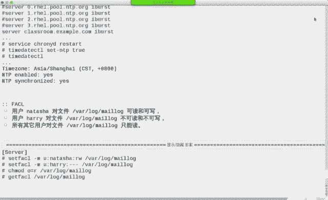

**关键命令流程：**
```bash
# 重新挂载根文件系统为读写
mount -o remount,rw /sysroot
# 切换到硬盘上的根目录
chroot /sysroot
# 修改root密码
passwd
# 创建SELinux重标记文件
touch /.autorelabel
# 退出chroot环境并重启
exit
exit
```

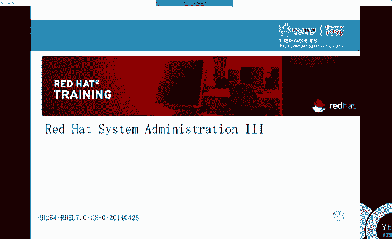

### 网络配置（IP地址与主机名）
网络配置是考试判分的基础，因为考官通过SSH连接到你的机器进行评分。配置方法有多种，但最终都是修改 `/etc/sysconfig/network-scripts/` 目录下的网卡配置文件。

**核心配置项示例（静态IP）：**
```
BOOTPROTO=none
IPADDR=192.168.1.100
NETMASK=255.255.255.0
GATEWAY=192.168.1.1
DNS1=8.8.8.8
ONBOOT=yes
```
设置主机名使用新命令：`hostnamectl set-hostname <主机名>`。

### SELinux配置
要求修改SELinux运行模式。配置文件位于 `/etc/selinux/config`。将 `SELINUX=` 的值改为 `enforcing`（强制模式）或 `permissive`（宽容模式）。修改后需重启或使用 `setenforce 0`（宽容模式）/ `setenforce 1`（强制模式）立即生效。

### YUM仓库配置
使用 `yum-config-manager` 命令添加仓库，或手动在 `/etc/yum.repos.d/` 目录下创建 `.repo` 文件。需要导入GPG密钥或设置 `gpgcheck=0` 来绕过签名检查。

### LVM逻辑卷管理
考试重点在于扩容。需要了解物理卷（PV）、卷组（VG）、逻辑卷（LV）的概念。扩容前检查VG空间，不足则需先扩容VG。扩容LV后，需使用文件系统特定的命令使其生效（如 `xfs_growfs` 用于XFS，`resize2fs` 用于ext4）。

### 用户、组与权限
创建用户、设置UID、附加组。创建目录并设置权限，使同组用户在该目录下创建的文件自动继承目录的所属组，这需要设置SGID权限位。

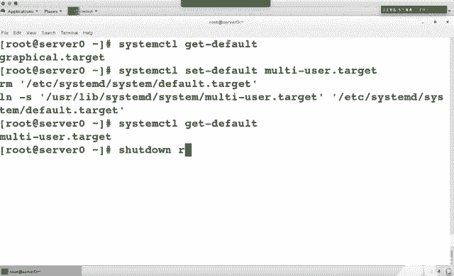

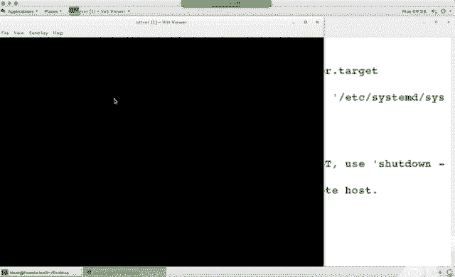

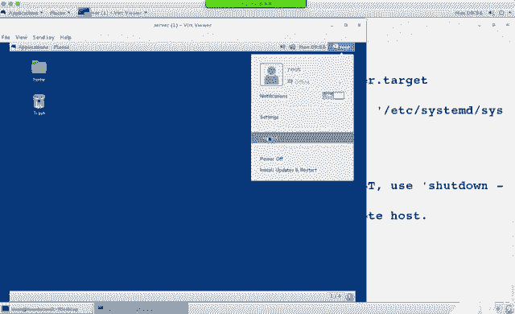

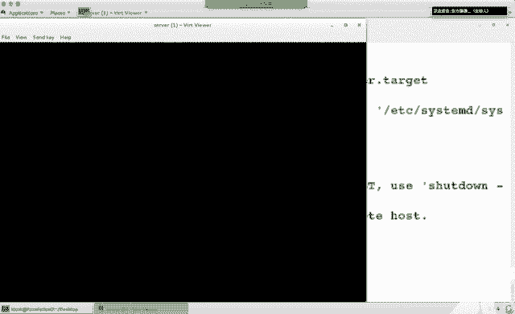

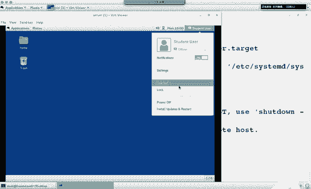

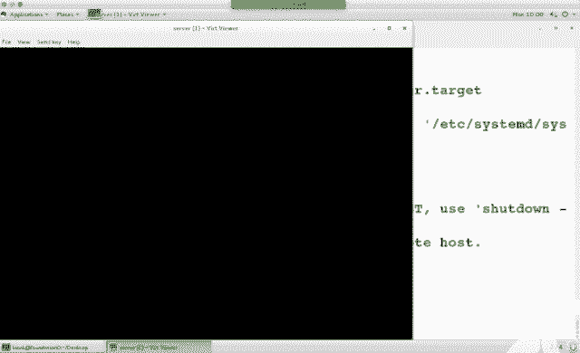

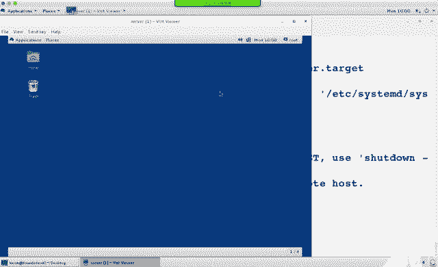

**设置SGID示例：**
```bash
chmod g+s /shared_directory
# 或使用数字形式
chmod 2770 /shared_directory
```

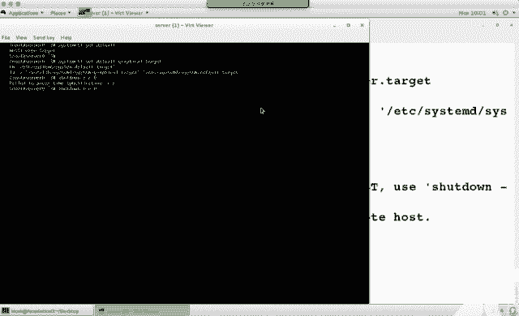

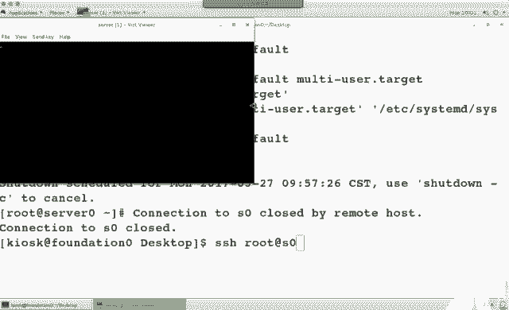

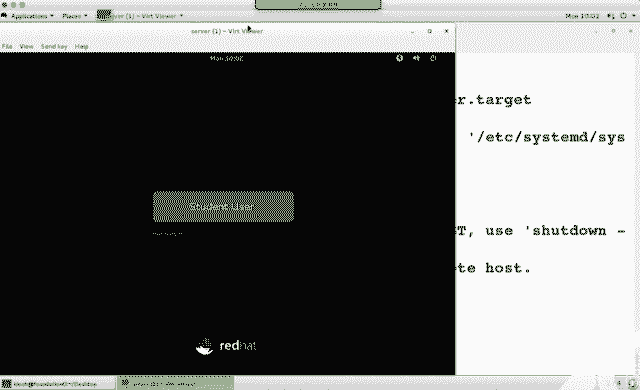

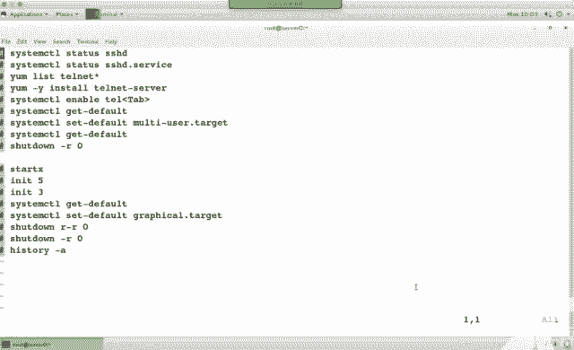

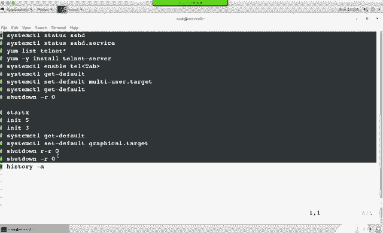

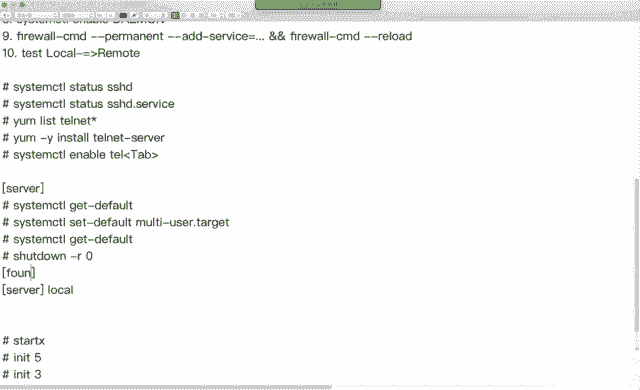

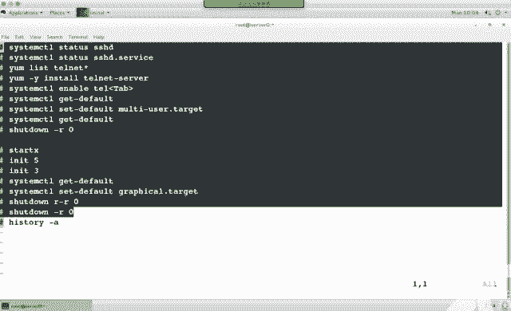

### 计划任务（Cron）
使用 `crontab -e` 编辑当前用户的计划任务。需了解时间字段的含义（分 时 日 月 周）。配置后可通过 `systemctl status crond` 检查服务状态。

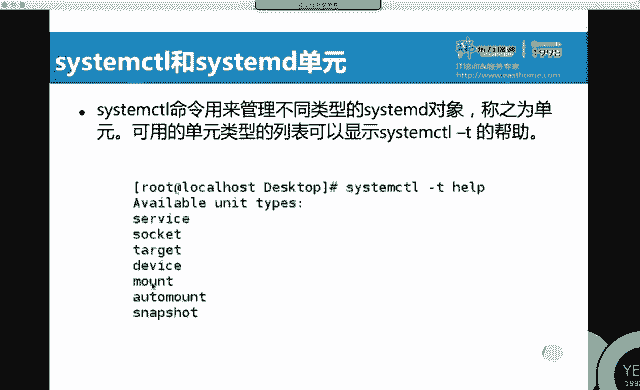

### 内核安装
使用 `rpm -ivh` 命令直接安装提供的内核rpm包。安装后，新内核通常会成为GRUB默认启动项。

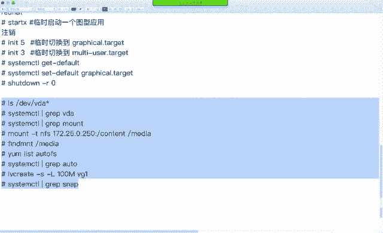

### LDAP客户端配置
考试中主要涉及配置系统使用LDAP用户认证。需要安装 `sssd`、`authconfig-gtk` 等包，并使用 `authconfig-tui` 或修改配置文件进行设置。

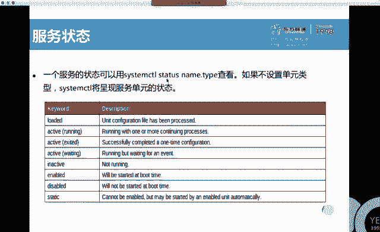

### 自动挂载（Autofs）
配置Autofs以实现用户主目录的动态挂载。需修改 `/etc/auto.master` 和 `/etc/auto.home` 等映射文件，理解通配符（`*`）的含义，并确保服务启动。

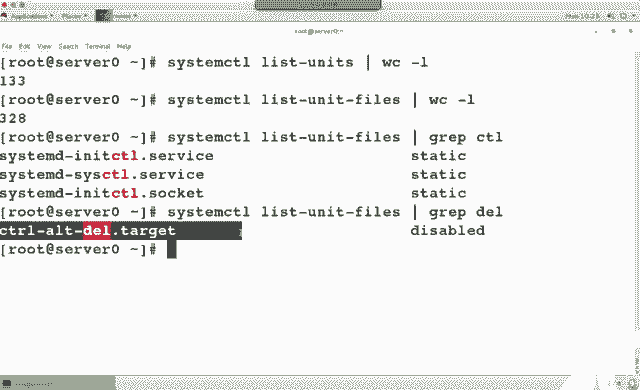

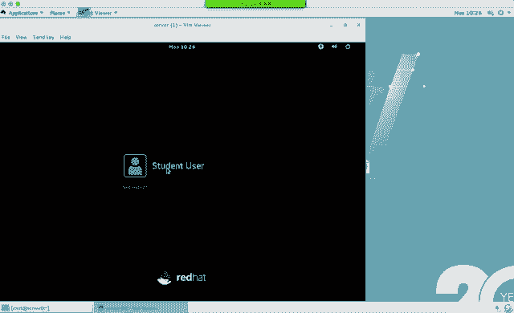

### 交换分区
创建交换分区或交换文件，使用 `mkswap` 格式化，`swapon` 激活。需在 `/etc/fstab` 中添加条目以实现开机自动启用。

### 文件查找与操作
使用 `find` 命令查找特定属主或类型的文件，并结合 `-exec` 或管道进行后续操作。理解 `{}` 和 `\;` 转义的含义。

**示例：查找并复制文件**
```bash
find / -user harry -type f -exec cp -a {} /tmp/ \;
```

### 文本处理（grep）与归档压缩
使用 `grep` 过滤文本，注意 `-v`（反向选择）、`-B`（显示前几行）、`-A`（显示后几行）等选项。使用 `tar` 命令进行打包压缩，区分不同压缩格式的选项（如 `-j` 用于bzip2，`-J` 用于xz）。

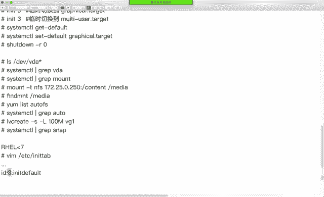

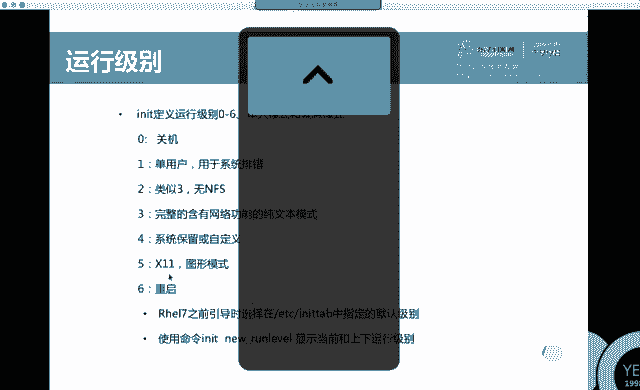

### NTP时间同步
配置NTP客户端，修改 `/etc/chrony.conf` 文件，指定 `server` 行指向给定的NTP服务器。重启服务并验证同步状态。

### 文件系统ACL
使用 `setfacl` 命令设置访问控制列表，为特定用户或组添加权限。`-m` 表示修改，`-x` 表示删除。

**示例：为用户添加权限**
```bash
setfacl -m u:username:rwx /path/to/file
```

## 第三门课（RH254）入门：系统服务与安全

上一节我们回顾了核心实验，本节中我们来看看第三门课程（RH254）的重点：系统服务管理与安全增强。

### 系统服务管理（systemd）
在RHEL7中，init系统被systemd取代，它提供了并行启动、按需启动、服务依赖管理等功能。服务单元文件以 `.service` 结尾，套接字单元以 `.socket` 结尾。

**基本服务管理命令：**
```bash
# 查看服务状态
systemctl status sshd.service
# 启动/停止/重启服务
systemctl start/stop/restart sshd
# 设置开机自启/禁用
systemctl enable/disable sshd
# 查看所有已启用单元
systemctl list-unit-files --type=service | grep enabled
```

### 运行目标（Target）
运行目标类似于之前的运行级别。常用目标有 `graphical.target`（图形界面）和 `multi-user.target`（字符界面）。

**管理默认运行目标：**
```bash
# 查看当前默认目标
systemctl get-default
# 设置默认目标为字符界面
systemctl set-default multi-user.target
# 临时切换到图形界面（重启后失效）
systemctl isolate graphical.target
# 或使用传统命令
init 5
```

### IPv6网络配置
IPv6地址长度为128位，采用十六进制表示，以冒号分隔。配置IPv6地址与IPv4类似，使用 `nmcli` 命令。

**配置IPv6静态地址示例：**
```bash
nmcli connection modify "System eth0" ipv6.method manual ipv6.addresses "2001:db8:0:1::c000:207/64" connection.autoconnect yes
nmcli connection up "System eth0"
```

**测试IPv6连通性：**
```bash
# ping IPv6地址
ping6 2001:db8:0:1::c000:207
# 查看IPv6地址
ip -6 address show
```

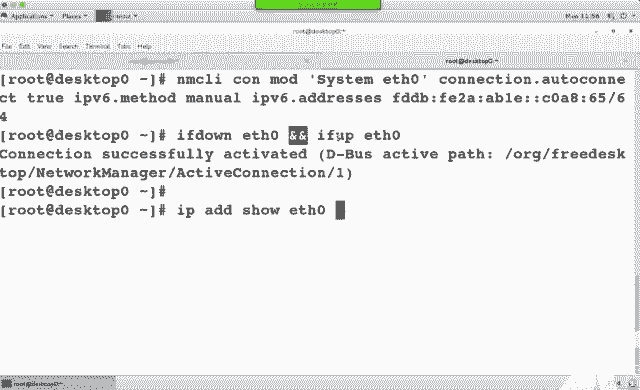

## 总结
本节课中我们一起学习了RHCE7考试的核心实验要点，包括单用户密码重置、网络配置、SELinux、LVM、权限管理等。同时，我们开始了第三门课程（RH254）的学习，了解了systemd服务管理的基本概念和命令，以及IPv6地址的配置与测试方法。掌握这些基础是顺利完成后续实验和通过考试的关键。请务必多加练习，熟能生巧。