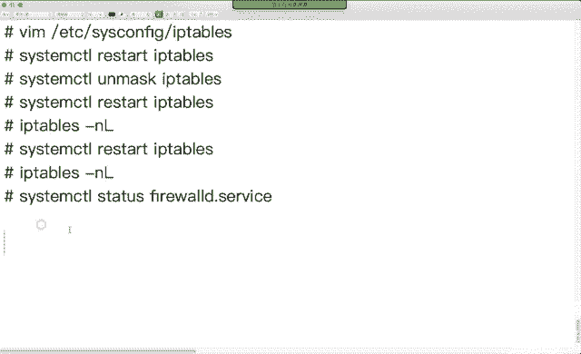

# 红帽Redhat RHCE7培训课程+RCHE7实战参考教程+红帽8.0教材电子版+模拟环境及辅导 - P16：2 - 16688888 - BV1zu41197p6

链路集合。链路集合。那什么叫链路聚合呢？呃，在实习工作当中，我们会发现这样一个问题。服务器上一般是多块网卡。多块网卡，我们如果接上网线之后，我可不可以给每块网卡都配一个单独I替？可以吧。

那么当你访问服务器的时候，你是不是用其中的一块网卡来访问的服务器？如果这个网线被耗子给咬咬坏了。或者是接头松了，你是不是得换另外1个IP来访问？服务器地址老换，谁受得了？没人受到了是吧。

我们可以做备用啊，可以做备用。那下面我们考虑一个思路什么呢？能不能把多客网卡变成一块网卡？然后呢，我们想办法用多少卡来增加我们的带宽。如果其中一个当掉了，另外一个能自动启用。这样是用1个IP。

我是不就不用来回改地址了，更方便吧。这个叫链路集合。这个技术在微软的servword当中啊，以前的时候默认没有。微软是到。呃。2008之后的版本。2008之后的版本操作系统当中才集成了这个功能。

linux当中呢一直有啊一直有。直播以前呢我们做的是。棒的。😡，BONB到企业把7的时候呢，做的是team啊，做的是team。那么棒子和team的区别是什么呢？T模是驱动级的。

性能更好性能更好和它的区别。啊喂。首先。确认一下。链路提模的功能。聚合。连络技录的功能。多个物联网卡。物理网卡。绑定到。一个虚拟网卡。然后呢。给谁开IP呀？给虚拟网卡开辟。你给去年网卡PIP换句话说。

物联网卡不管哪个网卡坏了，哪个网卡当了。我当前这个网络是依然可以使用啊。就像为什么马路我们会发现至少有上排车道。马路上最少有双排车道，没有是单排车道的，为什么？Okay。有朋友说，那肯定是双排车道啊。

大家听过单行P没？有些小区里面由于这个马路比较窄，他是不顺成单行线了，单行线也至少能走两排车道，为什么？因为你那个有同学说了，那车万一有问题了，咔停那了，别人还不走了呀，能理解吧？

就是说至少是上排车道okK。😊，那么你有多份网卡的时候，我们可以给多份网卡绑定到一个虚拟网卡上，给虚拟网卡拍P。然后呢，通过不同的工作模式，在虚拟网卡上可以配置模式。你是做负载均衡啊。你还是做储备呀。

你到底用哪种模式，看你心情啊，看你心情。考试的时候啊考的是储备模式啊储备模式。那这个功能在微软的系统当中。2008之后的版本自带。2008之前的时候啊，如果你想使用的话，得去额外去购买第三方软件。然。

第三方人就是。在了这个词当中，以前呢我们用的是b。以前我们用的棒。那么到企业板期的时候呢。我们用的是T。听我器。都是两路解术。Okay。那下面呢我们来看一下这个东西怎么设置，怎么来使用。

在学习任何一个技术的时候呢，你首先还明确它的作用是什么。什么场景你会使用？服务器上E堆网卡。我们可不可以把第一堆网卡配成1个IP？退不了啊，一台机器上一块网卡配IP之后。

你把另外一块网卡配成相防IP配不了，冲通重启。那如果想把多少卡配成1个IP，就只能用Q链路聚合。放都可以。喂。Tm的工作模式。可以做广播broadcast可以做轮巡。允许是啥意思呀？假设有两根线。

哪个线儿正在用，然后他用另外一个线，这个要允续。大家走马路的时候也是一样的吧，有两个线，正常情况下我们说靠右行驶。当前面有人站那不动地方，你说绕过去靠左行驶。对吧这叫轮循啊，来回走，到底有哪根固定。

那主备模式呢主要用一根。这根如果是当了之后啊，你用另外一根就要土背模式。那负载均衡呢下面俩都叫low balance，都叫负载均衡。这两个负载均衡的区别是什么呢？负载均衡。

首先你要明确负载均衡的概念知么？负载均衡是两个线都用吧，两个都用啊，互为用于多用。那么这两个负载均衡的区别啊，就是OSI系能模型，它是在第二层还是在第三层负载均衡。那如果你是在数据链路上。数金量操。

第二层吧，交换机是不是在第二层？第二层的出计好。高层三层以上的负债价。带他来了去。那你要用色彩均衡这个功能的话呀，你的交换机是不还得支持啊还得支持。或者。大家看下面这个网卡配置文件几个啊。

红色框起来三个是吧？下边两个呢是你物理网卡，物理网卡的配置文件上面这个呢是你虚拟网卡的配置文件。虚拟网卡的配文键有3个配文键。那换句话说，我们是不是得添加三个出来呀？默认他们没有配件文件是吧。

你得弄一份出来。Okay。OK看一下三个配置文件中的内容。第一个呢是你虚拟网卡的配置文件，后面两个呢是你物理网卡的配置文件。大家可以看一下，你虚拟网卡叫team0。

你的配置runner name XQ by runner叫什么意思呀？运行模式吧，name幕呢名字。IQ back是不是主备呀？考试的时候主要考的就是这个模式，主备模式。active这个词儿见过吧？

我们在st control stack表格是不是经常看到了？快看我把这个词讲过吧。在公司里面，如果我们想备份一个东西，是不经常记backup这个词儿啊。O。大家会发现这个里面是有双眼的。

双引号前面都加了个反斜杠，为啥？转移，因为最前面也加了个双引，当系统再看到双引的时候，他认为他俩是一对儿是吧？为了告诉系统，他跟他不是一对儿，是不是给他一棍吗？然后往后看又出个双引，再给他一棍子。啊。

当当当当当啊，好几顿的，最后双眼。那我们一会儿在做实验的时候，如果你不想用反斜杠，建议大家用翻译。最左最右用单眼。为什么呢？因为他到看看到下个单引的时候，这里是一对儿是吧？

中间双引他不管这双引是不是一对儿，这双引是一对的。你看有区别吗？另外我们会发现它这个位置是个画括号括起来的。name a by up。

然后再括回runner name run by card两个画框是吧？往下看设备类型 team。设备了一些team。德外斯太啊对外。开玩下。namete梁。看到IP地址没？IP和雅马的前缀。OK吧。

还没地。看一下另外两个。这两个配置文件真实物联网卡的配置文件，大家会发现你IP是不是都动态获得呀？从哪动态获得呀，从它上面动态获得。换句话说，你这个设备是不是属于master设备呀？他属于马克设备。

这两个属于45设备。再往下。我们看到这个名team0port头一。team0P2。两个都叫接口。ice真实的物联网卡。在下面team master。喂。你既然是做一个死类物设备。

你是不是得指明是谁的s类物？ma特是谁？T50T50是不是前面这个虚拟网卡？最后deice type deviceice type叫什么呀？设备类型team popte pop。

那我们虚拟完卡盗类型是不是叫team？teamO这个东西不需要大家来备注啊，你就看着认识就得。因为我们这个配置文件呢都通过命令来生成的。通过命令来生长。就能看懂就行了。那怎么配呢？

这个实验当中要求大家记住两条命令。第一条命令。妈。第二条命令慢。慢慢。这个实验就会了，为什么呢？首先我们来看第一个team，它是个驱动，那它有个配置文件叫做team the点 canfi。

驱动也有自己的配置键，叫team d点盘这个。在这个里面我们来查一个词儿叫active。大家会发现呢这个里面是不是有好多active backup up啊。那那那那那一堆一堆的吧。你看这行演不验熟。

那如果你能找到这行的话，你是不是就不用想什么双引号啊冒号号个号啊，我复制粘贴就可以了。第一条命令要求大家记住的。随便复制一行。OK吧，随便喝一下。左边模式。第一个my team歌看这个。

第二个要求大家记得呢。你案审么。卖谁呢？我们在之前呢寻没有过NM色line那弟。配网卡是吧？AIP大家会发现NM3I当中有没有叫example4。实力。😊，因为他的视例太多了，所以说多了个ex斯。

如果你能记住这个词的话，你是不是就不用杠K了呀？直接慢他就行。卖它的时候呢，里面有好多的实力。A个弹摩斯看哪个弹波一了吧，我们想看谁的实力呢？咱是不是想做T目啊？那么也就在查team的实力。

在te目的事例当中，我们来进行查询。大家会发现。还有个大期看到没？下面看到三刀没？啊，三个刀钩。啊，看到了吧？三个刀后面写的是不是命令啊？干什么干什么干什么，整个实验当中，最终啊就是用三条命令啊。

最终就三条命。那我们分别来看一下。这条命令的作用艾。我们竖着看哈，NM slide耐爱的爱的代表什么含义？添加吧。泰国是什么意思啊？类型吧。你是一个主设备，叫team，从设备是不是都叫team死了呀？

我。竖着对比看啊，连接名连接名大家会发现这个东西敢大气。在帮助当中，或者是说在我们的事例当中，如果出现大写的地方，都是可以随便改的。能理解吧？你的虚拟连接名叫什么名，你随便起。你的虚拟连接名。

虚拟接口在上名随便起。这个叫做connection name。后面这个叫做interface name，它俩有区别吧？一个叫网卡名，一个叫连接配置名。再然后呢。

confiake大家会发现它后面是不是写了个文件呢？这个文件是什么？那如果他写文件的话，你是不是还去做文件？我们在做实验的时候呢，为了不写文件，我们用个更省事的方法。记不记得我们刚刚看到了那个。

R their name， I by time。把那个内容复制粘接到这个位置。当然最组端最右边是不是还得有个发括号啊，两边是不是还得给翻印呢？一会儿我们回过头来看啊，你知道怎么回事儿。

这个文件呢就直接看慢第一个慢的内容，再看下面。com那个是name，这个是不是又是连接名啊？interface name，这个是不是你真实的物理网卡？马er，你的主持是。你的主是谁，你是不是要写谁呀？

那现在有个问题了，你妈车这个位置接的是连接名呢，还是接口名？连接名还是接口名。对好。不知道。啊，我也不知道，那怎么办？一会儿你做到这步的时候，我们支不支持配构键。支持吧，你一退播间之后。

我都不用告诉你就能判得出来了，为什么呢？你这个在 table键的时候，如果看到了ETH0，是不是说就是接口名。如果你看到了stem空格EH0，是不是连接你？能理解吧？就好多时候啊，你们在问我的时候。

你table过电影就能看出来就不用问我了。我为什么不告诉你们呢？因为我也没注意过。😡，他到底是啥？为啥没注意过呢？因为我老退。而且做这个实验的时候，大家想考试的时候，题中如果没有要求，你连接名叫什么。

接口名叫什么？我是不是用默认值就得了。我说我连改都不用改，我就闭眼睛复制年级回车回车干完事儿。这个里面必须要改的地方是谁呢？这个位置。考试的时候给你真实的玩卡肯定不要这个名。他给你叫EN1。

你就写EN1，他给你叫EN2，你就写EO2这两个位置是必须改的，剩下的位置是看你心情，你愿意改就改，不愿意改就不改。OK吧。那么在题中会明确的告诉你说，你的借口名叫什么名？

那你这个 interfaceterface是的改？他不会说强调什么配成件叫什么。这个没有人调。我。那我下面呢要配置一下这个实验，大家看一下怎么配。首先呢我们来看一下示例。看一下它说明啊。

配置链路集合在考试环境中，你会有两台虚拟机都要做t。但是在培训环境中，我们只有一台讯衣都给替了，为什么呢？我们先来看一个命令。Oh。我们先充到一台叫classus room的机器上。Yeah。

在class room的机器上啊，有一个文件，content costH254。Gy。烂吧。King。不意。看到这么一个文件了，我们看一下这个文件的内容。下套。在我们的教材上呢。有好多培训环境准备工作。

lab什么才踏这些脚本呢都在class group上，某个目录录像。那如果你要做set up操作的话，大家可以看到在server上你可以做这样的操作。这个75行能看到server吧。

在server上能做。往下翻。啊，弹出F吧，快一点。大家看164行在再次top上可以做吗？不可以。但是套不可以。换句话说，你现在回到ser上，我们去做一个。L吧。Team bridge。在他。

可以申行吧？你到戴斯top上来吧，team bridge。在他。大执行吗？不让。那这个命令作用是什么？达到作用。生成。IP一个虽然是瘦着看。看IP还能看接口是吧？你看B上。お。他到联行卡没？

刚刚那个live set up呀是帮我们生成两块网卡，一年O一一用2。然后呢，你是不是可以用一用一和二做T？下午的考试，你两台讯拟机都会有三块网卡。其中有已经有的链接呢是我们已经存在的网络，已经做好了。

呃，项么。就是我们的亚目源呢，还有我们的网络环境，已经是有一块网络连上了。另外两个网卡呢专门给你做替M实验的。下个环境下来之后都三号完。OK吧。但是培训环境中，我们是不是只有一块网卡？

一块卡能做team吗？自己人做自己做team吗？我成立了一个team，team里就我一个人也挺厉害是吧？嗯，O那现在呢我要用一用一和一用2看怎么做。回过头来。那我们有两个物理接口，ENO1ENO2。

然后呢，当其中一个接口失效的时候，它仍然能工作。不倍吧。实际上做负载监衡也可以啊，让它更接于几倍。然后呢给他给他配1个IPV4的地址。不管你怎么处理系统也然生效。okK我们看怎么做哈。😊，首先。

我们在之前是不是讲过一个慢命令吗？骂谁来着？team有的吗？天猫主要看这个。我们看模式是吧？你能记住X黑我是过去X能记住X。感したか。这个里面随便找一哈，刚刚我们在看手册当中的时候。

看PPT最左最右说还有个夸过啊。两层吧两层。然后呢，最个上面说还有个双眼。你要敢用双引的话，是不是得好几棍子呀？里面每个双引都得给他一棍子，为了里面的双引不给他一棍子。

所以说建议大家在括号的后面呢写两单引。这原因是什么啊？当然后。我们是不是有一个叫做。NM line， example。丝啊。一对是的是吧？过滤。过滤纸刀啊。过滤三刀吧嗯，过滤三刀。

为什么要在三刀前面先给他。第一个反斜杠是转移反斜杠。第二个反应是转移刀杆。你看这个带刀是不是很多呀？那我们要查的内容是不是先过滤一个team？再过滤。能看懂吧。有同学说，哎，老师。

你这行也不想要你这行要也不想要的话，我们是不是得要2大于号给外木啊？就这么写的话，太长了，我就不给你写了啊。一会儿再做实验的时候，你们如果高清写的话，你就写一下也可以。我们最重要用的命令就这三条。

首先第一条。或是。粘贴。那后面的内容单眼。发括号。剩下做操作的时候复制，你别过来啊。或者谁呢？你往天上好。好多吧。随便找一行复制粘贴。看这个是不是写完了？在前面。你的连接名。题育中如果没有要求的话。

你的链接名是不是随便写？其中没有要求的话，你的接口名是不是也随便写？OK吧。这个名字字是随便写的。啊，不关系。接口名呢也是随便起。Yes yes。既然其中没有要求，我是不就不改了，默认值吧。Okay。

这条命令执行通过之后，我们会发现。看一下现在是不是多了一块接口，team一。然后。看一下网卡的配送件。是不多了个te目一？第一套命令执行成功了，应该是有两个现象，多了个接口，多了个配送键。

如果你只有配置文件，没有接口，是没成功，请再做一遍。肯定是哪错了呀，那个单眼霜也经错了。欢迎朋迎花啊。注意啊，单人奥括号名贴啊，这么一个，单人2括号名贴。8括两层啊两层为什么用两层呢？

塑料袋用一层行不行？可以吧。中午去吃饭，吃了10个包子。没吃了，剩了5个包子，用一层塑料可以拎回来吧。那为什么一般我们院套两层塑料袋啊？更安全一些吧。单联写。我们在这个里面弄两层的原因呢。

是每层数有不自己的含义啊啊每层字的含义。Okay。😊，给我下一条米粒。那么在下条命令当中，我们干了什么事？说这个呀。听日。起了名，然后呢。用哪块网卡，这个是不大改？EME的改后面这个team一。

我们来确认是什么。首先呢。看受所左。ctrolW，我是把那个EM1杀了。Heを。看到没？ENO1和ENO2看到了吧，用谁你就写谁。在后面master后面接的到底是连接名还是接口名？看到一天是零没？

这接口名啊，如果这个位置出现个st媒0，它是不是连接名？听看了吧。马车主设备是TM一。换句话说，这条命令你必须改的位置，是不是他呀？あ。回错。然后是不还有一条命令。そ。会呀。为啥嘞？看到哪儿不一样了吧。

如果你就是不想往回扫，你就想还用这条命令，你是不是改两个位置？好多同学在做实验的时候啊。他就愿意改一个位置。导致什么结果啊？实验不成功。所以说你们在做实验的时候啊，你如果能明确。就是哪不一样。

你是不是可以放间上做修改？但是你要不能明确的话，请你复制粘提前做修改。这个叫EOG啊。2。我摁的是k键列出是吧，摁那几下。等一下。这两条命令的功能，它是在这个目录下。又生成了两个配置面。

一会儿你们在做实验的时候呢，你可以看一下的内容，跟PPT上内容是一样的。我现在有了这块网卡，我是不是可以给这块网卡配IP了？按照题的要求，NM select麦 model five。题目一。

Connect要 to connect to。IPB4m的。M有。IPV4把它dress。给哪去0吧。你后面325，如果用两马前缀的话，我们应该写的。24吧，1个25是不是8个1啊？一共三组。

382424个1要点码前缀。开完IP之后。那下面要干嘛呀？重新网卡吧。让他立即生效。生效了之后，你是不是要确认一下你当时的I批呀？I feel dress showE。是不是0。1吧。听一下。懂吧。

考试的时候呢，两个都配完了之后，互相拼一下沟通。在培训环境中，你只能配自己，对方配不了，因为单词套头做不了这个操作啊，是吧？或者是说你编辑你的虚拟机的设置。然后呢，你给你虚拟机里面都塞两块。

也能做吧也能做。喂。出ちゃだ。最后一步确认。我怎么知道你的工作模式是啥？我怎么知道一个大了之后，另外一个还能启用，我们有个命令。叫做team什么control。

team the control还带D是吧？蒂莫德感受这套命令怎么用呢？我们看一下它的格式。中间接什么？设备名后面说接命令吗？如果你想查看状态的话，你看哪个命令像状态。是对他吧。Okay。

那么这条命令我们的接口是不是叫team一呀，状态t。大家来看一下当前的模式是不是主备。

当年你是不是用了个EO1EO2，现在我用的是谁？

一。如果。意思吧。我当了一个接口。拼的时候是不是还通了？我们再来确认。现在用的是不是2？OK吧，那你把一给取回来。😊，大家会发现现在用的还是R。现在二变成主了，它变成辅了。能看懂吧？这是主备啊水主食喂。

这时间太满了吧。这个时间主要就记两条命令啊，慢慢吧。卖谁？😡，Tam的confi还问谁。NMC lineexamp4。就卖他俩就行。如果你实在记不住那个examples前面是中划线还是下划线的话。

是漫张KNM是拉呀。查Q2也能查到。这个时间看到了吧。我把这个事给大家重新结一下。做个整理一。为什么讲课的过程当中总给你们整理文档呢？为什么呢？你看着我做一个实验和你自己做一遍实验，这是俩事儿。

看都能看懂，当自己做的时候啊，刚刚都干嘛了，又可能想不起来。所以说你照着我的思路走一遍，变成你自己的思路，然后再多练两遍，你就会发现这个实验关键就是一两个慢命令就行，别的都不用进去。呃。

首先我们第一个要知道的内容。class room上是不是有个脚本啊？在教材上，所有的脚本都在class中。考试的时候，你不用去卡拉斯路吗？去找就行本。你不要这卡拉斯能能找。在培训环节中有啊培训环节中有。

那么有这个脚本儿的话。我是不是就可以赖边摔 up了？le set up怎么说呢？Lve team不 up。然后确认你当天的接口，你会发现是不是会多了1个ENO1和ENO2的？要。你点了话。

我这么写的原因是告诉你主要看什么。你们敲的时候敲管道之前就可以，然后呢用慢手克。我是不是能查到？储备模式怎么写呀？runner冒号内幕。冒号ICO back up。要不然的话，你还得知道他怎么写。

这个背下来时间长肯定容易忘。所以说你直接去第三行查。第四行，我们是不是在examples当中去查team，然后去查带 dollar的呀，又查到了三行命令，然后是不是写三行命令啊？首先复制第一行命令。

很fi后面的内容，养成习惯，单引画括号，然后往花括号中间面贴。往花往中年贴。粘贴完了之后呢。再次确认。IP鹅的转是售，你会发现是不是多了一个te一网卡呀？多了个配置文件。这个配件件叫什么名啊？

谢梦你是吧。あはい。刚好。パパ。这か。一个在吧。房款。对我4。で。好好好。电脑。あ好。啊方没。带的就可了。工的话退了明天之后。都可来配订单机。这些方卡。对。

I学校波用team的 controltrol命令。金摩的凯创命令，它后面是先接设备名还是先接命令，我也不知道，自己看一眼封录吧。他会提示你先写色位名，后写名令。然后我们将其中一块网卡关闭之后。

IP依然可用。确认。启用了之后呢，再取实验完成。

T实验看到了吧。嗯。

呃，关于team的实验呢。看到哪没有啊，看一下啊。如果你想把当前的配置备份的话。Configure bug。配置文件备份。像这个大。我们可以去查看它一些选项啊，可以来进行修改。呃，除了做team之外呀。

我们可以做主力。过桥街啊过桥街。把你的物联网卡配置成一个交换机。非童的净话机。这个什么时候会用这个功能啊？什么时候我们会把一个linux配成交换机呀？你有一对网卡。那如果是。

一块网卡是不是就可以做不睿置，没必要多块网卡吧。什么用豆块网卡的？比如我们在家里面呢，大家想玩这个体育网游戏。但是没有交换机怎么办？那个来那个CG和网卡。查给他做上交换机，然后玩局玩戏。啊。

有没有说这个这不是有点问题，家里面无线路由话，一般都好几个接口吧。啊，所以说这个功能啊你知道就得了。我们可以把另那个字呀做成一个交换机来用。它的配置方法呀跟我们team的实验基本相同，123也三步吧。

在examples当中依然存在实例还是3条。那下面呢我们来看第四张。第四章主要讲什么内容呢？讲包墙。到强。在铁板7中，我们有两个方向，一个叫ip tables。

一个叫firewall DfawallD这两个服务啊，他们最终修改的都是net filter。那么在考试的时候，到底是用防火墙呢？是用I cables还是用fiD？都可以都可以。

如果你本身对app table是很熟的话，考试的时候你可以用app table去写。如果你对acttable本身没有什么印象，那你就建议用firewallCMD或者fireairwork这个来。

在考试环境当中，建议大家用fal complete来做。为什么呢？实验更简单。图形的拿主标点点就完事了，是吧。放一下。在Lux内核。2。02。22。4，我们现在那盒是2点几。怎么看那盒？う。10杠儿。

310是吧。或者是我们之前想都讲过耗斯内的 control能力。你看这个位置有没有内核。也有吧。なでか。3。1。这两个明天随便应还都可以。看到那歌之后呢，我们回头它来。我们都三点血，这还二点血。2。

0的时候啊，用的是一个叫做IPfirewall文秘密令。来管理在内核当中的包过璃机制呢叫做IPFW。在2。2版本的时候呢，我们用的是一个IPch的命令。IP chainIP量。他包过率的机制呢叫IPT。

到2。4以后。包括我们3。1也是2。4以后吧，2。4以后呢用的是macel管理工具叫IP cables。把我们当前企业版73。1版本包括的其制依然是大家发酵词，只不过管理工具又多了一个叫做富尔沃富尔旺。

那么用IP tables也可以，用fwall也可以，他们最终改的都是谁呀？那再发出，最终改的东西是一个东西。那为什么我们要用fD呢？主要原因它可以更好的支持IPP6。对对于个人而言呢。

我觉得这个不是隔要林因，主要因是farewell更容易让用户接受。要讲IP table是想讲明白的话，没有一天讲不明白。没有一天涨停，还大3包地的话呢，5分钟就能涨停。他俩就这个区别。

你想对于管理员而言，你花一天时间学明白ex工作中可能会用。你要没学明白，工作中肯定可以用，就这区别。所以说头帽为了让尽可能多的人去来使用这个东西。他给我们推出了一个新的工具。

叫做firewall Bfarewell。怎么来的？IP tables IP tables它既然是用net。而且在企业满期当中依然存在。依然存在的原因呢是因为线下变容。那这发科是在内核当中。

我们管它要内核。换句话说，你只要是linux使用linux内盒的话，那么就有mac。RB table的命令跟SV只有谁能用啊？半联牙能用，否则用户用不了。我们把这个孕户。用合彩内合菜。

那赛报 command也属于用户台了。下面我们看量。大家看这边呢黑框中有几个蓝点。我了。黑框中有5个蓝点。他们的。作用分别是什么？首先我们来看一下红色的位置，红色的位置叫做本地的进城。

我们再来看下绿色的位置，绿色的位置叫做路由的目标啊，路由的目标O。看本地进城，本地进场有谁呀？本这一条连着的。这有进因铺的出儿子铺的。左耳进右耳出就这么来的。坐左边进右边出吧，走本地信。那我们看天上。

在天上啊有个叫飞物品。准备路由有个叫pos主体，叫通过路由。然后中间呢有个for word的叫转发f沃的走本地吗？あ。不读本地是吧？OK那么对于这几个链啊，我们来描述一个场景。在公司当中。

你们部门有个电话，你给电话响了。这不准备路由啊，电R进来了。然后你接电话，你说哎，你找谁？哎，找那个老王。啊，不是找我呀，找我你懂了吧？😡，然后哎找谁呀，哎，找苏老师啊，你找我呀啊，什么事啊。

我说他处理呀。😡，不是找我的，我说一转就行了，找我的你是不得处理。😡，找自己的都得处理啊。处理完了之后，师傅是告诉你说哎这个事儿怎么解决呀？你问的这个问题怎么回事？那pos如庭呢。

是不是都又传给对方了呀？别看看别抢，你发沃的也是看别方，是不是都代表通过呀？后se再有通过，这个完事了，这个事完事这个pose就行。这两个rooting啊play代表准备posts代表通过它来的区别。

呃，这五个链能看懂吧。这个里面我就强调句化。foward走本地吗？不ぞ。有同友说老师，你为什么就强调这一句话，有5个点，为什么只强调一个点？因为我们在21的考试中有那么道题叫光方转化。官方转化实验中。

你能在本地来测试吗？测不了，因为他不走本地，所以说测不了。能理解吧？就这原因哈，就是之后因为我们之前讲了说佩服务的思路，最后一步是先本地测试在网络测试啊。就这个实验。

我们讲完所有实验当中就端口转发这个实验。他只能是用别人来测，自己测不了。它比较特别的，就像我们之前在讲减号的时候，我说了一个减号通常情况下是不是一个缩写。两行讲号是个单词，通常情况下。

但犯的命令比较特别，不是通常情况。这个一个意思okK那下面呢我们来看几个量。😊，input叫入展量，upput叫出展量，for word叫转发量。free rooting叫。

准备路由前准备了free par后s主题叫做通过通过路由处理的包。这几个能量。这五料呢是系统自定义的量。系统中默认就有你配不配置都有。那链是什么意思呀？呃。大家买过项链？项链都长什么样？

不管你买金的也好，银的也好，铁的也好。是不是都是一圈一圈的呀？可能那个圈好看一点不好看一点，对吧？一个环，一个环扣在一起的，这个叫做料。那么换句话说，一个链当中是不是有好多环啊，每个环我们叫做一个规族。

每个环叫我一个位置。默认有5个量。看一下IP table的一法装饰。IPKO4杠T。大家看这个位置指明个table表明，默认是什么表啊？30。过滤表防火藏默认的功能是不是应该过滤呀？把火给过滤了。

过滤表如果不指定表明的时候，默认就是fi车过滤表。换句话说，杠Tfa车不写，默认就是过滤表啊。杠AA代表是append代表添加I代表添加添加附压的意思。在哪个链中添加呢？Aput俩。

在这个链中添加个什么规则呢？限定ss元1921680。1。这个IPjo drop是丢弃的意思，只要是从0。1来的数据包全丢弃。换句话说，0。1能访问我这台服务器吗？防不了啊，防不了。通道。啊。

这个是一条命令吧。这还是比较简单的命令啊，规则没有写太复杂，要写太复杂的话，这些会对行。我们来看一下命令，刚刚我们看到了杠AA这表什么呀？添加附加是吧？啊，如果用I呢。I代表插入。

我们在学习VIB器的时候，SA的区别是不是也是附加和插入啊？概念相同啊，这是一样。R代表什么？😡，re place替换替换。大批代表是polis。poliliccy代表是默认的策略。默认的设定。

如果想查看的话呢，就告了。你想查看有几行，每行加个行号，就加个line numbers。很差一个词是吧？两个减号。想按数值的方式来显示呢，加个N。想查看详细模式wordvos。想清除所有的规则吗？F。

想删除某一条规则呢呃。新建自定的链那。删除固定的量X。看帮助和。他拿过。刚刚我们看到是IP tables啊支持的选项。那下面呢我们讲一组实验，帮大家理解。首先。IP tables。杠L。ち？

I这个是杠L干嘛的？查看过滤表当中所有的量和规则。我没写表名是吧，那写表名叫当期fashction过滤表。大家看一下这个表中默认有几个量。三个料吧。默认三个料，他到陈里。说这个人有钱是什么意思啊？

就是这在好几个进店嘛。没事，大脖子上他不穿衣服。东北阳了是吧？看着这边都忙着。据说那链子是真的。我一直认为是假。要不弄那么粗，多难受啊。是料的意思啊，input大写小写。大写。啊。

policy policy翻译中文什么意思？策略默认的策略。那我们的规则是按照你里面写的规则，从上往下执行，这个是默认策略。从上往下匹配执行。OK吧，入站出站转发。现在都都空的呀那我有想法了，我想进价。

Input。我在入障链中添加1个IP。1。1。1。1。港后到。こち？没报错吧。没法说是说这个能写进去啊。总理再弄一个。我弄一个red。赵鹏和瑞d他都是拒绝。他俩说有点区别。对，是否有回血？

我旁边坐个小姑娘，你说哎，晚上吃饭吧？他一直不理你这就到了。他说我不吃。😡，这叫软盖。他说吃人，你知道什吗？那叫ex赛。最怕的是说他他说吃啊，谁花钱呢。那我们要确认的话是不是L啊。

大家会发现后面这个位置是说ss源从哪儿来，目标到任意位置了，这个是候一个英文单词。如果在实际工作环境中，这个英文单词有可能是一个很机名。你想看他的IP地址，那么需要加个名额名额代表钱numb。在没？

以数值的方式来显示。IP天猫是用的最常用的一个选项，UL。听了个。嗯对。喂。我们会发现，当你用大A的时候，它的顺序是不是123顺序往上添加呀？我怎么知道这个是123呢？如果你属于嘚瑟，写了100条。

你怎么来判断他是第几条？我们有个选项叫做杠杠3。Numbers。看到之前的呢。唐号吧。あの。呃，现在我有个想法了。我想再增加个1。4，但这个1。4比较特别。我想把它增加到第二行。如果想追加到第二行。

就不能用A了，就用I了。まし。到案。监护人。元1。1。4。我们来看他C了。大I inputput我没说input哪是吧？当然看他已经铺得起了。一吧不说C到哪儿，默认C到一。那如果想说C到第二行。

C到第二行应该怎么写？我们在这个位置加一个2。音图塔2。未来有所区别呢？我把这个IP做一下修改。快钱。再看一下。应付的。第二行吗。就是如果你不加行号，默认插最前面。如果加上行号，可查到指定的行。

那现在我发现呢刚刚属于嘚瑟这行我应该写的是1。6，但属于嘚瑟写成1。1了，所以想改呀。如果你想改的话呢，我们用的是杠R。Okay。上儿。大然哈input。三吧先把三改成什么呢？1。1。6。Yeah。

钩的含义啊是绽篷的意思，说跳到哪。目标啊目标的意思。喂。变1。6了吧。呃书啊。然后呢，我又发现这个第四行啊。我要把第四方删了。如果你只己想删除一条的话，那么我们应该用IC boss啊。完毕。第四条。

再看第四条原来第四条是啥，1。2吧，1点2给我没了。被上。那如果想定义默认的策略，比如说转发。转发默认策略是不是接受？我要把默幻斯的一个感情拒绝。那么你可以用IPT给我说。放批。Pice。え。包位的。

No。没认出来电了吧。有同学说，老师，你为什么前面时间讲着input量，讲着讲着跑f货的量了呢？如果你把他给照出来。我们的规则是不是从上往下呀？这个里面。只有1。5能连这台机器。其然人都连不了。

然后你再手机这个索ctrl D就消了吧，再连是不是连不上了？你这就锁门不带门钥匙的感觉。所以说我们在做实验的时候，我怕你给机锁门外头了，我们用转化链来做。当然你愿意改哪个末日测的都一样吧。20后。

如果你有一些好多规则呀，批量规则都是要做某一类操作的话，我们可以来自定义的量。IP tables放歌。自定义。这条命令的功能啊是我新建一个料。第二名叫旁书便写。当然了，你要叫ZDY的话，谁知道啥意思呀？

既量起个有意义了吧，样起个有意义了。那我是不是想给他改个年啊？Re name。面。我们想把它改成什么女呢？こち？计量。这个没有意见是吧？尽量。这个都有意义。这个量是什么量？金量啊银量。O。

那么这个链如果你不想用了，想删掉怎么删？删除量删除用户制定的量，我们应个是上。X。没了吧。删除用户实际能量。那你当天这个配置啊改完了之后，你是不是想把配置保存呢？对吧这条命令全是立即成效吧，敲完就成效。

😡，你应该它保存，怎么保存呢？我们有两种方式来保存。第一种方式。IP table是。所以。那如果我直接回车的话，大家会发现他给C5拿出来。终端上了，我顺不要把它保存到某个文件中吧。被保什么。

那如果你想把所有的规则都删了，是不是应该IP table是。F5。没有写链吧，所有链中的所有这个去删除。然后呢，再那个瞅一眼。要是不是全没了。恢复怎么恢复呢？你既然用IP table是sve，你来保存。

那我们会发现是不是有个瑞道了？不应的废物是保存没s到什么？恢复。从哪恢复呢？恢复了之后，大家复一下。又是变下来了。Okay。变回来之后。现在我就别问了，你这个备份哪备份随便备份到哪都行。

那我如果是开机就启用IP table式服务的话，你这个是他的配置文件吗？不是吧？那你有老早是在你的配件里面。IP table是字配置文件在这个模式下。这个是IP table是规则的评审意见。规则的。O。

我们有条密令叫service。ID。Sa。废务。这个命令什么作用啊？你看一下这句话。看到没？把你当前生效的纸保存在FQ4文件中。这个文件呢是你的配置文件，永久成效。啊兄弟。看到这么长了吧。我们。

滴D滴D滴滴，我是不是只留了一行杠A呀？服务重启。哎，不让出息为啥呀？Yeah。我们上午是不是给他骂死了？对他温柔一点。怎么回复啊？这又骂了，还挨骂。当你不知道的时候，请使用KO键。Yeah。然后呢。

我们再这大。V恢复了之后，我们看一下你当时生成的值是啥。真啊。还有这4条啊。不知道。谢谢。理论上是你瑞斯大之后马上就生效了，是吧？那刚刚你动作是不是太快了？然后又重启一遍，是不恢复了。

这个还真不是延迟的事。是因为你之前给他骂死了。然后刚哎用 mask。他还没恢复回来是吧，还当前的。在个大谢谢。换句话说，你为 style的时候，载入的是默认的飞博。ADC system这个IP。お。

这个是我们规主的复产件。如果你用X save的话，是代表运存的一样。一般情况下，如果你再去做测试的情况下，一般我们会用IP table to save把你当前测试的规则写一份。

如果是你想每次开机交上自体呢，用service IP table save把当前生效的规则保存到规作文件中。有区别吧，两种情况啊两种情况。当你干了这个事儿之后，你会发现。IP table是启用了。

防火墙呢。曹小强是不是死了？老板老板，你X。这个IC螺丝跟防火墙嘛，不能。你这个起完那个就关那个开了这个就关。就那有一个。じないが。这组时能跟着吧。刚刚讲的是IP tableC的7分使用。

不要求大家背注我他们到底怎么回事儿啊，你就知道A呀I呀，他们区别啥，然后知道5个量，知道转化量这后科学互责本地OK这知识点。我们把这段柠给大家整理一下。这玩意你们考试不卡啊，别紧闹。

有同学问我这样的问题，哎，老师，你讲这么多考吗？啊，不考。那为什么讲这么多事例呢？这些事例如果你能看得懂的话，实际工作当中呢，你上网上随便去搜个别人的实例，改不改吧，是不就O了，改不了就OK了。

大概的规则都是这样。ever table是杠L查看当前的防护墙金额。刚添加添加添加确实添加了。L确认NL。都变成负值了吧。line numbers前面多了个行号，然后呢，您可以插入默认插入到B行。

插入到第二行，修改第三行，删除第四行。大批默认策略嗯到呢新建当E修改当X删除用户会进行的量。MP配C把你刚才的规则保存到指定的文件中当F清除所有的规则。没写表的话，默认依然是过滤表确认。恢复。恢复。谁。

再之后呢我们看一下你的DAPC。face can是一个act tables文件。这个文件呢是我们所有的开机act tables生效的这个文件。那么我们可以来编辑。电辑。你可以服务重启。确认不让重启。

因为之前做过m那UN mask按m就行。再重启确认。IP table是存在的情况下，防火墙会自动关闭。

这个是I tables的时间。

那下面我们再来看一下。他具体的规则还可以怎么来写呢？我们可以匹配协议。小Pto可以匹配地址，可以匹配网段，可以匹配接口。我们还可以匹配TCP标DICNP类型。端考都可以提供。

小P代表的是protocol。那么具体有哪些协议呢？在跟EPC下有个叫protos这个文件当中列出的就是我们所有的协议。小S小S小D呢代表的是sce和D destinationination圆和目标。

圆代表说从哪来，目标代表是你能到哪。能说吧？一般情况下，我们限定的源比较多，限定目标比较少。除非是。网络的出口啊一般会限定目标。比如说你们公司不允许你们访问某些娱乐性的网站，所以可以把目标都给展成去。

到目标啊，搜狐雅虎之类的，送能续约都看不了片儿，上班只能上班。可以匹配单个IP地址也可以匹配网？断。那可以用IO input output来指于接口的方向进出啊进出。同样在一块网卡上，如果用I的话。

这个要记。从这个往卡记，如果O的话呢，是代表从这个往卡出。他指定的是方向。端口Sport deport为什么加两个减号呢？因为它这个单词。代个原端口和目标端口。

我们可以用端口冒号、端口这种方式来匹配一个范围。SNP有很多类型，最常用的ele request echole reply这两个类型主要是那个P啊主要用的P。回方。对于我们数据包处理的方式。

接受拒绝丢弃。这是系统自带的默认的钢钩操作方式。除了这三个操作方式之外呢，还可以用用户自定的量杠钩，用户自定的量。他可以用S纳和D纳。S大和D纳代表是原ATAT和目标ATAT。那么他俩的区别是什么呢？

这边就是刚刚讲过了吧。备份不去。看一下Sn和Dn的区别。首先看一下S map。S大的它的含义。我们看一下下面两条命令。Yeah。做了一个表NET表添加一个postro。后s如庭亮。

通过路由量原1921681网段。从ETH0初。杠钩圆呐。先那它改成。改到218293031这个IP。什么含义呢？在内网中的所有机器可以通过这个设置，内网是一网段，一网段的机器上访问外网的时候呢。

你的数据包会自动改成293031的APP。那这个IP是一个公网IP，所以包时还能回来呀？这个是S码。当你做了一个S大操作之后，你必须要去做一个伪光。ma create啊必须做一个伪装。

为什么做一个伪装呢？大家想你数包。到你的这台IPK boss服务器的时候，你IT是不是一网关了？一网段从一个录区出去访问外网，外网能找到一网段吗？找不到外网是不是能找到3031啊？IP电子吧。

伪装成3031，或者是maque这么兰。那个拿里忘。那我再来B呢。什么兄D娜呢？你公司有一个自己的外部服务器。外部服务器我们可不可以放在公网？可以吧，你去买网站上去买个空间啊，你把网站放在外网也行。

很多公司已经有自己的竞态IP了，那我是不是可以把网站放在自己的公司内部啊也行。可以录体。依然是NET表。那我们会发现posroing和preroing这两个量是不是都在NET表里啊？在NAT表当中。

我们添加一个叫preut准备路由量。然后呢指定从ET0。G。上一个实验中是不是说从疫天出啊？从这儿进来的时候呢，只要是有人访问2182930这个IP的时候。然后呢，TCP协议80端口。

那么我要去做一个地娜的操作。杠钩低纳的操作低纳到到哪呢？内网中要求281。6的IP。换句话说，1。6是我内网的一个外部服务啊。当有人访问我3031的80，我自动给转到内网的。他的发表。能看懂吗？再发。

这个是D拿。あち？安 table是它的格式啊，当期表明，不前表明的话，默认什么表啊？过滤量。我们刚刚说看了个艾斯娜和D娜。都是那个表。那我们还有叫芒购表。透明表。料名呢我们可以添加量，可以删除量。

可以修改量，可以插入量。方向我们可以指明进，可以指明出，可以指明转发input outputput or word协议。

元 source目标 destination金额出 inputput output output。M麦克地址。具体的端口和协议TCBUDPSAMP。动作按勾。可以adfi的，可以reg。

也可以照这个动作。当然也可以自定义的亮眼。嗯，刚刚这段啊讲的是I。考试的时候，我们帮我想啊，有两道题。一道题啊是说。限定这个域能访问SSH服务，那个域不能访问SSH。这个怎么做会做吧。对吧。讲过没？

没讲过呢是吧？嗯。嗯，好，这个我们一会儿来讲这个实验啊。另外一个实验呢是端坡转发。😊，听我的话，当别人反问我某个端口，然后转到我的另外一个端口。等好的啊，两个谁。

这两个悬按钮用S table是作一可椅用方火墙做也行，3包自做一个可。到底有哪个随意？下面呢我们来看一下F body。FDfaOD它是在企业版期当中一种新的方法，也可以用mac。

也可以用mac filter。呃，赛号地是他的守部进程。它可以对IPV4MPV6进行设置。fireairvalD呢它的安装包叫firevalD。他通过区域来简化防火墙的管理。

作文我们默认的作文词叫public啊叫public默认激活的作文呢也叫public。为了避免fire报和IP table4冲突，所我建议把IP table4给m一下。M斯克 stop。那什么是区域呢？

系统会预定一些服务。比如我们在之前做实验的时候，艾特 service是不是可以写s NFS？系统已经定义好了服务端口和协议。那么TCPUCP如果你没有使用到服务。

比如我们在之前呢是不是做了一个阿哈78089的端口啊，这个用的不是默认的服务，那么你需要修改端口。8089斜浪TCP添加端口。SNT拒绝。啊，我们也开来设定用户不能听啊，用户不能听。他可以做什么呢？

伪装断口转发。端号转发是我们后面要给来做的一个实验。什么时候要用到伪装呢？如果别人通过你。来访了另外一台机器。这个是不是涉及到三台机器了？这个数据包通过你变成另外1个IT那么这个时候就。

那么这个人访问我的一个端口，转到我的另外一个端口，这个时候涉及到违装吗？原告IDD也说没有变。原来最近也没有变，只涉及到这个。当然你要非要做美妆的话，也没啥影响，跟没做一样。

但是你这个IP通过我把原地址改了，改成我的IP访问另外一个人的时候，这个时候就涉及到了。Yeah。默认的区域trans呢代表是信任率。fasday的代表姓名。泡呢代表是家庭interal代表是内部。

这三个玉啊都代表是安全的、信任的。把这个谢了。只不过是应用的场景不好。应用的场景不好。我们在用微软产品的时候。啊，系统刚装完。V7吧。刚连接网络，他是是问咱们工作网络是工作网络还是家庭网络一样是吧？

你选这俩网络区别那啥？负民主义国看啥区别？就是发火钱规则不一样。能理解吧，我放在给我这。你想家里面都是你自己家里面的人。这个开放的东西就更多呀。你在公司里面人特别多，谁都有开放的合就越少，这个区别。

public公共的这个 turn到外部的work工作域。工作区域这些呢也是事先定义好了。大家看后面有些服务吧，给你个说明。DMC叫什么？风险区域。如果你公司有个外部服务器放在要发布到外网上。

我们建议啊把它单独发风享网络放在风险区域里。内部和外部多能好位，不要和局域码放一起。如果别人把你这台服务器工作了，是能访问局长的不安全。pl和d呢都要用拒绝都要拒绝。就是这几个月。

这些域如果你想查看的话呢，可以用fireport command on的命令直接来查看，或者是说用fire这个命令也能看到都行。ho。SSH上吧NF这些都是系统已经定义好的词理，直接来用就行。

当我们使用系统指定好的服务呢，建议大家摁第一个字母，摁tple键，它都会给你列出来，然后呢找到你们的服务。对于防火圈而言，我们第二门课讲过非常老板。看一下第三门课要你知课饭内容都有啥。第一个。

你防火墙做了那么多规则。你的规则保存在哪？你这不道保存了。用fire walk嘛的没有这个。Sarra command。That。There well come on。为啥我提货件没返呢？

咱上个实验中啊，是不是FQ开了？防火墙是不是管了，所以你退楼件他们没法。OK那么我们做这个实验的时候，你先。所12。LLDservice加不加都行。There will command。嗯，有反应了吧。

OK那我们要看什么呢？你看有没有历史看见的力。有吧，有没有个历史的凹顿斯。哦，公斯。这个是说你有多少个玉。字弄小点啊。大家会发现你这些域当中啊，他们开放的服务是不一样。看到没？开放的服务不一样。

没啥区别吧。系统自定义好了某些域。那我现在用的是哪个作文的？大话可曼歌。我想看一下，我现在用的是哪个做的。买的是现在用的是哪个做的？XX。是我就pulate呀。有同学说，哎，老师。

你那不有个default吗？你看一不一样。你放的是不是永久封号的XO是不是立就封号了？对吧。P不lic。Okay。在lininux当中，几乎所有的配置文件是不是都在给你PC一下？有个叫fire地吧。

你看这个里面有没有证书。公司里面有没有public啊？我们看一下它的内容。Yeah。看到第五行第六行了吗？第五行第六行和我们用firework command的。lists out。看到没？

如果你不用permanent来修改这个文件的话。你是不是也可以用VM编辑这个VM？只不过一般情况下不建议大家编辑，为什么呢？你编辑的时候手机哆错敲错到字母，它会帮你检查吗？敲命令的时候。

如果这个服务没有预推车，他是不会提示啊。的区别。所以说你知道文件在哪，一般不建议修改，我们是不是要用permon把来修改？专门的研解成效。回过头来。考试的时候呢，建议各位同学用图形的方法来修改。

图形的方法来做这个实验。get default作查看默认的作。s default作设置默认作。get作文司查看有什么作。那我刚刚是不是lift做的，列出做的吧？列出顾问的话，不仅仅列出了你的顾问名。

每个顾问当中的规则是我列出来的。做一下比较。我们还可以添加源删除源添加接口更改接口。列出所有的。类似的号我们用的比较多吧，确认。添加服务用的比较多吧。添加服务相对应的是不是叫删除服务？

添加端考相对应的是删除端考。如果想让。你当前的配置立即生效的话，我们是要给漏了。この？然后呢，下面讲了一个事例。这个事例当中啊提到了个负规则。大家说什么叫负啊？什么叫负啊？负就是多的意思。能听懂吧？

富就是多的意思。比如说这个人很有钱，很富有，就说他钱很多。叫负啊。呃，这是房子很多，也叫富。今儿病很多。负数的负是吧？那个就比较复了。什么东西多都挺好，就别病别多是吧？平时多运动啊。

课间休息的时候多出去溜达溜达。要不然的话，你成天对着显示气，这个进度也嘎不嘎啵响。可能你们还没到那个年纪。等你们40岁左右的时候，你就发现哎。一动胳膊嘎嘣嘎嘣的。就是做IP的人吧，最大的毛病。

净规力进力OK既然叫负规则呀，是说你可以写一堆东西。大家看这么多东西你能备得住吗？背不住是吧，背不住的话是不是依然有小技巧啊，依然小技巧，慢手册慢手册。考试的时候呢，这个防火墙有两道题。

一道题呢叫端勾转发。光头葵花。一道题还有另外一道题呢是SSH。这两道题都是范我谈的题。那我们来看。如果说限制谁能访问你的SSH限定哪个域不能访问你的SSA的服务。那如果只是限定SSH的话。

我说艾斯维是木 service维。但是你是个恶多的一个东西。这个时候这种数维上来看。能听懂吧？除了一个条件之外，又多了一个条件，那就能识别折。那下边这个呢也是一样的。端户转发我们可以直接做端户转发。

而你多这个说只有这个网络中可以帮我转发。这又多这个东西啊，你也得用吃这去吧。这两方评议最后的结果就都是虚。如果不用副规则做的话。你只是想实现类似的效果。我们可以简单的来实现。你想用图形的工具。

你想用图形的东西。SSH是干什么？X大X是X。5。代 well。很费歌。我们首先来讲下不行了啊。😊，看标题栏是不是4520的2话。首先后。有有朋要吧。你看一下你那个作文默认说public。

这么多货我就跑不嘞。按右边这一溜。如果只是对服务而言的话，你是不是可以找到SSH服务？OPQRST嗯，在这儿，你是不是可以启用禁用就完事了？但是我们是不是限定了说谁能访问，谁不能访问。

如果他只是做了一个叫钻空转发，他天上泡到烧窝底。我是不是可以来听家说，所以访问我的哪个端口，转到我的另外一个端口，这就完事儿了。当是其中是不是还限定了一个谁能访问？也多了个东西吧。

那这个我们就建议用复规槽来做。是5岁是吧。首先第一步。你把SSH干掉。现在是不是所有人都不能还了？第二步，在天上看到瑞食弱吧。添加。第一个finimateICB。第二个。选择。那我们是不是要做服务啊？

什么服务呢？思思喝。哎，大啊。然后在下面看到action。action是动作的意思。动物。except是不是能访问你？谁能访问呢？ss代表什么？从这个地方来访问来过来的机器，是不是都能访问SSH服务啊？

按照其的要求。他告诉你网段没？没告诉是吧？在考试的时候啊，你桌面还有个网页。考试的时候，桌面还有个网页。网页打开之后呢，它里面有两个内容。第一个内容是你的环境是什么？第二个内容是考题是什么？环境是什么？

当中有两个知识点，你得知道。它里面会告诉你们亚园服器地址是多少。下回考试是不是要去安装很多的包啊，你得到亚门年服务器，他会告诉你。第二个呢，他会告诉你说那个域它的网段是多少，那个域它的网段是多少。

那没有了。在环境说明里。既然环境说明里告诉你网段了，是不是把网段写上就完事了？OK他既然要求对两台机器上都做配置，你是不是在servvo上做一遍，然后再去在套上再做一遍。OK吧。好，我们来看一下怎么做。

呃，我就演示个搜er上怎么做得了啊。原。限制我们当前的网段，当前的网段是不是172啊？250。0啊，当前的毛多。好，我们把这块再确认一下啊，IPV4。这个网段访问SSN服务，accept接受。O。

能好了吧。呃，再接添加。我们是说另外一个网但不能访问的。还是这个服务。呵呵呵。O。😊，不能访问不能访问应用什么。都行吧，这俩都行，都不能访问。约谁随便。要天也得8。9。9。0。刚哈是。到底是哪个网段啊。

一定要看提议哈，提议中环境说明很明确的告诉你了。你就直接照他敲就行。你添加完了之后，后半年它是不是永久平调啊？然后我们要干什么选项reload的杠杠reload的吧，是不是立即成效。

再之后需要list到确认。状态。这第一个时间。放K吧。我们再来看第二实。第二个时间要求你干什么呢？端口转发这个网段中的机器访问4205423的时候转到80。我的80端口现在启用了吗？こ。没启用吧。

80钢口没有启用。那么你80道口没有启用的话，你是不是得先启用才能看出现象？8联端口是什么服务啊？阿帕奇吧，阿玛奇OK。😊，那我先准备一下测试环境。在下面给大家加了一行书名。在考试的时候啊。

这道题它要在前面。你如果现在测试的话呢，看不到效果，因为阿帕奇服务没装没启动。所以说应该等后面的阿帕奇服务完成之后，你再来做这个实验，才能看到效果。那我们现在就是想看看效果怎么办呢？

我可不可以先装个阿7启动测试啊？也行，喂。大家好你。首先呢。我在搜尔。打包。地方是吧。当包。大家看我现在是不是服务配置的思路啊？大Y音 star。看提示啊，提示中会告诉你是哪敲错了。装完了之后呢。

查配什么钱啊？配人呢。这个呢是他的通审文件。配审文件不需要修改。默人就能启动。おち？默认是不是就能开启启动启统？En enable。为了测试的时候看到现象。我要去干量什么事儿呢？た了什么事。

生成的测试页吗？运23W100M indexex点10M。然后呢，这个测试一下。能看到hello吧COURL这条命令，它具有简单的浏览器功能。所我说的词儿啊，他只能去获得返回值。简单的浏览系统。

现在再4套我能访问你的8连吗？开开。能不能？为啥你方火箱开80了吗？没开，你如果现在想访问的话，方火盘是不是要开8。吗？但是我们这个实验是说，客户端访问你5423的时候转到你的话顶，对吧？Okay。

回过头来。哎，我的抱墙。让我关了呀。再开一下怎么开。3号来是干嘛的？少你人的迷你。最后一次EF开通了命令，是不是卡呀？Okay。看到了观后转发了吗？首先，双判人。有9谁要吧？然后呢，找到付桂泽。

因为题中要求去做端化转化，但是他是不限定了说哪个范围端网转化呀？多个条件。听到。IVV视。然后呢，我们做的什么？放 word的炮。在后面。提中要求是不是5423？当访问你5423的时候，转道挂了呀。

到底是上面写5423还是下面写5423呢？看这个加粗的字体。原和目标是不是说访问5423的时候转到8点了？能看懂吧，注意原和目标，你就是怎么偏了。是转到本地的法里。O。😊，做完了之后呢。

集中是不是限定了原呢？袁是谁？这网多吧？明天。OK。O。当这个网段访问你的5323的时候，是不是转到你的8个？O。mannet永久成效吧，选项reload立即成效，然后。别漏的生效了之后干什么？

状态确认。啊，有吧。这个实验在测试的时候可以在本地测试吗？你本地测试。当有人访问我5423的时候。大庭一下拒绝吗？本地测不了啊，这个是我们所接触的实验，唯一一个不能本地测的实验。

因为for wording它不走本地，不走locgo。去客户端。冒号5423。我访问4位05323的时候，因为他的防火墙上是不是有1个5323的转发规则呀？他是会转到了他的8里。

我8那端口带防火墙都没开。所以说他是通过短发规则进行的发展。这下完了。这个谁看懂了吧。刚刚讲的两种方式是不是都用图形做的？这个笔例好写吗？不好解。Yeah。这个文档上给大家写的答案呢，是用命令来做的。

需命年来说用命运打去。但是考试的时候呢，建议大家用图片来做。所以说这个文档我说还得更新一下。O。也点差。

这个叉是关绪医。

我我寻思把那个。里面的钢强管。点错地了。呃，刚刚这段时间OK吧。😊，思路就是负规则，非家包看这个负规则。呃，这个实案到底怎么做呢？

