# 红帽RHCE7培训课程：P16：链路聚合与防火墙配置


## 概述
在本节课中，我们将学习两个重要的网络管理技术：**链路聚合**和**防火墙配置**。链路聚合用于将多个物理网卡组合成一个逻辑接口，以提高带宽和可靠性。防火墙配置则用于控制网络流量，保护系统安全。我们将分别学习如何使用 `teamd` 实现链路聚合，以及如何使用 `firewalld` 和 `iptables` 配置防火墙规则。

---

## 链路聚合技术

### 什么是链路聚合？
在服务器上通常有多块网卡。如果为每块网卡配置独立的IP地址，当某块网卡或网线出现故障时，就需要改用其他IP地址访问服务器，这很不方便。

链路聚合技术可以将多块物理网卡绑定到一个虚拟网卡上，并为这个虚拟网卡配置一个IP地址。这样，即使某块物理网卡失效，网络连接依然可以通过其他网卡维持，IP地址也保持不变，提高了网络的可靠性和管理便利性。

### 工作模式
链路聚合支持多种工作模式，主要分为两类：
*   **主备模式**：同一时间只有一块网卡处于活动状态，其他网卡作为备份。当活动网卡故障时，备份网卡自动接管。
*   **负载均衡模式**：多块网卡同时工作，共同分担网络流量，以提高总带宽。负载均衡又可根据其工作层次分为第二层（数据链路层）和第三层（网络层）负载均衡。

在RHCE考试中，主要考察的是**主备模式**。

### 配置链路聚合（Team）
在RHEL7中，我们使用 `teamd` 来配置链路聚合。配置过程主要通过几条命令完成，无需手动编辑复杂的配置文件。

以下是配置一个主备模式链路聚合的步骤：

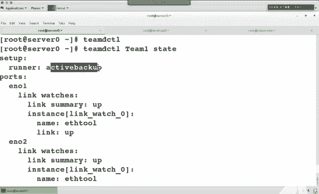

**1. 创建虚拟Team接口**
首先，我们需要创建一个虚拟的Team接口。我们可以通过查询 `teamd.conf` 的手册页来获取配置模板。
```bash
man teamd.conf | grep -A4 -B4 "activebackup"
```
从输出中找到类似 `"runner": {"name": "activebackup"}` 的配置行。然后使用 `nmcli` 命令创建接口：
```bash
nmcli connection add type team con-name team0 ifname team0 config '{"runner": {"name": "activebackup"}}'
```
*   `con-name team0`: 指定连接配置名称为 `team0`。
*   `ifname team0`: 指定接口名称为 `team0`。
*   `config`: 指定运行器为 `activebackup`（主备模式）。

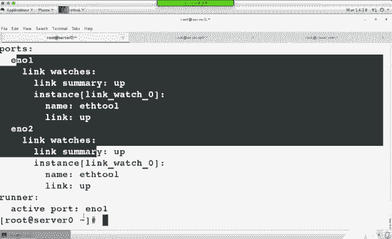

**2. 为Team接口配置IP地址**
```bash
nmcli connection modify team0 ipv4.addresses 192.168.1.100/24 ipv4.method manual
```
*   为 `team0` 接口配置静态IP `192.168.1.100/24`。

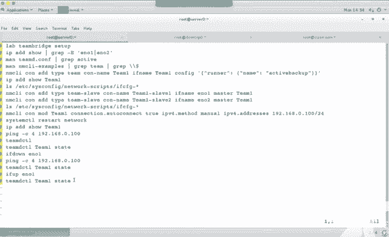

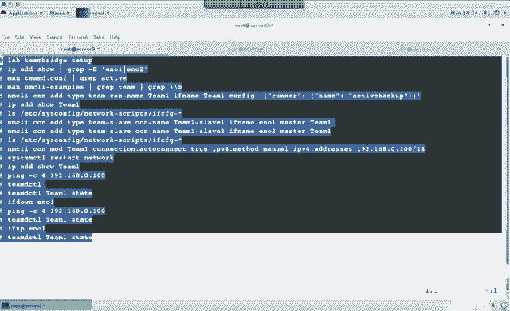

**3. 将物理网卡加入Team**
假设有两块物理网卡 `eno1` 和 `eno2`，需要将它们作为 `team0` 的端口（slave）。
```bash
nmcli connection add type team-slave con-name team0-port1 ifname eno1 master team0
nmcli connection add type team-slave con-name team0-port2 ifname eno2 master team0
```
*   `master team0`: 指明这些端口属于 `team0` 这个主设备。

**4. 激活所有连接**
```bash
nmcli connection up team0
nmcli connection up team0-port1
nmcli connection up team0-port2
```

**5. 验证配置**
*   检查IP地址：`ip addr show team0`
*   检查Team状态：`teamdctl team0 state`
    *   此命令可以查看当前的活动端口和备份端口。
*   测试故障转移：可以尝试断开 `eno1` 的网线，然后使用 `ping` 命令测试连通性，并使用 `teamdctl` 查看状态，确认 `eno2` 已自动接管。

### 实验总结
本节我们学习了链路聚合的概念和优势。通过 `teamd` 和 `nmcli` 命令，我们成功地将两块物理网卡 `eno1` 和 `eno2` 绑定成了虚拟接口 `team0`，并配置为主备模式。这样，即使一块网卡故障，网络服务也不会中断，且IP地址保持不变。

---

## 防火墙配置

### 防火墙管理工具
在RHEL7中，管理内核网络包过滤机制（netfilter）主要有两个工具：
*   **iptables**：传统的命令行工具，规则较为底层和灵活。
*   **firewalld**：新的动态管理工具，引入了“区域”和“服务”的概念，配置更直观，并更好地支持IPv6。

在RHCE考试中，两者都可以使用，但更推荐使用 **firewalld**，因为它更易于管理和理解。

### 理解iptables
在深入学习firewalld前，了解iptables的基本概念有助于理解防火墙的工作原理。

**1. 链（Chains）**
iptables规则被组织在不同的“链”中，数据包会依次经过这些链进行处理。默认的过滤表（filter）包含三个内置链：
*   **INPUT**：处理**进入本机**的数据包。
*   **OUTPUT**：处理**从本机发出**的数据包。
*   **FORWARD**：处理**经过本机转发**的数据包（例如，路由器功能）。
还有两个用于网络地址转换（NAT）的链，在nat表中：
*   **PREROUTING**：在数据包进入路由决策之前进行处理（常用于目的地址转换DNAT）。
*   **POSTROUTING**：在数据包离开路由决策之后进行处理（常用于源地址转换SNAT）。

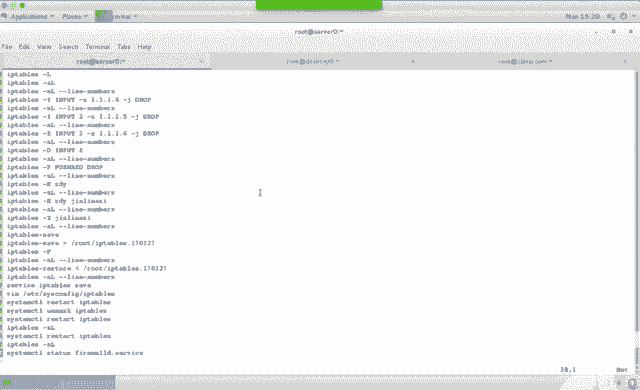

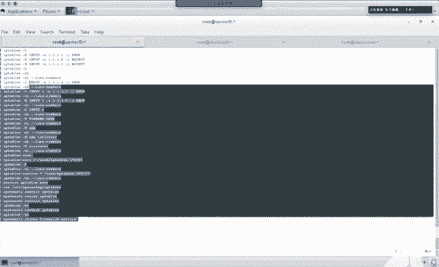

**关键点**：**FORWARD链的数据包不流向本机**。这意味着，如果你配置了端口转发规则，在**本机**上测试访问转发端口是无效的，必须从其他机器测试。

**2. 基本命令示例**
*   查看规则：`iptables -L -n --line-numbers`
*   添加规则（禁止192.168.1.1访问）：
    ```bash
    iptables -A INPUT -s 192.168.1.1 -j DROP
    ```
*   插入规则到第二行：
    ```bash
    iptables -I INPUT 2 -s 192.168.1.4 -j DROP
    ```
*   删除第三条规则：
    ```bash
    iptables -D INPUT 3
    ```
*   设置默认策略（丢弃所有转发包）：
    ```bash
    iptables -P FORWARD DROP
    ```
*   保存当前规则到文件：`iptables-save > /path/to/file`
*   从文件恢复规则：`iptables-restore < /path/to/file`
*   保存规则使其开机生效：`service iptables save` （这会写入 `/etc/sysconfig/iptables`）

### 使用firewalld
firewalld通过“区域”来管理规则。每个区域预定义了一组规则（允许哪些服务、端口等）。网络接口被分配到某个区域，从而应用该区域的规则。默认区域是 `public`。

**1. 核心命令 `firewall-cmd`**
*   查看所有区域：`firewall-cmd --list-all-zones`
*   查看当前区域配置：`firewall-cmd --list-all`
*   设置默认区域：`firewall-cmd --set-default-zone=internal`
*   将接口加入区域：`firewall-cmd --zone=public --add-interface=eno1 --permanent`
*   添加允许的服务（立即生效并永久保存）：
    ```bash
    firewall-cmd --add-service=http --permanent
    firewall-cmd --reload
    ```
*   添加允许的端口：
    ```bash
    firewall-cmd --add-port=8080/tcp --permanent
    firewall-cmd --reload
    ```

**2. 考试常见实验：使用富规则**
考试中可能会要求配置更复杂的规则，例如“仅允许特定网段访问SSH服务”或“将特定网段对某端口的访问转发到内部端口”。这时需要使用**富规则**。

*   **实验一：限制SSH访问**
    要求：允许 `172.25.0.0/24` 网段访问SSH，拒绝 `172.25.1.0/24` 网段访问。
    ```bash
    # 首先，确保默认的SSH服务规则是关闭的（或者删除它）
    firewall-cmd --remove-service=ssh --permanent

    # 添加富规则：允许172.25.0.0/24访问SSH
    firewall-cmd --permanent --add-rich-rule='rule family="ipv4" source address="172.25.0.0/24" service name="ssh" accept'

    # 添加富规则：拒绝172.25.1.0/24访问SSH
    firewall-cmd --permanent --add-rich-rule='rule family="ipv4" source address="172.25.1.0/24" service name="ssh" reject'

    # 重新加载配置
    firewall-cmd --reload

    # 验证规则
    firewall-cmd --list-rich-rules
    ```

*   **实验二：端口转发**
    要求：当 `172.25.0.0/24` 网段内的机器访问本机的 `5423` 端口时，将其转发到本机的 `80` 端口。
    ```bash
    # 添加富规则：端口转发
    firewall-cmd --permanent --add-rich-rule='rule family="ipv4" source address="172.25.0.0/24" forward-port port="5423" protocol="tcp" to-port="80"'

    # 重新加载配置
    firewall-cmd --reload

    # 验证规则
    firewall-cmd --list-rich-rules
    ```
    **重要**：此规则涉及 `FORWARD` 链或 `PREROUTING` 链，因此**无法在本机使用localhost或127.0.0.1测试**。必须从 `172.25.0.0/24` 网段内的另一台机器上访问 `服务器IP:5423` 来测试效果。

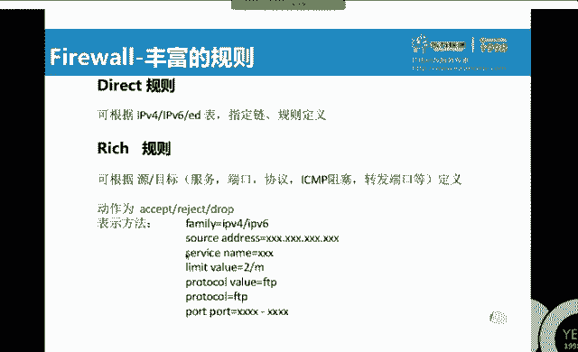

### 图形化工具
对于不熟悉命令行的用户，可以使用图形化工具 `firewall-config` 来配置防火墙，其操作更加直观。

### 防火墙配置总结
本节我们探讨了Linux防火墙的两种管理方式：`iptables` 和 `firewalld`。我们重点学习了 `firewalld` 的区域、服务和富规则概念。通过两个实验，我们掌握了如何使用富规则实现复杂的访问控制和端口转发功能。记住，涉及转发的规则必须在其他主机上进行测试。

---

## 课程总结
在本节课中，我们一起学习了两个核心的网络服务配置：
1.  **链路聚合**：通过 `teamd` 将多块物理网卡绑定，实现网络冗余和负载均衡，重点掌握了主备模式的配置方法。
2.  **防火墙配置**：理解了 `iptables` 的基本概念，并重点掌握了使用 `firewalld` 和富规则进行精细化的网络访问控制与端口转发。

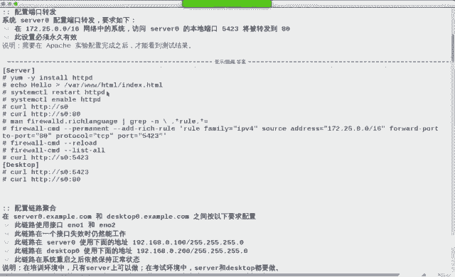

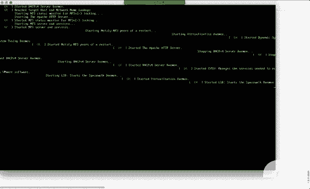

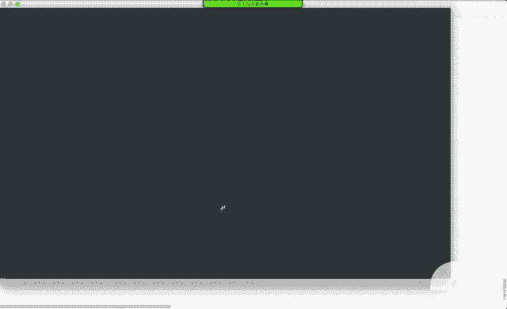

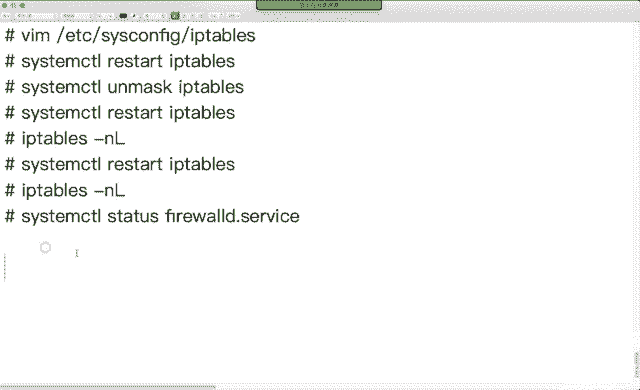

这些技能是构建稳定、安全网络环境的基础，也是RHCE认证考试中的重要考核点。