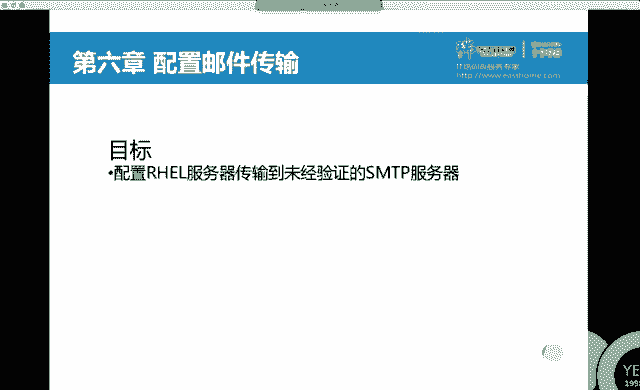

# 红帽Redhat RHCE7培训课程+RCHE7实战参考教程+红帽8.0教材电子版+模拟环境及辅导 - P17：3 - 16688888 - BV1zu41197p6

我们先来回一下昨天讲的内容。昨天我们讲了sst。所以特门第二言呢要求大家掌握一条命令，要C以特门很。通过这套命令，我们可以重启服务。你可以设置开机自动启动。你还可以看服务的状态。看服务状态的时候呢。

一般我们会加个杠钩。乐是哪个单词啊？乐是服了那个单词是吧？货俩乐，这个比较特别哈，俩乐。O。那么你还得知道这款米粒。如果要确认的话呢，你还得会。At。啊，这 system controlt。

那你要是怕同样的多个放火墙启动错了，我们还可以把它给骂死。这个是sem control。那么在以前的时候啊，我们实际上还有一条命令叫ss control。这条命令啊，它的功能是直接修改的。

直接修改那片山水。跟我们上面这条命令啊长得很像，但是少了个特啊少了个特儿。Sex control。这 control臭是干什么的呢？们来瞅一眼。Sa control。

tableable建议table有这条密令是吧？它的功能啊是。修改那条参数。他都能干什么？同意呀。如果你想查看当前的内核参数。你在要干什么呀？显示所有的variables。全现所有的。一堆吧。

一堆内核参数。比如说我对啥比较感兴趣呢？我对IP转发。I pay for work。这个功能啊在系统当中，我们可以把它理解成是路由功能。路有功能。用size controll命令杠A，我们可以来查看。

那个如果你要修改呢。如果你要修改的话，你需要去改一个文件。Great。大家会发现一个叫size controll点config是吧？然后你会发现有一个叫做ss control。D的文件夹。

这个呢是它的配置文件。这个呢是它的子配置文件夹，子配置文件夹。你如果想让我们刚刚那些选项，比如说你默认值是零是吧，你要想把它改成默认值是一，你可以在我们的配置文件。或者子配文件当中填那一行，它等于一。

那么系统在启动的时候呢。这个功能就会默认启用。可以改赔偿金。Okay。那介绍上内容吧。你除了知道这个命令之外。你还得知道这个文件。之所以提他的原因呢。

是因为这个东西啊和s term control长得很像。但是它是俩东西啊。这个是控制服务的。控制整个系统的这个是控制内核的。こな个。IPP6。🤧。对于IPV6显而言。要求大家必须会看一个慢手册。啊。

慢手册。实际上你要不会看卖手册呀，也能配出来会配IP4就行，是吧？那如果IPV4也不会配的话呢，万手册当中实际上有IPV4IPV6怎么配，有实例啊，万手册当中也有实例。卖什么呢？NM色拉。这个可以。

大麦 NM supply examples。这个也可以。德平。那么如果你是做team实验的话呢，你就只能卖它。Apples。他来的区。黑来PV6NMs。麦克跟猫对fi，然后你的连接名。

比如说叫system。一K是0。然后呢。Americ。How to connect。再然后呢。I think this method。Sa it for a menu。是的。安徽V斯的地址。

那因为这个第三门课要讲开PP6。我们把四改成6吧。把，缩改成6。At best。号码是啥啊，直接写就行。那这条命令呢，他说依然是修改你的配置文件吗？所以说你需要干嘛？重启。重起伏。我不忘了。

🤧网络服务开机默认就自弃了，因那波可以省略啊，但是建议大家养成习惯。分手的事儿。然后要确认吧。确认的话，我们可以用if confi，也可以用IQdress show。到底有哪个呢？看你心情啊。

到底哪个看你心情。IPV6对IPV6的话，你还得知道什么内容呢？就是。我们在测试的时候啊，有个F180。本地回环接口这个I。那么对于F180而言。嗯。对于F180而言，如果你在拼的时候怎么拼呢？

全能接到。可以杠I，可以摆分号都行吧。看你心情啊。P音6。は。或者是拼音6。第两种。如果是我们设置的APPU地址。是不是直接拼就行了。跟他们的区别。T。对于team实验而言呢？主要是三天没立。

只要三条没立。那么那三大命令啊。Yeah。我们可以过滤。Tim。带过滤。到了。再过滤到了，或者说你可以换一种方法来写。那个你们是不是大家到了啊？然后team的呀。也可以吧。看你心情啊，你愿意咋写咋写。

🤧。第一条T目命令啊，你要确认它会生成。一个接口。然后呢，同时。它还会生成一个网卡的陪证页。我再给你们写文档啊，写思路的时候，实际上就是验证的过程。如果你发现光有配置件没有接口，就别着急往下做了。

你往下做也不成功。讲佢吧。但是如果这个东西又有接口，又有配置文件。你可以接着往下做，实验肯定成功。这个实验当中，如果不成功的话。🤧。主要就是你接口没生产。配置文件肯定能生成。

接口没生成的原因可能是什么呢？我们在。用NMCI来添加一个team设备的时候。添加了te目设备，我们是不是在肯fi后面写了个单引画括号啊？你肯定是单眼画框那个位置有问题，因为剩下内容都是复制前贴的吧。

基本不可能出问题。那如果出问题都是单印。换括号就他俩的事儿。所以说这个时间呢你多做两遍，注意单引号2，基本就O。另外两条命令，你在执行完之后，你会发现。它会新生成。先生场。两个赔偿金。待上之后呢。

将一它网卡重启。那我们怎么来确认呢？用什么名来来吃？羡慕我。对。很臭。OK了，就用这个名来确认。那么你在写deta命令验证的时候，他是不是要求你写一个confi是什么呀？啊这个是什么用的储备呀？

不用背吧，卖什么？慢。天目多点可对。然后过滤active。或者i卡都行吧，过类谁都行。把这两个命令恢复了。虽然很容易。对方火墙。我们昨天呢主要讲了一下，通过图形的方式，怎么配防火墙吧。考试的时候。

建议大家用fawell这个命令。考试多少？平时工作当中。这个如果你配100台服务器，能拿鼠标一顿点吗？这个是个挺疯狂的事儿是吧？干一天终于点完了。而且自己点的话还容易输错。所以说在实际工作当中啊。

我们是不是用命令比较多呀？用脚板表。那昨天这两个实验如果用命令来做的话，应该怎么做呢？🤧我们今天一起来看一下。用命令怎么实现？昨天我们做了两个实验，一个是不是限定的SSH啊？另外一个实验呢。

我们是不是做了一个叫端口转发？蓝后谁。okK那我们首先来看一下这个。如果用命令来做的话，怎么做？嗯。带了。很慢的。Permanent。默认情况下，你是不是有1个SSH服务啊？你是不是要给他删掉？

删掉的话，怎么删？天服务我们叫爱serv。珊瑚叫remo service。用我れも。呃，用不用perman的。泡沫ent它代表的含义是什么？永久，他说改配置文件。他慢难题。木。删完了之后。

你是不是还要添两个不规则呀？允许那个月来访问，不允许那个月来访问，OK吧。实际上工作当中啊，你只做一个允许就可以。允许就可以，为什么呢？那个允许剩下是不是全拒绝啊，默认都拒绝吧。能理解吧？

但是在考试的时候，既然你提中明确的说了，这个允许那个拒绝，那你是不是也要写一份啊？啊，ok。那用负规则的话，怎么来做？如果你能记住NMC line。rich language啊，不对，应该看谁呀。

防火墙是吧？如果你能记住赛尔。防火墙。vewell B rich language这一块怎么写的话，你是不就不用慢杠K呀。慢杆K没有的话怎么办？慢DB慢D币干嘛的呀？

更新慢杠K keyword的索影库吧。平时我们在用百度和谷歌搜索的时候，为什么它搜的那么快呢？是因为你每天在睡觉的时候啊，它是不是利用它的算法自动去更新它的哭啊。换句话说，你用百度谷歌的时候。

实际上是不是在数据库当中检索呀？能听懂吧？我们在mon达K的时候，Q word的也是在库当中减速。你还在裤裆中。O。我们来看一下这行。有没有个范尔报的点你吃狼鬼子啊。当然，如果这行你能备得住的话。

是不是就不用慢慢退下了，直接慢就行。因为太长，我也不建议大家背。当然你能备注更好啊，能备注至少会好几个单词呢，是吧？瑞士这个词儿什么时候建的？玩大风翁游戏的时候像。如果记不住的话。

回去玩一天瑞士大富翁4。诶，说大风扒了是吧。浪鬼就能代表一眼。进来之后，那我们想做的是不是端口转发呀？有个词儿叫方罐。能看到下面这个合适吧。但我对格式我不感兴趣，我对什么感兴趣啊。example失例。

看到下面这算实例了吧。什么协议原是啥？转发到哪儿，转发到哪个端口，什么协议的什么端口to到哪个端口。看到这个词儿没？同样是po，这两个po的区别是啥？擦个兔吧是吧？你523转到80。

是不是 two到80？to是目标的意思。Okay。那我们如果是直接去里面复制粘贴啊这个。不太习惯。在企业板期当中，慢命令支持过滤啊，支持过滤。嗯。玻列什么呢？包味了是吧。这行是不是还有入啊？规则。

那我是不可以过滤弱点星flowword的。是不就这条。那下面我们来来做复规则。F all。渴望的永久生效是啥？都还这个呀。你平时填服务的时候，你是不是爱的service填副规则的话，你看哪个像。

有没有个叫瑞士弱？有吧。然后呢，你这一圈儿啊。不对，这一串儿是不是都是副规则呀？那我们为了表示它是个整体。你里面用了一堆双饮，那我建议大家用什么呀？单译。这里面是付规额，付规则是啥呢？一年贴。

剩下的操作是不改不改不就完事。这么插串，你能背下来呀。你也挺厉害是吧？别背，你现在能背下来，这两天又忘了。睡两会觉，哎，那天干嘛了呢？啊，那天我跟苏老师见了个面。他跟我们讲了，发火盘复贵子。

怎么做的了呢？这个命令很困难，想起来，但是慢手册能想起来吧。大会发现我们从第一门课开始啊，一直慢到现在。慢慢学啊慢慢啊。O不修改。那在这个里面。首先。我们用IPV几啊。M米4。

你想想我们之前做实验的时候，在图形界面，你范没是不是选择了FPV4？对应的。你图形下怎么弄，你现在就怎么弄。然后原地址。是不自己呀？自己的话，这个就不用写。所以我们是不是给它干掉？

ctrol W删除后面前的字母吧。原地址不用。转发端口to到哪个地址。呀不对，那个圆的留着。我们题中是说。那个网段的人，然后可以把他转到他是吧？原则留着嗯。这我算错了怎么办？删错了删错了就删了呗。

删错删了，我重写，这不行。你刚刚是不是复制粘贴了呀？复制的还在剪贴板里了啊，再来一遍。别紧单哈。这个可以随便修改。原地址。按照其中的要求啊。原地址是谁呀？是一个网不是吧？千万。我们瞅一眼。嗯。知道吧。

其中要求的是啥，你就复制啥。转发地址转发到哪呢？to the address说本地呀。把这个删了吧。自己自己不用写。to到哪个端口，我们题中要求吐到哪个端口啊？80120。这边写反了啊。

把哪个端口拖到80啊。五是啊。5423。没事。这W命0的作用啊是说永久成效，做这个转发端口。终就生效转化多后。那你既然永久生效了。啊。你怎么做短还中考实验去了？咱们是不是还有两个那个SSA是服务啊？

那俩SS是符应该怎么写？是不是得有服务？得有规则。然后呢，得有圆吧啊。得有服务，得有规则，得有原。这两个东西怎么写？外们也来看一下。依然是用慢手册。我们会发现呢，他们是不是都是引入规则开头啊？

你入规格开头，我是不是想限定服务？入点service。大看这个里面几个入。好几个是吧。然后是不是都有限定s呀？就最后这个没限定吧。s司是不是都在服务前面？那我又想来限定。圆又显的限定服务。

还是不是可以这么写呀？当然了，你是不是可以再管刀，再给一下也行。大家看这这里边用哪个呢？用哪个合适。我们的题当中啊，是不是说允许学法文，不允许学访文，有文下吧？你会发现它的结尾是不是主要结尾有区别呀？

一个允许一个拒绝。换句话说，允许的话，复制上面这个拒绝的话，复制下面这个改改就不得。这俩案都用。不是。okK按照T的要求。你说。允许谁来访问SSH啊？他说example点看不预呀。考试的时候。

在题议环境说明中，他会明确的告诉你它的网段是多少。你就照他的网段啊写一下就行。那后这个里面随便写一个。服务SSA是什么服务啊？是不叫SSH？他的日志。日志。提中没要求限制，提中也没要求吧。

没要求的东西就。干掉。这个是一会儿我们要用的。那我们这个东西如果直接写在sre脚本里，或者说写在命令令行里，它是不是执行不了啊，你得把它放在哪？不规则吧，依然是permanent永久生效I的。我也吃弱。

单页。把你要用的这个东西呢。你天进来。OK吧。同理。同理我们还要做个服规额什么呢？是不是这个拒绝呀？拒绝。限制的不要。lifeve不要日志不要服务。服务的话说SSH。前面的。往断。172点。

那考试的时候啊，他会再给你一个网关。就按照他提要求啊。写一个就得。然后这个呢是IPB4。做完了之后，你想让它立即生效。立即生效的话，除了reload的这种方法之外，就是把permanent它干掉。

再敲一遍。也是立即生效。能理解吧，另外的方法呀。偷慢的的干掉。但是我们会发现，当你写了多条规则之后，reload是不是最省事儿了？实际工作中，如果想测试的话，你可以直接写一份，不写perman。

生下了之后，我就要来验证。大家看service当中SSH服务没有了吧。然后呢，在下面是不是多了三个不规则？三分色。怎么来验证啊？🤧怎么来验证？SSH的话，是不是灯开就行了？如果是端口转发的话。

说要还得弄个外部服务啊。那我们也来验证一下。IGTVM control。S套。OK一件要用到外部服务，我们装一份。安装服务应该用。要么。放位。不知道。嗯。🤧安装完了之后啊。

我们来看一下它的主目录和顺影文件。这个呢是它的主配置文件。在他的主配证件当中。有一行。嗰个 document。很暖吧。路上呢这个灯吧。大家看这个路径也不眼熟。我们昨天生成送礼也，是不是在他下面生成的？

还有一个文件叫index的ATTMM。这个directect。Director。very index目录。Dctor。忘了。放了些点香。Index。看到directory index了吧。看下吗？你好。

看到没？上面那行和下面那行区别什么？上面这行带个井号吧。那如果你只是想显示下面这行的话，说可以to杠V。OK吧。也行。你会发现你的索引文件是不是叫index点ATML。那下面呢我们就是升成。Hello。

VR3W调慢点。大是也挺大。就后面这个路径啊，和文件名哪来的，配置文件里写的吧。他说叫那个路路径那个名，那么你就生存在一路那个路径，叫那个名。刷完了之后呢，将服务重启。

That term control。然后设置开机自动启动。在之后又设防火墙吗？不用吧，因为方火强我们是不是做那个综合转发呀？本地测试COL。他们hel楼了吧。到客户端。Yeah。

返问服务器的5423端口。hello吧。然后呢，SSH。是不让登了？Yes。实验完成。能看懂吧？那这两个实验当中啊，我们最终用的都是负规则来做。最终使用的都是负配格。我把这两组命令啊给大家整理一下。し。

不是。

去。我们首先来看一下第一组实验。如果你只做SSH氟射炎。然要去干点事儿。fi command list列出你当前服务中会有个SSH服务，我是不要把把它给删掉啊？然后呢，你是不是要来添两个？

添一个允许添一个拒绝。那么这两个东西怎么用？慢DB更新库之后查副规则。在复规则当中查什么呢？搜查规则源服务啊。规则原符，然后呢把你的副规则写里边一个接受，一个拒绝。一个accept，一个你ge。

做完了之后呢，它是写到复制文件中永久生效reload立即生效吧。历似的呢。确认。历丝的确认之后。下面是不是要来验证了？通过客户端。访问服务器端的SSH服务。敲账上面密码。可以登录吧。下班套。

因为你刚刚在服务当中，这个已经你干掉了。所以说他肯定是通过你的负规则来访问的。通过你的这个网段。再继续。转发。做端口转发实验的时候呢。我们依然要用到慢手册。所以说你也要卖一下。

如果你是接着上一个实验做的话，用不用曼TB啊？不用了。如果是接着上一个实验做的话，不需要还DD。直接慢慢配就可以。看富贵则。在富贵则当中去找端头转发。端口转发。然后呢。把转发这个规则写上。

写完复规则之后，我们想让它立即生效。没漏了。确认呢类索到。这段是防火墙的设置。那么在这个时间当中啊，你还需要去做一个准备工作。查阿帕奇服务，查配置文件。看一下主目录和索引件的位置，然后呢。

在相应的目录和文件中生成索引内容。重启服务，开机自动启动测试。这段内容你是先做呀，还是后做，随意。反正测试之前做了就可以。我们昨天在给大家讲图形操作的时候，是不是先配置的呀？那，为了统一。

我把这个数据稍微改一下，也先配它，再配方一下。拍完防火箱之后。本地测试。本地是不是可以来测试啊？本地可以访问吧，然后呢，通过客户端可以访问5323。试验完成。这两个时间能更是吧？

关键记住一个慢啊慢副规则。这两个时间当中啊，如果你非要记的话，就记这条就行。Yeah。每个实验当中都有个关键点，你把关键点记住，这个实验就很容易。关键点不记住啊，你要记得东西就更多。回头头来。Yes。

这是。对我文花。と思吧。那现在又有问题了，我们能做这些配置，那我要删怎么办？我想给他杀了怎么办？尾幕。Remove rich language。呃，在我们的幻灯上，大家看。这个词儿。

Must carried。没装吧。什么时候涉及到尾装？我们刚刚做这个实验的时候，用伪装了吗？没用。如果是说客户端访问服务器的时候，转到classroom的某个端口。涉及到三台机器。

这个时候必须要启用伪装。如果是你访问我机器的一个端口，转到我的另外一个端口，这个时候不需要违装。能那些区别吧。为什么要伪装呢？大家都知道一个数据包啊，就跟一封信是一样的。你是不是要写原和目标啊？

从哪来的，要发到哪儿去？当经过我的机器给你转发之后。别的机器认识你的IP吗？不认识吧，是不是写成我的IP呀？😡，这个时候涉及到一个伪装的概念。那下面我们来看一下，通过命令给它恢复。恢复怎么恢复？

或者是删除怎么删除？Fairwell command list。好。如果是图形下的话，是不是perman的点一下remo，点一下dlete就完事了。这图形，那命令行怎么做？但看有这么多负规则是吧？

我们一个个3。Permanent。天富规则叫爱的山富规则叫。原目位。一样的吧。谁你想删谁就复制谁。是不删了一个呀，succis继续。接着复制。如果你觉得串行不舒服的话，你就可以把字弄小点。T恤衫。是。

都刷完了之后，想让它立即生效。这都烟水漏的呀。确认。是我接着累死去。都没了吧。但是删除怎么删？这个实验呢叫做人木。通过命令下法。图形要删的话比这个容易的多。Yeah。重形要三。

依然是 permanent。选择相应的复规则，然后删除，然后reload的立即生效，在run time确认。别的简单的。Yes。真是。呃，SE类那个词当中，它也有对端口的限定。

我们在之前做了一个阿帕奇服务，你把端头改成不是80，8089。辐是不起不来了。为什么呀？因为我们的端口有个列表。端口有个列表。SC manager port SE是什么意思？阿思仪。

SE大家代表的是安全增强，然是Q in。如果这个词儿你不知道的话，你是不是可以慢一下？大家想这个命令挺长的，后面我忘了怎么写了。那么你可以这么来做。这是k播键吧？ctrol A你在慢。能理解吧？

先写很长的命令，cttrorl A跳到行首再写慢。S1lin策略。它可是一个管理工具。他在管什么呢？我们通过它是不是可以来管上下边关系？可以来管word1。还能管上吗？端口。一堆吧，一堆能关。Okay。

那对于端口而言，都能管什吗？接着慢。我们可以看一下，在这个里面杠。乐什么含义？列出吧。那杠A呢？下面的示例当中杠A数比较多。上A是干嘛的？添加吧添加okK。那么SE managerport杠6。

一赌一把。每个服务类型它所对应的端口的值范围。端的值范围是多少？那，如果想看跟HTTP无关的。这几个吧。都跟HTP玩。默认HTTV多网号是多少？80。你看一下，现在只有两个，一个是catch缓存是吧？

一个就是port。那我们一看这个范围，你能判断出我们要用的类型是不是就它呀？能看到吧？呃，我们在第三门课呀还会学到一个服务。叫做S加C。他的账款号呢是3260。大家看这个位置多少号，3260吧。

有同学做实验的时候呢，就是不用3260。那你是不是在这个里面还得杠A添加一个类型？添加个类型怎么写呢？他下面是有些失力。个事例这些事例都是以什么方法开头啊？啊，不是减号啊。到了。哎呀，忘了。忘了咋办。

先给你瞅一眼。你 example。哎，这看在哪个命令？M S E manage。Minage。啊，有井号是吧？有几号。那命令写错。你用一个反应杠行吗？哎，也行是吧？这两个呢是它的主要用法。

一个用法是不是添加类型？一个用法是不确认的？想想我们平时在服务配置的过程当中，思路基本上都是涉置。确认确实确认都这个思候吧，安全命令。这个两个事例啊。这个两个事例要记住，呃。

阿帕奇考试啊实际上主要考的是他。V的区别呢，我们的端口不是81。按照题要求是多少写多少。比如说我现在去干一个事儿。la神。默认我们当前。监持的多少是多少啊？80。我用一个命令。修改这个配置文件。

改什么呢？我在这个文件中查找listson。以内生开头的好。然后呢做个替换。替换什么呢？把空格后面所有的内容替换成空格8089。P。能看懂吗？为什么要用空格呢？因为它没等号，你这有个参照物是吧？

把谁改了。有朋友说你知道是80了，你直接把80改了不就得了。你想在实习工作中，如果你写脚本的话。那个多网号到底是多少，你也不能确定。但是lason能确定是吧？listen嘛这边，所以说查找listen。

嗯。Okay。擀完了之后呢，再次补一回。变了吧。现在服务再重启。是不起不来了？默认服务能启动，结果我们刚刚只改了个端口，服务是不是启动不了了？那到底什么原因引起的呢？我们是不是有经叫。

Get enforce me。你看一下现在IE类的值是不是in。我fid in force0。你再干他一下。晒的人放丝作用了么？你你出聊天记录。是是立即设置立即生效，把你IC类的时改成permiss。

你只警告吧。执行号之后呢，你会发现。服务能启动了吗？换句话说，当年我服务启动不了，肯定跟谁有关。行。I learning水管吧。因为你想四个安全性，文件系统服务。S一类那个是防火墙。我光起这么服务。

跟方火强有关系吗？没有。跟本地文件行有关吗？也没有，是不是就剩下服务的配置文件和IElin了？现在是因为服务的配置文件和IE的那个冲突。你服务说哎，我不用80。

我用8089IClinux说你只能在这个列表中不能用8089，它俩冲突。你要不就把端口改成880，你要不然呢就把SE类那个词端口列表加一个。那怎么加呢？我们是不是要得给它改回来呀？赶化来之后。

又变意风型了吧。服务是不是又起不来了？但是系统中会告诉我们说，你是不是得看一下状态呀？直接看状态。看到 permission。此处省略一万字，你知道他说啥？有一天媳妇问说，哎，这个你爱我什么？

你为什么爱我啊，此处省了一万字？这媳妇儿受不了是吧？我们的杠L，你得具体点。先准备好台词啊，这个女人最愿意问的这个问题。看到原因了吧。是说不能绑定到端口8089。讲得未。不能绑定到端口8。89。

不能绑定8689，他说什么呀？available啥意思啊？可用不可用吧，为啥不可用呢？还没说。他们说的话，你得看看。麦C不是。8G。光盘调到最后一行吧。因为我们来看一下前面的时间。9点50。你往上翻译。

大家会发现他这个时间呢。最新的时间是在最后面。所以说直接大G跳到最后一行，从后往前看。这个里面有好几种方法都能把这个实验完成。其中闭着眼睛做的这一种方法呢，就用这个方法，117和118。

117的作用呢是说。我过滤审计日，生成一个审计的策略。然后呢，我把审计的我的自己策略啊，inport应用。导入应用。那这个策略到底是啥呢？你要不用这种方法的话，你可往上看。上面有一个是说。

设定逆斯的不稳时吧，咱配逆斯服务了吗？没有。你再往上看。看到9九这行。看到了吧。就刚刚最下面那一行啊，他说生成一个你自己的策略，然后导入是把你刚刚我们看这两个都做一遍。他也不知道是哪个东西限制的。

反正他都给你拆开。是不是也可以呀，也行。但是在实际工作当中，建议大家明确开哪个端口，关哪个端口。比如说在家里面炒菜啊，烟太大了，排油机坏了，你得开哪个窗啊？厨房的窗户吧，你不能说家里有烟了。

把所有窗户都开开，多冷啊，是不是？O。😊，那我们会发现这个位置是不大写。他说这个东西啊，他是万的。One of the following。记得以吧。这堆里面奶色啊？是不怕。你怎么知道是他。

我们是不是刚刚哥看过？OK吧。好，那这套命令也很长。我们是不是可以过滤在8089这好。怎么这么多？因为刚好多了好几遍。所以说会有两组啊会有两种。啊，那个类型是啥了？就用刚哥看。你帮给我看。

是不就这个类型呢？然后呢，把它的复制。ctrol左左左左左过头了，右ctrol W。再然后呢把这个再也复制。粘贴。看年贴多了。这个因为当时机器卡了呀，我粘了一下，它没反应，我又粘了一遍，就这样啊。

年多了，重新连吧。粘贴。看车左。Ctrol W。之后呢，服务再重启。如果能起来了，是不是说明这个是O了。这个谁还能看懂吧？到端口的限定。也跟发火商有关吧，跟方火城有关呢，说白了就短口。

有同学说不应该是服务吗？网络服务最终用的都是端口。能起来了吧。确认。怎么确认呢？我们是不是有个叫做tats的那个？还是没有吧。吃完了。我们把这个时间思路给大家捋一遍哈。首先呢我们过滤了一下外部服务的。

端口。监屏默认80，然后呢，我们通过s命令，有同学说老师我VIM去编辑行不行？也行，我这个为了给你写笔记。就说我们一看这个东西，你知道干什么。它是添加呀，修改还删除很直观吧。再然后呢。

得分令你可以来过滤啊，确认端口号数变成8089了。现在服务能启动吗？启动不了啊，到这启动不了。然后呢，我们去验证不知道什么原因。看了一下当前是inforcing，我们是不是改成permissive啊。

确认permissive服务是不是能启动了，肯定跟SElinux有关。现在是服务的权限和IC learning权限冲突。你肯定有一个要妥协，肯定有个要修改。如果你亏这文件就要8089的话。

是不是只能改S一类那个了？往下。我们把它的值给改回来之后，第十一行服务是不是就启动不了了？确认就是SElinux和服务冲突。那么怎么解决呢？看状态，看日。状态中此处省个一万字，我也受不了。

那么杠L他是不是还说权限的事儿啊，也没说为什么，就说权限。看日志在日志当中，大G从最后面往前面找，你会发现是不是有几组啊，三组啊，一组是生成个策略立即生效。另外一组呢是说改逆斯的破尔值，还有一组是什么？

改端口号吧。我们用改装口号8089。然后呢，用SE manage pop杠乐。你要是找到了多我号。我们需要知道它的类型是什么。杠P后面的类型。我们先告哥确认一下HTTB80类型是ATTpoT类型。

然后添加添加完了之后呢，服务重启开机自动启动。现在完成。那么在这个实验当中啊。既然是涉及到了SEM只P命令，所以说建议你先瞅一眼，在它里面是有实力呀。他的免实力。

这个实验呢讲的是SEman port。

嗯。嗯。方小强这张有问题没？Yeah。ok 啦。😊，下面我们来看一下第五章。第五章。Yes。Yeah。首先来明确一个问题啊，DS作用是什么？新行。你于这些东西。嗯，域名装服务解析。

它分为正向解析和反向解析。Yes。还有两种解析。它的功能啊叫民生解析。翻译成中文叫域名词解析。域名称解释，它有两种解析，一种叫正向，一种叫反向。他俩的区别是什么？区别。在互联网上。

你用正向解析波还是反向解析过啊？你每天在上网的时候，用的最多都是正向解析。你是不是敲那个3W点什么什么点CO。这权项正向。这想就是。Yeah。正相底析代表什么含义呢？他是说。名称。解析。解析成IP。

要正向解析。比如说。3W点儿ea home点儿com。你访问东方瑞通的网站，瞧会是这个名吧，系统最终啊会把它解析成。一I批地址。IP地址是多少呢？用一个最简单的方式，大家用过拼命令吧。

拼的话可以PIP也可以拼什么？一名。看到这个IP没？换句话说，你直接访问这个IP。是不是也可以访问那个站点啊？有可能哈。为明有有可能呢？如果那个IP上好几个站点呢，就不一定访问的是谁了。解析长。IP。

好，再往呢反向解析，什么时候我们用到反向解析啊？IP。解析成。名称。在我们当前培训环境中，大家会发现serv和classroom啊。他们的主机名IP地址是不都是对应的呀？你的麦克地址。

可以在DCP上绑定，是不能绑定到1个IP上。然后在DNS上可以把你的IP解析成一个主机名。当年培训环境中是这么来做的。换句话说，反向解析的作用是不是就IP解析成组机人了？OK吧。反向解析。一个正向。

一个反向。那么在很久以前的时候啊，DS不存在的时候怎么办？很久以前没有DS。今晚六白。早期呀我们用的都是耗斯斯文件。他是吃。在这个文件当中，你可以来写IP和主机名。静开对应列表。为什么说叫静态呀？

都是你自己写的吧。呃，互联网在刚出现的时候不存在DES。只要是能上网的机器，管理员每天都要去干一个活。去下载house文件。谁上网给谁copy一份。谁上网给谁靠谱一分。

windows里有house词文件吗？有linux用网络操作系统都有。倒是没有，为什么呢？因为到时不支持网络。有同学说，哎，老师，那道士谁说不支持网络，后来道士也支持网络了。你像最早啊我们局了。

用的是win98的对灯网。不是啊，用的是novave公司的netware网络。n8网络那个年代啊，它实际上都是有类似于无盘国的，类似于。你可以连把倒死。到时下能加点网卡驱动，也可以连网。

那我们来看一下后斯文件。house斯文件中默认有几行啊？默认只有两行。下面那那四和五是培训环境给我们添加的，默认没有。所有的操作系统上默认都会有那么两行或者一行1270。1冒号冒号一。

它们分别代表的是不是你IPB4和IPV6自己的地址啊？为什么我们之前做SSH实验，你可以SSH登录local house呢？是因为这个里面写。local house的IP是谁？

在网络当中使用的永远都是IP地址。不管你是用DNS解析，还是用how词解析，还是用miss解析，还是用netdo来解析。都一样。名称解析的时候啊，有这么几个东西。来的bo。V。2是吃。Yes。

net boss它是个协议。他是一个局域往形。既然说局域网协议的话，代表说它不支持路由。啊，不支持路由。啥意思呢？大家在使用微软系统的时候，你会发现双击网上邻聚，你是不是会发现唉。只要是有共享的机器。

是不是都能列出来啊？他怎么发现的？卖的报协议。let报协议啊，它是属于在网络当中啊，有点类似于。自动发现这么一个功能，自动发现邻距啊，自动发现邻距。网络中都有谁。为什么我们非要强调一下它是局域网协议呢？

你在家里面上网的时候，你双击网上邻居，你能看到。别人家的电脑吗？看不到吧，因为过路油了。如果他支持路由的话，会有什么结果呢？当你双击网上邻居，你的电脑里面网上邻居里是不是要出几亿台电脑啊。

然后电脑是不是该死机了？能感觉什么感觉吧。O。那么它只是在局域网当中使用。他是在举保。net bio协议和miss协议它的区别是什么呢？miss是个服务，miss是个服务。面子是个服务。

m个 boss协议它是在网络当中枚举出来一个服务器。就所有开机的电脑啊，在美女传来一的服务器上都会有缓存。当家访问谁的时候，他们去这个服务站去找。如果这个服务器当了呢，然后他们再选个服务器出来。

自动服务器啊自动服务器。而wins呢是静态服务器。指定的谁是miss服务器？那么如果你指定神知的病服务器之后，所有的人是不是要这该指向他呀？通过他来解析。通过他来解析啊，这是静态。他是个服务。动态。

这个呢是静态。如果你要使用miss试服务啊，需要来指定miss服务器是谁啊，指项就跟DNS一样。啊，我们可以指向BES同样也可以指向miss啊，可以指向miss。这两个东西啊，他们只能在局域网使用。

存在期望使用。他俩都是集房使用的，一个是协议，一个是服务。那house呢house是个文件。浩斯他这个文件。他也是静态。钛和静态。那他是局域网使用还是广域网使用啊，都行。都行。他只针对本地有效。

只针这肯就有效。就说你改了个houses文件，我认识吗？我不认识。只针对你改的那台机器有效，别人都不认识。当然DES呢。DS它是个图。它属于动态。他属于动态。他针对的是。所有客户端。

如果我们在DN服务器上做了一个修改，所有的客户端是不是都能解析出来呀？你有没有把DNS服务器指向改了，不用吧。在电S。一个人修改全能看到。应该修改全能看到。有他们区别。另外，net报协议和bes啊。

他们支持的是主机名。大家知道什么叫主机名吗？手机秒。houses斯呢它可以支持主机名。和。完全限定主地名。DS完全限定不一秒。这啥意思？你再往上林域中啊，你看到主机名带过域名。没带过吧。

是不是只是个主机名呢？叫什么什么没有点，对吧？没有点什么域名。运势当中呢也没有玉的概念。但是在号词当中，你可以写主机名，也可以写主机名点域名的格式。戴是top0。但是top0就叫。比如说420。

这个叫主机名。那是个top2。这个也叫煮鸡苗。什么叫完全信任主机名呢？4520点exle点com。能看出区别吧。带域名的格式叫完全限定主机面。这他们的区别。嗯。那，下面我做一个小实验啊，给大家理解。

大家用个P命令吧。P命令可以帮我们测试联同性，它也可以帮我们做简单的解析。简单的解析。比如说。我拼S0。S0IP是多少？能看到吧？好拼。S11。S11IP是多少？11点11是吧。那你当前这个拼的方法呀。

用的都是DNS。用DS来解析的。下面我去干一个事儿。我刚刚在拼S0的时候，它拼的是不是0。11啊？白口。在houses次文件中，第一列是吧IP地址？OIle，我写个IP。这强面令什么作用？

我们会发现号次文件中是不是可以写两大列，第一类是IP，第二列是不是可写一堆主机名？那我是不是也可以写个IP和E堆主机名？在刚刚我们用DS解析的时候，S0是不是11？那我写了个10进来。现在我们来拼S0。

S0IP是多少？受变了。换句话说，解析的时候，当号次文件和DES同时存在，先用谁解析呀？相应本地，为什么呢？He。Yeah。在根TC下有个叫名称解析服务。switch是什么意思？交换交换。

这个文件呢它的定义是解析的顺序。大家可以看一下house斯名称在解析的时候，它先用什么解析？耗斯词文件后用DS。换句话说，它解析的顺序啊先用的是跟EPC它的好斯文件。然后呢，用的是给你PC下的。

揍着啃fi。要睡去吧。顺序可以改啊，顺序可以改。默认网络操作系统都是先用ho后用BS。解析顺序。我们做实验的目的啊是为了看现象。讲理论知识OK吧。这看你的知道啊。这个学案呢你得知道这个文件，当然是s。

我们可以来定义解析的顺序。

默认先号4后BS。Yeah。OK那回头他来。😊，呃，如果用耗斯文件的话，大家想我一台机器修改了耗斯文件，如果我有1000台机器都要改，挺麻烦吧。关联员工作很麻烦，有的说不对呀，你做计划任务不就得了吗？

每天自己去下载。占不占流量啊？以前的时候，互联网在刚出现的时候啊。吃吧时间算了。还有一种是按流量算法，按流量算，包括现在是不是也有流量啊，流量的事儿。那DNS我们管它叫做分布式和层次性啊，层次性。

这个又是什么意思？首先我们来看分布式。看一下文件。大。半包呢是DS的服务包。他叫波克莱internet内幕得命。B是博克莱，叫博克莱大学。博克莱卡大学开发的一个软件啊，叫互联网网络名称服务啊。

网络名称、域名服务。那么这个服务的功能是什么呢？DS服务。电子服。呃，unux当中有两大体系，一大体系叫做BSD。另外一大体系叫st5。又那个是体系。那么其中BSD体系当中啊，就是伯克莱大学啊。

博克大学tra以BSD啊，意大利。lininux当中它主要用的是C科5体系啊，linux。查一下他的赔偿文件。大家看这个里面有没有个CA文件呢。有吧。他叫做。验证中心啊。

center啊authentation centerer。Yeah。我们来看这个文件的内容。Yeah。但还得起好。anser1313是啥意思？是个数值是吧？你往下数。answer从15行到27行。

一共多少行？是不十三行啊？全球有13个跟DS服务器。全球。我说的是全球啊，没说中国。全世界。总共有13个根变福起，这个点啊，我们管它叫做根啊根根变的福气。而这13个跟DI服器都在哪呢？

大家看到三十行了吧。30长往下30到51。这是全球13个跟DS服务器所在的位置。今天夫妻所位置。那么在后面我们会发现是不是有一个A，有4个A呀。4个A是炸弹吧啊。啊，打符号呢4个A，这个叫IPV6地址。

这个叫IPV4地址。全球13个跟电服务器离中国最近的呢在日本。离中国最近的电子伏器在日本。换句话说，你在解析的时候，你是不是默认去找最近的DN的服务器啊？叫分布式。有13个根电M服务器。然后呢。

他们分布在全球各地。为什么放日本不放中国呢？为什么？因为中国的网络带宽太低。现在我们家里面贷款，你觉得高不高快不快？跟以前来比的话，已经很快了，是吧？但是。啊，什么互联网微术。是整个网络啊。

也也算出口吧，主办网络。日本属于发达国家是吧？它的带宽呢在很多年之前入户都是百兆。那叫什么概念吧？我们很多年前局域网才摆到吧。然后你出去上网的时候，都是几道几道，上个网可以贼慢，跟老牛似的。

就是国家的区别啊国家区别中国属于发展中国家。也挺好，你机器中不满了，文件丢的慢是吧？要快的话，刷就没了，拍个照片啥的也挺快。呃快有快的好处，慢有慢的好处。那你既然你网络基础设施不好。导致什么结果呀？

跟DN服务器也没中国的份儿。原因。OK那么看这个文件呢，是让大家明确全球有13个跟DN服务器，这个叫分布式，分布在不同的国家，不同的区域。比亚代表根玉啊比代表根玉。分博士。全球。13个。跟。Yes。😊。

哎，为什么不放韩国呀？Yeah。证一。为什么？韩国也属于发达国家吧。韩国也属于发达国家啊。卖冰件不算韩国。韩国的带宽也很快，也是百兆。为什么不放韩国？这个你得考虑历史啊，历史上日本虽然很小。

但他老欺负周边的国家是吧？包括中国也被欺负吧，日本也被欺负啊。包括中国、韩国呀都被写了。这小日本还是很厉害的。发达国家。ok。😊，我们继续。那这个里面呢还有一个概念叫做。层次性。什么叫层次性呢？

我们来看一下顶级域。根一域顶级域二级域主记名。刚刚我们说了，全球是不是有13个根域啊？跟BS服务器。然后呢，我们是不是有好多域名叫COM啊？叫GOV呀。叫ORG呀，有这样的网站COM是建的最多的吧。

COM和ORG区别什么？不知道字母不一样。COM是公司吧。ORG是非盈利性组织。非营类型组织。我们有个网站呢叫做L斯。3W点克闹点儿RRG。我们有个网站。3W。Their kernel。点ORB。

这个玩上干嘛的？那那个是内核是。你如果想升级当前系统内核的话，你可以下载编译边安装升级。边安装的话呢需要GCC。GCC程序啊GCC程序需要N cool en包，然后就可以make menu啊。

安装一下内核，安装新内核。那大家想这个网站竟然敢叫ORP网站。莱ning是创始人李纳斯啊，他也在这个网站上班。专门是在做内核。那么他靠什么挣钱呢？啊，非营利性组织都是靠赞助。捐赠。什么概念呢？

大家会发现现在好多类那个是发行版本吧。他们是不是都要去用他的那盒？如果你头帽苏ee。不管你是哪一个发行版本。不管你挣不挣钱，你如果想让这个产品接着发展的话，如果内核不更新了，你这个产品可能接着发展。

不可能吧，那你是不是每年要拿出来一部分利润？捐助啊。挣的多了多给点，挣的少了，少给点。知什么概念吧。你像我们平时一个月，你要挣10万块钱的话，拿个1万2万，你就不觉得钱多呀。但一个月要挣1000的话。

拿个10200。哎，今今天中午吃包子吧。就这个概念了。所以说像ORT样的马扎呢都靠捐赠挣钱。你有钱就多给点，没钱就少给点。你像什么IBM啊，IBM它用不用类那个C啊，也用吧，就这大公司他都用。

他还想让他一直活着，你不给钱，他能活着吗？😡，反正你给钱，你看他更新的是不是也挺快呀？看到没？最新的更新嗯，他为啥没事老更新呢？有人给钱呢？我得让他们看到我有工作量。能听懂吧。当然了。

它里面确实有变化呀。那核里面主要更新的是什么呢？驱动。功能。能理解吧？驱动和功能。一般情况下，我们使用的都是标准的内核。就一般情况下，我们用这内核都可以使用。但有的时候呢。

比如说哎我不认识NTFI分区读不了吧，你可以编一下内核，你能去看NTI分区不能写，你可以编内核让才能写没有网卡驱动，你可以编辑内盒生成的网卡驱动。都行啊都行。这个是内核的作用。简单来说就功能增强。

内核越新，内核越大，功能越强啊。那我们会发现你这个内核啊。好多版本是吧？一般我们看的比较多的呢就是stable。发行版啊发行板可用的。那么像。他有新的版本呢，一般没有人用。就我们即使你去更新内核的话。

一般都更新是stabletable。那现在我们。呃，企业版期目是3点几啊。3。0是吧嗯，都不在这个里边。O。回头头来。EBU是什么的？教育教育education啊，GOV呢。政府啊干澳门这个网上去过没？

嗯，政户网站一般都得去过。比如说。你们公司里面那个。呃，财务部门啊，他肯定是政府网站报税什么的，是吧？工商税务啊都是正方的。再比如说。那个你要生孩子，得去做一些什么填写表啊。弄个什么准生证之类的啊。

也要去政发展。有人说不用去啊，我直接拿身份证户口本，我去那个哪哪哪。啊，那不得人跑吗？现在好多的都网上办公吧，政府网站都GOV。啊，后面这个mail容呢。一样没。好，应该不去。

军事MIL军事网络军事军队。军队知道吧？这个网站一般是不是去的少啊？为啥呢？因为你没想卖国吗。你要是想卖国，想从一些商业间谍之类呀。一些比较特别的工作，一般都允去内外来留达。

不过咱们一般对军事不是特别感兴趣，为什么呢？因为现在是和平年代吧。如果。真的打起来了。大家就会经常会去看这个网站的嗯ML。O。那么这个叫做顶级域名。北京洋。二级运名呢就像我们什么的163QQ。

QQ点儿com163点comM一思home点com，这都叫二局名。三级域名呢就前面再加个名。没有点QQ的卡。3W点QQ点CO。OK吧，这些名都是别名。不是主机名，不是别名。没有人给主题面起这个表。

都用D下次平面来敷。呃，这个是我们的分布式。还有我们的层次嗯，要什么？层次性啊层次性。

OK下课休息10分钟。Okay。DS在解析的时候呢，它的使用方法怎么来用？对于客户而言呢，你要知道这么两点。第一个，你的DNS指向保存在哪个文件中。你指向了DN服务器，这个配置保存在哪个文件中？

是网卡配置文件，还是restore很配置文件？で是。对周点confi文件是立即生效的文件。它是怎么来的呢？把你网卡重启之后自动生成的吧。换句话说，永久生效的DS指向是不是在网卡的配文件里？

立即成效的文件是不是so点可废啊？这段内容你首先要知道这么一个东西。这个里面呢是永久生效的BS指向。当你重启耐work服务之后。立即生效到配置文件在哪呢？在GETC宇宙的confi里。

大家看这个文件当中说你的DS的指向是不是254。254。你把它给改了，再重启network服务的时候，它又从这个文件生成。比如说我属于嘚瑟。说他妈老嘚瑟呢。就说一不小心的意思哈。呃。

查找name server。然后嘞。听话。把空格后面的内容都替换成。8点空格8。8。8。变了吧。现在是立即生效，你现在不管是测试谁，它就用DS来测试。你指的8。8，他用8。8来测试立即生效。

现在你再去拼什么？10。你看能拼通吗？拼不通了。因为8。8这个低压的磁器不存在。所以不通，那怎么办？重启网络服务。然后你再看一下。看到没？对这点confi文件，它是立即生效。伪造点可这文件。

网卡配置文件当中是你的DNS指向，永久生效永久生效。那么我们在课上啊，不管讲哪个知识点，一定要分清立即生效和永久生效的区别是什么。区别。这个问题是你们工作中啊问的最多一个问题。老有学生问我。我唉。

这个我DNS指向。只上DI的服务器。永久说钥出哪个文件，立即成上出哪个文件。这个文件随时时改，随时生效。但它是临时的。重启那个work服务之后呢，它会从你的网卡配置文件里读进来。OK吧。那这个。

但是老板配个文件并没有。就没有显我还没有显示比么哪地。因为你现在不是DNIDHCP吗？从上一的那个对接出线来。啊。你如果是静态的话。Okay course。大家回忆一下我们之前讲的PIPP4的实验。

你说指向静态的IP。于4还有DNS了。当案指向了之后，一重启network，它是不是生成到rezo点fi文件了？这个之前我们讲过啊，只不过讲毕年时候在强调。OK呃，第S次指向服务器一共9生效。

联一成效是谁分清。

客户端在访问某个站点的时候啊，他最终要去用IP，所以说他要先查这个名，对应IP是谁去DNS核心查查完了之后呢。服务器会告诉你IP地址是多少，我再次来访问这个IP这是它的过程。DSC在查询的时候呢。

有这么两种查询方法，一种叫做递归，一种叫迭代。递归是什么含义呢？当我要访问3W点example点com的时候。那我是不是要去DS上去查他的IP是多少啊？首先去哪儿查呢？首先去啥根玉。

跟玉辉高水看不回来了。然后你去com一下查com域又告诉你说example域在哪，上example域查去查3W。他告诉你3WIP是多少。然后呢，我们访问这个主机。你会发现你去访问那个站点儿。

但实际上人跑了一圈儿啊。你先跑到这个。顶级点击目录，然后一级二级一级查，最后查到。那我们会发现。整个这个过程啊，我们管它做递归查询。整个的过程，那迭代查询呢？你是不是都去指定的服务器去查了呀？能交叉吧。

这个呢叫做迭代查询。都去福务清查比较迭待。在DNS当中记录的型。Oer name。代表是名字。dayate代表着数据，typeap代表类型，class也代表类型。呃，他们的区别是什么呢？

这个代表是FPV4IPV6啊，那这个代表的是是A记录P他人记录的一些。TPL代表存活时间，我们在拼的时候也有TPL啊，它代表存活时间。在类型当中，记录类型当中有A和4A。4A呢叫IPV6地址。

A叫IPV4地址。还有什么呢？NS和SVE。NS叫做名称服务器。SOV叫起始授权机构。起始授权机构。C name呢叫别名。D0是不是带是top0的别名啊？S0是420的。叫别名。PDR要反向指认。

反向指针反向指针和主机记录是对应的A记录啊，PTR它俩是一对，一个做正向解析，一个做反向解析。MX叫邮件交换记录。邮件交换记录的作用是什么呢？我们在发邮件的时候啊，你是邮件用户名艾，后面写了个域名吧。

那如果你做了MX交换记录，你就可以发邮件、用户名艾域名的形式。默认他是主机名。弧度MX艾后面是主机名。做MX它能找到它的域，为什么呢？因为在MX技术当中，我们可以来设定它的优先级。这个叫邮件交换记录。

再到邮件输的时候会有把。设定优先机可以来设定先用哪个域，哪个域当中的邮件服务可以来设定优先。那么serv代表的是服务。哪个服务器啊哪个服务器。TIT呢代表是文本啊文本。什么时候会用到TIT？

大家听没听过DDNS。听过花生壳吗？DDS换成壳，它们是一个东西啊是一个东西。DDS是一种技术，叫做DHCP加DS。DHCP加DS大家想我客户端每次在网络中获得IP的时候，我IP是不是总会变？

不一定是什么。那么每次我获得一个新IP的时候，我自动去DNS服务器上去更新我的IP和主机名的记录。那么换句话说，你通过这个DNS名说怎么找到我呀？不管你IP怎么变，都可以找到。

这个叫DDSDDS它用的这个记录类型嘛，这叫TIT。PIT满满的一些。🤧嗯。在刚刚这一堆类型当中，我们必须要用的是A记录和PTR指针。如果做正向名称解析，需要用到A记录，做反向名称解析。

需要用到PTR指类。那么在你的DN服务器呢还需要存在。SOV和NS。起始授权机构。和民通服气。呃，下面呢我们来看一下它的配置文件。在DNS当中啊，它的配置文件有俩。它的区域配置文件也有俩。漂亮。

那下面给大家演示一个主电S的配置过程。考试不考啊，但是这个实验呢大概过程的了解。你需要改四个文件，两个配置文件，两个区域文件。为什么要演示这个实验呢？咱们教材上讲的是缓存BS缓存BS。但实际工作当中啊。

主定啊吸用的比较多。比如说你们公司里面如果想做一个自己的玉。你windows如果要做成玉的话，是不是KPS啊？DS到底用哪个系统来配随，但然得配个DS。你可以和laing斯来做配合。

互联网用最多的DS呢也都用linux来做。办的服。那下面呢给大家演示一个实验啊。通过band的linux半的做DNS。那我们在之前呢已经查了一个包叫BIND。BD什么意思啊？博克莱大学的内蒙革命是吧？

喺问到边。我们可以通过半的来配置1个DS。那下面我们来看一下。D二次实验。对于DNS而言呢，我们可以来做主DS可以做辅助DS。可以做缓存DNS啊，还可以做转发DNS就说DNS如果要做的话。

好多实验啊好多实验。那我们课上啊由于时间原因啊，给大家演示一个主DS。我用搜网来做DNS服务器。首先插包。发完了吗？之前装过是吧，是不是看全全球13个跟DS服器装。搭配人件。包名叫绊子。

这个呢是它的配置文件，主要是控制权限的。这个也是它的配置文件，它是控制你的区域的。比如说我要新建1个EH域啊，先建那个阿伯斯德域，不管你新建什么域，都是在这个里面来写。在ban的低版本的时候。

我们现在用的这个是不是办的9啊？9。9在办的低版本的时候啊，我们的配置就一个。随着时间推移啊，版本的更新。出现了一个叫模块化的概念。模块化，也就是你的配置件呢变成了多个。然后看下面最后两个。

VR那么多下。这个目录上呢存在的是你的。正向区域和反向区域。区域文件的作用什么呀？新文件就相当于一个数据库，你查那个名对应的IP是多少，去他那边查，你查这个IP定的名是多少，也是上那里边查。正上去。

D压是需要配饰的。两个配文件，两个区域文件。那么首先呢来看一下配置文件。大家可以看到这个配置文件中第一行到第八行斜杠看到了吧。也是注视符。不想说不通药。从第十章开始呢叫选项。第十行开始叫选项。一堆。

那我们还发现了斜杠行行斜杠也是注视符吧，这叫断路注释。到42行呢，这都是选项。从44行开始都叫loging。44到49日志。5一行呢哎。做的。区域是吧，看到点儿没？你看一下53fi是不是内么点C呀。

全球1三了那根电幅器在这里面写的。那么在56行，它是不是就写了个叫做RFC1912的部文呢？这都是区域文件。以前的时候这个文件内容和上面的内容是在一个文件中。那么到现在九版本的时候，它分成了两个文件。

可以，往上翻，我们到选项当中，再家看十一行。listson pop53限定我现在我这个服务监听买个IP啊？1276买1。换句话说，我这个服务即使启动了就能用。就自己能用吧，别人访问1270。1的时候。

访问的是不是都是他们自己呀？为了让这行生效，你有这么几种写法。第一种。把它写成4个零。本机所有生效的IP。第二种方法。第二种方法。把这行注释掉。第三种方法把它写成17225。0。11。

你当前生效的某1个IP。三种方法随意看你心情。那我给演示的时候呢，一般用的都是这种方法。为什么呢？份是吧，你IP院是多少是多少，反正启动了就得。这是IPV6的，不管。

大家可以看一下这个是三行和主配置文件相关的文件都在哪个目录下。VR内幕的下，我们一会儿有两个区域文件都在这个目录下。再然后十七行十七行是不是服务的权限呢？允许谁来查询我的DS？

local house的是不是只允你自己查呀？你如果想让别人查的话，你是不是得写网段儿？或者是最省事儿的方法。就是这样。换句话说，这个配置文件呢主要来限定了什么呀？权限吧。

然后保存我们编辑另外一个区域文件。区月文件。区域配置文件也在这个目录下叫做RFC。F192，它是一个标准啊，它是个标准。在这个文件中，我们会发现1到11行依然是注释吧。从第十三行开始到十七行。

这个是不是一组注温呢？19啊到23是一组符文。25到3291组做的，31到35是一组做的。37到41是一种做的，好多做人吧。这些错误我们会发现他们有个通信，通信是什么呢？大家看十3和19。

这两个作文是不是都是个棉啊？看到没？都是个名，这个叫做正向区域。然后呢，它25、25和31。253137。他们有什么特点呢？他们作文是不是都叫什么？点儿 inADDR点ipad。这些呢都叫做反向作文。

反向做。唉，这个IP看着这么眼熟呢。1270。6要反血吧啊反血。这个里面有个知识点。反向区。反向区域的话，你需要知道A类、B类、C类IP它们的一个区别。比如说A类IP现在有个叫10。123的IP。

这是A类IPB类IP我1725。0。11的IP。叫B类。C类VIP19218。9。10。9点10。824，这是C类IP。那对于IP地址而言，我们是不是知道什么叫网络位。什么叫主机位呀？

A类IP的网络位是什么？10。主机位是123。第来自的网络卫视。1325。0。11C类呢药角168。9。10。网络位和主机位能分清吧。为什么我非要讲讲DNS又跑回来讲网络的知识原因。你在反向区域啊。

反向什么叫反向啊，全是反的。包括你的网络地址反正写。十反正写还是117225，反正写就25。172。19268。9反正写就9。168。192。主机位呢也是反着写，你是123，反过来是变成321了。

这个反正写是不是11。0。那这个反正写还是十吧。反向全是反的哈。记得DNS反向区域。阮爱汝。HID。全反系。相反事。O。那我们当年是不是一个B类的IP呀？闭了VIP一会儿是不是都得反血呀？25。

17211。0。Okay。🤧回头再来。既然你要做一个正向率。你可以复制。19到23行也可以复制13到17行。这是不是一组啊？这是一组作文。当然你要不复制的话，书写可不可以呀？也行。

那么当天我们做的实验是不是叫阻定S啊？master如果是辅DNS的话，这叫slayve，它也不代表类型吧。大家可以看一下它俩这是个文件，是不是叫内幕点local host。

name点low host这个叫区域文件。区域文件这个写路径了吗？再跟VR内的讲，在上一个配置里那里写的啊。允许更新吗？那。允不允许随便？如果你不写淡的话呀，这个位置写的是IP。Yeah。

这个那是写示IP。这个东西什么用什么时候能用到？我们在之前呢是不是提到一个叫DDNS。是不是DHCP加DNS。你的区域文件谁能来写？这个是哪个DSRCP的IP地址？

允许那个DSRCP来更新我的驱面的内容。是不是权限的事儿啊？在做这个实验有没有无所谓啊，okK那么我随便复制几行，12345几行啊。五行吧，复制5行叫YY。🤧大屁。

现在我们可以来看到19和23、24和28长得一样吗？两组吧，随便改一组。我当年想做个什么玉呢？你们说一个。你是个ho吧。可以吧，叶春。类型master文件名。那么这个文件名啊。

我给它起成叫做EH点local。Host。这个文件现在不存在。会出来。同理，正向区域有了之后，是不是做反向区别？123455YY大屁。那你的反向反向网段。网段是多少呢？翻转网段。25。142吧。

然后再家下。现个要差点look back。现在我是不是新建了两个区域？一个正向域，一个反向域。然后。我们去看看位置。大家来看一下这两个文件，这两个文件属于哪个用户，哪个组。

root用户内幕的组内幕的组是不是有独的权限？那如果你用root的身份去copy一份的话，这个文件是不是要属于root用户root组啊？内幕的组数没有读的权限。所以说你为了把文件和权限都拷贝过来。

应该用coffplay什么？拷贝个正向。我们刚刚说明叫EH吧。如果直接这么拷贝的话，它的权限是属于入推互入的组。所以说你要用个杠A选项。如果你不愿意用杠A选项呢，也可以用到杠P选项。大批是什么意思呀？

我们再来一圈。哎，我们那个文件叫啥名字？叫EH172。大家看一下你也是这个文件是不是属于内幕的用户，root用户内幕的组。内部的族有读的权限。然后你看一下E也是是不是内蒙的族有毒的权限。都可吧。

他俩的区别是什么？😡，你看这时间吗？07年09年时间带过来没？local浩斯特。租月21租月21。能看到吧？然后看那个loc back。我不坏。都带过来了吧。那在这个实验当中，杠A和杠P的结果也不一样。

一样吧，所有的属性权限啊都一样。所以说你到底用杠A还是杠P随E看你心情看心。做完了之后，你是要修改相应的文件的？首先在正向。大家看到SOA看到NS看到A记录了吧。我们做1个IPV4的。

你当前的IP是多少？你哪有有吧。你当位IP是17125。0。11，你的主机名是啥？是不是叫420啊？我把主机名就用S0行不行？可以，你愿意写啥就写。26。你在这个位置写的是S0。啊。

如果你在这个位写S0。那么在这个A塔。和这个AT的位置，你就都要修改。多少少啊。S0点，我们的域名是啥呀？大家会发现com们后面有点吗？有吧。你要不写点的话，就写到这儿。看到区别没？主机名。

还是完全限定主机秒。点是不是带有根域呀？这个文件里面呢最重要的就是别忘了点儿差一点都不行。葱里。这个也是。NS代表名生服务器SOA代表起始授权机构。用的是哪个服务器，说起始专用机构是谁？名称服务器是谁？

是不是我呀？S0。大家看这个S0，后边是我们没有写什么点儿夜视点com啊，你也可以写全了。那如果你想再弄一个，我们是不是还可以做个D领的呀？上面这一堆都代表是SOV它的序列号刷新时间重试次数。

超时时间最小有效期最短有效期。这个呢代表是说这个DNS服务器管理邮箱。比如说你的邮箱是什么点QQ点com，那不就用户名。ERQQ点儿COM。为什么不能用it呢？因为这个里面at是有被占用的呀。

it有特殊含义。NS前面的内容有吗？没有它这个位置隐含的就是A。你上一个记术类型当中它是什么？那么这个技术类型当中它就是什么？代表是你的域苗。A，它代表是意名。ok然后呢我们保存。是不该做反向区域了？

反向区域同样。把A记录干掉啊，反向区录主要反向区域主要是PTR指针。PTR指针和服务器上的A记录是对应的。刚刚坐下去是不是A记录啊？他们是不是都有SV和NS。同样我先写PDR指认。

S0点儿examEH点儿com点吧。前面呢是你的反转主机位，你的主机位是什么？0。11反转是。11。0。同里。如果是dtop的话。是不10。0了？在上面A。S0点EH。点看。别忘了点哈。

S0点EH点comM点。改了两处。添加两行，不要都删了吧。做完了之后。配置文件都弄完了之后，你要干什么？服务重启吧。服务出启之后做什么？うん。服务重启之后要做DF指向。服务重启之后，开机自启。

然后要去防火墙DS指箱测试啊。result点肯fi个文件我们改了吗？没改是吧，还指的原来的DN服务器。那我们在启动DNS服务的时候，大家会发现这个是不是挺慢的呀？啊，挺慢，为什么这么慢呢？

因为这台机器它不能联网。如果他能联网的话，他会去找全球十3个跟DM服务器的事。但是他连不了网啊，13个跟D附线找不到。所以说再等13个这么长时间。给打电话。OK你这边在启动啊，我们来说几个命令。No。

这一章当中，你必须会的命令有这么几个，第一个叫house。第二个NS look卡。第三个叫D个。第三个命令的作用啊是专门来测试DNS。解析DS。测试解析。他们都代表是DS客户端比例。

Yeah' cool了。我们在配一个外部服务的时候，你客户端是不是可以通过COL火狐浏览器来测试啊？那么当你配合DNS存在DNS的时候，我们可以通过浩斯特NS log和Dg来做解析。这几套没力。

他们都是来给我解析的。他们的区别是什么呢？NS look cup魅力。你在windows里见过没有？window4里也有。lin里面也有。而house的呢winow3里面有就类那个是有。

这个呢window里也没有。这他们的区别。那如果你想学通信的话呀，就记个NSOcom就行。le斯都有。那你要是不学通性呢。随便记一条就可以啊，随便记一条。一般我用的比较多呢就耗。有同学说。

老师那第一个三个字母比house还容易，你为什么不用第个？一会儿我讲完，你们就知道了。因为第一个反向解析的时候呢加选项。houses的正向反应解析不用加选项。换句话说，cos的更容易记忆啊更容易记忆。

那我们来看一下。启动完了没报错吧。En。然后呢，是不是还有防火墙的事儿啊？加拿什么服务？我们这个服务叫什么？DS吧。然后呢，立即生效。再之后是不是要测试验证一下啊？可以测试了吧。

首先我们来看第一条miniho斯特。S0点1H点胖。能解心吗？继续了，为啥呀？254。254没有这个记录，所以解析不了。如果想用指定的服务器来解析。能解行吗？哎。超差了啊，这个。S40是谁呀？

我写一批吧哈，175。0。11。我想用1720。11这个DNS服务器来解析，能解析吗？可以。然后前面再写个反向，1725。0。10。能解析0。10对应的主机名是谁吗？大家会发现用这样的命令。

即使你的redo点confi文件没有修改，我是不是可以使用？我可以直接说我用买热服务器来做解析。很方便吧。不用去修改我们的配成件。用指定的服务器来解析ho。后面是说用谁解析，前面说解析谁。

后面指的是服务器，前面是要查的内容。然后。NS都卡。3220。EH点CO。又买个服务器来也。那姐接出来吧。我们解析地两。嗯。正向能解析是吧？反向。是不也能解析啊，为什么要反向呢？是不是全反的。

IP主机位网络位相反的。这是NS博卡。那我们再来看第个。NS cup的用法和ho用法是不是基本一样？看第个。第一个比较可别。8。用第个在解析的时候，你要用it来标识用哪台服务器来解析。多了个符号是吧？

再看下面你是不是查了一个值？他告诉你这个值了吗？有异议没？这个只要大于一，就代表解析成功了。不是一都代表内集成功。如果是零的话，代表解体不成功。我们看下面D0unswer，它的IP是不是0。10？

我们再来看反向解析。反向解析必须要加个选项杠X。小写。小写。我们往天上找。22有一没？也有吧。然后你再往下。暗er。说皮他指针的。发言就戏。第一个。应该说它显示的更全一些，显示的内容更全。

但是呢第个的选项有个杠X，有个at主机名吧，服务器名这么去。到底用哪种方法呀？随意。我们通过客户端呢也来做一个测试。我们之前讲过一个叫NMs命令吧。可那个声音莫得话。那我现在想修改DNS服务器。

修改平安福器，应该改哪个怎么改？IPP4DNS。我DS要指向谁？0台118。这套命令改完了之后，你怎么让还立即生效啊？重启那的work服务吧。封写了之后，我们来看一下。这不多了个0。11。

为什么DHCP过来的那个依然存在？是因为配置文件中是不是有个叫片DNS？看到没？如果你把PDNS改成no，你这个里面就只剩谁了。你设了静态。动态就不会获得DNS服务器。那他有的就有吧，不影响我实验是吧？

哈斯特。能解析吗？哈斯特。能解析吗？我用不用写说用哪个服务器啊。不用reoler肯fi给你写。哎，是的卡。能解析吗？上面是说用的哪个服务器，下面说CE的IP是多少？N look。是不是也能解析呀？嗯。

到账了街上吧。这个。第一个的时候大家看哎，这个位置为什么昂缩是零了呢？没解析出来，为啥？那我们第个反向看一下。1725。0。10。反向解析出来了吗？解析出来了吧。第一个。大家看一下他解析出来的时候。

这人是谁呀？是吧example的事儿啊。是不是另外一个域啊。然后呢，你往上翻。你刚刚递个他的时候。他用的是哪个服务器？用的时候不是我们的服务器啊。所以说你要想就用你的服务器。

是不是应该把那个PDS给改了呀？改PDS怎么改？再的干才。然后嘞。Hello。P儿。DS4，然后听换吗？叫什么？等号后面再所有内容。今晚上什么？打 hell喽。前二接尾哈。M。之后是不是要把你的。

服务重启啊。成解之后是不是要来确认一下DNS指向？看到吗？这等系L了吧。最后你再Dg一下。102点2EH点CO。真相能解析了吧，一了。你看一下它IP是不是0。10。同理反向。反向的话是不是杠X一下。

他X新来的。小X。它是不是能解释出主机名？11OK吧？呃，为什么要把PDS给干掉？因为DS在解析的时候，它是从上往下解析，先用第1个DN服务器，再用第二个有顺序啊有顺序。这组实案我不要求大家备注。

DNS怎么配的？当然没那我给你们写，感兴趣同学可以回家做。🤧要求各位同学呢ho第个NIlookup center命令，你至少会一个。能理解吧？实际工作当中，你不需要配DNS，但你肯定要用DNS是吧？

你必须会测试。O。呃，我们先把服务器端的文档给大家整理一下。嗯。😊，首先第一步插包啊。🤧第二步，查配置文件，查到配置文件之后，我们是不是。编辑呀。这个为什么建容？咱弄了几行。两行吧。

是不是加了两个斜杠啊？一个斜杠是不是勒son的事儿？我们是不是把1270。1这行注释了？然后还有一行什么？允许吧。什么叫什么鹅漏啊？漏是什么意思啊？允许。嗯，也许。是不是就这两行加了个注释？别的没动吧。

区文件。区域文件中，如果想新建两个域的话，你是不是复制黏贴？两个猪稳呢。那俩钻。五行嗯五行吧。re杠A5。EH点CO。ETC name的。啊四。gra杠A5是啥意思？过滤EH点com和下面的五行吧。

和下面的五行。是不是就这个？然后数了一下1234啊，应该是A4吧，多写了一行。嗯。😊，那么繁装网段是多少来的？25。172吧。写到地上在这儿。这两组是不是我们添加进来的？手写也行，复制一才可以的。

做完了之后呢。我们看了权限。在这个目录下，name the点儿local house和name点look back，他们都是name的族有读的权限吧。所以你copy一下到底用copy杠A呢。

还是copy杠P随。我们在十一行和16行只是定义了文件叫什么名，文件是不是还不存在，区域文件不存在，所以说需要拷配两份，别忘了权限。到底是刚一刚P，看你心情。做完了之后。确认权限。分别编辑两个文件。

在正向区域文件中。你是不是新建了两个A记录啊，前面是主机名，后面是IP。然后你的。即使授权机构是谁？你的名称服务器是谁？别忘了点结尾根预根预。同理，反向区域文件。

反向区文件当中也是一样的PTR指针后面是你的主机名，前面是你反程主机位。然后呢，名称服务器C起始复现机构是C，别忘了点结尾。退完了之后，服务重启，开机自动启动。配放火墙立即生效游泳圈要确认。

然后是不是测试啊？因为在你的DNS指向当中，指的是254。254。没有指向我们的服务器。所以说我们在解析的时候，它怎么解析啊？你是不是得指向指定的？服务器才来解析。怎么来指向呢？

cost big NS cup都可以在结尾指明，用哪一个服务器来解析。🤧嗯。用0。11来解析D0。用0。11来解析。D0正向反向。用第个命令来解析正向反向。但是第一个命令比较特别。

指名服务器是不是加it？反向的压杠X。

我们这个实验呢叫做。🤧嗯。Yesや。😊，Master。上面这一堆呢都是在s网上做的。这个实验课上不会给时间做哈，感兴的同学回家做。Yeah。客户端我们干了个什么事啊？哦的。

高完我们把这个思路给大家捋一下啊。首先你在网卡配置文件中，是不是有个叫PDNS？然后呢，我们是把PDNS原来的值，不管是啥，改成了no。改成low之后呢，我去设置你的DS，我指下了0。11。

12三步是不是都改了配置文件呢？配置文件改完了之后，说要服务重启生效。生效之后，rezode点 confiick文件中是不是只写了一行？用谁是DM服务器啊，用哪DN服务器。然后呢。

你是不是也hoss了正向反向NS lookup正向反向第个正向反向。时间完成了。

那么这组实验中你必须要做的是谁呢？

就是这三条命令。这组实验中你必须要会的就是这几条命令。只不过你们在做的时候啊。你是不是可以先把尾做德肯fi先删了？然后呢，指向254。254。

是不是就能解析我们原来的example点com域中的S0D0了？好把注意点给大家强调一下啊。斜杠斜杠。绿苗。区域文件。发展区域。区域文件。权限。跑贝的时候别忘了权限。然后SOV是谁，别忘了点。NS是谁？

别忘了点。AG录皮他指针。SOV是谁？别忘了点。NS是谁？别忘了点。皮天R指针。🤧嗯。然后上面这段啊是你们下午这组实案要做的练习。

DS这段练习是什么呢？

来看一下啊。嗯。IM。嗯。他问咱们删不删是吧？我不想让他问怎么办？IF。可以了吧。不会问你。风没了。我宙。不存在了吧。那现在你要去解析的话，比如说S0点儿。Example点com。是不解析不了。

万一解析的话，那怎么办？是不是要用254。254来解析？能看到吧。这下午你要做的实验啊。首先是在S0上480。删除DNS指向文件。确认没了。没了之后呢，你耗s来解析。我们是不是必须得指向用谁来解析呀？

这个能。Ele。看不到。要无法解析。如果你指定服务器的话，是不是就能解析了？为了让大家看的时间比较直观呢，我们都用解析地梁啊来做测试。正向解析。反向解析。反向解析的时候是不是写？IP地址啊。

带有NSlookup。1凉。用谁来解析？呃，思路卡。用回来解释。NS lookup和我们的house的命令用法是不是基本相同啊？就这个命令不太一样是吧？一个命令有个it，有个杠X。一个。

第个如果要正向解析的话呢，你需要去加一个AT。指明用哪个服务器来做解析。第一个如果是做反向解析的话，你要加个杠X大X小X。小X。在第个名那比较特别的地。That8。正向解析反向解析。

你得会用dig得会用NS look卡，得会用浩斯特。那但是top怎么做呢？但是他的思路是类似的。但是套路思路是类似的。那默认情况下，但词top上是不是通过DHCP上的DNS来解析呀？

所以说你是不可以把PRDS干掉？这DS给干掉了之后。你把nettwork服务重启。拉着我佛生起。重启了之后呢，你看有座这可fig。空了吧。然后呢，你再添1个自己的DS，我们的DS指向谁呀？24。24。

这个设置静态的吧。原来是默认动态的。怎样呢任后一重企业，店里面是不是也有了？然后呢，你来解析。第0点examp。点com。有吧。然后多来解析一遍。都有。现在晚上。DES这段呢要求大家做的就是这组题验。

houseNSlookup地址。

O吧。今天下午要求大家做的实验。回头头来。呃，在咱们教材上还有个叫缓存DNS服务器。为什么要做缓存呢？😡，你们公司当中如果大家都要去访问外网的话，你可以都指向自己的DS国企网，做成缓存。

慢么你再去查询的时候，又去跟预查，又去看不预查了吗？不用用本地查是不是更快一些呀，不用往外跑。这个实验如果感兴趣同学啊，你可以按照教材上的步骤自己做一下。更简单一些。安装高优棒道包改个配置文件服务重启。

配置文件中呢主要是改这么两行，for word joinfor world house。转发哪个玉。然后呢，转化主义是谁？测试的方法呀依然是用我们的。host big个NS一样测试。排错。

刚刚我们说的几个命令啊，都可以用来排除。也可以用我们之前学到过一个命令叫做get安全命令。之前我们get安全是做哪个实验用过？Ld实验是吧？嗯Ld实验。当时是get entry pass word。

看账号吧。那如果你要看耗时吃，就ge他按耗时词也可以。那我们在查询的时候，主要看的那个unswer值是不是一啊，或者说你看这个状态啊，never也行。刚刚给大家演示的呢就是这段时间主电S。

只不过PPT上说的就是一个正向区域吧。他没说反向区域，刚刚是不是直接就正常反向，不给你演示了。实际工作当中呢，如果你做DNS的话，尽量正向反向都做。当然他们有。

功能上的区别正向是说你访问那个名给找IP吧。反向是说你访问那个IP可以找到描吧。啊，他们的区别。诶。今天上午就这些内容啊。那下午啊我们会讲到邮件服务。第六章会讲完。S咖谁。会讲完。

下午的内容两张啊两个内容。那么。邮件服务。考试考点。I discuss it。考试考点。啊，都是考点。OK吧。

