# 红帽Redhat RHCE7培训课程：P17：3 - 防火墙与DNS服务配置实战


## 概述

在本节课中，我们将学习如何通过命令行配置防火墙规则，以及DNS服务的基本原理与配置方法。课程将涵盖`firewall-cmd`命令的使用、`SELinux`端口管理，并演示如何配置一个主DNS服务器。

---

## 上一节回顾：服务管理与内核参数

上一节我们介绍了使用`systemctl`命令管理服务，以及使用`sysctl`命令查看和修改内核参数。本节中，我们来看看如何通过命令行配置防火墙。

### 防火墙命令配置

以下是使用`firewall-cmd`命令配置防火墙的步骤。

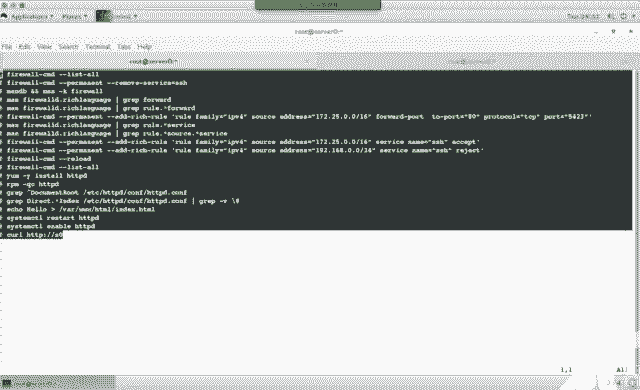

#### 1. 删除默认SSH服务
首先，移除默认的SSH服务规则。
```bash
firewall-cmd --permanent --remove-service=ssh
```

#### 2. 添加自定义规则
使用富规则（rich rule）来精确控制访问。需要先更新帮助数据库。
```bash
mandb
man -k 'rich language'
```
然后，添加允许和拒绝特定网段访问SSH的规则。
```bash
# 允许特定网段访问SSH
firewall-cmd --permanent --add-rich-rule='rule family="ipv4" source address="172.25.0.0/24" service name="ssh" accept'

# 拒绝特定网段访问SSH
firewall-cmd --permanent --add-rich-rule='rule family="ipv4" source address="172.25.1.0/24" service name="ssh" reject'
```

#### 3. 配置端口转发
配置将外部端口5423的流量转发到本地的80端口。
```bash
firewall-cmd --permanent --add-rich-rule='rule family="ipv4" source address="172.25.0.0/24" forward-port port="5423" protocol="tcp" to-port="80"'
```

#### 4. 使规则生效并验证
应用所有永久规则并重新加载防火墙。
```bash
firewall-cmd --reload
firewall-cmd --list-all
```

---

## 服务验证与SELinux管理

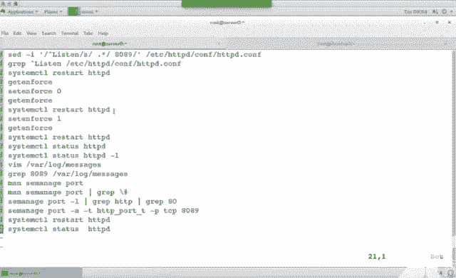

在配置防火墙后，我们需要验证服务是否按预期工作，并处理可能出现的SELinux相关问题。

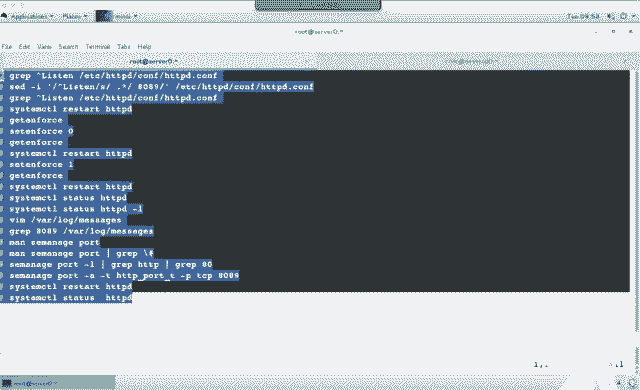

### 1. 安装并配置Web服务
安装Apache HTTP服务器，并修改其默认端口。
```bash
yum install -y httpd
sed -i 's/^Listen .*/Listen 8089/' /etc/httpd/conf/httpd.conf
```

### 2. 处理SELinux端口限制
修改服务端口后，可能会因SELinux策略而无法启动。首先检查SELinux状态。
```bash
getenforce
```
如果状态为`Enforcing`，可以临时设置为`Permissive`以测试。
```bash
setenforce 0
```
要永久允许新端口，需将端口添加到SELinux策略中。
```bash
# 查看HTTP相关端口类型
semanage port -l | grep http
# 添加新端口到http_port_t类型
semanage port -a -t http_port_t -p tcp 8089
```

### 3. 启动服务并验证
启动Apache服务，并设置为开机自启。
```bash
systemctl start httpd
systemctl enable httpd
```
在本地测试Web服务。
```bash
curl http://localhost:8089
```

---

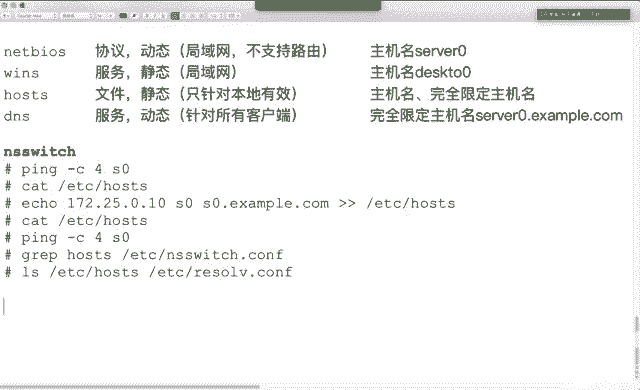

## DNS服务原理与配置

上一节我们配置了网络服务，本节中我们来看看域名系统（DNS）的工作原理及其配置方法。

### DNS概述
DNS的主要作用是将域名解析为IP地址（正向解析），或将IP地址解析为域名（反向解析）。它是一个分布式、层次化的系统。

### 配置主DNS服务器
以下是在Red Hat系统上使用BIND软件配置主DNS服务器的步骤。

#### 1. 安装BIND软件包
```bash
yum install -y bind
```

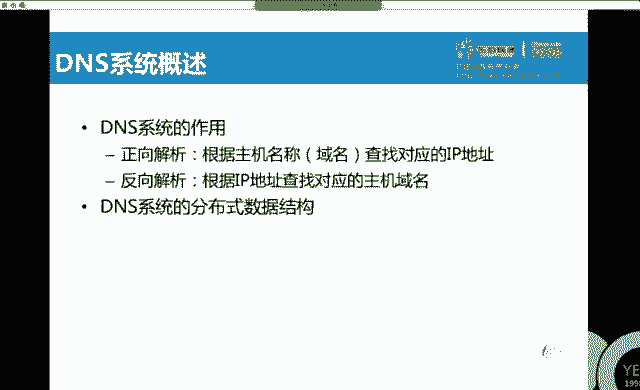

#### 2. 修改主配置文件
编辑`/etc/named.conf`，允许监听所有接口并设置查询权限。
```bash
# 注释掉只监听127.0.0.1的行
// listen-on port 53 { 127.0.0.1; };
# 允许所有客户端查询
allow-query { any; };
```

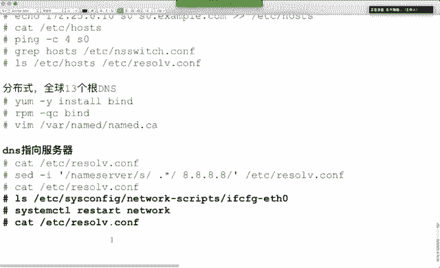

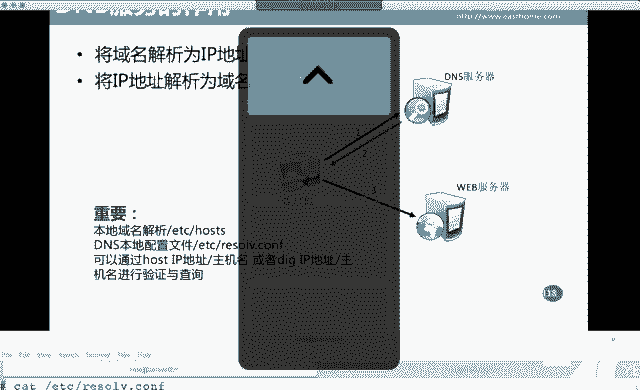

#### 3. 定义正向和反向区域
在`/etc/named.rfc1912.zones`文件中添加新的区域定义。
```bash
# 正向区域 example.com
zone "example.com" IN {
    type master;
    file "example.com.zone";
    allow-update { none; };
};

# 反向区域 172.25.0.0/24
zone "0.25.172.in-addr.arpa" IN {
    type master;
    file "172.25.0.zone";
    allow-update { none; };
};
```

#### 4. 创建区域文件并设置权限
从模板复制区域文件，并确保其属组为`named`。
```bash
cp -a /var/named/named.localhost /var/named/example.com.zone
cp -a /var/named/named.loopback /var/named/172.25.0.zone
chown root:named /var/named/example.com.zone /var/named/172.25.0.zone
```

#### 5. 编辑正向区域文件
编辑`/var/named/example.com.zone`，添加A记录和NS记录。
```
@       IN SOA  server0.example.com. root.example.com. (
                                        0       ; serial
                                        1D      ; refresh
                                        1H      ; retry
                                        1W      ; expire
                                        3H )    ; minimum
        IN NS   server0.example.com.
server0 IN A    172.25.0.11
desktop IN A    172.25.0.10
```

#### 6. 编辑反向区域文件
编辑`/var/named/172.25.0.zone`，添加PTR记录。
```
@       IN SOA  server0.example.com. root.example.com. (
                                        0       ; serial
                                        1D      ; refresh
                                        1H      ; retry
                                        1W      ; expire
                                        3H )    ; minimum
        IN NS   server0.example.com.
11      IN PTR  server0.example.com.
10      IN PTR  desktop.example.com.
```

#### 7. 启动DNS服务并配置防火墙
启动BIND服务，并添加防火墙规则允许DNS流量。
```bash
systemctl start named
systemctl enable named
firewall-cmd --permanent --add-service=dns
firewall-cmd --reload
```

---

## DNS客户端测试

配置好DNS服务器后，需要在客户端进行测试。以下是几种常用的DNS测试命令。

### 1. 修改客户端DNS指向
在客户端网络配置中，将DNS服务器指向新配置的DNS服务器IP（例如172.25.0.11）。

### 2. 使用`host`命令测试
`host`命令可用于正向和反向解析。
```bash
# 正向解析
host server0.example.com 172.25.0.11
# 反向解析
host 172.25.0.10 172.25.0.11
```

### 3. 使用`nslookup`命令测试
`nslookup`是另一个常用的DNS查询工具。
```bash
nslookup desktop.example.com 172.25.0.11
nslookup 172.25.0.10 172.25.0.11
```

### 4. 使用`dig`命令测试
`dig`命令提供更详细的DNS查询信息。
```bash
# 正向解析
dig @172.25.0.11 server0.example.com
# 反向解析（需使用-x选项）
dig -x 172.25.0.10 @172.25.0.11
```

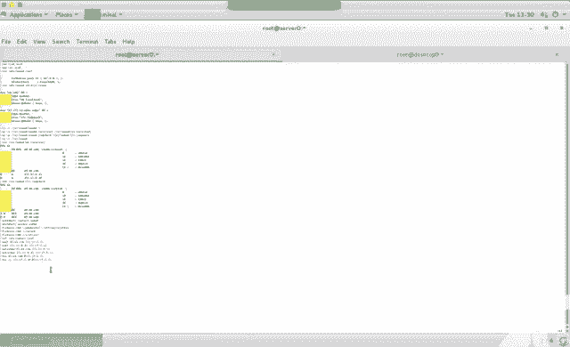

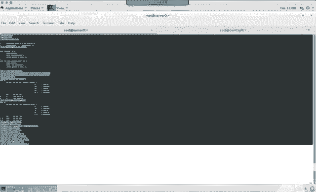

---

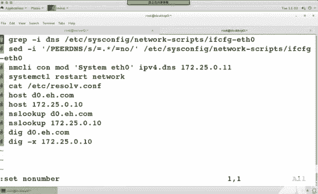

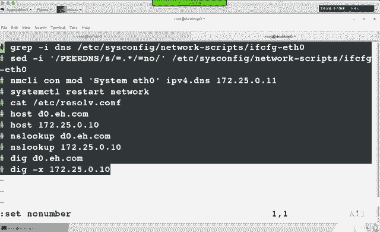

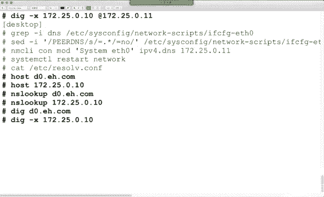

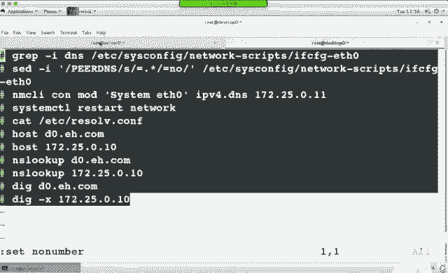

## 总结

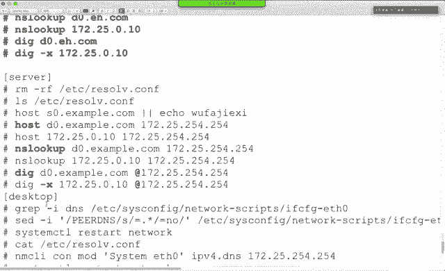

本节课中我们一起学习了以下核心内容：
1.  使用`firewall-cmd`命令配置复杂的防火墙规则，包括服务管理、富规则和端口转发。
2.  管理`SELinux`策略，特别是处理自定义服务端口的问题。
3.  理解了DNS服务的基本原理，包括正向解析、反向解析以及分布式层次结构。
4.  实践了配置一个主DNS服务器的完整流程，包括安装BIND、修改配置文件、创建区域文件以及设置权限。
5.  掌握了使用`host`、`nslookup`和`dig`命令测试DNS解析的方法。

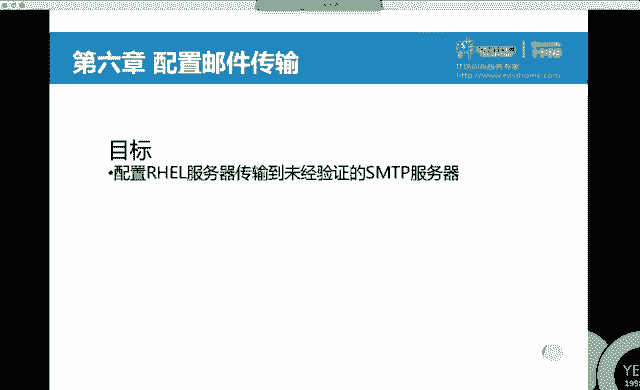

通过本课的学习，你应能够独立完成Linux系统中防火墙和DNS服务的基础配置与排错。