# 红帽Redhat RHCE7培训课程+RCHE7实战参考教程+红帽8.0教材电子版+模拟环境及辅导 - P18：4 - 16688888 - BV1zu41197p6

O。那下面呢我们来看一下第六章。油件。油价。首先来说一下油片的作用。我们现在在公司里面最常用的沟通方式有几种？邮件。微嗯谢谢。沟通方式。在办公的时候啊，沟通用的最多的是什么呀？有件。

沟通用的最多的就是油价。然后刚刚有同学也说了，QQ微信之类的是吧？那还有什么呀？😡，话电话。沟通的时候啊，办公环境中使用最多的就是邮件和电话。QQ和微信呢也用啊也用。但是这些沟通方式你会发现个问题。

你电话是不是说了就那么回事了，有记录吗？没有。你QQ和微信的话，确实有记录不好查吧。有的说好查呀。QQ微信上都有搜索功能。然后呢，我手机上装了一个清除垃圾的软件，一不小心把记录给删了。也没了吧。

但邮件的话，你会发现，如果你在一个公司没有离职之前，你从刚进公司一直到离职之前，你书的邮件是不是都会有一份啊，为什么呢？为什么我们不把以前的段删了，是不是可以非常方便去检索呀？就有记录吧，有据可查。

用邮件的目的，说白了就是为了有据可查。要不在公司里面说啊有个什么什么事儿，当时我们是这么说的，然后你是这么说的，到底谁说的是对的呀，我也不知道开邮件吧，里面写的这有句可查。😊，喂喂。我们继续。

那么既然这么多种沟通方式。邮件使用是频率最高的。那么在互联网上啊，我们使用的一个服务叫做电流件服务。电子件他跟我们平时啊用的快递一样一个意思啊一个意思。邮局快递功能相同。

V的区别它传递的是电子文件然后电子文件这个区别。O可。在CL红帽企业版服务器当中，我们也有SMTP。邮件服务器。那么常见的邮件服务器有几种呢？常见流件服习。在IHEL7当中。我们用的叫po face。

2D17的时候。吸之前呢。7之前我们用的叫s。就7之前。う。在一些公司当中。中石大楼。公司里面用的比较多的。有个叫做多米诺。多米诺行了吧。Yeah。多米诺是服务器端，nose是客户端。

这个软件呢是IBM公司的产品。IBM公司有一个下属公司叫los联花公司。都没单到死。微软。那微软呢有一个叫做exchange的服务器。Yeah。这是微软这个 change。

这些都叫有件服务器啊都叫有件服务器。那客户端呢？油其车端我用的比较多的，是不outlook呀？缩写叫OE。Out look。outlook express，它有随系统自带的，它有随office自带的。

用我发个说面吗？用过。通过IE能收还邮件吗？也行是吧。也行，比如说你现在有好多邮件，是不是都可以用浏览器来收法呀？这邮件客户端。O的。😊，何有得来。在整个邮件系统当中，我们的角色有两种。

一种叫MUA叫邮件用户代理。另外一种叫MTA叫邮件传输代理啊，邮件传输代理MUA是啥呢？刚刚呢我们是不是讲了一下服务器和客户端呢？佛西和科本。这个东西我们管它叫MUA。

你这些软件uplookfoxmail都叫做MUA叫邮件传输，邮件用户代理。那我们是不是先用autolog这样的软件先写邮个件啊，一点发送，它就连到服务型发出去了吧。默认在本地MTA呢指的就是你的服务器。

他的这个服系。由局。邮局就是MTA。看几个协议。SMTP和POPMM。三个协议SMPP这个协议他专门来负责发邮件。嗯。SMTP专门负责发邮件。他是专门负责发的。Yeah。POP3。按麦。4。

他们专门负责是收邮件。一个负责发，一个负责收。Yeah。那po fix它属于fi件的服务，还是售件的服务啊？Yeah。他属于fa点的服务。发一下收员的服务呢，我们有一个叫做。都。唉，这个词见了吧。

和芙巧克力。哦。douveco啊，我们有个包啊，有个服务叫dveco。这个包专门负责收邮件。但会发现在企业版七当中，发和所有家的服务不一样吧。俩服。7之前呢发个来的福务叫三的没有。收到服务叫什么？

Yeah。叫。猛然间忘了。POP嗯QP3。收一下这服务。这7之前的版本呢。用的不是套co。那我们在公司里面用的比较多的，你像这个多米诺呀、exchange。这个是fi件服务还是收有件服务啊？他都有。嗯。

它又是发又是收，你让一个chan呢？他又是发又是收。就一个软件里面包含了发邮件和收一件的务。能看出区别吧，商业的软件啊，一个软件里面都集成了。但是对于第三方开源的软件，是不是一个软件就是一个功能的？

在linkux词当中有大量的工具，你会发现每个命令就是一个功能吧。大来的东西。Yeah。那么在企业版7的考试当中，如果考到有券服务，这两个服务都需要你配吗？不需要你配，要求你配谁呀？配他会配他就行。

为什么呢？因为在培训环境中，考试环境中，这个服务他都帮你配完了。直接用就行啊直接用就行。Yeah。邮件客户端。soft。Yeah。あ。ns也属于客户端啊。方思没有是哪公司的？O面了。最ち？

小弟差不点小QQ是吧？QQ不是公司名哈，腾信是公司名。修图的软件没。Okay。Yeah。收个台。我们看下面这个图。当你发邮件的时候，你要用到outlookfox邮件软件。通过SMPP协议。

把邮件发送到邮局服务器上。如果你用是新浪邮箱呢？你的邮件是不是就发到新浪邮箱？你的邮件当到达新浪邮件服务器的时候，他一看哎，这个是发给谷歌的邮件，你是要发给谷歌的。通过你的新浪的账号发给谷歌。

他要把这个邮件啊通过你的域名查找查找到谷歌的邮件服务器上，系果依然是发呀。SMTP发到这儿了。谷歌的邮件复习一看哎，是我的邮件，是不是收到了？客户端。客户端使用foxmail notes这样的软件。

去服务系统通过POP3或者MM4这两个服务来下载相当邮件，接收相当邮件，这是发和收的过程。那现在我有个问题。平时工作中你用的QT3多还是MM4多？你们平时工作中用的是哪个？Yeah。QP3是吧。

嗯我用的是MF4。为啥呀？POP3，你们为什么要选择用POP3？这两个都可以输入文件，你选择了POP3肯定是有原因是吧？为什么？这两个协议都支持，都可以下载邮件。那为什么你们用POP3呢？

因为它少了字母嘛。那也不用敲啊。为什么选择POP3？用POP3的话，我是不是可以在服务器上保留一份备份，然后客户端下载一份备份。可以吧。他这两边是同步的吗？我说的同步的概念是说。

当我在客户端删除那个邮件，我服习端那个邮件删除了吗？没有我客户端阅读了一个邮件，它标记这个邮件已读服务器端那个邮件会标记为已读吗？不会吧，它是完全copy的过程。那为什么我们建议用I麦？

在现在的邮件当中，是不是有很多垃圾文件？你在这边刚删除了100方垃圾文件。然后呢，笔记本放公司了，回家的时候是不是可以依然通过相应的软件下载邮件啊，你又看到这100封垃圾文件了，啥感觉？接着删啊。

人生就是天天吃饭是吧？天天删辣椒馅，那怎么办呢？建议各位同学用MI。安排他支持同步。他支持同步。什么叫同步啊？你这边看那个邮件，服务器上那个邮件会显示已标记已读。你这边删了个垃圾店。

服务器端那个垃圾店会被删除，它同步的。有同学说老师同步不好，万一我一不小心把某个重要的件给删了。那只能说那个文件不重要。再一个默认删除是删到回收站是吧？有垃圾箱你也别紧张啊你也别紧张。

所以说实际工作中啊，建议各位同学用Iap啊建议。当然你不用POP啊也无所谓。和他们的区别。在这块当中呢，我们会又会发现。窍没有。Q没有是什么呢？它也是一个邮件服务器。啊，也是个源服器。

默认在我们系统发现版本中存在吗？不存在吧，你得额外去下载，额外去下载安装配置。啊，3面面的特点什么呀？Yeah。最古老。什么叫最古老啊？一直到企业版七之前的版本。

到企版66之前默认用的都是sammail。到前版6的时候出现了post fix，但是默认使用的还是smail。就六的时候啊，他俩默认都有。你安装一个企业板6。红包切满6，它俩同时存在。

只不过默认用的依然是3Wm到7的时候，3m就没有了，默认就posts fix。我们现在企业版7有俩防火墙，IP table斯和fire包D是吧？那到时后IP table是不是渐渐消失啊一个概念。

Q没有呢它的特性啊。方便。方便。实际上最方便的是系统自带的吧，拿过来就用穷的下载了不方便。Yeah。那为什么到企业版期的时候采用了posts fix主要原因。模块法设计。效率高稳定。

安全性能方面优秀安全性能方面优秀。主要原因呢是因为系统不败啊，免费开源。OK那大家看到这个字符了吧。our course，他专门负责收有价，post fix专门负责fi价。

auto look呢是专门做客户端，我们可以把邮件发到服务器上。然后呢，可以通过这个软件doc来搜一下啊，证明过程。换句话说，实际工作当中啊，如果你想搭建一个自己的游戏服务器。你需要装两个服务。

posts fix和do cost把它俩都配置完之后呢。就可以变成你们公司内部的邮件服务器了。把它配接下，能发能收。pos fix有两个配置文件。第一个配置文件不需要你改。我们之前提到过。

它是模块化设计。金之所以叫模块化，是因为在master的配置文件中，你可以来设置哪个模块功能启用，哪个不启用。我们会发现它的配置文件很特别是吧？CF。CF这个名熟吧。啊，写下S。

是confire的缩写是吧？CONFCFCG啊，是不是把后面那个原因什么都省略了，都是C了。那我们在下面看到这么几个词儿。I like interface它代表说你这个服务监听在哪一个接口。

lo bag是不是回还接口啊？local house是本机呀，本机。如果你写上look back only的话，就只能自己回款接口使用。My orange。Orangeine这个词啊，它分成中文叫什么？

血源来源。血原来源。ち。呃。问大家一个问题啊。生那个孩子为什么非要跟父母姓呢？Yeah。想过这问题没？非常直观的，我们能知道他的来源，谁家的孩子。能理解吧？这性的作用实上不跟父母姓行不行？

你高兴让他跟着爱心拘罗兴也行。只不过写的黑点劲。一高考的时候，一个小时，唉，写个姓名，考试完事了。名别写太长，别太啥。OK那么orange呢它代表是来源。这个在邮件当中代表是邮件欺骗。邮件息骗。

明明我的来源是从这台机器发出去的。那么如果你把来源给修改了，别人一收到这个邮件会发现哎，它是从另外一台机器发过去。这个专门图欺骗的时候来使用修改来源。这个时我们在上午啊讲到防火墙的时候，有点类似于那个。

美装啊美妆的概念。Relay耗。relay是什么意思呀？转化。转发。那如果你想把这个邮件都转发到哪台服务器上，你可以在relay house后面写上转发到哪转发到哪。My destination。

dationation那个词儿看着很眼熟。嗯我们在讲防火墙的时候，是不是讲了个杠D呀？嗯目标啊，我们在做方火墙实验的时候，还做了一个端合转发，是不是也有s destination？它代表小目标。

你的目标它代表的含义是说你的邮件能发到哪？这个是都本机呀。能发到本机。如果你设定了这个位置为空，你的邮件输到哪儿发不到啊？那，好不好，发不出去。叫目标啊目标。慢那 world。mwork翻译中文叫网络。

你的网络但家会发现下面这两个网络看着很眼熟啊。1270。1冒号冒号一这2个IP在哪见过？是不是IP4APV6回还接口的APP是？有没友说明明是1270。0。1嘛？你1270。8呀，1270。9。

他和1270。1是一个意思，都代表自己。能理解吧？都代表，所以说写了个1270。0。0。那local transport什么意思？我们在之前讲们讲过一个叫做mail命令。

MNL我在server上用root给student，它俩之间能不能互换邮件？可以吧，那是因为存在local transport。如果你将locco穿字炮的这个值做了修改，这两个人速发件能收到了吗？

收不到了，他代表说本地不能互相来发邮件了。你们都在搜er上不能付卡价了，这个叫local transport。O。那么在这个里面呢。这个是你的配置文件是吧？

我们提到一个命令叫post configurefi。为什么要postfi呢？是因为你这个服务叫什么名？Post fix。它是post fix的配置文件，那么它的功能是查看生效的值。

配置文件呢是永久生效的值。一个是永久生效时，一个是已经生效的时。能看到区别吧。嗯。呃，对邮件服务而言呢，考的就是这123456。这个六个值啊这个六个值。我们先分别把6值来看一下它们代表的含义。Yeah。

在看之前呢。我先确认服务启没启动。启动了吗？Enable。activerunning启动了。然后我们来看它的配置文件。几个。看是有2个CF。有了CF。master这个呢是它的模块配置文件，我们瞅一眼。

不需要你修改啊，就看一眼就得。大家看一下。这是不是好几列呀？服务类型。是否私有，是否更改跟是否启用最大的进程命令。好几力这些呢都代表着它的模块启用了哪个模块，没启用哪个模块。模啊模块的知识。

在这个模块当中，大家看有没有个51条。人lay人lay是不转发呀，支持转发模块。那我们主要看的文件呢是master。全妹。妹妹这个词儿发译中文是不是可以领成菜单啊？拜8。大看这个里面。

是不是有什么等于什么？看到没？是不是都挺好写的？井号都出事了，这个是0久生效的配文液。那我们来看一下postst confi已经生效的配种文件。嗯，你都有吧。已经生效的配置文件有多少行呢？Yeah。

816号。多吧。816号当中啊，只要求各位同学记这么几条。第一个。I耐。Interface。我们先来看一下他们默认的值。iad那个face默认值是不是叫local浩斯特？乐和浩斯特是谁？自己。

那我还有一些其他的值。加格大一。管道这个在大E里面呢，管道代表货的意思。或者吧。My destination。That's take music。外带那身好几个是吧？我是不是想看麦dation开头的呀？

所以咋办呢？给他咬。给他个运营是吧，给他个牛角。这是my destination默认的值。我继续。Mnet works。对人一堆是吧，我是不是想看mynet work开头的行啊。接着一角。

你会发现mynet4有两行，一个是network4，一个是style吧。待要翻译成中文，什么意思啊？嗯风格样式。那我们想要的呀，是不是？带空格的呀。あ。这是第三个，你要得道使你的网络。

它代表说你的邮件只能在哪个网络上使。你得有点服务气，只能在哪个网络上使用。Yeah。得类。奥斯特。那我们是不是想看这个开头的行啊？接着一角吧。明天好宿岁。他代表示你的邮件能转发到哪？默认等于空。

是不是哪儿转不去呀，不让转发。但是你默认可以发出去，发到这儿。默认不让重发。然后呢，我们是不是还有一个叫。啊，雪缘是吧？My orange。卖耳金呢，你会发现有好几个。那我也弄一个。密接着一搅。

My orangeD。你这要从哪来呀？默认是不是说从你这台机器来呀？集机量到了是0一个变量。再然后。啊有叫做 local。Fas。Part。local transport默认授索本地。你接台机器。

里面的用户可以互发邮件啊。刚刚我们看到这些呢是默认的值。默容区。你会发现在天上，这不还有个loc top。ok换句话说，我依然要谁呀？以他开头的好话。这个是第一个要求各位同学知道的内容。

他们代表什么含义，默认值是多少？考试的时候呢，考的就是这1234566个选项。考试的时候考虑这六个选项。他是怎么考的呢？咱们瞅一眼。配是本地的邮件服务器。在420和在4up0上都配置。考试的时候啊。

这个实验你得做两遍。培训环境中，这个实验只能在server上做。培训环境中，这段时间只能够servserv望做。为什么？考试环境啊，教室机有专门一台机器。

我们可以所有人把servword desk套泡都配成转发邮件服务器，你的邮件都转发到教税机上。在考试的时候。但是在培训环境中，你的邮件都转发到你的代词套路上。server上的邮件都转到desstop上。

换句话说，你ds top就做不了这个实验，只能用server来做。这区别吧。另外一个，我们在做这个实验的时候呢，你可以用没用定令来验证。没有MAIL没有明来的研证。但是在考试的环境当中啊。

你们转发到的那台机器，你没有账号没密码，没有到案去伪验证。但是在题中会明确的告诉你，他会给你个。HTDP的一个网址。通过火狐浏览器，你可以去看到邮件服务器转发到的另外一台语言服务器上，以相应的邮价。

如果邮件的大小非零，代表实验成功了。鼠标点能点。行能见。这是培训环境和考试环境有点区别。换句话说，在培训环境中，如果你要过这个时间的话，你需要用到两台机器。为什么呢？他提要求。

这个系统不能接收外部发送来的物件。不能接受外部话筒来留下，只能自己用吧。本地系统上发的任何邮件都会自动路由到SMPP0。转发了，这道题考的是relay house。

这个系统上发布的文件显示来自于destop0。第二题考了什么？My origin。这两个选项看到了吧？那么对于第二个题。它除了自动路由道之外，我们还有一个叫做local transport。老头说是好。

本系统上发送任何文件，本系统root和student是不是也能互款邮件啊？也能互发一下。那么你把logo串的套子改完之后，那本地系统也不能胡跑到这了，也会去做转发。也会修了吧。那这道题考的什么呀？

考的是iight interface。好的是my destination啊，是my that network。6个选项。没有选项对应的这个车的。那么我们在这个里面呢遇到了1个DS名。

SMTV0desstop0，这都是谁？你用house来瞅一下，他们都是dstop的。都是0。10。换句话说，这个实验它实现的功能啊，就是说serv上发送的任何文件都会转发到des套。然后呢。

你去再次套s studentdent的身份能收到这些文件。72万。这个实验实验的结果。那么在实际工作当中。什么情况下可能会做直转阿有边服务器？在公司里面呢，有可能有这样的情况啊，你们是一个大公司。

然后呢，在中国地区啊，有个总公司。所有分公司的邮件服务器啊都做转发邮件服务器，都转到总公司。多转那么多。总公司要实习。然后最后总共是一点付7这么0万。可以这么来做，这个只转发有点熟悉。

那下面呢为了讲解啊，我把这个实验给大家演示一下。在演示之前呢。我们先来看一个小实验。回忆一下。在我的机器上有两个人。root是16人。我可不可以没有迷令？发一个邮件。给。死丢人的呀。可以了。然后呢。

你切到死6的的身份。能不能看到这个影箱？本地户是不是互相能发邮件？你回说。看到一件内容了吧？Q退出。换句话说，默认情况下，本地订户是不是能互发邮件？Yeah。那我们这个实验。一会儿做完了之后呢。

你会发现。你给stuil发邮件啊，他也会发到，但是top不了。你给本地的student发邮件也会发到白里。是不是都转发呀都转发。那么这个时间怎么来做呢？ok hell佬。Yeah。在上档课呀。

我们看到了这么几个值，这是默认值吧，默认值。呃，如果是看当前这道题。我们首先来看第一道题，第一道道题做第一道题，你的系统不能接受外部发来的文件。换句话说，你这个邮件服务器是只能自己用的。

那既然要只能自己用的话，你需要改哪些配置？Iad interface face要改。my destination ， my network work，这三个呢都是第一道题的设置。看那。大家看一下。

默认116行有没有啊？如果你只是想让他自己用的话，我们要把这个位置。改成look back。公利。包了是啥意思？只能自己用吧只能自己用。然后my network。Mnet。

255到2265到267一堆吧。我们改这行，删除井号是不是生效啊，你的IP1270。0。0杠8OK前面是不是它有个IPV6的地址啊？IPV6地址们好。妈蚂衣。第二吧。我慢吃货了。

还有呢my destination。165。要求快递。清商吧，你这邮件是不是只能自己用啊，发不出去啊，发不出去。这三个呢是第一道题。第一道题。第二道题。这些邮件都会转发到路由到SMTP0。

SMTV0是谁呀？我们瞅一眼。可以。😊，外天没反应是吧？我们之前说RM跟ETC有做个confi了。听一下吧，之前的实验。那你为了把那个文件弄回来，你要干嘛？把相应的服务重启就可以了。那就歇了吧。

SMTP0是谁？这不是但词靠了呀？ok。回头头来继续编移。那你既然是要做。自动路由道，那这个考的是relay。我在浩斯特。Yeah。314到318。好几行吧，咱们会发现有这么多行当中。

大部分是不是都在放括号啊？方括号代表的含义是说不走DNS的MX记录。MX系入当中啊，我们可以来设定邮件服务器的优先级。不去查找它的优先级啊，我直接使用这台服务器。所以说呢你随便找一行复置。删除井号生效。

我的主机名叫什么呢？是不是叫这个名啊？考试的时候啊，能复制一些贴就比较熟悉。方块开头方块结尾巴。一对儿。既然你说是只转发的话，本地用户是不是也不能互相发邮件啊，那么需要加local transport。

大家看有locgo transport词吗？嗯。Yeah。有这个词儿，但是没有什么等于什么吧，它都是一些说明。所以说你随便复制一个。Yeah。先开一行。随便复制一个。明天。他的什么呢？

只要不是local啊，只要不是local，你的主定名就可以。我们这个里面写个air。再看这个词儿。高栏显示关键词是吧？随外写上内容。原来的纸是不是叫local。

然后到 my house name当你改完了之后，本地的主机不能复盘一件了。这是第二道题。第三道题是不是做伪装啊？Myine already。看到9899了吗？伪装。我们会发现生效的值啊，我知道是什么。

那么我这个里面是不是都是注释的哈？为了让他生效啊。你哋。给他写。要伪装成谁呢？你让他擦吧。

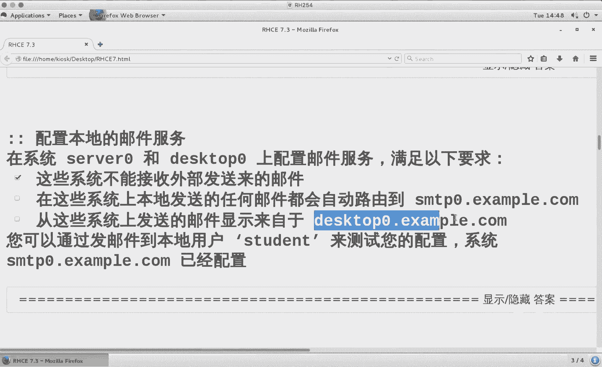

不知。

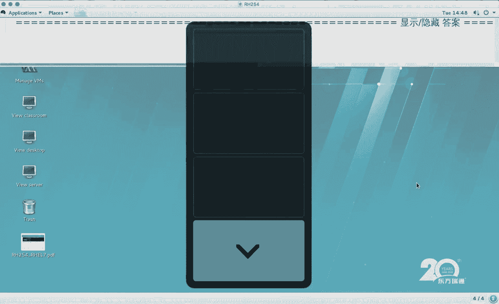

粘贴。改了6处。电流柱改完了之后，配置文件改完之后必须干嘛呀？恭启。开机自动启动吧。确认一下。它是不是开机自动启动的？既然是只能自己用的话，用配防火墙吗？你开防火墙的目的是为让别人用，对吧？

所以说这个时间不用做防火墙啊，不用做防火墙。在之后。我们再次来看一下生肖的值。Yeah。Yeah。あ。あ。6百 only。变过来了吧。爱会是刚才写的呀。destination是不是都删了呀？

mynet works呀，实际上你改不改都是这个值。能看到吧？改不改都是这个。那为什么要是大家修改呢？那大家想。考官在给你判分的时候，他是不是要用gr命令去看看配成件改不改这个值啊。

永久生效还是利益生效，所以说配置文件建议修改。my orange美妆。SMTP0。带封冠号是吧？12345。OK123456不打了。下面我们说到测试啊。没有。あ。Ile。あ。大。丢的题。

我给本地的student发邮件，你会发现这个邮件也转到戴斯top0上。其2。第二。我哋。但是个top0上。16的的发射件。可以不管哪些法件都转到destop0。然后呢去dstop零上去做测试。

10点晚上。Yeah。那我们现在去做测试啊，测不到效果，原因是什么呢？呃，环境准备工作当中啊，我们有几个事儿没干，哪个事儿？我们去克拉斯 room。每次去卡拉斯room目都是为了看什么呀？Yeah。

是不看一个脚本啊。在class录上有个小本儿。我们这个实验叫SMTP no client。Yeah。Yeah。SMTP。Yeah。诺克拉嗯。有这么个脚本。我们先在class room。

看一下有这么个命令。感兴趣同学啊可以看一下命用的内容。这个脚本中都干了什么？看一下赛卡。くて？Okay。Yeah。Yeah。服务器的在 time的时候，它设置了一个mat。客户端set up的时候。

它设置了一个me server，没 server。那么set mark是干什么来的？瞅一眼。あ。他安装了一个包，骂的包。mt包啊翻译成中文。它的功能相当于uplook一个邮件客户端，跟没有命令相同。

唯一的区别是什么呢？没有命令不能发附件，ma命令能发附件，它的区别。创建student的邮件主目录更改所属。下载相应的证书文件，更改所属更改权限。这个是ma他干的事儿。

那服务器上在dess tower上，它做这个set up和命 server干了什么事？大家看这个包眼不眼熟啊。德福是不收到点了。当你把serv零上的邮件发到dstop0上。

ds top0是不是有接收功能啊，它需要去安装一个收邮件的功能。安装个松一点的过。然后呢。下面这一类内容啊都是配收有员服务的。收一件服务收一件服务配完了之后呢。他又生成了do套的证书。包法证书。

证书的损失。到时候。利用证书生成公钥私样。open SSL身份证证书请求文件啊，生份证公商需要改权限。然后呢，启动docut设置do count开机自动启动。并且在desstop上。大家看。在。

do但是 top这台机器上啊，它是不是也去做了一些post fix的设置啊？如果你不修改pos fix配置文件，我们可以通过pos confi杠E命令来修改也行。改完了之后呢，配置文件改完之后要做什么？

😊，重复重启吧。大家会发现他的发有点浮，也去做了一些证书的操作。然后呢，邮件服务启动，开机自动启动。如果想让别人使用它邮件服务的话，它就要开启相应的端口的。现了多好。为了能下载相应的证书文件。

又装了一个阿帕奇服。把死6的用户呢加入到了没有组。OK以。😊，这是脚本，它大概的内容。简单来说，这个脚本它就是把你的这台机器。帮你装了个包。除了装牢包之后呢。配了两个服务。

do code和post fix。考试的时候啊，你们局网当中教师机上会专门存在这么台机器都配置好的。那要求你配的是谁呀，就配serv就行。嗯，就配so号就可以。那么在so这端呢。

它实际上是不是就装了个mark包啊？MUTT包啊。LbMTE no plant。侦塔。就装一个m包，这个包不装，这个时间已能做成功。OK我再次来发送一下两个邮件，我给它起名叫T3T4。Yeah。

我发送完邮件之后，是不是要去做验证啊？考试的时候是按照题中的要求，用浏览器来验证两个文件有大小就可以。在培训环境中，我们可以搜到。Studdent。没有。有邮件吗？没有邮件是吧？

这个实验当中它跟什么有关？手机名。看到没？哎，这个是谁呀？我们上午是不是做了个主DNS啊？你想让这个实验成功，你还得把那个。D压是给改过去。电视怎么赶回去啊？Yeah。你们上午没开主DS是吧？

所以说你们就不用干那个事儿啊。我是不是应该把它给他干掉啊？删除怎么删？あ。用MC怎么删？你要用下的命令，是不是直接查找当D就删了，对吧？那用NMCI怎么删呢？NM我们是不是支持。添加支持删除，支持修改。

对吧？不支持。Yeah。然后呢，你是不是还要把这个PDS给改回来？干俩事吧。不对。一个是赛的。查找片儿。P2DS4。替换。把，等号后面的内容。切换成。Yeses。然后呢。H牢DNS。一页。删除吧。

关完了之后，是不是网卡要重启啊？分解了之后。就尽量正常了吧。手机名正常了，你再切到student。没有。现在没有是吧。回答夫妻端。我是不是又发邮件了？来到客户端。哎呀，怎么还没收着啊？

现在我们确认服务器端主机面没问题。搜20点W点com也没问题是吗？服务器端组件应面也没有问题。Example点com。那 example朋在看哎。确认证明问题的话，我把服务器端的服务重启一下。

Po fix。然后呢，我把客户端的服务也重启一下。20的这。艾德夫叫啥名？那我靠他吧。O下回再来做测试。Yeah。3456。Yeah。切换到客户端。没有。收到一件人没？收到了吧？刚刚收不到邮件原因呢。

是因为我上午做的主DS吧。酌情原变。换句话说，这个实间跟主机名有没有关。有关系吧，因为你在vi house也好，还是做。嗯，myor是不是都用到冷的地下4名嘛？啊，其是面试关。呃。

T5这个是不是我在服务器上用住的身份发给服务器本地的student的呀？但是你会发现呢这个位置他说从哪发过来的？From。从代4号0发过来的嘛。明明是从s零返过来的，OK吧，看第二回邮件。

第二证件件是不是也显示从在操发过来的？我刚刚在服务器上给他本地的student和D零的student，是不是都发了邮邮箱？结果邮件都转哪去了？但是套不了是吧？Yeah。这时在看懂了吗？嗯。

OK我把时间给大家整理一下。😊，Yeah。第一步。确认这个服务启动乐。呃。Yeah。我们做这组实验的时候呢，你首先去看一下classroom的这个叫脚本。脚本的话呀，你看完了之后最好是编辑一下。

看一下他的内容都干了什么。现在应该能看得懂他们到底干什么了。然后呢，serv和 desktoptop为了做实验，你需要去做一些准备操作。在serv和 desktop上。

我们要做一个lab set up的操作。这个命令的作用是什么呀？设置你的环境是吧？环境设置完了之后，是不是就可以配服了呀？太说了。你在佩肤之前呢，先干一个事儿。在搜尔本地。在搜尔本地。Yeah。

用root的身份给stil他发个邮件。他能收到吗？能不能收到？Yeah。Yeah。12本地。可以收到。没有命令可以查看吗？你们看到内容。查看N一回车就能看到内容。按Q退出。然后呢，填tD。这么注销啊。

各告管理员。在管理员的身份呢，你用poconfi。这条命力。お？这个呢是来查看当前生效的曲。当前生效的。你看一下升像值是什么，然后呢再来做下面几组实验。下面没有时间，我们都干了吗。首先。

查询服务是否启动启动了查配置文件。编辑配常文件。配置文件中都改了什么？我按照顺序给大家写啊。第一道题是不是说只能自己用啊？Great吧。I like interface。是我只能自己要。

还有一个叫你的网络和你的目标。你的网络是啥呢？My network。你的目标是不为空啊？My destination。这第一题吧。第二道题。是不是只转发服务器，提到转发的话，你能想到哪个词儿？你咧。

Pass他吧。都还还添加了一行叫什么？Local。S hot。第九行默认没有，是你填的吧，默认没有。然后呢，最后一道题是不是做伪装了？你当是啥？二瑞0嘛。567是第一题。八是八九是第二题。十是第三题。

三个复氧框对应的OK吧。挂完了之后。做完了之后，你是不是应该把服务重启一下啊？C他们 controll race大。重启一下。那么在整个题当中啊，它出现了一些别名。整个提议中出现了一些别缘。

你是不是可以在做实验之前先浩佛瞅一眼他是谁呀？能看到他的IP吧。cos他。戴top0点example点com。一和二它俩是不是在平海一系啊？0。101个IP吧。实验完成了之后呢。当你的服务重启了。

Yeah。当然你的服务重启了。确认它是开机自动启动，然后呢，你再来看当前形上的值。是不是已经被你改过来了？这回在。合适。没有发货价。这回再没有发邮件。那么在这个实验当中啊。

你们做的时候顺道瞅一眼自己的主机名是不是叫做420。

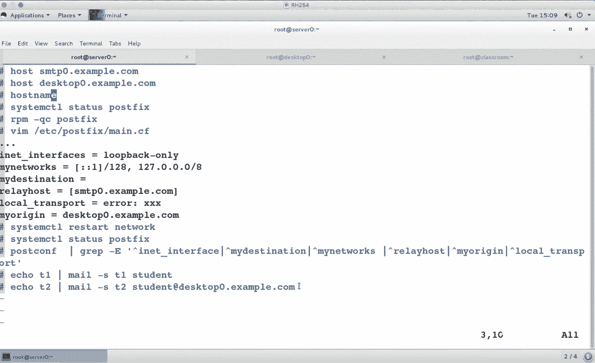

Yeah。Yeah。

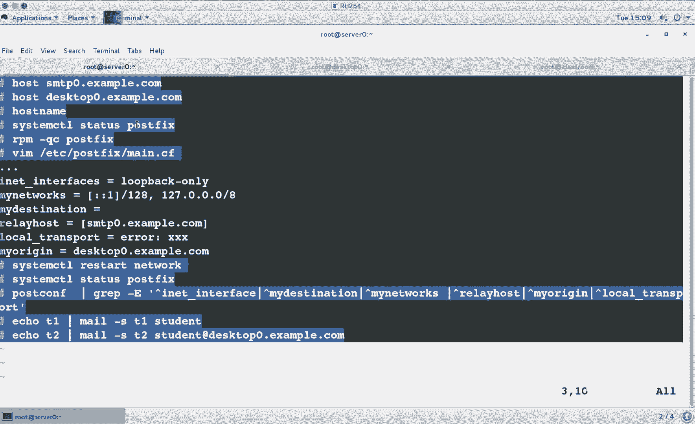

这是服务器端。客户吧。客户端我们都做了什么操作？客户端做的第三条第四条。这都是因为我之前的实验的。上一个实验。上一个时间我们是把DN斯给设成静态了呀？如果你DF设成静态的话呢，呃我先给改回去啊，改回去。

首先呢说把PDS就改回夜色了。改回夜色之后呢。把DSE也给删了。然后呢，network服务重启生效。确认实机苗。收到。对的。有没有命令开有下。你会发现收到两副有件现在完成。

我们之所以说第一步到第三步的原因，到第四步的原因是为之前呢。我们上个实验是是动过DNS。这个时间跟主机没有关系，所以说确认一下它主机名叫D0，然后呢确认的DS指向没有问题，OK吧。い。Yeah。

这个呢是因为我们做上车实验的时候啊。有个问题，所以说你要把它系统恢复一下。恢复一下。如果你不想看这端内容的话，我们支不支持RHTVM controllres serverreit desktop呀。

然后你再来做这个实验，是不是也OK呀？这要做实验O。这个内容是因为我们上一组实验的原因嘛，所以说你需要给他弄一下。上一组实验的原因。Yeah。这是恢复上古实验的操作啊。然后。这段内容是做验证的嗯原因啊。

行了，就过一下吧。Yeah。OK吧。最后强调一句哈，考试的时候这个实验你要在serv和 desktop做两遍。考试环境下。培训环境中。

因为我们dtop是做的接收服务器SMTPserv0呢做的是发送服务器，只转发有件服务器。所以说你只有一套环境，只能做一台机器了。考试的时候呢，两台机器都做都转发到教师机上啊，都转发到教师机上啊。

这它的区别。这是邮件服务嗯。7个。在邮件书当中啊，还只是别名al a在根据TC下个lesss文件，我们可以写别名。汤姆冒号root。那么当你给汤姆发邮件的时候呢，实际上就给root发邮件啊。

这别名文件作用文件是永久生效，怎么让它立即生效呢？用new alliances命令让它立即生效。这个在2C16的考试当中考过，在2C17的时候呢，不考了啊，了解就可以。Yeah。有叫别名。接刘哈。

Yeah。あ。Yeah。今天再来讲一组实验。远程存储。在下午的考试当中啊，最大的坑就是最涨的内容。最大的坑。最大的坑是啥呢？我先把坑长什么样给你们看一眼。

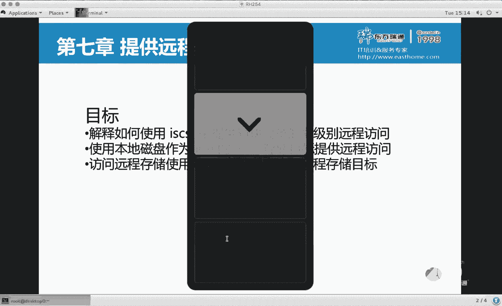

慢。嗯。M。慢慢。在mon的命令当中有一个选项。叫下划线n device。这个选项有下划线吗？有。net叫网络，dice叫设备。这个选项是写在FI table文件中。Ftable見手。考试的时候。

如果你不写它的话，会导致一个结果。你不写这个选项，或者是说FIQ当中这个选项写错了，会导致个结果。客户端那台机器起不来。下午考试总共两台机器，如果客户端那个机起不来呀，这个下午考试基本上过不了。

能听懂吧。换句话说，这个实验你要要不就做，要不就不做。如果是手机嘚做，我确实是写错了怎么办？咱们之前讲没讲过单用户挑密码。你大用户能不能改FQ文件？你再给改正确了，系统再正常启动就OK。

就这个坑啊要不就做要不就不做。你不做的话，可想下午20道题。70%、1415道题。做对十5道题是没有过呀。也就是说你有个三四道题，不会，一点不会都不做了，考试一样过。但是你别往坑里跳，你往坑里一跳。

50%过去了。能理解吧。这个是下午最大的坑，下划线那个 device我先把坑给你们强调一下，这个呢是mon的选项。既然是mount的选项，是不是查mountt的绑助啊？あ？这个选项是写在FI直播中。

那么这个选项的作用是啥呢？这个词儿翻译成中文，是不是叫网络设备呀？大家想网络存储，什么叫网络存储？网络存储和本地存储区别是啥？这结问。啊，通过网卡通过网络啊是吧？嗯，通过网卡通过网络连接，叫网络存储。

那计算机在启动的时候，我们之前讲过系统启动的顺序，是不是先加载ipad table，再加载网络，再下载服务啊？你在加载Itable的时候，网络还没启用呢，你能加载那个网络硬盘吗？叫载不过来。

这个选项的作用是告诉系统，你先别给我加载，等什么时候network服务网络服务启动了之后，你再给我加载FI table这一条。你可以把它列解成是延迟加载。延迟延迟。OK吧。下午这大坑啊。

我给你们强调了啊。强强调也白废，该掉坑里还掉坑里。为了不掉坑里怎么办呢？这个实验做个五遍，十遍就理解了啊，多做几遍哈。就跟你们强调哪些是重点的，哪些是坑，你就多做几遍。下回你做的时候，你就有个印象。哎。

这个位置有坑，我注意一点。就像走道的时候。走道的时候能看手机吗？好多人走到边看手机啊，我中午吃饭经常看学生，边看手机边走道。然后一般我发现有这样的学生都会跟他们聊天的。我说你可你上网去看段视频。

网上好多视频呢，都是看着手机坐电梯的。啊，看电梯门开了，然后人就过去了是吧？就上另外一个世界报道去了啊，能听懂吧？然后还有好多呢走扶梯的。你说走直梯挺危险，扶梯也危险。你想你走这个扶梯的时候啊。

那是台湾的一个某公司的董事长。走扶梯的时候看手机，然后就在那个扶梯上无限循环。最后终于停了，也到另外一个世界了。都听懂了，所以说。哪有坑啊，你注意一点啊，你注意一点，这也是个坑啊，这也是个坑。

一次考试费多少钱呢？2000块吧啊2000块2000块吃冰棍能吃多少啊，能吃感冒了是吧？再一个呀，咱钱不是大问题啊，大问题是啥？你去公司里面，大家都知道你今天考试去了，你考完了都问，哎，过没。

哈哈哈哎呀，这谁受得了。嗯，所以说呀有坑的地方也注意考试很容易通过哈。你想怎么考试，上午就20道题，下午20道题。😊，那出入也就1822道题的区别，对吧？2十道题左右哈。就那些题，每道题的标准。

15分钟之内不看答案能完成，任意一道题，考试肯定过。考试肯定过，当然了，有坑的位置注意一下啊。呃，为什么要多练呢？这段时间你做一遍能做成功。考试的时候不一定能做什么。因为考试的时候是好几道题写做。

你可能做着做就迷糊了。哎，这做到哪道题了？这个是什么文件系统啊，什么选项啊，做做可能就迷糊了。你要单独做到这己题的时候，你能注意啊，有坑一堆题的时候可能就忽略了啊，就忽略了。所以说你多做呀多做啊。

多练啊多练。win那个呢就是熟练功手啊，你只要练的次数足够了，你就会发现。这个实验越做越简单啊，一般一道题啊，5分钟左右啊，5分钟左右。你看我给你们讲啊，连讲带图了1分钟也一道题讲完了是吧？

要是不讲不等的话，也就5分钟一道题。对你们要求啊啊15分钟包括排错时间。要不然的话打不完呢？下午考试三个半点，22道题，2十道题，十八道题。到底是多少道题规定。到底多少题不一定啊，但不会超过22道。

类型题当中啊包含了所有的陶点。包含了所有卡点多列。

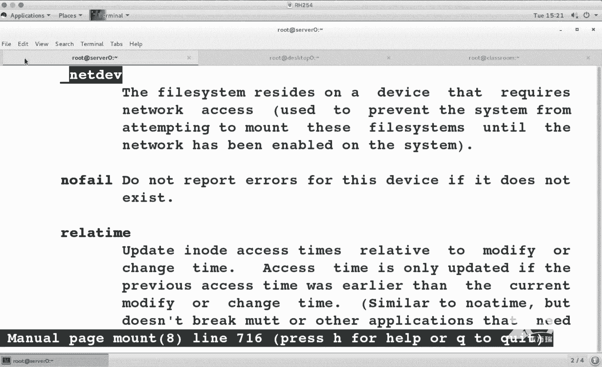

O。我们看完坑了之后呢，回过头来。看远程存储。S加4。首先呢来看一下直连式网络存储区域。直连是什么概念呢？不通过网卡直接连在你的电脑上。比如说通过我们的ID接口，通过主板上的set接口。

通过我们的readd卡。通过光纤线，只要没有网络的事儿，都叫做直连式。OK吧。那么什么叫ns呢？我们在之前讲没讲过，用没用过30和NF服务啊。他们最终共享的是不是都是文件夹？共享的文件夹。

那么这个就属于ns NAS共享的文件夹。那么下面又提到一个sSNSN。SN它使用了什么呀？它是不是也用到了网络？的网络，但是它共享的是设备。它共享的是一块硬盘，一个分区。能里有区别吧。举个很简单的例子。

我们在安装系统的时候，你可以把一个系统装在一个硬盘，装在一个分区上，你能装在一个文件夹上吗？你装在一个文件夹上启动不了，因为文件夹没有MBR。能理解吧？他们的区别。3、共享的是硬件。共享的是硬件。

NF呢共享的是文件夹，3共享的是设备、硬盘或分区。那我们当前呢使用的就是S。S加0。Yeah。主流的方案。不管是s也好还是纳s也好，它都用到了网络。换句话说，都得用交换。有的人说不用交换机。

用提线器行不行啊？呃。现在还有人用集线器吗？如果是一个小型的网络里，用集限器可以。能听懂吧？为什么呢？因为集线器和交换机的功作原理啊，它不太一样。极限器的功作原理是说这个数据包进来了之后。

他把这个数据包复制了N份，每个端口都发一份。😊，你愿意收不收跟我没关系，我说我发给你。😡，然后对方是看到是他大包，他才接受。换句话给我占贷款吧。交换机呢？交换机它的性能要比集电器要好。

因为它不是复制广播的过程啊，它是直些有点类似于令牌呀，直接传给谁。在麦克地址当中啊，交换机属于第二层，用到的麦克地址吧，他会看麦克地址表，这个数据包是发给谁的，直接从某个鼠出去啊，他没有复制的过程。

所以说我们都会用到交换啊switch。那么在这个switch当中，大家会发现FC。光纤交换。你太交换。如果你用以态交换的话呢，我们的交换机建议用千兆啊，千兆上，不建议白道太慢。就像我们用USBU盘似的。

为什么现在都用USB3。0？2。0用的少了呢。为啥呀？速度不一样是吧？就像你们要拷贝一个文件，3。02。0拷一个文件呢速度差老多了。Okay。mas和s的区别啊mas和s区别。

它们相同的特点都要用到网络相同特点区别呢就是一个共享文件夹，一个共享的是设备。那他们区别。SCCS咖RC它的中文名叫做小翔。internet小计算机系统接口啊，小计算机系统接口。那为什么出个呢？

对于公司而言，我们存储的解决方案呢，当然是最好是买个存储的是吧？但是存储太贵。存储太贵了。那如果你是用一些廉价的存储解决方案，然后呢用Sga把你这个硬件硬盘通过网络共享给某些机器来使用。

是不是能更便宜些呀？能省钱啊能省钱。

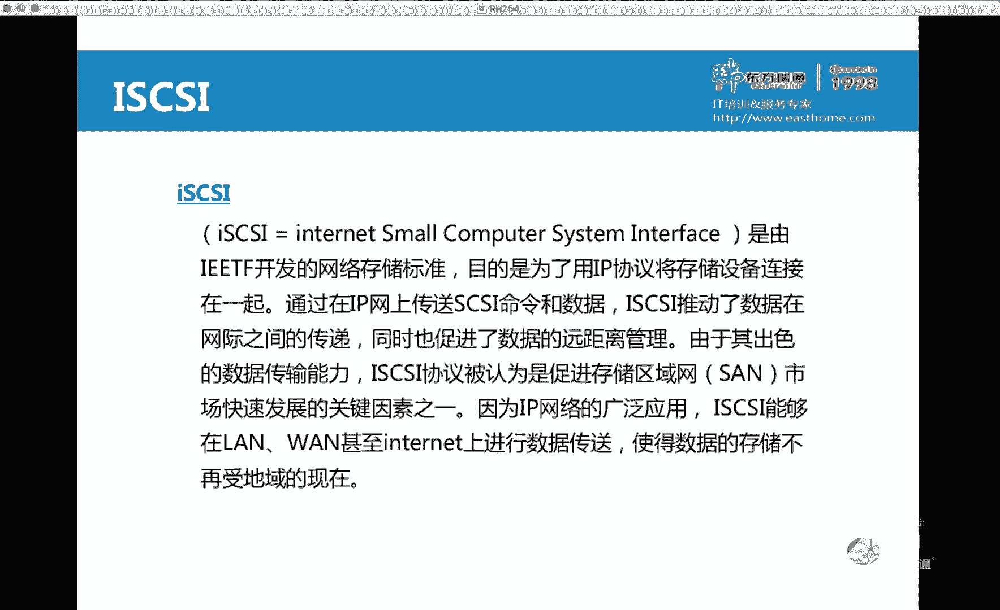

现在在互联网上啊有好多。存储解决方案。比如说。他到了。听过吧。小飞象。mo斯FS啊。GFS。他们的功能什么呀？我们之前在用LVM的时候，LVM是说一台机器，它里面一堆硬盘可以变成一个硬盘。

那这些技术呢是说把一堆机器上的硬盘可以逻辑上变成个大硬盘大存储，然后你再来区分给谁用。这他们的区别，一台和一堆的区别。那既然是你能弄出来一堆机器，换句话说。一堆PC啊跟一个存储服务器来比的话。

哪个价钱要便宜啊。当然也对PC便宜了是吧？就说你看谷歌也好啊，有好多做云的呀，做云的，他们都会用些这样的技术啊，原因呢就因为可以做廉价的存储。S加C呢就是一种廉价的存储解决方案。

我们说廉价不是说不要填啊。也很贵的。只不过跟存储来比也很便宜啊。廉价。脸加的脸咋写？Okay。嗯。廉价。猛然之间忘了这字儿怎么写。全球野花。就是为什么出现S，就因为存储太对了。如果存储不贵的话。

就不会有S加RC。

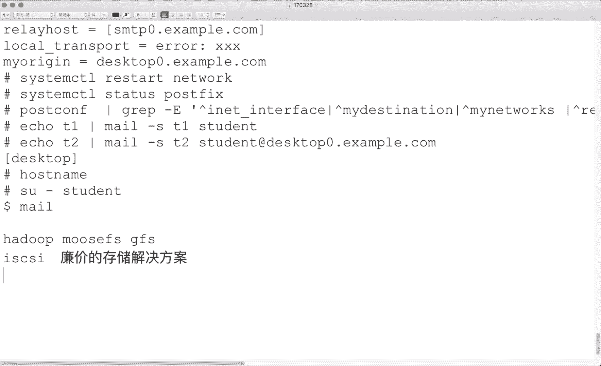

S加RC原理将我们的数据包啊再次封装。封装了1个Sci的命令和数据。然后呢，Sci头TCB头IP头啊，再次封装。那么在S杠C当中有这么一个词儿叫做LUN。

它叫做logicalical unit number。Logical unit number。我们在做上把NF共享的时候，一台机器可不可以共享多个文件夹？可以吧，你可以创建好几个文家共享。

那么同样你S scan既然共享的设备，你是不是可以共享多个设备呀？这些设备怎么来区分呢？LUN。按照我们共享的时候类似，只不过你在区分设备的时候，用LUN来进行区分多个设备。那么S加C命名的规则。

IQN点儿。年月点儿。翻转鱼面啊。冒号标记。冒号标记，这个是它的格式。这个格式呢能看懂啊。这个年月是什么概念呢？问大家一个问题，域名有没有效期？买你去买了个域苗啊，买多长时间花多少钱，育苗有效期。

那么这个时间呢代表就是域苗有效期，哪年哪月过期。如果不是你买的疫苗，这个时间你随便写一个。但是比较符合年月的格式。OK了。S杠C的架构。这个HDA是啥？为了卡是吧嗯嗯为了卡。😊，那么们可以把A堆存储。

然后呢通过readd卡变成一个大的存储，然后来使用吧。如果你用了SGci这样的结构，要用到网络，用到网卡吧，用到网卡不用readd卡了，它可以把你后端的存储通过网络，然后呢网卡连过来。

用网卡驱动TCIP协议Sga的驱动，然后呢可以把它设备挂过挂载过来。证明过去。对于SRC而言呢，这个东西怎么来理解？我们先给大家画一个思路图啊思路图。不画思路图的话，这个实验。有点悬啊。

有点有容易掉坑里。做这个实验的时候呢，你需要用了两台机器，一台叫做server。一台叫destopserv万做服务器端，desstop做客户端。服务器端那包呢叫他给。服务器吧那包。客户端的包呢叫做S8。

S2水。我为什么给大家写了个星啊？给他写了个行。你要么 list这个东西形是不是能看到啊，写行成原因。那他给到他的配置的时候呢。我们是通过一个命令来做配置，叫做ta line。

CR叫做common line interface叫做命令行接口，它的功能是专门来配置它给它的。T给 CI。专门来配置他给的。大家想想我们之前呢所学的服务，如果修改这个服务的话。

一般是改服务的配置文件是吧？但是赛尔报服务它有IP tables服务，他俩说比较特别呀，是不是通过命令来配置的？ok。他给他服务也是通过命来来配置。用他给来配。在这个里面呢，你会去干两个事儿嗯。

杠B杠IB代表是block块设备。I代表是SS。你既然要是做共享，你是不是说要把谁共享啊？杠币里面就说共享谁刚才里面是说共享名是什么？共享里屏是什么？就是干B和肝A的作用。在障碍当中呢。

又存在这么几个东西。你是不是可能有多个设备啊，通过论ce来区分。你是不是可以来监听不同的接口啊，哪个IP qua。你是不是可以来设置权限啊？谁能访问这个共享ACLACL这是tage sell life。

那么在客户端。客户端有一个叫GETCS。你那时候。有个寿司文件啊有个寿司文件。后面太长了，按table键嗯，IEITtable键就出来了。在这个文件当中啊，有一个你的名称啊，有个你的名称。

这个名称呢就是IQN名称。你的名字是什么？IQN。地名吧。三等1米啊。他面是标记呀。那为什么我要把这个东西和ACL这行写在一起，你在服务器端是不是说了谁能访问呢？啊，你说谁能访问，你说D名能访问。

那你是不是得说我是D0啊？他俩是一对哈，所以说写一行。😊，非能访问。这他能访问我就是他。配置文件改完了之后。用tart CI这条命令最终啊会保存成一个配成件，是不永久生效啊？

你想让一个永久生效的东西立即生效，那怎么办嗯？这不要重启服务啊？他给。把他给的服务分启。那服务器端你重启了个服务，客户端，客户端，你是不是也改了个文件？永久生效吧，你是不是也要想办法立即生效？

大家会发现客户端这个服务是不是带个的，服务器端这个服务不带D。如果你分不清谁带的的是不带D，那么你就把。戴不莱得的都启动一下也没问题啊也没问题。服务器端有两个服务，一个叫tagate，一个叫他ge这个。

客户端也是SySy哥哥。服务集团扣户端都有两个服。但是我们最终使用的是他俩那两个服务如果分不清的话，启动也行。然后是要开机自起呀，对。客户端要访问服务器端的话。

那么你服务器端是不是要开放相应的防火墙端口？或浮苗。我们在开放的时候。这个服务我们也想填service，但是你会发现没有他的这个service。没有这个服务，那我们只能填什呗？张口它的中老号叫33。

对以，3306是玛亚DB买sction。3260。然后你是不是要让他立即生效啊？你要让立即生效。客户端。你服务器端已经有个共享了，客户端是不是要去查看一下共享，使用一下共享。

那么客户端查看和使用共享的命令，我们用的是叫Sclass命令。What的命。I scarce的能力。S me它有两个模式，一个模式叫做discovery。发现共享模式。另外一个模式呢叫做使用共享模式。

我们管它叫做节点模式。使用那个服务器的那个节点。血をめげてる。他们后面的内容都比较长。那内容比较长，我也背不住，那怎么办？既然你知道命令是什么了，那我是不可以Icar。S me，慢一 here。

慢手册当中有相应的事例，你能看到discover，能看到n。我们能发现共享，能使用共享。然后呢，你会发现。如果这个实验成功了，那么在眼的客户端。在你的客户端上会多出一块硬盘。会多出一块的啊。

那么对于多出这块硬盘而言，我是不是可以给它分居格式化挂载永久成效啊？O。那么。然后同样的。是不想宵。分区。格式化。编辑Ifipa文件。编辑I table文件当中啊，有个坑，那个坑叫啥来着？

下划线m device。这个文件编辑完了之后，你是不是想让它立即生效啊？mt杠A生效了之后，是不是要来确认？第二个。看那个发财点吧。开关了点。啊，那你要有挂载点的话，这之前是不是还得创建个挂载点了？

我为了验证这个选项肯定好用，你是要重启测试啊？恭启。这个是一会儿我们要演示的一个实验。大概的思路是什么？这个实验你怎么得做个3到5遍呢？怎么做什么笔，你看讲这么多内容，我是不是就这个字体加粗了呀？

疼在了你疼在了。在培训环境中。你这个机器等个5分10分，它还没重启bu，他会告诉你，你可以安全关机了。然后呢。你再给它关键机再开开。第一次重启起不来。能听懂吧，那怎么办？我们有一个思路。

你这是起不来的话，我们可不可以去classroom上？把你给power off一下。能理解吧？培训环境哈，考试环境这个已经okK了，可以了，培训环境没问题。考试环境没问题啊，培训环境这上当，冲绩起不来。

这有点区别。好，这个思路了解了吧。大概的思路。回过头来。Yeah。T给 the色赖。那进到这个命令当中之后，L是不是能列出有什么设备？你共享的设备可以是个块设备，可以是个文件，可以是个管道。

可以是个内存。都可以把它当成一个设备文件共享出去。那我们来看一下。b stories，这个是不是叫后台存储？安思钢水。bag stories呢它代表是说要将谁共享。S咖RC呢是说共享给谁，共享名是什么？

我们看一下back stories当中有个叫le11。论一当中，我可不可以共享一个逻辑卷？50G可不可以共享一个fi1100兆？可以吧，你共享是什么？随便啊，一般我们共享设备比较多。如果你没有分区的话。

你也可以共享一个文件。再然后S加。大家看到这个IQN名了吗？看到了吧，IQ名，这个呢叫做共享名，这个叫共享名。你共享给谁了呢？看到ACL了吗？共享给了谁，这个是客户端名IQA名称。把谁共享给他了呢？

LUN0LUN0是谁呀？你往上翻LN0是谁，他会告诉你。再往下，你要监听在本地哪1个IP的3260端口，3260端口是默认端口，写不写都是3260啊，3260。我们再复述一遍啊。

backag stories代表是说你要共享谁。你要共享谁？我们共享的是一个块设备。然后呢，S是说共享名是什么？ACL是说共享给了谁，谁有权限访问这个共享。在做实验的时候啊。

ACL这个位置是实验出问题最多的位置啊，实验出问题最多的一定要会写啊。LN0把谁共享了。把刚刚上面的这个设备功享了。portal监听本地哪1个IP的这个端口上。你在做完了之后呢。

当退出它会自动保存到这个配置文件里。退出的时候自动保存。换句话说，刚刚tag给CI是不是改配置文件了？跟NMTY是不是一个事儿啊？NM4I1个功能改配置文件。配置文件改完了之后。如果你用客户端登录了。

会生成类似的这样文件。客户端登录了。那么客户端怎么登录呢？客户端服务名叫SGRCD嗯，SCD。大家看下面有两个操作，S scarMdi SM。node一个要发现共享，一个要使用共享。

如果你想使用这个共享的话，我们是不是可以告the login是什么意思呀？登录访问这个共像。那如果你不想访问这录像，你可以卸载。又 mark你可以删除O。那你记得一个杠L就可以。发现共享之后。

在你的机器上就会多出一个块设备。然后呢，你把这个块设备。alice block能列出来吧。列出来之后呢，你可以把它分区格式化挂载。这个位置建议大家写UUID址。为什么呢？因为网络存储挂过来之后啊。

当有多块的时候，它不一定是SDASDB。不一定是SD上么，所以说你要用UID值接来标识，这是唯一的。挂在本店哪的路径下。看到这坑没？那给外有下划线没？应该有还没有。应该有是吧，这个位置为什么没写呢？

是因为字体的原因有下划线，但因为这个字体原因呢，下划线在框外面了，所以看不着了。嗯，有下划线哈，我再强调一下，有下划线。😊，嗯，O。那下面呢我把这个实间给大家演示一下。

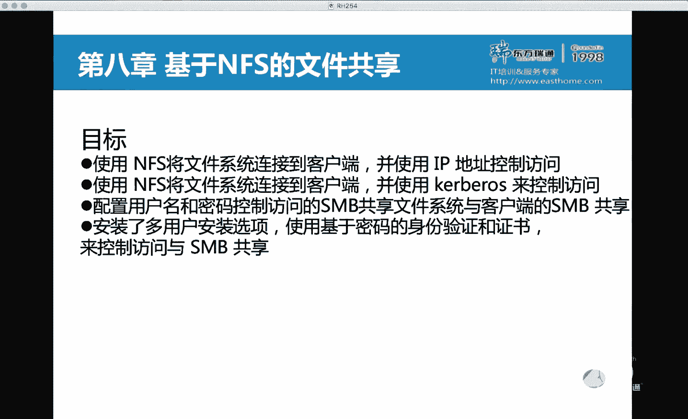

Sが。

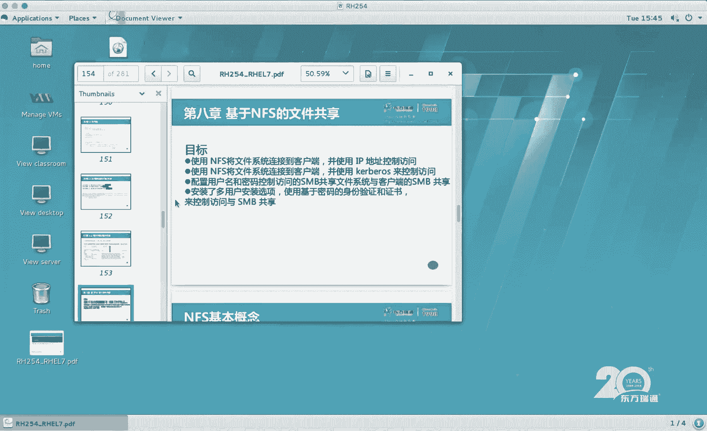

做这个实验的时候呢，你需要两台机器，一台服务器。一台客户端。你既然是要共享一个设备。那你首先是不是先弄个分区出来？或者是弄个指标大小的文件都可以。按照其的要求。おし？嗯，我们看一下题的要求。

配置1个S咖RC服务器，是不是要求叫这个名呢？端口3260默认的吧，后端存储卷叫什么名？S杠RC store大小多大？3个亿。共享给谁？客户端吧。好。服务器端这要求我们下面来做一下啊。

大家来看一下怎么录。首先第一步插包。抓完了吗？都没装。第二步安装。秘密是干嘛的？Okay。秘密的作用。Yeah。替换。将上一条命令的inster替换成杠Yinster，然后来执行。

那么数据变成了y目杠Yinst store，它给它行了。没错。是不是就做完了？这是秘密的作用，放一键上看到没？已经替换成功了是吧？安装完了之后。我们用taet satellite来做配置。

那我们在配置的时候啊，有这么个要求，是不是说后端有个3G的存储啊？那你说得先分个区啊。Al莱 block。哪个硬盘上有3G的空间？VDB吧。那。到底分什么分区啊，看你心情。这个要是下午的考试。

大家讲上午的考试一个硬盘，三个主串分区。啊，你要分的话，只能分扩展，然后再分两个逻辑吧。这个是不是下午的内容啊？下午的内容如果你不知道分主排扩展的话，你是不是直接分扩展就得了？扩展里面的逻辑。

然后如果你发现哎如果没有分区了，逻辑卷当中VG里面有空间，是不是创建逻辑卷嘛？也行吧，到底是用哪种方法来做看实际硬盘的情况。实际银行的情况。对呀，分多了是吧？新建。我们这个要分多大的空间？3。OK吧。

VDBE3个字。VDBE3个G，然后呢，他给他塞Y。进来之后号。CD是什么作用？😡，切换路径I干嘛的？查看当前路地下的内容是吧？PWD呢。在哪exZ呢？退出。这些明明是一看就会啊。你看见会OK。

首先我来试一下。是不是有后台存储的S咖？首先我需要把我刚刚弄的3G那个分区变成后台存储。所以说杠B。剩下你会推播店就行了。整组实验中，你会杠B会杠I会K不见这个实验就做完了。为什么呢？

我们是不是要做块设备呀？买个像块设备。lock吧。那快设备干什么呢？咱是不是想创建一个？哪个像创建？Great以。他是不是让咱们写个名？看到内幕没？大家想。当出现两种颜色的时候，你对哪种颜色比较敏感？

紫色吧。为什么呢？年轻的时候啊，经常有女人在你的脖子上弄个紫色的东西。经常被别人发现，所以说我们对紫色比较敏感啊。Yeah。啊，我们这个名说叫什么名来着？后端存储播就叫这个名。合制。粘贴。然后呢。

把0个设备存后端出楚叫这个名，是不是叫设备了？一说设备能想到什么？い？绿色的充功了是吧？多么多一个后端存属名叫他3个G。OK了吧。然后。注意大小啊，多大。三个G哈，如果你弄的这个大小啊是1K几K的话。

你肯定是把扩展先区给塞过来了。你要C的话，也C是逻辑分区，主分区，别C扩展啊。下面是不是该杠癌了？接着table。要创建的话，依然是什么？Great。大家看到3WN了吧？这个呢就代表是那个IQ文的名称。

3WA写不写都行。要求叫什么名儿？Yeah。是不是说叫这个名？这回再重一眼。这个叫做共享名。我这个共享共享给谁呀？把谁共享啊？绑定哪个端口啊？Yeah。继续刚来c cable cable。不是我敲的啊。

都是table出来的。到TG1的时候，再k没反应摁两下。是不是ACL lens portal？首先呢建议各位同学先认识一下。如果你要创建的话，依然是什么？Great。看到紫色的没？上D。

是不是那个3G的后端存储啊？你瞅一眼，我共享名是它是不是把后端的这个存储给共享了，而后端这个存储是不是为BB13大G啊？共享给谁呢？接着杠A。这回该ACL了吧。创建的话依然是什么？Greatreate。

て。你会发现是不是再次看到了3WN呢？不阳。我们这个题中有没有说客户端这方面？说是这台机器能访问是吧？说没说它叫啥名？没说。但是我们这个3WN的格式是不是都符合这个格式的标准呢？如果你不会写的话。

你把它复制。我客户端是不是要戴斯top0啊？冒号后面是不是叫lego？第然是叫label的话，你到底是label啥都行。我说我这个共享只能他来访问。确认一下。这个呢说是我的共享名。这个是不是说谁能访问？

再然后你如果想让别人访问的话，你是不是在绑定那哪个IP的买个端口上啊？toal接着杠I。Table， table， table， table。抛头 table。E然是什么呀？是为了吧，创建。

你看这些IP眼不眼熟。Q吧IPV4IPV6的IP地址。四个零代表谁？Yeah。所有APP4地址吧。那如果想接着写端口的话，3260。默认我们多少号是不是就3260，这儿可以省略。当你不写的时候。

他用的是谁？3260确认。后端存储它共享名，它ACL它能访问。乐识。绑定类40，把刚刚这个后端存储啊共享过来了。绑定在哪个IP上呢？我机器上所有的APP是地址上。326天单号。退出。这波是啥来的？

哎就这是吧？大家会发现当你退出的时候，这句话啥意思？自动保存吧，保存在哪个文件里了呢？看到配置文件了吧？感兴趣同学可以重新看。在7之前的版本，我们是手动VI编辑它的配置文件。

企业版期的时候是用t给的塑料带来编辑去整接。配置文件做完了之后，我是要启动这个服务。是不是要设置开机自动启动？想让别人使用的话，是不是要开防火墙？正常我们都是先填服务吧，你签个他给他服务有吗？

你添个Scar服务有吗？都没有，所以说我们只能添什了。端口3260杠TCP。然后。立即生效。赛尔号。确认。服务器端就PR了。我们离坑越来越近了哈。看看坑说的啥。对。配置SRC客户端。要求呢。呃。

可以使用so零上的这个共享。每次开机的时候啊，自动挂载。家家街车宝话。自动挂载它上面的2。1G空间，2100兆，它整个共享过来的，是不是共享了3个G啊，我用其中的2。

2100兆分割区格式化成EIT4挂载在d下开机自动挂载。OK那我们来看看门目。客户端里面有个很重要的命令，一叫is的命令。回到戴斯套。S加等命。妈。在这个里面呢，我们依然插一个。但会发现呢有些失例。

看到这条没？这条是说发现共享，你觉得哪个位置应该改？嗯。是不打开机器有什么共享啊？第二条看看这条没？对他说。使用节点。IP是不是还在改。那台机器上的那个共享看到没？两个位角改吧，log in是啥意思呀？

登录和它相反的操作是什么？拉高是吧。OK你要用的就是这两条。

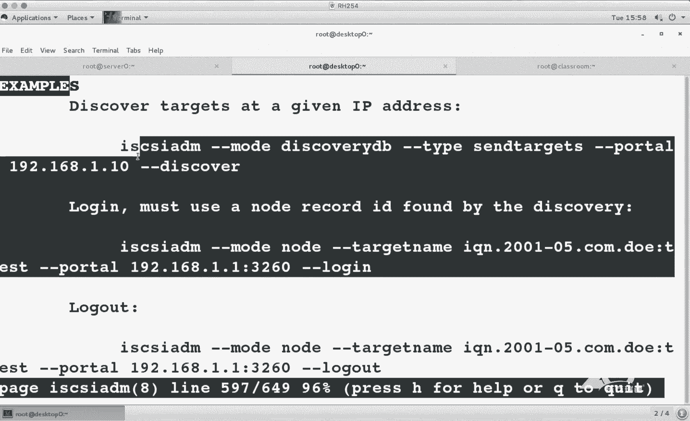

这两条复制起来啊，虽然不太方便，那我们是不是可以转到gra？呃，他是不是带了一个杠帽子呀？看到没？发现共想discovery node啊mod。O。😊，那首先呢我们来发现个共享。复制他吧。IP是多少？

SR5。0。11。能看到共享名吗？能看到吧？有同学问过我这样的问题，老师这个位置你写DS名行不行？如果DS能解析的话行。第二是解析不了的话就不行。OK吧。看到共享名之后，我是不是可以使用这个共享啊？

登录这个东西。3260默认端口是不是可以不写？127225。0。11。然后呢，你的共享名。你的共享名是不是刚刚能看到啊？不知吧。写一下。直接登录，他让你登录吗？你看这个词儿说什么？验证失败。

一提到验证失败能想到手。ACL啊。Okay。G list ice加。大家看一下，有好几个包，S咖这包、初始化包、工具包都装了吧。这个包和这个包的区别是啥？あ。あは。一个是32位程序，一个是64位程序。

解满764位程序，所以说它默认安装是64位应用。这个就不用管了吧，看上面就行。然后。在GETC下有一个S。初始化。看到寿司了吧。嗯，寿司是这么来的啊，初始化。Inits initial name。

S加C。这里面几行？一好。等号后面有副格吗？没有。大师。你刚刚服务器上说谁能访问？所说他能访问。记得了。你把它复制过来。粘贴。你服务器ACL说谁能访问，这又写谁？写完了之后。保存。

配着文件改完之后要干嘛呀？一起服务。然后我们是不是要让它设置。立即生效吧。摔下了之后呢，最后我们再次落地。看这层呢。OK吧？如果你显示fil的，肯定是ACL的事儿。要不就是ACL和这边文件对不上。

有同学说，老师，我明明对上了，那你服务没重启。能听懂吧？你对上了服务没重启，服务没生效啊，服务应该重启。登录存功之后，IS block。看多了一个硬盘没？这三名。Yeah。SDA看多大。OK吧。

那既然有这块硬盘了，我是不是可以给它分区了？哥。他也没有要求说什么分区，但是要做多大了是吧？我写2。1机行吗？不者是小数点啊。只能这么写。分完区了吧，然后你是不是要挂在永久成效啊？

但是这个它是属于一个网络存储吧。所以说你一定要去看一下。我忘了这个东西啊有没有下划线了，你就给我滤那下D一V有没有下划线。有吧。卖的第一笔编辑Ifi table永久成效吧，按照题要求放一个挂在点。

然后呢，编辑啊分析文件。第一列是不写UI地址？那个分据UI地值是多少？刚刚没看就冲进来了是吧？我们支不支持冒号叹号？Yeah。在VI当中执行上下的命令吧，看UID使用啥命令。不到开地吧。得到ID。

那我们可以看到这只有VBAE是吧？你想看的是谁呀？SDA1。看到UUID值没？说没有，为啥？因为没格式化啊，行了，先出来吧。m FS点EI4。SB。A1。更完了之后，lockID。有UI地址没？不是啊。

あ。若编辑FItable文件。8点的创建呢。啊，看见了。编辑h特房间大G。好。电梯。发来点。文件系统类型。下划线。n device看变色没？能看到区别吧。如果是红色的话，就坑，你给它变绿了。

坑就没有了啊，这是区别。最后一列启用日志面系统检测顺序。做完了之后呢。是不是要让他立即生效啊？你在当前情况下，即使你选项写错了，望慢当来也能生效，为什么呀？因为现在notework服务是不是已经生效了。

能理解吧？但是当你重启系统的时候，它是先加载文件系统，再加载n克 word服务。再之后呢是你的网络存储。所以说一定要注意啊，下划线n device。确。2。1G吧。然后我们是不是要想办法让重启啊？

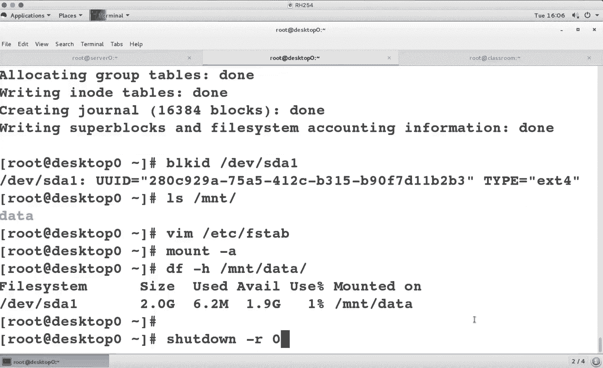

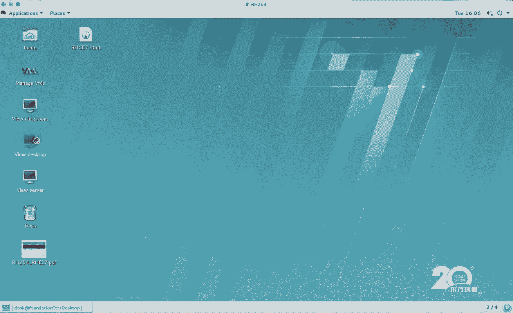

Yeah。大家看一下左下角有没有个红色的小点儿啊。滚来滚去的。你等个10分钟啊，他会告诉你说你可以安全关机了。所以说你要着急的话，不想等怎么办呢？在classroom呢。在防备身上。

我们有没有这么一个命令？哪个是关机？225。

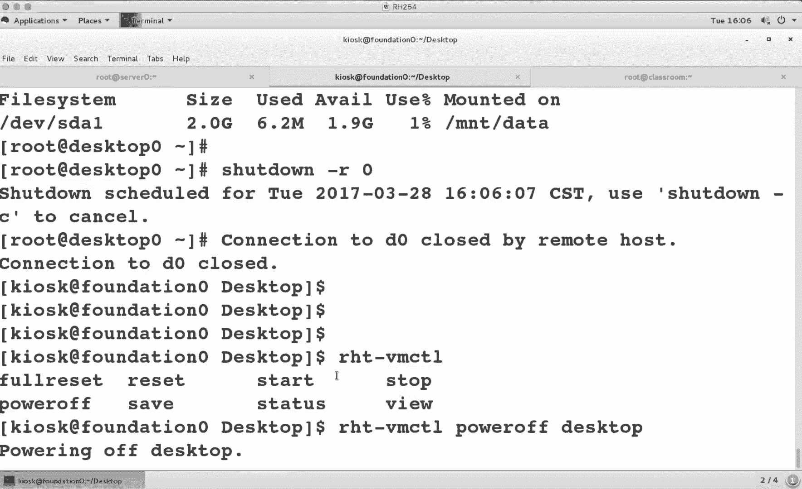

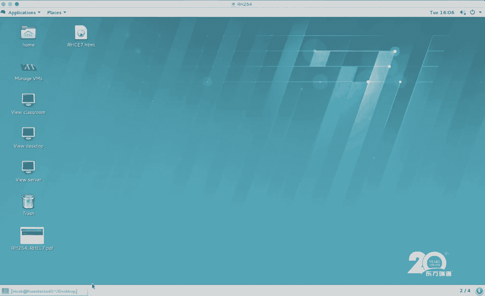

给有啥的哈。也算个就白做了。考试的时候，你现的这个事很慎重啊，你想整个考试时间三个半点。已经过了一半时间了，你再resect，相当于重做一遍吧。能听懂吧？这个时间最大的坑就下划线那d不用重过呀。

不用重做。这比赛的话能做完挺奇怪。也有可能是吧？你说要很熟的情况下，没必要reite。他也不可能。很熟的话确实能做完，但很熟的话不用你赛。Okay。Yeah。呃。

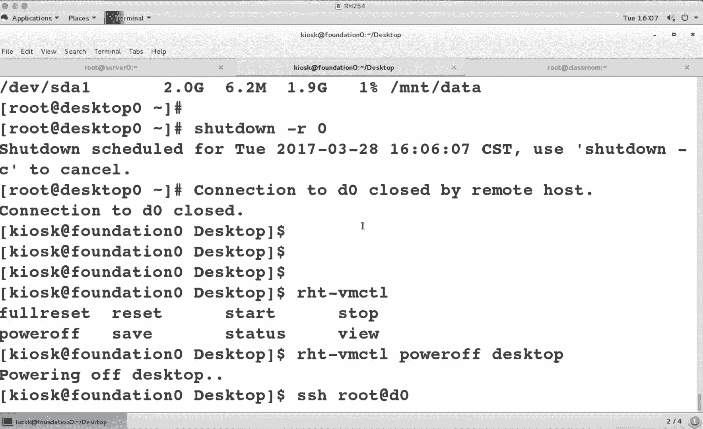

power off之后。下面呢我们再找到你这个虚拟机，letstop。你可以反复的把它重启都没有问题了。

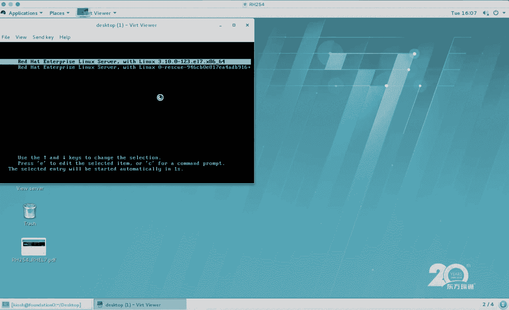

都可以正常启动都可以正常重启。在培训环境中，就第一次必须得pll off一下。考试环境没事啊。考试环境呃测了N遍，测了N遍都没有问题。Yeah。这时看冷了吧。这属于一个大事验。他坑谁呀？

这段时间看懂了之后，我还得干一个事儿。我把阿开推罗那个选项啊。我得改成给fs。然后呢。这个时间一会儿你们自己做吧啊。你们自己做一个崩溃实验。什么叫崩溃实验？我们的选项是不是应该写下划线mate？对吧。

你把那个选项就写成dealse。

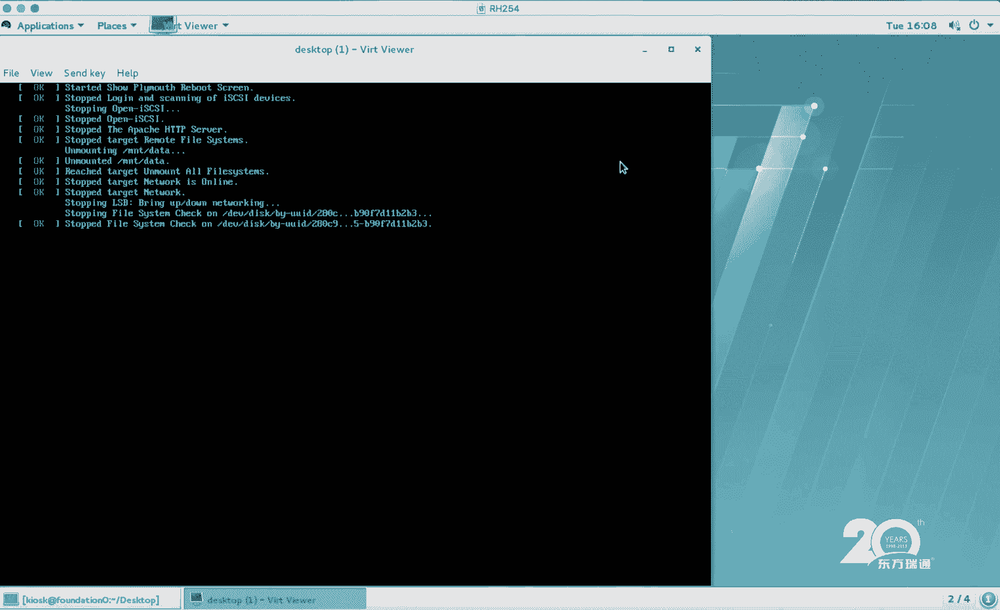

那个选项你就写成be。然后重启你会看到哎，死活起不来一堆废物。

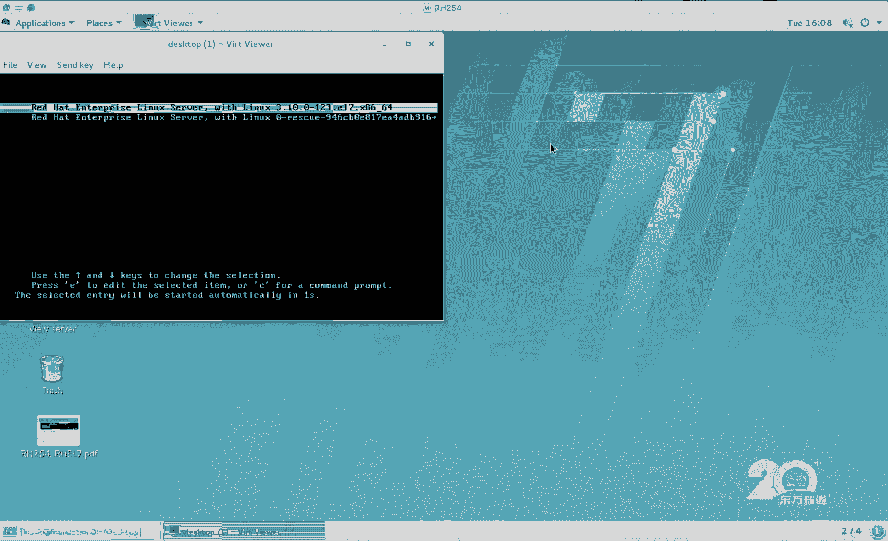

那怎么办呢？咱们之前是不是讲过单用户车密码，你去单用户把SI table改一下。选项里面加上下划线max device，然后呢你发现再一重启是不是都正常了？就自己可以去做一遍啊。

帮用户恢复IIP5的时验。将考试的时候，即使是遇到了类似的情况，这个不紧张啊，我见过之后怎么解决。大家可以看一下，我但是top这回再重启是不是都正常了呀？都这样重启，就第一次哈就第一次。呃，考试的时候。

因为下午你有两台虚拟机。所有题都答完了之后，你是不是至少要让他们出启一回去做验证呢？重启的时候有顺序。so要先启动起来之后再启动top。能理解吧？生活先启动。比如说我都先都做完了，我先到搜网上。

他3杠20，它是不是出血了？然后你是不看到登录界面，你再启动白。能理解吧？为什么？你做了那么多客户端的实验，是不是都要挂服务器上东西啊？服务器没起来的话，客户端能挂上？

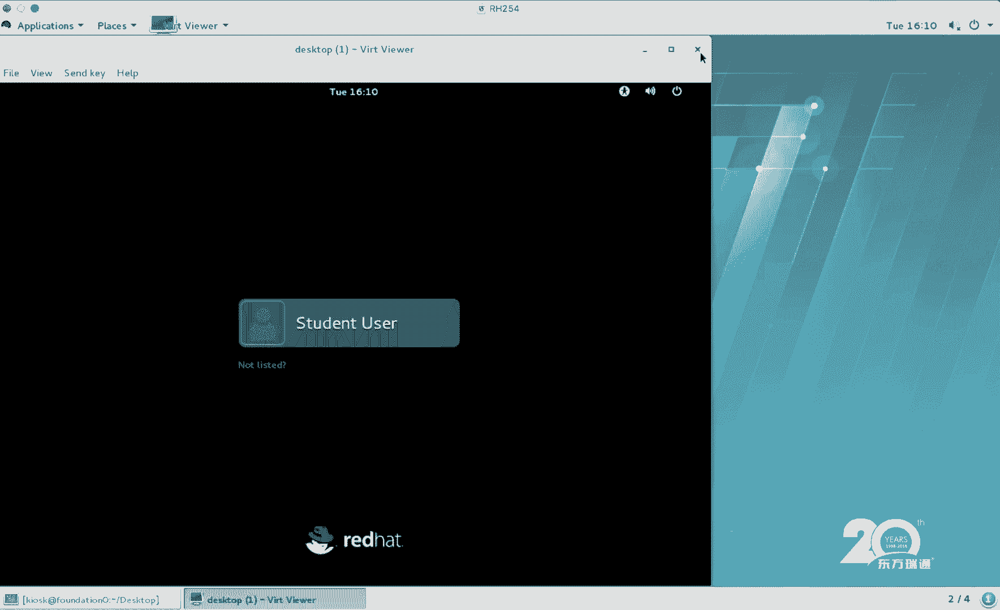

有相互顺序的啊，这要注意。O。😊。