# 红帽RHCE7培训课程：第六章：邮件服务与远程存储

## 概述
在本节课中，我们将学习两个重要的企业级服务：邮件服务和远程存储。我们将了解邮件服务的基本原理、协议以及如何在红帽企业版Linux 7中配置Postfix邮件服务器。同时，我们也将探讨远程存储技术，特别是iSCSI，学习如何配置iSCSI目标服务器和客户端，并理解其中的关键配置和注意事项。

---

## 邮件服务的作用与原理

在现代办公环境中，最常用的沟通方式包括邮件、电话、QQ和微信等。其中，邮件因其**有据可查**的特性而成为办公沟通中使用频率最高的方式。与电话或即时通讯工具不同，邮件提供了完整的记录，便于检索和追溯，这在处理工作争议或需要历史记录时尤为重要。

电子邮件的功能类似于传统邮局，但传递的是电子文件。在红帽企业版Linux 7中，我们使用SMTP邮件服务器，其中最常见的是Postfix。

### 常见的邮件服务器
*   **Postfix**：红帽企业版Linux 7及之后版本的默认邮件服务器。
*   **Sendmail**：红帽企业版Linux 7之前版本常用的邮件服务器。
*   **Domino (Lotus Notes)**：IBM公司的产品，包含服务器和客户端。
*   **Exchange**：微软公司的邮件服务器。

邮件客户端软件，如Outlook、Foxmail，则被称为邮件用户代理。

### 邮件协议
在整个邮件系统中，涉及两种主要角色和协议：
*   **MUA (邮件用户代理)**：用户使用的客户端软件，如Outlook。
*   **MTA (邮件传输代理)**：服务器端的邮件服务器，如Postfix。

核心协议包括：
*   **SMTP协议**：专门负责**发送**邮件。
    *   公式：`客户端 --[SMTP]--> 发送服务器 --[SMTP]--> 接收服务器`
*   **POP3/IMAP协议**：专门负责**接收**邮件。
    *   代码示例（接收邮件）：`客户端 --[POP3/IMAP]--> 接收服务器`

在红帽企业版Linux 7中，发送服务由`postfix`提供，接收服务则由`dovecot`提供。这与一些商业软件（如Exchange）将收发功能集成在一个软件中不同。

**POP3与IMAP的区别**：
POP3协议将邮件从服务器下载到客户端，操作（如删除、标记已读）仅在客户端生效，服务器端保持不变。IMAP协议则支持双向同步，在客户端进行的操作会同步到服务器。因此，在实际工作中，**建议使用IMAP**以避免重复处理垃圾邮件等问题。

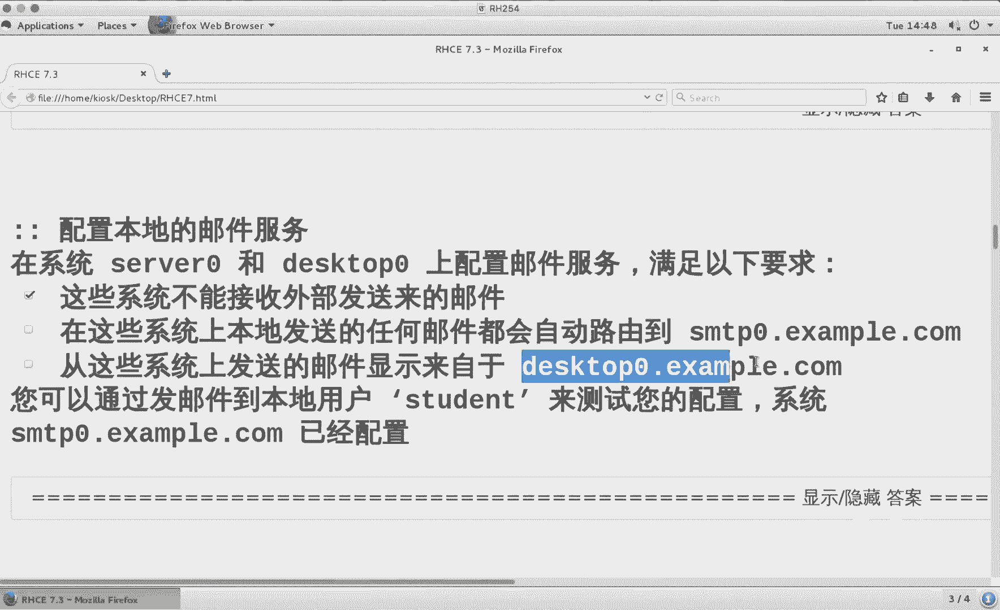

### Postfix 配置文件
Postfix采用模块化设计，其主配置文件是`/etc/postfix/main.cf`。我们主要关注其中几个核心参数：

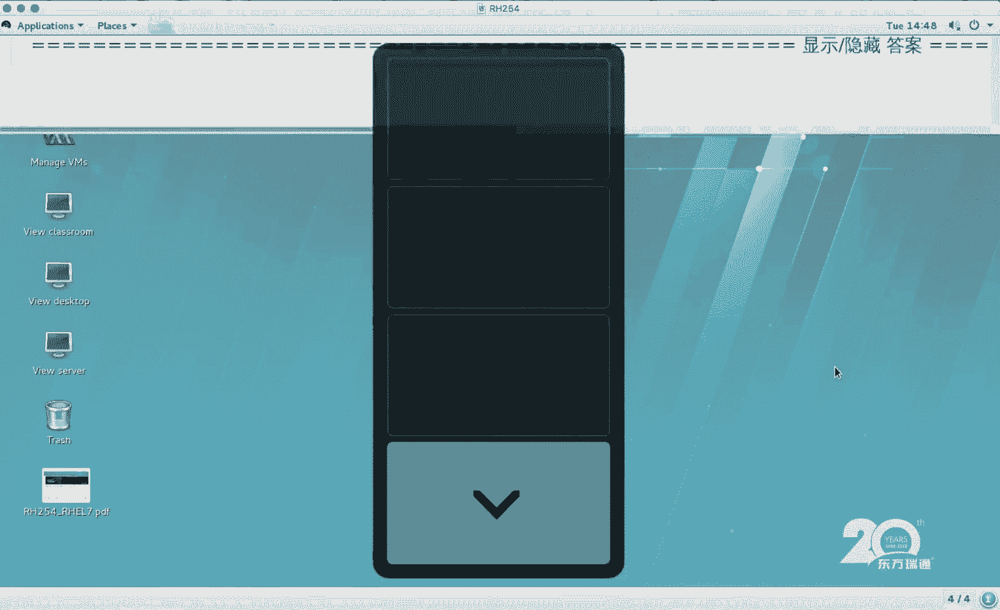

1.  **`inet_interfaces`**：服务监听的网络接口。设置为`localhost`表示仅本机可用。
2.  **`mynetworks`**：允许使用本邮件服务器的网络地址范围。
3.  **`mydestination`**：本邮件服务器负责投递的域名列表。如果为空，则无法接收外部邮件。
4.  **`relay_domains`**：指定邮件可以被转发到哪些域。
5.  **`myorigin`**：设置外发邮件的发件人域名，可用于“邮件伪装”。
6.  **`local_transport`**：设置本地邮件的传输方式。默认允许本地用户互发邮件。

要查看当前生效的配置，可以使用命令：`postconf`

---

## 配置邮件转发服务器实验

上一节我们介绍了邮件服务的基本概念和Postfix的核心配置参数。本节中，我们通过一个实验来配置一个只转发邮件的服务器。

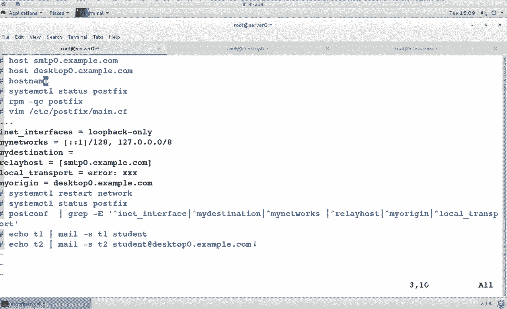

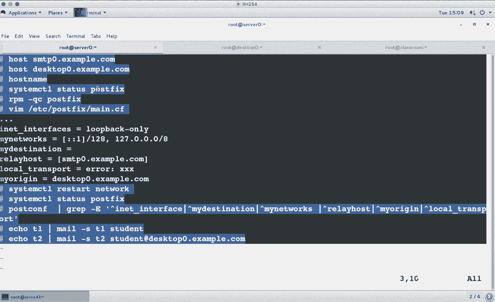

**实验目标**：将`server`配置为邮件转发服务器，所有从`server`发出的邮件都自动路由到`desktop`，并且发件人显示为`desktop`。

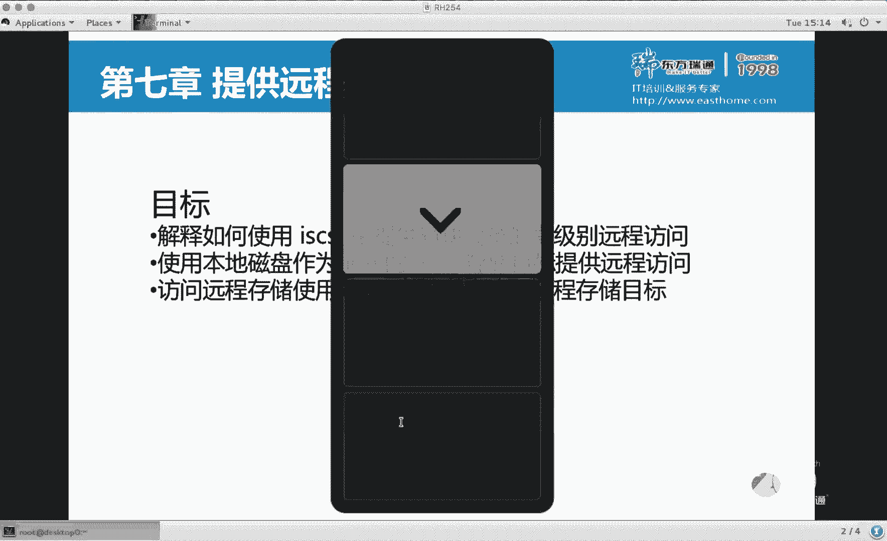

**实验步骤**：

1.  **环境准备**：在`server`和`desktop`上执行`lab smtp-nullclient setup`脚本，以安装必要软件包并配置基础环境。
2.  **修改Postfix配置**：编辑`/etc/postfix/main.cf`文件，修改以下参数：
    *   `inet_interfaces = loopback-only` (仅限本机使用)
    *   `mydestination =` (留空，不接收外部邮件)
    *   `mynetworks = 127.0.0.0/8, ::1` (允许本地网络)
    *   `relayhost = [desktop0.example.com]` (所有邮件转发到desktop)
    *   `local_transport = error: local delivery disabled` (禁用本地投递)
    *   `myorigin = desktop0.example.com` (伪装发件人域)
3.  **重启服务**：执行`systemctl restart postfix`使配置生效，并确保服务开机自启：`systemctl enable postfix`。
4.  **验证**：在`server`上使用`mail`命令发送测试邮件，然后切换到`desktop`上的`student`用户，使用`mail`命令查看是否收到来自`desktop0.example.com`的转发邮件。

**注意**：实验成功与否与主机名解析密切相关，需确保`/etc/hosts`或DNS配置正确。

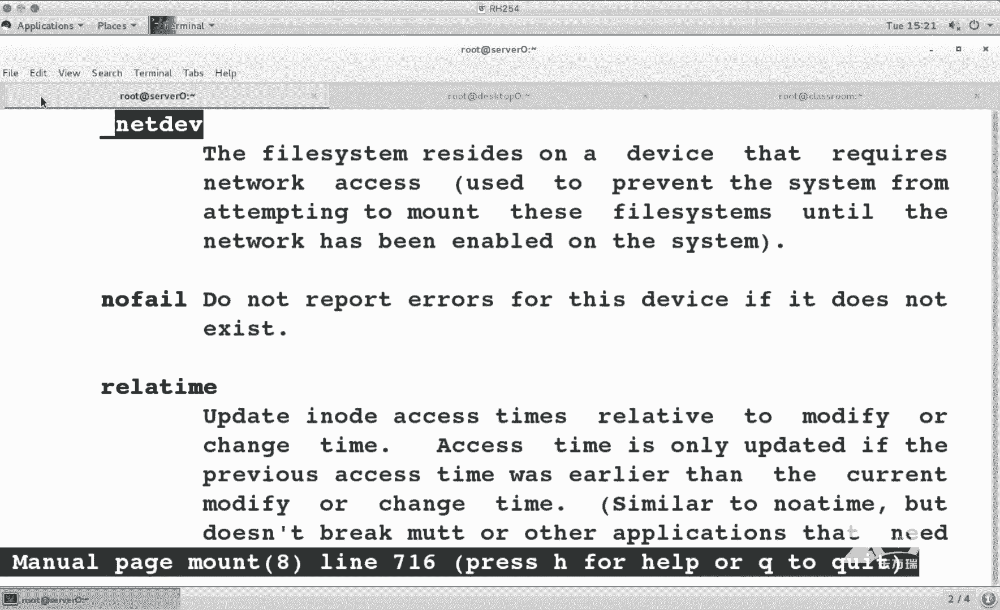

---

## 远程存储 (iSCSI) 概述与原理

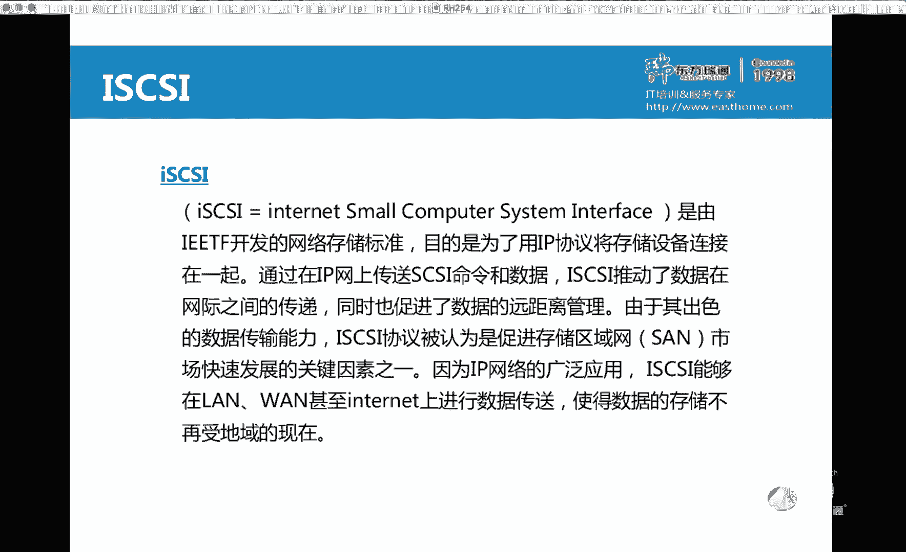

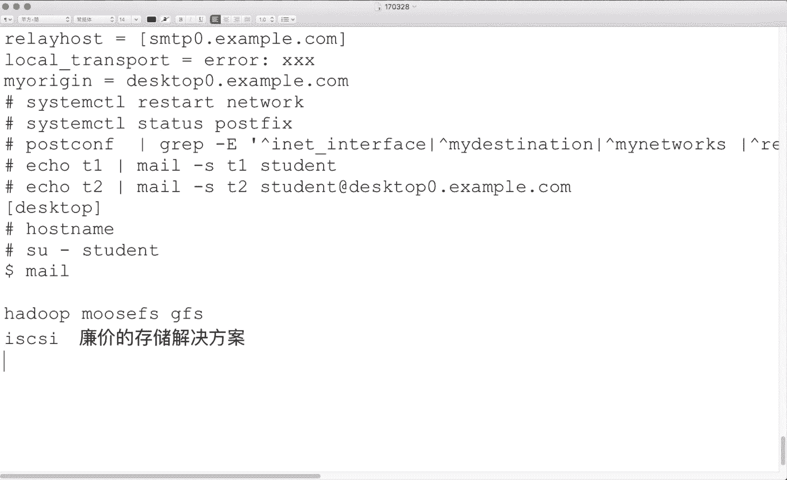

接下来，我们转向另一个重要主题：远程存储。在企业中，存储解决方案多种多样，iSCSI是一种基于IP网络的廉价存储区域网络解决方案。

**存储类型对比**：
*   **DAS (直连式存储)**：存储设备直接连接到服务器，不经过网络（如SATA硬盘）。
*   **NAS (网络附加存储)**：通过网络共享**文件系统**（如NFS, Samba）。
*   **SAN (存储区域网络)**：通过网络共享**块设备**（如硬盘、分区），iSCSI属于此类。

**iSCSI 架构**：
iSCSI将SCSI命令封装在TCP/IP包中，通过以太网传输，使得远程磁盘看起来像是本地磁盘。架构中包含：
*   **Target (目标器)**：提供存储设备的服务器端。
*   **Initiator (启动器)**：使用存储设备的客户端。
*   **LUN (逻辑单元号)**：用于在Target上标识不同的共享存储设备。

iSCSI命名格式为：`iqn.yyyy-mm.<reversed domain>:<identifier>`

---

## 配置 iSCSI 存储实验

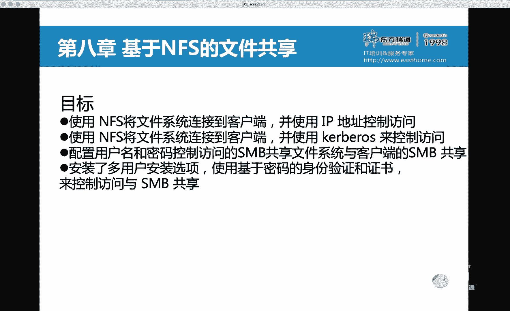

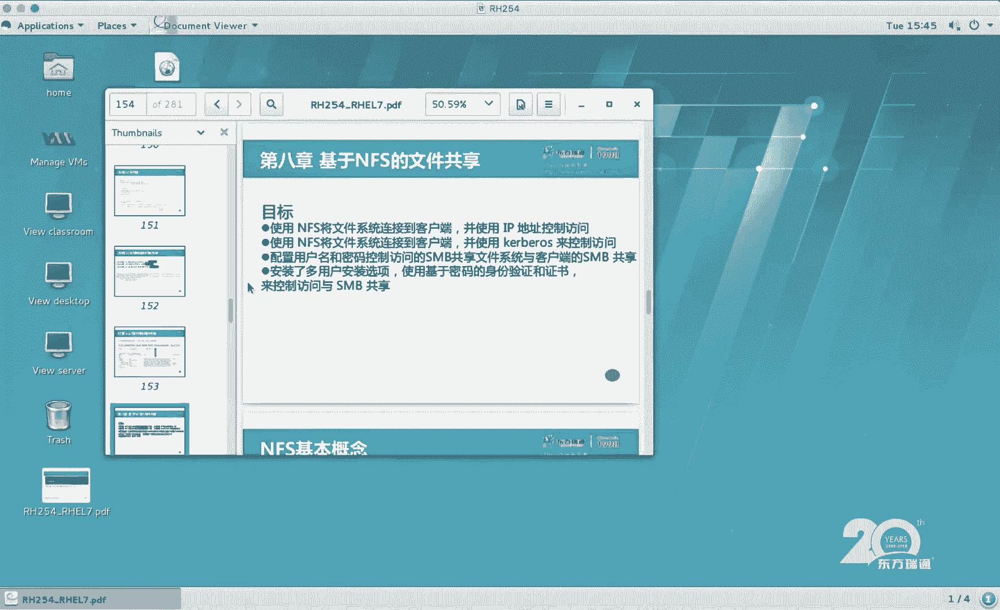

本节我们将动手配置一个iSCSI Target服务器和一个Initiator客户端，这是下午考试的重点和难点。

**实验目标**：在`server`上配置iSCSI Target，共享一个3GB的分区。在`desktop`上配置iSCSI Initiator，连接该共享，并使用其中的2.1GB空间创建文件系统，并配置开机自动挂载。

**实验步骤（服务器端 - Target）**：

1.  **准备存储**：在`server`上使用`fdisk`在`vdb`硬盘上创建一个3GB的分区（例如`/dev/vdb1`）。
2.  **安装软件包**：`yum install -y targetcli`
3.  **配置Target**：运行`targetcli`进入交互式配置界面。
    *   创建后端存储：`/backstores/block create iscsi_store /dev/vdb1`
    *   创建Target IQN：`/iscsi create iqn.2023-08.com.example:server0`
    *   设置ACL（访问控制）：`/iscsi/iqn.../tpg1/acls create iqn.2023-08.com.example:desktop0`
    *   将存储映射到LUN：`/iscsi/iqn.../tpg1/luns create /backstores/block/iscsi_store`
    *   设置监听端口：`/iscsi/iqn.../tpg1/portals create 0.0.0.0`
    *   输入`exit`退出并自动保存。
4.  **启动并放行服务**：
    *   `systemctl enable --now target`
    *   `firewall-cmd --permanent --add-port=3260/tcp`
    *   `firewall-cmd --reload`

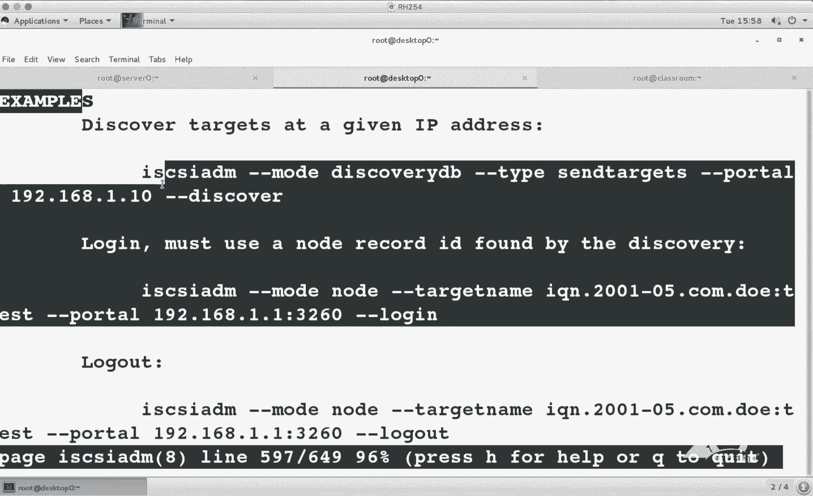

**实验步骤（客户端 - Initiator）**：

1.  **安装软件包**：`yum install -y iscsi-initiator-utils`
2.  **配置Initiator名称**：编辑`/etc/iscsi/initiatorname.iscsi`，将`InitiatorName`设置为服务器端ACL允许的名称（即`iqn.2023-08.com.example:desktop0`）。
3.  **发现并登录Target**：
    *   `iscsiadm -m discovery -t st -p server0.example.com`
    *   `iscsiadm -m node -T iqn.2023-08.com.example:server0 -p server0.example.com -l`
4.  **使用存储**：此时客户端会多出一块磁盘（如`/dev/sda`）。
    *   分区：`fdisk /dev/sda` 创建一个2.1GB的分区（如`/dev/sda1`）。
    *   格式化：`mkfs.ext4 /dev/sda1`
    *   获取UUID：`blkid /dev/sda1`
5.  **配置开机自动挂载（关键步骤！）**：
    *   创建挂载点：`mkdir /mnt/iscsi`
    *   编辑`/etc/fstab`，添加一行：
        *   代码：`UUID=<你的UUID> /mnt/iscsi ext4 _netdev 0 0`
    *   **重要**：选项`_netdev`是**必须的**，它告诉系统此文件系统位于网络设备上，需等待网络服务启动后再挂载。缺少此选项可能导致系统无法启动。
    *   测试挂载：`mount -a`

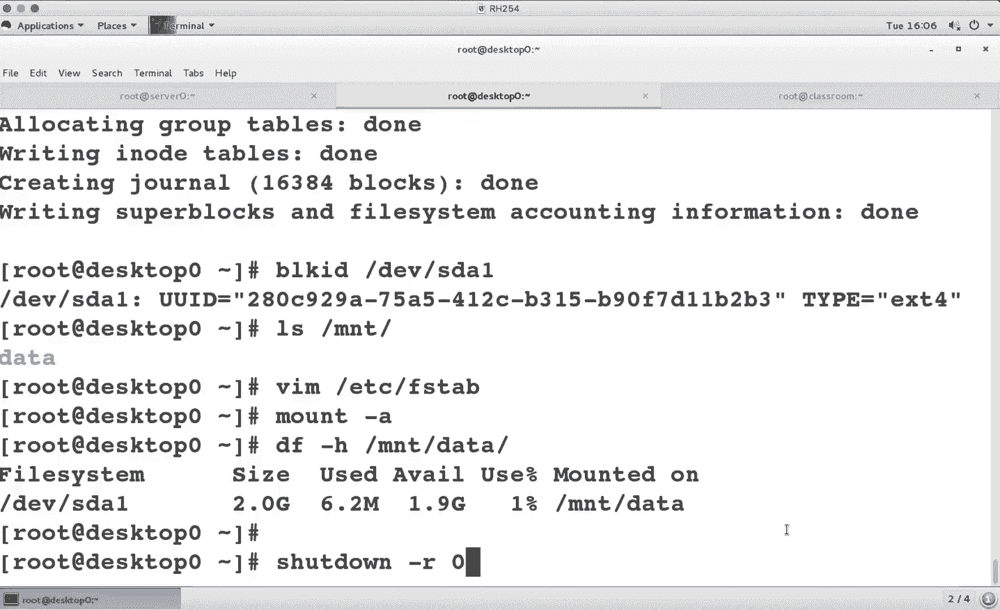

**排错与恢复**：
如果因`/etc/fstab`中缺少`_netdev`导致客户端无法启动，可启动到**单用户模式**，修改`/etc/fstab`文件，添加上该选项后重启即可恢复正常。

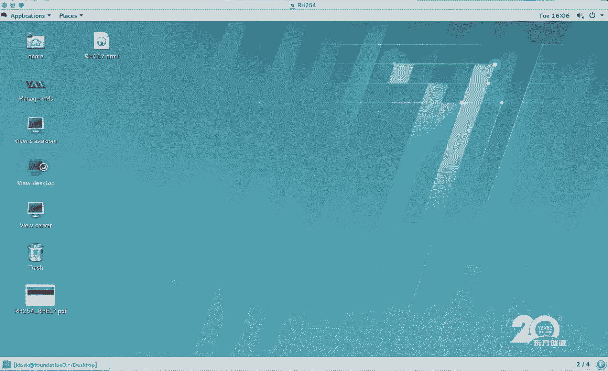

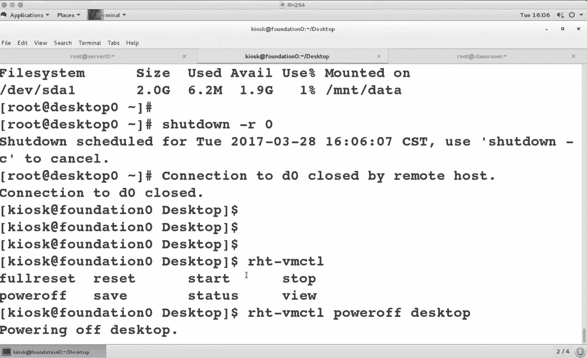

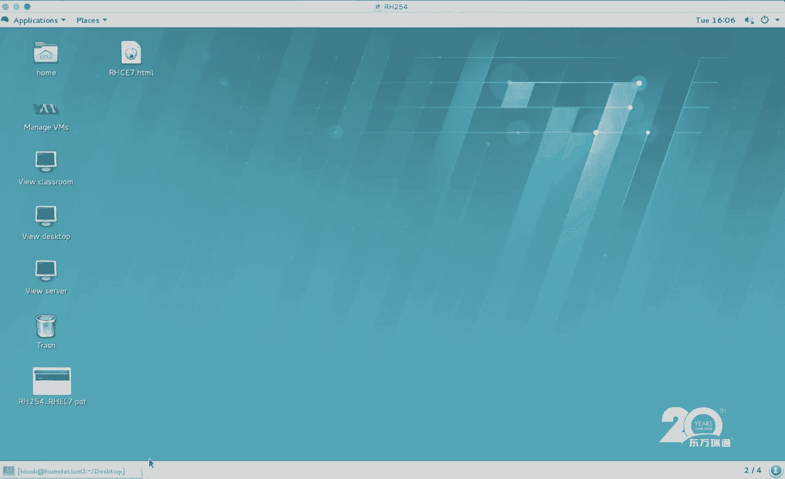

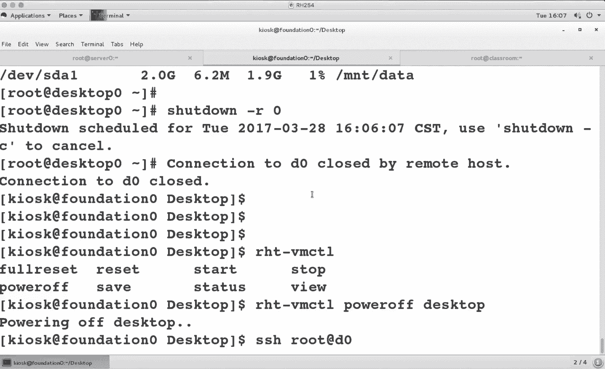

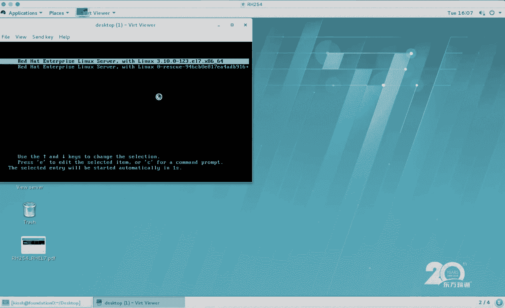

---

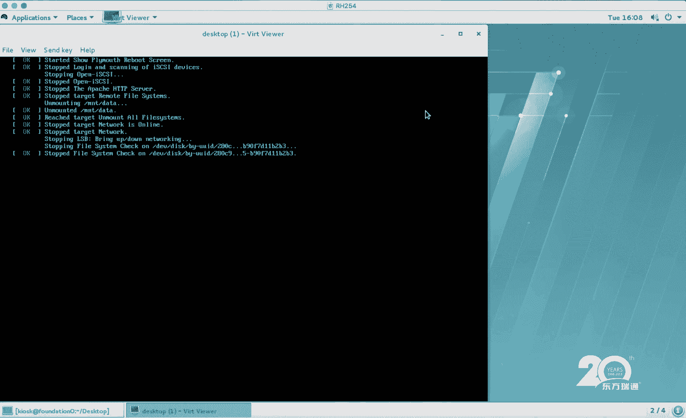

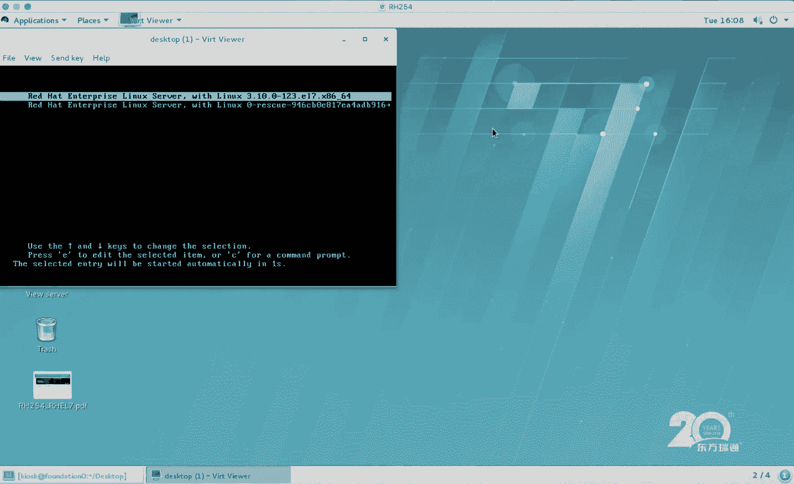

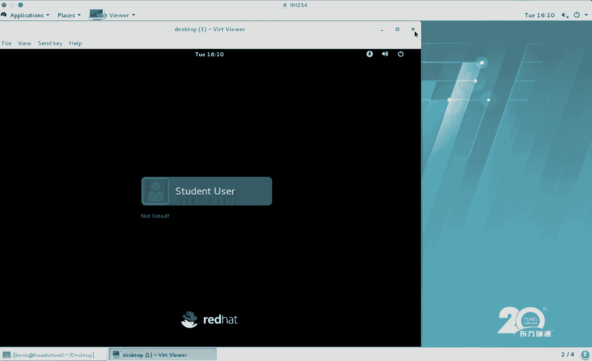

## 总结
本节课中我们一起学习了两个核心的企业服务。
首先，我们深入了解了邮件服务的工作原理，区分了MUA和MTA的角色，以及SMTP、POP3、IMAP协议的不同用途。通过配置Postfix邮件转发服务器的实验，我们掌握了`main.cf`文件中几个关键参数的作用和配置方法。
其次，我们探讨了远程存储技术，重点学习了iSCSI的架构和配置。通过动手配置iSCSI Target和Initiator，我们理解了如何通过网络共享块设备，并特别强调了在`/etc/fstab`中为网络文件系统添加`_netdev`选项的重要性，这是避免系统启动故障的关键。
这些知识对于构建和维护企业IT基础设施至关重要，希望大家通过反复练习，熟练掌握这些技能。