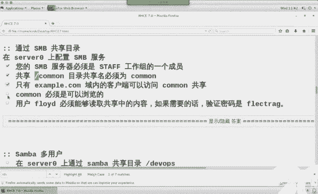

# 红帽Redhat RHCE7培训课程+RCHE7实战参考教程+红帽8.0教材电子版+模拟环境及辅导 - P19：5 - 16688888 - BV1zu41197p6

。我么首先呢来回忆一下昨天讲的内容。昨天我们再次讲到了方小强啊，通过命令行。来配置。副规则。通过命令行来配置。那么对于命令行而言呢，要求各位同学。知道这么几点。不规则你必须得知道一个。

慢名力啊慢名力慢什么呀？想想。卖啥来着？啊。我当。你是允系的。啊，在落D点瑞迟郎规置是吧？挺长，这个要备不住咋办？嗯。嗯。慢杠K是吧。那慢个K它没显示说没有这个数据库咋办？慢BB。

这我们发现呢去干一个事不太容易，是吧？我们最终的目的啊实际上是为了利用它。慢。Firwall。D点儿。Which。Language。如果背不住的话，你得回慢慢让K very。慢啊K发报。

如果是没有内容的话呢，你还得慢BB一下。Okay。啊，通过附规则当中。如果你想做。端口转发，那我师不可以过滤弱点星。点星如果实在不理解的话，你就总用总用总用就理解了啊，总用总用就理解了。转发for。

能查到对吧？那如果你想来做限制，谁能访问我的SSH服务，你是不是也可以用。富贵则来查呀。这个过滤啥？也是规则吧。然后是不是圆呢？然后服务吧。到底是先源还是后服务，还是先服服务后源？呃，随便哈。

如果实在记不住的话，是不是可音两遍？过滤遍再管道，再greate看你心情啊。O。对邮件服务而言。邮件符首先呢你得知道它的配置文件。他的快流年叫啥名来的？是妹还是master？慢点CF。

扩亚名的比较特别是吧？好，这个里面我们有1234566个选项。那如果现定只能自己用的话，你要改哪个值？I like。Interface。Lookop back。Only利。

只能自己用myinenet work。买那首 work。嗯，interfaceS。那来的 work等于什么呢？127。点0。0。0-8。不对，这多少了，十8是吧，还有个。IPV4的地址吧，冒冒一。啊。

128。那 my destination呢。啥没有啊。这个是。第一道题第二道题只转发吧。今转发的话是不是得有人泪呀？转到哪？在TE当中，他给我们转发到了一台机器。

叫做SMTP0点example点儿com吧。这台机器是不是也带是top0啊？为什么要加方括号不走DS的MS记录，不差邮件交换记录，就差这个IP得了啊。然后呢，还有个什么？loccal。算是泡吧。

logo穿个泡到后面的值。到底写啥？有同学昨天问我说这个写别的行不行？你可以试试啊，写别的行不行？呃，local transportport。完事儿。最后一道题最后一道题先定什么？那来源吧。这不伪装吗？

奥瑞给。伪装成谁，你就选谁。比如说你要伪装成163，你就写163。配置完之后。我们要做操作。服务重启吧，开机自动启动，然后这不测试啊。主要就这么几步啊，123455下。测试命令呢。在培训环境中。

我们测试命令用的是mail有。测试的时候，我们是不是都艾了一个内容？然后又没有命令。发给相应的用户啊。验证的时候。培训环境，我们是不是。登录到了。D铃上。然后呢。切换到了sillent。

在之后是不是我没有命令来确认？考试环境。考试环境你是用一个叫f fox的东西。火狐浏览器。先看某个网址。那个网址啊和class room那个有点像，它里面会列出两个文件。ste是邮件。

如果它的大小为C0，代表时间成功。当然你可以拿鼠标点开，看到里边的内容。他实际上就是把那个用户的邮件啊做了一个共享啊，做了个共享，通过浏览器共享出来。就是考试环节前面。一直期。啊，是。没写全是吧？

这都被你们发现。但为什么没写全，我也敢写。笔记当中偶尔也会出现错误是吧？呃你只要是做实验的话，一般都能发现。不是特意写错的哈嗯，今儿早上没睡醒。哎呀，一看就心里有事儿啊。马上就快过节了，是吧？三个人。

清明节是干嘛的呀？第四。嗯，清明节是祭祀的是吧？第四组先。Okay。那么S咖。昨天S咖RC实验都做成功了吧。し。呃，S加RC这个实验最大的坑在哪？せ。下滑县n克德vis。那么你们昨天呢在做实验的时候。

大家会发现这样的问题。客户端但是top0，你在重启的时候。能启动成功吗？嗯好。有没有人等了10分钟的？有咩。嗯，咱班没有啊，咱班都比较听话是吧？其他班的学生啊，有同学可以在坐等10分钟。看现象。

最后显示你可以安全关闭计算机了这类提示。大家见没见过AT电源呢？APX电源。现在我们买的电源呢基本上都是ATX是吧？ATX支持关闭操作系统，支持关闭电源硬件AT电源呢，当你选择关闭操作系统之后。

然后关闭操作系统最后个界面，你可以安全关闭计算机了，你再按一下电源，这是AT电源。那如果你昨天呢在做desstop这个实验，你就等了那么10分钟啊，最后那个界面来提示类似啊，就说你的系统已经关闭了。

但是呢电源没有关。O然后把这个时间呢给回忆一下。首先在服务器端吧。在服务器端，你是不是得知道包名？你的报名叫啥来着？他给他行是吧？星是不是叫他给他的，他给他 sell life呀，俩包。那的客户端呢？

爱死干也行吧。因为那个寿司太长了。吃不了那么多啊，所以说你推不荐能出来。这行，也可以。包装完了之后，服务器端我们在配置的时候，用么是不是一个叫tcline命令。用他的 C line。

我们是不是在这个里面杠B？杠I可以配置啊。那么你在刚闭的时候，你是将本地的一个分区或者是一块硬盘给它共享出去。所以说你在这步之前呢，是不是得先许它弄一块？硬盘分区出来。O。不管是block也好。

还是 ice咖啡也好，block呢它代表是后端存储的设备，这个设备可以是分区，可以是文件，可以是内存，可以是管道都行啊都行。那么S杠C呢，它代表是共享名，它代表是共享。不管是B什么。会用推播键吗？个嘢。

然后呢，在后面也就它得会create。那 Chris。在S咖当中。你是不是得去做类ice设备？你还得去做。包头。你还得去做。ACLACL来限定的是权限。他是说谁能发问？那么对于这三个对象而言呢。

你要操作是不是也是可re以呀？也是创建吧。如果你想来确认的话，是不是都得用LS确认？阿拉斯学。在最后保存的时候。他说自动保存到了你的配置键。那么既然保存到了配人件是不是永久生效？永久生效。

我们是不是还要考虑一个思路，叫立即生效？立即生效怎么做呢？Sysister control。没1大。H。发给个表弟们。没有，如果你实在分不清有没有地，你就这个做一遍，带D的做一遍。OK吧。

两张都做一遍就可以。既然你该给它把它立即生效，我们是不是应该养成个习惯？开机自动启动了。想让其他人访问我这个服务，是不是防火墙还要弄一下？只不过这个服务比较特别，他能填服务吗？现的是端口吧。

多少号是多少？3260。然后夫务妻关是就完事儿。OK了。我们通常情况下在配置服务的时候，是不是先会在本地测试一下？对吧那这个时间为什么我们在本地测试呢？为啥？因为我这个里面做了个ACL。能看到吧？

你说共享给谁了，你本地测试的话，顶天能看到共享名，能看到共享的内容吗？看不到。访问不了，是不是你要访问的话，会选这个login filter啊，login filter登录失败啊，登录失败。

所以说你这个实验当中，我们只能通过客户端来进行测试。那么客户端在测试的时候呢。我们要去干这么几个事儿。第一个。扦插包装没装？包装完了之后，你是不是要去修改一个配置文键了？编辑。建议 t c。S他手一下。

这边有一个叫说实话寿司的一个文件嘛。在这个文件当中。是不是有个名？有个IQ的名称吧。年年。月月。反转域苗。标签吧。你ACLc创建的说候谁能访问，你是不是就得说你叫什么名？他俩是对应的。

那实际上这个实验呢你可以非常省事儿，直接看一下这个文件的内容是啥，复制。粘贴到ACL这个位置是不是也可以？行不行？也行。因为在考试的时候，他只说要求dtop零能访问，别人都不能访问。换句话说。

他也没说你dtop零必须叫什么名，对吧？他没给你挨Q的名称，你要是想省事儿的话呢，就看他一下。他的名字。把他的名字呢复制过来。把他的名字复制过来。是不是就OK了也行。那配置文件改完之后必须干什么？

重启服务。我这个服务叫什么名啊？在地是吧？如果你分不清的话，你是不是也可以把不在地的给启动一下？Yeah。你们在做这个实验的时候啊。等你下次再做的时候，你可以去看一下。

S咖RC那个服务和他给的D服务一直启动不了。能听懂吧？但是那两个服务启动不了呢，它会把他们关联的tge和S加RCD都给启动。把他俩联系的。这个标准的话应该是启动它俩啊。你可以反复去做验证。

那上面该做什么呢？你已经让你叫什么名生效了，S加RC客户端也启用了。下面你说要来查服务器共享是什么，然后看服务器的共享。我们要用的命令叫做S RRCD。我的密。啊是加是个的你。

但是这个命令你会发现它是不特别长。能背得住吗？所以我们慢一下吧。在慢的时候呢，它里面好多内容，所以说我是是过滤了一下。过滤什么呀？まだ。在modode当中，我们主要用的是两个东西。

一个呢是discovery。发现吧。查看你有什么共享，另外一个呢是node。老毕。啊，我们这个里面杠个额呀。大乐。使用这个共享。使用共享之后呢，如果你ACL做的没有问题，你会发现。

你当前这台机器上是不是会多了一个？bllo设备啊。多了个SDA。多了个SDA之后，按照题的要求，我是不是可以给它分区格式化？分区格式化之后，我是不是得给他。这个到底是SDA1还是SDA5，看你心情随意。

考试的时候没有要求，必须是主还是逻辑。所以说你隔了余额。割完了之后，我们是不是就有。又有I地址了呀。这个实验当中啊，建议大家使用UI电池。有同学说，老师，我就是用SDAE行不行？也行，为什么呢？

因为你当前是不是只挂过来一个Scar设备啊，一个网络存储，所以说它的名永远是SDAESDA1。如果你挂载过来多个scar设备的话，他们有可能会迅序丢乱。一会儿这个是A，一个一会儿那个是A。

那我怎么让他来V一呢？UUID值。能理解吧，乱续的问题。ok。那有UID值升后，我是不是可以来创建挂大点？你要求挂在哪个位置，那么就m在哪个位置啊m。编辑FItable文件永久生效。在编界之前呢。

建议各位同学啊先去卖一个东西。骂谁呢？咩死啊？想想。那哪个命令。嗯，慢mo命令，然后查net device是吧？慢 month能力查 night device。这个命令前面有下划线吗？有吧，有下划线。

在FI table当中，最关键的一步。第一列UI地址。第二列挂在点。第三列文件系统类型。第四列选项吧，选项必须是什么呀？耐克DV。选项必须是他。然后呢。是否启用日志文件系统启动检测的顺序。

在之后是不是要慢他杠A，让它立即生效啊？🤧嗯。生下来之后。你要去干了事。是不是要来确认？剩下了之后你要去确认一下。他确实已经生效了。黑加素。那么在做这个实验的时候啊，一定要注意个问题。

就说你当前这个系统啊至少要重启一回吧。因为他第一回重启的时候，在培训环境啊启动不了。就这么聊，考试环境没事儿。考试房间你会发音一重启啊，很快就启动起来了。培训环境就第一次重启不了。

这个呢是我们昨天讲的内容。这个是下午考试啊最大的课。给你们标注一下。下面我们来看今天内容。嗯。嗯。今天我们主要讲两个服务，NFS上榜。人家把一去算吧。那如果实验做的快的话呢，还会讲两个脚本实验啊。

还会讲两个脚本实验。我们在之前呢是不是已经做过NFS服务了，简单的NFS是不是也做过sm了，简单的共享。那么这个两个东西啊，在考试的时候，除了简单的服务共享之外，还有一些。多增加了一些功能。

比如说NFS。NFS除了做共享之外。你NS是共厂什么呀？NF它共享是文件夹。上半是共享的什么？也是文件夹吧。S加C共厂的什么？设备。不一样是吧。然后看家服务的权限，你NFS共享给是主机名。

你把哪个目录共享给谁？共享的主机名。38共享的是用户名。我把一个文夹共享给谁？S加工厂的什么？IQ文名称吧。IQ名称ACLIQN。是不是都不太一样，就破产给谁不太一样，这他们的区别。

那大家想对于NSS而言，你说把这个东西共享给谁？如果你不要用主机名写的话，可以写IP也可以写什么呀？一年。都行啊都可以。那我把这个文件夹一个很重要的文件夹，我不想给妹个I批了，结果他今天休息。

然后你可不可以把你的IP改成他的IP？你是不是就能访问这文件夹了？风险大么大？很大吧，所以说NFS还支持和kibo做配合。Ps。我们在之前呢讲没讲过一个实验叫Ld。

Ld实验是不是啊我变成了一个用Ldap账号也可以登录吧。也可以和科 boss斯密码都配合。科巴密码是不是叫票据人证？他跟时间有关吧。跟主机名有关吧。okK你把你的IP给改了，你把的主机名改了都能改。

对吧？你有他的票据吗？没有。没有他的票据，就像有好多人去整容啊啊，就昨天上上网啊，你们做实验室，我看了会儿新闻。说有些韩国小姑娘。只能从angelababy那样。是。啊，这个是什么意思呢？

就说你你整个龙跟人长得一样了之后啊，你没有人身份证，是不是？你没有银行卡账号密码，是不是你还不是那个人呢，对吧？集群长得是一样的，你看集群长得一样。还有区别啊。那你如果有票据认证的话。

okK是不是更安全呢？更安全。因为IP和主机名可以改呀，但票据不是谁都有。对于上把服而言。我说把一个文件共享给了谁，你共享给了谁之后呢，我们也发现了一个问题。发现了个什么问题呢？你把这个文夹共享了。

那如果这个用户名密码，我已经登录上了之后。我现在还只读选项登录。我想临时去切换到另外一个权限，去写权限的话，让你改嘛。window话让不让切换？你当天用一个身份访问了一个共享。已经敲账号没密码了，对吧？

当你下次再访问的时候，你这个凭据啊是不是已经保存了？凭颈保存了，你可以用一个叫耐 use星杠delete的命令删除屏颈或者是注销或者是重启。你是不是换另外一个身份在去来访问？这是微软的系统。

那么在lininux当中啊，我们可以去做类似的操作。切换频率啊切换频率。切换上半用户身份。切换完色码用户身份之后。我是不是就可以用不同身份去干你个事儿？那这个我们实验中叫做market user。

marketkey userer啥意思呀？但是mary user他给他。这个mar user呀这表是多用户。single user代表是单用户。我们之前做过大用户调密码吧啊，mary有点代表多用户。O。

那今天针对于这两个服务而言呢，我们主要强调的是他俩。这两个鞋。嗯。Yeah。今天讲什么内容知道了吧。这是什么内容？coververse呢就更安全。market user呢就是你可以切换身份。

用不同的身份来访问一个共享。这个叫切换身份啊。O回过头，我们来看一下PPT上内容。NF。它是一种网络协议。翻译下中文叫网络文件系统。网络联系统。那一台机器又可以作为NF服务器端，又可以作为客户端。

在我们当前的网络当中。反对身是NFS服务器，它共享了一个count春文件夹。class room是NFS客户端，它挂载了纺内0的countten的文件夹。这是当前的环境。然后呢。

class room它又是NFS服务器。在它上面构享了跟home盖死吃。咱们来瞅一眼吧哈，别光拿嘴说。光大得说，你们还得开脑子想。看一下当前培训环境哈。我们之前做实验的时候啊，一直在用。这个是反对审吧。

周慢可当一。这套命令的功能啊是不是查看共享？大家看防对身。零上是不是有个counttent的共享啊？然后呢，你去class room。找妈妈刚应。classclassroom上是不是有一个盖茨词共享？

饭的安问体。在class room上是不是挂载了一个仿对灵的counttain？换句话说，class room它是不是一个NF客户端，又是个服务器。能看懂了。它又是个NFX客户端，又是个服务器。

搜man的刚毅的功能是查看NFX共享。唔。NF客户端通过挂载的方式来访问。我们在用38cl的时候，38客户端这可不可以用38clant来访问共享啊？可以吧，不挂载是不是也能访问？不挂的也可以。

在同一台主机，你可以又是服务器，又是客户机class room就又是服务器，又客普机。嗯。在这个版本当中呢，我们提到了1个NFV4。NFV4V4呢代表是它第四个版本啊第四个版本。

之所以在RC17的时候啊，考到NFS curves原因是在NFS7的时候。I1L7的时候啊，NF共是V4版本，V4版本它多了个什么功能？增强安全性。换句话说，它可以和科包斯做配合了。

他可以和客户说配合原因。NF还是服妻。主机当中进行配置。那么这个包啊你不需要装。在企版器中NF包默认就安装。他的服务。他的共享。那这个里面呢我们要接触到两个文件。NFS这个服务啊，你需要去改两个文件。

一个文件呢是它服务的配置文件。另外一个文件呢。是共享的配置件。共享的配有两。客户端。客户端我们可以用m命令立即生效，临时生效，也可以编辑FItable文件，永久生效，开机挂载，永久生效。开机挂载。

通过访问相应的挂来点来访问共享目录。有点类似于在windows当中，你做了一个叫映射保罗凶器。如果你经常要去访问服务器的某一个共享，我们是不是可以把服务器的那个共享挂载到本地的某个盘符下了？

微软叫映射网络服器，linux当中都叫做画载。是。对于NFS9Q这个包而言呢，不需要安装，默认就装完了。我们用不用去背这个包名到底叫啥呀？你就记住个亚么 list的NFS星是不就OK了。

包括我们在之后啊会用到一个叫CNFS有tes就这个CIFS就行。FS呢代表是文件系统fiout system。我们看下这个文件export。这个文件的作用呢，它代表是共享。

这个文件的作用它代表的是共享共享连接。你说把谁共享共享名是什么？第一列。跟home shares共享公品名就是跟home shares。看行。希望代表是说共享给谁。它代表是任意IP任意主机。

所有人都能发门。这些人访问的时候，你共享大家看括号里面。括号里面代表是服务的权限。服务的权限。SYC什么意思呀？同步RO呢。只读我们在之前讲权限的时候说提到了4块权限，对吧？

然后其中服务的权限是不是就配置文件的权限？服务配人件学习。星和括号之间有空格没？没有是吧。必须挨着啊必须挨着。为什么？如果你这个共享共享给多个人的话，中间加空格。权限和主机中间没有空格。我给下啊。

那么如果不用星来写的话，你也可以写IP或者是网段。写IP或者是网段。共享给谁共享给谁。对于权限而言，除了RO之外，还有一个和它对应的叫RW。RW代表是读血啊西。那个您的意思是说新号。整个这个东必须已。

看这片哈。我共享了个扇儿，是不是说共享给任何一台主机呀？这个权限吧。看到这个位置加空格没？这个位置加空格是不是说公享给另外一些主机啊，什么权限？这个格式有没有点类似于我们那个ho斯文件呢？前面是IP。

后面可写一堆主机啊。你也是可以写一个读。它后面的每个空格分割的是每个主机。OK吧，这个注意空格啊，这个实间当中如果有问题的话，一般都是空格加错地方。做括号之前没有空格记度。ok。IP网段啊，它俩的区别。

这个呢是说我共享了两个文件夹。一个文件夹叫sha尔，一个文件叫paap，他们的权限是什么？所有人都能看，但是只有1。9这台机器有写了权限。那我们来看看服名NFSserv。对于这个浮名啊。

我需要说这么两嘴。在217之前。我们的服务名就叫NFS。在R117的时候，我们的服务名叫NFSserv。明辨没。这样了吧。那如果你在R117的时候。做了科bos实验。做了科时验。你还会多一个服务。

叫做NFSsecurserv吧。那么你既然是做kibo，我们在Cbo实验当中有这么一个要求。kibo呢它属于票据认证。服务器端和客户端都有这个票据。那你服务器端客户端都有票据。换句话说。

客户端是不是也得有一个服务啊？客户端的服务名叫NFFsecur。NF security。在做科包s实验的时候，记得你还有两个服务。这边内容能跟上吧？啥服务号杀服务。等会再来。expo文件改完了之后。

你就直接。把你的服务重启。让export文件生效。如果想查看共享的话呢，用收吗和杠E。说慢了打应打看我下。那么在下面这个位置啊。为什么要写IT呢？收曼呢刚毅是说看自己这台机器共享是什么。

那如果你要看另外一台机器有什么NFS的共享，是不是要写另外一台机器的IP地址啊？或者你S0。都可以。大家看一下这个共享名是不是绝对路径啊。挂载。mon杠TNF将这台机器上的这个共享挂在本地的跟MNT。

那我们会发现IP和共享名之间什么符号分割呀？冒号吧。嗯，麻。呃，显示当前主机挂载的目录。如果你想查看挂载乐水帽子回车一堆吧，太多了，你可以过滤一下NFS类型。或者是用finMT命令就可以。卸载的话呢。

用 mark令。卸载以麻上。对于mount命令而言，它属于是临时生效。冒费命令它属于临时生效。我如果想让它永久生效呢？如果你想让它永久生效，需要编辑II table文件。19生效。FIP文件中第一列。

将这台机器上的这个共享挂在本地的这个目录下，文件系统是它选项是它。00开机启动不减速。启动检测顺序呢。也不检测，不启用日志文电系统不检测。万达杠一立即生效。对于防火墙。大家会发现呢。

在这个位置防火墙只开了一个服吧。加了一个服。这个服务填完了之后啊，客户端可以使用共享。但是看不到东西。能听懂区别吧？可以使用，但是看不到。因为对于NFX服务言呢，我们要谈这么几个东西。

如果你防火墙只允许了NFS服务。客户端可以吗？客户端可以骂。但是不能显示共享。如果你想让客户端还能查看共享显示共享的话，你还需要去开两个服务，一个服务叫做RPC办。还有一个叫做。猫皮。

你得把这两个服务啊，也得在防火舱开启。客户端他能干什么呀？查看共享。长按我下。那么这两个东西啊，大家会发现。他们都和谁有关呢？RPC有关要远程进行调用。换句话说，这个里面我们会接触了一个新的命令。

叫做RRPC infer。你可以通过这条命令来查到。这两个服。用这个命令呢能查到。这两个湖。换句话说，这两个服务名用背吧。不用背啊不用背，我们可以先查。一会儿我们做实验的时候啊，大家会看到现象。

会看到现象。Cs验证。啊，开宝时验的。大家看这个位置。跟ETCsfiNFS这个呢代表是服务的配置文件，程序的配置文件。X house呢代表是共享的配置文件。俩配证间吧。那么在这个配置文件中。

大家会发现是不是写个4。2啊。默认我们是4。0。为啥启用4。2，原因是什么？然后呢，我们看一下这个大V。大写小写。大写我们经常说一句话叫入乡随俗是吧？你看他前面大写小写。大写，那么这个B就是大写。

FI table当中大写小写啊。V是大写小写。你想想那个defa斯是大写小写。小写是吧？OK那么你到defa里面V点就小写入乡随俗啊，记住一点啊，不管你配着人家长什么样，因为作者不一样嘛。

他们心情也不一样，根据他们的心情走啊。这个4。2是干什么用的呢？Yeah。大家看到这个位置啊，我们又涉及到了一个知识点。NFS当中，你是不是得知道两个文件？上面这个呢是共享的配置文件。专门是做共享的。

下面这个呢是程序的配偿文件或叫服务的配置文件。程序或者服务的配。那为什么我们要修改负的配置文件？在之前我们是不是讲了4个安全性？有印象吗？讲了四个安全性，其中第四个安全性是什么来着？SE类那是吧？

我们之所以把它的权限改成大V4。2。大V4。2原因。原因。是因为SElinux。SElinSElin呀。你可以把它理解成是相同的事儿啊。🤧And。当你把NFS它的版本号改成大V4。2之后。

相当于你修改了文件夹的上下文关系，相当于你修改了布尔值。相当于。什么概念呢？如果你这个位置不写的话，我们在做共享实验的时候，你得去改它的上下边关系。第一个第二个，你得去改它的部署值。两个都改了之后。

跟他结果是一样的。这是V star啊，为什么要改？回头再来。keyea tables文件。W get命令下载命令吧，大O什么作用？到手。Oh。WG的命令。最常用的选项有两个。一个叫大O，一个叫大P。

大O和大P的区别。当你用大O的时候，可以来个下载令存维的操作。下载另存为。我们把这个文件下载，下载到这个目录下，叫这个名儿。下载拎出来。大批的话呢就叫做下载放在那。P是putO代表是output。

下载放到哪，只是路径表。为什么呢？因为Wge默认下载是下载到哪个目录下。当前目录。用户的诉主目录确实ho不一下啊，用户的诉主目录。有个 download漏的文件夹。这用大O。呃。

PPT上这个位置写的点问题。如果你是在server上来做这个实验的话，你是不应该下载是server的 keypa啊？能看到吧？dicetop上的话，下载是dtop的 key table。

他们都下载的这个目录下，叫这个名。开包是我的T腿狗。再之后服务器端重启。然后呢，你还要去修改什么呀？Exportse文件。既然你说要启用科45。

那你说明的是加一个行开关SEC等于KRB5P为什么叫KRB5P呢？嗯。我们来瞅一眼。まあ。Bt。嗯，这个是expo文件是吧？慢expo。SEC c。我们看一下SEC选项，默认选项是啥？不加密。啊。

不加密KRB5是啥意思？这个词儿见过吧。只验证吧。Y呢？integrrated完整性保护。5P呢。次钥保护。那我们既然是用票据的话，它是不是属于私钥保护啊？票据有公钥，有私钥啊，它属于私要保护。

所以说SEC是KRB5P。这个怎么来的？在这来的。O。你启用了科45。那么系统是不是要让它生效啊，他得认识这个选项，所以说你是不是得启动这个服务。这个服务启动了。服务启动了，你要验证的话。

你是不是得有票据呀，你得有这个票据。再然后如果你不想更改上下文关系，不想去更改布署时的话，版本号要改成4。2。OK吧，这是服务器端。客户端。客户端也是一样的，你是不是也得有票据？你是不是也得有服务？

对应的吧。不行白。再然后你服务器端启用了科po45P，你客户端是不是也应该启用科po45P呀？你服务器端启用了V4。2，你客户端是不是应该启用V4。2的，不道对上。那我们来看一下这个上份关系和布尔值。

之所以建议跟同学写4。2的原因。要不然你得备注这个上下份关系。你共享的目录改成这个上面关系。你到布尔值改成这个布尔值猜和关做修改。NFS a port of。RW读写权限吗？

大家看下面两个public content T。NFST。那这个上下面关系我们在哪见过？你在做共享的时候。你做一个算法共享，是不是做算法扇二题呀？那我这个文件又要做三8共享，又要做NFS共享。

一堆共享都是这个文件夹，你能做上上。上把下踢就行了。不能了，就得用这个类型public公共的吧，大家都可以用啊，公共的类型。O。那下面呢我们把这个时间。先给大家捋一遍思路。知识点呢就这些，嗯。

我把思路给大家捋一下。这个实验你需要用到几台机器呢？It server。一台客户端。客户端，我们是不是叫戴top0啊？sword们是不是叫S0吗？两台机器。嗯。会不好吃。那在我们当前环境中啊。

Clasroom。是科沃斯服务器。Of course。知道吧。已经配好了，不用你动啊。那我们直接配server和 clientant就可以。既然是票据实验。主机名重不重要？重要，一会儿实验不成功啊。

你就看一下主机名是不是变了。你主机名的是叫so20destop0点exle点com。昨你名变了，时间不成功。第二个。时间。票据认证。这三台机器的时间是不是一样？能听懂吗？一段时间不称了。

最常见的就三种原因，这是其中两种。第三种原因，什么原因呢？如果实验你做的跟我一样，还是不成功的话，那就是你的T table有问题。贴K包怎么有问题呢？我们服务器端是不是叫soer0点T table。

客户端是不是叫destop0点T table？这的主机门对不上。能对上还不好用呢，就是那key table坏了，去classroom上，把你的key table重新弄一份出来。到底怎么弄呢？

我们后面会讲。如果你使用线上环境的话，可能会遇到这样情况。线下环境不会有这样的情况。OK吧。那这段思路啊。是排错的时候最常见的三个原因。为什么给眉发加粗呢？因为在。我们所有做的服务当中。

这个服务啊是做失败率最高的一个服务。做失败率最高的一个服务。你看别的服务基本上文档给大家了，大家照照做。基本上都能做成功吧。这个时间我文档给你了，你照着做也不一定能做成功。为什么呢？

每个人的环境会不一样吗。尤其好多同学是不是用线上环境。线上环境它的key table，有些foundation的key table都是有问题的。不成功正常哈，等一会儿你们遇到不成功的账号。

我们拿过来演示啊，怎么能成功？反面叫踩嘛？也挺好。这种叫挫折性教育是吧？实验不成功应该很开心的。😊，很开心。别考试的时候不成功是吧？平时不成功无所谓，你知道为什么？O。不会。哎呀为什么考试是不会呢？

因为你这个东西有问题的话，你是不是去class room上去生成啊？考试的时候，class room你会有ro册密码吗？就是说我们都已。对。考试环境没问题啊，这个你没别紧上，是咱们这个线上环境啊有问题。

但是我线上环境啊。我还没改过，我为啥不改呢？😡，正好去讲这个实验吧，是不是你改了的话，我还得特意弄坏了再讲。不容易看现象。所以就特意没改。也挺好。看思路啊。你服务器端。我们是不是要去查包啊？

NF有ts用装吗？不用装默认就有是吧？然后呢，你的配置文件。你服务器端改了几个配证件呢。🤧P。你服务器端是不是改了两个配置文件？那如果你要共享的话，是不是说共厂肥？比如说我就共享个pa爸吧。

然后是播共享给谁？权限了。客户端。过产肥。共享给谁权限。可以这么来写吧，最简单的格式。那么你在共享的时候，如果要启用SEC的话。启用安全。这边呢是KRB5P啊。突然之间我忘了这个SCC是啥了，怎么办？

那你在这个前面呢。不是还得慢一下啊。在这个里面是不是可以去查SEC呀？你别这么查哈，你要这么查的话呢，你只看SCC这行子，这不看不到科45P了。那你要想写全了的话。

你就直接杠AA10在这个下面大概十0行左右啊，大概十行左右五个位置。能查到卡。那在我们的这个配置文件当中，为什么要写1个V14。2啊？是因为SElin第四个权限的事儿吧。第四个权限，然后呢。

这个是不代表服务的权限？这是两个权限了吧。如果你要共享文件夹的话，你是不是还要创建文件夹是吧？这两个文件夹，你是不是说。这个有写权限吗？服务有写权限，本地是不是得有写权限吗？

本地写权限到底是轻真mod轻着欧赛 face啊随便啊都可以。那我们这个里面做一个轻真modode。欧加W。这个是代表本地的权限。本地的权限SElinux权限服务的权限。然后一会儿是还得有防火墙呢？

四个权限吗？四个权限它贯穿在所有的服务当中。每个服务你都要去确认四个权限。Okay。那么你既然是启用了curbo。然后呢。那你是不是得启动相应的服务啊？C term control is star。

我们的服务名叫什么？骚娃吧。咱们服一下搜吧，还有个什么服务？当然，两个服务是不是都得以啊，in内就不给你们写了啊。你两个服务启动了之后。你会发现启动不了，为什么呢？你说启用了cbo。😡，但是你没有票。

你是不是还多份票出来？票在哪？票在哪？W干。票据都要放在跟ETCKRB5。第二P table文件中。从哪下载呢？考试给你什么路径，你就去哪下载。V的区别，服务器端下服务器的票据，客户端下客户的票据。

OK吧？🤧客户端。客户端，我们既然想让它永久生效的话，你要编辑哪个文件呢？X炮丝吧。在这个文件当中。原来的内容别删，你要添加是不是要写？服务器上的共享。服务器上的。什么共享？挂在本地的哪一个目录下？

然后呢，文件系统类型是啥？选项。不知道的话，就得放s吧。不启用日志文系统不检测。那么如果你有多个共享的话。我们写不写这行啊，把它写在下面。写在对应的位置。🤧嗯。另外一个共享。

你是不是要挂在本地的另外一个目录下？这个共享我们是不是做了一个读写权限？对吧。然后你服务器端是不是写了个V4。2？客户端要对应大V小V呀。这个里面是大鱼小鱼。小V是吧。再然后。🤧嗯。

你服务器端是不是写了个IEC等于KRB5P。你客户端一在写什么？CRB5P。都要写。写完了之后呢。现在如果你直接骂他杠A的话。文件改完了之后，我们是不是想慢慢杠A立即生效了？让他刚立即生效，生效不了。

为什么呢？因为你说你启用了cbo，但是服务没有启动，所以说cbo那个选项他不认识。那你在这个位置是不是得启动一个服务？叫什么名儿？再猜。NFcur服务啊。那么这个服务在启动之前呢，它还有要求。

你是不是得有自己的key table啊，key table在哪？W街的杠好。是不是也是在这个目录下？他得从哪下载呀，按照提要求。啊，还照提交。嗯。这个实验思路OK吧。在这个里面呢。

我们到防火墙这步的时候，正常我们是不是只添一个服务？你会发现客户端呢看不到共享，可以挂载。看不到的钱可以挂载。那如果想让他。看到到底是哪个服务的话呢，可以用RPC金fer来查。这个是这组实验。

这思路听懂了吧。下面呢我把这个时间给大家。演示一下。我们俩睡觉。嗯哼。😊，每个实验呢在完成之后，你最好是拿笔拿纸啊，你把这个实验思路写写。后人话。你会发现哪部都是对应的。

你每天出门的时候都要把门锁上是吧？一般门上会有好几把锁。那正常情况下，你是不是好几把钥匙，是不是张相应钥匙，对箱的锁呀啊。实验也是一样。嗯。在4号0上配1个NF服务。一个叫public。

一个叫protected。都要供享给谁呀？这个example域吧，那你是不是得知道域名要咋写呀？是不是不能写星了？第二个。protected通过cl加密啊，你是不是知道一个选项了呀？SA等于什么？

K贴包在这儿。W盖从这下载啊。你可以使用下面这个密钥，然后呢，这个目录下有一个CC文件夹，什么权限。Ld user20O。LW到0是谁呀？这个人怎么眼熟呢？说白了带不用户啊。换句话说。

我顺便把serv top都加入L。在培训环境中，我们有个脚本叫lab什么 set up，它可以直接把两台机器加入到L。如果你不用这个脚本的话，你要自己去offfiGTK加入L代。OK吧。看客户端。

在戴斯top0上挂载服务器上的共享。挂载浮器模想。publicly一刻挂在本地的NFS monprot挂在在本地的NFSQing目录下。哎，是不是也提到一个。TC文件呢票据在哪？

LdU的0可以在这个目录上创建文件。是不是得有写权限呢？防火产导顾服务都有写，本地文件系统都有写，然后IClin是不是都有权限？420啊V420。开心松快的II给我吧。钱理写了吧，目标是什么？

目标理解了之后啊，我们来看一下这个实验怎么做。这个实验中你需要用到两台机器。一台叫server。一台叫。钥石炮。servva作为服务器。但是top呢作为客户机。做实验的时候。

个人习惯习惯于打开两个table，一个是serv，一个是客户端。我是不是al特一al2切换很方便。考试的时候，下午的环境啊是两台机器也让你一配。所以说建议你养成习惯开打table。开四个行李行。也行。

看四个也可以啊。因为有些实际间我们在看慢手册的时候，你来回看慢手册也费劲是吧？我专门开一个终端，就看慢手册可不可以呀？也可以啊。O首先来看服务器了。按照题的要求。插包。到了吧。

那下面我们是不是要来新建共享啊？在做这个实验的时候，培训环境中你要去干一个事儿，叫做lab set。在classroom上。有一个叫。Concomt。housesRH254。Reading。

LbNFS快5。小会儿。这个脚本当中呢。大家可以看一下。呃。291到296，这个是server上做的操作，server上是不是去装了一个包，然后去更新了一个奥askan fake呀。

但是top上是不是也去装了个包，更新了个oscar figure。看到没？他们装的包是谁呢？🎼看到2728了吗？他装的是SSD和科斯5work station。

我们在之前是不是还装了个叫奥斯坦贝个JTK呀？它是不是会安自动安装关联两个包？安装安装强制安装。Okay。😊，然后呢，他去又做了一个upgrading upgradegradecon的操作。

看到54行了吧。我4还是说这一段干上了粉末。571直到70，看着眼熟吗？我们之前讲Ld实验的时候，是不是说通过命令奥斯肯fi也可以加入Id预药。就这一串。

它们的功能就是说将servver和destop加入lW。这是自动的哈。OK回过头来。😊，来吧。NS4。这个文件叫啥名来着？K2B5是吧。C2B5再他。这条命令的功能是加入L。同样。

到戴top0上lebNFSKRB5随它。它的功能是加入LW。加入L代汇域之后，我怎么来验证加入了L代汇域啊？我们是不是可以跟他安全一下，是不是可以SSH都行吧。我们这个验证就比较简单。

直接去盖安水一下就可以。如果你不愿运行这个脚本。你也可以直接去奥这个GPK就行。我们这个呢做的是准备工作。lab set up成功之后。我们盖汤。他2把它带回右这里。有这人吗？好吧，到客户端相同的。

That盘。82。打个的优。我有吧。客户端服务器端你都可以去做个验证。前面这段呢是环境的准备。准备完了之后，我们就可以做科斯实验了。首先我们来看一下。服气办。按照题的要求。

你是不是要创建相应的名夹共享了？一个叫public，一个叫pro。prot下面是不是还说了有个叫prot文件夹啊？如果直接这么创建，它能创建成功吗？创建不成功，因为父目录不存在，子目都创建不了。

是不是得家家杠批呀？而且提议中要求project是不是要有要属于lap user里啊？LW乐0是不是得有写权限？那你觉得怎么做比较合适啊？我把这个文夹改成LGU的零所属，它是不是就有写权限了？

那我这个时间中就做到chone。是。然后。LdU泽0。这回我们再来确认。该文件夹属于它，它要写权限，本地写权限是不是就有了？再然后。嗯。你既然要新建共享，说共享给谁啊，共享给谁。

那我们说共享给的是个域名是吧？域名怎么写？大家看下面是不是有一堆实力。你看到域名怎么写了？说兴点啥。能看到吧？星点。这个里面还有一个特殊的选项啊，大家需要知道叫做no root scratch。

什么意思呢？如果你是用root身份来访问。root这个用户身份呢，默认会被映射成匿名用户的身份。如果是no root scratch。代表root用户就是自己的用户。啊，UID。

UID会变成stch访问。scrach是谁呀？所以。匿名用户吧。他是不是也有用户的概念？这个选项的功能。代表是说这个人是谁？那ro splash呢，我们会把它映射成谁呀？看着眼呗。匿名用户吧。

默认不写选项的时候就是如此cra。所以说你要加一个no如 question。它的含义。O。😊，我们知道域名怎么写了，那是不是可以编辑这个文件？发不雷个。共享吧，共享个谁。是不是这个玉？什么权限？怎么办？

不知道他太谁了，贡献给谁。后不会还是这个鱼啊？什么权限？读写吧。那么在它的权限当中，我们是不是可以通过慢手册查到KRB5P啊？又因为。有一个叫什么权限？SElin是权限吧。我们要把它的。版本给改了。

大家看到第十三行没？十三行哈。做这个实验，老有同学改第三行，我不知道为啥。我们光看这个英文单词长得很像是吧？都是RPC开头，都是S结尾，但是内容不一样，你上面这个叫qua头， qua头是什么意思？

配额啊。配合我们要改什么呀？我们是不是要改NFS的参数啊？Aguments啊 argumentsguments ARGS，所以说你要改是改谁呢？哎。大B是的。十三行哈。十3那个书法记吧。

1314是什么意思？一生一世是吧？多好的树啊。但是十三这个数码在外国不太好是吧？为什么呢？这个事儿跟耶稣有关的。耶稣的弟多少个徒弟啊，怎么怎么回事？好不大。啊，对。大家可以没事去看看圣经啊。

我媳妇天天看。挺好。就说中国人得有点信仰是吧？中国人最大的问题就是没有信仰。🤧嗯。O。😊，再然后。啊，咪14。2也写完了。我也启用c了，但是没有key配文件。W盖要下载。我用的是K剑啊。

大家会发现有没有个KRB5。他这个文件我这个文件叫什么名儿？P table。为什么叫key table呢？😡，你回过头来看，看到这个扩展名没？你现在是在serv网上来做。

你应该下载是哪个T table啊？ser的 table是吧，是不是这个。别下载错了哈，别拿错票了。然后呢，你这回再来看一下。再跟ETC一下。CRB5PC。K以list的作用啊是来查询票的内容。

大家玩过这个二维码吧，给你个二维码，你能看懂它是什么内容吗？这个人的肉眼得多厉害呀。是不是那些扫描软件啊，扫码哎。扫完码之后呢。你会热。看到420没？看到了吧？几个。8个吧。是不是全是NF的？几个。

也发个吧，是不是都是主机的？为什么这么多？😡，这些。区别就是加密算法不同。大家看我们这个火车票上呢是不是有二维码？是不是有姓名？呃。以前的时候啊，上面说还有这个条形码。他们表示都是一个东西吧。

都是一个东西。唯一的区别就表示方法不同，加密算法不同。最前面这个二呢是第二次啊第二次生成的。ID号。ok。下面我们是不是要启动服务？是不是要开机自启？然后呢，你是不是还有一个叫。

Security server。我们是不是也要开机自启立即生效？都没报数吧。如果他报错的话，就是你那个Tpa没下载。key table文件不存在。再之后防火墙吧。蝙蝠。然后是不是要让他立即生效啊？

立即生效之后，我们现在添了几个服务。一个。然后呢，我们去客户端上你去发现哎它可以直接挂载。但是看不到我想。是不是只添了一个服务？到客户端。收妈妈刚。能看到共享吗？红到他说啥？Pmic。看到没？

qum是谁？一会儿看哈。咱们回头再来。mark子。我将这台机器上的。这个共享挂在本地的这个目录下。换瓜仔吗？退款来吧。是不是就看不到工享？原因什么呢？原家是差两个服务。差哪两个服务呢？

刚刚上面这提示是不是说po microRPC的事儿？回到服务器端，我们有个命令叫做RPC。哪个命令。你说吧。RRPC信息在这个里面，你往上找很多的内容，我把这声微弄小点哈。现在先弄小点。呃。

在service当中。看到pomic了吧。pom它用的多网号是多少？他的麦克多网号多少？1118。发多号没？OK你既然是知道了一个服务的公款号。我们在之前提没提过一个叫services文件。

这个文件当中有没有你的端口号和服务的对应列表？Yeah。我们会发现在这个文件当中。你往贴上看。111这个端口它是不是用的pot map和RPC版的？看到没？看到了吧？O。这个呢它代表的含义。

为什么这两个服务用的是一个端口原因？linux在历史版本当中啊。他在历史版本当中。port map以前呢叫这个名。后来呢从RCE8，从redhead8。09。0的开始。他这个服务名改了，叫做FCC办。

能理解吧？这两个是一个符。换句话说，你在防火墙上。你是要天服啊。对吧。这个服务面应该填什么？我们正常应该按照提示找，是不是找po my啊，有没有？没有，那是不是找RPC办的？如果你不写他俩的话。

你也可以填端口111也行。但是天11的话，是不是也有TCP也有UDP呀？啊，所以我们这个位置填端口填服。加完了之后，我是不是要让它立即成效啊？Yeah。生下了之后呢。回家之后干嘛确认吗？第四套。看一下。

多了一个吧，现在去客户端再次。帽子。啊，不对。再次收mon。发看过下。大看这个提示变没。还是RPC的事儿，但是最后他提一个什么事儿？孟子的事儿看到没？回到服务器端，再试RPCF。🤧你往前找。

你看有没有个服务名叫mark凯德。forleport map status monkey the NFS服务，唠嗑配额okK那么我们现在是不是这个服务名跟它有点关系啊？然号继续f旺。他忘了吧。

permanent。爱的service。ま蹄个。当然了，你去用刚刚的方式端口号。他也有断网号是吧？你去服务里面找也能找到这market的服务。立即生效。嗯。剩下了之后呢，我们再次收慢的张译。

能看到共享了吗？能看到了吧？换句话说，在这个实验中，你防火墙是不是得添。123三个符务啊，才能看着共享使用共享。如果你只是想使用的话。RPC band和mon的服务是不是可以不加？🤧OK吧。😊。

下面我们来看一下客户端。客户端的要求。我是不是把两个目录都挂过来，永久生效啊？那么你客户端是不是要创建相应的文件夹？一个文件夹是不是叫mountt，另外一个是叫seeccurure。创建完了之后呢。

我们要把它挂过来。编辑。哪个文件？🤧嗯。永久生销的话，要边辑来边界。Xpl还是还还 table。客户端。你要挂载都是FI是吧？大自由。我们要将。这台机器上的这个共享挂在本地的这个目录下。

文件系统类型是这个。选项呢。是不止读啊。然后呢。他是认证文件系统吗？开始检测吗？这台机器上的。protected共享挂在本地的。这个目录下。🤧文件系统类型是他读写了。

你服务器端是不是写了一个叫SEC等于KRB5P。客户端对上你服务器端是不是写了个V4。2？客户端队上，你服务器端有空格是吧？为什么我不写空格？因为你这个空格是做什么用的呀？分裂用的吧。空格0。O吧。

做完了之后，你是不是得有key配啊？你是不是得启动服务？我先不启动，先不弄PK，我给大家看一下慢达杠A。其实什么？他说的选项不正确吧。选项不正确的原因呢，是因为你小启动过服务。我们那个服务叫什么名儿？

有serv网吗？那是服务器端是吧？那启动吧。你可以去看一下message文件。看到没？是不是什么T table的事儿啊啊。启供了服务。现在我说还没有下载PK路呢。对吧还没有下载。这会也在慢慢刚来。

能挂上吗？房方拒绝吧，为啥？因为没有票。没有票据。W干杠。K cable吧。从哪下载呢？看题。题中告诉你在哪儿，你就去哪下载。以踢为准。复制。粘贴。对。下载了吧，最后暂时慢了刚。😊，成龙了吧。

如果提示变了。嗯。再看这个位置，访问拒绝是吧？如果还提示访问拒绝的话，你要去看三个原因。买三个原赢来的。主机名。42wifi但是top主进面看一遍。时间。三台机器都看一遍。时间别差太多哈。

差个几分钟okK。你要差好几个小时肯定不好。还有什么？凑据吧。那如果是那个票据被弄出有问题了，怎么办？票运动是有问题的，怎么办？我先不讲。咱们一会儿讲，下课休息10分钟。对于线上环境TTV的问题啊。

我们需要去干这么几个事儿。Clas room。class room是我们线上环境，我们有个命令叫做K。Let mean点 local。这个命令的作用是啥呢？系。管理开bo式管理开bo式的命令。一条命令。

大家看到清岛福了吧，是不是进入了一个模式啊？这个模式里面能干上？2。他也不认识。他问什么？验身问号。那么就问一下。不懂就问，对吧？大家看这么多内容。逗号分割啥意思？级别相同吧。我们有三条命令，都是添加。

添加票据。delete呢删除票据，修改票据，然后改名。改密码。ge和list的是不是都是列出啊？看票据，列出票据天策略。修改策略删除策略查看策略列出策略。然后往下看。看到这么个词儿没？

KTI的是干嘛的呀？他说是不是要填一个内容，到一个什么什么文件。我们那个是不是key table文件有问题啊，那你就重新弄个key table文件出来。然后你再往下。再往下面呢又有一些内容啊，有些内容。

退出的话摁什么？嗯Q。可，这是他的用法。这对复制错了。🤧嗯。进来之后，我们首先摁的是Q，摁的是问号。这个是怎么用？你得会帮助啊，你不会帮助，谁能背得住那个命令啊。那它这个东西既然叫做添加，既然你叫添加。

原来已经有了，你还是再去添加，它可能是一个追加的过程吧。所以说为了让这个实验呢很简洁，我们怎么办呢？刚刚我们在做题的时候。class room和serv上是不是都下载了个P配文件呢？

so desktoptop都下载了key table那个key table在哪呢？是不是都在真VR3WHTML pubPK丝下呀？O那你既然都在这个目录下，我瞅一眼。

3VR3WHTML pub tea tables。是不是有420？但是top0的T配我。那我为了只看serv活0和dstop0，我可不可以这么写？你啱到吗。框里面都是keypa，然后这都是零。

servor但是套车。看到这俩文件没？这两文件它的权限是不是644？O。给他干掉。Okay。我们在克拉斯room上干了个事儿。找到了两个文件。然后呢，给他们干掉。为什么要干掉了呀？

如果你的这个T table有问题，你是不是该给它干掉，重新生成啊？咱们生成？回到我们的K of me。刚刚我们看命令啊，是不也叫什么KT什么东西？可以艾的，可以rename，可以按re删除。

那我是不是想添加呀？怎么添加看到UC这格式了吧。他会告诉你格式。看到格式之后，我们来看后面杠KK后面是不是写的T table。我是不是也可以干个匹K狗？系我吧。我们的习惯。那你这个东西应该放在哪？

是不是V牙3WHTMLpP tabless0啊。我是不是得先做到420的？🤧后面。后面要写什么呢？后面是不是要写你的令牌呀？你的令牌叫什么名儿？你的令牌叫什么名？哎呀，叫什么名啊，这是。

我们是不是有个列出啊？好来没。这个命令个啥作用？你那个。列佛引令牌叫啥名？你得知道令牌叫啥名才能列出。但是你在用这套命令列出的时候啊，你会发现多不多。一堆。这个我对谁比较感兴趣呢？

我是不是对420比较感兴趣啊？那如果你直接写420，他还认识吗？不认识。我们在刚刚啊K利斯特刚K的时候，大家记得是不是叫NFS什么东西，浩斯科什么东西，有一下吗？还不认识。能看看区别吧。よし。Yeah。

是不有啊。用list似的命令，你可以来列出它俩的名称。你既然知道叫什么名了，是不是就可以导出了呀？实际上我们还有另外一种说法呀，因为这个毕竟是你得知道名是吧？我们之前讲没讲过通飞符。320。可以吧。行。

对，这个是不是更省事儿啊？哎呀，那你这个更省事儿，我是不是这样就更省事儿了？对呀，这还有什么Ld是吧？哎好吧。那我们搜波0。除了搜窝0之外。你是不是还有一个叫。但是个套套里。Yeah。

这个L代优的0是咋出来的？うん。我这个通佩肤哪写的有问题啊？Yeah。啊，是写有问题是吧？这通面框价咋写？方块当中。换一个符号哈。哎呀。他也不认识。番框当中我们写过逗号吗？没写完是吧。

他说这里面存在的字符，对吧？这里面存在的字符。🤧嗯。啊，我看看应该怎么写哈。IRP。嗯。他是不是也是带R的呀？下。这个通位波怎么能写，就表示他俩。怎么写？P0型。哦，还不能分着写，只能写一堆是吧。🤧嗯。

谁一堆。把括号。最后一位是R或者P。然后再往前一位，再往前一位是啥？呃。いい。哦。O和E是吧？欧和一。是不还有啊。那我们会发现呢它是不是第一位不太一样？第一位是不是呵呵呢呀？啊，那我换个手。我看第一位。

呵乐。关开老吧。半色。但最终啊你要导出的实际上就是他们四个。说不上俩，但是套不上俩。O。😊，下面我们来看一下怎么导出。🤧。CAD。杠K是吧。

VR3WATMLp key tablessoer0点P table。然后后面是不是你的名啊？不是一个。哎，别复制错了哈，这是不420的？😊，那么你是不是要复制搜窝联的？对吧别复制错了。哎。

还少做这个作品。那当你回收之后啊，大家会发现。好几行啊。🎼我把字儿弄小点哈，我们只看好。虽然字很小，大家看这几行。说八行。🎼8号这8号当中他们什么区别呢？前面内容都一样，就到这个位置不太一样。

加密的类型位置不太一样，加密类型它说的是啥？我把字儿给你们变大一点。DS。DS。看到没？是不是又加密算法不同啊？就像我们的火车票上是不是又有二维码，又有条形码，又有姓名了？加酶酸尔不一样，多种表示方法。

但不管怎么表示，它都是什么呀？都是hos420吧。除了他之外，你是不是还把谁给塞进来呀？N然的话。NFS那个。这个吧。别复制错了啊。120。NF。NF的也弄下来之后。你是不是想回到客户端继续去下载呀？

确认一下吧。回到客户端。我们之前是不是做过W钙。那下载吗？他说啥？没有。发贝的。看不到权限的事是。回到服务器端。球退出是吧，球退出。我们在之前呢是不是乐乐过？大家看这个文件啥权限。

阿帕奇呼阿帕奇主对于这个文件叫阿权限吧，是不是没有毒啊？那你是不是的新什么的？644。或者是说O加上R。能看懂吧？NVR3WTML pubT tables行。这个里面是不是全示票据啊？

我都给改成这个权限，行不行？改完了之后呢，回到服妻端，你再W不干。下载没。下载了吧。我是不是想确认一下这个文件是不是新的文件？你看一下这个时间。是不刚刚的时间呢？呃，11。0211。01下来的。然后呢。

你是不是要看一下它里面的内容？1234567812578前面的ID看到没？别删了吧，一没导出去是ID加。原来是不是2。实验完成。同样你但是top是不是也类似的操作呀？这个就给你们写一组啊。历史他。

这个现类似的serv网了。想的弄错了。然后呢，添加。嗯。添加。两条添加命令啊，啥区别呢？是NFS和浩斯特的区别。填完了之后。呃，如果你戴词top也有问题的话，两个是不是都得重新生成呢？另外。

戴斯top叫什么名？但是个套吧。你的票据啊别那么差了。但说好。上成了之后退出吧。退出。退出之后，你还应该干部什么呀？改权限嘛。是不是要拼着modode一下？改权限。你不改权限的话，客户端是不下载不了啊？

改完权限之后。客户端时可以再次去下载。再次下载之后呢，可以类似杠K它内容它的ID是不变成三了？原来那个n博呀变了。每导出一次，拿回加一。他是为了给你区分多个number。啊，都是t table。

同样你客户端也是一样的吧。但是套号也是一样的。呃，关于key tables这个实验呢，考试的时候不考。就说如果他有问题了怎么办？但是你在用线上环境的时候啊。如果你确认上一个实验都没问题。

但是最后结果就是不对的话，肯定是T table出问题了。OK吧。整个实验当中最容易出错的就这3块主机名时间。T table。这三有问题没？能跟上吧？那跟照我们把三八的理论部分啊。讲一下。

这个时间要是OK的话呢，实验就也加一下。下面我们看s。提到上面的话，我们会讲到一个叫SNB的服务。SMB的协议，它叫做serv message block，叫服务器信息跨。服务器消息化。

那么这个协议呢是微软的协议。这个协议是微软的协议。我们还有一个服务文件系统叫CIFS啊，叫CFS。那么CF它和。SMB它俩啥关系呢？啊，你可以把他们列成方言啊，方言和标准协议。

CF属于是标准协议啊标准协议。谁啊。FS文件系统。上面的包。4个是吧。对于这四个包而言呢。我们首先来看一下算法的理论。他的包。服务器端那包。散吧。散吧。Common。上吧。Cl烂。服务器端有三个包。

客户端。38可。CF有Ts。Okay。一共4个包，他们应的场景不同。啊，拆业合同。什么时候必须得装38卡拉？在服务器端，我们会涉及到一个叫三把用户。你如果要把本地用户变成上版用户。

你需要用一个叫做上版password命令。这个密令在这个包里。所以说服务器端的状态。那38common呢，这个里面是配置文件。s巴的配置文件。上班呢是服务器端程序。服务器端程序。这个包O了吧。

包开了之后，我们继续。这个是又一个知识点的，包的功能区别。s巴的配置文件在跟ETC下s巴目录中叫SNB点comfi。在它的配置文件当中分成两大部分，第一部分叫全局设置。第二部分叫做共享。第二部分叫共享。

井号开头的行都叫做注释行。看到65了吧。glo全局设置全局设置都包含什么呢？看到89没？工作组微软的系统当中，你怎么改工作组啊？是不是在计算机属性里改呀？功能组。然后在计算机属性中。

是不是还有计算机描述？So a string。计算机描述微软的工作组默认是不叫work group。没那个是工作组默认叫my group。是不都大写。我给大家写啊。

log file log file啥意思？是这吧。嗯，还是。那么在这个里面呢，还有一行比较特别的95。好是吃鹅喽。这啥意思？允许谁访问我。这个服务。是不是它有点类似于防火墙的功能啊？有同学说。

那这个功能用方火墙做行不行？咁可啊。可以做。那为什么我们非要有这个值？大家想有没有这种情况？我有两个共享文件夹。这个共享文件夹想让所有人都能访问这个共享文件夹，只有那几台主机能访问。那好我想咋说？

你放卡只能限定服务没了。要不访问要不访问，是不是？就如果是力度分布更小一些的话，在服务当中我们也可以用权限耗s吃鹅喽。这样能理解吧。如果他写在格lo区域的话，代表的含义是说。整个的设置啊整个的设置。

往下翻页。maxlog size代表是我日是最大多大。日志最大多吧。security代表是安全级别。右哥。共享当中有4个安全级别。这是右一个识别。Security。下耳机右段耳机、手耳机。的面积。

大家用过windows98吗？酒吧在共享的时候，他说共享给谁了吗？什不叫密码啊？只读读写没了，没有人的概念。而且酒吧在登录的时候，NEIC是不是可以直接登录系统，只不过没有身份而已。可以直接登录。

共享的时候没有用户的概念，只有密码，共享就共享。有多少级共享呢？到微软叉P的时候，我们会发现你共享的时候，上面是不是有人了，共享给谁？公享给汤姆杰rry有人了。那s机共享呢？这个我打写。得命即共享了。

收入机构享和革命机构享。他们的账号没密码都存在服务器上。都存在服务器上。V的区别是什么呢？大家说Ld实验。按袋夫实现。你Ld实验当中，账号密密码是不是存在于服务器上？那这个是serv外级还是得命级？

阿dap中有域名没？有域名吧，有域名。那它是不是属于预结共享啊？那s尔级工厂是谁呢？账号密密码存在服务器上。存台服务器。大家用过QQ吗？QQ是属于什么结构下？42级吧，账号密码是不是存在他账号服务器上？

账号服务器。实际上我们这个你要写L带回来也对。那预计共享的话，我可以给大家举一个实验。windows里面有没有个AB活动目录啊？活动目录中是不是也用到了I代？也用到来了但。我这么来写。预计功享。

他俩的区别就是有没有玉。啊，有没有月的区别。接着翻页。Ctrol FF。load printers载入打印机，共享的时候可不可以共享打印机？系。他不死。打印机。答案G选项。大家看到280毫了吧。

华丽的分割线是吧？从这个分割线往下全是共享的设置。在NF当中，你服务的配置和共享的配置是分开了。上面的配置文件是在一起，全局配置和共享配置。下面是相当于我们的export文件共享的设置。

ho姆斯呢代表是用户的总目录。common代表是共享注释。proible代表是是否可浏览。外类的 user代表是说谁有毒的权限。writingtable代表是谁有写的权限。

printinter是代表是打印机共享。pass呢代表示说共享的路径。嗯。干死都OK呢，代表说谁能访问。ga诉他是谁呀？拉边嗯那边。接着翻。嗯。下边是不是全注释了？那我们在这个里面呢。

除了ga死OK之外，大家看。317这行是不是有叫public等yes。这行和盖O是一个意思。来宾能访问，公共的都能访问含义相同吧。含义相同。那为什么在上班的服务当中啊，给我们两个值。到底有哪个随意？

他们产生的原因呢就是因为版本的原因，版本在升级的时候，是不是有个词儿叫向下兼容啊？以前东西还得好用吧。所以两个都有。你用谁都行。是。这个是sm的配置文件。在上面的配置文件当中，以井号开头的行是注释行。

以分号开头行也是注释行，它们的区别。分号开头的行呢都叫做开关主持。我把相应的值。井号算号删除，让它生效。Yeah。那如果用gra命令呢，你可以把井号和分号都干掉，看生效的行吧。这个里面。

就这个大家要记住，work group。考试的时候呢，全举选项中他会考你说谁能否问。属萌法了。工道总。套丝耳漏。嗯，也没写。work group不好死漏这个考点啊，谁能发问。当然了。

如果题中只限定了是一个玉。没有来限定不同的共享文件夹，不同的域，那你可以用方棒糖来做也行。也可以。Pass。共享当中方括号当中叫共享名。pass呢代表的是共享的路径，必须是绝对路径。

rightable代表是写权限。rightite list也代表写权限。valate users代表是用户。public guest O也代表是用户。他们的区别。他们区别是什么？我们先来看几个值。

在共享当中啊，我们经常用的几个值。方块当中叫共享名。pass呢。代表共享路径，它必须是绝对路径。Yes。Prostable。代表是是否可流了。这个东西相当于windows的隐藏共享。

windows的隐藏共享呢是以共享名do了结尾。叫隐藏录下linux是通过bable等yes来进行限定。如果你限定了一个public。等一下。所有人都能房吧。呃，或者是。Thats O。等于yes。

是不是也是所有人都能发问的？那么和他相对应的，如果你说只有谁能访问。I the user。这个是三把用户。只有谁能访问，如果多个人呢，逗号。放歌。那么说服务的写权限。B table。谁能洗？

仿问的人都能写。Rightite list。只有。这几个人能写。那我们可以用什么来代替呀？你可以写阻。你可以写三班用户。有区别没？共享一个文件夹都能写re yes吧？共享一个文件夹。

好多人都能访问外let users到底谁能访问？只有C能写100个用户能访问，只有那两个人能写right list等于。有区别吗？是不范围不同。范围不同。这个是知识点啊。那下面呢我们又会涉及到一条命令。

叫做test parameters。这条命令的功能啊是来检查你配置文件语法格适，对不对？在期之前。一般我用的比较多，检查语法做式。到前晚期的时候，为什么不用了呢？写满期的时候啊。

我们是不是有一条命令叫做sem control status服务名？有印象吗？这个功能已经集成在sters里了。所以说你看st状态就可以。test parameterit斯可以不看。

但是如果你们公司用的是企业版7之前的版本，你是不是得test1R？看一法博士。排错的时候有。客户端访问38卡。靠端访问38克拉。对于萨巴可拉的命令而言。我们的思路一直是查看共享、使用共享。

查看共享怎么看呢？3八可烂他干什么？乐吧。然后是不是你那个。主机名或IP呀。那个代表是不要账号名密码吧。如果。你看的时候要用账号名密码，用的是38用户和它的三8用户密码吧。直接回车。

是不是要求你输入30用户的密码的？你想写密码的话，也可以在这儿直接。上00用户的密码。也行。访问共享。IP共享名。接着怎么吧。返问东下。8万共享。上把卡烂。共享名。能看出区别吧？一个叫查看共享。

另外一个叫访问共享。不管你做哪个服务，你把这个思路给捋清了，这个服务审很容易。一定要会先查看后访问，为什么要先看后访问？你看不到共享名，你知道房问谁吗？不知道吧。那么这两条命令请大家一定熟练掌握原因。

我们在测试的时候，如果你在客户端s8卡都正常的话，再有问题肯定是客户端的问题，跟服务器没关系。能理解吧？排醋的时候呢用。30克拉。Yeah。嗯。上8password。这条命令的功能。

它可以把本地用户变成三码用户。又一个知识点。上把pas。首先你得存在这个用户。然后呢，你才能用3巴pasword的命令。把这个用户。变成三8养户。我怎么知道他是上百用户呢？

pass word database edit杠6。这条命令的作用是查看三0用户。列出所有的3。那么这个三8优货密码让我忘了。你可以上把pass word。把它变成。修改密码。啥选项没写是吧。

叫修改密码。如果你想禁用这个用户呢。Disable。那如果你想启用这个用户呢？En。如果你想把这个用户删了呢。叉。要包括号数。写太少了是吧？这是叫肌肉记忆啊。老写local host。删除用户。

用户刷完了之后，你是不是要确认呢？OK吧。这是300户。因为这段内容啊，我们在之前都讲过，所以就简单来回忆一下。然我回一下。你必须要会的呀，就这个。会干A去了。然后呢，会看ok。剩下都比较简单。

这个删除的话，不会也没事儿，为啥呢？考试的时候啊。我们这个用户都存在。它可以是Ldap用户，可以是本地用户。我们都管它这做本地用户。们都叫本地。就可以登录系统的用户，都叫做本地用户。

上8password那个。directory mask和create mask它代表什么含义？我们在之前讲没讲过U mask。有一下没？用ma的含义是不是说当你创建文件文件夹默认的权限返码啊。有印象吗？

那么这两个mask掩马是干什么的？当你通过散发用户，通过网络来访问这个共厂文件夹。你在这个文件夹当中创建的文件文件夹默认的权限是什么？能理解吧？用ma指的是在本地用户在本地创建文件夹，默认学限是什么？

这个是通过网络共享来创建。它的区别。我们来看这组实例，global。工作组。考试的时候呢，你的工作组名叫sff，那么就把工作组名改成sffsecurity用户及共享。

这个用户机共享跟下面的Y类的user是。外来的 user。comment它代表着共享注释。方括号当中叫共享名。pass呢代表说将本地哪个路径共享。奥来个 they弄。不是公共文件夹。只读吗？不止读。

外来的user谁能看？微兰root组。谁有写的权限呢？如同英互有写的权限。这个里面提的人都是三把。这个里面提到人都是300元。Dory mask ， createreate mask。

那么这两个代表的是说，当上班用户ro它访问这个共享的时候，我一创建门夹权限默认是744。我一创建文件是600。通过共享来创建文件文内安全线。客户端。如果要临时生效的话，我们用骂。

O代表是opposition选项。我可以将这个文件共享上的这个文件夹挂在这个目录下，用这个身份。user name呢代表是用户名。🎼如果你要想写密码的话，就逗号pa是word等于什么？

你可以把用户名密码写在里面。可以确认。我们的文件系统类型是啥呀？CF如果CFS有Q塑包不装。这个挂不成功。CFS授索报不中报。这个里面我们又涉及到一个选项，临时挂载。我们在访问共享的时候。

是不是写可以写杠N呢？用户名的时候是不是用的是杠U啊？那么和它相对应的m。因为这个俩它是类似的东西，就放一堆了啊。mark他命令，我可不可以把。一台机器上的一个共享。挂过来。可以吧？挂在某个目录下。

🎼那么你在挂载的时候，如果是杠摸的这种情况，你是不是也得写用户名是谁呀？摸的话也有人名，这个人名是谁？盖斯车。O代表是选项吧。O代表选项。那如果。你有具体的人名。那么你就冒上杠O。User name。

等于。用户名逗号pass word。等于。密码。然后呢。把谁。什么共享？挂在。哪个目录下？比较区别哈。这个我主要想强调是刚勒刚勒。这个想签到是工厂名。这个呢想强调的是选项。那为啥让大家看的比较直观呢？

我给他们这么写。做个对比。OK吧，区别是啥？Yes。妈妈是不是临时挂载？嗯。那他叫临时化载。🤧嗯。这都能跟上吧？option选项。能赶上，我们继续。现在都讲理论呢啊，还没讲具体实验。

那如果想限制谁来访问的话呢，用house lowhouse nine大家会发现我们这个网段怎么表示？什么点儿啊，什么什么点儿网断。对于上班服务是不是有上下班关系的事儿？

你要不就 change着 contextt，要不就SE manager，然后restore context。都可以吧，考试的时候，两种方法随意，到底用哪一种看你心情。那么对于s巴这个实验呢，实验而言。

我们主要考的是一个叫多用户，叫marin user。多用户的目的是什么呢？凭据的更改。你可以不用卸载这个挂载点的情况下修改你的频率。凭据修改之后呢，你是不是就可以去有一些相应的权限呢？情绪的修改。

那么在频均修改当中，我们又用到了1个SEC叫做NTLMSSP。NTLM叫做基于NT的本地管理一个安全封装的一个方式。安全封装方式，这个我们也可以用慢手册来查到，然后呢依然可以使用用户名和密码。

用这种方式来挂载之后，我们可以通过CAFSc命令来切换频据，切换身份。如果你不用这个身份不加这个选项。大家看这有几个选项。market user和SEC俩选项吧。如果你不加这两个选项的话。

用哪个身份挂载了，那么就一直是这个身份挂载吧，切换不了身份。它相当于个开关。这个开关的作用是什么呢？你可以切换身份。OK吧。那在这个里面大家会发现我们是不是挨 call了一个文件。

文件中的内容user name pass word，哎，这个东西看着很眼熟啊，说我m和到欧选项啊。用户名密码，我直接写在ms选项中，可不可以？可以。但是这个事儿不太安全吧。为了安全一点，我怎么办呢？😡。

我做一个验证文件。验证文件中是账号没有密码，然后呢，这个位置使用选项。指向验证文件就可以。O。那我们把这个内容呢给大家瞅一眼。ま。慢之前呢要先装一个包。这个包呢叫做。CFS you。Yes。

包装完了之后，我们要去干的事儿。But。Mo点儿CF。又慢了是吧，最后慢的是谁呀？mont点CICF是不是文件系统类型啊？这个文件系统类型是不是给mont用的呀？所以说叫mon点CF。在这个里面呢。

首先你来查找一个词儿叫做marty。有骂T肉责没？有吧。第二个要查的词是SEC等号。但家看SCC等号。他是不是也支持科包45啊？也是科45。但是这个实验中我们要求用的是谁嘞？SSP吧。这个是什么意思呀？

他说用NTLMVR版本密码缓存，做封装，封装SSPmessage。🤧封装的方法，然后你往下看，默认值。在内核3。8的时候用的是不是NTLM啊？看到没？然后呢，在3。8的时候，默认又改到了它。

他和他啥区别？都是默认值是吧？都是3。8。你这个是啥呀？😡，主线是吧，主线那个版本这个词啥意思？这个词啥意思？不知道是吧。不知道去找个翻译软件啊，翻译一下。那当前环境我们要求是哪个呀？是这个嘛？

当前环境我没有求这个。🎼你们一会儿自己去查一下啊，这词啥意思？啊，低于啊。啊，较早的版本是不是3。8之前呢啊3。8之前。ok。我们现在内盒是多少？我们现在那盒是多少了的？3。10。啊。

那默认是不是就他呀？那默认是他，为什么我们还要改呀？因为在考试的时候啊，他会去看你的配置文件。gra的配置文件有没有这个值？能理解吧？他会看是否永久生效，是否立即生效，给你判分。继续吧。

在这个里面呢还有个叫做pride。Cden。Tlls。crand shows啊，我一般用管读寿司啊，好记是吧？那么这个词代表是验证的意思，验证文件。为什么要做验证文件呢？

如果你把账号密密码写在FI table文件中，请问FI table什么权限？是不谁都能读啊。账号密码写在里面，我我还能看，那我是不是就知道你的账号密密码了，我帮你去访问，哎，帮你删除，这很危险。

所以说一般我们建议什么呀？把它放在验证文件里。验证文件中写账号名密码。然后呢，验证文件一般放在根root文件夹下。跟root文件夹是不是只有rootroot组有权限，对吧？更安全一些。有同学说。

那考试的时候，我就是不用验证文件。我非要在SI table中写用户名和密码，行不行也可以。也可以啊，但是不建议，为什么呢？因为在咱们教材上啊，建议咱们写验证文件。大家想教材上建议咱们写验证文件。

那么他最后判分脚本啊，应该判断的是你用的是验证文件吧。能理解吧？我们不知道判分小本到底是怎么判分的，我们只能知道啊考点是什么，这么做啊这么做。这段内容能理解吧？就更贴近考试环境，更贴近题育。

那么是不是会拿更多的分啊？考试更容易通过啊，这么一个概念。当然了，你就非要用什么user name passwordword也可以。不用验证就可以。嗯。好，这个是s巴的知识点。上八的知识点就这么多。

OK吧，下面我们来看一下上面的题。他要在这个工资组里。是不是改glogo下面的一个叫work group啊？哎，这道题听见了吧？共享。默认这个文件不存在，是不是创建？共享名是他是不是发括号？第二题。

在配置文件中说pass等于什么？那么你会发现这个是不是叫顶级目录？顶尖目录是不是算下面关系？要不 change着 contextt，要不SE manage。只有谁能访问。用方火墙做可不可以？

好色露嗦行不行？也行，看心情吧，随意。这个呢必须可浏览的bro C等Yes吧。

他说这个人能读里面的内容。然后呢，需要的话，验证密码是他。啊，那这个本地用户存在，你是不是得它变成。上上百货啊。本地户不存在，或者创建一下呀。考试的环境当中，这些用户都存在。但是不是三0用户。

培训环境中，这个用户不存在，你是不是得添加一个？有点区别啊。多用户。在server上再建一个共享，叫develop。然后呢，共享名叫它方括号。怕是等于他。共享名只能被他来访问。那你来看一下这两道题。

如果这两个题域名说的是一样的，你是不是用防火墙做OK呀？域名如果是不一样的，你只能用好舌了。能理解吧？O。高享目录可以被浏览。玩fi懂意思吧。出了两个人，一个人啃鸡。这名都好听。这是个动作正在吃是吧？

啊，马上到中午了，我们中午也可以去啃点鸡吃。门口有一家叫什么什么鸡翅儿是吧？停击。还有另外一个人呢叫吃海奥，哎，接着一看就中国人是吧？这个他到底叫什么名，我还不太理解啊。

只不过翻译中文比较好认识是海鸥考试的时候啊，这些人名都比较特别。如果你敲怕敲错的话，请复制粘贴。考试环境中，这些人都是本地用户，不是三买用户。你需要把它变成300后吧。培训环境中，本地用户也没有。

你是不是还要给他添加上本地用户啊？稍微有点区别。设密码flect right。然后呢，这个共享挂在in they目录下。开机的时候呢，用肯机自动挂载。如果想临时切换成石海澳呢，这是不是有身份切换了。

考的是mar user。那如果是用到了marTU，是不是又用到了安全验证的方式啊？NTLMSSP。又因为安全性的设置，我想把user name password放在验证文件里。

是不是还要用到cd creditedits啊要密览验证。这个呢是下午。我们要来演示这个实验啊。